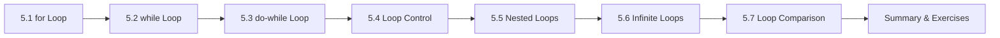

# Chapter 5: Loops (Comprehensive)

> **Previous:** [Control Flow](./04-control-flow.md) | **Next:** [Arrays](./06-arrays.md)

## Learning Objectives

- Write iterative code using `for`, `while`, and `do-while` loops
- Choose the appropriate loop construct for a given problem
- Control loop execution with `break`, `continue`, and `goto`
- Construct nested loops and analyze their complexity
- Avoid common loop errors including off-by-one and infinite loops
- Understand infinite loop use cases in embedded and event-driven systems

<!-- Image Gallery -->
<section class="lesson-visuals" aria-label="Visual learning resources">
  <header><span>VISUAL LEARNING</span><h2>See it. Review it. Remember it.</h2></header>
  <a class="lesson-visual-card" href="../../../assets/images/lessons/c-programming/05-loops/.png" target="_blank" rel="noopener">
    
    <span><strong>Handwritten notes</strong>Condensed notes for deliberate review.</span>
  </a>
  <a class="lesson-visual-card" href="../../../assets/images/lessons/c-programming/05-loops/.png" target="_blank" rel="noopener">
    
    <span><strong>Sticky-note revision</strong>Fast recall prompts for revision.</span>
  </a>
  <a class="lesson-visual-card" href="../../../assets/images/lessons/c-programming/05-loops/.png" target="_blank" rel="noopener">
    
    <span><strong>Visual concept guide</strong>A connected explanation of the key ideas.</span>
  </a>
</section>
<!-- End Image Gallery -->


### Chapter at a Glance


| Topic | Key Insight | Practical Takeaway |
|-------|-------------|-------------------|
| for Loop | Iterate with init, condition, and increment in one line | Use `for` when the number of iterations is known |
| while Loop | Repeat while a condition holds | Use `while` when iterating until a condition changes |
| do-while Loop | Executes body at least once before checking condition | Use when the body must run before the first check |
| break, continue, goto | `break` exits the loop; `continue` skips an iteration; `goto` jumps anywhere | `break` exits the innermost loop only |
| Nested Loops | Loops inside loops for multi-dimensional traversal | Inner loops reset completely on each outer iteration |
| Infinite Loops | Loops that run indefinitely | `while(1)` is idiomatic for embedded event loops |



---

## 5.1 The `for` Loop

### Real-World Analogy


A `for` loop is like running laps around a track: you know exactly how many laps you need to run before you start. The coach says "run 5 laps" — you initialize your lap counter to 0, check if you've reached 5, run one lap, increment the counter, and repeat until done.

| Step | Track Analogy | Code Equivalent |
|------|--------------|-----------------|
| 1 | Start at lap counter = 0 | `int lap = 0;` |
| 2 | Check if lap count &lt; 5 | `lap < 5` |
| 3 | Run one lap | `printf("Lap %d\n", lap);` |
| 4 | Increment lap counter | `lap++` |
| 5 | Go back to step 2 | (automatic in for loop) |

### Syntax


```c
for (initialization; condition; update) {
    /* loop body */
}
```

### Numbered Execution Steps


1. **Initialization** runs once before the loop begins.
2. **Condition** is evaluated _before_ each iteration. If false (zero), the loop exits.
3. **Loop body** executes if the condition is true (non-zero).
4. **Update** runs _after_ each iteration, then go to step 2.

### Pseudocode


```
INPUT n
SET i = 0
WHILE i < n:
    PRINT i
    i = i + 1
END WHILE
```

### Dry Run Trace Table


**Code:**
```c
int sum = 0;
for (int i = 1; i <= 3; i++) {
    sum = sum + i;
}
```

**Trace Table:**

| Iteration | i (before check) | condition `i <= 3` | sum (after body) | i++ (after update) |
|-----------|-----------------|--------------------|------------------|--------------------|
| 1 (init)  | (init: i = 1)   | true (enter)       | sum = 0 + 1 = 1 | i becomes 2 |
| 2         | 2               | true (enter)       | sum = 1 + 2 = 3 | i becomes 3 |
| 3         | 3               | true (enter)       | sum = 3 + 3 = 6 | i becomes 4 |
| 4         | 4               | **false (exit)**   | —                | — |

**Final:** sum = 6, loop executed 3 times.

### C Code Examples


**Example 1: Counting 1 to 5**
```c
#include <stdio.h>

int main(void) {
    for (int i = 1; i <= 5; i++) {
        printf("%d ", i);
    }
    printf("\n");
    return 0;
}
```

**Output:**
```
1 2 3 4 5
```

**Example 2: Decrementing loop**
```c
#include <stdio.h>

int main(void) {
    for (int i = 10; i >= 1; i--) {
        printf("%d ", i);
    }
    printf("\n");
    return 0;
}
```

**Output:**
```
10 9 8 7 6 5 4 3 2 1
```

**Example 3: Stepping by 2**
```c
#include <stdio.h>

int main(void) {
    for (int i = 0; i <= 10; i += 2) {
        printf("%d ", i);
    }
    printf("\n");
    return 0;
}
```

**Output:**
```
0 2 4 6 8 10
```

**Example 4: Multiple variables**
```c
#include <stdio.h>

int main(void) {
    for (int i = 0, j = 10; i < j; i++, j--) {
        printf("i=%d j=%d\n", i, j);
    }
    return 0;
}
```

**Output:**
```
i=0 j=10
i=1 j=9
i=2 j=8
i=3 j=7
i=4 j=6
```

**Example 5: Empty initialization (variable already set)**
```c
#include <stdio.h>

int main(void) {
    int i = 5;
    for (; i > 0; i--) {
        printf("%d ", i);
    }
    printf("\n");
    return 0;
}
```

**Output:**
```
5 4 3 2 1
```

**Example 6: Empty condition (infinite loop with break)**
```c
#include <stdio.h>

int main(void) {
    int i = 0;
    for (;;) {
        if (i >= 5) break;
        printf("%d ", i);
        i++;
    }
    printf("\n");
    return 0;
}
```

**Output:**
```
0 1 2 3 4
```

### Complexity Analysis


- **Time:** O(n) — the loop body executes n times. Each iteration does O(1) work.
- **Space:** O(1) — only a single loop counter variable is needed.

**Why O(n)?** The number of iterations is directly proportional to the loop bound. If the bound doubles, runtime doubles. This is linear time because each iteration introduces constant overhead (condition check, update, body execution). The total work = n × (cost of condition + cost of body + cost of update).

### Advantages & Disadvantages


| Advantages | Disadvantages |
|-----------|--------------|
| Compact — init, condition, update in one line | Can be overkill for simple conditions |
| Self-documenting iteration count | Complex expressions hurt readability |
| Loop variable scoped to loop (C99+) | Cannot easily skip or rearrange clauses |
| Ideal for array traversal | Not suitable for unknown iteration counts |
| Multiple variables supported | — |

### Edge Cases


| Edge Case | Code | Behavior | Explanation |
|-----------|------|----------|-------------|
| **Zero iterations** | `for (int i = 0; i < 0; i++)` | Body never executes | Condition false on first check |
| **Off-by-one (too few)** | `for (int i = 0; i < n; i++)` vs `i <= n-1` | Runs n times | Using `< n` gives n iterations starting from 0 |
| **Off-by-one (too many)** | `for (int i = 0; i <= n; i++)` | Runs n+1 times | Using `<= n` gives one extra iteration |
| **Infinite (wrong direction)** | `for (int i = 0; i < 10; i--)` | Never terminates | Decrementing when condition expects increment |
| **Empty body** | `for (int i = 0; i < 5; i++);` | Runs 5 times with no work | Semicolon creates empty statement |
| **Condition side effect** | `for (int i = 0; i++ < 5;)` | Runs 6 times? | Post-increment in condition modifies i |
| **Float counter** | `for (float f = 0; f != 1.0; f += 0.1)` | May never terminate | Floating-point precision causes drift |

---

## 5.2 The `while` Loop

### Real-World Analogy


A `while` loop is like checking your phone for a ride arrival: "While the Uber has not arrived, keep checking." You don't know how many times you'll check — you keep doing it until the condition (arrival) changes.

### Syntax


```c
while (condition) {
    /* loop body */
}
```

### Numbered Execution Steps


1. Evaluate the condition.
2. If the condition is true (non-zero), execute the loop body.
3. After the body, go back to step 1.
4. If the condition is false (zero), exit the loop.

### Pseudocode


```
INPUT n
WHILE n > 0:
    PRINT n
    n = n - 1
END WHILE
```

### Dry Run Trace Table


**Code:**
```c
int n = 3;
while (n > 0) {
    printf("%d ", n);
    n--;
}
```

**Trace Table:**

| Iteration | n (before check) | condition `n > 0` | body executes? | n (after n--) |
|-----------|------------------|-------------------|----------------|---------------|
| 1         | 3                | true              | Print 3        | 2             |
| 2         | 2                | true              | Print 2        | 1             |
| 3         | 1                | true              | Print 1        | 0             |
| (exit)    | 0                | **false**         | no             | —             |

**Final:** Output: "3 2 1 ", 3 iterations.

### C Code Examples


**Example 1: Countdown**
```c
#include <stdio.h>

int main(void) {
    int count = 5;
    while (count >= 1) {
        printf("%d ", count);
        count--;
    }
    printf("Liftoff!\n");
    return 0;
}
```

**Output:**
```
5 4 3 2 1 Liftoff!
```

**Example 2: Reading until EOF**
```c
#include <stdio.h>

int main(void) {
    int ch;
    int line_count = 0;
    while ((ch = getchar()) != EOF) {
        if (ch == '\n') line_count++;
    }
    printf("Line count: %d\n", line_count);
    return 0;
}
```

**Example 3: Sum of digits**
```c
#include <stdio.h>

int main(void) {
    int num = 1234;
    int sum = 0;
    while (num > 0) {
        sum += num % 10;
        num /= 10;
    }
    printf("Sum of digits: %d\n", sum);
    return 0;
}
```

**Output:**
```
Sum of digits: 10
```

**Example 4: Linked list traversal**
```c
#include <stdio.h>

struct Node {
    int data;
    struct Node *next;
};

void printList(struct Node *head) {
    while (head != NULL) {
        printf("%d -> ", head->data);
        head = head->next;
    }
    printf("NULL\n");
}
```

**Example 5: Power calculation**
```c
#include <stdio.h>

int main(void) {
    int base = 2, exp = 5;
    int result = 1;
    while (exp > 0) {
        result *= base;
        exp--;
    }
    printf("2^5 = %d\n", result);
    return 0;
}
```

**Output:**
```
2^5 = 32
```

### Complexity Analysis


- **Time:** O(n) — the loop runs as many times as the condition allows, typically proportional to input size n.
- **Space:** O(1) — no extra space proportional to input.

**Why O(n)?** Each iteration processes one element of input (one digit, one character, one node). The number of iterations equals the number of elements to process. The condition evaluation and body together do constant work per iteration.

### Advantages & Disadvantages


| Advantages | Disadvantages |
|-----------|--------------|
| Best for unknown iteration counts | Easier to create infinite loops |
| Clean for I/O and sentinel patterns | Update variable can be forgotten |
| One condition, no boilerplate | More verbose than `for` for counted loops |
| Natural for pointer/iterator traversal | Update logic can be scattered in body |
| Easier to read for state-driven loops | — |

### Edge Cases


| Edge Case | Code | Behavior | Explanation |
|-----------|------|----------|-------------|
| **Condition false initially** | `while (0) { ... }` | Body never executes | Condition checked before first iteration |
| **Missing update** | `int i = 0; while (i < 5) { }` | Infinite loop | i never changes |
| **Semicolon after condition** | `while (i < 5); { i++; }` | Empty body infinite loop | Loop body is `;`, block is outside |
| **Side-effect condition** | `while (i++ < 5)` | Post-increment in condition | Condition uses and then increments i |
| **Assignment vs equality** | `while (x = 5)` | Always true (non-zero) | Assignment `=` instead of comparison `==` |
| **Empty body style** | `while (*p++ != '\0');` | Advances pointer | Useful idiom for finding string end |

---

## 5.3 The `do-while` Loop

### Real-World Analogy


A `do-while` loop is like ordering at a restaurant: "Here is the menu — order your food, then we'll ask if you want to order more." You always order at least once, then decide if you want more after each order.

### Syntax


```c
do {
    /* loop body */
} while (condition);   /* <-- note the semicolon! */
```

### Numbered Execution Steps


1. Execute the loop body once.
2. After the body, evaluate the condition.
3. If the condition is true (non-zero), go back to step 1.
4. If false (zero), exit.

### Pseudocode


```
REPEAT:
    PROMPT user for input
    PROCESS input
UNTIL input == quit_signal
```

### Dry Run Trace Table


**Code:**
```c
int num;
int sum = 0;
do {
    printf("Enter number (0 to quit): ");
    scanf("%d", &num);
    sum += num;
} while (num != 0);
```

**Trace Table (user enters 5, 3, 0):**

| Iteration | num (before body) | sum (after body) | condition `num != 0` |
|-----------|-------------------|------------------|----------------------|
| 1         | (uninitialized)   | 0 + 5 = 5        | true (5 != 0) |
| 2         | 5                 | 5 + 3 = 8        | true (3 != 0) |
| 3         | 3                 | 8 + 0 = 8        | **false** (0 == 0, exit) |

**Final:** sum = 8, 3 iterations. Note: the 0 is still added to sum before the condition rejects it.

### C Code Examples


**Example 1: Menu-driven program**
```c
#include <stdio.h>

int main(void) {
    int choice;
    do {
        printf("\nMenu:\n");
        printf("1. Add\n");
        printf("2. Subtract\n");
        printf("3. Quit\n");
        printf("Enter choice: ");
        scanf("%d", &choice);

        switch (choice) {
            case 1: printf("Adding...\n"); break;
            case 2: printf("Subtracting...\n"); break;
            case 3: printf("Goodbye!\n"); break;
            default: printf("Invalid choice.\n");
        }
    } while (choice != 3);
    return 0;
}
```

**Example 2: Number guessing game**
```c
#include <stdio.h>

int main(void) {
    int secret = 42;
    int guess;
    do {
        printf("Guess the number: ");
        scanf("%d", &guess);
        if (guess < secret)
            printf("Too low!\n");
        else if (guess > secret)
            printf("Too high!\n");
    } while (guess != secret);
    printf("Correct!\n");
    return 0;
}
```

**Example 3: Input validation**
```c
#include <stdio.h>

int main(void) {
    int age;
    do {
        printf("Enter your age (0-150): ");
        scanf("%d", &age);
    } while (age < 0 || age > 150);
    printf("Age %d accepted.\n", age);
    return 0;
}
```

**Output (user enters -5, 200, 25):**
```
Enter your age (0-150): -5
Enter your age (0-150): 200
Enter your age (0-150): 25
Age 25 accepted.
```

**Example 4: Reversing digits of a number**
```c
#include <stdio.h>

int main(void) {
    int num = 1234;
    int reversed = 0;
    do {
        reversed = reversed * 10 + num % 10;
        num /= 10;
    } while (num > 0);
    printf("Reversed: %d\n", reversed);
    return 0;
}
```

**Output:**
```
Reversed: 4321
```

### Complexity Analysis


- **Time:** O(n) — the body executes n times (at least once). Each iteration is O(1).
- **Space:** O(1) — only loop variables and input.

**Why O(n)?** The `do-while` has the same time complexity class as `while`. The "at least once" guarantee does not change the asymptotic behavior — it only shifts the minimum from 0 to 1. For large n, the +1 is negligible.

### Advantages & Disadvantages


| Advantages | Disadvantages |
|-----------|--------------|
| Guarantees at least one execution | Less common, can confuse readers |
| Natural for menu/input validation | Condition at bottom is less visible |
| Cleaner than flag-then-while patterns | Body always runs even if condition would be false |
| Avoids duplicate code before loop | Semicolon required after condition (easy to forget) |

### Edge Cases


| Edge Case | Code | Behavior | Explanation |
|-----------|------|----------|-------------|
| **Condition always false** | `do { ... } while (0);` | Body executes exactly once | Condition checked after body |
| **Missing semicolon** | `do { ... } while (cond)` | Compiler error | `while(cond);` requires trailing semicolon |
| **Zero iterations** | N/A | Minimum is 1 | `do-while` always runs at least once |
| **Side-effect condition** | `do { } while (x++ < 5);` | x increments in condition | Evaluated after each body execution |
| **Infinite** | `do { } while (1);` | Never terminates | Condition always true |

---

## 5.4 Loop Control: `break`, `continue`, and `goto`

### 5.4.1 `break`


**Real-world analogy:** You're searching a bookshelf for a specific book. "Break" means you stop searching as soon as you find it — no need to check the remaining books.

**Behavior:** Exits the innermost loop (or `switch`) immediately. Control transfers to the statement after the loop.

#### Dry Run Trace Table

**Code:**
```c
for (int i = 1; i <= 10; i++) {
    if (i == 5) break;
    printf("%d ", i);
}
```

**Trace Table:**

| Iteration | i | condition `i == 5` | Print | Action |
|-----------|---|-------------------|-------|--------|
| 1         | 1 | false             | "1 "  | continue |
| 2         | 2 | false             | "2 "  | continue |
| 3         | 3 | false             | "3 "  | continue |
| 4         | 4 | false             | "4 "  | continue |
| 5         | 5 | **true**          | —     | break (exit loop) |

**Final output:** `1 2 3 4 `

#### C Examples

**Example 1: Early exit on found**
```c
#include <stdio.h>

int main(void) {
    int arr[] = {3, 7, 1, 9, 4, 6, 8};
    int target = 9;
    int found = -1;
    int n = sizeof(arr) / sizeof(arr[0]);

    for (int i = 0; i < n; i++) {
        if (arr[i] == target) {
            found = i;
            break;
        }
    }

    if (found != -1)
        printf("Found %d at index %d\n", target, found);
    else
        printf("Not found\n");
    return 0;
}
```

**Output:**
```
Found 9 at index 3
```

**Example 2: break in nested loops (breaks only innermost)**
```c
#include <stdio.h>

int main(void) {
    for (int i = 1; i <= 3; i++) {
        for (int j = 1; j <= 3; j++) {
            if (i == 2 && j == 2) break;
            printf("(%d,%d) ", i, j);
        }
        printf("\n");
    }
    return 0;
}
```

**Output:**
```
(1,1) (1,2) (1,3)
(2,1)
(3,1) (3,2) (3,3)
```

Only the inner loop breaks when `i==2 && j==2`. The outer loop continues normally.

### 5.4.2 `continue`


**Real-world analogy:** You're checking items off a shopping list. If an item is out of stock, you skip it and move to the next item — you don't abandon the entire trip.

**Behavior:** Skips the rest of the current iteration and proceeds to the next iteration (condition check for `while`/`do-while`, update step for `for`).

#### Dry Run Trace Table

**Code:**
```c
for (int i = 1; i <= 5; i++) {
    if (i % 2 == 0) continue;
    printf("%d ", i);
}
```

**Trace Table (for loop behavior):**

| Iteration | i (before check) | i % 2 == 0? | Action | i++ after |
|-----------|-----------------|-------------|--------|-----------|
| 1         | 1               | false       | Print "1 " | 2 |
| 2         | 2               | **true**    | continue (skip print, go to i++) | 3 |
| 3         | 3               | false       | Print "3 " | 4 |
| 4         | 4               | **true**    | continue | 5 |
| 5         | 5               | false       | Print "5 " | 6 |
| (exit)    | 6               | false (6 &lt;= 5 false) | — | — |

**Final output:** `1 3 5 `

#### C Examples

**Example 1: Skip multiples of 3**
```c
#include <stdio.h>

int main(void) {
    for (int i = 1; i <= 10; i++) {
        if (i % 3 == 0) continue;
        printf("%d ", i);
    }
    printf("\n");
    return 0;
}
```

**Output:**
```
1 2 4 5 7 8 10
```

**Example 2: continue in while loop — update BEFORE continue**
```c
#include <stdio.h>

int main(void) {
    int i = 0;
    while (i < 10) {
        if (i % 2 == 0) {
            i++;       /* update BEFORE continue! */
            continue;
        }
        printf("%d ", i);
        i++;
    }
    printf("\n");
    return 0;
}
```

**Output:**
```
1 3 5 7 9
```

**Important:** In `while` loops, if you skip the update with `continue`, you get an infinite loop.

#### continue in for vs while

| Aspect | for loop | while loop |
|--------|----------|------------|
| After continue | Update clause runs automatically | Must manually update before continue |
| Infinite loop risk | Low (update in header) | High (update can be skipped) |
| Idiomatic use | Skip values freely | Update before continue is a pattern |

### 5.4.3 `goto`


**Real-world analogy:** An emergency exit in a building — you use it only in exceptional circumstances to get out immediately, not for normal traffic flow.

**Behavior:** Unconditionally jumps to a labeled statement in the same function.

```c
goto label;
...
label:
    /* code */
```

#### C Example: Breaking out of nested loops

```c
#include <stdio.h>

int main(void) {
    int matrix[3][3] = {
        {1, 2, 3},
        {4, 5, 6},
        {7, 8, 9}
    };
    int target = 5;
    int found_i = -1, found_j = -1;

    for (int i = 0; i < 3; i++) {
        for (int j = 0; j < 3; j++) {
            if (matrix[i][j] == target) {
                found_i = i;
                found_j = j;
                goto found;   /* exits ALL loops at once */
            }
        }
    }

found:
    if (found_i != -1)
        printf("Found %d at [%d][%d]\n", target, found_i, found_j);
    else
        printf("Not found\n");
    return 0;
}
```

**Output:**
```
Found 5 at [1][1]
```

`break` only exits the innermost loop. To exit multiple levels of nesting, `goto` is the cleanest C solution (other options are flags or refactoring into a function).

### 5.4.4 `break` vs `continue` vs `goto` Comparison


| Feature | `break` | `continue` | `goto` |
|---------|---------|------------|--------|
| Effect | Exits innermost loop/switch | Skips to next iteration | Jumps to arbitrary label |
| Scope | Current loop only | Current iteration only | Anywhere in function |
| Nested loops | Exits only innermost | Skips only innermost | Can exit ALL levels |
| Readability | High | High | Low (spaghetti code risk) |
| Use cases | Early exit on found | Skipping values | Breaking deep nesting, error cleanup |
| Can jump into loop? | No | No | Yes (dangerous) |
| Can jump out of loop? | Yes (one level) | No | Yes (any depth) |
| Recommended? | Yes | Yes | Rarely (only for deep break or cleanup) |
| Effect on update | None (exit immediately) | Runs update (for) or checks condition (while) | None (jump bypasses everything) |

---

## 5.5 Nested Loops

### Real-World Analogy


A clock: the minute hand (inner loop) completes 60 ticks for each tick of the hour hand (outer loop). If you print a schedule, for each student (outer) you print all their courses (inner).

### Syntax Pattern


```c
for (outer initialization; outer condition; outer update) {
    for (inner initialization; inner condition; inner update) {
        /* inner body */
    }
}
```

### Numbered Execution Steps


1. Outer loop initialization (once).
2. Outer condition check — if false, exit entirely.
3. Inner loop initialization.
4. Inner condition check — if false, go to step 7.
5. Execute inner body.
6. Inner update, go to step 4.
7. Outer update, go to step 2.

### Pseudocode


```
FOR i = 1 TO n:
    FOR j = 1 TO m:
        PRINT i, j
    NEXT j
    PRINT newline
NEXT i
```

### Dry Run Trace Table


**Code:**
```c
for (int i = 1; i <= 3; i++) {
    for (int j = 1; j <= 2; j++) {
        printf("(%d,%d) ", i, j);
    }
    printf("\n");
}
```

**Trace Table:**

| Outer i | Inner j init | i loop condition | j loop condition | Print | After inner update | After outer update |
|---------|-------------|-----------------|------------------|-------|-------------------|-------------------|
| 1       | j = 1       | true (enter)    | true             | (1,1) | j = 2             | — |
| 1       | —           | —               | true             | (1,2) | j = 3             | — |
| 1       | —           | —               | **false** (exit inner) | — | — | i = 2 |
| 2       | j = 1       | true (enter)    | true             | (2,1) | j = 2             | — |
| 2       | —           | —               | true             | (2,2) | j = 3             | — |
| 2       | —           | —               | **false** (exit inner) | — | — | i = 3 |
| 3       | j = 1       | true (enter)    | true             | (3,1) | j = 2             | — |
| 3       | —           | —               | true             | (3,2) | j = 3             | — |
| 3       | —           | —               | **false** (exit inner) | — | — | i = 4 |
| (exit)  | —           | **false** (i=4, 4 &lt;= 3 false) | — | — | — | — |

**Output:**
```
(1,1) (1,2)
(2,1) (2,2)
(3,1) (3,2)
```

Total iterations: 3 (outer) x 2 (inner) = 6.

### C Code Examples


**Example 1: Multiplication table**
```c
#include <stdio.h>

int main(void) {
    for (int i = 1; i <= 10; i++) {
        for (int j = 1; j <= 10; j++) {
            printf("%4d", i * j);
        }
        printf("\n");
    }
    return 0;
}
```

**Output (first few rows):**
```
   1   2   3   4   5   6   7   8   9  10
   2   4   6   8  10  12  14  16  18  20
   3   6   9  12  15  18  21  24  27  30
...
  10  20  30  40  50  60  70  80  90 100
```

**Example 2: Triangle pattern (dependent inner bound)**
```c
#include <stdio.h>

int main(void) {
    int n = 5;
    for (int i = 1; i <= n; i++) {
        for (int j = 1; j <= i; j++) {
            printf("* ");
        }
        printf("\n");
    }
    return 0;
}
```

**Output:**
```
*
* *
* * *
* * * *
* * * * *
```

**Example 3: Matrix addition (parallel nested loops)**
```c
#include <stdio.h>

int main(void) {
    int a[2][2] = {{1,2},{3,4}};
    int b[2][2] = {{5,6},{7,8}};
    int c[2][2];

    for (int i = 0; i < 2; i++) {
        for (int j = 0; j < 2; j++) {
            c[i][j] = a[i][j] + b[i][j];
            printf("%4d", c[i][j]);
        }
        printf("\n");
    }
    return 0;
}
```

**Output:**
```
   6   8
  10  12
```

**Example 4: Printing a rectangle**
```c
#include <stdio.h>

int main(void) {
    int rows = 4, cols = 6;
    for (int i = 0; i < rows; i++) {
        for (int j = 0; j < cols; j++) {
            printf("# ");
        }
        printf("\n");
    }
    return 0;
}
```

**Output:**
```
# # # # # #
# # # # # #
# # # # # #
# # # # # #
```

### Complexity Analysis of Nested Loops


| Nesting Depth | Pattern | Time Complexity | Space | Example |
|--------------|---------|-----------------|-------|---------|
| 2 levels, independent | `for i in 0..n: for j in 0..m:` | O(n × m) | O(1) | Matrix traversal |
| 2 levels, dependent | `for i in 0..n: for j in 0..i:` | O(n²) | O(1) | Triangle pattern |
| 2 levels, equal bounds | `for i in 0..n: for j in 0..n:` | O(n²) | O(1) | Multiplication table |
| 3 levels, equal bounds | `for i in 0..n: for j in 0..n: for k in 0..n:` | O(n³) | O(1) | Matrix multiplication |
| 2 levels, data-dependent | `for each node: for each neighbor:` | O(n × d) | O(1) | Graph adjacency |

**Why O(n²) for double nested?** If outer runs n times and inner runs m times, total operations = n × m. When n == m, this is n². Doubling n quadruples the work.

### Why Dependent Inner Loops Are Still O(n²)


For `for (i=0; i<n; i++) for (j=0; j<i; j++)`:
- Total iterations = 0 + 1 + 2 + ... + (n-1) = n(n-1)/2
- This is (n² - n)/2 → O(n²)

The constant factor (×½) doesn't change the complexity class. For n = 1000, n²/2 = 500,000 vs n² = 1,000,000 — both are O(n²).

### Advantages & Disadvantages


| Advantages | Disadvantages |
|-----------|--------------|
| Natural for multi-dimensional data processing | Complexity grows multiplicatively |
| Powerful for patterns and geometric output | Hard to debug (many iterations) |
| Cleaner than flattening into single loop | `break` only exits one level |
| Flexible inner loop bounds (can depend on outer) | Cache performance issues (row vs column access) |

### Edge Cases


| Edge Case | Behavior |
|-----------|----------|
| Empty outer loop body | Inner loop never runs (outer condition false from start) |
| Empty inner loop bound | Inner loop never runs (e.g., j &lt; 0) |
| Break inside inner | Exits only inner; outer continues unaffected |
| Continue inside inner | Skips to next inner iteration (not outer) |
| Outer i, inner uses i | Inner loop depends on outer value — dynamic bound |
| Modifying outer variable inside inner | Changes outer loop behavior (usually a bug) |

---

## 5.6 Infinite Loops

### Real-World Analogy


A traffic light controller in an intersection runs forever: "While the system is powered on, cycle through red → green → yellow." The loop never stops because the system must never stop.

### Intentional Infinite Loops


**Embedded systems main loop:**
```c
#include <stdio.h>

void read_sensors(void) { /* ... */ }
void process_data(void) { /* ... */ }
void send_output(void) { /* ... */ }
void delay(int ms) { /* ... */ }

int main(void) {
    while (1) {
        read_sensors();
        process_data();
        send_output();
        delay(100);   /* prevent 100% CPU */
    }
    return 0;  /* never reached */
}
```

**Event-driven server:**
```c
#include <stdio.h>

typedef void (*handler_t)(void);

int main(void) {
    for (;;) {
        int event = wait_for_event();
        handler_t h = get_handler(event);
        h();
    }
    return 0;
}
```

**Polling loop (hardware register):**
```c
/* Wait until hardware sets READY bit */
#define REGISTER   (*(volatile int *)0x40001000)
#define READY_MASK 0x01

void wait_ready(void) {
    while (!(REGISTER & READY_MASK))
        ;   /* spin */
}
```

**OS idle loop:**
```c
void idle_task(void) {
    while (1) {
        halt_cpu();   /* put CPU to sleep until interrupt */
    }
}
```

### Unintentional Infinite Loops (Bugs)


**Bug 1: Semicolon after condition**
```c
int i = 0;
while (i < 10);   /* <-- empty body loop */
{
    printf("%d\n", i);
    i++;
}
```

The block `{...}` is not part of the loop. The loop body is the empty statement `;`. This runs forever because `i` never changes.

**Bug 2: Missing update**
```c
int i = 0;
while (i < 10) {
    printf("%d\n", i);
    /* forgot i++; */
}
```

**Bug 3: Wrong update direction**
```c
int i = 10;
while (i > 0) {
    printf("%d\n", i);
    i++;   /* should be i-- */
}
```

**Bug 4: Assignment instead of comparison**
```c
int done = 0;
while (done = 0) {   /* assigns 0, which is false — loop NEVER runs */
    /* ... */
}
```

This is actually the opposite problem: the loop never runs because `done = 0` evaluates to 0 (false). The intended code was `while (done == 0)`.

**Bug 5: Float comparison**
```c
for (float f = 0.0; f != 1.0; f += 0.1) {
    /* may never exit due to floating-point precision */
}
```

0.1 cannot be represented exactly in binary floating-point. After many additions, the accumulated error may cause `f` to skip past 1.0, or never land exactly on it.

**Bug 6: continue before update in while**
```c
int i = 0;
while (i < 10) {
    if (i % 2 == 0) continue;  /* skips i++ */
    i++;
}
```

### Infinite Loop Use Cases


| Use Case | Pattern | Example |
|----------|---------|---------|
| Embedded firmware | `while (1) { ... }` | Microcontroller main loop |
| Server event loop | `for (;;) { accept(); }` | Web server, game server |
| Polling hardware | `while (!(reg & FLAG));` | Wait for DMA completion |
| OS idle loop | `while (1) { halt_cpu(); }` | CPU idle task |
| Interactive shell (REPL) | `do { read(); eval(); } while (1);` | Python shell, CLI |
| Animation loop | `while (1) { render(); sleep(16); }` | Game loop (60 FPS) |

### How to Stop Infinite Loops


| Method | Mechanism |
|--------|-----------|
| `break` | Exit loop from inside |
| `return` | Exit the entire function |
| `exit()` | Terminate the program |
| Ctrl+C (SIGINT) | Kill process from terminal |
| Guard variable | `while (!quit) { if (input == 'q') quit = 1; }` |

### Well-Designed Infinite Loop with Exit Path


```c
#include <stdio.h>
#include <stdbool.h>

int main(void) {
    bool running = true;
    while (running) {
        char cmd = getchar();
        switch (cmd) {
            case 'q':
            case 'Q':
                running = false;
                break;
            case 'h':
                printf("Help: press q to quit\n");
                break;
            default:
                printf("You pressed: %c\n", cmd);
        }
    }
    return 0;
}
```

---

## 5.7 Loop Comparison

### 5.7.1 `for` vs `while` vs `do-while` Comparison


| Criteria | `for` | `while` | `do-while` |
|----------|-------|---------|------------|
| Condition check | Entry-controlled | Entry-controlled | Exit-controlled |
| Minimum executions | 0 | 0 | 1 |
| Known iteration count | Best suited | Less natural | Rarely used |
| Reading input | Awkward | Natural | Natural |
| Sentinel loop | Awkward | Natural | Natural |
| Single line header | Yes (init, cond, update) | No (cond only) | No (cond only at bottom) |
| Update visibility | Top (in header) | Anywhere in body | Anywhere in body |
| Scope of counter | Loop-local (C99+) | External scope | External scope |
| Infinite loop idiom | `for (;;)` | `while (1)` | `do { } while (1);` |
| Break behavior | Works as expected | Works as expected | Works as expected |
| Continue behavior | Runs update, then checks condition | Jumps to condition check | Jumps to condition check |

### 5.7.2 Entry-Controlled vs Exit-Controlled


| Feature | Entry-Controlled (`for`, `while`) | Exit-Controlled (`do-while`) |
|---------|-----------------------------------|------------------------------|
| Condition checked | Before each iteration | After each iteration |
| If condition is false initially | Body runs 0 times | Body runs 1 time |
| Typical use | Pre-check necessary before work | Body must execute before check |
| Risk | May skip body when it shouldn't | May run body when it shouldn't |
| Examples | Iterating arrays, reading formatted files | Menu display, input validation |

### 5.7.3 Loop Selection Guide


| When to use | Construct |
|-------------|-----------|
| Known number of iterations | `for` |
| Unknown iterations, condition before | `while` |
| Must execute at least once | `do-while` |
| Iterating over an array by index | `for` with index |
| Iterating over a linked list | `while (ptr != NULL)` |
| Reading until EOF | `while ((c = getchar()) != EOF)` |
| Embedded event loop | `while (1)` or `for (;;)` |
| Menu-driven program | `do-while` |
| Need to exit deep nesting | `goto` (only for this case) |

### 5.7.4 Complexity Comparison


| Loop | Time Complexity | Space Complexity | Best Case | Worst Case |
|------|----------------|-----------------|-----------|-----------|
| `for (i=0; i<n; i++)` | O(n) | O(1) | 1 iteration (with break) | n iterations |
| `while (p != NULL)` | O(n) | O(1) | 1 iteration | n iterations (list length) |
| `do { } while (cond)` | O(n) | O(1) | 1 iteration | n iterations |
| Nested (2-level equal) | O(n²) | O(1) | Depends on break | n² iterations |

**Why space is O(1) for all:** No auxiliary data structure grows with input size. Only scalar variables (counters, accumulators) are allocated on the stack.

---

## 5.8 Common Loop Patterns

### Summation

```c
int sum = 0;
for (int i = 1; i <= n; i++) {
    sum += i;
}
```

### Factorial

```c
int fact = 1;
for (int i = 1; i <= n; i++) {
    fact *= i;
}
```

### Counting

```c
int positive_count = 0;
for (int i = 0; i < size; i++) {
    if (arr[i] > 0) {
        positive_count++;
    }
}
```

### Searching (linear search)

```c
int found_index = -1;
for (int i = 0; i < size; i++) {
    if (arr[i] == target) {
        found_index = i;
        break;
    }
}
```

### Finding maximum

```c
int max = arr[0];
for (int i = 1; i < size; i++) {
    if (arr[i] > max) {
        max = arr[i];
    }
}
```

### Input Validation Loop

```c
int age;
do {
    printf("Enter age (0-150): ");
    scanf("%d", &age);
} while (age < 0 || age > 150);
```

### Sentinel-controlled loop

```c
int sum = 0;
int val;
while (1) {
    printf("Enter value (-1 to quit): ");
    scanf("%d", &val);
    if (val == -1) break;
    sum += val;
}
```

### Flag-controlled loop

```c
int found = 0;
int i = 0;
while (!found && i < n) {
    if (arr[i] == target) found = 1;
    else i++;
}
```

### Pointer iteration

```c
char *p = str;
while (*p != '\0') {
    *p = toupper(*p);
    p++;
}
```

### Fibonacci sequence

```c
int a = 0, b = 1, next;
for (int i = 0; i < n; i++) {
    printf("%d ", a);
    next = a + b;
    a = b;
    b = next;
}
```

### GCD using Euclid's algorithm

```c
int a = 48, b = 18;
while (b != 0) {
    int temp = b;
    b = a % b;
    a = temp;
}
printf("GCD = %d\n", a);
```

**Output:**
```
GCD = 6
```

---

## 5.9 Interview Corner

### Q1: What is the difference between `for` and `while` in C?


**Answer:** The `for` loop consolidates initialization, condition, and update into a single line, making it ideal for counted iteration where the number of iterations is known. The `while` loop separates the condition from the update logic, making it better for state-driven loops (reading input, waiting for a condition, traversing linked lists). Both are entry-controlled and can be used interchangeably with a flag variable, but `for` is more readable for index-based iteration and `while` is more readable for condition-only repetition.

### Q2: Which loop should you use when?


| Scenario | Loop | Why |
|----------|------|-----|
| Print numbers 1 to 100 | `for` | Known iteration count |
| Read file until EOF | `while` | Unknown iterations, condition-driven |
| Display menu once, then loop | `do-while` | Must display at least once |
| Traverse a linked list | `while` | Until NULL pointer |
| Wait for hardware interrupt | `while(1)` (or `for(;;)`) | Must never stop |
| Process array of fixed size | `for` | Index with known bound |

### Q3: How do you write an idiomatic infinite loop in C?


```c
/* Most common */
while (1) {
    /* ... */
}

/* Also valid, less common */
for (;;) {
    /* ... */
}

/* Rare — do-while infinite */
do {
    /* ... */
} while (1);
```

`while (1)` is the most idiomatic. `for (;;)` is semantically identical. The compiler generates the same code for both.

### Q4: How can you optimize nested loops?


1. **Move invariant code out:** If an expression doesn't depend on the inner loop variable, hoist it to the outer loop.
   ```c
   /* Before */
   for (int i = 0; i < n; i++) {
       int factor = complex_calculation(); /* same every time */
       for (int j = 0; j < m; j++) {
           arr[i][j] *= factor;
       }
   }

   /* After */
   int factor = complex_calculation();
   for (int i = 0; i < n; i++) {
       for (int j = 0; j < m; j++) {
           arr[i][j] *= factor;
       }
   }
   ```

2. **Minimize inner loop work:** Move as much computation as possible to the outer loop.

3. **Use local variables:** Store frequently accessed values in local variables to reduce memory access.

4. **Switch loop order for cache efficiency:** Loop over arrays in memory order (row-major in C).
   ```c
   /* Cache-friendly: row-major access */
   for (int i = 0; i < n; i++)
       for (int j = 0; j < m; j++)
           sum += arr[i][j];   /* good */

   /* Cache-unfriendly: column-major access */
   for (int j = 0; j < m; j++)
       for (int i = 0; i < n; i++)
           sum += arr[i][j];   /* bad — striding over rows */
   ```

5. **Loop unrolling** (manual or compiler):
   ```c
   /* Instead of */
   for (int i = 0; i < 100; i++) {
       sum += arr[i];
   }

   /* Manual unrolling (factor of 4) */
   for (int i = 0; i < 100; i += 4) {
       sum += arr[i] + arr[i+1] + arr[i+2] + arr[i+3];
   }
   ```

### Q5: What is loop unrolling?


**Answer:** Loop unrolling is a compiler optimization (or manual technique) that reduces the overhead of loop control by executing multiple iterations' worth of work in a single pass. This reduces the number of condition checks and increment operations. The trade-off is larger code size. Modern compilers often do this automatically with optimization flags like `-O2` or `-O3`.

```c
/* Original */
for (int i = 0; i < 8; i++) {
    a[i] = b[i] * c[i];
}

/* Unrolled by 2 */
for (int i = 0; i < 8; i += 2) {
    a[i]   = b[i]   * c[i];
    a[i+1] = b[i+1] * c[i+1];
}
```

### Q6: How do you break out of multiple nested loops?


| Method | Code | Pros | Cons |
|--------|------|------|------|
| **goto** | `goto exit;` | Clean, single exit point | "goto considered harmful" stigma |
| **Flag variable** | `int done = 0;` then check in outer | Structured programming | Extra checks per iteration |
| **Function return** | `return` from helper function | Clean abstraction | Restructuring needed |
| **Longjmp** | `setjmp`/`longjmp` | Exits any depth | Very rarely appropriate |

**Recommendation:** Use `goto` for breaking deep nesting — it's the cleanest solution for this specific, well-understood case in C.

### Q7: What is the time complexity of three nested loops each running n times? Why O(n³)?


**Answer:** Three nested loops with equal bounds produce O(n³) complexity. Each level multiplies: outer runs n, middle runs n, inner runs n. Total iterations = n × n × n = n³. If n doubles, work increases 8×. This is cubic time.

---

## 5.10 Applications in Real Systems

### Embedded Microcontroller Main Loop (Super Loop)


```c
#include <stdio.h>

void init_hardware(void) { /* ... */ }
void read_sensors(void) { /* ... */ }
void process_data(void) { /* ... */ }
void update_actuators(void) { /* ... */ }
void software_delay(int ms) { /* ... */ }

int main(void) {
    init_hardware();

    while (1) {               /* Super Loop pattern */
        read_sensors();       /* Read all inputs */
        process_data();       /* Process and decide */
        update_actuators();   /* Write all outputs */
        software_delay(10);   /* 10ms delay */
    }

    return 0;
}
```

This "super loop" architecture is the foundation of countless embedded systems — microwaves, washing machines, thermostats, automotive controllers, IoT devices. The infinite `while(1)` is the core idiom.

### Event-Driven System


```c
#include <stdio.h>

typedef enum {
    EV_NONE,
    EV_KEYPRESS,
    EV_TIMER,
    EV_MOUSE
} Event;

Event get_event(void) { return EV_NONE; }
void handle_keypress(void) { /* ... */ }
void handle_timer(void) { /* ... */ }
void handle_mouse(void) { /* ... */ }
void idle_sleep(void) { /* ... */ }

int main(void) {
    while (1) {
        Event e = get_event();
        switch (e) {
            case EV_KEYPRESS: handle_keypress(); break;
            case EV_TIMER:    handle_timer();    break;
            case EV_MOUSE:    handle_mouse();    break;
            default:          idle_sleep();      break;
        }
    }
    return 0;
}
```

Used in GUI frameworks, game engines, network servers — any system where actions are triggered by external events.

### Finite State Machine Loop


```c
#include <stdio.h>

typedef enum { IDLE, ACTIVE, ERROR } State;

int input_available(void) { return 0; }
void process(void) { /* ... */ }
int error_detected(void) { return 0; }

int main(void) {
    State state = IDLE;

    while (state != ERROR) {
        switch (state) {
            case IDLE:
                printf("Idle...\n");
                if (input_available()) state = ACTIVE;
                break;
            case ACTIVE:
                printf("Processing...\n");
                process();
                if (error_detected()) state = ERROR;
                else state = IDLE;
                break;
            case ERROR:
                printf("Error state — exiting\n");
                break;
        }
    }
    return 0;
}
```

### Producer-Consumer Loop


```c
#include <stdio.h>

#define BUFFER_SIZE 10

int buffer[BUFFER_SIZE];
int count = 0;

void producer(void) {
    int data = 0;
    while (1) {
        while (count == BUFFER_SIZE);   /* busy-wait for space */
        buffer[count++] = data++;
        if (data > 100) break;
    }
}

void consumer(void) {
    while (1) {
        while (count == 0);             /* busy-wait for data */
        int data = buffer[--count];
        printf("Consumed: %d\n", data);
        if (count == 0) break;
    }
}
```

### Network Server Accept Loop


```c
#include <stdio.h>

typedef int socket_t;
socket_t accept_connection(socket_t srv) { return 0; }
void handle_client(socket_t client) { /* ... */ }

int main(void) {
    socket_t server_socket = create_server(8080);

    for (;;) {
        socket_t client = accept_connection(server_socket);
        handle_client(client);
    }

    return 0;
}
```

---

## 5.11 Common Mistakes and Debugging Tips

| Mistake | Wrong Code | Correct Code | Why |
|---------|-----------|-------------|-----|
| Off-by-one | `for (i = 0; i <= n; i++)` with array of size n | `for (i = 0; i < n; i++)` | `<=` gives n+1 iterations |
| Assignment in condition | `while (x = 5)` | `while (x == 5)` | Single `=` is assignment (always true if non-zero) |
| Semicolon after for | `for (i = 0; i < n; i++);` | `for (i = 0; i < n; i++)` | Semicolon creates empty body |
| Semicolon after while | `while (i < n); { ... }` | `while (i < n) { ... }` | Empty loop body |
| Forgetting update | `while (i < n) { sum += i; }` | add `i++;` | i never changes |
| Float loop counter | `for (f = 0.0; f != 1.0; f += 0.1)` | Use integer counter | Floating-point precision |
| Scoping issues | `for (i = 0; ...)` in C89 | `for (int i = 0; ...)` in C99+ | C89 leaks counter to outer scope |
| Misplaced update | `if (cond) continue; i++;` | `i++; if (cond) continue;` | Update after continue is unreachable |

**Debugging tip:** When a loop misbehaves, add a `printf` at the start of each iteration showing the loop variable and condition:

```c
int i = 0;
while (i < n) {
    printf("DEBUG: i=%d, n=%d, condition=%d\n", i, n, i < n);
    /* rest of body */
    i++;
}
```

---

## 5.12 Concept Comparison Tables

### Loop Type Overview


| Loop Type | Condition Check | Min Executions | Abbreviation | Idiom |
|-----------|----------------|----------------|-------------|-------|
| `for` | Before each iteration | 0 | Entry-controlled | `for (i = 0; i < n; i++)` |
| `while` | Before each iteration | 0 | Entry-controlled | `while (cond)` |
| `do-while` | After each iteration | 1 | Exit-controlled | `do { } while (cond);` |
| `for(;;)` | None | Infinite | Infinite loop | Event loops, servers |
| `while(1)` | Always true | Infinite | Infinite loop | Embedded main loop |

### break vs continue vs goto


| Aspect | `break` | `continue` | `goto` |
|--------|---------|------------|--------|
| Action | Exit loop | Skip to next iteration | Jump to label |
| Scope | Innermost loop/switch | Current iteration | Entire function |
| Nested loops | Exit one level | Skip one inner iteration | Exit all levels |
| Readability | High | High | Low |
| Use wisely | Early exit | Filter values | Deep break, cleanup |
| After execution | After loop | Update step | Label location |

### Entry-Controlled vs Exit-Controlled


| Feature | Entry-Controlled | Exit-Controlled |
|---------|-----------------|-----------------|
| When condition is checked | Before loop body | After loop body |
| Minimum body executions | 0 | 1 |
| C constructs | `for`, `while` | `do-while` |
| Condition visibility | Top of loop | Bottom of loop |
| Semantics | "Do while condition holds" | "Do at least once, then continue if condition holds" |

### Infinite Loop Patterns


| Pattern | Code | Use Case |
|---------|------|----------|
| `while(1)` | `while (1) { }` | Embedded systems (most common) |
| `for(;;)` | `for (;;) { }` | Servers, event loops |
| `do-while(1)` | `do { } while (1);` | Rare, unconventional |
| `while(true)` | `while (true) { }` | C99+ with `<stdbool.h>` |

### Edge Cases Summary


| Loop Type | Zero Iterations | Off-by-One | Infinite (bug) | Semicolon Trap | Empty Body |
|-----------|----------------|------------|---------------|----------------|------------|
| `for` | Condition false initially | Wrong comparison operator | Missing/wrong update | After `)` | `for(...);` |
| `while` | Condition false initially | Wrong comparison | Missing update | After condition | `while(cond);` |
| `do-while` | N/A (min 1) | Condition logic error | Always-true condition | Missing `;` after `while` | `do{ }while();` |

---

## Quick Reference

| Loop | Syntax Snippet | Example |
|------|---------------|---------|
| for | `for(int i=0; i<n; i++) { }` | `for(int i=0; i<5; i++) printf("%d", i);` |
| while | `while(cond) { }` | `while(n > 0) { sum += n--; }` |
| do-while | `do { } while(cond);` | `do { c=getchar(); } while(c != '\n');` |
| break | `if(cond) break;` | Exits loop when condition is true |
| continue | `if(cond) continue;` | Skips to next iteration |
| goto | `goto label;` | Jumps to labeled statement |

## Cross-Application Matrix

| Real-World Task | Loop Pattern |
|-----------------|-------------|
| Sum array elements | `for (int i = 0; i < len; i++)` |
| Read file until EOF | `while ((c = fgetc(f)) != EOF)` |
| Process command input | `do { prompt(); get_input(); } while (cmd != 'q');` |
| Matrix multiplication | `for(i...) for(j...) for(k...)` (triple nested) |
| Network server accept loop | `for(;;) { client = accept(srv); handle(client); }` |
| Linked list traversal | `while (ptr != NULL)` |
| Polling hardware register | `while (!(REG & FLAG));` |
| Triangle pattern printing | nested loops with dynamic bound (`j <= i`) |
| Menu-driven calculator | `do { show_menu(); process(); } while(choice != 0);` |
| System initialization checks | `while (!system_ready()) { wait(); }` |

---

## Chapter Quiz

1. How many times does `for(int i=0; i<0; i++)` execute?
   A) 0
   B) 1
   C) Infinite
   D) Compiler error

<details><summary>Answer&lt;/summary&gt;**A)** The condition `i < 0` is false immediately, so the body never executes (entry-controlled).</details>

2. What does `while (1) { break; }` do?
   A) Runs forever
   B) Runs once, then breaks
   C) Compiler error
   D) Undefined behavior

<details><summary>Answer&lt;/summary&gt;**B)** The `while (1)` creates an infinite loop, but `break` immediately exits on the first iteration.</details>

3. Which loop guarantees at least one execution of the body?
   A) `for`
   B) `while`
   C) `do-while`
   D) All of the above

<details><summary>Answer&lt;/summary&gt;**C)** `do-while` checks the condition after the body runs, guaranteeing at least one execution. `for` and `while` are entry-controlled (may execute 0 times).</details>

4. What does the following code print?
   ```c
   for (int i = 0; i < 3; i++) {
       for (int j = 0; j < 2; j++) {
           printf("%d", i + j);
       }
   }
   ```
   A) 012123
   B) 012012
   C) 012234
   D) 012345

<details><summary>Answer&lt;/summary&gt;**C)** i=0: j=0→0, j=1→1. i=1: j=0→1, j=1→2. i=2: j=0→2, j=1→3. Output: "0 1 1 2 2 3" = 012234.</details>

5. Which of these is NOT an entry-controlled loop?
   A) `for`
   B) `while`
   C) `do-while`
   D) Both A and B

<details><summary>Answer&lt;/summary&gt;**C)** `do-while` is exit-controlled — the condition is checked after the body executes.</details>

6. What is the time complexity of this code?
   ```c
   for (int i = 0; i < n; i++)
       for (int j = 0; j < n; j++)
           printf("*");
   ```
   A) O(n)
   B) O(n²)
   C) O(log n)
   D) O(1)

<details><summary>Answer&lt;/summary&gt;**B)** O(n²) — the inner loop runs n times for each of the n outer iterations, giving n × n = n² total iterations.</details>

7. How do you write an infinite loop in C?
   A) `while (1)`
   B) `for (;;)`
   C) Both A and B
   D) Neither

<details><summary>Answer&lt;/summary&gt;**C)** Both `while (1)` and `for (;;)` create infinite loops. `while (1)` is more idiomatic for event loops.</details>

8. What happens when `continue` executes inside a `for` loop?
   A) The loop terminates immediately
   B) The update statement runs, then the condition is checked
   C) The loop body restarts from the top without running the update
   D) Undefined behavior

<details><summary>Answer&lt;/summary&gt;**B)** In a `for` loop, `continue` jumps to the update statement, then the condition is checked. In a `while` loop, it jumps directly to the condition check (hence why update must appear before `continue` in `while` loops).</details>

9. What is wrong with this code?
   ```c
   int i = 0;
   while (i < 10);
   {
       printf("%d", i);
       i++;
   }
   ```
   A) Missing include
   B) Semicolon creates an empty infinite loop
   C) Variable should be declared in loop
   D) Nothing, it works correctly

<details><summary>Answer&lt;/summary&gt;**B)** The semicolon after `while (i < 10);` creates an empty loop body. The block with `printf` and `i++` is outside the loop, which runs forever because i never changes.</details>

10. Which loop construct is best for a menu-driven program that must display the menu at least once?
    A) `for`
    B) `while`
    C) `do-while`
    D) `goto`

<details><summary>Answer&lt;/summary&gt;**C)** `do-while` guarantees the menu is displayed at least once before checking if the user wants to quit.</details>

---

## Summary

- `while` loops check the condition before each iteration; `do-while` checks after, guaranteeing at least one execution.
- `for` loops consolidate initialization, condition, and update in one line — ideal for counted iteration (O(n) time, O(1) space).
- `break` exits the innermost loop immediately; `continue` skips to the next iteration (update step in `for`, condition in `while`).
- `goto` provides unstructured jumps; best reserved for breaking out of deeply nested loops.
- Nested loops multiply iterations: an outer loop of n and inner of m yields O(n × m) total work. Dependent inner loops still yield O(n²) but with a smaller constant factor.
- Infinite loops are written with `while (1)` or `for (;;)`; they are standard in embedded firmware, server event loops, and animation frames.
- Off-by-one errors occur when using `<=` instead of `<` in zero-based iteration.
- Loop optimization techniques include hoisting invariant code, cache-friendly access patterns, and (rarely) manual loop unrolling.

## Exercises

### Review Questions

1. Describe the execution order of the three clauses in a `for` loop: initialization, condition, update. When does each run relative to the loop body?
2. What is the difference between `break` and `continue`? Give an example where each is appropriate.
3. Why might you choose `while` over `for`? Why might you choose `do-while` over `while`?
4. What happens if you accidentally place a semicolon after the condition in a `while` loop? What about after a `for` header?
5. How many times does `printf` execute in: `for (int i = 0; i < 5; i++) for (int j = 0; j < 3; j++) printf("*");`
6. Explain the difference between entry-controlled and exit-controlled loops. Which C loop types fall into each category?
7. What is the time complexity of three nested loops each running n times? Why?
8. How can you break out of multiple nested loops at once without using `goto`?
9. Why does `float` make a poor loop counter? Give an example.
10. What is the minimum number of iterations for each loop type in C?

### Application Problems

1. **Sum of first n natural numbers:** Write a program that reads n and computes 1 + 2 + ... + n using each of the three loop types (for, while, do-while).

2. **Prime numbers:** Write a program that prints all prime numbers between 2 and 100. Use nested loops.

3. **Input statistics:** Write a program that reads integers from the user until a negative number is entered, then prints the sum, count, and average of the positive numbers entered.

4. **Diamond pattern:** Write a program that prints the following diamond pattern for a user-specified size `n`:
```
    *
   ***
  *****
 *******
*********
 *******
  *****
   ***
    *
```

5. **Linear search:** Write a program that reads 10 integers into an array, then reads a target value and prints its index (or `-1` if not found). Use `break` when found.

6. **Guess the number:** Write a number guessing game using `do-while`. The program picks a random number between 1 and 100, and the user guesses until they get it right. Print "Too high" or "Too low" after each guess.

7. **Matrix addition:** Write a program that reads two 3×3 matrices and prints their sum using nested loops.

8. **Palindrome check:** Write a program that checks if a given integer is a palindrome (reads the same forwards and backwards) using a `while` loop to reverse the digits.

### Challenge Problem

**Collatz Conjecture:** Write a program that implements the Collatz conjecture. Read a positive integer `n` from the user. For each step: if `n` is even, `n = n / 2`; if `n` is odd, `n = 3 * n + 1`. Print each value until `n` reaches 1. Count and display the number of steps taken. The program should use a `while` loop and handle any starting value up to 2,000,000.
