# Chapter 6: Arrays

> **Previous:** [Loops](./05-loops.md) | **Next:** [Strings](./07-strings.md)

## Learning Objectives

- Declare and initialize one-dimensional arrays
- Access and modify array elements using indices
- Work with two-dimensional and multidimensional arrays
- Pass arrays to functions
- Understand the relationship between arrays and memory layout
- Distinguish between arrays and pointers with precision

### Chapter at a Glance

<a href="../../../assets/images/diagrams/c-programming/06-arrays/chapter-at-a-glance-handwritten.svg" target="_blank" rel="noopener">
  
</a>
<a href="../../../assets/images/diagrams/c-programming/06-arrays/chapter-at-a-glance-diagram.svg" target="_blank" rel="noopener">
  
</a>
<a href="../../../assets/images/diagrams/c-programming/06-arrays/chapter-at-a-glance-sticky.svg" target="_blank" rel="noopener">
  
</a>


| Topic | Key Insight | Practical Takeaway |
|-------|-------------|-------------------|
| Array Declaration | Contiguous block of elements of the same type | Array indices start at 0 and go to size-1 |
| Array Initialization | Can be fully, partially, or zero-initialized | Uninitialized elements in a partial list are zero-filled |
| Accessing Elements | Use `arr[index]` which is equivalent to `*(arr + index)` | No bounds checking — accessing out-of-bounds is undefined behavior |
| Multi-dimensional Arrays | Arrays of arrays stored in row-major order | Access `arr[row][col]` — inner index varies fastest |
| Arrays and Functions | Arrays decay to pointers when passed to functions | Pass the size separately since `sizeof` on a parameter gives pointer size, not array size |
| Array of Pointers | Array elements are pointer values | Useful for string tables and ragged arrays |
| Pointer to Array | Single pointer targeting an entire array | Key for 2D function parameters: `int (*p)[N]` |
| VLA | Runtime-sized stack allocation (C99) | Can cause stack overflow — watch the size |
| Array Bounds | No runtime bounds checking in C | Buffer overflows are the #1 security vulnerability in C |
| String vs Char Array | Strings are null-terminated char arrays | Not all char arrays are strings |

```mermaid
flowchart LR
    A["6.1 Declaration & Init"] --> B["6.2 Accessing Elements"]
    B --> C["6.3 1D Arrays"]
    C --> D["6.4 Array of Pointers"]
    D --> E["6.5 Pointer to Array"]
    E --> F["6.6 2D Arrays (Row-major)"]
    F --> G["6.7 3D Arrays"]
    G --> H["6.8 Arrays & Functions"]
    H --> I["6.9 VLA"]
    I --> J["6.10 Array Bounds"]
    J --> K["6.11 String vs Char Array"]
    K --> L["6.12 Array Decay"]
    L --> M["6.13 Comparison Tables"]
    M --> N["6.14 Applications"]
```




---

## 6.1 Array Declaration & Initialization

An array is a contiguous sequence of elements of the same type, stored in consecutive memory locations.

**Real-world analogy:** A hotel with numbered rooms on a single hallway. Room 101 (index 0), Room 102 (index 1), etc. Each room holds one guest (value). The hotel name is the array name; the room number is the index.

### 6.1.1 Declaration Syntax

<a href="../../../assets/images/diagrams/c-programming/06-arrays/6-1-1-declaration-syntax-handwritten.svg" target="_blank" rel="noopener">
  
</a>
<a href="../../../assets/images/diagrams/c-programming/06-arrays/6-1-1-declaration-syntax-diagram.svg" target="_blank" rel="noopener">
  
</a>
<a href="../../../assets/images/diagrams/c-programming/06-arrays/6-1-1-declaration-syntax-sticky.svg" target="_blank" rel="noopener">
  
</a>


```c
type array_name[size];
```

**Numbered steps to declare an array:**

1. Choose the element **type** (e.g., `int`, `double`, `char`)
2. Choose the array **name** (identifier)
3. Specify the **size** (number of elements) in square brackets
4. Optionally provide an **initializer list** in curly braces

**Pseudocode:**
```
DECLARE array_name AS type[size]
// Memory allocated: size * sizeof(type) contiguous bytes

INITIALIZE array_name = {value_0, value_1, ..., value_{size-1}}
// Element at position i receives value_i
```

### 6.1.2 Initialization Forms

<a href="../../../assets/images/diagrams/c-programming/06-arrays/6-1-2-initialization-forms-handwritten.svg" target="_blank" rel="noopener">
  
</a>
<a href="../../../assets/images/diagrams/c-programming/06-arrays/6-1-2-initialization-forms-diagram.svg" target="_blank" rel="noopener">
  
</a>
<a href="../../../assets/images/diagrams/c-programming/06-arrays/6-1-2-initialization-forms-sticky.svg" target="_blank" rel="noopener">
  
</a>


```c
#include <stdio.h>

int main(void)
{
    int a[5] = {1, 2, 3, 4, 5};    /* full initialization */
    int b[5] = {1, 2};              /* partial: b = {1, 2, 0, 0, 0} */
    int c[] = {1, 2, 3, 4, 5};      /* size inferred: 5 elements */
    int d[5] = {0};                  /* all elements set to 0 */
    int e[5] = {1};                  /* e = {1, 0, 0, 0, 0} */

    printf("Full init:      ");
    for (int i = 0; i < 5; i++) printf("%d ", a[i]);
    printf("\n");

    printf("Partial init:   ");
    for (int i = 0; i < 5; i++) printf("%d ", b[i]);
    printf("\n");

    printf("Inferred size:  ");
    for (int i = 0; i < 5; i++) printf("%d ", c[i]);
    printf("\n");

    printf("Zero init:      ");
    for (int i = 0; i < 5; i++) printf("%d ", d[i]);
    printf("\n");

    printf("Single init:    ");
    for (int i = 0; i < 5; i++) printf("%d ", e[i]);
    printf("\n");

    return 0;
}
```

**Output:**
```
Full init:      1 2 3 4 5
Partial init:   1 2 0 0 0
Inferred size:  1 2 3 4 5
Zero init:      0 0 0 0 0
Single init:    1 0 0 0 0
```

### 6.1.3 Designated Initializers (C99)

<a href="../../../assets/images/diagrams/c-programming/06-arrays/6-1-3-designated-initializers-c99-handwritten.svg" target="_blank" rel="noopener">
  
</a>
<a href="../../../assets/images/diagrams/c-programming/06-arrays/6-1-3-designated-initializers-c99-diagram.svg" target="_blank" rel="noopener">
  
</a>
<a href="../../../assets/images/diagrams/c-programming/06-arrays/6-1-3-designated-initializers-c99-sticky.svg" target="_blank" rel="noopener">
  
</a>


```c
#include <stdio.h>

int main(void)
{
    int arr[10] = {[0] = 5, [4] = 10, [9] = 20};
    /* arr = {5, 0, 0, 0, 10, 0, 0, 0, 0, 20} */

    printf("Designated init:\n");
    for (int i = 0; i < 10; i++) {
        printf("arr[%d] = %d\n", i, arr[i]);
    }
    return 0;
}
```

**Output:**
```
Designated init:
arr[0] = 5
arr[1] = 0
arr[2] = 0
arr[3] = 0
arr[4] = 10
arr[5] = 0
arr[6] = 0
arr[7] = 0
arr[8] = 0
arr[9] = 20
```

### 6.1.4 Dry Run — Memory Layout Trace

<a href="../../../assets/images/diagrams/c-programming/06-arrays/6-1-4-dry-run-memory-layout-trace-handwritten.svg" target="_blank" rel="noopener">
  
</a>
<a href="../../../assets/images/diagrams/c-programming/06-arrays/6-1-4-dry-run-memory-layout-trace-diagram.svg" target="_blank" rel="noopener">
  
</a>
<a href="../../../assets/images/diagrams/c-programming/06-arrays/6-1-4-dry-run-memory-layout-trace-sticky.svg" target="_blank" rel="noopener">
  
</a>


```
Declaration:  int arr[5] = {10, 20, 30, 40, 50};
Assume &arr[0] = 0x1000, sizeof(int) = 4

Step | Index | Address   | Value | Expression
-----|-------|-----------|-------|-------------------
1    | 0     | 0x1000    | 10    | arr[0] = 10
2    | 1     | 0x1004    | 20    | arr[1] = 20
3    | 2     | 0x1008    | 30    | arr[2] = 30
4    | 3     | 0x100C    | 40    | arr[3] = 40
5    | 4     | 0x1010    | 50    | arr[4] = 50

Address formula: &arr[i] = base_addr + i * sizeof(type)
                 &arr[3] = 0x1000 + 3 * 4 = 0x100C
```

### 6.1.5 Complexity Analysis

<a href="../../../assets/images/diagrams/c-programming/06-arrays/6-1-5-complexity-analysis-handwritten.svg" target="_blank" rel="noopener">
  
</a>
<a href="../../../assets/images/diagrams/c-programming/06-arrays/6-1-5-complexity-analysis-diagram.svg" target="_blank" rel="noopener">
  
</a>
<a href="../../../assets/images/diagrams/c-programming/06-arrays/6-1-5-complexity-analysis-sticky.svg" target="_blank" rel="noopener">
  
</a>


| Operation | Time | Space | Why |
|-----------|------|-------|-----|
| Declaration | O(1) | O(n) | Single instruction reserves n × sizeof(type) bytes |
| Full initialization | O(n) | O(n) | Compiler emits n store instructions |
| Partial initialization | O(n) | O(n) | Remaining elements zero-filled — still O(n) |
| Designated init | O(n) | O(n) | Unspecified positions zero-filled |

### 6.1.6 Edge Cases

<a href="../../../assets/images/diagrams/c-programming/06-arrays/6-1-6-edge-cases-handwritten.svg" target="_blank" rel="noopener">
  
</a>
<a href="../../../assets/images/diagrams/c-programming/06-arrays/6-1-6-edge-cases-diagram.svg" target="_blank" rel="noopener">
  
</a>
<a href="../../../assets/images/diagrams/c-programming/06-arrays/6-1-6-edge-cases-sticky.svg" target="_blank" rel="noopener">
  
</a>


| Scenario | Behavior | Explanation |
|----------|----------|-------------|
| `int x[0];` | Zero-length array — compiler extension (GCC), UB in standard C | GCC allows this as a struct hack; standard C forbids zero-size objects |
| `int x[-1];` | Compile-time error | Size must be a positive integer constant |
| `int x[1000000000];` | Stack overflow at runtime | Too large for stack; use malloc for huge arrays |
| `int x[5] = {1,2,3,4,5,6};` | Compile-time warning, excess elements ignored | More initializers than array size — compiler warns |
| `int x[5] = { };` | Zero-initializes all 5 elements | Empty initializer list = {0, 0, 0, 0, 0} |

---

## 6.2 Accessing Elements (Indexing)

**Real-world analogy:** A post office box wall. Box #0 is the first box. The key for box #i opens the (i)th box. If you try box #100 in a 50-box wall, you open someone else's locked drawer (undefined behavior — could be anything).

### 6.2.1 The Indexing Contract

<a href="../../../assets/images/diagrams/c-programming/06-arrays/6-2-1-the-indexing-contract-handwritten.svg" target="_blank" rel="noopener">
  
</a>
<a href="../../../assets/images/diagrams/c-programming/06-arrays/6-2-1-the-indexing-contract-diagram.svg" target="_blank" rel="noopener">
  
</a>
<a href="../../../assets/images/diagrams/c-programming/06-arrays/6-2-1-the-indexing-contract-sticky.svg" target="_blank" rel="noopener">
  
</a>


**Numbered steps to access an element:**

1. Write the array name: `arr`
2. Write the index in square brackets: `[i]`
3. The compiler computes `*(arr + i)` — add `i * sizeof(type)` to base address
4. The value at that address is returned (for read) or overwritten (for write)

**Pseudocode:**
```
FUNCTION access(arr, index):
    address = base_address(arr) + index * sizeof(element_type)
    RETURN value_at(address)

FUNCTION modify(arr, index, new_value):
    address = base_address(arr) + index * sizeof(element_type)
    set_value_at(address, new_value)
```

### 6.2.2 Code Example — Read and Write

<a href="../../../assets/images/diagrams/c-programming/06-arrays/6-2-2-code-example-read-and-write-handwritten.svg" target="_blank" rel="noopener">
  
</a>
<a href="../../../assets/images/diagrams/c-programming/06-arrays/6-2-2-code-example-read-and-write-diagram.svg" target="_blank" rel="noopener">
  
</a>
<a href="../../../assets/images/diagrams/c-programming/06-arrays/6-2-2-code-example-read-and-write-sticky.svg" target="_blank" rel="noopener">
  
</a>


```c
#include <stdio.h>

int main(void)
{
    int arr[5] = {0};  /* all zero */

    /* Write elements */
    arr[0] = 100;
    arr[1] = 200;
    arr[2] = 300;
    arr[3] = 400;
    arr[4] = 500;

    /* Read and print using loop */
    printf("Array contents:\n");
    for (int i = 0; i < 5; i++) {
        printf("arr[%d] = %d\n", i, arr[i]);
    }

    /* Demonstrate equivalence: arr[i] == *(arr + i) */
    printf("\nPointer arithmetic demonstration:\n");
    for (int i = 0; i < 5; i++) {
        printf("*(arr + %d) = %d  (same as arr[%d])\n", i, *(arr + i), i);
    }

    return 0;
}
```

**Output:**
```
Array contents:
arr[0] = 100
arr[1] = 200
arr[2] = 300
arr[3] = 400
arr[4] = 500

Pointer arithmetic demonstration:
*(arr + 0) = 100  (same as arr[0])
*(arr + 1) = 200  (same as arr[1])
*(arr + 2) = 300  (same as arr[2])
*(arr + 3) = 400  (same as arr[3])
*(arr + 4) = 500  (same as arr[4])
```

### 6.2.3 Dry Run — Index Access Trace

<a href="../../../assets/images/diagrams/c-programming/06-arrays/6-2-3-dry-run-index-access-trace-handwritten.svg" target="_blank" rel="noopener">
  
</a>
<a href="../../../assets/images/diagrams/c-programming/06-arrays/6-2-3-dry-run-index-access-trace-diagram.svg" target="_blank" rel="noopener">
  
</a>
<a href="../../../assets/images/diagrams/c-programming/06-arrays/6-2-3-dry-run-index-access-trace-sticky.svg" target="_blank" rel="noopener">
  
</a>


```
int arr[4] = {7, 14, 21, 28};
Assume base address = 0x2000, sizeof(int) = 4

Access  | Expression   | Computed Address | Value
--------|--------------|------------------|-------
Read i0 | arr[0]       | 0x2000 + 0*4=0x2000 | 7
Read i2 | arr[2]       | 0x2000 + 2*4=0x2008 | 21
Write   | arr[1] = 99  | 0x2000 + 1*4=0x2004 | 99 (stored)
Read i1 | arr[1]       | 0x2000 + 1*4=0x2004 | 99
Bad     | arr[4]       | 0x2000 + 4*4=0x2010 | UNDEFINED (out of bounds)
```

### 6.2.4 Complexity Analysis

<a href="../../../assets/images/diagrams/c-programming/06-arrays/6-2-4-complexity-analysis-handwritten.svg" target="_blank" rel="noopener">
  
</a>
<a href="../../../assets/images/diagrams/c-programming/06-arrays/6-2-4-complexity-analysis-diagram.svg" target="_blank" rel="noopener">
  
</a>
<a href="../../../assets/images/diagrams/c-programming/06-arrays/6-2-4-complexity-analysis-sticky.svg" target="_blank" rel="noopener">
  
</a>


| Operation | Time | Why |
|-----------|------|-----|
| Read arr[i] | O(1) | Direct address calculation: base + i × sizeof(type) |
| Write arr[i] | O(1) | Same direct calculation |
| Sequential read/write | O(n) | Must visit n elements |
| Random access | O(1) per element | Index gives O(1) anywhere in the array |

### 6.2.5 Edge Cases

<a href="../../../assets/images/diagrams/c-programming/06-arrays/6-2-5-edge-cases-handwritten.svg" target="_blank" rel="noopener">
  
</a>
<a href="../../../assets/images/diagrams/c-programming/06-arrays/6-2-5-edge-cases-diagram.svg" target="_blank" rel="noopener">
  
</a>
<a href="../../../assets/images/diagrams/c-programming/06-arrays/6-2-5-edge-cases-sticky.svg" target="_blank" rel="noopener">
  
</a>


| Scenario | Behavior | Explanation |
|----------|----------|-------------|
| `arr[size]` (one past last) | Undefined behavior — might work, might crash | C does no bounds checking |
| `arr[-1]` | Accesses memory before the array | Negative index moves backward — catastrophic UB |
| `arr[i]` where i is out of range | Undefined behavior | Buffer overflow — root cause of most C CVEs |
| `5[arr]` | Equivalent to `arr[5]` | Commutative property: `a[b] == *(a + b) == *(b + a) == b[a]` |

**The `5[arr]` curiosity:**
```c
#include <stdio.h>
int main(void) {
    int arr[] = {10, 20, 30, 40, 50};
    printf("arr[3] = %d\n", arr[3]);   /* 40 */
    printf("3[arr] = %d\n", 3[arr]);   /* 40 — same thing! */
    return 0;
}
```

---

## 6.3 One-Dimensional Arrays

**Real-world analogy:** A row of lockers in a school hallway. Each locker has a number (index) and contains items (values). You can only put one type of item in each locker row (same data type).

### 6.3.1 Declaration and Traversal

<a href="../../../assets/images/diagrams/c-programming/06-arrays/6-3-1-declaration-and-traversal-handwritten.svg" target="_blank" rel="noopener">
  
</a>
<a href="../../../assets/images/diagrams/c-programming/06-arrays/6-3-1-declaration-and-traversal-diagram.svg" target="_blank" rel="noopener">
  
</a>
<a href="../../../assets/images/diagrams/c-programming/06-arrays/6-3-1-declaration-and-traversal-sticky.svg" target="_blank" rel="noopener">
  
</a>


```c
#include <stdio.h>

int main(void)
{
    int scores[] = {88, 72, 93, 65, 80};
    int size = sizeof(scores) / sizeof(scores[0]);
    int sum = 0;

    for (int i = 0; i < size; i++) {
        sum += scores[i];
    }

    double average = (double)sum / size;
    printf("Sum: %d\n", sum);
    printf("Average: %.2f\n", average);

    /* Find max */
    int max = scores[0];
    for (int i = 1; i < size; i++) {
        if (scores[i] > max) max = scores[i];
    }
    printf("Max: %d\n", max);

    return 0;
}
```

**Output:**
```
Sum: 398
Average: 79.60
Max: 93
```

**Computing array length:**
```c
int arr[] = {10, 20, 30, 40, 50};
int length = sizeof(arr) / sizeof(arr[0]);   /* 5 */
```

**Caveat:** This only works in the scope where the array was declared. Once decayed to a pointer (when passed to a function), `sizeof` returns the pointer size, not the array size.

### 6.3.2 Dry Run — Max Search

<a href="../../../assets/images/diagrams/c-programming/06-arrays/6-3-2-dry-run-max-search-handwritten.svg" target="_blank" rel="noopener">
  
</a>
<a href="../../../assets/images/diagrams/c-programming/06-arrays/6-3-2-dry-run-max-search-diagram.svg" target="_blank" rel="noopener">
  
</a>
<a href="../../../assets/images/diagrams/c-programming/06-arrays/6-3-2-dry-run-max-search-sticky.svg" target="_blank" rel="noopener">
  
</a>


```
int scores[] = {88, 72, 93, 65, 80};
size = 5

Iteration | i | scores[i] | current max | Condition (scores[i] > max)
----------|---|-----------|-------------|----------------------------
Init      | - | -         | 88          | (max = scores[0])
1         | 1 | 72        | 88          | 72 > 88 ? NO → keep 88
2         | 2 | 93        | 93          | 93 > 88 ? YES → max = 93
3         | 3 | 65        | 93          | 65 > 93 ? NO
4         | 4 | 80        | 93          | 80 > 93 ? NO

Final max = 93
```

### 6.3.3 Complexity Analysis

<a href="../../../assets/images/diagrams/c-programming/06-arrays/6-3-3-complexity-analysis-handwritten.svg" target="_blank" rel="noopener">
  
</a>
<a href="../../../assets/images/diagrams/c-programming/06-arrays/6-3-3-complexity-analysis-diagram.svg" target="_blank" rel="noopener">
  
</a>
<a href="../../../assets/images/diagrams/c-programming/06-arrays/6-3-3-complexity-analysis-sticky.svg" target="_blank" rel="noopener">
  
</a>


| Operation | Time | Space | Why |
|-----------|------|-------|-----|
| Traversal | O(n) | O(1) extra | Must visit each element once |
| Sum/Average | O(n) | O(1) | Accumulator sweeps once |
| Find min/max | O(n) | O(1) | Linear scan + 1 variable |
| Reverse in-place | O(n) | O(1) | Two-pointer swap, n/2 steps |
| Search (unsorted) | O(n) | O(1) | Linear search worst case |
| Search (sorted) | O(log n) | O(1) | Binary search halves each time |

### 6.3.4 One-Sentence Takeaway

<a href="../../../assets/images/diagrams/c-programming/06-arrays/6-3-4-one-sentence-takeaway-handwritten.svg" target="_blank" rel="noopener">
  
</a>
<a href="../../../assets/images/diagrams/c-programming/06-arrays/6-3-4-one-sentence-takeaway-diagram.svg" target="_blank" rel="noopener">
  
</a>
<a href="../../../assets/images/diagrams/c-programming/06-arrays/6-3-4-one-sentence-takeaway-sticky.svg" target="_blank" rel="noopener">
  
</a>


Array declaration reserves contiguous memory for a fixed number of elements accessed via zero-based indices.

---

## 6.4 Array of Pointers

**Real-world analogy:** A phone book where each entry is a business card (pointer). The book itself is an array of pointer-sized slots, each pointing to a business card somewhere in your desk drawer.

An array of pointers stores pointer values as its elements. Each element is a pointer that can point to a variable, string, or another array.

```c
type *array_name[size];
```

### 6.4.1 Code Example — Array of String Pointers

<a href="../../../assets/images/diagrams/c-programming/06-arrays/6-4-1-code-example-array-of-string-pointers-handwritten.svg" target="_blank" rel="noopener">
  
</a>
<a href="../../../assets/images/diagrams/c-programming/06-arrays/6-4-1-code-example-array-of-string-pointers-diagram.svg" target="_blank" rel="noopener">
  
</a>
<a href="../../../assets/images/diagrams/c-programming/06-arrays/6-4-1-code-example-array-of-string-pointers-sticky.svg" target="_blank" rel="noopener">
  
</a>


```c
#include <stdio.h>

int main(void)
{
    /* Array of pointers to char (string table) */
    const char *fruits[5] = {
        "Apple",
        "Banana",
        "Cherry",
        "Date",
        "Elderberry"
    };

    printf("Fruit list:\n");
    for (int i = 0; i < 5; i++) {
        printf("fruits[%d] = %s  (stored at %p)\n",
               i, fruits[i], (void*)fruits[i]);
    }

    return 0;
}
```

**Output:**
```
Fruit list:
fruits[0] = Apple  (stored at 0x100403000)
fruits[1] = Banana  (stored at 0x100403008)
fruits[2] = Cherry  (stored at 0x100403010)
fruits[3] = Date  (stored at 0x100403018)
fruits[4] = Elderberry  (stored at 0x100403020)
```

### 6.4.2 Array of Pointers to Integers

<a href="../../../assets/images/diagrams/c-programming/06-arrays/6-4-2-array-of-pointers-to-integers-handwritten.svg" target="_blank" rel="noopener">
  
</a>
<a href="../../../assets/images/diagrams/c-programming/06-arrays/6-4-2-array-of-pointers-to-integers-diagram.svg" target="_blank" rel="noopener">
  
</a>
<a href="../../../assets/images/diagrams/c-programming/06-arrays/6-4-2-array-of-pointers-to-integers-sticky.svg" target="_blank" rel="noopener">
  
</a>


```c
#include <stdio.h>

int main(void)
{
    int a = 10, b = 20, c = 30;
    int *arr[3] = {&a, &b, &c};

    for (int i = 0; i < 3; i++) {
        printf("arr[%d] = %p  →  *arr[%d] = %d\n", i, (void*)arr[i], i, *arr[i]);
    }

    /* Modify through the pointer */
    *arr[1] = 999;
    printf("After modification: b = %d\n", b);

    return 0;
}
```

**Output:**
```
arr[0] = 0x7fff5fbff700  →  *arr[0] = 10
arr[1] = 0x7fff5fbff704  →  *arr[1] = 20
arr[2] = 0x7fff5fbff708  →  *arr[2] = 30
After modification: b = 999
```

### 6.4.3 Memory Layout — Array of Pointers

<a href="../../../assets/images/diagrams/c-programming/06-arrays/6-4-3-memory-layout-array-of-pointers-handwritten.svg" target="_blank" rel="noopener">
  
</a>
<a href="../../../assets/images/diagrams/c-programming/06-arrays/6-4-3-memory-layout-array-of-pointers-diagram.svg" target="_blank" rel="noopener">
  
</a>
<a href="../../../assets/images/diagrams/c-programming/06-arrays/6-4-3-memory-layout-array-of-pointers-sticky.svg" target="_blank" rel="noopener">
  
</a>


```
int *arr[3] = {&a, &b, &c};

Address     Content      Points to
--------    -----------  ---------
arr[0]      0x7fff...00  → a (value 10)     at 0x7fff...00
arr[1]      0x7fff...04  → b (value 20)     at 0x7fff...04
arr[2]      0x7fff...08  → c (value 30)     at 0x7fff...08

sizeof(arr) = 3 * sizeof(int*) = 3 * 8 = 24 bytes (on 64-bit)
sizeof(arr[0]) = sizeof(int*) = 8 bytes
```

### 6.4.4 A&D Table

<a href="../../../assets/images/diagrams/c-programming/06-arrays/6-4-4-a-d-table-handwritten.svg" target="_blank" rel="noopener">
  
</a>
<a href="../../../assets/images/diagrams/c-programming/06-arrays/6-4-4-a-d-table-diagram.svg" target="_blank" rel="noopener">
  
</a>
<a href="../../../assets/images/diagrams/c-programming/06-arrays/6-4-4-a-d-table-sticky.svg" target="_blank" rel="noopener">
  
</a>


| Aspect | Description |
|--------|-------------|
| Advantages | Flexible sizes per pointed-to data; string tables are compact; no wasted space for variable-length strings |
| Disadvantages | Extra indirection; pointers must be managed; dangling pointer risk |

### 6.4.5 Edge Cases

<a href="../../../assets/images/diagrams/c-programming/06-arrays/6-4-5-edge-cases-handwritten.svg" target="_blank" rel="noopener">
  
</a>
<a href="../../../assets/images/diagrams/c-programming/06-arrays/6-4-5-edge-cases-diagram.svg" target="_blank" rel="noopener">
  
</a>
<a href="../../../assets/images/diagrams/c-programming/06-arrays/6-4-5-edge-cases-sticky.svg" target="_blank" rel="noopener">
  
</a>


| Scenario | Behavior |
|----------|----------|
| `int *arr[5] = {NULL, NULL, NULL, NULL, NULL};` | All pointers are NULL — safe to iterate but must check before dereferencing |
| `free(arr[i]); arr[i] = NULL;` | Proper pattern — free then NULL to prevent dangling |
| `int *arr[3]; *arr[0] = 5;` | Undefined behavior — uninitialized pointer dereference |

---

## 6.5 Pointer to an Array

**Real-world analogy:** Instead of holding individual room keys for a hotel hallway, you hold a master key ring that points to the entire hallway. With `(*p)[N]`, you have one pointer that points to an entire array of N elements.

```c
type (*pointer_name)[size];
```

This is NOT the same as an array of pointers. The parentheses matter:
- `int *p[5]` — array of 5 pointers to int
- `int (*p)[5]` — pointer to an array of 5 ints

### 6.5.1 Code Example

<a href="../../../assets/images/diagrams/c-programming/06-arrays/6-5-1-code-example-handwritten.svg" target="_blank" rel="noopener">
  
</a>
<a href="../../../assets/images/diagrams/c-programming/06-arrays/6-5-1-code-example-diagram.svg" target="_blank" rel="noopener">
  
</a>
<a href="../../../assets/images/diagrams/c-programming/06-arrays/6-5-1-code-example-sticky.svg" target="_blank" rel="noopener">
  
</a>


```c
#include <stdio.h>

int main(void)
{
    int arr[5] = {10, 20, 30, 40, 50};
    int (*p)[5] = &arr;  /* p points to the entire array of 5 ints */

    printf("arr[2] via pointer to array: %d\n", (*p)[2]);

    /* Modify through pointer */
    (*p)[3] = 444;

    printf("arr[3] after modification: %d\n", arr[3]);
    printf("Sizeof p: %zu bytes\n", sizeof(p));       /* pointer size */
    printf("Sizeof *p: %zu bytes\n", sizeof(*p));     /* array size: 5 * 4 = 20 */
    printf("Sizeof arr: %zu bytes\n", sizeof(arr));   /* array size: 20 */

    return 0;
}
```

**Output:**
```
arr[2] via pointer to array: 30
arr[3] after modification: 444
Sizeof p: 8 bytes
Sizeof *p: 20 bytes
Sizeof arr: 20 bytes
```

### 6.5.2 Pointer to Array for 2D Access

<a href="../../../assets/images/diagrams/c-programming/06-arrays/6-5-2-pointer-to-array-for-2d-access-handwritten.svg" target="_blank" rel="noopener">
  
</a>
<a href="../../../assets/images/diagrams/c-programming/06-arrays/6-5-2-pointer-to-array-for-2d-access-diagram.svg" target="_blank" rel="noopener">
  
</a>
<a href="../../../assets/images/diagrams/c-programming/06-arrays/6-5-2-pointer-to-array-for-2d-access-sticky.svg" target="_blank" rel="noopener">
  
</a>


```c
#include <stdio.h>

void print_row(int (*row)[4], int r)
{
    for (int j = 0; j < 4; j++) {
        printf("%4d", (*row)[j]);
    }
    printf("\n");
}

int main(void)
{
    int matrix[3][4] = {
        {1, 2, 3, 4},
        {5, 6, 7, 8},
        {9, 10, 11, 12}
    };

    /* matrix[0] is int* pointing to first element of first row */
    /* &matrix[0] is int(*)[4] pointing to entire first row */
    int (*p)[4] = matrix;  /* decays to &matrix[0] — int(*)[4] */

    printf("Access via pointer to array:\n");
    for (int i = 0; i < 3; i++) {
        print_row(p + i, i);
    }

    return 0;
}
```

### 6.5.3 Complexity Analysis

<a href="../../../assets/images/diagrams/c-programming/06-arrays/6-5-3-complexity-analysis-handwritten.svg" target="_blank" rel="noopener">
  
</a>
<a href="../../../assets/images/diagrams/c-programming/06-arrays/6-5-3-complexity-analysis-diagram.svg" target="_blank" rel="noopener">
  
</a>
<a href="../../../assets/images/diagrams/c-programming/06-arrays/6-5-3-complexity-analysis-sticky.svg" target="_blank" rel="noopener">
  
</a>


| Operation | Time | Why |
|-----------|------|-----|
| Dereference and index `(*p)[i]` | O(1) | Deref then offset by i × sizeof(type) |
| Advance to next array `p + 1` | O(1) | Compiler adds N × sizeof(type) bytes |
| `sizeof(*p)` | Compile-time | Known at compile time — N × sizeof(type) |

### 6.5.4 Edge Cases

<a href="../../../assets/images/diagrams/c-programming/06-arrays/6-5-4-edge-cases-handwritten.svg" target="_blank" rel="noopener">
  
</a>
<a href="../../../assets/images/diagrams/c-programming/06-arrays/6-5-4-edge-cases-diagram.svg" target="_blank" rel="noopener">
  
</a>
<a href="../../../assets/images/diagrams/c-programming/06-arrays/6-5-4-edge-cases-sticky.svg" target="_blank" rel="noopener">
  
</a>


| Scenario | Behavior | Explanation |
|----------|----------|-------------|
| `int (*p)[5] = &arr;` but `arr` has 10 elements | Compile-time warning | Pointer-to-array type must match array size exactly |
| `int (*p)[0];` | Constraint violation | Zero-size array not allowed in standard C |

---

## 6.6 Two-Dimensional Arrays (Row-Major vs Column-Major)

**Real-world analogy (row-major):** A movie theater. Row 0 starts at the screen-left aisle, seats 0–9. After the last seat in row 0, the very next seat is row 1, seat 0. C organizes memory exactly like this — all of row 0 first, then all of row 1.

### 6.6.1 Declaration and Initialization

<a href="../../../assets/images/diagrams/c-programming/06-arrays/6-6-1-declaration-and-initialization-handwritten.svg" target="_blank" rel="noopener">
  
</a>
<a href="../../../assets/images/diagrams/c-programming/06-arrays/6-6-1-declaration-and-initialization-diagram.svg" target="_blank" rel="noopener">
  
</a>
<a href="../../../assets/images/diagrams/c-programming/06-arrays/6-6-1-declaration-and-initialization-sticky.svg" target="_blank" rel="noopener">
  
</a>


```c
type array_name[rows][columns];
```

```c
#include <stdio.h>

int main(void)
{
    int matrix[3][4] = {
        {1,  2,  3,  4},
        {5,  6,  7,  8},
        {9, 10, 11, 12}
    };

    /* Print the matrix */
    printf("Matrix:\n");
    for (int i = 0; i < 3; i++) {
        for (int j = 0; j < 4; j++) {
            printf("%4d", matrix[i][j]);
        }
        printf("\n");
    }

    /* Total elements */
    printf("Total elements: %zu\n", sizeof(matrix) / sizeof(int));
    printf("Rows: %zu\n", sizeof(matrix) / sizeof(matrix[0]));
    printf("Cols: %zu\n", sizeof(matrix[0]) / sizeof(matrix[0][0]));

    return 0;
}
```

**Output:**
```
Matrix:
   1   2   3   4
   5   6   7   8
   9  10  11  12
Total elements: 12
Rows: 3
Cols: 4
```

### 6.6.2 Memory Layout — Row-Major

<a href="../../../assets/images/diagrams/c-programming/06-arrays/6-6-2-memory-layout-row-major-handwritten.svg" target="_blank" rel="noopener">
  
</a>
<a href="../../../assets/images/diagrams/c-programming/06-arrays/6-6-2-memory-layout-row-major-diagram.svg" target="_blank" rel="noopener">
  
</a>
<a href="../../../assets/images/diagrams/c-programming/06-arrays/6-6-2-memory-layout-row-major-sticky.svg" target="_blank" rel="noopener">
  
</a>


**Numbered steps for address calculation (row-major):**

1. Access `matrix[row][col]`
2. Compute offset = `(row * number_of_columns + col) * sizeof(type)`
3. Address = `base_address + offset`

```c
#include <stdio.h>

int main(void)
{
    int m[2][3] = {{1, 2, 3}, {4, 5, 6}};

    printf("Memory layout (row-major):\n");
    for (int i = 0; i < 2; i++) {
        for (int j = 0; j < 3; j++) {
            printf("&m[%d][%d] = %p  (value = %d)\n",
                   i, j, (void*)&m[i][j], m[i][j]);
        }
    }

    /* Demonstrate contiguous nature via a pointer */
    int *p = &m[0][0];
    printf("\nLinear view:\n");
    for (int k = 0; k < 6; k++) {
        printf("p[%d] = %d  (at %p)\n", k, p[k], (void*)&p[k]);
    }

    return 0;
}
```

**Output (addresses vary):**
```
Memory layout (row-major):
&m[0][0] = 0x7fff5fbff6e0  (value = 1)
&m[0][1] = 0x7fff5fbff6e4  (value = 2)
&m[0][2] = 0x7fff5fbff6e8  (value = 3)
&m[1][0] = 0x7fff5fbff6ec  (value = 4)
&m[1][1] = 0x7fff5fbff6f0  (value = 5)
&m[1][2] = 0x7fff5fbff6f4  (value = 6)

Linear view:
p[0] = 1  (at 0x7fff5fbff6e0)
p[1] = 2  (at 0x7fff5fbff6e4)
p[2] = 3  (at 0x7fff5fbff6e8)
p[3] = 4  (at 0x7fff5fbff6ec)
p[4] = 5  (at 0x7fff5fbff6f0)
p[5] = 6  (at 0x7fff5fbff6f4)
```

### 6.6.3 Row-Major Address Calculation — Dry Run

<a href="../../../assets/images/diagrams/c-programming/06-arrays/6-6-3-row-major-address-calculation-dry-run-handwritten.svg" target="_blank" rel="noopener">
  
</a>
<a href="../../../assets/images/diagrams/c-programming/06-arrays/6-6-3-row-major-address-calculation-dry-run-diagram.svg" target="_blank" rel="noopener">
  
</a>
<a href="../../../assets/images/diagrams/c-programming/06-arrays/6-6-3-row-major-address-calculation-dry-run-sticky.svg" target="_blank" rel="noopener">
  
</a>


```
int m[3][4] = {{...}}  /* 3 rows, 4 cols, sizeof(int) = 4 */
Base address = 0x1000

Access            Formula                          Address
m[0][0]           base + (0*4 + 0)*4               0x1000
m[0][1]           base + (0*4 + 1)*4               0x1004
m[0][2]           base + (0*4 + 2)*4               0x1008
m[0][3]           base + (0*4 + 3)*4               0x100C
m[1][0]           base + (1*4 + 0)*4               0x1010
m[1][1]           base + (1*4 + 1)*4               0x1014
m[2][3]           base + (2*4 + 3)*4               0x102C

Row step: m[1][0] - m[0][0] = 0x1010 - 0x1000 = 16 bytes = 4 cols * 4 bytes
```

### 6.6.4 Column-Major Layout (for comparison)

<a href="../../../assets/images/diagrams/c-programming/06-arrays/6-6-4-column-major-layout-for-comparison-handwritten.svg" target="_blank" rel="noopener">
  
</a>
<a href="../../../assets/images/diagrams/c-programming/06-arrays/6-6-4-column-major-layout-for-comparison-diagram.svg" target="_blank" rel="noopener">
  
</a>
<a href="../../../assets/images/diagrams/c-programming/06-arrays/6-6-4-column-major-layout-for-comparison-sticky.svg" target="_blank" rel="noopener">
  
</a>


In column-major (used by Fortran, MATLAB), the inner index varies slowest:

```
Column-major address formula:
  address = base + (col * rows + row) * sizeof(type)

For m[3][4] (3 rows, 4 cols), col-major order:
  m[0][0], m[1][0], m[2][0], m[0][1], m[1][1], m[2][1], ...
```

| Layout | Access Pattern | Used By | Cache Behavior |
|--------|---------------|---------|----------------|
| Row-major | `m[row][col]` — col varies fastest | C, C++, Java, Python (NumPy row-major by default) | Iterating rows first is cache-friendly — consecutive memory |
| Column-major | `m[row][col]` — row varies fastest | Fortran, MATLAB, R | Iterating columns first is cache-friendly |

### 6.6.5 2D Arrays as Function Parameters

<a href="../../../assets/images/diagrams/c-programming/06-arrays/6-6-5-2d-arrays-as-function-parameters-handwritten.svg" target="_blank" rel="noopener">
  
</a>
<a href="../../../assets/images/diagrams/c-programming/06-arrays/6-6-5-2d-arrays-as-function-parameters-diagram.svg" target="_blank" rel="noopener">
  
</a>
<a href="../../../assets/images/diagrams/c-programming/06-arrays/6-6-5-2d-arrays-as-function-parameters-sticky.svg" target="_blank" rel="noopener">
  
</a>


The number of columns must be specified (because the compiler needs it to compute the memory offset):

```c
void print_matrix(int rows, int cols, int matrix[rows][cols])
{
    for (int i = 0; i < rows; i++) {
        for (int j = 0; j < cols; j++) {
            printf("%4d", matrix[i][j]);
        }
        printf("\n");
    }
}
```

| Declaration | Meaning |
|-------------|---------|
| `int matrix[][4]` | 2D array, columns = 4, rows unknown |
| `int (*matrix)[4]` | Pointer to an array of 4 ints (same as above) |
| `int *matrix[4]` | Array of 4 pointers to int (very different!) |

### 6.6.6 2D Array A&D Table

<a href="../../../assets/images/diagrams/c-programming/06-arrays/6-6-6-2d-array-a-d-table-handwritten.svg" target="_blank" rel="noopener">
  
</a>
<a href="../../../assets/images/diagrams/c-programming/06-arrays/6-6-6-2d-array-a-d-table-diagram.svg" target="_blank" rel="noopener">
  
</a>
<a href="../../../assets/images/diagrams/c-programming/06-arrays/6-6-6-2d-array-a-d-table-sticky.svg" target="_blank" rel="noopener">
  
</a>


| Aspect | Description |
|--------|-------------|
| Advantages | Contiguous memory — cache efficient; simple indexing; works with pointer-to-array types |
| Disadvantages | Column count must be compile-time constant in traditional C; row-major vs col-major can cause cache misses if iterated in wrong order |
| When to use | Fixed-size grids, matrices, images, game boards |

### 6.6.7 Complexity Analysis

<a href="../../../assets/images/diagrams/c-programming/06-arrays/6-6-7-complexity-analysis-handwritten.svg" target="_blank" rel="noopener">
  
</a>
<a href="../../../assets/images/diagrams/c-programming/06-arrays/6-6-7-complexity-analysis-diagram.svg" target="_blank" rel="noopener">
  
</a>
<a href="../../../assets/images/diagrams/c-programming/06-arrays/6-6-7-complexity-analysis-sticky.svg" target="_blank" rel="noopener">
  
</a>


| Operation | Time | Why |
|-----------|------|-----|
| Access `m[r][c]` | O(1) | Direct address calculation |
| Row-major traversal | O(m×n) | Sequential memory access — good cache behavior |
| Column-major traversal | O(m×n) | Strided access — cache misses per element |
| Matrix addition | O(m×n) | Must visit every element once |
| Matrix multiplication | O(m×n×p) | Triple-nested loop |

### 6.6.8 Edge Cases

<a href="../../../assets/images/diagrams/c-programming/06-arrays/6-6-8-edge-cases-handwritten.svg" target="_blank" rel="noopener">
  
</a>
<a href="../../../assets/images/diagrams/c-programming/06-arrays/6-6-8-edge-cases-diagram.svg" target="_blank" rel="noopener">
  
</a>
<a href="../../../assets/images/diagrams/c-programming/06-arrays/6-6-8-edge-cases-sticky.svg" target="_blank" rel="noopener">
  
</a>


| Scenario | Behavior |
|----------|----------|
| `int m[0][5]` | Zero rows — allowed by some compilers, UB in standard C |
| `int m[5][0]` | Zero columns — UB, zero-size type not allowed |
| `int m[-1][5]` | Negative size — compile error |
| `m[row][col]` with row/col out of range | Undefined behavior — no bounds check |

### 6.6.9 Cache Performance — Row vs Column Iteration

<a href="../../../assets/images/diagrams/c-programming/06-arrays/6-6-9-cache-performance-row-vs-column-iteration-handwritten.svg" target="_blank" rel="noopener">
  
</a>
<a href="../../../assets/images/diagrams/c-programming/06-arrays/6-6-9-cache-performance-row-vs-column-iteration-diagram.svg" target="_blank" rel="noopener">
  
</a>
<a href="../../../assets/images/diagrams/c-programming/06-arrays/6-6-9-cache-performance-row-vs-column-iteration-sticky.svg" target="_blank" rel="noopener">
  
</a>


```c
#include <stdio.h>
#include <time.h>

#define SIZE 10000

int main(void)
{
    static int matrix[SIZE][SIZE];
    clock_t start, end;
    long long sum = 0;

    /* Row-major iteration (fast — sequential memory) */
    start = clock();
    for (int i = 0; i < SIZE; i++) {
        for (int j = 0; j < SIZE; j++) {
            sum += matrix[i][j];
        }
    }
    end = clock();
    printf("Row-major: %.3f seconds\n", (double)(end - start) / CLOCKS_PER_SEC);

    sum = 0;

    /* Column-major iteration (slow — strided memory) */
    start = clock();
    for (int j = 0; j < SIZE; j++) {
        for (int i = 0; i < SIZE; i++) {
            sum += matrix[i][j];
        }
    }
    end = clock();
    printf("Column-major: %.3f seconds\n", (double)(end - start) / CLOCKS_PER_SEC);

    return 0;
}
```

**Typical output:**
```
Row-major: 0.295 seconds
Column-major: 1.843 seconds
```

The row-major version is 6× faster because it accesses consecutive memory addresses, utilizing CPU cache lines efficiently.

---

## 6.7 Three-Dimensional Arrays (3D)

**Real-world analogy:** A parking garage with multiple floors (depth), rows per floor (height), and spots per row (width). `garage[floor][row][spot]`.

### 6.7.1 Declaration and Access

<a href="../../../assets/images/diagrams/c-programming/06-arrays/6-7-1-declaration-and-access-handwritten.svg" target="_blank" rel="noopener">
  
</a>
<a href="../../../assets/images/diagrams/c-programming/06-arrays/6-7-1-declaration-and-access-diagram.svg" target="_blank" rel="noopener">
  
</a>
<a href="../../../assets/images/diagrams/c-programming/06-arrays/6-7-1-declaration-and-access-sticky.svg" target="_blank" rel="noopener">
  
</a>


```c
int cube[3][4][5];   /* 3 layers, 4 rows, 5 columns — 60 elements total */
```

**Numbered steps for 3D access:**

1. Access `cube[layer][row][col]`
2. Compute offset = `((layer * rows * cols) + (row * cols) + col) * sizeof(type)`
3. Address = `base_address + offset`

```c
#include <stdio.h>

int main(void)
{
    int cube[2][3][4] = {
        {
            {1, 2, 3, 4},
            {5, 6, 7, 8},
            {9, 10, 11, 12}
        },
        {
            {13, 14, 15, 16},
            {17, 18, 19, 20},
            {21, 22, 23, 24}
        }
    };

    printf("3D array access:\n");
    printf("cube[0][1][2] = %d\n", cube[0][1][2]);  /* 7 */
    printf("cube[1][2][3] = %d\n", cube[1][2][3]);  /* 24 */

    /* Print all elements */
    printf("\nAll elements:\n");
    for (int l = 0; l < 2; l++) {
        printf("Layer %d:\n", l);
        for (int r = 0; r < 3; r++) {
            for (int c = 0; c < 4; c++) {
                printf("%4d", cube[l][r][c]);
            }
            printf("\n");
        }
        printf("\n");
    }

    return 0;
}
```

**Output:**
```
3D array access:
cube[0][1][2] = 7
cube[1][2][3] = 24

All elements:
Layer 0:
   1   2   3   4
   5   6   7   8
   9  10  11  12

Layer 1:
  13  14  15  16
  17  18  19  20
  21  22  23  24
```

### 6.7.2 3D Address Calculation — Dry Run

<a href="../../../assets/images/diagrams/c-programming/06-arrays/6-7-2-3d-address-calculation-dry-run-handwritten.svg" target="_blank" rel="noopener">
  
</a>
<a href="../../../assets/images/diagrams/c-programming/06-arrays/6-7-2-3d-address-calculation-dry-run-diagram.svg" target="_blank" rel="noopener">
  
</a>
<a href="../../../assets/images/diagrams/c-programming/06-arrays/6-7-2-3d-address-calculation-dry-run-sticky.svg" target="_blank" rel="noopener">
  
</a>


```
int cube[2][3][4];
Base = 0x1000, sizeof(int) = 4

Access                Formula                                   Address
cube[0][0][0]         base + (0*3*4 + 0*4 + 0)*4               0x1000
cube[0][0][1]         base + (0*3*4 + 0*4 + 1)*4               0x1004
cube[0][1][0]         base + (0*3*4 + 1*4 + 0)*4               0x1010
cube[1][0][0]         base + (1*3*4 + 0*4 + 0)*4               0x1030
cube[1][2][3]         base + (1*3*4 + 2*4 + 3)*4               0x106C

Layer stride: 3 * 4 * 4 = 48 bytes
Row stride: 4 * 4 = 16 bytes
```

### 6.7.3 Complexity of Iteration

<a href="../../../assets/images/diagrams/c-programming/06-arrays/6-7-3-complexity-of-iteration-handwritten.svg" target="_blank" rel="noopener">
  
</a>
<a href="../../../assets/images/diagrams/c-programming/06-arrays/6-7-3-complexity-of-iteration-diagram.svg" target="_blank" rel="noopener">
  
</a>
<a href="../../../assets/images/diagrams/c-programming/06-arrays/6-7-3-complexity-of-iteration-sticky.svg" target="_blank" rel="noopener">
  
</a>


```c
/* Best — innermost index varies fastest (row-major friendly) */
for (int l = 0; l < L; l++)
    for (int r = 0; r < R; r++)
        for (int c = 0; c < C; c++)
            process(cube[l][r][c]);  /* sequential — cache friendly */

/* Worst — innermost index varies slowest */
for (int c = 0; c < C; c++)
    for (int r = 0; r < R; r++)
        for (int l = 0; l < L; l++)
            process(cube[l][r][c]);  /* large stride — cache misses */
```

### 6.7.4 A&D Table

<a href="../../../assets/images/diagrams/c-programming/06-arrays/6-7-4-a-d-table-handwritten.svg" target="_blank" rel="noopener">
  
</a>
<a href="../../../assets/images/diagrams/c-programming/06-arrays/6-7-4-a-d-table-diagram.svg" target="_blank" rel="noopener">
  
</a>
<a href="../../../assets/images/diagrams/c-programming/06-arrays/6-7-4-a-d-table-sticky.svg" target="_blank" rel="noopener">
  
</a>


| Aspect | Description |
|--------|-------------|
| Advantages | Natural representation for volumetric data (CT scans, voxel grids, RGB video frames) |
| Disadvantages | Large memory usage — L × R × C × sizeof(type); deep nesting makes code harder to read |
| Best for | 3D graphics, scientific simulations, image volumes |

---

## 6.8 Arrays and Functions (Passing to Functions)

**Real-world analogy:** You hand someone a paper with your locker number written on it (the address), not your entire locker contents. They go to the locker, look inside, change things. When they give the paper back, the locker contents may have changed.

### 6.8.1 Array Decay — The Fundamental Rule

<a href="../../../assets/images/diagrams/c-programming/06-arrays/6-8-1-array-decay-the-fundamental-rule-handwritten.svg" target="_blank" rel="noopener">
  
</a>
<a href="../../../assets/images/diagrams/c-programming/06-arrays/6-8-1-array-decay-the-fundamental-rule-diagram.svg" target="_blank" rel="noopener">
  
</a>
<a href="../../../assets/images/diagrams/c-programming/06-arrays/6-8-1-array-decay-the-fundamental-rule-sticky.svg" target="_blank" rel="noopener">
  
</a>


When an array is passed to a function, it *decays* to a pointer to its first element. The function receives the address, not a copy of the array.

```c
#include <stdio.h>

/* arr[] is syntactic sugar for *arr — both are pointers */
void print_array(int arr[], int size)
{
    printf("Inside function: sizeof(arr) = %zu (pointer size!)\n", sizeof(arr));
    for (int i = 0; i < size; i++) {
        printf("%d ", arr[i]);
    }
    printf("\n");
}

int main(void)
{
    int values[] = {10, 20, 30, 40, 50};
    int n = sizeof(values) / sizeof(values[0]);

    printf("Inside main: sizeof(values) = %zu (array size!)\n", sizeof(values));
    print_array(values, n);

    return 0;
}
```

**Output:**
```
Inside main: sizeof(values) = 20 (array size!)
Inside function: sizeof(arr) = 8 (pointer size!)
10 20 30 40 50
```

**Critical:** The size must be passed separately — `sizeof(arr)` inside the function returns the pointer size (4 or 8 bytes), not the array size.

### 6.8.2 Modifying Arrays Through Functions

<a href="../../../assets/images/diagrams/c-programming/06-arrays/6-8-2-modifying-arrays-through-functions-handwritten.svg" target="_blank" rel="noopener">
  
</a>
<a href="../../../assets/images/diagrams/c-programming/06-arrays/6-8-2-modifying-arrays-through-functions-diagram.svg" target="_blank" rel="noopener">
  
</a>
<a href="../../../assets/images/diagrams/c-programming/06-arrays/6-8-2-modifying-arrays-through-functions-sticky.svg" target="_blank" rel="noopener">
  
</a>


```c
#include <stdio.h>

void double_elements(int *arr, int size)
{
    for (int i = 0; i < size; i++) {
        arr[i] *= 2;  /* modifies original array */
    }
}

int main(void)
{
    int values[] = {1, 2, 3, 4, 5};
    int n = sizeof(values) / sizeof(values[0]);

    printf("Original: ");
    for (int i = 0; i < n; i++) printf("%d ", values[i]);
    printf("\n");

    double_elements(values, n);

    printf("Doubled:  ");
    for (int i = 0; i < n; i++) printf("%d ", values[i]);
    printf("\n");

    return 0;
}
```

**Output:**
```
Original: 1 2 3 4 5
Doubled:  2 4 6 8 10
```

### 6.8.3 Pass by Value vs Pass by Reference for Arrays

<a href="../../../assets/images/diagrams/c-programming/06-arrays/6-8-3-pass-by-value-vs-pass-by-reference-for-arrays-handwritten.svg" target="_blank" rel="noopener">
  
</a>
<a href="../../../assets/images/diagrams/c-programming/06-arrays/6-8-3-pass-by-value-vs-pass-by-reference-for-arrays-diagram.svg" target="_blank" rel="noopener">
  
</a>
<a href="../../../assets/images/diagrams/c-programming/06-arrays/6-8-3-pass-by-value-vs-pass-by-reference-for-arrays-sticky.svg" target="_blank" rel="noopener">
  
</a>


| Aspect | Pass by Value (scalars) | Pass by Reference (arrays) |
|--------|------------------------|---------------------------|
| What is passed | Copy of the data | Copy of the address (pointer) |
| Modifications affect original? | No | Yes |
| Memory/time cost | O(n) — copies entire data | O(1) — copies 4/8 bytes |
| Syntax | `void f(int x)` | `void f(int arr[])` or `void f(int *arr)` |
| `sizeof` behavior | Returns size of type | Returns pointer size (not array) |

**Demonstration:**
```c
#include <stdio.h>

void pass_by_value(int x) {
    x = 999;  /* does NOT affect caller */
    printf("Inside pass_by_value: x = %d\n", x);
}

void pass_by_reference(int *arr, int size) {
    for (int i = 0; i < size; i++) {
        arr[i] = 999;  /* DOES affect caller */
    }
}

int main(void)
{
    int val = 42;
    int arr[3] = {1, 2, 3};

    pass_by_value(val);
    printf("After pass_by_value: val = %d (unchanged)\n", val);

    pass_by_reference(arr, 3);
    printf("After pass_by_reference: arr = ");
    for (int i = 0; i < 3; i++) printf("%d ", arr[i]);
    printf("(changed!)\n");

    return 0;
}
```

**Output:**
```
Inside pass_by_value: x = 999
After pass_by_value: val = 42 (unchanged)
After pass_by_reference: arr = 999 999 999 (changed!)
```

### 6.8.4 Passing 2D Arrays to Functions

<a href="../../../assets/images/diagrams/c-programming/06-arrays/6-8-4-passing-2d-arrays-to-functions-handwritten.svg" target="_blank" rel="noopener">
  
</a>
<a href="../../../assets/images/diagrams/c-programming/06-arrays/6-8-4-passing-2d-arrays-to-functions-diagram.svg" target="_blank" rel="noopener">
  
</a>
<a href="../../../assets/images/diagrams/c-programming/06-arrays/6-8-4-passing-2d-arrays-to-functions-sticky.svg" target="_blank" rel="noopener">
  
</a>


```c
#include <stdio.h>

/* Standard C99 VLA notation — rows and cols are parameters */
void fill_identity(int rows, int cols, int matrix[rows][cols])
{
    for (int i = 0; i < rows; i++) {
        for (int j = 0; j < cols; j++) {
            matrix[i][j] = (i == j) ? 1 : 0;
        }
    }
}

int main(void)
{
    int identity[4][4];

    fill_identity(4, 4, identity);

    printf("Identity matrix:\n");
    for (int i = 0; i < 4; i++) {
        for (int j = 0; j < 4; j++) {
            printf("%4d", identity[i][j]);
        }
        printf("\n");
    }

    return 0;
}
```

**Output:**
```
Identity matrix:
   1   0   0   0
   0   1   0   0
   0   0   1   0
   0   0   0   1
```

### 6.8.5 Complexity Analysis

<a href="../../../assets/images/diagrams/c-programming/06-arrays/6-8-5-complexity-analysis-handwritten.svg" target="_blank" rel="noopener">
  
</a>
<a href="../../../assets/images/diagrams/c-programming/06-arrays/6-8-5-complexity-analysis-diagram.svg" target="_blank" rel="noopener">
  
</a>
<a href="../../../assets/images/diagrams/c-programming/06-arrays/6-8-5-complexity-analysis-sticky.svg" target="_blank" rel="noopener">
  
</a>


| Operation | Time | Why |
|-----------|------|-----|
| Pass array to function | O(1) time, O(1) space | Only the address (4/8 bytes) is copied |
| Copy array in function | O(n) time, O(n) space | Must allocate and copy each element manually |
| `sizeof` inside function | Compile-time | Returns pointer size, not array size — common pitfall |

### 6.8.6 Edge Cases

<a href="../../../assets/images/diagrams/c-programming/06-arrays/6-8-6-edge-cases-handwritten.svg" target="_blank" rel="noopener">
  
</a>
<a href="../../../assets/images/diagrams/c-programming/06-arrays/6-8-6-edge-cases-diagram.svg" target="_blank" rel="noopener">
  
</a>
<a href="../../../assets/images/diagrams/c-programming/06-arrays/6-8-6-edge-cases-sticky.svg" target="_blank" rel="noopener">
  
</a>


| Scenario | Behavior |
|----------|----------|
| Pass NULL as array | Undefined behavior when dereferenced — always check for NULL if parameter could be null |
| Pass array of wrong size | No compiler error — must trust the size parameter |
| Return pointer to local array | Dangling pointer — array goes out of scope; use static or malloc |

---

## 6.9 Variable-Length Arrays (VLA, C99)

**Real-world analogy:** Instead of booking a fixed-size conference room, you wait until you know how many people are coming, then book a room that fits exactly.

C99 allows array sizes to be determined at runtime. VLAs are allocated on the stack.

### 6.9.1 Basic VLA Usage

<a href="../../../assets/images/diagrams/c-programming/06-arrays/6-9-1-basic-vla-usage-handwritten.svg" target="_blank" rel="noopener">
  
</a>
<a href="../../../assets/images/diagrams/c-programming/06-arrays/6-9-1-basic-vla-usage-diagram.svg" target="_blank" rel="noopener">
  
</a>
<a href="../../../assets/images/diagrams/c-programming/06-arrays/6-9-1-basic-vla-usage-sticky.svg" target="_blank" rel="noopener">
  
</a>


```c
#include <stdio.h>

void process(int n)
{
    int arr[n];  /* VLA — size determined at call time */

    for (int i = 0; i < n; i++) {
        arr[i] = i * i;
    }

    printf("Squares up to %d:\n", n);
    for (int i = 0; i < n; i++) {
        printf("%d² = %d\n", i, arr[i]);
    }
}

int main(void)
{
    process(5);
    process(10);
    return 0;
}
```

**Output:**
```
Squares up to 5:
0² = 0
1² = 1
2² = 4
3² = 9
4² = 16
Squares up to 10:
0² = 0
1² = 1
2² = 4
3² = 9
4² = 16
5² = 25
6² = 36
7² = 49
8² = 64
9² = 81
```

### 6.9.2 VLA with `sizeof`

<a href="../../../assets/images/diagrams/c-programming/06-arrays/6-9-2-vla-with-sizeof-handwritten.svg" target="_blank" rel="noopener">
  
</a>
<a href="../../../assets/images/diagrams/c-programming/06-arrays/6-9-2-vla-with-sizeof-diagram.svg" target="_blank" rel="noopener">
  
</a>
<a href="../../../assets/images/diagrams/c-programming/06-arrays/6-9-2-vla-with-sizeof-sticky.svg" target="_blank" rel="noopener">
  
</a>


```c
#include <stdio.h>

int main(void)
{
    int n = 7;
    int arr[n];  /* VLA */

    /* sizeof evaluates at runtime for VLAs */
    printf("Size of VLA: %zu bytes\n", sizeof(arr));
    printf("Number of elements: %zu\n", sizeof(arr) / sizeof(arr[0]));

    return 0;
}
```

**Output:**
```
Size of VLA: 28 bytes
Number of elements: 7
```

Unlike fixed-size arrays where `sizeof` is a compile-time constant, for VLAs `sizeof` is evaluated at runtime.

### 6.9.3 VLA — Pros and Cons

<a href="../../../assets/images/diagrams/c-programming/06-arrays/6-9-3-vla-pros-and-cons-handwritten.svg" target="_blank" rel="noopener">
  
</a>
<a href="../../../assets/images/diagrams/c-programming/06-arrays/6-9-3-vla-pros-and-cons-diagram.svg" target="_blank" rel="noopener">
  
</a>
<a href="../../../assets/images/diagrams/c-programming/06-arrays/6-9-3-vla-pros-and-cons-sticky.svg" target="_blank" rel="noopener">
  
</a>


```
PROS:
  ✓ Flexible sizes — allocate exactly what you need
  ✓ No heap allocation overhead (no malloc/free)
  ✓ Automatic deallocation when scope exits
  ✓ Clean syntax for variable-size 2D function parameters

CONS:
  ✗ Stack allocation — large VLAs cause stack overflow
  ✗ Cannot be global or static
  ✗ Cannot have initializer list
  ✗ Optional in C11 — not guaranteed to be supported
  ✗ sizeof evaluated at runtime (minor overhead)
  ✗ No error reporting on allocation failure (silent crash)
```

### 6.9.4 VLA Stack Overflow Example

<a href="../../../assets/images/diagrams/c-programming/06-arrays/6-9-4-vla-stack-overflow-example-handwritten.svg" target="_blank" rel="noopener">
  
</a>
<a href="../../../assets/images/diagrams/c-programming/06-arrays/6-9-4-vla-stack-overflow-example-diagram.svg" target="_blank" rel="noopener">
  
</a>
<a href="../../../assets/images/diagrams/c-programming/06-arrays/6-9-4-vla-stack-overflow-example-sticky.svg" target="_blank" rel="noopener">
  
</a>


```c
#include <stdio.h>

/* WARNING: This will likely crash */
void dangerous_vla(void)
{
    int n = 100000000;  /* 100 million ints ~ 400 MB on stack */
    int arr[n];         /* Stack overflow — typical stack is 1-8 MB */
    /* Program crashes before reaching this point */
    printf("Never reached\n");
}

int main(void)
{
    printf("About to call dangerous_vla...\n");
    dangerous_vla();
    printf("This never prints\n");
    return 0;
}
```

**Expected behavior:** Segmentation fault (stack overflow) — the program crashes.

**Safe alternative using heap:**
```c
#include <stdio.h>
#include <stdlib.h>

void safe_large_array(int n)
{
    int *arr = malloc(n * sizeof(int));
    if (arr == NULL) {
        fprintf(stderr, "Memory allocation failed\n");
        return;
    }
    for (int i = 0; i < n; i++) arr[i] = i;
    printf("Last element: %d\n", arr[n-1]);
    free(arr);
}
```

### 6.9.5 VLA for 2D Function Parameters (C99 clean style)

<a href="../../../assets/images/diagrams/c-programming/06-arrays/6-9-5-vla-for-2d-function-parameters-c99-clean-style-handwritten.svg" target="_blank" rel="noopener">
  
</a>
<a href="../../../assets/images/diagrams/c-programming/06-arrays/6-9-5-vla-for-2d-function-parameters-c99-clean-style-diagram.svg" target="_blank" rel="noopener">
  
</a>
<a href="../../../assets/images/diagrams/c-programming/06-arrays/6-9-5-vla-for-2d-function-parameters-c99-clean-style-sticky.svg" target="_blank" rel="noopener">
  
</a>


```c
#include <stdio.h>

void matrix_multiply(int r1, int c1, int a[r1][c1],
                     int r2, int c2, int b[r2][c2],
                     int result[r1][c2])
{
    for (int i = 0; i < r1; i++) {
        for (int j = 0; j < c2; j++) {
            result[i][j] = 0;
            for (int k = 0; k < c1; k++) {
                result[i][j] += a[i][k] * b[k][j];
            }
        }
    }
}
```

### 6.9.6 Complexity Analysis

<a href="../../../assets/images/diagrams/c-programming/06-arrays/6-9-6-complexity-analysis-handwritten.svg" target="_blank" rel="noopener">
  
</a>
<a href="../../../assets/images/diagrams/c-programming/06-arrays/6-9-6-complexity-analysis-diagram.svg" target="_blank" rel="noopener">
  
</a>
<a href="../../../assets/images/diagrams/c-programming/06-arrays/6-9-6-complexity-analysis-sticky.svg" target="_blank" rel="noopener">
  
</a>


| Operation | Time | Space | Why |
|-----------|------|-------|-----|
| VLA declaration | O(1) allocation | O(n) | Stack pointer adjusted by n × sizeof(type) |
| VLA sizeof | O(1) runtime | — | Evaluated at runtime; not constant |
| Stack overflow for large VLA | Crash | — | No way to detect or recover |
| Heap alternative (malloc) | O(1) allocation | O(n) | Malloc returns NULL on failure — detectable |

### 6.9.7 Edge Cases

<a href="../../../assets/images/diagrams/c-programming/06-arrays/6-9-7-edge-cases-handwritten.svg" target="_blank" rel="noopener">
  
</a>
<a href="../../../assets/images/diagrams/c-programming/06-arrays/6-9-7-edge-cases-diagram.svg" target="_blank" rel="noopener">
  
</a>
<a href="../../../assets/images/diagrams/c-programming/06-arrays/6-9-7-edge-cases-sticky.svg" target="_blank" rel="noopener">
  
</a>


| Scenario | Behavior | Mitigation |
|----------|----------|------------|
| `int n = 0; int arr[n];` | Zero-length array — UB in C standard | Check `n > 0` before declaration |
| `int n = -1; int arr[n];` | Undefined behavior | Ensure n is non-negative |
| `n = 1000000; int arr[n];` | Stack overflow if n is too large | Use malloc for large arrays |
| `static int arr[n];` | Compile error | Static storage cannot be VLA |
| `int arr[n] = {0};` | Compile error | VLAs cannot have initializer list |

---

## 6.10 Array Bounds and Bounds Checking

**Real-world analogy:** A parking lot with 50 spaces numbered 0–49. If you park in spot 50, you're on the neighbor's property. If you park in spot -1, you're on the sidewalk. C lets you do both — and crashes when the tow truck comes.

### 6.10.1 The Core Problem

<a href="../../../assets/images/diagrams/c-programming/06-arrays/6-10-1-the-core-problem-handwritten.svg" target="_blank" rel="noopener">
  
</a>
<a href="../../../assets/images/diagrams/c-programming/06-arrays/6-10-1-the-core-problem-diagram.svg" target="_blank" rel="noopener">
  
</a>
<a href="../../../assets/images/diagrams/c-programming/06-arrays/6-10-1-the-core-problem-sticky.svg" target="_blank" rel="noopener">
  
</a>


C does **no runtime bounds checking**. Accessing any element outside the declared range is **undefined behavior**.

```c
#include <stdio.h>

int main(void)
{
    int arr[5] = {10, 20, 30, 40, 50};

    printf("arr[5] (out of bounds): %d\n", arr[5]);  /* UB — could crash */
    printf("arr[-1] (out of bounds): %d\n", arr[-1]); /* UB — even worse */

    /* Buffer overflow — writing past the end */
    arr[10] = 999;  /* silently corrupts adjacent memory */

    printf("This may or may not print...\n");
    return 0;
}
```

**Output:** Undefined — could print garbage, crash, or appear to work (the most dangerous case).

### 6.10.2 Dry Run — Buffer Overflow Trace

<a href="../../../assets/images/diagrams/c-programming/06-arrays/6-10-2-dry-run-buffer-overflow-trace-handwritten.svg" target="_blank" rel="noopener">
  
</a>
<a href="../../../assets/images/diagrams/c-programming/06-arrays/6-10-2-dry-run-buffer-overflow-trace-diagram.svg" target="_blank" rel="noopener">
  
</a>
<a href="../../../assets/images/diagrams/c-programming/06-arrays/6-10-2-dry-run-buffer-overflow-trace-sticky.svg" target="_blank" rel="noopener">
  
</a>


```
Stack layout (approximate, compiler-dependent):

Address     Content
0x1000      arr[0] = 10
0x1004      arr[1] = 20
0x1008      arr[2] = 30
0x100C      arr[3] = 40
0x1010      arr[4] = 50
0x1014      [other local variable — e.g., int x]
0x1018      [saved frame pointer]
0x101C      [return address]   ← CRITICAL

If we write arr[7] = 999:
  arr[7] = *(arr + 7) = address 0x101C
  We just overwrote the RETURN ADDRESS!
  When main tries to return → crash or hijack
```

### 6.10.3 Safe Access Pattern

<a href="../../../assets/images/diagrams/c-programming/06-arrays/6-10-3-safe-access-pattern-handwritten.svg" target="_blank" rel="noopener">
  
</a>
<a href="../../../assets/images/diagrams/c-programming/06-arrays/6-10-3-safe-access-pattern-diagram.svg" target="_blank" rel="noopener">
  
</a>
<a href="../../../assets/images/diagrams/c-programming/06-arrays/6-10-3-safe-access-pattern-sticky.svg" target="_blank" rel="noopener">
  
</a>


```c
#include <stdio.h>
#include <stdbool.h>

bool safe_get(int arr[], int size, int index, int *result)
{
    if (index < 0 || index >= size) {
        return false;  /* bounds check fails */
    }
    *result = arr[index];
    return true;
}

int main(void)
{
    int data[5] = {100, 200, 300, 400, 500};
    int val;

    if (safe_get(data, 5, 3, &val)) {
        printf("data[3] = %d\n", val);
    }

    if (!safe_get(data, 5, 10, &val)) {
        printf("data[10] is out of bounds!\n");
    }

    if (!safe_get(data, 5, -1, &val)) {
        printf("data[-1] is out of bounds!\n");
    }

    return 0;
}
```

**Output:**
```
data[3] = 400
data[10] is out of bounds!
data[-1] is out of bounds!
```

### 6.10.4 Complexity Analysis

<a href="../../../assets/images/diagrams/c-programming/06-arrays/6-10-4-complexity-analysis-handwritten.svg" target="_blank" rel="noopener">
  
</a>
<a href="../../../assets/images/diagrams/c-programming/06-arrays/6-10-4-complexity-analysis-diagram.svg" target="_blank" rel="noopener">
  
</a>
<a href="../../../assets/images/diagrams/c-programming/06-arrays/6-10-4-complexity-analysis-sticky.svg" target="_blank" rel="noopener">
  
</a>


| Operation | Time | Why |
|-----------|------|-----|
| Bound check with wrapper | O(1) | Two comparisons: index &lt; 0 OR index &gt;= size |
| Unchecked access | O(1) | Raw pointer arithmetic — fastest but dangerous |

### 6.10.5 Historical Impact

<a href="../../../assets/images/diagrams/c-programming/06-arrays/6-10-5-historical-impact-handwritten.svg" target="_blank" rel="noopener">
  
</a>
<a href="../../../assets/images/diagrams/c-programming/06-arrays/6-10-5-historical-impact-diagram.svg" target="_blank" rel="noopener">
  
</a>
<a href="../../../assets/images/diagrams/c-programming/06-arrays/6-10-5-historical-impact-sticky.svg" target="_blank" rel="noopener">
  
</a>


Buffer overflows are the single most exploited vulnerability class in C/C++ history:
- Morris Worm (1988) — fingerd buffer overflow
- Code Red (2001) — IIS buffer overflow
- Heartbleed (2014) — bounds check missing in OpenSSL heartbeat
- EternalBlue (2017) — Windows SMB buffer overflow (WannaCry, NotPetya)

---

## 6.11 String vs Char Array

**Real-world analogy:** A char array is a parking lot with spaces. A string is a parking lot where you know where the last car is because there's a brightly colored cone (null terminator `\0`) after the last car.

### 6.11.1 The Fundamental Difference

<a href="../../../assets/images/diagrams/c-programming/06-arrays/6-11-1-the-fundamental-difference-handwritten.svg" target="_blank" rel="noopener">
  
</a>
<a href="../../../assets/images/diagrams/c-programming/06-arrays/6-11-1-the-fundamental-difference-diagram.svg" target="_blank" rel="noopener">
  
</a>
<a href="../../../assets/images/diagrams/c-programming/06-arrays/6-11-1-the-fundamental-difference-sticky.svg" target="_blank" rel="noopener">
  
</a>


- A **char array** is just a sequence of characters in memory
- A **string** is a char array that is **null-terminated** (ends with `\0`)

```c
#include <stdio.h>
#include <string.h>

int main(void)
{
    char not_a_string[5] = {'H', 'e', 'l', 'l', 'o'};  /* NO null terminator */
    char is_a_string[6] = {'H', 'e', 'l', 'l', 'o', '\0'};  /* null-terminated */
    char also_a_string[] = "Hello";  /* string literal — auto null-terminated */

    printf("not_a_string: ");
    for (int i = 0; i < 5; i++) printf("%c", not_a_string[i]);
    printf("\n");

    printf("is_a_string: %s\n", is_a_string);
    printf("also_a_string: %s\n", also_a_string);

    printf("\nLengths:\n");
    printf("sizeof(not_a_string) = %zu\n", sizeof(not_a_string));       /* 5 */
    printf("sizeof(is_a_string) = %zu\n", sizeof(is_a_string));         /* 6 */
    printf("sizeof(also_a_string) = %zu\n", sizeof(also_a_string));     /* 6 */
    printf("strlen(is_a_string) = %zu\n", strlen(is_a_string));         /* 5 */
    printf("strlen(also_a_string) = %zu\n", strlen(also_a_string));     /* 5 */

    /* DANGER: printing a non-null-terminated char array with %s */
    printf("\nDANGER: %s\n", not_a_string);  /* prints "Hello" + garbage until \0 found */

    return 0;
}
```

**Output:**
```
not_a_string: Hello
is_a_string: Hello
also_a_string: Hello

Lengths:
sizeof(not_a_string) = 5
sizeof(is_a_string) = 6
sizeof(also_a_string) = 6
strlen(is_a_string) = 5
strlen(also_a_string) = 5

DANGER: Hello╠╠╠╠╠╠╠╠╠╠╠╠╠╠╠╠
```

### 6.11.2 String vs Char Array — Comparison Table

<a href="../../../assets/images/diagrams/c-programming/06-arrays/6-11-2-string-vs-char-array-comparison-table-handwritten.svg" target="_blank" rel="noopener">
  
</a>
<a href="../../../assets/images/diagrams/c-programming/06-arrays/6-11-2-string-vs-char-array-comparison-table-diagram.svg" target="_blank" rel="noopener">
  
</a>
<a href="../../../assets/images/diagrams/c-programming/06-arrays/6-11-2-string-vs-char-array-comparison-table-sticky.svg" target="_blank" rel="noopener">
  
</a>


| Feature | Char Array | String |
|---------|-----------|--------|
| Null-terminated? | No | Yes |
| `printf("%s", arr)` | Undefined behavior | Safe |
| `strlen(arr)` | Undefined behavior | Returns character count (excluding \0) |
| `sizeof` | Number of bytes = array size | Number of bytes = array size (including \0) |
| `char arr[] = "abc";` | `arr` is a 4-byte string literal | 4 bytes: 'a','b','c','\0' |
| `char arr[] = {'a','b','c'};` | 3-byte char array, NOT a string | Not safe to use as string |

### 6.11.3 Common Pitfall — Buffer Overflow with Strings

<a href="../../../assets/images/diagrams/c-programming/06-arrays/6-11-3-common-pitfall-buffer-overflow-with-strings-handwritten.svg" target="_blank" rel="noopener">
  
</a>
<a href="../../../assets/images/diagrams/c-programming/06-arrays/6-11-3-common-pitfall-buffer-overflow-with-strings-diagram.svg" target="_blank" rel="noopener">
  
</a>
<a href="../../../assets/images/diagrams/c-programming/06-arrays/6-11-3-common-pitfall-buffer-overflow-with-strings-sticky.svg" target="_blank" rel="noopener">
  
</a>


```c
#include <stdio.h>
#include <string.h>

int main(void)
{
    char buffer[5];          /* only 5 bytes */
    const char *msg = "Hello, World!";  /* 13 chars + \0 = 14 bytes */

    strcpy(buffer, msg);     /* BUFFER OVERFLOW! */
    printf("%s\n", buffer);

    return 0;
}
```

**Safe version:**
```c
#include <stdio.h>
#include <string.h>

int main(void)
{
    char buffer[5];
    const char *msg = "Hello, World!";

    strncpy(buffer, msg, sizeof(buffer) - 1);
    buffer[sizeof(buffer) - 1] = '\0';  /* ensure null termination */

    printf("%s\n", buffer);  /* prints "Hell" */

    return 0;
}
```

### 6.11.4 Complexity Analysis

<a href="../../../assets/images/diagrams/c-programming/06-arrays/6-11-4-complexity-analysis-handwritten.svg" target="_blank" rel="noopener">
  
</a>
<a href="../../../assets/images/diagrams/c-programming/06-arrays/6-11-4-complexity-analysis-diagram.svg" target="_blank" rel="noopener">
  
</a>
<a href="../../../assets/images/diagrams/c-programming/06-arrays/6-11-4-complexity-analysis-sticky.svg" target="_blank" rel="noopener">
  
</a>


| Operation | Time | Why |
|-----------|------|-----|
| `strlen(s)` | O(n) | Must scan until \0 |
| `strcpy(d, s)` | O(n) | Copies each char until \0 |
| `strncpy(d, s, n)` | O(n) | Copies at most n chars |
| `printf("%s", s)` | O(n) | Prints char by char until \0 |

---

## 6.12 Array Decay to Pointer

**Real-world analogy:** A full restaurant menu (the array) is a book with many pages. When you hand the menu to the chef saying "I want this," you're pointing at the whole book. But the chef sees it as "the address of page 0" — they need to know the page count separately.

### 6.12.1 When Decay Happens

<a href="../../../assets/images/diagrams/c-programming/06-arrays/6-12-1-when-decay-happens-handwritten.svg" target="_blank" rel="noopener">
  
</a>
<a href="../../../assets/images/diagrams/c-programming/06-arrays/6-12-1-when-decay-happens-diagram.svg" target="_blank" rel="noopener">
  
</a>
<a href="../../../assets/images/diagrams/c-programming/06-arrays/6-12-1-when-decay-happens-sticky.svg" target="_blank" rel="noopener">
  
</a>


```c
#include <stdio.h>

void check_decay(int arr[])
{
    /* arr is int* here, not int[] */
    printf("sizeof(arr) in function: %zu (pointer)\n", sizeof(arr));
}

int main(void)
{
    int arr[10] = {0};

    printf("sizeof(arr) in main: %zu (array)\n", sizeof(arr));

    check_decay(arr);       /* decay happens here */
    int *ptr = arr;         /* decay happens here */
    int *ptr2 = &arr[0];    /* explicit — same as decay */

    printf("sizeof(ptr) = %zu (pointer)\n", sizeof(ptr));
    printf("sizeof(ptr2) = %zu (pointer)\n", sizeof(ptr2));

    return 0;
}
```

**Output:**
```
sizeof(arr) in main: 40 (array)
sizeof(arr) in function: 8 (pointer)
sizeof(ptr) = 8 (pointer)
sizeof(ptr2) = 8 (pointer)
```

### 6.12.2 When Decay Does NOT Happen

<a href="../../../assets/images/diagrams/c-programming/06-arrays/6-12-2-when-decay-does-not-happen-handwritten.svg" target="_blank" rel="noopener">
  
</a>
<a href="../../../assets/images/diagrams/c-programming/06-arrays/6-12-2-when-decay-does-not-happen-diagram.svg" target="_blank" rel="noopener">
  
</a>
<a href="../../../assets/images/diagrams/c-programming/06-arrays/6-12-2-when-decay-does-not-happen-sticky.svg" target="_blank" rel="noopener">
  
</a>


| Context | No Decay | Reason |
|---------|----------|--------|
| `sizeof(arr)` | Returns array size in bytes | Special case — `sizeof` operator on the original array |
| `&arr` | Returns `type (*)[N]`, not `type**` | Address of entire array, not first element |
| `typeof(arr)` (GCC extension) | Returns array type | No decay for type queries |

```c
#include <stdio.h>

int main(void)
{
    int arr[5] = {1, 2, 3, 4, 5};

    /* These are different types: */
    int *p1 = arr;         /* int* — pointer to first element */
    int (*p2)[5] = &arr;   /* int(*)[5] — pointer to entire array */

    printf("p1 + 1 = %p (advances by %zu byte(s))\n",
           (void*)(p1 + 1), sizeof(int));
    printf("p2 + 1 = %p (advances by %zu byte(s))\n",
           (void*)(p2 + 1), sizeof(int) * 5);

    return 0;
}
```

**Output:**
```
p1 + 1 = 0x7fff...04 (advances by 4 byte(s))
p2 + 1 = 0x7fff...14 (advances by 20 byte(s))
```

---

## 6.13 Comparison Tables

### 6.13.1 Array vs Pointer Comparison

<a href="../../../assets/images/diagrams/c-programming/06-arrays/6-13-1-array-vs-pointer-comparison-handwritten.svg" target="_blank" rel="noopener">
  
</a>
<a href="../../../assets/images/diagrams/c-programming/06-arrays/6-13-1-array-vs-pointer-comparison-diagram.svg" target="_blank" rel="noopener">
  
</a>
<a href="../../../assets/images/diagrams/c-programming/06-arrays/6-13-1-array-vs-pointer-comparison-sticky.svg" target="_blank" rel="noopener">
  
</a>


| Property | Array | Pointer |
|----------|-------|---------|
| Declaration | `int arr[10];` | `int *p;` |
| Memory | Block of N × sizeof(type) bytes | Single address (4 or 8 bytes) |
| `sizeof` | Total array bytes | Pointer size (4 or 8) |
| Assignment | `arr = other;` — illegal (not assignable) | `p = other;` — legal |
| Arithmetic | `arr++` — illegal | `p++` — advances to next element |
| `&arr` | Returns `type (*)[N]` | Returns `type**` |
| Decay to pointer | Yes, in expressions | No — already a pointer |
| Storage | Automatic/static/global | Automatic/static/global/heap |
| `arr[i]` vs `*(arr + i)` | Equivalent | Equivalent |

### 6.13.2 Array Not Assignable

<a href="../../../assets/images/diagrams/c-programming/06-arrays/6-13-2-array-not-assignable-handwritten.svg" target="_blank" rel="noopener">
  
</a>
<a href="../../../assets/images/diagrams/c-programming/06-arrays/6-13-2-array-not-assignable-diagram.svg" target="_blank" rel="noopener">
  
</a>
<a href="../../../assets/images/diagrams/c-programming/06-arrays/6-13-2-array-not-assignable-sticky.svg" target="_blank" rel="noopener">
  
</a>


```c
int arr1[5] = {1, 2, 3, 4, 5};
int arr2[5];

arr2 = arr1;  /* COMPILE ERROR: array type is not assignable */

/* Correct way: copy element by element */
for (int i = 0; i < 5; i++) arr2[i] = arr1[i];

/* Or use memcpy */
#include <string.h>
memcpy(arr2, arr1, sizeof(arr1));
```

### 6.13.3 1D vs 2D vs 3D Arrays

<a href="../../../assets/images/diagrams/c-programming/06-arrays/6-13-3-1d-vs-2d-vs-3d-arrays-handwritten.svg" target="_blank" rel="noopener">
  
</a>
<a href="../../../assets/images/diagrams/c-programming/06-arrays/6-13-3-1d-vs-2d-vs-3d-arrays-diagram.svg" target="_blank" rel="noopener">
  
</a>
<a href="../../../assets/images/diagrams/c-programming/06-arrays/6-13-3-1d-vs-2d-vs-3d-arrays-sticky.svg" target="_blank" rel="noopener">
  
</a>


| Property | 1D Array | 2D Array | 3D Array |
|----------|----------|----------|----------|
| Declaration | `int a[N]` | `int a[M][N]` | `int a[L][M][N]` |
| Logical view | Line | Grid (rows × cols) | Cube (layers × rows × cols) |
| Total elements | N | M × N | L × M × N |
| Memory size | N × sizeof(type) | M × N × sizeof(type) | L × M × N × sizeof(type) |
| Access | `a[i]` | `a[i][j]` | `a[i][j][k]` |
| Address formula | base + i × S | base + (i × N + j) × S | base + ((i × M × N) + (j × N) + k) × S |
| Function param | `int a[]` or `int *a` | `int a[][N]` or `int (*a)[N]` | `int a[][M][N]` or `int (*a)[M][N]` |

### 6.13.4 Row-major vs Column-major

<a href="../../../assets/images/diagrams/c-programming/06-arrays/6-13-4-row-major-vs-column-major-handwritten.svg" target="_blank" rel="noopener">
  
</a>
<a href="../../../assets/images/diagrams/c-programming/06-arrays/6-13-4-row-major-vs-column-major-diagram.svg" target="_blank" rel="noopener">
  
</a>
<a href="../../../assets/images/diagrams/c-programming/06-arrays/6-13-4-row-major-vs-column-major-sticky.svg" target="_blank" rel="noopener">
  
</a>


| Aspect | Row-major | Column-major |
|--------|-----------|--------------|
| Address formula | base + (row × cols + col) × S | base + (col × rows + row) × S |
| Consecutive in memory | Elements in same row | Elements in same column |
| Used by | C, C++, Java, Python (default), Rust | Fortran, MATLAB, R, Julia |
| Iterating rows first | Cache-friendly (fast) | Cache-inefficient (slow) |
| Iterating cols first | Cache-inefficient (slow) | Cache-friendly (fast) |
| Practical difference | ~6× performance difference on large matrices (as shown in 6.6.9) |

### 6.13.5 `sizeof` Array vs Pointer

<a href="../../../assets/images/diagrams/c-programming/06-arrays/6-13-5-sizeof-array-vs-pointer-handwritten.svg" target="_blank" rel="noopener">
  
</a>
<a href="../../../assets/images/diagrams/c-programming/06-arrays/6-13-5-sizeof-array-vs-pointer-diagram.svg" target="_blank" rel="noopener">
  
</a>
<a href="../../../assets/images/diagrams/c-programming/06-arrays/6-13-5-sizeof-array-vs-pointer-sticky.svg" target="_blank" rel="noopener">
  
</a>


```c
#include <stdio.h>

int main(void)
{
    int arr[10];
    int *p = arr;

    printf("sizeof(arr) = %zu  (10 × %zu)\n", sizeof(arr), sizeof(int));
    printf("sizeof(p)   = %zu  (pointer size)\n", sizeof(p));
    printf("Element count = %zu\n", sizeof(arr) / sizeof(arr[0]));

    return 0;
}
```

**Output (64-bit system):**
```
sizeof(arr) = 40  (10 × 4)
sizeof(p)   = 8  (pointer size)
Element count = 10
```

### 6.13.6 VLA Pros/Cons

<a href="../../../assets/images/diagrams/c-programming/06-arrays/6-13-6-vla-pros-cons-handwritten.svg" target="_blank" rel="noopener">
  
</a>
<a href="../../../assets/images/diagrams/c-programming/06-arrays/6-13-6-vla-pros-cons-diagram.svg" target="_blank" rel="noopener">
  
</a>
<a href="../../../assets/images/diagrams/c-programming/06-arrays/6-13-6-vla-pros-cons-sticky.svg" target="_blank" rel="noopener">
  
</a>


| Pros | Cons |
|------|------|
| Runtime-sized stack allocation | Stack overflow with large sizes |
| No heap fragmentation | Not available in C11 (optional) |
| Automatic deallocation | Cannot be static or global |
| Clean 2D function parameter syntax | No initializer lists |
| sizeof works at runtime | Runtime overhead for sizeof |

### 6.13.7 Static 2D Array Parameter

<a href="../../../assets/images/diagrams/c-programming/06-arrays/6-13-7-static-2d-array-parameter-handwritten.svg" target="_blank" rel="noopener">
  
</a>
<a href="../../../assets/images/diagrams/c-programming/06-arrays/6-13-7-static-2d-array-parameter-diagram.svg" target="_blank" rel="noopener">
  
</a>
<a href="../../../assets/images/diagrams/c-programming/06-arrays/6-13-7-static-2d-array-parameter-sticky.svg" target="_blank" rel="noopener">
  
</a>


```c
/* C99+ allows static to hint minimum size — compiler may optimize */
void process(int arr[static 10])
{
    /* Compiler assumes arr has at least 10 elements */
    for (int i = 0; i < 10; i++) {
        arr[i] *= 2;
    }
}
```

---

## 6.14 Interview Corner

### Q1: What is the difference between an array and a pointer?

<a href="../../../assets/images/diagrams/c-programming/06-arrays/what-is-the-difference-between-an-array-and-a-pointer-handwritten.svg" target="_blank" rel="noopener">
  
</a>
<a href="../../../assets/images/diagrams/c-programming/06-arrays/what-is-the-difference-between-an-array-and-a-pointer-diagram.svg" target="_blank" rel="noopener">
  
</a>
<a href="../../../assets/images/diagrams/c-programming/06-arrays/what-is-the-difference-between-an-array-and-a-pointer-sticky.svg" target="_blank" rel="noopener">
  
</a>


| Aspect | Array | Pointer |
|--------|-------|---------|
| Memory | Holds elements | Holds address |
| Assignment | Cannot be reassigned | Can point anywhere |
| `sizeof` | Total array bytes | 4 or 8 bytes |
| `&arr` | Address of the whole array | Address of the pointer variable |

### Q2: Why can't arrays be assigned?

<a href="../../../assets/images/diagrams/c-programming/06-arrays/why-can-t-arrays-be-assigned-handwritten.svg" target="_blank" rel="noopener">
  
</a>
<a href="../../../assets/images/diagrams/c-programming/06-arrays/why-can-t-arrays-be-assigned-diagram.svg" target="_blank" rel="noopener">
  
</a>
<a href="../../../assets/images/diagrams/c-programming/06-arrays/why-can-t-arrays-be-assigned-sticky.svg" target="_blank" rel="noopener">
  
</a>


```c
int a[5], b[5];
a = b;  /* ERROR */

/* Reason: */
/* 1. Array name decays to non-modifiable rvalue in assignment context */
/* 2. C language design: arrays are not first-class objects you can assign */
```

### Q3: What does `sizeof(arr) / sizeof(arr[0])` compute?

<a href="../../../assets/images/diagrams/c-programming/06-arrays/what-does-sizeof-arr-sizeof-arr-0-compute-handwritten.svg" target="_blank" rel="noopener">
  
</a>
<a href="../../../assets/images/diagrams/c-programming/06-arrays/what-does-sizeof-arr-sizeof-arr-0-compute-diagram.svg" target="_blank" rel="noopener">
  
</a>
<a href="../../../assets/images/diagrams/c-programming/06-arrays/what-does-sizeof-arr-sizeof-arr-0-compute-sticky.svg" target="_blank" rel="noopener">
  
</a>


Number of elements in the array. Works **only** in the scope where the array was declared. Inside a function parameter, `arr` is a pointer, so `sizeof(arr)` returns 4 or 8.

### Q4: What are the pros and cons of VLAs?

<a href="../../../assets/images/diagrams/c-programming/06-arrays/what-are-the-pros-and-cons-of-vlas-handwritten.svg" target="_blank" rel="noopener">
  
</a>
<a href="../../../assets/images/diagrams/c-programming/06-arrays/what-are-the-pros-and-cons-of-vlas-diagram.svg" target="_blank" rel="noopener">
  
</a>
<a href="../../../assets/images/diagrams/c-programming/06-arrays/what-are-the-pros-and-cons-of-vlas-sticky.svg" target="_blank" rel="noopener">
  
</a>


**Pros:** Dynamic sizing, no heap allocation, clean parameter syntax.

**Cons:** Stack overflow risk, optional in C11, no initializers, no static/global, no error reporting on failure.

### Q5: How does `int a[][4]` differ from `int *a[4]` in a function parameter?

<a href="../../../assets/images/diagrams/c-programming/06-arrays/how-does-int-a-4-differ-from-int-a-4-in-a-function-parameter-handwritten.svg" target="_blank" rel="noopener">
  
</a>
<a href="../../../assets/images/diagrams/c-programming/06-arrays/how-does-int-a-4-differ-from-int-a-4-in-a-function-parameter-diagram.svg" target="_blank" rel="noopener">
  
</a>
<a href="../../../assets/images/diagrams/c-programming/06-arrays/how-does-int-a-4-differ-from-int-a-4-in-a-function-parameter-sticky.svg" target="_blank" rel="noopener">
  
</a>


| Declaration | Type | Meaning |
|-------------|------|---------|
| `int a[][4]` | `int (*)[4]` | Pointer to array of 4 ints — 2D array parameter |
| `int *a[4]` | `int **[4]` | Array of 4 pointers — not a 2D array at all |

### Q6: What is array decay and when does it happen?

<a href="../../../assets/images/diagrams/c-programming/06-arrays/what-is-array-decay-and-when-does-it-happen-handwritten.svg" target="_blank" rel="noopener">
  
</a>
<a href="../../../assets/images/diagrams/c-programming/06-arrays/what-is-array-decay-and-when-does-it-happen-diagram.svg" target="_blank" rel="noopener">
  
</a>
<a href="../../../assets/images/diagrams/c-programming/06-arrays/what-is-array-decay-and-when-does-it-happen-sticky.svg" target="_blank" rel="noopener">
  
</a>


Array decay is the implicit conversion of an array name to a pointer to its first element. It happens in all expressions except when used with `sizeof`, `&`, or `typeof`.

### Q7: Can you have a negative index in C?

<a href="../../../assets/images/diagrams/c-programming/06-arrays/can-you-have-a-negative-index-in-c-handwritten.svg" target="_blank" rel="noopener">
  
</a>
<a href="../../../assets/images/diagrams/c-programming/06-arrays/can-you-have-a-negative-index-in-c-diagram.svg" target="_blank" rel="noopener">
  
</a>
<a href="../../../assets/images/diagrams/c-programming/06-arrays/can-you-have-a-negative-index-in-c-sticky.svg" target="_blank" rel="noopener">
  
</a>


```c
int arr[5] = {1, 2, 3, 4, 5};
int *p = &arr[2];
printf("%d\n", p[-1]);  /* prints 3 — valid, same as arr[1] */
```

**Yes, but only when the pointer points to the middle of the array.** The expression `p[-1]` is valid as long as `p - 1` is within the array bounds.

### Q8: How do you prevent buffer overflow in C?

<a href="../../../assets/images/diagrams/c-programming/06-arrays/how-do-you-prevent-buffer-overflow-in-c-handwritten.svg" target="_blank" rel="noopener">
  
</a>
<a href="../../../assets/images/diagrams/c-programming/06-arrays/how-do-you-prevent-buffer-overflow-in-c-diagram.svg" target="_blank" rel="noopener">
  
</a>
<a href="../../../assets/images/diagrams/c-programming/06-arrays/how-do-you-prevent-buffer-overflow-in-c-sticky.svg" target="_blank" rel="noopener">
  
</a>


1. Always validate indices before access
2. Use `strncpy()` instead of `strcpy()`
3. Pass array size along with the array
4. Use static analysis tools
5. Consider safer alternatives (C11 Annex K bounds-checking functions)

---

## 6.15 Applications in Real Systems

### 6.15.1 Image Processing Using 2D Arrays

<a href="../../../assets/images/diagrams/c-programming/06-arrays/6-15-1-image-processing-using-2d-arrays-handwritten.svg" target="_blank" rel="noopener">
  
</a>
<a href="../../../assets/images/diagrams/c-programming/06-arrays/6-15-1-image-processing-using-2d-arrays-diagram.svg" target="_blank" rel="noopener">
  
</a>
<a href="../../../assets/images/diagrams/c-programming/06-arrays/6-15-1-image-processing-using-2d-arrays-sticky.svg" target="_blank" rel="noopener">
  
</a>


Digital images are naturally represented as 2D arrays of pixels. Grayscale images use one value per pixel; color images use 3 or 4 values (RGB/RGBA).

```c
#include <stdio.h>

#define WIDTH  4
#define HEIGHT 4

/* Grayscale image represented as 2D array */
typedef unsigned char Image[HEIGHT][WIDTH];

/* Apply a simple edge detection filter (Sobel-like) */
void edge_detect(Image src, Image dst, int h, int w)
{
    for (int y = 1; y < h - 1; y++) {
        for (int x = 1; x < w - 1; x++) {
            /* Horizontal gradient */
            int gx =  src[y-1][x+1] + 2*src[y][x+1] + src[y+1][x+1]
                    - src[y-1][x-1] - 2*src[y][x-1] - src[y+1][x-1];
            /* Vertical gradient */
            int gy =  src[y-1][x-1] + 2*src[y-1][x] + src[y-1][x+1]
                    - src[y+1][x-1] - 2*src[y+1][x] - src[y+1][x+1];

            int val = (gx < 0 ? -gx : gx) + (gy < 0 ? -gy : gy);
            dst[y][x] = val > 255 ? 255 : val;
        }
    }
}

int main(void)
{
    Image img = {
        {10,  10,  200, 200},
        {10,  10,  200, 200},
        {100, 100,  50,  50},
        {100, 100,  50,  50}
    };

    Image result = {{0}};

    edge_detect(img, result, HEIGHT, WIDTH);

    printf("Edge-detected image:\n");
    for (int y = 0; y < HEIGHT; y++) {
        for (int x = 0; x < WIDTH; x++) {
            printf("%4d", result[y][x]);
        }
        printf("\n");
    }

    return 0;
}
```

**Output:**
```
Edge-detected image:
   0   0   0   0
   0 360 360   0
   0  60 120   0
   0   0   0   0
```

### 6.15.2 Matrix Math (3×3 Transformations)

<a href="../../../assets/images/diagrams/c-programming/06-arrays/6-15-2-matrix-math-3-3-transformations-handwritten.svg" target="_blank" rel="noopener">
  
</a>
<a href="../../../assets/images/diagrams/c-programming/06-arrays/6-15-2-matrix-math-3-3-transformations-diagram.svg" target="_blank" rel="noopener">
  
</a>
<a href="../../../assets/images/diagrams/c-programming/06-arrays/6-15-2-matrix-math-3-3-transformations-sticky.svg" target="_blank" rel="noopener">
  
</a>


```c
#include <stdio.h>

typedef double Matrix3x3[3][3];
typedef double Vector3[3];

/* Multiply two 3×3 matrices */
void mat_mul(Matrix3x3 a, Matrix3x3 b, Matrix3x3 result)
{
    for (int i = 0; i < 3; i++) {
        for (int j = 0; j < 3; j++) {
            result[i][j] = 0;
            for (int k = 0; k < 3; k++) {
                result[i][j] += a[i][k] * b[k][j];
            }
        }
    }
}

/* Apply 3×3 transformation matrix to a 3D vector */
void transform_point(Matrix3x3 m, Vector3 v, Vector3 result)
{
    for (int i = 0; i < 3; i++) {
        result[i] = m[i][0] * v[0] + m[i][1] * v[1] + m[i][2] * v[2];
    }
}

int main(void)
{
    /* Rotation matrix (90° around Z axis) */
    Matrix3x3 rotate_z = {
        { 0, -1, 0},
        { 1,  0, 0},
        { 0,  0, 1}
    };

    Vector3 point = {1.0, 0.0, 0.0};
    Vector3 rotated;

    transform_point(rotate_z, point, rotated);

    printf("Original point: (%.1f, %.1f, %.1f)\n",
           point[0], point[1], point[2]);
    printf("Rotated (90°):  (%.1f, %.1f, %.1f)\n",
           rotated[0], rotated[1], rotated[2]);

    /* Matrix multiplication */
    Matrix3x3 identity;
    mat_mul(rotate_z, rotate_z, identity);

    printf("\nRotation² (should be identity except first two rows negated):\n");
    for (int i = 0; i < 3; i++) {
        for (int j = 0; j < 3; j++) {
            printf("%6.1f", identity[i][j]);
        }
        printf("\n");
    }

    return 0;
}
```

**Output:**
```
Original point: (1.0, 0.0, 0.0)
Rotated (90°):  (0.0, 1.0, 0.0)

Rotation² (should be identity except first two rows negated):
  -1.0   0.0   0.0
   0.0  -1.0   0.0
   0.0   0.0   1.0
```

### 6.15.3 Real-World Array Usage Summary

<a href="../../../assets/images/diagrams/c-programming/06-arrays/6-15-3-real-world-array-usage-summary-handwritten.svg" target="_blank" rel="noopener">
  
</a>
<a href="../../../assets/images/diagrams/c-programming/06-arrays/6-15-3-real-world-array-usage-summary-diagram.svg" target="_blank" rel="noopener">
  
</a>
<a href="../../../assets/images/diagrams/c-programming/06-arrays/6-15-3-real-world-array-usage-summary-sticky.svg" target="_blank" rel="noopener">
  
</a>


| Application | Array Structure | Description |
|-------------|----------------|-------------|
| Image processing | `unsigned char img[H][W]` or `img[H][W][3]` | Grayscale or RGB pixel data |
| Audio buffers | `short samples[N]` | PCM audio samples |
| Matrix math | `double A[N][N]` | Linear algebra |
| Game boards | `char board[8][8]` | Chess, checkers, tic-tac-toe |
| Lookup tables | `const int LUT[256]` | Fast computation via precomputed values |
| String tables | `const char *strings[N]` | Localized UI messages |
| Frame buffers | `uint32_t fb[H][W]` | Display pixel buffer |
| Neural networks | `float weights[N][M]` | Layer weight matrices |

---

## Quick Reference

| Operation | Syntax | Example |
|-----------|--------|---------|
| Declare size N | `type name[N];` | `int scores[100];` |
| Full initialization | `type name[] = {v1, v2};` | `int vals[] = {1, 2, 3};` |
| Zero initialization | `type name[N] = {0};` | `int arr[10] = {0};` |
| Access element i | `name[i]` | `scores[5]` |
| 2D access | `name[r][c]` | `matrix[2][3]` |
| Pass to function | `func(arr, size);` | `process(scores, 100);` |
| Element count | `sizeof(arr)/sizeof(arr[0])` | Only in declaration scope |
| Array of pointers | `type *name[N];` | `const char *names[10];` |
| Pointer to array | `type (*name)[N];` | `int (*row)[4];` |

## Common Pitfalls — Checklist

- [ ] Index out of bounds — C does not check!
- [ ] `sizeof` on decayed pointer instead of array
- [ ] Forgetting null terminator on char arrays
- [ ] VLA too large for stack
- [ ] Returning pointer to local array
- [ ] Confusing `int *p[N]` with `int (*p)[N]`
- [ ] Negative index (valid only with pointer in the middle)
- [ ] String buffer overflow with `strcpy`

## Chapter Quiz

1. What is the value of `arr[2]` after `int arr[5] = {10, 20};`?
   A) 0
   B) undefined
   C) 30
   D) Compiler error

<details><summary>Answer&lt;/summary&gt;**A)** Partially initialized elements are zero-filled.</details>

2. Why does `void f(int a[]) { printf("%zu", sizeof(a)); }` print the wrong size?
   A) Compiler bug
   B) `a` is a pointer, not an array, in the function parameter
   C) `sizeof` is out of scope
   D) Array must be global

<details><summary>Answer&lt;/summary&gt;**B)** Array parameters decay to pointers; `sizeof(a)` returns the pointer size (4 or 8 bytes), not the array size.</details>

3. How is `int a[2][3]` laid out in memory?
   A) Column by column
   B) Row by row — all of row 0, then all of row 1
   C) Random order
   D) Zigzag pattern

<details><summary>Answer&lt;/summary&gt;**B)** C uses row-major order: `a[0][0], a[0][1], a[0][2], a[1][0], a[1][1], a[1][2]`.</details>

4. What is the output of `printf("%zu", sizeof(int *p[5]));` on a 64-bit system?
   A) 4
   B) 20
   C) 40
   D) 8

<details><summary>Answer&lt;/summary&gt;**C)** `int *p[5]` is an array of 5 pointers, each 8 bytes → 40 bytes.</details>

5. Which is a valid use of a VLA?
   A) `static int arr[n];`
   B) `int arr[n] = {0};`
   C) `int arr[n];` inside a function
   D) `int arr[n];` at file scope

<details><summary>Answer&lt;/summary&gt;**C)** VLAs are allowed in function scope only, cannot be static, and cannot have initializers.</details>

## Summary

- Arrays are contiguous sequences of elements of the same type; indices start at 0.
- `sizeof(arr) / sizeof(arr[0])` computes array length in the declaration scope.
- Out-of-bounds access is undefined behavior and a common source of bugs.
- Arrays decay to pointers when passed to functions; the size must be passed separately.
- 2D arrays use row-major memory layout; the column dimension must be known at compile time for function parameters.
- Designated initializers (C99) allow sparse array initialization.
- Array of pointers (`int *p[N]`) stores pointer values; pointer to array (`int (*p)[N]`) points to an entire array.
- VLAs allow runtime sizing but risk stack overflow.
- String vs char array: strings are null-terminated char arrays.
- Array assignment is illegal in C — use `memcpy` or element-by-element copy.

## Exercises

### Review Questions

1. What does `int a[10] = {0};` initialize every element to?
2. Why does `sizeof(arr) / sizeof(arr[0])` not work inside a function that receives an array parameter?
3. Explain how a 2D array `int m[3][4]` is laid out in memory.
4. What is an array decay? When does it happen?
5. What happens when you access `arr[10]` in an array of size 10?
6. Explain the difference between `int *p[5]` and `int (*p)[5]`.
7. What are the risks of VLAs? When would you use malloc instead?
8. Why does `printf("%s", char_arr)` produce garbage if `char_arr` is not null-terminated?

### Application Problems

1. Write a program that reads 10 floating-point numbers into an array, then prints them in reverse order.
2. Write a program that finds the minimum, maximum, and sum of elements in an integer array of size 20. Fill the array with random numbers using `rand()` from `stdlib.h`.
3. Write a program that multiplies two 3x3 matrices. Read the elements from the user into two 2D arrays, compute the product, and display the result.
4. Write a function `is_palindrome` that takes an array of characters and its size, and returns 1 if the array is a palindrome (reads the same forward and backward) and 0 otherwise.
5. Write a function that accepts an array of string pointers (`const char *arr[], int n`) and prints them in alphabetical order.
6. Implement matrix transpose: given `int src[M][N]`, produce `int dst[N][M]` where `dst[j][i] = src[i][j]`.

### Challenge Problem

Write a program that implements the Sieve of Eratosthenes to find all prime numbers up to a user-specified limit `n`. Use an array of booleans (or `int`). The algorithm: create an array of size `n+1` initialized to true. Set indices 0 and 1 to false. For each `i` from 2 to sqrt(n), if `i` is prime, mark all multiples of `i` (starting from `i*i`) as false. Print all remaining prime numbers. Analyze the time complexity of this approach.

**Complexity:** O(n log log n) — each composite gets marked once; the inner loop runs n/i times for each prime i. Sum of reciprocals of primes ~ log log n.

---

> **One-Sentence Takeaway:** Off-by-one and buffer overflow are the most common and dangerous array errors
> **Pro Tip:** Use `sizeof(arr)/sizeof(arr[0])` to compute element count where the array is declared; pass size separately to functions; never trust user input as an array index without validation.
