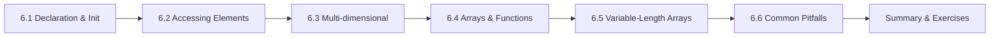

# Chapter 6: Arrays

> **Previous:** [Loops](./05-loops.md) | **Next:** [Strings](./07-strings.md)

## Learning Objectives

- Declare and initialize one-dimensional arrays
- Access and modify array elements using indices
- Work with two-dimensional and multidimensional arrays
- Pass arrays to functions
- Understand the relationship between arrays and memory layout


### Chapter at a Glance

| Topic | Key Insight | Practical Takeaway |
|-------|-------------|-------------------|
| Array Declaration | Contiguous block of elements of the same type | Array indices start at 0 and go to size-1 |
| Array Initialization | Can be fully, partially, or zero-initialized | Uninitialized elements in a partial list are zero-filled |
| Accessing Elements | Use `arr[index]` which is equivalent to `*(arr + index)` | No bounds checking — accessing out-of-bounds is undefined behavior |
| Multi-dimensional Arrays | Arrays of arrays stored in row-major order | Access `arr[row][col]` — inner index varies fastest |
| Arrays and Functions | Arrays decay to pointers when passed to functions | Pass the size separately since `sizeof` on a parameter gives pointer size, not array size |





## 6.1 One-Dimensional Arrays

An array is a contiguous sequence of elements of the same type, stored in consecutive memory locations.

```c
type array_name[size];
```

```c
#include <stdio.h>

int main(void)
{
    int numbers[5];           /* uninitialized array */
    int squares[5] = {1, 4, 9, 16, 25};  /* initialized */

    numbers[0] = 10;          /* assign to first element */
    numbers[1] = 20;
    numbers[2] = 30;

    printf("squares[2] = %d\n", squares[2]);
    printf("numbers[1] = %d\n", numbers[1]);

    return 0;
}
```

**Output:**
```
squares[2] = 9
numbers[1] = 20
```

**Important rules:**

- Array indices start at `0` and end at `size - 1`.
- Accessing an index outside the valid range is **undefined behavior** (may crash or corrupt data).
- The size must be a constant expression in standard C (variable-length arrays are a C99 feature, covered in Chapter 18).

### 6.1.1 Array Initialization

```c
int a[5] = {1, 2, 3, 4, 5};    /* full initialization */
int b[5] = {1, 2};              /* partial: b = {1, 2, 0, 0, 0} */
int c[] = {1, 2, 3, 4, 5};      /* size inferred: 5 elements */
int d[5] = {0};                  /* all elements set to 0 */
int e[5] = {1};                  /* e = {1, 0, 0, 0, 0} */
```

**Designated initializers (C99):**
```c
int arr[10] = {[0] = 5, [4] = 10, [9] = 20};
/* arr = {5, 0, 0, 0, 10, 0, 0, 0, 0, 20} */
```

### 6.1.2 Iterating Over an Array

```c
#include <stdio.h>

int main(void)
{
    int scores[] = {88, 72, 93, 65, 80};
    int size = sizeof(scores) / sizeof(scores[0]);
    int sum = 0;

    for (int i = 0; i < size; i++) {
        sum += scores[i];
    }

    double average = (double)sum / size;
    printf("Average: %.2f\n", average);

    return 0;
}
```

**Output:**
```
Average: 79.60
```

**Computing array length:**
```c
int arr[] = {10, 20, 30, 40, 50};
int length = sizeof(arr) / sizeof(arr[0]);   /* 5 */
```

**Caveat:** This only works in the scope where the array was declared. Once decayed to a pointer (when passed to a function), `sizeof` returns the pointer size, not the array size.


> **One-Sentence Takeaway:** Array declaration reserves contiguous memory for a fixed number of elements
## 6.2 Memory Layout of Arrays

Array elements are stored in contiguous memory:

```c
#include <stdio.h>

int main(void)
{
    int arr[4] = {10, 20, 30, 40};

    for (int i = 0; i < 4; i++) {
        printf("&arr[%d] = %p  (arr[%d] = %d)\n", i, (void*)&arr[i], i, arr[i]);
    }

    return 0;
}
```

**Output (addresses will vary):**
```
&arr[0] = 0x7fff5fbff700  (arr[0] = 10)
&arr[1] = 0x7fff5fbff704  (arr[1] = 20)
&arr[2] = 0x7fff5fbff708  (arr[2] = 30)
&arr[3] = 0x7fff5fbff70c  (arr[3] = 40)
```

Each element is 4 bytes apart (the size of `int` on this system).


> **One-Sentence Takeaway:** Array access uses pointer arithmetic internally and performs no bounds checking
> **Warning:** Array bounds are not checked accessing arr[size] causes undefined behavior.
## 6.3 Arrays and Functions

When an array is passed to a function, it *decays* to a pointer to its first element. The function receives the address, not a copy of the array.

```c
#include <stdio.h>

/* The parameter "int arr[]" is equivalent to "int *arr" */
void print_array(int arr[], int size)
{
    for (int i = 0; i < size; i++) {
        printf("%d ", arr[i]);
    }
    printf("\n");
}

void double_elements(int *arr, int size)
{
    for (int i = 0; i < size; i++) {
        arr[i] *= 2;
    }
}

int main(void)
{
    int values[] = {1, 2, 3, 4, 5};
    int n = sizeof(values) / sizeof(values[0]);

    printf("Original: ");
    print_array(values, n);

    double_elements(values, n);

    printf("Doubled:  ");
    print_array(values, n);

    return 0;
}
```

**Output:**
```
Original: 1 2 3 4 5
Doubled:  2 4 6 8 10
```

**Critical:** The size must be passed separately — `sizeof(arr)` inside `print_array` returns the pointer size, not the array size.


> **One-Sentence Takeaway:** Multi-dimensional arrays are stored in row-major order in contiguous memory
## 6.4 Two-Dimensional Arrays

A 2D array is an array of arrays, stored in row-major order.

```c
type array_name[rows][columns];
```

```c
#include <stdio.h>

int main(void)
{
    int matrix[3][4] = {
        {1,  2,  3,  4},
        {5,  6,  7,  8},
        {9, 10, 11, 12}
    };

    /* Print the matrix */
    for (int i = 0; i < 3; i++) {
        for (int j = 0; j < 4; j++) {
            printf("%4d", matrix[i][j]);
        }
        printf("\n");
    }

    return 0;
}
```

**Output:**
```
   1   2   3   4
   5   6   7   8
   9  10  11  12
```

### 6.4.1 Memory Layout

```c
#include <stdio.h>

int main(void)
{
    int m[2][3] = {{1, 2, 3}, {4, 5, 6}};

    for (int i = 0; i < 2; i++) {
        for (int j = 0; j < 3; j++) {
            printf("&m[%d][%d] = %p\n", i, j, (void*)&m[i][j]);
        }
    }

    return 0;
}
```

**Output (addresses vary):**
```
&m[0][0] = 0x7fff5fbff6e0
&m[0][1] = 0x7fff5fbff6e4
&m[0][2] = 0x7fff5fbff6e8
&m[1][0] = 0x7fff5fbff6ec
&m[1][1] = 0x7fff5fbff6f0
&m[1][2] = 0x7fff5fbff6f4
```

Row-major order means all elements of row 0 are stored first, then row 1.

### 6.4.2 2D Arrays as Function Parameters

The number of columns must be specified (because the compiler needs it to compute the memory offset):

```c
void print_matrix(int rows, int cols, int matrix[rows][cols])
{
    for (int i = 0; i < rows; i++) {
        for (int j = 0; j < cols; j++) {
            printf("%4d", matrix[i][j]);
        }
        printf("\n");
    }
}
```

| Declaration | Meaning |
|-------------|---------|
| `int matrix[][4]` | 2D array, columns = 4, rows unknown |
| `int (*matrix)[4]` | Pointer to an array of 4 ints (same as above) |
| `int *matrix[4]` | Array of 4 pointers to int |


> **One-Sentence Takeaway:** Passing an array to a function decays it to a pointer losing size information
> **Remember:** When passed to a function the array name decays to a pointer losing size information.
## 6.5 Multidimensional Arrays (3D and Beyond)

```c
int cube[3][4][5];   /* 3 layers, 4 rows, 5 columns — 60 elements total */
```


> **One-Sentence Takeaway:** Variable-length arrays allow runtime-sized stack allocation since C99
## 6.6 Variable-Length Arrays (VLA, C99)

C99 allows array sizes to be determined at runtime:

```c
void process(int n) {
    int arr[n];               /* VLA — size determined at call time */
    for (int i = 0; i < n; i++) {
        arr[i] = i * i;
    }
}
```

**Caveats:** VLAs cannot be global, cannot be initialized in their declaration, and are optional in C11.

## Concept Comparison Table

| Array Type | Declaration | Memory Layout | Access |
|-----------|-------------|---------------|--------|
| 1D | `int a[5];` | 5 contiguous ints | `a[2]` |
| 2D | `int a[3][4];` | 3 rows × 4 cols, row-major | `a[1][2]` |
| 3D | `int a[2][3][4];` | 2 planes × 3 rows × 4 cols | `a[0][1][2]` |
| VLA | `int a[n];` | Stack-allocated at runtime | `a[i]` (same as fixed) |
| Partially initialized | `int a[5] = {1,2};` | First 2 set, rest zero-filled | `a[4]` is 0 |

## Quick Reference

| Operation | Syntax | Example |
|-----------|--------|---------|
| Declare size N | `type name[N];` | `int scores[100];` |
| Full initialization | `type name[] = {v1, v2};` | `int vals[] = {1, 2, 3};` |
| Zero initialization | `type name[N] = {0};` | `int arr[10] = {0};` |
| Access element i | `name[i]` | `scores[5]` |
| 2D access | `name[r][c]` | `matrix[2][3]` |
| Pass to function | `func(arr, size);` | `process(scores, 100);` |
| Element count | `sizeof(arr)/sizeof(arr[0])` | Only in declaration scope |

## Cross-Application Matrix

| Application | Array Usage |
|-------------|-------------|
| Image processing | `unsigned char pixels[1920][1080][3];` (RGB array) |
| Audio buffer | `short samples[44100];` (1 second at 44.1kHz) |
| Matrix math | `double A[3][3];` (3×3 transformation matrix) |
| Lookup table | `const int days_in_month[] = {31,28,31,30,...};` |
| Text buffer | `char line[256];` (single-line input buffer) |

## Chapter Quiz

1. What is the value of `arr[2]` after `int arr[5] = {10, 20};`?
   A) 0
   B) undefined
   C) 30
   D) Compiler error

<details><summary>Answer</summary>**A)** Partially initialized elements are zero-filled.</details>

2. Why does `void f(int a[]) { printf("%zu", sizeof(a)); }` print the wrong size?
   A) Compiler bug
   B) `a` is a pointer, not an array, in the function parameter
   C) `sizeof` is out of scope
   D) Array must be global

<details><summary>Answer</summary>**B)** Array parameters decay to pointers; `sizeof(a)` returns the pointer size (4 or 8 bytes), not the array size.</details>

3. How is `int a[2][3]` laid out in memory?
   A) Column by column
   B) Row by row — all of row 0, then all of row 1
   C) Random order
   D) Zigzag pattern

<details><summary>Answer</summary>**B)** C uses row-major order: `a[0][0], a[0][1], a[0][2], a[1][0], a[1][1], a[1][2]`.</details>

## Summary

- Arrays are contiguous sequences of elements of the same type; indices start at 0.
- `sizeof(arr) / sizeof(arr[0])` computes array length in the declaration scope.
- Out-of-bounds access is undefined behavior and a common source of bugs.
- Arrays decay to pointers when passed to functions; the size must be passed separately.
- 2D arrays use row-major memory layout; the column dimension must be known at compile time for function parameters.
- Designated initializers (C99) allow sparse array initialization.

## Exercises

### Review Questions

1. What does `int a[10] = {0};` initialize every element to?
2. Why does `sizeof(arr) / sizeof(arr[0])` not work inside a function that receives an array parameter?
3. Explain how a 2D array `int m[3][4]` is laid out in memory.
4. What is an array decay? When does it happen?
5. What happens when you access `arr[10]` in an array of size 10?

### Application Problems

1. Write a program that reads 10 floating-point numbers into an array, then prints them in reverse order.
2. Write a program that finds the minimum, maximum, and sum of elements in an integer array of size 20. Fill the array with random numbers using `rand()` from `stdlib.h`.
3. Write a program that multiplies two 3x3 matrices. Read the elements from the user into two 2D arrays, compute the product, and display the result.
4. Write a function `is_palindrome` that takes an array of characters and its size, and returns 1 if the array is a palindrome (reads the same forward and backward) and 0 otherwise.

### Challenge Problem

Write a program that implements the Sieve of Eratosthenes to find all prime numbers up to a user-specified limit `n`. Use an array of booleans (or `int`). The algorithm: create an array of size `n+1` initialized to true. Set indices 0 and 1 to false. For each `i` from 2 to sqrt(n), if `i` is prime, mark all multiples of `i` (starting from `i*i`) as false. Print all remaining prime numbers. Analyze the time complexity of this approach.

> **One-Sentence Takeaway:** Off-by-one and buffer overflow are the most common and dangerous array errors
> **Pro Tip:** Use sizeof(arr)/sizeof(arr[0]) to compute element count where the array is declared.
