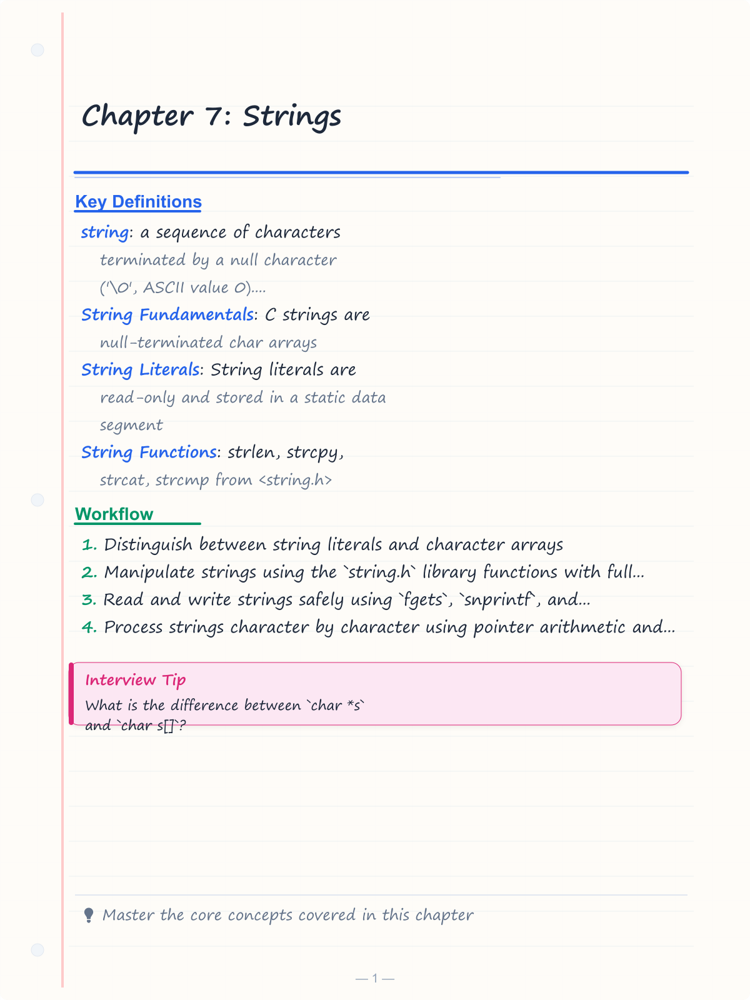
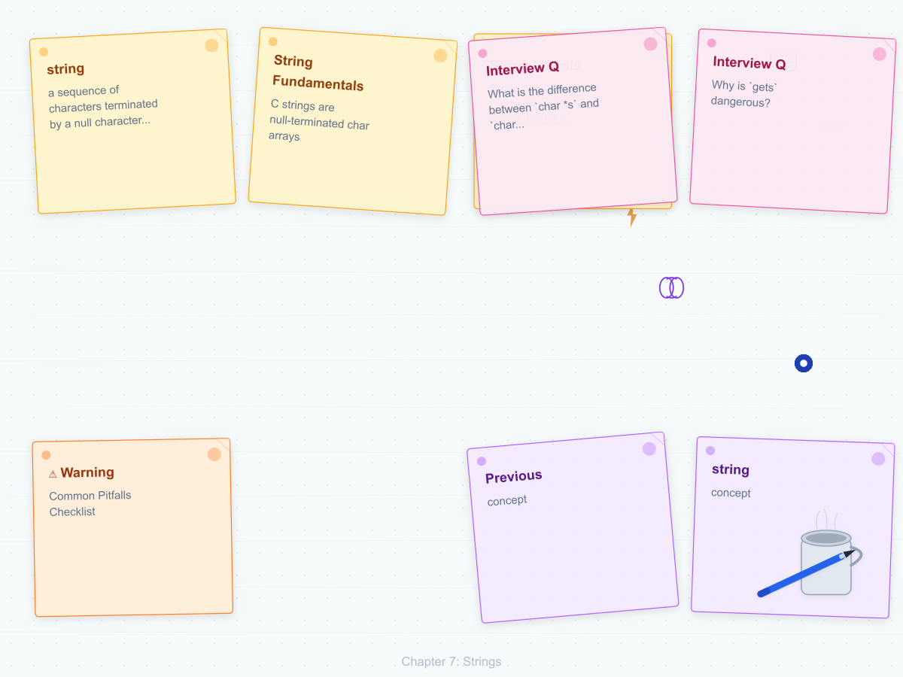
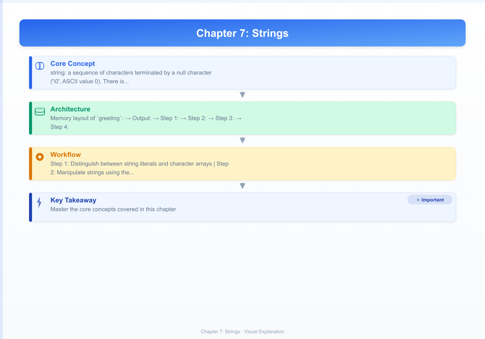

# Chapter 7: Strings

> **Previous:** [Arrays](./06-arrays.md) | **Next:** [Functions](./08-functions.md)

## Learning Objectives

- Distinguish between string literals and character arrays
- Manipulate strings using the `string.h` library functions with full awareness of bounds and null-termination
- Read and write strings safely using `fgets`, `snprintf`, and bounded functions
- Process strings character by character using pointer arithmetic and array indexing
- Understand null-termination, buffer overflow risks, and reentrancy concerns
- Convert between strings and numeric types safely
- Recognize real-world applications of string processing in systems programming

<!-- Image Gallery -->
<section class="lesson-visuals" aria-label="Visual learning resources">
  <header><span>VISUAL LEARNING</span><h2>See it. Review it. Remember it.</h2></header>
  <a class="lesson-visual-card" href="../../assets/images/lessons/c-programming/07-strings/handwritten-notes.png" target="_blank" rel="noopener">
    
    <span><strong>Handwritten notes</strong>Condensed notes for deliberate review.</span>
  </a>
  <a class="lesson-visual-card" href="../../assets/images/lessons/c-programming/07-strings/sticky-notes.png" target="_blank" rel="noopener">
    
    <span><strong>Sticky-note revision</strong>Fast recall prompts for revision.</span>
  </a>
  <a class="lesson-visual-card" href="../../assets/images/lessons/c-programming/07-strings/visual-explanation.png" target="_blank" rel="noopener">
    
    <span><strong>Visual concept guide</strong>A connected explanation of the key ideas.</span>
  </a>
</section>
<!-- End Image Gallery -->


## Prerequisites

Before studying this chapter, you should be comfortable with:

| Concept | Where Covered |
|---------|---------------|
| Arrays (declaration, indexing) | [Chapter 6](./06-arrays.md) |
| Pointers (address-of, dereference) | [Chapter 9](./09-pointers.md) |
| Functions (declaration, return types) | [Chapter 8](./08-functions.md) |
| `typedef` and `sizeof` | [Chapter 6](./06-arrays.md) |

### Chapter at a Glance


| Topic | Key Insight | Practical Takeaway |
|-------|-------------|-------------------|
| String Fundamentals | C strings are null-terminated char arrays | The null terminator `\0` marks the end - every string buffer must have room for it |
| String Literals | String literals are read-only and stored in a static data segment | Modifying a string literal is undefined behavior (segfault on most platforms) |
| String Functions | `strlen`, `strcpy`, `strcat`, `strcmp` from `<string.h>` | Use `strncpy`, `strncat`, `strncmp` for bounds-checked operations |
| String Input/Output | `gets` is dangerous and removed - use `fgets` or `scanf` with width limit | Always specify the buffer size in `fgets(buf, size, stdin)` |
| String to Number | `atoi` is error-prone; `strtol` provides error detection | Prefer `strtol`/`strtod` for production code |

```mermaid
flowchart LR
    A["7.1 Char Arrays & Null Terminator"] --> B["7.2 String Literals"]
    B --> C["7.3 String Constants"]
    C --> D["7.4 String I/O"]
    D --> E["7.5 String Functions"]
    E --> F["7.6 String to Number"]
    F --> G["7.7 Array of Strings"]
    G --> H["7.8 Comparison Tables"]
    H --> I["7.9 Interview Corner"]
    I --> J["7.10 Applications"]
    J --> K["Summary & Exercises"]
```

| Character Functions | `<ctype.h>` provides `isalpha`, `isdigit`, `toupper`, `tolower` | These functions handle locale-specific character classification |



## 7.1 String as Character Array

In C, a **string** is a sequence of characters terminated by a null character (`'\0'`, ASCII value 0). There is no dedicated `string` type - strings are stored in `char` arrays.

### Real-World Analogy: Beads on a Necklace


Imagine a **necklace** where each bead is a character. The necklace has a special **knot** (the null terminator `'\0'`) that marks the end. To find the length of the beaded pattern, you count beads from the clasp until you reach the knot - but you do NOT count the knot itself.

```
Beads:  [H] [e] [l] [l] [o] [KNOT]
Index:   0   1   2   3   4    5
```

The knot tells you "stop here." If you lose the knot, you will keep counting beads forever - this is exactly what happens when a C string lacks a null terminator. Every C string function relies on finding that knot. If the knot is missing, the function reads past the end of the array into unknown memory - undefined behavior.

### What Is a String?


```c
char greeting[] = "Hello";
/* Memory: {'H','e','l','l','o','\0'} - 6 bytes total */
```

**Memory layout of `greeting`:**

```
Address: 0x100  0x101  0x102  0x103  0x104  0x105
        +------+------+------+------+------+------+
        |  'H' |  'e' |  'l' |  'l' |  'o' | '\0' |
        +------+------+------+------+------+------+
Index:     0      1      2      3      4      5
```

The array has **6 elements** (indices 0-5), but the **string length** is **5** characters. The sixth byte is the null terminator - it is part of the array, not part of the string content.

### How Null Termination Works


The null character `'\0'` has integer value 0. It is distinct from the character `'0'` (ASCII 48). In memory, a zero byte is also the value used to terminate strings. This is why `strlen("")` returns 0 - the first byte is already `'\0'`.

```c
#include <stdio.h>

int main(void) {
    printf("'\\0' has ASCII value: %d\n", '\0');   /* 0 */
    printf("'0' has ASCII value:  %d\n", '0');     /* 48 */
    printf("Difference: %d\n", '\0' - '0');        /* -48 */

    char empty[] = "";
    printf("Empty string size: %zu byte(s)\n", sizeof(empty)); /* 1 */
    return 0;
}
```

**Output:**
```
'\0' has ASCII value: 0
'0' has ASCII value:  48
Difference: -48
Empty string size: 1 byte(s)
```

### Numbered Steps to Create a String


**Step 1:** Choose a storage location (stack, static, or heap).
**Step 2:** Declare a `char` array with enough space for all characters plus one byte for `'\0'`.
**Step 3:** Initialize each element. If using a string literal, the compiler auto-inserts `'\0'`.
**Step 4:** Use string functions - they all rely on the null terminator to know where the string ends.
**Step 5:** Ensure the null terminator is always present after any modification.

```c
/* Step 1-3: Declaration and initialization */
char name[20];                    /* Step 2: space for 19 chars + '\0' */
name[0] = 'J';                    /* Step 3: manual char-by-char */
name[1] = 'o';
name[2] = 'h';
name[3] = 'n';
name[4] = '\0';                   /* MUST terminate manually */

/* Shorthand - same result, compiler adds '\0' */
char name2[] = "John";            /* auto-sized to 5 */

/* Using %s specifier - relies on null terminator */
printf("Hello, %s\n", name2);     /* prints "Hello, John" */
```

### Pseudocode for String Traversal


```
FUNCTION print_string(str):
    i <- 0
    WHILE str[i] != '\0':
        PRINT str[i]
        i <- i + 1
    END WHILE
    PRINT newline
END FUNCTION
```

### Dry Run: strlen Traversal of "Hello"


The `strlen` function walks the array character by character until it finds `'\0'`. Here is a trace table for `strlen("Hello")`:

| Iteration | `i` | `str[i]` | `str[i] != '\0'`? | Count | Action |
|-----------|-----|----------|-------------------|-------|--------|
| 0 | 0 | `'H'` | Yes | 1 | Increment count, advance |
| 1 | 1 | `'e'` | Yes | 2 | Increment count, advance |
| 2 | 2 | `'l'` | Yes | 3 | Increment count, advance |
| 3 | 3 | `'l'` | Yes | 4 | Increment count, advance |
| 4 | 4 | `'o'` | Yes | 5 | Increment count, advance |
| 5 | 5 | `'\0'` | **No** | 5 | **Stop** - return 5 |

**Result:** `strlen` returns **5** (does not count the null terminator).

```c
#include <stdio.h>
#include <string.h>

int main(void) {
    char str[] = "Hello";
    size_t len = strlen(str);
    printf("String: \"%s\"\n", str);
    printf("Length: %zu\n", len);
    printf("Array size (sizeof): %zu\n", sizeof(str));
    return 0;
}
```

**Output:**
```
String: "Hello"
Length: 5
Array size (sizeof): 6
```

### Complexity Analysis


| Operation | Time Complexity | Space Complexity | Why? |
|-----------|----------------|------------------|------|
| `strlen` | O(n) | O(1) | Must scan every character until `'\0'` - no length prefix in C strings |
| Access by index | O(1) | O(1) | Array indexing is constant-time pointer arithmetic: `*(str + i)` |
| Copy by assignment | O(n) | O(1) | Each character must be copied individually; no bulk-memory primitive |
| Compare strings | O(min(m,n)) | O(1) | Stops at first differing character; worst case compares both fully |
| Null-terminate | O(1) | O(1) | Single byte write to known position |

### Advantages and Disadvantages


| Aspect | Advantage | Disadvantage |
|--------|-----------|--------------|
| **Memory** | Minimal overhead - only one extra byte for `'\0'` | No built-in length field - O(n) to find length |
| **Simplicity** | Raw memory access gives full control | Easy to overflow, under-allocate, or lose the terminator |
| **Performance** | Cache-friendly sequential access | No bounds checking - silent corruption |
| **Interoperability** | Universal - every C API uses this format | No Unicode handling - you must manage encoding |
| **Flexibility** | Works with any memory region (stack/heap/static) | Manual memory management required for dynamic strings |

### Edge Cases


**Missing null terminator:**
```c
char no_null[] = {'H', 'e', 'l', 'l', 'o'}; /* NO '\0' */
printf("%s", no_null); /* prints "Hello" + garbage until a random '\0' in memory */
```
This is undefined behavior - `printf` and `strlen` will read past the array bounds until they find a zero byte somewhere in memory. The program might crash, print garbage, or appear to work correctly (until it doesn't).

**Buffer too small for null terminator:**
```c
char buf[5] = "Hello"; /* WARNING: "Hello" needs 6 bytes including '\0' */
/* buf = {'H','e','l','l','o'} - NO null terminator! */
```
The compiler may or may not warn. The array holds exactly 5 chars - no room for `'\0'`. This is a **buffer overflow** waiting to happen.

**Empty string:**
```c
char empty[] = "";       /* size 1: { '\0' } */
printf("%zu", strlen(empty)); /* prints 0 */
```
An empty string is a single null terminator. `strlen("")` returns 0. This is perfectly valid.

**String with embedded null:**
```c
char embedded[] = "Hi\0There";
printf("%zu\n", strlen(embedded)); /* prints 2 - stops at the embedded null */
```
C strings cannot represent embedded null characters. `strlen` and `printf` will stop at the first `'\0'`. For binary data with embedded nulls, use `mem*` functions instead.

## 7.2 String Literals

### Real-World Analogy: Engraved Plaque vs. Whiteboard


A **string literal** is like an **engraved plaque** on a wall - the words are set in stone, permanent, and any attempt to change them would deface the monument.

A **character array** is like a **whiteboard** - you can write, erase, and rewrite freely.

| Aspect | Engraved Plaque (String Literal) | Whiteboard (Char Array) |
|--------|----------------------------------|------------------------|
| Storage | Read-only memory (`.rodata`) | Stack / heap (writable) |
| Can modify? | No - undefined behavior | Yes - freely |
| Lifetime | Entire program | Scope-dependent |
| Example | `char *s = "Fixed";` | `char s[] = "Fixed";` |
| `sizeof` | Pointer size (4 or 8) | Array size (includes `'\0'`) |

### String Literal Memory


When you write:

```c
char *str1 = "Hello";    /* Pointer to a literal in .rodata (read-only) */
```

The compiler places the characters `'H','e','l','l','o','\0'` in a read-only data section (often `.rodata`). The variable `str1` is a pointer to the first byte of that region.

```c
char str2[] = "Hello";    /* Mutable array on the stack */
```

The compiler allocates 6 bytes on the stack and copies the characters into them. `str2` is an **array**, not a pointer - it owns its data.

```c
#include <stdio.h>
#include <string.h>

int main(void) {
    char *literal = "Fixed";   /* read-only */
    char array[] = "Fixed";    /* mutable */

    /* array[0] = 'M'; */     /* OK - would produce "Mixed" */
    /* literal[0] = 'M'; */   /* UNDEFINED BEHAVIOR - segfault on most systems */

    printf("literal points to: %s\n", literal);
    printf("array contains:   %s\n", array);
    printf("sizeof(literal):  %zu (pointer size)\n", sizeof(literal));
    printf("sizeof(array):    %zu (6 bytes)\n", sizeof(array));

    return 0;
}
```

**Output:**
```
literal points to: Fixed
array contains:   Fixed
sizeof(literal):  8 (pointer size)
sizeof(array):    6 (6 bytes)
```

### Numbered Steps for String Literal Behavior


**Step 1:** Compiler encounters `"Hello"` in source code.
**Step 2:** Compiler allocates 6 bytes in `.rodata` section: `'H' 'e' 'l' 'l' 'o' '\0'`.
**Step 3:** If assigned to `char *s`, `s` receives the address of the first byte.
**Step 4:** If assigned to `char s[]`, compiler generates code to copy the bytes into the stack array at runtime.
**Step 5:** Any write through `char *s` hits read-only memory -> segfault (undefined behavior).

### String Literal vs Char Array Comparison


| Feature | `char *s = "Hello"` | `char s[] = "Hello"` |
|---------|---------------------|----------------------|
| Storage | Pointer in stack, chars in `.rodata` | All chars on the stack |
| Mutable? | **No** - modifying is UB | **Yes** - can change characters |
| `sizeof(s)` | Size of pointer (4 or 8 bytes) | Size of array (6 bytes) |
| `&s` | Address of the pointer variable | Address of the first element (same as `s`) |
| Reassignable? | Yes - `s` can point elsewhere | No - `s` is a fixed array name |
| Lifetime | Permanent (program duration) | Automatic (block scope) |
| String interning | May share memory with identical literals | Each instance has its own copy |

### Pseudocode: String Initialization


```
FUNCTION init_string():
    // Method 1: literal pointer
    ptr <- address_of_literal("Hello")  // points to .rodata

    // Method 2: array copy
    array <- allocate(6)                // stack allocation
    array[0] <- 'H'
    array[1] <- 'e'
    array[2] <- 'l'
    array[3] <- 'l'
    array[4] <- 'o'
    array[5] <- '\0'
END FUNCTION
```

### Edge Cases


**Modifying a string literal (undefined behavior):**
```c
char *p = "hello";
p[0] = 'H'; /* CRASH on many systems - undefined behavior */
```
On most systems this causes a segmentation fault. On some embedded systems without memory protection, it might silently corrupt program data. Either way, it is **never** safe.

**String interning:**
```c
char *a = "hello";
char *b = "hello";
if (a == b) printf("Same address\n"); /* MAY print - compiler-dependent */
```
Compilers may "intern" identical string literals to save space. Never compare string literals with `==`; always use `strcmp`.

**String literal as function argument:**
```c
void process(char *s) { /* might modify s */ }
process("constant"); /* safe only if process() does NOT write through s */
```
Declare parameter as `const char *s` if the function does not modify the string. This gives compile-time protection.

```c
void safe_process(const char *s) {
    /* s[0] = 'X'; */ /* COMPILER ERROR - const prevents modification */
    printf("%s\n", s); /* reading is fine */
}
```

## 7.3 String Constants

A string constant is a string literal assigned to a `const char *` pointer, which provides a degree of safety through the type system:

```c
const char *welcome = "Welcome to C programming!";
/* welcome[0] = 'w'; */ /* COMPILER ERROR - const qualification prevents modification */
```

Although `char *s = "Hello"` already points to read-only memory, the `const` qualifier adds a **compile-time** guarantee:

| Declaration | Runtime modification | Compile-time protection |
|------------|---------------------|------------------------|
| `char *s = "Hello"` | UB (may crash) | No warning |
| `const char *s = "Hello"` | UB (may crash) | **Compiler error** |

```c
#include <stdio.h>

int main(void) {
    const char *months[] = {
        "January", "February", "March", "April",
        "May", "June", "July", "August",
        "September", "October", "November", "December"
    };

    for (int i = 0; i < 12; i++) {
        printf("Month %2d: %s\n", i + 1, months[i]);
    }
    return 0;
}
```

**Output:**
```
Month  1: January
Month  2: February
Month  3: March
Month  4: April
Month  5: May
Month  6: June
Month  7: July
Month  8: August
Month  9: September
Month 10: October
Month 11: November
Month 12: December
```

### Why Use const char * Instead of char *?


1. **Self-documenting** - Readers know the function won't modify the string.
2. **Compiler enforcement** - Accidental writes produce compile errors, not runtime crashes.
3. **Interoperability** - Many standard library functions (e.g., `strlen`, `strcmp`) take `const char *`.
4. **Wider compatibility** - Allows passing string literals without warnings.

```c
void good(const char *s) { /* can accept literals and arrays */ }
void bad(char *s) { /* warns when passing literals */ }

good("literal");  /* OK */
bad("literal");   /* warning: deprecated conversion */
```

## 7.4 String Input and Output

String I/O is where many C programs first encounter buffer overflow vulnerabilities. Understanding the differences between `gets`, `fgets`, `scanf`, `puts`, and `printf` is essential for writing safe code.

### 7.4.1 `puts` - Simple Output


**Prototype:** `int puts(const char *s);`

**Real-world analogy:** A town crier who reads a scroll and then automatically rings a bell (adds a newline) when done.

```c
#include <stdio.h>

int main(void) {
    char msg[] = "Hello, world!";
    puts(msg);          /* prints "Hello, world!" followed by newline */
    puts("Another");    /* directly from a literal */
    return 0;
}
```

**Output:**
```
Hello, world!
Another
```

`puts` automatically appends a newline. It returns a non-negative value on success, `EOF` on failure. It is simple and safe - no format string vulnerabilities.

### 7.4.2 `printf` with `%s`


**Prototype:** `int printf(const char *format, ...);`

```c
printf("Name: %s\n", name);   /* prints until '\0' */
```

The `%s` specifier expects a `const char *`. It prints every character until it encounters `'\0'`.

**Safety warning:** Never pass user-controlled data as the format string:
```c
printf(user_input);  /* DANGEROUS - format string vulnerability */
printf("%s", user_input); /* SAFE - user data is an argument, not the format */
```

### 7.4.3 `gets` - The Dangerous One


**Prototype:** `char *gets(char *buf);`

**Never use `gets` in new code.** It was removed from the C11 standard.

```c
char buf[10];
gets(buf);   /* If user types more than 9 characters -> buffer overflow -> SECURITY HOLE */
```

`gets` has **no way to limit input size**. It reads until newline and writes past the buffer end. This function has been responsible for countless security vulnerabilities, including the famous Morris worm (1988).

```
Numbered steps of why gets is dangerous:
Step 1: User types 100 characters.
Step 2: gets reads them all, writing past the 10-byte buffer.
Step 3: Overflow corrupts the stack - return address, local variables, saved registers.
Step 4: Attacker crafts input to overwrite the return address.
Step 5: Program "returns" to attacker-controlled code (shellcode).
```

### 7.4.4 `fgets` - Safe Line Input (Preferred)


**Prototype:** `char *fgets(char *buf, int n, FILE *stream);`

**Real-world analogy:** A straw with a filter - no matter how much liquid is in the glass, the straw only lets through a fixed amount per sip. The rest stays in the glass for next time.

```c
#include <stdio.h>
#include <string.h>

int main(void) {
    char line[100];

    printf("Enter a line: ");
    if (fgets(line, sizeof(line), stdin)) {
        /* fgets includes the newline - strip it */
        line[strcspn(line, "\n")] = '\0';
        printf("You entered: \"%s\"\n", line);
    }
    return 0;
}
```

**Sample run:**
```
Enter a line: Hello, C language!
You entered: "Hello, C language!"
```

`fgets` reads at most `size - 1` characters (reserving one for `'\0'`). If a newline is encountered before the limit, it is included in the buffer. This is why we strip it with `strcspn`.

### 7.4.5 `scanf` with `%s`


**Prototype:** `int scanf(const char *format, ...);`

```c
char word[50];
printf("Enter a word: ");
scanf("%49s", word);   /* width limit: 49 chars + '\0' */
printf("You entered: %s\n", word);
```

**Without width limit:**
```c
scanf("%s", word);     /* DANGEROUS: no limit - overflow on long input */
```

`scanf("%s")` reads until whitespace (space, tab, newline). It appends `'\0'` but **cannot protect against overflow** unless you specify a field width.

### Numbered Steps: Safe String Input


**Step 1:** Declare a buffer with known size.
**Step 2:** Determine the maximum input length (buffer size minus 1 for `'\0'`).
**Step 3:** Call `fgets(buf, sizeof(buf), stdin)` - it automatically limits input.
**Step 4:** Check return value - if `NULL`, input failed (EOF or error).
**Step 5:** Remove trailing newline using `strcspn` or `strchr`.
**Step 6:** Process the string.

### Pseudocode: Safe Input


```
FUNCTION safe_input(buf, size):
    result <- fgets(buf, size, stdin)
    IF result == NULL:
        RETURN error
    END IF
    p <- strchr(buf, '\n')    // find newline
    IF p != NULL:
        *p <- '\0'            // remove it
    END IF
    RETURN success
END FUNCTION
```

### Dry Run: fgets with Buffer


Input: `"Hello, World!\n"` (14 chars + newline), buffer size = 10

| Step | Buffer content | Read count | Action |
|------|----------------|------------|--------|
| 1 | (empty) | 0 | Start |
| 2 | `H` | 1 | Read 'H' |
| 3 | `He` | 2 | Read 'e' |
| 4 | `Hel` | 3 | Read 'l' |
| 5 | `Hell` | 4 | Read 'l' |
| 6 | `Hello` | 5 | Read 'o' |
| 7 | `Hello,` | 6 | Read ',' |
| 8 | `Hello, ` | 7 | Read ' ' |
| 9 | `Hello, W` | 8 | Read 'W' |
| 10 | `Hello, Wo` | 9 | **Buffer full (size-1 = 9)** - stop |
| 11 | `Hello, Wo\0` | - | Null-terminate, return |

**Result:** Buffer has `"Hello, Wo\0"`. The remaining `"rld!\n"` stays in stdin, which can cause bugs on subsequent reads.

### Dry Run: fgets with Short Input


Input: `"Hi\n"` (3 chars), buffer size = 10

| Step | Buffer content | Read count | Action |
|------|----------------|------------|--------|
| 1 | (empty) | 0 | Start |
| 2 | `H` | 1 | Read 'H' |
| 3 | `Hi` | 2 | Read 'i' |
| 4 | `Hi\n` | 3 | Read '\n' - **newline encountered** |
| 5 | `Hi\n\0` | - | Null-terminate, return |

**Result:** Buffer has `"Hi\n\0"` - the newline is included.

### Edge Cases in String I/O


**fgets with empty input:**
```c
fgets(buf, size, stdin); /* user just presses Enter */
/* buf = "\n\0" - contains just newline */
```

**fgets with oversized input:**
```c
char buf[5];
fgets(buf, 5, stdin);  /* user types "abcdefgh\n" */
/* buf = "abc\0" - 4 chars + null, rest stays in stream */
```
The remaining `"defgh\n"` stays in stdin. The next read will get `"defgh\n"`. This is a common source of "skipped input" bugs.

**scanf leaving newline:**
```c
scanf("%d", &num);  /* user types 42\n - newline stays */
fgets(buf, 100, stdin); /* immediately reads the leftover newline! */
```
Fix: consume the leftover newline with `getchar()` or use `fgets` for all input and `sscanf` to parse.

**scanf with multiple words:**
```c
char name[50];
scanf("%s", name);   /* user types "John Smith" */
/* name = "John" - "Smith" stays in input buffer! */
```

### gets vs fgets vs scanf: Comparison


| Feature | `gets(buf)` | `fgets(buf, n, stdin)` | `scanf("%s", buf)` |
|---------|-------------|------------------------|-------------------|
| Bounds-safe? | **No** - no limit | **Yes** - reads at most `n-1` chars | Only with width: `scanf("%49s", buf)` |
| Reads spaces? | Yes (until newline) | Yes (until newline) | **No** - stops at whitespace |
| Stores newline? | Discards it | **Includes** it | Stops at it |
| Null-terminates? | Yes | Yes | Yes |
| Removed in C11? | **Yes** | No | No |
| Typical use | Never | Reading lines | Reading tokens/words |
| Error return | NULL on failure | NULL on failure | Returns number of items matched |
| Leftover handling | None | May leave chars if buffer full | Leaves unread input in stream |

### Complexity Analysis for String I/O


| Function | Time | Space | Why |
|----------|------|-------|-----|
| `puts(s)` | O(n) | O(1) | Writes each character; n = string length |
| `printf("%s", s)` | O(n) | O(1) | Same - character-by-character output |
| `fgets(buf, n, s)` | O(min(n, input_len)) | O(1) | Reads until newline, limit, or EOF |
| `scanf("%s", buf)` | O(input_len) | O(1) | Reads until whitespace, no built-in limit |
| `gets(buf)` | O(input_len) | O(1) | Reads until newline - **unbounded** |

### Advantages and Disadvantages of Each Input Method


| Method | Advantages | Disadvantages |
|--------|------------|---------------|
| `fgets` | Bounds-safe, reads spaces, error detection | Includes newline (needs stripping), leaves partial data on overflow |
| `scanf` | Formatted parsing, skips whitespace automatically | No bounds check without width, stops at spaces, leaves newlines |
| `gets` | Simple (was) | **No bounds check, removed from C11, never use** |

### Best Practices for String I/O


1. **Always use `fgets` for line input** - it is the only safe, standard option.
2. **Always strip the trailing newline** from `fgets` output.
3. **Use `sscanf` to parse** already-read lines rather than `scanf` directly.
4. **Always specify width** with `scanf` if you must use it: `scanf("%49s", buf)`.
5. **Never, ever use `gets`.** Even if your compiler still supports it, do not use it.
6. **Check return values** - `fgets` returns NULL on error/EOF.


## 7.5 The `<string.h>` Library

The C standard library provides a rich set of functions for string manipulation, all declared in `<string.h>`. Every function in this library assumes the input strings are null-terminated. Violating this assumption leads to undefined behavior.

### 7.5.1 `strlen` - String Length


**Prototype:** `size_t strlen(const char *s);`

**Real-world analogy:** Counting beads on a necklace until you hit the knot. You count the beads (characters) but stop at the knot (null terminator). The knot is not counted.

**What it does:** Returns the number of characters before the first `'\0'` in `s`.

**Numbered steps:**
1. Start at the address `s`.
2. Initialize a counter to 0.
3. Read the current byte.
4. If it is `'\0'`, stop and return the counter.
5. Otherwise, increment the counter and advance to the next byte.
6. Repeat from step 3.

**Pseudocode:**
```
FUNCTION strlen(s):
    count <- 0
    WHILE s[count] != '\0':
        count <- count + 1
    END WHILE
    RETURN count
END FUNCTION
```

**Code example:**
```c
#include <stdio.h>
#include <string.h>

int main(void) {
    char *strs[] = {"", "C", "Hello", "Hello, World!"};
    size_t n = sizeof(strs) / sizeof(strs[0]);

    for (size_t i = 0; i < n; i++) {
        printf("strlen(\"%-15s\") = %2zu\n", strs[i], strlen(strs[i]));
    }
    return 0;
}
```

**Output:**
```
strlen(""              ) =  0
strlen("C"             ) =  1
strlen("Hello"         ) =  5
strlen("Hello, World!" ) = 13
```

**Dry Run: strlen("")**

| Iteration | `i` | `str[i]` | `str[i] != '\0'`? | Action |
|-----------|-----|----------|-------------------|--------|
| 0 | 0 | `'\0'` | **No** | Stop immediately, return 0 |

**Result:** `strlen("")` returns **0** - the first byte is the null terminator.

**Complexity:**
- **Time:** O(n) - must scan every character until `'\0'`. C strings have no length prefix, so there is no way to know the length without scanning. This means calling `strlen` in a loop condition (e.g., `for (int i = 0; i < strlen(s); i++)`) turns an O(n) algorithm into O(n^2) because `strlen` rescans every iteration.
- **Space:** O(1) - uses a single counter register.

**Why O(n)?** Because the string length is not stored anywhere. The only way to find the end is to examine each byte until the zero byte is found. This is a fundamental trade-off of C's null-terminated string design.

**Advantages and Disadvantages:**

| Aspect | Advantage | Disadvantage |
|--------|-----------|--------------|
| **Simplicity** | Easy to implement and understand | O(n) cost for every length query |
| **Space** | Saves 4-8 bytes per string (vs Pascal's length-prefix) | No amortization - pay O(n) every call |
| **Safety** | Cannot overflow (read-only operation) | No null terminator -> reads past buffer (UB) |

**Edge cases:**
- Empty string `""`: returns 0 immediately (the first byte is `'\0'`).
- No null terminator: `strlen` reads past the buffer boundary -> undefined behavior.
- Very long string: O(n) cost can be significant in performance-critical loops. Cache locality helps since access is sequential.
- `NULL` pointer: passing NULL to `strlen` causes a segmentation fault (undefined behavior). Always check for NULL before calling.

### 7.5.2 `strcpy` - String Copy


**Prototype:** `char *strcpy(char *dest, const char *src);`

**Real-world analogy:** Copying text from one whiteboard to another, character by character, until you reach the end of the source text. You also draw a small dot (null terminator) at the end on the destination board. You do not check whether the destination board is big enough - if it is too small, you write on the wall beyond it.

**What it does:** Copies all characters from `src` (including the null terminator) to `dest`.

**Numbered steps:**
1. Start with index `i = 0`.
2. Read `src[i]`.
3. Write it to `dest[i]`.
4. If `src[i]` was `'\0'`, stop.
5. Increment `i` and go to step 2.
6. Return the original `dest` pointer.

**Pseudocode:**
```
FUNCTION strcpy(dest, src):
    i <- 0
    LOOP:
        dest[i] <- src[i]
        IF src[i] == '\0':
            BREAK
        i <- i + 1
    RETURN dest
END FUNCTION
```

**Code example:**
```c
#include <stdio.h>
#include <string.h>

int main(void) {
    char src[] = "Hello, World!";
    char dest[50];

    strcpy(dest, src);
    printf("Source:      \"%s\"\n", src);
    printf("Destination: \"%s\"\n", dest);

    /* strcpy returns the destination pointer - useful for chaining */
    char dest2[50];
    printf("Chained:     \"%s\"\n", strcpy(dest2, "Chain"));
    return 0;
}
```

**Output:**
```
Source:      "Hello, World!"
Destination: "Hello, World!"
Chained:     "Hello, World!"
```

**Dry Run: strcpy("Hello", dest)**

| i | src[i] | dest[i] after copy | Stop? |
|---|--------|-------------------|-------|
| 0 | `'H'` | `'H'` | No |
| 1 | `'e'` | `'e'` | No |
| 2 | `'l'` | `'l'` | No |
| 3 | `'l'` | `'l'` | No |
| 4 | `'o'` | `'o'` | No |
| 5 | `'\0'` | `'\0'` | **Yes** - stop |

After copy: `dest = {'H','e','l','l','o','\0', ...}`. The remaining bytes of `dest` (if any) are untouched.

**Complexity:**
- **Time:** O(n) - copies each of the n characters from src to dest. Every character must be read and written once.
- **Space:** O(1) - no additional memory beyond the source and destination buffers.

**Why O(n)?** Each character in the source string (including the null terminator) must be individually copied. There is no memcpy-style optimization possible because we must check for `'\0'` at each position.

**Advantages and Disadvantages:**

| Aspect | Advantage | Disadvantage |
|--------|-----------|--------------|
| **Simplicity** | Easy to use, well-known | No bounds checking - silent overflow |
| **Performance** | Tight inline loop, cache-friendly | Can overwrite critical data if dest is too small |
| **Return value** | Returns dest for chaining | Dest must be at least strlen(src) + 1 bytes |

**Edge cases:**
- **Buffer overflow:** If `dest` is smaller than `strlen(src) + 1`, `strcpy` writes past the end -> undefined behavior, potential crash, security vulnerability.
- **Overlapping strings:** If `src` and `dest` overlap, behavior is undefined (use `memmove` instead).
- **Empty src:** Copies just `'\0'` to dest[0] - 1 byte written.
- **NULL pointers:** Passing NULL for either argument -> crash (undefined behavior).

### 7.5.3 `strncpy` - Bounded String Copy


**Prototype:** `char *strncpy(char *dest, const char *src, size_t n);`

**Real-world analogy:** Copying text from one whiteboard to another, but you are only allowed to fill the first `n` slots on the destination board. If the source text is shorter than `n`, you fill the rest with dots (nulls). If it is longer, you stop at `n` characters - but you might not place the final dot (`'\0'`), leaving the destination without a proper end marker.

**What it does:** Copies up to `n` characters from `src` to `dest`. If `src` is shorter than `n`, the remaining bytes in `dest` are padded with nulls.

**Critical warning:** `strncpy` does **NOT** guarantee null-termination if `strlen(src) >= n`. Always manually null-terminate:

```c
strncpy(dest, src, sizeof(dest) - 1);
dest[sizeof(dest) - 1] = '\0';
```

**Code example:**
```c
#include <stdio.h>
#include <string.h>

int main(void) {
    char dest[10];

    /* Case 1: src fits */
    strncpy(dest, "Hi", sizeof(dest) - 1);
    dest[sizeof(dest) - 1] = '\0';
    printf("Case 1: \"%s\"\n", dest);

    /* Case 2: src exceeds n - NOT null-terminated without manual fix */
    char dest2[5];
    strncpy(dest2, "Hello, World!", 4);
    dest2[4] = '\0';  /* CRITICAL */
    printf("Case 2: \"%s\"\n", dest2);

    /* Case 3: shorter src - pads with nulls */
    char dest3[10];
    strncpy(dest3, "AB", sizeof(dest3));
    printf("Case 3: ");
    for (int i = 0; i < 10; i++) {
        printf("%02x ", (unsigned char)dest3[i]);
    }
    printf("\n");

    return 0;
}
```

**Output:**
```
Case 1: "Hi"
Case 2: "Hell"
Case 3: 41 42 00 00 00 00 00 00 00 00
```

**Dry Run: strncpy("Hello", dest, 4)**

| i | src[i] | n limit | dest[i] after copy | Stop? |
|---|--------|---------|-------------------|-------|
| 0 | `'H'` | i &lt; 4 (yes) | `'H'` | No |
| 1 | `'e'` | i &lt; 4 (yes) | `'e'` | No |
| 2 | `'l'` | i &lt; 4 (yes) | `'l'` | No |
| 3 | `'l'` | i &lt; 4 (yes) | `'l'` | No |
| - | - | i = 4 -> stop | - | **Yes** |

After copy: `dest = {'H','e','l','l', ...} ` - **no null terminator!** Checking dest[4] reveals the original byte, not `'\0'`. This is the classic `strncpy` trap.

**Dry Run: strncpy("Hi", dest, 6)**

| i | src[i] | n limit | dest[i] after copy | Stop? |
|---|--------|---------|-------------------|-------|
| 0 | `'H'` | i &lt; 6 (yes) | `'H'` | No |
| 1 | `'i'` | i &lt; 6 (yes) | `'i'` | No |
| 2 | `'\0'` | i &lt; 6 (yes) | `'\0'` | src ended, but continue padding |
| 3 | - | i &lt; 6 (yes) | `'\0'` | Padding with null |
| 4 | - | i &lt; 6 (yes) | `'\0'` | Padding with null |
| 5 | - | i &lt; 6 (yes) | `'\0'` | Padding with null |

After copy: `dest = {'H','i','\0','\0','\0','\0'}` - null-padded.

**Complexity:**
- **Time:** O(n) - copies up to n characters. If `strlen(src) < n`, it also writes `n - strlen(src)` null bytes (O(n) total). This zero-padding is wasteful for large n and short src.
- **Space:** O(1).

**Why zero-padding makes it O(n) even for short strings:** Unlike a simple `strcpy` that stops at `'\0'`, `strncpy` always writes exactly `n` bytes to dest. This means even copying `"A"` into a 1000-byte buffer touches 1000 bytes.

**Advantages and Disadvantages:**

| Aspect | Advantage | Disadvantage |
|--------|-----------|--------------|
| **Bounds** | Writes at most n bytes to dest | **Does not guarantee null-termination** - the biggest pitfall |
| **Padding** | Useful for fixed-width database fields | Wastes time writing nulls for short strings |
| **Portability** | Part of C standard (unlike strlcpy) | Awkward semantics - not a true bounded strcpy |

**Edge cases:**
- `src` >= `n` chars long: `dest` is **not** null-terminated. Always add `dest[n-1] = '\0'`.
- `src` shorter than `n`: `dest` is padded with nulls (wasteful for large `n` and short `src`).
- `n = 0`: no bytes are copied (but this is unusual and likely a bug).
- Overlap: undefined behavior if src and dest overlap.

### 7.5.4 `strcat` - String Concatenation


**Prototype:** `char *strcat(char *dest, const char *src);`

**Real-world analogy:** You have a train (dest) already on the tracks. You attach new train cars (src) to the end by finding the last car and coupling new ones after it. You never check if the track (buffer) is long enough for the extended train.

**What it does:** Appends a copy of `src` to the end of `dest`. The first character of `src` overwrites the null terminator of `dest`.

**Numbered steps:**
1. Find the null terminator in `dest` (walk until `'\0'`).
2. Copy characters from `src` to this position one by one.
3. Stop after copying `'\0'` from `src`.
4. Return `dest`.

**Pseudocode:**
```
FUNCTION strcat(dest, src):
    i <- strlen(dest)       // find end of dest
    j <- 0
    LOOP:
        dest[i] <- src[j]
        IF src[j] == '\0':
            BREAK
        i <- i + 1
        j <- j + 1
    RETURN dest
END FUNCTION
```

**Code example:**
```c
#include <stdio.h>
#include <string.h>

int main(void) {
    char path[256] = "/home/user/";
    char filename[] = "document.txt";

    strcat(path, filename);
    printf("Full path: %s\n", path);
    printf("Total length: %zu\n", strlen(path));

    return 0;
}
```

**Output:**
```
Full path: /home/user/document.txt
Total length: 27
```

**Dry Run: strcat("Hello", " World")**

| Phase | i | char copied | dest content | Notes |
|-------|---|-------------|--------------|-------|
| Find end | 0 | - | `"Hello\0..."` | strlen("Hello") = 5 |
| Append | 5 | `' '` | `"Hello ..."` | Overwrites '\0' |
| Append | 6 | `'W'` | `"Hello W..."` | |
| Append | 7 | `'o'` | `"Hello Wo..."` | |
| Append | 8 | `'r'` | `"Hello Wor..."` | |
| Append | 9 | `'l'` | `"Hello Worl..."` | |
| Append | 10 | `'d'` | `"Hello World"` | |
| Append | 11 | `'\0'` | `"Hello World\0"` | Done |

Final content: `dest = "Hello World\0"`.

**Complexity:**
- **Time:** O(m + n) where m = len(dest), n = len(src). Must walk the entire `dest` to find its end (O(m)), then copy all of `src` (O(n)).
- **Space:** O(1).

**Why O(m + n)?** Two passes are required: first to locate the end of dest (strlen-equivalent O(m)), then to copy all of src (O(n)). This makes repeated `strcat` calls in a loop very expensive - O(k^2) for k concatenations because each call rescans the growing string.

**Advantages and Disadvantages:**

| Aspect | Advantage | Disadvantage |
|--------|-----------|--------------|
| **Simplicity** | Clear intent, widely understood | No bounds checking - overflow risk |
| **Return value** | Returns dest for chaining | Must pre-calculate total buffer space |
| **Performance** | Sequential memory access | O(m+n) per call - quadratic if looped |

**Critical warning:** `strcat` has **no bounds checking**. If `dest` does not have enough space for both strings plus null terminator, it will overflow. Always ensure the total space is sufficient, or use `strncat`.

```c
/* DANGEROUS example */
char buf[10] = "Hello";
strcat(buf, ", world!"); /* BUF[10] can only hold 9 chars + '\0' */
/* "Hello, world!" is 14 chars - overflows buf[10] by 5 bytes! */
```

**Better approach - check space:**
```c
char buf[32] = "Hello";
if (strlen(buf) + strlen(", world!") + 1 <= sizeof(buf)) {
    strcat(buf, ", world!");  /* safe - we checked */
}
```

### 7.5.5 `strncat` - Bounded String Concatenation


**Prototype:** `char *strncat(char *dest, const char *src, size_t n);`

**Real-world analogy:** Same train analogy, but you are only allowed to attach at most `n` new cars. If the source train has more than `n` cars, you only take the first `n` and then couple a special marker car (`'\0'`).

**What it does:** Appends at most `n` characters from `src` to `dest`, then **always adds a null terminator**.

**Unlike `strncpy`**, `strncat` **always null-terminates** the result.

**Code example:**
```c
#include <stdio.h>
#include <string.h>

int main(void) {
    char buf[32] = "Prefix_";
    char *data = "a_very_long_string_that_exceeds_buffer";

    /* Safe: append at most remaining space minus 1 */
    size_t remaining = sizeof(buf) - strlen(buf) - 1;
    strncat(buf, data, remaining);

    printf("Result: \"%s\" (%zu chars)\n", buf, strlen(buf));
    return 0;
}
```

**Output:**
```
Result: "Prefix_a_very_long_string_" (25 chars)
```

**Dry Run: strncat("AB", "CDEF", 2)**

dest starts as `"AB\0..."` (buffer has space). src = `"CDEF"`, n = 2.

| Phase | i | src[j] | dest[i] | j | Notes |
|-------|---|--------|---------|---|-------|
| Find end | 0 | - | `'A'` | - | strlen("AB") = 2 -> start at i=2 |
| Find end | 1 | - | `'B'` | - | |
| Find end | 2 | - | `'\0'` | 0 | Found end of dest |
| Append | 2 | `'C'` | `'C'` | 0 | Copy src[0], j=0 &lt; n=2 |
| Append | 3 | `'D'` | `'D'` | 1 | Copy src[1], j=1 &lt; n=2 |
| Append | 4 | - | `'\0'` | - | j=2 >= n=2, add null terminator |

Final: `dest = "ABCD\0..."` - always null-terminated.

**Complexity:**
- **Time:** O(m + min(n, len(src))) - find end of dest (O(m)), copy up to n chars (O(min(n, len(src)))).
- **Space:** O(1).

**Advantages and Disadvantages:**

| Aspect | Advantage | Disadvantage |
|--------|-----------|--------------|
| **Null-termination** | Always null-terminates (unlike strncpy) | Still caller's responsibility to check buffer size |
| **Bounds** | Copies at most n chars from src | Does not check dest capacity - overflow if remaining space &lt; min(n, src_len) + 1 |
| **Safety** | Safer than strcat when used correctly | Remaining space must be computed manually |

**Edge cases:**
- `n = 0`: nothing appended, dest unchanged, still null-terminated.
- `strlen(dest) + min(n, strlen(src)) + 1` exceeds buffer size -> overflow (caller must compute remaining space).
- `src` shorter than `n`: copies entire src including its null terminator (no padding like strncpy).

### 7.5.6 `strcmp` - String Comparison


**Prototype:** `int strcmp(const char *s1, const char *s2);`

**Real-world analogy:** Two people reading dictionaries side by side, comparing words letter by letter until they find a difference. If all letters match, the words are equal. If one dictionary runs out of pages (reaches `'\0'`), that word is "smaller."

**What it does:** Compares `s1` and `s2` lexicographically (by ASCII value). Returns:
- **0** if the strings are identical
- **Negative** if `s1 < s2` (first differing char in `s1` has lower ASCII value)
- **Positive** if `s1 > s2`

**Numbered steps:**
1. Start with index `i = 0`.
2. If `s1[i] != s2[i]`, return `s1[i] - s2[i]`.
3. If `s1[i] == '\0'`, both strings are equal - return 0.
4. Increment `i` and go to step 2.

**Pseudocode:**
```
FUNCTION strcmp(s1, s2):
    i <- 0
    LOOP:
        IF s1[i] != s2[i]:
            RETURN s1[i] - s2[i]
        IF s1[i] == '\0':
            RETURN 0
        i <- i + 1
END FUNCTION
```

**Code example:**
```c
#include <stdio.h>
#include <string.h>

int main(void) {
    char input[50];
    printf("Enter 'quit' to exit: ");

    while (fgets(input, sizeof(input), stdin)) {
        input[strcspn(input, "\n")] = '\0';

        if (strcmp(input, "quit") == 0) {
            printf("Goodbye!\n");
            break;
        } else if (strcmp(input, "help") == 0) {
            printf("Available commands: quit, help, version\n");
        } else if (strcmp(input, "version") == 0) {
            printf("StringDemo v1.0\n");
        } else {
            printf("Unknown command: %s\n", input);
        }
        printf("Enter 'quit' to exit: ");
    }
    return 0;
}
```

**Sample run:**
```
Enter 'quit' to exit: help
Available commands: quit, help, version
Enter 'quit' to exit: version
StringDemo v1.0
Enter 'quit' to exit: quit
Goodbye!
```

**Dry Run: strcmp("apple", "banana")**

| i | s1[i] | s2[i] | s1[i] == s2[i]? | ASCII diff |
|---|-------|-------|-----------------|------------|
| 0 | `'a'` (97) | `'b'` (98) | **No** | 97 - 98 = **-1** |

Result: returns **-1** (negative). "apple" < "banana".

**Dry Run: strcmp("cat", "cat")**

| i | s1[i] | s2[i] | Equal? | Notes |
|---|-------|-------|--------|-------|
| 0 | `'c'` | `'c'` | Yes | Continue |
| 1 | `'a'` | `'a'` | Yes | Continue |
| 2 | `'t'` | `'t'` | Yes | Continue |
| 3 | `'\0'` | `'\0'` | Yes | **Both end** - return 0 |

Result: returns **0** (equal).

**Dry Run: strcmp("cat", "catalog")**

| i | s1[i] | s2[i] | Equal? | Notes |
|---|-------|-------|--------|-------|
| 0 | `'c'` | `'c'` | Yes | Continue |
| 1 | `'a'` | `'a'` | Yes | Continue |
| 2 | `'t'` | `'t'` | Yes | Continue |
| 3 | `'\0'` | `'a'` | **No** | `'\0'` (0) - `'a'` (97) = **-97** |

Result: returns **-97**. "cat" < "catalog" because it is a prefix (shorter = smaller). The null terminator (ASCII 0) is less than any printable character.

**Complexity:**
- **Time:** O(min(len(s1), len(s2))) - stops at the first differing character or at the end of the shorter string. Best case O(1) (first chars differ), worst case O(min(m,n)) (strings are identical or one is a prefix).
- **Space:** O(1).

**Why O(min(m, n))?** Comparison stops as soon as a difference is found. The worst case is when strings are equal up to the length of the shorter one, requiring every character of the shorter string to be compared.

**Advantages and Disadvantages:**

| Aspect | Advantage | Disadvantage |
|--------|-----------|--------------|
| **Performance** | Early exit on first difference | No locale-aware comparison (use strcoll) |
| **Simplicity** | Returns int for easy use in sorting | Case-sensitive only |
| **Safety** | Read-only - cannot overflow | NULL pointers cause crash |

**Edge cases:**
- Comparing empty strings: `strcmp("", "")` returns 0.
- One string is a prefix of the other: the shorter string is considered "less than" the longer one (because `'\0'` has ASCII value 0, which is less than any printable character).
- Case sensitivity: `strcmp("Apple", "apple")` returns non-zero because `'A'` (65) != `'a'` (97). Use `strcasecmp` (POSIX) or `strcmpi` (Windows) for case-insensitive comparison.
- NULL pointers: undefined behavior - always check for NULL before comparing.

### 7.5.7 `strncmp` - Bounded String Comparison


**Prototype:** `int strncmp(const char *s1, const char *s2, size_t n);`

**Real-world analogy:** Same dictionary comparison, but you agree in advance to only compare the first `n` letters. If both words have the same first `n` letters, they are considered equal for this comparison, regardless of what comes after.

**What it does:** Same as `strcmp` but compares at most `n` characters.

```c
#include <stdio.h>
#include <string.h>

int main(void) {
    char *protocol = "HTTP/1.1 200 OK";

    if (strncmp(protocol, "HTTP/", 5) == 0) {
        printf("Protocol: HTTP\n");
    } else if (strncmp(protocol, "HTTPS", 5) == 0) {
        printf("Protocol: HTTPS\n");
    }

    /* Compare only first 3 chars */
    printf("strncmp(\"abcde\", \"abcxy\", 3) = %d\n", strncmp("abcde", "abcxy", 3));
    printf("strncmp(\"abcde\", \"abcxy\", 4) = %d\n", strncmp("abcde", "abcxy", 4));
    printf("strncmp(\"abcde\", \"abcde\", 10) = %d\n", strncmp("abcde", "abcde", 10));

    return 0;
}
```

**Output:**
```
Protocol: HTTP
strncmp("abcde", "abcxy", 3) = 0
strncmp("abcde", "abcxy", 4) = -1
strncmp("abcde", "abcde", 10) = 0
```

**Dry Run: strncmp("abcde", "abcxy", 4)**

| i | s1[i] | s2[i] | Equal? | i &lt; n? | Notes |
|---|-------|-------|--------|--------|-------|
| 0 | `'a'` | `'a'` | Yes | Yes | Continue |
| 1 | `'b'` | `'b'` | Yes | Yes | Continue |
| 2 | `'c'` | `'c'` | Yes | Yes | Continue |
| 3 | `'d'` | `'x'` | **No** | Yes | `'d'` (100) - `'x'` (120) = **-20** |

Result: returns **-20**. Even though only 4 chars were compared, the 4th char differed.

**Complexity:** O(min(n, len(s1), len(s2))) - stops when `n` characters have been compared, or when a difference or end of string is found.

**Advantages and Disadvantages:**

| Aspect | Advantage | Disadvantage |
|--------|-----------|--------------|
| **Prefix checking** | Perfect for protocol/header parsing | Not useful for full string comparison |
| **Safety** | Won't read past n characters | n must be carefully chosen |
| **Performance** | Early exit on difference or at n | More parameters to get wrong |

**Edge cases:**
- `n = 0`: returns 0 immediately (nothing to compare).
- `n` larger than both strings: behaves like `strcmp` but stops at `n`.
- NULL pointers: undefined behavior (no NULL check in the function).


### 7.5.8 `strchr` - Find First Character


**Prototype:** `char *strchr(const char *s, int c);`

**Real-world analogy:** Looking for a specific color bead in a necklace. You start from the clasp and examine each bead. The moment you find the color you want, you point at it and stop.

**What it does:** Returns a pointer to the **first** occurrence of character `c` in string `s`, or NULL if not found. The character `c` is passed as `int` but treated as `unsigned char` for comparison.

**Numbered steps:**
1. Start at the beginning of `s`.
2. Read the current character.
3. If it equals `(unsigned char)c`, return a pointer to this position.
4. If it is `'\0'`, stop and return NULL.
5. Advance to the next character and go to step 2.

**Pseudocode:**
```
FUNCTION strchr(s, c):
    i <- 0
    LOOP:
        IF s[i] == (char)c:
            RETURN &s[i]
        IF s[i] == '\0':
            RETURN NULL
        i <- i + 1
END FUNCTION
```

**Code example:**
```c
#include <stdio.h>
#include <string.h>

int main(void) {
    char email[] = "user@example.com";
    char *at_sign = strchr(email, '@');

    if (at_sign) {
        printf("Username: ");
        /* Print characters from start up to (not including) '@' */
        for (char *p = email; p < at_sign; p++) {
            putchar(*p);
        }
        printf("\n");
        printf("Domain:   %s\n", at_sign + 1);
    }

    /* Finding multiple occurrences */
    char sentence[] = "The cat in the hat";
    char *p = sentence;
    int count = 0;
    while ((p = strchr(p, 't')) != NULL) {
        count++;
        p++; /* advance past the found 't' */
    }
    printf("Found 't' %d times\n", count);
    return 0;
}
```

**Output:**
```
Username: user
Domain:   example.com
Found 't' 3 times
```

**Dry Run: strchr("Hello", 'l')**

| i | s[i] | s[i] == 'l'? | s[i] == '\0'? | Action |
|---|------|-------------|--------------|--------|
| 0 | `'H'` | No | No | Advance |
| 1 | `'e'` | No | No | Advance |
| 2 | `'l'` | **Yes** | No | **Return &s[2]** |

Result: Returns pointer to `s[2]` (the first `'l'`).

**Complexity:** O(n) - linear scan until character is found or `'\0'` is reached.

**Edge cases:**
- Character not found: returns NULL.
- Looking for `'\0'`: returns a pointer to the null terminator (the end of the string). This is valid - `strchr(s, '\0')` always returns `&s[strlen(s)]`.
- `c` is passed as `int` but converted to `unsigned char` for comparison. Passing a value outside `char` range is safe but compared as `(unsigned char)c`.
- Empty string `""`: looking for any character returns NULL (except `'\0'`).
- NULL pointer: undefined behavior.

**Advantages and Disadvantages:**

| Aspect | Advantage | Disadvantage |
|--------|-----------|--------------|
| **Simplicity** | Easy to find a single character | Only finds first occurrence |
| **Usefulness** | Foundation for parsing (finding delimiters) | Case-sensitive |
| **Return value** | Returns pointer for direct access | NULL requires check before dereference |

### 7.5.9 `strrchr` - Find Last Character


**Prototype:** `char *strrchr(const char *s, int c);`

**Real-world analogy:** Looking for the last occurrence of a color in a necklace - you still start from the beginning, but you keep walking, remembering the position of every matching bead. Only at the knot do you report the last remembered position.

**What it does:** Returns a pointer to the **last** occurrence of character `c` in string `s`, or NULL if not found.

**Numbered steps:**
1. Start at the beginning of `s`.
2. Initialize `last = NULL`.
3. Read the current character.
4. If it equals `(unsigned char)c`, set `last` to this position.
5. If it is `'\0'`, return `last`.
6. Advance and go to step 3.

**Pseudocode:**
```
FUNCTION strrchr(s, c):
    last <- NULL
    i <- 0
    LOOP:
        IF s[i] == (char)c:
            last <- &s[i]
        IF s[i] == '\0':
            RETURN last
        i <- i + 1
END FUNCTION
```

**Code example:**
```c
#include <stdio.h>
#include <string.h>

int main(void) {
    char path[] = "/home/user/documents/report.pdf";
    char *last_dot = strrchr(path, '.');
    char *last_slash = strrchr(path, '/');

    if (last_dot) {
        printf("Extension: %s\n", last_dot);
    }
    if (last_slash) {
        printf("Filename:  %s\n", last_slash + 1);
    }
    /* Extract directory portion by null-terminating at last slash */
    if (last_slash) {
        *last_slash = '\0';
        printf("Directory: %s\n", path);
        *last_slash = '/';  /* restore */
    }
    return 0;
}
```

**Output:**
```
Extension: .pdf
Filename:  report.pdf
Directory: /home/user/documents
```

**Dry Run: strrchr("Hello", 'l')**

| i | s[i] | s[i] == 'l'? | last | Notes |
|---|------|-------------|------|-------|
| 0 | `'H'` | No | NULL | |
| 1 | `'e'` | No | NULL | |
| 2 | `'l'` | **Yes** | &s[2] | Record position |
| 3 | `'l'` | **Yes** | &s[3] | Overwrite - this is later |
| 4 | `'o'` | No | &s[3] | Last remembered is still here |
| 5 | `'\0'` | - | &s[3] | **Return &s[3]** |

Result: Returns pointer to `s[3]` (the second/last `'l'`).

**Complexity:** O(n) - must scan the entire string to find the last occurrence.

**Edge cases:** Same as `strchr` - returns NULL if not found, can find `'\0'` (returns pointer to the null terminator itself).

### 7.5.10 `strstr` - Find Substring


**Prototype:** `char *strstr(const char *haystack, const char *needle);`

**Real-world analogy:** Looking for a specific sequence of beads (a pattern) in a long necklace. You slide a template along the necklace, checking if the beads match the pattern at each position, until you find a match or reach the end.

**What it does:** Finds the first occurrence of substring `needle` in `haystack`. Returns a pointer to the beginning of the match, or NULL if `needle` is not found.

**Numbered steps:**
1. If `needle` is empty, return `haystack`.
2. For each position `i` in `haystack` (starting from 0):
   a. Try to match `needle` starting at `haystack[i]`.
   b. For each character `j` in `needle`:
      - If `haystack[i+j] == '\0'` and `needle[j] != '\0'`: match failed.
      - If `needle[j] == '\0'`: full match found, return `&haystack[i]`.
      - If `haystack[i+j] != needle[j]`: match failed, break.
3. If no match found after scanning all positions, return NULL.

**Pseudocode:**
```
FUNCTION strstr(haystack, needle):
    IF needle[0] == '\0':
        RETURN haystack

    i <- 0
    WHILE haystack[i] != '\0':
        j <- 0
        WHILE haystack[i+j] == needle[j]:
            IF needle[j+1] == '\0':
                RETURN &haystack[i]
            j <- j + 1
        i <- i + 1
    RETURN NULL
END FUNCTION
```

**Code example:**
```c
#include <stdio.h>
#include <string.h>

int main(void) {
    char text[] = "The quick brown fox jumps over the lazy dog";
    char *found = strstr(text, "fox");

    if (found) {
        printf("Found 'fox' at index: %td\n", found - text);
        printf("From match onward: \"%s\"\n", found);

        /* Count occurrences of "the" (case-sensitive) */
        int count = 0;
        char *p = text;
        while ((p = strstr(p, "the")) != NULL) {
            count++;
            p += 3;  /* advance past "the" */
        }
        printf("Occurrences of 'the': %d\n", count);
    }
    return 0;
}
```

**Output:**
```
Found 'fox' at index: 16
From match onward: "fox jumps over the lazy dog"
Occurrences of 'the': 1
```

**Dry Run: strstr("abcde", "cd")**

haystack = "abcde", needle = "cd"

| i | haystack[i] | Try matching at i? | j | haystack[i+j] vs needle[j] | Match? |
|---|-------------|--------------------|---|---------------------------|--------|
| 0 | `'a'` | Yes | 0 | `'a'` vs `'c'` - no | Fail at j=0 |
| 1 | `'b'` | Yes | 0 | `'b'` vs `'c'` - no | Fail at j=0 |
| 2 | `'c'` | Yes | 0 | `'c'` vs `'c'` - yes | Continue |
| 2 | - | - | 1 | `'d'` vs `'d'` - yes | needle[j+1] = '\0' -> **Match!** |

Result: Returns `&haystack[2]` - pointer to "cde".

**Complexity:**
- **Naive implementation:** O(n * m) where n is haystack length and m is needle length. Each position i tries up to m characters.
- **Glibc implementation:** O(n + m) using two-way algorithm. In practice, the naive algorithm is used for small needles and the two-way algorithm for larger ones.

**Edge cases:**
- Empty needle (""): returns `haystack` itself (C standard specifies this).
- Needle not found: returns NULL.
- Needle longer than haystack: returns NULL after checking.
- Needle same as haystack: returns haystack.
- Overlapping matches: `strstr("aaa", "aa")` returns pointer to the first "aa" (position 0).

### 7.5.11 `strtok` - String Tokenization


**Prototype:** `char *strtok(char *str, const char *delimiters);`

**Real-world analogy:** A string is like a sausage with ties (delimiters) at regular intervals. `strtok` cuts the sausage at each tie and hands you one segment at a time. On the first call, you hand it the whole sausage; on subsequent calls, you just say "next" and it moves to the next segment.

**Important:** `strtok` **modifies** the input string by replacing delimiter characters with `'\0'`. It also uses internal static state - it is **not reentrant** (not thread-safe).

**Numbered steps:**
1. **First call** (`str != NULL`): Start at `str`. Skip leading delimiters. If we hit `'\0'`, return NULL. Mark this position as the token start.
2. Scan forward until we find a delimiter character or `'\0'`.
3. If we found a delimiter, replace it with `'\0'` and save the next position in internal state.
4. Return a pointer to the token start.
5. **Subsequent calls** (`str == NULL`): Resume from the saved position. Repeat steps 1-4.

**Pseudocode:**
```
FUNCTION strtok(str, delimiters):
    STATIC next <- NULL

    IF str != NULL:
        next <- str
    ELSE:
        IF next == NULL:
            RETURN NULL

    // Skip leading delimiters
    WHILE *next != '\0' AND *next is in delimiters:
        next <- next + 1

    IF *next == '\0':
        RETURN NULL

    // Found start of token
    start <- next

    // Find end of token
    WHILE *next != '\0' AND *next NOT in delimiters:
        next <- next + 1

    IF *next != '\0':
        *next <- '\0'     // replace delimiter with null
        next <- next + 1  // advance for next call

    RETURN start
END FUNCTION
```

**Code example:**
```c
#include <stdio.h>
#include <string.h>

int main(void) {
    char line[] = "apple,banana,cherry,date,elderberry";
    char *token;
    int count = 0;

    /* First call: pass the string */
    token = strtok(line, ",");
    while (token) {
        count++;
        printf("Token %d: \"%s\"\n", count, token);
        /* Subsequent calls: pass NULL */
        token = strtok(NULL, ",");
    }
    printf("Total tokens: %d\n", count);

    return 0;
}
```

**Output:**
```
Token 1: "apple"
Token 2: "banana"
Token 3: "cherry"
Token 4: "date"
Token 5: "elderberry"
Total tokens: 5
```

**Dry Run: strtok("apple,banana,cherry", ",")**

| Call | Internal ptr | Action | Return value | `line` content after call |
|------|-------------|--------|-------------|--------------------------|
| 1st (`line`) | start | Skip delimiters (none), find ',' at index 5, replace with '\0', save pos 6 | `"apple"` | `"apple\0banana,cherry"` |
| 2nd (NULL) | pos 6 | Skip delimiters, find ',' at index 12, replace with '\0', save pos 13 | `"banana"` | `"apple\0banana\0cherry"` |
| 3rd (NULL) | pos 13 | No more delimiters, scan to '\0', save NULL | `"cherry"` | `"apple\0banana\0cherry"` |
| 4th (NULL) | NULL | Return NULL | NULL | - |

**The original string is permanently modified:**
```
Before: "apple,banana,cherry"
After:  "apple\0banana\0cherry"
          ^     ^
          |     +-- strtok's internal state advances through here
          +-- tokens returned
```

**Complexity:** O(n) total - each character is examined once across all calls. The function walks through the string linearly, replacing delimiters with nulls.

**Advantages and Disadvantages:**

| Aspect | Advantage | Disadvantage |
|--------|-----------|--------------|
| **Simplicity** | Easy to split strings | **Not reentrant** - internal static state |
| **Efficiency** | O(n), no extra memory | **Modifies input string** - must copy if original needed |
| **Flexibility** | Multiple delimiters in one call | Consecutive delimiters treated as one (no empty tokens) |

**Edge cases:**
- **Empty tokens:** Consecutive delimiters are treated as a single delimiter (empty tokens are skipped). `strtok("a,,b", ",")` produces `"a"` and `"b"`, skipping the empty slot between commas.
- **String of only delimiters:** First call returns NULL.
- **Not reentrant:** Calling `strtok` from within a loop that itself calls `strtok` on a different string will corrupt state. Use `strtok_r` (POSIX) for reentrancy.
- **Modifies input:** The original string is permanently altered - make a copy if preservation is needed.
- **Leading delimiters:** `strtok(",,a,b", ",")` returns `"a"` first (leading delimiters are skipped).
- **Thread safety:** Not safe in multi-threaded programs. Always use `strtok_r` (POSIX) or `strtok_s` (C11 Annex K / Windows).

**strtok_r - Reentrant Version (POSIX):**
```c
char line[] = "apple,banana,cherry";
char *saveptr;
char *token = strtok_r(line, ",", &saveptr);
while (token) {
    printf("Token: %s\n", token);
    token = strtok_r(NULL, ",", &saveptr);
}
```

### 7.5.12 `sprintf` - String Formatting


**Prototype:** `int sprintf(char *buf, const char *format, ...);`

**Real-world analogy:** You have a stencil (format string) with holes of specific shapes. You pour in arguments, and a perfectly formatted string comes out the other end into your buffer.

**What it does:** Formats data according to `format` and writes the result to `buf`, null-terminating the result. Returns the number of characters written (excluding the null terminator), or a negative value on error.

**Numbered steps:**
1. Start writing at `buf`.
2. Read the format string character by character.
3. If the character is not `'%'`, copy it to output.
4. If the character is `'%'`, read the format specifier, convert the next argument, and write the formatted result.
5. After all format characters are processed, write `'\0'` at the end.
6. Return the number of characters written (excluding `'\0'`).

**Code example:**
```c
#include <stdio.h>

int main(void) {
    char buf[100];
    int day = 15, month = 6, year = 2026;
    float temp = 23.5f;
    char city[] = "New York";

    int n = sprintf(buf, "Weather for %s on %02d/%02d/%04d: %.1f C",
                    city, month, day, year, temp);

    printf("Formatted string: \"%s\"\n", buf);
    printf("Characters written: %d (excl. null terminator)\n", n);
    printf("Buffer size: %zu\n", sizeof(buf));

    return 0;
}
```

**Output:**
```
Formatted string: "Weather for New York on 06/15/2026: 23.5 C"
Characters written: 46 (excl. null terminator)
Buffer size: 100
```

**Complexity:** O(k) where k is the length of the produced string.

**Edge cases:**
- **Buffer overflow:** `sprintf` does not check bounds! If the output exceeds buffer size -> overflow. **Always use `snprintf` instead.**
- Return value can be used to detect truncation (compare with buffer size), but by then the damage is done.
- Format string mismatches: if `%d` is given a `char *`, behavior is undefined.

### 7.5.13 `snprintf` - Safe String Formatting


**Prototype:** `int snprintf(char *buf, size_t n, const char *format, ...);`

**Real-world analogy:** A funnel with a built-in overflow drain. No matter how much liquid you pour, only a fixed amount fits in the container below. The rest spills out the side drain - and you can measure how much spilled.

**What it does:** Same as `sprintf` but writes at most `n - 1` characters, then null-terminates. Returns the number of characters that **would have** been written if `n` were unlimited (not including the null terminator).

This return value is powerful: if the return value >= `n`, the output was truncated. You can detect this and react.

```c
#include <stdio.h>
#include <string.h>

int main(void) {
    char buf[10];
    int needed = snprintf(buf, sizeof(buf), "Hello, %s!", "World");

    printf("Buffer content: \"%s\"\n", buf);
    printf("Characters needed: %d\n", needed);

    if ((size_t)needed >= sizeof(buf)) {
        printf("TRUNCATION: Output was %d chars, buffer only holds %zu\n",
               needed, sizeof(buf));
    }

    /* Safe concatenation using snprintf */
    char path[32] = "/home/";
    int remaining = sizeof(path) - strlen(path) - 1;
    snprintf(path + strlen(path), remaining, "%s", "documents");
    printf("Path after append: \"%s\"\n", path);

    return 0;
}
```

**Output:**
```
Buffer content: "Hello, Wor"
Characters needed: 13
TRUNCATION: Output was 13 chars, buffer only holds 10
Path after append: "/home/documents"
```

**Numbered steps for safe snprintf idiom:**

1. Determine buffer size `n`.
2. Call `snprintf(buf, n, format, args)`.
3. Check the return value `r`:
   - If `r < 0`: error occurred.
   - If `(size_t)r >= n`: output was truncated.
   - Otherwise: full output written.
4. `buf` is always null-terminated (as long as `n > 0`).

**Complexity:** O(k) where k is the length of the produced string.

**Use `snprintf` as a universal safe string builder:**

```c
/* Safe strcpy alternative */
snprintf(dest, dest_size, "%s", src);

/* Safe strcat alternative */
snprintf(dest + strlen(dest), dest_size - strlen(dest), "%s", suffix);

/* Safe number-to-string conversion */
snprintf(buf, sizeof(buf), "%d", value);

/* Build complex formats safely */
snprintf(buf, sizeof(buf), "%s=%s&%s=%d", key1, val1, key2, val2);
```

### 7.5.14 `sscanf` - String Parsing


**Prototype:** `int sscanf(const char *str, const char *format, ...);`

**Real-world analogy:** You have a completed form (the string) and you carefully peel off each field, checking that each one matches the expected format.

**What it does:** Reads data from a string (`str`) according to `format`, storing extracted values into the provided pointer arguments. Returns the number of successful assignments, or EOF on failure.

**Numbered steps:**
1. Read the format string character by character.
2. For each format specifier (e.g., `%d`, `%s`, `%f`):
   a. Skip whitespace in `str` (most specifiers).
   b. Try to match the next characters in `str` against the specifier.
   c. If matched, store the converted value in the corresponding argument.
   d. If not matched, stop and return the count of successful assignments.
3. Return the total number of assignments made.

```c
#include <stdio.h>

int main(void) {
    char data[] = "John,Doe,30,175.5";
    char first[20], last[20];
    int age;
    float height;

    int n = sscanf(data, "%[^,],%[^,],%d,%f",
                   first, last, &age, &height);

    if (n == 4) {
        printf("First name: %s\n", first);
        printf("Last name:  %s\n", last);
        printf("Age:        %d\n", age);
        printf("Height:     %.1f cm\n", height);
    } else {
        printf("Parsing error: only %d items matched\n", n);
    }

    /* Parsing multiple fields from a line */
    char log[] = "192.168.1.1 - - [15/Jun/2026:10:30:00] \"GET /index.html\" 200 2326";
    char ip[16], method[8], path[64], status[4];
    int bytes;

    n = sscanf(log, "%15s - - [%*[^]]] \"%7s %63[^\"]\" %3s %d",
               ip, method, path, status, &bytes);
    printf("Parsed %d fields\n", n);
    printf("IP: %s, Method: %s, Path: %s, Status: %s, Bytes: %d\n",
           ip, method, path, status, bytes);

    return 0;
}
```

**Output:**
```
First name: John
Last name:  Doe
Age:        30
Height:     175.5 cm
Parsed 5 fields
IP: 192.168.1.1, Method: GET, Path: /index.html, Status: 200, Bytes: 2326
```

**Complexity:** O(k) where k is the length of the input string.

**Edge cases:**
- Input does not match format: returns fewer matches than expected (check return value).
- Buffer overflow with `%s`: always use width specifier like `%19s` for a 20-byte buffer.
- Leading whitespace: most specifiers (except `%c`, `%[]`, `%n`) skip leading whitespace automatically.
- `%[^,]` - scanset: matches any characters except comma (great for CSV parsing).

**Key format specifiers for sscanf:**

| Specifier | Matches | Example |
|-----------|---------|---------|
| `%d` | Decimal integer | `42` |
| `%f` | Floating point | `3.14` |
| `%s` | Non-whitespace string | `hello` |
| `%c` | Single character | `A` |
| `%[^,]` | All chars except comma | `John` |
| `%*d` | Read but discard | Suppresses assignment |
| `%n` | Number of chars consumed so far | |


---

## 7.6 String to Number Conversion

C provides several functions to convert string representations of numbers to their numeric types. These live in `<stdlib.h>` for integer conversions and `<stdlib.h>` (or `<math.h>` for compatibility) for floating-point conversions.

**Real-world analogy:** You receive a telegram that says "42" in text. You need to convert those written characters into a number you can do arithmetic with. The text "42" is two characters (`'4'` and `'2'`); the number 42 is a binary value. The conversion functions translate one to the other.

### 7.6.1 `atoi` - String to Integer


**Prototype:** `int atoi(const char *str);`

**What it does:** Converts the initial portion of `str` to `int`. Skips leading whitespace, processes an optional `+` or `-`, then reads decimal digits until a non-digit character is encountered.

**Numbered steps:**
1. Skip all leading whitespace characters.
2. Check for optional '+' or '-' sign.
3. Read digits one by one: `result = result * 10 + digit`.
4. Stop at the first non-digit character.
5. Apply the sign and return.

**Pseudocode:**
```
FUNCTION atoi(str):
    WHILE *str is whitespace:
        str <- str + 1

    sign <- 1
    IF *str == '-':
        sign <- -1
        str <- str + 1
    ELSE IF *str == '+':
        str <- str + 1

    result <- 0
    WHILE *str >= '0' AND *str <= '9':
        result <- result * 10 + (*str - '0')
        str <- str + 1

    RETURN result * sign
END FUNCTION
```

```c
#include <stdio.h>
#include <stdlib.h>

int main(void) {
    printf("atoi(\"42\"):       %d\n", atoi("42"));
    printf("atoi(\"  -123\"):   %d\n", atoi("  -123"));
    printf("atoi(\"   +456abc\"): %d\n", atoi("  +456abc"));
    printf("atoi(\"abc\"):      %d\n", atoi("abc"));
    printf("atoi(\"2147483647\"): %d\n", atoi("2147483647"));
    printf("atoi(\"9999999999\"): %d\n", atoi("9999999999"));  /* overflow - undefined */

    /* Calculate sum of numbers in comma-separated string */
    char numbers[] = "10,20,30,40,50";
    int sum = 0;
    char *p = numbers;
    while (*p) {
        sum += atoi(p);
        while (*p && *p != ',') p++;
        if (*p == ',') p++;
    }
    printf("Sum: %d\n", sum);

    return 0;
}
```

**Output:**
```
atoi("42"):       42
atoi("  -123"):   -123
atoi("   +456abc"): 456
atoi("abc"):      0
atoi("2147483647"): 2147483647
atoi("9999999999"): -2147483648 (or some garbage — overflow is undefined)
Sum: 150
```

**Dry Run: atoi("  -42abc")**

| Step | Current char | Action | result |
|------|-------------|--------|--------|
| 1 | `' '` | Whitespace, skip | 0 |
| 2 | `' '` | Whitespace, skip | 0 |
| 3 | `'-'` | Negative sign, sign=-1 | 0 |
| 4 | `'4'` | Digit, result = 0*10+4 | 4 |
| 5 | `'2'` | Digit, result = 4*10+2 | 42 |
| 6 | `'a'` | Non-digit, stop | 42 |

Return: 42 * (-1) = -42

**Complexity:** O(n) where n is the length of the digit portion.

**Edge cases:**
- **No digits found:** Returns 0 (ambiguous — is "abc" truly zero or an error?).
- **Overflow:** **Undefined behavior** if the converted value exceeds `INT_MAX` or falls below `INT_MIN`.
- **Empty string or only whitespace:** Returns 0.
- **Leading zeros:** Handled naturally (0300 = 300).
- **Error detection:** `atoi` provides **zero** way to detect errors. **Prefer `strtol` for robust code.**

### 7.6.2 `atol` - String to Long


Same as `atoi` but returns `long int`. Same error detection limitation.

```c
long val = atol("1234567890");
```

### 7.6.3 `atof` - String to Double


**Prototype:** `double atof(const char *str);`

Converts string to `double`. Handles decimal points, `e`/`E` scientific notation. Same lack of error detection.

```c
#include <stdio.h>
#include <stdlib.h>

int main(void) {
    printf("atof(\"3.14\"):       %.2f\n", atof("3.14"));
    printf("atof(\"  -2.5e3\"):   %.1f\n", atof("  -2.5e3"));
    printf("atof(\"1.23e-4\"):    %.6f\n", atof("1.23e-4"));
    printf("atof(\"abc\"):        %.1f\n", atof("abc"));
    return 0;
}
```

**Output:**
```
atof("3.14"):       3.14
atof("  -2.5e3"):   -2500.0
atof("1.23e-4"):    0.000123
atof("abc"):        0.0
```

### 7.6.4 `strtol` - String to Long (with Error Detection)


**Prototype:** `long strtol(const char *str, char **endptr, int base);`

**The safe alternative to `atoi`.** Converts string to `long` with full error detection, support for different bases (binary to base-36), and a pointer to where parsing stopped.

**Parameters:**
- `str`: Input string.
- `endptr`: If non-NULL, receives a pointer to the character where parsing stopped.
- `base`: Numeric base (0 means auto-detect: `0x` = hex, `0` = octal, otherwise decimal).

**Return value and error detection:**
- On success: the converted `long` value.
- If no conversion: returns 0 and sets `*endptr == str`.
- On overflow: returns `LONG_MAX` or `LONG_MIN` and sets `errno` to `ERANGE`.

**Numbered steps:**
1. Skip leading whitespace.
2. Check for `+` or `-` sign.
3. Based on `base` (or auto-detect if base = 0), interpret digits.
4. Stop at the first invalid digit.
5. Set `*endptr` to point to the stop position.
6. On overflow, set `errno = ERANGE`.

```c
#include <stdio.h>
#include <stdlib.h>
#include <errno.h>

int main(void) {
    char *endptr;
    long val;

    /* Safe conversion with error detection */
    const char *tests[] = {"1234", "   -567", "0xFF", "0777",
                           "  42abc", "99999999999999999999999", "abc", "   "};

    for (size_t i = 0; i < sizeof(tests) / sizeof(tests[0]); i++) {
        errno = 0;  /* clear before conversion */
        val = strtol(tests[i], &endptr, 0);

        if (endptr == tests[i]) {
            printf("strtol(\"%s\"): NO CONVERSION (no digits found)\n", tests[i]);
        } else if (errno == ERANGE) {
            printf("strtol(\"%s\"): OVERFLOW -> %ld\n", tests[i], val);
        } else if (*endptr != '\0') {
            printf("strtol(\"%s\"): %ld (partial conversion, stopped at \"%s\")\n",
                   tests[i], val, endptr);
        } else {
            printf("strtol(\"%s\"): %ld (full conversion)\n", tests[i], val);
        }
    }

    /* Parsing CSV with trailing data using endptr */
    char line[] = "42,some text,3.14";
    val = strtol(line, &endptr, 10);
    printf("\nFirst field: %ld\n", val);
    printf("Remaining: \"%s\"\n", endptr);  /* skip over ',' and remaining */

    return 0;
}
```

**Output:**
```
strtol("1234"): 1234 (full conversion)
strtol("   -567"): -567 (full conversion)
strtol("0xFF"): 255 (full conversion)
strtol("0777"): 511 (full conversion)
strtol("  42abc"): 42 (partial conversion, stopped at "abc")
strtol("99999999999999999999999"): OVERFLOW -> 2147483647
strtol("abc"): NO CONVERSION (no digits found)
strtol("   "): NO CONVERSION (no digits found)

First field: 42
Remaining: ",some text,3.14"
```

**Dry Run: strtol("   -42abc", &endptr, 10)**

| Step | Current char | Action | result |
|------|-------------|--------|--------|
| 1 | `' '` | Whitespace, skip | 0 |
| 2 | `' '` | Whitespace, skip | 0 |
| 3 | `'-'` | Negative sign, sign=-1 | 0 |
| 4 | `'4'` | Digit, result = 0*10+4 | 4 |
| 5 | `'2'` | Digit, result = 4*10+2 | 42 |
| 6 | `'a'` | Not a digit in base 10, stop | 42 |

Result: 42 * -1 = -42. `*endptr` points to `'a'` in the original string.

**Base conversions with strtol:**

```c
#include <stdio.h>
#include <stdlib.h>

int main(void) {
    printf("Binary \"1010\":        %ld (base 2)\n", strtol("1010", NULL, 2));
    printf("Octal  \"177\":         %ld (base 8)\n", strtol("177", NULL, 8));
    printf("Decimal \"255\":        %ld (base 10)\n", strtol("255", NULL, 10));
    printf("Hex    \"FF\":          %ld (base 16)\n", strtol("FF", NULL, 16));
    printf("Base-36 \"hello\":       %ld (base 36)\n", strtol("hello", NULL, 36));
    printf("Auto   \"0xFF\":        %ld (auto, detects 0x prefix)\n", strtol("0xFF", NULL, 0));
    printf("Auto   \"0777\":        %ld (auto, detects leading 0)\n", strtol("0777", NULL, 0));
    printf("Auto   \"123\":         %ld (auto, defaults to decimal)\n", strtol("123", NULL, 0));
    return 0;
}
```

**Output:**
```
Binary "1010":        10 (base 2)
Octal  "177":         127 (base 8)
Decimal "255":        255 (base 10)
Hex    "FF":          255 (base 16)
Base-36 "hello":       29234652 (base 36)
Auto   "0xFF":        255 (auto, detects 0x prefix)
Auto   "0777":        511 (auto, detects leading 0)
Auto   "123":         123 (auto, defaults to decimal)
```

**Related functions:**
- `strtoul`: unsigned long
- `strtoll`: long long (C99)
- `strtoull`: unsigned long long (C99)
- `strtod`: string to double
- `strtof`: string to float (C99)
- `strtold`: string to long double (C99)

### 7.6.5 `strtod` - String to Double (with Error Detection)


**Prototype:** `double strtod(const char *str, char **endptr);`

Same error-handling pattern as `strtol`, for floating-point conversion.

```c
#include <stdio.h>
#include <stdlib.h>
#include <errno.h>

int main(void) {
    char *endptr;
    double val;

    const char *tests[] = {"3.14159", "  -2.5e3", "inf", "nan", "abc"};

    for (size_t i = 0; i < sizeof(tests) / sizeof(tests[0]); i++) {
        errno = 0;
        val = strtod(tests[i], &endptr);
        if (endptr == tests[i]) {
            printf("strtod(\"%s\"): NO CONVERSION\n", tests[i]);
        } else if (errno == ERANGE) {
            printf("strtod(\"%s\"): OVERFLOW/UNDERFLOW -> %g\n", tests[i], val);
        } else {
            printf("strtod(\"%s\"): %g\n", tests[i], val);
        }
    }

    return 0;
}
```

**Output:**
```
strtod("3.14159"): 3.14159
strtod("  -2.5e3"): -2500
strtod("inf"): inf
strtod("nan"): nan
strtod("abc"): NO CONVERSION
```

### Comparison: atoi vs strtol vs sscanf


| Feature | `atoi` | `strtol` | `sscanf` |
|---------|--------|----------|----------|
| Error detection | None (returns 0 for both "0" and error) | Full (endptr + errno) | Partial (return value &lt; expected count) |
| Base specification | Decimal only | Any base 2-36 (or auto-detect 0) | Decimal via `%d`, hex via `%x`, octal via `%o` |
| Overflow handling | **Undefined behavior** | Sets errno to ERANGE, returns LONG_MAX/LONG_MIN | Undefined behavior |
| Trailing data detection | None | Via endptr | Via `%n` |
| Whitespace skipping | Yes | Yes | Yes |
| Thread safety | Safe (no static state) | Safe | Safe |
| **Recommendation** | **Never use** | **Use for all integer parsing** | Use for multi-field parsing |

## 7.7 Array of Strings

**Real-world analogy:** A filing cabinet. Each drawer (row) contains one file folder (string). You access folders by their drawer number.

In C, an "array of strings" is typically implemented as an array of `char *` pointers, where each pointer points to a null-terminated string.

### 7.7.1 Array of Character Pointers


```c
#include <stdio.h>

int main(void) {
    /* Array of string literals (pointer-based) */
    char *fruits[] = {"apple", "banana", "cherry", "date", "elderberry"};
    size_t count = sizeof(fruits) / sizeof(fruits[0]);

    printf("Fruit basket (%zu items):\n", count);
    for (size_t i = 0; i < count; i++) {
        printf("  %zu. %s\n", i + 1, fruits[i]);
    }

    /* Sorting array of strings (bubble sort for illustration) */
    char *sorted[] = {"zebra", "apple", "monkey", "dog", "cat"};
    printf("\nBefore sort:\n");
    count = sizeof(sorted) / sizeof(sorted[0]);
    for (size_t i = 0; i < count; i++) {
        printf("  %s\n", sorted[i]);
    }

    /* Bubble sort */
    for (size_t i = 0; i < count - 1; i++) {
        for (size_t j = 0; j < count - i - 1; j++) {
            if (strcmp(sorted[j], sorted[j + 1]) > 0) {
                char *temp = sorted[j];
                sorted[j] = sorted[j + 1];
                sorted[j + 1] = temp;
            }
        }
    }

    printf("After sort:\n");
    for (size_t i = 0; i < count; i++) {
        printf("  %s\n", sorted[i]);
    }

    return 0;
}
```

**Output:**
```
Fruit basket (5 items):
  1. apple
  2. banana
  3. cherry
  4. date
  5. elderberry

Before sort:
  zebra
  apple
  monkey
  dog
  cat
After sort:
  apple
  cat
  dog
  monkey
  zebra
```

**Memory layout for `char *fruits[]`:**
```
Memory (stack):
  fruits[0] --> "apple\0"    (in .rodata)
  fruits[1] --> "banana\0"   (in .rodata)
  fruits[2] --> "cherry\0"   (in .rodata)
  fruits[3] --> "date\0"     (in .rodata)
  fruits[4] --> "elderberry\0" (in .rodata)
```

### 7.7.2 2D Char Array (Fixed Buffer per String)


```c
#include <stdio.h>

int main(void) {
    /* Fixed-size 2D array: 5 strings, max 31 chars each */
    char names[5][32] = {
        "Alice",
        "Bob",
        "Charlie",
        "Diana",
        "Eve"
    };
    size_t count = sizeof(names) / sizeof(names[0]);

    printf("Names list:\n");
    for (size_t i = 0; i < count; i++) {
        printf("  %s (%zu chars)\n", names[i], strlen(names[i]));
    }
    printf("Memory per string: %zu bytes\n", sizeof(names[0]));

    /* Modify a string in place */
    strcpy(names[0], "Alice Smith");
    printf("\nAfter rename:\n");
    for (size_t i = 0; i < count; i++) {
        printf("  %s\n", names[i]);
    }

    return 0;
}
```

**Output:**
```
Names list:
  Alice (5 chars)
  Bob (3 chars)
  Charlie (7 chars)
  Diana (5 chars)
  Eve (3 chars)
Memory per string: 32 bytes

After rename:
  Alice Smith
  Bob
  Charlie
  Diana
  Eve
```

**Memory layout for `char names[5][32]` (total 160 contiguous bytes):**
```
Address      Content
0x1000-0x101F: "Alice\0" + 26 unused bytes
0x1020-0x103F: "Bob\0"   + 28 unused bytes
0x1040-0x105F: "Charlie\0" + 24 unused bytes
0x1060-0x107F: "Diana\0"  + 26 unused bytes
0x1080-0x109F: "Eve\0"    + 28 unused bytes
```

### 7.7.3 Dynamic Array of Strings


```c
#include <stdio.h>
#include <stdlib.h>
#include <string.h>

int main(void) {
    /* Dynamic array: allocate when needed */
    char **lines = NULL;
    size_t capacity = 0;
    size_t count = 0;

    /* Input strings */
    const char *input[] = {"first line", "second line", "third line"};
    size_t input_count = sizeof(input) / sizeof(input[0]);

    /* Append each string dynamically */
    for (size_t i = 0; i < input_count; i++) {
        if (count >= capacity) {
            capacity = capacity == 0 ? 2 : capacity * 2;
            char **temp = realloc(lines, capacity * sizeof(char *));
            if (!temp) { perror("realloc"); exit(1); }
            lines = temp;
        }

        lines[count] = malloc(strlen(input[i]) + 1);
        if (!lines[count]) { perror("malloc"); exit(1); }
        strcpy(lines[count], input[i]);
        count++;
    }

    /* Print them */
    printf("Dynamic string array (%zu items):\n", count);
    for (size_t i = 0; i < count; i++) {
        printf("  %zu: \"%s\"\n", i + 1, lines[i]);
    }

    /* Cleanup */
    for (size_t i = 0; i < count; i++) {
        free(lines[i]);
    }
    free(lines);

    return 0;
}
```

**Output:**
```
Dynamic string array (3 items):
  1: "first line"
  2: "second line"
  3: "third line"
```

### Comparison: Array of Strings Approaches


| Aspect | `char *arr[]` | `char arr[N][M]` | `char **arr` |
|--------|---------------|-------------------|--------------|
| **Storage** | Strings in read-only memory (literals) or elsewhere; arr holds pointers | Contiguous block on stack | Contiguous pointer array + individually allocated string buffers |
| **Modifiable?** | Pointers modifiable; literals are not | Both rows and content modifiable | Both rows and content modifiable |
| **Memory waste** | None (strings stored exactly) | Wasted space for shorter strings | Slight overhead for each malloc |
| **Reallocation** | Can't resize rows; can swap pointers | Can't resize rows at all | Full flexibility |
| **Sorting** | Swap pointers (cheap, O(1)) | Swap entire rows (expensive, O(N)) | Swap pointers (cheap) |
| **When to use** | Fixed list of known strings | Fixed grid with uniform row size | Unknown number/size at compile time |

## 7.8 String Comparison Tables

### 7.8.1 String Input: gets vs fgets vs scanf


| Feature | `gets` | `fgets` | `scanf("%s")` |
|---------|--------|---------|---------------|
| **Buffer safe?** | **NO** — no size limit | Yes — takes buffer size | **NO** — unless width specified like `%19s` |
| **Reads spaces?** | Yes | Yes | **No** — stops at whitespace |
| **Includes newline?** | Discards `'\n'` | **Includes** `'\n'` | No |
| **Null-terminates?** | Yes | Yes | Yes |
| **Return value** | `char *` (NULL on EOF/error) | `char *` (NULL on EOF/error) | Number of items matched |
| **Standard** | Removed in C11 | C99+ | C89+ |
| **Safety verdict** | **Never use** | **Always use for lines** | Use with width for words |

```c
/* BAD — gets has no bounds checking */
char buf[10];
gets(buf);  /* Input of 50 characters will overflow */

/* GOOD — fgets with size limit */
char buf[10];
if (fgets(buf, sizeof(buf), stdin)) {
    buf[strcspn(buf, "\n")] = '\0';  /* remove newline if present */
}

/* OK — scanf with explicit width */
char buf[10];
scanf("%9s", buf);  /* read at most 9 chars + null terminator */
```

### 7.8.2 String Copy: strcpy vs strncpy vs snprintf


| Feature | `strcpy` | `strncpy` | `snprintf` |
|---------|----------|-----------|------------|
| **Bounds-checked?** | **No** | Partial — pads with nulls but doesn't null-terminate if source >= n | **Yes** — always null-terminates |
| **Null-termination** | Always | Only if strlen(src) &lt; n — dangerous silent failure | **Always** (as long as n &gt; 0) |
| **Performance** | Fast, simple | Slower due to null-padding | Slowest (format parsing overhead) |
| **Pads with nulls?** | No | Yes — fills rest of buffer with '\0' | No |
| **Return value** | `char *` (dest) | `char *` (dest) | Characters needed (detect truncation) |
| **Truncation detection** | Impossible | Impossible (can check strlen but it's O(n)) | **Easy** (ret >= n means truncation) |
| **Safety verdict** | **Use only with known safe lengths** | **Never use for strings — use strlcpy** | **Best for safe copy** |

```c
char src[] = "hello world";
char dst[6];

/* BAD — overflow */
strcpy(dst, src);  /* writes 12 chars into 6-char buffer */

/* BAD — no null termination if src >= n */
strncpy(dst, src, sizeof(dst));
/* dst is NOT null-terminated! dst = {'h','e','l','l','o',' '} — garbage follows */

/* GOOD */
snprintf(dst, sizeof(dst), "%s", src);
/* dst = "hello\0" — always safe, always null-terminated */
```

### 7.8.3 String to Number: atoi vs strtol vs sscanf


(See section 7.6.6 for the complete comparison table)

### 7.8.4 String Literal vs Char Array


| Aspect | `char *s = "hello";` | `char s[] = "hello";` |
|--------|----------------------|----------------------|
| **Storage** | Pointer to string literal in `.rodata` (read-only) | Local array on stack initialized from literal |
| **Modifiable?** | **No** — modifying causes undefined behavior (often segfault) | Yes |
| **Reassignable?** | Yes — `s` can point to another string | No — `s` is a fixed array, cannot be reassigned |
| **Memory** | Pointer (4/8 bytes) + literal in `.rodata` | Full array on stack (6 bytes for "hello" + '\0') |
| `sizeof(s)` | Size of pointer (4 or 8) | Size of array (6) |
| **String literal sharing** | May share the same literal with other pointers | Gets its own copy |

```c
char *p = "hello";
char a[] = "hello";

/* Modifying: */
p[0] = 'H';  /* UNDEFINED BEHAVIOR — crash on most systems */
a[0] = 'H';  /* OK — a becomes "Hello" */

/* Reassignment: */
p = "world"; /* OK */
a = "world"; /* COMPILE ERROR — array type not assignable */

/* sizeof: */
printf("%zu\n", sizeof(p)); /* 8 (pointer size on 64-bit) */
printf("%zu\n", sizeof(a)); /* 6 (6 chars including null) */
```

**Memory layout:**
```
Read-only memory (.rodata):
  "hello" at address 0x4000

Stack (for char *p):
  p = 0x4000   (pointer to read-only area)

Stack (for char a[]):
  a = {'h','e','l','l','o','\0'}  (copy on stack, writable)
```

## 7.9 Interview Corner

### Q1: What is the difference between `char *s` and `char s[]`?


**Answer:** `char *s = "hello"` creates a pointer to a string literal stored in read-only memory. Modifying `*s` causes undefined behavior. `char s[] = "hello"` creates a local writable array initialized with a copy of the literal. The array can be modified safely but cannot be reassigned to point elsewhere. When you see `char *s`, you must assume you cannot modify the content. See section 7.8.4 for full comparison.

### Q2: Why is `gets` dangerous?


**Answer:** `gets` does not take a size parameter. If the input exceeds the buffer, the function writes past the end of the array, causing a buffer overflow. This is the classic vulnerability that enabled the Morris Worm (1988). `gets` was removed from the C11 standard. Always use `fgets` or `getline` (POSIX) with explicit size limits.

### Q3: What is the N+1 problem (not SQL — string-related)?


**Answer:** In the context of strings, the N+1 problem refers to allocating memory as `strlen(s) + 1` to account for the null terminator. Many buffer overflows occur precisely because the +1 is forgotten. `strncpy` also has a related issue — it does not null-terminate if the source length >= the destination size, which is effectively an N+1 failure in reverse.

### Q4: How would you implement `strlen` without using library functions?


```c
/* Iterative version */
size_t my_strlen(const char *s) {
    const char *p = s;
    while (*p) p++;
    return (size_t)(p - s);
}

/* Pointer-arithmetic version (same as glibc) */
size_t my_strlen_fast(const char *s) {
    const char *p = s;
    while (*p++) ;
    return (size_t)(p - s - 1);
}
```

### Q5: What happens if you pass NULL to `strlen`?


**Answer:** Undefined behavior — typically a segmentation fault. C library functions generally do not check for NULL pointers for performance reasons. Always check for NULL before calling string functions on pointer arguments that may be invalid.

### Q6: How does `strtok` work internally? What are its limitations?


**Answer:** `strtok` maintains an internal static pointer to track the current position in the string across multiple calls. The first call receives the string to tokenize; subsequent calls pass NULL to continue. It modifies the original string by replacing delimiters with `'\0'`. Limitations: (1) Not reentrant — can't interleave tokenization of two strings. (2) Not thread-safe. (3) Modifies the input string. (4) Skips empty tokens. Use `strtok_r` (POSIX) for reentrancy.

### Q7: What is the difference between `strcmp` and `strncmp`?


**Answer:** `strcmp` compares until a difference or null terminator. `strncmp` adds a maximum character count — it will stop after `n` characters even if neither string has ended. `strncmp("abcde", "abc", 3)` returns 0 (equal in the first 3 chars), while `strcmp("abcde", "abc")` returns a positive value ('d' > '\0').

### Q8: Why would `snprintf(dest, n, "%s", src)` be preferred over `strcpy`?


**Answer:** `snprintf` (1) guarantees null-termination as long as n > 0, (2) takes the buffer size explicitly, (3) returns the number of characters that would have been written, allowing truncation detection. `strcpy` provides none of these safety guarantees.

### Q9: What is the output of `printf("%s", "hello" + 2)`?


**Answer:** `"llo"`. Pointer arithmetic on the string literal shifts the pointer by 2 characters. `"hello"` is a `const char *` pointing to `'h'`. Adding 2 points to the third character `'l'`. So `%s` prints from `'l'` onward: "llo".

### Q10: How does `sscanf("42", "%d", &x)` differ from `atoi("42")`?


**Answer:** `sscanf` returns the number of successful assignments (1 on success), allowing partial error detection. `atoi` returns the integer value (0 on error — ambiguous). `sscanf` can also parse multiple fields simultaneously. However, `sscanf` with `%d` gives no overflow protection (undefined behavior on overflow just like `atoi`). For full error detection, use `strtol`.

### Q11: What is the difference between `char a[10] = "hello"` and `char a[10]; a = "hello"`?


**Answer:** The first initializes the array with a copy of "hello". The second is a **compile error** — array names are not modifiable lvalues. You can't assign to an array after declaration. Use `strcpy` or `snprintf` to copy string content into an existing array.

### Q12: Can you use `strlen` to determine if a string was truncated after `strncpy`?


**Answer:** Partially, but it's unreliable. If `strncpy(dst, src, n)` produces a string where `strlen(dst) == n`, it means the source was at least `n` characters long — but since `strncpy` only null-terminates when `strlen(src) < n`, the buffer may lack null termination precisely when the string is at maximum length. This is why `strncpy` is considered dangerous. The `strlcpy` function (BSD, not standard C) addresses this by always null-terminating.

### Q13: How do you safely concatenate strings in C?


```c
/* BAD — buffer overflow risk */
strcat(dest, src);     /* may overflow dest */

/* GOOD — using snprintf */
snprintf(dest, dest_size, "%s%s", dest, src);
/* OR */
size_t len = strlen(dest);
snprintf(dest + len, dest_size - len, "%s", src);
```

### Q14: What does `sizeof("hello")` evaluate to?


**Answer:** 6 — the array size including the null terminator. Unlike `strlen("hello")` which returns 5, `sizeof` on a string literal returns the total number of bytes including the terminating `'\0'`.

### Q15: Implement a function that reverses a string in place.


```c
#include <stdio.h>
#include <string.h>

void reverse(char *s) {
    if (!s) return;
    size_t len = strlen(s);
    if (len == 0) return;
    for (size_t i = 0; i < len / 2; i++) {
        char temp = s[i];
        s[i] = s[len - 1 - i];
        s[len - 1 - i] = temp;
    }
}

/* Recursive version */
void reverse_recursive(char *s, size_t left, size_t right) {
    if (left >= right) return;
    char temp = s[left];
    s[left] = s[right];
    s[right] = temp;
    reverse_recursive(s, left + 1, right - 1);
}

int main(void) {
    char str[] = "hello world";
    reverse(str);
    printf("%s\n", str);                 /* "dlrow olleh" */
    reverse_recursive(str, 0, strlen(str) - 1);
    printf("%s\n", str);                 /* "hello world" */
    return 0;
}
```

## 7.10 Applications in Real Systems

### 7.10.1 String Parsing in Network Protocols


HTTP request parsing relies on string operations at every level:

```c
#include <stdio.h>
#include <string.h>
#include <stdlib.h>

/* Parse an HTTP request line: "GET /path HTTP/1.1" */
typedef struct {
    char method[8];
    char path[256];
    char version[16];
} http_request;

int parse_http_request(const char *line, http_request *req) {
    if (!line || !req) return -1;

    /* Parse: METHOD SP PATH SP VERSION */
    char copy[512];
    snprintf(copy, sizeof(copy), "%s", line);

    char *saveptr;
    char *method = strtok_r(copy, " ", &saveptr);
    char *path = strtok_r(NULL, " ", &saveptr);
    char *version = strtok_r(NULL, " \r\n", &saveptr);

    if (!method || !path || !version) return -1;

    snprintf(req->method, sizeof(req->method), "%s", method);
    snprintf(req->path, sizeof(req->path), "%s", path);
    snprintf(req->version, sizeof(req->version), "%s", version);

    return 0;
}

int main(void) {
    const char *raw = "GET /index.html HTTP/1.1\r\n";
    http_request req;

    if (parse_http_request(raw, &req) == 0) {
        printf("Method: %s\n", req.method);
        printf("Path:   %s\n", req.path);
        printf("Version: %s\n", req.version);
    }
    return 0;
}
```

**Output:**
```
Method: GET
Path:   /index.html
Version: HTTP/1.1
```

### 7.10.2 URL Query String Parsing


```c
#include <stdio.h>
#include <string.h>
#include <stdlib.h>

/* Parse URL query string: "key1=val1&key2=val2&key3=val3" */
typedef struct {
    char key[32];
    char value[64];
} query_param;

int parse_query_string(const char *qs, query_param *params, int max_params) {
    if (!qs || !params || max_params <= 0) return 0;

    char copy[512];
    snprintf(copy, sizeof(copy), "%s", qs);

    int count = 0;
    char *saveptr1, *saveptr2;
    char *token = strtok_r(copy, "&", &saveptr1);

    while (token && count < max_params) {
        char *eq = strchr(token, '=');
        if (eq) {
            *eq = '\0';
            snprintf(params[count].key, sizeof(params[count].key), "%s", token);
            snprintf(params[count].value, sizeof(params[count].value), "%s", eq + 1);
            count++;
        }
        token = strtok_r(NULL, "&", &saveptr1);
    }

    return count;
}

int main(void) {
    const char *url = "name=John&age=30&city=New+York&country=USA";
    query_param params[10];
    int count = parse_query_string(url, params, 10);

    printf("Query parameters:\n");
    for (int i = 0; i < count; i++) {
        printf("  %s = %s\n", params[i].key, params[i].value);
    }
    return 0;
}
```

**Output:**
```
Query parameters:
  name = John
  age = 30
  city = New+York
  country = USA
```

### 7.10.3 CSV File Parsing


```c
#include <stdio.h>
#include <string.h>
#include <stdlib.h>

#define MAX_FIELDS 16
#define MAX_LINE 1024

int parse_csv_line(const char *line, char fields[][64], int max_fields) {
    char copy[MAX_LINE];
    snprintf(copy, sizeof(copy), "%s", line);

    int count = 0;
    char *saveptr;
    char *token = strtok_r(copy, ",", &saveptr);

    while (token && count < max_fields) {
        /* Trim leading/trailing whitespace from each field */
        while (*token == ' ' || *token == '\t') token++;
        char *end = token + strlen(token) - 1;
        while (end > token && (*end == ' ' || *end == '\t')) end--;
        *(end + 1) = '\0';

        snprintf(fields[count], 64, "%s", token);
        count++;
        token = strtok_r(NULL, ",", &saveptr);
    }

    return count;
}

int main(void) {
    const char *line = "John Doe, 30, New York, Engineer, john@example.com";
    char fields[MAX_FIELDS][64];
    int count = parse_csv_line(line, fields, MAX_FIELDS);

    printf("CSV line: \"%s\"\n", line);
    printf("Fields (%d):\n", count);
    for (int i = 0; i < count; i++) {
        printf("  [%d] \"%s\"\n", i, fields[i]);
    }

    return 0;
}
```

**Output:**
```
CSV line: "John Doe, 30, New York, Engineer, john@example.com"
Fields (5):
  [0] "John Doe"
  [1] "30"
  [2] "New York"
  [3] "Engineer"
  [4] "john@example.com"
```

### 7.10.4 File Path Parsing (dirname/basename)


```c
#include <stdio.h>
#include <string.h>

void split_path(const char *path, char *dir, size_t dir_size,
                char *file, size_t file_size) {
    char copy[256];
    snprintf(copy, sizeof(copy), "%s", path);

    char *last_slash = strrchr(copy, '/');
    char *last_backslash = strrchr(copy, '\\');

    /* Use whichever separator appears later (platform-agnostic) */
    char *sep = (last_slash > last_backslash) ? last_slash : last_backslash;

    if (sep) {
        *sep = '\0';
        snprintf(dir, dir_size, "%s", copy);
        snprintf(file, file_size, "%s", sep + 1);
    } else {
        snprintf(dir, dir_size, ".");
        snprintf(file, file_size, "%s", path);
    }
}

int main(void) {
    char dir[128], file[64];

    split_path("/home/user/documents/report.pdf", dir, sizeof(dir),
               file, sizeof(file));
    printf("Directory: %s\n", dir);
    printf("Filename:  %s\n", file);

    split_path("C:\\Users\\John\\file.txt", dir, sizeof(dir),
               file, sizeof(file));
    printf("\nWindows path:\n");
    printf("Directory: %s\n", dir);
    printf("Filename:  %s\n", file);

    return 0;
}
```

**Output:**
```
Directory: /home/user/documents
Filename:  report.pdf

Windows path:
Directory: C:\Users\John
Filename:  file.txt
```

### 7.10.5 String Trimming (whitespace removal)


```c
#include <stdio.h>
#include <string.h>
#include <ctype.h>

/* Trim leading whitespace */
char *ltrim(char *s) {
    char *start = s;
    while (*start && isspace((unsigned char)*start)) start++;
    if (start != s) memmove(s, start, strlen(start) + 1);
    return s;
}

/* Trim trailing whitespace */
char *rtrim(char *s) {
    char *end = s + strlen(s);
    while (end > s && isspace((unsigned char)*(end - 1))) end--;
    *end = '\0';
    return s;
}

/* Trim both sides */
char *trim(char *s) {
    return ltrim(rtrim(s));
}

int main(void) {
    char str[] = "   hello world   \n";
    printf("Original: \"%s\"\n", str);
    printf("Trimmed:  \"%s\"\n", trim(str));

    char csv_field[] = "  John Doe  ";
    printf("CSV field trimmed: \"%s\"\n", trim(csv_field));
    return 0;
}
```

**Output:**
```
Original: "   hello world
"
Trimmed:  "hello world"
CSV field trimmed: "John Doe"
```

## 7.11 Summary and Exercises

### Summary


1. **Strings in C are null-terminated char arrays.** The `'\0'` terminator marks the end — every string function relies on it. Forgetting it causes buffer overflow and security vulnerabilities.

2. **String I/O:** Use `fgets` (not `gets`), use `printf` with `%s` for output, use `snprintf` with explicit buffer size for formatting.

3. **Core string functions (strlen, strcpy, strcmp, strcat):**
   - `strlen(s)` — O(n) count of characters before `'\0'`. Use `sizeof` only for actual array size.
   - `strcpy(d, s)` — copies until null. **Never use without size checking.** Prefer `snprintf`.
   - `strncpy(d, s, n)` — partially safe but does **not** guarantee null-termination. Dangerous.
   - `strcmp(a, b)` — returns &lt;0, 0, &gt;0. `strncmp` adds length limit.
   - `strcat(d, s)` — appends. **Never use** — no bounds checking. Use `snprintf`.

4. **String search functions:**
   - `strchr(s, c)` — find first occurrence of char.
   - `strrchr(s, c)` — find last occurrence of char (must scan entire string).
   - `strstr(h, n)` — find first occurrence of substring.

5. **String splitting:** `strtok` is powerful but modifies the input and is not reentrant. Use `strtok_r` (POSIX) for threaded environments.

6. **String formatting and parsing:**
   - `snprintf(buf, n, fmt, ...)` — **safe format-to-string.** Always use.
   - `sprintf(buf, fmt, ...)` — **not safe.** Always use `snprintf` instead.
   - `sscanf(str, fmt, ...)` — parse string by format.
   - `strtol(str, &endptr, base)` — safe number conversion with error detection. Prefer over `atoi`.

7. **Memory management:** Every `malloc`/`strdup` must have a corresponding `free`. Missing the +1 for the null terminator in allocations is the #1 string bug.

8. **Array of strings:** Three approaches — pointer array (flexible, may point to read-only), 2D char array (fixed size, all modifiable), dynamic array (fully flexible, requires manual memory management).

9. **Constant correctness:** If a function does not modify a string, declare the parameter as `const char *`. This allows passing literals and catches modification bugs at compile time.

### Common Pitfalls Checklist


There is a set of String Safety Rules that every C programmer should memorize:

1. **Always** allocate `strlen(s) + 1` bytes — never forget the +1.
2. **Always** use `snprintf` over `sprintf` — there is no excuse for `sprintf`.
3. **Never** use `gets`, `strcpy` (without size check), or `strcat`.
4. **Never** use `strncpy` for strings (it was designed for Unix directory entries, not strings). Use `snprintf` or `strlcpy`.
5. **Check** `strtol` return value via `endptr` and `errno`.
6. **Copy** the string before `strtok` if you need the original.
7. **Use** `strtok_r` instead of `strtok` in multithreaded code.
8. **Declare** string parameters as `const char *` when the function does not modify them.
9. **Initialize** all char arrays: `char buf[100] = {0};` or use `= ""`.
10. **Never** compare string content with `==` — that compares pointer addresses, not content. Use `strcmp`.

### Exercises

**Exercise 1: Reverse Words**
Write a function that reverses the order of words in a sentence without reversing the individual words. "hello world" → "world hello".

**Exercise 2: Character Frequency**
Write a function that counts the frequency of each character in a string and prints only those with non-zero counts.

**Exercise 3: String Compression**
Implement basic run-length encoding: "aaabbcccc" → "a3b2c4". If the compressed string is not shorter, return the original.

**Exercise 4: Palindrome Checker**
Write a function that checks if a string is a palindrome, ignoring case and non-alphanumeric characters. "A man, a plan, a canal: Panama" should return true.

**Exercise 5: strstr Implementation**
Implement your own version of `strstr` (substring search) without using library functions.

**Exercise 6: String Splitter**
Implement a function `string_split` that splits a string by a delimiter into a dynamically allocated array of strings, similar to Python's `str.split()`.

**Exercise 7: URL Decoder**
Implement URL decoding: replace `%20` with space, `%3A` with `:`, etc. The input is a null-terminated string; modify it in place.

**Exercise 8: Safe Tokenizer**
Write a thread-safe tokenizer that does not modify the input string. It should accept a string, a delimiter set, and a save pointer, and return the next token as a dynamically allocated copy.

**Exercise 9: Wildcard Match**
Implement wildcard pattern matching where `?` matches any single character and `*` matches any sequence of characters. `is_match("hello", "h*lo")` → true.

**Exercise 10: Log Parser**
Write a function that parses a log file line in the format `[2026-06-24 10:30:00] [INFO] [Main] User logged in` and extracts the timestamp, log level, module, and message into a struct.

---

> **Chapter 7: Strings in C** — End of chapter.
>
> This chapter covered the full depth of C string handling: character arrays, string literals, I/O functions, the complete `<string.h>` function family, safe formatting with `snprintf`, number conversion with error detection, arrays of strings, interview questions, and real-world applications including HTTP parsing, URL parsing, CSV processing, and file path manipulation. The unifying theme: **the null terminator is the foundation — forget it at your peril.**
