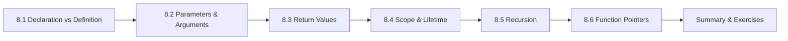

# Chapter 8: Functions

> **Previous:** [Strings](./07-strings.md) | **Next:** [Pointers](./09-pointers.md)

## Learning Objectives

- Declare, define, and call functions correctly
- Understand parameter passing: pass-by-value semantics
- Distinguish between function scope, block scope, and file scope
- Use storage class specifiers: `auto`, `static`, `extern`, `register`
- Create recursive functions (preliminary)


### Chapter at a Glance

| Topic | Key Insight | Practical Takeaway |
|-------|-------------|-------------------|
| Function Declaration | Functions must be declared (prototype) before use | A prototype tells the compiler the return type and parameter types |
| Function Definition | The actual body of the function | Return type, name, parameters, and body form the definition |
| Parameters and Arguments | Arguments are passed by value — a copy is made | Use pointers to simulate pass-by-reference |
| Return Values | Functions can return values via `return` | Returning a pointer to a local variable is a dangling pointer error |
| Scope and Lifetime | Local variables exist only within their enclosing block | Static local variables persist across calls but are only visible in their function |
| Recursion | A function that calls itself | Every recursive function needs a base case to terminate |





## 8.1 Function Basics

A function is a named, reusable block of code that performs a specific task.

```c
return_type function_name(parameter_list) {
    /* function body */
    return value;   /* if return_type is not void */
}
```

```c
#include <stdio.h>

/* Function declaration (prototype) */
int add(int a, int b);

int main(void)
{
    int result = add(5, 3);
    printf("5 + 3 = %d\n", result);
    return 0;
}

/* Function definition */
int add(int a, int b)
{
    return a + b;
}
```

**Output:**
```
5 + 3 = 8
```

### 8.1.1 Function Declaration vs Definition

- **Declaration (prototype):** Tells the compiler the function's name, return type, and parameter types. Ends with a semicolon. Placed at the top of the file or in a header.
- **Definition:** Contains the function body. Must match the declaration.

If a function is called before it is defined and no prototype is visible, the compiler assumes it returns `int` — this is an older K&R behavior that should never be relied upon.


> **One-Sentence Takeaway:** A function declaration prototype tells the compiler the function signature
## 8.2 Parameter Passing: Call by Value

C passes arguments **by value**: the function receives a copy of the argument. Modifying the parameter does not affect the original variable.

```c
#include <stdio.h>

void swap_fails(int x, int y)
{
    int temp = x;
    x = y;
    y = temp;
    printf("Inside function: x = %d, y = %d\n", x, y);
}

int main(void)
{
    int a = 10, b = 20;
    printf("Before: a = %d, b = %d\n", a, b);
    swap_fails(a, b);
    printf("After:  a = %d, b = %d\n", a, b);
    return 0;
}
```

**Output:**
```
Before: a = 10, b = 20
Inside function: x = 20, y = 10
After:  a = 10, b = 20
```

To modify the original variable, pass a pointer:

```c
#include <stdio.h>

void swap(int *x, int *y)
{
    int temp = *x;
    *x = *y;
    *y = temp;
}

int main(void)
{
    int a = 10, b = 20;
    printf("Before: a = %d, b = %d\n", a, b);
    swap(&a, &b);
    printf("After:  a = %d, b = %d\n", a, b);
    return 0;
}
```

**Output:**
```
Before: a = 10, b = 20
After:  a = 20, b = 10
```


> **One-Sentence Takeaway:** C passes all arguments by value making copies of the parameters
## 8.3 Return Types

### 8.3.1 Returning a Value

```c
int square(int n) {
    return n * n;
}
```

### 8.3.2 `void` Functions

```c
void print_heading(void)
{
    printf("========= REPORT =========\n");
}
```

The `void` keyword in the parameter list means the function takes no arguments. In C, an empty parameter list `()` means "unspecified parameters" — always use `void` for zero parameters.

### 8.3.3 Returning Pointers

```c
#include <stdio.h>

int *get_max(int *a, int *b)
{
    return (*a > *b) ? a : b;
}

int main(void)
{
    int x = 10, y = 25;
    int *max_ptr = get_max(&x, &y);
    printf("Max: %d\n", *max_ptr);
    return 0;
}
```

**Never return a pointer to a local variable:**
```c
int *bad_function(void) {
    int local = 42;
    return &local;   /* UNDEFINED BEHAVIOR — local is gone after return */
}
```

> **One-Sentence Takeaway:** Never return a pointer or reference to a local automatic variable

> **Warning:** Returning a pointer to a local array or struct is undefined behavior — the memory is reclaimed when the function returns.
## 8.4 Scope Rules

| Scope | Keyword | Visibility |
|-------|---------|------------|
| Block | (none) | Inside a pair of braces `{}` |
| File | `static` (global) | Within the current source file only |
| Global | (none) | Entire program (all source files that declare it `extern`) |
| Function | `goto` label | Inside the function containing the label |

```c
#include <stdio.h>

int global = 100;          /* file scope — accessible everywhere */

static int file_static = 200;  /* file scope — restricted to this file */

void function(void)
{
    int local = 300;       /* block scope — only inside function */
    static int calls = 0;  /* static local — persists across calls */
    calls++;
    printf("Called %d times\n", calls);
}
```

> **One-Sentence Takeaway:** Block scope variables are created on entry and destroyed on exit from the block

> **Pro Tip:** Declare static variables inside a function when you need to preserve state across calls but limit visibility to that function.
## 8.5 Storage Classes

### 8.5.1 `auto`

`auto` is the default for local variables. Almost never written explicitly.

```c
void f(void) {
    auto int x = 5;    /* same as: int x = 5; */
}
```

### 8.5.2 `static`

**On local variables:** The variable retains its value between function calls. It is initialized only once, at program startup.

```c
#include <stdio.h>

int next_id(void)
{
    static int id = 0;    /* initialized once */
    return id++;
}

int main(void)
{
    for (int i = 0; i < 5; i++) {
        printf("ID: %d\n", next_id());
    }
    return 0;
}
```

**Output:**
```
ID: 0
ID: 1
ID: 2
ID: 3
ID: 4
```

**On global variables and functions:** Limits their visibility to the current source file (internal linkage).

### 8.5.3 `extern`

Declares a variable or function defined in another source file.

**file1.c:**
```c
#include <stdio.h>

int global_counter = 0;   /* definition */

void increment(void) {
    global_counter++;
}
```

**file2.c:**
```c
#include <stdio.h>

extern int global_counter;   /* declaration — defined in file1.c */
extern void increment(void);

int main(void) {
    increment();
    printf("Counter: %d\n", global_counter);
    return 0;
}
```

**Compile together:**
```bash
gcc file1.c file2.c -o program
```

### 8.5.4 `register`

Suggests that the variable be stored in a CPU register for fast access. Compilers today largely ignore this hint.

```c
void quick_sum(int arr[], int n) {
    register int sum = 0;    /* hint to compiler */
    for (register int i = 0; i < n; i++) {
        sum += arr[i];
    }
}
```

**Cannot take the address of a `register` variable.**


> **One-Sentence Takeaway:** Recursive functions call themselves and each call creates a new stack frame
> **Remember:** Deep recursion can overflow the stack prefer iteration for large depths.
## 8.6 Inline Functions (C99)

Inline functions suggest the compiler insert the function body at each call site, avoiding function-call overhead.

```c
static inline int max(int a, int b) {
    return (a > b) ? a : b;
}
```


> **One-Sentence Takeaway:** Function pointers enable callbacks dispatch tables and runtime polymorphism
## 8.7 Recursive Functions (Introduction)

A recursive function calls itself. Every recursive function must have a base case (stopping condition) and a recursive case.

```c
#include <stdio.h>

int factorial(int n)
{
    if (n <= 1) {
        return 1;              /* base case */
    }
    return n * factorial(n - 1); /* recursive case */
}

int main(void)
{
    printf("5! = %d\n", factorial(5));
    return 0;
}
```

**Output:**
```
5! = 120
```

Recursion is covered in depth in Chapter 14.

## 8.8 Function Organization and Style

- Each function should do **one thing**.
- Keep functions short — ideally under 50 lines.
- Use descriptive names: `calculate_average` not `calc_avg`.
- Declare functions before they are called (prototypes at file top).
- Validate parameters at function entry.

```c
#include <stdio.h>
#include <stdbool.h>

/* Good practice — parameter validation */
double divide(int numerator, int denominator)
{
    if (denominator == 0) {
        fprintf(stderr, "Error: division by zero\n");
        return 0.0;
    }
    return (double)numerator / denominator;
}

int main(void)
{
    printf("%.2f\n", divide(10, 3));
    printf("%.2f\n", divide(5, 0));
    return 0;
}
```

**Output:**
```
3.33
Error: division by zero
0.00
```

## Concept Comparison Table

| Concept | Declaration | Definition | Scope |
|---------|-------------|------------|-------|
| Syntax | `int add(int, int);` | `int add(int a, int b) { return a + b; }` | — |
| Memory | None (just a promise) | Code in text segment | — |
| Global variable | `extern int g;` | `int g = 5;` at file scope | Entire program |
| Static global | `static int s;` | Same line | This file only |
| Local auto | — | `int x;` inside a function | Enclosing block |
| Static local | — | `static int ct;` inside a function | Function body (value persists) |

## Quick Reference

| Aspect | Syntax |
|--------|--------|
| Prototype | `return_type name(param_list);` |
| Definition | `return_type name(params) { body }` |
| Call | `result = name(args);` |
| Void function | `void func(params) { ... }` |
| Inline (C99+) | `inline int max(int a, int b) { return a > b ? a : b; }` |
| Function pointer type | `int (*fp)(int, int);` |

## Cross-Application Matrix

| Domain | Function Pattern |
|--------|-----------------|
| Sorting callbacks | Pass `int (*cmp)(const void*, const void*)` to `qsort` |
| Event handlers | Function pointers in callback tables |
| Embedded ISR | `void __attribute__((interrupt)) timer_isr(void)` |
| Mathematical library | Pure functions with `double` parameters |
| API design | Group related functions in a header with consistent naming |

## Chapter Quiz

1. What happens when you return a pointer to a local variable?
   A) It works correctly
   B) The pointer is valid until the next function call
   C) Undefined behavior — the local variable no longer exists
   D) Compiler error

<details><summary>Answer</summary>**C)** Local variables are destroyed when the function returns; accessing their memory is undefined behavior.</details>

2. What is the output of `void f(int x) { x = 5; } int main() { int y = 3; f(y); printf("%d", y); }`?
   A) 3
   B) 5
   C) Undefined
   D) Compiler error

<details><summary>Answer</summary>**A)** C passes by value — `f` modifies a copy, not the original.</details>

3. Where does a `static` local variable store its value between function calls?
   A) On the stack
   B) In the data segment
   C) In a register
   D) On the heap

<details><summary>Answer</summary>**B)** Static local variables are stored in the data segment and persist for the program's lifetime.</details>

## Summary

- Functions consist of a prototype (declaration) and a definition (body).
- C uses pass-by-value: functions receive copies of arguments; use pointers to modify originals.
- Return `void` for functions that produce no value; return pointers carefully (never to locals).
- Scope determines where a name is visible: block, file, or program-wide.
- `static` preserves local variable state across calls; `extern` references names in other files.
- Recursive functions call themselves with a base case and a recursive case.
- Function prototypes prevent type-mismatch errors and implicit-int assumptions.

## Exercises

### Review Questions

1. What is pass-by-value? Give an example where it is insufficient and explain how pointers solve the problem.
2. What is the difference between a function declaration and a function definition?
3. What does the `static` keyword mean when applied to (a) a local variable and (b) a global function?
4. What happens if you call a function without a visible prototype in C89? In C99?
5. Why should you not return the address of a local variable from a function?

### Application Problems

1. Write a function `is_prime` that takes an integer and returns `bool` (from `stdbool.h`). Write a program that prints all primes from 2 to 100 using this function.
2. Write a function `gcd` that computes the greatest common divisor of two integers using Euclid's algorithm. Write a function `lcm` that uses `gcd` to compute the least common multiple.
3. Write a program that simulates a bank account. Provide functions: `void deposit(double *balance, double amount)`, `int withdraw(double *balance, double amount)`, and `void print_balance(double balance)`. The `withdraw` function should return 0 if insufficient funds.
4. Write a program that demonstrates `static` local variables by creating a function that generates sequential invoice numbers starting from 1000.

### Challenge Problem

Write a function `int evaluate(const char *expression)` that evaluates a simple arithmetic expression consisting of integers and the operators `+`, `-`, `*`, `/`, respecting operator precedence (multiplication and division before addition and subtraction) and parentheses. The expression is given as a string. For example, `evaluate("3 + 4 * 2")` should return 11 (not 14), and `evaluate("(3 + 4) * 2")` should return 14. *(This requires implementing a recursive descent parser.)*
