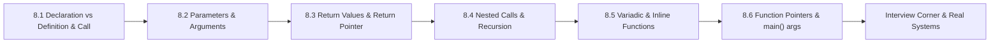

# Chapter 8: Functions

> **Previous:** [Strings](./07-strings.md) | **Next:** [Pointers](./09-pointers.md)

## Learning Objectives

- Declare, define, and call functions correctly
- Understand parameter passing: pass-by-value and pass-by-pointer semantics
- Distinguish between formal and actual parameters
- Use return values and return pointers safely
- Master recursion basics, nested calls, and variadic functions
- Use inline functions, function pointers, and main() arguments

<!-- Image Gallery -->
<section class="lesson-visuals" aria-label="Visual learning resources">
  <header><span>VISUAL LEARNING</span><h2>See it. Review it. Remember it.</h2></header>
  <a class="lesson-visual-card" href="../../../assets/images/lessons/c-programming/08-functions/handwritten-notes.svg" target="_blank" rel="noopener">
    
    <span><strong>Handwritten notes</strong>Condensed notes for deliberate review.</span>
  </a>
  <a class="lesson-visual-card" href="../../../assets/images/lessons/c-programming/08-functions/sticky-notes.svg" target="_blank" rel="noopener">
    
    <span><strong>Sticky-note revision</strong>Fast recall prompts for revision.</span>
  </a>
  <a class="lesson-visual-card" href="../../../assets/images/lessons/c-programming/08-functions/visual-explanation.svg" target="_blank" rel="noopener">
    
    <span><strong>Visual concept guide</strong>A connected explanation of the key ideas.</span>
  </a>
</section>
<!-- End Image Gallery -->


### Chapter at a Glance


| Topic | Key Insight | Practical Takeaway |
|-------|-------------|-------------------|
| Function Declaration | Tells compiler signature before use | Prevents implicit-int errors |
| Function Definition | Actual body with code | Must match declaration exactly |
| Function Call | Transfer control + arguments | Each call creates a new stack frame |
| Formal vs Actual Params | Parameters vs arguments passed | Formal = definition, Actual = call site |
| Pass by Value | Copy made; original unchanged | Use pointers to modify caller's data |
| Pass by Pointer | Address copied; dereference to modify | Most common pattern for output params |
| Return Values | Value sent back to caller via return | Return type must match |
| Return Pointer | Address returned; danger with locals | Never return &local_var |
| Nested Calls | Function calls inside expressions | Each pushed on stack, LIFO order |
| Recursion | Function calls itself | Base case required; risk of stack overflow |
| Variadic Functions | Variable number of arguments (printf) | va_list/va_start/va_arg/va_end |
| Inline Functions | Suggestion to avoid call overhead | Compiler may ignore; good for tiny functions |
| Function Pointers | Store address of function | Enable callbacks and dispatch tables |
| main() Arguments | argc/argv from command line | argv[0] is program name |



## 8.1 Function Components

A **function** is a named, reusable block of code that performs a specific task. Every function has three distinct components: **declaration** (prototype), **definition** (body), and **call** (invocation).

### Real-World Analogy: Vending Machine


| Component | Vending Machine | C Function |
|-----------|----------------|------------|
| Declaration | Menu panel showing what you can buy (selection A1, A2, etc.) | Prototype telling compiler what the function accepts and returns |
| Definition | Internal mechanism → motors, coils, sensors that do the work | Function body with actual implementation code |
| Call | Pressing A1 → you request a specific item | Invoking the function with arguments |
| Return Value | The soda can that drops into the tray | The value sent back via `return` |
| Parameters | Coin slot → you insert coins (inputs) | Arguments passed to the function |

Just as you don't need to know how the vending machine's motor works to press A1, you don't need to know a function's implementation to call it → only its **prototype**.

### 8.1.1 Function Declaration (Prototype)


A **function declaration** (also called a **prototype**) tells the compiler the function's name, return type, and parameter types. It ends with a semicolon and has no body.

**Syntax:**
```c
return_type function_name(parameter_type_list);
```

**Numbered Steps:**
1. Compiler encounters the declaration
2. It records the function's signature (name, return type, parameter types)
3. When a call is encountered later, the compiler checks argument types against the declaration
4. If types mismatch, the compiler issues a warning or error
5. Without a prototype, C assumes the function returns `int` (implicit-int, removed in C99)

**Pseudocode:**
```
DECLARE function with:
    RETURN_TYPE -> int
    NAME        -> add
    PARAMETERS  -> int a, int b
END DECLARATION

// Later, when compiler sees add(5, 3):
CHECK add(5, 3) against declaration:
    Return type: int (OK)
    Argument 1: 5 -> int (OK)
    Argument 2: 3 -> int (OK)
PROCEED with call
```

**Dry Run → Compiler's View:**
```
Line: int add(int a, int b);     → Registers function signature in symbol table
                                    Symbol: add
                                    Return: int
                                    Params: int, int

Line: int result = add(5, 3);    → Looks up "add" in symbol table
                                    Found! Signature matches call.
                                    Generated call instruction.

Line: int add(int a, int b) {    → Matches existing declaration
    return a + b;                   OK, body matches declaration.
}
```

**C Code Example:**
```c
#include <stdio.h>

// Function declaration (prototype)
int add(int a, int b);

int main(void)
{
    int sum = add(10, 20);
    printf("Sum = %d\n", sum);
    return 0;
}

// Function definition
int add(int a, int b)
{
    return a + b;
}
```

**Output:**
```
Sum = 30
```

**Complexity:**
- **Time:** O(1) → declaration is a compile-time construct; no runtime cost
- **Space:** O(1) → stored in compiler's symbol table; no runtime memory

**Edge Cases:**
| Case | Behavior |
|------|----------|
| Missing prototype | Compiler assumes `int` return (implicit-int, warning in C99, error in C11+) |
| Mismatched parameter types | Compiler may warn or implicitly cast; undefined behavior possible |
| Empty parameter list `()` | Means "unspecified parameters" in C; always use `void` |
| `void func(void);` | Explicitly says: zero parameters |
| Declaration without definition | Linker error: unresolved external symbol |

### 8.1.2 Function Definition


A **function definition** contains the executable body. It includes the return type, name, parameter list with names, and the function body in braces.

**Syntax:**
```c
return_type function_name(parameter_list_with_names) {
    // function body
    return value;  // if return_type is not void
}
```

**Numbered Steps (Execution):**
1. Function is called with arguments
2. A new stack frame is allocated
3. Parameters are initialized with copies of arguments (pass-by-value)
4. Local variables are created on the stack
5. Body code executes
6. Return value is computed (if any)
7. Stack frame is destroyed
8. Control returns to caller with the value

**Pseudocode:**
```
DEFINE function max(a, b):
    IF a > b THEN
        RETURN a
    ELSE
        RETURN b
    END IF
END DEFINE
```

**C Code Example:**
```c
#include <stdio.h>

// Definition with body
int max(int a, int b)
{
    int result;          // local variable
    if (a > b) {
        result = a;
    } else {
        result = b;
    }
    return result;
}

int main(void)
{
    int m = max(15, 8);
    printf("Max = %d\n", m);
    return 0;
}
```

**Output:**
```
Max = 15
```

**Complexity:**
- **Time:** O(1) for the function call overhead (constant); body complexity depends on logic
- **Space:** O(n) where n = size of local variables + parameters on the stack frame

**Dry Run → Call Stack for max(15, 8):**

| Step | Stack Frame | Variables | Action |
|------|-------------|-----------|--------|
| 1 | main | (empty) | Before call |
| 2 | main → max | a=15, b=8 | Parameters copied to new frame |
| 3 | main → max | a=15, b=8, result=? | `result` created (uninitialized) |
| 4 | main → max | a=15, b=8, result=15 | `15 > 8` → result = 15 |
| 5 | main → max | returns 15 | return value computed |
| 6 | main | m=15 | max frame popped, result assigned |

### 8.1.3 Function Call


A **function call** transfers control and arguments to the function. The caller is suspended until the function returns.

**Syntax:**
```c
return_variable = function_name(argument_list);
```

**Numbered Steps:**
1. Evaluate each argument expression left-to-right (order unspecified in C, but typically left-to-right)
2. Copy each argument value into the corresponding parameter (pass-by-value)
3. Push a new stack frame (activation record) onto the call stack
4. Save the return address (next instruction after call)
5. Jump to the function's code address
6. Execute the function body
7. On `return`, pop the stack frame
8. Resume execution at the saved return address
9. Use the returned value in the calling expression

**Pseudocode:**
```
PROCEDURE CallFunction(func, args):
    frame = AllocateStackFrame()
    frame.returnAddress = nextInstruction
    CopyArgumentsToParameters(args, frame)
    JUMP to func
END PROCEDURE
```

**C Code Example with Tracing:**
```c
#include <stdio.h>

int multiply(int a, int b)
{
    return a * b;
}

int main(void)
{
    int x = 5;
    int y = 4;
    int product = multiply(x, y);  // function call
    printf("%d * %d = %d\n", x, y, product);
    return 0;
}
```

**Output:**
```
5 * 4 = 20
```

**Dry Run → Complete Call Trace:**

| # | What Happens | main's vars | multiply's frame |
|---|-------------|-------------|------------------|
| 0 | main starts | x=?, y=?, product=? | → |
| 1 | x=5 | x=5 | → |
| 2 | y=4 | x=5, y=4 | → |
| 3 | multiply(x,y) evaluated | x=5, y=4 | → |
| 4 | Push frame for multiply | (suspended) | a=5, b=4 |
| 5 | Body executes: a*b = 20 | (suspended) | returns 20 |
| 6 | Pop frame, assign result | x=5, y=4, product=20 | (popped) |
| 7 | printf executes | x=5, y=4, product=20 | → |

**Edge Cases in Function Calls:**
| Case | Behavior |
|------|----------|
| Too many arguments | Extra arguments evaluated but ignored; compiler warning |
| Too few arguments | Undefined behavior; missing params get garbage values |
| Argument type mismatch | Implicit conversion if possible; UB otherwise |
| Function call with `()` on function pointer | Calls through the pointer |
| Function call as argument | Inner call evaluated first, result passed to outer |

### 8.1.4 Function Components Comparison


| Aspect | Declaration (Prototype) | Definition | Call |
|--------|------------------------|------------|------|
| Syntax | `int add(int, int);` | `int add(int a, int b) { return a+b; }` | `add(5, 3);` |
| Ends with | Semicolon `;` | Closing brace `}` | Semicolon `;` |
| Has body | No | Yes | No |
| Parameter names | Optional | Required | N/A |
| When resolved | Compile time | Compile + Link time | Runtime |
| Memory allocated | None (symbol table) | Code in text segment | Stack frame per call |
| Can appear multiple times | Yes (redeclarations OK) | No (multiple definition error) | Yes (as many as needed) |
| Purpose | Tell compiler signature | Provide implementation | Execute function |

## 8.2 Parameters and Arguments

### 8.2.1 Formal vs Actual Parameters


**Formal parameters** are the variables listed in the function definition. **Actual parameters** (arguments) are the values passed at the call site.

**Real-World Analogy:** A restaurant menu item (formal parameter) describes what the kitchen expects: "Burger with cheese." When you order, you say "Cheeseburger, no onions" → that's the actual parameter. The kitchen slot (formal) receives your specific request (actual).

**Numbered Steps:**
1. Caller evaluates actual arguments
2. Each actual argument is copied into the corresponding formal parameter
3. If types differ, implicit conversion occurs (if possible)
4. The function body operates on the formal parameters
5. Changes to formals do NOT affect actuals (pass-by-value)

**C Code Example:**
```c
#include <stdio.h>

// formal parameters: x, y
void display(int x, char y)
{
    printf("Formal params: x = %d, y = %c\n", x, y);
}

int main(void)
{
    int a = 65;
    char ch = 'Z';
    // actual arguments: a, ch
    display(a, ch);

    // type conversion example:
    display(42.99, 100);  // double→int truncates, int→char converts
    return 0;
}
```

**Output:**
```
Formal params: x = 65, y = Z
Formal params: x = 42, y = d
```

**Dry Run → Parameter Binding:**

| Step | Actual (call site) | Formal (function) | Binding |
|------|-------------------|-------------------|---------|
| 1 | a = 65 | x | 65 → x |
| 2 | ch = 'Z' | y | 'Z' → y |
| 3 | display executes | x=65, y='Z' | Prints "65, Z" |
| 4 | 42.99 (double) | x (int) | 42.99 → 42 (truncated) |
| 5 | 100 (int) | y (char) | 100 → 'd' (ASCII 100) |

**Edge Cases:**
| Case | Behavior |
|------|----------|
| Formal parameter names missing in declaration | Allowed; only types matter for prototype |
| Actual is expression `a + b` | Expression evaluated first, then copied |
| Array as actual parameter | Decays to pointer to first element |
| Mismatch: actual double, formal int | Double truncated to int (loss of precision) |

### 8.2.2 Pass by Value (Call by Value)


C **always** passes arguments by value: the function receives a **copy** of the argument. Modifying the parameter inside the function does NOT affect the original variable.

**Real-World Analogy:** You give a photocopy of your ID to a hotel front desk. They write on the photocopy (stamp it, mark it), but your original ID remains untouched. Each function call gets its own "photocopy" of the data.

**Numbered Steps:**
1. Caller's argument expression is evaluated
2. A copy of the value is created
3. The copy is placed in the function's stack frame (as the formal parameter)
4. Function executes, potentially modifying the copy
5. When function returns, the copy is destroyed
6. Original variable is completely unaffected

**Pseudocode:**
```
FUNCTION swap_fails(x, y):
    temp = x      // x is a COPY of the original
    x = y         // modifies the copy only
    y = temp      // modifies the copy only
    // original variables unchanged!
END FUNCTION

CALL swap_fails(original_a, original_b)
// original_a and original_b are unchanged
```

**C Code Example:**
```c
#include <stdio.h>

void attempt_modify(int a)
{
    printf("  Inside (before): a = %d\n", a);
    a = 999;  // modifies only the copy
    printf("  Inside (after):  a = %d\n", a);
}

int main(void)
{
    int x = 42;
    printf("Before call: x = %d\n", x);
    attempt_modify(x);
    printf("After call:  x = %d\n", x);  // x is STILL 42
    return 0;
}
```

**Output:**
```
Before call: x = 42
  Inside (before): a = 42
  Inside (after):  a = 999
After call:  x = 42
```

**Dry Run → Stack Frames:**

| Step | main's frame | attempt_modify's frame | Action |
|------|-------------|----------------------|--------|
| 1 | x = 42 | → | main running |
| 2 | x = 42 (suspended) | a = 42 (COPY of x) | Call → copy x→a |
| 3 | x = 42 (suspended) | a = 999 | a modified |
| 4 | x = 42 (suspended) | (popped, destroyed) | Return, frame freed |
| 5 | x = 42 | → | main continues, x unchanged |

**Complexity Analysis:**
- **Time:** O(1) for copying scalar values; O(n) for copying large structs
- **Space:** O(size of parameters) per call on the stack
- **Why O(n) for structs?** Because every byte of the struct must be copied. For large structs (>64 bytes), pass-by-pointer is faster.

**Edge Cases:**
| Case | Behavior |
|------|----------|
| Large struct passed by value | Full copy → slow and memory-intensive |
| Array passed "by value" | Array decays to pointer; the pointer is copied, not the array |
| Pointer passed by value | The pointer (address) is copied; target can be modified |
| Double/float passed | Value copied exactly (IEEE 754) |
| Modifying in function | Changes lost after return |
### 8.2.3 Pass by Pointer (Often Misnamed "Pass by Reference")


Since C has no true pass-by-reference, we simulate it by passing a **pointer to the variable**. The pointer itself is passed by value, but we dereference it to modify the original.

**Real-World Analogy:** Instead of giving a photocopy (pass by value), you give the hotel your locker key (pointer). They don't have your locker, but they have the key → and they can use it to open your locker and change what's inside. The key itself is a copy (the address), but it points to the original.

**Numbered Steps:**
1. Caller evaluates the address of the variable (`&var`)
2. The address is copied into the function's pointer parameter (pointer passed by value)
3. Inside the function, `*ptr` dereferences the pointer to access the original variable
4. Changes through `*ptr` affect the original
5. The pointer itself cannot be changed to point elsewhere permanently (that would require pointer-to-pointer)

**Pseudocode:**
```
FUNCTION swap(ptr_x, ptr_y):
    // ptr_x and ptr_y are COPIES of the addresses
    temp = *ptr_x       // read original value through ptr_x
    *ptr_x = *ptr_y     // write to original variable through ptr_x
    *ptr_y = temp       // write to original variable through ptr_y
END FUNCTION

CALL swap(&original_a, &original_b)
// original_a and original_b ARE now swapped
```

**C Code Example:**
```c
#include <stdio.h>

void swap(int *ptr_x, int *ptr_y)
{
    int temp = *ptr_x;   // read value at address ptr_x
    *ptr_x = *ptr_y;     // write to address ptr_x
    *ptr_y = temp;       // write to address ptr_y
}

int main(void)
{
    int a = 10, b = 20;
    printf("Before: a = %d, b = %d\n", a, b);
    swap(&a, &b);        // pass addresses
    printf("After:  a = %d, b = %d\n", a, b);
    return 0;
}
```

**Output:**
```
Before: a = 10, b = 20
After:  a = 20, b = 10
```

**Dry Run → Memory and Stack Trace:**

| Step | main's frame | swap's frame | Memory at &a | Memory at &b |
|------|-------------|-------------|-------------|-------------|
| 1 | a=10, b=20 | → | 10 | 20 |
| 2 | a=10, b=20 (suspended) | ptr_x = &a, ptr_y = &b | 10 | 20 |
| 3 | (suspended) | ptr_x=&a, ptr_y=&b, temp=10 | 10 | 20 |
| 4 | (suspended) | *ptr_x = *ptr_y → a = b | **a=20** | 20 |
| 5 | (suspended) | *ptr_y = temp → b = 10 | 20 | **b=10** |
| 6 | a=20, b=10 | (popped) | 20 | 10 |

**Complexity Analysis:**
- **Time:** O(1) → only address copied (4 or 8 bytes), regardless of what the pointer points to
- **Space:** O(1) → pointer size (4 bytes on 32-bit, 8 bytes on 64-bit)
- **Why O(1) for large data?** We copy the address, not the data. Passing a 1 MB struct by pointer copies only 8 bytes.

**Edge Cases:**
| Case | Behavior |
|------|----------|
| NULL pointer passed | Dereferencing causes segmentation fault |
| Modifying the pointer itself | Only changes the local copy; caller unaffected |
| Pointer to const (`const int *p`) | Read-only access to original; modification disallowed |
| Pointer-to-pointer (`int **p`) | Allows modifying the original pointer's value |
| Array parameter `int arr[]` | Degrades to pointer automatically |

### 8.2.4 Parameter Passing Comparison


| Aspect | Pass by Value | Pass by Pointer |
|--------|--------------|----------------|
| What's copied | The actual data | The address of the data |
| Can modify original? | No | Yes (via dereference) |
| Speed for small types | Fast (no indirection) | Slightly slower (indirection) |
| Speed for large structs | Slow (full copy) | Fast (copy address only) |
| Nullable? | N/A (always has a value) | Yes (can be NULL → check it!) |
| Syntax in function | `int a` | `int *a` |
| Syntax at call | `func(var)` | `func(&var)` |
| Use case | Read-only, small data | Modify original, large data |
| Safety | Safe → can't corrupt caller | Risk of NULL deref, aliasing |
| Const correctness | N/A | `const int *p` for read-only |

## 8.3 Return Values

### 8.3.1 Returning Basic Types


A function returns a value of the declared return type using the `return` statement.

**Real-World Analogy:** The vending machine's dispensing tray. You put money in (arguments), press a button; the machine processes your request and drops a soda can into the tray → the return value.

**Numbered Steps:**
1. Function computes the return expression
2. The expression result is copied (or a temporary is created)
3. The stack frame begins to be torn down
4. Local variables are destroyed
5. The return value is placed where the caller can access it (typically in a register or a specific stack location)
6. Control jumps back to the caller
7. Caller uses the value in an expression

**Pseudocode:**
```
FUNCTION square(n):
    result = n * n
    RETURN result        // copy result to caller
END FUNCTION
```

**C Code Example:**
```c
#include <stdio.h>

int square(int n)
{
    return n * n;
}

double circle_area(double radius)
{
    const double PI = 3.1415926535;
    return PI * radius * radius;
}

int main(void)
{
    int sq = square(7);
    double area = circle_area(5.0);

    printf("7 squared = %d\n", sq);
    printf("Area of r=5 = %.4f\n", area);
    return 0;
}
```

**Output:**
```
7 squared = 49
Area of r=5 = 78.5398
```

**Dry Run → Return Flow for square(7):**

| Step | Action | stack state |
|------|--------|------------|
| 1 | Call square(7): n=7 | main → square |
| 2 | Compute 7*7 = 49 | main → square |
| 3 | Save 49 to return register | main → square |
| 4 | Pop square's stack frame | main |
| 5 | Return value 49 available | main, result = 49 |

### 8.3.2 void Functions


`void` functions perform actions but return no value.

```c
#include <stdio.h>

void print_header(const char *title)
{
    printf("\n=== %s ===\n", title);
}

int main(void)
{
    print_header("Report");
    // no return value to use
    return 0;
}
```

**Output:**
```
=== Report ===
```

**Important:** You can use `return;` (without a value) in a void function to exit early:
```c
void process(int value)
{
    if (value < 0) {
        return;  // early exit, no value
    }
    printf("Processing %d\n", value);
}
```

### 8.3.3 Returning Pointers


Returning a pointer from a function is powerful but dangerous. The pointer must point to memory that **outlives** the function call.

**Safe cases:** Return pointer to static variable, heap-allocated memory, or an input parameter.

```c
#include <stdio.h>
#include <stdlib.h>

// Safe: returns pointer to static array
int* get_fixed_array(void)
{
    static int arr[3] = {10, 20, 30};
    return arr;
}

// Safe: returns heap-allocated memory
int* create_array(int size)
{
    int* arr = (int*)malloc(size * sizeof(int));
    return arr;
}

// Safe: returns one of the input pointers
int* get_max_ptr(int *a, int *b)
{
    return (*a > *b) ? a : b;
}

int main(void)
{
    int *fixed = get_fixed_array();
    printf("Fixed[0] = %d\n", fixed[0]);

    int x = 50, y = 80;
    int *max = get_max_ptr(&x, &y);
    printf("Max is %d\n", *max);

    int *heap_arr = create_array(5);
    heap_arr[0] = 100;
    printf("Heap[0] = %d\n", heap_arr[0]);
    free(heap_arr);
    return 0;
}
```

**Output:**
```
Fixed[0] = 10
Max is 80
Heap[0] = 100
```

### 8.3.4 DANGER: Returning Address of Local Variable


**Never** return a pointer to a local (automatic) variable. The variable's memory is reclaimed when the function returns.

```c
#include <stdio.h>

int* dangerous(void)
{
    int local = 42;
    return &local;   // BUG: local is destroyed after return
}

int main(void)
{
    int *p = dangerous();
    printf("%d\n", *p);  // UNDEFINED BEHAVIOR
    // Could print 42, print garbage, or crash
    return 0;
}
```

**Why this fails:**
| Step | Stack State | Value at &local |
|------|------------|----------------|
| dangerous() executing | main → dangerous | 42 |
| return &local executed | main → dangerous | address returned |
| dangerous() returns | main | **frame popped → memory freed** |
| main prints *p | main | **memory may be overwritten by next call** |

**Compiler Warning:** Most modern compilers warn: `function returns address of local variable`.

### 8.3.5 Return struct vs Return Pointer


| Aspect | Return struct | Return pointer (to static/global) |
|--------|--------------|-----------------------------------|
| Memory | Whole struct copied (potentially large) | Only pointer copied (4/8 bytes) |
| Thread safety | Safe (each call gets own copy) | Unsafe (static shared across calls) |
| Reentrant | Yes | No |
| Can return NULL? | No | Yes (indicate failure) |
| Caller must free? | No | Only if heap-allocated |
| Speed for large data | Slow (copy) | Fast |
| Example | `struct Point get_pos(void)` | `int* get_buffer(void)` |
## 8.4 Nested Function Calls

**Nested calls** occur when a function call's argument is itself a function call. The inner calls are evaluated first, and their results become arguments to the outer call.

**Real-World Analogy:** An assembly line: the output of station 1 feeds into station 2, which feeds into station 3. `final = station3(station2(station1(input)))`.

**Numbered Steps:**
1. Evaluate the innermost function call first
2. Suspend the outer call's argument evaluation
3. Push a stack frame for the inner function
4. Inner function executes and returns
5. Pop the inner frame; result is now a computed argument
6. Repeat for next level, if any
7. Finally, the outermost function executes

**C Code Example:**
```c
#include <stdio.h>

int add(int a, int b)
{
    printf("  add(%d, %d) called\n", a, b);
    return a + b;
}

int multiply(int a, int b)
{
    printf("  multiply(%d, %d) called\n", a, b);
    return a * b;
}

int main(void)
{
    // Nested call: multiply( add(3,4), add(5,2) )
    int result = multiply(add(3, 4), add(5, 2));
    printf("Result = %d\n", result);
    return 0;
}
```

**Output:**
```
  add(3, 4) called
  add(5, 2) called
  multiply(7, 7) called
Result = 49
```

**Dry Run → Call Stack Evolution:**

| Step | Call Stack (top →) | Action | Value |
|------|-------------------|--------|-------|
| 1 | main | Starting | → |
| 2 | main → multiply | Before args evaluated | → |
| 3 | main → multiply → add | Evaluate first arg: add(3,4) | → |
| 4 | main → multiply | add returned 7 | Arg1 = 7 |
| 5 | main → multiply → add | Evaluate second arg: add(5,2) | → |
| 6 | main → multiply | add returned 7 | Arg2 = 7 |
| 7 | main → multiply | multiply(7,7) executes | Returns 49 |
| 8 | main | Result = 49 | → |

**Complexity Analysis:**
- **Time:** O(n) where n = number of nested calls; each call adds overhead
- **Space:** O(d) where d = depth of nesting (each level adds a stack frame)
- **Why not O(1)?** Each nested level consumes stack space; deeply nested calls can overflow

**Edge Case → Order of Evaluation:**
```c
#include <stdio.h>

int next(int *x)
{
    return ++(*x);
}

int add(int a, int b)
{
    return a + b;
}

int main(void)
{
    int n = 10;
    // Order of evaluation of arguments is UNSPECIFIED in C
    // Could be add(next(&n), next(&n)) → add(11, 12) or add(12, 11)
    int r = add(next(&n), next(&n));
    printf("n = %d, result = %d\n", n, r);
    return 0;
}
```

**Output (compiler-dependent):**
```
n = 12, result = 23   // or result = 23 either way
```

**Key insight:** The result is the same here since both arguments are 11 and 12 (sum 23) regardless of order. But avoid code where the order matters (`sequence point` rules).

## 8.5 Recursion Basics

A **recursive function** calls itself. Every recursive function needs:
1. **Base case** → a condition that stops the recursion
2. **Recursive case** → the function calls itself with a simpler problem

**Real-World Analogy:** Russian nesting dolls (matryoshka). To open the largest doll, you open it → find a smaller one → open it → find a smaller one → ... → until you reach the smallest doll that doesn't open (the base case). Then you assemble them back.

### 8.5.1 Factorial → Step-by-Step


**Numbered Steps for factorial(4):**
1. factorial(4): 4 > 1 → 4 * factorial(3)
2. factorial(3): 3 > 1 → 3 * factorial(2)
3. factorial(2): 2 > 1 → 2 * factorial(1)
4. factorial(1): 1 &lt;= 1 → return 1 (BASE CASE)
5. factorial(2) receives 1 → 2 * 1 = 2 → return 2
6. factorial(3) receives 2 → 3 * 2 = 6 → return 6
7. factorial(4) receives 6 → 4 * 6 = 24 → return 24

**Pseudocode:**
```
FUNCTION factorial(n):
    IF n <= 1 THEN           // base case
        RETURN 1
    ELSE                     // recursive case
        RETURN n * factorial(n - 1)
    END IF
END FUNCTION
```

**C Code Example:**
```c
#include <stdio.h>

int factorial(int n)
{
    if (n <= 1) {
        printf("  base case: factorial(%d) = 1\n", n);
        return 1;
    }
    printf("  factorial(%d) = %d * factorial(%d)\n", n, n, n-1);
    int result = n * factorial(n - 1);
    printf("  factorial(%d) = %d\n", n, result);
    return result;
}

int main(void)
{
    printf("Final: 4! = %d\n", factorial(4));
    return 0;
}
```

**Output:**
```
  factorial(4) = 4 * factorial(3)
  factorial(3) = 3 * factorial(2)
  factorial(2) = 2 * factorial(1)
  base case: factorial(1) = 1
  factorial(2) = 2
  factorial(3) = 6
  factorial(4) = 24
Final: 4! = 24
```

**Dry Run → Call Stack Trace for factorial(4):**

| Step | Call Stack | n | Waiting for | Action |
|------|-----------|-----|------------|--------|
| 1 | main | → | → | Calls factorial(4) |
| 2 | main → fact(4) | 4 | fact(3) | 4 * fact(3) |
| 3 | main → fact(4) → fact(3) | 3 | fact(2) | 3 * fact(2) |
| 4 | main → fact(4) → fact(3) → fact(2) | 2 | fact(1) | 2 * fact(1) |
| 5 | main → fact(4) → fact(3) → fact(2) → fact(1) | 1 | → | Base! Returns 1 |
| 6 | main → fact(4) → fact(3) → fact(2) | 2 | → | Returns 2 * 1 = 2 |
| 7 | main → fact(4) → fact(3) | 3 | → | Returns 3 * 2 = 6 |
| 8 | main → fact(4) | 4 | → | Returns 4 * 6 = 24 |
| 9 | main | → | → | Prints 24 |

### 8.5.2 Fibonacci → Two Recursive Calls


```c
#include <stdio.h>

int fib(int n)
{
    if (n <= 1) {
        return n;
    }
    return fib(n - 1) + fib(n - 2);
}

int main(void)
{
    printf("fib(6) = %d\n", fib(6));
    return 0;
}
```

**Output:**
```
fib(6) = 8
```

**Complexity Analysis:**
- **Time:** O(2^n) → exponential! Each call spawns 2 more calls
- **Space:** O(n) → maximum stack depth = n
- **Why O(2^n)?** Fib(n) calls Fib(n-1) and Fib(n-2); this binary tree doubles at each level
- **Optimization:** Use memoization or iterative approach for O(n)

**Edge Cases:**
| Case | Problem | Solution |
|------|---------|----------|
| No base case | Infinite recursion → stack overflow | Always have a base case |
| Negative input | May never reach base case | Check input validity |
| Large n (e.g., n=100000) | Stack overflow | Use iteration instead |
| Multiple recursive calls | Exponential time | Memoization or dynamic programming |

## 8.6 Variadic Functions

**Variadic functions** accept a variable number of arguments. The most famous example is `printf`. They require:
- At least one **fixed** parameter (to start the list)
- `<stdarg.h>` macros: `va_list`, `va_start`, `va_arg`, `va_end`

**Real-World Analogy:** A buffet restaurant with a fixed entry price (the count parameter) and then you can take as many food items (variable arguments) as you want, as long as you have a plate (the va_list) to carry them.

**Numbered Steps:**
1. Declare a `va_list` variable (acts as an iterator)
2. Call `va_start(ap, last_fixed)` to initialize the list
3. Call `va_arg(ap, type)` repeatedly to retrieve each argument
4. Call `va_end(ap)` to clean up

**Pseudocode:**
```
FUNCTION sum(count, ...):
    total = 0
    args = va_start(last_fixed = count)  // initialize iterator
    FOR i = 0 TO count - 1:
        value = va_arg(args, int)         // get next int argument
        total = total + value
    END FOR
    va_end(args)                          // cleanup
    RETURN total
END FUNCTION
```

**C Code Example:**
```c
#include <stdio.h>
#include <stdarg.h>

// Sum a variable number of integers
int sum(int count, ...)
{
    va_list args;
    int total = 0;

    va_start(args, count);    // initialize after last fixed param

    for (int i = 0; i < count; i++) {
        int val = va_arg(args, int);  // get next int
        total += val;
    }

    va_end(args);             // cleanup
    return total;
}

// Variadic with type tag
double average(int count, ...)
{
    va_list args;
    double total = 0.0;

    va_start(args, count);

    for (int i = 0; i < count; i++) {
        total += va_arg(args, double);  // NOTE: type must match!
    }

    va_end(args);
    return total / count;
}

int main(void)
{
    printf("sum(3, 10, 20, 30) = %d\n", sum(3, 10, 20, 30));
    printf("sum(5, 1,2,3,4,5)  = %d\n", sum(5, 1, 2, 3, 4, 5));

    printf("average(4, 1.0, 2.0, 3.0, 4.0) = %.2f\n",
           average(4, 1.0, 2.0, 3.0, 4.0));
    return 0;
}
```

**Output:**
```
sum(3, 10, 20, 30) = 60
sum(5, 1,2,3,4,5)  = 15
average(4, 1.0, 2.0, 3.0, 4.0) = 2.50
```

**Dry Run → Variadic Argument Retrieval for sum(3, 10, 20, 30):**

| Step | va_list state | Action | Return value |
|------|-------------|--------|-------------|
| 1 | va_start(args, count) | args points to first variadic arg | → |
| 2 | i=0 | va_arg(args, int) → reads 10 | 10 |
| 3 | i=1 | va_arg(args, int) → reads 20 | 20 |
| 4 | i=2 | va_arg(args, int) → reads 30 | 30 |
| 5 | va_end(args) | Cleanup | total = 60 |

**Complexity Analysis:**
- **Time:** O(n) where n = number of variadic arguments
- **Space:** O(1) → only the va_list pointer; arguments are on the stack
- **Why not zero overhead?** Each va_arg call must advance the pointer and check default argument promotions

**Edge Cases:**
| Case | Issue |
|------|-------|
| No variadic arguments | va_arg called when none left → UB |
| Wrong type in va_arg | Undefined behavior (default argument promotions apply) |
| No fixed parameter | Not allowed → must have at least one named parameter |
| va_start with wrong param | Undefined behavior (must use last named parameter) |
| Forgetting va_end | Implementation-defined (may leak memory on some platforms) |
| Passing float | Default promotion: float → double; use va_arg(args, double) |
| Passing char/short | Default promotion: char/short → int; use va_arg(args, int) |

### Custom Printf-style Function


```c
#include <stdio.h>
#include <stdarg.h>

void my_printf(const char *fmt, ...)
{
    va_list args;
    va_start(args, fmt);

    for (const char *p = fmt; *p != '\0'; p++) {
        if (*p == '%') {
            p++;
            switch (*p) {
                case 'd':
                    printf("%d", va_arg(args, int));
                    break;
                case 'f':
                    printf("%f", va_arg(args, double));
                    break;
                case 'c':
                    printf("%c", va_arg(args, int));  // char promoted to int
                    break;
                case 's':
                    printf("%s", va_arg(args, const char*));
                    break;
                case '%':
                    putchar('%');
                    break;
                default:
                    putchar('%');
                    putchar(*p);
                    break;
            }
        } else {
            putchar(*p);
        }
    }

    va_end(args);
}

int main(void)
{
    my_printf("Int: %d, Float: %.2f, Str: %s\n", 42, 3.14, "Hello");
    return 0;
}
```

**Output:**
```
Int: 42, Float: 3.14, Str: Hello
```

## 8.7 Inline Functions

An **inline function** suggests to the compiler that the function body be inserted directly at the call site, avoiding function-call overhead.

**Real-World Analogy:** Instead of going to a separate office (calling a function) every time you need a stapler, you keep a stapler at your desk (inline the code). Faster, but every desk needs its own stapler (code bloat).

**Syntax:**
```c
inline return_type function_name(parameters) {
    // body
}
```

**C Code Example:**
```c
#include <stdio.h>

// Inline function definition (best with static)
static inline int max(int a, int b)
{
    return (a > b) ? a : b;
}

static inline int clamp(int value, int low, int high)
{
    if (value < low) return low;
    if (value > high) return high;
    return value;
}

int main(void)
{
    int a = 42, b = 17;
    printf("max(%d, %d) = %d\n", a, b, max(a, b));
    // The compiler may replace max(a,b) with: (a > b) ? a : b

    int v = 150;
    printf("clamp(%d, 0, 100) = %d\n", v, clamp(v, 0, 100));
    return 0;
}
```

**Output:**
```
max(42, 17) = 42
clamp(150, 0, 100) = 100
```

### Inline Functions vs Macros


| Aspect | Inline Function | Macro (#define) |
|--------|----------------|-----------------|
| Type checking | Full type checking | No type checking (text substitution) |
| Evaluation | Arguments evaluated once | Arguments re-evaluated each time in text |
| Debugging | Debugger can step through | Debugger sees expanded code |
| Side effects | Safe: `max(x++, y)` works correctly | Dangerous: `MAX(x++, y)` evaluates x++ twice |
| Scope | Has its own scope | Global text replacement |
| Can contain loops | Yes | Yes (with do-while trick) |
| Can return | Yes | Via expression or GCC extension |
| Compiler control | Compiler may ignore `inline` | Always expanded |
| Code size | Small expansions, worse if large | Always expanded |

**Macro Danger Example:**
```c
#define SQUARE(x) ((x) * (x))
// SQUARE(++a) expands to ((++a) * (++a)) → UB!

static inline int square_inline(int x) { return x * x; }
// square_inline(++a) works correctly: ++a evaluated once
```

### When to Use Inline:

- Very small functions (2-5 lines)
- Functions called frequently in performance-critical code
- Getters/setters in header files
- **Do NOT use for:** Large functions, I/O-bound code, or virtual-like behavior
## 8.8 Function Pointers

A **function pointer** stores the address of a function. Function pointers enable callbacks, dispatch tables, and runtime polymorphism in C.

**Real-World Analogy:** A TV remote's buttons. You press "Volume Up" (the function pointer), and it calls the TV's `increase_volume()` function. The remote doesn't know how the TV does it → it just holds a reference to the function. Different TVs can have different implementations.

**Syntax:**
```c
return_type (*pointer_name)(parameter_types);
```

**Numbered Steps:**
1. Declare a function pointer with matching signature
2. Assign the address of a function (use function name without parentheses)
3. Call through the pointer (with or without explicit dereference)
4. The pointer can be reassigned to any function with the same signature

**Pseudocode:**
```
DECLARE operation as function pointer:
    TYPE: int (*)(int, int)
    NAME: operation

ASSIGN: operation = add
CALL:   result = operation(5, 3)    // calls add(5, 3)

REASSIGN: operation = subtract
CALL:     result = operation(5, 3)  // calls subtract(5, 3)
```

**C Code Example:**
```c
#include <stdio.h>

// Functions with same signature
int add(int a, int b)      { return a + b; }
int subtract(int a, int b) { return a - b; }
int multiply(int a, int b) { return a * b; }
int divide(int a, int b)   { return b != 0 ? a / b : 0; }

int main(void)
{
    // Declare function pointer
    int (*operation)(int, int);

    int x = 20, y = 5;

    // Assign and call
    operation = add;
    printf("add: %d\n", operation(x, y));

    operation = subtract;
    printf("subtract: %d\n", operation(x, y));

    operation = multiply;
    printf("multiply: %d\n", operation(x, y));

    operation = divide;
    printf("divide: %d\n", operation(x, y));

    return 0;
}
```

**Output:**
```
add: 25
subtract: 15
multiply: 100
divide: 4
```

### 8.8.1 Function Pointer Array (Dispatch Table)


Instead of if-else chains, use an array of function pointers.

```c
#include <stdio.h>

int add(int a, int b)      { return a + b; }
int subtract(int a, int b) { return a - b; }
int multiply(int a, int b) { return a * b; }
int divide(int a, int b)   { return b ? a / b : 0; }

int main(void)
{
    // Array of function pointers
    int (*ops[])(int, int) = {add, subtract, multiply, divide};
    const char *names[] = {"add", "subtract", "multiply", "divide"};

    int x = 20, y = 5;

    for (int i = 0; i < 4; i++) {
        printf("%s(%d, %d) = %d\n", names[i], x, y, ops[i](x, y));
    }

    return 0;
}
```

**Output:**
```
add(20, 5) = 25
subtract(20, 5) = 15
multiply(20, 5) = 100
divide(20, 5) = 4
```

### 8.8.2 Callback with qsort


```c
#include <stdio.h>
#include <stdlib.h>

// Comparison function for qsort
int compare_int(const void *a, const void *b)
{
    int ia = *(const int*)a;
    int ib = *(const int*)b;
    return (ia > ib) - (ia < ib);  // returns -1, 0, or 1
}

int compare_desc(const void *a, const void *b)
{
    return compare_int(b, a);  // reverse order
}

void print_array(int arr[], int n)
{
    for (int i = 0; i < n; i++)
        printf("%d ", arr[i]);
    printf("\n");
}

int main(void)
{
    int arr[] = {42, 7, 15, 3, 99, 22};
    int n = sizeof(arr) / sizeof(arr[0]);

    printf("Original: "); print_array(arr, n);

    // qsort takes a function pointer as callback
    qsort(arr, n, sizeof(int), compare_int);
    printf("Ascending: "); print_array(arr, n);

    qsort(arr, n, sizeof(int), compare_desc);
    printf("Descending: "); print_array(arr, n);

    return 0;
}
```

**Output:**
```
Original: 42 7 15 3 99 22
Ascending: 3 7 15 22 42 99
Descending: 99 42 22 15 7 3
```

### 8.8.3 Typedef for Function Pointers


```c
#include <stdio.h>

// Typedef makes function pointer syntax readable
typedef int (*MathOp)(int, int);

int add(int a, int b)      { return a + b; }
int subtract(int a, int b) { return a - b; }
int multiply(int a, int b) { return a * b; }

int calculate(MathOp op, int x, int y)
{
    return op(x, y);
}

int main(void)
{
    MathOp op = add;
    printf("%d\n", calculate(op, 10, 5));

    op = multiply;
    printf("%d\n", calculate(op, 10, 5));
    return 0;
}
```

**Output:**
```
15
50
```

**Complexity Analysis:**
- **Time:** O(1) → indirect call through pointer (one extra indirection vs direct call)
- **Space:** O(1) → pointer size (4 or 8 bytes)
- **Why not zero overhead?** Function pointer calls cannot be inlined (compiler doesn't know target at compile time)

**Edge Cases:**
| Case | Behavior |
|------|----------|
| NULL function pointer | Dereferencing causes crash |
| Signature mismatch | Undefined behavior |
| Returning function pointer | Syntax is complex but valid |
| Function pointer to self | Valid; can create recursive structures |

## 8.9 main() Arguments: argc and argv

The `main` function receives command-line arguments through two parameters:
- `argc` (argument count) → number of command-line arguments including program name
- `argv` (argument vector) → array of strings, each is one argument

**Real-World Analogy:** A restaurant order slip. `argc` is the number of items on the slip; `argv` is the slip itself: `argv[0]` = "waiter knows the restaurant name" (program name), `argv[1]` = "burger", `argv[2]` = "fries", etc.

**Standard Signatures:**
```c
int main(void);                                          // no args
int main(int argc, char *argv[]);                        // with args
int main(int argc, char **argv);                         // equivalent (pointer to pointer)
// Implementation-defined variants:
int main(int argc, char *argv[], char *envp[]);          // POSIX: environment
```

**Numbered Steps:**
1. OS constructs command line from the shell input
2. OS splits the command line into tokens (arguments separated by whitespace)
3. `argc` is set to the number of tokens
4. `argv` is an array of `argc+1` strings (last is NULL)
5. `argv[0]` is always the program name (or path used to invoke it)
6. `argv[1]` through `argv[argc-1]` are the actual arguments
7. `argv[argc]` is NULL (sentinel)

**Pseudocode:**
```
PROCEDURE main(argc, argv):
    PRINT "Program name:", argv[0]
    PRINT "Argument count:", argc - 1   // exclude program name
    FOR i = 1 TO argc - 1:
        PRINT "Arg", i, ":", argv[i]
    END FOR
END PROCEDURE
```

**C Code Example:**
```c
#include <stdio.h>

int main(int argc, char *argv[])
{
    printf("Program name: %s\n", argv[0]);
    printf("Number of arguments: %d\n", argc - 1);

    for (int i = 1; i < argc; i++) {
        printf("  argv[%d] = %s\n", i, argv[i]);
    }

    printf("argv[%d] = %s\n", argc, argv[argc] ? argv[argc] : "NULL");

    return 0;
}
```

**Output** (run as `./program hello world 42`):
```
Program name: ./program
Number of arguments: 3
  argv[1] = hello
  argv[2] = world
  argv[3] = 42
argv[4] = NULL
```

### 8.9.1 Argument Parsing Example


```c
#include <stdio.h>
#include <stdlib.h>

int main(int argc, char *argv[])
{
    if (argc < 3) {
        fprintf(stderr, "Usage: %s <number> <name>\n", argv[0]);
        return 1;
    }

    // Convert string argument to integer
    int num = atoi(argv[1]);

    // String argument
    const char *name = argv[2];

    printf("Number: %d, Name: %s\n", num, name);
    return 0;
}
```

**Output** (run as `./app 42 Alice`):
```
Number: 42, Name: Alice
```

### 8.9.2 main() Variants


| Signature | Availability | Use |
|-----------|-------------|-----|
| `int main(void)` | All standards | No arguments needed |
| `int main()` | C89, C99+ deprecated | Means "unspecified parameters" |
| `int main(int argc, char *argv[])` | All standards | Command-line arguments |
| `int main(int argc, char **argv)` | All standards | Equivalent to above |
| `int main(int argc, char *argv[], char *envp[])` | POSIX/Linux | Environment variables |
| `void main()` | Non-standard, not recommended | Wrong on hosted implementations |

**Important:** The C standard says `main` shall be defined as `int main(void)` or `int main(int argc, char *argv[])`. Using `void main()` is non-standard and may cause undefined behavior.

**Edge Cases:**
| Case | Behavior |
|------|----------|
| No arguments | argc = 1, argv[0] = program name, argv[1] = NULL |
| Empty string argument (`""`) | A token is counted: `argv` contains `""` |
| Argument with spaces | Must be quoted on command line |
| Very long arguments | OS-dependent limit (usually 128K-2MB on Linux) |
| argv[0] could be NULL | Some exotic systems; guard against it |

## 8.10 Scope and Storage Classes (Existing)

### 8.10.1 Scope Rules


| Scope | Keyword | Visibility |
|-------|---------|------------|
| Block | (none) | Inside a pair of braces `{}` |
| File | `static` (global) | Within the current source file only |
| Global | (none) | Entire program (all source files that declare it `extern`) |
| Function | `goto` label | Inside the function containing the label |

```c
#include <stdio.h>

int global = 100;          /* file scope → accessible everywhere */

static int file_static = 200;  /* file scope → restricted to this file */

void function(void)
{
    int local = 300;       /* block scope → only inside function */
    static int calls = 0;  /* static local → persists across calls */
    calls++;
    printf("Called %d times\n", calls);
}
```

> **One-Sentence Takeaway:** Block scope variables are created on entry and destroyed on exit from the block.

### 8.10.2 Storage Classes


**auto:**
```c
void f(void) {
    auto int x = 5;    /* same as: int x = 5; */
}
```

**static (local):**
```c
#include <stdio.h>

int next_id(void)
{
    static int id = 0;    /* initialized once */
    return id++;
}

int main(void)
{
    for (int i = 0; i < 5; i++) {
        printf("ID: %d\n", next_id());
    }
    return 0;
}
```

**Output:**
```
ID: 0
ID: 1
ID: 2
ID: 3
ID: 4
```

**extern:**
```c
// file1.c
int global_counter = 0;
void increment(void) { global_counter++; }

// file2.c
extern int global_counter;
extern void increment(void);
int main(void) { increment(); return 0; }
```

**register:**
```c
void quick_sum(int arr[], int n) {
    register int sum = 0;    /* hint to compiler (mostly ignored today) */
    for (register int i = 0; i < n; i++) {
        sum += arr[i];
    }
}
```

## 8.11 Interview Corner

### Q1: Does C have pass-by-reference?


**No.** C only has pass-by-value. What's often called "pass-by-reference" in C is actually **pass-by-pointer**, which is still pass-by-value of the address.

| Aspect | Pass by Value | Pass by Pointer |
|--------|--------------|-----------------|
| What's on stack | Copy of the data | Copy of the address |
| Modify original? | No | Yes (dereference) |
| Real pass-by-reference (C++) | `void f(int &x)` | `x` is an alias; no dereference needed |

```c
// This is NOT pass-by-reference → it's pass-by-pointer
void swap(int *x, int *y) {
    int t = *x; *x = *y; *y = t;
}
// In C++ true reference:
// void swap(int &x, int &y) { int t = x; x = y; y = t; }
```

### Q2: Function pointer vs If-Else chain


| Aspect | Function Pointer Array | If-Else/Select chain |
|--------|----------------------|---------------------|
| Speed | O(1) direct dispatch | O(n) linear search |
| Maintainability | Add entry → add function | Modify chain → risk of bugs |
| Code size | Small dispatch code | Repetitive condition checks |
| Flexibility | Can be built at runtime | Fixed at compile time |
| Readability | Cleaner with many options | Clearer with 2-3 options |

**Rule of thumb:** 3+ operations → use function pointer array; 2-3 → if-else is fine.

### Q3: Variadic vs Regular Arguments


| Aspect | Regular | Variadic |
|--------|---------|----------|
| Type safety | Compiler checks types | No type checking |
| Fixed count? | Yes | No |
| Overhead | Zero | Slight (va_list machinery) |
| Performance | Faster | Marginally slower |
| Use case | Most functions | printf, format, flexible APIs |

### Q4: Inline vs Macro


Covered in §8.7. Key interview points:
- **Never** use macros when an inline works
- Macros have no type safety, evaluate arguments multiple times
- Inline functions follow scope rules; macros don't
- Side-effect bug: `MAX(++x, y)` vs `max(++x, y)`

### Q5: Return struct vs Return pointer


| Aspect | Return struct | Return pointer |
|--------|--------------|----------------|
| Memory | Copies entire struct | Copies 4/8 bytes |
| Who owns memory? | Caller (on their stack) | Must be static/global/heap |
| Thread safe | Yes | No (if static) |
| Can be NULL? | No | Yes |
| Reentrant | Yes | No (if static) |

**Interview tip:** "If the struct is larger than 16 bytes and performance matters, return a pointer. But document ownership clearly → who frees the memory?"

### Q6: What happens if you forget the return statement?


A non-void function that falls off without `return` causes **undefined behavior**. The caller gets whatever value happens to be in the return register (usually garbage).

```c
int broken(void) {
    // no return statement!
}

int main(void) {
    int x = broken();  // x = garbage (UB)
    printf("%d\n", x); // prints unpredictable value
    return 0;
}
```
## 8.12 Applications in Real Systems

### 8.12.1 qsort with Function Pointer Callbacks


The C standard library's `qsort` uses a function pointer for the comparison callback, making it work with any data type.

```c
#include <stdio.h>
#include <stdlib.h>
#include <string.h>

// Sort integers
int cmp_int(const void *a, const void *b)
{
    int ia = *(const int*)a;
    int ib = *(const int*)b;
    return (ia > ib) - (ia < ib);
}

// Sort strings (case-insensitive)
int cmp_string(const void *a, const void *b)
{
    const char *sa = *(const char**)a;
    const char *sb = *(const char**)b;
    return strcasecmp(sa, sb);  // POSIX: case-insensitive compare
}

// Sort doubles (reverse)
int cmp_double_desc(const void *a, const void *b)
{
    double da = *(const double*)a;
    double db = *(const double*)b;
    if (da < db) return 1;
    if (da > db) return -1;
    return 0;
}

int main(void)
{
    int nums[] = {42, 7, 15, 3, 99};
    qsort(nums, 5, sizeof(int), cmp_int);
    printf("Sorted ints: ");
    for (int i = 0; i < 5; i++) printf("%d ", nums[i]);
    printf("\n");

    const char *fruits[] = {"banana", "Apple", "cherry", "date"};
    qsort(fruits, 4, sizeof(char*), cmp_string);
    printf("Sorted strings: ");
    for (int i = 0; i < 4; i++) printf("%s ", fruits[i]);
    printf("\n");

    double vals[] = {3.14, 2.71, 1.41, 0.57};
    qsort(vals, 4, sizeof(double), cmp_double_desc);
    printf("Desc doubles: ");
    for (int i = 0; i < 4; i++) printf("%.2f ", vals[i]);
    printf("\n");
    return 0;
}
```

**Output:**
```
Sorted ints: 3 7 15 42 99
Sorted strings: Apple banana cherry date
Desc doubles: 3.14 2.71 1.41 0.57
```

### 8.12.2 Signal Handlers


Signal handlers use function pointers. When a signal (like SIGINT from Ctrl+C) arrives, the OS calls the registered handler.

```c
#include <stdio.h>
#include <signal.h>
#include <stdlib.h>

// Signal handler function
void sigint_handler(int signum)
{
    printf("\nCaught signal %d (SIGINT). Cleaning up...\n", signum);
    printf("Exiting gracefully.\n");
    exit(0);
}

int main(void)
{
    // Register signal handler using function pointer
    void (*prev_handler)(int) = signal(SIGINT, sigint_handler);

    if (prev_handler == SIG_ERR) {
        fprintf(stderr, "Failed to set signal handler\n");
        return 1;
    }

    printf("Press Ctrl+C to trigger SIGINT...\n");

    // Infinite loop; press Ctrl+C to break
    int counter = 0;
    while (1) {
        printf("Working... %d\r", counter++);
        fflush(stdout);
        // Simulate work
        for (volatile int i = 0; i < 1000000; i++);
    }

    return 0;
}
```

### 8.12.3 Event-Driven Architecture (Callback Table)


```c
#include <stdio.h>

// Event types
typedef enum {
    EVENT_CLICK,
    EVENT_KEYPRESS,
    EVENT_MOUSEMOVE,
    EVENT_COUNT
} EventType;

// Event handler type
typedef void (*EventHandler)(void *data);

// Default handlers
void on_click(void *data) {
    printf("Click at (%d, %d)\n", ((int*)data)[0], ((int*)data)[1]);
}

void on_keypress(void *data) {
    printf("Key pressed: %c\n", *(char*)data);
}

void on_mousemove(void *data) {
    printf("Mouse moved\n");
}

// Dispatch table: array of function pointers
EventHandler event_handlers[EVENT_COUNT] = {
    on_click,
    on_keypress,
    on_mousemove
};

// Dispatcher function
void dispatch_event(EventType type, void *data)
{
    if (type >= 0 && type < EVENT_COUNT && event_handlers[type] != NULL) {
        event_handlers[type](data);
    }
}

int main(void)
{
    int click_pos[] = {100, 200};
    dispatch_event(EVENT_CLICK, click_pos);

    char key = 'A';
    dispatch_event(EVENT_KEYPRESS, &key);

    dispatch_event(EVENT_MOUSEMOVE, NULL);
    return 0;
}
```

**Output:**
```
Click at (100, 200)
Key pressed: A
Mouse moved
```

## Concept Comparison Tables

### Function Components


| Aspect | Declaration | Definition | Call |
|--------|------------|------------|------|
| Syntax | `int f(int, int);` | `int f(int a, int b) { ... }` | `f(1, 2);` |
| Ends with | `;` | `}` | `;` |
| Has body | No | Yes | No |
| Parameter names | Optional | Required | N/A |
| Compile time | Builds symbol table entry | Generates machine code | Type-checking |
| Runtime | N/A | Code in text segment | Stack frame allocated |
| Duplicates | Allowed (identical OK) | Error (ODR violation) | Allowed |
| Memory | None | Code in text | Per-call on stack |
| Purpose | "I promise this exists" | "Here's what it does" | "Execute it now" |

### Parameter Passing


| Aspect | Pass by Value | Pass by Pointer |
|--------|--------------|-----------------|
| Syntax | `void f(int x)` | `void f(int *x)` |
| Call | `f(a)` | `f(&a)` |
| Copied | Value of a | Address of a |
| Modify original? | No | Yes (`*x = new_val;`) |
| Copy cost | O(size of type) | O(1) → 4/8 bytes |
| Safety | Safe | Must check for NULL |
| Use | Small, read-only data | Output params, large data |
| Const correctness | N/A | `const int *x` for read-only |

### Recursion vs Iteration


| Aspect | Recursion | Iteration |
|--------|-----------|-----------|
| Code clarity | Elegant for tree/graph/dividing problems | Straightforward |
| Stack usage | O(depth) | O(1) |
| Risk | Stack overflow | None (unless infinite loop) |
| Performance | Function call overhead | Direct jumps |
| Base case | Required | Loop condition |
| Tail-call opt | Must be tail-recursive | N/A |

## Quick Reference

| Aspect | Syntax |
|--------|--------|
| Prototype | `return_type name(param_list);` |
| Definition | `return_type name(params) { body }` |
| Call | `result = name(args);` |
| Void function | `void func(params) { ...; return; }` |
| Inline (C99+) | `inline int max(int a, int b) { ... }` |
| Function pointer type | `int (*fp)(int, int);` |
| Function pointer typedef | `typedef int (*Op)(int, int);` |
| Variadic start | `va_list ap; va_start(ap, last_fixed);` |
| Variadic arg | `type val = va_arg(ap, type);` |
| Variadic end | `va_end(ap);` |
| main with args | `int main(int argc, char *argv[])` |
| Recursive | Function calls itself from its body |
| Static local | `static int counter = 0;` |

## Chapter Quiz

1. What is the output?
```c
void f(int x) { x = 100; }
int main() { int a = 5; f(a); printf("%d", a); return 0; }
```
A) 5  B) 100  C) Compiler error  D) Undefined

<details><summary>Answer&lt;/summary&gt;**A)** Pass by value → `a` is unchanged.</details>

2. Which is NOT a valid main() signature?
A) `int main(void)`  B) `int main(int argc, char *argv[])`  C) `void main()`  D) `int main()`

<details><summary>Answer&lt;/summary&gt;**C)** `void main()` is non-standard, though some compilers accept it.</details>

3. What does this print?
```c
int *f() { int x = 42; return &x; }
int main() { int *p = f(); printf("%d", *p); return 0; }
```
A) 42  B) Garbage  C) Undefined behavior  D) Compiler error

<details><summary>Answer&lt;/summary&gt;**C)** Returning address of local variable = undefined behavior. Compiler may warn.</details>

4. What does `va_arg(args, float)` do in a variadic function?
A) Returns the next float argument  B) Undefined behavior (float promoted to double)
C) Returns a double  D) Rounding error

<details><summary>Answer&lt;/summary&gt;**B)** Default argument promotion promotes float to double; use `va_arg(args, double)`.</details>

5. Inline functions are guaranteed to be inlined at the call site. True or False?
A) True  B) False

<details><summary>Answer&lt;/summary&gt;**B)** The `inline` keyword is a suggestion; the compiler may ignore it.</details>

6. What is the value of argc for `./app one two three`?
A) 3  B) 4  C) 5  D) 1

<details><summary>Answer&lt;/summary&gt;**B)** argc = 4 (program name + 3 arguments).</details>

7. What does `qsort` expect as its comparison parameter?
A) `int (*)(void*, void*)`  B) `int (*)(const void*, const void*)`
C) `int (void*, void*)`  D) `int cmp(void*, void*)`

<details><summary>Answer&lt;/summary&gt;**B)** `int (*)(const void*, const void*)`.</details>

8. A function pointer can be NULL. True or False?
A) True  B) False

<details><summary>Answer&lt;/summary&gt;**A)** True. Always check before calling: `if (fp != NULL) fp();`.</details>

## Summary

- **Function Declaration:** Tells compiler the signature; prevents implicit-int errors
- **Function Definition:** Provides the body; must match declaration
- **Function Call:** Passes arguments as copies (pass-by-value); each call gets a new stack frame
- **Formal vs Actual:** Formal = definition parameters; Actual = call-site arguments
- **Pass by Value:** Copy of argument; original cannot be modified
- **Pass by Pointer:** Copy of address; original can be modified via dereference
- **Return Values:** Match return type; `void` for no return value
- **Return Pointer:** Must point to memory that outlives the function (static, heap, or caller-provided)
- **Nested Calls:** Inner calls evaluated first, results flow outward
- **Recursion:** Function calls itself; needs base case; risk of stack overflow
- **Variadic Functions:** `va_start/va_arg/va_end` for variable arguments; no type safety
- **Inline Functions:** Suggestion to inline; use for tiny, hot functions; safer than macros
- **Function Pointers:** Enable callbacks, dispatch tables, and runtime polymorphism
- **main() Arguments:** `argc` = count, `argv` = string array; `argv[0]` = program name
- **Parameter passing comparison:** Value copies data; Pointer copies address
- **Variadic vs Regular:** Variadic has no type safety; regular is type-checked
- **Inline vs Macro:** Inline is type-safe; macros are text substitution with side-effect risks
- **Return struct vs pointer:** struct copy is safe but expensive; pointer is cheap but needs ownership rules

## Exercises

### Review Questions

1. What is pass-by-value? Give an example where it is insufficient and explain how pointers solve the problem.
2. What is the difference between a function declaration and a function definition?
3. What does the `static` keyword mean when applied to (a) a local variable and (b) a global function?
4. What happens if you call a function without a visible prototype in C89? In C99?
5. Why should you not return the address of a local variable from a function?
6. What is a variadic function? Name the four macros used and their purposes.
7. How do inline functions differ from function-like macros?
8. What is the purpose of the `qsort` callback parameter?

### Application Problems

1. **Command-line calculator:** Write a program that takes an operator and two numbers as command-line arguments (e.g., `./calc add 5 3`) and prints the result. Use a function pointer dispatch table for the four operations.

2. **Variadic max:** Write a variadic function `int max_n(int count, ...)` that returns the maximum of a variable number of integers.

3. **Function pointer sort:** Write a function `void sort(int arr[], int n, int (*cmp)(int, int))` that implements bubble sort, and use it with both ascending and descending comparators.

4. **Recursive binary search:** Implement `int binary_search(int arr[], int low, int high, int target)` recursively. Trace the call stack for `arr = [1, 3, 5, 7, 9]` searching for `7`.

5. **Callback timer:** Implement a simple timer that takes a function pointer and calls it every N seconds (use a busy loop; don't use sleep). The timer callback should print "Tick!" or "Tock!".

### Challenge Problem

Write a variadic formatting function `char* vformat(const char *fmt, ...)` that:
- Supports `%d`, `%s`, `%c`, `%%`
- Allocates and returns a heap string with the formatted result
- Takes a `const char *fmt` as the fixed parameter
- Properly handles `va_start/va_arg/va_end`
- Returns NULL on any error

Write a test that calls your function with: `vformat("Int: %d, Str: %s, Char: %c", 42, "hello", 'X')` and prints the result. Remember to `free()` the returned string.
