# Chapter 9: Pointers

> **Previous:** [Functions](./08-functions.md) | **Next:** [Structures and Unions](./10-structures-unions.md)

## Learning Objectives

- Declare and initialize pointer variables with correct syntax
- Use `&` (address-of) and `*` (dereference) operators correctly
- Perform pointer arithmetic safely and interpret its scaling behavior
- Understand array-pointer duality and its practical implications
- Differentiate between pointer to array and array of pointers
- Use double pointers (pointer to pointer) for multi-level indirection
- Declare and use function pointers for callbacks and dispatch tables
- Use `void*` for type-generic operations safely
- Distinguish NULL, dangling, wild, and void pointers
- Apply `const` correctly with pointers to enforce immutability guarantees
- Recognize pointer safety rules to avoid undefined behavior

<!-- Image Gallery -->
<section class="lesson-visuals" aria-label="Visual learning resources">
  <header><span>VISUAL LEARNING</span><h2>See it. Review it. Remember it.</h2></header>
  <a class="lesson-visual-card" href="../../../assets/images/lessons/c-programming/09-pointers/.png" target="_blank" rel="noopener">
    
    <span><strong>Handwritten notes</strong>Condensed notes for deliberate review.</span>
  </a>
  <a class="lesson-visual-card" href="../../../assets/images/lessons/c-programming/09-pointers/.png" target="_blank" rel="noopener">
    
    <span><strong>Sticky-note revision</strong>Fast recall prompts for revision.</span>
  </a>
  <a class="lesson-visual-card" href="../../../assets/images/lessons/c-programming/09-pointers/.png" target="_blank" rel="noopener">
    
    <span><strong>Visual concept guide</strong>A connected explanation of the key ideas.</span>
  </a>
</section>
<!-- End Image Gallery -->


## Prerequisites

Before studying this chapter you should be familiar with:

- Basic variable declaration and initialization (Chapter 2)
- Array declaration and indexing (Chapter 6)
- Function declaration and parameter passing (Chapter 8)
- `sizeof` operator (Chapter 3)

## Chapter at a Glance

| Topic | Key Insight | Practical Takeaway |
|-------|-------------|-------------------|
| Pointer Basics | A pointer stores the memory address of another variable | Declare with `type *ptr;` and get an address with `&` |
| Dereferencing | `*ptr` accesses the value at the stored address | Dereferencing an uninitialized or NULL pointer is undefined behavior |
| Pointer Arithmetic | Adding N to a pointer advances by N × sizeof(type) | `ptr++` moves to the next element of the pointed-to type |
| Array-Pointer Duality | Array names decay to pointers; `arr[i]` is `*(arr + i)` | The subscript operator works via pointer arithmetic |
| Pointer to Array | A pointer that targets an entire array (`int (*p)[N]`) | `&arr + 1` skips the whole array, not just one element |
| Array of Pointers | An array whose elements are pointers (`char *arr[N]`) | Used for string arrays, argv-style argument lists |
| Pointers to Pointers | `**ptr` for multi-level indirection | Used for 2D arrays, dynamic arrays of strings, modifying pointer parameters |
| Function Pointers | Pointers that store the address of a function | Enables callbacks, state machines, and dispatch tables |
| void* | Generic pointer that can hold any address | Must be cast before dereference; no arithmetic in standard C |
| NULL Pointer | Pointer that points to nothing | Always check `if (ptr != NULL)` before dereferencing |
| Dangling Pointer | Pointer to freed or out-of-scope memory | Set pointer to NULL after `free()` to prevent use-after-free |
| Wild Pointer | Uninitialized pointer with garbage address | Always initialize pointers at declaration |
| const with Pointers | Placement determines what is immutable | Four combinations of const pointer vs pointer to const |

```mermaid
flowchart LR
    A["9.1 Declaration"] --> B["9.2 & and * Operators"]
    B --> C["9.3 Pointer Arithmetic"]
    C --> D["9.4 Array-Pointer Duality"]
    D --> E["9.5 Pointer to Array vs Array of Pointers"]
    E --> F["9.6 Pointer to Pointer"]
    F --> G["9.7 Function Pointers"]
    G --> H["9.8 void Pointer"]
    H --> I["9.9 NULL Pointer"]
    I --> J["9.10 Dangling Pointer"]
    J --> K["9.11 Wild Pointer"]
    K --> L["9.12 Pointer Safety"]
    L --> M["9.13 const and Pointers"]
    M --> N["9.14 Three-Star Programmer"]
    N --> O["Summary & Exercises"]
```




---

## 9.1 Pointer Declaration and Initialization

A **pointer** is a variable that stores the memory address of another variable. Instead of holding a value directly, it holds the *location* where a value lives.

### Real-World Analogy


Think of memory as a large apartment building. Each apartment (variable) has a unique apartment number (memory address). A pointer is like a sticky note where you write down someone's apartment number. When you need to visit them, you read the sticky note and go to that apartment. Without the sticky note (NULL pointer), you cannot visit anyone. If the sticky note has an old apartment number after the person moved out (dangling pointer), you might walk into a stranger's apartment.

| Concept | Real-World Counterpart |
|---------|----------------------|
| Variable (x) | An apartment with a resident |
| Address (&x) | The apartment number |
| Pointer (p) | A sticky note with the apartment number written on it |
| Dereference (*p) | Going to the apartment and meeting the resident |
| NULL pointer | A blank sticky note |
| Dangling pointer | A sticky note with an old apartment number after the resident moved out |

### Numbered Steps


1. **Choose the target type** — the type of data the pointer will point to (e.g., `int`, `char`, `double`).
2. **Write the type followed by `*` and the pointer name** — `int *p;` declares `p` as a pointer to `int`.
3. **Obtain the address of a target variable** using the `&` operator — `&x` yields the memory address of `x`.
4. **Assign the address to the pointer** — `p = &x;` stores the address in `p`.
5. **Optionally combine steps 2 and 4** — `int *p = &x;` declares and initializes in one statement.

```c
int x = 42;       /* Step 1: create the target variable */
int *p;           /* Step 2: declare pointer to int */
p = &x;           /* Step 3 & 4: get address and assign */
```

Or in one step:
```c
int x = 42;
int *p = &x;      /* declare and initialize */
```

### Pseudocode


```
DECLARE x AS INTEGER WITH VALUE 42
DECLARE p AS POINTER TO INTEGER
SET p TO ADDRESS OF x
PRINT "Value of x:" x
PRINT "Address of x:" ADDRESS OF x
PRINT "Value at p:" VALUE AT ADDRESS p
```

### Dry Run Trace Table


Assume `x` is stored at address `0x1000` and occupies bytes `0x1000-0x1003` (4-byte int). Pointer `p` is stored at `0x2000` and occupies bytes `0x2000-0x2007` (8-byte pointer on 64-bit).

| Step | Instruction | x (0x1000) | p (0x2000) | *p | Notes |
|------|-------------|-----------|-----------|-----|-------|
| 1 | `int x = 42;` | `42` | uninitialized | — | Memory at 0x1000 contains 42 |
| 2 | `int *p;` | `42` | `0xDEADBEEF` (garbage) | — | p holds whatever was at 0x2000 |
| 3 | `p = &x;` | `42` | `0x00001000` | `42` | p now holds address of x |
| 4 | `*p = 100;` | `100` | `0x00001000` | `100` | Dereference writes 100 to x |
| 5 | `printf("%d", *p);` | `100` | `0x00001000` | `100` | Reads 100 from x |

### Complete Code Example


```c
#include <stdio.h>

int main(void)
{
    int x = 42;
    int *p = &x;

    printf("x = %d\n", x);
    printf("&x = %p\n", (void*)&x);
    printf("p = %p\n", (void*)p);
    printf("*p = %d\n", *p);

    /* Modify x through pointer */
    *p = 100;
    printf("After *p = 100, x = %d\n", x);

    return 0;
}
```

**Output (addresses vary):**
```
x = 42
&x = 0x7fff5fbff70c
p = 0x7fff5fbff70c
*p = 42
After *p = 100, x = 100
```

### Complexity Analysis


| Operation | Time | Space | Notes |
|-----------|------|-------|-------|
| Declare pointer | O(1) | O(1) | 8 bytes on 64-bit, 4 bytes on 32-bit |
| Initialize pointer | O(1) | O(1) | Single assignment |
| Dereference | O(1) | O(1) | Direct memory access |

### Advantages and Disadvantages


| Advantages | Disadvantages |
|------------|--------------|
| Enables direct memory manipulation | Risk of segmentation fault if NULL/uninitialized |
| Avoids copying large structures | Complex syntax, especially multi-level |
| Required for dynamic memory allocation | Pointer arithmetic errors are hard to debug |
| Enables arrays, strings, and data structures | Undefined behavior on invalid access |
| Zero overhead abstraction | No bounds checking in C |

### Edge Cases


- **Uninitialized pointer:** `int *p; *p = 42;` — dereferences garbage address leads to undefined behavior
- **NULL dereference:** `int *p = NULL; *p = 42;` — segmentation fault on most systems
- **Multiple declarations:** `int* p, q;` declares `p` as pointer, `q` as plain int
- **Correct multi-declaration:** `int *p, *q;` — both are pointers

> **One-Sentence Takeaway:** A pointer is a variable whose value is a memory address — & gets an address, * accesses the value.

---

## 9.2 The & (Address-of) and * (Dereference) Operators

### Real-World Analogy


| Operator | Real-World Analogy |
|----------|-------------------|
| `&` | Asking "What is your address?" — gives you the location |
| `*` | Going to that address and opening the door — gives you what is inside |

If your friend lives in Apartment 5B, `&friend` returns `"5B"` and `*ptr_to_friend` walks into Apartment 5B and sees your friend.

### Numbered Steps


1. **Using `&`:** Precede any variable with `&` to obtain its memory address: `int *p = &x;`
2. **Using `*` on the left of assignment (write):** `*p = new_value;` modifies the variable p points to
3. **Using `*` on the right of assignment (read):** `int val = *p;` reads the value p points to
4. **Chaining:** `*&x` is equivalent to `x` — the operators cancel out

### Pseudocode


```
OPERATOR & (variable)
    RETURNS the memory address of variable

OPERATOR * (pointer)
    RETURNS the value stored at the address held by pointer
    If pointer == NULL, behavior is undefined (crash)
```

### Dry Run Trace Table


```c
int a = 10, b = 20;
int *ptr = &a;
```

| Step | Instruction | a | b | ptr | *ptr |
|------|-------------|---|---|-----|------|
| 1 | `int a = 10, b = 20;` | `10` | `20` | — | — |
| 2 | `int *ptr = &a;` | `10` | `20` | `addr(a)` | `10` |
| 3 | `*ptr = 99;` | `99` | `20` | `addr(a)` | `99` |
| 4 | `ptr = &b;` | `99` | `20` | `addr(b)` | `20` |
| 5 | `*ptr = 77;` | `99` | `77` | `addr(b)` | `77` |

### Complete Code Example


```c
#include <stdio.h>

int main(void)
{
    int x = 10;
    int *p = &x;   /* & gets address, assigns to p */

    printf("&x  = %p\n", (void*)&x);
    printf(" p  = %p  (same as &x)\n", (void*)p);
    printf(" *p = %d  (value at address)\n", *p);

    /* Using * on left side = write through pointer */
    *p = 25;
    printf("After *p = 25, x = %d\n", x);

    /* & and * cancel: *&x == x */
    printf("*&x = %d\n", *&x);   /* prints 25 */

    /* Nested & and * on pointer variable */
    int **pp = &p;
    printf("&p  = %p\n", (void*)&p);
    printf("pp  = %p  (same as &p)\n", (void*)pp);
    printf("*pp = %p  (same as p)\n", (void*)*pp);
    printf("**pp = %d  (same as *p)\n", **pp);

    return 0;
}
```

**Output (addresses vary):**
```
&x  = 0x7fff5fbff70c
 p  = 0x7fff5fbff70c  (same as &x)
 *p = 10  (value at address)
After *p = 25, x = 25
*&x = 25
&p  = 0x7fff5fbff710
pp  = 0x7fff5fbff710  (same as &p)
*pp = 0x7fff5fbff70c  (same as p)
**pp = 25  (same as *p)
```

### Complexity Analysis


| Operation | Time | Space | Notes |
|-----------|------|-------|-------|
| Address-of (&) | O(1) | O(1) | Compile-time resolved for stack variables |
| Dereference (*) | O(1) | O(1) | Single memory read or write |
| Chained dereference (**) | O(1) | O(1) | Two memory reads |

### Edge Cases


- `*NULL` — dereferencing NULL is undefined behavior
- `*uninitialized_pointer` — dereferences garbage address
- `*cast_address` — `*(int*)0x1000` assumes address is valid and accessible
- `&register_variable` — cannot take address of a `register` variable
- `&bitfield` — cannot take address of a bit-field member

> **One-Sentence Takeaway:** The & operator yields the address of its operand; the * operator accesses the value at the stored address; they are inverses.

---

## 9.3 Pointer Arithmetic

### Real-World Analogy


A pointer is an apartment number on a long hallway. Adding 1 to the apartment number does not just increment by 1 — it moves to the *next apartment*. If each apartment is 100 square feet, moving one apartment over means advancing 100 feet down the hall, not 1 foot. Similarly, `p + 1` advances by `sizeof(*p)` bytes, not 1 byte.

### Numbered Steps


1. **Determine the base address** stored in the pointer.
2. **Identify the size of the pointed-to type** using `sizeof(*p)`.
3. **To advance N elements**, compute `p + N` which adds `N * sizeof(*p)` bytes to the base address.
4. **To compute the difference**, compute `p - q` which returns the number of elements between the two pointers (type `ptrdiff_t`).
5. **Always verify bounds** — arithmetic beyond allocated memory (except one-past-the-end) is undefined behavior.

### Pointer Arithmetic Rules


```
 p + N   -> address = base + N * sizeof(*p)
 p - N   -> address = base - N * sizeof(*p)
 p - q   -> (address(p) - address(q)) / sizeof(type)
 p[N]    -> equivalent to *(p + N)
 ++p     -> p = p + 1 (advance by one element)
 --p     -> p = p - 1 (retreat by one element)
```

### Pseudocode


```
FUNCTION advance_pointer(p, n):
    result_address = ADDRESS(p) + n * SIZE_OF_ELEMENT(p)
    RETURN pointer_with_address(result_address)

FUNCTION pointer_difference(p, q):
    diff_bytes = ADDRESS(p) - ADDRESS(q)
    element_count = diff_bytes / SIZE_OF_ELEMENT(p)
    RETURN element_count
```

### Dry Run Trace Table — Full Walkthrough


Assume `int arr[] = {10, 20, 30, 40, 50}` starting at address `0x1000` and `sizeof(int) = 4`.

| Step | Expression | Address Calculation | Result Address | Value *(expr) | Notes |
|------|-----------|-------------------|---------------|--------------|-------|
| 1 | `int *p = arr;` | — | `0x1000` | `10` | p points to arr[0] |
| 2 | `p + 1` | `0x1000 + 1*4 = 0x1004` | `0x1004` | `20` | Next int element |
| 3 | `p + 2` | `0x1000 + 2*4 = 0x1008` | `0x1008` | `30` | Two elements ahead |
| 4 | `p + 3` | `0x1000 + 3*4 = 0x100C` | `0x100C` | `40` | Three elements ahead |
| 5 | `p + 4` | `0x1000 + 4*4 = 0x1010` | `0x1010` | `50` | Last element |
| 6 | `p + 5` | `0x1000 + 5*4 = 0x1014` | `0x1014` | Undefined | Past the end |
| 7 | `p++` (post) | — | `0x1004` (after) | `20` | Read then advance |
| 8 | `++p` (pre) | — | `0x1008` (after) | `30` | Advance then read |

### Complete Code Examples


#### Example 1: Basic arithmetic

```c
#include <stdio.h>

int main(void)
{
    int arr[] = {10, 20, 30, 40, 50};
    int n = sizeof(arr) / sizeof(arr[0]);
    int *p = arr;

    printf("Element     Address          Value\n");
    printf("-------------------------------------\n");
    for (int i = 0; i < n; i++) {
        printf("arr[%d]      %p    %d\n",
               i, (void*)(p + i), *(p + i));
    }

    return 0;
}
```

**Output (addresses vary):**
```
Element     Address          Value
-------------------------------------
arr[0]      0x7fff5fbff6e0    10
arr[1]      0x7fff5fbff6e4    20
arr[2]      0x7fff5fbff6e8    30
arr[3]      0x7fff5fbff6ec    40
arr[4]      0x7fff5fbff6f0    50
```

Each address is 4 bytes apart (sizeof(int)).

#### Example 2: Pointer difference and comparison

```c
#include <stdio.h>
#include <stddef.h>

int main(void)
{
    int arr[] = {10, 20, 30, 40, 50};
    int *p = &arr[1];   /* points to 20 */
    int *q = &arr[4];   /* points to 50 */

    ptrdiff_t diff = q - p;
    printf("q - p = %td  (elements between arr[1] and arr[4])\n", diff);

    if (p < q) {
        printf("p (arr[1]) comes before q (arr[4])\n");
    }

    return 0;
}
```

**Output:**
```
q - p = 3  (elements between arr[1] and arr[4])
p (arr[1]) comes before q (arr[4])
```

#### Example 3: Traversing with pointer increment

```c
#include <stdio.h>

int main(void)
{
    int arr[] = {2, 4, 6, 8, 10};
    int *p = arr;

    while (p <= &arr[4]) {
        printf("%d ", *p);
        p++;
    }
    printf("\n");

    return 0;
}
```

**Output:**
```
2 4 6 8 10
```

### Complexity Analysis


| Operation | Time | Space | Notes |
|-----------|------|-------|-------|
| Increment pointer (p++) | O(1) | O(1) | Single add instruction |
| Decrement pointer (p--) | O(1) | O(1) | Single sub instruction |
| Add offset (p + N) | O(1) | O(1) | Multiply by sizeof then add |
| Subtract pointers (p - q) | O(1) | O(1) | Subtract then divide by sizeof |
| Index (p[N]) | O(1) | O(1) | Same as *(p + N) |

### Advantages and Disadvantages


| Advantages | Disadvantages |
|------------|--------------|
| Efficient sequential access | No bounds checking — out of bounds leads to UB |
| Equivalent to array indexing | Arithmetic on different arrays is undefined |
| Enables low-level memory manipulation | sizeof scaling can be confusing for beginners |
| Used by all standard library memory functions | Pointer overflow is not detected |

### Edge Cases


- **Out-of-bounds:** `*(p + 100)` when array has only 5 elements leads to undefined behavior
- **One-past-the-end:** comparing against `arr + 5` (one past the last element) is allowed; dereferencing is not
- **Pointer overflow:** `p + n` where `n * sizeof(*p)` overflows `size_t` leads to undefined behavior
- **Null pointer arithmetic:** `NULL + 1` leads to undefined behavior
- **Different array subtraction:** `p_from_arrA - q_from_arrB` leads to undefined behavior
- **void pointer arithmetic:** Not allowed in standard C (GCC extension treats it as byte-sized)

> **One-Sentence Takeaway:** Pointer arithmetic automatically scales by sizeof(pointed-type) — p+N advances by N*sizeof(*p) bytes.
> **Warning:** Dereferencing a pointer beyond allocated memory or performing arithmetic on pointers from different objects is undefined behavior.

---

## 9.4 Array-Pointer Duality

### Real-World Analogy


An array name is like the address of a street. If you live on "Oak Street", the name refers to the entire street. But when you tell a taxi driver your address, you give the street name and it points to the start of the street. Similarly, `arr` in C decays to `&arr[0]` in most contexts — it gives the starting address. Walking down the street is like pointer arithmetic: "Oak Street + 3 houses" gets you to the fourth house.

### Numbered Steps


1. **Declare an array:** `int arr[5] = {1,2,3,4,5};` allocates 5 consecutive integers.
2. **The array name `arr` decays** to a pointer to the first element: `int *p = arr;` is equivalent to `int *p = &arr[0];`
3. **Use pointer notation for indexing:** `arr[i]` is defined by the C standard as `*(arr + i)`.
4. **Distinguish `arr` from `&arr`:** `arr` has type `int*` (pointer to first element), `&arr` has type `int(*)[5]` (pointer to entire array).
5. **Apply the rule:** `arr + 1` advances by `sizeof(int)` bytes; `&arr + 1` advances by `sizeof(arr)` (= 20 bytes for int[5]).

### Pseudocode


```
// Array decay rule
arr[i] = *(arr + i)

// Pointer difference
&arr[i] - &arr[j] = i - j

// Key distinction
arr + 1  -> advances by sizeof(element)
&arr + 1 -> advances by sizeof(entire array)
```

### Dry Run Trace Table


Assume `int arr[3] = {10, 20, 30}` at address `0x1000`.

| Expression | Type | Address Computed | Raw Address | Dereferenced Value |
|-----------|------|-----------------|------------|------------------|
| `arr` | `int*` | — | `0x1000` | `10` |
| `arr + 1` | `int*` | `0x1000 + 1*4` | `0x1004` | `20` |
| `arr + 2` | `int*` | `0x1000 + 2*4` | `0x1008` | `30` |
| `&arr` | `int(*)[3]` | — | `0x1000` | `{10,20,30}` |
| `&arr + 1` | `int(*)[3]` | `0x1000 + 1*12` | `0x100C` | next object |
| `&arr[0]` | `int*` | — | `0x1000` | `10` |
| `arr[0]` | `int` | — | — | `10` |
| `*(arr + 1)` | `int` | — | — | `20` |

### Complete Code Example


```c
#include <stdio.h>

int main(void)
{
    int arr[] = {10, 20, 30};

    printf("arr            = %p  (type int*)\n", (void*)arr);
    printf("&arr           = %p  (type int(*)[3])\n", (void*)&arr);
    printf("&arr[0]        = %p  (type int*)\n", (void*)&arr[0]);
    printf("\n");

    printf("arr + 1        = %p  (+%zu bytes)\n",
           (void*)(arr + 1), sizeof(int));
    printf("&arr + 1       = %p  (+%zu bytes)\n",
           (void*)(&arr + 1), sizeof(arr));
    printf("\n");

    /* Proving arr[i] == *(arr + i) */
    for (int i = 0; i < 3; i++) {
        printf("arr[%d] = %d, *(arr + %d) = %d, %s\n",
               i, arr[i], i, *(arr + i),
               arr[i] == *(arr + i) ? "SAME" : "DIFFERENT");
    }

    return 0;
}
```

**Output (addresses vary):**
```
arr            = 0x7fff5fbff6e0  (type int*)
&arr           = 0x7fff5fbff6e0  (type int(*)[3])
&arr[0]        = 0x7fff5fbff6e0  (type int*)

arr + 1        = 0x7fff5fbff6e4  (+4 bytes)
&arr + 1       = 0x7fff5fbff6ec  (+12 bytes)

arr[0] = 10, *(arr + 0) = 10, SAME
arr[1] = 20, *(arr + 1) = 20, SAME
arr[2] = 30, *(arr + 2) = 30, SAME
```

### The sizeof Exception


The array name does NOT decay inside `sizeof`:

```c
int arr[10];
printf("%zu\n", sizeof(arr));    /* prints 40 (10 * 4) */
printf("%zu\n", sizeof(&arr[0])); /* prints 8 (pointer size) */
```

### The & Exception


The array name does NOT decay when used with `&`:

```c
int arr[10];
int (*p)[10] = &arr;   /* valid: pointer to array of 10 ints */
int *q = arr;          /* valid: pointer to int (decayed) */
```

### Complexity Analysis


| Operation | Time | Space | Notes |
|-----------|------|-------|-------|
| Array indexing arr[i] | O(1) | O(1) | *(base + i * sizeof) |
| Pointer dereference | O(1) | O(1) | Single memory access |
| sizeof(arr) | O(1) | — | Compile-time constant |

### Advantages and Disadvantages


| Advantages | Disadvantages |
|------------|--------------|
| Intuitive syntax for sequential data | Array name is not a modifiable lvalue |
| Seamless integration with pointer arithmetic | sizeof and & are exceptions to decay |
| Foundation for all dynamic memory | Decay loses size information |
| Zero runtime overhead | Cannot assign to array name |

### Edge Cases


- `sizeof(arr)` gives array size (in bytes), not pointer size
- `&arr + 1` skips the entire array, not just one element
- `arr++` is invalid — array name is not a modifiable lvalue
- Decay to pointer loses size information — must track length separately
- Function parameters declared as `int arr[]` are actually `int*`

> **One-Sentence Takeaway:** In most contexts arr decays to &arr[0]; arr[i] is defined as *(arr + i); arr + 1 and &arr + 1 advance by different amounts.
> **Pro Tip:** When you pass an array to a function, its size is lost — always pass the length as a separate parameter.
---

## 9.5 Pointer to Array vs Array of Pointers

### Real-World Analogy


- **Pointer to array:** A single sticky note that references an entire row of lockers. The note says "Row B" — you look at the row as a whole unit.
- **Array of pointers:** A row of sticky notes, each pointing to a different locker. This is like a filing cabinet where each drawer contains a folder label pointing to the actual files stored elsewhere.

### 9.5.1 Pointer to Array


A **pointer to an array** is a pointer that targets an entire array rather than just its first element.

```c
int arr[5] = {1, 2, 3, 4, 5};
int (*p)[5] = &arr;   /* p is a pointer to an array of 5 ints */
```

Syntax breakdown: `int (*p)[5]` — parentheses are required. Without them, `int *p[5]` becomes an array of 5 pointers.

### Numbered Steps


1. **Declare the array:** `int arr[5] = {1,2,3,4,5};`
2. **Take the address of the whole array:** `&arr` yields `int(*)[5]`, not `int*`.
3. **Declare a pointer-to-array:** `int (*p)[5] = &arr;` — `p` points to the whole array.
4. **Access elements:** `(*p)[i]` dereferences `p` (getting the array) and indexes into it.

```c
#include <stdio.h>

int main(void)
{
    int arr[5] = {10, 20, 30, 40, 50};
    int (*p)[5] = &arr;   /* pointer to array of 5 ints */

    printf("arr[2] = %d\n", (*p)[2]);       /* 30 */
    printf("(*p)[2] = arr[2]\n");

    /* p + 1 advances by sizeof(arr) = 20 bytes */
    printf("p      = %p\n", (void*)p);
    printf("p + 1  = %p  (skip entire array)\n", (void*)(p + 1));
    printf("&arr + 1 = %p\n", (void*)(&arr + 1));

    return 0;
}
```

**Output:**
```
arr[2] = 30
(*p)[2] = arr[2]
p      = 0x7fff5fbff6e0
p + 1  = 0x7fff5fbff6f4  (skip entire array)
&arr + 1 = 0x7fff5fbff6f4
```

### 9.5.2 Array of Pointers


An **array of pointers** is an array where each element is a pointer.

```c
int *arr[5];   /* array of 5 pointers to int */
```

Each element `arr[0]` through `arr[4]` is an `int*`.

```c
#include <stdio.h>

int main(void)
{
    int a = 10, b = 20, c = 30;
    int *arr[3];            /* array of 3 pointers to int */

    arr[0] = &a;
    arr[1] = &b;
    arr[2] = &c;

    for (int i = 0; i < 3; i++) {
        printf("arr[%d] = %p, *arr[%d] = %d\n", i, (void*)arr[i], i, *arr[i]);
    }

    return 0;
}
```

**Output (addresses vary):**
```
arr[0] = 0x7fff5fbff70c, *arr[0] = 10
arr[1] = 0x7fff5fbff710, *arr[1] = 20
arr[2] = 0x7fff5fbff714, *arr[2] = 30
```

### Common Use: Array of Strings


```c
#include <stdio.h>

int main(void)
{
    char *fruits[] = {"apple", "banana", "cherry", "date"};

    for (int i = 0; i < 4; i++) {
        printf("fruits[%d] = %s\n", i, fruits[i]);
    }

    return 0;
}
```

**Output:**
```
fruits[0] = apple
fruits[1] = banana
fruits[2] = cherry
fruits[3] = date
```

### Comparison: Pointer to Array vs Array of Pointers


| Aspect | Pointer to Array `int (*p)[N]` | Array of Pointers `int *p[N]` |
|--------|-------------------------------|------------------------------|
| Type | Pointer to N-element array of int | N-element array of pointers to int |
| Memory | Single pointer (8 bytes) | N pointers (8*N bytes) |
| Points to | A single array object | Multiple independent objects |
| Access syntax | `(*p)[i]` | `p[i]` (then `*p[i]` for value) |
| Arithmetic `p+1` | Advances by N*sizeof(int) bytes | Advances by sizeof(int*) bytes |
| Use case | 2D array access, whole-array operations | String arrays, jagged arrays, argv |

### Dry Run Trace


```c
int data[3] = {10, 20, 30};
int (*pa)[3] = &data;   /* pointer to array */
int *ap[3];              /* array of pointers */
ap[0] = &data[0];
ap[1] = &data[1];
ap[2] = &data[2];
```

| Expression | pa (int(*)[3]) | ap (int*[3]) | (*pa)[i] | *ap[i] |
|-----------|---------------|-------------|---------|-------|
| `pa + 0`, `ap[0]` | addr of data | {addr[0],?,?} | `10` | `10` |
| `(*pa)[1]`, `*ap[1]` | — | — | `20` | `20` |
| `pa + 1` | data + 12 bytes | — | out of bounds | — |

### Complexity Analysis


| Operation | Time | Space | Notes |
|-----------|------|-------|-------|
| Access (*p)[i] | O(1) | O(1) | Dereference then index |
| Access *p[i] | O(1) | O(1) | Index then dereference |

> **One-Sentence Takeaway:** `int (*p)[N]` is a pointer to an array of N ints; `int *p[N]` is an array of N pointers to int — they are fundamentally different types.

---

## 9.6 Pointer to Pointer (Double Pointer)

### Real-World Analogy


A pointer to pointer is like a receptionist who holds a sticky note with *your* apartment number written on it. You give the receptionist your business card (which has your address). Your friend has the receptionist's phone number. To find you:
- Friend calls receptionist (dereferences first pointer)
- Receptionist reads your business card (dereferences second pointer)
- Now they have your address

This is `**ptr` — first `*` gets the intermediate pointer, second `*` gets the final value.

### Numbered Steps


1. **Declare a target variable:** `int x = 42;`
2. **Declare a pointer to x:** `int *p = &x;`
3. **Declare a pointer to p:** `int **pp = &p;`
4. **Dereference once:** `*pp` gives the value of `p` — which is the address of `x`
5. **Dereference twice:** `**pp` gives the value of `x` — which is `42`

### Pseudocode


```
// pp -> p -> x

DECLARE x AS INTEGER = 42
DECLARE p AS POINTER TO INTEGER = ADDRESS OF x
DECLARE pp AS POINTER TO POINTER TO INTEGER = ADDRESS OF p

// Accessing x through pp:
READ *pp     -> returns the address of x (same as p)
READ **pp    -> returns the value 42 (same as *p and x)

// Modifying x through pp:
SET **pp = 99  -> x is now 99
```

### Dry Run Trace Table — Full Dereference Chain


Assume addresses: x at `0x1000`, p at `0x2000`, pp at `0x3000`.

| Step | Code | x (0x1000) | p (0x2000) | pp (0x3000) | *p | *pp | **pp |
|------|------|-----------|-----------|------------|-----|-----|------|
| 1 | `int x = 42;` | `42` | — | — | — | — | — |
| 2 | `int *p = &x;` | `42` | `0x1000` | — | `42` | — | — |
| 3 | `int **pp = &p;` | `42` | `0x1000` | `0x2000` | `42` | `0x1000` | `42` |
| 4 | `**pp = 99;` | `99` | `0x1000` | `0x2000` | `99` | `0x1000` | `99` |
| 5 | `*pp = NULL;` | `99` | `NULL` | `0x2000` | ERROR | `NULL` | ERROR |

### Complete Code Example


```c
#include <stdio.h>

int main(void)
{
    int x = 42;
    int *p = &x;         /* single pointer */
    int **pp = &p;       /* double pointer */
    int ***ppp = &pp;    /* triple pointer (three-star) */

    printf("x   = %d\n", x);
    printf("&x  = %p\n", (void*)&x);

    printf("\np   = %p  (address of x)\n", (void*)p);
    printf("*p  = %d\n", *p);

    printf("\npp  = %p  (address of p)\n", (void*)pp);
    printf("*pp = %p  (value of p)\n", (void*)*pp);
    printf("**pp = %d  (value of x)\n", **pp);

    printf("\nppp = %p  (address of pp)\n", (void*)ppp);
    printf("*ppp = %p\n", (void*)*ppp);
    printf("**ppp = %p\n", (void*)**ppp);
    printf("***ppp = %d\n", ***ppp);

    /* Practical use: modifying pointer through function */
    printf("\n--- Practical: Modifying pointer in function ---\n");
    int *ptr = NULL;
    printf("Before: ptr = %p\n", (void*)ptr);

    return 0;
}
```

**Output (addresses vary):**
```
x   = 42
&x  = 0x7fff5fbff70c

p   = 0x7fff5fbff70c  (address of x)
*p  = 42

pp  = 0x7fff5fbff710  (address of p)
*pp = 0x7fff5fbff70c  (value of p)
**pp = 42  (value of x)

ppp = 0x7fff5fbff718  (address of pp)
*ppp = 0x7fff5fbff710
**ppp = 0x7fff5fbff70c
***ppp = 42
```

### Practical Example: Allocating 2D Array


```c
#include <stdio.h>
#include <stdlib.h>

int main(void)
{
    int rows = 3, cols = 4;
    int **matrix = malloc(rows * sizeof(int*));

    for (int i = 0; i < rows; i++) {
        matrix[i] = malloc(cols * sizeof(int));
    }

    /* Fill and print */
    int count = 1;
    for (int i = 0; i < rows; i++) {
        for (int j = 0; j < cols; j++) {
            matrix[i][j] = count++;
            printf("%3d ", matrix[i][j]);
        }
        printf("\n");
    }

    /* Cleanup */
    for (int i = 0; i < rows; i++) free(matrix[i]);
    free(matrix);

    return 0;
}
```

**Output:**
```
  1   2   3   4
  5   6   7   8
  9  10  11  12
```

### Practical Example: Swapping Pointers


```c
#include <stdio.h>

void swap_ptrs(int **a, int **b)
{
    int *tmp = *a;
    *a = *b;
    *b = tmp;
}

int main(void)
{
    int x = 10, y = 20;
    int *p1 = &x, *p2 = &y;

    printf("Before: p1->%d, p2->%d\n", *p1, *p2);
    swap_ptrs(&p1, &p2);
    printf("After:  p1->%d, p2->%d\n", *p1, *p2);

    return 0;
}
```

**Output:**
```
Before: p1->10, p2->20
After:  p1->20, p2->10
```

### Complexity Analysis


| Operation | Time | Space | Notes |
|-----------|------|-------|-------|
| Single dereference (*p) | O(1) | O(1) | 1 memory read |
| Double dereference (**pp) | O(1) | O(1) | 2 memory reads |
| Triple dereference (***ppp) | O(1) | O(1) | 3 memory reads |

### Edge Cases


- `**pp` where `pp = NULL` — dereference NULL leads to crash
- `**pp` where `*pp = NULL` — first dereference works, second crashes
- Triple pointer `***ppp` — possible but rarely needed beyond 2 levels
- Memory leak when allocating jagged arrays — must free each row individually

> **One-Sentence Takeaway:** A double pointer (int**) stores the address of a pointer; **pp dereferences twice to reach the original variable.

---

## 9.7 Pointer to Function (Function Pointers)

### Real-World Analogy


A function pointer is like a remote control button. You can program the "action" button to do different things — play music, turn on lights, or start the coffee maker. The button label stays the same, but the function it triggers changes. Similarly, a function pointer lets you decide at runtime which function to call.

### Numbered Steps


1. **Identify the function signature:** `int add(int a, int b)` returns `int`, takes two `int` parameters.
2. **Write the pointer syntax:** `int (*ptr)(int, int)` — parentheses around `*ptr` are mandatory.
3. **Assign a function address:** `ptr = add;` (or `ptr = &add;` — the `&` is optional).
4. **Call through the pointer:** `result = ptr(5, 3);` (or `result = (*ptr)(5, 3);`).

### Syntax Breakdown


| Expression | Meaning |
|-----------|---------|
| `int *f(int)` | Function returning `int*` |
| `int (*f)(int)` | Pointer to function returning `int` |
| `int (*f[5])(int)` | Array of 5 pointers to functions returning `int` |
| `int (*(*f)(int))(int)` | Pointer to function returning pointer to function |

### Pseudocode


```
// Declare function pointer type
DECLARE operation AS POINTER TO FUNCTION(int, int) -> int

// Assign
SET operation TO ADDRESS OF add

// Call
SET result TO CALL operation(5, 3)
```

### Complete Code Example


```c
#include <stdio.h>

int add(int a, int b)      { return a + b; }
int subtract(int a, int b) { return a - b; }
int multiply(int a, int b) { return a * b; }
int divide(int a, int b)   { return b ? a / b : 0; }

int main(void)
{
    /* Declare function pointer */
    int (*operation)(int, int);

    /* Assign and call */
    operation = add;
    printf("add(5, 3) = %d\n", operation(5, 3));

    operation = subtract;
    printf("sub(5, 3) = %d\n", operation(5, 3));

    operation = multiply;
    printf("mul(5, 3) = %d\n", operation(5, 3));

    return 0;
}
```

**Output:**
```
add(5, 3) = 8
sub(5, 3) = 2
mul(5, 3) = 15
```

### Dispatch Table Example


```c
#include <stdio.h>

int add(int a, int b)      { return a + b; }
int sub(int a, int b)      { return a - b; }
int mul(int a, int b)      { return a * b; }
int divide(int a, int b)   { return b ? a / b : 0; }
int mod(int a, int b)      { return b ? a % b : 0; }

int main(void)
{
    int (*ops[])(int, int) = {add, sub, mul, divide, mod};
    char *names[] = {"add", "sub", "mul", "div", "mod"};

    printf("Operation    Result\n");
    printf("--------------------\n");
    for (int i = 0; i < 5; i++) {
        printf("%-10s %d\n", names[i], ops[i](20, 6));
    }

    return 0;
}
```

**Output:**
```
Operation    Result
--------------------
add         26
sub         14
mul         120
div         3
mod         2
```

### Function Pointer as Parameter (Callback)


```c
#include <stdio.h>

void apply(int arr[], int n, int (*transform)(int))
{
    for (int i = 0; i < n; i++) {
        arr[i] = transform(arr[i]);
    }
}

int double_it(int x)  { return x * 2; }
int square(int x)     { return x * x; }
int negate(int x)     { return -x; }

int main(void)
{
    int nums[] = {1, 2, 3, 4, 5};
    int n = sizeof(nums) / sizeof(nums[0]);

    apply(nums, n, double_it);
    printf("Doubled: ");
    for (int i = 0; i < n; i++) printf("%d ", nums[i]);
    printf("\n");

    apply(nums, n, square);
    printf("Squared: ");
    for (int i = 0; i < n; i++) printf("%d ", nums[i]);
    printf("\n");

    return 0;
}
```

**Output:**
```
Doubled: 2 4 6 8 10
Squared: 4 16 36 64 100
```

### Complexity Analysis


| Operation | Time | Space | Notes |
|-----------|------|-------|-------|
| Declare function pointer | O(1) | O(1) | 8 bytes on 64-bit |
| Assign function pointer | O(1) | O(1) | Single assignment |
| Call through pointer | O(1) | O(1) | Same as direct call (indirect branch) |
| Dispatch table lookup | O(1) | O(N) | Index into array, call through pointer |

### Advantages and Disadvantages


| Advantages | Disadvantages |
|------------|--------------|
| Enables callbacks (qsort, pthread_create) | More complex syntax |
| Runtime polymorphism without OOP | Indirect call may inhibit inlining |
| Strategy pattern implementation | Type safety requires signature match |
| State machines and plugin systems | Debugging indirect calls is harder |

### Edge Cases


- **NULL function pointer:** Calling a NULL function pointer leads to segmentation fault
- **Signature mismatch:** Assigning a function with wrong signature leads to undefined behavior
- **Returning function pointers:** `int (*get_op(char c))(int,int)` — readability suffers
- **typedef helps:** `typedef int (*op_t)(int,int);` simplifies declarations

> **One-Sentence Takeaway:** Function pointers store the address of a function, enabling callbacks, dispatch tables, and runtime polymorphism without OOP.

---

## 9.8 void Pointer (Generic Pointer)

A `void*` is a generic pointer that can hold the address of any data type. It is the mechanism for type-generic programming in C.

### Real-World Analogy


A void pointer is like a universal mailbox key. The key fits any mailbox (can point to any type), but you need to know which mailbox you opened to know what to do with the contents (must cast before using).

### Numbered Steps


1. **Declare a void pointer:** `void *ptr;`
2. **Assign any address:** `ptr = &x;` where x can be int, double, char, struct, etc.
3. **Cast before dereferencing:** `int val = *(int*)ptr;` — the cast tells the compiler the type.
4. **Use with standard functions:** `malloc()`, `memcpy()`, `qsort()` all return or accept `void*`.

### Pseudocode


```
DECLARE ptr AS VOID POINTER

// Store any address
SET ptr TO ADDRESS OF any_variable

// Use: must cast to actual type
SET result TO VALUE AT (CAST ptr TO POINTER TO actual_type)

// Arithmetic: NOT allowed (type size unknown)
// ptr + 1  // COMPILER ERROR in standard C
```

### Complete Code Example


```c
#include <stdio.h>

int main(void)
{
    int x = 42;
    double y = 3.14159;
    char c = 'Z';

    void *ptr;

    /* Point to int */
    ptr = &x;
    printf("int:    %d\n", *(int*)ptr);

    /* Point to double */
    ptr = &y;
    printf("double: %.2f\n", *(double*)ptr);

    /* Point to char */
    ptr = &c;
    printf("char:   %c\n", *(char*)ptr);

    return 0;
}
```

**Output:**
```
int:    42
double: 3.14
char:   Z
```

### Generic Swap Function


```c
#include <stdio.h>
#include <string.h>

void generic_swap(void *a, void *b, size_t size)
{
    char *ca = (char*)a;
    char *cb = (char*)b;
    char tmp;

    for (size_t i = 0; i < size; i++) {
        tmp = ca[i];
        ca[i] = cb[i];
        cb[i] = tmp;
    }
}

int main(void)
{
    int  ix = 10, iy = 20;
    double dx = 1.5, dy = 9.9;

    generic_swap(&ix, &iy, sizeof(int));
    printf("int:    %d %d\n", ix, iy);

    generic_swap(&dx, &dy, sizeof(double));
    printf("double: %.1f %.1f\n", dx, dy);

    return 0;
}
```

**Output:**
```
int:    20 10
double: 9.9 1.5
```

### Edge Cases


- **void pointer arithmetic:** Not allowed in standard C (unknown size). GCC extension allows it (treated as byte-sized)
- **Dereferencing void*:** Not allowed without cast — compilation error
- **sizeof(void):** Not defined in standard C (GCC extension: 1)
- **Pointer to function vs void*:** The C standard does not guarantee conversion between `void*` and function pointers

> **One-Sentence Takeaway:** void* is a type-erased pointer that can hold any address but must be cast before dereference; arithmetic on it is not standard.

---

## 9.9 NULL Pointer

A NULL pointer is a pointer that explicitly points to nothing. It is a defined concept used to indicate that a pointer is not currently valid.

### Real-World Analogy


A NULL pointer is like a business card that is intentionally left blank. It does not point to anyone. Trying to visit the person at a blank business card (dereferencing NULL) leads to confusion — you cannot visit "nothing". The guard will stop you (segmentation fault).

### Numbered Steps


1. **Initialize to NULL:** `int *p = NULL;` — the pointer intentionally stores address 0.
2. **NULL is a macro** defined in `<stddef.h>`, `<stdio.h>`, `<stdlib.h>`, `<string.h>`, `<time.h>`.
3. **Always check before dereferencing:** `if (p != NULL) { /* safe to use *p */ }`
4. **NULL is falsy:** `if (p)` is equivalent to `if (p != NULL)`; `if (!p)` checks for NULL.

```c
#include <stdio.h>
#include <stddef.h>

int main(void)
{
    int *p = NULL;

    /* Safety check */
    if (p != NULL) {
        printf("*p = %d\n", *p);   /* never reached */
    } else {
        printf("p is NULL, cannot dereference\n");
    }

    /* NULL is falsy */
    if (!p) {
        printf("!p is true: p is NULL\n");
    }

    return 0;
}
```

**Output:**
```
p is NULL, cannot dereference
!p is true: p is NULL
```

### NULL vs 0 vs '\0' vs nullptr


| Expression | Type | Value | Use |
|-----------|------|-------|-----|
| `NULL` | `void*` (or integer 0) | `((void*)0)` | Pointer invalidity |
| `0` | `int` | `0` | Integer zero |
| `'\0'` | `char` | `0` | Null character (string terminator) |
| `nullptr` (C23) | `nullptr_t` | — | Type-safe null pointer constant |

### Edge Cases


- **Dereferencing NULL:** Undefined behavior — typically a segmentation fault
- **Passing NULL to string functions:** `strlen(NULL)` leads to undefined behavior (crash)
- **NULL in pointer arithmetic:** `NULL + 1` leads to undefined behavior
- **free(NULL):** Explicitly allowed by the C standard — does nothing
- **NULL function pointer:** Calling a NULL function pointer leads to crash

> **One-Sentence Takeaway:** NULL is an invalid pointer value; always check p != NULL before dereferencing p.

---

## 9.10 Dangling Pointer

A **dangling pointer** is a pointer that continues to hold the address of memory that has been freed or has gone out of scope. Dereferencing it is undefined behavior.

### Real-World Analogy


You have a friend's apartment number on a sticky note. Your friend moves out and someone else moves in. The sticky note still says your old friend's apartment number — but the person living there now is a stranger. If you show up and start talking to the stranger (dereferencing a dangling pointer), the results are unpredictable and potentially dangerous.

### Three Types of Dangling Pointers


| Type | Cause | Example |
|------|-------|---------|
| Heap dangling | Memory freed with `free()` | `free(p); /* p is now dangling */` |
| Stack dangling | Variable goes out of scope | Returning address of local variable |
| Array dangling | Array bounds exceeded | `printf("%d\n", p[n]);` where n >= size |

### Numbered Steps for Heap Dangling


1. **Allocate memory:** `int *p = malloc(sizeof(int)); *p = 42;`
2. **Free the memory:** `free(p);` — the memory is returned to the system.
3. **p still contains the old address** — it is now a dangling pointer.
4. **Accessing *p is undefined behavior** — the memory may be reused, corrupted, or cause a crash.

### Complete Code Example


```c
#include <stdio.h>
#include <stdlib.h>

int* create_dangling(void)
{
    int local = 42;
    return &local;   /* BUG: local goes out of scope */
}

int main(void)
{
    int *p = malloc(sizeof(int));
    *p = 100;

    free(p);         /* p is now dangling */

    /* UNDEFINED BEHAVIOR: use-after-free */
    /* *p = 200; */

    /* Prevention: set to NULL after free */
    p = NULL;

    /* Stack dangling */
    int *q = create_dangling();

    /* Dereferencing q is undefined behavior */
    /* printf("%d\n", *q); */

    if (q == NULL) {
        printf("q is NULL (hypothetical safe state)\n");
    }

    printf("p = %p (NULL, safe)\n", (void*)p);

    return 0;
}
```

### Prevention Techniques


```c
#include <stdio.h>
#include <stdlib.h>

int main(void)
{
    int *p = malloc(sizeof(int));
    *p = 42;

    printf("*p = %d\n", *p);

    /* 1. Set to NULL immediately after free */
    free(p);
    p = NULL;

    /* 2. Or use a macro */
    #define FREE_SAFE(ptr) do { free(ptr); (ptr) = NULL; } while(0)

    int *q = malloc(sizeof(int));
    *q = 99;
    FREE_SAFE(q);   /* frees and sets to NULL */

    if (q == NULL) {
        printf("q is now NULL (safe)\n");
    }

    return 0;
}
```

### Edge Cases


- **Double free:** `free(p); free(p);` — undefined behavior (heap corruption)
- **Use after free:** Writing to freed memory may corrupt the heap allocator's internal data structures
- **Returning address of local variable:** The stack frame is destroyed after the function returns
- **Scope of loop variable:** Pointers to loop variables that go out of scope require care

> **One-Sentence Takeaway:** After free() or when a variable goes out of scope, all pointers to that memory become dangling — set them to NULL immediately.

---

## 9.11 Wild Pointer

A **wild pointer** (also called an uninitialized pointer) is a pointer that has been declared but not initialized. Its value is whatever garbage was in memory at that location.

### Real-World Analogy


A wild pointer is like finding a random address on a scrap of paper in the street. You have no idea whose address it is, whether anyone lives there, or what you will find if you go there. Going to that address is dangerous — you might walk into a police station, a hospital, or someone's private home.

### Numbered Steps


1. **Declare a pointer without initialization:** `int *p;`
2. **p contains a garbage address** — whatever bits were at that memory location.
3. **Dereferencing p is undefined behavior:** `*p = 100;` writes to a random memory location.
4. **The crash may not happen immediately** — making wild pointers extremely dangerous to debug.

### Complete Code Example


```c
#include <stdio.h>

int main(void)
{
    int *p;          /* wild pointer — uninitialized */

    /* UNDEFINED BEHAVIOR — p could point anywhere */
    /* *p = 100; */

    /* Prevention: always initialize */
    int *q = NULL;   /* safe */
    int x = 10;
    int *r = &x;     /* safe */
    int *s = malloc(sizeof(int));  /* safe */

    if (s) {
        *s = 50;
        printf("*s = %d\n", *s);
        free(s);
    }

    return 0;
}
```

### Prevention Rules


```c
/* BAD — wild pointer */
int *p;
*p = 42;

/* GOOD — initialize to NULL */
int *p = NULL;

/* GOOD — initialize with valid address */
int x;
int *p = &x;

/* GOOD — allocate on heap */
int *p = malloc(sizeof(int));
```

### Edge Cases


- **Conditional initialization:** `int *p; if (cond) { p = &x; } /* p still wild if !cond */`
- **Partial initialization in structs:** `struct { int *p; int *q; } s = {NULL};` — s.q is wild
- **Static and global pointers:** Zero-initialized by default — safer than local wild pointers

> **One-Sentence Takeaway:** A wild pointer has an indeterminate value; always initialize pointers to NULL or a valid address at declaration.

---

## 9.12 Pointer Safety

### Real-World Analogy


Pointer safety is like neighborhood safety rules for handling apartment addresses:
- Never visit an address you found on the ground (no wild pointers)
- Never visit an apartment whose resident moved out (no dangling pointers)
- Never visit apartment number NULL (it does not exist)
- Never walk past the last apartment on the hallway (no buffer overflow)
- Always know what kind of apartment you are visiting (correct type casting)

### The Five Golden Rules


1. **Always initialize** pointers — set to NULL or a valid address at declaration.
2. **Always check for NULL** before dereferencing — guard every pointer access.
3. **Set to NULL after free** — prevent dangling pointer access.
4. **Never access beyond bounds** — know the allocated size.
5. **Cast correctly** — ensure the cast type matches the actual data type.

### Safety Checklist


```c
#include <stdio.h>
#include <stdlib.h>

int main(void)
{
    /* RULE 1: Initialize */
    int *p = NULL;            /* safe */
    int x = 42;
    int *q = &x;              /* safe */
    int *r = malloc(10 * sizeof(int));  /* safe */
    if (!r) return 1;         /* always check malloc return */

    /* RULE 2: Check before dereference */
    if (p != NULL) {
        printf("%d\n", *p);   /* never reached — p is NULL */
    }

    /* RULE 3: NULL after free */
    free(r);
    r = NULL;

    /* RULE 4: Bounds checking */
    int arr[5] = {1,2,3,4,5};
    int *ap = arr;
    int index = 3;
    if (index >= 0 && index < 5) {
        printf("arr[%d] = %d\n", index, ap[index]);
    }

    /* RULE 5: Correct casting */
    void *vp = &x;
    int val = *(int*)vp;      /* correct cast */
    /* double bad = *(double*)vp;  WRONG — type mismatch */

    printf("val = %d\n", val);

    return 0;
}
```

### Common Safety Violations and Fixes


| Violation | Code (Bad) | Code (Good) |
|-----------|-----------|-------------|
| Wild pointer | `int *p; *p=5;` | `int *p=NULL; if(p) *p=5;` |
| Dangling pointer | `free(p); *p=5;` | `free(p); p=NULL;` |
| Buffer overflow | `p[100]=5;` | check: `if(i < size) p[i]=5;` |
| NULL dereference | `*p=5;` | `if(p != NULL) *p=5;` |
| Type mismatch | `*(double*)p` (p points to int) | `*(int*)p` |
| Returning stack addr | `return &local;` | use `static` or malloc |

### Advantages and Disadvantages


| Safety Practice | Benefit | Cost |
|----------------|---------|------|
| Initialize to NULL | Prevents wild pointers | Additional line of code |
| NULL checks | Prevents crashes | Runtime branch overhead |
| NULL after free | Catches use-after-free | Defensive programming habit |
| Bounds guards | Prevents buffer overflow | Performance check on every access |
| Correct casts | Prevents type confusion | Requires programmer discipline |

> **One-Sentence Takeaway:** The five rules of pointer safety — initialize, NULL-check, NULL-after-free, bound-check, and cast correctly — prevent nearly all pointer-related bugs.
---

## 9.13 const and Pointers

### Real-World Analogy


A `const` pointer is like a sealed envelope:
- `const int *p` — someone gave you a sealed envelope and said "you can look at what is inside, but you cannot change it". You can put the envelope down and pick up a different one (change p).
- `int * const p` — someone glued the envelope to your hand. You cannot put it down (cannot change p), but you can open the envelope and change the contents.
- `const int * const p` — sealed envelope glued to your hand. You cannot change the contents and cannot put it down.

### The Four Combinations


```c
int  x = 10, y = 20;
/* 1 */ const int *p1 = &x;      /* pointer to const int */
/* 2 */ int const *p2 = &x;      /* same as above */
/* 3 */ int * const p3 = &x;     /* const pointer to int */
/* 4 */ const int * const p4 = &x; /* const pointer to const int */
```

### Comparison Table


| Declaration | p is | *p is | Read cross | Write *p | Write p |
|-------------|------|-------|------------|---------|--------|
| `int *p` | mutable | mutable | Yes | Yes | Yes |
| `const int *p` | mutable | const | Yes | No | Yes |
| `int const *p` | mutable | const | Yes | No | Yes |
| `int * const p` | const | mutable | Yes | Yes | No |
| `const int * const p` | const | const | Yes | No | No |

### Complete Code Example


```c
#include <stdio.h>

int main(void)
{
    int x = 10, y = 20;

    /* 1. Pointer to const int (can change pointer, cannot change value) */
    const int *p1 = &x;
    p1 = &y;            /* OK — pointer is mutable */
    /* *p1 = 30; — ERROR: cannot modify through const pointer */

    /* 2. Const pointer to int (can change value, cannot change pointer) */
    int * const p2 = &x;
    *p2 = 30;           /* OK — value is mutable */
    /* p2 = &y; — ERROR: pointer is const */

    /* 3. Const pointer to const int (cannot change either) */
    const int * const p3 = &x;
    /* *p3 = 40; — ERROR */
    /* p3 = &y; — ERROR */

    printf("x = %d, y = %d\n", x, y);

    return 0;
}
```

**Output:**
```
x = 30, y = 20
```

### const in Function Parameters


```c
#include <stdio.h>

/* Signals: arr is read-only */
void print_array(const int *arr, size_t n)
{
    for (size_t i = 0; i < n; i++) {
        printf("%d ", arr[i]);
    }
    printf("\n");
}

/* Const correctness: passing const int* to function expecting int* is a warning */
void bad_function(int *p)
{
    *p = 100;   /* modifies caller data */
}

int main(void)
{
    int nums[] = {1, 2, 3, 4, 5};
    const int *cp = nums;

    print_array(cp, 5);       /* OK — const int* to const int* */
    /* bad_function(cp); — WARNING: discards const qualifier */

    return 0;
}
```

### Edge Cases


- **Casting away const:** `*(int*)const_ptr` — technically possible but leads to undefined behavior if the original object was declared const
- **const and typedef:** `typedef int* ip; const ip p;` — this is `int * const p`, not `const int *p`
- **const correctness:** Always mark pointer parameters as `const` when the function does not modify the pointed-to data

> **One-Sentence Takeaway:** const int *p protects the pointed-to data; int * const p protects the pointer itself; read the declaration right-to-left to decode.

---

## 9.14 Three-Star Programmer

The term **"three-star programmer"** (or "three-star problem") refers to a programmer who uses triple pointers (`int ***p`) unnecessarily. The term originated in the "C Puzzle Book" and Unix kernel development circles. While double pointers are often necessary, triple pointers are rarely justified.

### What It Means


| Star Level | Declaration | Typical Use | When Justified |
|-----------|-----------|-------------|----------------|
| Zero-star | `int x` | Regular variable | Always justified |
| One-star | `int *p` | Pointer to data | Arrays, strings, heap allocation |
| Two-star | `int **pp` | Pointer to pointer | 2D arrays, argv, modifying pointer params |
| Three-star | `int ***ppp` | Pointer to pointer to pointer | Extreme rare cases |
| Four-star | `int ****pppp` | Over-engineering | Never justified in user code |

### When Might You Actually Need Three Stars?


```c
/* Rare legitimate case: a function that allocates and returns
   an array of strings through a parameter */
#include <stdio.h>
#include <stdlib.h>
#include <string.h>

int create_string_array(char ***out, int count, const char *prefix)
{
    *out = malloc(count * sizeof(char*));
    if (!*out) return -1;

    for (int i = 0; i < count; i++) {
        char buf[32];
        snprintf(buf, sizeof(buf), "%s_%d", prefix, i);
        (*out)[i] = strdup(buf);
        if (!(*out)[i]) {
            /* cleanup */
            for (int j = 0; j < i; j++) free((*out)[j]);
            free(*out);
            *out = NULL;
            return -1;
        }
    }
    return 0;
}

int main(void)
{
    char **strings = NULL;
    if (create_string_array(&strings, 3, "file") == 0) {
        for (int i = 0; i < 3; i++) {
            printf("%s\n", strings[i]);
            free(strings[i]);
        }
        free(strings);
    }
    return 0;
}
```

**Output:**
```
file_0
file_1
file_2
```

### The Warning


If you find yourself writing `***` in application-level code, pause and ask:
- Can I use a struct to encapsulate the levels of indirection?
- Can I use typedef to clarify the intent?
- Is there a simpler design?

> **One-Sentence Takeaway:** Three-star programming (int***) is rarely necessary in application code — if you need triple indirection, reconsider the design.

---

## 9.15 Pointer Categories

### Comparison Table


| Pointer Type | Declaration | Size (64-bit) | Dereference | Arithmetic | Typical Use |
|-------------|-----------|--------------|-------------|-----------|-------------|
| **int*** | `int *p` | 8 bytes | `*p` -> `int` | `sizeof(int)` units | Arrays, integers |
| **char*** | `char *p` | 8 bytes | `*p` -> `char` | 1 byte units | Strings, buffers |
| **double*** | `double *p` | 8 bytes | `*p` -> `double` | `sizeof(double)` units | Floating-point arrays |
| **void*** | `void *p` | 8 bytes | Must cast first | Not allowed (standard C) | Generic memory, malloc, memcpy |
| **Function ptr** | `int (*p)()` | 8 bytes | Call via `p()` | Not allowed | Callbacks, dispatch tables |
| **Array ptr** | `int (*p)[N]` | 8 bytes | `(*p)[i]` | `N * sizeof(int)` units | 2D arrays, whole-array access |
| **Struct ptr** | `struct X *p` | 8 bytes | `p->member` | `sizeof(struct X)` units | Linked lists, trees |
| **const ptr** | `int * const p` | 8 bytes | `*p` -> `int` | Allowed (but pointer fixed) | Hardware registers |
| **const data ptr** | `const int *p` | 8 bytes | read-only | `sizeof(int)` units | Read-only arrays |

### Key Differences


| Property | int* | char* | void* | Function ptr |
|----------|------|-------|-------|------------|
| sizeof(*p) | 4 | 1 | N/A | N/A |
| p+1 advances by | 4 bytes | 1 byte | N/A | N/A |
| Can dereference directly | Yes | Yes | No (cast required) | Via call syntax |
| Can do arithmetic | Yes | Yes | No (standard) | No |
| Can be NULL | Yes | Yes | Yes | Yes |
| Type safety | Strong | Strong | None (type-erased) | Signature-checked |

---

## 9.16 Array vs Pointer — Key Differences

| Property | Array | Pointer |
|----------|-------|---------|
| **Declaration** | `int arr[5];` | `int *p;` |
| **Memory** | Allocates contiguous storage for N elements | Allocates 8 bytes (64-bit) for the address |
| **Size of** | `sizeof(arr)` = N * sizeof(element) | `sizeof(p)` = 8 (or 4 on 32-bit) |
| **Assignment** | Cannot be reassigned (not an lvalue) | Can be reassigned to point elsewhere |
| **Initialization** | Memory is reserved at declaration | Must be set to a valid address before use |
| **Decay** | Decays to pointer in expressions | Does not decay |
| **Storage** | Elements stored in contiguous memory | Can point to single variable, array, or heap |
| **Arithmetic** | Implicit: `arr + i` works | Explicit: `p + i` works |
| **Function param** | `void f(int arr[])` is actually `void f(int *arr)` | `void f(int *p)` is explicit |
| **sizeof in param** | In function, `sizeof(arr)` = 8 (pointer size) | In function, `sizeof(p)` = 8 |

### Code to Demonstrate


```c
#include <stdio.h>

void func(int arr[5])  /* compiler treats this as int *arr */
{
    printf("sizeof(arr) in function: %zu (pointer size!)\n", sizeof(arr));
}

int main(void)
{
    int arr[5] = {1, 2, 3, 4, 5};
    int *p = arr;

    printf("sizeof(arr) = %zu  (20 = 5 * 4)\n", sizeof(arr));
    printf("sizeof(p)   = %zu  (8 = pointer size)\n", sizeof(p));

    func(arr);

    /* arr = p; — COMPILER ERROR: array name is not a modifiable lvalue */
    p = arr;   /* OK — pointer can be reassigned */

    return 0;
}
```

**Output:**
```
sizeof(arr) = 20  (20 = 5 * 4)
sizeof(p)   = 8  (8 = pointer size)
sizeof(arr) in function: 8 (pointer size!)
```

---

## 9.17 Dangling vs Wild vs NULL vs Void Pointer Comparison

| Property | Dangling Pointer | Wild Pointer | NULL Pointer | void Pointer |
|----------|----------------|-------------|-------------|-------------|
| **Definition** | Points to freed or out-of-scope memory | Uninitialized pointer with garbage address | Intentionally points to nothing | Type-erased pointer that can hold any address |
| **Cause** | `free()` then use, or return of local address | Declared but not initialized | Explicit initialization: `p = NULL` | Declared as `void*` |
| **Detection** | Hard — pointer address looks valid | Very hard — address is random | Easy — check `if (p == NULL)` | Easy — declared as void* |
| **Dereference result** | Undefined behavior (may crash, may corrupt) | Undefined behavior | Segmentation fault | Compiler error (must cast) |
| **Prevention** | Set to NULL after free | Always initialize | Check before dereference | Cast before use |
| **Catch at compile time** | No | No | No (but tools help) | No (but type mismatch caught) |
| **Catch at runtime** | Sometimes (ASan, Valgrind) | Sometimes (segfault) | Yes (segfault) | N/A |
| **Is it ever useful?** | Never | Never | Yes — sentinel value | Yes — generic programming |

### Memory Diagram


```
     Memory Map
     ┌─────────────┐
     │ Valid Data  │  ◄── Valid pointer
     ├─────────────┤
     │ Freed/      │  ◄── Dangling pointer (was valid, now freed)
     │ Unmapped    │
     ├─────────────┤
     │ Random      │  ◄── Wild pointer (never initialized)
     │ Garbage     │
     ├─────────────┤
     │ Address 0   │  ◄── NULL pointer (intentionally invalid)
     └─────────────┘
```

> **One-Sentence Takeaway:** Dangling = was valid now freed; Wild = never initialized; NULL = intentionally invalid; void = generic but requires cast.

---

## 9.18 Pointer Arithmetic — Step-by-Step Deep Dive

### Step 1: Understand sizeof Scaling


```c
char   *cp;  /* cp + 1 adds 1 byte  */
int    *ip;  /* ip + 1 adds 4 bytes */
double *dp;  /* dp + 1 adds 8 bytes */
```

### Step 2: Visual Memory Layout


```
Address:  0x1000  0x1001  0x1002  0x1003  0x1004  0x1005  0x1006  0x1007
char *cp  [  10  ] [  20  ] [  30  ] [  40  ]
int  *ip  [    10          ] [    20          ]
```

For `int arr[] = {10, 20}`, `int *ip = arr`:
- `ip` at 0x1000 → reads bytes 0x1000-0x1003 as an int → 10
- `ip + 1` at 0x1004 → reads bytes 0x1004-0x1007 as an int → 20

### Step 3: Pre-increment vs Post-increment on Pointers


```c
#include <stdio.h>

int main(void)
{
    int arr[] = {10, 20, 30};
    int *p = arr;

    /* Post-increment: use current value, THEN advance */
    printf("Post-increment:\n");
    p = arr;
    printf("  *p++ = %d  (before increment: %p)\n", *p++, (void*)(p - 1));
    printf("  now p points to: %p -> %d\n", (void*)p, *p);

    /* Pre-increment: advance first, THEN use */
    printf("\nPre-increment:\n");
    p = arr;
    printf("  *++p = %d  (p advanced to %p)\n", *++p, (void*)p);
    printf("  now p points to: %p -> %d\n", (void*)p, *p);

    /* ++*p: increment the value p points to */
    printf("\n++*p (increment value):\n");
    p = arr;
    printf("  *p before = %d\n", *p);
    ++*p;   /* same as (*p)++ or *p = *p + 1 */
    printf("  *p after ++*p = %d\n", *p);

    return 0;
}
```

**Output:**
```
Post-increment:
  *p++ = 10  (before increment: 0x...)
  now p points to: 0x... -> 20

Pre-increment:
  *++p = 20  (p advanced to 0x...)
  now p points to: 0x... -> 20

++*p (increment value):
  *p before = 10
  *p after ++*p = 11
```

### Step 4: Pointer Difference Formula


```
Difference = (Address_of_q - Address_of_p) / sizeof(element_type)

Example: p at 0x1000, q at 0x1010, sizeof(int) = 4
q - p = (0x1010 - 0x1000) / 4 = 16 / 4 = 4 elements apart
```

### Step 5: Comparison Operators on Pointers


```c
#include <stdio.h>

int main(void)
{
    int arr[] = {1, 2, 3, 4, 5};
    int *p = &arr[1];  /* addr of 2 */
    int *q = &arr[4];  /* addr of 5 */

    printf("p < q  : %d  (lower address)\n", p < q);
    printf("p > q  : %d  (higher address)\n", p > q);
    printf("p == p : %d  (same address)\n", p == p);
    printf("p == q : %d  (different address)\n", p == q);

    /* Comparing unrelated pointers is undefined behavior */
    int a, b;
    int *pa = &a, *pb = &b;
    /* printf("%d\n", pa < pb); — unspecified behavior, avoid */

    return 0;
}
```

**Output:**
```
p < q  : 1  (lower address)
p > q  : 0  (higher address)
p == p : 1  (same address)
p == q : 0  (different address)
```

---

## 9.19 Interview Corner

### Q1: What is the difference between arrays and pointers in C?


| Aspect | Array | Pointer |
|--------|-------|---------|
| Memory | Allocates N * sizeof(type) bytes | Allocates sizeof(void*) bytes (4 or 8) |
| Reassignment | Not allowed | Can be reassigned |
| sizeof in scope | Total array size | Pointer size |
| sizeof in function param | Pointer size (decayed) | Pointer size |
| Decay | Decays to pointer in expressions | Does not decay |

### Q2: Should you cast the return of malloc?


In C, no. `void*` is implicitly convertible to any pointer type without a cast.

```c
int *p = malloc(sizeof(int));        /* OK in C — no cast needed */
int *q = (int*)malloc(sizeof(int));  /* Redundant in C; needed in C++ */
```

If you forget `#include <stdlib.h>`, an implicit declaration assumes `malloc` returns `int`. A cast hides this error. Without the cast, the compiler produces a warning.

### Q3: What is the syntax for a function pointer that takes a function pointer as a parameter?


```c
/* A function that takes an int and returns an int */
typedef int (*op_t)(int);

/* A function that takes op_t and an int array */
void map(int *arr, size_t n, op_t transform);
```

The declaration `int (*fp)(int)` reads: "fp is a pointer to a function that takes an int and returns an int."

### Q4: How do you implement a generic pointer? Show with void*


```c
#include <stdio.h>
#include <string.h>

void *find_max(void *base, size_t n, size_t size,
               int (*compar)(const void*, const void*))
{
    if (n == 0) return NULL;

    char *arr = (char*)base;
    size_t max_idx = 0;

    for (size_t i = 1; i < n; i++) {
        if (compar(arr + i * size, arr + max_idx * size) > 0) {
            max_idx = i;
        }
    }

    return arr + max_idx * size;
}

int cmp_int(const void *a, const void *b)
{
    int ia = *(const int*)a;
    int ib = *(const int*)b;
    return (ia > ib) - (ia < ib);
}

int main(void)
{
    int nums[] = {42, 7, 19, 3, 88, 55};
    size_t n = sizeof(nums) / sizeof(nums[0]);

    int *max = (int*)find_max(nums, n, sizeof(int), cmp_int);
    printf("Max value: %d\n", *max);

    return 0;
}
```

**Output:**
```
Max value: 88
```

### Q5: What does *(int*)ptr do when ptr is void*?


It casts `ptr` to `int*` (a pointer to int), then dereferences that pointer to read an int value from the memory location. This is the standard pattern for extracting typed values from void pointers.

### Q6: Explain pointer aliasing and the restrict keyword


Two pointers **alias** when they point to the same memory location. The `restrict` keyword (C99) tells the compiler that a pointer does not alias any other pointer in the same scope, enabling optimization.

```c
void copy(int *restrict dest, const int *restrict src, size_t n)
{
    for (size_t i = 0; i < n; i++) {
        dest[i] = src[i];  /* compiler can optimize knowing no overlap */
    }
}
```

Without `restrict`, the compiler must assume dest and src might overlap, preventing SIMD vectorization or loop unrolling optimizations.

### Q7: What is the output of this code?


```c
#include <stdio.h>

int main(void)
{
    int arr[] = {10, 20, 30, 40, 50};
    int *p = arr + 3;

    printf("%d %d %d\n", p[-1], p[0], p[1]);
    return 0;
}
```

**Answer:** `30 40 50` — `p` points to `arr[3]` (value 40), so `p[-1]` is `arr[2]` = 30, `p[0]` = 40, `p[1]` = 50.

---

## 9.20 Applications in Real Systems

### 9.20.1 Linux Kernel: linked list (list_head)


The Linux kernel uses a doubly linked list through an intrusive `list_head` structure embedded in every listable object. The list is traversed using pointer operations on `list_head.next` and `list_head.prev`.

```c
/* Simplified Linux kernel list_head */
struct list_head {
    struct list_head *next, *prev;
};

/* Traverse a list — pointer-based iteration */
#define list_for_each(pos, head) \
    for (pos = (head)->next; pos != (head); pos = pos->next)

/* Get the containing struct from a list_head pointer */
/* Uses pointer arithmetic: container_of macro */
#define container_of(ptr, type, member) \
    ((type*)((char*)(ptr) - offsetof(type, member)))
```

The `container_of` macro subtracts the offset of the member from the member pointer to recover the enclosing struct address — a powerful pointer arithmetic trick used throughout the kernel (drivers, process lists, file systems, network stack).

### 9.20.2 Function Pointers for Callbacks


The C standard library uses function pointers extensively:

```c
#include <stdio.h>
#include <stdlib.h>

/* qsort — generic sorting */
int cmp(const void *a, const void *b)
{
    return *(const int*)a - *(const int*)b;
}

/* atexit — register cleanup callback */
void cleanup(void) { printf("Cleanup called\n"); }

/* signal — install signal handler */
#include <signal.h>
void handler(int sig) { printf("Signal %d caught\n", sig); }

int main(void)
{
    int arr[] = {4, 2, 5, 1, 3};
    size_t n = sizeof(arr) / sizeof(arr[0]);

    qsort(arr, n, sizeof(int), cmp);  /* function pointer parameter */
    atexit(cleanup);                   /* register callback */

    for (size_t i = 0; i < n; i++) printf("%d ", arr[i]);
    printf("\n");

    return 0;
}
```

**Output:**
```
1 2 3 4 5
Cleanup called
```

### 9.20.3 JIT Compilation


Just-In-Time compilers allocate writable memory, write machine code to it, then change the page permissions to executable and use a function pointer to call the generated code.

```c
#include <stdio.h>
#include <stdlib.h>
#include <string.h>
#include <sys/mman.h>

/* Simplified JIT: write and call a function that returns an int */

typedef int (*jit_func)(void);

int main(void)
{
    /* Allocate executable memory */
    void *code = mmap(NULL, 4096, PROT_READ | PROT_WRITE | PROT_EXEC,
                      MAP_PRIVATE | MAP_ANONYMOUS, -1, 0);
    if (code == MAP_FAILED) return 1;

    /* Write machine code (example: mov eax, 42; ret for x86-64) */
    unsigned char machine_code[] = {
        0xB8, 0x2A, 0x00, 0x00, 0x00,  /* mov eax, 42 */
        0xC3                             /* ret */
    };

    memcpy(code, machine_code, sizeof(machine_code));

    /* Call the generated code through a function pointer */
    jit_func func = (jit_func)code;
    int result = func();
    printf("JIT returned: %d\n", result);

    munmap(code, 4096);
    return 0;
}
```

### 9.20.4 Embedded Systems: Memory-Mapped I/O


In embedded systems, hardware registers are accessed through pointers to specific memory addresses:

```c
/* Memory-mapped register access */
#define GPIO_BASE    0x40020000
#define GPIO_MODER   *(volatile unsigned int*)(GPIO_BASE + 0x00)
#define GPIO_ODR     *(volatile unsigned int*)(GPIO_BASE + 0x14)

/* Set pin 5 as output */
void gpio_init(void)
{
    GPIO_MODER |= (1 << 10);   /* Set MODER[5] to output */
}

/* Toggle pin 5 */
void gpio_toggle(void)
{
    GPIO_ODR ^= (1 << 5);
}
```

### 9.20.5 Virtual Method Tables (Vtables) in C


Object-oriented behavior in C can be implemented using structs of function pointers, mimicking C++ vtable dispatch:

```c
#include <stdio.h>
#include <stdlib.h>

/* Interface */
typedef struct {
    void (*speak)(void*);
    void (*destroy)(void*);
} vtable;

typedef struct {
    vtable *vptr;
} animal;

/* Dog implementation */
typedef struct {
    animal base;
    char *name;
} dog;

void dog_speak(void *self)
{
    dog *d = (dog*)self;
    printf("%s says: Woof!\n", d->name);
}

dog *dog_new(const char *name)
{
    static vtable dog_vtable = { dog_speak, free };
    dog *d = calloc(1, sizeof(dog));
    d->base.vptr = &dog_vtable;
    d->name = strdup(name);
    return d;
}

int main(void)
{
    dog *d = dog_new("Rex");
    animal *a = (animal*)d;

    a->vptr->speak(a);    /* dynamic dispatch via function pointer */
    a->vptr->destroy(a);

    return 0;
}
```

**Output:**
```
Rex says: Woof!
```

---

## Common Pointer Mistakes — Expanded

### Mistake 1: Uninitialized Pointer (Wild Pointer)


```c
int *p;
*p = 42;    /* UNDEFINED — p could point anywhere */
```

**Fix:** `int *p = NULL; if (p) *p = 42;`

### Mistake 2: Dangling Pointer (Use-After-Free)


```c
int *p = malloc(sizeof(int));
free(p);
*p = 42;    /* UNDEFINED — memory may be reused */
```

**Fix:** `free(p); p = NULL;`

### Mistake 3: Buffer Overflow via Pointer Arithmetic


```c
int arr[5];
int *p = arr;
*(p + 10) = 100;    /* UNDEFINED — writes past array bounds */
```

**Fix:** Always verify index &lt; array length before access.

### Mistake 4: Returning Address of Local Variable


```c
int* bad(void) {
    int x = 42;
    return &x;       /* UNDEFINED — stack frame gone after return */
}
```

**Fix:** Use `static int x = 42;` or pass a pointer parameter.

### Mistake 5: Forgetting to Check malloc Return


```c
int *p = malloc(1000000000000 * sizeof(int));
/* If malloc fails, p is NULL */
*p = 42;    /* CRASH if malloc failed */
```

**Fix:** `if (!p) { /* handle error */ }`

### Mistake 6: Off-by-One in Pointer Arithmetic


```c
int arr[3] = {1, 2, 3};
int *p = arr;
*(p + 3) = 4;    /* Writes past the end — arr[3] does not exist */
```

### Mistake 7: Confusing Pointers and Arrays with sizeof


```c
void func(int arr[])  /* arr is actually int* */
{
    size_t n = sizeof(arr) / sizeof(arr[0]);  /* WRONG: sizeof(arr) = 8 */
}
```

**Fix:** Always pass array length as a separate parameter.

### Mistake 8: Type Mismatch with void*


```c
int x = 42;
void *vp = &x;
printf("%f\n", *(double*)vp);  /* WRONG: interprets int bits as double */
```

### Mistake 9: Dereferencing Incomplete Type


```c
struct Node *p;
/* p->data = 5; — ERROR if struct Node is only forward-declared */
```

### Mistake 10: Double Free


```c
int *p = malloc(sizeof(int));
free(p);
free(p);    /* UNDEFINED — double free corrupts heap */
```

**Fix:** Set p = NULL after free; free(NULL) is safe.

---

## Concept Comparison Table

| Expression | Meaning | Value |
|-----------|---------|-------|
| `int x = 5;` | Declare integer | 5 stored in memory |
| `int *p = &x;` | Pointer to x | Address of x |
| `*p` | Dereference p | 5 |
| `p + 1` | Next int address | `addr(x) + 4` |
| `int **pp = &p;` | Pointer to pointer | Address of p |
| `**pp` | Double dereference | 5 |
| `void *v = &x;` | Generic pointer | Address of x (type-erased) |
| `int (*fp)() = &func;` | Function pointer | Address of func |
| `int (*pa)[5] = &arr;` | Pointer to array | Address of arr |
| `int *ap[5];` | Array of pointers | 5 pointers |

---

## Quick Reference

| Operation | Syntax | Example |
|-----------|--------|---------|
| Declare pointer | `type *ptr;` | `int *p;` |
| Get address | `ptr = &var;` | `p = &x;` |
| Dereference | `value = *ptr;` | `int y = *p;` |
| Null check | `if (ptr != NULL)` | `if (p) { ... }` |
| Advance | `ptr++` or `ptr += N` | `p += 3;` |
| Difference | `ptr1 - ptr2` | Number of elements between |
| Function pointer | `int (*fp)(int);` | `fp = &func;` |
| Array pointer | `int (*pa)[N];` | `pa = &arr;` |
| Dynamic allocation | `ptr = malloc(n * sizeof(type));` | `p = malloc(10 * sizeof(int));` |
| Deallocation | `free(ptr);` | `free(p); p = NULL;` |
| void* dereference | `value = *(type*)ptr;` | `int v = *(int*)vp;` |
| Array of pointers | `type *arr[N];` | `char *strs[5];` |

---

## Cross-Application Matrix

| Domain | Pointer Usage | Example |
|--------|-------------|---------|
| Dynamic arrays | `int *arr = malloc(n * sizeof(int));` | Resizable buffers |
| Linked lists | `struct node *next;` | Chaining nodes |
| Callback systems | `void (*on_event)(int code, void *data);` | Event-driven programming |
| String arrays | `char **argv;` | Command-line arguments |
| Buffer management | `void *buf; memcpy(buf, src, size);` | Data copying |
| Memory-mapped I/O | `volatile uint32_t *reg = (uint32_t*)0x4000;` | Embedded register access |
| JIT compilation | `int (*code)() = mmap(...);` | Dynamic code generation |
| OS kernels | `struct list_head; container_of;` | Intrusive linked lists |
| Generic algorithms | `void *bsearch(...); void *qsort(...);` | Standard library |
| Virtual dispatch | `struct { void (*vfunc)(void*); }` | OOP in C |

---

## Chapter Quiz

1. What does `*(arr + 3)` do?
   - A) Accesses arr[3]
   - B) Adds 3 to the pointer
   - C) Accesses arr[0] + 3
   - D) Compiler error

<details><summary>Answer&lt;/summary&gt;**A)** `*(arr + 3)` is equivalent to `arr[3]` by definition of array subscript.</details>

2. Why does `int *p = NULL; *p = 5;` crash?
   - A) Syntax error
   - B) Dereferencing a NULL pointer is undefined behavior
   - C) NULL is read-only
   - D) Cannot assign to a pointer

<details><summary>Answer&lt;/summary&gt;**B)** Dereferencing NULL causes undefined behavior, typically a segmentation fault.</details>

3. If `int x = 10; int *p = &x;`, what is `*&x`?
   - A) Address of x
   - B) 10
   - C) Address of p
   - D) Compiler error

<details><summary>Answer&lt;/summary&gt;**B)** `&x` gets the address; `*` dereferences it — `*&x` is the same as `x`, which is 10.</details>

4. What is the output of `printf("%td", q - p)` if p points to arr[2] and q points to arr[5]?
   - A) 3
   - B) 12 (bytes)
   - C) 2
   - D) 5

<details><summary>Answer&lt;/summary&gt;**A)** `q - p` returns the number of elements between them: 5 - 2 = 3.</details>

5. What is the type of `p` in `int *p[10]`?
   - A) Pointer to array of 10 ints
   - B) Array of 10 pointers to int
   - C) Pointer to int
   - D) Array of 10 ints

<details><summary>Answer&lt;/summary&gt;**B)** The `[]` binds before `*`: `p` is an array of 10 `int*` elements.</details>

6. What is wrong with this code: `int *p; *p = 5;`?
   - A) Nothing — it works fine
   - B) p is uninitialized — dereferencing garbage address is UB
   - C) Syntax error
   - D) Cannot assign through a pointer

<details><summary>Answer&lt;/summary&gt;**B)** p is a wild (uninitialized) pointer; dereferencing it is undefined behavior.</details>

7. What does `const int *p` protect?
   - A) The pointer p from being changed
   - B) The value *p from being changed through p
   - C) Both the pointer and the value
   - D) Nothing — it is a warning only

<details><summary>Answer&lt;/summary&gt;**B)** `const int *p` means p points to a const int — you cannot change *p through p, but you can change p to point elsewhere.</details>

8. Which of these is NOT a valid operation on a void pointer in standard C?
   - A) Assigning an address to it
   - B) Comparing it to NULL
   - C) Pointer arithmetic (void* + 1)
   - D) Casting it to another pointer type

<details><summary>Answer&lt;/summary&gt;**C)** In standard C, arithmetic on void pointers is not allowed because the size of the pointed-to type is unknown.</details>

---

## Summary

- A **pointer** stores a memory address; `&` gets an address, `*` dereferences it.
- **NULL pointers** indicate invalidity — always check before dereferencing.
- **Pointer arithmetic** advances by `sizeof(pointed_type)` bytes; only valid within the same array.
- **Array-pointer duality:** arr[i] is defined as *(arr + i); arrays decay to pointers in most contexts.
- **Pointer to array** (int (*p)[N]) vs **array of pointers** (int *p[N]) are fundamentally different.
- **Double pointers** (int**) enable 2D arrays, dynamic string arrays, and modifying pointer parameters.
- **Function pointers** enable callbacks, dispatch tables, and runtime polymorphism.
- `void*` provides generic pointer storage but requires casting before use and does not support arithmetic.
- **Dangling pointers** point to freed/out-of-scope memory; set to NULL after free.
- **Wild pointers** are uninitialized; always initialize at declaration.
- `const` with pointers: placement controls whether the pointer or the data is immutable.
- **Pointer safety** requires: initialize, NULL-check, NULL-after-free, bound-check, correct casts.
- **Applications:** Linux kernel list_head, function pointer callbacks, JIT compilation, memory-mapped I/O, vtable dispatch.

## Exercises

### Review Questions

1. Explain the difference between `int *p = &x` and `*p = x`.
2. What is pointer arithmetic? If `int *p` points to address 1000, what is `p + 3` on a system with 4-byte integers?
3. What happens when you dereference a NULL pointer? What happens when you dereference an uninitialized pointer?
4. What is the type of `arr + 1` vs `&arr + 1` when `arr` is `int arr[10]`?
5. What does `const int *p` protect? What about `int * const p`?
6. What is the difference between `int *p[5]` and `int (*p)[5]`?
7. Explain the term "dangling pointer". How do you prevent it?
8. What is a "three-star programmer" and why is the term a warning?
9. Why should you set a pointer to NULL after calling free() on it?
10. What is the purpose of the `restrict` keyword?

### Application Problems

1. **Find min and max using pointers:** Write a function `void find_min_max(const int *arr, int n, int *min, int *max)` that finds the minimum and maximum values in an array using output parameters.

2. **Reverse array using pointers:** Write a function `void reverse_array(int *arr, int n)` that reverses an array in-place using only pointers (no array indexing).

3. **Calculator dispatch table:** Write a program that uses an array of function pointers to implement a simple arithmetic calculator. Supported operations: `+`, `-`, `*`, `/`, `%`. Use a menu loop to ask for two numbers and an operator.

4. **Generic my_memcpy:** Write a function `void *my_memcpy(void *dest, const void *src, size_t n)` that copies n bytes from src to dest using void pointer casting. Test with int arrays and char arrays.

5. **Key-value store with void pointers:** Implement a simple key-value store where values are stored as void pointers. Provide `put(const char *key, void *value, size_t size)`, `get(const char *key, void *buffer, size_t size)`, and `delete(const char *key)`.

### Challenge Problem

**Generic bubble sort:** Write a program that implements a generic bubble sort function:

```c
void bubble_sort(void *base, size_t n, size_t elem_size,
                 int (*compar)(const void *, const void *));
```

The function should sort any array type using a user-supplied comparison function. Test it by:
- Sorting an array of integers (ascending)
- Sorting an array of doubles (descending)
- Sorting an array of strings by length

This mirrors the interface of the standard library's `qsort` function. For extra credit, optimize the sort to stop early if no swaps occur during a pass.

> **Next Chapter:** [Structures and Unions](./10-structures-unions.md) — Group related data together and create complex data types.
---

## 9.21 Pointer Dereference Chain — Deep Anatomy

Understanding what happens at the hardware level during a pointer dereference helps solidify the concept.

### Step-by-Step Hardware View


```c
int x = 42;     /* Assume x is at address 0x1000 */
int *p = &x;    /* p is at address 0x2000, stores 0x1000 */
```

**When the CPU executes `printf("%d", *p)`:**
1. CPU reads p from memory address 0x2000 → gets value 0x1000
2. CPU issues a memory read at address 0x1000 → gets value 42
3. CPU passes 42 to printf

**When the CPU executes `*p = 99`:**
1. CPU reads p from memory address 0x2000 → gets value 0x1000
2. CPU issues a memory write at address 0x1000, writing 99
3. x is now 99

### Multi-Level Dereference Trace


```c
int  x  = 42;           /* x at 0x1000 */
int *p  = &x;           /* p at 0x2000, stores 0x1000 */
int **pp = &p;          /* pp at 0x3000, stores 0x2000 */
int ***ppp = &pp;       /* ppp at 0x4000, stores 0x3000 */
```

| Expression | CPU Reads | CPU Reads Again | CPU Reads Again | Final Result |
|-----------|----------|----------------|----------------|-------------|
| `x` | — | — | — | `42` |
| `p` | — | — | — | `0x1000` |
| `*p` | p → `0x1000` | at 0x1000 → `42` | — | `42` |
| `*pp` | pp → `0x2000` | at 0x2000 → `0x1000` | — | `0x1000` |
| `**pp` | pp → `0x2000` | at 0x2000 → `0x1000` | at 0x1000 → `42` | `42` |
| `***ppp` | ppp → `0x3000` | at 0x3000 → `0x2000` | at 0x2000 → `0x1000` then 0x1000 → `42` | `42` |

Each star adds one memory read. Three stars = three pointer chases + one value read = four memory accesses.

---

## 9.22 Pointer Alignment and Strict Aliasing

### Alignment


Pointers to different types have different alignment requirements. Accessing a misaligned pointer can cause a hardware exception (on some architectures) or performance penalty.

```c
#include <stdio.h>
#include <stdalign.h>

int main(void)
{
    printf("Alignof(int)    = %zu\n", alignof(int));
    printf("Alignof(double) = %zu\n", alignof(double));
    printf("Alignof(char)   = %zu\n", alignof(char));

    /* BAD: casting a char* to int* may violate alignment */
    char buf[8] = {0};
    int *p = (int*)&buf[1];  /* likely misaligned */
    /* *p = 42; — UNDEFINED if buf+1 is not aligned to sizeof(int) */

    return 0;
}
```

### Strict Aliasing Rule (C99 §6.5)


The compiler assumes that pointers of different types do not point to the same memory location. Violating this rule is undefined behavior.

```c
int x = 42;
float *fp = (float*)&x;
/* *fp = 3.14f; — UNDEFINED: int object accessed as float */
```

The exception: any type can be accessed through `char*`, `signed char*`, or `unsigned char*`. This is why `memcpy` works with `void*` — it casts internally to `char*`.

```c
int x = 42;
char *cp = (char*)&x;
cp[0] = 0;  /* OK: char* is exempt from strict aliasing */
```

---

## 9.23 Pointer Decay Deep Dive

Array-to-pointer decay happens in these contexts:

| Context | Behavior | Code |
|---------|----------|------|
| Assignment | Decays | `int *p = arr;` |
| Function argument | Decays | `void f(int *p)` called with `f(arr)` |
| Arithmetic | Decays | `arr + 1` |
| Array subscript | Decays | `arr[i]` → `*(arr + i)` |
| **sizeof** | **Does NOT decay** | `sizeof(arr)` gives array size |
| **&** | **Does NOT decay** | `&arr` gives `int(*)[N]`, not `int**` |
| **sizeof** in function param | Already decayed | `void f(int arr[])` → `arr` is `int*` |

### Memory Layout Comparison


```
Array:         [0]  [1]  [2]  [3]  [4]
              ┌────┬────┬────┬────┬────┐
              │ 10 │ 20 │ 30 │ 40 │ 50 │
              └────┴────┴────┴────┴────┘
Address:      0x0  0x4  0x8  0xC  0x10

Pointer:      ┌────────────┐
              │   0x1000   │
              └────────────┘
              p (stores address of first element)
```

### sizeof(arr) vs sizeof(p) in function


```c
#include <stdio.h>

void bad_sum(int arr[], size_t n)
{
    /* WRONG: sizeof(arr) here is sizeof(int*) = 8 */
    size_t wrong_n = sizeof(arr) / sizeof(arr[0]);
    printf("sizeof(arr) inside function: %zu\n", sizeof(arr));  /* 8 */

    /* CORRECT: use explicit n parameter */
    int sum = 0;
    for (size_t i = 0; i < n; i++) sum += arr[i];
    printf("sum = %d\n", sum);
}

int main(void)
{
    int arr[] = {1, 2, 3, 4, 5};
    printf("sizeof(arr) in main: %zu\n", sizeof(arr));   /* 20 */
    bad_sum(arr, 5);
    return 0;
}
```

**Output:**
```
sizeof(arr) in main: 20
sizeof(arr) inside function: 8
sum = 15
```

---

## 9.24 Complex Pointer Declarations — Decoding

### The Right-Left (Spiral) Rule


To decode any C declaration, read it right-to-left (or in a spiral).

| Declaration | Right-to-Left Reading | Meaning |
|-----------|----------------------|---------|
| `int *p[5]` | p is array[5] of pointer to int | Array of 5 pointers |
| `int (*p)[5]` | p is pointer to array[5] of int | Pointer to array |
| `int *f()` | f is function returning pointer to int | Function returning int* |
| `int (*f)()` | f is pointer to function returning int | Function pointer |
| `int *(*f[5])()` | f is array[5] of pointer to function returning pointer to int | Array of 5 function pointers returning int* |
| `const int *p` | p is pointer to const int | Pointer to const int |
| `int * const p` | p is const pointer to int | Const pointer to int |

### Practice Decoding


```c
int *(*(*fp)(int))[10];
```

**Step-by-step:**
1. Start at `fp`
2. `*fp` — fp is a pointer
3. `(*fp)(int)` — to a function taking int
4. `*(*fp)(int)` — returning a pointer
5. `(*(*fp)(int))[10]` — to an array of 10
6. `int *` — pointers to int

**Final:** `fp` is a pointer to a function that takes an int and returns a pointer to an array of 10 pointers to int.

---

## Extended Quiz — Pointer Pitfalls

10. What is the output of this code?

```c
#include <stdio.h>
int main(void) {
    int arr[] = {1, 2, 3, 4, 5};
    int *p = arr + 4;
    printf("%ld\n", p - arr);
    return 0;
}
```

A) 4    B) 5    C) 16    D) 20

<details><summary>Answer&lt;/summary&gt;**A)** 4 — p points to arr[4], arr is arr[0], so p - arr = 4 elements apart.</details>

11. How many bytes does `&arr + 1` advance past for `int arr[5]` on a 4-byte int system?

A) 4    B) 8    C) 20    D) 40

<details><summary>Answer&lt;/summary&gt;**C)** 20 — `&arr` is int(*)[5], so +1 adds sizeof(arr) = 5 * 4 = 20 bytes.</details>

12. What is wrong with `int *p = malloc(10);`?

A) Nothing — it works
B) malloc takes no arguments
C) No cast required but size should be `10 * sizeof(int)`
D) Cannot assign void* to int*

<details><summary>Answer&lt;/summary&gt;**C)** The malloc allocates only 10 bytes, not 10 integers. It should be `malloc(10 * sizeof(int))`. In C, void* converts implicitly, so no cast is needed.</details>

13. Which of these correctly declares a pointer to a function that takes a double and returns an int?

A) `int *f(double);`
B) `int (*f)(double);`
C) `int (*f)(double*);`
D) `(int*)f(double);`

<details><summary>Answer&lt;/summary&gt;**B)** `int (*f)(double);` — parentheses around `*f` are mandatory; f is a pointer to function taking double and returning int.</details>

14. What is the output?

```c
#include <stdio.h>
int main(void) {
    char s[] = "Hello";
    char *p = s;
    printf("%c", *(p + 1));
    return 0;
}
```

A) H    B) e    C) l    D) o

<details><summary>Answer&lt;/summary&gt;**B)** `*(p + 1)` accesses the element at index 1, which is 'e'.</details>
