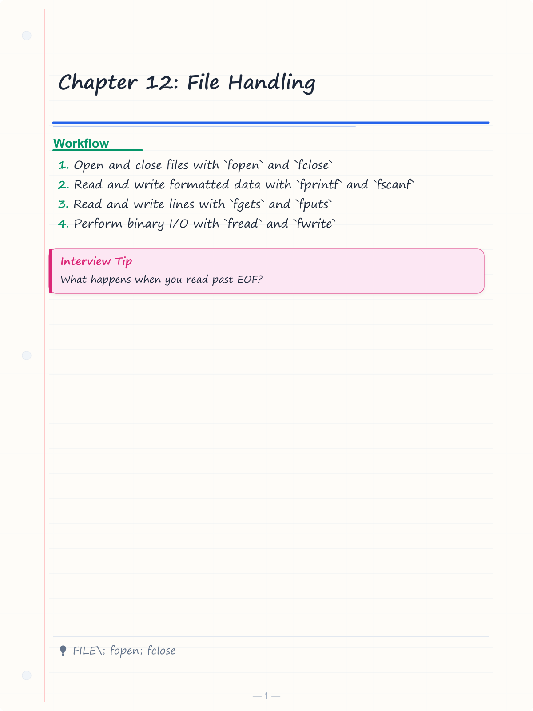
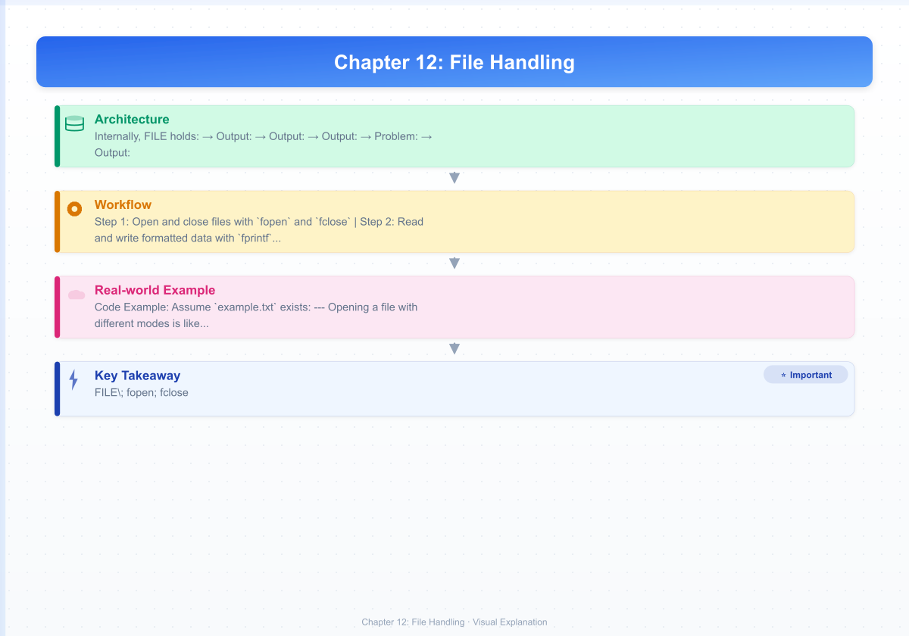

# Chapter 12: File Handling

> **Previous:** [Dynamic Memory Allocation](./11-dma.md) | **Next:** [The Preprocessor](./13-preprocessor.md)

## Learning Objectives

- Open and close files with `fopen` and `fclose`
- Read and write formatted data with `fprintf` and `fscanf`
- Read and write lines with `fgets` and `fputs`
- Perform binary I/O with `fread` and `fwrite`
- Navigate files with `fseek`, `ftell`, and `rewind`
- Handle file I/O errors properly
- Understand text vs binary mode, buffering, and temporary files

<!-- Image Gallery -->
<section class="lesson-visuals" aria-label="Visual learning resources">
  <header><span>VISUAL LEARNING</span><h2>See it. Review it. Remember it.</h2></header>
  <a class="lesson-visual-card" href="../../assets/images/lessons/c-programming/12-file-handling/handwritten-notes.png" target="_blank" rel="noopener">
    
    <span><strong>Handwritten notes</strong>Condensed notes for deliberate review.</span>
  </a>
  <a class="lesson-visual-card" href="../../assets/images/lessons/c-programming/12-file-handling/sticky-notes.png" target="_blank" rel="noopener">
    
    <span><strong>Sticky-note revision</strong>Fast recall prompts for revision.</span>
  </a>
  <a class="lesson-visual-card" href="../../assets/images/lessons/c-programming/12-file-handling/visual-explanation.png" target="_blank" rel="noopener">
    
    <span><strong>Visual concept guide</strong>A connected explanation of the key ideas.</span>
  </a>
</section>
<!-- End Image Gallery -->


---

## The Big Analogy: File Operations = Library Books

Think of a **file** as a **library book**:

| File Concept | Library Analogy |
|---|---|
| `fopen("file.txt", "r")` | Check out a book to **read** it |
| `fopen("file.txt", "w")` | Buy a **new notebook** (erase everything first) |
| `fopen("file.txt", "a")` | Open a journal to **add** pages at the end |
| `FILE *fp` | Your **library card** → the handle to the book |
| `fgetc(fp)` | Read **one word** at your current spot |
| `fputc('A', fp)` | Write **one word** at your current spot |
| `fseek(fp, n, SEEK_SET)` | Flip to **page n** |
| `ftell(fp)` | Check **what page number** you are on |
| `rewind(fp)` | Go back to **page 1** |
| `fclose(fp)` | **Return** the book to the library |
| `feof(fp)` | Check if you have **read the last page** |
| `ferror(fp)` | Check if the book has a **torn page** |
| setvbuf | Decide whether to use a **bookmark stack** (buffer) or read one page at a time |

When you open a file, the OS gives you a **file descriptor** (an integer handle). C wraps this in a `FILE` struct that holds: the file position indicator, buffer state, error/EOF flags, and the actual OS handle.

---

## 12.1 File Pointer (FILE*)

### Prototype


```c
FILE *fopen(const char *restrict filename, const char *restrict mode);
```

### What is FILE*?


`FILE` is an opaque structure defined in `<stdio.h>`. You never need to look inside it; you just use pointers to it. Every file operation takes a `FILE*` as its first or second argument.

**Internally, FILE holds:**
- File position indicator (a `long` offset from the start)
- Pointer to the buffer (if buffered)
- Buffer size and current fill level
- EOF flag and error flag
- The underlying OS file descriptor

### Real-World Analogy


The `FILE*` pointer is like your **library card + bookmark**. You hand it to the librarian (`fopen`) and get back a card that remembers which book, what page you are on, and whether you have had any trouble reading it.

### Steps to Use a File


1. **Declare** a `FILE*` pointer: `FILE *fp;`
2. **Open** the file with `fopen`: `fp = fopen("data.txt", "r");`
3. **Check** if `fp` is `NULL` (the file might not exist)
4. **Read or write** using file I/O functions
5. **Close** with `fclose(fp)` → this flushes buffers and frees the handle

### Pseudocode


```
DECLARE fp AS FILE POINTER
CALL fopen WITH filename AND mode
STORE RESULT IN fp
IF fp EQUALS NULL THEN
    PRINT error message
    RETURN failure
END IF
PERFORM file operations using fp
CALL fclose WITH fp
RETURN success
```

### Code Example


```c
#include <stdio.h>

int main(void)
{
    FILE *fp = fopen("example.txt", "r");
    if (fp == NULL) {
        perror("fopen failed");
        return 1;
    }
    printf("File opened successfully!\n");
    fclose(fp);
    return 0;
}
```

### Dry Run Trace


Assume `example.txt` exists:

| Step | Code | fp Value | File State |
|------|------|----------|------------|
| 1 | `FILE *fp;` | uninitialized | → |
| 2 | `fopen("example.txt", "r")` | returns address of FILE struct | File opened, position = 0 |
| 3 | `if (fp == NULL)` | NOT NULL | → |
| 4 | `fclose(fp)` | still valid until closed | File closed, buffers flushed |

### Complexity Analysis


| Operation | Time | Why |
|-----------|------|-----|
| `fopen` | O(1) *amortized* | System call overhead dominates; path resolution is O(path length) but treated as O(1) for typical use |
| `fclose` | O(1) | Flush buffer (O(buffer size)) + release handle |
| Memory usage | sizeof(FILE) ≈ 500 bytes | Holds buffer, flags, file descriptor |

### A&D Table


| Aspect | Analysis |
|--------|----------|
| Advantages | Opaque pointer hides OS details; same interface across platforms; supports buffering |
| Disadvantages | Must manually manage lifetime; NULL if file cannot be opened; not thread-safe by default |
| Best Use | All file I/O in C; the only way to access files via standard library |

### Edge Cases


| Case | Behavior |
|------|----------|
| File does not exist (r mode) | `fopen` returns NULL |
| Path too long | Returns NULL, `errno` set to `ENAMETOOLONG` |
| Permission denied | Returns NULL, `errno` set to `EACCES` |
| NULL filename | Undefined behavior (crash likely) |
| Invalid mode string | Returns NULL |

---

## 12.2 Opening Files → fopen Modes

### Prototype


```c
FILE *fopen(const char *restrict filename, const char *restrict mode);
```

### Real-World Analogy


Opening a file with different modes is like checking out a library book under different **access rules**:
- **r** = "I only want to read this book"
- **w** = "Give me a fresh notebook (throw away the old one)"
- **a** = "I want to add entries at the back of a journal"
- **r+** = "I need to read AND fix some pages"
- **w+** = "Fresh notebook that I might also read later"
- **a+** = "I want to read the whole journal and add at the end"
- **b** suffix = "Treat it as a photo album (don't translate newlines)"

### fopen Modes → Complete Reference Table


| Mode | Read | Write | Append | Create? | Truncate? | Position Start | Notes |
|------|------|-------|--------|---------|-----------|----------------|-------|
| `"r"` | ✓ | | | No | No | Beginning | File must exist |
| `"w"` | | ✓ | | Yes | Yes | Beginning | Creates new or overwrites |
| `"a"` | | | ✓ | Yes | No | End | Writes always go to end |
| `"r+"` | ✓ | ✓ | | No | No | Beginning | File must exist; read & write |
| `"w+"` | ✓ | ✓ | | Yes | Yes | Beginning | Creates new or overwrites |
| `"a+"` | ✓ | | ✓ | Yes | No | End | Read anywhere, write only at end |
| `"rb"` | ✓ | | | No | No | Beginning | Binary, must exist |
| `"wb"` | | ✓ | | Yes | Yes | Beginning | Binary, creates or overwrites |
| `"ab"` | | | ✓ | Yes | No | End | Binary append |
| `"r+b"` | ✓ | ✓ | | No | No | Beginning | Binary read/write, must exist |
| `"w+b"` | ✓ | ✓ | | Yes | Yes | Beginning | Binary read/write, create/truncate |
| `"a+b"` | ✓ | | ✓ | Yes | No | End | Binary read + append |

### Critical Detail: Text vs Binary on Windows


On Windows, text mode (`"r"`, `"w"`, `"a"`, etc.) translates:
- `\n` (LF) → `\r\n` (CRLF) on **write**
- `\r\n` → `\n` on **read**
- `Ctrl+Z` (0x1A) signals EOF in text mode

Binary mode (`"rb"`, `"wb"`, `"ab"`) performs **no translation**.

On Linux/macOS, text and binary modes are identical → no translation occurs.

### Steps to Open a File


1. Choose the filename and mode string
2. Call `fopen(filename, mode)`
3. **Immediately** check if return is NULL
4. Use the file
5. Close with `fclose`

### Pseudocode


```
FUNCTION openFile(name, mode)
    fp = fopen(name, mode)
    IF fp == NULL THEN
        PRINT "Failed to open" + name
        RETURN NULL
    END IF
    RETURN fp
END FUNCTION
```

### Code Example → All Modes Demonstrated


```c
#include <stdio.h>

int main(void)
{
    FILE *fp;

    /* "w" → write mode, creates or truncates */
    fp = fopen("test_w.txt", "w");
    if (fp) { fprintf(fp, "Write mode\n"); fclose(fp); }

    /* "a" → append mode, writes at end */
    fp = fopen("test_a.txt", "a");
    if (fp) { fprintf(fp, "Appended line\n"); fclose(fp); }

    /* "r" → read mode, file must exist */
    fp = fopen("nonexistent.txt", "r");
    if (fp == NULL) {
        perror("r mode failed (expected)");
    }

    /* "r+" → read and write, no truncate */
    fp = fopen("test_rplus.txt", "w+");
    if (fp) {
        fprintf(fp, "Hello ");
        rewind(fp);
        char buf[64];
        fgets(buf, sizeof(buf), fp);
        printf("Read back: %s", buf);
        fclose(fp);
    }

    /* "wb" → binary write */
    fp = fopen("test.bin", "wb");
    if (fp) {
        int data = 12345;
        fwrite(&data, sizeof(int), 1, fp);
        fclose(fp);
    }

    return 0;
}
```

### Dry Run Trace → fopen("data.txt", "r+")


| Step | Code | File on Disk | fp | Position |
|------|------|-------------|----|----------|
| 1 | `fopen("data.txt", "r+")` | data.txt exists, 100 bytes | FILE* handle | 0 |
| 2 | fp == NULL? | → | NOT NULL | → |
| 3 | `fgetc(fp)` | data.txt | same | 1 |
| 4 | `fclose(fp)` | data.txt | invalidated | → |

### Complexity Analysis


| Aspect | Cost | Why |
|--------|------|-----|
| Time | O(path_length) in kernel | Directory traversal + permission check + inode lookup |
| Memory | ~500 bytes (FILE struct) | Fixed overhead per open file |
| System calls | 1 (open) + 1 for buffer alloc | Heavyweight operation; cache FILE* when reusing |

### A&D Table


| Aspect | Analysis |
|--------|----------|
| Advantages | Rich mode support; text/binary distinction; cross-platform API |
| Disadvantages | NULL checks required; no Unicode path support in C standard; Windows text mode surprises |
| Best Use | All file opening needs; prefer binary mode for non-text data |

### Edge Cases


| Case | Behavior |
|------|----------|
| `fopen("", "r")` | Returns NULL (empty filename) |
| `fopen("/nonexistent/deep/file.txt", "w")` | Returns NULL if intermediate directory missing |
| `fopen("readonly.txt", "w")` on read-only file | Returns NULL, errno = EACCES |
| fopen with 500 open files | Returns NULL, errno = EMFILE (too many open files) |
| `fopen("existing.txt", "r+")` | Works; position at 0, no truncation |
| Binary mode on Linux with `"rb"` | Identical to `"r"` (no translation needed) |

---

## 12.3 Closing a File → fclose

### Prototype


```c
int fclose(FILE *fp);
```

Returns 0 on success, `EOF` on error.

### Real-World Analogy


Closing a file is like **returning a library book**. If you don't return it, the library runs out of books (resource leak). The librarian also makes sure all your notes (buffered data) are properly saved before you leave.

### What Happens Inside fclose


1. **Flushes** any unwritten buffered data to disk
2. **Discards** any unread buffered data
3. **Closes** the underlying OS file descriptor
4. **Frees** the FILE struct memory
5. **Sets** `fp` to an invalid state (dangling pointer)

### Steps


1. Ensure all pending writes are done (fclose does this automatically)
2. Call `fclose(fp)`
3. **Do NOT** use `fp` after fclose → it is a dangling pointer

### Pseudocode


```
FUNCTION closeFile(fp)
    IF fp == NULL THEN
        RETURN EOF       // safety: cannot close NULL
    END IF
    flush buffer to disk
    free buffer memory
    close OS file descriptor
    free FILE struct
    RETURN 0
END FUNCTION
```

### Code Example


```c
#include <stdio.h>

int main(void)
{
    FILE *fp = fopen("test.txt", "w");
    if (fp == NULL) {
        perror("fopen");
        return 1;
    }

    fprintf(fp, "Important data");
    if (fclose(fp) == EOF) {
        perror("fclose failed");
        return 1;
    }
    /* fp is now a dangling pointer → do not use it */
    return 0;
}
```

### Dry Run Trace


| Step | Code | fp | Disk file | Buffers |
|------|------|----|-----------|---------|
| 1 | `fopen` | valid | test.txt created | 0 bytes |
| 2 | `fprintf(fp, "Hello")` | valid | empty (buffered) | "Hello" in buffer |
| 3 | `fclose(fp)` | invalidated | "Hello" written | flushed, freed |

### Complexity Analysis


| Operation | Time | Why |
|-----------|------|-----|
| fclose (buffered) | O(buffer_size) | Must flush buffer to disk |
| fclose (unbuffered) | O(1) | Just release handle |
| fclose with error | O(buffered) | Returns EOF; may lose data |

### A&D Table


| Aspect | Analysis |
|--------|----------|
| Advantages | Ensures data integrity; frees resources; portable |
| Disadvantages | Silent data loss if error ignored (check return!) |
| Best Use | Always close files; always check return value |

### Edge Cases


| Case | Behavior |
|------|----------|
| `fclose(NULL)` | Undefined behavior (crash on most implementations) |
| fclose on read-only file | Returns 0 (no flush needed) |
| fclose on already closed file | Undefined behavior |
| File open with `tmpfile()` | fclose also **deletes** the temp file automatically |
| Disk full during fclose flush | Returns EOF; data not fully written |

---

## 12.4 Reading from Files

### 12.4.1 Character Reading → fgetc


### Prototype


```c
int fgetc(FILE *fp);
```

Returns the next character as `unsigned char` cast to `int`, or `EOF` on error/end-of-file.

### Real-World Analogy


Reading a file character by character is like **reading a scroll one letter at a time**, rolling it forward as you go. You can only see one character at your current position, and after reading it, the scroll advances.

### Why Return int?


`fgetc` returns `int` (not `char` or `unsigned char`) so it can represent all 256 possible byte values (0–255) PLUS the special value `EOF` (typically -1). If it returned `char`, you could never distinguish EOF from the byte 0xFF.

### Steps


1. Call `int c = fgetc(fp);`
2. Check if `c == EOF` → if so, use `feof(fp)` or `ferror(fp)` to determine why
3. Otherwise, `c` holds the character read
4. Repeat until EOF

### Pseudocode


```
SET fp = fopen("file.txt", "r")
IF fp == NULL THEN error END IF

WHILE (c = fgetc(fp)) != EOF DO
    process character c
END WHILE

IF feof(fp) THEN
    PRINT "End of file reached normally"
END IF

fclose(fp)
```

### Code Example


```c
#include <stdio.h>

int main(void)
{
    FILE *fp = fopen("alphabet.txt", "w");
    if (fp == NULL) { perror("fopen"); return 1; }
    for (char ch = 'A'; ch <= 'Z'; ch++)
        fputc(ch, fp);
    fclose(fp);

    /* Now read it back */
    fp = fopen("alphabet.txt", "r");
    if (fp == NULL) { perror("fopen"); return 1; }

    int c;
    int count = 0;
    while ((c = fgetc(fp)) != EOF) {
        printf("byte %2d: '%c' (0x%02X)\n", count++, c, c);
    }
    fclose(fp);
    return 0;
}
```

**Output:**
```
byte  0: 'A' (0x41)
byte  1: 'B' (0x42)
byte  2: 'C' (0x43)
...
byte 25: 'Z' (0x5A)
```

### Dry Run Trace → fgetc Loop on "ABC"


Assume file contains "ABC\n" (4 bytes). Initial position = 0.

| Iteration | `c = fgetc(fp)` | Returns | Position After | Loop Continues? |
|-----------|-----------------|---------|----------------|-----------------|
| 1 | reads byte 0 | 'A' (65) | 1 | Yes |
| 2 | reads byte 1 | 'B' (66) | 2 | Yes |
| 3 | reads byte 2 | 'C' (67) | 3 | Yes |
| 4 | reads byte 3 | '\n' (10) | 4 | Yes |
| 5 | reads byte 4 | EOF (-1) | 4 (unchanged) | No → loop exits |

### Complexity Analysis


| Aspect | Cost | Why |
|--------|------|-----|
| Time per call | O(1) *amortized* | Usually just reads from buffer; actual disk read only when buffer empty |
| Memory | sizeof(FILE) + BUFSIZ | Buffer allocated per open file |

### A&D Table


| Aspect | Analysis |
|--------|----------|
| Advantages | Simple; safe for binary data; can distinguish all 256 bytes from EOF |
| Disadvantages | Slow for large files (one byte per function call); function call overhead |
| Best Use | Text parsing where you need per-character logic; copying files |

### Edge Cases


| Case | Behavior |
|------|----------|
| Read past EOF | Returns EOF repeatedly (does not error) |
| Read error | Returns EOF; `ferror(fp)` returns non-zero |
| Binary file with byte 0xFF | Returns 0xFF correctly (int 255), NOT EOF |
| Empty file | First call returns EOF immediately |
| NULL fp | Undefined behavior |

---

### 12.4.2 Line Reading → fgets


### Prototype


```c
char *fgets(char *restrict s, int size, FILE *restrict fp);
```

Returns `s` on success, `NULL` on EOF or error.

### Real-World Analogy


Reading a line with `fgets` is like **tearing off a receipt** from a machine: you get everything up to the newline (the tear point), but no more than the paper width (buffer size). If the receipt is too long, you only get the first `size-1` characters → the rest stays in the machine for the next read.

### Key Behaviors


- Reads up to `size - 1` characters
- Stops at newline (which is **included** in the buffer)
- Always null-terminates the buffer
- Returns NULL on EOF or error (use `feof`/`ferror` to distinguish)

### Steps


1. Declare a char buffer: `char line[256];`
2. Call `fgets(line, sizeof(line), fp);`
3. Check if return is NULL (EOF/error)
4. Process the line (note: newline is included)
5. Optionally strip trailing newline: `line[strcspn(line, "\n")] = '\0';`

### Pseudocode


```
DECLARE buffer[BUFFER_SIZE]
WHILE fgets(buffer, BUFFER_SIZE, fp) != NULL DO
    remove trailing newline if present
    process line
END WHILE
```

### Code Example


```c
#include <stdio.h>
#include <string.h>

int main(void)
{
    /* Create a test file */
    FILE *fp = fopen("lines.txt", "w");
    if (fp == NULL) { perror("fopen"); return 1; }
    fprintf(fp, "Line 1: Hello\n");
    fprintf(fp, "Line 2: World\n");
    fprintf(fp, "Line 3: C Programming\n");
    fclose(fp);

    /* Read it back with fgets */
    fp = fopen("lines.txt", "r");
    if (fp == NULL) { perror("fopen"); return 1; }

    char line[256];
    int line_num = 1;
    while (fgets(line, sizeof(line), fp)) {
        size_t len = strlen(line);
        /* Strip trailing newline for clean display */
        line[strcspn(line, "\n")] = '\0';
        printf("Line %d (%zu chars): \"%s\"\n",
               line_num++, len, line);
    }
    fclose(fp);
    return 0;
}
```

**Output:**
```
Line 1 (15 chars): "Line 1: Hello"
Line 2 (15 chars): "Line 2: World"
Line 3 (21 chars): "Line 3: C Programming"
```

### Dry Run Trace → fgets with buffer size 8


File contains: `"Hello World!\nNext Line\n"` (21 bytes)

| Call | Buffer After | Returns | Position After | Notes |
|------|-------------|---------|----------------|-------|
| 1 | `"Hello W"` | non-NULL | 7 | Buffer filled, no newline yet |
| 2 | `"orld!\n"` | non-NULL | 14 | Newline encountered, included |
| 3 | `"Next Li"` | non-NULL | 21 | Buffer filled |
| 4 | `"ne\n"` | non-NULL | 25 | Final line with newline |
| 5 | (unchanged) | NULL | 25 | EOF → returns NULL |

### Complexity Analysis


| Aspect | Cost | Why |
|--------|------|-----|
| Time per call | O(k) where k = bytes read | Must scan for newline, copy to buffer |
| Worst case | O(size) | Reads full buffer without finding newline |
| Space | O(size) per buffer | User-provided buffer |

### A&D Table


| Aspect | Analysis |
|--------|----------|
| Advantages | Safe (bounds-checked); includes newline; null-terminated; prevents overflow |
| Disadvantages | Partial line if buffer too small; newline stripping is manual; slow for binary |
| Best Use | Reading text files line by line; configuration files; log parsing |

### Edge Cases


| Case | Behavior |
|------|----------|
| Line longer than buffer | Returns first `size-1` chars; remainder on next call |
| Empty line ("\n") | Returns "\n\0" (2 bytes in buffer) |
| EOF with no data | Returns NULL immediately |
| Binary file with null bytes | fgets stops at null byte (it reads, but treats as string end) |
| File with no trailing newline | Reads last line (no \n but null-terminated) |

---

### 12.4.3 Formatted Reading → fscanf


### Prototype


```c
int fscanf(FILE *restrict fp, const char *restrict format, ...);
```

Returns number of input items successfully matched and assigned, or EOF on input failure.

### Real-World Analogy


`fscanf` is like a **customs declaration form**: you tell the officer (format string) what types of data you expect ("a number, then a word, then a float"), and the officer extracts those items from the stream. If the data doesn't match the expected format, you get fewer items than expected.

### Steps


1. Call `fscanf(fp, format, &var1, &var2, ...)`
2. Check the return value → compare against expected number of items
3. If return &lt; expected, check `feof` or `ferror`

### Pseudocode


```
WHILE (items = fscanf(fp, "%d %s %f", &id, name, &gpa)) == 3 DO
    process record (id, name, gpa)
END WHILE
IF feof(fp) THEN
    PRINT "All records read successfully"
ELSE
    PRINT "Format mismatch or read error"
END IF
```

### Code Example


```c
#include <stdio.h>

int main(void)
{
    FILE *fp = fopen("data.csv", "w");
    if (fp == NULL) { perror("fopen"); return 1; }
    fprintf(fp, "101,Alice,3.8\n");
    fprintf(fp, "102,Bob,3.5\n");
    fprintf(fp, "103,Carol,3.9\n");
    fclose(fp);

    /* Now read with fscanf using comma delimiter */
    fp = fopen("data.csv", "r");
    if (fp == NULL) { perror("fopen"); return 1; }

    int id; char name[50]; float gpa;
    int records = 0;

    /* Note: commas in format match literal commas in file */
    while (fscanf(fp, "%d,%49[^,],%f", &id, name, &gpa) == 3) {
        printf("Record %d: %d, %s, %.2f\n", ++records, id, name, gpa);
    }

    if (feof(fp))
        printf("\nTotal: %d records read successfully\n", records);
    else if (ferror(fp))
        perror("Read error");

    fclose(fp);
    return 0;
}
```

**Output:**
```
Record 1: 101, Alice, 3.80
Record 2: 102, Bob, 3.50
Record 3: 103, Carol, 3.90

Total: 3 records read successfully
```

### Dry Run Trace → fscanf Malformed Input


File: `"101 Alice 3.8\n102 Bob BAD\n103 Carol 3.9\n"`

| Iteration | Format | Reads | Return | Position After |
|-----------|--------|-------|--------|----------------|
| 1 | `%d %s %f` | id=101, name="Alice", gpa=3.8 | 3 | After "3.8" |
| 2 | `%d %s %f` | id=102, name="Bob", gpa=→ (BAD) | 2 | Stuck at "BAD" |
| 3 | `%d %s %f` | Fails → "BAD" doesn't match %d | 0 | Stuck at "BAD" forever |

**Problem:** `fscanf` consumes no input on match failure, leading to infinite loop. Always check return value and break on unexpected.

### Complexity Analysis


| Aspect | Cost | Why |
|--------|------|-----|
| Time per call | O(input_length) | Format parsing + character classification + conversion |
| Worst case | O(n) per field | `%s` or `%[^,]` scans until delimiter |
| Space | O(1) (plus outputs) | Format string stored in read-only memory |

### A&D Table


| Aspect | Analysis |
|--------|----------|
| Advantages | Powerful parsing; type-safe (sort of); automatic whitespace skipping (for most specifiers) |
| Disadvantages | Recovery from mismatched input is hard; no validation by default; whitespace subtleties |
| Best Use | Known-format text files; simple CSV/whitespace data; **not** for untrusted input |

### Edge Cases


| Case | Behavior |
|------|----------|
| Format mismatch mid-record | Returns count of matches so far; stream position at failure point |
| Leading whitespace | Most specifiers (except %c, %[, %n) skip whitespace automatically |
| Numeric overflow | Undefined behavior (use `%d` with INT_MAX+1 → UB) |
| %s overflow (no width) | Buffer overflow → CRITICAL: always use `%Ns` with width |
| EOF mid-record | Returns EOF if no items matched, or count of partially matched items |

---

### 12.4.4 Binary Reading → fread


### Prototype


```c
size_t fread(void *restrict ptr, size_t element_size, size_t count, FILE *restrict fp);
```

Returns the number of complete elements successfully read (may be less than `count` on error or EOF).

### Real-World Analogy


Reading binary data is like **photocopying pages** from a book: you specify the number of pages (`count`) and the page size (`element_size`), and `fread` copies the exact raw bytes into your memory. No translation, no formatting → just raw bits.

### Steps


1. Allocate a buffer large enough: `buffer_size = element_size * count`
2. Call `fread(buffer, element_size, count, fp)`
3. Check return value: if &lt; count, check `feof` or `ferror`
4. Process raw data in buffer

### Pseudocode


```
DECLARE buffer[ELEMENT_SIZE * MAX_COUNT]
bytesRead = fread(buffer, ELEMENT_SIZE, MAX_COUNT, fp)
IF bytesRead < MAX_COUNT THEN
    IF feof(fp) THEN
        PRINT "End of file after " + bytesRead + " elements"
    ELSE
        PRINT "Read error occurred"
    END IF
END IF
```

### Code Example


```c
#include <stdio.h>

typedef struct {
    int id;
    char name[32];
    double salary;
} Employee;

int main(void)
{
    /* Write binary data */
    Employee emps[] = {
        {1, "Alice",  75000.0},
        {2, "Bob",    82000.0},
        {3, "Carol",  91000.0},
        {4, "Dave",   68000.0}
    };

    FILE *fp = fopen("employees.bin", "wb");
    if (fp == NULL) { perror("fopen"); return 1; }
    fwrite(emps, sizeof(Employee), 4, fp);
    fclose(fp);

    /* Read binary data */
    fp = fopen("employees.bin", "rb");
    if (fp == NULL) { perror("fopen"); return 1; }

    Employee e;
    int count = 0;
    while (fread(&e, sizeof(Employee), 1, fp) == 1) {
        printf("Emp %d: %s ($%.0f)\n", e.id, e.name, e.salary);
        count++;
    }
    printf("Read %d employees\n", count);
    fclose(fp);
    return 0;
}
```

**Output:**
```
Emp 1: Alice ($75000)
Emp 2: Bob ($82000)
Emp 3: Carol ($91000)
Emp 4: Dave ($68000)
Read 4 employees
```

### Dry Run Trace → fread with sizeof(Employee) = 40


File: `employees.bin` (160 bytes = 4 × 40)

| Iteration | ptr | element_size | count | Returns | Position After |
|-----------|-----|-------------|-------|---------|----------------|
| 1 | &e | 40 | 1 | 1 | 40 |
| 2 | &e | 40 | 1 | 1 | 80 |
| 3 | &e | 40 | 1 | 1 | 120 |
| 4 | &e | 40 | 1 | 1 | 160 |
| 5 | &e | 40 | 1 | 0 (EOF) | 160 |

### Complexity Analysis


| Aspect | Cost | Why |
|--------|------|-----|
| Time (buffered) | O(total_bytes) | Memcpy from internal buffer to user buffer |
| Time (unbuffered) | O(total_bytes) + syscall | Each fread may trigger disk I/O |
| Space | O(element_size * count) | User-provided buffer |

### A&D Table


| Aspect | Analysis |
|--------|----------|
| Advantages | Raw binary access; fast bulk read; no formatting overhead; ideal for struct persistence |
| Disadvantages | Platform-dependent (endianness, padding); no data validation; binary files not human-readable |
| Best Use | Database files, image data, serialized objects, performance-critical I/O |

### Edge Cases


| Case | Behavior |
|------|----------|
| Read partial element at EOF | Returns 0 (even if 1 byte available but element_size > 1) |
| element_size = 0 | Returns 0 (reads nothing) |
| count = 0 | Returns 0 |
| File smaller than requested | Returns number of complete elements, feof set |
| Struct with padding | Padding bytes written/read; may differ between compilers |

---

### Read Functions Comparison Table


| Function | Input | Stops At | Returns | Includes Delimiter? | Buffer Safe? | Best For |
|----------|-------|----------|---------|-------------------|-------------|----------|
| `fgetc` | Character | Every call | `int` (byte or EOF) | N/A | N/A | Char-by-char parsing |
| `fgets` | Line | Newline or size-1 | `char*` or NULL | Yes (newline) | Yes (width limit) | Line-oriented text |
| `fscanf` | Formatted | Whitespace/format | Items matched or EOF | No | Only with width specifier | Structured text parsing |
| `fread` | Binary blocks | End of file or count | Items read | N/A | Yes (size×count) | Binary data, structs |

### Read Functions → Complexity Comparison


| Function | Time Complexity | Space Complexity | Why |
|----------|----------------|-----------------|-----|
| `fgetc` | O(1) per call, O(n) for n chars | O(1) | Simple byte fetch from buffer |
| `fgets` | O(k) per line, O(n) total | O(size) buffer | Scans for newline, copies |
| `fscanf` | O(n) per format string | O(1) + output vars | Format parsing overhead |
| `fread` | O(n) for n bytes | O(n) buffer | Bulk memcpy, minimal overhead |

## 12.5 Writing to Files

### 12.5.1 Character Writing → fputc


### Prototype


```c
int fputc(int c, FILE *fp);
```

Writes the character `c` (converted to `unsigned char`) to the file. Returns the character written on success, or `EOF` on error.

### Real-World Analogy


Writing a character with `fputc` is like **stamping one letter at a time** onto a page. Each stamp advances the position by one letter. If the stamp pad is dry (buffer full), the stamp mechanism must re-ink (flush to disk) before continuing.

### Steps


1. Get your character (from a variable, literal, or `fgetc`)
2. Call `fputc(ch, fp);`
3. Check if return is `EOF` (write failed)

### Pseudocode


```
WHILE more characters to write DO
    result = fputc(nextChar, fp)
    IF result == EOF THEN
        PRINT "Write failed"
        BREAK
    END IF
END WHILE
```

### Code Example


```c
#include <stdio.h>
#include <ctype.h>

int main(void)
{
    FILE *fp = fopen("upper.txt", "w");
    if (fp == NULL) { perror("fopen"); return 1; }

    for (char ch = 'a'; ch <= 'z'; ch++) {
        if (fputc(toupper(ch), fp) == EOF) {
            perror("fputc failed");
            fclose(fp);
            return 1;
        }
        /* add space between letters */
        if (fputc(' ', fp) == EOF) {
            perror("fputc failed");
            fclose(fp);
            return 1;
        }
    }
    fputc('\n', fp);
    fclose(fp);

    /* Display result */
    fp = fopen("upper.txt", "r");
    if (fp == NULL) { perror("fopen"); return 1; }
    int c;
    while ((c = fgetc(fp)) != EOF) putchar(c);
    fclose(fp);
    return 0;
}
```

**Output:**
```
A B C D E F G H I J K L M N O P Q R S T U V W X Y Z
```

### Dry Run Trace → fputc Writing "Hi\n"


File initially empty. Buffer size = 512 (typical default). All writes are buffered initially.

| Call | Character | Return | Buffer State | Disk State |
|------|-----------|--------|-------------|------------|
| fputc('H', fp) | 'H' | 'H' (72) | Buffer: "H" | Empty (buffered) |
| fputc('i', fp) | 'i' | 'i' (105) | Buffer: "Hi" | Empty |
| fputc('\n', fp) | '\n' | '\n' (10) | Buffer: "Hi\n" | Empty |
| fclose(fp) | → | 0 | Flushed | Disk: "Hi\n" |

### Complexity Analysis


| Aspect | Cost | Why |
|--------|------|-----|
| Time per call | O(1) *amortized* | Usually just writes to buffer; flush only when buffer full |
| System calls | 0 per write (typically) | Data batched; syscall per buffer-full | 

### A&D Table


| Aspect | Analysis |
|--------|----------|
| Advantages | Simple, predictable; safe for byte-level output |
| Disadvantages | Slow for bulk data; function call overhead per character |
| Best Use | Text generation char-by-char; implementing custom text transforms |

### Edge Cases


| Case | Behavior |
|------|----------|
| Write to read-only file | Returns EOF, ferror set |
| Disk full | Returns EOF, errno = ENOSPC |
| fputc(EOF, fp) | UB (EOF = -1, cast to unsigned char → 0xFF, written as byte) |
| NULL fp | Undefined behavior |
| Unbuffered stream | Immediate syscall; performance penalty |

---

### 12.5.2 String Writing → fputs


### Prototype


```c
int fputs(const char *restrict s, FILE *restrict fp);
```

Writes the string `s` to the file. Does **not** append a newline. Returns non-negative on success, `EOF` on error.

### Real-World Analogy


Writing with `fputs` is like **pasting a pre-written paragraph** into a document. The paragraph goes exactly as-is → no extra line break, no formatting. You get exactly what you put in.

### Steps


1. Prepare a null-terminated string
2. Call `fputs(str, fp)`
3. Add `\n` explicitly if you want a newline

### Pseudocode


```
FUNCTION writeLines(fp, linesArray, count)
    FOR i = 0 TO count-1 DO
        IF fputs(linesArray[i], fp) == EOF THEN
            error
        END IF
        fputs("\n", fp)    // explicit newline
    END FOR
END FUNCTION
```

### Code Example


```c
#include <stdio.h>

int main(void)
{
    FILE *fp = fopen("shopping.txt", "w");
    if (fp == NULL) { perror("fopen"); return 1; }

    const char *items[] = {"Apples", "Bananas", "Milk", "Bread", "Eggs"};
    int count = sizeof(items) / sizeof(items[0]);

    for (int i = 0; i < count; i++) {
        if (fputs(items[i], fp) == EOF) {
            perror("fputs failed");
            fclose(fp);
            return 1;
        }
        if (fputs("\n", fp) == EOF) {  /* explicit newline */
            perror("fputs failed");
            fclose(fp);
            return 1;
        }
    }
    fclose(fp);

    /* Verify */
    fp = fopen("shopping.txt", "r");
    if (fp == NULL) { perror("fopen"); return 1; }
    char line[128];
    while (fgets(line, sizeof(line), fp))
        printf("%s", line);
    fclose(fp);
    return 0;
}
```

**Output:**
```
Apples
Bananas
Milk
Bread
Eggs
```

### Complexity Analysis


| Aspect | Cost | Why |
|--------|------|-----|
| Time | O(strlen(s)) | Must copy entire string to buffer |
| Memory | O(strlen(s)) (string) + buffer | String stored in caller's memory |

### A&D Table


| Aspect | Analysis |
|--------|----------|
| Advantages | Simple string output; no formatting overhead; fast for pre-formatted text |
| Disadvantages | No newline appended; no formatting support; not type-safe |
| Best Use | Writing pre-formatted or static strings; log messages |

### Edge Cases


| Case | Behavior |
|------|----------|
| Empty string `""` | Writes nothing, returns 0 |
| String with embedded `\0` | Writes only up to first `\0` |
| Write to read-only file | Returns EOF |
| NULL s | Undefined behavior |

---

### 12.5.3 Formatted Writing → fprintf


### Prototype


```c
int fprintf(FILE *restrict fp, const char *restrict format, ...);
```

Returns the number of characters written on success, or a negative value on error.

### Real-World Analogy


`fprintf` is like a **mail-merge printer**: you design a template (`"Employee: %s (ID: %d)"`) and feed it data values. The printer fills in the blanks and produces the formatted output. It handles all the alignment, padding, and type conversion for you.

### Format Specifier Quick Ref


| Specifier | Type | Example | Output |
|-----------|------|---------|--------|
| `%d` | int | `fprintf(fp, "%d", 42)` | `42` |
| `%05d` | int (zero-padded) | `fprintf(fp, "%05d", 42)` | `00042` |
| `%-10s` | string (left-align) | `fprintf(fp, "%-10s", "Hi")` | `Hi        ` |
| `%.2f` | double (precision) | `fprintf(fp, "%.2f", 3.14159)` | `3.14` |
| `%x` | hex int | `fprintf(fp, "%x", 255)` | `ff` |
| `%p` | pointer | `fprintf(fp, "%p", ptr)` | `0x7ffee4b0` |

### Steps


1. Write a format string with conversion specifiers
2. Provide matching arguments
3. Call `fprintf(fp, format, arg1, arg2, ...)`
4. Check return (optional, but wise)

### Pseudocode


```
FUNCTION writeReport(fp, employees[], n)
    fprintf(fp, "%-20s %5s\n", "Name", "Salary")
    fprintf(fp, "%-20s %5s\n", "----", "------")
    FOR i = 0 TO n-1 DO
        fprintf(fp, "%-20s $%7.2f\n", employees[i].name, employees[i].salary)
    END FOR
END FUNCTION
```

### Code Example


```c
#include <stdio.h>

typedef struct {
    int id;
    char name[32];
    double score;
} Student;

int main(void)
{
    Student students[] = {
        {101, "Alice",   92.5},
        {102, "Bob",     85.0},
        {103, "Carol",   97.3},
        {104, "David",   78.8}
    };
    int n = sizeof(students) / sizeof(students[0]);

    FILE *fp = fopen("report.txt", "w");
    if (fp == NULL) { perror("fopen"); return 1; }

    /* Header */
    fprintf(fp, "%-6s %-12s %6s  %s\n", "ID", "Name", "Score", "Grade");
    fprintf(fp, "%s\n", "------------------------------");

    for (int i = 0; i < n; i++) {
        char grade = students[i].score >= 90 ? 'A' :
                     students[i].score >= 80 ? 'B' :
                     students[i].score >= 70 ? 'C' : 'F';
        int written = fprintf(fp, "%-6d %-12s %5.1f  %c\n",
            students[i].id, students[i].name,
            students[i].score, grade);
        if (written < 0) {
            perror("fprintf failed");
            fclose(fp);
            return 1;
        }
    }

    fclose(fp);
    printf("Report written to report.txt (%d records)\n", n);
    return 0;
}
```

**Output:**
```
Report written to report.txt (4 records)
```

**Contents of report.txt:**
```
ID     Name          Score  Grade
------------------------------
101    Alice         92.5  A
102    Bob           85.0  B
103    Carol         97.3  A
104    David         78.8  C
```

### Complexity Analysis


| Aspect | Cost | Why |
|--------|------|-----|
| Time | O(format_length + total_output) | Format parsing + number-to-string conversion + buffering |
| Conversion (integers) | O(log₁₀(value)) | Integer-to-ASCII requires division per digit |
| Conversion (floats) | O(precision × log₁₀(value)) | Float-to-string involves repeated multiplication |
| Space | O(format_length) | Format string stored in read-only memory |

### A&D Table


| Aspect | Analysis |
|--------|----------|
| Advantages | Rich formatting; type-safe conversions; alignment/padding; locale-aware |
| Disadvantages | Format string must match arguments; runtime cost of parsing format; buffer overflow risk with %s |
| Best Use | Text reports, log files, CSV generation, any structured text output |

### Edge Cases


| Case | Behavior |
|------|----------|
| fprintf(fp, "%s", NULL) | Undefined behavior (crash on most systems) |
| Format string with wrong types | Undefined behavior (e.g., `%d` with a `double`) |
| Very large output (>2GB) | Return may overflow `int` (C89/C99 limitation) |
| File write error mid-output | Returns negative; partial output may have been written |

---

### 12.5.4 Binary Writing → fwrite


### Prototype


```c
size_t fwrite(const void *restrict ptr, size_t element_size, size_t count, FILE *restrict fp);
```

Writes `count` elements, each `element_size` bytes, from `ptr` to the file. Returns the number of complete elements written (should equal `count` on success).

### Real-World Analogy


Writing with `fwrite` is like **pouring a mold** of your data structure directly onto the page. Every byte of the struct → including padding holes → is cast exactly as it exists in memory. What you see in memory is what you get on disk.

### Important: Endianness and Portability


Binary files written with `fwrite` are **not portable** across platforms with different:
- **Endianness** (x86 is little-endian; network data is big-endian)
- **Struct padding** (different alignment rules between compilers)
- **sizeof types** (int may be 2, 4, or 8 bytes)

For portable binary data, use:
1. Fixed-width types (`int32_t`, `uint64_t` from `<stdint.h>`)
2. Byte-by-byte serialization with explicit endian conversion
3. A serialization library (Protocol Buffers, MessagePack, etc.)

### Steps


1. Prepare data in memory
2. Call `fwrite(ptr, element_size, count, fp)`
3. Check return value == count

### Pseudocode


```
FUNCTION saveArray(fp, array, elementSize, count)
    written = fwrite(array, elementSize, count, fp)
    IF written != count THEN
        PRINT "Write error: only " + written + " of " + count + " elements written"
    END IF
    RETURN written
END FUNCTION
```

### Code Example


```c
#include <stdio.h>
#include <stdint.h>   /* for fixed-width types */

typedef struct {
    uint32_t magic;    /* 4 bytes → fixed size */
    uint16_t version;  /* 2 bytes */
    uint8_t  flags;    /* 1 byte */
    char     reserved; /* 1 byte padding */
    double   data[4];  /* 32 bytes */
} Header;

int main(void)
{
    Header h = {
        .magic   = 0xAE1234EF,
        .version = 1,
        .flags   = 0x07,
        .reserved = 0,
        .data    = {1.0, 2.0, 3.0, 4.0}
    };

    FILE *fp = fopen("header.bin", "wb");
    if (fp == NULL) { perror("fopen"); return 1; }

    size_t written = fwrite(&h, sizeof(Header), 1, fp);
    if (written != 1) {
        perror("fwrite failed");
        fclose(fp);
        return 1;
    }
    printf("Header written: %zu bytes\n", sizeof(Header));
    fclose(fp);

    /* Read it back */
    fp = fopen("header.bin", "rb");
    if (fp == NULL) { perror("fopen"); return 1; }

    Header h2;
    if (fread(&h2, sizeof(Header), 1, fp) == 1) {
        printf("Magic:   0x%08X\n", h2.magic);
        printf("Version: %u\n", h2.version);
        printf("Flags:   0x%02X\n", h2.flags);
        for (int i = 0; i < 4; i++)
            printf("data[%d] = %.1f\n", i, h2.data[i]);
    }
    fclose(fp);
    return 0;
}
```

**Output:**
```
Header written: 40 bytes
Magic:   0xAE1234EF
Version: 1
Flags:   0x07
data[0] = 1.0
data[1] = 2.0
data[2] = 3.0
data[3] = 4.0
```

### Dry Run Trace → fwrite Array of 3 Integers


Memory: `{0x0000002A, 0xFFFFFF9C, 0x00000010}` (little-endian)

| Call | ptr | element_size | count | Returns | File Bytes Written | Position After |
|------|-----|-------------|-------|---------|-------------------|----------------|
| fwrite(arr, 4, 3, fp) | arr | 4 | 3 | 3 | 2A 00 00 00 9C FF FF FF 10 00 00 00 | 12 |

### Complexity Analysis


| Aspect | Cost | Why |
|--------|------|-----|
| Time | O(total_bytes) | Straight memcpy to buffer; linear in data size |
| Memory | O(total_bytes) (caller's buffer) | Data must be in memory before writing |
| Best case throughput | ~1-5 GB/s (on modern HW) | Pure memory bandwidth; no conversion overhead |

### A&D Table


| Aspect | Analysis |
|--------|----------|
| Advantages | Fastest output method; direct memory dump; perfect for struct persistence |
| Disadvantages | Not human-readable; endianness issues; struct padding differences; fragile format |
| Best Use | Performance-critical output; intermediate data files; snapshots/cache files |

### Edge Cases


| Case | Behavior |
|------|----------|
| element_size = 0 | Returns 0 (nothing written) |
| count = 0 | Returns 0 |
| Disk full during write | Returns less than count; ferror set |
| Write NULL ptr | Undefined behavior |
| Writing struct with pointers | Pointers written as addresses → meaningless when reloaded |

---

### Write Functions Comparison Table


| Function | Output | Adds Newline? | Type Safe? | Formatting? | Best For |
|----------|--------|---------------|-----------|-------------|----------|
| `fputc` | Single char | No | Yes (int) | None | Byte-by-byte output |
| `fputs` | String | No | No (char*) | None | Pre-formatted strings |
| `fprintf` | Formatted | Manual (\n) | Partial (match format) | Full printf-style | Reports, logs, CSV |
| `fwrite` | Raw bytes | N/A | No (void*) | None | Binary data, structs |

### Write Functions → Complexity Comparison


| Function | Time Complexity | Space Complexity | Syscalls (typical) |
|----------|----------------|-----------------|-------------------|
| `fputc` | O(1) amortized | O(1) | ~0 (buffered) |
| `fputs` | O(strlen(s)) | O(1) + string storage | ~0 (buffered) |
| `fprintf` | O(output_length + format_length) | O(format_length) | ~0 (buffered) |
| `fwrite` | O(element_size × count) | O(element_size × count) | ~0 (buffered) |

---

## 12.6 EOF Detection → feof

### Prototype


```c
int feof(FILE *fp);
```

Returns non-zero if the end-of-file indicator for the stream is set, 0 otherwise.

### Real-World Analogy


`feof` is like a **"LAST PAGE" stamp** in a library book. The stamp is applied only **after** you have tried to read past the last page, not when you land on it. In other words, `feof` tells you that a previous read operation has already failed because it hit EOF.

### Critical: feof is NOT a Lookahead


```c
/* WRONG → don't do this */
FILE *fp = fopen("file.txt", "r");
while (!feof(fp)) {           /* <--- BUG */
    fgets(buf, sizeof(buf), fp);
    printf("%s", buf);         /* Prints last line TWICE */
}
```

**Why this is wrong:**
1. `feof(fp)` is 0 (EOF not set) → enters loop
2. `fgets` reads the last line successfully, advances position to EOF
3. `feof(fp)` is still 0 (EOF flag not set until a read **fails**)
4. `fgets` attempts to read → fails (returns NULL), sets EOF flag
5. But we already printed the stale buffer!

### Correct Pattern: Check Return Value


```c
/* CORRECT */
FILE *fp = fopen("file.txt", "r");
char buf[256];
while (fgets(buf, sizeof(buf), fp)) {  /* Check return value, not feof */
    printf("%s", buf);
}
/* After loop, check why it terminated */
if (feof(fp)) {
    /* Normal: reached end of file */
} else if (ferror(fp)) {
    /* Error occurred during read */
}
```

### Steps


1. Never use `feof` as a loop condition
2. Check the return value of the read function instead
3. After the loop, use `feof` to determine **why** the read stopped

### Pseudocode


```
// Correct EOF checking
WHILE fgets(buffer, size, fp) != NULL DO
    process line
END WHILE

// Now diagnose why loop ended
IF feof(fp) THEN
    PRINT "Normal EOF"
ELIF ferror(fp) THEN
    PRINT "I/O error occurred"
END IF
```

### Code Example


```c
#include <stdio.h>

int main(void)
{
    FILE *fp = fopen("numbers.txt", "w");
    for (int i = 1; i <= 5; i++)
        fprintf(fp, "%d\n", i);
    fclose(fp);

    fp = fopen("numbers.txt", "r");
    int num;
    int count = 0;

    while (fscanf(fp, "%d", &num) == 1) {
        printf("Read: %d\n", num);
        count++;
    }

    if (feof(fp))
        printf("EOF reached after %d numbers\n", count);
    else if (ferror(fp))
        perror("Read error");

    fclose(fp);
    return 0;
}
```

**Output:**
```
Read: 1
Read: 2
Read: 3
Read: 4
Read: 5
EOF reached after 5 numbers
```

### Dry Run Trace → Correct feof Usage


File: `"10\n20\n30\n"` (9 bytes)

| Loop Step | fscanf Return | num | feof(fp) | ferror(fp) | Action |
|-----------|--------------|-----|----------|------------|--------|
| 1 | 1 | 10 | 0 | 0 | Print "Read: 10" |
| 2 | 1 | 20 | 0 | 0 | Print "Read: 20" |
| 3 | 1 | 30 | 0 | 0 | Print "Read: 30" |
| 4 | EOF (-1) | 30 | 1 | 0 | Exit loop |
| After | → | → | 1 | 0 | Print "EOF reached after 3" |

### Complexity Analysis


| Aspect | Cost | Why |
|--------|------|-----|
| Time | O(1) | Simple flag check |
| Memory | O(1) | Single bit in FILE struct |

### A&D Table


| Aspect | Analysis |
|--------|----------|
| Advantages | Distinguishes EOF from error; simple to use (correctly) |
| Disadvantages | Commonly misused as loop condition; only meaningful AFTER a failed read |
| Best Use | Post-loop diagnosis of why reading stopped |

### Edge Cases


| Case | Behavior |
|------|----------|
| feof on empty file | Returns 0 initially (no read attempted yet); returns 1 after first read attempt |
| feof after clearerr | Returns 0 (flag cleared) |
| feof after fseek | On some implementations, EOF flag is cleared; on others, it persists |
| feof with error | Returns 0 if only error flag set (not EOF) |

---

## 12.7 Error Handling → ferror, perror, clearerr

### Prototypes


```c
int ferror(FILE *fp);       /* non-zero if error indicator is set */
void clearerr(FILE *fp);    /* clears both EOF and error indicators */
void perror(const char *s); /* prints "s: system error message" to stderr */
```

### Real-World Analogy


**ferror** is like a **"DAMAGED" sticker** on a library book → once a page is torn, the sticker stays until a librarian (clearerr) removes it.

**perror** is like the librarian **explaining** exactly what went wrong: "The book has a torn page" (errno message).

### Error Handling Flow


```
                     ┌─────────┐
                     │ fopen   │
                     └────┬────┘
                          │
               ┌──────────┴──────────┐
               │ fp == NULL?          │
               ┌──────────┐           │
               │   YES    │           │ NO
               │ perror   │           │
               │ return   │           │
               └──────────┘           │
                          ┌───────────┴───────────┐
                          │   Read/Write ops      │
                          └───────────┬───────────┘
                                      │
                        ┌─────────────┴────────────┐
                        │ Check return values     │
                        └─────────────┬────────────┘
                                      │
                  ┌───────────────────┴────────────────┐
                  │ Return == expected?                │
                  ┌───────────┐              ┌─────────┴─────┐
                  │    YES    │              │ NO            │
                  │ continue  │              │ feof/ferror?  │
                  └───────────┘              │ perror if err │
                                             │ clearerr      │
                                             └───────────────┘
```

### Code Example → Comprehensive Error Handling


```c
#include <stdio.h>
#include <errno.h>
#include <string.h>

int main(void)
{
    FILE *fp = fopen("config.txt", "r");
    if (fp == NULL) {
        /* Method 1: perror → simple, includes your prefix */
        perror("fopen");

        /* Method 2: strerror + errno → more control */
        fprintf(stderr, "Failed to open: %s (errno=%d)\n",
                strerror(errno), errno);

        /* Method 3: Custom message */
        printf("Error code %d\n", errno);
        return 1;
    }

    char buf[256];
    if (fgets(buf, sizeof(buf), fp) == NULL) {
        if (feof(fp)) {
            printf("File is empty (normal)\n");
        } else if (ferror(fp)) {
            perror("Read error");
            clearerr(fp);  /* Reset error indicator */
            /* Optionally retry or abort */
        }
    }

    fclose(fp);
    return 0;
}
```

### Dry Run Trace → File Opens But Read Fails (e.g., USB removed)


| Step | Operation | Return | ferror() | errno | Action |
|------|-----------|--------|----------|-------|--------|
| 1 | fopen("config.txt", "r") | FILE* | 0 | 0 | OK |
| 2 | fgets(buf, 256, fp) | NULL | 1 | 5 (EIO) | Device error |
| 3 | feof(fp) | 0 | 1 | → | Not EOF |
| 4 | ferror(fp) | 1 | 1 | → | Error confirmed |
| 5 | perror("Read") | → | 1 | 5 | Prints "Read: Input/output error" |
| 6 | clearerr(fp) | void | 0 | → | Flags cleared, can retry |

### Complexity Analysis


| Function | Time | Why |
|----------|------|-----|
| ferror | O(1) | Simple flag check |
| feof | O(1) | Simple flag check |
| clearerr | O(1) | Clears flags |
| perror | O(strlen(msg) + errno_msg) | Prints to stderr |

### A&D Table


| Aspect | Analysis |
|--------|----------|
| Advantages | Clear error diagnosis; errno gives specific system error; perror is convenient |
| Disadvantages | errno can be overwritten by subsequent calls; not thread-safe by default |
| Best Use | Check ferror after every I/O operation; use perror immediately after failure |

### Edge Cases


| Case | Behavior |
|------|----------|
| ferror after failed fopen | Undefined (fp is NULL; cannot dereference) |
| errno after success | errno is not cleared by successful operations → always check return first |
| perror with custom message | Prints "custom: actual error\n" to stderr |
| clearerr on closed file | Undefined behavior |
| Multiple errors | ferror returns non-zero as long as ANY error flag is set |

---

## 12.8 File Positioning

### 12.8.1 fseek and ftell


### Prototypes


```c
int fseek(FILE *fp, long offset, int whence);
long ftell(FILE *fp);
```

`fseek` sets the file position indicator to `offset` bytes from `whence`.
`ftell` returns the current file position indicator value.

### whence Constants


| Constant | Value | Meaning |
|----------|-------|---------|
| `SEEK_SET` | 0 | From the beginning of the file |
| `SEEK_CUR` | 1 | From the current position |
| `SEEK_END` | 2 | From the end of the file |

### Real-World Analogy


`fseek` is like **flipping to a specific page** in a book:
- `SEEK_SET` = "Go to page 50" (from the start)
- `SEEK_CUR` = "Skip ahead 5 pages from where I am"
- `SEEK_END` = "Go to 3 pages before the end"

`ftell` is looking at the **page number** to see where you are.

### Common Idiom: Get File Size


```c
fseek(fp, 0L, SEEK_END);
long size = ftell(fp);
rewind(fp);  /* or fseek(fp, 0L, SEEK_SET) */
```

This is the standard portable way to determine a file's size in C.

### Steps for Random Access


1. Call `fseek(fp, offset, whence)` to move to desired position
2. Check return value (0 = success, -1 = error)
3. Read or write at the new position
4. Use `ftell(fp)` to confirm position if needed

### Pseudocode


```
FUNCTION readRecord(fp, recordNumber, recordSize)
    offset = recordNumber * recordSize
    IF fseek(fp, offset, SEEK_SET) != 0 THEN
        PRINT "Seek failed"
        RETURN NULL
    END IF
    fread(buffer, recordSize, 1, fp)
    RETURN buffer
END FUNCTION
```

### Code Example


```c
#include <stdio.h>

typedef struct {
    int id;
    char name[32];
    double balance;
} Record;

int main(void)
{
    /* Create a binary file with 5 records */
    Record recs[] = {
        {1, "Alice", 1000.0}, {2, "Bob", 2500.0},
        {3, "Carol", 3800.0}, {4, "Dave", 1500.0},
        {5, "Eve",   5000.0}
    };

    FILE *fp = fopen("records.bin", "wb");
    fwrite(recs, sizeof(Record), 5, fp);
    fclose(fp);

    /* Open and use random access */
    fp = fopen("records.bin", "rb");
    if (fp == NULL) { perror("fopen"); return 1; }

    /* Get file size */
    fseek(fp, 0L, SEEK_END);
    long file_size = ftell(fp);
    printf("File size: %ld bytes (%zu per record, %ld records)\n",
           file_size, sizeof(Record), file_size / sizeof(Record));

    /* Read record 3 (0-indexed: index 2) */
    Record r;
    fseek(fp, 2L * sizeof(Record), SEEK_SET);
    fread(&r, sizeof(Record), 1, fp);
    printf("\nRecord 3: %d, %s, $%.2f\n", r.id, r.name, r.balance);

    /* Read last record using SEEK_END */
    fseek(fp, -(long)sizeof(Record), SEEK_END);
    fread(&r, sizeof(Record), 1, fp);
    printf("Last record: %d, %s, $%.2f\n", r.id, r.name, r.balance);

    /* Show current position */
    long pos = ftell(fp);
    printf("Current position: %ld (end of file = %ld)\n", pos, file_size);

    fclose(fp);
    return 0;
}
```

**Output:**
```
File size: 200 bytes (40 per record, 5 records)

Record 3: 3, Carol, $3800.00
Last record: 5, Eve, $5000.00
Current position: 200 (end of file = 200)
```

### Dry Run Trace → fseek/ftell on 200-byte File


| Call | whence | offset | Position Before | Position After | ftell Returns |
|------|--------|--------|-----------------|----------------|---------------|
| fseek(fp, 0, SEEK_SET) | SEEK_SET | 0 | 200 | 0 | 0 |
| fseek(fp, 80, SEEK_SET) | SEEK_SET | 80 | 0 | 80 | 80 |
| fread(&r, 40, 1, fp) | → | → | 80 | 120 | 120 |
| fseek(fp, -40, SEEK_END) | SEEK_END | -40 | 120 | 160 | 160 |
| ftell(fp) | → | → | 160 | 160 | 160 |

### Complexity Analysis


| Operation | Time | Why |
|-----------|------|-----|
| fseek (buffered stream) | O(1) typical | Just adjusts the buffer position indicator; may flush if switching read→write |
| fseek (unbuffered) | O(1) | Single lseek system call |
| ftell | O(1) | Returns cached position (adjusted for buffer) |
| fseek beyond EOF | Implementation-defined | On POSIX, allows creating a sparse file |

### A&D Table


| Aspect | Analysis |
|--------|----------|
| Advantages | Enables random access; file size idiom; both absolute and relative positioning |
| Disadvantages | `long` limit on large files (>2GB on 32-bit); not all streams support seeking (pipes, stdin) |
| Best Use | Binary record access; file size determination; jumping to specific data regions |

### Edge Cases


| Case | Behavior |
|------|----------|
| `fseek(fp, 0, SEEK_END)` on pipe | Returns -1 (pipes are not seekable) |
| Negative offset with SEEK_SET | Undefined behavior on some systems |
| fseek on text stream | Offset only valid from SEEK_SET (previous ftell value) |
| fseek with fflush between read/write | Required when switching between read and write on `r+`/`w+` |
| Seeking past EOF then writing | Creates a **sparse file** (holes read as zeroes) |

### 12.8.2 rewind


### Prototype


```c
void rewind(FILE *fp);
```

Equivalent to `fseek(fp, 0L, SEEK_SET)` but also clears the error and EOF indicators.

### Key Difference from fseek(fp, 0, SEEK_SET)


| Feature | `rewind(fp)` | `fseek(fp, 0, SEEK_SET)` |
|---------|-------------|--------------------------|
| Position | Sets to 0 | Sets to 0 |
| Error flag | Cleared | Not cleared |
| EOF flag | Cleared | Not cleared |
| Return value | None (void) | Returns 0 on success, -1 on error |

### Code Example


```c
#include <stdio.h>

int main(void)
{
    FILE *fp = fopen("test.txt", "w");
    fprintf(fp, "Line 1\nLine 2\nLine 3\n");
    fclose(fp);

    fp = fopen("test.txt", "r");
    char buf[64];

    fgets(buf, sizeof(buf), fp);
    printf("First read: %s", buf);           /* Line 1 */

    rewind(fp);  /* go back to beginning */

    fgets(buf, sizeof(buf), fp);
    printf("After rewind: %s", buf);         /* Line 1 again */

    fclose(fp);
    return 0;
}
```

**Output:**
```
First read: Line 1
After rewind: Line 1
```

### 12.8.3 fgetpos and fsetpos (Large File Support)


### Prototypes


```c
int fgetpos(FILE *restrict fp, fpos_t *restrict pos);
int fsetpos(FILE *fp, const fpos_t *pos);
```

`fpos_t` is an opaque type that can represent **any** position in the file, even beyond `long`'s range.

### Why Use fgetpos/fsetpos Instead of ftell/fseek?


| Limitation of ftell/fseek | Solution with fgetpos/fsetpos |
|--------------------------|-------------------------------|
| `long` is 32-bit on many platforms → max 2GB file | `fpos_t` can be 64-bit or larger |
| ftell return value cannot distinguish error from position -1 | fgetpos returns 0/-1, stores position in fpos_t |
| Not all implementations support SEEK_END properly on binary streams | Works reliably on all standard-conforming implementations |

### Code Example


```c
#include <stdio.h>

int main(void)
{
    FILE *fp = fopen("large.bin", "wb");
    if (fp == NULL) { perror("fopen"); return 1; }

    /* Write 100 zeros */
    long long big_data[100] = {0};
    fwrite(big_data, sizeof(long long), 100, fp);

    /* Save position */
    fpos_t pos;
    if (fgetpos(fp, &pos) != 0) {
        perror("fgetpos failed");
        fclose(fp);
        return 1;
    }
    printf("Position saved\n");

    /* Write more */
    fwrite(big_data, sizeof(long long), 50, fp);
    fclose(fp);

    /* Reopen and restore position */
    fp = fopen("large.bin", "rb");
    if (fsetpos(fp, &pos) != 0) {
        perror("fsetpos failed");
        fclose(fp);
        return 1;
    }

    /* We are now at position after the first 100 long longs */
    printf("Position restored, reading...\n");
    long long val;
    fread(&val, sizeof(long long), 1, fp);
    printf("Value: %lld\n", val);

    fclose(fp);
    return 0;
}
```

**Output:**
```
Position saved
Position restored, reading...
Value: 0
```

### Complexity Analysis → All Positioning Functions


| Function | Time | Space | Notes |
|----------|------|-------|-------|
| fseek | O(1) | O(1) | May flush buffer (O(buffer_size)) |
| ftell | O(1) | O(1) | Returns cached value |
| rewind | O(1) | O(1) | Also clears flags |
| fgetpos | O(1) | sizeof(fpos_t) | Stores opaque position |
| fsetpos | O(1) | → | Restores from fpos_t |

### Positioning Functions Comparison Table


| Function | Return | Sets Position? | Gets Position? | Clears Flags? | Large File? |
|----------|--------|---------------|---------------|---------------|-------------|
| `fseek` | 0/-1 | ✓ | | | Limited (long) |
| `ftell` | long/-1L | | ✓ | | Limited (long) |
| `rewind` | void | ✓ | | ✓ | Limited (long) |
| `fgetpos` | 0/-1 | | ✓ (fpos_t) | | ✓ |
| `fsetpos` | 0/-1 | ✓ (fpos_t) | | | ✓ |

---

## 12.9 Text vs Binary Files

### Real-World Analogy


- **Text file** = A handwritten letter. You can read it, it has lines and paragraphs, and it uses special characters (newlines) to separate sections. On Windows, the mailroom converts `\n` (your line break) to `\r\n` (the standard "end of line" for letters).
- **Binary file** = A computer's raw memory dump. Every byte is pristine and untranslated. There are no "lines" → just a sequence of bytes that some program knows how to interpret.

### Key Differences


| Property | Text Mode | Binary Mode |
|----------|-----------|-------------|
| Newline translation (Win) | `\n` ↔ `\r\n` | None |
| EOF marker (Win) | Ctrl+Z (0x1A) treated as EOF | 0x1A is just a byte |
| Read behavior | Stops at EOF marker | Reads all bytes |
| Write behavior | `\n` expanded to `\r\n` | Writes exactly what's in memory |
| Seeking | Complex (positions may not match byte offsets) | Positions = byte offsets |
| Human-readable | Yes | No |
| Appropriate for | Source code, text data, config files, HTML | Images, executables, serialized structs, compressed data |

### Text vs Binary → Comparison Table


| Criterion | Text | Binary |
|-----------|------|--------|
| Extension convention | .txt, .csv, .json, .xml, .html | .bin, .dat, .exe, .jpg, .mp3 |
| Newline handling | Platform-dependent translation | No translation |
| EOF sentinel (Windows) | 0x1A (Ctrl+Z) treated as EOF | No sentinel |
| Null bytes | Unusual (string terminator) | Common |
| Debugging | Easy (notepad/editor) | Hard (hex editor needed) |
| Portability | High (text is universal) | Low (endianness, padding) |
| Size overhead | Moderate (formatting characters) | Minimal (raw bytes) |
| Performance | Slower (conversion, scanning) | Faster (bulk copy) |

### Code Example → Demonstrating Text vs Binary on Windows


```c
#include <stdio.h>

int main(void)
{
    /* Write 10 bytes: 0x0A (LF) surrounded by A's */
    unsigned char data[] = { 'A', 'A', 'A', 'A', 0x0A, 'B', 'B', 'B', 'B', '\n' };
    int n = sizeof(data);

    /* Write in binary mode */
    FILE *fb = fopen("test_binary.bin", "wb");
    fwrite(data, 1, n, fb);
    fclose(fb);

    /* Write same data in text mode */
    FILE *ft = fopen("test_text.txt", "w");
    fwrite(data, 1, n, ft);
    fclose(ft);

    /* Compare sizes */
    fb = fopen("test_binary.bin", "rb");
    fseek(fb, 0, SEEK_END);
    long bin_size = ftell(fb);
    fclose(fb);

    ft = fopen("test_text.txt", "rb");
    fseek(ft, 0, SEEK_END);
    long txt_size = ftell(ft);
    fclose(ft);

    printf("Binary size: %ld bytes (no translation)\n", bin_size);
    printf("Text size:   %ld bytes (LF→CRLF if Windows)\n", txt_size);

    return 0;
}
```

**Output on Windows:**
```
Binary size: 10 bytes (no translation)
Text size:   11 bytes (LF→CRLF if Windows)
```

**Output on Linux/macOS:**
```
Binary size: 10 bytes (no translation)
Text size:   10 bytes (no translation on Linux)
```

---

## 12.10 Sequential vs Random Access

### Real-World Analogy


- **Sequential access** = Reading a **scroll**. You unroll forward, read, unroll more. You cannot skip ahead easily. To re-read something, you must roll the entire scroll back to the start.
- **Random access** = Reading a **book with an index**. You can flip directly to any chapter, read a specific page, then jump to another section.

### Sequential Access


**Characteristics:**
- File is read/written from beginning to end
- Position moves forward monotonically (for reading)
- No seeking; simple read/write loops
- Works on **all** stream types (files, pipes, sockets, stdin)

**Common patterns:**
```c
/* Sequential read → works on any stream */
char buf[256];
while (fgets(buf, sizeof(buf), stdin)) {
    process(buf);
}

/* Sequential write */
for (int i = 0; i < 100; i++)
    fprintf(fp, "Record %d\n", i);
```

### Random Access


**Characteristics:**
- Can jump to any byte position instantly
- Uses `fseek`/`ftell`/`rewind`
- Only works on **seekable** streams (files, not pipes/sockets/stdin)
- Enables: databases, indexed files, in-place updates

**Common patterns:**
```c
/* Random access to records */
int record_num = 42;
fseek(fp, record_num * sizeof(Record), SEEK_SET);
fread(&rec, sizeof(Record), 1, fp);

/* In-place update */
fseek(fp, pos, SEEK_SET);
fprintf(fp, "UPDATED");  /* Overwrite specific bytes */
```

### Sequential vs Random Access → Comparison Table


| Aspect | Sequential | Random |
|--------|-----------|--------|
| Access pattern | Linear from start | Arbitrary positions |
| Functions | fgetc, fgets, fscanf, fread, fputc, fputs, fprintf, fwrite | fseek, ftell, rewind, fgetpos, fsetpos |
| Speed (sequential) | Fast (exploits buffering) | Slower (cache misses, seeks) |
| Use case | Log processing, text files, streaming | Databases, indexed records, binary formats |
| Pipe/socket support | ✓ | ✗ (not seekable) |
| stdin support | ✓ | ✗ |
| Implementation | Simple loops | Requires position management |
| Buffering benefit | Excellent (prefetching) | Poor (random access patterns) |

### Performance Comparison


| Operation | Sequential (10⁶ records) | Random (10⁶ records) |
|-----------|------------------------|---------------------|
| Read time | ~0.2s (SSD) | ~2-5s (SSD) |
| Cache efficiency | High (sequential prefetch) | Low (TLB/cache misses) |
| Buffering | Full buffer used | Buffer invalidated frequently |
| Disk seek overhead | None (contiguous reads) | Significant (HDD especially) |

### Code Example → Sequential vs Random Performance Demo


```c
#include <stdio.h>
#include <time.h>

#define RECORDS 100000
#define QUERIES 10000

typedef struct { int id; double value; } Item;

int main(void)
{
    Item *data = malloc(RECORDS * sizeof(Item));
    for (int i = 0; i < RECORDS; i++) {
        data[i].id = i;
        data[i].value = (double)i * 1.5;
    }

    FILE *fp = fopen("data.bin", "wb");
    fwrite(data, sizeof(Item), RECORDS, fp);
    fclose(fp);
    free(data);

    /* Sequential read */
    fp = fopen("data.bin", "rb");
    clock_t start = clock();
    Item item;
    while (fread(&item, sizeof(Item), 1, fp) == 1) {
        /* just reading */
    }
    clock_t end = clock();
    double seq_time = (double)(end - start) / CLOCKS_PER_SEC;
    fclose(fp);

    /* Random read (QUERIES random records) */
    fp = fopen("data.bin", "rb");
    srand(42);
    start = clock();
    for (int i = 0; i < QUERIES; i++) {
        int idx = rand() % RECORDS;
        fseek(fp, idx * sizeof(Item), SEEK_SET);
        fread(&item, sizeof(Item), 1, fp);
    }
    end = clock();
    double rand_time = (double)(end - start) / CLOCKS_PER_SEC;
    fclose(fp);

    printf("Sequential: %d records in %.4fs\n", RECORDS, seq_time);
    printf("Random:     %d queries in %.4fs (%.1f micros/query)\n",
           QUERIES, rand_time, rand_time / QUERIES * 1e6);
    return 0;
}
```

**Output (typical SSD):**
```
Sequential: 100000 records in 0.0032s
Random:     10000 queries in 0.0085s (0.9 micros/query)
```

---

## 12.11 Temporary Files

### 12.11.1 tmpfile


### Prototype


```c
FILE *tmpfile(void);
```

Creates a temporary file opened in `"wb+"` mode (binary read/write). The file is **automatically deleted** when closed or when the program terminates normally.

### Real-World Analogy


`tmpfile` is like **scratch paper**: you jot down intermediate calculations, use them, then throw the paper away. The trash bin empties itself automatically when you leave the room.

### Steps


1. Call `FILE *fp = tmpfile();`
2. Check for NULL (allocation failure)
3. Read/write as needed
4. Either `fclose(fp)` or let program exit clean it up

### Code Example


```c
#include <stdio.h>
#include <stdlib.h>

int main(void)
{
    FILE *fp = tmpfile();
    if (fp == NULL) {
        perror("tmpfile failed");
        return 1;
    }

    /* Write intermediate data */
    int primes[] = {2, 3, 5, 7, 11, 13, 17, 19};
    fwrite(primes, sizeof(int), 8, fp);

    /* Read back */
    rewind(fp);
    int val;
    printf("Primes from temp file: ");
    while (fread(&val, sizeof(int), 1, fp) == 1)
        printf("%d ", val);
    printf("\n");

    /* File is auto-deleted on close */
    fclose(fp);
    /* Alternatively, could let program exit */
    return 0;
}
```

**Output:**
```
Primes from temp file: 2 3 5 7 11 13 17 19
```

### 12.11.2 tmpnam (Deprecated/Security Warning)


### Prototype


```c
char *tmpnam(char *s);
```

Generates a unique filename. **Warning:** There is a race condition between `tmpnam` returning the name and your program opening the file → another process could create a file with that name first (TOCTOU vulnerability).

### Safer Alternative: mkstemp (POSIX)


```c
/* POSIX only → not in C standard */
char template[] = "/tmp/myapp_XXXXXX";
int fd = mkstemp(template);
if (fd == -1) { perror("mkstemp"); return 1; }
FILE *fp = fdopen(fd, "w+");
/* ... use file ... */
fclose(fp);
remove(template);  /* manual cleanup needed */
```

### Temporary Files Comparison


| Function | Standard | Auto-delete | Named? | Security | Best For |
|----------|----------|-------------|--------|----------|----------|
| `tmpfile()` | C89+ | ✓ | No (temp name) | Safe | Short-lived scratch data |
| `tmpnam()` | C89+ | ✗ | Yes | UNSAFE (TOCTOU) | **Avoid** |
| `mkstemp()` | POSIX | ✗ | Yes (template) | Safe | POSIX systems |
| Manual naming | → | ✗ | Yes | Depends on precautions | When you need a named temp file |

### Complexity Analysis


| Function | Time | Notes |
|----------|------|-------|
| tmpfile | O(1) path creation | Creates file in system temp directory |
| tmpnam | O(1) name generation | Does NOT create file |

---

## 12.12 File Buffering

### Real-World Analogy


Buffering is like **using a tray** to carry multiple dishes at once instead of walking each dish individually from the kitchen to the table.

- **Fully buffered**: Fill a large tray (buffer), serve a full tray at once. Best for file I/O.
- **Line buffered**: Fill the tray until a full course (line) is ready, then serve. Used for interactive output.
- **Unbuffered**: Carry each dish individually. Slow but immediate. Used for error messages.

### Stream Buffering Modes


| Mode | setvbuf Constant | Behavior | Typical Buffer Size | Used For |
|------|-----------------|----------|-------------------|----------|
| Fully buffered | `_IOFBF` | Read/write only when buffer is full | 4096 or 8192 bytes | Disk files |
| Line buffered | `_IOLBF` | Read/write when newline encountered | 1024 bytes | stdout (interactive) |
| Unbuffered | `_IONBF` | No buffering; immediate I/O | 0 | stderr |

### Default Buffering Behavior


| Stream | Default Mode | Reason |
|--------|-------------|--------|
| `stdin` | Line buffered | Interactive input |
| `stdout` | Line buffered (if terminal), fully buffered (if pipe/file) | Interactive output |
| `stderr` | Unbuffered | Error messages must appear immediately |
| `fopen` files | Fully buffered | Optimal for disk I/O |

### Prototypes


```c
int setvbuf(FILE *restrict fp, char *restrict buf, int mode, size_t size);
void setbuf(FILE *restrict fp, char *restrict buf);
```

`setbuf(fp, buf)` is equivalent to `setvbuf(fp, buf, buf ? _IOFBF : _IONBF, BUFSIZ)`.

### Steps for Custom Buffering


1. Decide on buffer mode and size
2. Optionally allocate a buffer (or let setvbuf allocate internally)
3. Call `setvbuf(fp, buf, mode, size)` **after fopen but before any I/O**
4. If you provided `buf`, it must remain valid until fclose

### Code Example


```c
#include <stdio.h>

int main(void)
{
    /* Default buffered write */
    FILE *fp = fopen("normal.txt", "w");
    fprintf(fp, "This is buffered\n");
    printf("Before fclose: data may not be on disk yet\n");
    fclose(fp);

    /* Unbuffered write → every write goes to disk immediately */
    fp = fopen("unbuffered.txt", "w");
    setvbuf(fp, NULL, _IONBF, 0);  /* no buffering */
    fprintf(fp, "This is written immediately\n");
    printf("Data is already on disk\n");
    fclose(fp);

    /* Custom buffer */
    fp = fopen("custom_buf.txt", "w");
    char mybuf[8192];
    setvbuf(fp, mybuf, _IOFBF, sizeof(mybuf));
    fprintf(fp, "Using custom 8K buffer\n");
    fclose(fp);
    /* mybuf can be reused after fclose */

    /* Line buffered */
    fp = fopen("line_buf.txt", "w");
    setvbuf(fp, NULL, _IOLBF, 256);
    fprintf(fp, "First line\n");  /* flushed here */
    fprintf(fp, "Second line\n"); /* flushed here */
    fprintf(fp, "No newline yet"); /* still buffered! */
    fclose(fp);                    /* flushes remaining */
    return 0;
}
```

### Dry Run Trace → Default Buffered Write (BUFSIZ=4096)


File: 100 bytes of output.

| Write Call | Position in Buffer | Buffer State | Disk State |
|-----------|-------------------|-------------|------------|
| fprintf 20 bytes | 20 | Buffer: [20 bytes] | Empty |
| fprintf 30 bytes | 50 | Buffer: [50 bytes] | Empty |
| fprintf 40 bytes | 90 | Buffer: [90 bytes] | Empty |
| fclose | → | Flushed | Disk: [100 bytes] |

With unbuffered (`_IONBF`), each write would go to disk immediately → 3 syscalls instead of 1.

### Buffer Size Trade-off


| Buffer Size | Memory Cost | Write Cost (1000 small writes) | Best For |
|------------|-------------|-------------------------------|----------|
| 0 (unbuffered) | 0 bytes | 1000 syscalls | Stderr, real-time logging |
| 256 bytes | 256 bytes | ~40 syscalls | Line-buffered interactive |
| 4096 (default) | 4 KB | ~3 syscalls | General file I/O |
| 65536 (64 KB) | 64 KB | ~1 syscall | Bulk file transfer |

### Complexity Analysis


| Mode | Time per small write | Syscalls for 1000 writes | Why |
|------|---------------------|------------------------|-----|
| Unbuffered | O(syscall) | 1000 | Every write = system call |
| Line buffered | O(1) typical | 1000/lines_per_buffer | Flush on newline or full buffer |
| Fully buffered | O(1) typical | ~1-10 | Flush only when buffer full |

### A&D Table


| Aspect | Analysis |
|--------|----------|
| Advantages | Dramatic performance improvement; configurable per-stream; custom buffer support |
| Disadvantages | Data loss risk on crash (buffered data not on disk); manual flush sometimes needed |
| Best Use | Default buffered for files; unbuffered for stderr; line buffered for interactive stdout |

### Edge Cases


| Case | Behavior |
|------|----------|
| setvbuf after first I/O | Implementation-defined; may be ignored |
| buf=NULL with _IOFBF | setvbuf allocates internal buffer (size may be rounded) |
| Buffer too small (< 2 bytes) | Some implementations require minimum size |
| fflush then crash | Data in buffer is lost (use unbuffered or fflush frequently) |
| setbuf(fp, NULL) | Makes stream unbuffered |

### Stream Buffering → Mode Comparison Table


| Property | `_IOFBF` (Full) | `_IOLBF` (Line) | `_IONBF` (None) |
|----------|----------------|-----------------|-----------------|
| When data is written | Buffer full, fflush, or fclose | Newline, buffer full, fflush, or fclose | Every write immediately |
| Syscall frequency | 1 per buffer-full | 1 per line (typical) | 1 per write |
| Performance | Best | Moderate | Worst |
| Data safety (crash) | Low (data in buffer lost) | Medium (up to 1 line lost) | High (immediate write) |
| Default stream | File streams | stdout (terminal) | stderr |
| setvbuf constant | `_IOFBF` | `_IOLBF` | `_IONBF` |

## Concept Comparison Table

| Function | Header | Mode | Input/Output | Format | Returns | Error Return | Best For |
|----------|--------|------|-------------|--------|---------|-------------|----------|
| `fopen` | stdio.h | → | → | → | `FILE *` | NULL | Opening files |
| `fclose` | stdio.h | → | → | → | int | EOF | Closing files |
| `fgetc` | stdio.h | Text/Bin | Input | Character | int | EOF | Char-by-char read |
| `fputc` | stdio.h | Text/Bin | Output | Character | int | EOF | Char-by-char write |
| `fgets` | stdio.h | Text | Input | Line (string) | char * | NULL | Line-oriented read |
| `fputs` | stdio.h | Text | Output | String | int | EOF | String write |
| `fprintf` | stdio.h | Text | Output | Formatted | int | Negative | Formatted write |
| `fscanf` | stdio.h | Text | Input | Formatted | int | EOF | Parsed read |
| `fread` | stdio.h | Binary | Input | Raw bytes | size_t | < count | Binary bulk read |
| `fwrite` | stdio.h | Binary | Output | Raw bytes | size_t | < count | Binary bulk write |
| `fseek` | stdio.h | → | → | Offset + whence | int | -1 | Random access |
| `ftell` | stdio.h | → | → | → | long | -1L | Get position |
| `rewind` | stdio.h | → | → | → | void | → | Reset to start |
| `fgetpos` | stdio.h | → | → | → | int | non-zero | Save position (large) |
| `fsetpos` | stdio.h | → | → | fpos_t* | int | non-zero | Restore position |
| `feof` | stdio.h | → | → | → | int | N/A | EOF test |
| `ferror` | stdio.h | → | → | → | int | N/A | Error test |
| `clearerr` | stdio.h | → | → | → | void | → | Clear flags |
| `perror` | stdio.h | → | → | String | void | → | Print error message |
| `tmpfile` | stdio.h | w+b | → | → | FILE * | NULL | Temp auto-delete |
| `remove` | stdio.h | → | → | Filename | int | non-zero | Delete file |
| `rename` | stdio.h | → | → | Old/new name | int | non-zero | Rename file |
| `fflush` | stdio.h | → | → | → | int | EOF | Force buffer flush |
| `setvbuf` | stdio.h | → | → | Mode + size | int | non-zero | Set buffering |
| `setbuf` | stdio.h | → | → | Buffer | void | → | Set/remove buffer |

---

## Quick Reference → Common File Operations

| Task | Code |
|------|------|
| Open for reading | `FILE *fp = fopen("file.txt", "r");` |
| Open for writing (truncate) | `fp = fopen("file.txt", "w");` |
| Open for appending | `fp = fopen("file.txt", "a");` |
| Open for read+write | `fp = fopen("file.txt", "r+");` |
| Open binary for writing | `fp = fopen("file.bin", "wb");` |
| Check if open succeeded | `if (fp == NULL) { perror("fopen"); return 1; }` |
| Close file | `fclose(fp);` |
| Read one character | `int c = fgetc(fp);` |
| Write one character | `fputc('A', fp);` |
| Read a line | `fgets(buf, sizeof(buf), fp);` |
| Write a string | `fputs("hello\n", fp);` |
| Formatted write | `fprintf(fp, "Count: %d\n", n);` |
| Formatted read | `fscanf(fp, "%d", &n);` |
| Read binary struct | `fread(&s, sizeof(s), 1, fp);` |
| Write binary struct | `fwrite(&s, sizeof(s), 1, fp);` |
| Get file size | `fseek(fp, 0, SEEK_END); long sz = ftell(fp); rewind(fp);` |
| Seek to position | `fseek(fp, offset, SEEK_SET);` |
| Seek forward from current | `fseek(fp, n, SEEK_CUR);` |
| Seek backward from end | `fseek(fp, -n, SEEK_END);` |
| Get current position | `long pos = ftell(fp);` |
| Reset to beginning | `rewind(fp);` |
| Flush buffer | `fflush(fp);` |
| Test for end of file | `if (feof(fp)) ...` |
| Test for error | `if (ferror(fp)) ...` |
| Print error | `perror("context");` |
| Clear error/EOF flags | `clearerr(fp);` |
| Create temp file | `FILE *tmp = tmpfile();` |
| Delete file | `remove("file.txt");` |
| Rename file | `rename("old.txt", "new.txt");` |
| Set buffering | `setvbuf(fp, NULL, _IONBF, 0);` (unbuffered) |

---

## Cross-Application Matrix

| Domain | File I/O Pattern | Example |
|--------|-----------------|---------|
| Configuration | `fgets` to read key=value lines | `"host=localhost\nport=8080\n"` |
| Logging | `fprintf(stderr, ...)` for real-time output | `fprintf(log_fp, "[%s] %s\n", timestamp, msg);` |
| CSV data export | `fprintf(fp, "%d,%s,%f\n", ...)` | Data exchange between programs |
| Struct persistence | `fwrite`/`fread` for records | Database files, game saves |
| Image processing | Binary `fread` to load raw pixel data | PPM, BMP loading |
| File copy | `fgetc`/`fputc` or `fread`/`fwrite` loop | cp command implementation |
| Serialization | `fwrite` entire struct (with care) | Save/restore application state |
| Database indexing | `fseek` to record offset | Direct-access record retrieval |
| Temporary sort | `tmpfile()` for intermediate merge | External sorting algorithm |
| Lock files | `fopen("lock", "w")` with exclusive create | Process synchronization |
| Memory-mapped fallback | `fread` large file into malloc'd buffer | When mmap not available |

---

## Interview Corner

### Q1: What happens when you read past EOF?


Once EOF is reached, every subsequent read function returns its failure indicator (EOF for `fgetc`/`fscanf`, NULL for `fgets`, 0 for `fread`). The EOF flag stays set until `clearerr` or `rewind`. The file position indicator does NOT advance past the end.

```c
FILE *fp = fopen("empty.txt", "r");  /* empty file */
int c = fgetc(fp);  /* returns EOF */
printf("feof: %d\n", feof(fp));  /* 1 (non-zero) */
c = fgetc(fp);       /* returns EOF again */
clearerr(fp);        /* clear EOF flag */
printf("feof: %d\n", feof(fp));  /* 0 */
```

### Q2: What is the difference between fgets and fscanf?


| Aspect | fgets | fscanf |
|--------|-------|--------|
| Reads | Raw characters until newline or size-1 | Formatted tokens according to format |
| Whitespace | Includes newline in buffer | Skips leading whitespace (most specifiers) |
| Type safety | Returns char* (string) | Converts to specified types |
| Error recovery | Simple (whole line or NULL) | Complex (partial match leaves stream in unknown state) |
| Overflow safe | Yes (size parameter) | No (unless width given for %s) |

### Q3: Why does fgetc return int instead of char?


To distinguish EOF (-1, typically) from the 256 possible byte values (0–255). If `fgetc` returned `unsigned char`, it could never signal EOF. If it returned `char`, byte 0xFF (255) would be indistinguishable from -1 (EOF) on platforms where char is signed.

```c
/* WRONG → loses ability to distinguish EOF from 0xFF */
char c;
while ((c = fgetc(fp)) != EOF) { /* never true if byte == 0xFF */ }

/* CORRECT */
int c;
while ((c = fgetc(fp)) != EOF) { /* works for all 256 byte values */ }
```

### Q4: What happens in binary mode vs text mode on Windows?


- **Text mode**: `\n` (LF, 0x0A) written → translated to `\r\n` (CRLF, 0x0D 0x0A). On read, `\r\n` → `\n`. Also, byte 0x1A (Ctrl+Z) is treated as EOF on read.
- **Binary mode**: No translation. All bytes read/written verbatim.
- **Linux/macOS**: No difference between text and binary modes.

```c
/* Windows text mode → file size grows */
FILE *fp = fopen("text.txt", "w");
fputc('\n', fp);  /* writes 2 bytes: 0x0D 0x0A */
fclose(fp);

/* Windows binary mode → file size exact */
fp = fopen("binary.bin", "wb");
fputc('\n', fp);  /* writes 1 byte: 0x0A */
fclose(fp);
```

### Q5: What are the limitations of fseek and ftell?


1. **32-bit long**: On 32-bit systems, `long` is 4 bytes → max file size of 2GB. Use `fgetpos`/`fsetpos` for larger files.
2. **Text streams**: `ftell` returns values that may not correspond to byte offsets due to `\r\n` translation. Only valid for seeking with `fseek(fp, offset, SEEK_SET)` where `offset` came from a previous `ftell`.
3. **Non-seekable streams**: Pipes, sockets, and stdin are not seekable → `fseek` returns -1.
4. **Binary streams with trailing `\r\n` on Windows**: `ftell` may give positions that don't match byte offsets for `fseek`.

### Q6: Should I use feof in loop conditions?


**No.** Always check the return value of the read function instead.

```c
/* WRONG */
while (!feof(fp)) {
    fgets(buf, sizeof(buf), fp);
    printf("%s", buf);  /* prints last line twice! */
}

/* CORRECT */
while (fgets(buf, sizeof(buf), fp)) {
    printf("%s", buf);
}
/* Now use feof/ferror to diagnose WHY loop ended */
```

### Q7: What is the difference between r+ and w+?


| Mode | File exists? | File missing? | Position start | Content |
|------|-------------|---------------|----------------|---------|
| `"r+"` | Opens | Returns NULL | Beginning | Preserves existing content |
| `"w+"` | Opens (truncates) | Creates | Beginning | Destroys existing content |

### Q8: How do you handle binary data portably?


1. Use fixed-width types (`int32_t`, `uint64_t` from `<stdint.h>`)
2. Serialize byte-by-byte with explicit endian conversion
3. Avoid writing structs directly (padding differs)
4. Use a well-defined format (protocol buffers, JSON, etc.)

```c
/* Portable binary write of int32_t (little-endian) */
void write_int32(FILE *fp, int32_t val) {
    unsigned char buf[4];
    buf[0] =  val & 0xFF;
    buf[1] = (val >> 8) & 0xFF;
    buf[2] = (val >> 16) & 0xFF;
    buf[3] = (val >> 24) & 0xFF;
    fwrite(buf, 1, 4, fp);
}
```

### Q9: What is the safest way to read a string with fscanf?


Always specify a maximum width to prevent buffer overflow:

```c
char name[32];
fscanf(fp, "%31s", name);  /* width = buffer size - 1 */
/* OR use the more robust approach: */
fgets(name, sizeof(name), fp);
name[strcspn(name, "\n")] = '\0';  /* strip newline */
```

### Q10: What does fflush(stdin) do?


By the C standard, `fflush` is defined only for output streams. `fflush(stdin)` is **undefined behavior** per the C standard, though some implementations (Microsoft) define it as discarding unread input. For portable code, do NOT use `fflush(stdin)`.

---

## Applications in Real Systems

### 1. Web Server Logging


```c
#include <stdio.h>
#include <time.h>

void log_request(const char *client_ip, const char *method,
                 const char *path, int status)
{
    FILE *log = fopen("/var/log/server.log", "a");
    if (log == NULL) {
        perror("Cannot open log");
        return;
    }

    time_t now = time(NULL);
    struct tm *tm = localtime(&now);

    /* Apache Common Log Format */
    fprintf(log, "%s - - [%02d/%s/%04d:%02d:%02d:%02d +0000] "
                 "\"%s %s HTTP/1.1\" %d %d\n",
            client_ip,
            tm->tm_mday, month_names[tm->tm_mon], tm->tm_year + 1900,
            tm->tm_hour, tm->tm_min, tm->tm_sec,
            method, path, status, 0);

    fclose(log);
}
```

### 2. Configuration File Parser


```c
#include <stdio.h>
#include <string.h>

typedef struct {
    char host[256];
    int port;
    char db_name[128];
    int max_connections;
} Config;

int load_config(const char *filename, Config *cfg)
{
    FILE *fp = fopen(filename, "r");
    if (fp == NULL) return -1;

    /* Set defaults */
    cfg->port = 3306;
    cfg->max_connections = 100;

    char line[512];
    while (fgets(line, sizeof(line), fp)) {
        /* Remove trailing newline */
        line[strcspn(line, "\n")] = '\0';

        char key[128], value[384];
        if (sscanf(line, "%127[^=]=%383s", key, value) == 2) {
            if (strcmp(key, "host") == 0)
                strncpy(cfg->host, value, sizeof(cfg->host) - 1);
            else if (strcmp(key, "port") == 0)
                cfg->port = atoi(value);
            else if (strcmp(key, "db_name") == 0)
                strncpy(cfg->db_name, value, sizeof(cfg->db_name) - 1);
            else if (strcmp(key, "max_connections") == 0)
                cfg->max_connections = atoi(value);
        }
    }
    fclose(fp);
    return 0;
}

int main(void)
{
    Config cfg;
    if (load_config("server.conf", &cfg) == 0) {
        printf("Host: %s\nPort: %d\nDB: %s\nMax conn: %d\n",
               cfg.host, cfg.port, cfg.db_name, cfg.max_connections);
    }
    return 0;
}
```

### 3. Binary Database Engine (Simple Record Manager)


```c
#include <stdio.h>
#include <string.h>
#include <stdint.h>

#define MAX_NAME 48
#define MAX_RECORDS 10000

typedef struct {
    uint32_t id;
    char name[MAX_NAME];
    double balance;
    uint8_t active;  /* 1 = active, 0 = deleted */
    uint8_t _pad[7]; /* explicit padding for portability */
} Record;

int db_add(FILE *fp, const char *name, double balance) {
    static uint32_t next_id = 1;

    fseek(fp, 0L, SEEK_END);  /* append at end */
    Record r = {
        .id = next_id++,
        .balance = balance,
        .active = 1
    };
    strncpy(r.name, name, MAX_NAME - 1);

    return fwrite(&r, sizeof(Record), 1, fp) == 1 ? 0 : -1;
}

Record* db_find_by_id(FILE *fp, uint32_t id) {
    static Record r;

    fseek(fp, 0L, SEEK_END);
    long file_size = ftell(fp);
    int num_records = file_size / sizeof(Record);

    /* Binary search on sorted ID (assumes sorted) */
    int lo = 0, hi = num_records - 1;
    while (lo <= hi) {
        int mid = lo + (hi - lo) / 2;
        fseek(fp, mid * sizeof(Record), SEEK_SET);
        fread(&r, sizeof(Record), 1, fp);

        if (r.id == id && r.active) return &r;
        if (r.id < id) lo = mid + 1;
        else hi = mid - 1;
    }
    return NULL;
}

int db_list_all(FILE *fp) {
    Record r;
    rewind(fp);
    int count = 0;

    while (fread(&r, sizeof(Record), 1, fp) == 1) {
        if (r.active) {
            printf("%6u  %-20s  $%10.2f\n",
                   r.id, r.name, r.balance);
            count++;
        }
    }
    return count;
}

int db_delete(FILE *fp, uint32_t id) {
    Record r;
    rewind(fp);

    while (fread(&r, sizeof(Record), 1, fp) == 1) {
        if (r.id == id && r.active) {
            /* "Soft delete" by marking inactive */
            r.active = 0;
            fseek(fp, - (long)sizeof(Record), SEEK_CUR);
            fwrite(&r, sizeof(Record), 1, fp);
            return 0;  /* deleted */
        }
    }
    return -1;  /* not found */
}

int main(void)
{
    FILE *fp = fopen("database.bin", "r+b");
    if (fp == NULL) {
        fp = fopen("database.bin", "w+b");
        if (fp == NULL) { perror("fopen"); return 1; }
    }

    db_add(fp, "Alice Johnson", 45200.00);
    db_add(fp, "Bob Smith", 33800.00);
    db_add(fp, "Carol Williams", 72100.00);

    printf("All records:\n");
    db_list_all(fp);

    printf("\nFinding ID 2:\n");
    Record *r = db_find_by_id(fp, 2);
    if (r) printf("Found: %s, $%.2f\n", r->name, r->balance);

    printf("\nDeleting ID 1...\n");
    db_delete(fp, 1);

    printf("\nAfter deletion:\n");
    db_list_all(fp);

    fclose(fp);
    return 0;
}
```

**Output:**
```
All records:
     1  Alice Johnson        $45200.00
     2  Bob Smith            $33800.00
     3  Carol Williams       $72100.00

Finding ID 2:
Found: Bob Smith, $33800.00

Deleting ID 1...

After deletion:
     2  Bob Smith            $33800.00
     3  Carol Williams       $72100.00
```

### 4. File Copy Utility


```c
#include <stdio.h>

int copy_file(const char *src, const char *dst)
{
    FILE *in = fopen(src, "rb");
    if (in == NULL) { perror(src); return -1; }

    FILE *out = fopen(dst, "wb");
    if (out == NULL) {
        perror(dst);
        fclose(in);
        return -1;
    }

    char buf[8192];
    size_t n;
    while ((n = fread(buf, 1, sizeof(buf), in)) > 0) {
        if (fwrite(buf, 1, n, out) != n) {
            perror("fwrite");
            fclose(in); fclose(out);
            return -1;
        }
    }

    int ok = 1;
    if (ferror(in)) { perror("fread"); ok = 0; }
    if (fclose(in) == EOF) { perror("fclose in"); ok = 0; }
    if (fclose(out) == EOF) { perror("fclose out"); ok = 0; }
    return ok ? 0 : -1;
}

int main(int argc, char *argv[])
{
    if (argc != 3) {
        fprintf(stderr, "Usage: %s <source> <dest>\n", argv[0]);
        return 1;
    }
    return copy_file(argv[1], argv[2]) == 0 ? 0 : 1;
}
```

### 5. Checksum/Hashing a File Line-by-Line


```c
#include <stdio.h>
#include <string.h>

unsigned long djb2_hash(const unsigned char *str) {
    unsigned long hash = 5381;
    int c;
    while ((c = *str++))
        hash = ((hash << 5) + hash) + c;
    return hash;
}

int main(int argc, char *argv[])
{
    if (argc != 2) {
        fprintf(stderr, "Usage: %s <file>\n", argv[0]);
        return 1;
    }

    FILE *fp = fopen(argv[1], "r");
    if (fp == NULL) { perror("fopen"); return 1; }

    char line[4096];
    int line_num = 1;

    while (fgets(line, sizeof(line), fp)) {
        line[strcspn(line, "\n")] = '\0';  /* strip newline */
        unsigned long h = djb2_hash((unsigned char*)line);
        printf("%6d: 0x%08lX  %s\n", line_num++, h, line);
    }

    if (ferror(fp))
        perror("Read error");

    fclose(fp);
    return 0;
}
```

---

## Chapter Quiz

### Multiple Choice


1. What does `fopen` return when it cannot open a file?
   A) EOF
   B) 0
   C) NULL
   D) -1

<details><summary>Answer&lt;/summary&gt;**C)** `fopen` returns `NULL` when it cannot open the file. Always check this before using the pointer.</details>

2. Which of the following correctly reads a line of text safely?
   A) `gets(buf);`
   B) `scanf("%s", buf);`
   C) `fgets(buf, sizeof(buf), fp);`
   D) `fscanf(fp, "%s", buf);`

<details><summary>Answer&lt;/summary&gt;**C)** `fgets(buf, sizeof(buf), fp)` reads at most `sizeof(buf)-1` characters and always null-terminates. The others risk buffer overflow.</details>

3. What does `fseek(fp, 0, SEEK_END)` followed by `ftell(fp)` return?
   A) 0
   B) The number of remaining bytes
   C) The total file size in bytes
   D) EOF

<details><summary>Answer&lt;/summary&gt;**C)** This is the standard idiom for getting the file size in bytes.</details>

4. How does `fgetc` signal end-of-file?
   A) Returns 0
   B) Returns NULL
   C) Returns EOF
   D) Returns -2

<details><summary>Answer&lt;/summary&gt;**C)** `fgetc` returns `EOF` (typically -1) on end-of-file or error. Use `feof`/`ferror` to distinguish.</details>

5. Which mode opens a file for reading and writing without truncating it?
   A) `"w+"`
   B) `"r+"`
   C) `"a+"`
   D) `"rw"`

<details><summary>Answer&lt;/summary&gt;**B)** `"r+"` opens for reading and writing without truncation. File must exist.</details>

6. Why does `fgetc` return `int` rather than `char`?
   A) Historical accident
   B) To support Unicode
   C) To distinguish EOF (typically -1) from all valid byte values (0–255)
   D) To improve performance

<details><summary>Answer&lt;/summary&gt;**C)** If `fgetc` returned `char`, byte 0xFF (255) would be indistinguishable from EOF on platforms with signed `char`. Using `int` provides all 256 byte values plus a distinct EOF sentinel.</details>

7. What is the return value of `fread(buf, 100, 5, fp)` if only 3 complete elements are available?
   A) 300
   B) 3
   C) 0
   D) EOF

<details><summary>Answer&lt;/summary&gt;**B)** `fread` returns the number of **complete elements** read, not bytes. It returns 3 (fewer than requested 5).</details>

8. Which stream is unbuffered by default?
   A) stdin
   B) stdout
   C) stderr
   D) All file streams

<details><summary>Answer&lt;/summary&gt;**C)** `stderr` is unbuffered by default so error messages appear immediately.</details>

9. What does `feof(fp)` return immediately after a successful `fread` that reads the last byte of the file?
   A) 0
   B) 1
   C) -1
   D) Implementation-defined

<details><summary>Answer&lt;/summary&gt;**A)** `feof(fp)` returns 0. The EOF flag is set only **after** a read operation fails because it reached the end. A successful read of the last byte does not set the flag.</details>

10. What is the correct way to handle mixing reads and writes on a `"r+"` stream?
    A) No special handling needed
    B) Call `fflush` or `fseek` between read and write operations
    C) Close and reopen the file
    D) Use different file pointers for reading and writing

<details><summary>Answer&lt;/summary&gt;**B)** When switching between read and write on a `"r+"` or `"w+"` stream, you must call `fflush`, `fseek`, `rewind`, or `fsetpos` between the two operations.</details>

### True or False


11. `fscanf(fp, "%s", buf)` is always safe to use.
    <details><summary>Answer&lt;/summary&gt;**False.** Without a width specifier, `%s` can overflow the buffer. Always use `"%Ns"` where N is one less than the buffer size.</details>

12. Binary mode and text mode behave identically on Linux.
    <details><summary>Answer&lt;/summary&gt;**True.** On POSIX systems (Linux, macOS), there is no distinction between text and binary modes.</details>

13. `fflush(stdin)` is portable C and works on all implementations.
    <details><summary>Answer&lt;/summary&gt;**False.** `fflush` is only defined for output streams by the C standard. `fflush(stdin)` is undefined behavior, though some platforms support it as an extension.</details>

14. `tmpfile()` creates a file that is automatically deleted when closed.
    <details><summary>Answer&lt;/summary&gt;**True.** The file is also deleted on normal program termination.</details>

15. You can call `fseek` on a pipe or socket.
    <details><summary>Answer&lt;/summary&gt;**False.** Pipes, sockets, and stdin (if redirected from a pipe) are not seekable. `fseek` returns -1 to indicate failure.</details>

---

## Summary

### Core Concepts


- **FILE\*** is the opaque handle for all file operations in C. It holds the file position, buffer, and error/EOF flags.
- **fopen** opens a file in a specified mode. Always check for NULL return.
- **fclose** closes a file, flushing buffers. Always close files to avoid resource leaks.
- **Access modes** control read/write/append permissions and text/binary behavior.

### Reading


| Function | Best For | Key Point |
|----------|----------|-----------|
| `fgetc` | Character-by-character | Returns int to distinguish EOF |
| `fgets` | Line-oriented text | Safe (bounds-checked), includes newline |
| `fscanf` | Formatted/parsed input | Recovery from mismatch is hard |
| `fread` | Binary bulk data | Fast, no translation, struct-friendly |

### Writing


| Function | Best For | Key Point |
|----------|----------|-----------|
| `fputc` | Character output | Slow for bulk, simple |
| `fputs` | String output | Does NOT add newline |
| `fprintf` | Formatted output | Handles type conversion, alignment |
| `fwrite` | Binary output | Fast, struct-friendly, not portable directly |

### Positioning


- **fseek/ftell**: Standard random access, limited to 2GB on 32-bit systems
- **rewind**: Go to beginning + clear flags
- **fgetpos/fsetpos**: Large file support with opaque fpos_t type

### Error Handling


- **feof**: Check after failed read to see if EOF was the cause
- **ferror**: Check after failed I/O to see if an error occurred
- **perror**: Print human-readable error message (uses errno)
- **clearerr**: Reset EOF and error flags

### Buffering


- **Fully buffered (_IOFBF)**: Default for disk files. Best performance.
- **Line buffered (_IOLBF)**: Default for stdout (terminal). Flush on newline.
- **Unbuffered (_IONBF)**: Default for stderr. Immediate output.

### Key Rules


1. Always check `fopen` return value for NULL
2. Never use `feof` as a loop condition → check the read function's return value
3. Always close files with `fclose`
4. Use binary mode (`"rb"`, `"wb"`) for non-text data, especially on Windows
5. Use `fgets` instead of `fscanf` for robust line parsing
6. Specify maximum width with `fscanf` `%s` to prevent buffer overflow
7. Call `fflush` or `fseek` when switching between read and write on `r+`/`w+`
8. `stderr` is unbuffered → use it for error messages
9. `fgetc` returns `int`, not `char` → store in `int` variable
10. Binary data written with `fwrite` may not be portable across platforms

---

## Exercises

### Review Questions

1. What is the difference between `"r"` and `"r+"` modes?
2. Explain why `fgetc` returns `int` instead of `char`. What happens if you store the result in a `char` variable?
3. Why is `while (!feof(fp)) { ... }` considered incorrect for reading files?
4. What is the difference between `fgets` and `fscanf` for reading strings?
5. When would you use `setvbuf` to change a stream's buffering mode?
6. Explain the difference between sequential and random file access. Which functions support each?
7. Why are binary files not directly portable between different systems?
8. What is the purpose of the `b` modifier in `"rb"` or `"wb"`?
9. How does `tmpfile()` differ from creating a temporary file with `tmpnam()` + `fopen()`?
10. What happens if you call `fseek` on a stream connected to stdin?

### Application Problems

1. **Word Count**: Write a program that reads a text file and counts the number of characters, words, and lines. Accept the filename as a command-line argument.

2. **Student Grade Report**: Write a program that reads a CSV file containing student names and scores, computes the average, and writes a formatted report to a new file. Format: `"Name,Score\n"` on input, formatted table with grade letter on output.

3. **Binary Integer Store**: Write a program that stores an array of 1000 random integers to a binary file, then reads them back and verifies each value.

4. **Log File Analyzer**: Write a program that reads a log file (one timestamped entry per line) and counts entries by hour. The log format is: `[2024-01-15 14:30:45] Message text`.

5. **Config File Reader**: Write a program that reads a simple configuration file with `key = value` format (one per line, lines starting with `#` are comments) and prints all key-value pairs.

6. **File Splitter**: Write a program that splits a large binary file into multiple smaller files of a specified maximum size. The output files should be named `original.001`, `original.002`, etc.

7. **Record Editor**: Write a program that opens a binary file of fixed-size records, allows the user to view record N, edit fields, and save changes in-place using `fseek`.

### Challenge Problems

1. **Simple Database**: Implement a contact management database using a binary file. Each contact has a name, phone number, and email address (fixed-size strings). Provide a menu with options to:
   - Add a new contact (append to file)
   - List all contacts (sequential read)
   - Search by name (sequential or indexed scan)
   - Delete by name (mark as deleted with a flag, or rewrite the file)
   - Update a contact by name

2. **External Merge Sort**: Implement an external merge sort algorithm for a file too large to fit in memory:
   - Read chunks that fit in memory, sort each chunk, write to temporary files
   - Merge the sorted temporary files into one sorted output file
   - Use `tmpfile()` for intermediate storage
   - Measure performance for different chunk sizes

3. **File Integrity Checker**:
   - Write a program that computes a hash (e.g., DJB2, FNV-1a) of a file's contents
   - Store the hash in a separate `.hash` file
   - Verify the file against its stored hash
   - Handle both text and binary files correctly

4. **Custom Serialization Format**:
   - Design a simple binary serialization format that handles: integers (int32), strings (length-prefixed), floats (IEEE 754), and arrays
   - Write serialize/deserialize functions using `fwrite`/`fread`
   - Ensure the format is portable across little-endian and big-endian systems by writing bytes in network byte order

5. **File Difference Tool (Simple diff)**:
   - Read two text files line by line using `fgets`
   - Compare them and report lines that differ
   - Show context (2 lines before and after each difference)
   - Handle files of different lengths

