# Chapter 14: Recursion

> **Previous:** [The Preprocessor](./13-preprocessor.md) | **Next:** [Linked Lists](./15-linked-lists.md)

## Learning Objectives

- Understand the recursive function model: base case and recursive case with real-world analogies
- Trace recursive function calls using the call stack with frame-by-frame dry runs
- Distinguish tail recursion from head recursion and direct from indirect recursion
- Compare recursion and iteration across 12+ dimensions
- Solve classic problems: factorial, Fibonacci, Tower of Hanoi, binary search, merge sort
- Apply backtracking to solve constraint-satisfaction problems (N-Queens, maze solving)
- Identify and prevent stack overflow, infinite recursion, and performance pitfalls

### Chapter at a Glance

<a href="../../../assets/images/diagrams/c-programming/14-recursion/chapter-at-a-glance-handwritten.svg" target="_blank" rel="noopener">
  
</a>
<a href="../../../assets/images/diagrams/c-programming/14-recursion/chapter-at-a-glance-diagram.svg" target="_blank" rel="noopener">
  
</a>
<a href="../../../assets/images/diagrams/c-programming/14-recursion/chapter-at-a-glance-sticky.svg" target="_blank" rel="noopener">
  
</a>


| Topic | Key Insight | Practical Takeaway |
|-------|-------------|-------------------|
| Recursion Fundamentals | A function calling itself with a smaller subproblem | Every recursive function needs a base case and a recursive case |
| Base Case vs Recursive Case | Base case stops; recursive case progresses | Without either, recursion fails (infinite or no-op) |
| Call Stack | Each recursive call pushes a new stack frame | Deep recursion can overflow the stack (stack overflow) |
| Tail Recursion | Recursive call is the last operation | Modern compilers optimize tail recursion into iteration (TCO) |
| Classic Examples | Factorial, Fibonacci, Tower of Hanoi, binary search, merge sort | These illustrate the power and pitfalls of recursion |
| Recursion Types | Direct, indirect, tail, head, linear, tree | Each type has distinct properties and optimization potential |
| Recursion vs Iteration | Recursion trades clarity for stack usage | Use recursion for naturally recursive structures (trees, graphs) |
| Backtracking | Try all possibilities, undo on failure | N-Queens, maze solving, Sudoku all use backtracking |

```mermaid
flowchart LR
    A["14.1 Recursion Concept"] --> B["14.2 Base Case vs Recursive Case"]
    B --> C["14.3 Call Stack"]
    C --> D["14.4 Recursion Types"]
    D --> E["14.5 Head vs Tail"]
    E --> F["14.6 Direct vs Indirect"]
    F --> G["14.7 Classic Problems"]
    G --> H["14.8 Tail Recursion Optimization"]
    H --> I["14.9 Recursion vs Iteration"]
    I --> J["14.10 Backtracking"]
    J --> K["14.11 Pitfalls"]
    K --> L["14.12 Interview Corner"]
    L --> M["14.13 Real-World Applications"]
```



---

## 14.1 What Is Recursion? (The Concept)

### Real-World Analogy: Russian Nesting Dolls (Matryoshka)

<a href="../../../assets/images/diagrams/c-programming/14-recursion/real-world-analogy-russian-nesting-dolls-matryoshka-handwritten.svg" target="_blank" rel="noopener">
  
</a>
<a href="../../../assets/images/diagrams/c-programming/14-recursion/real-world-analogy-russian-nesting-dolls-matryoshka-diagram.svg" target="_blank" rel="noopener">
  
</a>
<a href="../../../assets/images/diagrams/c-programming/14-recursion/real-world-analogy-russian-nesting-dolls-matryoshka-sticky.svg" target="_blank" rel="noopener">
  
</a>


Imagine a set of Russian nesting dolls. You open the largest doll, and inside is a smaller doll. You open that one, and inside is an even smaller doll. You continue until you reach the smallest doll, which cannot be opened → that is the **base case**. Then you close each doll in reverse order.

| Step | Action | Analogy Part |
|------|--------|-------------|
| 1 | Open the outer doll | Enter the recursive function |
| 2 | Find a smaller doll inside | Call the same function with a smaller input |
| 3 | Repeat until smallest doll | Keep recursing until base case reached |
| 4 | Close the smallest doll | Base case returns without further calls |
| 5 | Close each larger doll in turn | Each recursive call returns to its caller |

Recursion follows the exact same pattern: a function calls itself on a smaller version of the problem until it reaches a trivial case, then returns values back up the chain.

### Definition

<a href="../../../assets/images/diagrams/c-programming/14-recursion/definition-handwritten.svg" target="_blank" rel="noopener">
  
</a>
<a href="../../../assets/images/diagrams/c-programming/14-recursion/definition-diagram.svg" target="_blank" rel="noopener">
  
</a>
<a href="../../../assets/images/diagrams/c-programming/14-recursion/definition-sticky.svg" target="_blank" rel="noopener">
  
</a>


A **recursive function** is one that calls itself, directly or indirectly, to solve a smaller instance of the same problem. Every recursive function consists of two mandatory parts:

1. **Base case** → a condition under which the function returns without recursing (the "smallest doll")
2. **Recursive case** → the function calls itself with modified arguments that move toward the base case

### Generalized Pseudocode

<a href="../../../assets/images/diagrams/c-programming/14-recursion/generalized-pseudocode-handwritten.svg" target="_blank" rel="noopener">
  
</a>
<a href="../../../assets/images/diagrams/c-programming/14-recursion/generalized-pseudocode-diagram.svg" target="_blank" rel="noopener">
  
</a>
<a href="../../../assets/images/diagrams/c-programming/14-recursion/generalized-pseudocode-sticky.svg" target="_blank" rel="noopener">
  
</a>


```
function recursive(input):
    if base_condition(input) is TRUE:    // base case
        return base_value

    // transformation: prepare smaller input
    smaller = transform(input)

    // recursive call
    result = recursive(smaller)

    // optional: combine result with current work
    return combine(current_work, result)
```

### Simple C Example: Countdown

<a href="../../../assets/images/diagrams/c-programming/14-recursion/simple-c-example-countdown-handwritten.svg" target="_blank" rel="noopener">
  
</a>
<a href="../../../assets/images/diagrams/c-programming/14-recursion/simple-c-example-countdown-diagram.svg" target="_blank" rel="noopener">
  
</a>
<a href="../../../assets/images/diagrams/c-programming/14-recursion/simple-c-example-countdown-sticky.svg" target="_blank" rel="noopener">
  
</a>


```c
#include <stdio.h>

void countdown(int n)
{
    if (n <= 0) {                    /* base case */
        printf("Go!\n");
        return;
    }

    printf("%d... ", n);             /* action before recursion */
    countdown(n - 1);                /* recursive case: n-1 moves toward 0 */
    printf("[%d] ", n);              /* action after recursion */
}

int main(void)
{
    printf("Countdown from 3:\n");
    countdown(3);
    printf("\nLiftoff!\n");
    return 0;
}
```

**Output:**
```
Countdown from 3:
3... 2... 1... Go! [1] [2] [3]
Liftoff!
```

### Full Dry Run Trace

<a href="../../../assets/images/diagrams/c-programming/14-recursion/full-dry-run-trace-handwritten.svg" target="_blank" rel="noopener">
  
</a>
<a href="../../../assets/images/diagrams/c-programming/14-recursion/full-dry-run-trace-diagram.svg" target="_blank" rel="noopener">
  
</a>
<a href="../../../assets/images/diagrams/c-programming/14-recursion/full-dry-run-trace-sticky.svg" target="_blank" rel="noopener">
  
</a>


| Call# | Function Call | n | Base Case? | Action | Next Call / Return |
|-------|--------------|---|-----------|--------|-------------------|
| 1 | countdown(3) | 3 | No | print "3... " | calls countdown(2) |
| 2 | countdown(2) | 2 | No | print "2... " | calls countdown(1) |
| 3 | countdown(1) | 1 | No | print "1... " | calls countdown(0) |
| 4 | countdown(0) | 0 | **Yes** | print "Go!" | returns to call 3 |
| 3 | (resumed) | 1 | → | print "[1]" | returns to call 2 |
| 2 | (resumed) | 2 | → | print "[2]" | returns to call 1 |
| 1 | (resumed) | 3 | → | print "[3]" | returns to main() |

**Key observation:** The prints happening *before* the recursive call execute in forward order (3, 2, 1). The prints happening *after* execute in reverse (1, 2, 3) because they run during the unwinding phase.

### Complexity Analysis

<a href="../../../assets/images/diagrams/c-programming/14-recursion/complexity-analysis-handwritten.svg" target="_blank" rel="noopener">
  
</a>
<a href="../../../assets/images/diagrams/c-programming/14-recursion/complexity-analysis-diagram.svg" target="_blank" rel="noopener">
  
</a>
<a href="../../../assets/images/diagrams/c-programming/14-recursion/complexity-analysis-sticky.svg" target="_blank" rel="noopener">
  
</a>


| Complexity | Value | Why |
|------------|-------|-----|
| Time | O(n) | Each call reduces n by 1; n+1 total calls for input n |
| Space (stack) | O(n) | n+1 stack frames active simultaneously at peak depth |
| Auxiliary space | O(1) | No extra data structures beyond local variables per frame |

### Advantages & Disadvantages

<a href="../../../assets/images/diagrams/c-programming/14-recursion/advantages-disadvantages-handwritten.svg" target="_blank" rel="noopener">
  
</a>
<a href="../../../assets/images/diagrams/c-programming/14-recursion/advantages-disadvantages-diagram.svg" target="_blank" rel="noopener">
  
</a>
<a href="../../../assets/images/diagrams/c-programming/14-recursion/advantages-disadvantages-sticky.svg" target="_blank" rel="noopener">
  
</a>


| Aspect | Description |
|--------|------------|
| **Advantage: Clarity** | Recursive code mirrors the mathematical definition of the problem |
| **Advantage: Maintainability** | Less code, easier to reason about for naturally recursive problems |
| **Advantage: Divide & Conquer** | Naturally supports divide-and-conquer strategy |
| **Disadvantage: Stack overhead** | Each call uses ~24-48 bytes for frame; deep recursion crashes |
| **Disadvantage: Performance** | Function call overhead vs simple jump in iteration |
| **Disadvantage: Debugging** | Stack traces can be deep and confusing |

### Edge Cases

<a href="../../../assets/images/diagrams/c-programming/14-recursion/edge-cases-handwritten.svg" target="_blank" rel="noopener">
  
</a>
<a href="../../../assets/images/diagrams/c-programming/14-recursion/edge-cases-diagram.svg" target="_blank" rel="noopener">
  
</a>
<a href="../../../assets/images/diagrams/c-programming/14-recursion/edge-cases-sticky.svg" target="_blank" rel="noopener">
  
</a>


| Edge Case | Behavior | Mitigation |
|-----------|----------|-----------|
| n = 0 | Immediate base case, no recursion | Ensure base case handles minimum input |
| n = 1 | One recursive step, then base case | Verify boundary works correctly |
| n = -1 | If n is negative and base is n &lt;= 0, base triggers immediately | Decide if negative input is valid |
| Large n (10,000+) | Stack overflow on most systems | Use iteration or tail recursion with TCO |
| No base case | Infinite recursion until stack overflow | Always verify base case exists for all paths |

---

## 14.2 Base Case vs Recursive Case

### Detailed Breakdown

<a href="../../../assets/images/diagrams/c-programming/14-recursion/detailed-breakdown-handwritten.svg" target="_blank" rel="noopener">
  
</a>
<a href="../../../assets/images/diagrams/c-programming/14-recursion/detailed-breakdown-diagram.svg" target="_blank" rel="noopener">
  
</a>
<a href="../../../assets/images/diagrams/c-programming/14-recursion/detailed-breakdown-sticky.svg" target="_blank" rel="noopener">
  
</a>


Every recursive function must have precisely these two components. One without the other is broken.

### The Base Case

<a href="../../../assets/images/diagrams/c-programming/14-recursion/the-base-case-handwritten.svg" target="_blank" rel="noopener">
  
</a>
<a href="../../../assets/images/diagrams/c-programming/14-recursion/the-base-case-diagram.svg" target="_blank" rel="noopener">
  
</a>
<a href="../../../assets/images/diagrams/c-programming/14-recursion/the-base-case-sticky.svg" target="_blank" rel="noopener">
  
</a>


The **base case** is the condition that stops the recursion. It:
- Does NOT make a recursive call
- Returns a simple, known result
- Typically handles the smallest possible input
- Can be one or multiple conditions

```c
/* Single base case */
int factorial(int n)
{
    if (n <= 1) return 1;    /* base case */
    return n * factorial(n - 1);
}

/* Multiple base cases */
int fibonacci(int n)
{
    if (n == 0) return 0;    /* base case 1 */
    if (n == 1) return 1;    /* base case 2 */
    return fibonacci(n - 1) + fibonacci(n - 2);
}
```

### The Recursive Case

<a href="../../../assets/images/diagrams/c-programming/14-recursion/the-recursive-case-handwritten.svg" target="_blank" rel="noopener">
  
</a>
<a href="../../../assets/images/diagrams/c-programming/14-recursion/the-recursive-case-diagram.svg" target="_blank" rel="noopener">
  
</a>
<a href="../../../assets/images/diagrams/c-programming/14-recursion/the-recursive-case-sticky.svg" target="_blank" rel="noopener">
  
</a>


The **recursive case** is the part where the function calls itself. It must:
- Call the same function (direct recursion) or another function that eventually calls back (indirect)
- Pass modified arguments that move toward the base case
- Optionally combine the result of the recursive call with current work

```c
/* Recursive case with post-processing */
int sum(int n)
{
    if (n <= 0) return 0;           /* base case */
    return n + sum(n - 1);           /* recursive case: n + result of sum(n-1) */
}
```

### What Happens When Each Is Missing

<a href="../../../assets/images/diagrams/c-programming/14-recursion/what-happens-when-each-is-missing-handwritten.svg" target="_blank" rel="noopener">
  
</a>
<a href="../../../assets/images/diagrams/c-programming/14-recursion/what-happens-when-each-is-missing-diagram.svg" target="_blank" rel="noopener">
  
</a>
<a href="../../../assets/images/diagrams/c-programming/14-recursion/what-happens-when-each-is-missing-sticky.svg" target="_blank" rel="noopener">
  
</a>


| Scenario | Code | Behavior |
|----------|------|----------|
| **Missing base case** | `void inf(int n) { inf(n + 1); }` | Infinite recursion → stack overflow → crash |
| **Missing recursive case** | `int bad(int n) { if (n==0) return 0; return 1; }` | Not recursive at all (no self-call) |
| **Base case never reached** | `int bad(int n) { if (n==0) return 0; return n + bad(n + 1); }` | Infinite recursion (moves away from base) |

### Dry Run: Base Case Check

<a href="../../../assets/images/diagrams/c-programming/14-recursion/dry-run-base-case-check-handwritten.svg" target="_blank" rel="noopener">
  
</a>
<a href="../../../assets/images/diagrams/c-programming/14-recursion/dry-run-base-case-check-diagram.svg" target="_blank" rel="noopener">
  
</a>
<a href="../../../assets/images/diagrams/c-programming/14-recursion/dry-run-base-case-check-sticky.svg" target="_blank" rel="noopener">
  
</a>


For `sum(3)` with implementation `if (n <= 0) return 0; else return n + sum(n - 1);`:

| Frame | n | Test n &lt;= 0 | Action | Return Value |
|-------|---|-----------|--------|-------------|
| sum(3) | 3 | false | return 3 + sum(2) | 3 + 3 = 6 |
| sum(2) | 2 | false | return 2 + sum(1) | 2 + 1 = 3 |
| sum(1) | 1 | false | return 1 + sum(0) | 1 + 0 = 1 |
| sum(0) | 0 | **true** | return 0 | 0 |

### Multiple Base Cases in One Function

<a href="../../../assets/images/diagrams/c-programming/14-recursion/multiple-base-cases-in-one-function-handwritten.svg" target="_blank" rel="noopener">
  
</a>
<a href="../../../assets/images/diagrams/c-programming/14-recursion/multiple-base-cases-in-one-function-diagram.svg" target="_blank" rel="noopener">
  
</a>
<a href="../../../assets/images/diagrams/c-programming/14-recursion/multiple-base-cases-in-one-function-sticky.svg" target="_blank" rel="noopener">
  
</a>


```c
#include <stdio.h>

int tribonacci(int n)
{
    if (n == 0) return 0;            /* base case 1 */
    if (n == 1) return 0;            /* base case 2 */
    if (n == 2) return 1;            /* base case 3 */
    return tribonacci(n - 1) + tribonacci(n - 2) + tribonacci(n - 3);
}

int main(void)
{
    for (int i = 0; i <= 10; i++) {
        printf("trib(%d) = %d\n", i, tribonacci(i));
    }
    return 0;
}
```

**Output:**
```
trib(0) = 0
trib(1) = 0
trib(2) = 1
trib(3) = 1
trib(4) = 2
trib(5) = 4
trib(6) = 7
trib(7) = 13
trib(8) = 24
trib(9) = 44
trib(10) = 81
```

### Edge Cases for Base/Recursive Cases

<a href="../../../assets/images/diagrams/c-programming/14-recursion/edge-cases-for-base-recursive-cases-handwritten.svg" target="_blank" rel="noopener">
  
</a>
<a href="../../../assets/images/diagrams/c-programming/14-recursion/edge-cases-for-base-recursive-cases-diagram.svg" target="_blank" rel="noopener">
  
</a>
<a href="../../../assets/images/diagrams/c-programming/14-recursion/edge-cases-for-base-recursive-cases-sticky.svg" target="_blank" rel="noopener">
  
</a>


| Issue | Example | Result |
|-------|---------|--------|
| Base case too permissive | `if (n < 0) return 0;` combined with `rec(n-1)` | Negative input works but large positive fails |
| Base case too restrictive | `if (n == 0) return 0;` with `rec(n-2)` | Odd inputs skip base case entirely |
| Recursive case doesn't shrink | `return n + rec(n);` | Infinite recursion → argument never changes |
| Recursive case grows | `return n + rec(n+1);` | Infinite recursion → moves away from base |

---

## 14.3 The Call Stack and Recursion

### Real-World Analogy: Stack of Plates

<a href="../../../assets/images/diagrams/c-programming/14-recursion/real-world-analogy-stack-of-plates-handwritten.svg" target="_blank" rel="noopener">
  
</a>
<a href="../../../assets/images/diagrams/c-programming/14-recursion/real-world-analogy-stack-of-plates-diagram.svg" target="_blank" rel="noopener">
  
</a>
<a href="../../../assets/images/diagrams/c-programming/14-recursion/real-world-analogy-stack-of-plates-sticky.svg" target="_blank" rel="noopener">
  
</a>


Think of a spring-loaded stack of cafeteria plates. You can only:
- **Push** a plate onto the top (function call)
- **Pop** a plate from the top (function return)

The last plate pushed is always the first plate popped → this is **LIFO** (Last In, First Out). Recursion uses the call stack the same way.

### Stack Frame Layout

<a href="../../../assets/images/diagrams/c-programming/14-recursion/stack-frame-layout-handwritten.svg" target="_blank" rel="noopener">
  
</a>
<a href="../../../assets/images/diagrams/c-programming/14-recursion/stack-frame-layout-diagram.svg" target="_blank" rel="noopener">
  
</a>
<a href="../../../assets/images/diagrams/c-programming/14-recursion/stack-frame-layout-sticky.svg" target="_blank" rel="noopener">
  
</a>


Each function call creates a **stack frame** containing:

| Component | Description | Size (typical) |
|-----------|------------|----------------|
| Return address | Where to resume after the call | 8 bytes (64-bit) |
| Saved base pointer | Previous frame's base pointer | 8 bytes |
| Local variables | All automatic variables | Variable |
| Parameters | Function arguments (or register copies) | Variable |
| Saved registers | Callee-saved register values | Depends on ABI |

### Visualization of countdown(3) Call Stack

<a href="../../../assets/images/diagrams/c-programming/14-recursion/visualization-of-countdown-3-call-stack-handwritten.svg" target="_blank" rel="noopener">
  
</a>
<a href="../../../assets/images/diagrams/c-programming/14-recursion/visualization-of-countdown-3-call-stack-diagram.svg" target="_blank" rel="noopener">
  
</a>
<a href="../../../assets/images/diagrams/c-programming/14-recursion/visualization-of-countdown-3-call-stack-sticky.svg" target="_blank" rel="noopener">
  
</a>


```
      HIGH ADDRESSES (top of stack)
      +--------------------------+  <-- stack top
      |                          |
      | [free stack space]       |
      |                          |
      +--------------------------+
      | countdown(0) frame       |
      | n = 0                    |
      | ret addr = countdown+42  |
      +--------------------------+  <-- RSP after 4th call
      | countdown(1) frame       |
      | n = 1                    |
      | ret addr = countdown+42  |
      +--------------------------+
      | countdown(2) frame       |
      | n = 2                    |
      | ret addr = countdown+42  |
      +--------------------------+
      | countdown(3) frame       |
      | n = 3                    |
      | ret addr = main+16       |
      +--------------------------+
      | main() frame             |
      | ...                      |
      +--------------------------+
      LOW ADDRESSES (bottom of stack)
```

### Code to Visualize Stack Frame Addresses

<a href="../../../assets/images/diagrams/c-programming/14-recursion/code-to-visualize-stack-frame-addresses-handwritten.svg" target="_blank" rel="noopener">
  
</a>
<a href="../../../assets/images/diagrams/c-programming/14-recursion/code-to-visualize-stack-frame-addresses-diagram.svg" target="_blank" rel="noopener">
  
</a>
<a href="../../../assets/images/diagrams/c-programming/14-recursion/code-to-visualize-stack-frame-addresses-sticky.svg" target="_blank" rel="noopener">
  
</a>


```c
#include <stdio.h>

void recurse(int depth)
{
    printf("Depth %d: &depth = %p, frame ~ %p\n",
           depth, (void*)&depth, (void*)(&depth - 4));

    if (depth < 5) {
        recurse(depth + 1);
    }

    printf("Depth %d: returning, &depth = %p\n", depth, (void*)&depth);
}

int main(void)
{
    recurse(1);
    return 0;
}
```

**Output (addresses will vary):**
```
Depth 1: &depth = 0x7fff5fbff6dc, frame ~ 0x7fff5fbff6cc
Depth 2: &depth = 0x7fff5fbff6bc, frame ~ 0x7fff5fbff6ac
Depth 3: &depth = 0x7fff5fbff69c, frame ~ 0x7fff5fbff68c
Depth 4: &depth = 0x7fff5fbff67c, frame ~ 0x7fff5fbff66c
Depth 5: &depth = 0x7fff5fbff65c, frame ~ 0x7fff5fbff64c
Depth 5: returning, &depth = 0x7fff5fbff65c
Depth 4: returning, &depth = 0x7fff5fbff67c
Depth 3: returning, &depth = 0x7fff5fbff69c
Depth 2: returning, &depth = 0x7fff5fbff6bc
Depth 1: returning, &depth = 0x7fff5fbff6dc
```

**Key observations:**
- Each recursive call pushes a new frame at a **lower** address (stack grows downward on x86/x64)
- The addresses decrease by ~32 bytes per frame (the size of one stack frame for this function)
- Frames are popped in reverse order (depth 5 returns first)
- The local variable `depth` has a different address in each frame

### Stack Overflow Demonstration

<a href="../../../assets/images/diagrams/c-programming/14-recursion/stack-overflow-demonstration-handwritten.svg" target="_blank" rel="noopener">
  
</a>
<a href="../../../assets/images/diagrams/c-programming/14-recursion/stack-overflow-demonstration-diagram.svg" target="_blank" rel="noopener">
  
</a>
<a href="../../../assets/images/diagrams/c-programming/14-recursion/stack-overflow-demonstration-sticky.svg" target="_blank" rel="noopener">
  
</a>


```c
#include <stdio.h>
#include <stdlib.h>

/* WARNING: This will crash -- run at your own risk */
void blow_stack(int n)
{
    char buffer[1024];             /* 1 KB local array per call */
    printf("Depth %d\n", n);
    blow_stack(n + 1);             /* no base case */
}

int main(void)
{
    /* Reduce stack size via setrlimit to fail faster */
    blow_stack(1);
    return 0;
}
```

**Output (Linux, typical):**
```
Depth 1
Depth 2
...
Depth 261873
Segmentation fault (core dumped)
```

### Stack Size Limits by Platform

<a href="../../../assets/images/diagrams/c-programming/14-recursion/stack-size-limits-by-platform-handwritten.svg" target="_blank" rel="noopener">
  
</a>
<a href="../../../assets/images/diagrams/c-programming/14-recursion/stack-size-limits-by-platform-diagram.svg" target="_blank" rel="noopener">
  
</a>
<a href="../../../assets/images/diagrams/c-programming/14-recursion/stack-size-limits-by-platform-sticky.svg" target="_blank" rel="noopener">
  
</a>


| Platform | Default Stack Size | Max Safe Recursion Depth (~32 byte frames) |
|----------|-------------------|-------------------------------------------|
| Linux (pthread default) | 8 MB | ~262,000 calls |
| macOS (main thread) | 8 MB | ~262,000 calls |
| Windows (default) | 1 MB | ~32,000 calls |
| Embedded (ARM Cortex-M) | 1-64 KB | ~32-2,000 calls |
| ESP32 (FreeRTOS task) | 3-10 KB | ~100-300 calls |

### Understanding Stack Growth and Return

<a href="../../../assets/images/diagrams/c-programming/14-recursion/understanding-stack-growth-and-return-handwritten.svg" target="_blank" rel="noopener">
  
</a>
<a href="../../../assets/images/diagrams/c-programming/14-recursion/understanding-stack-growth-and-return-diagram.svg" target="_blank" rel="noopener">
  
</a>
<a href="../../../assets/images/diagrams/c-programming/14-recursion/understanding-stack-growth-and-return-sticky.svg" target="_blank" rel="noopener">
  
</a>


```c
#include <stdio.h>

/* Demonstrate the "winding" and "unwinding" phases */
void unwind_demo(int n)
{
    printf("WINDING: entering frame n=%d\n", n);

    if (n > 0) {
        unwind_demo(n - 1);
    }

    printf("UNWINDING: leaving frame n=%d\n", n);
}

int main(void)
{
    unwind_demo(3);
    return 0;
}
```

**Output:**
```
WINDING: entering frame n=3
WINDING: entering frame n=2
WINDING: entering frame n=1
WINDING: entering frame n=0
UNWINDING: leaving frame n=0
UNWINDING: leaving frame n=1
UNWINDING: leaving frame n=2
UNWINDING: leaving frame n=3
```

### Winding vs Unwinding Phase

<a href="../../../assets/images/diagrams/c-programming/14-recursion/winding-vs-unwinding-phase-handwritten.svg" target="_blank" rel="noopener">
  
</a>
<a href="../../../assets/images/diagrams/c-programming/14-recursion/winding-vs-unwinding-phase-diagram.svg" target="_blank" rel="noopener">
  
</a>
<a href="../../../assets/images/diagrams/c-programming/14-recursion/winding-vs-unwinding-phase-sticky.svg" target="_blank" rel="noopener">
  
</a>


| Phase | Direction | What Happens |
|-------|-----------|-------------|
| **Winding** | Forward (n=3 -> 0) | Pushing frames, executing code before recursive call |
| **Unwinding** | Backward (n=0 -> 3) | Popping frames, executing code after recursive call |

### Edge Cases for Call Stack

<a href="../../../assets/images/diagrams/c-programming/14-recursion/edge-cases-for-call-stack-handwritten.svg" target="_blank" rel="noopener">
  
</a>
<a href="../../../assets/images/diagrams/c-programming/14-recursion/edge-cases-for-call-stack-diagram.svg" target="_blank" rel="noopener">
  
</a>
<a href="../../../assets/images/diagrams/c-programming/14-recursion/edge-cases-for-call-stack-sticky.svg" target="_blank" rel="noopener">
  
</a>


| Scenario | Impact |
|----------|--------|
| Deep recursion (n=100,000) | Stack overflow on most platforms |
| Large local arrays per frame | Each frame consumes more stack; overflow with fewer calls |
| Endless recursion (no base) | Crash regardless of stack size |
| Signal handlers + recursion | Double fault if signal handler recurses and overflows |
| Recursive mutex lock | Deadlock if same thread tries to lock non-recursive mutex |
---

## 14.4 Recursion Types → Complete Comparison

### Six Types of Recursion

<a href="../../../assets/images/diagrams/c-programming/14-recursion/six-types-of-recursion-handwritten.svg" target="_blank" rel="noopener">
  
</a>
<a href="../../../assets/images/diagrams/c-programming/14-recursion/six-types-of-recursion-diagram.svg" target="_blank" rel="noopener">
  
</a>
<a href="../../../assets/images/diagrams/c-programming/14-recursion/six-types-of-recursion-sticky.svg" target="_blank" rel="noopener">
  
</a>


| Type | Definition | Example |
|------|-----------|---------|
| **Direct** | Function calls itself directly | `void f() { f(); }` |
| **Indirect** | Function calls another function that calls the first | `void f() { g(); } void g() { f(); }` |
| **Tail** | Recursive call is the very last operation | `return f(n-1);` |
| **Head** | Recursive call is the first operation | `f(n-1); return n;` |
| **Linear** | Each invocation makes at most one recursive call | Factorial, binary search |
| **Tree** | Each invocation makes multiple recursive calls | Fibonacci, merge sort |

### 1. Direct Recursion

<a href="../../../assets/images/diagrams/c-programming/14-recursion/1-direct-recursion-handwritten.svg" target="_blank" rel="noopener">
  
</a>
<a href="../../../assets/images/diagrams/c-programming/14-recursion/1-direct-recursion-diagram.svg" target="_blank" rel="noopener">
  
</a>
<a href="../../../assets/images/diagrams/c-programming/14-recursion/1-direct-recursion-sticky.svg" target="_blank" rel="noopener">
  
</a>


The function calls itself directly within its own body.

```c
int factorial(int n)
{
    if (n <= 1) return 1;
    return n * factorial(n - 1);   /* direct call */
}
```

**Call graph:** `factorial -> factorial -> factorial -> ...`

### 2. Indirect Recursion (Mutual Recursion)

<a href="../../../assets/images/diagrams/c-programming/14-recursion/2-indirect-recursion-mutual-recursion-handwritten.svg" target="_blank" rel="noopener">
  
</a>
<a href="../../../assets/images/diagrams/c-programming/14-recursion/2-indirect-recursion-mutual-recursion-diagram.svg" target="_blank" rel="noopener">
  
</a>
<a href="../../../assets/images/diagrams/c-programming/14-recursion/2-indirect-recursion-mutual-recursion-sticky.svg" target="_blank" rel="noopener">
  
</a>


Function A calls function B, which calls function A again.

```c
#include <stdio.h>
#include <stdbool.h>

/* Check if a number is even using mutual recursion */
bool is_even(int n);
bool is_odd(int n);

bool is_even(int n)
{
    if (n == 0) return true;
    return is_odd(n - 1);        /* indirect: calls is_odd */
}

bool is_odd(int n)
{
    if (n == 0) return false;
    return is_even(n - 1);       /* indirect: calls is_even */
}

int main(void)
{
    for (int i = 0; i <= 10; i++) {
        printf("%d is %s\n", i, is_even(i) ? "even" : "odd");
    }
    return 0;
}
```

**Output:**
```
0 is even
1 is odd
2 is even
3 is odd
4 is even
5 is odd
6 is even
7 is odd
8 is even
9 is odd
10 is even
```

**Call graph for is_even(4):**
```
is_even(4) -> is_odd(3) -> is_even(2) -> is_odd(1) -> is_even(0) -> true
```

### 3. Tail Recursion

<a href="../../../assets/images/diagrams/c-programming/14-recursion/3-tail-recursion-handwritten.svg" target="_blank" rel="noopener">
  
</a>
<a href="../../../assets/images/diagrams/c-programming/14-recursion/3-tail-recursion-diagram.svg" target="_blank" rel="noopener">
  
</a>
<a href="../../../assets/images/diagrams/c-programming/14-recursion/3-tail-recursion-sticky.svg" target="_blank" rel="noopener">
  
</a>


The recursive call is the **last statement** executed, and its return value is directly returned without further computation.

```c
int tail_fact(int n, int acc)
{
    if (n <= 1) return acc;            /* base: return accumulator */
    return tail_fact(n - 1, n * acc);  /* tail call: nothing after */
}
```

**Property:** With tail-call optimization (TCO), the compiler reuses the current frame → O(1) stack space.

### 4. Head Recursion

<a href="../../../assets/images/diagrams/c-programming/14-recursion/4-head-recursion-handwritten.svg" target="_blank" rel="noopener">
  
</a>
<a href="../../../assets/images/diagrams/c-programming/14-recursion/4-head-recursion-diagram.svg" target="_blank" rel="noopener">
  
</a>
<a href="../../../assets/images/diagrams/c-programming/14-recursion/4-head-recursion-sticky.svg" target="_blank" rel="noopener">
  
</a>


The recursive call is the **first statement** before any other processing. All work happens during the unwinding phase.

```c
void head_print(int n)
{
    if (n == 0) return;
    head_print(n - 1);          /* recursive call first */
    printf("%d ", n);           /* work happens after */
}
```

**Output for head_print(5):** `1 2 3 4 5`

Compare with non-head version:
```c
void non_head_print(int n)
{
    if (n == 0) return;
    printf("%d ", n);           /* work happens before */
    non_head_print(n - 1);
}
```

**Output for non_head_print(5):** `5 4 3 2 1`

### 5. Linear Recursion

<a href="../../../assets/images/diagrams/c-programming/14-recursion/5-linear-recursion-handwritten.svg" target="_blank" rel="noopener">
  
</a>
<a href="../../../assets/images/diagrams/c-programming/14-recursion/5-linear-recursion-diagram.svg" target="_blank" rel="noopener">
  
</a>
<a href="../../../assets/images/diagrams/c-programming/14-recursion/5-linear-recursion-sticky.svg" target="_blank" rel="noopener">
  
</a>


Each invocation makes **at most one** recursive call. The call tree is a straight line.

```c
int linear_sum(int n)
{
    if (n <= 0) return 0;
    return n + linear_sum(n - 1);   /* exactly one recursive call */
}
```

**Call shape:** `linear_sum(5) -> linear_sum(4) -> linear_sum(3) -> linear_sum(2) -> linear_sum(1) -> linear_sum(0)`

**Time complexity:** O(n) → linear in input size.

### 6. Tree Recursion

<a href="../../../assets/images/diagrams/c-programming/14-recursion/6-tree-recursion-handwritten.svg" target="_blank" rel="noopener">
  
</a>
<a href="../../../assets/images/diagrams/c-programming/14-recursion/6-tree-recursion-diagram.svg" target="_blank" rel="noopener">
  
</a>
<a href="../../../assets/images/diagrams/c-programming/14-recursion/6-tree-recursion-sticky.svg" target="_blank" rel="noopener">
  
</a>


Each invocation makes **multiple** recursive calls. The call graph branches like a tree.

```c
int tree_fib(int n)
{
    if (n <= 1) return n;
    return tree_fib(n - 1) + tree_fib(n - 2);  /* TWO recursive calls */
}
```

**Call shape for tree_fib(4):**
```
                    fib(4)
                   /      \
              fib(3)      fib(2)
             /     \      /    \
        fib(2)   fib(1) fib(1) fib(0)
        /    \
    fib(1)  fib(0)
```

**Time complexity:** O(2^n) → exponential.

### Recursion Types Comparison Table

<a href="../../../assets/images/diagrams/c-programming/14-recursion/recursion-types-comparison-table-handwritten.svg" target="_blank" rel="noopener">
  
</a>
<a href="../../../assets/images/diagrams/c-programming/14-recursion/recursion-types-comparison-table-diagram.svg" target="_blank" rel="noopener">
  
</a>
<a href="../../../assets/images/diagrams/c-programming/14-recursion/recursion-types-comparison-table-sticky.svg" target="_blank" rel="noopener">
  
</a>


| Type | Self-Calls per Invocation | Tail Call Optimization Possible? | Typical Space Complexity | Typical Time Complexity | Debugging Difficulty |
|------|--------------------------|--------------------------------|-------------------------|----------------------|---------------------|
| Direct | 1 | Yes (if tail) | O(n) | Varies | Low |
| Indirect | 1 (via another function) | Depends | O(n) | Varies | Medium |
| Tail | 1 | **Yes** | O(1) with TCO, else O(n) | O(n) | Low |
| Head | 1 | No (work after call) | O(n) | O(n) | Low |
| Linear | 1 | Yes (if tail) | O(n) | O(n) | Low |
| Tree | 2+ | No (multiple calls) | O(depth) | O(branches^depth) | High |

---

## 14.5 Head Recursion vs Tail Recursion → Detailed Comparison

### Definition Side by Side

<a href="../../../assets/images/diagrams/c-programming/14-recursion/definition-side-by-side-handwritten.svg" target="_blank" rel="noopener">
  
</a>
<a href="../../../assets/images/diagrams/c-programming/14-recursion/definition-side-by-side-diagram.svg" target="_blank" rel="noopener">
  
</a>
<a href="../../../assets/images/diagrams/c-programming/14-recursion/definition-side-by-side-sticky.svg" target="_blank" rel="noopener">
  
</a>


| Aspect | Head Recursion | Tail Recursion |
|--------|---------------|----------------|
| Call position | First operation in function | Last operation in function |
| Work timing | Work done during unwinding (returns) | Work done during winding (calls) |
| Stack frames | Must keep all frames (work after call) | Can reuse frame (if TCO supported) |
| TCO possible? | No | Yes |
| Natural use | Reverse-order processing | Forward-accumulation algorithms |

### Head Recursion Example: Print Numbers Ascending

<a href="../../../assets/images/diagrams/c-programming/14-recursion/head-recursion-example-print-numbers-ascending-handwritten.svg" target="_blank" rel="noopener">
  
</a>
<a href="../../../assets/images/diagrams/c-programming/14-recursion/head-recursion-example-print-numbers-ascending-diagram.svg" target="_blank" rel="noopener">
  
</a>
<a href="../../../assets/images/diagrams/c-programming/14-recursion/head-recursion-example-print-numbers-ascending-sticky.svg" target="_blank" rel="noopener">
  
</a>


```c
#include <stdio.h>

void print_ascending(int n)
{
    if (n <= 0) return;
    print_ascending(n - 1);     /* head: recursive call first */
    printf("%d ", n);           /* work after */
}

int main(void)
{
    printf("Ascending from 5: ");
    print_ascending(5);
    printf("\n");
    return 0;
}
```

**Output:** `Ascending from 5: 1 2 3 4 5`

**Dry Run Trace:**

| Call | n | Action | Stack After Call |
|------|---|--------|-----------------|
| print_ascending(5) | 5 | calls print_ascending(4) | [5 pending] |
| print_ascending(4) | 4 | calls print_ascending(3) | [5, 4 pending] |
| print_ascending(3) | 3 | calls print_ascending(2) | [5, 4, 3 pending] |
| print_ascending(2) | 2 | calls print_ascending(1) | [5, 4, 3, 2 pending] |
| print_ascending(1) | 1 | calls print_ascending(0) | [5, 4, 3, 2, 1 pending] |
| print_ascending(0) | 0 | returns (base) | [5, 4, 3, 2, 1] |
| print_ascending(1) | 1 | prints "1 ", returns | [5, 4, 3, 2] |
| print_ascending(2) | 2 | prints "2 ", returns | [5, 4, 3] |
| print_ascending(3) | 3 | prints "3 ", returns | [5, 4] |
| print_ascending(4) | 4 | prints "4 ", returns | [5] |
| print_ascending(5) | 5 | prints "5 ", returns | [] |

### Tail Recursion Example: Print Numbers Ascending (Accumulator Style)

<a href="../../../assets/images/diagrams/c-programming/14-recursion/tail-recursion-example-print-numbers-ascending-accumulator-style-handwritten.svg" target="_blank" rel="noopener">
  
</a>
<a href="../../../assets/images/diagrams/c-programming/14-recursion/tail-recursion-example-print-numbers-ascending-accumulator-style-diagram.svg" target="_blank" rel="noopener">
  
</a>
<a href="../../../assets/images/diagrams/c-programming/14-recursion/tail-recursion-example-print-numbers-ascending-accumulator-style-sticky.svg" target="_blank" rel="noopener">
  
</a>


```c
#include <stdio.h>

/* Tail-recursive: print numbers in ascending using an accumulator */
void print_range(int start, int current, int end)
{
    if (current > end) return;                /* base case */
    printf("%d ", current);                   /* work first */
    print_range(start, current + 1, end);     /* tail call */
}

int main(void)
{
    printf("Range 1 to 5: ");
    print_range(1, 1, 5);
    printf("\n");
    return 0;
}
```

**Output:** `Range 1 to 5: 1 2 3 4 5`

### Memory Comparison

<a href="../../../assets/images/diagrams/c-programming/14-recursion/memory-comparison-handwritten.svg" target="_blank" rel="noopener">
  
</a>
<a href="../../../assets/images/diagrams/c-programming/14-recursion/memory-comparison-diagram.svg" target="_blank" rel="noopener">
  
</a>
<a href="../../../assets/images/diagrams/c-programming/14-recursion/memory-comparison-sticky.svg" target="_blank" rel="noopener">
  
</a>


```c
#include <stdio.h>

/* HEAD recursion → prints 1..n */
unsigned long long head_sum(int n)
{
    if (n <= 0) return 0;
    unsigned long long sub = head_sum(n - 1);  /* must keep frame */
    return n + sub;                             /* work after call */
}

/* TAIL recursion → prints 1..n */
unsigned long long tail_sum(int n, unsigned long long acc)
{
    if (n <= 0) return acc;                     /* return accumulated */
    return tail_sum(n - 1, acc + n);            /* tail: nothing remains */
}

unsigned long long tail_sum_wrapper(int n)
{
    return tail_sum(n, 0);
}

int main(void)
{
    printf("head_sum(100) = %llu\n", head_sum(100));
    printf("tail_sum(100) = %llu\n", tail_sum_wrapper(100));
    return 0;
}
```

**Output:** Both produce 5050. The difference is in stack behavior:
- `head_sum(100000)` will overflow the stack
- `tail_sum(100000)` with TCO uses O(1) stack and succeeds

### Transformation Pattern: Head -> Tail

<a href="../../../assets/images/diagrams/c-programming/14-recursion/transformation-pattern-head-tail-handwritten.svg" target="_blank" rel="noopener">
   Tail" width="30%">
</a>
<a href="../../../assets/images/diagrams/c-programming/14-recursion/transformation-pattern-head-tail-diagram.svg" target="_blank" rel="noopener">
   Tail" width="30%">
</a>
<a href="../../../assets/images/diagrams/c-programming/14-recursion/transformation-pattern-head-tail-sticky.svg" target="_blank" rel="noopener">
   Tail" width="30%">
</a>


**Original (head recursion):**
```c
int factorial(int n)
{
    if (n <= 1) return 1;
    int sub = factorial(n - 1);    /* recursive call first (conceptually) */
    return n * sub;                /* then combine */
}
```

**Transformed (tail recursion with accumulator):**
```c
int fact_tail(int n, int acc)
{
    if (n <= 1) return acc;        /* return accumulated result */
    return fact_tail(n - 1, n * acc);  /* tail call */
}

int factorial(int n)
{
    return fact_tail(n, 1);         /* wrapper with initial accumulator */
}
```

### When to Use Each

<a href="../../../assets/images/diagrams/c-programming/14-recursion/when-to-use-each-handwritten.svg" target="_blank" rel="noopener">
  
</a>
<a href="../../../assets/images/diagrams/c-programming/14-recursion/when-to-use-each-diagram.svg" target="_blank" rel="noopener">
  
</a>
<a href="../../../assets/images/diagrams/c-programming/14-recursion/when-to-use-each-sticky.svg" target="_blank" rel="noopener">
  
</a>


| Use Case | Preferred Type | Reason |
|----------|---------------|--------|
| Process list from tail to head | Head recursion | Work after base case provides natural reversal |
| Accumulate running result | Tail recursion | TCO eliminates stack growth |
| Traverse tree (post-order) | Head (conceptually) | Visit children first, then node |
| Traverse tree (pre-order) | Tail (conceptually) | Process node first, then children |
| Large input (n > 10,000) | Tail recursion (with TCO) | O(1) stack vs O(n) stack |
| Mathematical induction proofs | Any | Both work; tail often cleaner |

---

## 14.6 Direct vs Indirect Recursion

### Direct Recursion

<a href="../../../assets/images/diagrams/c-programming/14-recursion/direct-recursion-handwritten.svg" target="_blank" rel="noopener">
  
</a>
<a href="../../../assets/images/diagrams/c-programming/14-recursion/direct-recursion-diagram.svg" target="_blank" rel="noopener">
  
</a>
<a href="../../../assets/images/diagrams/c-programming/14-recursion/direct-recursion-sticky.svg" target="_blank" rel="noopener">
  
</a>


Function A calls function A. Simple, traceable, most common.

```c
void direct(int n)
{
    if (n <= 0) return;
    printf("%d ", n);
    direct(n - 1);          /* direct self-call */
}
```

**Call chain:**
```
direct(5) -> direct(4) -> direct(3) -> direct(2) -> direct(1) -> direct(0) -> return
```

### Indirect Recursion (Mutual Recursion)

<a href="../../../assets/images/diagrams/c-programming/14-recursion/indirect-recursion-mutual-recursion-handwritten.svg" target="_blank" rel="noopener">
  
</a>
<a href="../../../assets/images/diagrams/c-programming/14-recursion/indirect-recursion-mutual-recursion-diagram.svg" target="_blank" rel="noopener">
  
</a>
<a href="../../../assets/images/diagrams/c-programming/14-recursion/indirect-recursion-mutual-recursion-sticky.svg" target="_blank" rel="noopener">
  
</a>


Function A calls function B, which calls function A again. Creates a cycle across 2+ functions.

```c
#include <stdio.h>

void function_a(int n);
void function_b(int n);

void function_a(int n)
{
    if (n <= 0) {
        printf("Base A\n");
        return;
    }
    printf("A(%d) calling B\n", n);
    function_b(n - 1);         /* indirect: calls B */
}

void function_b(int n)
{
    if (n <= 0) {
        printf("Base B\n");
        return;
    }
    printf("B(%d) calling A\n", n);
    function_a(n / 2);         /* indirect: calls A */
}

int main(void)
{
    function_a(10);
    return 0;
}
```

**Output:**
```
A(10) calling B
B(9) calling A
A(4) calling B
B(3) calling A
A(1) calling B
B(0) calling A   -> actually calls function_a(0)
Base A
```

### Three-Function Mutual Recursion

<a href="../../../assets/images/diagrams/c-programming/14-recursion/three-function-mutual-recursion-handwritten.svg" target="_blank" rel="noopener">
  
</a>
<a href="../../../assets/images/diagrams/c-programming/14-recursion/three-function-mutual-recursion-diagram.svg" target="_blank" rel="noopener">
  
</a>
<a href="../../../assets/images/diagrams/c-programming/14-recursion/three-function-mutual-recursion-sticky.svg" target="_blank" rel="noopener">
  
</a>


```c
#include <stdio.h>

void step1(int n);
void step2(int n);
void step3(int n);

void step1(int n)
{
    if (n <= 0) { printf("Done!\n"); return; }
    printf("Step1: %d\n", n);
    step2(n - 1);
}

void step2(int n)
{
    if (n <= 0) { printf("Done!\n"); return; }
    printf("Step2: %d\n", n);
    step3(n - 1);
}

void step3(int n)
{
    if (n <= 0) { printf("Done!\n"); return; }
    printf("Step3: %d\n", n);
    step1(n - 1);
}

int main(void)
{
    step1(5);
    return 0;
}
```

**Output:**
```
Step1: 5
Step2: 4
Step3: 3
Step1: 2
Step2: 1
Step3: 0
Done!
```

### Comparison Table

<a href="../../../assets/images/diagrams/c-programming/14-recursion/comparison-table-handwritten.svg" target="_blank" rel="noopener">
  
</a>
<a href="../../../assets/images/diagrams/c-programming/14-recursion/comparison-table-diagram.svg" target="_blank" rel="noopener">
  
</a>
<a href="../../../assets/images/diagrams/c-programming/14-recursion/comparison-table-sticky.svg" target="_blank" rel="noopener">
  
</a>


| Aspect | Direct Recursion | Indirect Recursion |
|--------|-----------------|-------------------|
| Definition | Function calls itself | Function calls another function that calls back |
| Number of functions | 1 | 2 or more |
| Traceability | Easy → single function to watch | Harder → must track multiple functions |
| Base case location | Inside the function | Any of the participating functions |
| Common use cases | Factorial, Fibonacci, tree traversal | State machines, parity checking, alternating patterns |
| Stack depth | O(n) same function | O(n) across N functions |
| Debugging complexity | Low | Medium-High |

### Detecting Recursion Cycles

<a href="../../../assets/images/diagrams/c-programming/14-recursion/detecting-recursion-cycles-handwritten.svg" target="_blank" rel="noopener">
  
</a>
<a href="../../../assets/images/diagrams/c-programming/14-recursion/detecting-recursion-cycles-diagram.svg" target="_blank" rel="noopener">
  
</a>
<a href="../../../assets/images/diagrams/c-programming/14-recursion/detecting-recursion-cycles-sticky.svg" target="_blank" rel="noopener">
  
</a>


Indirect recursion can create subtle cycles. A compiler must detect these to avoid infinite loops. In practice:
- **Forward declarations** are required (C requires prototypes before use)
- **Cycle detection** is compiler's responsibility
- **Human debugging** benefits from call-graph visualization tools

```c
/* Forward declarations required for mutual recursion */
int is_even(int n);    /* forward declaration */
int is_odd(int n);     /* forward declaration */

int is_even(int n) {
    if (n == 0) return 1;
    return is_odd(n - 1);
}

int is_odd(int n) {
    if (n == 0) return 0;
    return is_even(n - 1);
}
```
---

## 14.7 Classic Recursive Problems

### 14.7.1 Factorial

<a href="../../../assets/images/diagrams/c-programming/14-recursion/14-7-1-factorial-handwritten.svg" target="_blank" rel="noopener">
  
</a>
<a href="../../../assets/images/diagrams/c-programming/14-recursion/14-7-1-factorial-diagram.svg" target="_blank" rel="noopener">
  
</a>
<a href="../../../assets/images/diagrams/c-programming/14-recursion/14-7-1-factorial-sticky.svg" target="_blank" rel="noopener">
  
</a>


#### Real-World Analogy: Seating Arrangements

You have n people to seat in n chairs. The first person can sit in any of n chairs. Once seated, the remaining (n-1) people need to be arranged in (n-1) chairs → which is exactly (n-1)! possibilities. So n! = n x (n-1)!.

#### Numbered Steps for factorial(5)

1. Check: is 5 &lt;= 1? No. Compute 5 x factorial(4).
2. Check: is 4 &lt;= 1? No. Compute 4 x factorial(3).
3. Check: is 3 &lt;= 1? No. Compute 3 x factorial(2).
4. Check: is 2 &lt;= 1? No. Compute 2 x factorial(1).
5. Check: is 1 &lt;= 1? **Yes.** Return 1.
6. Back in step 4: return 2 x 1 = 2.
7. Back in step 3: return 3 x 2 = 6.
8. Back in step 2: return 4 x 6 = 24.
9. Back in step 1: return 5 x 24 = 120.

#### Pseudocode

```
function factorial(n):
    if n <= 1:
        return 1
    else:
        return n * factorial(n - 1)
```

#### C Implementation

```c
#include <stdio.h>

unsigned long long factorial(int n)
{
    if (n <= 1) {
        return 1;
    }
    return n * factorial(n - 1);
}

int main(void)
{
    for (int i = 0; i <= 20; i++) {
        printf("%2d! = %llu\n", i, factorial(i));
    }
    return 0;
}
```

**Output:**
```
 0! = 1
 1! = 1
 2! = 2
 3! = 6
 4! = 24
 5! = 120
 6! = 720
 7! = 5040
 8! = 40320
 9! = 362880
10! = 3628800
11! = 39916800
12! = 479001600
13! = 6227020800
14! = 87178291200
15! = 1307674368000
16! = 20922789888000
17! = 355687428096000
18! = 6402373705728000
19! = 121645100408832000
20! = 2432902008176640000
```

#### Full Dry Run Trace Table for factorial(5)

| Frame | n | n &lt;= 1? | Expression | Returns | Value Calculated |
|-------|---|---------|-----------|---------|-----------------|
| factorial(5) | 5 | false | 5 x factorial(4) | 5 x 24 | 120 |
| factorial(4) | 4 | false | 4 x factorial(3) | 4 x 6 | 24 |
| factorial(3) | 3 | false | 3 x factorial(2) | 3 x 2 | 6 |
| factorial(2) | 2 | false | 2 x factorial(1) | 2 x 1 | 2 |
| factorial(1) | 1 | **true** | → | 1 | 1 |

#### Call Stack Visualization for factorial(5)

```
Step 1 (winding):                Step 2 (unwinding):
+------------------+             +------------------+
| fact(5): n=5     |             | fact(5): n=5      | -> returns 120
+------------------+             +------------------+
| fact(4): n=4     |        ^    | fact(4): n=4      | -> returns 24
+------------------+        |    +------------------+
| fact(3): n=3     |        |    | fact(3): n=3      | -> returns 6
+------------------+   5 frames  +------------------+
| fact(2): n=2     |    deep     | fact(2): n=2      | -> returns 2
+------------------+        |    +------------------+
| fact(1): n=1     |        |    | fact(1): n=1      | -> returns 1
+------------------+        v    +------------------+
```

#### Complexity Analysis

| Metric | Value | Why |
|--------|-------|-----|
| Time | O(n) | Exactly n+1 function calls for input n |
| Space (stack) | O(n) | n+1 stack frames active simultaneously |
| Auxiliary space | O(1) | Only local variable `n` per frame |

**Why O(n) and not O(1)?** Because the multiplication `n * factorial(n-1)` cannot happen until the recursive call returns. The frame must be preserved, so we cannot reuse it. This makes factorial a **linear** but **non-tail** recursive function.

#### A&D Table

| Advantage | Disadvantage |
|-----------|-------------|
| Code exactly matches mathematical definition | Stack overflow for large n (n > 10,000 typically fails) |
| Very concise (3 lines of logic) | Function call overhead vs iterative version |
| Easy to prove correct by induction | Multiplication after return prevents TCO |

#### Edge Cases

| n | Result | Issue |
|---|--------|-------|
| 0 | 1 | Correct by definition (0! = 1) |
| 1 | 1 | Base case triggers immediately |
| -1 | 1 | Negative input treated as base case → may be incorrect |
| -5 | 1 | Same issue → consider `if (n < 0) return 0;` for invalid |
| 20 | 2,432,902,008,176,640,000 | Fits in 64-bit unsigned |
| 21 | Overflow | Exceeds 64-bit range |
| 100000 | Stack overflow | Too deep for default stack |

### 14.7.2 Fibonacci Sequence

<a href="../../../assets/images/diagrams/c-programming/14-recursion/14-7-2-fibonacci-sequence-handwritten.svg" target="_blank" rel="noopener">
  
</a>
<a href="../../../assets/images/diagrams/c-programming/14-recursion/14-7-2-fibonacci-sequence-diagram.svg" target="_blank" rel="noopener">
  
</a>
<a href="../../../assets/images/diagrams/c-programming/14-recursion/14-7-2-fibonacci-sequence-sticky.svg" target="_blank" rel="noopener">
  
</a>


#### Real-World Analogy: Rabbit Breeding

Starting with one pair of rabbits: each pair produces one new pair every month, and a new pair takes one month to mature. The number of pairs after n months is fib(n). This is Fibonacci's original problem from 1202.

#### Numbered Steps for fib(5)

1. fib(5) = fib(4) + fib(3)
2. fib(4) = fib(3) + fib(2)
3. fib(3) = fib(2) + fib(1)
4. fib(2) = fib(1) + fib(0)
5. fib(1) = 1 (base case)
6. fib(0) = 0 (base case)
7. Compute back up: fib(2) = 1+0 = 1, fib(3) = 1+1 = 2, fib(4) = 2+1 = 3, fib(5) = 3+2 = 5

#### Pseudocode

```
function fib(n):
    if n == 0:
        return 0
    if n == 1:
        return 1
    return fib(n-1) + fib(n-2)
```

#### C Implementation (with comparison to iterative)

```c
#include <stdio.h>

/* Naive recursive → O(2^n) time, O(n) stack */
unsigned long long fib_recursive(int n)
{
    if (n == 0) return 0;
    if (n == 1) return 1;
    return fib_recursive(n - 1) + fib_recursive(n - 2);
}

/* Iterative → O(n) time, O(1) space */
unsigned long long fib_iterative(int n)
{
    if (n == 0) return 0;
    if (n == 1) return 1;

    unsigned long long a = 0, b = 1, temp;
    for (int i = 2; i <= n; i++) {
        temp = a + b;
        a = b;
        b = temp;
    }
    return b;
}

/* Memoized recursive → O(n) time, O(n) space */
#define MAX_MEMO 1000
unsigned long long memo[MAX_MEMO];

void init_memo(void)
{
    for (int i = 0; i < MAX_MEMO; i++) {
        memo[i] = (unsigned long long)-1;
    }
}

unsigned long long fib_memoized(int n)
{
    if (n == 0) return 0;
    if (n == 1) return 1;
    if (memo[n] != (unsigned long long)-1) {
        return memo[n];
    }
    memo[n] = fib_memoized(n - 1) + fib_memoized(n - 2);
    return memo[n];
}

int main(void)
{
    printf("Recursive Fibonacci (n=0..10):\n");
    for (int i = 0; i <= 10; i++) {
        printf("fib(%d) = %llu\n", i, fib_recursive(i));
    }

    printf("\nIterative Fibonacci (n=0..40):\n");
    for (int i = 0; i <= 40; i++) {
        printf("fib(%d) = %llu\n", i, fib_iterative(i));
    }

    init_memo();
    printf("\nMemoized Fibonacci (n=0..90):\n");
    for (int i = 0; i <= 90; i++) {
        if (i % 10 == 0) printf("fib(%d) = %llu\n", i, fib_memoized(i));
    }

    return 0;
}
```

**Output:**
```
Recursive Fibonacci (n=0..10):
fib(0) = 0
fib(1) = 1
fib(2) = 1
fib(3) = 2
fib(4) = 3
fib(5) = 5
fib(6) = 8
fib(7) = 13
fib(8) = 21
fib(9) = 34
fib(10) = 55

Iterative Fibonacci (n=0..40):
fib(0) = 0
fib(1) = 1
fib(2) = 1
fib(3) = 2
fib(4) = 3
fib(5) = 5
fib(6) = 8
fib(7) = 13
fib(8) = 21
fib(9) = 34
fib(10) = 55
fib(11) = 89
fib(12) = 144
fib(13) = 233
fib(14) = 377
fib(15) = 610
fib(16) = 987
fib(17) = 1597
fib(18) = 2584
fib(19) = 4181
fib(20) = 6765
fib(21) = 10946
fib(22) = 17711
fib(23) = 28657
fib(24) = 46368
fib(25) = 75025
fib(26) = 121393
fib(27) = 196418
fib(28) = 317811
fib(29) = 514229
fib(30) = 832040
fib(31) = 1346269
fib(32) = 2178309
fib(33) = 3524578
fib(34) = 5702887
fib(35) = 9227465
fib(36) = 14930352
fib(37) = 24157817
fib(38) = 39088169
fib(39) = 63245986
fib(40) = 102334155

Memoized Fibonacci (n=0..90):
fib(0) = 0
fib(10) = 55
fib(20) = 6765
fib(30) = 832040
fib(40) = 102334155
fib(50) = 12586269025
fib(60) = 1548008755920
fib(70) = 190392490709135
fib(80) = 23416728348467685
fib(90) = 2880067194370816120
```

#### Full Dry Run Trace Table for fib_recursive(5)

| Call | n | Calls | Returns | Value |
|------|---|-------|---------|-------|
| fib(5) | 5 | fib(4) + fib(3) | 3 + 2 | 5 |
| fib(4) | 4 | fib(3) + fib(2) | 2 + 1 | 3 |
| fib(3) [L1] | 3 | fib(2) + fib(1) | 1 + 1 | 2 |
| fib(2) [L1] | 2 | fib(1) + fib(0) | 1 + 0 | 1 |
| fib(1) [L1] | 1 | → | 1 | 1 |
| fib(0) [L1] | 0 | → | 0 | 0 |
| fib(2) [L2] | 2 | fib(1) + fib(0) | 1 + 0 | 1 |
| fib(1) [L2] | 1 | → | 1 | 1 |
| fib(0) [L2] | 0 | → | 0 | 0 |
| fib(3) [L2] | 3 | fib(2) + fib(1) | 1 + 1 | 2 |
| fib(2) [L3] | 2 | fib(1) + fib(0) | 1 + 0 | 1 |
| fib(1) [L3] | 1 | → | 1 | 1 |
| fib(0) [L3] | 0 | → | 0 | 0 |
| fib(1) [L4] | 1 | → | 1 | 1 |

**Note:** fib(3) is computed twice, fib(2) three times, fib(1) five times. This explosion is why naive recursive Fibonacci is O(2^n).

#### Complexity Analysis

| Version | Time | Space | Why |
|---------|------|-------|-----|
| Naive recursive | O(2^n) | O(n) stack | Each call makes 2 more calls; depth is n |
| Iterative | O(n) | O(1) | Single loop, fixed variables |
| Memoized recursive | O(n) | O(n) | Each n computed once; memo stores n values |

**Why O(2^n)?** Each call to fib(n) generates two calls: fib(n-1) and fib(n-2). The recursion tree has 2^n nodes at the bottom level. For n=50, that's ~1.125 quadrillion calls → impossible.

**Why O(n) for memoized?** Each value of n from 0 to input is computed exactly once. The recursive structure ensures memo[n] is filled on first access; subsequent accesses are O(1) lookup.

#### A&D Table

| Version | Advantages | Disadvantages |
|---------|-----------|---------------|
| Naive recursive | Shortest code, matches math definition | Exponential time; useless for n > 40 |
| Iterative | O(n) time, O(1) space, fastest | More code; doesn't look like the definition |
| Memoized recursive | O(n) time, still recursive structure | O(n) space; needs global/external storage |

#### Edge Cases

| n | Result | Issue |
|---|--------|-------|
| 0 | 0 | Base case → correct |
| 1 | 1 | Base case → correct |
| -1 | → | Undefined; naive version recurses infinitely |
| 47 | 2,971,215,073 | Within 32-bit signed int range |
| 93 | 12,200,160,415,121,874,738 | Fits in 64-bit unsigned; fib(94) overflows |
| 50 (naive) | Would take ~1000 years | Exponential complexity makes it infeasible |

### 14.7.3 Tower of Hanoi

<a href="../../../assets/images/diagrams/c-programming/14-recursion/14-7-3-tower-of-hanoi-handwritten.svg" target="_blank" rel="noopener">
  
</a>
<a href="../../../assets/images/diagrams/c-programming/14-recursion/14-7-3-tower-of-hanoi-diagram.svg" target="_blank" rel="noopener">
  
</a>
<a href="../../../assets/images/diagrams/c-programming/14-recursion/14-7-3-tower-of-hanoi-sticky.svg" target="_blank" rel="noopener">
  
</a>


#### Real-World Analogy: The Legend

In the Temple of Benares, priests move 64 golden disks between three diamond needles. The prophecy says the world will end when they complete the task. With 2^64 - 1 moves required at one move per second, that's about 585 billion years → the recursion naturally matches the problem structure.

#### Problem Statement

Given three pegs (A, B, C) and n disks of different sizes stacked on peg A in decreasing size (largest at bottom), move all disks to peg C following these rules:
1. Only one disk can be moved at a time
2. Only the top disk on a peg can be moved
3. A larger disk can never be placed on a smaller disk

#### Numbered Steps for n=3

1. Move disk 1 from A to C (smallest disk, direct move because C is empty)
2. Move disk 2 from A to B (can't put on C because disk 1 is there)
3. Move disk 1 from C to B (smallest on top of disk 2)
4. Move disk 3 from A to C (largest disk, destination is C)
5. Move disk 1 from B to A (clear B for next move)
6. Move disk 2 from B to C (onto the largest disk)
7. Move disk 1 from A to C (completes the stack)

#### Algorithm Pseudocode

```
function hanoi(n, source, destination, auxiliary):
    if n == 1:
        move disk 1 from source to destination
        return

    hanoi(n-1, source, auxiliary, destination)
    move disk n from source to destination
    hanoi(n-1, auxiliary, destination, source)
```

#### C Implementation

```c
#include <stdio.h>

long long move_count = 0;

void hanoi(int n, char from, char to, char aux)
{
    if (n == 1) {
        printf("Move disk 1 from %c to %c\n", from, to);
        move_count++;
        return;
    }

    hanoi(n - 1, from, aux, to);              /* move n-1 to auxiliary */
    printf("Move disk %d from %c to %c\n", n, from, to);
    move_count++;
    hanoi(n - 1, aux, to, from);              /* move n-1 from aux to dest */
}

int main(void)
{
    int n = 4;
    printf("Tower of Hanoi → %d disks:\n\n", n);
    hanoi(n, 'A', 'C', 'B');
    printf("\nTotal moves: %lld (2^%d - 1 = %lld)\n",
           move_count, n, (1LL << n) - 1);
    return 0;
}
```

**Output:**
```
Tower of Hanoi → 4 disks:

Move disk 1 from A to B
Move disk 2 from A to C
Move disk 1 from B to C
Move disk 3 from A to B
Move disk 1 from C to A
Move disk 2 from C to B
Move disk 1 from A to B
Move disk 4 from A to C
Move disk 1 from B to C
Move disk 2 from B to A
Move disk 1 from C to A
Move disk 3 from B to C
Move disk 1 from A to B
Move disk 2 from A to C
Move disk 1 from B to C

Total moves: 15 (2^4 - 1 = 15)
```

#### Full Dry Run Trace Table for hanoi(3, 'A', 'C', 'B')

| Call | n | from | to | aux | Action | Output |
|------|---|------|----|-----|--------|--------|
| hanoi(3, A, C, B) | 3 | A | C | B | Calls hanoi(2, A, B, C) | → |
| hanoi(2, A, B, C) | 2 | A | B | C | Calls hanoi(1, A, C, B) | → |
| hanoi(1, A, C, B) | 1 | A | C | B | Base: prints move | "Move disk 1 from A to C" |
| hanoi(2, A, B, C) | 2 | A | B | C | Prints move | "Move disk 2 from A to B" |
| hanoi(2, A, B, C) | 2 | A | B | C | Calls hanoi(1, C, B, A) | → |
| hanoi(1, C, B, A) | 1 | C | B | A | Base: prints move | "Move disk 1 from C to B" |
| hanoi(3, A, C, B) | 3 | A | C | B | Prints move | "Move disk 3 from A to C" |
| hanoi(3, A, C, B) | 3 | A | C | B | Calls hanoi(2, B, C, A) | → |
| hanoi(2, B, C, A) | 2 | B | C | A | Calls hanoi(1, B, A, C) | → |
| hanoi(1, B, A, C) | 1 | B | A | C | Base: prints move | "Move disk 1 from B to A" |
| hanoi(2, B, C, A) | 2 | B | C | A | Prints move | "Move disk 2 from B to C" |
| hanoi(2, B, C, A) | 2 | B | C | A | Calls hanoi(1, A, C, B) | → |
| hanoi(1, A, C, B) | 1 | A | C | B | Base: prints move | "Move disk 1 from A to C" |

#### Call Stack at Deepest Point

```
                hanoi(3, A, C, B)
                     |
         +-----------+-----------+
         |                       |
    hanoi(2, A, B, C)     hanoi(2, B, C, A)   [later]
         |
    +----+----+
    |         |
 hanoi(1,  hanoi(1,
  A, C, B)  C, B, A)
```

**At deepest:** 3 frames (for n=3), 64 frames for n=64.

#### Complexity Analysis

| Metric | Value | Why |
|--------|-------|-----|
| Time | O(2^n) | Each call generates 2 more; T(n) = 2T(n-1) + 1, solves to 2^n - 1 |
| Space (stack) | O(n) | Maximum n frames active simultaneously |
| Moves required | 2^n - 1 | 3 disks -> 7 moves, 4 disks -> 15 moves, 64 disks -> 1.8 x 10^19 moves |

**Why O(2^n)?** Recurrence relation: T(n) = 2T(n-1) + 1. Expanding: T(n) = 2(2T(n-2)+1)+1 = 4T(n-2)+2+1 = ... = 2^k T(n-k) + (2^k - 1). When k=n: T(n) = 2^n x T(0) + (2^n - 1) = 2^n x 0 + 2^n - 1 = 2^n - 1.

**Why O(n) space?** The recursion is linear (each frame makes one recursive call at a time before the second, not simultaneously). The deepest chain is n frames deep.

#### A&D Table

| Advantage | Disadvantage |
|-----------|-------------|
| Code exactly mirrors the recursive definition | Exponential time → infeasible for large n |
| Extremely concise (3 lines of logic) | Understanding requires tracing many calls |
| Generalizes to n pegs (Reve's puzzle) | Not useful for practical computation |

#### Edge Cases

| n | Result | Issue |
|---|--------|-------|
| 0 | 0 moves (no output) | No disks to move → edge case |
| 1 | 1 move | Trivial case: direct move |
| 2 | 3 moves | Smallest non-trivial case |
| 64 | 1.8 x 10^19 moves | Would take 585 billion years at 1 move/sec |
### 14.7.4 Binary Search (Recursive)

<a href="../../../assets/images/diagrams/c-programming/14-recursion/14-7-4-binary-search-recursive-handwritten.svg" target="_blank" rel="noopener">
  
</a>
<a href="../../../assets/images/diagrams/c-programming/14-recursion/14-7-4-binary-search-recursive-diagram.svg" target="_blank" rel="noopener">
  
</a>
<a href="../../../assets/images/diagrams/c-programming/14-recursion/14-7-4-binary-search-recursive-sticky.svg" target="_blank" rel="noopener">
  
</a>


#### Real-World Analogy: Dictionary Lookup

To find a word in a dictionary, you don't start at page 1. You open to the middle. If the word comes before the page's words, you search the left half. If after, you search the right half. Repeat until found.

#### Numbered Steps for binary_search(arr, 0, 9, 23)

Array: [2, 5, 8, 12, 16, 23, 38, 45, 56, 72]

1. left=0, right=9. mid = 0+(9-0)/2 = 4. arr[4]=16 &lt; 23. Search right: left=5.
2. left=5, right=9. mid = 5+(9-5)/2 = 7. arr[7]=45 > 23. Search left: right=6.
3. left=5, right=6. mid = 5+(6-5)/2 = 5. arr[5]=23 == 23. Found at index 5.

#### Algorithm Pseudocode

```
function binary_search(arr, left, right, target):
    if left > right:
        return -1                     // not found

    mid = left + (right - left) / 2   // avoid overflow

    if arr[mid] == target:
        return mid
    else if arr[mid] < target:
        return binary_search(arr, mid + 1, right, target)
    else:
        return binary_search(arr, left, mid - 1, target)
```

#### C Implementation

```c
#include <stdio.h>

int binary_search(const int arr[], int left, int right, int target)
{
    if (left > right) {
        return -1;                      /* base case: not found */
    }

    int mid = left + (right - left) / 2;  /* avoids overflow of (left+right)/2 */

    if (arr[mid] == target) {
        return mid;                     /* base case: found */
    } else if (arr[mid] < target) {
        return binary_search(arr, mid + 1, right, target);  /* search right */
    } else {
        return binary_search(arr, left, mid - 1, target);   /* search left */
    }
}

int main(void)
{
    int numbers[] = {2, 5, 8, 12, 16, 23, 38, 45, 56, 72};
    int n = sizeof(numbers) / sizeof(numbers[0]);

    printf("Array: ");
    for (int i = 0; i < n; i++) printf("%d ", numbers[i]);
    printf("\n\n");

    int targets[] = {23, 1, 72, 45, 16};
    for (int i = 0; i < 5; i++) {
        int idx = binary_search(numbers, 0, n - 1, targets[i]);
        if (idx >= 0) {
            printf("%d found at index %d\n", targets[i], idx);
        } else {
            printf("%d not found\n", targets[i]);
        }
    }

    return 0;
}
```

**Output:**
```
Array: 2 5 8 12 16 23 38 45 56 72

23 found at index 5
1 not found
72 found at index 9
45 found at index 7
16 found at index 4
```

#### Full Dry Run Trace for binary_search(numbers, 0, 9, 23)

| Call | left | right | mid | arr[mid] | arr[mid] vs 23 | Action |
|------|------|-------|-----|----------|---------------|--------|
| bs(arr, 0, 9, 23) | 0 | 9 | 4 | 16 | 16 &lt; 23 | Recurs on right (mid+1, right) |
| bs(arr, 5, 9, 23) | 5 | 9 | 7 | 45 | 45 > 23 | Recurs on left (left, mid-1) |
| bs(arr, 5, 6, 23) | 5 | 6 | 5 | 23 | **23 == 23** | Return 5 |

**Total calls:** 3 (for array of size 10). With linear search, worst case would be 10.

#### Dry Run: target = 1 (not found)

| Call | left | right | mid | arr[mid] | Action |
|------|------|-------|-----|----------|--------|
| bs(arr, 0, 9, 1) | 0 | 9 | 4 | 16 > 1 | left, mid-1 |
| bs(arr, 0, 3, 1) | 0 | 3 | 1 | 5 > 1 | left, mid-1 |
| bs(arr, 0, 0, 1) | 0 | 0 | 0 | 2 > 1 | left, mid-1 |
| bs(arr, 0, -1, 1) | 0 | -1 | → | → | left > right -> return -1 |

#### Complexity Analysis

| Metric | Value | Why |
|--------|-------|-----|
| Time (best) | O(1) | Target is at the first mid point |
| Time (worst) | O(log n) | Each call halves the search space; log2(n) levels |
| Time (average) | O(log n) | Same as worst case for binary search |
| Space (stack) | O(log n) | One frame per level; log2(n) frames max |

**Why O(log n)?** The recurrence is T(n) = T(n/2) + O(1). At each level, the array size halves. By the Master Theorem: T(n) = aT(n/b) + f(n) where a=1, b=2, f(n)=O(1). Since n^(log_b a) = n^0 = 1 and f(n) = O(1), case 2 applies: T(n) = O(log n).

#### A&D Table

| Advantage | Disadvantage |
|-----------|-------------|
| Optimal O(log n) search for sorted arrays | Requires sorted input |
| Very concise recursive implementation | Stack depth O(log n) → minimal for any practical n |
| Works on any random-access data structure | Not suitable for linked lists (requires O(1) mid access) |

#### Edge Cases

| Scenario | Input | Behavior |
|----------|-------|----------|
| Empty array | left=0, right=-1 | Base case triggers immediately, returns -1 |
| Single element | left=0, right=0 | Checks mid=0; found or returns -1 |
| Target at ends | arr[0] or arr[n-1] | Requires full search to converge to endpoint |
| Target not present | → | Eventually left > right, returns -1 |
| Duplicate values | [1, 2, 2, 2, 3] | Returns one occurrence (not guaranteed which) |
| Very large array | 2^31 elements | mid = (left+right)/2 could overflow; using left + (right-left)/2 prevents this |

### 14.7.5 Merge Sort (Recursive)

<a href="../../../assets/images/diagrams/c-programming/14-recursion/14-7-5-merge-sort-recursive-handwritten.svg" target="_blank" rel="noopener">
  
</a>
<a href="../../../assets/images/diagrams/c-programming/14-recursion/14-7-5-merge-sort-recursive-diagram.svg" target="_blank" rel="noopener">
  
</a>
<a href="../../../assets/images/diagrams/c-programming/14-recursion/14-7-5-merge-sort-recursive-sticky.svg" target="_blank" rel="noopener">
  
</a>


#### Real-World Analogy: Sorting a Deck of Cards

Split the deck in half, sort each half recursively, then merge the two sorted halves. The base case? A single card is always sorted. This is exactly merge sort.

#### Numbered Steps for Sort [38, 27, 43, 3, 9, 82, 10]

```
Step 1: Split: [38, 27, 43, 3] | [9, 82, 10]
Step 2: Split: [38, 27] | [43, 3] || [9, 82] | [10]
Step 3: Split: [38]|[27] || [43]|[3] ||| [9]|[82] || [10]
Step 4: Merge: [27, 38] | [3, 43] || [9, 82] | [10]
Step 5: Merge: [3, 27, 38, 43] | [9, 10, 82]
Step 6: Merge: [3, 9, 10, 27, 38, 43, 82]
```

#### Pseudocode

```
function merge_sort(arr, left, right):
    if left >= right:
        return                              // base case: 0 or 1 element

    mid = (left + right) / 2

    merge_sort(arr, left, mid)              // sort left half
    merge_sort(arr, mid + 1, right)         // sort right half
    merge(arr, left, mid, right)            // merge sorted halves
```

#### C Implementation

```c
#include <stdio.h>
#include <stdlib.h>

void merge(int arr[], int left, int mid, int right)
{
    int n1 = mid - left + 1;
    int n2 = right - mid;

    int L[n1], R[n2];

    for (int i = 0; i < n1; i++) L[i] = arr[left + i];
    for (int j = 0; j < n2; j++) R[j] = arr[mid + 1 + j];

    int i = 0, j = 0, k = left;

    while (i < n1 && j < n2) {
        if (L[i] <= R[j]) {
            arr[k++] = L[i++];
        } else {
            arr[k++] = R[j++];
        }
    }

    while (i < n1) arr[k++] = L[i++];
    while (j < n2) arr[k++] = R[j++];
}

void merge_sort(int arr[], int left, int right)
{
    if (left >= right) {
        return;                         /* base case: 0 or 1 element */
    }

    int mid = left + (right - left) / 2;

    merge_sort(arr, left, mid);          /* sort left half */
    merge_sort(arr, mid + 1, right);     /* sort right half */
    merge(arr, left, mid, right);        /* merge sorted halves */
}

void print_array(const int arr[], int n)
{
    for (int i = 0; i < n; i++) printf("%d ", arr[i]);
    printf("\n");
}

int main(void)
{
    int arr[] = {38, 27, 43, 3, 9, 82, 10};
    int n = sizeof(arr) / sizeof(arr[0]);

    printf("Original: ");
    print_array(arr, n);

    merge_sort(arr, 0, n - 1);

    printf("Sorted:   ");
    print_array(arr, n);

    return 0;
}
```

**Output:**
```
Original: 38 27 43 3 9 82 10
Sorted:   3 9 10 27 38 43 82
```

#### Call Tree Visualization for arr[0..6]

```
                         ms(0,6)
                       /        \
                  ms(0,3)      ms(4,6)
                 /       \     /      \
            ms(0,1)   ms(2,3) ms(4,5) ms(6,6)
            /    \     /    \   /    \
        ms(0,0) ms(1,1) ms(2,2) ms(3,3) ms(4,4) ms(5,5)
```

**Total levels:** ceil(log2(7)) ~ 3 levels of splits + 3 levels of merges.

#### Full Dry Run Trace for merge_sort(arr, 0, 6)

| Level | Call | left | mid | right | Action |
|-------|------|------|-----|-------|--------|
| 1 | ms(0,6) | 0 | 3 | 6 | Split at 3, call ms(0,3) |
| 2 | ms(0,3) | 0 | 1 | 3 | Split at 1, call ms(0,1) |
| 3 | ms(0,1) | 0 | 0 | 1 | Split at 0, call ms(0,0) |
| 4 | ms(0,0) | 0 | → | → | Base (left==right), return |
| 4 | ms(1,1) | 1 | → | → | Base (left==right), return |
| 3 | merge(0,0,1) | → | → | → | Merge [38] and [27] -> [27, 38] |
| 3 | ms(2,3) | 2 | 2 | 3 | Split at 2, call ms(2,2) |
| 4 | ms(2,2) | 2 | → | → | Base, return |
| 4 | ms(3,3) | 3 | → | → | Base, return |
| 3 | merge(2,2,3) | → | → | → | Merge [43] and [3] -> [3, 43] |
| 2 | merge(0,1,3) | → | → | → | Merge [27,38] and [3,43] -> [3,27,38,43] |
| 2 | ms(4,6) | 4 | 5 | 6 | Split at 5 |
| ... | ... | ... | ... | ... | (Similar pattern for right half) |
| 1 | merge(0,3,6) | → | → | → | Merge [3,27,38,43] and [9,10,82] -> [3,9,10,27,38,43,82] |

#### Merge Operation Detail for merge(0, 3, 6)

**Left subarray (L):** [3, 27, 38, 43]
**Right subarray (R):** [9, 10, 82]

| i | L[i] | j | R[j] | Comparison | Take | k |
|---|---|--|------|-----------|------|---|
| 0 | 3 | 0 | 9 | 3 &lt;= 9: true | L[0] -&gt; arr[0]=3 | 1 |
| 1 | 27 | 0 | 9 | 27 &lt;= 9: false | R[0] -&gt; arr[1]=9 | 2 |
| 1 | 27 | 1 | 10 | 27 &lt;= 10: false | R[1] -&gt; arr[2]=10 | 3 |
| 1 | 27 | 2 | 82 | 27 &lt;= 82: true | L[1] -&gt; arr[3]=27 | 4 |
| 2 | 38 | 2 | 82 | 38 &lt;= 82: true | L[2] -&gt; arr[4]=38 | 5 |
| 3 | 43 | 2 | 82 | 43 &lt;= 82: true | L[3] -&gt; arr[5]=43 | 6 |
| 4 | (done) | 2 | 82 | L exhausted | Copy R[2] -> arr[6]=82 | 7 |

#### Complexity Analysis

| Metric | Value | Why |
|--------|-------|-----|
| Time (all cases) | O(n log n) | T(n) = 2T(n/2) + O(n). Master Theorem: a=2, b=2, f(n)=O(n). n^(log_b a) = n^1 = n. Case 2: T(n) = O(n log n) |
| Space (auxiliary) | O(n) | Need temp arrays L and R of total size n during merge |
| Space (stack) | O(log n) | Recursion depth is log2(n); ~30 for n=1 billion |
| Stable? | Yes | Equal elements maintain original order (<= comparison) |

**Why always O(n log n)?** Unlike quicksort which depends on pivot choice, merge sort always divides exactly in half. Every input, sorted or not, follows the same T(n) = 2T(n/2) + O(n).

#### A&D Table

| Advantage | Disadvantage |
|-----------|-------------|
| Guaranteed O(n log n) for all inputs | O(n) extra space for merging |
| Stable sorting algorithm | Not-in-place: requires temporary arrays |
| Naturally parallelizable (split independently) | Recursive overhead for small arrays |
| Predictable performance (no worst-case pivot) | Slower than quicksort in practice for average cases |

#### Edge Cases

| Scenario | Input | Behavior |
|----------|-------|----------|
| Empty array | [] | Base case (left > right), no sorting |
| Single element | [5] | Base case (left == right), no sorting |
| Already sorted | [1, 2, 3, 4] | Still does all splits and merges → O(n log n) |
| Reverse sorted | [4, 3, 2, 1] | Same performance as sorted → O(n log n) |
| All duplicates | [7, 7, 7, 7] | Merge handles correctly; stable |
| Very large | 10 million | ~24 levels of recursion, ~230 MB temp space |

---

## 14.8 Tail Recursion and Optimization (Deep Dive)

### Definition

<a href="../../../assets/images/diagrams/c-programming/14-recursion/definition-handwritten.svg" target="_blank" rel="noopener">
  
</a>
<a href="../../../assets/images/diagrams/c-programming/14-recursion/definition-diagram.svg" target="_blank" rel="noopener">
  
</a>
<a href="../../../assets/images/diagrams/c-programming/14-recursion/definition-sticky.svg" target="_blank" rel="noopener">
  
</a>


A function is **tail-recursive** if the recursive call is the **final operation** performed, and the function returns the result of that call directly → with no pending computation after it returns.

```c
/* NOT tail-recursive: multiplication waits for recursive result */
int fact(int n) {
    if (n <= 1) return 1;
    return n * fact(n - 1);  /* n * pending result */
}

/* TAIL-recursive: no pending computation */
int fact_tail(int n, int acc) {
    if (n <= 1) return acc;
    return fact_tail(n - 1, n * acc);  /* result returned directly */
}
```

### Tail-Call Optimization (TCO)

<a href="../../../assets/images/diagrams/c-programming/14-recursion/tail-call-optimization-tco-handwritten.svg" target="_blank" rel="noopener">
  
</a>
<a href="../../../assets/images/diagrams/c-programming/14-recursion/tail-call-optimization-tco-diagram.svg" target="_blank" rel="noopener">
  
</a>
<a href="../../../assets/images/diagrams/c-programming/14-recursion/tail-call-optimization-tco-sticky.svg" target="_blank" rel="noopener">
  
</a>


With TCO, the compiler transforms the recursive call into a jump, reusing the current stack frame.

#### Transformation: What the Compiler Does

```c
// Source code (tail-recursive):
int fact_tail(int n, int acc) {
    if (n <= 1) return acc;
    return fact_tail(n - 1, n * acc);
}

// After TCO (conceptually transformed by compiler):
int fact_tail_optimized(int n, int acc) {
    start:                     // label instead of function entry
    if (n <= 1) return acc;
    // Instead of pushing new frame, just update and jump:
    acc = n * acc;
    n = n - 1;
    goto start;                // jump to function start → no stack growth
}
```

#### Assembly-Level Difference

**Without TCO** (ARM64 assembly for non-tail factorial):
```assembly
factorial:
    cmp w0, #1
    b.le .Lbase
    stp x29, x30, [sp, -32]!   // push frame
    sub w0, w0, #1
    bl factorial                // function call → new frame
    ldp x29, x30, [sp], 32     // pop frame
    mul w0, w0, w1             // multiply after return
    ret
.Lbase:
    mov w0, #1
    ret
```

**With TCO** (tail-recursive factorial):
```assembly
fact_tail:
    cmp w0, #1
    b.le .Lbase
    mul w1, w0, w1             // update accumulator
    sub w0, w0, #1             // update n
    b fact_tail                 // jump (not call) → same frame!
.Lbase:
    mov w0, w1
    ret
```

**Key difference:** The tail version uses `b` (branch/jump) instead of `bl` (branch-and-link/call). No stack frame is created.

### Compiler Support for TCO

<a href="../../../assets/images/diagrams/c-programming/14-recursion/compiler-support-for-tco-handwritten.svg" target="_blank" rel="noopener">
  
</a>
<a href="../../../assets/images/diagrams/c-programming/14-recursion/compiler-support-for-tco-diagram.svg" target="_blank" rel="noopener">
  
</a>
<a href="../../../assets/images/diagrams/c-programming/14-recursion/compiler-support-for-tco-sticky.svg" target="_blank" rel="noopener">
  
</a>


| Compiler | Flag | TCO Enabled? | Notes |
|----------|------|-------------|-------|
| GCC | -O1, -O2, -O3 | Yes | With -foptimize-sibling-calls (included in -O1+) |
| GCC | -O0 | No | No optimization at all |
| Clang | -O1, -O2, -O3 | Yes | Always performs TCO at -O1+ |
| Clang | -O0 | No | Default: no TCO |
| MSVC | /Ox | Partial | Limited TCO; depends on calling convention |
| MSVC | /O2 | Partial | May not optimize certain indirect tail calls |

### Verifying TCO in GCC/Clang

<a href="../../../assets/images/diagrams/c-programming/14-recursion/verifying-tco-in-gcc-clang-handwritten.svg" target="_blank" rel="noopener">
  
</a>
<a href="../../../assets/images/diagrams/c-programming/14-recursion/verifying-tco-in-gcc-clang-diagram.svg" target="_blank" rel="noopener">
  
</a>
<a href="../../../assets/images/diagrams/c-programming/14-recursion/verifying-tco-in-gcc-clang-sticky.svg" target="_blank" rel="noopener">
  
</a>


```c
#include <stdio.h>

/* Tail recursive → GCC should optimize this */
int tail_sum(int n, int acc)
{
    if (n <= 0) return acc;
    return tail_sum(n - 1, acc + n);
}

int main(void)
{
    /* If TCO works, this won't overflow */
    printf("Sum 1..100000 = %d\n", tail_sum(100000, 0));
    return 0;
}
```

**Compile and test:**
```bash
gcc -O2 -o tail_test tail_test.c && ./tail_test
# Output: Sum 1..100000 = 705082704

gcc -O0 -o tail_test tail_test.c && ./tail_test
# Output: Segmentation fault (stack overflow!)
```

### Tail Recursion in Non-Void Functions

<a href="../../../assets/images/diagrams/c-programming/14-recursion/tail-recursion-in-non-void-functions-handwritten.svg" target="_blank" rel="noopener">
  
</a>
<a href="../../../assets/images/diagrams/c-programming/14-recursion/tail-recursion-in-non-void-functions-diagram.svg" target="_blank" rel="noopener">
  
</a>
<a href="../../../assets/images/diagrams/c-programming/14-recursion/tail-recursion-in-non-void-functions-sticky.svg" target="_blank" rel="noopener">
  
</a>


The recursive call must be in **tail position**:
- The return statement must be `return func(args);`
- NOT `return 1 + func(args);`
- NOT `return func(args) + 1;`
- NOT `int x = func(args); return x;`

### Converting Any Recursion to Tail Recursion

<a href="../../../assets/images/diagrams/c-programming/14-recursion/converting-any-recursion-to-tail-recursion-handwritten.svg" target="_blank" rel="noopener">
  
</a>
<a href="../../../assets/images/diagrams/c-programming/14-recursion/converting-any-recursion-to-tail-recursion-diagram.svg" target="_blank" rel="noopener">
  
</a>
<a href="../../../assets/images/diagrams/c-programming/14-recursion/converting-any-recursion-to-tail-recursion-sticky.svg" target="_blank" rel="noopener">
  
</a>


**Pattern:** Add an **accumulator parameter** that carries the partial result.

| Problem | Non-Tail | Tail Version |
|---------|----------|-------------|
| Factorial | `return n * fact(n-1)` | `return fact(n-1, n*acc)` |
| Sum | `return n + sum(n-1)` | `return sum(n-1, n+acc)` |
| Power | `return base * pow(base, exp-1)` | `return pow(base, exp-1, base*acc)` |
| Reverse string | Reverse first, then append | Reverse with accumulator |

### When TCO Cannot Be Applied

<a href="../../../assets/images/diagrams/c-programming/14-recursion/when-tco-cannot-be-applied-handwritten.svg" target="_blank" rel="noopener">
  
</a>
<a href="../../../assets/images/diagrams/c-programming/14-recursion/when-tco-cannot-be-applied-diagram.svg" target="_blank" rel="noopener">
  
</a>
<a href="../../../assets/images/diagrams/c-programming/14-recursion/when-tco-cannot-be-applied-sticky.svg" target="_blank" rel="noopener">
  
</a>


1. **Multiple recursive calls** (tree recursion): `return fib(n-1) + fib(n-2)` → can't tail-optimize both calls
2. **Work after recursion**: `int x = f(n-1); return x + n` → work after call
3. **Recursion in non-tail context**: Ternary with branching around recursive call
4. **Function pointer recursion**: Compiler can't prove self-call at compile time
---

## 14.9 Recursion vs Iteration → Comprehensive Comparison

### Side-by-Side Code Comparison

<a href="../../../assets/images/diagrams/c-programming/14-recursion/side-by-side-code-comparison-handwritten.svg" target="_blank" rel="noopener">
  
</a>
<a href="../../../assets/images/diagrams/c-programming/14-recursion/side-by-side-code-comparison-diagram.svg" target="_blank" rel="noopener">
  
</a>
<a href="../../../assets/images/diagrams/c-programming/14-recursion/side-by-side-code-comparison-sticky.svg" target="_blank" rel="noopener">
  
</a>


**Factorial:**
```c
// Recursive
unsigned long long fact_rec(int n) {
    if (n <= 1) return 1;
    return n * fact_rec(n - 1);
}

// Iterative
unsigned long long fact_iter(int n) {
    unsigned long long result = 1;
    for (int i = 2; i <= n; i++) {
        result *= i;
    }
    return result;
}
```

**Binary Search:**
```c
// Recursive
int bs_rec(int arr[], int l, int r, int t) {
    if (l > r) return -1;
    int m = l + (r - l) / 2;
    if (arr[m] == t) return m;
    if (arr[m] < t) return bs_rec(arr, m+1, r, t);
    return bs_rec(arr, l, m-1, t);
}

// Iterative
int bs_iter(int arr[], int n, int t) {
    int l = 0, r = n - 1;
    while (l <= r) {
        int m = l + (r - l) / 2;
        if (arr[m] == t) return m;
        if (arr[m] < t) l = m + 1;
        else r = m - 1;
    }
    return -1;
}
```

### 15-Dimension Comparison Table

<a href="../../../assets/images/diagrams/c-programming/14-recursion/15-dimension-comparison-table-handwritten.svg" target="_blank" rel="noopener">
  
</a>
<a href="../../../assets/images/diagrams/c-programming/14-recursion/15-dimension-comparison-table-diagram.svg" target="_blank" rel="noopener">
  
</a>
<a href="../../../assets/images/diagrams/c-programming/14-recursion/15-dimension-comparison-table-sticky.svg" target="_blank" rel="noopener">
  
</a>


| Dimension | Recursion | Iteration |
|-----------|-----------|-----------|
| **Definition** | Function calls itself | Loop constructs (for, while, do-while) |
| **Code size** | Usually shorter, more concise | Usually longer, more explicit |
| **Readability** | Natural for recursive structures (trees, divide-and-conquer) | Natural for linear, sequential operations |
| **Stack usage** | O(depth) stack frames → risk of overflow | O(1) stack → single frame reused |
| **Space complexity** | Higher (stack frames per level) | Lower (fixed overhead) |
| **Time overhead** | Function call overhead (push/pop frame) | Minimal (jump instruction) |
| **Termination** | Base case condition checked each call | Loop condition checked each iteration |
| **Infinite case** | Stack overflow (eventual crash) | Infinite loop (runs forever, no crash) |
| **Debugging** | Complex stack traces; hard to inspect deep state | Simple, linear execution flow |
| **Optimization potential** | TCO can transform to iteration (limited compiler support) | Already efficient |
| **Mathematical fit** | Matches inductive definitions and proofs | Matches imperative step-by-step operations |
| **Data structures** | Natural for trees, graphs, recursive structures | Natural for arrays, lists, linear structures |
| **Parallelization** | Divide-and-conquer splits work naturally | Loop parallelization requires explicit constructs |
| **State management** | Implicit state via stack frames | Explicit state via local variables |
| **Memory fragmentation** | Stack is contiguous; overflow is catastrophic | Heap allocation (if needed) is more flexible |

### Performance Benchmark Comparison

<a href="../../../assets/images/diagrams/c-programming/14-recursion/performance-benchmark-comparison-handwritten.svg" target="_blank" rel="noopener">
  
</a>
<a href="../../../assets/images/diagrams/c-programming/14-recursion/performance-benchmark-comparison-diagram.svg" target="_blank" rel="noopener">
  
</a>
<a href="../../../assets/images/diagrams/c-programming/14-recursion/performance-benchmark-comparison-sticky.svg" target="_blank" rel="noopener">
  
</a>


```c
#include <stdio.h>
#include <time.h>

/* Recursive factorial */
unsigned long long fact_rec(int n)
{
    if (n <= 1) return 1;
    return n * fact_rec(n - 1);
}

/* Iterative factorial */
unsigned long long fact_iter(int n)
{
    unsigned long long r = 1;
    for (int i = 2; i <= n; i++) r *= i;
    return r;
}

int main(void)
{
    clock_t start, end;
    double time_rec, time_iter;
    volatile unsigned long long result;  /* prevent optimization */

    /* Warm up */
    fact_rec(20);
    fact_iter(20);

    /* Benchmark recursive */
    start = clock();
    for (int i = 0; i < 1000000; i++) {
        result = fact_rec(20);
    }
    end = clock();
    time_rec = (double)(end - start) / CLOCKS_PER_SEC;

    /* Benchmark iterative */
    start = clock();
    for (int i = 0; i < 1000000; i++) {
        result = fact_iter(20);
    }
    end = clock();
    time_iter = (double)(end - start) / CLOCKS_PER_SEC;

    printf("Recursive: %f sec (per call: %f ns)\n",
           time_rec, (time_rec / 1000000) * 1e9);
    printf("Iterative: %f sec (per call: %f ns)\n",
           time_iter, (time_iter / 1000000) * 1e9);
    printf("Speedup: %.2fx\n", time_rec / time_iter);

    return 0;
}
```

**Output (typical):**
```
Recursive: 0.089 sec (per call: 89 ns)
Iterative: 0.012 sec (per call: 12 ns)
Speedup: 7.42x
```

### When to Choose Which

<a href="../../../assets/images/diagrams/c-programming/14-recursion/when-to-choose-which-handwritten.svg" target="_blank" rel="noopener">
  
</a>
<a href="../../../assets/images/diagrams/c-programming/14-recursion/when-to-choose-which-diagram.svg" target="_blank" rel="noopener">
  
</a>
<a href="../../../assets/images/diagrams/c-programming/14-recursion/when-to-choose-which-sticky.svg" target="_blank" rel="noopener">
  
</a>


#### Choose Recursion When:
- The problem is naturally recursive (tree traversal, divide-and-conquer)
- The recursive solution is significantly clearer
- Input size is bounded and small enough to avoid stack overflow
- The data structure is itself recursive (linked lists, trees)
- You need backtracking (N-Queens, maze solving)
- Worst-case depth is O(log n) or less (balanced trees, binary search)

#### Choose Iteration When:
- The problem is simple repetition (count to n, sum elements)
- Input size is large or unpredictable
- Performance is critical (function call overhead matters)
- Stack space is limited (embedded systems, kernel code)
- The recursive solution would require excessive parameter passing

---

## 14.10 Backtracking

### Concept: What Is Backtracking?

<a href="../../../assets/images/diagrams/c-programming/14-recursion/concept-what-is-backtracking-handwritten.svg" target="_blank" rel="noopener">
  
</a>
<a href="../../../assets/images/diagrams/c-programming/14-recursion/concept-what-is-backtracking-diagram.svg" target="_blank" rel="noopener">
  
</a>
<a href="../../../assets/images/diagrams/c-programming/14-recursion/concept-what-is-backtracking-sticky.svg" target="_blank" rel="noopener">
  
</a>


**Backtracking** is a systematic trial-and-error approach to solving constraint-satisfaction problems. It incrementally builds candidates and abandons them ("backtracks") as soon as it determines the candidate cannot lead to a valid solution.

### Real-World Analogy: Maze Solving

<a href="../../../assets/images/diagrams/c-programming/14-recursion/real-world-analogy-maze-solving-handwritten.svg" target="_blank" rel="noopener">
  
</a>
<a href="../../../assets/images/diagrams/c-programming/14-recursion/real-world-analogy-maze-solving-diagram.svg" target="_blank" rel="noopener">
  
</a>
<a href="../../../assets/images/diagrams/c-programming/14-recursion/real-world-analogy-maze-solving-sticky.svg" target="_blank" rel="noopener">
  
</a>


You walk through a maze. At each intersection, you choose a path. If you hit a dead end, you retrace your steps to the last intersection and try a different path. This retracing is backtracking.

### General Backtracking Algorithm

<a href="../../../assets/images/diagrams/c-programming/14-recursion/general-backtracking-algorithm-handwritten.svg" target="_blank" rel="noopener">
  
</a>
<a href="../../../assets/images/diagrams/c-programming/14-recursion/general-backtracking-algorithm-diagram.svg" target="_blank" rel="noopener">
  
</a>
<a href="../../../assets/images/diagrams/c-programming/14-recursion/general-backtracking-algorithm-sticky.svg" target="_blank" rel="noopener">
  
</a>


```
function backtrack(candidate):
    if candidate is a complete solution:
        record/output solution
        return

    for each possible move from candidate:
        if move is valid (constraints satisfied):
            make the move
            backtrack(extended_candidate)
            undo the move    // BACKTRACK → critical step
```

### Example 1: N-Queens Problem

Place N queens on an NxN chessboard so that no two queens attack each other.

#### Attack Rules
- Same column
- Same row
- Same diagonal (top-left to bottom-right)
- Same anti-diagonal (top-right to bottom-left)

#### C Implementation

```c
#include <stdio.h>
#include <stdbool.h>
#include <stdlib.h>

#define N 8

int solutions_count = 0;

/* Check if placing queen at (row, col) is safe */
bool is_safe(int board[], int row, int col)
{
    for (int i = 0; i < row; i++) {
        /* Same column */
        if (board[i] == col) return false;

        /* Same diagonal (top-left to bottom-right): row - col == i - board[i] */
        if (row - col == i - board[i]) return false;

        /* Same anti-diagonal (top-right to bottom-left): row + col == i + board[i] */
        if (row + col == i + board[i]) return false;
    }
    return true;
}

void print_board(int board[])
{
    printf("Solution #%d:\n", ++solutions_count);
    for (int i = 0; i < N; i++) {
        for (int j = 0; j < N; j++) {
            printf("%c ", board[i] == j ? 'Q' : '.');
        }
        printf("\n");
    }
    printf("\n");
}

void solve_nqueens(int board[], int row)
{
    if (row == N) {                      /* all queens placed → solution found */
        print_board(board);
        return;
    }

    for (int col = 0; col < N; col++) {  /* try each column in this row */
        if (is_safe(board, row, col)) {
            board[row] = col;            /* place queen */
            solve_nqueens(board, row + 1);  /* recurse to next row */
            /* board[row] is overwritten on next iteration → implicit backtrack */
        }
    }
}

int main(void)
{
    int board[N];

    printf("Solving %d-Queens problem...\n\n", N);
    solve_nqueens(board, 0);

    if (solutions_count == 0) {
        printf("No solutions found.\n");
    } else {
        printf("Total solutions: %d\n", solutions_count);
    }

    return 0;
}
```

**Output (first few solutions):**
```
Solving 8-Queens problem...

Solution #1:
Q . . . . . . .
. . . . Q . . .
. . . . . . . Q
. . . . . Q . .
. . Q . . . . .
. . . . . . Q .
. Q . . . . . .
. . . Q . . . .

Solution #2:
Q . . . . . . .
. . . . . Q . .
. . . . . . . Q
. . Q . . . . .
. . . . . . Q .
. . . Q . . . .
. Q . . . . . .
. . . . Q . . .

...

Total solutions: 92
```

#### N-Queens Dry Run for N=4 (partial)

| Row | Tries col | Safe? | Board State (row->col) | Action |
|-----|-----------|-------|----------------------|--------|
| 0 | 0 | Yes | [0] | Place, recurse row 1 |
| 1 | 0 | No (col 0) | [0, _] | Skip |
| 1 | 1 | No (diag) | [0, _] | Skip |
| 1 | 2 | Yes | [0, 2] | Place, recurse row 2 |
| 2 | 0 | No (col 0) | [0, 2, _] | Skip |
| 2 | 1 | No (diag) | [0, 2, _] | Skip |
| 2 | 2 | No (col 2) | [0, 2, _] | Skip |
| 2 | 3 | No (diag) | [0, 2, _] | Skip |
| 2 | → | No valid column | [0, 2] | **Backtrack** to row 1 |
| 1 | 3 | No (diag) | [0, _] | Skip |
| 1 | → | No valid column | [0] | **Backtrack** to row 0 |
| 0 | 1 | Yes | [1] | Place, recurse row 1 |
| ... | ... | ... | ... | continues... |

#### Complexity of N-Queens

| Metric | Value | Why |
|--------|-------|-----|
| Upper bound | O(N!) | First row: N choices, each subsequent row: fewer by constraints |
| Typical (with pruning) | ~O(N!) in worst case | Pruning reduces but doesn't change worst-case |
| Space (stack) | O(N) | One frame per row, N total |

### Example 2: Maze Solving

```c
#include <stdio.h>
#include <stdbool.h>

#define ROWS 5
#define COLS 5

/* Maze: 1 = wall, 0 = path */
int maze[ROWS][COLS] = {
    {0, 1, 0, 0, 0},
    {0, 1, 0, 1, 0},
    {0, 0, 0, 1, 0},
    {0, 1, 1, 1, 0},
    {0, 0, 0, 0, 0}
};

int solution[ROWS][COLS] = {0};

bool is_valid(int x, int y)
{
    return (x >= 0 && x < ROWS && y >= 0 && y < COLS
            && maze[x][y] == 0 && solution[x][y] == 0);
}

bool solve_maze(int x, int y, int dest_x, int dest_y)
{
    if (x == dest_x && y == dest_y) {
        solution[x][y] = 1;              /* reached destination */
        return true;
    }

    if (is_valid(x, y)) {
        solution[x][y] = 1;              /* mark as visited */

        /* Try: down, right, up, left */
        if (solve_maze(x + 1, y, dest_x, dest_y)) return true;
        if (solve_maze(x, y + 1, dest_x, dest_y)) return true;
        if (solve_maze(x - 1, y, dest_x, dest_y)) return true;
        if (solve_maze(x, y - 1, dest_x, dest_y)) return true;

        solution[x][y] = 0;              /* backtrack: unmark */
        return false;
    }

    return false;
}

void print_solution(void)
{
    for (int i = 0; i < ROWS; i++) {
        for (int j = 0; j < COLS; j++) {
            printf("%c ", solution[i][j] ? 'P' : (maze[i][j] ? '#' : '.'));
        }
        printf("\n");
    }
}

int main(void)
{
    printf("Maze (#=wall, .=path):\n");
    for (int i = 0; i < ROWS; i++) {
        for (int j = 0; j < COLS; j++) {
            printf("%c ", maze[i][j] ? '#' : '.');
        }
        printf("\n");
    }

    printf("\nSolving from (0,0) to (4,4)...\n\n");
    if (solve_maze(0, 0, 4, 4)) {
        printf("Path found (P=path):\n");
        print_solution();
    } else {
        printf("No path exists.\n");
    }

    return 0;
}
```

**Output:**
```
Maze (#=wall, .=path):
. # . . .
. # . # .
. . . # .
. # # # .
. . . . .

Solving from (0,0) to (4,4)...

Path found (P=path):
P # . . .
P # . # .
P P . # .
. # # # .
. . . P P
```

### Backtracking vs Brute Force

<a href="../../../assets/images/diagrams/c-programming/14-recursion/backtracking-vs-brute-force-handwritten.svg" target="_blank" rel="noopener">
  
</a>
<a href="../../../assets/images/diagrams/c-programming/14-recursion/backtracking-vs-brute-force-diagram.svg" target="_blank" rel="noopener">
  
</a>
<a href="../../../assets/images/diagrams/c-programming/14-recursion/backtracking-vs-brute-force-sticky.svg" target="_blank" rel="noopener">
  
</a>


| Aspect | Backtracking | Brute Force |
|--------|-------------|-------------|
| Approach | Try, check, abandon early | Generate all, then check |
| Efficiency | Prunes dead ends early | All combinations checked |
| Space | O(depth) for recursion | Might need storage for all candidates |
| When to use | Constraints prune many candidates | Candidate space is small |
| Example | N-Queens prunes by checking | Generate all 64!/(56!8!) placements for 8-Queens |

### Applications of Backtracking

<a href="../../../assets/images/diagrams/c-programming/14-recursion/applications-of-backtracking-handwritten.svg" target="_blank" rel="noopener">
  
</a>
<a href="../../../assets/images/diagrams/c-programming/14-recursion/applications-of-backtracking-diagram.svg" target="_blank" rel="noopener">
  
</a>
<a href="../../../assets/images/diagrams/c-programming/14-recursion/applications-of-backtracking-sticky.svg" target="_blank" rel="noopener">
  
</a>


| Problem | Approach |
|---------|----------|
| N-Queens | Place row by row, check column/diagonal conflicts |
| Sudoku | Try numbers 1-9 in each empty cell, check row/col/box |
| Maze solving | Try directions recursively, mark visited, backtrack on dead end |
| Graph coloring | Assign colors to vertices, check no adjacent same color |
| Subset sum | Include/exclude each element, backtrack if sum exceeds target |
| Hamiltonian path | Try paths, backtrack if vertex visited or no edges remain |
| Knight's tour | Move knight on board, backtrack if no valid moves left |

---

## 14.11 Common Pitfalls and Edge Cases

### Pitfall 1: Missing or Incorrect Base Case

<a href="../../../assets/images/diagrams/c-programming/14-recursion/pitfall-1-missing-or-incorrect-base-case-handwritten.svg" target="_blank" rel="noopener">
  
</a>
<a href="../../../assets/images/diagrams/c-programming/14-recursion/pitfall-1-missing-or-incorrect-base-case-diagram.svg" target="_blank" rel="noopener">
  
</a>
<a href="../../../assets/images/diagrams/c-programming/14-recursion/pitfall-1-missing-or-incorrect-base-case-sticky.svg" target="_blank" rel="noopener">
  
</a>


```c
/* PITFALL: No base case → infinite recursion */
void infinite_recursion(int n)
{
    printf("%d\n", n);
    infinite_recursion(n + 1);    /* NEVER STOPS */
}

/* PITFALL: Base case condition never met */
int wrong_base(int n)
{
    if (n == 0) return 0;         /* base is n==0 */
    return n + wrong_base(n - 2); /* if n is odd, n-2 never reaches 0 */
    /* wrong_base(5): 5 -> 3 -> 1 -> -1 -> -3 -> ... infinite */
}

/* FIX: Use <= comparison for inclusive base */
int fixed_base(int n)
{
    if (n <= 0) return 0;
    return n + fixed_base(n - 2);
}
```

### Pitfall 2: Stack Overflow from Deep Recursion

<a href="../../../assets/images/diagrams/c-programming/14-recursion/pitfall-2-stack-overflow-from-deep-recursion-handwritten.svg" target="_blank" rel="noopener">
  
</a>
<a href="../../../assets/images/diagrams/c-programming/14-recursion/pitfall-2-stack-overflow-from-deep-recursion-diagram.svg" target="_blank" rel="noopener">
  
</a>
<a href="../../../assets/images/diagrams/c-programming/14-recursion/pitfall-2-stack-overflow-from-deep-recursion-sticky.svg" target="_blank" rel="noopener">
  
</a>


```c
/* WARNING: factorial(100000) will crash */
unsigned long long factorial(int n)
{
    if (n <= 1) return 1;
    return n * factorial(n - 1);    /* 100,000 frames! */
}

/* SOLUTION: Use iteration or tail recursion with TCO */
unsigned long long factorial_iter(int n)
{
    unsigned long long result = 1;
    for (int i = 2; i <= n; i++) result *= i;
    return result;
}
```

### Pitfall 3: Exponential Blowup (Naive Fibonacci)

<a href="../../../assets/images/diagrams/c-programming/14-recursion/pitfall-3-exponential-blowup-naive-fibonacci-handwritten.svg" target="_blank" rel="noopener">
  
</a>
<a href="../../../assets/images/diagrams/c-programming/14-recursion/pitfall-3-exponential-blowup-naive-fibonacci-diagram.svg" target="_blank" rel="noopener">
  
</a>
<a href="../../../assets/images/diagrams/c-programming/14-recursion/pitfall-3-exponential-blowup-naive-fibonacci-sticky.svg" target="_blank" rel="noopener">
  
</a>


```c
/* fib(50) requires ~2^50 ~ 10^15 operations */
int fib(int n)
{
    if (n <= 1) return n;
    return fib(n - 1) + fib(n - 2);  /* EACH call makes 2 more calls */
}
```

**Call count for fib(n):** fib(10) -> 177 calls; fib(20) -> 21,891 calls; fib(30) -> 2.7M calls; fib(50) -> ~40 trillion calls.

### Pitfall 4: Side Effects in Recursive Functions

<a href="../../../assets/images/diagrams/c-programming/14-recursion/pitfall-4-side-effects-in-recursive-functions-handwritten.svg" target="_blank" rel="noopener">
  
</a>
<a href="../../../assets/images/diagrams/c-programming/14-recursion/pitfall-4-side-effects-in-recursive-functions-diagram.svg" target="_blank" rel="noopener">
  
</a>
<a href="../../../assets/images/diagrams/c-programming/14-recursion/pitfall-4-side-effects-in-recursive-functions-sticky.svg" target="_blank" rel="noopener">
  
</a>


```c
/* PITFALL: Modifying global state inside recursion */
int count = 0;
int bad_recursion(int n)
{
    if (n <= 0) return 0;
    count++;                    /* side effect */
    return n + bad_recursion(n - 1);
}
/* count will be n after call → but value depends on call order */
```

### Pitfall 5: Using Recursion Where Iteration Is Better

<a href="../../../assets/images/diagrams/c-programming/14-recursion/pitfall-5-using-recursion-where-iteration-is-better-handwritten.svg" target="_blank" rel="noopener">
  
</a>
<a href="../../../assets/images/diagrams/c-programming/14-recursion/pitfall-5-using-recursion-where-iteration-is-better-diagram.svg" target="_blank" rel="noopener">
  
</a>
<a href="../../../assets/images/diagrams/c-programming/14-recursion/pitfall-5-using-recursion-where-iteration-is-better-sticky.svg" target="_blank" rel="noopener">
  
</a>


```c
/* BAD: Iterating through array with recursion */
int sum_array(int arr[], int n)
{
    if (n <= 0) return 0;
    return arr[n - 1] + sum_array(arr, n - 1);
}

/* GOOD: Simple iterative sum */
int sum_array_iter(int arr[], int n)
{
    int sum = 0;
    for (int i = 0; i < n; i++) sum += arr[i];
    return sum;
}
```

### Edge Cases Checklist

<a href="../../../assets/images/diagrams/c-programming/14-recursion/edge-cases-checklist-handwritten.svg" target="_blank" rel="noopener">
  
</a>
<a href="../../../assets/images/diagrams/c-programming/14-recursion/edge-cases-checklist-diagram.svg" target="_blank" rel="noopener">
  
</a>
<a href="../../../assets/images/diagrams/c-programming/14-recursion/edge-cases-checklist-sticky.svg" target="_blank" rel="noopener">
  
</a>


| Edge Case | Potential Problem | Preventive Measure |
|-----------|------------------|-------------------|
| Negative input | Base case may not handle it | Use `if (n <= 0)` not `if (n == 0)` |
| Zero input | Division by zero (if applicable) | Check for zero before operations |
| Maximum input size | Stack overflow | Estimate depth; switch to iteration if needed |
| Minimum input size | Base case should handle trivially | Test with smallest valid input |
| Very large values | Integer overflow in return type | Use appropriate types (unsigned long long) |
| Repeated computation | Exponential blowup | Add memoization or use iteration |
| Floating-point input | Equality checks unreliable | Use epsilon comparison |
| Character/string input | Null terminator handling | Check for '\0' in base case |
---

## 14.12 Interview Corner

### Top Recursion Interview Questions

<a href="../../../assets/images/diagrams/c-programming/14-recursion/top-recursion-interview-questions-handwritten.svg" target="_blank" rel="noopener">
  
</a>
<a href="../../../assets/images/diagrams/c-programming/14-recursion/top-recursion-interview-questions-diagram.svg" target="_blank" rel="noopener">
  
</a>
<a href="../../../assets/images/diagrams/c-programming/14-recursion/top-recursion-interview-questions-sticky.svg" target="_blank" rel="noopener">
  
</a>


| Question | Difficulty | Key Concept |
|----------|-----------|-------------|
| Implement factorial recursively | Easy | Base case, recursion structure |
| Implement Fibonacci (all versions) | Easy-Medium | Tree recursion vs memoization |
| Reverse a string using recursion | Medium | Head recursion, unwinding phase |
| Tower of Hanoi | Medium | Divide-and-conquer, recurrence |
| Generate all permutations of a string | Medium | Backtracking, swapping |
| N-Queens problem | Medium-Hard | Backtracking, constraint checking |
| Sudoku solver | Hard | Multi-constraint backtracking |
| Word break problem | Medium | Recursion with memoization |
| Evaluate expression tree | Medium | Tree recursion, post-order traversal |
| Flood fill (paint bucket) | Medium | 4-directional recursion on grid |

### Common Interview Mistakes

<a href="../../../assets/images/diagrams/c-programming/14-recursion/common-interview-mistakes-handwritten.svg" target="_blank" rel="noopener">
  
</a>
<a href="../../../assets/images/diagrams/c-programming/14-recursion/common-interview-mistakes-diagram.svg" target="_blank" rel="noopener">
  
</a>
<a href="../../../assets/images/diagrams/c-programming/14-recursion/common-interview-mistakes-sticky.svg" target="_blank" rel="noopener">
  
</a>


1. **Missing base case** → Always verify the base case exists and is reachable
2. **Wrong base case condition** → `if (n == 0)` fails for negative `n`; use `if (n <= 0)`
3. **Forgetting return in base case** → Non-void function must return a value in ALL paths
4. **Not making progress** → Recursive call must modify arguments toward base
5. **Exponential without memoization** → Interviewers expect you to identify and fix this
6. **Stack overflow blind spot** → Always discuss space complexity of stack

### Key Concepts to Demonstrate in Interviews

<a href="../../../assets/images/diagrams/c-programming/14-recursion/key-concepts-to-demonstrate-in-interviews-handwritten.svg" target="_blank" rel="noopener">
  
</a>
<a href="../../../assets/images/diagrams/c-programming/14-recursion/key-concepts-to-demonstrate-in-interviews-diagram.svg" target="_blank" rel="noopener">
  
</a>
<a href="../../../assets/images/diagrams/c-programming/14-recursion/key-concepts-to-demonstrate-in-interviews-sticky.svg" target="_blank" rel="noopener">
  
</a>


| Concept | Why It Matters | How to Show It |
|---------|---------------|----------------|
| Base case correctness | Prevents infinite recursion | State it explicitly: "If n reaches 0, return" |
| Progress guarantee | Ensures termination | Show that each call reduces the problem size |
| Space complexity awareness | Stack overflow risk | Calculate max depth: "This uses O(n) stack space" |
| Memoization opportunity | Transforms exponential to polynomial | "We can cache results to avoid recomputation" |
| Tail recursion awareness | Optimization potential | "If the compiler supports TCO, this can be O(1) space" |
| When to use iteration | Practical engineering judgment | "For large n, iteration avoids stack overflow" |

### Discussion Questions

<a href="../../../assets/images/diagrams/c-programming/14-recursion/discussion-questions-handwritten.svg" target="_blank" rel="noopener">
  
</a>
<a href="../../../assets/images/diagrams/c-programming/14-recursion/discussion-questions-diagram.svg" target="_blank" rel="noopener">
  
</a>
<a href="../../../assets/images/diagrams/c-programming/14-recursion/discussion-questions-sticky.svg" target="_blank" rel="noopener">
  
</a>


**Q: Why is the base case the most important part of a recursive function?**

A: Without a correct base case, recursion never terminates → it either recurses infinitely until stack overflow or returns incorrect results. The base case is the guarantee that the function will eventually stop. It's the fundamental contract that makes recursion safe.

**Q: When would you prefer recursion over iteration in production code?**

A: For tree traversal (file systems, ASTs, DOM), divide-and-conquer algorithms (merge sort, quick sort), and backtracking (N-Queens, Sudoku). For simple linear operations, iteration is always preferred. The decision hinges on whether the problem's natural structure is recursive.

**Q: How does the call stack limit recursion depth in C?**

A: Each recursive call pushes a frame (~24-48 bytes plus locals). The default stack is 1-8 MB depending on platform. For a function with 32-byte frames on a 1 MB stack, max depth is ~32,000 calls. On an 8 MB stack, it's ~262,000 calls. Embedded systems may have only 1-64 KB of stack, limiting depth to a few hundred.

**Q: Can all recursive functions be converted to iteration?**

A: Yes. Recursion uses the call stack as an implicit data structure. Any recursive function can be converted to iteration by using an explicit stack (or other data structures like queues). This is how compilers implement recursion internally. The reverse is also true: any loop can be converted to recursion (though not always naturally).

**Q: What is tail call optimization and why is it important?**

A: TCO transforms a tail-recursive call into a jump, reusing the current stack frame. This reduces space complexity from O(n) to O(1) and eliminates the function call overhead. It's critical for writing recursion that won't overflow the stack. Without TCO, deep recursion is dangerous; with TCO, it's as safe as iteration.

**Q: How does memoization differ from tabulation in dynamic programming?**

A: Memoization is top-down (recursive with caching), computing values on demand. Tabulation is bottom-up (iterative), filling a table from base cases upward. Both achieve the same time complexity, but memoization only computes needed values while tabulation computes all values up to the target.

### Quick Code Snippets for Interviews

<a href="../../../assets/images/diagrams/c-programming/14-recursion/quick-code-snippets-for-interviews-handwritten.svg" target="_blank" rel="noopener">
  
</a>
<a href="../../../assets/images/diagrams/c-programming/14-recursion/quick-code-snippets-for-interviews-diagram.svg" target="_blank" rel="noopener">
  
</a>
<a href="../../../assets/images/diagrams/c-programming/14-recursion/quick-code-snippets-for-interviews-sticky.svg" target="_blank" rel="noopener">
  
</a>


**Reverse a string using recursion:**
```c
#include <stdio.h>
#include <string.h>

void reverse(char *s, int left, int right)
{
    if (left >= right) return;
    char temp = s[left];
    s[left] = s[right];
    s[right] = temp;
    reverse(s, left + 1, right - 1);
}

int main(void)
{
    char str[] = "hello";
    reverse(str, 0, strlen(str) - 1);
    printf("%s\n", str);  /* olleh */
    return 0;
}
```

**Check palindrome using recursion:**
```c
#include <stdio.h>
#include <string.h>
#include <stdbool.h>

bool is_palindrome(const char *s, int left, int right)
{
    if (left >= right) return true;
    if (s[left] != s[right]) return false;
    return is_palindrome(s, left + 1, right - 1);
}

int main(void)
{
    printf("%d\n", is_palindrome("racecar", 0, 6));  /* 1 (true) */
    printf("%d\n", is_palindrome("hello", 0, 4));    /* 0 (false) */
    return 0;
}
```

**Power using exponentiation by squaring (optimized):**
```c
#include <stdio.h>

/* Exponentiation by squaring → O(log n) recursive */
long long power(int base, int exp)
{
    if (exp == 0) return 1;
    if (exp % 2 == 0) {
        long long half = power(base, exp / 2);
        return half * half;
    } else {
        return base * power(base, exp - 1);
    }
}

int main(void)
{
    printf("2^10 = %lld\n", power(2, 10));   /* 1024 */
    printf("3^5 = %lld\n", power(3, 5));     /* 243 */
    printf("5^0 = %lld\n", power(5, 0));     /* 1 */
    return 0;
}
```

---

## 14.13 Applications in Real Systems

### 1. Operating Systems → File System Traversal

<a href="../../../assets/images/diagrams/c-programming/14-recursion/1-operating-systems-file-system-traversal-handwritten.svg" target="_blank" rel="noopener">
  
</a>
<a href="../../../assets/images/diagrams/c-programming/14-recursion/1-operating-systems-file-system-traversal-diagram.svg" target="_blank" rel="noopener">
  
</a>
<a href="../../../assets/images/diagrams/c-programming/14-recursion/1-operating-systems-file-system-traversal-sticky.svg" target="_blank" rel="noopener">
  
</a>


```c
/* Simplified recursive directory traversal (Unix style) */
#include <stdio.h>
#include <dirent.h>
#include <string.h>
#include <sys/stat.h>

void traverse_directory(const char *path, int depth)
{
    DIR *dir = opendir(path);
    if (!dir) return;

    struct dirent *entry;
    while ((entry = readdir(dir)) != NULL) {
        /* Skip . and .. */
        if (strcmp(entry->d_name, ".") == 0 ||
            strcmp(entry->d_name, "..") == 0) {
            continue;
        }

        /* Print indented entry */
        for (int i = 0; i < depth; i++) printf("  ");
        printf("%s\n", entry->d_name);

        /* If directory, recurse */
        if (entry->d_type == DT_DIR) {
            char full_path[1024];
            snprintf(full_path, sizeof(full_path), "%s/%s", path, entry->d_name);
            traverse_directory(full_path, depth + 1);
        }
    }

    closedir(dir);
}
```

### 2. Compilers → Recursive Descent Parsing

<a href="../../../assets/images/diagrams/c-programming/14-recursion/2-compilers-recursive-descent-parsing-handwritten.svg" target="_blank" rel="noopener">
  
</a>
<a href="../../../assets/images/diagrams/c-programming/14-recursion/2-compilers-recursive-descent-parsing-diagram.svg" target="_blank" rel="noopener">
  
</a>
<a href="../../../assets/images/diagrams/c-programming/14-recursion/2-compilers-recursive-descent-parsing-sticky.svg" target="_blank" rel="noopener">
  
</a>


Expression grammar: E -> E + T | T; T -> T * F | F; F -> (E) | id

```c
/* Simplified recursive descent parser for arithmetic expressions */
#include <stdio.h>
#include <ctype.h>

const char *input;
int pos = 0;

char peek(void) { return input[pos]; }
char next(void) { return input[pos++]; }

int parse_expression(void);
int parse_term(void);
int parse_factor(void);

int parse_expression(void)
{
    int result = parse_term();
    while (peek() == '+' || peek() == '-') {
        char op = next();
        int right = parse_term();
        if (op == '+') result += right;
        else result -= right;
    }
    return result;
}

int parse_term(void)
{
    int result = parse_factor();
    while (peek() == '*' || peek() == '/') {
        char op = next();
        int right = parse_factor();
        if (op == '*') result *= right;
        else result /= right;
    }
    return result;
}

int parse_factor(void)
{
    if (peek() == '(') {
        next(); /* consume '(' */
        int result = parse_expression();
        next(); /* consume ')' */
        return result;
    }
    int value = 0;
    while (isdigit(peek())) {
        value = value * 10 + (next() - '0');
    }
    return value;
}

int main(void)
{
    input = "3+4*2";
    printf("%s = %d\n", input, parse_expression());
    return 0;
}
```

**Output:** `3+4*2 = 11`

### 3. Graphics → Subdivision Surfaces

<a href="../../../assets/images/diagrams/c-programming/14-recursion/3-graphics-subdivision-surfaces-handwritten.svg" target="_blank" rel="noopener">
  
</a>
<a href="../../../assets/images/diagrams/c-programming/14-recursion/3-graphics-subdivision-surfaces-diagram.svg" target="_blank" rel="noopener">
  
</a>
<a href="../../../assets/images/diagrams/c-programming/14-recursion/3-graphics-subdivision-surfaces-sticky.svg" target="_blank" rel="noopener">
  
</a>


```c
/* Recursive midpoint subdivision for a line segment */
#include <stdio.h>

typedef struct {
    double x, y;
} Point;

void subdivide(Point p1, Point p2, int depth)
{
    if (depth == 0) {
        printf("Line from (%.1f, %.1f) to (%.1f, %.1f)\n",
               p1.x, p1.y, p2.x, p2.y);
        return;
    }

    Point mid = {
        (p1.x + p2.x) / 2.0,
        (p1.y + p2.y) / 2.0
    };

    subdivide(p1, mid, depth - 1);
    subdivide(mid, p2, depth - 1);
}

int main(void)
{
    printf("Midpoint subdivision, depth 2:\n");
    Point a = {0, 0}, b = {10, 0};
    subdivide(a, b, 2);
    return 0;
}
```

**Output:**
```
Midpoint subdivision, depth 2:
Line from (0.0, 0.0) to (2.5, 0.0)
Line from (2.5, 0.0) to (5.0, 0.0)
Line from (5.0, 0.0) to (7.5, 0.0)
Line from (7.5, 0.0) to (10.0, 0.0)
```

### 4. Artificial Intelligence → Minimax Game Tree

<a href="../../../assets/images/diagrams/c-programming/14-recursion/4-artificial-intelligence-minimax-game-tree-handwritten.svg" target="_blank" rel="noopener">
  
</a>
<a href="../../../assets/images/diagrams/c-programming/14-recursion/4-artificial-intelligence-minimax-game-tree-diagram.svg" target="_blank" rel="noopener">
  
</a>
<a href="../../../assets/images/diagrams/c-programming/14-recursion/4-artificial-intelligence-minimax-game-tree-sticky.svg" target="_blank" rel="noopener">
  
</a>


```c
/* Simplified Minimax for tic-tac-toe (conceptual) */
#include <stdio.h>

#define WIN 10
#define DRAW 0
#define LOSE -10

int evaluate(char board[3][3])
{
    /* Check rows, columns, diagonals for winner */
    for (int i = 0; i < 3; i++) {
        if (board[i][0] != ' ' && board[i][0] == board[i][1] && board[i][1] == board[i][2])
            return board[i][0] == 'X' ? WIN : LOSE;
        if (board[0][i] != ' ' && board[0][i] == board[1][i] && board[1][i] == board[2][i])
            return board[0][i] == 'X' ? WIN : LOSE;
    }
    if (board[0][0] != ' ' && board[0][0] == board[1][1] && board[1][1] == board[2][2])
        return board[0][0] == 'X' ? WIN : LOSE;
    if (board[0][2] != ' ' && board[0][2] == board[1][1] && board[1][1] == board[2][0])
        return board[0][2] == 'X' ? WIN : LOSE;

    return DRAW;
}

int is_full(char board[3][3])
{
    for (int i = 0; i < 3; i++)
        for (int j = 0; j < 3; j++)
            if (board[i][j] == ' ') return 0;
    return 1;
}

/* Recursive minimax → returns best score for current player */
int minimax(char board[3][3], int is_maximizing)
{
    int score = evaluate(board);
    if (score != DRAW || is_full(board)) return score;

    if (is_maximizing) {
        int best = -1000;
        for (int i = 0; i < 3; i++) {
            for (int j = 0; j < 3; j++) {
                if (board[i][j] == ' ') {
                    board[i][j] = 'X';
                    int val = minimax(board, 0);
                    board[i][j] = ' ';     /* backtrack */
                    if (val > best) best = val;
                }
            }
        }
        return best;
    } else {
        int best = 1000;
        for (int i = 0; i < 3; i++) {
            for (int j = 0; j < 3; j++) {
                if (board[i][j] == ' ') {
                    board[i][j] = 'O';
                    int val = minimax(board, 1);
                    board[i][j] = ' ';     /* backtrack */
                    if (val < best) best = val;
                }
            }
        }
        return best;
    }
}
```

### 5. Network Routing → Bellman-Ford Algorithm

<a href="../../../assets/images/diagrams/c-programming/14-recursion/5-network-routing-bellman-ford-algorithm-handwritten.svg" target="_blank" rel="noopener">
  
</a>
<a href="../../../assets/images/diagrams/c-programming/14-recursion/5-network-routing-bellman-ford-algorithm-diagram.svg" target="_blank" rel="noopener">
  
</a>
<a href="../../../assets/images/diagrams/c-programming/14-recursion/5-network-routing-bellman-ford-algorithm-sticky.svg" target="_blank" rel="noopener">
  
</a>


The Bellman-Ford shortest-path algorithm has a natural recursive formulation:
- `dist(v, k)` = shortest path from source to v using at most k edges
- `dist(v, k) = min(dist(v, k-1), min_{u neighbor of v} (dist(u, k-1) + w(u,v)))`

### Real-World Recursion Use Cases Summary

<a href="../../../assets/images/diagrams/c-programming/14-recursion/real-world-recursion-use-cases-summary-handwritten.svg" target="_blank" rel="noopener">
  
</a>
<a href="../../../assets/images/diagrams/c-programming/14-recursion/real-world-recursion-use-cases-summary-diagram.svg" target="_blank" rel="noopener">
  
</a>
<a href="../../../assets/images/diagrams/c-programming/14-recursion/real-world-recursion-use-cases-summary-sticky.svg" target="_blank" rel="noopener">
  
</a>


| Domain | Application | Recursion Pattern |
|--------|------------|-------------------|
| OS | File system directory traversal | Tree recursion (directories contain subdirectories) |
| Compilers | Recursive descent parsing | Mutual recursion (expression -> term -> factor) |
| Graphics | Subdivision surfaces, fractal rendering | Tree recursion (each segment splits into two) |
| AI | Minimax, game tree evaluation | Tree recursion with backtracking |
| Networking | DNS resolution, routing algorithms | Recursive resolution (query -> NS -> next NS) |
| Web | DOM traversal, component rendering | Tree recursion (nodes contain child nodes) |
| Databases | CTEs (Common Table Expressions) | Recursive SQL queries |
| Data Science | Hierarchical clustering, decision trees | Recursive partitioning of data |

---

## Summary

- A recursive function has a **base case** (stopping condition) and a **recursive case** that moves toward the base.
- Each recursive call creates a new **stack frame**; deep recursion can cause **stack overflow** (~32,000-262,000 frames depending on platform).
- **Tail recursion** places the recursive call as the final operation; compilers with TCO (GCC -O2, Clang -O1) may optimize it to iteration, reducing stack usage to O(1).
- **Head recursion** does work after the recursive call (during unwinding); **tree recursion** makes multiple calls per invocation.
- **Direct recursion** (function calls itself) vs **indirect recursion** (function calls another that calls back).
- **Linear recursion** (one call per invocation, O(n) time) vs **tree recursion** (multiple calls, potentially O(2^n) time).
- Classic recursive problems: factorial (O(n)), Fibonacci (naive O(2^n), memoized O(n)), Tower of Hanoi (O(2^n) moves), binary search (O(log n)), merge sort (O(n log n)).
- **Backtracking** is recursive trial-and-error: try, check constraints, recurse, undo → used in N-Queens, Sudoku, maze solving.
- Recursion excels for **naturally recursive structures** (trees, divide-and-conquer); iteration is preferred for simple linear problems.
- **Memoization** transforms exponential recursion into polynomial time by caching computed results.

## Chapter Quiz

1. What are the two mandatory parts of every recursive function?
   A) Loop and condition
   B) Base case and recursive case
   C) Pointer and array
   D) Stack and queue

<details><summary>Answer&lt;/summary&gt;**B)** Every recursive function needs a base case (stops recursion) and a recursive case (calls itself with modified arguments).</details>

2. What is the worst-case stack depth for recursive binary search on an array of 1,000,000 elements?
   A) ~20 frames
   B) ~1,000,000 frames
   C) ~500,000 frames
   D) ~100 frames

<details><summary>Answer&lt;/summary&gt;**A)** Binary search halves the array each step. log2(1,000,000) ~ 20. So max 20 stack frames.</details>

3. Which of the following is a tail-recursive function?
   A) `int f(int n) { if (n<=1) return 1; return n * f(n-1); }`
   B) `int f(int n, int a) { if (n<=1) return a; return f(n-1, n*a); }`
   C) `int f(int n) { if (n<=1) return 1; return f(n-1) * n; }`
   D) `int f(int n) { if (n<=0) return 0; return n + f(n-1); }`

<details><summary>Answer&lt;/summary&gt;**B)** In tail recursion, the recursive call is the final operation and its result is returned directly. Options A, C, and D all have pending operations after the recursive call.</details>

4. What is the time complexity of naive recursive Fibonacci?
   A) O(n)
   B) O(n^2)
   C) O(log n)
   D) O(2^n)

<details><summary>Answer&lt;/summary&gt;**D)** Each call to fib(n) creates two more calls (fib(n-1) and fib(n-2)), creating a binary tree of calls with ~2^n nodes.</details>

5. What is backtracking in the context of recursion?
   A) Calling a function repeatedly until stack overflow
   B) Trying a candidate solution and undoing it when it fails
   C) Converting recursion to iteration
   D) Using multiple base cases

<details><summary>Answer&lt;/summary&gt;**B)** Backtracking is a recursive search strategy that tries a partial solution, recurses, and if it fails, "undoes" the last step and tries the next option.</details>

6. Which of these problems is LEAST suited to a recursive solution?
   A) Traversing a binary tree
   B) Computing the sum of elements in an array
   C) Solving the N-Queens problem
   D) Performing merge sort

<details><summary>Answer&lt;/summary&gt;**B)** Summing array elements is a simple linear operation best done with a loop. The other three are naturally recursive.</details>

7. What is the minimum number of moves required to solve Tower of Hanoi with 5 disks?
   A) 15
   B) 25
   C) 31
   D) 63

<details><summary>Answer&lt;/summary&gt;**C)** Tower of Hanoi requires 2^n - 1 moves. For n=5: 2^5 - 1 = 32 - 1 = 31.</details>

8. Which optimization can reduce the space complexity of a recursive function from O(n) to O(1)?
   A) Inlining
   B) Loop unrolling
   C) Tail-call optimization
   D) Memoization

<details><summary>Answer&lt;/summary&gt;**C)** Tail-call optimization (TCO) reuses the current stack frame, eliminating stack growth. Memoization improves time complexity, not stack space.</details>

## Exercises

### Review Questions

1. What are the two essential parts of every recursive function? What happens if either is missing?
2. How does the call stack grow during recursion? What happens when it runs out of space?
3. What is tail recursion? Why is it significant for optimization?
4. Why is naive recursive Fibonacci exponential? Name three ways to improve it.
5. When would you choose recursion over iteration? When would you choose iteration over recursion?
6. What is the difference between direct and indirect recursion? Give an example of each.
7. Explain the winding and unwinding phases of recursion with an example.

### Application Problems

1. **Digit Sum:** Implement `int sum_digits(int n)` recursively. `sum_digits(1234)` -> 10.

2. **GCD:** Implement `int gcd(int a, int b)` using Euclid's algorithm recursively.

3. **Reverse Print:** Implement `void print_reverse(const char *s)` that prints a string in reverse without loops → recurse until '\0', then print on unwinding.

4. **Power:** Implement `int power(int base, int exp)` for non-negative exponents. Then optimize with **exponentiation by squaring**: if exp is even, `power(base, exp/2)^2`; if odd, `base x power(base, exp-1)`.

5. **Palindrome Check:** Implement `int is_palindrome(const char *s, int start, int end)` recursively. Check first and last characters, then recurse on the substring.

6. **Tower of Hanoi Step Counter:** Modify the Tower of Hanoi program to return the move number without using a global variable.

7. **Flood Fill:** Implement a recursive flood-fill function that fills a connected region in a 2D grid with a new color.

### Challenge Problems

1. **N-Queens Solver:** Solve the N-Queens problem for N=8. Count all 92 solutions. Extend to print the first 5 solutions as chessboards.

2. **Sudoku Solver:** Implement a recursive Sudoku solver using backtracking. Given a partially filled 9x9 grid, fill all empty cells such that each row, column, and 3x3 box contains digits 1-9.

3. **Expression Evaluator:** Build a recursive expression evaluator that handles +, -, *, /, parentheses, and multi-digit numbers. Use recursive descent parsing.

4. **Knight's Tour:** Find a sequence of moves for a knight on an NxN chessboard such that the knight visits every square exactly once. Use backtracking.

5. **Maze with Multiple Paths:** Modify the maze solver to find and print ALL paths from start to destination, not just the first one found.

---

> **Pro Tip:** Recursion is a powerful tool, but it's not always the right tool. For simple linear problems, use iteration. For tree-structured problems, divide-and-conquer, and backtracking, recursion often produces the clearest code. Always consider stack depth before choosing recursion in production code.
