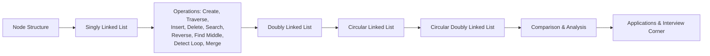

# Chapter 15: Linked Lists

> **Previous:** [Recursion](./14-recursion.md) | **Next:** [Stacks and Queues](./16-stacks-queues.md)

## Learning Objectives

- Define self-referential structures for linked data structures
- Implement singly linked list operations: creation, traversal, insertion, deletion, search, reverse
- Implement doubly linked lists for bidirectional traversal
- Implement circular and circular doubly linked lists
- Use slow/fast pointer technique to find middle and detect loops
- Merge two sorted linked lists
- Compare iterative vs recursive reversal
- Analyze complexity trade-offs between linked lists and arrays

<!-- Image Gallery -->
<section class="lesson-visuals" aria-label="Visual learning resources">
  <header><span>VISUAL LEARNING</span><h2>See it. Review it. Remember it.</h2></header>
  <a class="lesson-visual-card" href="../../../assets/images/lessons/c-programming/15-linked-lists/.png" target="_blank" rel="noopener">
    
    <span><strong>Handwritten notes</strong>Condensed notes for deliberate review.</span>
  </a>
  <a class="lesson-visual-card" href="../../../assets/images/lessons/c-programming/15-linked-lists/.png" target="_blank" rel="noopener">
    
    <span><strong>Sticky-note revision</strong>Fast recall prompts for revision.</span>
  </a>
  <a class="lesson-visual-card" href="../../../assets/images/lessons/c-programming/15-linked-lists/.png" target="_blank" rel="noopener">
    
    <span><strong>Visual concept guide</strong>A connected explanation of the key ideas.</span>
  </a>
</section>
<!-- End Image Gallery -->


---

### Chapter at a Glance


| Topic | Key Insight | Practical Takeaway |
|-------|-------------|-------------------|
| Node Structure | Each node contains data and pointer(s) to neighbor(s) | Define as `struct Node { int data; struct Node *next; };` |
| Singly Linked List | Nodes linked in one direction (forward only) | Traversal O(n); insert at head O(1) |
| Doubly Linked List | Each node has `prev` and `next` pointers | Bidirectional traversal; O(1) delete with pointer |
| Circular Linked List | Last node points back to head | Useful for round-robin scheduling |
| Circular Doubly Linked List | Head->prev = tail; tail->next = head | Full cyclic bidirectional navigation |
| Floyd's Cycle Detection | Slow/fast pointers meet if loop exists | O(n) time, O(1) space — no hash table needed |
| Reverse (Iterative) | Three pointers slide forward reversing links | O(n) time, O(1) space |
| Reverse (Recursive) | Recurse to tail, rewind linking backwards | O(n) time, O(n) stack space |

---



---

## 15.1 Node Structure

### Concept


A linked list is a sequence of **nodes** where each node contains data and a pointer to the next node. The structure is **self-referential** — it contains a pointer to an instance of itself.

### Real-World Analogy: Treasure Hunt


Imagine a treasure hunt where each clue card has:
- A **treasure piece** (data)
- The **location of the next clue card** (pointer)

You start at the first clue card (head). Read the piece of treasure, then follow the location to the next card. The last card says "End" instead of a location (`NULL`). To add a new clue at the beginning, you create a new card that points to what was previously the first card.

### Structure Definition


```c
/* Self-referential structure: the 'next' member
   is a pointer to another struct of the same type */
typedef struct node {
    int data;            /* data stored in this node */
    struct node *next;   /* pointer to the next node (or NULL) */
} Node;
```

### Memory Layout


```
Node (16 bytes on 64-bit)
┌──────────┬──────────────┐
│   data   │    next      │
│ (4 bytes)│ (8 bytes)    │
│          │  pointer     │
└──────────┴──────────────┘
  offset 0    offset 8
```

- `data`: typically 4 bytes (int)
- `next`: 8 bytes (pointer on 64-bit system)
- Total: 16 bytes per node (with padding)

### Pointer Diagram


```
head ───→ ┌────┬──────┐    ┌────┬──────┐    ┌────┬──────┐
          │ 10 │  ●───┼───→│ 20 │  ●───┼───→│ 30 │ NULL │
          └────┴──────┘    └────┴──────┘    └────┴──────┘
```

### Key Invariant


> The `head` pointer must always point to the first node. If `head` is `NULL`, the list is empty. **Never lose the head pointer** — if you lose it, the entire list becomes unreachable (memory leak).

---

## 15.2 Singly Linked List

### 15.2.1 Creating a Node


#### Real-World Analogy: Manufacturing a Clue Card

You cut a blank card (malloc), write the treasure value on it, and leave the "next location" field blank (NULL) because you haven't decided yet. Later you'll fill in where it points.

#### Numbered Steps

1. Allocate memory using `malloc` of size `sizeof(Node)`
2. If allocation fails, handle the error
3. Set `data` to the provided value
4. Set `next` to `NULL` (it points to nothing yet)
5. Return the pointer to the new node

#### Pseudocode

```
CREATE_NODE(value):
    new_node = malloc(sizeof(Node))
    if new_node == NULL:
        report error
        exit(1) or return NULL
    new_node.data = value
    new_node.next = NULL
    return new_node
```

#### Dry Run

| Step | new_node addr | new_node->data | new_node->next | Return |
|------|--------------|----------------|----------------|--------|
| malloc(16) | 0x1000 | garbage | garbage | — |
| data=42 | 0x1000 | 42 | garbage | — |
| next=NULL | 0x1000 | 42 | NULL | — |
| return | — | 42 | NULL | 0x1000 |

#### C Implementation

```c
#include <stdio.h>
#include <stdlib.h>

typedef struct node {
    int data;
    struct node *next;
} Node;

Node *create_node(int value)
{
    Node *new_node = (Node*)malloc(sizeof(Node));
    if (new_node == NULL) {
        fprintf(stderr, "Error: Memory allocation failed\n");
        exit(1);
    }
    new_node->data = value;
    new_node->next = NULL;
    return new_node;
}
```

#### Complexity

| Operation | Time | Space | Why |
|-----------|------|-------|-----|
| Create node | O(1) | O(1) | Fixed number of operations: one malloc, two assignments |
| Create n nodes | O(n) | O(n) | Each node requires independent malloc |

#### Edge Cases

- **malloc fails**: Return NULL or exit. Always check.
- **value is negative/zero**: No restriction — `data` is just an int.
- **Multiple creates**: Each call creates an independent node.

---

### 15.2.2 Traversal


#### Real-World Analogy: Following the Treasure Hunt

You start at the first clue (head). Read its treasure. Then follow the location pointer to the next clue. Keep going until you reach a clue that says "End" (NULL).

#### Numbered Steps

1. Start with a `current` pointer set to `head`
2. While `current` is not NULL:
    a. Process `current->data`
    b. Advance `current = current->next`
3. Stop — you have reached the end

#### Pseudocode

```
TRAVERSE(head):
    current = head
    while current != NULL:
        print(current.data)
        current = current.next
    print("NULL")
```

#### Dry Run: List [10 → 20 → 30 → NULL]

| Iteration | current addr | current->data | current->next | Print |
|-----------|-------------|---------------|---------------|-------|
| Start | 0x1000 | — | — | — |
| 1 | 0x1000 | 10 | 0x2000 | 10 -> |
| 2 | 0x2000 | 20 | 0x3000 | 20 -> |
| 3 | 0x3000 | 30 | NULL | 30 -> |
| 4 | NULL | — | — | NULL |
| End | — | — | — | `10 -> 20 -> 30 -> NULL` |

#### C Implementation

```c
void print_list(const Node *head)
{
    const Node *current = head;
    while (current != NULL) {
        printf("%d -> ", current->data);
        current = current->next;
    }
    printf("NULL\n");
}
```

#### Complexity

| Aspect | Value | Why |
|--------|-------|-----|
| Time | O(n) | Must visit every node exactly once |
| Space | O(1) | Only one temporary pointer, regardless of list size |

#### Edge Cases

- **Empty list (head == NULL)**: Loop body never executes, prints just "NULL".
- **Single node**: One iteration prints the node, then `current` becomes NULL.
- **Very long list**: O(n) time bound — no optimization possible for full traversal.

---

### 15.2.3 Insertion


#### A) Insert at Beginning

##### Real-World Analogy: Adding a Clue at the Front

You have a trail of clue cards. You make a new card, write the location of the current first card on it. Now this new card is the first card the hunter finds. The old first card is now second.

##### Numbered Steps

1. Create a new node with the given value
2. Set `new_node->next = head` (new node points to old head)
3. Return `new_node` as the new head

##### Pseudocode

```
INSERT_BEGINNING(head, value):
    new_node = CREATE_NODE(value)
    new_node.next = head
    return new_node
```

##### Dry Run: Insert 5 at beginning of [10 → 20 → NULL]

| Step | Variable | Value | Notes |
|------|----------|-------|-------|
| Initially | head | 0x1000 | points to node(10) |
| 1 | new_node | 0x4000 | create_node(5) |
| 2 | new_node->next | 0x1000 | was NULL, now = head |
| 3 | head (returned) | 0x4000 | new head |

Result: `[5 → 10 → 20 → NULL]`

Before:
```
head(0x1000) ───→ ┌───┬──────┐    ┌───┬──────┐
                   │10 │  ●───┼───→│20 │ NULL │
                   └───┴──────┘    └───┴──────┘
```

After:
```
head(0x4000) ───→ ┌───┬──────┐    ┌───┬──────┐    ┌───┬──────┐
                   │5  │  ●───┼───→│10 │  ●───┼───→│20 │ NULL │
                   └───┴──────┘    └───┴──────┘    └───┴──────┘
```

##### C Implementation

```c
Node *insert_beginning(Node *head, int value)
{
    Node *new_node = create_node(value);
    new_node->next = head;
    return new_node;    /* new head */
}
```

##### Complexity

| Aspect | Value | Why |
|--------|-------|-----|
| Time | O(1) | Fixed operations: create node + one pointer assignment |
| Space | O(1) | One new node regardless of list size |

##### Edge Cases

- **Empty list (head == NULL)**: `new_node->next = NULL`, new_node becomes both head and tail.
- **Single node list**: Works identically — old head becomes second node.

---

#### B) Insert at End

##### Real-World Analogy: Appending a Clue to the Trail

You need to find the last clue (the one with no "next location"), write the location of your new clue on it, and leave the new clue's location blank.

##### Numbered Steps

1. Create a new node
2. If list is empty, return new_node as head
3. Traverse to the last node (where `current->next == NULL`)
4. Set `current->next = new_node`
5. Return original head

##### Pseudocode

```
INSERT_END(head, value):
    new_node = CREATE_NODE(value)
    if head == NULL:
        return new_node
    current = head
    while current.next != NULL:
        current = current.next
    current.next = new_node
    return head
```

##### Dry Run: Insert 40 at end of [10 → 20 → 30 → NULL]

| Step | current addr | current->next | Action |
|------|-------------|---------------|--------|
| Init | 0x1000 | 0x2000 | start at head |
| Loop 1 | 0x2000 | 0x3000 | advance |
| Loop 2 | 0x3000 | NULL | stop here |
| After | 0x3000 | 0x4000 (new) | current->next = new_node |

Before:
```
head ───→ ┌───┬──────┐    ┌───┬──────┐    ┌───┬──────┐
          │10 │  ●───┼───→│20 │  ●───┼───→│30 │ NULL │
          └───┴──────┘    └───┴──────┘    └───┴──────┘
```

After:
```
head ───→ ┌───┬──────┐    ┌───┬──────┐    ┌───┬──────┐    ┌───┬──────┐
          │10 │  ●───┼───→│20 │  ●───┼───→│30 │  ●───┼───→│40 │ NULL │
          └───┴──────┘    └───┴──────┘    └───┴──────┘    └───┴──────┘
```

##### C Implementation

```c
Node *insert_end(Node *head, int value)
{
    Node *new_node = create_node(value);

    if (head == NULL) {
        return new_node;
    }

    Node *current = head;
    while (current->next != NULL) {
        current = current->next;
    }
    current->next = new_node;
    return head;
}
```

##### Complexity

| Aspect | Value | Why |
|--------|-------|-----|
| Time | O(n) | Must traverse from head to last node |
| Space | O(1) | One new node; traversal uses one pointer |
| With tail ptr | O(1) | If we maintain a `tail` pointer, no traversal needed |

##### Edge Cases

- **Empty list (head == NULL)**: Return new_node as head.
- **Single node**: Loop doesn't execute (head->next is NULL), so head->next = new_node.

---

#### C) Insert at Position

##### Real-World Analogy: Cutting Into the Middle of the Trail

You want to insert a new clue between the 2nd and 3rd clues. You walk to the 2nd clue, write your new clue's location on it, and set your new clue to point to what the 2nd clue USED to point to (the 3rd).

##### Numbered Steps

1. If position is 0, use `insert_beginning`
2. Traverse to node at `position - 1`
3. If that node is NULL, position is out of range
4. Create new node
5. Set `new_node->next = current->next`
6. Set `current->next = new_node`
7. Return head

##### Pseudocode

```
INSERT_AT(head, value, position):
    if position == 0:
        return INSERT_BEGINNING(head, value)
    current = head
    for i = 0 to position - 2:    // stop at position-1
        if current == NULL:
            print "Position out of range"
            return head
        current = current.next
    if current == NULL:
        print "Position out of range"
        return head
    new_node = CREATE_NODE(value)
    new_node.next = current.next
    current.next = new_node
    return head
```

##### Dry Run: Insert 25 at position 2 in [10 → 20 → 30 → NULL]

Positions: 0=10, 1=20, 2=30, want to insert BEFORE position 2 (i.e., between 20 and 30)

| Step | i | current addr | current->data | current->next | Action |
|------|---|-------------|---------------|---------------|--------|
| Init | — | 0x1000 | 10 | 0x2000 | start |
| Loop | 0 | 0x2000 | 20 | 0x3000 | advance (i &lt; 1) |
| Loop done | — | 0x2000 | 20 | 0x3000 | stop at position-1=1 |
| Insert | — | — | — | — | new_node->next=0x3000; current->next=new_node |

Before:
```
[0]        [1]        [2]
10 ───→ 20 ───→ 30 ───→ NULL
         ↑
     current
```

After:
```
[0]        [1]        [2]        [3]
10 ───→ 20 ───→ 25 ───→ 30 ───→ NULL
         ↑
     current
```

##### C Implementation

```c
Node *insert_at(Node *head, int value, int position)
{
    if (position == 0) {
        return insert_beginning(head, value);
    }

    Node *current = head;
    for (int i = 0; current != NULL && i < position - 1; i++) {
        current = current->next;
    }

    if (current == NULL) {
        fprintf(stderr, "Error: Position out of range\n");
        return head;
    }

    Node *new_node = create_node(value);
    new_node->next = current->next;
    current->next = new_node;
    return head;
}
```

##### Complexity

| Aspect | Value | Why |
|--------|-------|-----|
| Time | O(n) | Worst case: insert at end requires full traversal |
| Best case (pos 0) | O(1) | Same as insert_beginning |
| Space | O(1) | One new node |

##### Edge Cases

- **position == 0**: Delegate to insert_beginning.
- **position > length**: current becomes NULL before reaching target; report error.
- **Insert at last position**: Works like insert_end.
- **Empty list + position > 0**: current is NULL immediately; error.

---

#### D) Insert After a Given Value

```c
Node *insert_after(Node *head, int target, int value)
{
    Node *current = head;
    while (current != NULL && current->data != target) {
        current = current->next;
    }

    if (current == NULL) {
        printf("Value %d not found in list\n", target);
        return head;
    }

    Node *new_node = create_node(value);
    new_node->next = current->next;
    current->next = new_node;
    return head;
}
```

**Dry run**: Insert 25 after 20 in [10 → 20 → 30 → NULL]

| Step | current addr | current->data | Action |
|------|-------------|---------------|--------|
| Init | 0x1000 | 10 | not target, advance |
| Loop 1 | 0x2000 | 20 | target found |
| Insert | — | — | new(25)->next = 0x3000; 20->next = new(25) |

Result: [10 → 20 → 25 → 30 → NULL]

---

### 15.2.4 Deletion


#### A) Delete by Value

##### Real-World Analogy: Removing a Clue from the Trail

Someone tells you to remove the clue with value 20. You walk the trail until you find the clue BEFORE it. You change the "next location" on that clue to skip the 20-clue and point directly to the clue after it. Then you discard the 20-clue.

##### Numbered Steps

1. If head is NULL, return NULL (empty list)
2. If head->data == value, remove head:
    a. Set temp = head
    b. Set head = head->next
    c. free(temp)
    d. Return head
3. Traverse until current->next is the target node
4. If target not found, report and return
5. Set temp = current->next (the node to delete)
6. Set current->next = temp->next (bypass the node)
7. free(temp)
8. Return head

##### Pseudocode

```
DELETE_VALUE(head, value):
    if head == NULL:
        return NULL
    if head.data == value:
        temp = head
        head = head.next
        free(temp)
        return head
    current = head
    while current.next != NULL AND current.next.data != value:
        current = current.next
    if current.next == NULL:
        print "Value not found"
        return head
    temp = current.next
    current.next = temp.next
    free(temp)
    return head
```

##### Dry Run: Delete 20 from [10 → 20 → 30 → NULL]

| Step | Variable | Value | Pointer State |
|------|----------|-------|---------------|
| Init | head | 0x1000 | [10]→[20]→[30]→NULL |
| Check head | head->data=10 | ≠20 | continue |
| current | 0x1000 | 10 | start traversal |
| current->data | 10 | ≠20 | advance |
| current | 0x2000 | 20 | check current->next->data |
| current->next->data | 20 | ==20 | found it |
| temp | 0x2000 | node(20) | save node to delete |
| current->next | 0x3000 | was 0x2000, now = temp->next = node(30) | bypass |
| free(temp) | — | — | node(20) freed |

Before:
```
head ───→ ┌───┬──────┐    ┌───┬──────┐    ┌───┬──────┐
          │10 │  ●───┼───→│20 │  ●───┼───→│30 │ NULL │
          └───┴──────┘    └───┴──────┘    └───┴──────┘
                              ↑
                             temp (to free)
```

After:
```
head ───→ ┌───┬──────┐    ┌───┬──────┐
          │10 │  ●───┼───→│30 │ NULL │
          └───┴──────┘    └───┴──────┘
```

##### C Implementation

```c
Node *delete_value(Node *head, int value)
{
    if (head == NULL) return NULL;

    /* If the value is at the head */
    if (head->data == value) {
        Node *temp = head;
        head = head->next;
        free(temp);
        return head;
    }

    /* Search for the node BEFORE the one containing value */
    Node *current = head;
    while (current->next != NULL && current->next->data != value) {
        current = current->next;
    }

    if (current->next == NULL) {
        printf("Value %d not found in list\n", value);
        return head;
    }

    Node *temp = current->next;
    current->next = temp->next;
    free(temp);
    return head;
}
```

##### Complexity

| Aspect | Value | Why |
|--------|-------|-----|
| Time (worst) | O(n) | May need to traverse entire list to find the value |
| Time (best) | O(1) | Deleting the head node |
| Time (not found) | O(n) | Full traversal required to confirm absence |
| Space | O(1) | Only a couple of temporary pointers |

##### Edge Cases

- **Empty list (head == NULL)**: Return NULL immediately.
- **Delete head**: Separate case — head pointer itself must change.
- **Value not found**: Full traversal, then report not found.
- **Delete only node**: head freed, return NULL.
- **Delete tail**: current->next is the tail; after deletion current->next becomes NULL.

---

#### B) Delete by Position

```c
Node *delete_at(Node *head, int position)
{
    if (head == NULL) return NULL;

    if (position == 0) {
        Node *temp = head;
        head = head->next;
        free(temp);
        return head;
    }

    Node *current = head;
    for (int i = 0; current != NULL && i < position - 1; i++) {
        current = current->next;
    }

    if (current == NULL || current->next == NULL) {
        fprintf(stderr, "Error: Position %d out of range\n", position);
        return head;
    }

    Node *temp = current->next;
    current->next = temp->next;
    free(temp);
    return head;
}
```

---

### 15.2.5 Search


#### Real-World Analogy: Looking for a Specific Treasure Value

You walk the treasure trail, reading each clue's value. If you find the value you're looking for, you stop and say "Found it!" If you reach the end (NULL), you say "Not here."

#### Numbered Steps

1. Set `current = head`
2. While current is not NULL:
    a. If current->data == target, return current (found)
    b. Advance current = current->next
3. Return NULL (not found)

#### Pseudocode

```
SEARCH(head, target):
    current = head
    while current != NULL:
        if current.data == target:
            return current
        current = current.next
    return NULL
```

#### Dry Run: Search for 20 in [10 → 20 → 30 → NULL]

| Step | current addr | current->data | Match? |
|------|-------------|---------------|--------|
| 1 | 0x1000 | 10 | No, advance |
| 2 | 0x2000 | 20 | YES, return 0x2000 |

Search for 40 in [10 → 20 → 30 → NULL]:

| Step | current addr | current->data | Match? |
|------|-------------|---------------|--------|
| 1 | 0x1000 | 10 | No, advance |
| 2 | 0x2000 | 20 | No, advance |
| 3 | 0x3000 | 30 | No, advance |
| 4 | NULL | — | End, return NULL |

#### C Implementation

```c
Node *search_node(Node *head, int target)
{
    Node *current = head;
    while (current != NULL) {
        if (current->data == target) {
            return current;   /* found: return pointer */
        }
        current = current->next;
    }
    return NULL;              /* not found */
}
```

#### Complexity

| Aspect | Value | Why |
|--------|-------|-----|
| Time (worst) | O(n) | Value at last node or not present |
| Time (best) | O(1) | Value at head |
| Space | O(1) | One temporary pointer |

#### Edge Cases

- **Empty list**: Loop never executes, return NULL.
- **Value at head**: Found immediately in first iteration.
- **Duplicates**: Returns the FIRST occurrence only.

---

### 15.2.6 Reverse (Iterative)


#### Real-World Analogy: Flipping the Trail Direction

Imagine each clue has a string pointing to the next one. You want the entire trail to point in the opposite direction. You walk forward with three hands: one holding the previous clue, one holding the current clue, and one holding the next clue. At each step, you turn the current clue's string to point backward instead of forward.

#### Numbered Steps

1. Initialize three pointers: `prev = NULL`, `current = head`, `next = NULL`
2. While current is not NULL:
    a. Save next: `next = current->next`
    b. Reverse link: `current->next = prev`
    c. Slide prev forward: `prev = current`
    d. Slide current forward: `current = next`
3. Return `prev` as the new head

#### Pseudocode

```
REVERSE_ITERATIVE(head):
    prev = NULL
    current = head
    next = NULL
    while current != NULL:
        next = current.next       // save next node
        current.next = prev        // reverse the link
        prev = current             // move prev forward
        current = next             // move current forward
    return prev                    // prev is now the head
```

#### Dry Run: Reverse [10 → 20 → 30 → NULL]

| Step | prev | current | next | current->next (after) | State |
|------|------|---------|------|----------------------|-------|
| Init | NULL | 0x1000 (10) | NULL | — | 10→20→30→NULL |
| 1 | — | — | 0x2000 (20) | — | — |
| 2 | — | — | — | NULL (was 0x2000) | 10→NULL |
| 3 | 0x1000 (10) | — | — | — | — |
| 4 | — | 0x2000 (20) | — | — | — |
| 5 | — | — | 0x3000 (30) | — | — |
| 6 | — | — | — | 0x1000 (was 0x3000) | 20→10→NULL |
| 7 | 0x2000 (20) | — | — | — | — |
| 8 | — | 0x3000 (30) | — | — | — |
| 9 | — | — | NULL | — | — |
| 10 | — | — | — | 0x2000 (was NULL) | 30→20→10→NULL |
| 11 | 0x3000 (30) | — | — | — | — |
| 12 | — | NULL | — | — | loop ends |

Return prev = 0x3000 (30 becomes new head)

Visual trace:

```
Step 0: NULL ← [10] → [20] → [30] → NULL
         prev   cur     next

Step 2: NULL ← [10]   [20] → [30] → NULL
         prev   cur     next

Step 3-4: NULL ← [10] ← [20]   [30] → NULL
                prev    cur     next

Step 5-6: NULL ← [10] ← [20] ← [30]   NULL
                prev    cur    next

Step 7-8: NULL ← [10] ← [20] ← [30]
                       prev    cur    next=NULL

Step 9-11: return prev → head = [30]
```

#### C Implementation

```c
Node *reverse_iterative(Node *head)
{
    Node *prev = NULL;
    Node *current = head;
    Node *next = NULL;

    while (current != NULL) {
        next = current->next;    /* Step 1: save the next node */
        current->next = prev;    /* Step 2: reverse the link */
        prev = current;          /* Step 3: move prev forward */
        current = next;          /* Step 4: move current forward */
    }
    return prev;                 /* new head */
}
```

#### Complexity

| Aspect | Value | Why |
|--------|-------|-----|
| Time | O(n) | Exactly one pass through all n nodes |
| Space | O(1) | Only three pointer variables regardless of list size |

#### Edge Cases

- **Empty list (head == NULL)**: Loop doesn't execute, return NULL.
- **Single node**: Link reverses to NULL (already pointing there), prev becomes the single node, return it unchanged.
- **Two nodes**: Single iteration reverses both links correctly.

---

### 15.2.7 Reverse (Recursive)


#### Real-World Analogy: Folding the Trail from the End

You ask the person at the end of the trail to become the new start, then work backward. Each person tells the person behind them "Point to me instead of forward."

#### Numbered Steps

1. Base case: if head is NULL or head->next is NULL, return head
2. Recursively reverse the rest: `new_head = reverse_recursive(head->next)`
3. After recursion returns, `head->next->next = head` (make the next node point back)
4. `head->next = NULL` (old head becomes tail)
5. Return `new_head`

#### Pseudocode

```
REVERSE_RECURSIVE(head):
    if head == NULL OR head.next == NULL:
        return head
    new_head = REVERSE_RECURSIVE(head.next)
    head.next.next = head    // reverse the link
    head.next = NULL          // old head becomes tail
    return new_head
```

#### Dry Run: Reverse [10 → 20 → 30 → NULL]

| Call level | head addr | head->data | head->next | Recursing | After return | Action |
|------------|-----------|------------|------------|-----------|--------------|--------|
| reverse(10) | 0x1000 | 10 | 0x2000 | reverse(20) | — | wait |
| reverse(20) | 0x2000 | 20 | 0x3000 | reverse(30) | — | wait |
| reverse(30) | 0x3000 | 30 | NULL | base case | return 0x3000 | — |
| reverse(20) resumes | — | — | — | — | new_head=0x3000 | 20->next->next=20->...; 20->next=NULL; return 0x3000 |
| reverse(10) resumes | — | — | — | — | new_head=0x3000 | 10->next->next=10->...; 10->next=NULL; return 0x3000 |

Step by step at reverse(20) after reverse(30) returns:
- Before: 20→30→NULL
- head->next = 30, head->next->next = 30->next = NULL → set to 20 (30→20)
- head->next = NULL (20→NULL)
- Now: 30→20→NULL

At reverse(10) after reverse(20) returns:
- Before: 10→20→NULL (rest already reversed)
- head->next = 20, head->next->next = 20->next = NULL → set to 10 (20→10)
- head->next = NULL (10→NULL)
- Now: 30→20→10→NULL

#### C Implementation

```c
Node *reverse_recursive(Node *head)
{
    /* Base case: empty list or single node */
    if (head == NULL || head->next == NULL) {
        return head;
    }

    /* Recursively reverse the rest of the list */
    Node *new_head = reverse_recursive(head->next);

    /* Make the next node point back to this node */
    head->next->next = head;
    head->next = NULL;    /* this node becomes the tail */

    return new_head;
}
```

#### Complexity

| Aspect | Value | Why |
|--------|-------|-----|
| Time | O(n) | Visits each node once during unwinding |
| Space (stack) | O(n) | Recursion depth = n, each call consumes stack frame for head pointer |

#### Edge Cases

- **Empty list**: Base case returns NULL.
- **Single node**: Base case returns the node unchanged.
- **Very long list**: Risk of stack overflow — iterative is safer for large lists.

#### Recursive vs Iterative Comparison

| Criterion | Iterative | Recursive |
|-----------|-----------|-----------|
| Space | O(1) | O(n) stack space |
| Code clarity | 5-6 lines, straightforward | 4 lines, elegant but subtle |
| Risk | None | Stack overflow for large n |
| Performance | Fast (no function call overhead per node) | Function call per node adds overhead |
| When to use | Always preferred for production | Interview answer, small lists |

---

### 15.2.8 Find Middle (Slow/Fast Pointer)


#### Real-World Analogy: Two Runners

You send two runners down the trail. The fast runner takes two steps for every one step the slow runner takes. When the fast runner reaches the end, the slow runner is exactly at the middle.

#### Numbered Steps

1. Initialize `slow = head`, `fast = head`
2. While `fast != NULL` AND `fast->next != NULL`:
    a. Move slow one step: `slow = slow->next`
    b. Move fast two steps: `fast = fast->next->next`
3. Return slow (points to middle)

#### Pseudocode

```
FIND_MIDDLE(head):
    if head == NULL:
        return NULL
    slow = head
    fast = head
    while fast != NULL AND fast.next != NULL:
        slow = slow.next
        fast = fast.next.next
    return slow
```

#### Dry Run: Find middle of [10 → 20 → 30 → 40 → 50 → NULL]

| Iteration | slow addr | slow->data | fast addr | fast->data | Condition |
|-----------|-----------|------------|-----------|------------|-----------|
| Start | 0x1000 | 10 | 0x1000 | 10 | — |
| 1 | 0x2000 | 20 | 0x3000 | 30 | fast=0x3000, fast->next=0x4000 |
| 2 | 0x3000 | 30 | 0x5000 | 50 | fast=0x5000, fast->next=NULL → stop |

Result: slow points to node(30) — middle element (odd length, exact middle).

For even length [10 → 20 → 30 → 40 → NULL]:

| Iteration | slow | fast |
|-----------|------|------|
| Start | 10 | 10 |
| 1 | 20 | 30 |
| 2 | 30 | NULL (fast->next was NULL, but fast was 40, next is NULL) |

Result: slow points to 30 — second middle element (right-middle).

#### C Implementation

```c
Node *find_middle(Node *head)
{
    if (head == NULL) return NULL;

    Node *slow = head;
    Node *fast = head;

    while (fast != NULL && fast->next != NULL) {
        slow = slow->next;
        fast = fast->next->next;
    }
    return slow;    /* points to middle node */
}
```

#### Complexity

| Aspect | Value | Why |
|--------|-------|-----|
| Time | O(n) | Fast pointer traverses the list once |
| Space | O(1) | Two pointer variables only |

#### Edge Cases

- **Empty list**: Return NULL.
- **Single node**: Loop never executes (fast->next is NULL), return head.
- **Two nodes**: One iteration: slow moves to node 2; fast moves to NULL. Returns node 2 (right-middle).

---

### 15.2.9 Detect Loop (Floyd's Cycle Detection)


#### Real-World Analogy: Tortoise and Hare on a Circular Track

A tortoise (slow) and a hare (fast) start running on a track. If the track has a loop, the hare will eventually lap the tortoise and they'll meet. On a straight track, the hare reaches the end first.

#### Numbered Steps

1. Initialize `slow = head`, `fast = head`
2. While `fast != NULL` AND `fast->next != NULL`:
    a. Move slow one step
    b. Move fast two steps
    c. If slow == fast, loop detected — return slow (meeting point)
3. Return NULL — no loop

#### Pseudocode

```
DETECT_LOOP(head):
    slow = head
    fast = head
    while fast != NULL AND fast.next != NULL:
        slow = slow.next
        fast = fast.next.next
        if slow == fast:
            return slow       // loop detected
    return NULL               // no loop
```

#### Dry Run: List with loop [1 → 2 → 3 → 4 → 5 → 3 (back to node 3)]

Indices: 1(0x1000) → 2(0x2000) → 3(0x3000) → 4(0x4000) → 5(0x5000) → 3(0x3000)

| Iteration | slow | fast | Check slow==fast |
|-----------|------|------|------------------|
| 0 | 0x1000 (1) | 0x1000 (1) | start, skip check |
| 1 | 0x2000 (2) | 0x3000 (3) | no |
| 2 | 0x3000 (3) | 0x5000 (5) | no |
| 3 | 0x4000 (4) | 0x4000 (4) | **YES** — loop found |

**Finding the start of the loop**: After meeting, reset slow to head, move both one step at a time. They meet at loop start.

| Iteration | slow (from head) | fast (from meeting) | Meet? |
|-----------|-----------------|---------------------|-------|
| Start | 0x1000 (1) | 0x4000 (4) | — |
| 1 | 0x2000 (2) | 0x5000 (5) | no |
| 2 | 0x3000 (3) | 0x3000 (3) | **YES** — loop starts at node 3 |

#### C Implementation

```c
/* Returns NULL if no loop, otherwise pointer to meeting point */
Node *detect_loop(Node *head)
{
    Node *slow = head;
    Node *fast = head;

    while (fast != NULL && fast->next != NULL) {
        slow = slow->next;
        fast = fast->next->next;
        if (slow == fast) {
            return slow;   /* loop detected */
        }
    }
    return NULL;           /* no loop */
}

/* Returns pointer to the first node of the loop */
Node *find_loop_start(Node *head)
{
    Node *meeting = detect_loop(head);
    if (meeting == NULL) return NULL;   /* no loop */

    Node *slow = head;
    while (slow != meeting) {
        slow = slow->next;
        meeting = meeting->next;
    }
    return slow;   /* start of loop */
}
```

#### Complexity

| Aspect | Value | Why |
|--------|-------|-----|
| Time (detect) | O(n) | Fast pointer completes at most 2 traversals |
| Time (find start) | O(n) | Extra linear pass from head to loop start |
| Space | O(1) | Two pointer variables — no hash table needed |

#### Edge Cases

- **Empty list**: Return NULL.
- **Single node pointing to itself**: fast->next != NULL is true, slow=fast on second iteration.
- **Full loop (tail→head)**: Detected after one traversal.
- **No loop**: Fast pointer reaches NULL normally.

---

### 15.2.10 Merge Two Sorted Lists


#### Real-World Analogy: Merging Two Sorted Decks

You have two decks of cards, each sorted smallest to largest. You compare the top card of each deck, take the smaller one, and put it on your output pile. Repeat until one deck is empty, then add all remaining cards from the other deck.

#### Numbered Steps

1. If one list is empty, return the other
2. Compare head data of both lists
3. Recursively merge the rest:
    a. The smaller head becomes the result head
    b. Its next = merge(its next, the other list)
4. Return the result head

#### Pseudocode

```
MERGE_SORTED(a, b):
    if a == NULL: return b
    if b == NULL: return a
    if a.data <= b.data:
        a.next = MERGE_SORTED(a.next, b)
        return a
    else:
        b.next = MERGE_SORTED(a, b.next)
        return b
```

#### Dry Run: Merge [10 → 30 → 50] and [20 → 40 → 60]

| Call | a | b | Compare | Returns |
|------|---|----|---------|---------|
| merge(10,20) | 10 | 20 | 10≤20 | 10→merge(30,20) |
| merge(30,20) | 30 | 20 | 30>20 | 20→merge(30,40) |
| merge(30,40) | 30 | 40 | 30≤40 | 30→merge(50,40) |
| merge(50,40) | 50 | 40 | 50>40 | 40→merge(50,60) |
| merge(50,60) | 50 | 60 | 50≤60 | 50→merge(NULL,60) |
| merge(NULL,60) | NULL | 60 | — | 60 |

Unwinding:
```
merge(NULL,60) = 60
merge(50,60)   = 50 → 60
merge(50,40)   = 40 → 50 → 60
merge(30,40)   = 30 → 40 → 50 → 60
merge(30,20)   = 20 → 30 → 40 → 50 → 60
merge(10,20)   = 10 → 20 → 30 → 40 → 50 → 60
```

Result: [10 → 20 → 30 → 40 → 50 → 60 → NULL]

#### C Implementation

```c
/* Recursive merge — creates NO new nodes, reuses existing ones */
Node *merge_sorted(Node *a, Node *b)
{
    if (a == NULL) return b;
    if (b == NULL) return a;

    if (a->data <= b->data) {
        a->next = merge_sorted(a->next, b);
        return a;
    } else {
        b->next = merge_sorted(a, b->next);
        return b;
    }
}
```

##### Iterative Version

```c
Node *merge_sorted_iterative(Node *a, Node *b)
{
    Node dummy;
    Node *tail = &dummy;
    dummy.next = NULL;

    while (a != NULL && b != NULL) {
        if (a->data <= b->data) {
            tail->next = a;
            a = a->next;
        } else {
            tail->next = b;
            b = b->next;
        }
        tail = tail->next;
    }

    /* Append remaining nodes */
    tail->next = (a != NULL) ? a : b;
    return dummy.next;
}
```

#### Complexity

| Aspect | Recursive | Iterative |
|--------|-----------|-----------|
| Time | O(n+m) | O(n+m) |
| Space | O(n+m) stack | O(1) |

#### Edge Cases

- **Both empty**: Return NULL.
- **One empty**: Return the non-empty list.
- **All elements of one list are smaller**: Pure linear merge, single traversal.
- **Equal values**: ≤ ensures stability (a's elements come before b's equal values).

---

### 15.2.11 Complete Singly Linked List Driver


```c
#include <stdio.h>
#include <stdlib.h>

typedef struct node {
    int data;
    struct node *next;
} Node;

Node *create_node(int value)
{
    Node *n = (Node*)malloc(sizeof(Node));
    if (n) { n->data = value; n->next = NULL; }
    return n;
}

void print_list(const Node *head)
{
    while (head) {
        printf("%d -> ", head->data);
        head = head->next;
    }
    printf("NULL\n");
}

void free_list(Node *head)
{
    Node *temp;
    while (head) {
        temp = head;
        head = head->next;
        free(temp);
    }
}

Node *insert_beginning(Node *head, int value)
{
    Node *n = create_node(value);
    n->next = head;
    return n;
}

Node *insert_end(Node *head, int value)
{
    Node *n = create_node(value);
    if (!head) return n;
    Node *cur = head;
    while (cur->next) cur = cur->next;
    cur->next = n;
    return head;
}

Node *delete_value(Node *head, int value)
{
    if (!head) return NULL;
    if (head->data == value) {
        Node *t = head; head = head->next; free(t);
        return head;
    }
    Node *cur = head;
    while (cur->next && cur->next->data != value)
        cur = cur->next;
    if (cur->next) {
        Node *t = cur->next;
        cur->next = t->next;
        free(t);
    }
    return head;
}

Node *reverse_iterative(Node *head)
{
    Node *prev = NULL, *cur = head, *next = NULL;
    while (cur) {
        next = cur->next;
        cur->next = prev;
        prev = cur;
        cur = next;
    }
    return prev;
}

Node *find_middle(Node *head)
{
    if (!head) return NULL;
    Node *slow = head, *fast = head;
    while (fast && fast->next) {
        slow = slow->next;
        fast = fast->next->next;
    }
    return slow;
}

int main(void)
{
    Node *head = NULL;

    /* Build list: 10 -> 20 -> 30 -> 40 -> 50 */
    head = insert_end(head, 10);
    head = insert_end(head, 20);
    head = insert_end(head, 30);
    head = insert_end(head, 40);
    head = insert_end(head, 50);

    printf("Original:   "); print_list(head);

    head = insert_beginning(head, 5);
    printf("After 5 at front: "); print_list(head);

    head = delete_value(head, 30);
    printf("After del 30: "); print_list(head);

    head = reverse_iterative(head);
    printf("Reversed:   "); print_list(head);

    Node *mid = find_middle(head);
    if (mid) printf("Middle: %d\n", mid->data);

    free_list(head);
    return 0;
}
```

**Output:**
```
Original:   10 -> 20 -> 30 -> 40 -> 50 -> NULL
After 5 at front: 5 -> 10 -> 20 -> 30 -> 40 -> 50 -> NULL
After del 30: 5 -> 10 -> 20 -> 40 -> 50 -> NULL
Reversed:   50 -> 40 -> 20 -> 10 -> 5 -> NULL
Middle: 20
```

---

### Singly Linked List — Operations Summary Table


| Operation | Time | Space | Code Complexity | Key Pointer Change |
|-----------|------|-------|-----------------|-------------------|
| Create Node | O(1) | O(1) | Trivial | malloc + assign |
| Traverse | O(n) | O(1) | Simple | `cur = cur->next` |
| Insert Beginning | O(1) | O(1) | Simple | `new->next = head` |
| Insert End | O(n) | O(1) | Simple | `tail->next = new` |
| Insert at Position | O(n) | O(1) | Medium | traverse + relink |
| Delete Head | O(1) | O(1) | Simple | `head = head->next` |
| Delete Value | O(n) | O(1) | Medium | `prev->next = target->next` |
| Search | O(n) | O(1) | Simple | linear scan |
| Reverse Iterative | O(n) | O(1) | Medium | three-pointer slide |
| Reverse Recursive | O(n) | O(n) | Medium | `head->next->next = head` |
| Find Middle | O(n) | O(1) | Medium | slow/fast pointer |
| Detect Loop | O(n) | O(1) | Medium | Floyd's cycle |
| Find Loop Start | O(n) | O(1) | Medium | reset + meet |
| Merge Sorted | O(n+m) | O(1)* | Medium | dummy node sentinel |

\* Iterative merge uses O(1); recursive merge uses O(n+m) stack space.

---

### Singly Linked List — Edge Cases Matrix


| Operation | Empty List | Single Node | Two Nodes | Duplicates |
|-----------|-----------|-------------|-----------|------------|
| Traverse | prints only NULL | works | works | works |
| Insert Beginning | new node becomes head | works | works | works |
| Insert End | new node becomes head | works | works | works |
| Delete Head | returns NULL | returns NULL | head advances | deletes first occurrence |
| Delete Value | returns NULL | returns NULL if match | works | deletes first occurrence |
| Reverse | returns NULL | unchanged | swaps order | works |
| Find Middle | returns NULL | returns node | returns second node | works |
| Detect Loop | returns NULL | returns NULL | returns NULL if no loop | works |

---

## 15.3 Doubly Linked List

### Concept


Each node has two pointers: `prev` (previous node) and `next` (next node). This enables bidirectional traversal and O(1) deletion when given a pointer to the node.

### Real-World Analogy: Two-Way Street


A doubly linked list is like a street where each house has signs pointing both to the next house AND the previous house. You can walk from start to end OR from end to start.

### Structure


```c
typedef struct dnode {
    int data;
    struct dnode *prev;   /* points to the previous node */
    struct dnode *next;   /* points to the next node */
} DNode;
```

### Memory Layout


```
DNode (24 bytes on 64-bit)
┌──────────┬──────────────┬──────────────┐
│   data   │    prev      │    next      │
│ (4 bytes)│ (8 bytes)    │ (8 bytes)    │
└──────────┴──────────────┴──────────────┘
```

### Pointer Diagram


```
NULL ←──┌────┬─────┬──────┐    ┌────┬─────┬──────┐    ┌────┬──────┬──────┐
        │ 10 │ ●  │  ●───┼───→│ 20 │ ●  │  ●───┼───→│ 30 │ ●   │ NULL │
        └────┴──│──┴──────┘    └────┴──│──┴──────┘    └────┴──│───┴──────┘
                ↑                     ↑                     ↑
                └─────────────────────┘─────────────────────┘
```

### 15.3.1 Create Node


```c
DNode *create_dnode(int value)
{
    DNode *n = (DNode*)malloc(sizeof(DNode));
    if (n) {
        n->data = value;
        n->prev = NULL;
        n->next = NULL;
    }
    return n;
}
```

### 15.3.2 Insert at Beginning


#### Numbered Steps

1. Create new node
2. `new_node->next = head`
3. If head is not NULL: `head->prev = new_node`
4. Return new_node as head

```c
DNode *insert_beginning(DNode *head, int value)
{
    DNode *n = create_dnode(value);
    n->next = head;
    if (head != NULL) {
        head->prev = n;
    }
    return n;
}
```

**Dry run**: Insert 5 at beginning of [10 &lt;-> 20 <-&gt; NULL]

| Step | Pointer | Value | Action |
|------|---------|-------|--------|
| 1 | n | addr(5) | create |
| 2 | n->next | 0x1000 | = head |
| 3 | head->prev | 0x4000 (n's addr) | head was 0x1000 (10) |
| 4 | head returned | 0x4000 | new head = n |

Result: [5 &lt;-> 10 <-&gt; 20 &lt;-> NULL]

#### Complexity

| Aspect | Value | Why |
|--------|-------|-----|
| Time | O(1) | Fixed pointer updates |
| Space | O(1) | One new node |

---

### 15.3.3 Insert at End


```c
DNode *insert_end(DNode *head, int value)
{
    DNode *n = create_dnode(value);
    if (head == NULL) return n;

    DNode *cur = head;
    while (cur->next) cur = cur->next;
    cur->next = n;
    n->prev = cur;
    return head;
}
```

#### Complexity

| Aspect | Value | Why |
|--------|-------|-----|
| Time | O(n) | Must traverse to tail |
| With tail ptr | O(1) | Direct tail access |

---

### 15.3.4 Delete Node


#### Real-World Analogy: Removing a House from a Two-Way Street

You want to remove house number 20. You tell the house before it (10) to point its "next" sign to house 30. You tell the house after it (30) to point its "prev" sign to house 10. Then you demolish house 20.

#### Numbered Steps

1. Find the node with the target value
2. If not found, return head
3. If the node has a previous: `prev->next = cur->next`
4. Else this is the head: `head = cur->next`
5. If the node has a next: `next->prev = cur->prev`
6. Free the node
7. Return head

#### Pseudocode

```
DELETE(head, value):
    cur = head
    while cur != NULL AND cur.data != value:
        cur = cur.next
    if cur == NULL: return head          // not found
    if cur.prev != NULL:
        cur.prev.next = cur.next          // bypass forward
    else:
        head = cur.next                  // deleting head
    if cur.next != NULL:
        cur.next.prev = cur.prev          // bypass backward
    free(cur)
    return head
```

#### Dry Run: Delete 30 from [10 &lt;-> 20 <-&gt; 30 &lt;-> 40 <-&gt; NULL]

| Step | cur addr | cur->data | Action |
|------|-----------|-----------|--------|
| Search | 0x1000 | 10 | advance |
| Search | 0x2000 | 20 | advance |
| Search | 0x3000 | 30 | found! |
| cur->prev exists | 0x2000 | — | cur->prev->next = cur->next (40) |
| cur->next exists | 0x4000 (40) | — | cur->next->prev = cur->prev (20) |
| free | — | — | cur freed |

Before:
```
NULL ←→ [10] ←→ [20] ←→ [30] ←→ [40] ←→ NULL
                          ↑
                         cur
```

After:
```
NULL ←→ [10] ←→ [20] ←→ [40] ←→ NULL
                     ↑
               20->next = 40
                40->prev = 20
```

#### C Implementation

```c
DNode *delete_node(DNode *head, int value)
{
    DNode *cur = head;
    while (cur != NULL && cur->data != value) {
        cur = cur->next;
    }

    if (cur == NULL) {
        printf("Value %d not found\n", value);
        return head;
    }

    /* Update backward link */
    if (cur->prev != NULL) {
        cur->prev->next = cur->next;
    } else {
        head = cur->next;       /* deleting head */
    }

    /* Update forward link */
    if (cur->next != NULL) {
        cur->next->prev = cur->prev;
    }

    free(cur);
    return head;
}
```

#### Complexity

| Aspect | Value | Why |
|--------|-------|-----|
| Time (search+delete) | O(n) | Must find the node first |
| Time (delete with pointer) | O(1) | If you already have the node pointer, just 2 pointer updates |
| Space | O(1) | One temporary pointer |

#### Edge Cases

- **Delete head**: head->prev is NULL; update `head = cur->next`, then set new head's prev to NULL.
- **Delete tail**: cur->next is NULL; just update prev->next to NULL.
- **Delete only node**: head becomes NULL, both prev and next are NULL.
- **Value not found**: Full traversal, report error.

---

### 15.3.5 Forward and Backward Traversal


```c
void print_forward(const DNode *head)
{
    while (head) {
        printf("%d <-> ", head->data);
        head = head->next;
    }
    printf("NULL\n");
}

void print_backward(const DNode *tail)
{
    while (tail) {
        printf("%d <-> ", tail->data);
        tail = tail->prev;
    }
    printf("NULL\n");
}
```

### 15.3.6 Complete Doubly Linked List Example


```c
#include <stdio.h>
#include <stdlib.h>

typedef struct dnode {
    int data;
    struct dnode *prev;
    struct dnode *next;
} DNode;

DNode *create_dnode(int value) {
    DNode *n = (DNode*)malloc(sizeof(DNode));
    if (n) { n->data = value; n->prev = NULL; n->next = NULL; }
    return n;
}

DNode *insert_beginning(DNode *head, int value) {
    DNode *n = create_dnode(value);
    n->next = head;
    if (head) head->prev = n;
    return n;
}

DNode *insert_end(DNode *head, int value) {
    DNode *n = create_dnode(value);
    if (!head) return n;
    DNode *cur = head;
    while (cur->next) cur = cur->next;
    cur->next = n;
    n->prev = cur;
    return head;
}

DNode *delete_node(DNode *head, int value) {
    DNode *cur = head;
    while (cur && cur->data != value) cur = cur->next;
    if (!cur) return head;
    if (cur->prev) cur->prev->next = cur->next;
    else head = cur->next;
    if (cur->next) cur->next->prev = cur->prev;
    free(cur);
    return head;
}

void print_forward(const DNode *head) {
    while (head) { printf("%d <-> ", head->data); head = head->next; }
    printf("NULL\n");
}

int main(void) {
    DNode *head = NULL;
    head = insert_end(head, 10);
    head = insert_end(head, 20);
    head = insert_end(head, 30);
    head = insert_end(head, 40);

    printf("Forward:  "); print_forward(head);

    head = insert_beginning(head, 5);
    printf("After 5 at front: "); print_forward(head);

    head = delete_node(head, 30);
    printf("After deleting 30: "); print_forward(head);

    /* Free all nodes */
    while (head) {
        DNode *t = head;
        head = head->next;
        free(t);
    }
    return 0;
}
```

**Output:**
```
Forward:  10 <-> 20 <-> 30 <-> 40 <-> NULL
After 5 at front: 5 <-> 10 <-> 20 <-> 30 <-> 40 <-> NULL
After deleting 30: 5 <-> 10 <-> 20 <-> 40 <-> NULL
```

---

## 15.4 Circular Linked List

### Concept


In a circular linked list, the last node's `next` pointer points back to the head instead of NULL. There is no natural end — you stop when you return to the head.

### Real-World Analogy: Roundabout


Instead of a road that dead-ends, the road curves back to the start. You can keep going around forever. If you want to go around only once, you stop when you see the starting landmark again.

### Structure


Same as singly linked list — only the tail's `next` differs.

```
head ───→ ┌────┬──────┐    ┌────┬──────┐    ┌────┬──────┐
          │ 10 │  ●───┼───→│ 20 │  ●───┼───→│ 30 │  ●───┐
          └────┴──────┘    └────┴──────┘    └────┴──────┘ │
            ↑──────────────────────────────────────────────┘
```

### 15.4.1 Insert at End (Circular Trick)


A common trick: insert the new node after head, then swap data with head. The new node becomes the new head, so the "last" insertion order is preserved.

#### Numbered Steps

1. If list is empty: create node, set `node->next = node`, return node
2. Insert new node after head: `new_node->next = head->next; head->next = new_node`
3. Swap data between head and new_node
4. Return new_node as the new head

#### Pseudocode

```
INSERT_END_CIRCULAR(head, value):
    new_node = CREATE_NODE(value)
    if head == NULL:
        new_node.next = new_node     // points to itself
        return new_node
    new_node.next = head.next        // insert after head
    head.next = new_node
    swap(head.data, new_node.data)   // new node becomes head
    return new_node                  // return as new head
```

#### Dry Run: Insert 20 into circular list [10]

| Step | head | new_node | head->next | new_node->next | head data | new data |
|------|------|----------|------------|----------------|-----------|----------|
| Start | 0x1000(10) | 0x2000(20) | 0x1000(self) | NULL | 10 | 20 |
| Insert | — | — | 0x2000 | 0x1000 | — | — |
| Swap | — | — | — | — | 20 | 10 |
| Return new head | — | 0x2000(20) | — | — | — | — |

Result: `20 -> 10 -> (back to 20)`

Wait — this is confusing. Let me use a simpler approach:

#### Simpler Insertion

```c
/* Insert at end by traversing to the last node */
Node *insert_end_circular(Node *head, int value)
{
    Node *n = create_node(value);

    if (head == NULL) {
        n->next = n;          /* single node points to itself */
        return n;
    }

    /* Find the last node (one whose next == head) */
    Node *cur = head;
    while (cur->next != head) {
        cur = cur->next;
    }

    /* Insert at the end */
    cur->next = n;
    n->next = head;
    return head;
}
```

#### Dry Run: Insert 30 at end of circular [10 → 20 → (back to 10)]

| Step | cur | cur->data | cur->next | Action |
|------|-----|-----------|-----------|--------|
| Init | 0x1000 | 10 | 0x2000 | start |
| Loop | 0x2000 | 20 | 0x1000 (head) | stop — cur->next == head |
| Insert | 0x2000 | 20 | 0x3000 (new) | cur->next = n(30) |
| — | n | 30 | 0x1000 | n->next = head |

Result: [10 → 20 → 30 → (back to 10)]

### 15.4.2 Traversal


```c
void print_circular(const Node *head)
{
    if (head == NULL) {
        printf("Empty list\n");
        return;
    }

    const Node *cur = head;
    do {
        printf("%d -> ", cur->data);
        cur = cur->next;
    } while (cur != head);
    printf("(back to %d)\n", head->data);
}
```

**Key**: Uses `do-while` instead of `while` because we need to enter the loop even when cur == head (for the first node).

### 15.4.3 Complete Example


```c
#include <stdio.h>
#include <stdlib.h>

typedef struct node { int data; struct node *next; } Node;

Node *create_node(int v) {
    Node *n = malloc(sizeof(Node));
    n->data = v; n->next = NULL;
    return n;
}

Node *insert_end(Node *head, int value) {
    Node *n = create_node(value);
    if (!head) { n->next = n; return n; }
    Node *cur = head;
    while (cur->next != head) cur = cur->next;
    cur->next = n;
    n->next = head;
    return head;
}

void print_circular(const Node *head) {
    if (!head) { printf("Empty\n"); return; }
    const Node *cur = head;
    do {
        printf("%d -> ", cur->data);
        cur = cur->next;
    } while (cur != head);
    printf("(back to %d)\n", head->data);
}

void free_circular(Node *head) {
    if (!head) return;
    Node *cur = head->next;
    while (cur != head) {
        Node *t = cur;
        cur = cur->next;
        free(t);
    }
    free(head);
}

int main(void) {
    Node *head = NULL;
    head = insert_end(head, 10);
    head = insert_end(head, 20);
    head = insert_end(head, 30);
    head = insert_end(head, 40);

    printf("Circular: "); print_circular(head);
    free_circular(head);
    return 0;
}
```

**Output:**
```
Circular: 10 -> 20 -> 30 -> 40 -> (back to 10)
```

### Complexity


| Operation | Time | Why |
|-----------|------|-----|
| Insert at end (no tail ptr) | O(n) | Must traverse to find last node |
| Insert at beginning | O(1) | Insert after head, swap data |
| Traverse full circle | O(n) | Visit all n nodes |
| Delete by value | O(n) | Must find the node and its predecessor |

### Edge Cases


- **Empty list**: Check `head == NULL` before any operation.
- **Single node**: The node points to itself (`n->next = n`). Traverse: do-while runs once.
- **Full traversal termination**: Always check for `cur == head`, NOT `cur == NULL` (will infinite loop).

---

## 15.5 Circular Doubly Linked List

### Concept


Combines doubly linked list with circular linking. Head's `prev` points to the tail. Tail's `next` points to the head.

### Real-World Analogy: Roundabout with Two-Way Traffic


A circular road where each house has signs pointing both to the previous and next house, AND the road itself loops. You can go forward or backward and never hit a dead end.

### Structure


```c
typedef struct cdnode {
    int data;
    struct cdnode *prev;
    struct cdnode *next;
} CDNode;
```

### Pointer Diagram


```
       ┌────────────────────────────────────────┐
       │                                        │
       ▼                                        │
┌────┬─────┬──────┐    ┌────┬─────┬──────┐    ┌────┬─────┬──────┐
│ 10 │ ●  │  ●───┼───→│ 20 │ ●  │  ●───┼───→│ 30 │ ●  │  ●───┘
└────┴──│──┴──────┘    └────┴──│──┴──────┘    └────┴──│──┴──────┘
    ▲                          │                      │
    └──────────────────────────┴──────────────────────┘
```

### 15.5.1 Create Node


```c
CDNode *create_cdnode(int value)
{
    CDNode *n = (CDNode*)malloc(sizeof(CDNode));
    if (n) {
        n->data = value;
        n->prev = n;    /* points to self initially */
        n->next = n;    /* points to self initially */
    }
    return n;
}
```

### 15.5.2 Insert at End


```c
CDNode *insert_end(CDNode *head, int value)
{
    CDNode *n = create_cdnode(value);
    if (head == NULL) return n;

    CDNode *last = head->prev;   /* O(1) — head->prev is the tail */

    /* Link new node between last and head */
    last->next = n;
    n->prev = last;
    n->next = head;
    head->prev = n;
    return head;
}
```

#### Complexity

| Aspect | Value | Why |
|--------|-------|-----|
| Insert at end | O(1) | Head->prev gives the tail directly! |
| Insert at beginning | O(1) | Standard head insertion |

### 15.5.3 Delete Node


```c
CDNode *delete_node(CDNode *head, int value)
{
    if (head == NULL) return NULL;

    CDNode *cur = head;
    do {
        if (cur->data == value) {
            cur->prev->next = cur->next;
            cur->next->prev = cur->prev;
            if (cur == head) {
                head = (cur->next == cur) ? NULL : cur->next;
            }
            free(cur);
            return head;
        }
        cur = cur->next;
    } while (cur != head);

    printf("Value %d not found\n", value);
    return head;
}
```

#### Edge Cases

- **Only node**: `cur->next == cur` and `cur->prev == cur`. After extracting, head becomes NULL.
- **Delete head**: Must update head to `head->next` before freeing.
- **Full loop traversal**: Must use `do-while` to stop when we return to head.

### 15.5.4 Traversal


```c
void print_forward(const CDNode *head)
{
    if (head == NULL) return;
    const CDNode *cur = head;
    do {
        printf("%d <-> ", cur->data);
        cur = cur->next;
    } while (cur != head);
    printf("(circular)\n");
}

void print_backward(const CDNode *head)
{
    if (head == NULL) return;
    const CDNode *cur = head->prev;  /* start from tail */
    do {
        printf("%d <-> ", cur->data);
        cur = cur->prev;
    } while (cur != head->prev);
    printf("(circular reverse)\n");
}
```

### 15.5.5 Complete Example


```c
#include <stdio.h>
#include <stdlib.h>

typedef struct cdnode {
    int data;
    struct cdnode *prev;
    struct cdnode *next;
} CDNode;

CDNode *create_cdnode(int v) {
    CDNode *n = malloc(sizeof(CDNode));
    n->data = v; n->prev = n; n->next = n;
    return n;
}

CDNode *insert_end(CDNode *head, int v) {
    CDNode *n = create_cdnode(v);
    if (!head) return n;
    CDNode *last = head->prev;
    last->next = n; n->prev = last;
    n->next = head; head->prev = n;
    return head;
}

void print_forward(const CDNode *head) {
    if (!head) return;
    const CDNode *c = head;
    do { printf("%d <-> ", c->data); c = c->next; } while (c != head);
    printf("(circular)\n");
}

int main(void) {
    CDNode *head = NULL;
    head = insert_end(head, 10);
    head = insert_end(head, 20);
    head = insert_end(head, 30);

    printf("Circular DLL: "); print_forward(head);
    printf("Head->prev (tail) data: %d\n", head->prev->data);

    /* Free (break circular links first) */
    CDNode *cur = head->next;
    while (cur != head) { CDNode *t = cur; cur = cur->next; free(t); }
    free(head);
    return 0;
}
```

**Output:**
```
Circular DLL: 10 <-> 20 <-> 30 <-> (circular)
Head->prev (tail) data: 30
```

---

## 15.6 List Types Comparison

| Feature | Singly | Doubly | Circular | Circular Doubly |
|---------|--------|--------|----------|-----------------|
| Pointers per node | 1 (next) | 2 (prev, next) | 1 (next) | 2 (prev, next) |
| Memory per node (64-bit) | 16 bytes | 24 bytes | 16 bytes | 24 bytes |
| Direction | Forward only | Both | Forward (wraps) | Both (wraps) |
| End marker | next == NULL | next == NULL and prev == NULL | next == head | next == head and prev == tail |
| Insert at head | O(1) | O(1) | O(1) | O(1) |
| Insert at end | O(n) | O(n) | O(n) | O(1)* |
| Delete with pointer | O(n) — need prev | O(1) | O(n) — need prev | O(1) |
| Reverse traversal | Impossible | O(1) per step | Impossible | O(1) per step |
| Free complexity | O(n) — follow next | O(n) | Must break cycle first | Must break cycle first |
| Circular iteration | No | No | Yes | Yes |

\* Circular doubly gives O(1) tail access via `head->prev`.

### When to Use Which


| Use Case | Best Type | Why |
|----------|-----------|-----|
| Stack | Singly | LIFO — only need head operations |
| Queue (basic) | Singly + tail ptr | FIFO — insert at tail, remove from head |
| Undo/Redo | Doubly | Need to go back and forth |
| Round-robin scheduler | Circular | Cyclic iteration |
| Music playlist (repeat) | Circular doubly | Next/prev + repeat |
| LRU Cache | Doubly + hash map | O(1) move-to-front |
| Hash table chaining | Singly | Simple, minimal memory |

---

## 15.7 Array vs Linked List — Deep Comparison

| Criterion | Array | Linked List |
|-----------|-------|-------------|
| **Memory layout** | Contiguous | Scattered (non-contiguous) |
| **Element access** | O(1) — direct index | O(n) — must traverse |
| **Insert at beginning** | O(n) — shift all elements | O(1) |
| **Insert at end** | O(1) amortized | O(n) without tail ptr |
| **Delete at beginning** | O(n) — shift all elements | O(1) |
| **Delete at end** | O(1) | O(n) without tail ptr |
| **Search unsorted** | O(n) | O(n) |
| **Search sorted** | O(log n) — binary search | O(n) — binary search impossible |
| **Memory overhead** | None — just the data | 8-16 bytes per node for pointers |
| **Cache locality** | Excellent — contiguous memory | Poor — scattered nodes cause cache misses |
| **Memory fragmentation** | Minimal | High — many small allocations |
| **Resizing** | Expensive (copy to new array) | Trivial (just add/remove nodes) |
| **Reverse** | O(n) with O(1) swaps | O(n) with pointer reversal |
| **Merge sorted** | O(n+m) with extra space | O(n+m) in-place |

### When to Choose Array


- **Random access needed**: You need `arr[i]` frequently.
- **Cache-sensitive**: Tight loops over contiguous data are 10-100x faster.
- **Fixed size known**: Number of elements won't change much.
- **Memory constrained**: Pointers add overhead; arrays are lean.
- **Small data sets**: The overhead of linked list management isn't worth it.

### When to Choose Linked List


- **Frequent insert/delete at front**: O(1) vs O(n) for array shift.
- **Unknown size**: Can grow and shrink naturally.
- **No random access needed**: Sequential processing only.
- **Fragmented memory**: Can't allocate large contiguous blocks.
- **Multiple data structures share nodes**: E.g., a node in both a list and a queue.

### Memory Visualization


```
Array in memory (contiguous):
┌────┬────┬────┬────┬────┐
│ 10 │ 20 │ 30 │ 40 │ 50 │
└────┴────┴────┴────┴────┘
 0x1000-0x1013 (assuming 4-byte ints)

Linked list in memory (scattered):
┌────┬──────┐    ┌────┬──────┐    ┌────┬──────┐
│ 10 │  ●───┼───→│ 20 │  ●───┼───→│ 30 │ NULL │
└────┴──────┘    └────┴──────┘    └────┴──────┘
 0x1000           0x2000           0x3000
```

The linked list forces pointer-chasing: to read node 30, the CPU must:
1. Fetch node 10 from 0x1000 (cache line loaded)
2. Read `next` pointer → 0x2000
3. Fetch node 20 from 0x2000 (another cache line)
4. Read `next` pointer → 0x3000
5. Fetch node 30 from 0x3000 (another cache line)

The array reads all 5 elements in ONE cache line (typically 64 bytes).

---

## 15.8 Floyd's Cycle Detection — Full Trace and Proof

### Mathematical Intuition


Floyd's algorithm works because of modular arithmetic. In a list with a cycle of length L, the slow pointer moves 1 step at a time while the fast moves 2 steps. The fast pointer gains on the slow by 1 step per iteration. After k steps, the distance between them modulo L decreases by 1 each step. They MUST meet within L steps.

### Detailed Trace


Consider: `1 → 2 → 3 → 4 → 5 → 6 → 3` (cycle starts at 3, length 4)

```
Positions: 1 → 2 → 3 → 4 → 5 → 6
                     ↑              │
                     └──────────────┘
```

| Step | Slow | Fast | Distance (fast - slow) |
|------|------|------|------------------------|
| 0 | 1 | 1 | 0 (initial, skip check) |
| 1 | 2 | 3 | 1 |
| 2 | 3 | 5 | 2 |
| 3 | 4 | 3 (wraps) | -1 ≡ 3 (mod 4) |
| 4 | 5 | 5 | 0 — MEET! |

Distance reduces by 1 each step modulo the cycle length. When it hits 0, they're at the same node.

### Finding the Start of the Cycle (Proof)


After meeting at node M, we reset slow to head. Both pointers now move 1 step at a time.

Let D = distance from head to cycle start.
Let K = distance from cycle start to meeting point M.

Meeting point is D + K steps from head.
Fast traveled 2(D + K) steps total.
Fast traveled D + K + nL steps (n full cycles around the loop).
So: D + K + nL = 2(D + K)
→ nL = D + K
→ D = nL - K

When slow starts from head and fast from M, both at 1 step:
- Slow reaches cycle start after D steps.
- Fast travels D more steps from M: (K + D) mod L = (K + nL - K) mod L = 0 — back at cycle start.

They meet at the cycle start. QED.

### C Code


```c
Node *detect_cycle(Node *head)
{
    Node *slow = head, *fast = head;
    while (fast && fast->next) {
        slow = slow->next;
        fast = fast->next->next;
        if (slow == fast) return slow;
    }
    return NULL;
}

Node *find_cycle_start(Node *head)
{
    Node *meet = detect_cycle(head);
    if (!meet) return NULL;
    Node *slow = head;
    while (slow != meet) {
        slow = slow->next;
        meet = meet->next;
    }
    return slow;
}
```

### Complexity Proof


| Metric | Value | Proof |
|--------|-------|-------|
| Time to detect | O(n) | Fast completes at most 2 full list traversals before meeting |
| Space | O(1) | Only two pointer variables |
| Time to find start | O(n) | Additional linear walk from head to cycle start |

### Edge Cases for Floyd


- **No cycle**: Fast reaches NULL — detect returns NULL.
- **Full list is a cycle**: tail→head. Still detected. Start is head.
- **Single node with self-loop**: fast->next is not NULL (the node itself). slow=fast in step 1.
- **Two-node cycle**: Both point to each other. Detected in 2 iterations.

---

## 15.9 Reverse — Iterative vs Recursive Deep Dive

### Iterative Reverse (Three-Pointer Technique)


**The idea**: Walk through the list with three pointers (`prev`, `current`, `next`). For each node, make it point backward instead of forward.

**Step-by-step trace** on [A → B → C → D → NULL]:

```
Initial:   NULL ← [A] → [B] → [C] → [D] → NULL
           prev   cur    next

Step 1:    next = cur->next (save B)
           cur->next = prev (A→NULL)
           NULL ← [A]   [B] → [C] → [D] → NULL
                    prev  cur/next

Step 2:    prev = cur (A→...)
           cur = next (B→...)
           NULL ← [A]   [B] → [C] → [D] → NULL
                 prev   cur    next

Step 3:    next = cur->next (save C)
           cur->next = prev (B→A)
           NULL ← [A] ← [B]   [C] → [D] → NULL
                        prev   cur    next

... continue until cur == NULL ...

Final:     NULL ← [A] ← [B] ← [C] ← [D]
                                      prev   cur(NULL)

Return prev — D is new head.
```

### Recursive Reverse


**The idea**: Recurse to the last node, then on the way back, make each node's next node point to it.

**Execution trace** on [A → B → C → D → NULL]:

```
Call stack:
reverse(A)
  → reverse(B)
    → reverse(C)
      → reverse(D)
        → D->next == NULL, return D (base case)
      ← D is new_head
      C->next->next = C  →  D->next = C  →  D→C
      C->next = NULL     →  C→NULL
      return D
    ← new_head = D
    B->next->next = B  →  C->next = B  →  C→B→NULL
    B->next = NULL
    return D
  ← new_head = D
  A->next->next = A  →  B->next = A  →  B→A→NULL
  A->next = NULL
  return D
← D is new head
Result: D → C → B → A → NULL
```

### Comparison Table


| Criteria | Iterative | Recursive |
|----------|-----------|-----------|
| Code complexity | 5 lines (clear, no magic) | 4 lines (magic feeling) |
| Space complexity | O(1) | O(n) — call stack per node |
| Stack overflow risk | None | ~10^4 nodes will overflow |
| Performance | Fast, no call overhead | ~3x slower due to function calls |
| Readability | Mechanical, easy to follow | Elegant but harder to trace |
| Memory allocations | 0 | 0 (both in-place) |
| Best for | Production code, large lists | Academic / interview answers |

**Rule of thumb**: Use iterative for any list that might have more than 1000 nodes. Use recursive for elegant code when you know the list is small.

---

## 15.10 Interview Corner

### Frequently Asked Linked List Questions


**Q1: Why are linked lists used when arrays are faster for access?**

Linked lists excel at insertions and deletions, especially at the beginning, where arrays require O(n) shifts. They also handle dynamic sizing naturally — no need for realloc or copying. Use them when your workload is insert/delete-heavy and sequential-iteration-heavy, not random-access-heavy.

**Q2: How do you detect a loop in a linked list optimally?**

Floyd's cycle detection: use two pointers (slow, fast). Slow advances 1 step, fast advances 2 steps. If they meet, there's a loop. O(n) time, O(1) space. Alternative: hash table of visited addresses — O(n) time and O(n) space, less elegant.

**Q3: How do you reverse a linked list in place?**

Three-pointer iterative: maintain `prev`, `current`, `next`. At each step, save next, reverse current to point to prev, then slide prev and current forward. O(n) time, O(1) space. The recursive version is elegant but uses O(n) stack space and risks overflow.

**Q4: How do you find the middle of a linked list?**

Slow/fast pointer technique. Both start at head. Slow moves 1 step, fast moves 2 steps. When fast reaches the end, slow is at the middle. O(n) time, O(1) space.

**Q5: How does a doubly linked list allow O(1) deletion?**

Given a pointer to the node (not just the value), you can access the previous node directly via `node->prev` and relink: `node->prev->next = node->next` and `node->next->prev = node->prev`. In a singly linked list, you'd need O(n) to find the previous node.

### Common Mistakes to Avoid


| Mistake | Consequence | Fix |
|---------|-------------|-----|
| Modifying head directly during traversal | Lose the entire list | Use a temp pointer for traversal |
| Freeing a node before extracting its next | Dangling pointer / can't continue | Save next first, then free |
| Forgetting to set last node's next to NULL | Dangling tail pointer | Always explicitly set to NULL |
| Not checking malloc return | Crash on allocation failure | Always check for NULL |
| Losing the reference to a node during insert | Memory leak | Complete all pointer updates atomically |
| Infinite loop in circular list traversal | Program hangs | Use do-while with head-check termination |
| Forgetting to update prev links in doubly linked list | Broken backward traversal | Always update both prev and next |
| Stack overflow in recursive reverse | Crash on large lists | Use iterative for large lists |

### Whiteboard Checklist


When implementing any linked list operation on a whiteboard:

1. **Check empty list** (`head == NULL`) — handle as early return.
2. **Check single node** — some operations (reverse, delete) are trivial.
3. **Check head node** specially — operations at head change the head pointer.
4. **Use temporary pointers** — never modify head directly unless returning new head.
5. **Draw the list** — draw boxes and arrows. Show pointer states before and after.
6. **Trace edge cases** — empty, one node, two nodes, tail operations.
7. **Free memory** — every malloc in a deletion must have a matching free.

---

## 15.11 Applications in Real Systems

### Operating Systems


| Application | List Type | Why |
|-------------|-----------|-----|
| Process scheduler (round-robin) | Circular | Each process gets a time slice; loop back to first |
| Memory free list (buddy allocator) | Doubly | Fast coalescing of adjacent free blocks |
| File system directory entries | Singly | Sequential read of directory contents |
| Task queue in kernel | Singly + tail | FIFO task dispatch |

### Programming Languages and Runtimes


| Application | List Type | Why |
|-------------|-----------|-----|
| Hash table bucket chaining | Singly | Minimal memory, collisions linked linearly |
| Garbage collector (mark phase) | Singly | Track all allocated objects |
| Symbol table scopes | Singly | Each scope is a list; parent scopes linked |
| Undo buffer in editors | Doubly | Navigate forward/backward through history |

### Networking


| Application | List Type | Why |
|-------------|-----------|-----|
| Router packet buffer | Singly + tail | FIFO queue of packets to forward |
| Network interface TX queue | Doubly | Multiple priority levels need removal from middle |
| DNS cache entries | Doubly + hash | O(1) move-to-front for LRU |
| Connection pool | Singly | Simple list of available connections |

### Real-World Libraries


| Library / Component | Usage |
|---------------------|-------|
| **Linux kernel `list.h`** | Doubly circular linked list — the kernel's fundamental data structure. `struct list_head` appears in thousands of kernel structs. |
| **glibc `struct list`** | Doubly linked list used internally for memory management. |
| **Java `LinkedList`** | Doubly linked list — implements `List` and `Deque`. |
| **Python `collections.deque`** | Doubly linked list of blocks for O(1) append/pop from both ends. |
| **Redis quicklist** | Doubly linked list of ziplists (compressed lists of nodes) for memory-efficient list storage. |

### Music Player Example


A music player with repeat mode uses a **circular doubly linked list**:
- `next` → skip to next song (forward)
- `prev` → go back to previous song (backward)
- Circular → when you reach the last song, next wraps to the first
- Each node: `{song_data, prev, next}`

```
Head → SongA ⇄ SongB ⇄ SongC ⇄ SongD
        ↑                              │
        └──────────────────────────────┘
            (last→next = head)
            (head→prev = last)
```

---

## 15.12 Common Operations — Complete Complexity Matrix

| Operation | Singly | Doubly | Circular | Circular Doubly |
|-----------|--------|--------|----------|-----------------|
| Create node | O(1) | O(1) | O(1) | O(1) |
| Insert at front | O(1) | O(1) | O(1) | O(1) |
| Insert at end | O(n) | O(n) | O(n) | O(1) |
| Insert at position | O(n) | O(n) | O(n) | O(n) |
| Delete by value | O(n) | O(n) | O(n) | O(n) |
| Delete by pointer | O(n) | O(1) | O(n) | O(1) |
| Delete head | O(1) | O(1) | O(1) | O(1) |
| Search | O(n) | O(n) | O(n) | O(n) |
| Reverse | O(n) | O(1)* | O(n) | O(1)* |
| Find middle | O(n) | O(n) | O(n) | O(n) |
| Detect loop | O(n) | O(n) | trivially true | trivially true |

\* "Reverse" in doubly linked lists means iterating backward — O(1) per step, not a structural reversal.

---

## Concept Comparison Table

| Feature | Singly Linked | Doubly Linked | Circular | Circular Doubly |
|---------|---------------|---------------|----------|-----------------|
| Memory per node | 1 pointer + data | 2 pointers + data | 1 pointer + data | 2 pointers + data |
| End detection | `next == NULL` | `next == NULL` | `next == head` | `next == head` |
| Insert at head | O(1) | O(1) | O(1) | O(1) |
| Delete with pointer | O(n) to find prev | O(1) | O(n) | O(1) |
| Tail access | O(n) | O(n) | O(n) | O(1) via head->prev |
| Reverse traversal | Impossible | O(1) per step | Impossible | O(1) per step |
| Cyclic iteration | Manual | Manual | Natural | Natural |

---

## Quick Reference

| Operation | Code Snippet |
|-----------|-------------|
| Create node | `Node *n = malloc(sizeof(*n)); n->data = val; n->next = NULL;` |
| Insert at head (singly) | `n->next = head; head = n;` |
| Insert at head (doubly) | `n->next = head; if(head) head->prev = n; head = n;` |
| Insert after prev | `n->next = prev->next; prev->next = n;` |
| Delete after prev (singly) | `Node *t = prev->next; prev->next = t->next; free(t);` |
| Delete node (doubly) | `n->prev->next = n->next; n->next->prev = n->prev; free(n);` |
| Search | `for(Node *c = head; c; c = c->next) if(c->data == val) ...` |
| Reverse (iterative) | Three-pointer: `prev/cur/next` slide |
| Reverse (recursive) | Base: null/single. Recurse: `head->next->next = head; head->next = NULL;` |
| Find middle | `while(fast && fast->next){slow=slow->next;fast=fast->next->next;}` |
| Detect loop | `while(fast && fast->next){...if(slow==fast)return slow;}` |
| Merge sorted | Dummy node, compare heads, append rest |
| Free all (singly) | `while(head) { Node *t = head; head = head->next; free(t); }` |

---

## Cross-Application Matrix

| Application | List Type | Rationale |
|-------------|-----------|-----------|
| Undo buffer | Doubly | Forward/backward navigation through history |
| Round-robin scheduler | Circular | Wrap to start automatically after end |
| Music playlist (repeat) | Circular doubly | Repeat + bidirectional skip |
| Hash table buckets | Singly | Simple, minimal memory per node |
| OS memory free list | Doubly | Fast coalescing of adjacent blocks |
| LRU cache | Doubly + hash map | O(1) move-to-front and eviction |
| Network packet buffer | Singly + tail | FIFO queue, simple operations |
| Undo/redo stack | Doubly | Forward/backward through states |
| Browser history | Doubly | Back/forward navigation |
| Text editor buffer | Doubly (gap buffer variant) | Insert/delete at cursor position |

---

## Chapter Quiz

1. What is the time complexity of searching for a value in a singly linked list?
   A) O(1)
   B) O(log n)
   C) O(n)
   D) O(n²)

<details><summary>Answer&lt;/summary&gt;**C)** Search requires traversing from the head, potentially visiting all n nodes. There's no random access.</details>

2. What advantage does a doubly linked list have over a singly linked list in deletion?
   A) Less memory
   B) O(1) deletion given a pointer to the node
   C) Faster search
   D) Smaller code

<details><summary>Answer&lt;/summary&gt;**B)** With a pointer to the node, the previous node is accessible via `prev`, enabling O(1) deletion without finding the predecessor.</details>

3. How does a circular linked list know when traversal is complete?
   A) It never completes
   B) When `current == head` on the second visit
   C) When `current->next == NULL`
   D) It uses a counter

<details><summary>Answer&lt;/summary&gt;**B)** Traversal completes when the current pointer returns to the head node after the first pass.</details>

4. Why does Floyd's cycle detection algorithm use a slow and fast pointer?
   A) To find the length of the list
   B) The fast pointer will eventually lap the slow pointer if a cycle exists
   C) To reverse the list in O(n)
   D) To find the maximum element

<details><summary>Answer&lt;/summary&gt;**B)** The fast pointer (2 steps/iter) will eventually catch up to the slow pointer (1 step/iter) if there is a cycle, proving its existence. The distance between them decreases by 1 each iteration modulo the cycle length.</details>

5. What is the space complexity of iterative list reversal?
   A) O(1)
   B) O(log n)
   C) O(n)
   D) O(n²)

<details><summary>Answer&lt;/summary&gt;**A)** Iterative reversal uses only three pointer variables (`prev`, `current`, `next`), regardless of list size. O(1) space.</details>

6. Which operation is O(1) in a singly linked list but O(n) in an array?
   A) Access by index
   B) Insert at beginning
   C) Search for a value
   D) Sort

<details><summary>Answer&lt;/summary&gt;**B)** Inserting at the beginning of a linked list requires only updating the head pointer. An array must shift all elements — O(n).</details>

7. What does the slow/fast pointer technique find besides the middle?
   A) The maximum value
   B) Whether the list contains a cycle
   C) The length of the list
   D) The minimum value

<details><summary>Answer&lt;/summary&gt;**B)** The same technique (Floyd's algorithm) detects cycles. Slow moves 1 step, fast moves 2 steps. If they meet, a cycle exists.</details>

8. How much extra memory does a singly linked list node use compared to an array element (64-bit)?
   A) 0 bytes
   B) 4 bytes
   C) 8 bytes (the next pointer)
   D) 16 bytes

<details><summary>Answer&lt;/summary&gt;**C)** On a 64-bit system, the next pointer is 8 bytes. Add padding and the struct is typically 16 bytes total (4 for data + 4 padding + 8 for pointer).</details>

---

## Summary

- A **linked list** is built from self-referential nodes containing data and pointer(s) to neighboring nodes.
- **Singly linked lists** have one pointer per node (next). Forward traversal only. O(1) insert/delete at head.
- **Doubly linked lists** have two pointers (prev, next). Bidirectional traversal. O(1) delete with a node pointer.
- **Circular linked lists** connect the tail back to the head. Used for round-robin and cyclic iteration.
- **Circular doubly linked lists** combine bidirectional traversal with cyclic wrapping. O(1) tail access via `head->prev`.
- **Insertion** at head: O(1). At end: O(n) without tail pointer. In the middle: O(n).
- **Deletion** requires finding the predecessor (singly) or accessing it directly (doubly).
- **Reverse** can be done iteratively (three-pointer, O(1) space) or recursively (elegant, O(n) stack).
- **Floyd's cycle detection** finds loops in O(n) time and O(1) space using slow/fast pointers.
- **Find middle** uses the same slow/fast technique — slow lands in the middle when fast reaches the end.
- **Merge sorted** works by comparing heads and recursing — no new node allocations.
- Linked lists excel at insert/delete-heavy workloads but have poor cache locality and O(n) access.
- **Always use temporary pointers** for traversal. Never modify head unless returning new head.
- **Case analysis** is critical: handle empty list, single node, head operations, and tail operations separately.

---

## Exercises

### Review Questions

1. What is a self-referential structure and why is it needed for linked lists?
2. Why must we update the head pointer when inserting at the front of a list?
3. What is the advantage of a doubly linked list over a singly linked list? What is the disadvantage?
4. How does a circular linked list differ from a regular linked list? Give a use case.
5. When would you choose an array over a linked list, and vice versa?
6. Why does recursive reverse use O(n) extra space while iterative uses O(1)?
7. How does Floyd's algorithm guarantee the slow and fast pointers will meet if a cycle exists?
8. What is the memory overhead (per node) of each list type on a 64-bit system?

### Application Problems

1. **Count nodes**: Write `int count_nodes(const Node *head)` that returns the number of nodes.
2. **Reverse list**: Write `Node *reverse_list(Node *head)` — iterative, in-place.
3. **Find middle**: Write `int find_middle(const Node *head)` — slow/fast pointer.
4. **Detect loop**: Write `int has_loop(const Node *head)` — returns 1/0.
5. **Merge sorted**: Write `Node *merge_sorted(Node *a, Node *b)` — no new allocations.
6. **Remove duplicates**: Write `Node *remove_duplicates(Node *head)` — remove duplicate values from a sorted list.
7. **Nth from end**: Write `Node *nth_from_end(Node *head, int n)` — find the nth node from the end in one pass. Use two pointers.
8. **Split circular**: Write `void split_circular(Node *head, Node **first, Node **second)` — split a circular linked list into two halves.
9. **Sorted insert**: Write `Node *sorted_insert(Node *head, int value)` — insert into a sorted singly linked list.
10. **Intersection point**: Write `Node *find_intersection(Node *a, Node *b)` — find the node where two singly linked lists intersect.
11. **Palindrome check**: Write `int is_palindrome(Node *head)` — check if a linked list is a palindrome. Use slow/fast to find middle, reverse second half, compare.
12. **Even-odd split**: Write `void split_alternate(Node *head, Node **even, Node **odd)` — separate even and odd position nodes into two lists.

### Challenge Problem: Polynomial Using Linked List


Implement a **polynomial** using a linked list where each node stores a coefficient and an exponent. Provide:

- `Poly *poly_create()` — create empty polynomial.
- `void poly_add_term(Poly *p, double coeff, int exp)` — add a term (or combine if exponent exists).
- `Poly *poly_add(const Poly *a, const Poly *b)` — add two polynomials.
- `Poly *poly_multiply(const Poly *a, const Poly *b)` — multiply two polynomials.
- `void poly_print(const Poly *p)` — print in standard form: `3.0x^2 + 2.0x - 5.0`.
- `double poly_eval(const Poly *p, double x)` — evaluate using Horner's method.

Test with:

```
(3x² + 2x - 5) + (x³ - 4x + 7) = x³ + 3x² - 2x + 2
(x + 1) * (x - 1) = x² - 1
```

---

> **One-Sentence Takeaway:** Linked lists offer O(1) insertion and deletion at known positions but O(n) sequential access — use them when your workload is insert/delete-heavy, not access-heavy.
