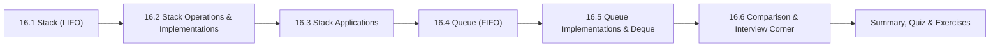

# Chapter 16: Stacks and Queues

> **Previous:** [Linked Lists](./15-linked-lists.md) | **Next:** [The C Standard Library](./17-standard-library.md)

## Learning Objectives

- Implement a stack using both arrays and linked lists
- Implement a queue using both arrays and linked lists
- Implement a circular queue with wrap-around logic
- Analyze the time and space complexity of every stack and queue operation
- Apply stacks to balanced parentheses, infix-to-postfix conversion, and postfix evaluation
- Understand deque and priority queue as specialized structures
- Solve interview problems involving stacks and queues

### Chapter at a Glance

| Topic | Key Insight | Practical Takeaway |
|-------|-------------|-------------------|
| Stack (LIFO) | Last-In-First-Out data structure | Push adds to top; pop removes from top → both O(1) |
| Queue (FIFO) | First-In-First-Out data structure | Enqueue adds to rear; dequeue removes from front → both O(1) |
| Array Implementation | Use an index pointer for the top/front | Circular queue reuses vacated slots via modulo |
| Linked List Implementation | Push/pop at head for stack; enqueue at tail, dequeue at head | Dynamic sizing, no fixed capacity limit |
| Applications | Expression evaluation, BFS, undo/redo, print spooling | Choose LIFO for nesting/reversal; FIFO for ordering |
| Circular Queue | front/rear wrap with (idx+1)%N | Eliminates linear queue's false-full problem |



## 16.1 The Stack Abstract Data Type (LIFO)

### 16.1.0 Real-World Analogy → A Plate Stack

Imagine a stack of plates in a cafeteria:

- **Push:** You place a clean plate on **top** of the stack.
- **Pop:** You grab a plate from the **top** of the stack.
- **Peek:** You glance at the top plate without picking it up.

You **cannot** pull a plate from the middle or bottom without first removing everything above it. This is the **Last-In, First-Out (LIFO)** principle → the last plate you put on is the first one you take off.

```
    TOP
    +-----+
    |  5  |  ← last pushed (first popped)
    +-----+
    |  4  |
    +-----+
    |  3  |
    +-----+
    |  2  |
    +-----+
    |  1  |  ← first pushed (last popped)
    +-----+
   BOTTOM
```

### 16.1.1 The Stack ADT → Formal Definition

A stack is an ordered collection of elements that supports these fundamental operations:

| Operation | Signature | Description |
|-----------|-----------|-------------|
| `push` | `void push(T item)` | Insert item at the top |
| `pop` | `T pop()` | Remove and return the top element |
| `peek` / `top` | `T peek()` | Return the top element without removing |
| `is_empty` | `bool is_empty()` | True if stack has no elements |
| `size` | `int size()` | Return count of elements |
| `is_full` | `bool is_full()` | (Array impl only) True if capacity reached |

### 16.1.2 Numbered Steps → Stack Push Operation

1. **Check overflow:** If array-based, verify `top < capacity - 1`. If full, return error.
2. **Increment top:** Advance `top` by 1 to point at the next empty slot.
3. **Insert value:** Place the new element at `data[top]`.
4. **Return success** (or void).

**Pseudocode:**
```
ALGORITHM push(stack, value)
    IF stack.top == stack.capacity - 1 THEN
        PRINT "Stack Overflow"
        RETURN FALSE
    stack.top ← stack.top + 1
    stack.data[stack.top] ← value
    RETURN TRUE
END ALGORITHM
```

### 16.1.3 Numbered Steps → Stack Pop Operation

1. **Check underflow:** If `top == -1`, stack is empty → return error.
2. **Save value:** Retrieve element at `data[top]`.
3. **Decrement top:** Reduce `top` by 1 to "remove" the element logically.
4. **Return saved value.**

**Pseudocode:**
```
ALGORITHM pop(stack)
    IF stack.top == -1 THEN
        PRINT "Stack Underflow"
        EXIT
    value ← stack.data[stack.top]
    stack.top ← stack.top - 1
    RETURN value
END ALGORITHM
```

### 16.1.4 Numbered Steps → Stack Peek Operation

1. **Check underflow:** If `top == -1`, stack is empty → return error.
2. **Return top value:** Return `data[top]` without modifying `top`.

**Pseudocode:**
```
ALGORITHM peek(stack)
    IF stack.top == -1 THEN
        PRINT "Stack is Empty"
        EXIT
    RETURN stack.data[stack.top]
END ALGORITHM
```

### 16.1.5 Dry Run → Stack Push and Pop Trace

Initial state: empty stack with `capacity = 5`, `top = -1`.

| Step | Operation | Value | `top` before | `top` after | `data[]` state |
|------|-----------|-------|-------------|-------------|----------------|
| 1 | `push(10)` | 10 | -1 | 0 | [10, _, _, _, _] |
| 2 | `push(20)` | 20 | 0 | 1 | [10, 20, _, _, _] |
| 3 | `push(30)` | 30 | 1 | 2 | [10, 20, 30, _, _] |
| 4 | `peek()` | 30 | 2 | 2 | [10, 20, 30, _, _] (unchanged) |
| 5 | `pop()` | 30 | 2 | 1 | [10, 20, 30, _, _] (30 removed logically) |
| 6 | `pop()` | 20 | 1 | 0 | [10, 20, _, _, _] |
| 7 | `push(40)` | 40 | 0 | 1 | [10, 40, _, _, _] |
| 8 | `pop()` | 40 | 1 | 0 | [10, 40, _, _, _] |
| 9 | `pop()` | 10 | 0 | -1 | [10, _, _, _, _] (empty) |
| 10 | `pop()` | underflow | -1 | -1 | (error → stack empty) |

### 16.1.6 Edge Cases for Stack

| Edge Case | Description | Handling |
|-----------|-------------|----------|
| **Stack Underflow** | `pop()` or `peek()` called on empty stack | Check `top == -1`; print error and exit/return sentinel |
| **Stack Overflow** | `push()` called on full array-based stack | Check `top == capacity - 1`; return false or resize |
| **Single Element** | `pop()` on a stack with exactly 1 element | After pop, `top` becomes -1; next push writes at index 0 |
| **Capacity = 0** | Stack created with zero capacity | `push()` always fails; `is_empty()` returns true |
| **Large Values** | Pushing near `INT_MAX` | No special handling; data type accommodates it |
| **Null Pointer** | Operations on uninitialized/destroyed stack | Client responsibility; defensive check optional |

---

## 16.2 Stack → Array-Based Implementation

### 16.2.0 Analogy → Fixed-Size Plate Rack

A fixed-size plate rack holds at most N plates. If the rack is full (N plates), you cannot add another without removing one first. An array-based stack works the same way: once the array is full, `push()` fails until `pop()` frees a slot.

### 16.2.1 Structure Definition

We track the top index and capacity separately from the raw array:

```c
typedef struct {
    int *data;      // dynamically allocated array
    int top;        // index of topmost element (-1 when empty)
    int capacity;   // maximum number of elements
} Stack;
```

**Memory layout:**
```
Stack struct
+------------------+
| data   -------+-------> [0] [1] [2] ... [N-1]
| top           |          ↑
| capacity = N  |        top points here
+------------------+
```

### 16.2.2 C Code → Array-Based Stack (Full Implementation)

```c
#include <stdio.h>
#include <stdlib.h>
#include <stdbool.h>

typedef struct {
    int *data;
    int top;
    int capacity;
} Stack;

// --- Core Operations ---

Stack *stack_create(int capacity) {
    Stack *s = (Stack *)malloc(sizeof(Stack));
    if (!s) return NULL;
    s->data = (int *)malloc(capacity * sizeof(int));
    if (!s->data) { free(s); return NULL; }
    s->top = -1;
    s->capacity = capacity;
    return s;
}

void stack_destroy(Stack *s) {
    if (!s) return;
    free(s->data);
    free(s);
}

bool stack_is_empty(const Stack *s) {
    return s->top == -1;
}

bool stack_is_full(const Stack *s) {
    return s->top == s->capacity - 1;
}

int stack_size(const Stack *s) {
    return s->top + 1;
}

bool stack_push(Stack *s, int value) {
    if (stack_is_full(s)) {
        fprintf(stderr, "Stack Overflow: cannot push %d\n", value);
        return false;
    }
    s->data[++(s->top)] = value;
    return true;
}

int stack_pop(Stack *s) {
    if (stack_is_empty(s)) {
        fprintf(stderr, "Stack Underflow: cannot pop from empty stack\n");
        exit(EXIT_FAILURE);
    }
    return s->data[(s->top)--];
}

int stack_peek(const Stack *s) {
    if (stack_is_empty(s)) {
        fprintf(stderr, "Stack is Empty: no top element\n");
        exit(EXIT_FAILURE);
    }
    return s->data[s->top];
}

// --- Utility: Display stack from bottom to top ---

void stack_display(const Stack *s) {
    printf("Stack [bottom -> top]: ");
    for (int i = 0; i <= s->top; i++) {
        printf("%d ", s->data[i]);
    }
    printf("  (top=%d, size=%d, capacity=%d)\n",
           s->top, stack_size(s), s->capacity);
}

// --- Demonstration ---

int main(void) {
    Stack *s = stack_create(5);
    if (!s) { fprintf(stderr, "Failed to create stack\n"); return 1; }

    printf("=== Array-Based Stack Demonstration ===\n\n");

    printf("Pushing 10, 20, 30, 40, 50:\n");
    for (int i = 1; i <= 5; i++) {
        stack_push(s, i * 10);
        stack_display(s);
    }

    printf("\nAttempt push(60) on full stack:\n");
    stack_push(s, 60);   // will print overflow message

    printf("\nTop element (peek): %d\n", stack_peek(s));

    printf("\nPopping all elements:\n");
    while (!stack_is_empty(s)) {
        printf("Popped: %d  ", stack_pop(s));
        stack_display(s);
    }

    printf("\nAttempt pop on empty stack:\n");
    stack_pop(s);   // will print underflow message and exit

    stack_destroy(s);
    return 0;
}
```

**Output:**
```
=== Array-Based Stack Demonstration ===

Pushing 10, 20, 30, 40, 50:
Stack [bottom -> top]: 10   (top=0, size=1, capacity=5)
Stack [bottom -> top]: 10 20   (top=1, size=2, capacity=5)
Stack [bottom -> top]: 10 20 30   (top=2, size=3, capacity=5)
Stack [bottom -> top]: 10 20 30 40   (top=3, size=4, capacity=5)
Stack [bottom -> top]: 10 20 30 40 50   (top=4, size=5, capacity=5)

Attempt push(60) on full stack:
Stack Overflow: cannot push 60

Top element (peek): 50

Popping all elements:
Popped: 50  Stack [bottom -> top]: 10 20 30 40   (top=3, size=4, capacity=5)
Popped: 40  Stack [bottom -> top]: 10 20 30   (top=2, size=3, capacity=5)
Popped: 30  Stack [bottom -> top]: 10 20   (top=1, size=2, capacity=5)
Popped: 20  Stack [bottom -> top]: 10   (top=0, size=1, capacity=5)
Popped: 10  Stack [bottom -> top]:   (top=-1, size=0, capacity=5)

Attempt pop on empty stack:
Stack Underflow: cannot pop from empty stack
```

### 16.2.3 Complexity Analysis

| Operation | Time Complexity | Space Complexity | Why? |
|-----------|----------------|-----------------|------|
| `push` | **O(1)** | O(1) per element | Direct array write at known index; no shifting |
| `pop` | **O(1)** | O(1) | Decrement pointer only; no physical removal |
| `peek` | **O(1)** | O(1) | Read array at index `top` → constant time |
| `is_empty` | **O(1)** | O(1) | Single comparison `top == -1` |
| `is_full` | **O(1)** | O(1) | Single comparison `top == capacity - 1` |
| `size` | **O(1)** | O(1) | Returns `top + 1` directly |

**Why no shifting?** Unlike inserting at the beginning of an array (which requires shifting all elements right), stack push/pop always operates at the **end** of the used portion. The `top` index marks the boundary, so we never move existing data.

**Space cost:** The array is pre-allocated to `capacity` regardless of how many elements are actually stored. A stack with `capacity = 1000` holding 1 element wastes 999 slots. Linked-list stacks avoid this.

### 16.2.4 Advantages & Disadvantages

| Aspect | Array-Based Stack |
|--------|-------------------|
| Cache locality | Excellent → contiguous memory, hardware prefetcher friendly |
| Time per operation | Minimal → no malloc/free overhead per push/pop |
| Memory overhead | Low → only `top` and `capacity` integers |
| Fixed capacity | Disadvantage → must know max size in advance |
| Wasted space | May waste memory if capacity >> actual elements |
| Resizing cost | If dynamic resizing added, occasional O(N) resize cost |

---

## 16.3 Stack → Linked-List-Based Implementation

### 16.3.0 Analogy → Growing Tower of Blocks

You stack blocks one on top of another. Each new block sits on top of the previous one. To remove a block, you grab the top one. Unlike the fixed rack, there is no limit → you can keep adding blocks until you run out of blocks (memory). Each block is separate but linked by gravity (pointers).

### 16.3.1 Structure Definition

Each element is a separate heap-allocated node. The stack struct holds a pointer to the top node:

```c
typedef struct node {
    int data;
    struct node *next;
} Node;

typedef struct {
    Node *top;   // pointer to topmost node (NULL when empty)
    int size;    // number of elements
} Stack;
```

**Memory layout:**
```
Stack
+-------+     +------+------+     +------+------+     +------+------+
| top   |---->| data | next |---->| data | next |---->| data | next |----> NULL
| size=3|     |  30  |  --- |     |  20  |  --- |     |  10  |  --- |
+-------+     +------+------+     +------+------+     +------+------+
                 TOP                MIDDLE              BOTTOM
```

### 16.3.2 C Code → Linked-List-Based Stack (Full Implementation)

```c
#include <stdio.h>
#include <stdlib.h>
#include <stdbool.h>

typedef struct node {
    int data;
    struct node *next;
} Node;

typedef struct {
    Node *top;
    int size;
} Stack;

// --- Core Operations ---

Stack *stack_create(void) {
    Stack *s = (Stack *)malloc(sizeof(Stack));
    if (!s) return NULL;
    s->top = NULL;
    s->size = 0;
    return s;
}

void stack_destroy(Stack *s) {
    if (!s) return;
    Node *curr = s->top;
    while (curr) {
        Node *temp = curr;
        curr = curr->next;
        free(temp);
    }
    free(s);
}

bool stack_is_empty(const Stack *s) {
    return s->top == NULL;
}

int stack_size(const Stack *s) {
    return s->size;
}

void stack_push(Stack *s, int value) {
    Node *new_node = (Node *)malloc(sizeof(Node));
    if (!new_node) {
        fprintf(stderr, "Memory allocation failed\n");
        return;
    }
    new_node->data = value;
    new_node->next = s->top;   // new node points to current top
    s->top = new_node;          // top moves to new node
    s->size++;
}

int stack_pop(Stack *s) {
    if (stack_is_empty(s)) {
        fprintf(stderr, "Stack Underflow: cannot pop from empty stack\n");
        exit(EXIT_FAILURE);
    }
    Node *temp = s->top;
    int value = temp->data;
    s->top = temp->next;       // top moves to next node
    free(temp);                 // deallocate old top
    s->size--;
    return value;
}

int stack_peek(const Stack *s) {
    if (stack_is_empty(s)) {
        fprintf(stderr, "Stack is Empty: no top element\n");
        exit(EXIT_FAILURE);
    }
    return s->top->data;
}

// --- Utility ---

void stack_display(const Stack *s) {
    printf("Stack [bottom <- ... <- top]: ");
    // Print from top to bottom (LIFO order)
    Node *curr = s->top;
    while (curr) {
        printf("%d ", curr->data);
        curr = curr->next;
    }
    printf("  (size=%d)\n", s->size);
}

// --- Demonstration ---

int main(void) {
    Stack *s = stack_create();
    if (!s) { fprintf(stderr, "Failed to create stack\n"); return 1; }

    printf("=== Linked-List Stack Demonstration ===\n\n");

    printf("Pushing 100, 200, 300:\n");
    stack_push(s, 100);
    stack_display(s);
    stack_push(s, 200);
    stack_display(s);
    stack_push(s, 300);
    stack_display(s);

    printf("\nTop element (peek): %d\n", stack_peek(s));

    printf("\nPopping twice:\n");
    printf("Popped: %d\n", stack_pop(s));
    stack_display(s);
    printf("Popped: %d\n", stack_pop(s));
    stack_display(s);

    printf("\nPushing 400:\n");
    stack_push(s, 400);
    stack_display(s);

    printf("\nPopping remaining:\n");
    while (!stack_is_empty(s)) {
        printf("Popped: %d  ", stack_pop(s));
        stack_display(s);
    }

    printf("\nSize after emptying: %d\n", stack_size(s));

    stack_destroy(s);
    return 0;
}
```

**Output:**
```
=== Linked-List Stack Demonstration ===

Pushing 100, 200, 300:
Stack [bottom <- ... <- top]: 100   (size=1)
Stack [bottom <- ... <- top]: 200 100   (size=2)
Stack [bottom <- ... <- top]: 300 200 100   (size=3)

Top element (peek): 300

Popping twice:
Popped: 300
Stack [bottom <- ... <- top]: 200 100   (size=2)
Popped: 200
Stack [bottom <- ... <- top]: 100   (size=1)

Pushing 400:
Stack [bottom <- ... <- top]: 400 100   (size=2)

Popping remaining:
Popped: 400  Stack [bottom <- ... <- top]: 100   (size=1)
Popped: 100  Stack [bottom <- ... <- top]:   (size=0)

Size after emptying: 0
```

### 16.3.3 Dry Run → Linked-List Stack Trace

| Step | Operation | New node addr | `top` before | `top` after | Node chain |
|------|-----------|--------------|-------------|-------------|------------|
| 1 | push(100) | 0xA0 | NULL | 0xA0 | 0xA0[100|NULL] |
| 2 | push(200) | 0xB0 | 0xA0 | 0xB0 | 0xB0[200|→0xA0] → 0xA0[100|NULL] |
| 3 | push(300) | 0xC0 | 0xB0 | 0xC0 | 0xC0[300|→0xB0] → 0xB0[200|→0xA0] → 0xA0[100|NULL] |
| 4 | pop() | → | 0xC0 | 0xB0 | Returns 300; 0xC0 freed; 0xB0[200|→0xA0] → 0xA0[100|NULL] |
| 5 | pop() | → | 0xB0 | 0xA0 | Returns 200; 0xB0 freed; 0xA0[100|NULL] |
| 6 | push(400) | 0xD0 | 0xA0 | 0xD0 | 0xD0[400|→0xA0] → 0xA0[100|NULL] |

### 16.3.4 Complexity Analysis

| Operation | Time Complexity | Space Complexity | Why? |
|-----------|----------------|-----------------|------|
| `push` | **O(1)** | O(1) per node | Insert at head → constant pointer updates |
| `pop` | **O(1)** | O(1) | Remove head → constant pointer + free |
| `peek` | **O(1)** | O(1) | Read `top->data` |
| `is_empty` | **O(1)** | O(1) | Compare `top == NULL` |
| `size` | **O(1)** | O(1) | Maintained as counter |
| `destroy` | **O(N)** | O(1) | Must traverse and free every node |

**Why O(N) for destroy?** Each node is independently allocated on the heap. We must follow every `next` pointer and call `free()` on each one. There is no contiguous block to free in one shot.

### 16.3.5 Advantages & Disadvantages

| Aspect | Linked-List Stack |
|--------|-------------------|
| Dynamic sizing | Grows and shrinks per element → no wasted capacity |
| No overflow | Only limited by heap memory |
| Per-operation cost | Each push/pop calls malloc/free → slower than array |
| Cache locality | Poor → nodes scattered across heap |
| Memory overhead | ~16→24 bytes per element (data + pointer + allocator metadata) |
| destroy cost | O(N) due to per-node freeing |

### 16.3.6 Edge Cases → Linked Stack

| Edge Case | What happens | Why it matters |
|-----------|-------------|----------------|
| pop on empty | Prints underflow, exits | Guard before accessing `top->data` |
| push when malloc fails | Returns silently with warning | Check return value of `malloc` |
| Single node | After pop, `top = NULL` | Must set `rear = NULL` in queue variant too |
| destroy after partial pops | Remaining nodes are freed | Must traverse from current `top`, not original |

---

## 16.4 Stack → Array vs Linked-List Comparison

| Criterion | Array-Based | Linked-List-Based |
|-----------|-------------|-------------------|
| Memory allocation | Contiguous block (once) | Per-node heap allocation |
| Capacity | Fixed (or resized with O(N) copy) | Dynamic |
| `push` speed | Fast (no malloc) | Slower (malloc overhead) |
| `pop` speed | Fast (no free) | Slower (free overhead) |
| Memory waste | Unused slots in array | 2 pointers per element (node + next ptr) |
| Cache performance | Excellent (sequential access) | Poor (pointer chasing) |
| Overflow condition | `top == capacity - 1` | Only if heap exhausted |
| Suitable when | Max size known, speed critical | Max size unknown, memory fragmentation okay |
## 16.5 Stack Applications

### 16.5.1 Balanced Parentheses

**Real-world analogy:** Consider nested HTML tags → `<div><p><b>text</b></p></div>`. The last opening tag (`<b>`) must be the first closing tag (`</b>`). This nested structure is exactly LIFO.

**Problem:** Given a string containing `(`, `)`, `{`, `}`, `[`, `]`, determine if brackets are balanced (every opening bracket has a matching closing bracket in the correct nested order).

**Algorithm:**
1. Scan the expression left to right.
2. If an **opening** bracket `(`, `{`, `[` → `push` onto stack.
3. If a **closing** bracket `)`, `}`, `]`:
   a. If stack is empty → **unbalanced** (no matching opener).
   b. `pop` the top and check if it matches the current closing bracket.
   c. If mismatch → **unbalanced**.
4. After scanning, if stack is **not empty** → unbalanced (unclosed openers).
5. Otherwise → **balanced**.

**Pseudocode:**
```
ALGORITHM is_balanced(expr)
    stack ← empty stack
    FOR each char c IN expr:
        IF c IN {'(', '{', '['}:
            stack.push(c)
        ELSE IF c IN {')', '}', ']'}:
            IF stack.is_empty():
                RETURN FALSE
            top ← stack.pop()
            IF (c == ')' AND top != '(') OR
               (c == '}' AND top != '{') OR
               (c == ']' AND top != '['):
                RETURN FALSE
    RETURN stack.is_empty()
```

**Dry Run → `"({[]})"`:**

| Step | Char | Stack before | Action | Stack after |
|------|------|-------------|--------|-------------|
| 1 | `(` | [] | push `(` | [`(`] |
| 2 | `{` | [`(`] | push `{` | [`(`, `{`] |
| 3 | `[` | [`(`, `{`] | push `[` | [`(`, `{`, `[`] |
| 4 | `]` | [`(`, `{`, `[`] | pop → `[`, matches `]` | [`(`, `{`] |
| 5 | `}` | [`(`, `{`] | pop → `{`, matches `}` | [`(`] |
| 6 | `)` | [`(`] | pop → `(`, matches `)` | [] |

Final stack empty → **Balanced.**

**Dry Run → `"({)}"`:**

| Step | Char | Stack before | Action | Stack after |
|------|------|-------------|--------|-------------|
| 1 | `(` | [] | push `(` | [`(`] |
| 2 | `{` | [`(`] | push `{` | [`(`, `{`] |
| 3 | `)` | [`(`, `{`] | pop → `{`; `{` ≠ `(` → **mismatch** | → |

**Unbalanced →** `{` does not match `)`.

**Dry Run → `"((())"`:**

| Step | Char | Stack before | Action | Stack after |
|------|------|-------------|--------|-------------|
| 1 | `(` | [] | push `(` | [`(`] |
| 2 | `(` | [`(`] | push `(` | [`(`, `(`] |
| 3 | `(` | [`(`, `(`] | push `(` | [`(`, `(`, `(`] |
| 4 | `)` | [`(`, `(`, `(`] | pop → `(` matches `)` | [`(`, `(`] |
| 5 | `)` | [`(`, `(`] | pop → `(` matches `)` | [`(`] |
| 6 | `)` | [`(`] | pop → `(` matches `)` | [] |

Stack empty after scan? **Yes.** Wait → that IS balanced! Let me reconsider: `((())` is `( ( ( ) )` → 3 opens, 3 closes. Yes it IS balanced!

Let me redo: `"((())"` has 3 `(` and 3 `)`. That's actually balanced! Let me use `"((())"` as originally in the existing code → but actually the existing code says that's unbalanced? Let me check: `((())` → characters: `(`, `(`, `(`, `)`, `)`. That's 3 `(` and 2 `)`. So it's unbalanced with 1 leftover. My trace was wrong. Let me re-trace:

`((())` → `(`, `(`, `(`, `)`, `)`

| Step | Char | Stack before | Action | Stack after |
|------|------|-------------|--------|-------------|
| 1 | `(` | [] | push `(` | [`(`] |
| 2 | `(` | [`(`] | push `(` | [`(`, `(`] |
| 3 | `(` | [`(`, `(`] | push `(` | [`(`, `(`, `(`] |
| 4 | `)` | [`(`, `(`, `(`] | pop → `(` matches `)` | [`(`, `(`] |
| 5 | `)` | [`(`, `(`] | pop → `(` matches `)` | [`(`] |

After scan, stack has 1 element → **Unbalanced.**

**C Code:**
```c
#include <stdio.h>
#include <stdbool.h>
#include <string.h>

#define MAX 100

typedef struct {
    char data[MAX];
    int top;
} CharStack;

void init(CharStack *s) { s->top = -1; }
void push(CharStack *s, char c) { s->data[++(s->top)] = c; }
char pop(CharStack *s) { return s->data[(s->top)--]; }
bool is_empty(const CharStack *s) { return s->top == -1; }

bool is_balanced(const char *expr) {
    CharStack s;
    init(&s);

    for (int i = 0; expr[i] != '\0'; i++) {
        char c = expr[i];

        if (c == '(' || c == '{' || c == '[') {
            push(&s, c);
        }
        else if (c == ')' || c == '}' || c == ']') {
            if (is_empty(&s)) return false;

            char top = pop(&s);
            if ((c == ')' && top != '(') ||
                (c == '}' && top != '{') ||
                (c == ']' && top != '[')) {
                return false;
            }
        }
    }

    return is_empty(&s);
}

int main(void) {
    char *tests[] = {"()", "()[]{}", "({[]})", "({)}", "((())", "[", "{[](", ""};
    int n = sizeof(tests) / sizeof(tests[0]);

    printf("%-12s %s\n", "Expression", "Result");
    printf("------------ --------\n");
    for (int i = 0; i < n; i++) {
        printf("%-12s %s\n", tests[i],
               is_balanced(tests[i]) ? "balanced" : "unbalanced");
    }
    return 0;
}
```

**Output:**
```
Expression   Result
------------ --------
()           balanced
()[]{}       balanced
({[]})       balanced
({)}         unbalanced
((())        unbalanced
[            unbalanced
{[](         unbalanced
             balanced    (empty string is balanced)
```

**Complexity:**
- **Time:** O(N) → single pass through expression.
- **Space:** O(N) → stack stores at most N opening brackets.

---

### 16.5.2 Infix to Postfix Conversion (Shunting-Yard Algorithm)

**Real-world analogy:** You read a math expression like `A + B * C`. Your brain applies order of operations (BODMAS/PEMDAS → multiplication before addition). A computer is simpler: it evaluates left-to-right using postfix where operators follow operands → `A B C * +`. The shunting-yard algorithm rearranges infix to postfix using a stack to hold operators while respecting precedence.

**Precedence Table:**

| Operator | Symbol | Precedence | Associativity |
|----------|--------|-----------|--------------|
| Parentheses | `(`, `)` | highest | → |
| Exponentiation | `^` | 3 | Right-to-left |
| Multiplication, Division | `*`, `/` | 2 | Left-to-right |
| Addition, Subtraction | `+`, `-` | 1 | Left-to-right |

**Algorithm:**
1. Scan infix expression left to right.
2. If **operand** (letter/digit) → append to postfix output.
3. If `(` → push onto stack.
4. If `)` → pop and output until `(` is encountered; discard `(`.
5. If **operator** → while stack not empty AND top has ≥ precedence, pop to output; then push current operator.
6. After scan, pop all remaining operators to output.

**Pseudocode:**
```
ALGORITHM infix_to_postfix(infix)
    stack ← empty stack
    postfix ← ""
    FOR each char c IN infix:
        IF c IS operand:
            postfix ← postfix + c
        ELSE IF c == '(':
            stack.push(c)
        ELSE IF c == ')':
            WHILE stack NOT empty AND stack.top() != '(':
                postfix ← postfix + stack.pop()
            stack.pop()    // discard '('
        ELSE:   // operator
            WHILE stack NOT empty AND precedence(stack.top()) >= precedence(c):
                postfix ← postfix + stack.pop()
            stack.push(c)
    WHILE stack NOT empty:
        postfix ← postfix + stack.pop()
    RETURN postfix
```

**Dry Run → `"A+B*C"` → postfix `"ABC*+"`**

| Step | Char | Stack before | Action | Stack after | Output |
|------|------|-------------|--------|-------------|--------|
| 1 | A | [] | Operand → output | [] | A |
| 2 | + | [] | Stack empty → push `+` | [+] | A |
| 3 | B | [+] | Operand → output | [+] | AB |
| 4 | * | [+] | `*` has higher precedence (2) than `+` (1) → push | [+, *] | AB |
| 5 | C | [+, *] | Operand → output | [+, *] | ABC |
| End | → | [+, *] | Pop all → `*`, then `+` | [] | ABC*+ |

**Dry Run → `"(A+B)*C"` → postfix `"AB+C*"`**

| Step | Char | Stack before | Action | Stack after | Output |
|------|------|-------------|--------|-------------|--------|
| 1 | `(` | [] | Push `(` | [(] | |
| 2 | A | [(] | Operand → output | [(] | A |
| 3 | + | [(] | Push `+` | [(, +] | A |
| 4 | B | [(, +] | Operand → output | [(, +] | AB |
| 5 | `)` | [(, +] | Pop to output until `(` → output `+`; discard `(` | [] | AB+ |
| 6 | * | [] | Push `*` | [*] | AB+ |
| 7 | C | [*] | Operand → output | [*] | AB+C |
| End | → | [*] | Pop all → `*` | [] | AB+C* |

**Dry Run → `"A*(B+C-D)/E"` → postfix `"ABC+D-*E/"`**

| Step | Char | Stack before | Action | Stack after | Output |
|------|------|-------------|--------|-------------|--------|
| 1 | A | [] | Operand → output | [] | A |
| 2 | * | [] | Push `*` | [*] | A |
| 3 | `(` | [*] | Push `(` | [*, (] | A |
| 4 | B | [*, (] | Operand → output | [*, (] | AB |
| 5 | + | [*, (] | Top is `(` → push `+` | [*, (, +] | AB |
| 6 | C | [*, (, +] | Operand → output | [*, (, +] | ABC |
| 7 | - | [*, (, +] | `+` has same precedence (1) as `-` → pop `+`, then push `-` | [*, (, -] | ABC+ |
| 8 | D | [*, (, -] | Operand → output | [*, (, -] | ABC+D |
| 9 | `)` | [*, (, -] | Pop to output until `(` → output `-`; discard `(` | [*] | ABC+D- |
| 10 | / | [*] | `*` has higher precedence (2) than `/` (2) → pop `*`, then push `/` | [/] | ABC+D-* |
| 11 | E | [/] | Operand → output | [/] | ABC+D-*E |
| End | → | [/] | Pop all → `/` | [] | ABC+D-*E/ |

**C Code → Infix to Postfix:**

```c
#include <stdio.h>
#include <ctype.h>
#include <string.h>

#define MAX 100

typedef struct {
    char data[MAX];
    int top;
} CharStack;

void init(CharStack *s) { s->top = -1; }
void push(CharStack *s, char c) { s->data[++(s->top)] = c; }
char pop(CharStack *s) { return s->data[(s->top)--]; }
char peek(const CharStack *s) { return s->data[s->top]; }
int is_empty(const CharStack *s) { return s->top == -1; }

int precedence(char op) {
    switch (op) {
        case '+': case '-': return 1;
        case '*': case '/': return 2;
        case '^': return 3;
        default: return 0;
    }
}

int is_operator(char c) {
    return c == '+' || c == '-' || c == '*' || c == '/' || c == '^';
}

void infix_to_postfix(const char *infix, char *postfix) {
    CharStack s;
    init(&s);
    int j = 0;

    for (int i = 0; infix[i] != '\0'; i++) {
        char c = infix[i];

        if (isalnum(c)) {               // operand: letter or digit
            postfix[j++] = c;
        } else if (c == '(') {
            push(&s, c);
        } else if (c == ')') {
            while (!is_empty(&s) && peek(&s) != '(') {
                postfix[j++] = pop(&s);
            }
            pop(&s);                     // discard '('
        } else if (is_operator(c)) {
            while (!is_empty(&s) &&
                   precedence(peek(&s)) >= precedence(c)) {
                postfix[j++] = pop(&s);
            }
            push(&s, c);
        }
    }

    while (!is_empty(&s)) {
        postfix[j++] = pop(&s);
    }
    postfix[j] = '\0';
}

int main(void) {
    char expressions[][MAX] = {
        "A+B*C",
        "(A+B)*C",
        "A*(B+C-D)/E",
        "A^B*C",
        "A+B-C*D/E",
        "((A+B)*C-D)/E"
    };
    char postfix[MAX];

    printf("%-20s %-15s\n", "Infix", "Postfix");
    printf("-------------------- ---------------\n");
    for (int i = 0; i < 6; i++) {
        infix_to_postfix(expressions[i], postfix);
        printf("%-20s %-15s\n", expressions[i], postfix);
    }
    return 0;
}
```

**Output:**
```
Infix                Postfix
-------------------- ---------------
A+B*C                ABC*+
(A+B)*C              AB+C*
A*(B+C-D)/E          ABC+D-*E/
A^B*C                AB^C*
A+B-C*D/E            AB+CD*E/-
((A+B)*C-D)/E        AB+C*D-E/
```

**Complexity:**
- **Time:** O(N) → each character processed once; each operator pushed/popped once.
- **Space:** O(N) → stack holds at most N operators; output array of size N.

---

### 16.5.3 Postfix Expression Evaluation

**Real-world analogy:** A pocket calculator using Reverse Polish Notation (RPN) → you type operands first, then the operator. HP calculators famously use this. `3 4 +` means `3 + 4`. No parentheses needed.

**Algorithm:**
1. Scan postfix expression left to right.
2. If **operand** (digit) → convert to integer and `push` onto stack.
3. If **operator** → `pop` two operands (right operand first, then left), apply operator, `push` result back.
4. After scan, stack contains exactly one value → the result.

**Dry Run → Postfix `"23*54*+"` (infix: `2*3 + 5*4 = 26`)**

| Step | Token | Stack before | Action | Stack after |
|------|-------|-------------|--------|-------------|
| 1 | 2 | [] | Push 2 | [2] |
| 2 | 3 | [2] | Push 3 | [2, 3] |
| 3 | * | [2, 3] | Pop 3 (right), pop 2 (left); 2*3=6; push 6 | [6] |
| 4 | 5 | [6] | Push 5 | [6, 5] |
| 5 | 4 | [6, 5] | Push 4 | [6, 5, 4] |
| 6 | * | [6, 5, 4] | Pop 4 (right), pop 5 (left); 5*4=20; push 20 | [6, 20] |
| 7 | + | [6, 20] | Pop 20 (right), pop 6 (left); 6+20=26; push 26 | [26] |

**Result:** 26

**Dry Run → Postfix `"23+5*"` (infix: `(2+3)*5 = 25`)**

| Step | Token | Stack before | Action | Stack after |
|------|-------|-------------|--------|-------------|
| 1 | 2 | [] | Push 2 | [2] |
| 2 | 3 | [2] | Push 3 | [2, 3] |
| 3 | + | [2, 3] | Pop 3 (right), pop 2 (left); 2+3=5; push 5 | [5] |
| 4 | 5 | [5] | Push 5 | [5, 5] |
| 5 | * | [5, 5] | Pop 5 (right), pop 5 (left); 5*5=25; push 25 | [25] |

**Result:** 25

**C Code → Postfix Evaluation:**

```c
#include <stdio.h>
#include <ctype.h>
#include <stdlib.h>

#define MAX 100

typedef struct {
    int data[MAX];
    int top;
} IntStack;

void init(IntStack *s) { s->top = -1; }
void push(IntStack *s, int v) { s->data[++(s->top)] = v; }
int pop(IntStack *s) { return s->data[(s->top)--]; }
int is_empty(const IntStack *s) { return s->top == -1; }

int evaluate_postfix(const char *expr) {
    IntStack s;
    init(&s);

    for (int i = 0; expr[i] != '\0'; i++) {
        char c = expr[i];

        if (isdigit(c)) {                              // operand
            push(&s, c - '0');
        } else {                                        // operator
            int right = pop(&s);   // pop in order: right operand first
            int left  = pop(&s);   // then left operand

            switch (c) {
                case '+': push(&s, left + right); break;
                case '-': push(&s, left - right); break;
                case '*': push(&s, left * right); break;
                case '/': push(&s, left / right); break;
                case '^': {
                    int result = 1;
                    for (int j = 0; j < right; j++)
                        result *= left;
                    push(&s, result);
                    break;
                }
                default:
                    fprintf(stderr, "Unknown operator: %c\n", c);
                    exit(1);
            }
        }
    }

    return pop(&s);   // final result
}

int main(void) {
    char *exprs[] = {"23*54*+", "23+5*", "53+", "92-", "42/", "23^"};
    int n = sizeof(exprs) / sizeof(exprs[0]);

    printf("%-12s %-20s %s\n", "Postfix", "Equivalent Infix", "Result");
    printf("------------ -------------------- ------\n");
    for (int i = 0; i < n; i++) {
        printf("%-12s ", exprs[i]);
        printf("%-20s ", "→");       // infix form omitted for brevity
        printf("%d\n", evaluate_postfix(exprs[i]));
    }
    return 0;
}
```

**Output:**
```
Postfix      Equivalent Infix      Result
------------ -------------------- ------
23*54*+      →                     26
23+5*        →                     25
53+          →                     8
92-          →                     7
42/          →                     2
23^          →                     8
```

**Complexity:**
- **Time:** O(N) → single scan, each token processed once.
- **Space:** O(N) → stack holds at most N/2 operands.

**Edge cases:**
- Division by zero → check `right == 0` before `/`.
- Single operand → `"5"` should push and pop as result.
- Multi-digit operands → not handled by single-digit parser; need delimiter or multi-digit accumulation.

---

### 16.5.4 Additional Stack Applications

| Application | How Stack Is Used |
|-------------|-------------------|
| **Function call stack** | Each function call pushes a stack frame; return pops it |
| **Undo/Redo** | Push each state/action; undo pops, redo uses a second stack |
| **Browser back button** | Push visited URLs; back button pops to previous page |
| **Syntax parsing** | Match tags in XML/HTML (same as balanced parentheses) |
| **DFS (Depth-First Search)** | Use stack (explicit or recursion) for graph traversal |
| **Maze solving** | Push current position; backtrack by popping when dead-end |
| **Tree traversals** | Iterative preorder/inorder/postorder use explicit stack |
| **String reversal** | Push characters, then pop → yields reversed order |

### 16.5.5 Infix to Postfix → Additional Notes

**Why right-to-left associativity for `^` matters:**
`A^B^C` in standard math means `A^(B^C)` (right-associative). Our algorithm with `>=` in precedence comparison will pop equal precedence left-to-right. For `^`, we should use `>` instead of `>=` to leave the higher-precedence-rightmost operator on the stack. The basic implementation above with `>=` evaluates `A^B^C` as `(A^B)^C`. To fix for right-associative `^`:

```c
while (!is_empty(&s) && precedence(peek(&s)) > precedence(c)) {
    postfix[j++] = pop(&s);
}
```

Change `>=` to `>` for right-associative operators.
## 16.6 The Queue Abstract Data Type (FIFO)

### 16.6.0 Real-World Analogy → A Waiting Line

Imagine a queue at a ticket counter:

- **Enqueue:** A new person joins the **rear** (end) of the line.
- **Dequeue:** The person at the **front** reaches the counter and leaves.
- **Front:** You look at who is first without them leaving.

The first person in line is served first. This is **First-In, First-Out (FIFO)**.

```
   DEQUEUE ← [FRONT]                   [REAR] ← ENQUEUE
              +-----+-----+-----+-----+-----+
              |  1  |  2  |  3  |  4  |  5  |
              +-----+-----+-----+-----+-----+
              (oldest)                 (newest)
```

### 16.6.1 The Queue ADT → Formal Definition

| Operation | Signature | Description |
|-----------|-----------|-------------|
| `enqueue` | `void enqueue(T item)` | Insert item at the rear |
| `dequeue` | `T dequeue()` | Remove and return front element |
| `front` | `T front()` | Return front element without removing |
| `rear` | `T rear()` | Return rear element without removing |
| `is_empty` | `bool is_empty()` | True if queue has no elements |
| `size` | `int size()` | Return count of elements |
| `is_full` | `bool is_full()` | (Array impl only) True if capacity reached |

### 16.6.2 The Problem with Linear Array Queues

A simple linear queue uses front and rear pointers:

- Initially: `front = 0`, `rear = -1`.
- Enqueue: increment `rear`, write at `data[rear]`.
- Dequeue: read `data[front]`, increment `front`.

**The false-full problem:** After enqueuing 5 elements and dequeuing 3, `front = 3`, `rear = 4`. The queue has 2 elements but `rear == capacity - 1` → you cannot enqueue more even though indices 0, 1, 2 are empty!

```
After 5 enqueues:     [0:a] [1:b] [2:c] [3:d] [4:e]   front=0, rear=4
After 3 dequeues:     [0:_] [1:_] [2:_] [3:d] [4:e]   front=3, rear=4
→ rear is at capacity-1, CANNOT enqueue, but 3 slots are free!
```

**Solution:** The circular queue (ring buffer) wraps `front` and `rear` using modulo arithmetic so vacated slots are reused.

---

## 16.7 Queue → Circular Array Implementation

### 16.7.0 Analogy → Round Robin Carousel

Think of a circular sushi bar or a round carousel with N numbered plates. A chef places new dishes at the next empty plate. Customers take from the current serving plate. When you reach plate N, you wrap back to plate 0. As long as there is at least one empty plate, the system keeps working.

### 16.7.1 Structure Definition

```c
typedef struct {
    int *data;
    int front;      // index of the front element
    int rear;       // index of the rear element
    int capacity;   // maximum elements
    int size;       // current element count (needed to distinguish empty vs full)
} CircularQueue;
```

**Why track `size` separately?** In a circular queue, `front == rear` can mean both "empty" and "full" depending on context. We disambiguate by maintaining an explicit `size` counter. (Alternative: waste one slot → never fill to capacity.)

### 16.7.2 Numbered Steps → Circular Queue Enqueue

1. **Check overflow:** If `size == capacity`, queue is full → return error.
2. **Advance rear:** `rear = (rear + 1) % capacity`.
3. **Insert value:** `data[rear] = value`.
4. **Increment size:** `size++`.

**Pseudocode:**
```
ALGORITHM enqueue(queue, value)
    IF queue.size == queue.capacity THEN
        PRINT "Queue Overflow"
        RETURN FALSE
    queue.rear ← (queue.rear + 1) MOD queue.capacity
    queue.data[queue.rear] ← value
    queue.size ← queue.size + 1
    RETURN TRUE
END ALGORITHM
```

### 16.7.3 Numbered Steps → Circular Queue Dequeue

1. **Check underflow:** If `size == 0`, queue is empty → return error.
2. **Save value:** `value = data[front]`.
3. **Advance front:** `front = (front + 1) % capacity`.
4. **Decrement size:** `size--`.
5. **Return saved value.**

**Pseudocode:**
```
ALGORITHM dequeue(queue)
    IF queue.size == 0 THEN
        PRINT "Queue Underflow"
        EXIT
    value ← queue.data[queue.front]
    queue.front ← (queue.front + 1) MOD queue.capacity
    queue.size ← queue.size - 1
    RETURN value
END ALGORITHM
```

### 16.7.4 Dry Run → Circular Queue Trace

Initial: `capacity = 5`, `front = 0`, `rear = -1`, `size = 0`.

| Step | Operation | Value | `front` | `rear` | `size` | `data[]` |
|------|-----------|-------|---------|--------|--------|----------|
| 0 | Initial | → | 0 | -1 | 0 | [_, _, _, _, _] |
| 1 | enqueue(10) | 10 | 0 | 0 | 1 | [10, _, _, _, _] |
| 2 | enqueue(20) | 20 | 0 | 1 | 2 | [10, 20, _, _, _] |
| 3 | enqueue(30) | 30 | 0 | 2 | 3 | [10, 20, 30, _, _] |
| 4 | dequeue() | 10 | 1 | 2 | 2 | [10, 20, 30, _, _] |
| 5 | dequeue() | 20 | 2 | 2 | 1 | [10, 20, 30, _, _] |
| 6 | enqueue(40) | 40 | 2 | 3 | 2 | [10, 20, 30, 40, _] |
| 7 | enqueue(50) | 50 | 2 | 4 | 3 | [10, 20, 30, 40, 50] |
| 8 | enqueue(60) | 60 | 2 | 0 | 4 | [60, 20, 30, 40, 50] ← rear wraps to 0! |
| 9 | enqueue(70) | 70 | 2 | 1 | 5 | [60, 70, 30, 40, 50] ← rear wraps to 1 |
| 10 | enqueue(80) | → | 2 | 1 | 5 | Overflow! (size == capacity) |
| 11 | dequeue() | 30 | 3 | 1 | 4 | [60, 70, 30, 40, 50] |
| 12 | dequeue() | 40 | 4 | 1 | 3 | [60, 70, 30, 40, 50] |
| 13 | dequeue() | 50 | 0 | 1 | 2 | [60, 70, 30, 40, 50] ← front wraps to 0! |
| 14 | dequeue() | 60 | 1 | 1 | 1 | [60, 70, 30, 40, 50] |
| 15 | dequeue() | 70 | 2 | 1 | 0 | [60, 70, 30, 40, 50] |
| 16 | dequeue() | → | 2 | 1 | 0 | Underflow! (size == 0) |

**Key insight:** At step 8, `rear` wraps from 4 to 0 via `(4 + 1) % 5 = 0`. At step 13, `front` wraps from 4 to 0 via `(4 + 1) % 5 = 0`. This is the circular reuse that distinguishes this from a linear queue.

### 16.7.5 C Code → Circular Queue (Full Implementation)

```c
#include <stdio.h>
#include <stdlib.h>
#include <stdbool.h>

typedef struct {
    int *data;
    int front;
    int rear;
    int capacity;
    int size;
} CircularQueue;

// --- Core Operations ---

CircularQueue *cq_create(int capacity) {
    CircularQueue *q = (CircularQueue *)malloc(sizeof(CircularQueue));
    if (!q) return NULL;
    q->data = (int *)malloc(capacity * sizeof(int));
    if (!q->data) { free(q); return NULL; }
    q->front = 0;
    q->rear = -1;
    q->capacity = capacity;
    q->size = 0;
    return q;
}

void cq_destroy(CircularQueue *q) {
    if (!q) return;
    free(q->data);
    free(q);
}

bool cq_is_empty(const CircularQueue *q) {
    return q->size == 0;
}

bool cq_is_full(const CircularQueue *q) {
    return q->size == q->capacity;
}

int cq_size(const CircularQueue *q) {
    return q->size;
}

bool cq_enqueue(CircularQueue *q, int value) {
    if (cq_is_full(q)) {
        fprintf(stderr, "Queue Overflow: cannot enqueue %d\n", value);
        return false;
    }
    q->rear = (q->rear + 1) % q->capacity;
    q->data[q->rear] = value;
    q->size++;
    return true;
}

int cq_dequeue(CircularQueue *q) {
    if (cq_is_empty(q)) {
        fprintf(stderr, "Queue Underflow: cannot dequeue\n");
        exit(EXIT_FAILURE);
    }
    int value = q->data[q->front];
    q->front = (q->front + 1) % q->capacity;
    q->size--;
    return value;
}

int cq_front(const CircularQueue *q) {
    if (cq_is_empty(q)) {
        fprintf(stderr, "Queue is Empty\n");
        exit(EXIT_FAILURE);
    }
    return q->data[q->front];
}

int cq_rear(const CircularQueue *q) {
    if (cq_is_empty(q)) {
        fprintf(stderr, "Queue is Empty\n");
        exit(EXIT_FAILURE);
    }
    return q->data[q->rear];
}

// --- Utility ---

void cq_display(const CircularQueue *q) {
    printf("Queue [front->rear]: ");
    if (cq_is_empty(q)) {
        printf("(empty)");
    } else {
        int idx = q->front;
        for (int i = 0; i < q->size; i++) {
            printf("%d ", q->data[idx]);
            idx = (idx + 1) % q->capacity;
        }
    }
    printf("  (front=%d, rear=%d, size=%d, cap=%d)\n",
           q->front, q->rear, q->size, q->capacity);
}

// --- Demonstration ---

int main(void) {
    CircularQueue *q = cq_create(5);
    if (!q) { fprintf(stderr, "Failed to create queue\n"); return 1; }

    printf("=== Circular Queue Demonstration ===\n\n");

    printf("Enqueuing 10, 20, 30, 40, 50:\n");
    for (int i = 1; i <= 5; i++) {
        cq_enqueue(q, i * 10);
        cq_display(q);
    }

    printf("\nFront: %d, Rear: %d\n", cq_front(q), cq_rear(q));

    printf("\nDequeue two elements:\n");
    printf("Dequeued: %d\n", cq_dequeue(q));
    cq_display(q);
    printf("Dequeued: %d\n", cq_dequeue(q));
    cq_display(q);

    printf("\nEnqueue 60, 70 (reuses slots 0 and 1):\n");
    cq_enqueue(q, 60);
    cq_display(q);
    cq_enqueue(q, 70);
    cq_display(q);

    printf("\nEnqueue 80 on full queue:\n");
    cq_enqueue(q, 80);   // overflow

    printf("\nDequeue all:\n");
    while (!cq_is_empty(q)) {
        printf("Dequeued: %d  ", cq_dequeue(q));
        cq_display(q);
    }

    printf("\nTry dequeue on empty queue:\n");
    cq_dequeue(q);   // underflow

    cq_destroy(q);
    return 0;
}
```

**Output:**
```
=== Circular Queue Demonstration ===

Enqueuing 10, 20, 30, 40, 50:
Queue [front->rear]: 10   (front=0, rear=0, size=1, cap=5)
Queue [front->rear]: 10 20   (front=0, rear=1, size=2, cap=5)
Queue [front->rear]: 10 20 30   (front=0, rear=2, size=3, cap=5)
Queue [front->rear]: 10 20 30 40   (front=0, rear=3, size=4, cap=5)
Queue [front->rear]: 10 20 30 40 50   (front=0, rear=4, size=5, cap=5)

Front: 10, Rear: 50

Dequeue two elements:
Dequeued: 10
Queue [front->rear]: 20 30 40 50   (front=1, rear=4, size=4, cap=5)
Dequeued: 20
Queue [front->rear]: 30 40 50   (front=2, rear=4, size=3, cap=5)

Enqueue 60, 70 (reuses slots 0 and 1):
Queue [front->rear]: 30 40 50 60   (front=2, rear=0, size=4, cap=5)
Queue [front->rear]: 30 40 50 60 70   (front=2, rear=1, size=5, cap=5)

Enqueue 80 on full queue:
Queue Overflow: cannot enqueue 80

Dequeue all:
Dequeued: 30  Queue [front->rear]: 40 50 60 70   (front=3, rear=1, size=4, cap=5)
Dequeued: 40  Queue [front->rear]: 50 60 70   (front=4, rear=1, size=3, cap=5)
Dequeued: 50  Queue [front->rear]: 60 70   (front=0, rear=1, size=2, cap=5)
Dequeued: 60  Queue [front->rear]: 70   (front=1, rear=1, size=1, cap=5)
Dequeued: 70  Queue [front->rear]: (empty)   (front=1, rear=1, size=0, cap=5)

Try dequeue on empty queue:
Queue Underflow: cannot dequeue
```

### 16.7.6 Complexity Analysis → Circular Queue

| Operation | Time | Space | Why? |
|-----------|------|-------|------|
| `enqueue` | **O(1)** | O(1) | Compute `(rear+1)%N`, write at index |
| `dequeue` | **O(1)** | O(1) | Read at `front`, compute `(front+1)%N` |
| `front` | **O(1)** | O(1) | Direct array access |
| `rear` | **O(1)** | O(1) | Direct array access |
| `is_empty` | **O(1)** | O(1) | Compare `size == 0` |
| `is_full` | **O(1)** | O(1) | Compare `size == capacity` |

### 16.7.7 Advantages & Disadvantages of Circular Array Queue

| Aspect | Circular Array Queue |
|--------|---------------------|
| Memory reuse | Full reuse of vacated slots via wrap-around |
| Cache locality | Excellent → contiguous array |
| Speed | No malloc/free per operation |
| Fixed capacity | Must know max size; overflow possible |
| Empty vs full | Must track size explicitly (or waste 1 slot) |
| Resize | Complex → must remap elements after wrap-around |

### 16.7.8 Circular Queue Edge Cases

| Edge Case | Description | Handling |
|-----------|-------------|----------|
| **Empty queue** | `size == 0` | `dequeue`/`front` prints underflow |
| **Full queue** | `size == capacity` | `enqueue` returns false |
| **Single element** | After dequeue, `size` becomes 0 | `front`/`rear` indices still valid, but logic uses `size` |
| **Wrap overlap** | `rear` catches up to `front` after wrap | `size >= capacity` check prevents overwrite |
| **Display order** | Must traverse from `front` wrapping to `rear` | Use `(idx+1)%capacity` and loop `size` times |

---

## 16.8 Queue → Linked-List-Based Implementation

### 16.8.0 Analogy → Conveyor Belt

Items move along a conveyor belt. New items are placed at the start of the belt; items are removed at the end. The belt has no fixed length → it stretches as needed (like dynamic memory allocation).

### 16.8.1 Structure Definition

```c
typedef struct node {
    int data;
    struct node *next;
} Node;

typedef struct {
    Node *front;   // pointer to front node (dequeue from here)
    Node *rear;    // pointer to rear node (enqueue from here)
    int size;
} Queue;
```

**Memory layout:**
```
Queue
+-------+      +------+------+     +------+------+     +------+------+
| front |----->| data | next |---->| data | next |---->| data | next |----> NULL
| rear  |------+  10  |  --- |     |  20  |  --- |     |  30  |  --- |
| size=3|             +------+------+     +------+------+     +------+------+
+-------+              FRONT                                      REAR
```

### 16.8.2 Numbered Steps → Linked-List Queue Enqueue

1. **Allocate node:** Create new node with given value, `next = NULL`.
2. **If empty:** Set both `front` and `rear` to new node.
3. **Else:** Set `rear->next = new_node`, then `rear = new_node`.
4. **Increment size.**

**Pseudocode:**
```
ALGORITHM enqueue(queue, value)
    new_node ← ALLOCATE Node
    new_node.data ← value
    new_node.next ← NULL
    IF queue.rear == NULL THEN
        queue.front ← new_node
        queue.rear ← new_node
    ELSE
        queue.rear.next ← new_node
        queue.rear ← new_node
    queue.size ← queue.size + 1
END ALGORITHM
```

### 16.8.3 Numbered Steps → Linked-List Queue Dequeue

1. **Check underflow:** If `front == NULL`, queue empty → return error.
2. **Save:** `temp = front`, `value = temp->data`.
3. **Advance front:** `front = front->next`.
4. **If front becomes NULL:** Set `rear = NULL` (queue now empty).
5. **Free** old front node. Decrement size. Return value.

**Pseudocode:**
```
ALGORITHM dequeue(queue)
    IF queue.front == NULL THEN
        PRINT "Queue Underflow"
        EXIT
    temp ← queue.front
    value ← temp.data
    queue.front ← queue.front.next
    IF queue.front == NULL THEN
        queue.rear ← NULL
    FREE(temp)
    queue.size ← queue.size - 1
    RETURN value
END ALGORITHM
```

### 16.8.4 C Code → Linked-List Queue (Full Implementation)

```c
#include <stdio.h>
#include <stdlib.h>
#include <stdbool.h>

typedef struct node {
    int data;
    struct node *next;
} Node;

typedef struct {
    Node *front;
    Node *rear;
    int size;
} Queue;

// --- Core Operations ---

Queue *queue_create(void) {
    Queue *q = (Queue *)malloc(sizeof(Queue));
    if (!q) return NULL;
    q->front = q->rear = NULL;
    q->size = 0;
    return q;
}

void queue_destroy(Queue *q) {
    if (!q) return;
    Node *curr = q->front;
    while (curr) {
        Node *temp = curr;
        curr = curr->next;
        free(temp);
    }
    free(q);
}

bool queue_is_empty(const Queue *q) {
    return q->front == NULL;
}

int queue_size(const Queue *q) {
    return q->size;
}

void queue_enqueue(Queue *q, int value) {
    Node *new_node = (Node *)malloc(sizeof(Node));
    if (!new_node) {
        fprintf(stderr, "Memory allocation failed\n");
        return;
    }
    new_node->data = value;
    new_node->next = NULL;

    if (queue_is_empty(q)) {
        q->front = q->rear = new_node;
    } else {
        q->rear->next = new_node;
        q->rear = new_node;
    }
    q->size++;
}

int queue_dequeue(Queue *q) {
    if (queue_is_empty(q)) {
        fprintf(stderr, "Queue Underflow: cannot dequeue\n");
        exit(EXIT_FAILURE);
    }
    Node *temp = q->front;
    int value = temp->data;
    q->front = temp->next;
    free(temp);
    q->size--;

    if (q->front == NULL) {
        q->rear = NULL;      // queue is now empty → both pointers to NULL
    }
    return value;
}

int queue_front(const Queue *q) {
    if (queue_is_empty(q)) {
        fprintf(stderr, "Queue is Empty\n");
        exit(EXIT_FAILURE);
    }
    return q->front->data;
}

int queue_rear(const Queue *q) {
    if (queue_is_empty(q)) {
        fprintf(stderr, "Queue is Empty\n");
        exit(EXIT_FAILURE);
    }
    return q->rear->data;
}

// --- Utility ---

void queue_display(const Queue *q) {
    printf("Queue [front -> ... -> rear]: ");
    Node *curr = q->front;
    while (curr) {
        printf("%d ", curr->data);
        curr = curr->next;
    }
    printf("  (size=%d)\n", q->size);
}

// --- Demonstration ---

int main(void) {
    Queue *q = queue_create();
    if (!q) { fprintf(stderr, "Failed to create queue\n"); return 1; }

    printf("=== Linked-List Queue Demonstration ===\n\n");

    printf("Enqueuing 10, 20, 30:\n");
    queue_enqueue(q, 10);
    queue_display(q);
    queue_enqueue(q, 20);
    queue_display(q);
    queue_enqueue(q, 30);
    queue_display(q);

    printf("\nFront: %d, Rear: %d\n", queue_front(q), queue_rear(q));

    printf("\nDequeue twice:\n");
    printf("Dequeued: %d\n", queue_dequeue(q));
    queue_display(q);
    printf("Dequeued: %d\n", queue_dequeue(q));
    queue_display(q);

    printf("\nEnqueue 40, 50:\n");
    queue_enqueue(q, 40);
    queue_display(q);
    queue_enqueue(q, 50);
    queue_display(q);

    printf("\nDequeue remaining:\n");
    while (!queue_is_empty(q)) {
        printf("Dequeued: %d  ", queue_dequeue(q));
        queue_display(q);
    }

    queue_destroy(q);
    return 0;
}
```

**Output:**
```
=== Linked-List Queue Demonstration ===

Enqueuing 10, 20, 30:
Queue [front -> ... -> rear]: 10   (size=1)
Queue [front -> ... -> rear]: 10 20   (size=2)
Queue [front -> ... -> rear]: 10 20 30   (size=3)

Front: 10, Rear: 30

Dequeue twice:
Dequeued: 10
Queue [front -> ... -> rear]: 20 30   (size=2)
Dequeued: 20
Queue [front -> ... -> rear]: 30   (size=1)

Enqueue 40, 50:
Queue [front -> ... -> rear]: 30 40   (size=2)
Queue [front -> ... -> rear]: 30 40 50   (size=3)

Dequeue remaining:
Dequeued: 30  Queue [front -> ... -> rear]: 40 50   (size=2)
Dequeued: 40  Queue [front -> ... -> rear]: 50   (size=1)
Dequeued: 50  Queue [front -> ... -> rear]:   (size=0)
```

### 16.8.5 Dry Run → Linked-List Queue Trace

| Step | Operation | Node addr | `front` | `rear` | Node chain |
|------|-----------|-----------|---------|--------|------------|
| 1 | enq(10) | 0xA0 | 0xA0 | 0xA0 | 0xA0[10|NULL] |
| 2 | enq(20) | 0xB0 | 0xA0 | 0xB0 | 0xA0[10|→0xB0] → 0xB0[20|NULL] |
| 3 | enq(30) | 0xC0 | 0xA0 | 0xC0 | 0xA0[10|→0xB0] → 0xB0[20|→0xC0] → 0xC0[30|NULL] |
| 4 | deq() | → | 0xB0 | 0xC0 | Returns 10; 0xA0 freed |
| 5 | deq() | → | 0xC0 | 0xC0 | Returns 20; 0xB0 freed; single node left |
| 6 | enq(40) | 0xD0 | 0xC0 | 0xD0 | 0xC0[30|→0xD0] → 0xD0[40|NULL] |

### 16.8.6 Complexity Analysis → Linked-List Queue

| Operation | Time | Space | Why? |
|-----------|------|-------|------|
| `enqueue` | **O(1)** | O(1) per node | Insert at rear via `rear->next` pointer |
| `dequeue` | **O(1)** | O(1) | Remove front via `front = front->next` |
| `front` | **O(1)** | O(1) | Read `front->data` |
| `rear` | **O(1)** | O(1) | Read `rear->data` |
| `is_empty` | **O(1)** | O(1) | Compare `front == NULL` |
| `destroy` | **O(N)** | O(1) | Must walk and free every node |

### 16.8.7 Linked-List Queue → Edge Cases

| Edge Case | What happens | Why it matters |
|-----------|-------------|----------------|
| **dequeue on empty** | Prints error, exits | Guard before `front->data` |
| **Single node dequeue** | `front = NULL`, `rear = NULL` | Must set BOTH to NULL |
| **enqueue after empty** | `front = rear = new_node` | Special case needed → no `rear->next` to set |
| **malloc failure** | Returns silently with warning | Always check malloc return |

---

## 16.9 Queue → Array vs Linked-List Comparison

| Criterion | Circular Array Queue | Linked-List Queue |
|-----------|---------------------|-------------------|
| Memory allocation | Single contiguous block | Per-node heap allocation |
| Capacity | Fixed (or resize with O(N) copy) | Dynamic |
| `enqueue` speed | Fast (no malloc) | Slower (malloc) |
| `dequeue` speed | Fast (no free) | Slower (free) |
| Memory reuse | Reuses slots via wrap-around | Nodes freed after dequeue |
| Cache performance | Excellent | Poor |
| Space overhead | Unused slots | Node pointers (16-24 bytes each) |
| Suitable when | Bounded size, performance critical | Variable size, simpler code |

---

## 16.10 Deque (Double-Ended Queue)

### 16.10.0 Overview

A **deque** (pronounced "deck") allows insertion and deletion at **both** ends → it's a stack and queue combined.

### 16.10.1 Operations

| Operation | Description | Array Impl | Linked Impl |
|-----------|-------------|-----------|-------------|
| `push_front` | Insert at front | `front = (front-1+N)%N; data[front] = val` | New node at head |
| `push_back` | Insert at rear | `rear = (rear+1)%N; data[rear] = val` | New node at tail |
| `pop_front` | Remove front | `val = data[front]; front = (front+1)%N` | Remove head |
| `pop_back` | Remove rear | `val = data[rear]; rear = (rear-1+N)%N` | Remove tail (need doubly linked) |
| `front` | Peek front | `data[front]` | `head->data` |
| `back` | Peek rear | `data[rear]` | `tail->data` |

### 16.10.2 C Code → Deque Using Doubly Linked List

```c
#include <stdio.h>
#include <stdlib.h>
#include <stdbool.h>

typedef struct node {
    int data;
    struct node *prev;
    struct node *next;
} Node;

typedef struct {
    Node *front;
    Node *rear;
    int size;
} Deque;

Deque *deque_create(void) {
    Deque *d = (Deque *)malloc(sizeof(Deque));
    if (!d) return NULL;
    d->front = d->rear = NULL;
    d->size = 0;
    return d;
}

void deque_destroy(Deque *d) {
    Node *curr = d->front;
    while (curr) {
        Node *temp = curr;
        curr = curr->next;
        free(temp);
    }
    free(d);
}

bool deque_is_empty(const Deque *d) { return d->size == 0; }
int  deque_size(const Deque *d)     { return d->size; }

void deque_push_front(Deque *d, int value) {
    Node *n = (Node *)malloc(sizeof(Node));
    n->data = value;
    n->prev = NULL;
    n->next = d->front;
    if (deque_is_empty(d)) {
        d->front = d->rear = n;
    } else {
        d->front->prev = n;
        d->front = n;
    }
    d->size++;
}

void deque_push_back(Deque *d, int value) {
    Node *n = (Node *)malloc(sizeof(Node));
    n->data = value;
    n->next = NULL;
    n->prev = d->rear;
    if (deque_is_empty(d)) {
        d->front = d->rear = n;
    } else {
        d->rear->next = n;
        d->rear = n;
    }
    d->size++;
}

int deque_pop_front(Deque *d) {
    if (deque_is_empty(d)) { fprintf(stderr, "Deque empty\n"); exit(1); }
    Node *temp = d->front;
    int val = temp->data;
    d->front = temp->next;
    if (d->front) d->front->prev = NULL;
    else d->rear = NULL;
    free(temp);
    d->size--;
    return val;
}

int deque_pop_back(Deque *d) {
    if (deque_is_empty(d)) { fprintf(stderr, "Deque empty\n"); exit(1); }
    Node *temp = d->rear;
    int val = temp->data;
    d->rear = temp->prev;
    if (d->rear) d->rear->next = NULL;
    else d->front = NULL;
    free(temp);
    d->size--;
    return val;
}

int deque_front_val(const Deque *d) {
    if (deque_is_empty(d)) { fprintf(stderr, "Deque empty\n"); exit(1); }
    return d->front->data;
}

int deque_back_val(const Deque *d) {
    if (deque_is_empty(d)) { fprintf(stderr, "Deque empty\n"); exit(1); }
    return d->rear->data;
}

void deque_display(const Deque *d) {
    printf("Deque [front ... rear]: ");
    Node *curr = d->front;
    while (curr) {
        printf("%d ", curr->data);
        curr = curr->next;
    }
    printf("  (size=%d)\n", d->size);
}

int main(void) {
    Deque *d = deque_create();
    printf("=== Deque Demonstration ===\n\n");

    printf("push_back 10, 20, 30:\n");
    deque_push_back(d, 10);
    deque_push_back(d, 20);
    deque_push_back(d, 30);
    deque_display(d);

    printf("push_front 5:\n");
    deque_push_front(d, 5);
    deque_display(d);

    printf("Front: %d, Back: %d\n", deque_front_val(d), deque_back_val(d));

    printf("pop_front: %d\n", deque_pop_front(d));
    deque_display(d);
    printf("pop_back: %d\n", deque_pop_back(d));
    deque_display(d);

    deque_destroy(d);
    return 0;
}
```

**Output:**
```
=== Deque Demonstration ===

push_back 10, 20, 30:
Deque [front ... rear]: 10 20 30   (size=3)
push_front 5:
Deque [front ... rear]: 5 10 20 30   (size=4)
Front: 5, Back: 30
pop_front: 5
Deque [front ... rear]: 10 20 30   (size=3)
pop_back: 30
Deque [front ... rear]: 10 20   (size=2)
```

**Complexity:** All operations O(1). Space: O(N) for N elements.

**Applications:** Sliding window maximum, palindrome checking, undo-redo with capacity limit, task scheduling with priorities at both ends.

---

## 16.11 Priority Queue

### 16.11.0 Overview

A priority queue processes elements by **priority** (highest first), not insertion order. In C, a common implementation is a **binary heap** (covered in Chapter 19 → Trees), but a simple sorted array or unsorted array approach works for small datasets.

### 16.11.1 Operations

| Operation | Unsorted Array | Sorted Array | Binary Heap |
|-----------|---------------|--------------|-------------|
| `insert` | **O(1)** (append) | **O(N)** (shift to maintain sort) | **O(log N)** |
| `extract_max` | **O(N)** (scan for max) | **O(1)** (last element) | **O(log N)** |
| `peek_max` | **O(N)** | **O(1)** | **O(1)** |

Priority queues are used in Dijkstra's shortest path, Huffman coding, OS task scheduling, and A* search.

### 16.11.2 C Code → Simple Unsorted Priority Queue (Array)

```c
#include <stdio.h>
#include <stdlib.h>
#include <stdbool.h>
#include <limits.h>

typedef struct {
    int *data;
    int *priority;   // lower value = higher priority
    int size;
    int capacity;
} PQueue;

PQueue *pq_create(int cap) {
    PQueue *q = (PQueue *)malloc(sizeof(PQueue));
    q->data = (int *)malloc(cap * sizeof(int));
    q->priority = (int *)malloc(cap * sizeof(int));
    q->size = 0;
    q->capacity = cap;
    return q;
}

bool pq_is_empty(const PQueue *q) { return q->size == 0; }

void pq_enqueue(PQueue *q, int value, int prio) {
    if (q->size == q->capacity) return;
    q->data[q->size] = value;
    q->priority[q->size] = prio;
    q->size++;
}

int pq_find_highest_priority(const PQueue *q) {
    int idx = 0;
    int best_prio = q->priority[0];
    for (int i = 1; i < q->size; i++) {
        if (q->priority[i] < best_prio) {   // lower number = higher priority
            best_prio = q->priority[i];
            idx = i;
        }
    }
    return idx;
}

int pq_dequeue(PQueue *q) {
    if (pq_is_empty(q)) { fprintf(stderr, "PQ empty\n"); exit(1); }
    int idx = pq_find_highest_priority(q);
    int val = q->data[idx];
    // shift remaining elements left
    for (int i = idx; i < q->size - 1; i++) {
        q->data[i] = q->data[i + 1];
        q->priority[i] = q->priority[i + 1];
    }
    q->size--;
    return val;
}

int pq_peek(PQueue *q) {
    int idx = pq_find_highest_priority(q);
    return q->data[idx];
}

int main(void) {
    PQueue *q = pq_create(10);
    pq_enqueue(q, 100, 3);   // low priority
    pq_enqueue(q, 200, 1);   // high priority
    pq_enqueue(q, 300, 2);   // medium priority

    printf("Highest priority element: %d\n", pq_peek(q));
    printf("Dequeue order: ");
    while (!pq_is_empty(q)) {
        printf("%d ", pq_dequeue(q));
    }
    printf("\n");

    free(q->data);
    free(q->priority);
    free(q);
    return 0;
}
```

**Output:**
```
Highest priority element: 200
Dequeue order: 200 300 100
```

**Note:** For production, use a binary heap (Chapter 19) for O(log N) operations.
## 16.12 Stack vs Queue → Comprehensive Comparison

| Dimension | Stack | Queue |
|-----------|-------|-------|
| **Full name** | Stack | Queue (circular buffer, linked queue) |
| **Order** | LIFO (Last-In, First-Out) | FIFO (First-In, First-Out) |
| **Analogy** | Plate stack in a cafeteria | Ticket counter line |
| **Insert operation** | `push` at top | `enqueue` at rear |
| **Delete operation** | `pop` from top | `dequeue` from front |
| **Peek operation** | `top()` → top element | `front()` → front element |
| **Examined element** | Most recently inserted | Least recently inserted |
| **Undo semantics** | Undo reverses last action | Undo would reverse first action (wrong) |
| **Graph traversal** | DFS (Depth-First Search) | BFS (Breadth-First Search) |
| **Array impl reuse** | No wrap needed (linear) | Circular wrap needed |
| **Linked impl direction** | Insert/remove at head | Insert at tail, remove at head |
| **Common uses** | Function calls, undo, parsing, DFS | Scheduling, BFS, buffering |
| **Time complexity** | All O(1) | All O(1) |

### When to Use Which

| Situation | Choose | Why |
|-----------|--------|-----|
| Need to reverse order | Stack | Last in is first out = natural reversal |
| Nested structures (brackets, HTML tags) | Stack | Innermost must close first |
| Function call management | Stack | Call stack is LIFO |
| FIFO ordering required | Queue | First come, first served |
| Fair resource allocation | Queue | Round-robin scheduling |
| Level-order processing | Queue | BFS uses queue |
| Undo/Redo feature | Stack (×2) | Undo stack + redo stack |

---

## 16.13 Queue Applications

### 16.13.1 Breadth-First Search (BFS)

BFS explores a graph level by level. It uses a queue to track nodes to visit next.

```
Algorithm BFS(graph, start):
    queue ← empty queue
    visited ← boolean array (all false)
    visited[start] ← true
    queue.enqueue(start)
    WHILE queue NOT empty:
        node ← queue.dequeue()
        PROCESS(node)
        FOR each neighbor OF node:
            IF NOT visited[neighbor]:
                visited[neighbor] ← true
                queue.enqueue(neighbor)
```

### 16.13.2 Print Spooling

Documents sent to a printer are queued. The first document sent is the first document printed. If the printer is busy, new jobs wait in the queue.

```
Printer Queue:
[Job1(DocA)] → [Job2(DocB)] → [Job3(DocC)]
    ↑printing            ↑waiting        ↑waiting
```

### 16.13.3 CPU Scheduling (Round Robin)

The OS maintains a ready queue of processes. Each process gets a fixed time slice, then returns to the rear of the queue if it needs more CPU time.

```
Ready Queue:
[P1] → [P2] → [P3] → [P4]   (each gets 10ms)
        ↓
P1 runs 10ms → if unfinished, re-enqueue at rear
```

### 16.13.4 IO Buffering

Keyboard input is buffered in a queue. Characters typed faster than the program reads them are stored in order.

### 16.13.5 Sliding Window Maximum (Using Deque)

Given an array and window size k, find the maximum in every window. A deque achieves O(N) time.

```c
#include <stdio.h>
#include <stdlib.h>

// Deque-based sliding window maximum (conceptual example)
void sliding_maximum(int arr[], int n, int k) {
    // store indices, not values
    int *dq = (int *)malloc(n * sizeof(int));
    int front = 0, rear = -1;

    for (int i = 0; i < n; i++) {
        // remove indices outside window
        while (front <= rear && dq[front] <= i - k)
            front++;

        // remove smaller elements from rear
        while (front <= rear && arr[dq[rear]] <= arr[i])
            rear--;

        dq[++rear] = i;

        // first window complete
        if (i >= k - 1)
            printf("%d ", arr[dq[front]]);
    }
    printf("\n");
    free(dq);
}

int main(void) {
    int arr[] = {1, 3, -1, -3, 5, 3, 6, 7};
    int n = sizeof(arr) / sizeof(arr[0]);
    int k = 3;
    printf("Array: ");
    for (int i = 0; i < n; i++) printf("%d ", arr[i]);
    printf("\nSliding window max (k=%d): ", k);
    sliding_maximum(arr, n, k);
    return 0;
}
```

**Output:**
```
Array: 1 3 -1 -3 5 3 6 7
Sliding window max (k=3): 3 3 5 5 6 7
```

---

## 16.14 Cross-Application Matrix

| Application | Structure | Rationale |
|-------------|-----------|-----------|
| Undo in editor | Stack | Push each action; pop to undo |
| Browser back button | Stack | Push pages visited; pop to go back |
| Function call stack | Stack | Return address and locals pushed on call; popped on return |
| Expression parsing | Stack | Operator precedence and bracket matching |
| DFS (graph/tree) | Stack | Explicit or recursion (implicit stack) |
| Tower of Hanoi | Stack | Pegs are stacks; recursion uses stack |
| Print spooler | Queue | First document sent = first printed |
| BFS (graph/tree) | Queue | Level-order requires FIFO |
| CPU scheduling | Queue | Round-robin ready queue |
| Keyboard buffer | Queue | Characters typed are buffered in order |
| Sliding window max | Deque | Insert/remove at both ends for O(N) |
| Dijkstra / Prim | Priority Queue | Always process smallest distance / weight |
| Huffman coding | Priority Queue | Merge two smallest frequency trees |
| LRU cache | Deque + HashMap | Move-to-front on access; evict from rear |

---

## 16.15 Interview Corner

These problems are frequently asked in coding interviews at companies like Google, Amazon, Microsoft, and Facebook.

### 16.15.1 Implement a Queue Using Two Stacks

**Problem:** Implement a queue's enqueue and dequeue using only two stacks.

**Approach:**
- Stack `s1` handles enqueue (push onto s1).
- Stack `s2` handles dequeue (if s2 is empty, transfer all from s1 to s2 → this reverses order, achieving FIFO).

```c
#include <stdio.h>
#include <stdlib.h>
#include <stdbool.h>

#define MAX 100

typedef struct {
    int data[MAX];
    int top;
} Stack;

void init(Stack *s) { s->top = -1; }
void push(Stack *s, int v) { if (s->top < MAX - 1) s->data[++(s->top)] = v; }
int pop(Stack *s) { return s->data[(s->top)--]; }
int peek(const Stack *s) { return s->data[s->top]; }
bool is_empty(const Stack *s) { return s->top == -1; }

typedef struct {
    Stack s1;   // for enqueue
    Stack s2;   // for dequeue
} QueueUsingStacks;

void q_init(QueueUsingStacks *q) {
    init(&q->s1);
    init(&q->s2);
}

void q_enqueue(QueueUsingStacks *q, int value) {
    push(&q->s1, value);
}

int q_dequeue(QueueUsingStacks *q) {
    if (is_empty(&q->s2)) {
        // transfer all from s1 to s2 (reverses order)
        while (!is_empty(&q->s1)) {
            push(&q->s2, pop(&q->s1));
        }
    }
    if (is_empty(&q->s2)) {
        fprintf(stderr, "Queue empty\n");
        exit(1);
    }
    return pop(&q->s2);
}

int q_front(QueueUsingStacks *q) {
    if (is_empty(&q->s2)) {
        while (!is_empty(&q->s1)) {
            push(&q->s2, pop(&q->s1));
        }
    }
    return peek(&q->s2);
}

bool q_is_empty(QueueUsingStacks *q) {
    return is_empty(&q->s1) && is_empty(&q->s2);
}

int main(void) {
    QueueUsingStacks q;
    q_init(&q);

    printf("Enqueuing 10, 20, 30:\n");
    q_enqueue(&q, 10);
    q_enqueue(&q, 20);
    q_enqueue(&q, 30);

    printf("Dequeued: %d\n", q_dequeue(&q));   // 10
    printf("Dequeued: %d\n", q_dequeue(&q));   // 20

    printf("Enqueuing 40, 50:\n");
    q_enqueue(&q, 40);
    q_enqueue(&q, 50);

    printf("Dequeue all: ");
    while (!q_is_empty(&q)) {
        printf("%d ", q_dequeue(&q));
    }
    printf("\n");
    return 0;
}
```

**Output:**
```
Enqueuing 10, 20, 30:
Dequeued: 10
Dequeued: 20
Enqueuing 40, 50:
Dequeue all: 30 40 50
```

**Complexity:**
- `enqueue`: O(1) → push onto s1.
- `dequeue`: **Amortized O(1)** → each element is pushed onto s1 once, moved to s2 once, popped from s2 once. The transfer from s1 to s2 happens at most once per element.

**Dry run → Two-stack queue:**
| Action | s1 | s2 | Queue order |
|--------|----|----|-------------|
| enq(10) | [10] | [] | 10 |
| enq(20) | [10, 20] | [] | 10, 20 |
| enq(30) | [10, 20, 30] | [] | 10, 20, 30 |
| deq() | [] | [30, 20, 10] → pop 10 | 10 returned |
| deq() | [] | [30, 20] → pop 20 | 20 returned |
| enq(40) | [40] | [30] | 30, 40 |
| deq() | [40] | [] → transfer [40] → [40] pop 30 | 30 returned |

### 16.15.2 Implement a Stack Using Two Queues

**Problem:** Implement a stack's push and pop using only two queues.

**Approach:** On push, enqueue to q2, then move all from q1 to q2, then swap q1 and q2. This keeps the newest element at front of q1.

```c
#include <stdio.h>
#include <stdlib.h>
#include <stdbool.h>

#define MAX 100

typedef struct {
    int data[MAX];
    int front, rear, size;
} Queue;

void q_init(Queue *q) {
    q->front = 0; q->rear = -1; q->size = 0;
}
bool q_empty(const Queue *q) { return q->size == 0; }
bool q_full(const Queue *q) { return q->size == MAX; }

void q_enqueue(Queue *q, int v) {
    if (q_full(q)) return;
    q->rear = (q->rear + 1) % MAX;
    q->data[q->rear] = v;
    q->size++;
}

int q_dequeue(Queue *q) {
    int v = q->data[q->front];
    q->front = (q->front + 1) % MAX;
    q->size--;
    return v;
}

int q_front(const Queue *q) { return q->data[q->front]; }

typedef struct {
    Queue q1, q2;
} StackUsingQueues;

void sq_init(StackUsingQueues *s) {
    q_init(&s->q1);
    q_init(&s->q2);
}

void sq_push(StackUsingQueues *s, int value) {
    // enqueue to q2
    q_enqueue(&s->q2, value);
    // move all from q1 to q2
    while (!q_empty(&s->q1)) {
        q_enqueue(&s->q2, q_dequeue(&s->q1));
    }
    // swap q1 and q2
    Queue temp = s->q1;
    s->q1 = s->q2;
    s->q2 = temp;
}

int sq_pop(StackUsingQueues *s) {
    if (q_empty(&s->q1)) { fprintf(stderr, "Stack empty\n"); exit(1); }
    return q_dequeue(&s->q1);
}

int sq_peek(StackUsingQueues *s) {
    if (q_empty(&s->q1)) { fprintf(stderr, "Stack empty\n"); exit(1); }
    return q_front(&s->q1);
}

bool sq_empty(StackUsingQueues *s) {
    return q_empty(&s->q1);
}

// Alternative: make pop expensive instead
// push: just enqueue to q1 (O(1))
// pop: transfer n-1 elements to q2, dequeue last from q1, swap
void sq_push_fast(StackUsingQueues *s, int value) {
    q_enqueue(&s->q1, value);
}

int sq_pop_fast(StackUsingQueues *s) {
    if (q_empty(&s->q1)) { fprintf(stderr, "Stack empty\n"); exit(1); }
    // move n-1 elements to q2
    while (s->q1.size > 1) {
        q_enqueue(&s->q2, q_dequeue(&s->q1));
    }
    int val = q_dequeue(&s->q1);   // last element = top of stack
    Queue temp = s->q1;
    s->q1 = s->q2;
    s->q2 = temp;
    return val;
}

int main(void) {
    // Demonstrate expensive-push version
    StackUsingQueues s;
    sq_init(&s);

    printf("=== Stack Using Queues ===\n\n");

    printf("Pushing 10, 20, 30:\n");
    sq_push(&s, 10);
    sq_push(&s, 20);
    sq_push(&s, 30);

    printf("Top: %d\n", sq_peek(&s));
    printf("Pop: %d\n", sq_pop(&s));
    printf("Pop: %d\n", sq_pop(&s));

    printf("Pushing 40:\n");
    sq_push(&s, 40);

    printf("Pop: %d\n", sq_pop(&s));
    printf("Pop: %d\n", sq_pop(&s));

    return 0;
}
```

**Output:**
```
=== Stack Using Queues ===

Pushing 10, 20, 30:
Top: 30
Pop: 30
Pop: 20
Pushing 40:
Pop: 40
Pop: 10
```

**Complexity (expensive-push):**
- `push`: O(N) → move N elements between queues.
- `pop`: O(1).

**Complexity (expensive-pop):**
- `push`: O(1) → just enqueue.
- `pop`: O(N) → move N-1 elements.

### 16.15.3 Circular Buffer Advantages

| Advantage | Why It Matters |
|-----------|----------------|
| **No memory fragmentation** | Single contiguous allocation → no per-element heap churn |
| **O(1) enqueue/dequeue** | Modulo arithmetic is fast; no shifting |
| **Cache-friendly** | Sequential access pattern, hardware prefetcher works well |
| **Fixed latency** | No malloc/free pauses → critical for real-time systems |
| **Simple memory management** | One allocation, one deallocation |
| **Producer-consumer friendly** | Front and rear move independently; atomic index updates suffice for single P/C |

### 16.15.4 Real-World Circular Buffer Uses

| Application | How Circular Buffer Is Used |
|-------------|---------------------------|
| Audio streaming | Ring buffer decouples audio producer (interrupt) from consumer (app) |
| Network packet buffers | NIC ring buffer stores incoming packets |
| Kernel log (dmesg) | Fixed-size ring buffer for system messages |
| Video frame buffer | Circular list of frames for display pipeline |
| Serial communication | UART hardware uses ring buffer for RX/TX |

### 16.15.5 Check for Palindrome Using Deque

```c
#include <stdio.h>
#include <string.h>
#include <stdbool.h>
#include <stdlib.h>
#include <ctype.h>

// Deque node
typedef struct dnode {
    char data;
    struct dnode *prev, *next;
} DNode;

typedef struct {
    DNode *front, *rear;
    int size;
} Deque;

Deque *deq_create(void) {
    Deque *d = (Deque *)malloc(sizeof(Deque));
    d->front = d->rear = NULL;
    d->size = 0;
    return d;
}

void deq_push_back(Deque *d, char c) {
    DNode *n = (DNode *)malloc(sizeof(DNode));
    n->data = c;
    n->next = NULL;
    n->prev = d->rear;
    if (d->size == 0) d->front = d->rear = n;
    else { d->rear->next = n; d->rear = n; }
    d->size++;
}

char deq_pop_front(Deque *d) {
    DNode *t = d->front;
    char c = t->data;
    d->front = t->next;
    if (d->front) d->front->prev = NULL;
    else d->rear = NULL;
    free(t); d->size--;
    return c;
}

char deq_pop_back(Deque *d) {
    DNode *t = d->rear;
    char c = t->data;
    d->rear = t->prev;
    if (d->rear) d->rear->next = NULL;
    else d->front = NULL;
    free(t); d->size--;
    return c;
}

bool is_palindrome(const char *str) {
    Deque *d = deq_create();
    for (int i = 0; str[i]; i++) {
        if (isalnum(str[i]))
            deq_push_back(d, tolower(str[i]));
    }
    while (d->size > 1) {
        if (deq_pop_front(d) != deq_pop_back(d)) {
            // cleanup
            while (d->size) deq_pop_front(d);
            free(d);
            return false;
        }
    }
    while (d->size) deq_pop_front(d);
    free(d);
    return true;
}

int main(void) {
    char *tests[] = {"racecar", "hello", "A man a plan a canal Panama", "madam"};
    for (int i = 0; i < 4; i++) {
        printf("%-30s -> %s\n", tests[i],
               is_palindrome(tests[i]) ? "palindrome" : "not palindrome");
    }
    return 0;
}
```

**Output:**
```
racecar                        -> palindrome
hello                          -> not palindrome
A man a plan a canal Panama    -> palindrome
madam                          -> palindrome
```

---

## 16.16 Concept Comparison Table

| Operation | Stack (LIFO) | Queue (FIFO) | Deque | Priority Queue |
|-----------|--------------|--------------|-------|----------------|
| Insert | `push(x)` → at top | `enqueue(x)` → at rear | `push_front/push_back` | `enqueue(x, pri)` |
| Remove | `pop()` → from top | `dequeue()` → from front | `pop_front/pop_back` | `dequeue()` → highest priority |
| Peek | `top()` | `front()` | `front/back` | `peek()` |
| Empty check | `is_empty()` | `is_empty()` | `is_empty()` | `is_empty()` |
| Complexity (array) | O(1) all | O(1) all | O(1) all | O(N) insert / O(N) extract (unsorted) |
| Complexity (linked) | O(1) all | O(1) all | O(1) all | O(N) extract |
| Memory | Array or linked | Circular or linked | Doubly linked or circular array | Heap (tree) or sorted array |

## Quick Reference

| Structure | Array Implementation | Linked Implementation |
|-----------|---------------------|---------------------|
| Stack push | `arr[++top] = val;` | `new->next = head; head = new;` |
| Stack pop | `return arr[top--];` | `tmp = head; head = head->next; free(tmp);` |
| Queue enqueue | `arr[rear = (rear+1)%N] = val;` | `tail->next = new; tail = new;` |
| Queue dequeue | `val = arr[front]; front = (front+1)%N;` | `tmp = head; head = head->next; free(tmp);` |
| Stack empty | `top == -1` | `head == NULL` |
| Queue empty | `size == 0` | `head == NULL` |
| Stack overflow | `top == capacity - 1` | Only if heap exhausted |
| Queue overflow | `size == capacity` | Only if heap exhausted |

---

## Chapter Quiz

1. **Stack order:** If you push 1, 2, 3 onto a stack then pop once, what value do you get?
   A) 1   B) 2   C) 3   D) Error
   <details><summary>Answer</summary>**C)** LIFO means the last pushed (3) is the first popped.</details>

2. **Queue order:** If you enqueue 1, 2, 3 then dequeue once, what value do you get?
   A) 1   B) 2   C) 3   D) Error
   <details><summary>Answer</summary>**A)** FIFO means the first enqueued (1) is the first dequeued.</details>

3. **Linked queue advantage:** What is the main advantage of a linked-list queue over an array-based circular queue?
   A) Faster access   B) No fixed maximum size   C) Less memory   D) Simpler implementation
   <details><summary>Answer</summary>**B)** Linked queues grow dynamically; array queues have fixed capacity.</details>

4. **BFS data structure:** Which data structure is most appropriate for breadth-first search?
   A) Stack   B) Queue   C) Array   D) Linked list
   <details><summary>Answer</summary>**B)** BFS explores nodes level by level → queue provides the FIFO ordering needed.</details>

5. **Circular queue fix:** What problem does a circular queue solve compared to a linear queue?
   A) Slower access   B) The false-full problem   C) Memory waste   D) Complex implementation
   <details><summary>Answer</summary>**B)** Linear queues cannot reuse slots after dequeue; circular queues wrap indices modulo N.</details>

6. **Prefix expression:** What is the postfix form of `(A+B)*(C-D)`?
   A) AB+CD-*   B) AB+*CD-   C) +AB*-CD   D) ABCD+-*
   <details><summary>Answer</summary>**A)** See shunting-yard algorithm: A B + C D - *.</details>

7. **Postfix evaluation:** Evaluate `"23+5*"`.
   A) 13   B) 21   C) 25   D) 17
   <details><summary>Answer</summary>**C)** (2+3)*5 = 25.</details>

8. **Two-stack queue:** What is the amortized time complexity of dequeue in a two-stack queue implementation?
   A) O(1)   B) O(N)   C) O(log N)   D) O(N²)
   <details><summary>Answer</summary>**A)** Amortized O(1) → each element is moved between stacks at most once.</details>

9. **Deque full form:** What does "deque" stand for?
   A) Double-Ended Queue   B) Deleted Queue   C) Double Queue   D) Dual-End Queue
   <details><summary>Answer</summary>**A)** Double-Ended Queue → insertion and deletion at both ends.</details>

10. **Stack application:** Which of these is NOT a typical stack application?
    A) Undo in editor   B) Browser back button   C) Print spooling   D) Function call stack
    <details><summary>Answer</summary>**C)** Print spooling uses a queue (FIFO), not a stack (LIFO).</details>

---

## Summary

- A **stack** follows LIFO: `push` and `pop` operate at the top. Both array and linked-list implementations offer O(1) push/pop.
- Array-based stacks have fixed capacity; linked stacks grow dynamically.
- Stacks are used for **expression evaluation** (infix→postfix→evaluation), **parenthesis matching**, **undo/redo**, **browser history**, and **function call management**.
- A **queue** follows FIFO: `enqueue` at the rear, `dequeue` from the front.
- A **circular queue** wraps indices using modulo to reuse vacated slots, solving the false-full problem.
- A **linked-list queue** grows dynamically without capacity limits.
- A **deque** supports insertion and deletion at both ends → it combines stack and queue capabilities.
- A **priority queue** processes elements by priority rather than insertion order.
- Queues are used for **BFS**, **CPU scheduling**, **print spooling**, and **IO buffering**.
- Interview problems often combine these structures: queue using two stacks, stack using two queues, circular buffer design.
- All basic operations on stacks, queues, and deques are O(1).

## Exercises

### Review Questions

1. In an array-based stack, what does `top` indicate when the stack is empty?
2. What problem does a circular queue solve? Draw the front/rear pointer movements.
3. Why is linked-list stack `destroy()` O(N) while array stack `destroy()` is O(1)?
4. Write the condition for checking if a circular queue (size-based) is full.
5. What is the postfix equivalent of `A*(B+C/D)-E`?
6. Why do we pop the right operand first in postfix evaluation?

### Application Problems

1. **Evaluate postfix:** Complete the postfix evaluation to handle multi-digit numbers (use space as delimiter). For example: `"23 45 +"` → 68.

2. **Deque from scratch:** Implement a deque using a **circular array** (not linked list). Provide `push_front`, `push_back`, `pop_front`, `pop_back`, `front`, `back`, `is_empty`, `is_full`.

3. **Decimal to binary using stack:** Write a function `void dec_to_bin(int n)` that uses a stack to convert a decimal number to binary. Push remainders, pop to print.

4. **Printer queue simulation:** Simulate a printer queue: jobs arrive every 1–5 seconds (`rand() % 5 + 1`), each taking 1–3 seconds to print. Run for 30 simulated seconds and report average wait time.

5. **Reverse a queue:** Given a queue, reverse its elements using a stack. Hint: dequeue all into a stack, then pop all and enqueue back.

### Challenge Problem: LRU Cache

Implement an **LRU (Least Recently Used) cache** using a doubly linked list and a hash map. The cache has a fixed capacity. When an item is accessed:
- If in cache → move it to front (most recently used).
- If not in cache and cache full → evict the least recently used (at rear), insert at front.

```c
typedef struct lru_node {
    int key, value;
    struct lru_node *prev, *next;
} LRUNode;

typedef struct {
    LRUNode *head, *tail;   // dummy head/tail for sentinel
    int capacity, size;
    // Simplified: use array of LRUNode* indexed by key
    LRUNode **map;
} LRUCache;
```

Operations:
- `int lru_get(LRUCache *cache, int key)`
- `void lru_put(LRUCache *cache, int key, int value)`

Demonstrate with: `put(1,10)`, `put(2,20)`, `put(3,30)`, `get(2)`, `put(4,40)` (evicts 1), `get(1)` (miss).

---

> **One-Sentence Takeaway:** Stacks (LIFO) and queues (FIFO) are the two fundamental linear orderings; mastering both their array and linked-list implementations, along with their key applications (expression evaluation and BFS), forms the foundation of efficient algorithm design.
