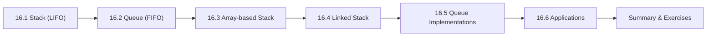

# Chapter 16: Stacks and Queues

> **Previous:** [Linked Lists](./15-linked-lists.md) | **Next:** [The C Standard Library](./17-standard-library.md)

## Learning Objectives

- Implement a stack using both arrays and linked lists
- Implement a queue using both arrays and linked lists
- Implement a circular queue
- Analyze the time complexity of stack and queue operations
- Apply stacks and queues to practical problems


### Chapter at a Glance

| Topic | Key Insight | Practical Takeaway |
|-------|-------------|-------------------|
| Stack (LIFO) | Last-In-First-Out data structure | Push adds to top; pop removes from top — both O(1) |
| Queue (FIFO) | First-In-First-Out data structure | Enqueue adds to rear; dequeue removes from front — both O(1) |
| Array Implementation | Use an index pointer for the top/front | Handle wrap-around for circular queues |
| Linked List Implementation | Push/pop at head for stack; enqueue at tail, dequeue at head for queue | Linked implementation avoids fixed-size limits |
| Applications | Expression evaluation, BFS, undo/redo, print spooling | Choose the structure that matches your access pattern |





## 16.1 The Stack Abstract Data Type

A stack is a last-in, first-out (LIFO) data structure. The primary operations are:

| Operation | Description |
|-----------|-------------|
| `push` | Add an element to the top |
| `pop` | Remove and return the top element |
| `peek` / `top` | View the top element without removing |
| `is_empty` | Check if the stack has no elements |
| `size` | Return the number of elements |

### 16.1.1 Array-Based Stack

```c
#include <stdio.h>
#include <stdbool.h>
#include <stdlib.h>

typedef struct {
    int *data;
    int top;        /* index of top element, -1 if empty */
    int capacity;
} Stack;

Stack *stack_create(int capacity)
{
    Stack *s = (Stack*)malloc(sizeof(Stack));
    s->data = (int*)malloc(capacity * sizeof(int));
    s->top = -1;
    s->capacity = capacity;
    return s;
}

void stack_destroy(Stack *s)
{
    free(s->data);
    free(s);
}

bool stack_is_empty(const Stack *s)
{
    return s->top == -1;
}

bool stack_is_full(const Stack *s)
{
    return s->top == s->capacity - 1;
}

bool stack_push(Stack *s, int value)
{
    if (stack_is_full(s)) {
        return false;
    }
    s->data[++(s->top)] = value;
    return true;
}

int stack_pop(Stack *s)
{
    if (stack_is_empty(s)) {
        fprintf(stderr, "Stack underflow\n");
        exit(1);
    }
    return s->data[(s->top)--];
}

int stack_peek(const Stack *s)
{
    if (stack_is_empty(s)) {
        fprintf(stderr, "Stack is empty\n");
        exit(1);
    }
    return s->data[s->top];
}

int main(void)
{
    Stack *s = stack_create(10);

    printf("Pushing: ");
    for (int i = 1; i <= 5; i++) {
        stack_push(s, i * 10);
        printf("%d ", i * 10);
    }
    printf("\n");

    printf("Top element: %d\n", stack_peek(s));

    printf("Popping: ");
    while (!stack_is_empty(s)) {
        printf("%d ", stack_pop(s));
    }
    printf("\n");

    stack_destroy(s);
    return 0;
}
```

**Output:**
```
Pushing: 10 20 30 40 50
Top element: 50
Popping: 50 40 30 20 10
```

### 16.1.2 Linked-List-Based Stack

```c
#include <stdio.h>
#include <stdlib.h>
#include <stdbool.h>

typedef struct node {
    int data;
    struct node *next;
} Node;

typedef struct {
    Node *top;
    int size;
} Stack;

Stack *stack_create(void)
{
    Stack *s = (Stack*)malloc(sizeof(Stack));
    s->top = NULL;
    s->size = 0;
    return s;
}

void stack_destroy(Stack *s)
{
    while (s->top) {
        Node *temp = s->top;
        s->top = s->top->next;
        free(temp);
    }
    free(s);
}

bool stack_is_empty(const Stack *s)
{
    return s->top == NULL;
}

void stack_push(Stack *s, int value)
{
    Node *new_node = (Node*)malloc(sizeof(Node));
    new_node->data = value;
    new_node->next = s->top;
    s->top = new_node;
    s->size++;
}

int stack_pop(Stack *s)
{
    if (stack_is_empty(s)) {
        fprintf(stderr, "Stack underflow\n");
        exit(1);
    }
    Node *temp = s->top;
    int value = temp->data;
    s->top = temp->next;
    free(temp);
    s->size--;
    return value;
}

int main(void)
{
    Stack *s = stack_create();

    stack_push(s, 100);
    stack_push(s, 200);
    stack_push(s, 300);

    printf("Popped: %d\n", stack_pop(s));
    printf("Popped: %d\n", stack_pop(s));

    stack_push(s, 400);
    printf("Popped: %d\n", stack_pop(s));
    printf("Popped: %d\n", stack_pop(s));

    stack_destroy(s);
    return 0;
}
```

**Output:**
```
Popped: 300
Popped: 200
Popped: 400
Popped: 100
```

> **One-Sentence Takeaway:** A stack provides O(1) push and pop operations following Last-In-First-Out order
> **Warning:** Array-based stacks have a fixed capacity always check for overflow before pushing.

## 16.2 Stack Applications

### 16.2.1 Balanced Parentheses

```c
#include <stdio.h>
#include <stdbool.h>
#include <string.h>

typedef struct {
    char data[100];
    int top;
} CharStack;

void push(CharStack *s, char c) { s->data[++(s->top)] = c; }
char pop(CharStack *s) { return s->data[(s->top)--]; }
bool is_empty(const CharStack *s) { return s->top == -1; }

bool is_balanced(const char *expr)
{
    CharStack s;
    s.top = -1;

    for (int i = 0; expr[i] != '\0'; i++) {
        char c = expr[i];
        if (c == '(' || c == '{' || c == '[') {
            push(&s, c);
        } else if (c == ')' || c == '}' || c == ']') {
            if (is_empty(&s)) return false;

            char top = pop(&s);
            if ((c == ')' && top != '(') ||
                (c == '}' && top != '{') ||
                (c == ']' && top != '[')) {
                return false;
            }
        }
    }

    return is_empty(&s);
}

int main(void)
{
    char *tests[] = {
        "()",
        "()[]{}",
        "({[]})",
        "({)}",
        "((())",
        "["
    };

    for (int i = 0; i < 6; i++) {
        printf("%-10s -> %s\n", tests[i],
               is_balanced(tests[i]) ? "balanced" : "unbalanced");
    }

    return 0;
}
```

**Output:**
```
()         -> balanced
()[]{}     -> balanced
({[]})     -> balanced
({)}       -> unbalanced
((())      -> unbalanced
[          -> unbalanced
```

### 16.2.2 Infix to Postfix Conversion (Shunting Yard)

```c
#include <stdio.h>
#include <ctype.h>
#include <string.h>

#define MAX 100

typedef struct {
    char data[MAX];
    int top;
} CharStack;

void init(CharStack *s) { s->top = -1; }
void push(CharStack *s, char c) { s->data[++(s->top)] = c; }
char pop(CharStack *s) { return s->data[(s->top)--]; }
char peek(const CharStack *s) { return s->data[s->top]; }
int is_empty(const CharStack *s) { return s->top == -1; }

int precedence(char op)
{
    switch (op) {
        case '+': case '-': return 1;
        case '*': case '/': return 2;
        case '^': return 3;
        default: return 0;
    }
}

void infix_to_postfix(const char *infix, char *postfix)
{
    CharStack s;
    init(&s);
    int j = 0;

    for (int i = 0; infix[i] != '\0'; i++) {
        char c = infix[i];

        if (isdigit(c) || isalpha(c)) {
            postfix[j++] = c;
        } else if (c == '(') {
            push(&s, c);
        } else if (c == ')') {
            while (!is_empty(&s) && peek(&s) != '(') {
                postfix[j++] = pop(&s);
            }
            pop(&s);  /* discard '(' */
        } else {  /* operator */
            while (!is_empty(&s) && precedence(peek(&s)) >= precedence(c)) {
                postfix[j++] = pop(&s);
            }
            push(&s, c);
        }
    }

    while (!is_empty(&s)) {
        postfix[j++] = pop(&s);
    }
    postfix[j] = '\0';
}

int main(void)
{
    char expressions[][MAX] = {
        "A+B*C",
        "(A+B)*C",
        "A*(B+C-D)/E",
        "A^B*C"
    };
    char postfix[MAX];

    for (int i = 0; i < 4; i++) {
        infix_to_postfix(expressions[i], postfix);
        printf("%-15s -> %s\n", expressions[i], postfix);
    }

    return 0;
}
```

**Output:**
```
A+B*C           -> ABC*+
(A+B)*C         -> AB+C*
A*(B+C-D)/E     -> ABC+D-*E/
A^B*C           -> AB^C*
```


> **One-Sentence Takeaway:** A queue is a FIFO data structure supporting enqueue and dequeue operations
> **Pro Tip:** Stacks are ideal for expression evaluation backtracking and undo-redo implementations.
## 16.3 The Queue Abstract Data Type

A queue is a first-in, first-out (FIFO) data structure.

| Operation | Description |
|-----------|-------------|
| `enqueue` | Add an element to the rear |
| `dequeue` | Remove and return the front element |
| `front` | View the front element without removing |
| `is_empty` | Check if the queue has no elements |

### 16.3.1 Array-Based Queue (Linear)

```c
#include <stdio.h>
#include <stdlib.h>
#include <stdbool.h>

typedef struct {
    int *data;
    int front;
    int rear;
    int capacity;
    int size;
} Queue;

Queue *queue_create(int capacity)
{
    Queue *q = (Queue*)malloc(sizeof(Queue));
    q->data = (int*)malloc(capacity * sizeof(int));
    q->front = 0;
    q->rear = -1;
    q->capacity = capacity;
    q->size = 0;
    return q;
}

void queue_destroy(Queue *q) { free(q->data); free(q); }
bool queue_is_empty(const Queue *q) { return q->size == 0; }
bool queue_is_full(const Queue *q) { return q->size == q->capacity; }

bool enqueue(Queue *q, int value)
{
    if (queue_is_full(q)) return false;
    q->rear = (q->rear + 1) % q->capacity;
    q->data[q->rear] = value;
    q->size++;
    return true;
}

int dequeue(Queue *q)
{
    if (queue_is_empty(q)) {
        fprintf(stderr, "Queue underflow\n");
        exit(1);
    }
    int value = q->data[q->front];
    q->front = (q->front + 1) % q->capacity;
    q->size--;
    return value;
}

int queue_front(const Queue *q)
{
    if (queue_is_empty(q)) exit(1);
    return q->data[q->front];
}

int main(void)
{
    Queue *q = queue_create(5);

    printf("Enqueuing: ");
    for (int i = 1; i <= 5; i++) {
        enqueue(q, i * 10);
        printf("%d ", i * 10);
    }
    printf("\n");

    printf("Front: %d\n", queue_front(q));
    printf("Dequeued: %d\n", dequeue(q));
    printf("Dequeued: %d\n", dequeue(q));

    enqueue(q, 60);
    enqueue(q, 70);

    printf("Dequeuing all: ");
    while (!queue_is_empty(q)) {
        printf("%d ", dequeue(q));
    }
    printf("\n");

    queue_destroy(q);
    return 0;
}
```

**Output:**
```
Enqueuing: 10 20 30 40 50
Front: 10
Dequeued: 10
Dequeued: 20
Dequeuing all: 30 40 60 70
```

**Note the circular buffer behavior:** After dequeuing 10 and 20, the enqueue operations reuse the vacated slots at indices 0 and 1 because the `rear` index wraps around using the modulo operator.

### 16.3.2 Linked-List-Based Queue

```c
#include <stdio.h>
#include <stdlib.h>
#include <stdbool.h>

typedef struct node {
    int data;
    struct node *next;
} Node;

typedef struct {
    Node *front;
    Node *rear;
    int size;
} Queue;

Queue *queue_create(void)
{
    Queue *q = (Queue*)malloc(sizeof(Queue));
    q->front = q->rear = NULL;
    q->size = 0;
    return q;
}

void queue_destroy(Queue *q)
{
    while (q->front) {
        Node *temp = q->front;
        q->front = q->front->next;
        free(temp);
    }
    free(q);
}

bool queue_is_empty(const Queue *q) { return q->front == NULL; }

void enqueue(Queue *q, int value)
{
    Node *new_node = (Node*)malloc(sizeof(Node));
    new_node->data = value;
    new_node->next = NULL;

    if (queue_is_empty(q)) {
        q->front = q->rear = new_node;
    } else {
        q->rear->next = new_node;
        q->rear = new_node;
    }
    q->size++;
}

int dequeue(Queue *q)
{
    if (queue_is_empty(q)) {
        fprintf(stderr, "Queue underflow\n");
        exit(1);
    }
    Node *temp = q->front;
    int value = temp->data;
    q->front = temp->next;
    free(temp);
    q->size--;
    if (q->front == NULL) q->rear = NULL;
    return value;
}

int main(void)
{
    Queue *q = queue_create();
    enqueue(q, 1);
    enqueue(q, 2);
    enqueue(q, 3);

    printf("Dequeued: %d\n", dequeue(q));
    printf("Dequeued: %d\n", dequeue(q));
    enqueue(q, 4);
    printf("Dequeued: %d\n", dequeue(q));
    printf("Dequeued: %d\n", dequeue(q));

    queue_destroy(q);
    return 0;
}
```

**Output:**
```
Dequeued: 1
Dequeued: 2
Dequeued: 3
Dequeued: 4
```


> **One-Sentence Takeaway:** Array-based stacks use an index pointer for O(1) push and pop
> **Warning:** Array-based stacks have a fixed capacity always check for overflow before pushing.
## 16.4 Queue Applications

1. **BFS (Breadth-First Search)** in graphs
2. **Print spooling** — documents queued for printing
3. **Task scheduling** in operating systems
4. **Buffering** — IO buffers, keyboard buffers
5. **Breadth-first traversal** of trees

## Concept Comparison Table

| Operation | Stack (LIFO) | Queue (FIFO) |
|-----------|--------------|--------------|
| Insert | `push(x)` — at top | `enqueue(x)` — at rear |
| Remove | `pop()` — from top | `dequeue()` — from front |
| Peek | `top()` — top element | `front()` — front element |
| Empty check | `is_empty()` | `is_empty()` |
| Time complexity | O(1) for all operations | O(1) for all operations |
| Memory | Array or linked list | Array (circular) or linked |

## Quick Reference

| Structure | Array Implementation | Linked Implementation |
|-----------|---------------------|---------------------|
| Stack push | `arr[++top] = val;` | `new->next = head; head = new;` |
| Stack pop | `return arr[top--];` | `tmp = head; head = head->next; free(tmp);` |
| Queue enqueue | `arr[rear = (rear+1)%N] = val;` | `tail->next = new; tail = new;` |
| Queue dequeue | `val = arr[front]; front = (front+1)%N;` | `tmp = head; head = head->next; free(tmp);` |
| Stack empty | `top == -1` | `head == NULL` |
| Queue empty | `front == rear` (with wasted slot) | `head == NULL` |

## Cross-Application Matrix

| Application | Structure | Why |
|-------------|-----------|-----|
| Undo in editor | Stack | Push actions; pop to undo |
| Browser back button | Stack | Push pages; pop to go back |
| Print spooler | Queue | First come, first served |
| BFS on graph | Queue | Level-order traversal |
| Expression parsing | Stack | Convert/shunt infix to postfix |
| CPU task scheduler | Queue | Round-robin (often circular) |

## Chapter Quiz

1. If you push 1, 2, 3 onto a stack then pop once, what value do you get?
   A) 1
   B) 2
   C) 3
   D) Error (stack empty)

<details><summary>Answer</summary>**C)** LIFO means the last pushed (3) is the first popped.</details>

2. What is the main advantage of a linked list queue over an array-based circular queue?
   A) Faster access
   B) No fixed maximum size
   C) Less memory
   D) Simpler implementation

<details><summary>Answer</summary>**B)** Linked queues grow dynamically; array queues have a fixed capacity.</details>

3. Which data structure is most appropriate for breadth-first search?
   A) Stack
   B) Queue
   C) Array
   D) Linked list

<details><summary>Answer</summary>**B)** BFS explores nodes level by level — a queue provides the FIFO ordering needed.</details>

## Summary

- A stack follows LIFO: push and pop operate at the top. Array and linked-list implementations both offer O(1) push/pop.
- Stacks are used for expression evaluation, parenthesis matching, undo/redo, and function call management.
- A queue follows FIFO: enqueue at the rear, dequeue from the front.
- A circular queue reuses array slots by wrapping indices modulo capacity.
- A linked-list queue grows dynamically without capacity limits.
- Queues are used for BFS, scheduling, buffering, and spooling.

## Exercises

### Review Questions

1. What is the fundamental difference between a stack and a queue in terms of order of operations?
2. In an array-based stack, what does the `top` index indicate when the stack is empty?
3. What problem does a circular queue solve compared to a linear queue?
4. What are the time complexities of the core stack and queue operations?
5. Name two real-world applications for stacks and two for queues.

### Application Problems

1. Implement a function `int evaluate_postfix(const char *expr)` that evaluates a postfix expression using a stack. The expression contains single-digit integers and the operators `+`, `-`, `*`, `/`. Example: `"23+"` → 5, `"23*54*+"` → 26.
2. Implement a **deque** (double-ended queue) using a doubly linked list. Provide `push_front`, `push_back`, `pop_front`, `pop_back`, `front`, `back`, `is_empty` operations.
3. Use a stack to implement a function `void decimal_to_binary(int n)` that prints the binary representation of a non-negative integer.
4. Write a program that uses a queue to simulate a **printer queue**: jobs arrive every 1–5 seconds (use `rand()`), each taking 1–3 seconds to print. Simulate for 30 seconds and report the average wait time.

### Challenge Problem

Implement an **LRU (Least Recently Used) cache** using a combination of a doubly linked list and a hash map. The cache has a fixed capacity. When a new item is accessed:

- If the item is already in the cache, move it to the front (most recently used).
- If the item is not in the cache and the cache is full, evict the least recently used item (at the back) and insert the new item at the front.

Operations: `int cache_get(int key)` and `void cache_put(int key, int value)`. For the hash map, you may use a simple array of key-indexed entries or implement a basic hash table with chaining. Demonstrate with a series of operations.

> **One-Sentence Takeaway:** Linked stack implementations grow dynamically without fixed size limits
> **Remember:** The system call stack uses the same LIFO principle as a stack data structure.
