# Chapter 17: The C Standard Library

> **Previous:** [Stacks and Queues](./16-stacks-queues.md) | **Next:** [Advanced C](./18-advanced-c.md)

## Learning Objectives

- Identify the 15+ major headers in the C standard library
- Use `stdlib.h` for memory allocation, numeric conversion, sorting, and process control
- Use `stdio.h` for console and file input/output operations
- Use `string.h` for string manipulation and memory copying
- Use `math.h` for floating-point trigonometric, exponential, and rounding functions
- Use `ctype.h` for character classification and case conversion
- Use `time.h` for date/time retrieval and formatting
- Understand `setjmp.h` for non-local jumps — use cases and dangers
- Recognize `stdarg.h` for variadic functions and `signal.h` for signal handling
- Apply errno-based error detection with `math.h` and `stdlib.h` functions
- Compare `atoi` vs `strtol` vs `sscanf` for production-safe parsing


### Chapter at a Glance

<a href="../../assets/images/diagrams/c-programming/17-standard-library/chapter-at-a-glance-handwritten.svg" target="_blank" rel="noopener">
  
</a>
<a href="../../assets/images/diagrams/c-programming/17-standard-library/chapter-at-a-glance-diagram.svg" target="_blank" rel="noopener">
  
</a>
<a href="../../assets/images/diagrams/c-programming/17-standard-library/chapter-at-a-glance-sticky.svg" target="_blank" rel="noopener">
  
</a>


| Topic | Key Insight | Practical Takeaway |
|-------|-------------|-------------------|
| `<stdio.h>` | Input/output: printf, scanf, fopen, fclose, fread, fwrite | Handles all console, file, and string I/O — most-used header |
| `<stdlib.h>` | Memory allocation, random numbers, sorting, atoi | Contains malloc, free, qsort, rand, and strtol for safe parsing |
| `<string.h>` | String manipulation: strlen, strcpy, strcmp, memcpy | All functions operate on null-terminated arrays; watch for overlap |
| `<math.h>` | Floating-point math: sin, cos, sqrt, pow, fabs | Link with `-lm` on Unix; check errno for domain/range errors |
| `<ctype.h>` | Character classification: isalpha, isdigit, tolower, toupper | Handles locale-specific character tests via current locale |
| `<time.h>` | Time functions: time, clock, difftime, strftime | `time()` returns seconds since epoch; 32-bit time_t overflows in 2038 |
| `<assert.h>` | Runtime diagnostics with assertion macros | Disable with `NDEBUG` for release builds |
| `<setjmp.h>` | Non-local jumps across function call boundaries | Use only for deep error recovery; resource leaks are your risk |
| `<stdarg.h>` | Variable-length argument lists (printf-family) | Mandates at least one named parameter before `...` |



```mermaid
flowchart LR
    A["17.1 <stdio.h>"] --> B["17.2 <stdlib.h>"]
    B --> C["17.3 <string.h>"]
    C --> D["17.4 <math.h>"]
    D --> E["17.5 <ctype.h>"]
    E --> F["17.6 <time.h>"]
    F --> G["17.7 <errno.h> & <assert.h>"]
    G --> H["17.8 <setjmp.h>"]
    H --> I["17.9 <signal.h>"]
    I --> J["17.10 <stdarg.h>"]
    J --> K["17.11 Other Headers"]
    K --> L["17.12 Interview Corner"]
    L --> M["17.13 Applications in Real Systems"]
    M --> N["Summary & Exercises"]
```

---

## 17.1 `<stdio.h>` — Input and Output

### Real-World Analogy: Office Mailroom

<a href="../../assets/images/diagrams/c-programming/17-standard-library/real-world-analogy-office-mailroom-handwritten.svg" target="_blank" rel="noopener">
  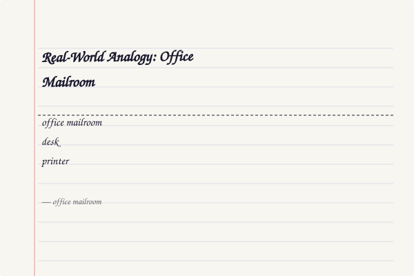
</a>
<a href="../../assets/images/diagrams/c-programming/17-standard-library/real-world-analogy-office-mailroom-diagram.svg" target="_blank" rel="noopener">
  
</a>
<a href="../../assets/images/diagrams/c-programming/17-standard-library/real-world-analogy-office-mailroom-sticky.svg" target="_blank" rel="noopener">
  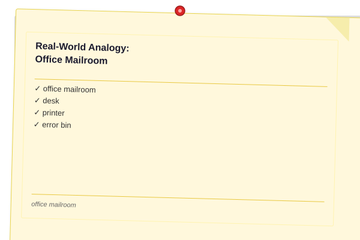
</a>


Imagine an **office mailroom**. You have:
- A **desk** (stdin) where you read incoming memos.
- A **printer** (stdout) where you send outgoing letters.
- An **error bin** (stderr) for urgent alerts.
- **File cabinets** (FILE*) that you must **open** before reading/writing and **close** when done.
- Each cabinet has a **drawer position** (file position indicator) that you can move with `fseek`.

### Numbered Steps for File I/O

<a href="../../assets/images/diagrams/c-programming/17-standard-library/numbered-steps-for-file-i-o-handwritten.svg" target="_blank" rel="noopener">
  
</a>
<a href="../../assets/images/diagrams/c-programming/17-standard-library/numbered-steps-for-file-i-o-diagram.svg" target="_blank" rel="noopener">
  
</a>
<a href="../../assets/images/diagrams/c-programming/17-standard-library/numbered-steps-for-file-i-o-sticky.svg" target="_blank" rel="noopener">
  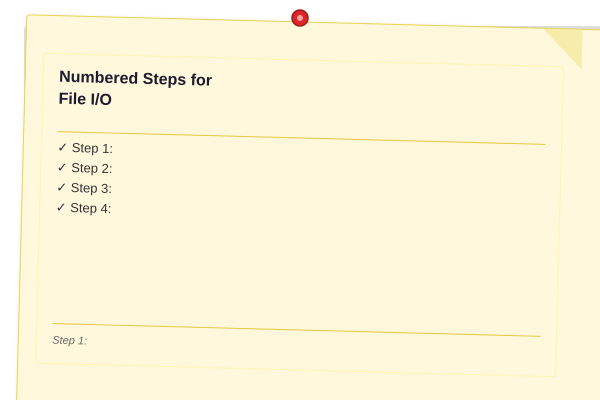
</a>


**Step 1:** Declare a `FILE*` pointer.
**Step 2:** Call `fopen(path, mode)` to open the file — check for NULL return.
**Step 3:** Read or write data using `fprintf`, `fscanf`, `fread`, `fwrite`, `fgets`.
**Step 4:** When done, call `fclose(fp)` to flush buffers and release resources.
**Step 5:** Check the return value of `fclose` — it can fail on some systems (e.g., NFS).

### Key Functions Reference

<a href="../../assets/images/diagrams/c-programming/17-standard-library/key-functions-reference-handwritten.svg" target="_blank" rel="noopener">
  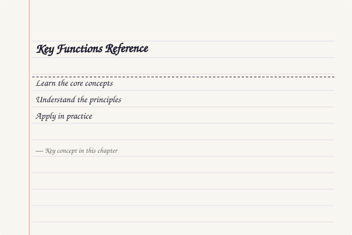
</a>
<a href="../../assets/images/diagrams/c-programming/17-standard-library/key-functions-reference-diagram.svg" target="_blank" rel="noopener">
  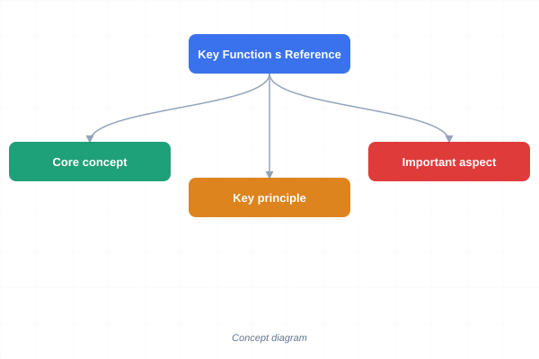
</a>
<a href="../../assets/images/diagrams/c-programming/17-standard-library/key-functions-reference-sticky.svg" target="_blank" rel="noopener">
  
</a>


| Function | Description | Safe Variant |
|----------|-------------|--------------|
| `printf`, `fprintf`, `sprintf` | Formatted output to stdout, file, string | `snprintf` (bounded) |
| `scanf`, `fscanf`, `sscanf` | Formatted input from stdin, file, string | Use width limits: `scanf("%19s", buf)` |
| `fopen`, `fclose` | File open/close | `fopen_s` (C11 Annex K, optional) |
| `fread`, `fwrite` | Binary I/O | Check return count |
| `fgets`, `fputs` | Line I/O | `fgets(buf, size, stream)` |
| `fgetc`, `fputc` | Character I/O | — |
| `fseek`, `ftell`, `rewind` | File positioning | `fseeko` on POSIX for large files |
| `perror` | Print strerror to stderr | — |
| `remove`, `rename` | File operations | Check return value |
| `tmpfile`, `tmpnam` | Temporary files | `mkstemp` preferred (POSIX) |
| `setvbuf` | Set buffering mode | Call before any I/O on the stream |
| `feof`, `ferror` | Stream status checking | Use `ferror` — never `feof` alone |

### Code: snprintf, sscanf, and File Copy

<a href="../../assets/images/diagrams/c-programming/17-standard-library/code-snprintf-sscanf-and-file-copy-handwritten.svg" target="_blank" rel="noopener">
  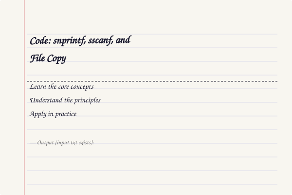
</a>
<a href="../../assets/images/diagrams/c-programming/17-standard-library/code-snprintf-sscanf-and-file-copy-diagram.svg" target="_blank" rel="noopener">
  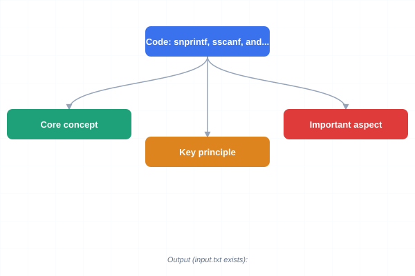
</a>
<a href="../../assets/images/diagrams/c-programming/17-standard-library/code-snprintf-sscanf-and-file-copy-sticky.svg" target="_blank" rel="noopener">
  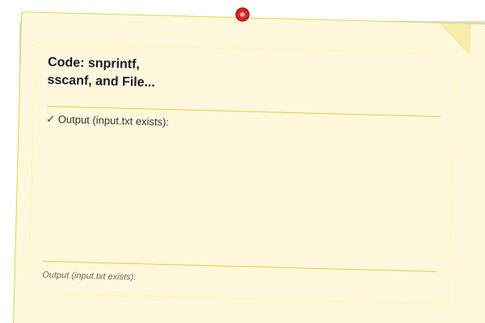
</a>


```c
#include <stdio.h>
#include <errno.h>
#include <string.h>

int main(void)
{
    /* snprintf — safe string formatting */
    char buf[50];
    int written = snprintf(buf, sizeof(buf), "The answer is %d", 42);
    printf("Buffer: '%s' (%d chars written, would have been %d)\n",
           buf, written, (written >= (int)sizeof(buf)) ? (int)sizeof(buf) - 1 : written);

    /* sscanf — parsing from string */
    int id;
    char name[50];
    float gpa;
    const char *line = "101 Alice 3.85";
    int count = sscanf(line, "%d %49s %f", &id, name, &gpa);
    printf("Parsed %d items: %d %s %.2f\n", count, id, name, gpa);

    /* File copy using fread/fwrite */
    FILE *src = fopen("input.txt", "rb");
    if (!src) { perror("fopen input"); return 1; }
    FILE *dst = fopen("output.bak", "wb");
    if (!dst) { perror("fopen output"); fclose(src); return 1; }

    unsigned char block[4096];
    size_t n;
    while ((n = fread(block, 1, sizeof(block), src)) > 0) {
        if (fwrite(block, 1, n, dst) != n) {
            fprintf(stderr, "Write error\n");
            break;
        }
    }
    fclose(src);
    fclose(dst);

    return 0;
}
```

**Output (input.txt exists):**
```
Buffer: 'The answer is 42' (16 chars written, would have been 16)
Parsed 3 items: 101 Alice 3.85
```

### Dry Run: fread/fwrite Copy Loop

<a href="../../assets/images/diagrams/c-programming/17-standard-library/dry-run-fread-fwrite-copy-loop-handwritten.svg" target="_blank" rel="noopener">
  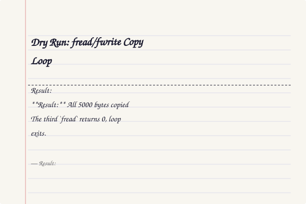
</a>
<a href="../../assets/images/diagrams/c-programming/17-standard-library/dry-run-fread-fwrite-copy-loop-diagram.svg" target="_blank" rel="noopener">
  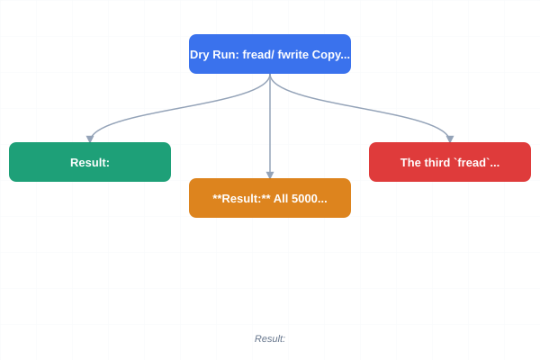
</a>
<a href="../../assets/images/diagrams/c-programming/17-standard-library/dry-run-fread-fwrite-copy-loop-sticky.svg" target="_blank" rel="noopener">
  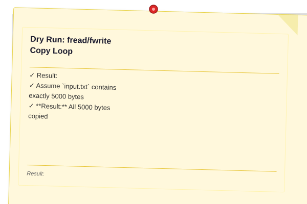
</a>


Assume `input.txt` contains exactly 5000 bytes.

| Iteration | `n = fread(...)` | Bytes Read | EOF? | `fwrite` writes | Cumulative |
|-----------|-------------------|------------|------|-----------------|------------|
| 1 | 4096 | 4096 | No | 4096 | 4096 |
| 2 | 904 | 904 | Yes (EOF after) | 904 | 5000 |
| 3 | 0 | 0 | Yes | — | 5000 |

**Result:** All 5000 bytes copied. The third `fread` returns 0, loop exits.

### Pseudocode for snprintf Safety

<a href="../../assets/images/diagrams/c-programming/17-standard-library/pseudocode-for-snprintf-safety-handwritten.svg" target="_blank" rel="noopener">
  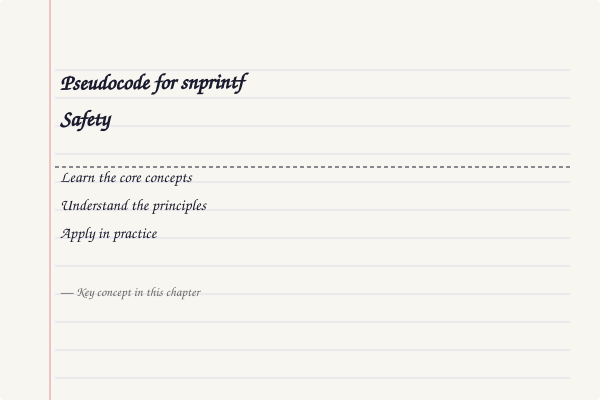
</a>
<a href="../../assets/images/diagrams/c-programming/17-standard-library/pseudocode-for-snprintf-safety-diagram.svg" target="_blank" rel="noopener">
  
</a>
<a href="../../assets/images/diagrams/c-programming/17-standard-library/pseudocode-for-snprintf-safety-sticky.svg" target="_blank" rel="noopener">
  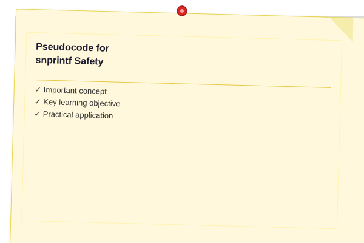
</a>


```
FUNCTION safe_format(buf, bufsize, fmt, ...):
    n <- vsnprintf(buf, bufsize, fmt, args)
    IF n >= bufsize:
        // Output was truncated — buf is null-terminated at bufsize-1
        RETURN n  // caller can detect truncation
    END IF
    RETURN n
END FUNCTION
```

### Complexity Analysis

<a href="../../assets/images/diagrams/c-programming/17-standard-library/complexity-analysis-handwritten.svg" target="_blank" rel="noopener">
  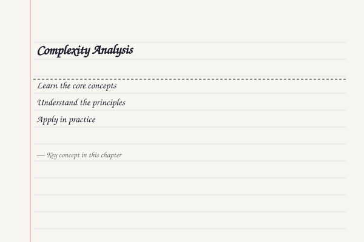
</a>
<a href="../../assets/images/diagrams/c-programming/17-standard-library/complexity-analysis-diagram.svg" target="_blank" rel="noopener">
  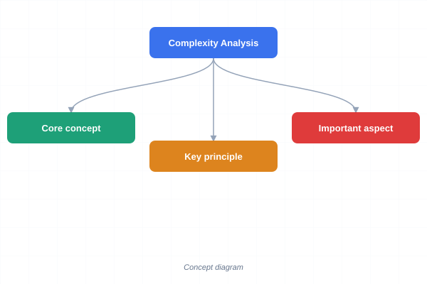
</a>
<a href="../../assets/images/diagrams/c-programming/17-standard-library/complexity-analysis-sticky.svg" target="_blank" rel="noopener">
  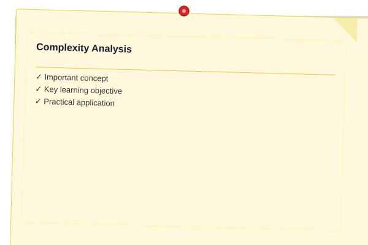
</a>


| Operation | Time | Space | Why |
|-----------|------|-------|-----|
| `printf`/`fprintf` | O(f) | O(1) | f = format complexity plus arguments; buffered writes |
| `fread`/`fwrite` | O(n) | O(1) | n = bytes; block transfer, minimal overhead |
| `fgets` | O(n) | O(1) | n = characters read until newline or buffer full |
| `fseek` | O(1) | O(1) | Direct repositioning of file offset pointer |
| `fscanf` | O(n) | O(1) | n = characters scanned; format parsing overhead |
| `snprintf` | O(f) | O(1) | f = format + arguments; bounded output |
| `setvbuf` | O(b) | O(b) | b = buffer size; allocates internal buffer |

### Advantages and Disadvantages

<a href="../../assets/images/diagrams/c-programming/17-standard-library/advantages-and-disadvantages-handwritten.svg" target="_blank" rel="noopener">
  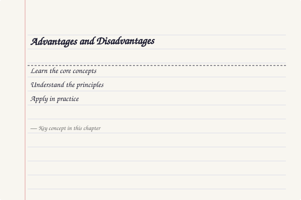
</a>
<a href="../../assets/images/diagrams/c-programming/17-standard-library/advantages-and-disadvantages-diagram.svg" target="_blank" rel="noopener">
  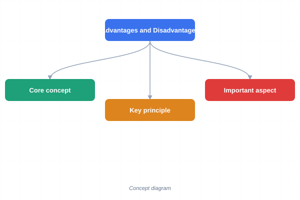
</a>
<a href="../../assets/images/diagrams/c-programming/17-standard-library/advantages-and-disadvantages-sticky.svg" target="_blank" rel="noopener">
  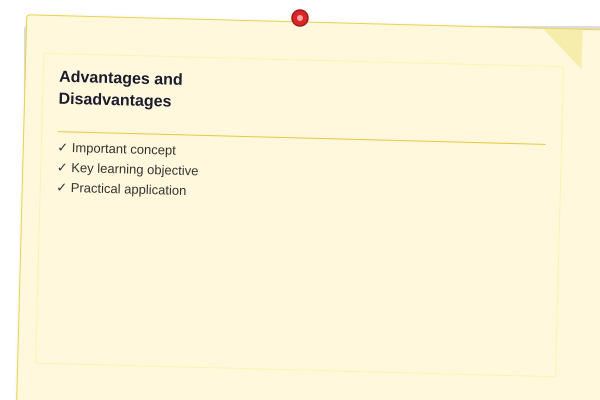
</a>


| Aspect | Advantage | Disadvantage |
|--------|-----------|--------------|
| **Buffering** | Automatic buffering improves throughput | setvbuf must be called before any I/O |
| **Portability** | Part of ISO C standard — available everywhere | No raw OS features (async I/O, memory-mapped files) |
| **Safety** | snprintf, fgets with size limits | sprintf and gets are dangerous — avoid entirely |
| **Performance** | Block I/O via fread/fwrite is near OS speed | Line I/O is slower per-character than raw read |
| **Error handling** | perror and errno give diagnostic info | Return values must be checked — easy to ignore |

### Edge Cases

<a href="../../assets/images/diagrams/c-programming/17-standard-library/edge-cases-handwritten.svg" target="_blank" rel="noopener">
  
</a>
<a href="../../assets/images/diagrams/c-programming/17-standard-library/edge-cases-diagram.svg" target="_blank" rel="noopener">
  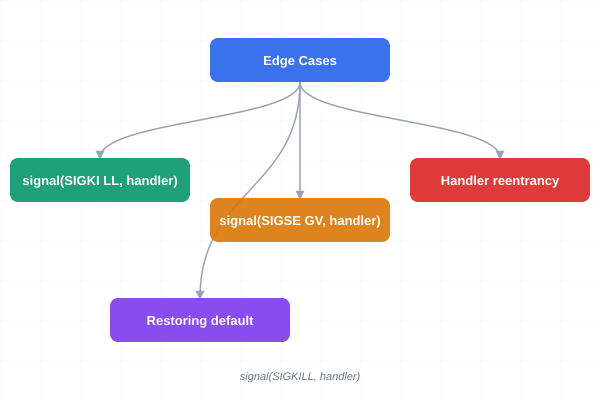
</a>
<a href="../../assets/images/diagrams/c-programming/17-standard-library/edge-cases-sticky.svg" target="_blank" rel="noopener">
  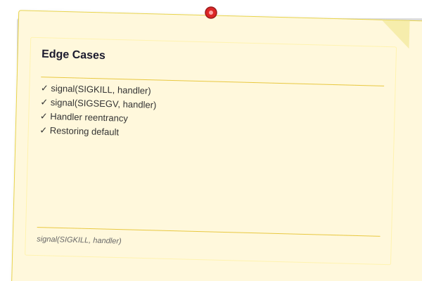
</a>


- **fopen(NULL, "r")**: Undefined behavior — always check pointer.
- **fclose after failed fopen**: Undefined behavior — double-close also undefined.
- **ftell after fwrite on text mode**: Return value may not be byte offset (implementation-defined).
- **snprintf(buf, 0, ...)**: Returns number of characters that *would have* been written (C99). Buf is untouched.
- **feof()**: Only set *after* a read attempt fails. Never use `feof` before reading.

### errno with stdio

<a href="../../assets/images/diagrams/c-programming/17-standard-library/errno-with-stdio-handwritten.svg" target="_blank" rel="noopener">
  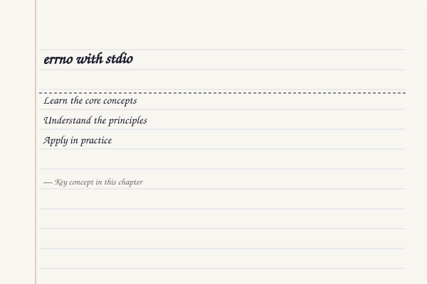
</a>
<a href="../../assets/images/diagrams/c-programming/17-standard-library/errno-with-stdio-diagram.svg" target="_blank" rel="noopener">
  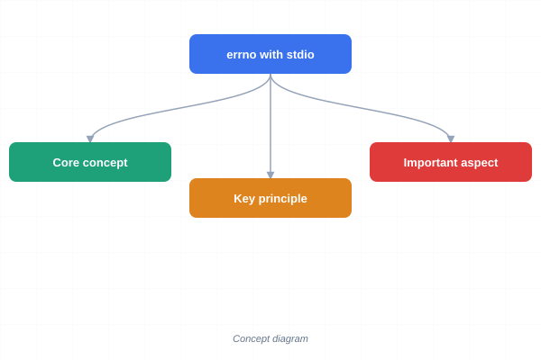
</a>
<a href="../../assets/images/diagrams/c-programming/17-standard-library/errno-with-stdio-sticky.svg" target="_blank" rel="noopener">
  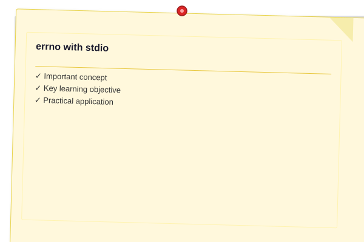
</a>


```c
#include <stdio.h>
#include <errno.h>

int main(void)
{
    FILE *fp = fopen("/nonexistent/file.txt", "r");
    if (!fp) {
        perror("fopen");                /* prints "fopen: No such file or directory" */
        fprintf(stderr, "errno = %d\n", errno);  /* errno = 2 (ENOENT) */
    }
    return 0;
}
```

---

## 17.2 `<stdlib.h>` — General Utilities

### Real-World Analogy: Hardware Store

<a href="../../assets/images/diagrams/c-programming/17-standard-library/real-world-analogy-hardware-store-handwritten.svg" target="_blank" rel="noopener">
  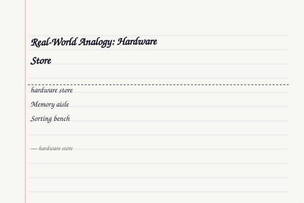
</a>
<a href="../../assets/images/diagrams/c-programming/17-standard-library/real-world-analogy-hardware-store-diagram.svg" target="_blank" rel="noopener">
  
</a>
<a href="../../assets/images/diagrams/c-programming/17-standard-library/real-world-analogy-hardware-store-sticky.svg" target="_blank" rel="noopener">
  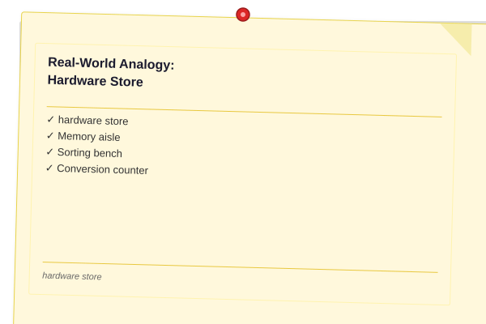
</a>


`<stdlib.h>` is like a **hardware store** with different departments:
- **Memory aisle**: `malloc`, `calloc`, `realloc`, `free` — like renting storage units.
- **Sorting bench**: `qsort`, `bsearch` — like organizing tools by size.
- **Conversion counter**: `atoi`, `strtol`, `atof` — like converting imperial to metric.
- **Random bin**: `rand`, `srand` — like pulling numbered balls from a lottery machine.
- **Process desk**: `exit`, `atexit`, `system`, `getenv` — like store management.

### Numbered Steps for Safe String-to-Integer Conversion

<a href="../../assets/images/diagrams/c-programming/17-standard-library/numbered-steps-for-safe-string-to-integer-conversion-handwritten.svg" target="_blank" rel="noopener">
  
</a>
<a href="../../assets/images/diagrams/c-programming/17-standard-library/numbered-steps-for-safe-string-to-integer-conversion-diagram.svg" target="_blank" rel="noopener">
  
</a>
<a href="../../assets/images/diagrams/c-programming/17-standard-library/numbered-steps-for-safe-string-to-integer-conversion-sticky.svg" target="_blank" rel="noopener">
  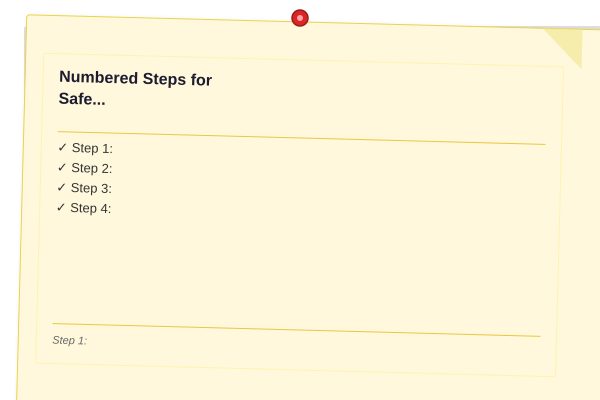
</a>


**Step 1:** Include `<stdlib.h>` and `<errno.h>`.
**Step 2:** Set `errno = 0` before the call.
**Step 3:** Call `strtol(str, &end, base)`.
**Step 4:** Check `end == str` — no digits parsed (error).
**Step 5:** Check `*end != '\0'` — trailing characters (partial parse, may be acceptable).
**Step 6:** Check `errno == ERANGE` — overflow/underflow.
**Step 7:** Cast result cautiously, check against `INT_MIN`/`INT_MAX` if going to `int`.

### 17.2.1 Memory Allocation

<a href="../../assets/images/diagrams/c-programming/17-standard-library/17-2-1-memory-allocation-handwritten.svg" target="_blank" rel="noopener">
  
</a>
<a href="../../assets/images/diagrams/c-programming/17-standard-library/17-2-1-memory-allocation-diagram.svg" target="_blank" rel="noopener">
  
</a>
<a href="../../assets/images/diagrams/c-programming/17-standard-library/17-2-1-memory-allocation-sticky.svg" target="_blank" rel="noopener">
  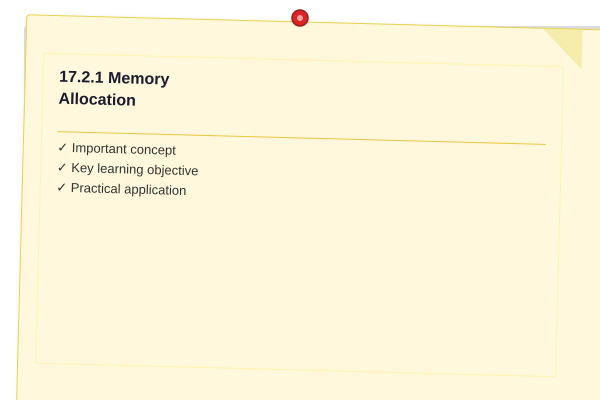
</a>


```c
void *malloc(size_t size);
void *calloc(size_t count, size_t size);
void *realloc(void *ptr, size_t new_size);
void free(void *ptr);
```

(Detailed in Chapter 11.)

### 17.2.2 Numeric Conversion

<a href="../../assets/images/diagrams/c-programming/17-standard-library/17-2-2-numeric-conversion-handwritten.svg" target="_blank" rel="noopener">
  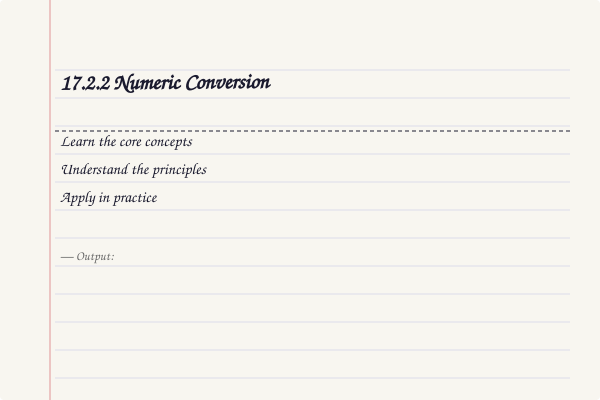
</a>
<a href="../../assets/images/diagrams/c-programming/17-standard-library/17-2-2-numeric-conversion-diagram.svg" target="_blank" rel="noopener">
  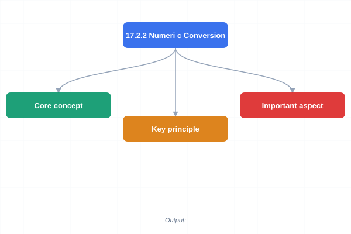
</a>
<a href="../../assets/images/diagrams/c-programming/17-standard-library/17-2-2-numeric-conversion-sticky.svg" target="_blank" rel="noopener">
  
</a>


```c
#include <stdio.h>
#include <stdlib.h>
#include <errno.h>
#include <limits.h>

int main(void)
{
    const char *int_str  = "1234";
    const char *dbl_str  = "3.14159";
    const char *bad_str  = "42abc";
    const char *overflow = "999999999999999999999";

    /* atoi — simple but no error detection */
    int naive = atoi(int_str);
    printf("atoi: %d\n", naive);

    /* strtol — full error detection */
    errno = 0;
    char *end;
    long val = strtol(bad_str, &end, 10);
    if (end == bad_str) {
        printf("No digits found\n");
    } else if (errno == ERANGE) {
        printf("Overflow/underflow\n");
    } else if (*end != '\0') {
        printf("Partial parse: %ld, trailing: '%s'\n", val, end);
    } else {
        printf("Full parse: %ld\n", val);
    }

    /* Overflow detection */
    errno = 0;
    long big = strtol(overflow, &end, 10);
    if (errno == ERANGE)
        printf("Overflow detected! errno=%d\n", errno);

    /* strtod for doubles */
    errno = 0;
    double d = strtod(dbl_str, &end);
    if (errno == ERANGE)
        printf("Double overflow/underflow\n");
    printf("strtod: %.5f\n", d);

    return 0;
}
```

**Output:**
```
atoi: 1234
Partial parse: 42, trailing: 'abc'
Overflow detected! errno=34
strtod: 3.14159
```

### Dry Run: strtol Parsing "42abc"

<a href="../../assets/images/diagrams/c-programming/17-standard-library/dry-run-strtol-parsing-42abc-handwritten.svg" target="_blank" rel="noopener">
  
</a>
<a href="../../assets/images/diagrams/c-programming/17-standard-library/dry-run-strtol-parsing-42abc-diagram.svg" target="_blank" rel="noopener">
  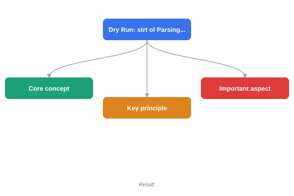
</a>
<a href="../../assets/images/diagrams/c-programming/17-standard-library/dry-run-strtol-parsing-42abc-sticky.svg" target="_blank" rel="noopener">
  
</a>


| Step | end pointer | *end | val | Condition | Action |
|------|------------|------|-----|-----------|--------|
| 1 | &str[0] | '4' | 0 | Leading whitespace | Skip |
| 2 | &str[2] | 'a' | 42 | isdigit? No | Stop, return 42 |
| 3 | — | — | 42 | end != str? Yes | Partial parse detected |

**Result:** `val = 42`, `*end = 'a'`, trailing content `"abc"`.

### Comparison: atoi vs strtol vs sscanf

<a href="../../assets/images/diagrams/c-programming/17-standard-library/comparison-atoi-vs-strtol-vs-sscanf-handwritten.svg" target="_blank" rel="noopener">
  
</a>
<a href="../../assets/images/diagrams/c-programming/17-standard-library/comparison-atoi-vs-strtol-vs-sscanf-diagram.svg" target="_blank" rel="noopener">
  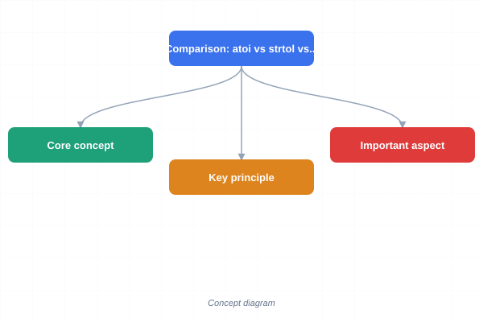
</a>
<a href="../../assets/images/diagrams/c-programming/17-standard-library/comparison-atoi-vs-strtol-vs-sscanf-sticky.svg" target="_blank" rel="noopener">
  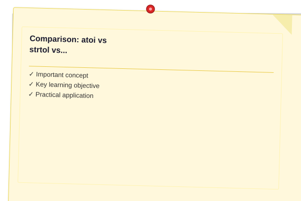
</a>


| Feature | `atoi` | `strtol` | `sscanf` |
|---------|--------|----------|----------|
| **Error detection** | None | Full (errno, end pointer) | Via return value (matched count) |
| **Base selection** | Decimal only (10) | Any base 2–36, auto-detect (0) | Via format specifier (%i = auto) |
| **Overflow behavior** | Undefined | Returns LONG_MIN/LONG_MAX, sets ERANGE | Undefined |
| **Trailing chars** | Ignored silently | Report via end pointer | Ignored silently |
| **Speed** | Fastest | Fast | Slower (format parsing overhead) |
| **Type returned** | int | long / long long | Via pointer argument |
| **Locale support** | No | No | Yes (%'d for thousands separator) |
| **Reentrant** | Yes | Yes | Yes |
| **Standard** | C89 | C89 | C89 |
| **Recommendation** | Never use in production | Always prefer for integers | Acceptable for complex multi-value parsing |

### Complexity Analysis — Numeric Conversion

<a href="../../assets/images/diagrams/c-programming/17-standard-library/complexity-analysis-numeric-conversion-handwritten.svg" target="_blank" rel="noopener">
  
</a>
<a href="../../assets/images/diagrams/c-programming/17-standard-library/complexity-analysis-numeric-conversion-diagram.svg" target="_blank" rel="noopener">
  
</a>
<a href="../../assets/images/diagrams/c-programming/17-standard-library/complexity-analysis-numeric-conversion-sticky.svg" target="_blank" rel="noopener">
  
</a>


| Function | Time | Space | Why |
|----------|------|-------|-----|
| `atoi` | O(n) | O(1) | Scan n digits, no error checking overhead |
| `strtol` | O(n) | O(1) | Same scan, plus overflow checks on each step |
| `strtod` | O(n) | O(1) | Parses mantissa, exponent, sign — more stages |
| `sscanf` | O(n+f) | O(1) | n = input scan, f = format string parsing |

### 17.2.3 Pseudo-Random Numbers

<a href="../../assets/images/diagrams/c-programming/17-standard-library/17-2-3-pseudo-random-numbers-handwritten.svg" target="_blank" rel="noopener">
  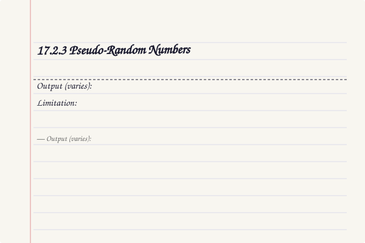
</a>
<a href="../../assets/images/diagrams/c-programming/17-standard-library/17-2-3-pseudo-random-numbers-diagram.svg" target="_blank" rel="noopener">
  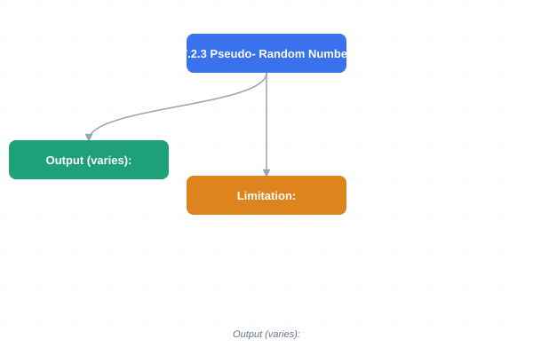
</a>
<a href="../../assets/images/diagrams/c-programming/17-standard-library/17-2-3-pseudo-random-numbers-sticky.svg" target="_blank" rel="noopener">
  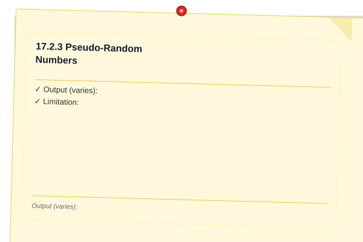
</a>


```c
#include <stdio.h>
#include <stdlib.h>
#include <time.h>

int main(void)
{
    srand((unsigned)time(NULL));

    printf("Five dice rolls:\n");
    for (int i = 0; i < 5; i++) {
        int dice = (rand() % 6) + 1;
        printf("  Roll %d: %d\n", i + 1, dice);
    }

    /* rand() returns 0 to RAND_MAX (at least 32767) */
    printf("RAND_MAX = %d\n", RAND_MAX);

    return 0;
}
```

**Output (varies):**
```
Five dice rolls:
  Roll 1: 4
  Roll 2: 1
  Roll 3: 6
  Roll 4: 3
  Roll 5: 5
RAND_MAX = 32767
```

**Limitation:** `rand() % N` is biased when `RAND_MAX + 1` is not divisible by `N`. For a fair dice roll (1–6), the bias is small but measurable. Use rejection sampling for fairness:

```c
int fair_rand(int n) {
    int max = RAND_MAX - (RAND_MAX % n) - 1;
    int r;
    do { r = rand(); } while (r > max);
    return r % n + 1;
}
```

### 17.2.4 Sorting and Searching

<a href="../../assets/images/diagrams/c-programming/17-standard-library/17-2-4-sorting-and-searching-handwritten.svg" target="_blank" rel="noopener">
  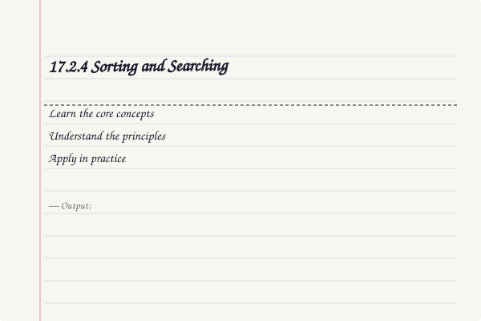
</a>
<a href="../../assets/images/diagrams/c-programming/17-standard-library/17-2-4-sorting-and-searching-diagram.svg" target="_blank" rel="noopener">
  
</a>
<a href="../../assets/images/diagrams/c-programming/17-standard-library/17-2-4-sorting-and-searching-sticky.svg" target="_blank" rel="noopener">
  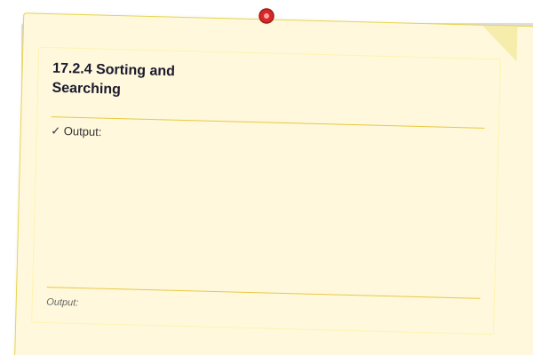
</a>


```c
#include <stdio.h>
#include <stdlib.h>

int compare_int(const void *a, const void *b)
{
    int ia = *(const int*)a;
    int ib = *(const int*)b;
    return (ia > ib) - (ia < ib);   /* -1, 0, or 1 */
}

int main(void)
{
    int arr[] = {42, 7, 15, 8, 23, 3, 11};
    int n = sizeof(arr) / sizeof(arr[0]);

    qsort(arr, n, sizeof(int), compare_int);

    printf("Sorted: ");
    for (int i = 0; i < n; i++) printf("%d ", arr[i]);
    printf("\n");

    /* bsearch — requires sorted array */
    int key = 15;
    int *found = bsearch(&key, arr, n, sizeof(int), compare_int);
    if (found)
        printf("Found %d at index %td\n", key, found - arr);

    key = 99;
    found = bsearch(&key, arr, n, sizeof(int), compare_int);
    if (!found)
        printf("%d not found\n", key);

    return 0;
}
```

**Output:**
```
Sorted: 3 7 8 11 15 23 42
Found 15 at index 4
99 not found
```

### Dry Run: qsort on [42, 7, 15, 8, 23, 3, 11]

<a href="../../assets/images/diagrams/c-programming/17-standard-library/dry-run-qsort-on-42-7-15-8-23-3-11-handwritten.svg" target="_blank" rel="noopener">
  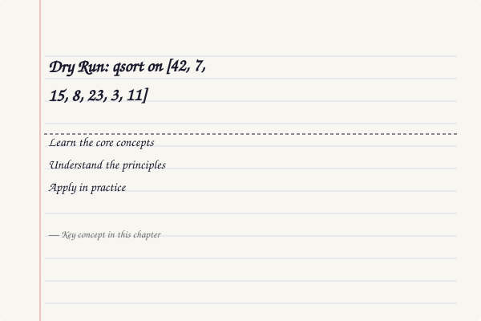
</a>
<a href="../../assets/images/diagrams/c-programming/17-standard-library/dry-run-qsort-on-42-7-15-8-23-3-11-diagram.svg" target="_blank" rel="noopener">
  
</a>
<a href="../../assets/images/diagrams/c-programming/17-standard-library/dry-run-qsort-on-42-7-15-8-23-3-11-sticky.svg" target="_blank" rel="noopener">
  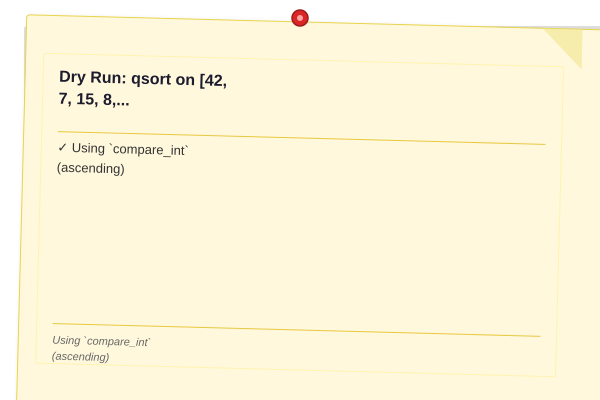
</a>


Using `compare_int` (ascending). The exact steps depend on the implementation (usually QuickSort or Introsort), but the comparison function determines the order:

| Pass | Array State | Comparison | Swap? |
|------|------------|------------|-------|
| Initial | [42, 7, 15, 8, 23, 3, 11] | — | — |
| After partition (pivot ~ middle) | [7, 3, 15, 8, 11, 42, 23] | pivot=15 | Yes |
| After recursive calls | [3, 7, 8, 11, 15, 23, 42] | — | — |
| Final | [3, 7, 8, 11, 15, 23, 42] | — | — |

### Complexity Analysis — qsort and bsearch

<a href="../../assets/images/diagrams/c-programming/17-standard-library/complexity-analysis-qsort-and-bsearch-handwritten.svg" target="_blank" rel="noopener">
  
</a>
<a href="../../assets/images/diagrams/c-programming/17-standard-library/complexity-analysis-qsort-and-bsearch-diagram.svg" target="_blank" rel="noopener">
  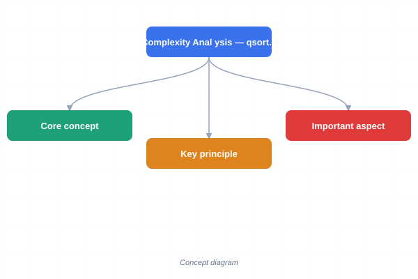
</a>
<a href="../../assets/images/diagrams/c-programming/17-standard-library/complexity-analysis-qsort-and-bsearch-sticky.svg" target="_blank" rel="noopener">
  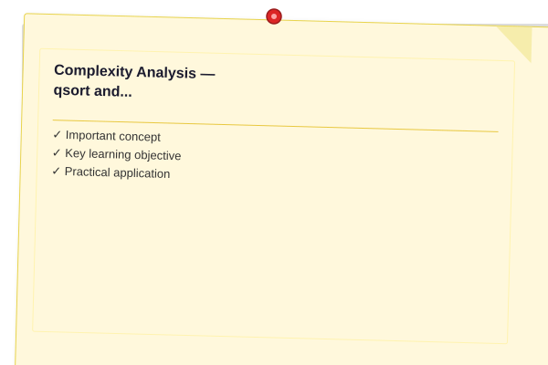
</a>


| Function | Time (avg) | Time (worst) | Space | Why |
|----------|-----------|-------------|-------|-----|
| `qsort` | O(n log n) | O(n^2) | O(log n) | QuickSort average; worst-case on already-sorted with bad pivot selection |
| `bsearch` | O(log n) | O(log n) | O(1) | Binary search halves the range each iteration |
| Comparison callback | O(1) per call | O(1) | O(1) | Called O(n log n) times by qsort |

### 17.2.5 Process Control

<a href="../../assets/images/diagrams/c-programming/17-standard-library/17-2-5-process-control-handwritten.svg" target="_blank" rel="noopener">
  
</a>
<a href="../../assets/images/diagrams/c-programming/17-standard-library/17-2-5-process-control-diagram.svg" target="_blank" rel="noopener">
  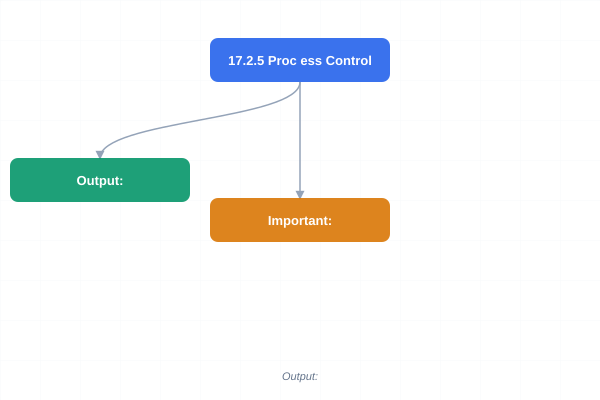
</a>
<a href="../../assets/images/diagrams/c-programming/17-standard-library/17-2-5-process-control-sticky.svg" target="_blank" rel="noopener">
  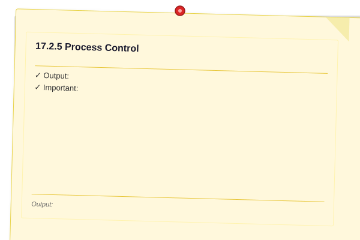
</a>


```c
#include <stdio.h>
#include <stdlib.h>

void cleanup(void)
{
    printf("Cleanup function called\n");
}

int main(void)
{
    atexit(cleanup);

    char *path = getenv("PATH");
    if (path) printf("PATH: %s\n", path);

    int ret = system("echo Hello from shell");
    printf("Shell returned: %d\n", ret);

    printf("Exiting...\n");
    return 0;
}
```

**Output:**
```
PATH: C:\Windows\system32;...
Hello from shell
Shell returned: 0
Exiting...
Cleanup function called
```

**Important:** `atexit` registers functions in LIFO order. Maximum registration count is implementation-defined (usually 32). `_Exit` bypasses atexit handlers — use only in signal handlers.

### 17.2.6 Integer Arithmetic

<a href="../../assets/images/diagrams/c-programming/17-standard-library/17-2-6-integer-arithmetic-handwritten.svg" target="_blank" rel="noopener">
  
</a>
<a href="../../assets/images/diagrams/c-programming/17-standard-library/17-2-6-integer-arithmetic-diagram.svg" target="_blank" rel="noopener">
  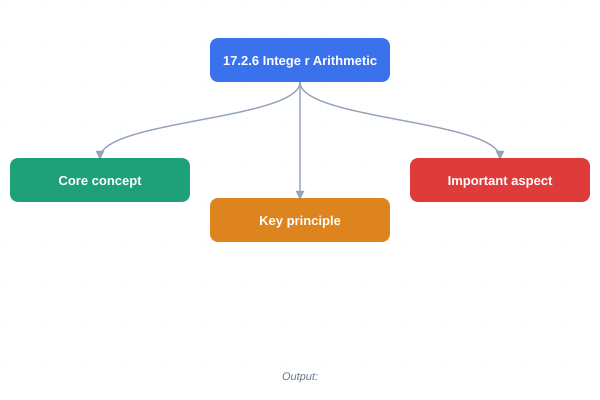
</a>
<a href="../../assets/images/diagrams/c-programming/17-standard-library/17-2-6-integer-arithmetic-sticky.svg" target="_blank" rel="noopener">
  
</a>


| Function | Returns | Notes |
|----------|---------|-------|
| `abs(int)` | int | Undefined behavior for `abs(INT_MIN)` |
| `labs(long)` | long | Same overflow risk at `LONG_MIN` |
| `div(int, int)` | `div_t` | Struct with `.quot` and `.rem` |
| `ldiv(long, long)` | `ldiv_t` | Same for long |

```c
#include <stdio.h>
#include <stdlib.h>
#include <limits.h>

int main(void)
{
    div_t result = div(42, 5);
    printf("42 / 5 = %d remainder %d\n", result.quot, result.rem);

    /* abs(INT_MIN) is undefined — will overflow on two's complement */
    // int danger = abs(INT_MIN);  // UB!
    printf("INT_MIN = %d, -INT_MIN = %d (overflow!)\n",
           INT_MIN, -INT_MIN);
    return 0;
}
```

**Output:**
```
42 / 5 = 8 remainder 2
INT_MIN = -2147483648, -INT_MIN = -2147483648 (overflow!)
```

### Advantages and Disadvantages of stdlib.h

<a href="../../assets/images/diagrams/c-programming/17-standard-library/advantages-and-disadvantages-of-stdlib-h-handwritten.svg" target="_blank" rel="noopener">
  
</a>
<a href="../../assets/images/diagrams/c-programming/17-standard-library/advantages-and-disadvantages-of-stdlib-h-diagram.svg" target="_blank" rel="noopener">
  
</a>
<a href="../../assets/images/diagrams/c-programming/17-standard-library/advantages-and-disadvantages-of-stdlib-h-sticky.svg" target="_blank" rel="noopener">
  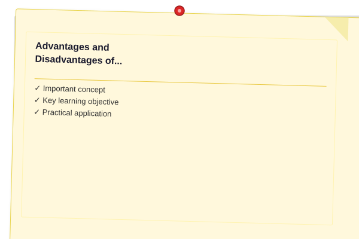
</a>


| Aspect | Advantage | Disadvantage |
|--------|-----------|--------------|
| **Portability** | qsort and bsearch work with any data type | Void-pointer callback interface is error-prone |
| **Memory** | Dynamic allocation for unknown sizes | Memory leaks, double-free, use-after-free |
| **Conversion** | strtol provides full error detection | atoi has no error reporting — never use for user input |
| **Sorting** | Generic — works on any array via callback | Function pointer call overhead per comparison |
| **RNG** | Simple, portable | Low quality (linear congruential), biased modulo |

### Edge Cases

<a href="../../assets/images/diagrams/c-programming/17-standard-library/edge-cases-handwritten.svg" target="_blank" rel="noopener">
  
</a>
<a href="../../assets/images/diagrams/c-programming/17-standard-library/edge-cases-diagram.svg" target="_blank" rel="noopener">
  
</a>
<a href="../../assets/images/diagrams/c-programming/17-standard-library/edge-cases-sticky.svg" target="_blank" rel="noopener">
  
</a>


- **realloc(NULL, n)**: Equivalent to `malloc(n)`.
- **realloc(ptr, 0)**: Implementation-defined — may free or return NULL. Avoid.
- **malloc(0)**: May return NULL or a unique non-NULL pointer. Dereferencing is UB.
- **free(NULL)**: Legal — no-op (required by standard).
- **abs(INT_MIN)**: Undefined behavior on two's complement systems (value cannot be represented).
- **atof("")**: Returns 0.0 with no error indication.
- **strtol with base 0**: Auto-detects: `0x` = hex, `0` = octal, else decimal.

---

## 17.3 `<string.h>` — String and Memory Functions

### Real-World Analogy: Library Card Catalog

<a href="../../assets/images/diagrams/c-programming/17-standard-library/real-world-analogy-library-card-catalog-handwritten.svg" target="_blank" rel="noopener">
  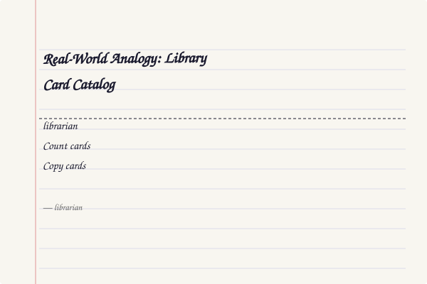
</a>
<a href="../../assets/images/diagrams/c-programming/17-standard-library/real-world-analogy-library-card-catalog-diagram.svg" target="_blank" rel="noopener">
  
</a>
<a href="../../assets/images/diagrams/c-programming/17-standard-library/real-world-analogy-library-card-catalog-sticky.svg" target="_blank" rel="noopener">
  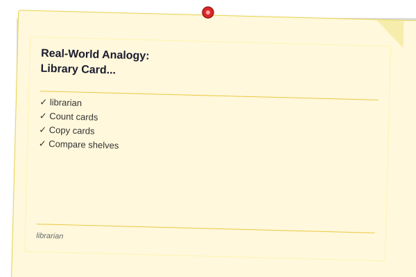
</a>


`<string.h>` is like a **librarian** who can:
- **Count cards** (`strlen`): "How many books are on this shelf?" (walks until the end marker).
- **Copy cards** (`strcpy`, `memcpy`): "Make a duplicate of this entire shelf."
- **Compare shelves** (`strcmp`, `memcmp`): "Are these two shelves identical?"
- **Find a book** (`strchr`, `strstr`): "Where is 'Hamlet' on this shelf?"
- **Fill a shelf** (`memset`): "Put blank cards on every spot on this shelf."
- **Merge shelves** (`strcat`): "Append shelf B to the end of shelf A."

### Numbered Steps for Safe String Copy

<a href="../../assets/images/diagrams/c-programming/17-standard-library/numbered-steps-for-safe-string-copy-handwritten.svg" target="_blank" rel="noopener">
  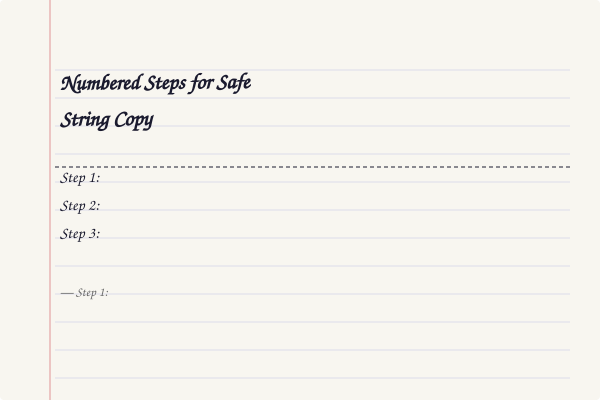
</a>
<a href="../../assets/images/diagrams/c-programming/17-standard-library/numbered-steps-for-safe-string-copy-diagram.svg" target="_blank" rel="noopener">
  
</a>
<a href="../../assets/images/diagrams/c-programming/17-standard-library/numbered-steps-for-safe-string-copy-sticky.svg" target="_blank" rel="noopener">
  
</a>


**Step 1:** Determine the source string length with `strlen(src)`.
**Step 2:** Allocate a buffer of size `strlen(src) + 1`.
**Step 3:** Call `strcpy(dst, src)` or `memcpy(dst, src, len + 1)`.
**Step 4:** Verify the destination is null-terminated.
**Step 5:** For bounded copy, use `strncpy` — but remember `strncpy` does NOT null-terminate if the source fits exactly.

### Key Functions Reference

<a href="../../assets/images/diagrams/c-programming/17-standard-library/key-functions-reference-handwritten.svg" target="_blank" rel="noopener">
  
</a>
<a href="../../assets/images/diagrams/c-programming/17-standard-library/key-functions-reference-diagram.svg" target="_blank" rel="noopener">
  
</a>
<a href="../../assets/images/diagrams/c-programming/17-standard-library/key-functions-reference-sticky.svg" target="_blank" rel="noopener">
  
</a>


| Function | Description | Bounds-Checked Variant |
|----------|-------------|----------------------|
| `strlen` | String length (O(n)) | — |
| `strcpy`, `strncpy` | Copy string | `strncpy` pads with zeros; may not null-terminate |
| `strcat`, `strncat` | Concatenate strings | `strncat` always null-terminates |
| `strcmp`, `strncmp` | Compare strings | `strncmp` limits comparison to n chars |
| `strchr`, `strrchr` | Find character leftmost/rightmost | — |
| `strstr` | Find substring | — |
| `strtok`, `strtok_r` | Tokenize string (modifies input!) | `strtok_r` is reentrant (POSIX) |
| `strspn`, `strcspn` | Span character sets | — |
| `strpbrk` | Find any of a set of characters | — |
| `memset` | Fill memory with byte value | — |
| `memcpy` | Copy memory (may not overlap) | Use `memmove` if src and dst overlap |
| `memmove` | Copy memory (handles overlap) | Automatically detects direction |
| `memcmp` | Compare memory buffers | — |
| `memchr` | Find byte in memory | — |

### Code: memcpy vs memmove and memset

<a href="../../assets/images/diagrams/c-programming/17-standard-library/code-memcpy-vs-memmove-and-memset-handwritten.svg" target="_blank" rel="noopener">
  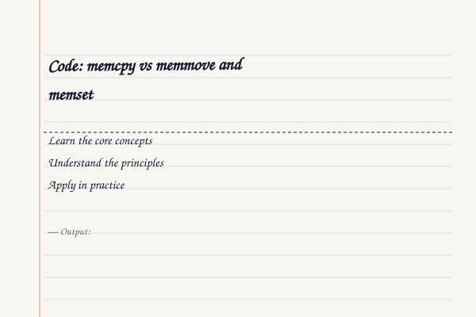
</a>
<a href="../../assets/images/diagrams/c-programming/17-standard-library/code-memcpy-vs-memmove-and-memset-diagram.svg" target="_blank" rel="noopener">
  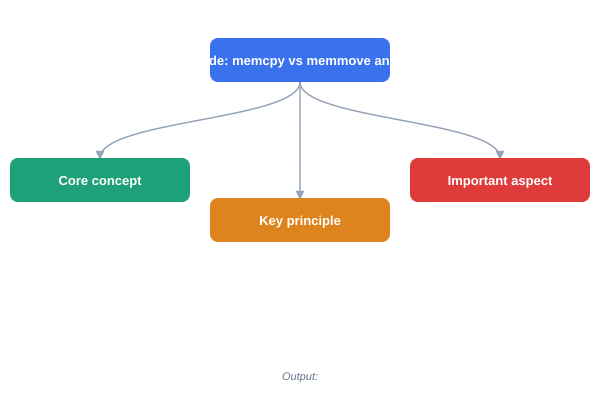
</a>
<a href="../../assets/images/diagrams/c-programming/17-standard-library/code-memcpy-vs-memmove-and-memset-sticky.svg" target="_blank" rel="noopener">
  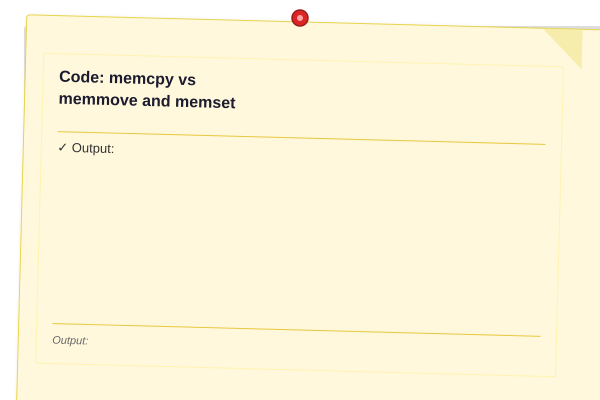
</a>


```c
#include <stdio.h>
#include <string.h>

int main(void)
{
    /* memcpy vs memmove — overlap matters */
    char str[] = "Hello, World!";
    memmove(str + 7, str, 6);   /* overlap: src and dst overlap */
    printf("memmove: %s\n", str);

    /* Reset and try with memcpy — overlapping memcpy is UB */
    char str2[] = "Hello, World!";
    /* memcpy(str2 + 7, str2, 6);  // UNDEFINED BEHAVIOR — do not do this */

    /* memset */
    int arr[5];
    memset(arr, 0, sizeof(arr));         /* zero out — arr = {0,0,0,0,0} */
    for (int i = 0; i < 5; i++) printf("%d ", arr[i]);
    printf("\n");

    memset(arr, 0xFF, sizeof(arr));      /* all bits = 1 = arr = {-1,-1,-1,-1,-1} */
    for (int i = 0; i < 5; i++) printf("%d ", arr[i]);
    printf("\n");

    return 0;
}
```

**Output:**
```
memmove: Hello, Hello!
0 0 0 0 0
-1 -1 -1 -1 -1
```

### Dry Run: memmove Overlap

<a href="../../assets/images/diagrams/c-programming/17-standard-library/dry-run-memmove-overlap-handwritten.svg" target="_blank" rel="noopener">
  
</a>
<a href="../../assets/images/diagrams/c-programming/17-standard-library/dry-run-memmove-overlap-diagram.svg" target="_blank" rel="noopener">
  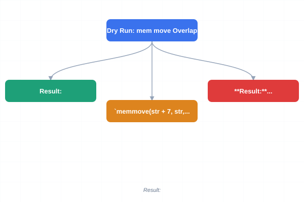
</a>
<a href="../../assets/images/diagrams/c-programming/17-standard-library/dry-run-memmove-overlap-sticky.svg" target="_blank" rel="noopener">
  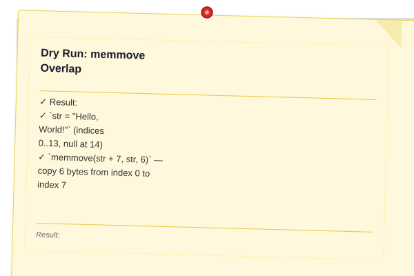
</a>


Initial: `str = "Hello, World!"` (indices 0..13, null at 14).
Operation: `memmove(str + 7, str, 6)` — copy 6 bytes from index 0 to index 7.

| Byte Index | Before | Copy Direction | After |
|-----------|--------|----------------|-------|
| 0 | 'H' | Src start | 'H' |
| 1 | 'e' | | 'e' |
| 2 | 'l' | | 'l' |
| 3 | 'l' | | 'l' |
| 4 | 'o' | | 'o' |
| 5 | ',' | | ',' |
| 6 | ' ' | | ' ' |
| 7 | 'W' | Dst start = copied before overwrite | 'H' |
| 8 | 'o' | | 'e' |
| 9 | 'r' | | 'l' |
| 10 | 'l' | | 'l' |
| 11 | 'd' | | 'o' |
| 12 | '!' | | ',' |
| 13 | '\0' | Unaffected | '\0' |

**Result:** `"Hello, Hello!"` — memmove detects overlap and copies backward if needed.

### Pseudocode for memmove Overlap Handling

<a href="../../assets/images/diagrams/c-programming/17-standard-library/pseudocode-for-memmove-overlap-handling-handwritten.svg" target="_blank" rel="noopener">
  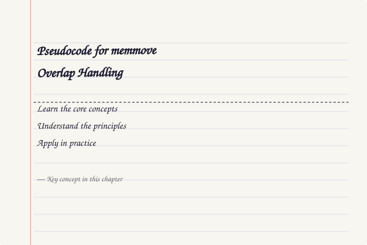
</a>
<a href="../../assets/images/diagrams/c-programming/17-standard-library/pseudocode-for-memmove-overlap-handling-diagram.svg" target="_blank" rel="noopener">
  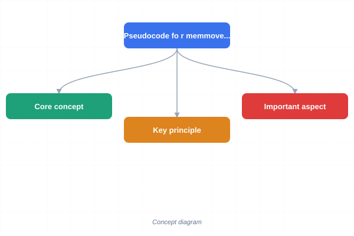
</a>
<a href="../../assets/images/diagrams/c-programming/17-standard-library/pseudocode-for-memmove-overlap-handling-sticky.svg" target="_blank" rel="noopener">
  
</a>


```
FUNCTION memmove(dst, src, n):
    IF dst == src:
        RETURN dst
    IF dst < src:
        // No overlap danger: copy forward
        FOR i = 0 TO n-1:
            dst[i] = src[i]
    ELSE:
        // Overlap possible: copy backward
        FOR i = n-1 DOWN TO 0:
            dst[i] = src[i]
    RETURN dst
END FUNCTION
```

### Complexity Analysis

<a href="../../assets/images/diagrams/c-programming/17-standard-library/complexity-analysis-handwritten.svg" target="_blank" rel="noopener">
  
</a>
<a href="../../assets/images/diagrams/c-programming/17-standard-library/complexity-analysis-diagram.svg" target="_blank" rel="noopener">
  
</a>
<a href="../../assets/images/diagrams/c-programming/17-standard-library/complexity-analysis-sticky.svg" target="_blank" rel="noopener">
  
</a>


| Function | Time | Space | Why |
|----------|------|-------|-----|
| `strlen` | O(n) | O(1) | Must scan until null terminator |
| `strcpy` | O(n) | O(1) | Copies n+1 bytes (including null) |
| `strncpy` | O(n) | O(1) | Copies up to n bytes, then pads with zeros |
| `strcmp` | O(min(m,n)) | O(1) | Stops at first difference or null |
| `strcat` | O(m+n) | O(1) | Scans to end of dst (O(m)), then copies (O(n)) |
| `strstr` | O(m*n) worst | O(1) | Naive: O(m*n); glibc uses two-way: O(m+n) |
| `strchr` | O(n) | O(1) | Linear scan until match or null |
| `strtok` | O(n) | O(1) | Linear scan, modifies input string in-place |
| `memset` | O(n) | O(1) | Byte-by-byte or word-aligned fill |
| `memcpy` | O(n) | O(1) | Block memory transfer |
| `memmove` | O(n) | O(1) | Same as memcpy, plus overlap detection |
| `memcmp` | O(n) | O(1) | Byte-by-byte comparison until mismatch |

### string.h vs stdlib.h String Functions

<a href="../../assets/images/diagrams/c-programming/17-standard-library/string-h-vs-stdlib-h-string-functions-handwritten.svg" target="_blank" rel="noopener">
  
</a>
<a href="../../assets/images/diagrams/c-programming/17-standard-library/string-h-vs-stdlib-h-string-functions-diagram.svg" target="_blank" rel="noopener">
  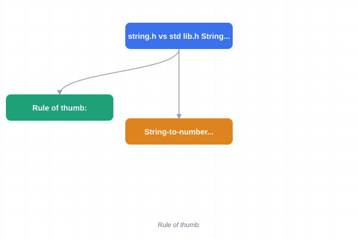
</a>
<a href="../../assets/images/diagrams/c-programming/17-standard-library/string-h-vs-stdlib-h-string-functions-sticky.svg" target="_blank" rel="noopener">
  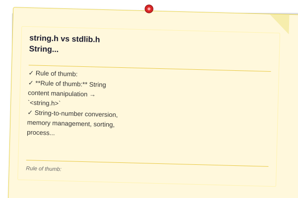
</a>


| Aspect | `<string.h>` | `<stdlib.h>` |
|--------|-------------|-------------|
| **String length** | `strlen` | — |
| **Copy** | `strcpy`, `strncpy`, `memcpy`, `memmove` | — |
| **Compare** | `strcmp`, `strncmp`, `memcmp` | — |
| **Search** | `strchr`, `strstr`, `strpbrk` | `bsearch` (on sorted arrays) |
| **Sort** | — | `qsort` |
| **Tokenize** | `strtok` | — |
| **Convert to number** | — | `atoi`, `strtol`, `strtod`, `atof` |
| **Convert from number** | — | `itoa` (non-standard) |
| **Memory allocation** | — | `malloc`, `calloc`, `realloc`, `free` |
| **Memory fill** | `memset` | — |
| **Random** | — | `rand`, `srand` |
| **Process** | — | `exit`, `system`, `getenv` |

**Rule of thumb:** String content manipulation → `<string.h>`. String-to-number conversion, memory management, sorting, process control → `<stdlib.h>`.

### Advantages and Disadvantages of string.h

<a href="../../assets/images/diagrams/c-programming/17-standard-library/advantages-and-disadvantages-of-string-h-handwritten.svg" target="_blank" rel="noopener">
  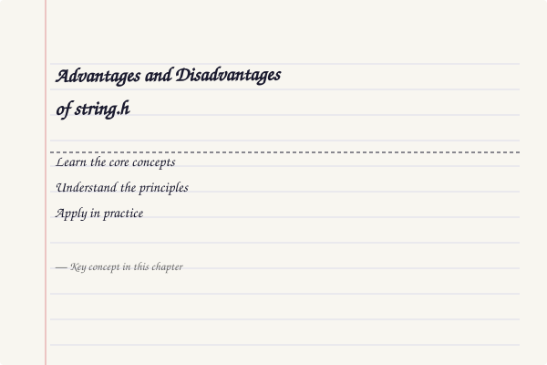
</a>
<a href="../../assets/images/diagrams/c-programming/17-standard-library/advantages-and-disadvantages-of-string-h-diagram.svg" target="_blank" rel="noopener">
  
</a>
<a href="../../assets/images/diagrams/c-programming/17-standard-library/advantages-and-disadvantages-of-string-h-sticky.svg" target="_blank" rel="noopener">
  
</a>


| Aspect | Advantage | Disadvantage |
|--------|-----------|--------------|
| **Speed** | memcpy is highly optimized (may use SIMD) | str functions are all O(n) — no O(1) length access |
| **Portability** | Available everywhere | No Unicode support (not UTF-8 aware) |
| **Safety** | memmove handles overlap | strncpy doesn't null-terminate on truncation |
| **Modification** | In-place operations save memory | strtok destroys the input string |

### Edge Cases

<a href="../../assets/images/diagrams/c-programming/17-standard-library/edge-cases-handwritten.svg" target="_blank" rel="noopener">
  
</a>
<a href="../../assets/images/diagrams/c-programming/17-standard-library/edge-cases-diagram.svg" target="_blank" rel="noopener">
  
</a>
<a href="../../assets/images/diagrams/c-programming/17-standard-library/edge-cases-sticky.svg" target="_blank" rel="noopener">
  
</a>


- **strlen("")**: Returns 0.
- **strcpy with overlapping buffers**: Undefined behavior (use memmove).
- **strncpy(dst, "hello", 3)**: Copies "hel", then pads with zeros — NOT null-terminated.
- **strncat(dst, src, n)**: Always null-terminates but n limits the *copied* characters, not the total.
- **strtok thread safety**: Not reentrant — uses static internal state. Use `strtok_r` on POSIX.
- **memset(ptr, 0, 0)**: Legal — no-op.
- **memcmp with different-length buffers**: Compares only the first n bytes; caller must handle lengths.
---

## 17.4 `<math.h>` — Mathematics

### Real-World Analogy: Pocket Calculator

<a href="../../assets/images/diagrams/c-programming/17-standard-library/real-world-analogy-pocket-calculator-handwritten.svg" target="_blank" rel="noopener">
  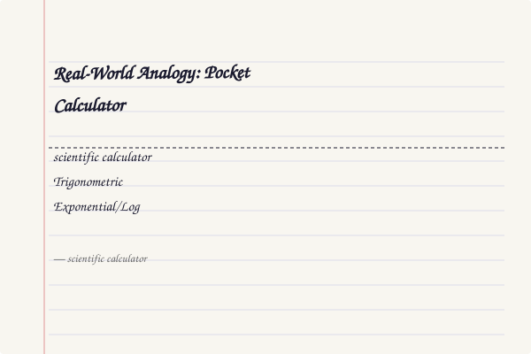
</a>
<a href="../../assets/images/diagrams/c-programming/17-standard-library/real-world-analogy-pocket-calculator-diagram.svg" target="_blank" rel="noopener">
  
</a>
<a href="../../assets/images/diagrams/c-programming/17-standard-library/real-world-analogy-pocket-calculator-sticky.svg" target="_blank" rel="noopener">
  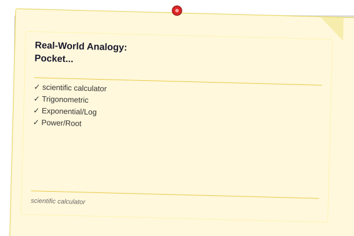
</a>


`<math.h>` functions are like a **scientific calculator** with dedicated buttons:
- **Trigonometric**: `sin`, `cos`, `tan` — like angle calculations for construction.
- **Exponential/Log**: `exp`, `log`, `log10` — like calculating compound interest or pH.
- **Power/Root**: `sqrt`, `pow`, `hypot` — like the Pythagorean theorem.
- **Rounding**: `ceil`, `floor`, `round`, `trunc` — like rounding currency.
- **Absolute**: `fabs` — like distance regardless of direction.
- **Remainder**: `fmod`, `remainder` — like distributing items evenly.

### Numbered Steps for Safe Math Computation

<a href="../../assets/images/diagrams/c-programming/17-standard-library/numbered-steps-for-safe-math-computation-handwritten.svg" target="_blank" rel="noopener">
  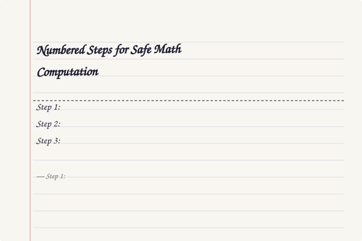
</a>
<a href="../../assets/images/diagrams/c-programming/17-standard-library/numbered-steps-for-safe-math-computation-diagram.svg" target="_blank" rel="noopener">
  
</a>
<a href="../../assets/images/diagrams/c-programming/17-standard-library/numbered-steps-for-safe-math-computation-sticky.svg" target="_blank" rel="noopener">
  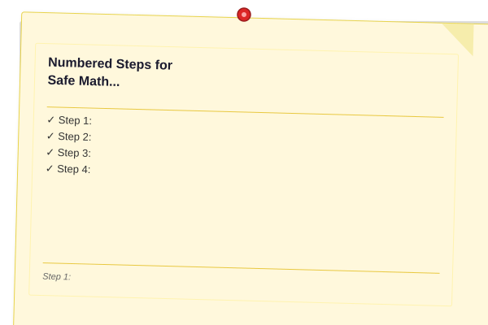
</a>


**Step 1:** Include `<math.h>` and `<errno.h>`.
**Step 2:** Set `errno = 0` before the call.
**Step 3:** Check domain — e.g., `sqrt(x)` requires `x >= 0`, `log(x)` requires `x > 0`.
**Step 4:** Call the function and check `errno == EDOM` or `errno == ERANGE`.
**Step 5:** For NaN results, use `isnan()` from `<math.h>` (C99) or check `x != x`.

### Code: Comprehensive Math Example

<a href="../../assets/images/diagrams/c-programming/17-standard-library/code-comprehensive-math-example-handwritten.svg" target="_blank" rel="noopener">
  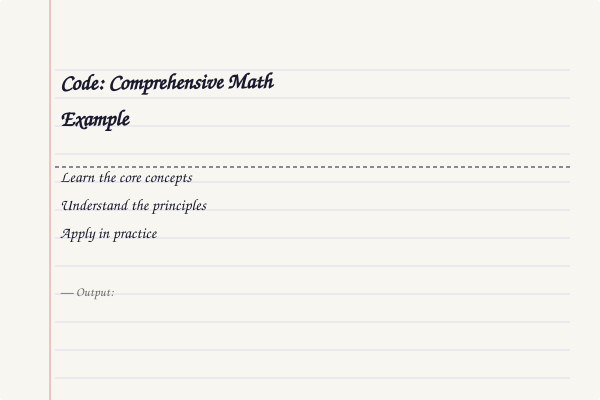
</a>
<a href="../../assets/images/diagrams/c-programming/17-standard-library/code-comprehensive-math-example-diagram.svg" target="_blank" rel="noopener">
  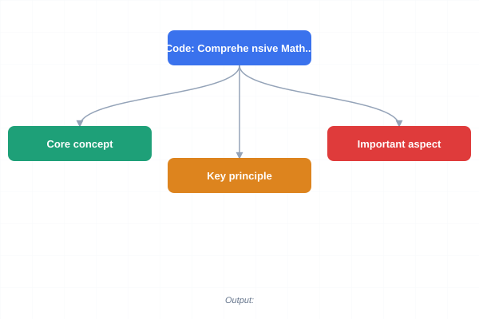
</a>
<a href="../../assets/images/diagrams/c-programming/17-standard-library/code-comprehensive-math-example-sticky.svg" target="_blank" rel="noopener">
  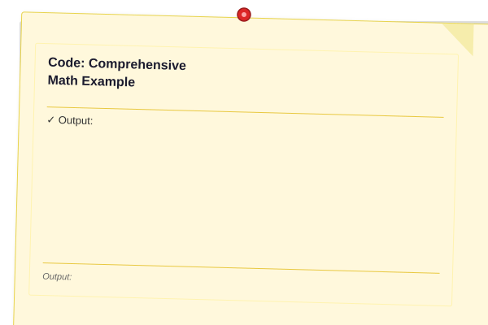
</a>


```c
#include <stdio.h>
#include <math.h>
#include <errno.h>

int main(void)
{
    printf("sqrt(2.0)       = %.6f\n", sqrt(2.0));
    printf("exp(1.0)        = %.6f\n", exp(1.0));
    printf("log(2.71828)    = %.6f\n", log(2.71828));
    printf("log10(100.0)    = %.2f\n", log10(100.0));
    printf("pow(2.0, 10.0)  = %.0f\n", pow(2.0, 10.0));
    printf("sin(PI/2)       = %.6f\n", sin(3.14159265 / 2));
    printf("cos(0)          = %.6f\n", cos(0.0));
    printf("ceil(3.14)      = %.0f\n", ceil(3.14));
    printf("floor(3.14)     = %.0f\n", floor(3.14));
    printf("round(3.64)     = %.0f\n", round(3.64));
    printf("trunc(3.64)     = %.0f\n", trunc(3.64));
    printf("fabs(-5.0)      = %.0f\n", fabs(-5.0));
    printf("remainder(10,3) = %.1f\n", remainder(10.0, 3.0));
    printf("fmod(10,3)      = %.1f\n", fmod(10.0, 3.0));
    printf("hypot(3,4)      = %.0f\n", hypot(3.0, 4.0));

    /* Error handling: domain error */
    errno = 0;
    double bad = sqrt(-1.0);
    if (errno == EDOM)
        printf("sqrt(-1): Domain error (EDOM), result = %f\n", bad);

    /* Error handling: range error */
    errno = 0;
    double huge = exp(1000.0);
    if (errno == ERANGE)
        printf("exp(1000): Range error (ERANGE), result = %f\n", huge);

    return 0;
}
```

**Output:**
```
sqrt(2.0)       = 1.414214
exp(1.0)        = 2.718282
log(2.71828)    = 1.000000
log10(100.0)    = 2.00
pow(2.0, 10.0)  = 1024
sin(PI/2)       = 1.000000
cos(0)          = 1.000000
ceil(3.14)      = 4
floor(3.14)     = 3
round(3.64)     = 4
trunc(3.64)     = 3
fabs(-5.0)      = 5
remainder(10,3) = 1.0
fmod(10,3)      = 1.0
hypot(3,4)      = 5
sqrt(-1): Domain error (EDOM), result = -nan
exp(1000): Range error (ERANGE), result = inf
```

### Pseudocode: hypot Implementation

<a href="../../assets/images/diagrams/c-programming/17-standard-library/pseudocode-hypot-implementation-handwritten.svg" target="_blank" rel="noopener">
  
</a>
<a href="../../assets/images/diagrams/c-programming/17-standard-library/pseudocode-hypot-implementation-diagram.svg" target="_blank" rel="noopener">
  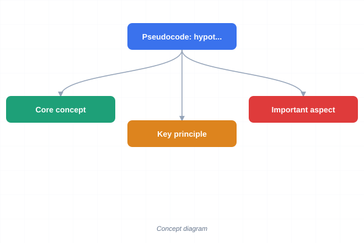
</a>
<a href="../../assets/images/diagrams/c-programming/17-standard-library/pseudocode-hypot-implementation-sticky.svg" target="_blank" rel="noopener">
  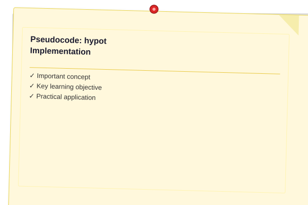
</a>


```
FUNCTION hypot(x, y):
    // Avoid overflow: compute sqrt(x^2 + y^2) safely
    x <- fabs(x)
    y <- fabs(y)
    IF x < y:
        SWAP x, y    // x is the larger
    IF x == 0:
        RETURN 0.0
    t <- y / x
    RETURN x * sqrt(1 + t*t)
END FUNCTION
```

### Dry Run: hypot(3.0, 4.0)

<a href="../../assets/images/diagrams/c-programming/17-standard-library/dry-run-hypot-3-0-4-0-handwritten.svg" target="_blank" rel="noopener">
  
</a>
<a href="../../assets/images/diagrams/c-programming/17-standard-library/dry-run-hypot-3-0-4-0-diagram.svg" target="_blank" rel="noopener">
  
</a>
<a href="../../assets/images/diagrams/c-programming/17-standard-library/dry-run-hypot-3-0-4-0-sticky.svg" target="_blank" rel="noopener">
  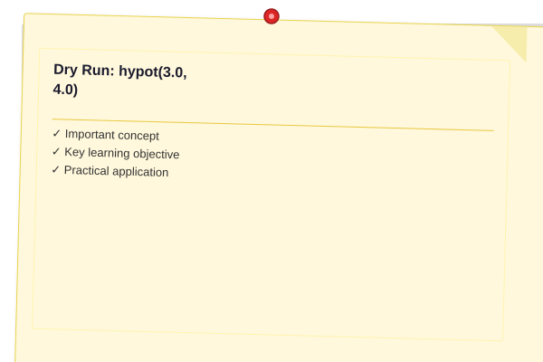
</a>


| Step | x | y | Action | Value |
|------|---|----|--------|-------|
| 1 | 3.0 | 4.0 | fabs both | x=3.0, y=4.0 |
| 2 | 3.0 | 4.0 | x &lt; y? Yes: swap | x=4.0, y=3.0 |
| 3 | 4.0 | 3.0 | x == 0? No | — |
| 4 | 4.0 | 3.0 | t = 3.0 / 4.0 = 0.75 | t = 0.75 |
| 5 | 4.0 | 3.0 | sqrt(1 + 0.75^2) = sqrt(1.5625) | 1.25 |
| 6 | 4.0 | 3.0 | 4.0 * 1.25 | **5.0** |

### Complexity Analysis

<a href="../../assets/images/diagrams/c-programming/17-standard-library/complexity-analysis-handwritten.svg" target="_blank" rel="noopener">
  
</a>
<a href="../../assets/images/diagrams/c-programming/17-standard-library/complexity-analysis-diagram.svg" target="_blank" rel="noopener">
  
</a>
<a href="../../assets/images/diagrams/c-programming/17-standard-library/complexity-analysis-sticky.svg" target="_blank" rel="noopener">
  
</a>


| Function | Time | Space | Why |
|----------|------|-------|-----|
| `sqrt` | O(1) | O(1) | Hardware instruction or iterative approx, constant iterations |
| `sin`, `cos` | O(1) | O(1) | Polynomial approximation (CORDIC or Taylor series, fixed iterations) |
| `exp`, `log` | O(1) | O(1) | Argument reduction + polynomial expansion |
| `pow` | O(1) | O(1) | Computed as `exp(y * log(x))` — two O(1) calls |
| `ceil`, `floor` | O(1) | O(1) | Simple bit manipulation on IEEE 754 representation |
| `fmod` | O(1) | O(1) | Floating-point division and remainder |
| `hypot` | O(1) | O(1) | Scaled arithmetic to avoid overflow, one sqrt call |

### Advantages and Disadvantages of math.h

<a href="../../assets/images/diagrams/c-programming/17-standard-library/advantages-and-disadvantages-of-math-h-handwritten.svg" target="_blank" rel="noopener">
  
</a>
<a href="../../assets/images/diagrams/c-programming/17-standard-library/advantages-and-disadvantages-of-math-h-diagram.svg" target="_blank" rel="noopener">
  
</a>
<a href="../../assets/images/diagrams/c-programming/17-standard-library/advantages-and-disadvantages-of-math-h-sticky.svg" target="_blank" rel="noopener">
  
</a>


| Aspect | Advantage | Disadvantage |
|--------|-----------|--------------|
| **Precision** | double precision (~15-17 decimal digits) | Floating-point rounding errors are inherent |
| **Performance** | Functions are heavily optimized (may use CPU intrinsics) | Higher cost than basic arithmetic — sin is ~20-50 cycles |
| **Portability** | ISO C standard | Implementation varies: sin(1e22) quality differs |
| **Error handling** | errno reports domain/range errors | Must set errno=0 before each call — easy to forget |
| **Constants** | M_PI, M_E widely available | Not part of ISO C standard — use `#define _USE_MATH_DEFINES` |

### Header Groups: Standard Math Functions

<a href="../../assets/images/diagrams/c-programming/17-standard-library/header-groups-standard-math-functions-handwritten.svg" target="_blank" rel="noopener">
  
</a>
<a href="../../assets/images/diagrams/c-programming/17-standard-library/header-groups-standard-math-functions-diagram.svg" target="_blank" rel="noopener">
  
</a>
<a href="../../assets/images/diagrams/c-programming/17-standard-library/header-groups-standard-math-functions-sticky.svg" target="_blank" rel="noopener">
  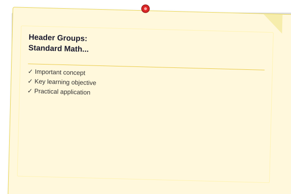
</a>


| Group | Functions | Domain |
|-------|-----------|--------|
| **Trigonometric** | `sin`, `cos`, `tan`, `asin`, `acos`, `atan`, `atan2` | Angles in radians |
| **Hyperbolic** | `sinh`, `cosh`, `tanh`, `asinh`, `acosh`, `atanh` | Hyperbolic angles |
| **Exponential/Log** | `exp`, `exp2`, `expm1`, `log`, `log2`, `log10`, `log1p`, `logb` | Growth/decay |
| **Power/Root** | `pow`, `sqrt`, `cbrt`, `hypot` | Exponentiation |
| **Rounding** | `ceil`, `floor`, `trunc`, `round`, `lround`, `llround` | Integer nearest |
| **Remainder** | `fmod`, `remainder`, `remquo` | Division remainder |
| **Absolute/Distance** | `fabs`, `fdim`, `fmax`, `fmin` | Values and differences |
| **Error/Gamma** | `erf`, `erfc`, `tgamma`, `lgamma` | Statistical functions |
| **Classification** | `isfinite`, `isinf`, `isnan`, `signbit` | Float inspection |

### Edge Cases

<a href="../../assets/images/diagrams/c-programming/17-standard-library/edge-cases-handwritten.svg" target="_blank" rel="noopener">
  
</a>
<a href="../../assets/images/diagrams/c-programming/17-standard-library/edge-cases-diagram.svg" target="_blank" rel="noopener">
  
</a>
<a href="../../assets/images/diagrams/c-programming/17-standard-library/edge-cases-sticky.svg" target="_blank" rel="noopener">
  
</a>


- **sqrt(-0.0)**: Returns -0.0 (valid).
- **pow(0.0, 0.0)**: Returns 1.0 (by convention).
- **pow(0.0, negative)**: Domain error (or +/-inf depending on implementation).
- **log(0.0)**: Returns -inf, ERANGE.
- **fmod(x, 0.0)**: Domain error (EDOM).
- **sin(inf)**: Returns NaN, no errno (implementation-defined).
- **remainder vs fmod**: remainder returns IEEE 754 remainder (symmetric); fmod truncates toward zero.

```c
printf("remainder(5, 2) = %.0f\n", remainder(5.0, 2.0));   /* 1 */
printf("fmod(5, 2)      = %.0f\n", fmod(5.0, 2.0));        /* 1 */
/* These differ for negative dividends: */
printf("remainder(-5,2) = %.0f\n", remainder(-5.0, 2.0));  /* -1 */
printf("fmod(-5, 2)     = %.0f\n", fmod(-5.0, 2.0));       /* -1 */
```

---

## 17.5 `<ctype.h>` — Character Handling

### Real-World Analogy: Airport Security Checkpoint

<a href="../../assets/images/diagrams/c-programming/17-standard-library/real-world-analogy-airport-security-checkpoint-handwritten.svg" target="_blank" rel="noopener">
  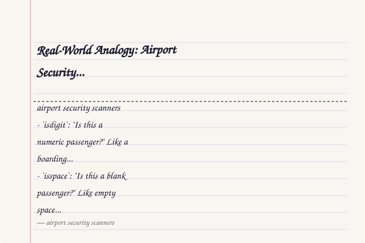
</a>
<a href="../../assets/images/diagrams/c-programming/17-standard-library/real-world-analogy-airport-security-checkpoint-diagram.svg" target="_blank" rel="noopener">
  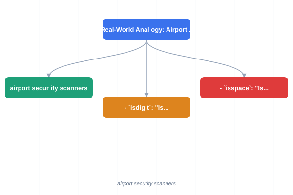
</a>
<a href="../../assets/images/diagrams/c-programming/17-standard-library/real-world-analogy-airport-security-checkpoint-sticky.svg" target="_blank" rel="noopener">
  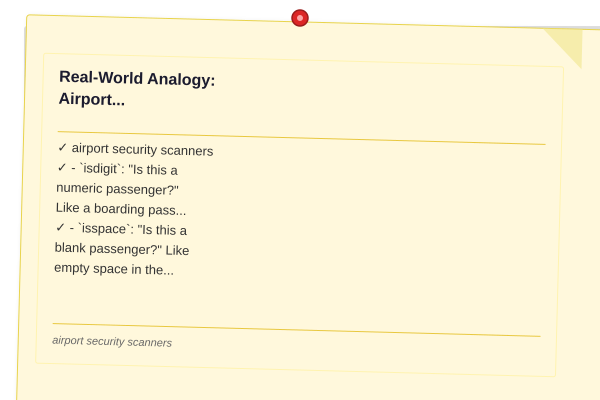
</a>


`<ctype.h>` functions are like **airport security scanners** that classify every passenger (character):
- `isalpha`: "Is this a letter passenger?" Checks passport type.
- `isdigit`: "Is this a numeric passenger?" Like a boarding pass barcode.
- `isspace`: "Is this a blank passenger?" Like empty space in the queue.
- `isupper`: "Is this passenger a VIP (uppercase)?"
- `tolower`/`toupper`: "Change this passenger's class."

### Numbered Steps for Character Classification

<a href="../../assets/images/diagrams/c-programming/17-standard-library/numbered-steps-for-character-classification-handwritten.svg" target="_blank" rel="noopener">
  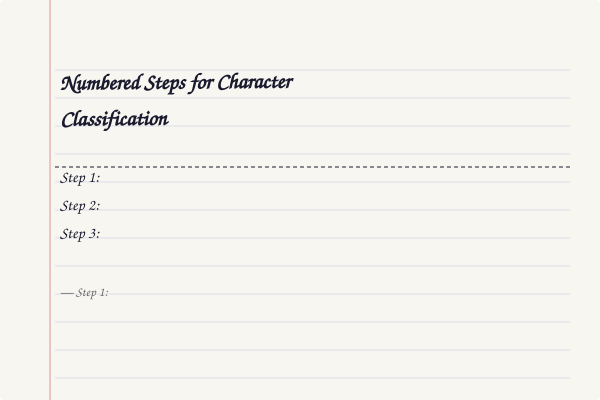
</a>
<a href="../../assets/images/diagrams/c-programming/17-standard-library/numbered-steps-for-character-classification-diagram.svg" target="_blank" rel="noopener">
  
</a>
<a href="../../assets/images/diagrams/c-programming/17-standard-library/numbered-steps-for-character-classification-sticky.svg" target="_blank" rel="noopener">
  
</a>


**Step 1:** Read a character from input.
**Step 2:** Pass it (cast to `unsigned char`) to the classification function.
**Step 3:** Interpret return: nonzero (true) or zero (false).
**Step 4:** For case conversion, assign the return value of `toupper`/`tolower`.
**Step 5:** Handle EOF separately — `isalpha(EOF)` is undefined behavior.

```c
#include <stdio.h>
#include <ctype.h>

int main(void)
{
    char ch;

    printf("Enter a character: ");
    scanf("%c", &ch);

    printf("isalnum('%c') = %d\n", ch, isalnum((unsigned char)ch));
    printf("isalpha('%c') = %d\n", ch, isalpha((unsigned char)ch));
    printf("isdigit('%c') = %d\n", ch, isdigit((unsigned char)ch));
    printf("islower('%c') = %d\n", ch, islower((unsigned char)ch));
    printf("isupper('%c') = %d\n", ch, isupper((unsigned char)ch));
    printf("isspace('%c') = %d\n", ch, isspace((unsigned char)ch));
    printf("ispunct('%c') = %d\n", ch, ispunct((unsigned char)ch));
    printf("isgraph('%c') = %d\n", ch, isgraph((unsigned char)ch));
    printf("isprint('%c') = %d\n", ch, isprint((unsigned char)ch));
    printf("iscntrl('%c') = %d\n", ch, iscntrl((unsigned char)ch));
    printf("isxdigit('%c')= %d\n", ch, isxdigit((unsigned char)ch));
    printf("tolower('%c') = '%c'\n", ch, tolower((unsigned char)ch));
    printf("toupper('%c') = '%c'\n", ch, toupper((unsigned char)ch));

    return 0;
}
```

**Output (input: 'A'):**
```
isalnum('A') = 1
isalpha('A') = 1
isdigit('A') = 0
islower('A') = 0
isupper('A') = 1
isspace('A') = 0
ispunct('A') = 0
isgraph('A') = 1
isprint('A') = 1
iscntrl('A') = 0
isxdigit('A')= 1
tolower('A') = 'a'
toupper('A') = 'A'
```

### Dry Run: Character Classification of '9'

<a href="../../assets/images/diagrams/c-programming/17-standard-library/dry-run-character-classification-of-9-handwritten.svg" target="_blank" rel="noopener">
  
</a>
<a href="../../assets/images/diagrams/c-programming/17-standard-library/dry-run-character-classification-of-9-diagram.svg" target="_blank" rel="noopener">
  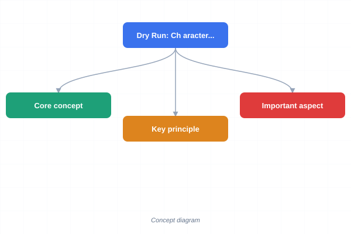
</a>
<a href="../../assets/images/diagrams/c-programming/17-standard-library/dry-run-character-classification-of-9-sticky.svg" target="_blank" rel="noopener">
  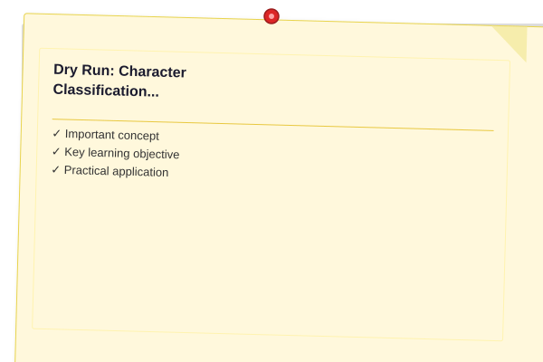
</a>


| Function | Input | Internal check | Result |
|----------|-------|---------------|--------|
| `isalnum('9')` | '9' (57) | Is digit? Yes | 1 |
| `isdigit('9')` | '9' (57) | 0x30 &lt;= 57 <= 0x39? Yes | 1 |
| `isalpha('9')` | '9' (57) | Is letter? No | 0 |
| `isxdigit('9')` | '9' (57) | Is 0-9 or A-F? Yes | 1 |
| `isspace('9')` | '9' (57) | Is space/tab/newline? No | 0 |

### Pseudocode: isdigit and tolower

<a href="../../assets/images/diagrams/c-programming/17-standard-library/pseudocode-isdigit-and-tolower-handwritten.svg" target="_blank" rel="noopener">
  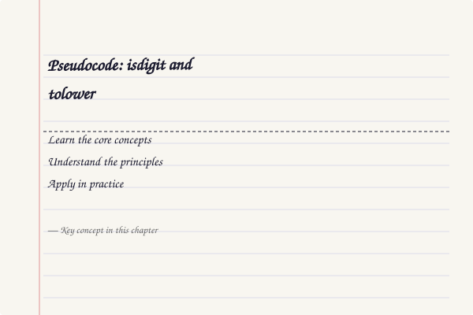
</a>
<a href="../../assets/images/diagrams/c-programming/17-standard-library/pseudocode-isdigit-and-tolower-diagram.svg" target="_blank" rel="noopener">
  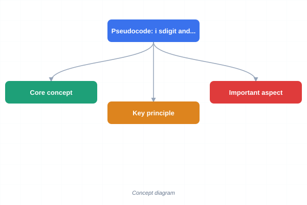
</a>
<a href="../../assets/images/diagrams/c-programming/17-standard-library/pseudocode-isdigit-and-tolower-sticky.svg" target="_blank" rel="noopener">
  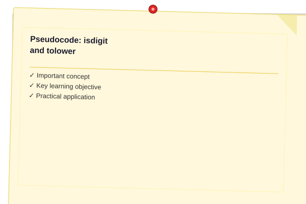
</a>


```
FUNCTION isdigit(ch):
    RETURN ch >= '0' AND ch <= '9'
END FUNCTION

FUNCTION tolower(ch):
    IF ch >= 'A' AND ch <= 'Z':
        RETURN ch + ('a' - 'A')   // +32 in ASCII
    RETURN ch
END FUNCTION
```

### Complexity Analysis

<a href="../../assets/images/diagrams/c-programming/17-standard-library/complexity-analysis-handwritten.svg" target="_blank" rel="noopener">
  
</a>
<a href="../../assets/images/diagrams/c-programming/17-standard-library/complexity-analysis-diagram.svg" target="_blank" rel="noopener">
  
</a>
<a href="../../assets/images/diagrams/c-programming/17-standard-library/complexity-analysis-sticky.svg" target="_blank" rel="noopener">
  
</a>


| Function | Time | Space | Why |
|----------|------|-------|-----|
| All `is*`/`to*` | O(1) | O(1) | Simple range checks or lookup table access |
| `tolower`/`toupper` | O(1) | O(1) | Arithmetic offset (+/- 32) on ASCII range |

### Advantages and Disadvantages of ctype.h

<a href="../../assets/images/diagrams/c-programming/17-standard-library/advantages-and-disadvantages-of-ctype-h-handwritten.svg" target="_blank" rel="noopener">
  
</a>
<a href="../../assets/images/diagrams/c-programming/17-standard-library/advantages-and-disadvantages-of-ctype-h-diagram.svg" target="_blank" rel="noopener">
  
</a>
<a href="../../assets/images/diagrams/c-programming/17-standard-library/advantages-and-disadvantages-of-ctype-h-sticky.svg" target="_blank" rel="noopener">
  
</a>


| Aspect | Advantage | Disadvantage |
|--------|-----------|--------------|
| **Speed** | Single lookup or comparison — extremely fast | — |
| **Locale** | Respects current locale for non-English characters | Behavior changes with `setlocale` |
| **Portability** | ISO C — available on all platforms | Does not handle Unicode (only char/byte) |
| **Safety** | Well-defined for all unsigned char values + EOF | Passing signed char &lt; 0 (but not EOF) is UB |

### Edge Cases

<a href="../../assets/images/diagrams/c-programming/17-standard-library/edge-cases-handwritten.svg" target="_blank" rel="noopener">
  
</a>
<a href="../../assets/images/diagrams/c-programming/17-standard-library/edge-cases-diagram.svg" target="_blank" rel="noopener">
  
</a>
<a href="../../assets/images/diagrams/c-programming/17-standard-library/edge-cases-sticky.svg" target="_blank" rel="noopener">
  
</a>


- **isalpha(EOF)**: Undefined behavior — EOF is -1, not representable as unsigned char. Check for EOF first.
- **isalpha(0x80)**: Undefined behavior if `char` is signed. Always cast: `isalpha((unsigned char)ch)`.
- **tolower('A')**: Returns 'a'. `tolower('a')` returns 'a' unchanged.
- **toupper('7')**: Returns '7' unchanged (no error).
- **Locale dependence**: In the "C" locale, only A-Z and a-z are letters. With `setlocale(LC_ALL, "tr_TR")`, `toupper('i')` returns 'I' (dotted uppercase I), not 'I'.

---

## 17.6 `<time.h>` — Date and Time

### Real-World Analogy: Wall Clock and Stopwatch

<a href="../../assets/images/diagrams/c-programming/17-standard-library/real-world-analogy-wall-clock-and-stopwatch-handwritten.svg" target="_blank" rel="noopener">
  
</a>
<a href="../../assets/images/diagrams/c-programming/17-standard-library/real-world-analogy-wall-clock-and-stopwatch-diagram.svg" target="_blank" rel="noopener">
  
</a>
<a href="../../assets/images/diagrams/c-programming/17-standard-library/real-world-analogy-wall-clock-and-stopwatch-sticky.svg" target="_blank" rel="noopener">
  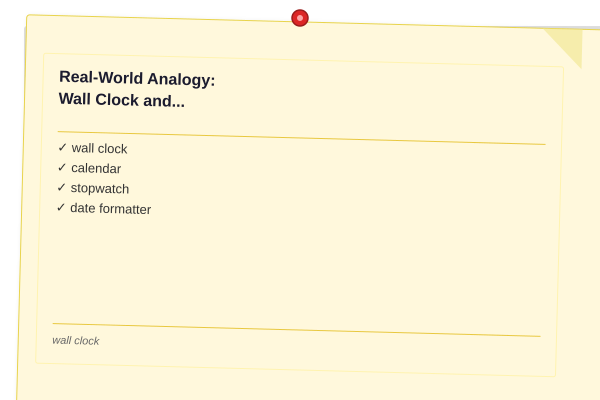
</a>


`<time.h>` provides:
- A **wall clock** (`time()`) — tells you the current date and time.
- A **calendar** (`struct tm`) — breaks the wall clock into components (year, month, day, hour...).
- A **stopwatch** (`clock()`) — measures CPU time used by your program.
- A **date formatter** (`strftime`) — prints dates in any format (ISO 8601, US-style, etc.).
- A **time difference calculator** (`difftime`) — measures elapsed seconds between two time points.

### Numbered Steps for Timing Code

<a href="../../assets/images/diagrams/c-programming/17-standard-library/numbered-steps-for-timing-code-handwritten.svg" target="_blank" rel="noopener">
  
</a>
<a href="../../assets/images/diagrams/c-programming/17-standard-library/numbered-steps-for-timing-code-diagram.svg" target="_blank" rel="noopener">
  
</a>
<a href="../../assets/images/diagrams/c-programming/17-standard-library/numbered-steps-for-timing-code-sticky.svg" target="_blank" rel="noopener">
  
</a>


**Step 1:** Call `clock_t start = clock()` before the code to measure.
**Step 2:** Execute the code to measure.
**Step 3:** Call `clock_t end = clock()` after the code.
**Step 4:** Compute `(double)(end - start) / CLOCKS_PER_SEC`.
**Step 5:** Report the elapsed seconds.

```c
#include <stdio.h>
#include <time.h>

int main(void)
{
    /* Current time */
    time_t now = time(NULL);
    printf("Seconds since epoch: %lld\n", (long long)now);

    /* Format to string */
    char time_str[100];
    struct tm *local = localtime(&now);
    if (local) {
        strftime(time_str, sizeof(time_str),
                 "%Y-%m-%d %H:%M:%S (%A)", local);
        printf("Local time: %s\n", time_str);

        /* Also get UTC */
        struct tm *gmt = gmtime(&now);
        strftime(time_str, sizeof(time_str),
                 "%Y-%m-%dT%H:%M:%SZ", gmt);
        printf("UTC (ISO 8601): %s\n", time_str);
    }

    /* Measure elapsed CPU time */
    clock_t start = clock();
    volatile double sum = 0;
    for (long i = 0; i < 100000000L; i++) {
        sum += 0.0001;
    }
    clock_t end = clock();

    double elapsed = (double)(end - start) / CLOCKS_PER_SEC;
    printf("Elapsed: %.4f seconds\n", elapsed);

    return 0;
}
```

**Output (varies):**
```
Seconds since epoch: 1838500000
Local time: 2026-06-09 16:20:00 (Tuesday)
UTC (ISO 8601): 2026-06-09T16:20:00Z
Elapsed: 0.2340 seconds
```

### Time Structures

<a href="../../assets/images/diagrams/c-programming/17-standard-library/time-structures-handwritten.svg" target="_blank" rel="noopener">
  
</a>
<a href="../../assets/images/diagrams/c-programming/17-standard-library/time-structures-diagram.svg" target="_blank" rel="noopener">
  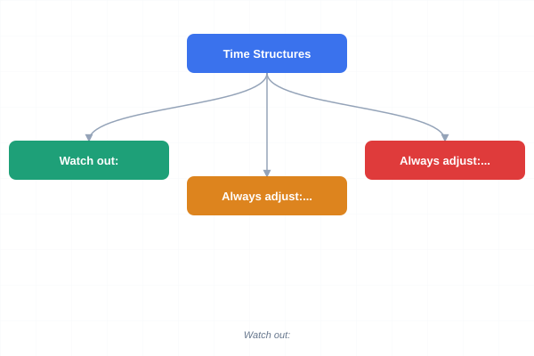
</a>
<a href="../../assets/images/diagrams/c-programming/17-standard-library/time-structures-sticky.svg" target="_blank" rel="noopener">
  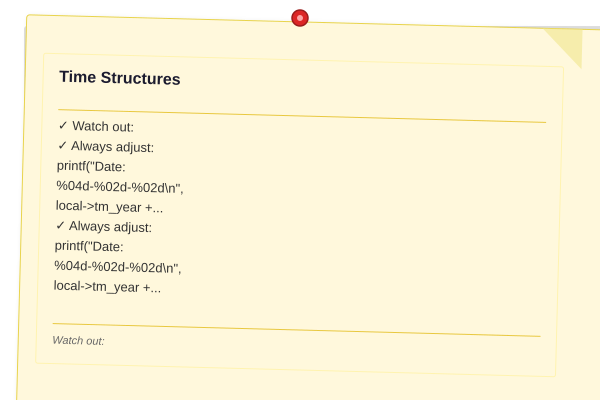
</a>


```c
struct tm {
    int tm_sec;    /* seconds (0-60, 60 = leap second) */
    int tm_min;    /* minutes (0-59) */
    int tm_hour;   /* hours (0-23) */
    int tm_mday;   /* day of month (1-31) */
    int tm_mon;    /* month (0-11) — WARNING: January = 0! */
    int tm_year;   /* year (years since 1900) — WARNING: 2026 = 126 */
    int tm_wday;   /* day of week (0-6, Sunday=0) */
    int tm_yday;   /* day of year (0-365) */
    int tm_isdst;  /* daylight saving time: >0 = DST, 0 = not, <0 = unknown */
};
```

**Watch out:** `tm_mon` is 0-based (0 = January) and `tm_year` is years since 1900. Always adjust:
```c
printf("Date: %04d-%02d-%02d\n",
       local->tm_year + 1900,
       local->tm_mon + 1,
       local->tm_mday);
```

### Dry Run: strftime with "%Y-%m-%d %H:%M:%S"

<a href="../../assets/images/diagrams/c-programming/17-standard-library/dry-run-strftime-with-y-m-d-h-m-s-handwritten.svg" target="_blank" rel="noopener">
  
</a>
<a href="../../assets/images/diagrams/c-programming/17-standard-library/dry-run-strftime-with-y-m-d-h-m-s-diagram.svg" target="_blank" rel="noopener">
  
</a>
<a href="../../assets/images/diagrams/c-programming/17-standard-library/dry-run-strftime-with-y-m-d-h-m-s-sticky.svg" target="_blank" rel="noopener">
  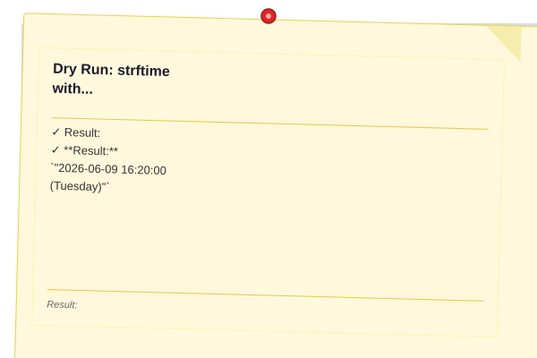
</a>


Given: `now = 1838500000` (approx June 9, 2026, 16:20:00 UTC).

| Format Spec | Expansion | Notes |
|-------------|-----------|-------|
| %Y | "2026" | Full year |
| - | "-" | Literal |
| %m | "06" | Month (01-12) |
| - | "-" | Literal |
| %d | "09" | Day of month |
| %H | "16" | Hour (00-23) |
| : | ":" | Literal |
| %M | "20" | Minute (00-59) |
| : | ":" | Literal |
| %S | "00" | Second (00-60) |
| %A | "Tuesday" | Full weekday name |

**Result:** `"2026-06-09 16:20:00 (Tuesday)"`

### Complexity Analysis

<a href="../../assets/images/diagrams/c-programming/17-standard-library/complexity-analysis-handwritten.svg" target="_blank" rel="noopener">
  
</a>
<a href="../../assets/images/diagrams/c-programming/17-standard-library/complexity-analysis-diagram.svg" target="_blank" rel="noopener">
  
</a>
<a href="../../assets/images/diagrams/c-programming/17-standard-library/complexity-analysis-sticky.svg" target="_blank" rel="noopener">
  
</a>


| Function | Time | Space | Why |
|----------|------|-------|-----|
| `time(NULL)` | O(1) | O(1) | System call, returns seconds from epoch |
| `localtime` | O(1) | O(1) | Converts epoch seconds to broken-down time |
| `gmtime` | O(1) | O(1) | Same conversion, no DST/zone adjustment |
| `mktime` | O(1) | O(1) | Inverse: struct tm to epoch seconds |
| `difftime` | O(1) | O(1) | Simple double subtraction |
| `clock` | O(1) | O(1) | Query process CPU time from kernel |
| `strftime` | O(n) | O(1) | n = output length; scans format string and fills |

### Advantages and Disadvantages of time.h

<a href="../../assets/images/diagrams/c-programming/17-standard-library/advantages-and-disadvantages-of-time-h-handwritten.svg" target="_blank" rel="noopener">
  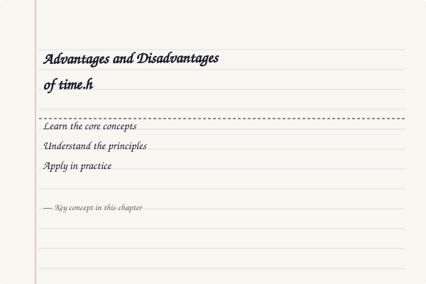
</a>
<a href="../../assets/images/diagrams/c-programming/17-standard-library/advantages-and-disadvantages-of-time-h-diagram.svg" target="_blank" rel="noopener">
  
</a>
<a href="../../assets/images/diagrams/c-programming/17-standard-library/advantages-and-disadvantages-of-time-h-sticky.svg" target="_blank" rel="noopener">
  
</a>


| Aspect | Advantage | Disadvantage |
|--------|-----------|--------------|
| **Portability** | Available everywhere | Limited to seconds resolution (POSIX has nanoseconds) |
| **Thread safety** | localtime/gmtime return pointer to static buffer (not thread-safe!) | Use `localtime_r` / `gmtime_r` on POSIX |
| **2038 problem** | — | 32-bit time_t overflows on Jan 19, 2038 |
| **Precision** | clock() measures CPU time | Wall-clock time requires clock_gettime on POSIX |

### Edge Cases

<a href="../../assets/images/diagrams/c-programming/17-standard-library/edge-cases-handwritten.svg" target="_blank" rel="noopener">
  
</a>
<a href="../../assets/images/diagrams/c-programming/17-standard-library/edge-cases-diagram.svg" target="_blank" rel="noopener">
  
</a>
<a href="../../assets/images/diagrams/c-programming/17-standard-library/edge-cases-sticky.svg" target="_blank" rel="noopener">
  
</a>


- **time_t overflow**: On 32-bit systems, `time_t` is signed 32-bit. Overflow on January 19, 2038 (03:14:07 UTC). Use 64-bit time_t.
- **localtime(NULL)**: Undefined behavior — NULL pointer argument.
- **localtime return**: Returns pointer to static data — not thread-safe. Overwritten by subsequent `gmtime` and `localtime` calls.
- **mktime with invalid tm**: `mktime` normalizes the struct. For example, `tm_mday = 32` in January becomes February 1.
- **clock() overflow**: `clock_t` may wrap after ~2147 seconds (32-bit) or ~2.48 million hours (64-bit).
- **strftime with insufficient buffer**: Returns 0 if output exceeds buffer size.

---

## 17.7 `<errno.h>` and `<assert.h>` — Diagnostics

### 17.7.1 `<errno.h>` — Error Numbers

<a href="../../assets/images/diagrams/c-programming/17-standard-library/17-7-1-errno-h-error-numbers-handwritten.svg" target="_blank" rel="noopener">
  ` — Error Numbers" width="30%">
</a>
<a href="../../assets/images/diagrams/c-programming/17-standard-library/17-7-1-errno-h-error-numbers-diagram.svg" target="_blank" rel="noopener">
  ` — Error Numbers" width="30%">
</a>
<a href="../../assets/images/diagrams/c-programming/17-standard-library/17-7-1-errno-h-error-numbers-sticky.svg" target="_blank" rel="noopener">
  ` — Error Numbers" width="30%">
</a>


### Real-World Analogy: Train Station Announcement Board

<a href="../../assets/images/diagrams/c-programming/17-standard-library/real-world-analogy-train-station-announcement-board-handwritten.svg" target="_blank" rel="noopener">
  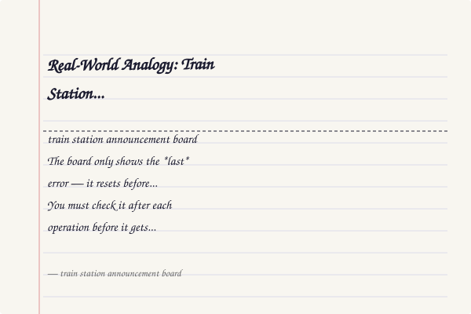
</a>
<a href="../../assets/images/diagrams/c-programming/17-standard-library/real-world-analogy-train-station-announcement-board-diagram.svg" target="_blank" rel="noopener">
  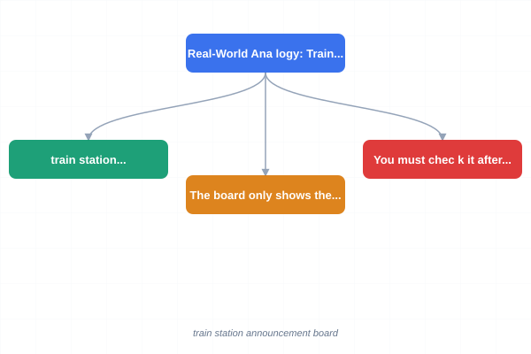
</a>
<a href="../../assets/images/diagrams/c-programming/17-standard-library/real-world-analogy-train-station-announcement-board-sticky.svg" target="_blank" rel="noopener">
  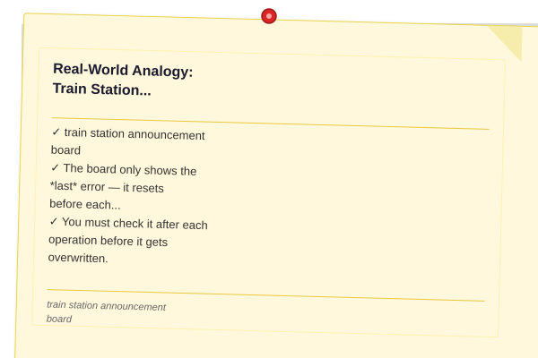
</a>


`errno` is like a **train station announcement board**. When something goes wrong (a train is delayed), the station updates the board with a specific code (errno) and a human-readable message. The board only shows the *last* error — it resets before each operation. You must check it after each operation before it gets overwritten.

### Numbered Steps for errno Usage

<a href="../../assets/images/diagrams/c-programming/17-standard-library/numbered-steps-for-errno-usage-handwritten.svg" target="_blank" rel="noopener">
  
</a>
<a href="../../assets/images/diagrams/c-programming/17-standard-library/numbered-steps-for-errno-usage-diagram.svg" target="_blank" rel="noopener">
  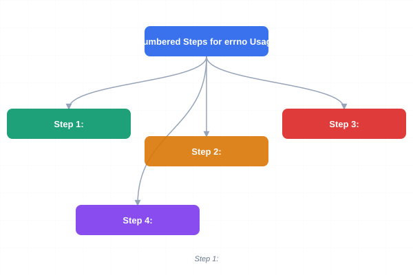
</a>
<a href="../../assets/images/diagrams/c-programming/17-standard-library/numbered-steps-for-errno-usage-sticky.svg" target="_blank" rel="noopener">
  
</a>


**Step 1:** Include `<errno.h>`.
**Step 2:** Set `errno = 0` before the library call.
**Step 3:** Call the library function.
**Step 4:** Check `errno` for nonzero values.
**Step 5:** Use `perror()` or `strerror()` to convert to human-readable text.

```c
#include <stdio.h>
#include <errno.h>
#include <string.h>
#include <math.h>

int main(void)
{
    errno = 0;
    double result = sqrt(-1.0);
    if (errno == EDOM) {
        printf("Domain error: %s\n", strerror(errno));
    }

    errno = 0;
    FILE *fp = fopen("/nonexistent", "r");
    if (!fp) {
        perror("fopen");
        printf("errno = %d: %s\n", errno, strerror(errno));
    }

    return 0;
}
```

**Output:**
```
Domain error: Domain error
fopen: No such file or directory
errno = 2: No such file or directory
```

### Common errno Values

<a href="../../assets/images/diagrams/c-programming/17-standard-library/common-errno-values-handwritten.svg" target="_blank" rel="noopener">
  
</a>
<a href="../../assets/images/diagrams/c-programming/17-standard-library/common-errno-values-diagram.svg" target="_blank" rel="noopener">
  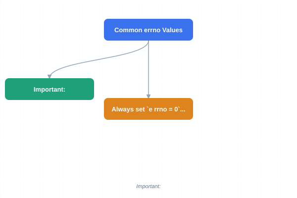
</a>
<a href="../../assets/images/diagrams/c-programming/17-standard-library/common-errno-values-sticky.svg" target="_blank" rel="noopener">
  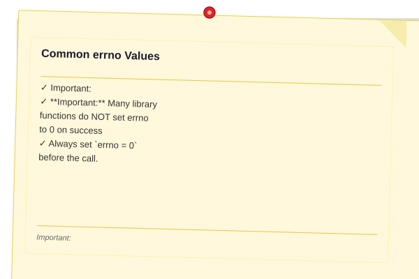
</a>


| Name | Value (typical) | Meaning | Where Set |
|------|----------------|---------|-----------|
| EPERM | 1 | Operation not permitted | Permission related |
| ENOENT | 2 | No such file or directory | fopen, remove, rename |
| EINTR | 4 | Interrupted function call | I/O operations, sleep |
| EIO | 5 | I/O error | fread, fwrite, fclose |
| EINVAL | 22 | Invalid argument | fseek, strtol (invalid base) |
| EDOM | 33 | Domain error | sqrt(-1), log(0) |
| ERANGE | 34 | Range error (overflow) | strtol, strtod, exp(1000) |

**Important:** Many library functions do NOT set errno to 0 on success. Always set `errno = 0` before the call.

### 17.7.2 `<assert.h>` — Runtime Assertions

<a href="../../assets/images/diagrams/c-programming/17-standard-library/17-7-2-assert-h-runtime-assertions-handwritten.svg" target="_blank" rel="noopener">
  ` — Runtime Assertions" width="30%">
</a>
<a href="../../assets/images/diagrams/c-programming/17-standard-library/17-7-2-assert-h-runtime-assertions-diagram.svg" target="_blank" rel="noopener">
  ` — Runtime Assertions" width="30%">
</a>
<a href="../../assets/images/diagrams/c-programming/17-standard-library/17-7-2-assert-h-runtime-assertions-sticky.svg" target="_blank" rel="noopener">
  ` — Runtime Assertions" width="30%">
</a>


### Real-World Analogy: Building Inspector

<a href="../../assets/images/diagrams/c-programming/17-standard-library/real-world-analogy-building-inspector-handwritten.svg" target="_blank" rel="noopener">
  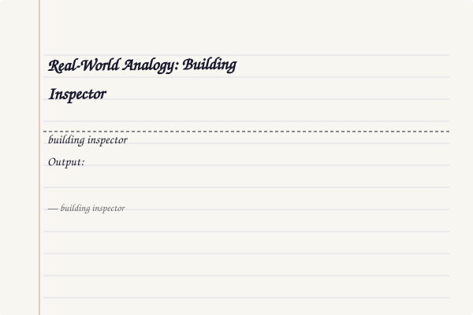
</a>
<a href="../../assets/images/diagrams/c-programming/17-standard-library/real-world-analogy-building-inspector-diagram.svg" target="_blank" rel="noopener">
  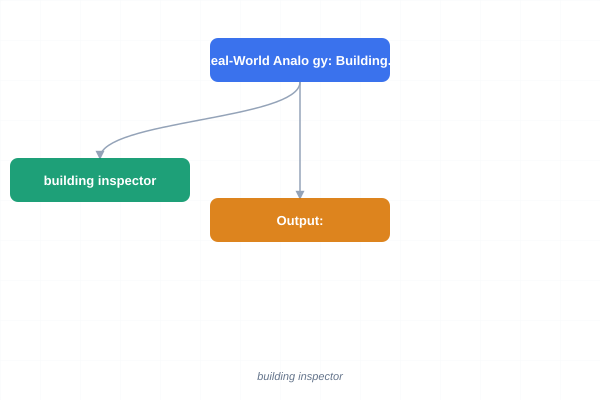
</a>
<a href="../../assets/images/diagrams/c-programming/17-standard-library/real-world-analogy-building-inspector-sticky.svg" target="_blank" rel="noopener">
  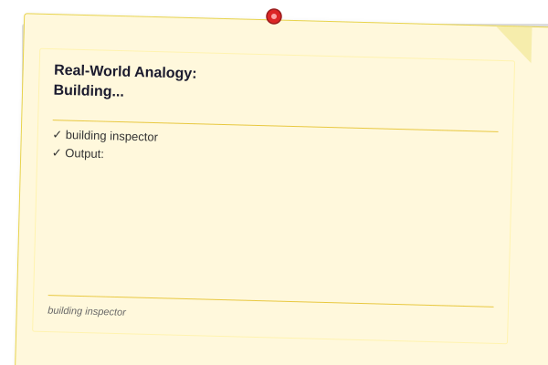
</a>


`assert` is like a **building inspector** who randomly checks key measurements during construction. If a wall is off by more than the tolerance, the inspector halts everything with a red tag. In production (release build), the inspector is off-duty — the checks disappear.

```c
#include <stdio.h>
#include <assert.h>

int divide(int a, int b)
{
    assert(b != 0);
    return a / b;
}

int main(void)
{
    printf("10 / 2 = %d\n", divide(10, 2));
    printf("10 / 0 = %d\n", divide(10, 0));
    return 0;
}
```

**Output:**
```
10 / 2 = 5
Assertion failed: b != 0, file test.c, line 7
```

To disable assertions in release builds:
```c
#define NDEBUG          /* must come BEFORE #include <assert.h> */
#include <assert.h>
/* assert() now expands to nothing */
```

### Complexity Analysis

<a href="../../assets/images/diagrams/c-programming/17-standard-library/complexity-analysis-handwritten.svg" target="_blank" rel="noopener">
  
</a>
<a href="../../assets/images/diagrams/c-programming/17-standard-library/complexity-analysis-diagram.svg" target="_blank" rel="noopener">
  
</a>
<a href="../../assets/images/diagrams/c-programming/17-standard-library/complexity-analysis-sticky.svg" target="_blank" rel="noopener">
  
</a>


| Function | Time | Space | Why |
|----------|------|-------|-----|
| `assert(cond)` | O(1) | O(1) | Single comparison; abort if false |
| `errno` check | O(1) | O(1) | Read global or thread-local integer |
| `perror` | O(n) | O(1) | Prints message + strerror; n = string length |

### Advantages and Disadvantages of assert.h

<a href="../../assets/images/diagrams/c-programming/17-standard-library/advantages-and-disadvantages-of-assert-h-handwritten.svg" target="_blank" rel="noopener">
  
</a>
<a href="../../assets/images/diagrams/c-programming/17-standard-library/advantages-and-disadvantages-of-assert-h-diagram.svg" target="_blank" rel="noopener">
  
</a>
<a href="../../assets/images/diagrams/c-programming/17-standard-library/advantages-and-disadvantages-of-assert-h-sticky.svg" target="_blank" rel="noopener">
  
</a>


| Aspect | Advantage | Disadvantage |
|--------|-----------|--------------|
| **Early detection** | Catches bugs at runtime with context | Only fires in debug builds (if NDEBUG) |
| **Zero overhead** | Expands to nothing with NDEBUG | Cannot use expressions with side effects |
| **Clarity** | Documents invariants in code | Abrupt abort — no cleanup opportunity |

### Edge Cases

<a href="../../assets/images/diagrams/c-programming/17-standard-library/edge-cases-handwritten.svg" target="_blank" rel="noopener">
  
</a>
<a href="../../assets/images/diagrams/c-programming/17-standard-library/edge-cases-diagram.svg" target="_blank" rel="noopener">
  
</a>
<a href="../../assets/images/diagrams/c-programming/17-standard-library/edge-cases-sticky.svg" target="_blank" rel="noopener">
  
</a>


- **assert with side effects**: `assert(++x > 0)` — `++x` disappears with NDEBUG! Never use expressions with side effects.
- **NDEBUG location**: Must be defined *before* including assert.h. Defining it later has no effect.
- **assert(ptr != NULL)**: Common pattern, but the error message shows the condition text only.
- **static_assert** (C11): Compile-time assertions — use for type-size checks, struct alignment.

---

## 17.8 `<setjmp.h>` — Non-Local Jumps

### Real-World Analogy: Emergency Eject Button

<a href="../../assets/images/diagrams/c-programming/17-standard-library/real-world-analogy-emergency-eject-button-handwritten.svg" target="_blank" rel="noopener">
  
</a>
<a href="../../assets/images/diagrams/c-programming/17-standard-library/real-world-analogy-emergency-eject-button-diagram.svg" target="_blank" rel="noopener">
  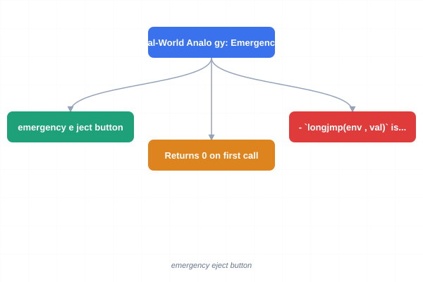
</a>
<a href="../../assets/images/diagrams/c-programming/17-standard-library/real-world-analogy-emergency-eject-button-sticky.svg" target="_blank" rel="noopener">
  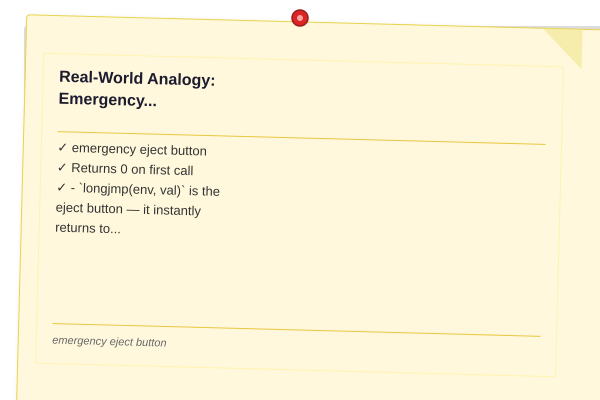
</a>


`setjmp`/`longjmp` is like an **emergency eject button** on a rocket:
- `setjmp(env)` sets up the eject seat at a control room. Returns 0 on first call.
- `longjmp(env, val)` is the eject button — it instantly returns to the control room, bypassing normal control flow.
- The `val` parameter tells the control room why you ejected.

### How It Works

<a href="../../assets/images/diagrams/c-programming/17-standard-library/how-it-works-handwritten.svg" target="_blank" rel="noopener">
  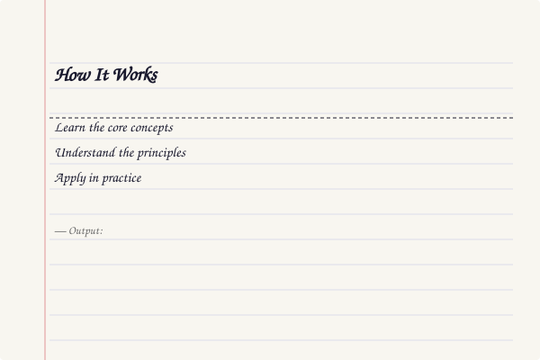
</a>
<a href="../../assets/images/diagrams/c-programming/17-standard-library/how-it-works-diagram.svg" target="_blank" rel="noopener">
  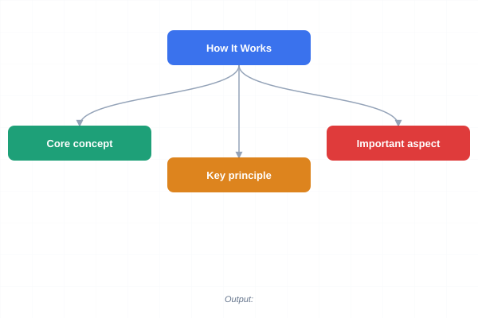
</a>
<a href="../../assets/images/diagrams/c-programming/17-standard-library/how-it-works-sticky.svg" target="_blank" rel="noopener">
  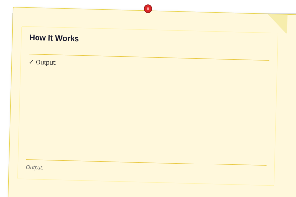
</a>


```c
#include <stdio.h>
#include <setjmp.h>

jmp_buf env;

void second(void)
{
    printf("In second()\n");
    longjmp(env, 42);   /* jump back — returns 42 from setjmp */
}

void first(void)
{
    printf("In first()\n");
    second();
    printf("This line never executes\n");
}

int main(void)
{
    int ret = setjmp(env);
    if (ret == 0) {
        printf("Calling first() (ret = %d)\n", ret);
        first();
    } else {
        printf("Back in main() via longjmp (ret = %d)\n", ret);
    }
    return 0;
}
```

**Output:**
```
Calling first() (ret = 0)
In first()
In second()
Back in main() via longjmp (ret = 42)
```

### Dry Run: setjmp/longjmp

<a href="../../assets/images/diagrams/c-programming/17-standard-library/dry-run-setjmp-longjmp-handwritten.svg" target="_blank" rel="noopener">
  
</a>
<a href="../../assets/images/diagrams/c-programming/17-standard-library/dry-run-setjmp-longjmp-diagram.svg" target="_blank" rel="noopener">
  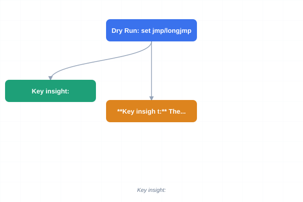
</a>
<a href="../../assets/images/diagrams/c-programming/17-standard-library/dry-run-setjmp-longjmp-sticky.svg" target="_blank" rel="noopener">
  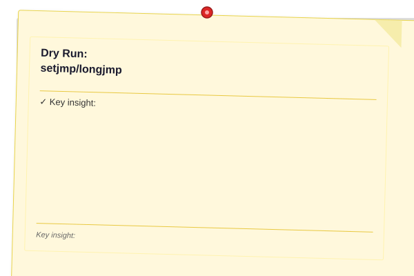
</a>


| Step | Action | Stack | ret | Notes |
|------|--------|-------|-----|-------|
| 1 | `setjmp(env)` saved context | main | 0 | First return — normal |
| 2 | `ret == 0`, call `first()` | main->first | — | Normal function call |
| 3 | `first()` calls `second()` | main->first->second | — | Normal function call |
| 4 | `longjmp(env, 42)` | main | **42** | Unwinds stack to setjmp point |
| 5 | `ret == 42`, print message | main | 42 | "first()" and "second()" stack frames destroyed |

**Key insight:** The stack frames for `first()` and `second()` are gone. Any local variables in those functions that were modified after `setjmp` have indeterminate values (unless they are `volatile`).

### Numbered Steps for Safe longjmp Use

<a href="../../assets/images/diagrams/c-programming/17-standard-library/numbered-steps-for-safe-longjmp-use-handwritten.svg" target="_blank" rel="noopener">
  
</a>
<a href="../../assets/images/diagrams/c-programming/17-standard-library/numbered-steps-for-safe-longjmp-use-diagram.svg" target="_blank" rel="noopener">
  
</a>
<a href="../../assets/images/diagrams/c-programming/17-standard-library/numbered-steps-for-safe-longjmp-use-sticky.svg" target="_blank" rel="noopener">
  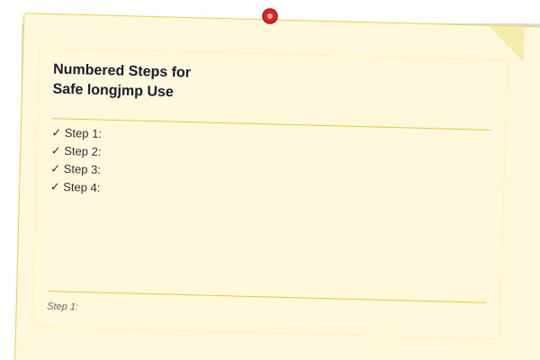
</a>


**Step 1:** Declare a `jmp_buf` with file scope or pass as parameter.
**Step 2:** Call `setjmp(env)` — check return value to distinguish first call (0) from longjmp return (nonzero).
**Step 3:** Only use `longjmp` for exceptional conditions (fatal errors, deep unwinding).
**Step 4:** Do NOT `longjmp` from a signal handler unless the signal is SIGABRT or similar.
**Step 5:** Ensure any allocated resources between `setjmp` and `longjmp` are freed before the jump.

### Limitations and Dangers

<a href="../../assets/images/diagrams/c-programming/17-standard-library/limitations-and-dangers-handwritten.svg" target="_blank" rel="noopener">
  
</a>
<a href="../../assets/images/diagrams/c-programming/17-standard-library/limitations-and-dangers-diagram.svg" target="_blank" rel="noopener">
  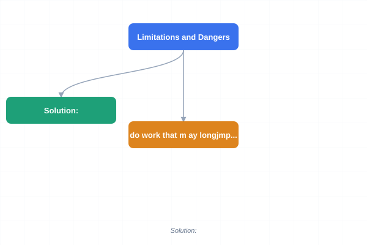
</a>
<a href="../../assets/images/diagrams/c-programming/17-standard-library/limitations-and-dangers-sticky.svg" target="_blank" rel="noopener">
  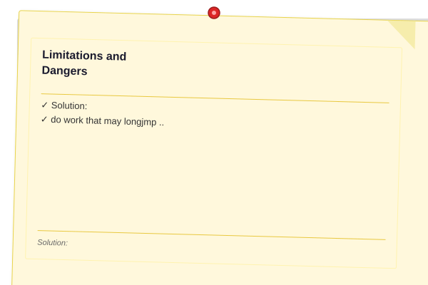
</a>


| Danger | Explanation |
|--------|-------------|
| **Resource leaks** | `longjmp` unwinds the stack without calling destructors, without freeing malloc'd memory |
| **Volatile variables** | Non-volatile local variables modified between setjmp and longjmp have indeterminate values |
| **Signal context** | longjmp from a signal handler is only safe if setjmp was called in the signal handler |
| **No destructors** | C++ objects, cleanup code are skipped — use only in C |
| **Reentrancy** | jmp_buf saved by setjmp is invalid after the calling function returns |

```c
#include <stdio.h>
#include <setjmp.h>
#include <stdlib.h>

jmp_buf env;

void risky(void)
{
    int *p = malloc(100 * sizeof(int));   /* LEAKS if longjmp before free */
    /* ... do work that may longjmp ... */
    if (/* error */ 1) {
        longjmp(env, 1);   /* p is never freed! */
    }
    free(p);
}
```

**Solution:** Free resources before longjmp, or use a design pattern where cleanup happens before the jump.

### Complexity Analysis

<a href="../../assets/images/diagrams/c-programming/17-standard-library/complexity-analysis-handwritten.svg" target="_blank" rel="noopener">
  
</a>
<a href="../../assets/images/diagrams/c-programming/17-standard-library/complexity-analysis-diagram.svg" target="_blank" rel="noopener">
  
</a>
<a href="../../assets/images/diagrams/c-programming/17-standard-library/complexity-analysis-sticky.svg" target="_blank" rel="noopener">
  
</a>


| Operation | Time | Space | Why |
|-----------|------|-------|-----|
| `setjmp` | O(1) | O(s) | s = register state + stack pointer — saves CPU context |
| `longjmp` | O(f) | O(1) | f = number of stack frames unwound — restores saved context |

### Advantages and Disadvantages of setjmp.h

<a href="../../assets/images/diagrams/c-programming/17-standard-library/advantages-and-disadvantages-of-setjmp-h-handwritten.svg" target="_blank" rel="noopener">
  
</a>
<a href="../../assets/images/diagrams/c-programming/17-standard-library/advantages-and-disadvantages-of-setjmp-h-diagram.svg" target="_blank" rel="noopener">
  
</a>
<a href="../../assets/images/diagrams/c-programming/17-standard-library/advantages-and-disadvantages-of-setjmp-h-sticky.svg" target="_blank" rel="noopener">
  
</a>


| Aspect | Advantage | Disadvantage |
|--------|-----------|--------------|
| **Error recovery** | Unwinds N frames in one step | Resource leaks are easy to create |
| **Performance** | Faster than N-level return value propagation | Pollutes control flow — hard to reason about |
| **Portability** | ISO C standard | Does NOT work with C++ exceptions (unwind incompatibility) |

### Comparison: longjmp vs Alternatives

<a href="../../assets/images/diagrams/c-programming/17-standard-library/comparison-longjmp-vs-alternatives-handwritten.svg" target="_blank" rel="noopener">
  
</a>
<a href="../../assets/images/diagrams/c-programming/17-standard-library/comparison-longjmp-vs-alternatives-diagram.svg" target="_blank" rel="noopener">
  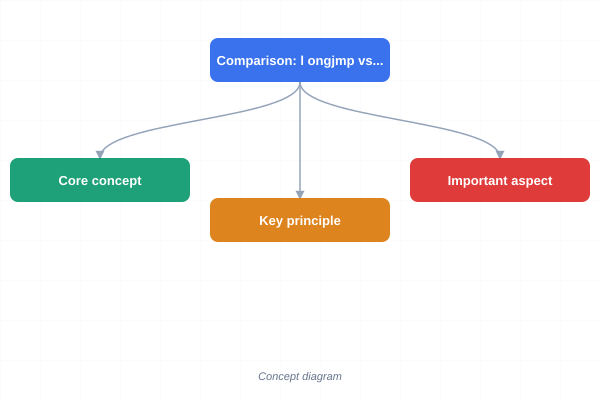
</a>
<a href="../../assets/images/diagrams/c-programming/17-standard-library/comparison-longjmp-vs-alternatives-sticky.svg" target="_blank" rel="noopener">
  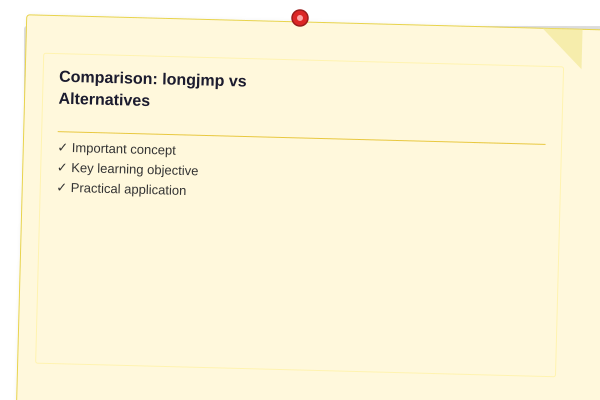
</a>


| Feature | `setjmp`/`longjmp` | Return values | `goto` | Exceptions (C++) |
|---------|-------------------|---------------|--------|-----------------|
| **Crosses function boundaries** | Yes | Yes | No (same function only) | Yes |
| **Unwinds N frames** | Yes (one call) | No (N returns) | No | Yes |
| **Calls destructors** | No | Yes (normal return) | No | Yes |
| **Thread-safe** | Per-thread jmp_buf | Yes | Yes | Yes |
| **Performance** | Fast unwinding | Slow with deep nesting | Instant | Moderate overhead |
| **C compatibility** | Yes | Yes | Yes | No (C++ only) |
---

## 17.9 `<signal.h>` — Signal Handling

### Real-World Analogy: Fire Alarm

<a href="../../assets/images/diagrams/c-programming/17-standard-library/real-world-analogy-fire-alarm-handwritten.svg" target="_blank" rel="noopener">
  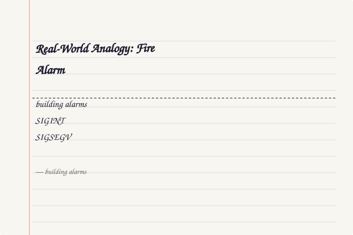
</a>
<a href="../../assets/images/diagrams/c-programming/17-standard-library/real-world-analogy-fire-alarm-diagram.svg" target="_blank" rel="noopener">
  
</a>
<a href="../../assets/images/diagrams/c-programming/17-standard-library/real-world-analogy-fire-alarm-sticky.svg" target="_blank" rel="noopener">
  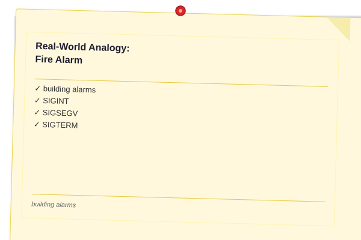
</a>


Signals are like **building alarms**:
- **SIGINT** (Ctrl+C) = Fire alarm — you may interrupt the program.
- **SIGSEGV** = Structural collapse (segfault) — program accessed invalid memory.
- **SIGTERM** = Evacuation order — polite request to terminate.
- **SIGKILL** = Demolition — cannot be caught, ignored, or blocked.
- `signal(SIGINT, handler)` = Assign someone to respond when the fire alarm rings.
- `raise(SIGINT)` = Manually pull the fire alarm.

### Numbered Steps for Signal Handling

<a href="../../assets/images/diagrams/c-programming/17-standard-library/numbered-steps-for-signal-handling-handwritten.svg" target="_blank" rel="noopener">
  
</a>
<a href="../../assets/images/diagrams/c-programming/17-standard-library/numbered-steps-for-signal-handling-diagram.svg" target="_blank" rel="noopener">
  
</a>
<a href="../../assets/images/diagrams/c-programming/17-standard-library/numbered-steps-for-signal-handling-sticky.svg" target="_blank" rel="noopener">
  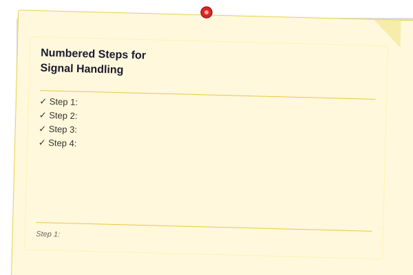
</a>


**Step 1:** Include `<signal.h>`.
**Step 2:** Define a signal handler function with signature `void handler(int signum)`.
**Step 3:** Call `signal(sig, handler)` to register it.
**Step 4:** Inside the handler, only call async-signal-safe functions.
**Step 5:** Restore the signal handler if you need default behavior later.

```c
#include <stdio.h>
#include <signal.h>
#include <stdlib.h>

static volatile sig_atomic_t got_interrupt = 0;

void handle_sigint(int sig)
{
    got_interrupt = 1;   /* safe: sig_atomic_t */
}

int main(void)
{
    /* Register handler */
    signal(SIGINT, handle_sigint);

    printf("Press Ctrl+C within 5 seconds...\n");

    /* Busy-wait — not ideal, but demonstrates the pattern */
    volatile int count = 0;
    for (int i = 0; i < 100000000; i++) {
        count++;
        if (got_interrupt) {
            printf("\nInterrupted after %d iterations!\n", i);
            got_interrupt = 0;
            break;
        }
    }

    if (!got_interrupt)
        printf("Completed %d iterations without interruption\n", count);

    return 0;
}
```

**Output (if Ctrl+C pressed):**
```
Press Ctrl+C within 5 seconds...
^C
Interrupted after 4234567 iterations!
```

### Async-Signal-Safe Functions

<a href="../../assets/images/diagrams/c-programming/17-standard-library/async-signal-safe-functions-handwritten.svg" target="_blank" rel="noopener">
  
</a>
<a href="../../assets/images/diagrams/c-programming/17-standard-library/async-signal-safe-functions-diagram.svg" target="_blank" rel="noopener">
  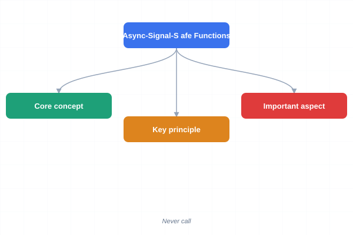
</a>
<a href="../../assets/images/diagrams/c-programming/17-standard-library/async-signal-safe-functions-sticky.svg" target="_blank" rel="noopener">
  
</a>


Only these functions are guaranteed safe to call from a signal handler:

- `signal()` (to reset to SIG_DFL)
- `raise()`
- `_Exit()`, `_exit()`
- `abort()`
- `write()` (POSIX — write to pipe or file descriptor)
- Reading/writing `volatile sig_atomic_t` variables

**Never call** from a signal handler: `printf`, `malloc`, `free`, `fopen`, `strtok`, `rand`, `longjmp` (unless setjmp was in the handler).

### Signal Table

<a href="../../assets/images/diagrams/c-programming/17-standard-library/signal-table-handwritten.svg" target="_blank" rel="noopener">
  
</a>
<a href="../../assets/images/diagrams/c-programming/17-standard-library/signal-table-diagram.svg" target="_blank" rel="noopener">
  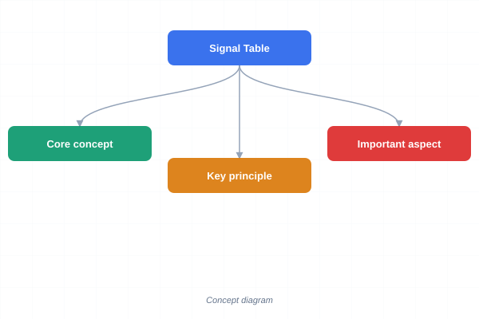
</a>
<a href="../../assets/images/diagrams/c-programming/17-standard-library/signal-table-sticky.svg" target="_blank" rel="noopener">
  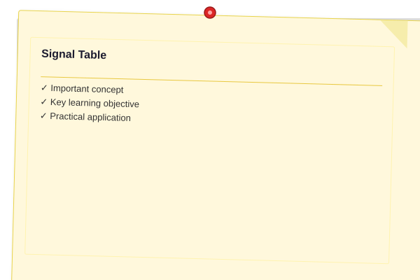
</a>


| Signal | Typical Value | Description | Default Action |
|--------|--------------|-------------|---------------|
| SIGABRT | 6 | Abort (from abort()) | Terminate with core dump |
| SIGFPE | 8 | Floating-point exception | Terminate with core dump |
| SIGILL | 4 | Illegal instruction | Terminate with core dump |
| SIGINT | 2 | Interactive interrupt (Ctrl+C) | Terminate |
| SIGSEGV | 11 | Segmentation violation | Terminate with core dump |
| SIGTERM | 15 | Termination request (kill default) | Terminate |
| SIGALRM | 14 | Timer alarm | Terminate |
| SIGPIPE | 13 | Write to broken pipe | Terminate |

### Complexity Analysis

<a href="../../assets/images/diagrams/c-programming/17-standard-library/complexity-analysis-handwritten.svg" target="_blank" rel="noopener">
  
</a>
<a href="../../assets/images/diagrams/c-programming/17-standard-library/complexity-analysis-diagram.svg" target="_blank" rel="noopener">
  
</a>
<a href="../../assets/images/diagrams/c-programming/17-standard-library/complexity-analysis-sticky.svg" target="_blank" rel="noopener">
  
</a>


| Operation | Time | Space | Why |
|-----------|------|-------|-----|
| `signal(sig, handler)` | O(1) | O(1) | Kernel call, sets handler table entry |
| `raise(sig)` | O(1) | O(1) | Send signal to current process |
| Handler dispatch | O(1) | O(s) | Context switch to handler, s = signal stack size |

### Advantages and Disadvantages of signal.h

<a href="../../assets/images/diagrams/c-programming/17-standard-library/advantages-and-disadvantages-of-signal-h-handwritten.svg" target="_blank" rel="noopener">
  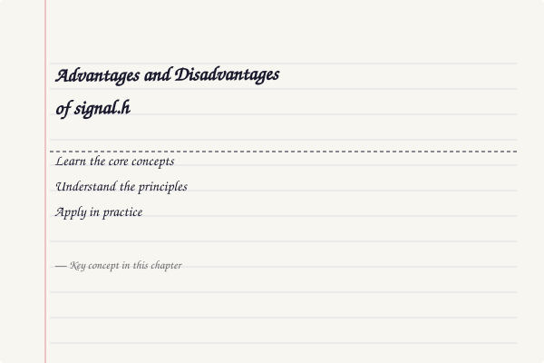
</a>
<a href="../../assets/images/diagrams/c-programming/17-standard-library/advantages-and-disadvantages-of-signal-h-diagram.svg" target="_blank" rel="noopener">
  
</a>
<a href="../../assets/images/diagrams/c-programming/17-standard-library/advantages-and-disadvantages-of-signal-h-sticky.svg" target="_blank" rel="noopener">
  
</a>


| Aspect | Advantage | Disadvantage |
|--------|-----------|--------------|
| **Responsiveness** | Interrupt-driven, immediate response | Only async-signal-safe functions callable |
| **Portability** | ISO C standard — available everywhere | POSIX adds sigaction with better control |
| **Simplicity** | Two functions: signal, raise | No data passing, no queuing, no blocking control |
| **Signal loss** | — | Standard signals are not queued — two SIGINT in a row may be merged |

### Edge Cases

<a href="../../assets/images/diagrams/c-programming/17-standard-library/edge-cases-handwritten.svg" target="_blank" rel="noopener">
  
</a>
<a href="../../assets/images/diagrams/c-programming/17-standard-library/edge-cases-diagram.svg" target="_blank" rel="noopener">
  
</a>
<a href="../../assets/images/diagrams/c-programming/17-standard-library/edge-cases-sticky.svg" target="_blank" rel="noopener">
  
</a>


- **signal(SIGKILL, handler)**: SIGKILL and SIGSTOP cannot be caught — the call is ignored.
- **signal(SIGSEGV, handler)**: If the handler causes another SIGSEGV, the program loops infinitely (or terminates). Use `sigaction` with SA_SIGINFO on POSIX for better control.
- **Handler reentrancy**: If a signal arrives while the handler is executing, the handler may be reentered. Use `volatile sig_atomic_t` for shared state.
- **Restoring default**: `signal(sig, SIG_DFL)` restores the default behavior; `signal(sig, SIG_IGN)` ignores the signal.

---

## 17.10 `<stdarg.h>` — Variable Arguments

### Real-World Analogy: Pizza Order

<a href="../../assets/images/diagrams/c-programming/17-standard-library/real-world-analogy-pizza-order-handwritten.svg" target="_blank" rel="noopener">
  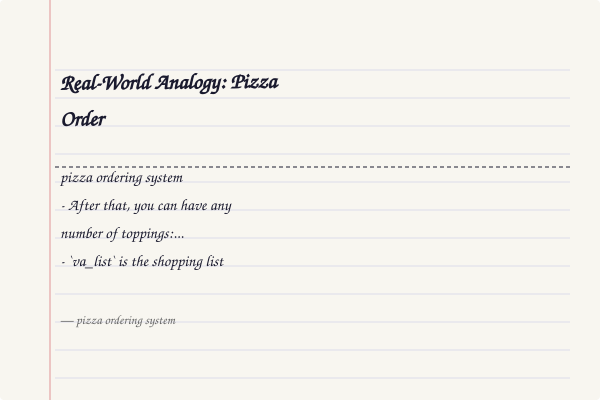
</a>
<a href="../../assets/images/diagrams/c-programming/17-standard-library/real-world-analogy-pizza-order-diagram.svg" target="_blank" rel="noopener">
  
</a>
<a href="../../assets/images/diagrams/c-programming/17-standard-library/real-world-analogy-pizza-order-sticky.svg" target="_blank" rel="noopener">
  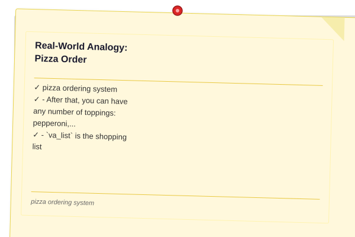
</a>


`<stdarg.h>` is like a **pizza ordering system** where:
- The first parameter is always known: "1 pizza" (the named parameter).
- After that, you can have any number of toppings: pepperoni, mushrooms, olives, etc.
- `va_list` is the shopping list.
- `va_start` begins reading the list.
- `va_arg` reads each item one by one.
- `va_end` completes the order.

### Numbered Steps for Variadic Functions

<a href="../../assets/images/diagrams/c-programming/17-standard-library/numbered-steps-for-variadic-functions-handwritten.svg" target="_blank" rel="noopener">
  
</a>
<a href="../../assets/images/diagrams/c-programming/17-standard-library/numbered-steps-for-variadic-functions-diagram.svg" target="_blank" rel="noopener">
  
</a>
<a href="../../assets/images/diagrams/c-programming/17-standard-library/numbered-steps-for-variadic-functions-sticky.svg" target="_blank" rel="noopener">
  
</a>


**Step 1:** Include `<stdarg.h>`.
**Step 2:** Declare at least one named parameter before `...`.
**Step 3:** Declare `va_list ap` in the function body.
**Step 4:** Call `va_start(ap, last_named)` to initialize.
**Step 5:** Use `va_arg(ap, type)` for each argument.
**Step 6:** Call `va_end(ap)` before returning.

```c
#include <stdio.h>
#include <stdarg.h>

double average(int count, ...)
{
    va_list ap;
    double sum = 0.0;

    va_start(ap, count);
    for (int i = 0; i < count; i++) {
        sum += va_arg(ap, double);
    }
    va_end(ap);

    return count > 0 ? sum / count : 0.0;
}

int main(void)
{
    printf("Average of 1, 2, 3 = %.2f\n", average(3, 1.0, 2.0, 3.0));
    printf("Average of 5 numbers = %.2f\n", average(5, 10.0, 20.0, 30.0, 40.0, 50.0));
    return 0;
}
```

**Output:**
```
Average of 1, 2, 3 = 2.00
Average of 5 numbers = 30.00
```

### How printf Uses stdarg

<a href="../../assets/images/diagrams/c-programming/17-standard-library/how-printf-uses-stdarg-handwritten.svg" target="_blank" rel="noopener">
  
</a>
<a href="../../assets/images/diagrams/c-programming/17-standard-library/how-printf-uses-stdarg-diagram.svg" target="_blank" rel="noopener">
  
</a>
<a href="../../assets/images/diagrams/c-programming/17-standard-library/how-printf-uses-stdarg-sticky.svg" target="_blank" rel="noopener">
  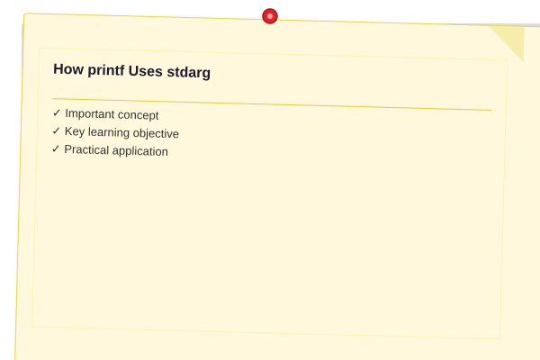
</a>


```c
#include <stdio.h>
#include <stdarg.h>

void my_printf(const char *format, ...)
{
    va_list ap;
    va_start(ap, format);
    vprintf(format, ap);   /* vprintf accepts va_list */
    va_end(ap);
}

int main(void)
{
    my_printf("Hello %s, you are %d years old\n", "Alice", 30);
    return 0;
}
```

### Safety Rules for Variadic Functions

<a href="../../assets/images/diagrams/c-programming/17-standard-library/safety-rules-for-variadic-functions-handwritten.svg" target="_blank" rel="noopener">
  
</a>
<a href="../../assets/images/diagrams/c-programming/17-standard-library/safety-rules-for-variadic-functions-diagram.svg" target="_blank" rel="noopener">
  
</a>
<a href="../../assets/images/diagrams/c-programming/17-standard-library/safety-rules-for-variadic-functions-sticky.svg" target="_blank" rel="noopener">
  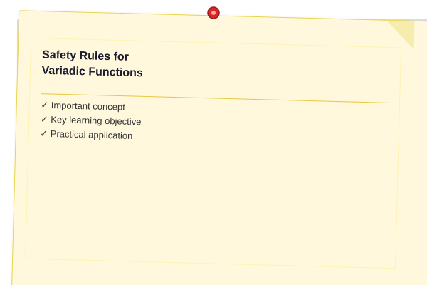
</a>


| Rule | Explanation |
|------|-------------|
| **At least one named parameter** | `...` alone is not allowed by the standard |
| **Type consistency** | `va_arg` uses the *default argument promotions* for integers (char->int, short->int, float->double) |
| **No way to check count** | The callee cannot know how many arguments were passed — count must be communicated separately |
| **va_list is single-pass** | Once consumed, cannot be re-read without va_copy (C99) |
| **va_end must be called** | Failure may cause resource leaks on some platforms |

### Complexity Analysis

<a href="../../assets/images/diagrams/c-programming/17-standard-library/complexity-analysis-handwritten.svg" target="_blank" rel="noopener">
  
</a>
<a href="../../assets/images/diagrams/c-programming/17-standard-library/complexity-analysis-diagram.svg" target="_blank" rel="noopener">
  
</a>
<a href="../../assets/images/diagrams/c-programming/17-standard-library/complexity-analysis-sticky.svg" target="_blank" rel="noopener">
  
</a>


| Operation | Time | Space | Why |
|-----------|------|-------|-----|
| `va_start` | O(1) | O(1) | Sets up pointer to stack frame |
| `va_arg` | O(1) | O(1) | Read next argument, advance pointer |
| `va_end` | O(1) | O(1) | Cleanup (may be a no-op) |

### Advantages and Disadvantages of stdarg.h

<a href="../../assets/images/diagrams/c-programming/17-standard-library/advantages-and-disadvantages-of-stdarg-h-handwritten.svg" target="_blank" rel="noopener">
  
</a>
<a href="../../assets/images/diagrams/c-programming/17-standard-library/advantages-and-disadvantages-of-stdarg-h-diagram.svg" target="_blank" rel="noopener">
  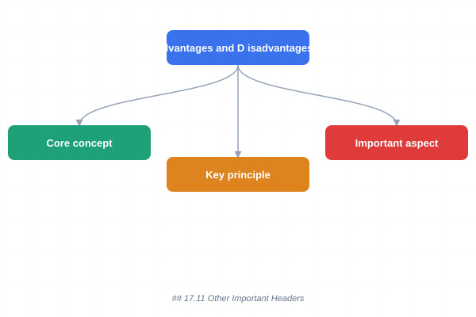
</a>
<a href="../../assets/images/diagrams/c-programming/17-standard-library/advantages-and-disadvantages-of-stdarg-h-sticky.svg" target="_blank" rel="noopener">
  
</a>


| Aspect | Advantage | Disadvantage |
|--------|-----------|--------------|
| **Flexibility** | Variable arguments for generic printing, summing | No type safety — wrong type = undefined behavior |
| **Performance** | Minimal overhead (pointer arithmetic on stack) | No runtime checking of argument count |
| **Portability** | ISO C, available on all platforms | Default argument promotions can be surprising (float->double) |

---

## 17.11 Other Important Headers

### 17.11.1 `<stdint.h>` — Fixed-Width Integer Types

<a href="../../assets/images/diagrams/c-programming/17-standard-library/17-11-1-stdint-h-fixed-width-integer-types-handwritten.svg" target="_blank" rel="noopener">
  ` — Fixed-Width Integer Types" width="30%">
</a>
<a href="../../assets/images/diagrams/c-programming/17-standard-library/17-11-1-stdint-h-fixed-width-integer-types-diagram.svg" target="_blank" rel="noopener">
  ` — Fixed-Width Integer Types" width="30%">
</a>
<a href="../../assets/images/diagrams/c-programming/17-standard-library/17-11-1-stdint-h-fixed-width-integer-types-sticky.svg" target="_blank" rel="noopener">
  ` — Fixed-Width Integer Types" width="30%">
</a>


Provides exact-width, minimum-width, and fastest-width integer types:

```c
#include <stdio.h>
#include <stdint.h>

int main(void)
{
    int32_t  i32 = -100;          /* exactly 32 bits, signed */
    uint64_t u64 = 18446744073709551615ULL;  /* exactly 64 bits, unsigned */
    int_least16_t min16;           /* at least 16 bits */
    int_fast32_t fast32;           /* fastest for 32-bit ops */

    printf("int32_t:  %d\n", i32);
    printf("uint64_t: %llu\n", u64);
    printf("INT32_MIN: %d\n", INT32_MIN);
    printf("INT32_MAX: %d\n", INT32_MAX);
    printf("UINT64_MAX: %llu\n", UINT64_MAX);

    return 0;
}
```

**Output:**
```
int32_t:  -100
uint64_t: 18446744073709551615
INT32_MIN: -2147483648
INT32_MAX: 2147483647
UINT64_MAX: 18446744073709551615
```

### 17.11.2 `<limits.h>` and `<float.h>` — Platform Limits

<a href="../../assets/images/diagrams/c-programming/17-standard-library/17-11-2-limits-h-and-float-h-platform-limits-handwritten.svg" target="_blank" rel="noopener">
  ` and `<float.h>` — Platform Limits" width="30%">
</a>
<a href="../../assets/images/diagrams/c-programming/17-standard-library/17-11-2-limits-h-and-float-h-platform-limits-diagram.svg" target="_blank" rel="noopener">
  ` and `<float.h>` — Platform Limits" width="30%">
</a>
<a href="../../assets/images/diagrams/c-programming/17-standard-library/17-11-2-limits-h-and-float-h-platform-limits-sticky.svg" target="_blank" rel="noopener">
  ` and `<float.h>` — Platform Limits" width="30%">
</a>


```c
#include <stdio.h>
#include <limits.h>
#include <float.h>

int main(void)
{
    /* Integer limits */
    printf("CHAR_BIT  = %d\n", CHAR_BIT);
    printf("SCHAR_MIN = %d\n", SCHAR_MIN);
    printf("SCHAR_MAX = %d\n", SCHAR_MAX);
    printf("INT_MIN   = %d\n", INT_MIN);
    printf("INT_MAX   = %d\n", INT_MAX);
    printf("LONG_MIN  = %ld\n", LONG_MIN);
    printf("LONG_MAX  = %ld\n", LONG_MAX);
    printf("LLONG_MAX = %lld\n", LLONG_MAX);

    /* Floating-point limits */
    printf("\nFLT_RADIX    = %d\n", FLT_RADIX);
    printf("FLT_DIG      = %d\n", FLT_DIG);       /* decimal digits precision */
    printf("DBL_DIG      = %d\n", DBL_DIG);
    printf("FLT_EPSILON  = %e\n", FLT_EPSILON);   /* 1.192093e-07 */
    printf("DBL_EPSILON  = %e\n", DBL_EPSILON);   /* 2.220446e-16 */
    printf("FLT_MAX      = %e\n", FLT_MAX);
    printf("FLT_MIN      = %e\n", FLT_MIN);
    printf("DBL_MAX      = %e\n", DBL_MAX);
    printf("DBL_MIN      = %e\n", DBL_MIN);

    return 0;
}
```

**Output:**
```
CHAR_BIT  = 8
SCHAR_MIN = -128
SCHAR_MAX = 127
INT_MIN   = -2147483648
INT_MAX   = 2147483647
LONG_MIN  = -2147483648
LONG_MAX  = 2147483647
LLONG_MAX = 9223372036854775807

FLT_RADIX    = 2
FLT_DIG      = 6
DBL_DIG      = 15
FLT_EPSILON  = 1.192093e-07
DBL_EPSILON  = 2.220446e-16
FLT_MAX      = 3.402823e+38
FLT_MIN      = 1.175494e-38
DBL_MAX      = 1.797693e+308
DBL_MIN      = 2.225074e-308
```

### 17.11.3 `<inttypes.h>` — Format Specifiers for Fixed Types

<a href="../../assets/images/diagrams/c-programming/17-standard-library/17-11-3-inttypes-h-format-specifiers-for-fixed-types-handwritten.svg" target="_blank" rel="noopener">
  ` — Format Specifiers for Fixed Types" width="30%">
</a>
<a href="../../assets/images/diagrams/c-programming/17-standard-library/17-11-3-inttypes-h-format-specifiers-for-fixed-types-diagram.svg" target="_blank" rel="noopener">
  ` — Format Specifiers for Fixed Types" width="30%">
</a>
<a href="../../assets/images/diagrams/c-programming/17-standard-library/17-11-3-inttypes-h-format-specifiers-for-fixed-types-sticky.svg" target="_blank" rel="noopener">
  ` — Format Specifiers for Fixed Types" width="30%">
</a>


```c
#include <stdio.h>
#include <inttypes.h>

int main(void)
{
    int32_t  i = -100;
    uint64_t u = 123456789012345ULL;

    printf("i = %" PRId32 "\n", i);      /* PRId32 expands to "d" or "ld" */
    printf("u = %" PRIu64 "\n", u);      /* PRIu64 expands to "llu" or "lu" */
    printf("i (hex) = %" PRIx32 "\n", i);

    /* Scanning macros */
    int32_t  scanned;
    sscanf("42", "%" SCNd32, &scanned);
    printf("Scanned: %" PRId32 "\n", scanned);

    return 0;
}
```

### 17.11.4 `<stddef.h>` — Common Definitions

<a href="../../assets/images/diagrams/c-programming/17-standard-library/17-11-4-stddef-h-common-definitions-handwritten.svg" target="_blank" rel="noopener">
  ` — Common Definitions" width="30%">
</a>
<a href="../../assets/images/diagrams/c-programming/17-standard-library/17-11-4-stddef-h-common-definitions-diagram.svg" target="_blank" rel="noopener">
  ` — Common Definitions" width="30%">
</a>
<a href="../../assets/images/diagrams/c-programming/17-standard-library/17-11-4-stddef-h-common-definitions-sticky.svg" target="_blank" rel="noopener">
  ` — Common Definitions" width="30%">
</a>


```c
#include <stdio.h>
#include <stddef.h>

struct point { int x; int y; int z; };

int main(void)
{
    printf("NULL pointer: %p\n", (void*)NULL);
    printf("size_t is %zu bytes\n", sizeof(size_t));
    printf("ptrdiff_t example: %td\n", &((struct point*)0)->z - &((struct point*)0)->x);

    /* offsetof — offset of a member in a struct */
    printf("Offset of x: %zu\n", offsetof(struct point, x));
    printf("Offset of y: %zu\n", offsetof(struct point, y));
    printf("Offset of z: %zu\n", offsetof(struct point, z));

    return 0;
}
```

**Output:**
```
NULL pointer: 0000000000000000
size_t is 8 bytes
ptrdiff_t example: 2
Offset of x: 0
Offset of y: 4
Offset of z: 8
```

### Header Groups Comparison Table

<a href="../../assets/images/diagrams/c-programming/17-standard-library/header-groups-comparison-table-handwritten.svg" target="_blank" rel="noopener">
  
</a>
<a href="../../assets/images/diagrams/c-programming/17-standard-library/header-groups-comparison-table-diagram.svg" target="_blank" rel="noopener">
  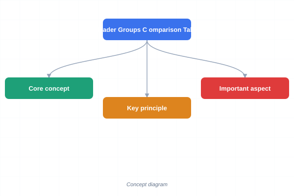
</a>
<a href="../../assets/images/diagrams/c-programming/17-standard-library/header-groups-comparison-table-sticky.svg" target="_blank" rel="noopener">
  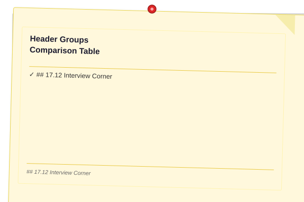
</a>


| Group | Headers | Purpose | Key Types/Macros |
|-------|---------|---------|-----------------|
| **I/O** | `<stdio.h>` | Console, file, string I/O | FILE, fpos_t, size_t |
| **General** | `<stdlib.h>` | Memory, sorting, conversion, process | size_t, div_t, ldiv_t |
| **Strings** | `<string.h>` | String + memory manipulation | size_t (as return) |
| **Math** | `<math.h>` | FP math, trig, log, rounding | double, float, long double |
| **Character** | `<ctype.h>` | Char classification/conversion | int return (nonzero/zero) |
| **Time** | `<time.h>` | Calendar and clock | time_t, clock_t, struct tm |
| **Diagnostics** | `<assert.h>`, `<errno.h>` | Runtime checks, error codes | assert macro, errno |
| **Non-local jumps** | `<setjmp.h>` | Cross-function branching | jmp_buf |
| **Signals** | `<signal.h>` | Async event handling | sig_atomic_t |
| **Variable args** | `<stdarg.h>` | Variadic function support | va_list, va_arg |
| **Fixed-width ints** | `<stdint.h>` | Exact/min/fast integer types | int32_t, uint64_t, etc. |
| **Format macros** | `<inttypes.h>` | PRI/SCN format specifiers | PRId32, PRIu64 |
| **Limits** | `<limits.h>`, `<float.h>` | Platform min/max values | INT_MAX, DBL_EPSILON |
| **Common** | `<stddef.h>` | NULL, size_t, ptrdiff_t, offsetof | NULL, size_t, ptrdiff_t |
| **Boolean** | `<stdbool.h>` | Boolean type and macros (C99) | bool, true, false |

---

## 17.12 Interview Corner

### Q1: What is the difference between atoi and strtol? When would you use each?

<a href="../../assets/images/diagrams/c-programming/17-standard-library/what-is-the-difference-between-atoi-and-strtol-when-would-you-use-each-handwritten.svg" target="_blank" rel="noopener">
  
</a>
<a href="../../assets/images/diagrams/c-programming/17-standard-library/what-is-the-difference-between-atoi-and-strtol-when-would-you-use-each-diagram.svg" target="_blank" rel="noopener">
  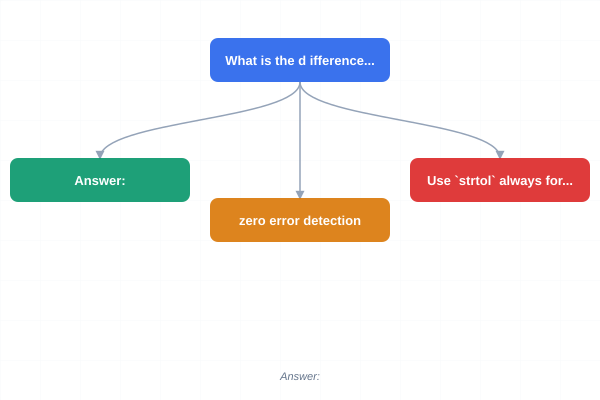
</a>
<a href="../../assets/images/diagrams/c-programming/17-standard-library/what-is-the-difference-between-atoi-and-strtol-when-would-you-use-each-sticky.svg" target="_blank" rel="noopener">
  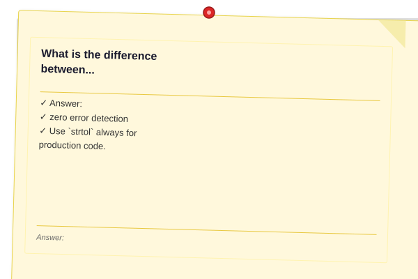
</a>


**Answer:** `atoi` converts string to `int` with **zero error detection**. If the input is `"abc"`, `atoi` returns 0 with no way to distinguish from `atoi("0")`. If the input overflows `INT_MAX`, behavior is undefined. `strtol` provides complete error detection:
- Returns `LONG_MIN`/`LONG_MAX` on overflow and sets `errno = ERANGE`.
- Sets end pointer — you can check if any digits were parsed.
- Supports any base from 2 to 36.

**Use `strtol` always for production code.** `atoi` is only acceptable for quick-and-dirty scripts or fully validated input.

```c
#include <stdio.h>
#include <stdlib.h>
#include <errno.h>

int safe_atoi(const char *str, int *out)
{
    char *end;
    errno = 0;
    long val = strtol(str, &end, 10);

    if (end == str)           return -1;  /* no digits */
    if (*end != '\0')         return -2;  /* trailing chars */
    if (errno == ERANGE)      return -3;  /* overflow */
    if (val < INT_MIN || val > INT_MAX) return -4;  /* fits long but not int */

    *out = (int)val;
    return 0;  /* success */
}
```

### Q2: How does qsort's comparison function work? Provide a correct implementation for descending integers and for sorting strings.

**Answer:** The comparison function receives pointers to two elements. It must return:
- **Negative**: first element should come before second.
- **Zero**: elements are equal.
- **Positive**: first element should come after second.

```c
#include <stdio.h>
#include <stdlib.h>
#include <string.h>

/* Descending int comparison */
int cmp_desc(const void *a, const void *b)
{
    int ia = *(const int*)a;
    int ib = *(const int*)b;
    return (ia < ib) - (ia > ib);   /* neg when ia<ib -> ascending, so swap */
}

/* String comparison (ascending) */
int cmp_str(const void *a, const void *b)
{
    /* a and b are pointers to char* elements */
    const char **sa = (const char**)a;
    const char **sb = (const char**)b;
    return strcmp(*sa, *sb);
}

int main(void)
{
    int nums[] = {5, 2, 9, 1, 7};
    qsort(nums, 5, sizeof(int), cmp_desc);
    for (int i = 0; i < 5; i++) printf("%d ", nums[i]);
    printf("\n");   /* 9 7 5 2 1 */

    const char *words[] = {"banana", "apple", "cherry", "date"};
    qsort(words, 4, sizeof(char*), cmp_str);
    for (int i = 0; i < 4; i++) printf("%s ", words[i]);
    printf("\n");   /* apple banana cherry date */

    return 0;
}
```

### Q3: What does "async-signal-safe" mean? Which standard library functions are safe to call from a signal handler?

**Answer:** Async-signal-safe functions are safe to call from within a signal handler. They are reentrant — they don't use global state, don't call `malloc`, don't use locks that might already be held by the interrupted code.

**Safe to call from signal handler:**
- `signal()`, `raise()`, `_Exit()`, `abort()`
- `write()` (POSIX — low-level, unbuffered)
- Reading/writing `volatile sig_atomic_t`

**NOT safe (and commonly mistaken):**

| Function | Why not safe |
|----------|-------------|
| `printf` | Uses stdio buffers, may hold internal locks |
| `malloc`/`free` | Uses heap lock, not reentrant |
| `strtok` | Uses static buffer |
| `rand` | Uses static state |
| `longjmp` | Unwinding while signal interrupted malloc can deadlock |
| `fopen` | May allocate memory, hold file system locks |

### Q4: What is the difference between memcpy and memmove?

<a href="../../assets/images/diagrams/c-programming/17-standard-library/what-is-the-difference-between-memcpy-and-memmove-handwritten.svg" target="_blank" rel="noopener">
  
</a>
<a href="../../assets/images/diagrams/c-programming/17-standard-library/what-is-the-difference-between-memcpy-and-memmove-diagram.svg" target="_blank" rel="noopener">
  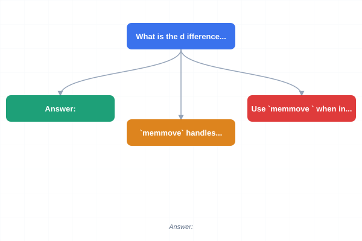
</a>
<a href="../../assets/images/diagrams/c-programming/17-standard-library/what-is-the-difference-between-memcpy-and-memmove-sticky.svg" target="_blank" rel="noopener">
  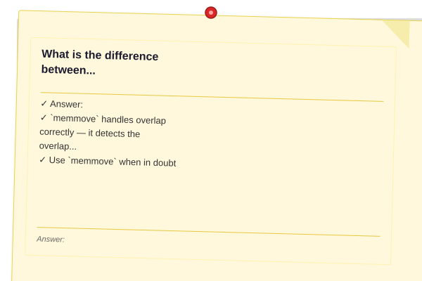
</a>


**Answer:** `memcpy` is faster but requires that source and destination buffers do **not** overlap. `memmove` handles overlap correctly — it detects the overlap direction and copies forward or backward accordingly. Use `memmove` when in doubt. Both have the same complexity (O(n)) and same signature.

```c
char buf[] = "abcdefghij";
/* memcpy(buf + 2, buf, 6);  // UB — overlapping */
memmove(buf + 2, buf, 6);     /* OK — result: "ababcdefgh" */
```

### Q5: What is the 2038 problem, and how does it relate to time.h?

<a href="../../assets/images/diagrams/c-programming/17-standard-library/what-is-the-2038-problem-and-how-does-it-relate-to-time-h-handwritten.svg" target="_blank" rel="noopener">
  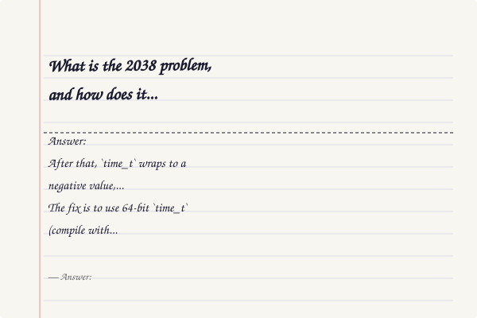
</a>
<a href="../../assets/images/diagrams/c-programming/17-standard-library/what-is-the-2038-problem-and-how-does-it-relate-to-time-h-diagram.svg" target="_blank" rel="noopener">
  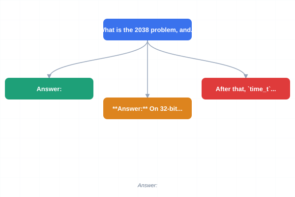
</a>
<a href="../../assets/images/diagrams/c-programming/17-standard-library/what-is-the-2038-problem-and-how-does-it-relate-to-time-h-sticky.svg" target="_blank" rel="noopener">
  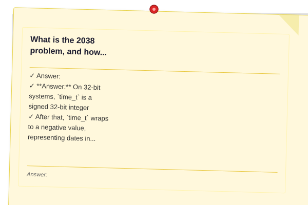
</a>


**Answer:** On 32-bit systems, `time_t` is a signed 32-bit integer. It overflows on January 19, 2038, at 03:14:07 UTC — the maximum positive value (2^31-1 = 2,147,483,647 seconds from epoch). After that, `time_t` wraps to a negative value, representing dates in 1901. The fix is to use 64-bit `time_t` (compile with `-D_TIME_BITS=64` on modern Linux, or use 64-bit systems where `time_t` is already 64 bits).

### Q6: What does `assert` compile to when NDEBUG is defined? What happens if you put a side effect inside assert?

**Answer:** When `NDEBUG` is defined, `assert(expr)` expands to nothing — the expression is removed entirely. If the expression has side effects (e.g., `assert(++count < 10)`), those side effects **disappear** in release builds, causing bugs. Never put expressions with side effects inside `assert`.

### Q7: How does printf know how many arguments were passed? What happens if the format string and arguments don't match?

**Answer:** `printf` does NOT know how many arguments were passed. It relies entirely on the format string to determine how many arguments to read from the stack. If the format says `"%d %d"` but only one `int` argument is provided, `printf` reads past the provided arguments into undefined memory — undefined behavior. Modern compilers warn about mismatches with `-Wformat`.

### Q8: Explain the difference between `fmod` and `remainder`.

<a href="../../assets/images/diagrams/c-programming/17-standard-library/explain-the-difference-between-fmod-and-remainder-handwritten.svg" target="_blank" rel="noopener">
  
</a>
<a href="../../assets/images/diagrams/c-programming/17-standard-library/explain-the-difference-between-fmod-and-remainder-diagram.svg" target="_blank" rel="noopener">
  
</a>
<a href="../../assets/images/diagrams/c-programming/17-standard-library/explain-the-difference-between-fmod-and-remainder-sticky.svg" target="_blank" rel="noopener">
  
</a>


**Answer:** Both compute remainder, but the rounding differs:
- `fmod(x, y)` = `x - trunc(x / y) * y` — truncates toward zero.
- `remainder(x, y)` = `x - round(x / y) * y` — rounds to nearest integer (IEEE 754 remainder).
- `fmod(7, 3)` = `1.0` and `remainder(7, 3)` = `1.0` — same for positive aligned.
- `fmod(-7, 3)` = `-1.0` while `remainder(-7, 3)` = `1.0` — different for negative!

---

## 17.13 Applications in Real Systems

### Application 1: Shell/Terminal Emulator

<a href="../../assets/images/diagrams/c-programming/17-standard-library/application-1-shell-terminal-emulator-handwritten.svg" target="_blank" rel="noopener">
  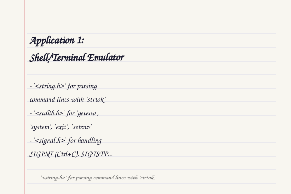
</a>
<a href="../../assets/images/diagrams/c-programming/17-standard-library/application-1-shell-terminal-emulator-diagram.svg" target="_blank" rel="noopener">
  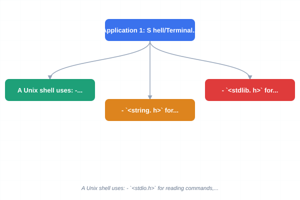
</a>
<a href="../../assets/images/diagrams/c-programming/17-standard-library/application-1-shell-terminal-emulator-sticky.svg" target="_blank" rel="noopener">
  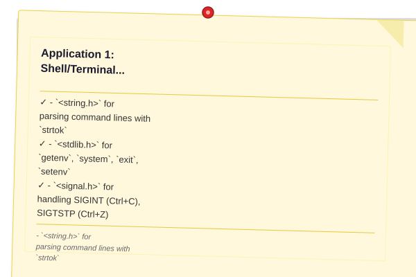
</a>


A Unix shell uses:
- `<stdio.h>` for reading commands, printing output, piping between processes.
- `<string.h>` for parsing command lines with `strtok`.
- `<stdlib.h>` for `getenv`, `system`, `exit`, `setenv`.
- `<signal.h>` for handling SIGINT (Ctrl+C), SIGTSTP (Ctrl+Z).
- `<time.h>` for timing command execution.

```c
/* Simplified shell prompt loop */
#include <stdio.h>
#include <stdlib.h>
#include <string.h>
#include <signal.h>

volatile sig_atomic_t got_sigint = 0;

void handle_sigint(int sig) { (void)sig; got_sigint = 1; }

int main(void)
{
    signal(SIGINT, handle_sigint);
    char line[1024];

    while (1) {
        printf("$ ");
        fflush(stdout);

        if (!fgets(line, sizeof(line), stdin)) break;

        got_sigint = 0;
        line[strcspn(line, "\n")] = '\0';

        if (strcmp(line, "exit") == 0) break;
        if (line[0] != '\0') system(line);
    }

    return 0;
}
```

### Application 2: Scientific Data Processing

<a href="../../assets/images/diagrams/c-programming/17-standard-library/application-2-scientific-data-processing-handwritten.svg" target="_blank" rel="noopener">
  
</a>
<a href="../../assets/images/diagrams/c-programming/17-standard-library/application-2-scientific-data-processing-diagram.svg" target="_blank" rel="noopener">
  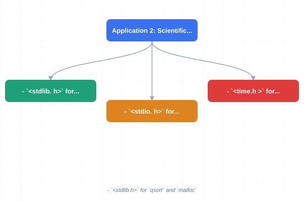
</a>
<a href="../../assets/images/diagrams/c-programming/17-standard-library/application-2-scientific-data-processing-sticky.svg" target="_blank" rel="noopener">
  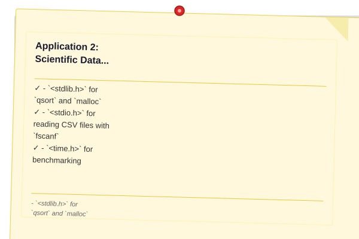
</a>


A data analysis tool uses:
- `<math.h>` for statistical computations (mean, std dev, regression).
- `<stdlib.h>` for `qsort` and `malloc`.
- `<stdio.h>` for reading CSV files with `fscanf`.
- `<time.h>` for benchmarking.
- `<string.h>` for parsing column headers.

```c
#include <stdio.h>
#include <stdlib.h>
#include <math.h>
#include <string.h>

int main(void)
{
    FILE *fp = fopen("data.csv", "r");
    if (!fp) { perror("fopen"); return 1; }

    double *values = NULL;
    size_t capacity = 1000, count = 0;
    values = malloc(capacity * sizeof(double));
    if (!values) { fclose(fp); return 1; }

    char line[256];
    fgets(line, sizeof(line), fp); /* skip header */
    while (fgets(line, sizeof(line), fp)) {
        if (count >= capacity) {
            capacity *= 2;
            values = realloc(values, capacity * sizeof(double));
        }
        values[count++] = strtod(line, NULL);
    }
    fclose(fp);

    /* Compute statistics */
    double sum = 0.0, sum_sq = 0.0;
    for (size_t i = 0; i < count; i++) {
        sum += values[i];
        sum_sq += values[i] * values[i];
    }
    double mean = sum / count;
    double variance = (sum_sq - sum * sum / count) / (count - 1);
    double stddev = sqrt(variance);

    printf("N = %zu\n", count);
    printf("Mean = %.4f\n", mean);
    printf("Std Dev = %.4f\n", stddev);

    free(values);
    return 0;
}
```

### Application 3: Embedded Sensor Logger

<a href="../../assets/images/diagrams/c-programming/17-standard-library/application-3-embedded-sensor-logger-handwritten.svg" target="_blank" rel="noopener">
  
</a>
<a href="../../assets/images/diagrams/c-programming/17-standard-library/application-3-embedded-sensor-logger-diagram.svg" target="_blank" rel="noopener">
  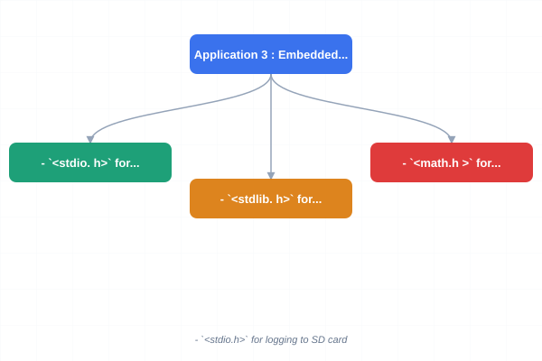
</a>
<a href="../../assets/images/diagrams/c-programming/17-standard-library/application-3-embedded-sensor-logger-sticky.svg" target="_blank" rel="noopener">
  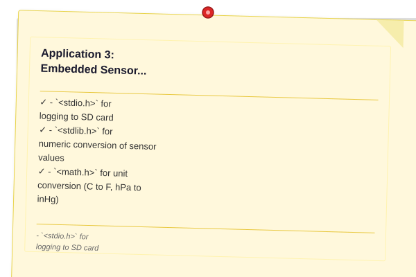
</a>


A weather station data logger uses:
- `<time.h>` for timestamping readings.
- `<stdio.h>` for logging to SD card.
- `<stdlib.h>` for numeric conversion of sensor values.
- `<math.h>` for unit conversion (C to F, hPa to inHg).
- `<signal.h>` for graceful shutdown on power loss.

### Application 4: Memory Pool Allocator

<a href="../../assets/images/diagrams/c-programming/17-standard-library/application-4-memory-pool-allocator-handwritten.svg" target="_blank" rel="noopener">
  
</a>
<a href="../../assets/images/diagrams/c-programming/17-standard-library/application-4-memory-pool-allocator-diagram.svg" target="_blank" rel="noopener">
  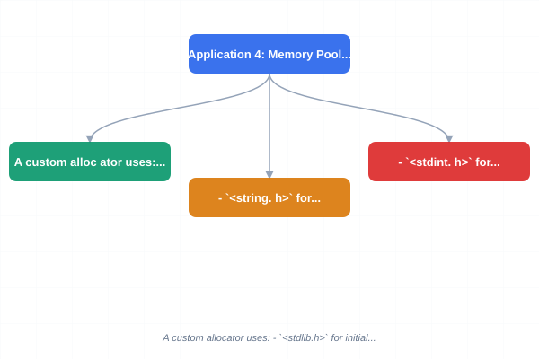
</a>
<a href="../../assets/images/diagrams/c-programming/17-standard-library/application-4-memory-pool-allocator-sticky.svg" target="_blank" rel="noopener">
  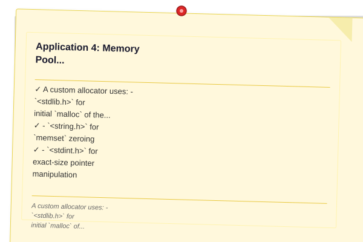
</a>


A custom allocator uses:
- `<stdlib.h>` for initial `malloc` of the pool.
- `<string.h>` for `memset` zeroing.
- `<stdint.h>` for exact-size pointer manipulation.
- `<assert.h>` for debugging boundary checks.
- `<errno.h>` for out-of-memory reporting.

### Application 5: HTTP Server

<a href="../../assets/images/diagrams/c-programming/17-standard-library/application-5-http-server-handwritten.svg" target="_blank" rel="noopener">
  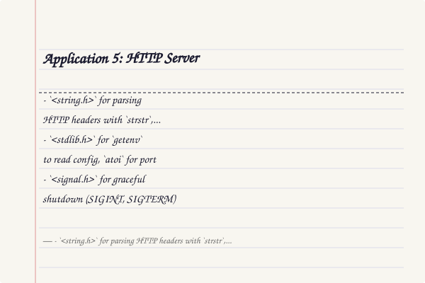
</a>
<a href="../../assets/images/diagrams/c-programming/17-standard-library/application-5-http-server-diagram.svg" target="_blank" rel="noopener">
  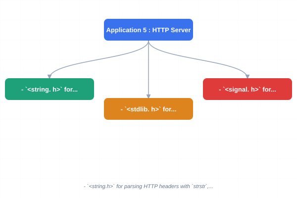
</a>
<a href="../../assets/images/diagrams/c-programming/17-standard-library/application-5-http-server-sticky.svg" target="_blank" rel="noopener">
  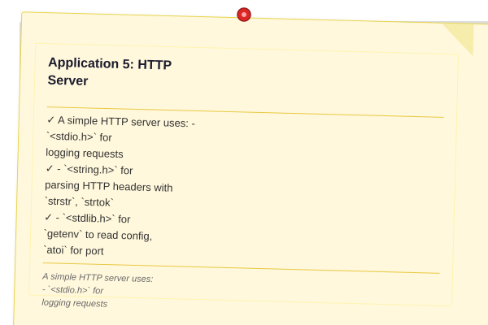
</a>


A simple HTTP server uses:
- `<stdio.h>` for logging requests.
- `<string.h>` for parsing HTTP headers with `strstr`, `strtok`.
- `<stdlib.h>` for `getenv` to read config, `atoi` for port.
- `<signal.h>` for graceful shutdown (SIGINT, SIGTERM).
- `<time.h>` for Date headers, Last-Modified.
- `<math.h>` rarely, but `ceil` for content-length rounding.

---

## Summary

| Header | Key Contribution | One-Sentence Takeaway |
|--------|-----------------|----------------------|
| `<stdio.h>` | printf, fopen, fread, snprintf | All I/O — console, file, and string |
| `<stdlib.h>` | malloc, qsort, strtol, rand, exit | General utilities — memory, sorting, conversion, process |
| `<string.h>` | strlen, strcpy, strcmp, memcpy, memmove | String and memory manipulation |
| `<math.h>` | sqrt, sin, log, pow, floor, ceil | Floating-point math — link with `-lm` |
| `<ctype.h>` | isalpha, isdigit, toupper, tolower | Character classification and case conversion |
| `<time.h>` | time, clock, strftime, localtime | Calendar time and CPU time measurement |
| `<errno.h>` | errno, EDOM, ERANGE, EINVAL | Error code reporting for library functions |
| `<assert.h>` | assert() | Runtime invariant checking — disabled with NDEBUG |
| `<setjmp.h>` | setjmp, longjmp | Non-local jumps — deep error recovery only |
| `<signal.h>` | signal, raise, sig_atomic_t | Async event handling — very limited safe functions |
| `<stdarg.h>` | va_list, va_start, va_arg, va_end | Variadic function support |
| `<stdint.h>` | int32_t, uint64_t, INT32_MAX | Exact-width and minimum-width integer types |
| `<limits.h>` | INT_MAX, LONG_MIN, CHAR_BIT | Platform-specific integer range limits |
| `<float.h>` | DBL_EPSILON, FLT_MAX, DBL_DIG | Floating-point characteristics |
| `<inttypes.h>` | PRId32, PRIu64, SCNd32 | Format specifier macros for fixed-width types |

## Exercises

### Review Questions

1. What is the difference between `atoi` and `strtol`? When should each be used?
2. Why is `snprintf` preferred over `sprintf`?
3. What is the difference between `memcpy` and `memmove`? Show with overlapping buffers.
4. What does `assert` do? How is it disabled for production code?
5. What is the purpose of `setjmp`/`longjmp`? Why are they considered dangerous for resource management?
6. List three functions that are **not** safe to call from a signal handler. Explain why.
7. Why is `(rand() % N)` biased? How do you correct it?
8. What is the year 2038 problem? Which header does it affect?
9. Explain the difference between `fmod` and `remainder` with negative arguments.
10. What is the default argument promotion for `float` in a variadic function?

### Application Problems

1. Write a program that generates 100 random integers between 1 and 1000, sorts them using `qsort`, and prints the sorted list. Find the median and quartiles.
2. Write a program that measures and prints the execution time of `sqrt(2.0)` called 10 million times. Use `clock()` and `CLOCKS_PER_SEC`.
3. Write a program that reads a text file, removes all punctuation (using `ispunct`), converts everything to lowercase, and prints the 10 most common words.
4. Write a program that uses `strftime` to display the current time in these formats:
   - `"2026-06-09 16:20:00"`
   - `"Tuesday, June 9, 2026"`
   - `"06/09/26"`
   - `"16:20"`
   - ISO 8601: `"2026-06-09T16:20:00"`
5. Write a safe wrapper function `int safe_atoi(const char *str, int *out)` that returns 0 on success and a negative error code on failure.
6. Write a program that uses `setjmp`/`longjmp` to handle a parsing error that occurs 3 function calls deep. Demonstrate a memory leak and fix it.

### Challenge Problem

Write a program that implements **polynomial regression** using the normal equation. Read x,y data points from a file (CSV format). Compute the coefficients of best-fit polynomial of degree `m` (user-specified) using least squares. Use `malloc` for matrices, `qsort` for sorting data by x, `sqrt`/`pow` from `<math.h>`, and print the resulting polynomial with `fprintf`. Test with synthetic data `y = 2x^2 - 3x + 5 + noise` and verify the recovered coefficients are approximately correct.
