# Chapter 18: Advanced C

> **Previous:** [The C Standard Library](./17-standard-library.md)

## Learning Objectives

- Manage multi-file C projects with header guards, `extern`, and Makefiles
- Use function pointers for callbacks and dispatch tables
- Write variadic functions using `stdarg.h`
- Parse complex C declarations using the spiral rule
- Understand `volatile`, `restrict`, and their interplay with `const`
- Use `setjmp`/`longjmp` for non-local error recovery
- Handle signals safely with `sig_atomic_t`
- Use variable-length arrays and flexible array members
- Write multi-threaded programs with pthreads
- Understand type punning and strict aliasing rules

<!-- Image Gallery -->
<div style="display:flex;flex-wrap:wrap;gap:4px;margin:16px 0;padding:12px;background:#f8fafc;border-radius:8px;border:1px solid #e2e8f0;">
<a href="../../../assets/images/lessons/c-programming/18-advanced-c/hero.svg" target="_blank" rel="noopener">
  
</a>
<a href="../../../assets/images/lessons/c-programming/18-advanced-c/handwritten-notes.svg" target="_blank" rel="noopener">
  
</a>
<a href="../../../assets/images/lessons/c-programming/18-advanced-c/sticky-notes.svg" target="_blank" rel="noopener">
  
</a>
<a href="../../../assets/images/lessons/c-programming/18-advanced-c/visual-explanation.svg" target="_blank" rel="noopener">
  
</a>
<a href="../../../assets/images/lessons/c-programming/18-advanced-c/architecture.svg" target="_blank" rel="noopener">
  
</a>
<a href="../../../assets/images/lessons/c-programming/18-advanced-c/workflow.svg" target="_blank" rel="noopener">
  
</a>
<a href="../../../assets/images/lessons/c-programming/18-advanced-c/mindmap.svg" target="_blank" rel="noopener">
  
</a>
<a href="../../../assets/images/lessons/c-programming/18-advanced-c/comparison.svg" target="_blank" rel="noopener">
  
</a>
<a href="../../../assets/images/lessons/c-programming/18-advanced-c/cheatsheet.svg" target="_blank" rel="noopener">
  
</a>
<a href="../../../assets/images/lessons/c-programming/18-advanced-c/interview-quiz.svg" target="_blank" rel="noopener">
  
</a>
<a href="../../../assets/images/lessons/c-programming/18-advanced-c/social-card.svg" target="_blank" rel="noopener">
  
</a>
</div>
<!-- End Image Gallery -->


### Chapter at a Glance

<a href="../../../assets/images/diagrams/c-programming/18-advanced-c/chapter-at-a-glance-handwritten.svg" target="_blank" rel="noopener">
  
</a>
<a href="../../../assets/images/diagrams/c-programming/18-advanced-c/chapter-at-a-glance-diagram.svg" target="_blank" rel="noopener">
  
</a>
<a href="../../../assets/images/diagrams/c-programming/18-advanced-c/chapter-at-a-glance-sticky.svg" target="_blank" rel="noopener">
  
</a>


| Topic | Key Insight | Practical Takeaway |
|-------|-------------|-------------------|
| Multi-File Projects | Split `.h` (interface) and `.c` (implementation) | Use header guards; each `.c` includes only what it needs |
| Function Pointers | Store and pass function addresses | Enables callbacks, dispatch tables, and OOP patterns in C |
| Variadic Functions | Functions with variable argument lists | Use `<stdarg.h>`: `va_list`, `va_start`, `va_arg`, `va_end` |
| Complex Declarations | Spiral rule: start at identifier, spiral outward | `int (*(*fp)(int))[5]` → fp is ptr to fn(int) returning ptr to array[5] of int |
| `volatile` | Prevents compiler from optimizing away memory accesses | Essential for hardware registers, signal handlers, shared variables |
| `restrict` | Promises exclusive pointer access | Enables auto-vectorization and better code generation |
| `setjmp`/`longjmp` | Non-local goto for deep error unwinding | More portable than inline assembly; skips destructors |
| Signal Handling | Asynchronous notifications to a process | Only async-signal-safe functions in handlers; use `volatile sig_atomic_t` |
| Variable-Length Arrays | Runtime-sized stack arrays (C99) | Handy but can overflow stack; optional in C11 |
| Flexible Array Members | Struct with last member `arr[]` | `sizeof` excludes the array; allocate with `malloc` |
| pthreads | POSIX threads for concurrency | Synchronize with mutexes and condition variables |
| Strict Aliasing | Rule: don't access same memory via different pointer types | Violation is UB; use `memcpy` or `union` for type punning |

```mermaid
flowchart LR
    A["18.1 Multi-File"] --> B["18.2 Function Ptrs"]
    B --> C["18.3 Variadic"]
    C --> D["18.4 Complex Decl"]
    D --> E["18.5 volatile/restrict"]
    E --> F["18.6 setjmp/longjmp"]
    F --> G["18.7 Signals"]
    G --> H["18.8 VLAs"]
    H --> I["18.9 Flexible Arrays"]
    I --> J["18.10 pthreads"]
    J --> K["18.11 Strict Aliasing"]
    K --> L["Interview & Applications"]
```




---

## 18.1 Multi-File Programming

**Real-World Analogy:** A large corporation divides work into departments (accounting, engineering, HR). Each department has a public interface (reception desk, published phone number) and private internals (internal memos, databases). The `.h` file is the public face; the `.c` file is the implementation behind closed doors.

### 18.1.1 Header Files and Header Guards

<a href="../../../assets/images/diagrams/c-programming/18-advanced-c/18-1-1-header-files-and-header-guards-handwritten.svg" target="_blank" rel="noopener">
  
</a>
<a href="../../../assets/images/diagrams/c-programming/18-advanced-c/18-1-1-header-files-and-header-guards-diagram.svg" target="_blank" rel="noopener">
  
</a>
<a href="../../../assets/images/diagrams/c-programming/18-advanced-c/18-1-1-header-files-and-header-guards-sticky.svg" target="_blank" rel="noopener">
  
</a>


A header file `.h` declares functions, types, and macros that multiple `.c` files share. A **header guard** prevents the same header from being `#include`d more than once in the same translation unit.

**Why header guards matter:** Without them, double inclusion causes redefinition errors for types, structs, and enums.

**Pattern 1 → Traditional `#ifndef` guard (most portable):**

```c
// math_utils.h
#ifndef MATH_UTILS_H
#define MATH_UTILS_H

int add(int a, int b);
int multiply(int a, int b);

#endif /* MATH_UTILS_H */
```

| Step | Action |
|------|--------|
| 1 | Preprocessor encounters `#include "math_utils.h"` |
| 2 | Checks if `MATH_UTILS_H` is defined |
| 3 | If not: defines `MATH_UTILS_H`, includes entire content |
| 4 | If yes: skips entire content (file is idempotent) |

**Pattern 2 → `#pragma once` (shorter, compiler-specific but widely supported):**

```c
// math_utils.h
#pragma once

int add(int a, int b);
int multiply(int a, int b);
```

**Comparison:**

| Aspect | `#ifndef` Guard | `#pragma once` |
|--------|----------------|----------------|
| Portability | All C compilers | Most (MSVC, GCC, Clang, ICC) |
| Typo risk | Macro name mismatch | None |
| Speed | Slower on large codebases | Slightly faster |
| Recommended | Libraries targeting obscure compilers | Everyday projects |

### 18.1.2 The `extern` Keyword

<a href="../../../assets/images/diagrams/c-programming/18-advanced-c/18-1-2-the-extern-keyword-handwritten.svg" target="_blank" rel="noopener">
  
</a>
<a href="../../../assets/images/diagrams/c-programming/18-advanced-c/18-1-2-the-extern-keyword-diagram.svg" target="_blank" rel="noopener">
  
</a>
<a href="../../../assets/images/diagrams/c-programming/18-advanced-c/18-1-2-the-extern-keyword-sticky.svg" target="_blank" rel="noopener">
  
</a>


`extern` declares a variable or function that is defined in **another translation unit**. It does **not** allocate storage → it tells the linker to resolve the symbol elsewhere.

**Pattern → one definition, multiple declarations:**

```c
// counter.h
#pragma once
extern int global_counter;   /* declaration → no storage */
void increment_counter(void);

// counter.c
#include "counter.h"
int global_counter = 0;      /* definition → storage allocated HERE */

void increment_counter(void) { global_counter++; }

// main.c
#include <stdio.h>
#include "counter.h"

int main(void) {
    increment_counter();
    increment_counter();
    printf("Counter: %d\n", global_counter);   /* 2 */
    return 0;
}
```

**Output:**
```
Counter: 2
```

**Rules for `extern`:**
1. `extern` declaration at file scope = "promise this exists elsewhere"
2. Exactly **one** definition across all translation units (ODR → One Definition Rule)
3. `extern` can appear in header files; `#include` propagates it
4. Arrays: `extern int arr[]` (size omitted → linker fills in)
5. Functions are implicitly `extern`; writing `extern` is redundant but stylistically clear

**Edge Case → Conflicting Linkage:**
```c
// a.c
int x = 10;

// b.c
extern int x;   /* OK → refers to a.c's x */

// c.c
static int x;   /* ERROR at link: static x in c.c conflicts with external x from a.c */
```

### 18.1.3 Makefiles

<a href="../../../assets/images/diagrams/c-programming/18-advanced-c/18-1-3-makefiles-handwritten.svg" target="_blank" rel="noopener">
  
</a>
<a href="../../../assets/images/diagrams/c-programming/18-advanced-c/18-1-3-makefiles-diagram.svg" target="_blank" rel="noopener">
  
</a>
<a href="../../../assets/images/diagrams/c-programming/18-advanced-c/18-1-3-makefiles-sticky.svg" target="_blank" rel="noopener">
  
</a>


A **Makefile** automates compilation so you don't recompile everything from scratch. It tracks file timestamps and rebuilds only what changed.

**Real-World Analogy:** A chef's prep list. If the sauce is already made (`.o` file is newer than `.c` file), skip it. Only cook what's needed.

**Anatomy of a Makefile rule:**
```
target: prerequisites
	recipe
```

| Component | Meaning |
|-----------|---------|
| `target` | File to produce (e.g., `program.exe`, `main.o`) |
| `prerequisites` | Files the target depends on |
| `recipe` | Shell command(s) to build the target (must be preceded by a **tab**, not spaces) |

**Complete Example → three-file project:**

```makefile
# Makefile
CC = gcc
CFLAGS = -Wall -Wextra -std=c99
OBJS = main.o math_utils.o
TARGET = program

$(TARGET): $(OBJS)
	$(CC) $(CFLAGS) -o $(TARGET) $(OBJS)

main.o: main.c math_utils.h
	$(CC) $(CFLAGS) -c main.c -o main.o

math_utils.o: math_utils.c math_utils.h
	$(CC) $(CFLAGS) -c math_utils.c -o math_utils.o

.PHONY: clean
clean:
	rm -f $(OBJS) $(TARGET)
```

**Common Makefile Targets:**

| Target | Purpose |
|--------|---------|
| `all` | Build everything (default if first) |
| `clean` | Remove all build artifacts |
| `install` | Copy binary to system path |
| `test` | Build and run tests |
| `debug` | Build with debug symbols (`-g`) |

**Dry Run → what happens when you type `make`:**

| Step | What Make Checks | Action |
|------|-----------------|--------|
| 1 | `program` exists? | No -> build it |
| 2 | `main.o` timestamp vs `main.c`, `math_utils.h` | `main.c` newer -> recompile |
| 3 | `math_utils.o` timestamp vs `math_utils.c`, `math_utils.h` | Both `.o` up to date -> skip |
| 4 | Link `main.o` + `math_utils.o` -> `program` | Run linker |

**Edge Cases:**
- **Spaces instead of tab:** Make refuses to run recipe lines → "missing separator" error
- **Header changes:** If `math_utils.h` changes, both `.o` files rebuild (correct)
- **Phony targets:** `.PHONY` tells Make that `clean` is not a real file (prevents confusion if a file named `clean` exists)

---

## 18.2 Function Pointers

**Real-World Analogy:** A TV remote has buttons. Each button points to a different function (volume up, channel change, mute). Pressing a button calls whatever function it's currently mapped to → you don't need to know which circuit handles it.

### 18.2.1 Function Pointer Basics

<a href="../../../assets/images/diagrams/c-programming/18-advanced-c/18-2-1-function-pointer-basics-handwritten.svg" target="_blank" rel="noopener">
  
</a>
<a href="../../../assets/images/diagrams/c-programming/18-advanced-c/18-2-1-function-pointer-basics-diagram.svg" target="_blank" rel="noopener">
  
</a>
<a href="../../../assets/images/diagrams/c-programming/18-advanced-c/18-2-1-function-pointer-basics-sticky.svg" target="_blank" rel="noopener">
  
</a>


**Syntax:**
```c
return_type (*pointer_name)(parameter_types);
```

```c
#include <stdio.h>

int add(int a, int b) { return a + b; }
int sub(int a, int b) { return a - b; }

int main(void) {
    int (*fp)(int, int);

    fp = add;
    printf("add(5,3) = %d\n", fp(5, 3));    /* 8 */

    fp = sub;
    printf("sub(5,3) = %d\n", fp(5, 3));    /* 2 */

    return 0;
}
```

**Output:**
```
add(5,3) = 8
sub(5,3) = 2
```

**Step-by-step declaration reading (see 18.4 for full spiral rule):**
```c
int (*fp)(int, int);
// 1. fp                          → identifier
// 2. *fp                         → pointer to
// 3. (*fp)(int, int)             → function taking (int, int)
// 4. int (*fp)(int, int)         → returning int
```

### 18.2.2 Callbacks

<a href="../../../assets/images/diagrams/c-programming/18-advanced-c/18-2-2-callbacks-handwritten.svg" target="_blank" rel="noopener">
  
</a>
<a href="../../../assets/images/diagrams/c-programming/18-advanced-c/18-2-2-callbacks-diagram.svg" target="_blank" rel="noopener">
  
</a>
<a href="../../../assets/images/diagrams/c-programming/18-advanced-c/18-2-2-callbacks-sticky.svg" target="_blank" rel="noopener">
  
</a>


A **callback** is a function pointer passed as an argument to another function. The receiving function "calls back" through the pointer.

**Example → `qsort` from the standard library:**
```c
#include <stdio.h>
#include <stdlib.h>

int compare_ints(const void *a, const void *b) {
    int ia = *(const int *)a;
    int ib = *(const int *)b;
    return (ia > ib) - (ia < ib);
}

int main(void) {
    int arr[] = {42, 7, 19, 3, 88, 55};
    size_t n = sizeof(arr) / sizeof(arr[0]);

    qsort(arr, n, sizeof(int), compare_ints);   /* callback! */

    for (size_t i = 0; i < n; i++)
        printf("%d ", arr[i]);
    printf("\n");
    return 0;
}
```

**Output:**
```
3 7 19 42 55 88
```

**How `qsort` uses the callback:**

| Step | What Happens |
|------|-------------|
| 1 | `qsort` picks two elements from the array |
| 2 | Calls `compare_ints(&a, &b)` through the function pointer |
| 3 | `compare_ints` returns -1, 0, or +1 |
| 4 | `qsort` swaps or leaves based on the comparison result |
| 5 | Repeats until the array is sorted |

**Complexity Analysis:**

| Operation | Time | Why |
|-----------|------|-----|
| `qsort` average | O(n log n) | Quickselect-based partitioning; callback is O(1) per call |
| `qsort` worst | O(n^2) | Poor pivot choices; same callback cost |
| Callback overhead | O(1) per call | Indirect call through pointer (one extra indirection vs direct call) |

### 18.2.3 Dispatch Tables

<a href="../../../assets/images/diagrams/c-programming/18-advanced-c/18-2-3-dispatch-tables-handwritten.svg" target="_blank" rel="noopener">
  
</a>
<a href="../../../assets/images/diagrams/c-programming/18-advanced-c/18-2-3-dispatch-tables-diagram.svg" target="_blank" rel="noopener">
  
</a>
<a href="../../../assets/images/diagrams/c-programming/18-advanced-c/18-2-3-dispatch-tables-sticky.svg" target="_blank" rel="noopener">
  
</a>


A **dispatch table** is an array of function pointers. It replaces long `switch` statements with O(1) indexed lookups.

**Real-World Analogy:** An elevator panel. Floor numbers (indices) map to buttons, each button triggers a different action. No if-else chain needed.

**Example → calculator with dispatch table:**
```c
#include <stdio.h>

int add(int a, int b) { return a + b; }
int sub(int a, int b) { return a - b; }
int mul(int a, int b) { return a * b; }
int divide(int a, int b) { return b ? a / b : 0; }

int main(void) {
    int (*ops[])(int, int) = {add, sub, mul, divide};
    const char *names[] = {"add", "sub", "mul", "div"};
    int a = 10, b = 3;

    for (int i = 0; i < 4; i++) {
        printf("%s(%d,%d) = %d\n", names[i], a, b, ops[i](a, b));
    }

    return 0;
}
```

**Output:**
```
add(10,3) = 13
sub(10,3) = 7
mul(10,3) = 30
div(10,3) = 3
```

**Dispatch Table vs `switch`:**

| Aspect | `switch` | Dispatch Table |
|--------|----------|---------------|
| Time | O(n) worst-case (if values are sparse) | O(1) always |
| Code size | Grows linearly with cases | Fixed table + function definitions |
| Dynamic | Must recompile to add cases | Can load plugins at runtime |
| Debugging | Easy to set breakpoints per case | Harder to trace indirect calls |

**Edge Cases:**
- **NULL function pointer:** Calling `fp()` when `fp == NULL` is UB (segfault). Always validate.
- **Out-of-bounds index:** `ops[5](a, b)` on a 4-element table - UB. Guard with bounds check.
- **ABI mismatch:** Calling convention mismatch (e.g., `__stdcall` vs `__cdecl` on Windows) corrupts the stack.

---
## 18.3 Variadic Functions

**Real-World Analogy:** A buffet restaurant. Every customer pays a fixed entry (the named parameter `count`), then takes a variable number of dishes. The kitchen doesn't know how many dishes each customer will take → the customer communicates the count upfront.

### 18.3.1 Mechanics → `stdarg.h` Macros

<a href="../../../assets/images/diagrams/c-programming/18-advanced-c/18-3-1-mechanics-stdarg-h-macros-handwritten.svg" target="_blank" rel="noopener">
  
</a>
<a href="../../../assets/images/diagrams/c-programming/18-advanced-c/18-3-1-mechanics-stdarg-h-macros-diagram.svg" target="_blank" rel="noopener">
  
</a>
<a href="../../../assets/images/diagrams/c-programming/18-advanced-c/18-3-1-mechanics-stdarg-h-macros-sticky.svg" target="_blank" rel="noopener">
  
</a>


```c
#include <stdio.h>
#include <stdarg.h>

/* Last named parameter tells va_start where to begin */
double average(int count, ...)
{
    va_list args;
    double sum = 0.0;

    va_start(args, count);

    for (int i = 0; i < count; i++) {
        sum += va_arg(args, double);
    }

    va_end(args);

    return count ? sum / count : 0.0;
}

int main(void)
{
    printf("Avg of 3: %.2f\n", average(3, 1.5, 2.0, 3.5));
    printf("Avg of 5: %.2f\n", average(5, 10.0, 20.0, 30.0, 40.0, 50.0));
    printf("Avg of 0: %.2f\n", average(0));
    return 0;
}
```

**Output:**
```
Avg of 3: 2.33
Avg of 5: 30.00
Avg of 0: 0.00
```

**Step-by-step → what `va_start` actually does:**

| Step | Operation | Effect |
|------|-----------|--------|
| 1 | `va_start(args, count)` | `args` points to stack slot **after** `count` |
| 2 | `va_arg(args, double)` | Reads 8 bytes at `args`, advances `args` by 8 |
| 3 | `va_arg(args, double)` | Reads next 8 bytes, advances again |
| 4 | Repeat until all args consumed | -- |
| 5 | `va_end(args)` | Resets `args` (no-op on most ABIs) |

### 18.3.2 Building a Custom printf

<a href="../../../assets/images/diagrams/c-programming/18-advanced-c/18-3-2-building-a-custom-printf-handwritten.svg" target="_blank" rel="noopener">
  
</a>
<a href="../../../assets/images/diagrams/c-programming/18-advanced-c/18-3-2-building-a-custom-printf-diagram.svg" target="_blank" rel="noopener">
  
</a>
<a href="../../../assets/images/diagrams/c-programming/18-advanced-c/18-3-2-building-a-custom-printf-sticky.svg" target="_blank" rel="noopener">
  
</a>


```c
#include <stdio.h>
#include <stdarg.h>

void my_printf(const char *format, ...)
{
    va_list args;
    va_start(args, format);

    for (const char *p = format; *p; p++) {
        if (*p == '%') {
            p++;
            switch (*p) {
                case 'd': { int v = va_arg(args, int); printf("%d", v); break; }
                case 'f': { double v = va_arg(args, double); printf("%f", v); break; }
                case 's': { char *v = va_arg(args, char*); printf("%s", v); break; }
                case 'c': { int v = va_arg(args, int); putchar(v); break; }
                case '%': putchar('%'); break;
                default:  putchar('%'); putchar(*p);
            }
        } else {
            putchar(*p);
        }
    }

    va_end(args);
}

int main(void)
{
    my_printf("Name: %s, Score: %d/%d (%.1f%%)\n", "Alice", 85, 100, 85.0);
    return 0;
}
```

**Output:**
```
Name: Alice, Score: 85/100 (85.0%)
```

### 18.3.3 Rules and Pitfalls

<a href="../../../assets/images/diagrams/c-programming/18-advanced-c/18-3-3-rules-and-pitfalls-handwritten.svg" target="_blank" rel="noopener">
  
</a>
<a href="../../../assets/images/diagrams/c-programming/18-advanced-c/18-3-3-rules-and-pitfalls-diagram.svg" target="_blank" rel="noopener">
  
</a>
<a href="../../../assets/images/diagrams/c-programming/18-advanced-c/18-3-3-rules-and-pitfalls-sticky.svg" target="_blank" rel="noopener">
  
</a>


1. At least one named parameter before `...` (required by standard)
2. Default argument promotions: `float` -> `double`, `char`/`short` -> `int`
3. No type checking on variadic arguments → if you pass an `int` but read a `double`, UB
4. No way for the function to know argument count → you must pass it (count, format string, sentinel)
5. Always pair `va_start` with `va_end`

**Edge Cases:**
- **Zero variadic arguments:** Works if you don't call `va_arg` (e.g., `average(0)` returns 0.0)
- **Type mismatch:** `va_arg(args, char*)` when the actual arg is `int` = UB (likely crash)
- **va_copy:** C99 provides `va_copy(dest, src)` to save a position for re-scanning

**Complexity Analysis:**

| Operation | Time | Space | Why |
|-----------|------|-------|-----|
| `va_start` | O(1) | O(1) | Just computes stack offset |
| `va_arg` each call | O(1) | O(1) | Read + pointer advance |
| `va_end` | O(1) | O(1) | Usually a no-op |
| Whole function | O(n) | O(1) | n = number of variadic arguments |

---

## 18.4 Complex Declarations (Spiral Rule)

**Real-World Analogy:** Russian nesting dolls (matryoshka). Each layer wraps the previous one. To understand the outermost doll, you open it, see the next, open that, and so on.

### 18.4.1 The Spiral Rule

<a href="../../../assets/images/diagrams/c-programming/18-advanced-c/18-4-1-the-spiral-rule-handwritten.svg" target="_blank" rel="noopener">
  
</a>
<a href="../../../assets/images/diagrams/c-programming/18-advanced-c/18-4-1-the-spiral-rule-diagram.svg" target="_blank" rel="noopener">
  
</a>
<a href="../../../assets/images/diagrams/c-programming/18-advanced-c/18-4-1-the-spiral-rule-sticky.svg" target="_blank" rel="noopener">
  
</a>


Also called the **right-left rule**: start at the identifier, move right as far as possible (respecting parentheses), then left, spiraling outward.

**Steps:**

| Step | Rule |
|------|------|
| 1 | Start at the identifier |
| 2 | Look right → if `[n]` -> array, `(params)` -> function |
| 3 | Look left → if `*` -> pointer |
| 4 | If a closing `)` is hit, go back right from there |
| 5 | Repeat until the type is fully parsed |

**Example 1 → Simple pointer to function:**
```c
int (*fp)(int);
// Start at fp
// Right: ) → pause (parenthesis closed)
// Left: *  → fp is a pointer
// Right: (int) → to a function taking int
// Left: int → returning int
// Result: fp is a pointer to a function taking int returning int
```

**Example 2 → Array of pointers to functions:**
```c
int (*fpa[5])(double);
// Start at fpa
// Right: [5] → fpa is an array of 5
// Left: *   → pointers
// Right: (double) → to functions taking double
// Left: int → returning int
// Result: fpa is an array[5] of pointers to functions taking double returning int
```

**Example 3 → The "complex declaration" classic:**
```c
int (*(*fp)(int))[5];
// Start at fp
// Right: ) -> go left
// Left: *  -> fp is a pointer
// Right: (int) -> to a function taking int
// Left: *  -> returning a pointer
// Right: [5] -> to an array of 5
// Left: int -> ints
// Result: fp is a pointer to a function taking int returning a pointer to an array[5] of int
```

**Example 4 → Signal handler (actual prototype of `signal()`):**
```c
void (*signal(int sig, void (*handler)(int)))(int);
// Start at signal
// Right: (int sig, void (*handler)(int))
//   -> function taking (int, pointer-to-function(int)->void)
// Left: *  -> returning a pointer
// Right: (int) -> to a function taking int
// Left: void -> returning void
// Result: signal is a function taking (int, pointer-to-function(int)->void)
//         returning pointer-to-function(int)->void
```

**Using `typedef` to simplify:**
```c
typedef void (*sighandler_t)(int);
sighandler_t signal(int sig, sighandler_t handler);
```

### 18.4.2 Declaration Cheat Sheet

<a href="../../../assets/images/diagrams/c-programming/18-advanced-c/18-4-2-declaration-cheat-sheet-handwritten.svg" target="_blank" rel="noopener">
  
</a>
<a href="../../../assets/images/diagrams/c-programming/18-advanced-c/18-4-2-declaration-cheat-sheet-diagram.svg" target="_blank" rel="noopener">
  
</a>
<a href="../../../assets/images/diagrams/c-programming/18-advanced-c/18-4-2-declaration-cheat-sheet-sticky.svg" target="_blank" rel="noopener">
  
</a>


| Declaration | Meaning |
|------------|---------|
| `int *p[5]` | p is array[5] of pointer to int |
| `int (*p)[5]` | p is pointer to array[5] of int |
| `int *f()` | f is function returning pointer to int |
| `int (*f)()` | f is pointer to function returning int |
| `int (*(*f)[5])()` | f is pointer to array[5] of pointer to function returning int |

---

## 18.5 `volatile` and `restrict`

### 18.5.1 The `volatile` Qualifier

<a href="../../../assets/images/diagrams/c-programming/18-advanced-c/18-5-1-the-volatile-qualifier-handwritten.svg" target="_blank" rel="noopener">
  
</a>
<a href="../../../assets/images/diagrams/c-programming/18-advanced-c/18-5-1-the-volatile-qualifier-diagram.svg" target="_blank" rel="noopener">
  
</a>
<a href="../../../assets/images/diagrams/c-programming/18-advanced-c/18-5-1-the-volatile-qualifier-sticky.svg" target="_blank" rel="noopener">
  
</a>


**Real-World Analogy:** A thermometer in a server room. The temperature changes independently of the monitoring program. The program must **always** read the actual thermometer, not a cached value from an hour ago.

`volatile` tells the compiler: "This variable can change at any time, outside the program's control. Always read it from memory. Never optimize away accesses."

```c
#include <stdio.h>
#include <signal.h>

volatile sig_atomic_t flag = 0;

void handler(int sig) {
    flag = 1;   /* Signal handler modifies flag asynchronously */
}

int main(void) {
    signal(SIGINT, handler);
    printf("Press Ctrl+C...\n");

    /* Without volatile, the compiler might hoist flag into a register
       and never re-read it → loop would never terminate */
    while (!flag) {
        /* wait */
    }

    printf("Signal received!\n");
    return 0;
}
```

**Without `volatile` → what could happen:**
```c
int flag = 0;   /* non-volatile → BUG */
while (!flag) {
    /* Compiler optimizes:
       if (!flag) goto loop;   <- flag is read ONCE, then infinite loop */
}
```

**Where `volatile` is essential:**

| Use Case | Why |
|----------|-----|
| Memory-mapped I/O registers | Hardware changes the value → compiler must not cache it |
| Signal handlers | Handler writes, main loop reads → no synchronizing code path |
| Multi-threaded flags | Thread A writes, Thread B spins → not atomic but prevents caching |
| `setjmp`/`longjmp` variables | Values modified between `setjmp` and `longjmp` may be indeterminate |

### 18.5.2 The `restrict` Qualifier

<a href="../../../assets/images/diagrams/c-programming/18-advanced-c/18-5-2-the-restrict-qualifier-handwritten.svg" target="_blank" rel="noopener">
  
</a>
<a href="../../../assets/images/diagrams/c-programming/18-advanced-c/18-5-2-the-restrict-qualifier-diagram.svg" target="_blank" rel="noopener">
  
</a>
<a href="../../../assets/images/diagrams/c-programming/18-advanced-c/18-5-2-the-restrict-qualifier-sticky.svg" target="_blank" rel="noopener">
  
</a>


**Real-World Analogy:** A single-occupancy restroom. Only one person can use it at a time. The building manager knows this and can schedule maintenance without worrying about conflicts.

`restrict` (C99) is a **promise** to the compiler that for the lifetime of the pointer, only that pointer (or a copy derived from it) will access the memory it points to.

```c
#include <stdio.h>
#include <string.h>

void vector_add(int *restrict c, const int *restrict a, const int *restrict b, int n)
{
    for (int i = 0; i < n; i++) {
        c[i] = a[i] + b[i];
    }
}

int main(void)
{
    int a[] = {1, 2, 3, 4, 5};
    int b[] = {10, 20, 30, 40, 50};
    int c[5];

    vector_add(c, a, b, 5);

    for (int i = 0; i < 5; i++) printf("%d ", c[i]);
    printf("\n");
    return 0;
}
```

**Output:**
```
11 22 33 44 55
```

**What `restrict` enables for the compiler:**

Without `restrict`, the compiler must assume `c` and `a` could overlap, so every iteration re-reads `a[i]` and `b[i]` from memory. With `restrict`, the compiler can keep values in registers.

**Violating `restrict` → undefined behavior:**
```c
int arr[] = {1, 2, 3, 4, 5};
vector_add(arr, arr, arr + 2, 3);   /* UB: c and a alias */
```

### 18.5.3 `volatile` vs `const` vs `restrict` → Comparison

<a href="../../../assets/images/diagrams/c-programming/18-advanced-c/18-5-3-volatile-vs-const-vs-restrict-comparison-handwritten.svg" target="_blank" rel="noopener">
  
</a>
<a href="../../../assets/images/diagrams/c-programming/18-advanced-c/18-5-3-volatile-vs-const-vs-restrict-comparison-diagram.svg" target="_blank" rel="noopener">
  
</a>
<a href="../../../assets/images/diagrams/c-programming/18-advanced-c/18-5-3-volatile-vs-const-vs-restrict-comparison-sticky.svg" target="_blank" rel="noopener">
  
</a>


| Qualifier | What It Means | Compiler Effect | Typical Use |
|-----------|---------------|-----------------|-------------|
| `const` | I promise not to modify | Prevents writes; enables const-propagation | Read-only data, API contracts |
| `volatile` | External forces may modify | Disables caching; forces loads/stores | Hardware registers, signals |
| `restrict` | No other pointer aliases this | Enables reordering; auto-vectorization | Performance-critical loops |

**Combined examples:**
```c
/* Read-only hardware register → value changes externally but program can't write */
const volatile uint32_t *status_reg = (uint32_t *)0xFF200000;
//   ^^^^^   ^^^^^^^^
//   can't write   must re-read every time

/* Restrict + const → read-only, no aliasing */
int sum_array(const int *restrict arr, int n) {
    int s = 0;
    for (int i = 0; i < n; i++) s += arr[i];
    return s;
}
```

**Edge Cases:**
- **`volatile` is not atomic:** `volatile int x = 0;` in thread A `x++`, thread B reads `x` → race condition. Use `_Atomic` (C11) for atomics.
- **`volatile` does not prevent all optimizations:** The compiler still reorders **non-volatile** accesses around volatile ones.
- **`restrict` is a promise, not a check:** The compiler will not warn you if you violate it. The resulting UB is often silent data corruption.

---
## 18.6 `setjmp`/`longjmp` for Error Handling

**Real-World Analogy:** A fire evacuation plan for a skyscraper. Instead of slowly walking down every floor (unwinding one stack frame at a time through return codes), `setjmp` places emergency exits on every floor, and `longjmp` teleports everyone to the ground floor instantly.

### 18.6.1 Basic Usage

<a href="../../../assets/images/diagrams/c-programming/18-advanced-c/18-6-1-basic-usage-handwritten.svg" target="_blank" rel="noopener">
  
</a>
<a href="../../../assets/images/diagrams/c-programming/18-advanced-c/18-6-1-basic-usage-diagram.svg" target="_blank" rel="noopener">
  
</a>
<a href="../../../assets/images/diagrams/c-programming/18-advanced-c/18-6-1-basic-usage-sticky.svg" target="_blank" rel="noopener">
  
</a>


```c
#include <stdio.h>
#include <setjmp.h>

jmp_buf env;

void risky_function(void) {
    printf("  In risky_function → about to longjmp!\n");
    longjmp(env, 42);   /* 42 = return value seen by setjmp */
}

int main(void) {
    int ret;

    ret = setjmp(env);
    if (ret == 0) {
        printf("Calling risky_function...\n");
        risky_function();
        printf("This line is never reached.\n");
    } else {
        printf("Back in main after longjmp. Code: %d\n", ret);
    }

    return 0;
}
```

**Output:**
```
Calling risky_function...
  In risky_function → about to longjmp!
Back in main after longjmp. Code: 42
```

**Step-by-step execution:**

| Step | Line | Stack Depth | What Happens |
|------|------|-------------|-------------|
| 1 | `ret = setjmp(env)` | 1 | Saves registers/stack pointer -> returns 0 |
| 2 | `risky_function()` | 2 | Normal call → pushes frame |
| 3 | `longjmp(env, 42)` | 2 | Restores saved context → pops frame back to 1 |
| 4 | `ret = setjmp(env)` | 1 | Returns 42 (the value from longjmp) |

### 18.6.2 Practical Error Recovery Pattern

<a href="../../../assets/images/diagrams/c-programming/18-advanced-c/18-6-2-practical-error-recovery-pattern-handwritten.svg" target="_blank" rel="noopener">
  
</a>
<a href="../../../assets/images/diagrams/c-programming/18-advanced-c/18-6-2-practical-error-recovery-pattern-diagram.svg" target="_blank" rel="noopener">
  
</a>
<a href="../../../assets/images/diagrams/c-programming/18-advanced-c/18-6-2-practical-error-recovery-pattern-sticky.svg" target="_blank" rel="noopener">
  
</a>


```c
#include <stdio.h>
#include <setjmp.h>
#include <stdlib.h>

jmp_buf env;

void process_file(const char *path) {
    FILE *f = fopen(path, "r");
    if (!f) {
        longjmp(env, 1);   /* file error */
    }
    fclose(f);
}

void process_data(void) {
    int *data = malloc(1000000 * sizeof(int));
    if (!data) {
        longjmp(env, 2);   /* memory error */
    }
    free(data);
}

int main(void) {
    int err = setjmp(env);
    if (err == 0) {
        process_file("/nonexistent/path");
        process_data();
    } else {
        fprintf(stderr, "Error %d occurred. Recovering...\n", err);
    }
    return 0;
}
```

### 18.6.3 `setjmp`/`longjmp` vs `try-catch`

<a href="../../../assets/images/diagrams/c-programming/18-advanced-c/18-6-3-setjmp-longjmp-vs-try-catch-handwritten.svg" target="_blank" rel="noopener">
  
</a>
<a href="../../../assets/images/diagrams/c-programming/18-advanced-c/18-6-3-setjmp-longjmp-vs-try-catch-diagram.svg" target="_blank" rel="noopener">
  
</a>
<a href="../../../assets/images/diagrams/c-programming/18-advanced-c/18-6-3-setjmp-longjmp-vs-try-catch-sticky.svg" target="_blank" rel="noopener">
  
</a>


| Aspect | `setjmp`/`longjmp` | `try-catch` (C++ / Java) |
|--------|-------------------|--------------------------|
| Language | C only | C++, Java, C# |
| Resource cleanup | Manual → stack is unwound without destructors | Automatic → destructors run (stack unwinding) |
| Performance | Very fast → just restore registers | Moderate → type matching, stack unwinding |
| Type safety | `longjmp` passes an `int` | Can throw any type |
| Nested handlers | One active `jmp_buf` per scope | Lexical nesting with `try` blocks |
| Intermediate frames | Skipped → no cleanup runs | All local objects destroyed |

**Critical Resource Cleanup Example:**
```c
#include <stdio.h>
#include <setjmp.h>
#include <stdlib.h>

jmp_buf env;

void func(void) {
    int *p = malloc(100);
    if (!p) longjmp(env, 1);

    /* ... some work ... */

    if (/* error condition */) {
        free(p);            /* MUST free before longjmp! */
        longjmp(env, 2);
    }

    free(p);
}
```

**Edge Cases:**
- **`volatile` local variables:** If a local variable is modified between `setjmp` and `longjmp`, its value after `longjmp` is indeterminate **unless** it's declared `volatile`.
- **Nested `longjmp`:** Only the most recent `setjmp` context is valid after `longjmp`.
- **Invalid `jmp_buf`:** Calling `longjmp` with an uninitialized `jmp_buf` is UB.

**Complexity:**

| Operation | Time | Space | Why |
|-----------|------|-------|-----|
| `setjmp` | O(1) | O(register count) | Saves CPU registers and stack pointer |
| `longjmp` | O(1) | O(1) | Restores saved context, no iteration |

---

## 18.7 Signal Handling

**Real-World Analogy:** A smoke alarm in a building. It interrupts whatever you're doing (asynchronously). You have a predefined response: stop cooking, open windows, investigate. You don't call `printf` while handling the alarm → you do minimal safe actions.

### 18.7.1 Standard Signals

<a href="../../../assets/images/diagrams/c-programming/18-advanced-c/18-7-1-standard-signals-handwritten.svg" target="_blank" rel="noopener">
  
</a>
<a href="../../../assets/images/diagrams/c-programming/18-advanced-c/18-7-1-standard-signals-diagram.svg" target="_blank" rel="noopener">
  
</a>
<a href="../../../assets/images/diagrams/c-programming/18-advanced-c/18-7-1-standard-signals-sticky.svg" target="_blank" rel="noopener">
  
</a>


| Signal | Default Action | Typical Cause |
|--------|---------------|--------------|
| `SIGABRT` | Terminate + core | `abort()` called |
| `SIGFPE` | Terminate + core | Division by zero, overflow |
| `SIGILL` | Terminate + core | Illegal instruction |
| `SIGINT` | Terminate | Ctrl+C |
| `SIGSEGV` | Terminate + core | Segfault (null pointer, invalid access) |
| `SIGTERM` | Terminate | `kill` command |
| `SIGUSR1` | Terminate | User-defined |
| `SIGALRM` | Terminate | Timer expired (`alarm()`) |

### 18.7.2 Safe Signal Handling → the `volatile sig_atomic_t` Pattern

<a href="../../../assets/images/diagrams/c-programming/18-advanced-c/18-7-2-safe-signal-handling-the-volatile-sig-atomic-t-pattern-handwritten.svg" target="_blank" rel="noopener">
  
</a>
<a href="../../../assets/images/diagrams/c-programming/18-advanced-c/18-7-2-safe-signal-handling-the-volatile-sig-atomic-t-pattern-diagram.svg" target="_blank" rel="noopener">
  
</a>
<a href="../../../assets/images/diagrams/c-programming/18-advanced-c/18-7-2-safe-signal-handling-the-volatile-sig-atomic-t-pattern-sticky.svg" target="_blank" rel="noopener">
  
</a>


```c
#include <stdio.h>
#include <signal.h>
#include <stdlib.h>
#include <unistd.h>

volatile sig_atomic_t interrupted = 0;

void handler(int sig) {
    interrupted = 1;   /* Only safe operations here */
}

int main(void) {
    signal(SIGINT, handler);

    printf("Running. Press Ctrl+C to stop.\n");
    while (!interrupted) {
        printf("Working...\n");
        sleep(1);
    }

    printf("\nGraceful shutdown. Cleanup performed.\n");
    return 0;
}
```

**Async-Signal-Safe Functions (short list):**

| Safe | Unsafe |
|------|--------|
| `write()` | `printf()`, `fprintf()` |
| `_Exit()` | `exit()`, `abort()` |
| `signal()` | `malloc()`, `free()` |
| `sig_atomic_t` writes | Most library functions |

### 18.7.3 Signal Disposition

<a href="../../../assets/images/diagrams/c-programming/18-advanced-c/18-7-3-signal-disposition-handwritten.svg" target="_blank" rel="noopener">
  
</a>
<a href="../../../assets/images/diagrams/c-programming/18-advanced-c/18-7-3-signal-disposition-diagram.svg" target="_blank" rel="noopener">
  
</a>
<a href="../../../assets/images/diagrams/c-programming/18-advanced-c/18-7-3-signal-disposition-sticky.svg" target="_blank" rel="noopener">
  
</a>


```c
#include <stdio.h>
#include <signal.h>
#include <unistd.h>

int main(void) {
    signal(SIGINT, SIG_IGN);
    printf("SIGINT ignored for 3 seconds...\n");
    sleep(3);

    signal(SIGINT, SIG_DFL);
    printf("Default restored. Try Ctrl+C now.\n");
    sleep(3);

    return 0;
}
```

**Edge Cases:**
- **Reentrancy:** Signal handler might interrupt itself if the same signal arrives twice → use `volatile sig_atomic_t` which guarantees lock-free read/write.
- **`signal()` vs `sigaction()`:** `sigaction()` (POSIX) is preferred for production → it's more portable and gives finer control over signal masks.
- **Undefined behavior:** Calling non-async-signal-safe functions in a handler is UB, often manifesting as deadlocks (if `malloc`'s internal lock is held when the signal arrives).

---

## 18.8 Variable-Length Arrays (VLAs)

**Real-World Analogy:** A custom-tailored suit. Unlike off-the-rack (fixed-size array), a tailored suit is cut to your exact measurements at runtime.

### 18.8.1 Basic VLA

<a href="../../../assets/images/diagrams/c-programming/18-advanced-c/18-8-1-basic-vla-handwritten.svg" target="_blank" rel="noopener">
  
</a>
<a href="../../../assets/images/diagrams/c-programming/18-advanced-c/18-8-1-basic-vla-diagram.svg" target="_blank" rel="noopener">
  
</a>
<a href="../../../assets/images/diagrams/c-programming/18-advanced-c/18-8-1-basic-vla-sticky.svg" target="_blank" rel="noopener">
  
</a>


```c
#include <stdio.h>

int main(void) {
    int n;

    printf("Enter array size: ");
    scanf("%d", &n);

    int arr[n];                /* VLA → size determined at runtime */
    printf("Size of VLA: %zu bytes\n", sizeof(arr));

    for (int i = 0; i < n; i++) {
        arr[i] = i * i;
        printf("arr[%d] = %d\n", i, arr[i]);
    }

    return 0;
}
```

**Dry Run (n = 4):**

| Iteration | i | arr[i] = i*i | Stack Usage |
|-----------|-----|-------------|-------------|
| 1 | 0 | 0 | Base + 0 bytes |
| 2 | 1 | 1 | Base + 4 bytes |
| 3 | 2 | 4 | Base + 8 bytes |
| 4 | 3 | 9 | Base + 12 bytes |

### 18.8.2 VLA in Function Parameters

<a href="../../../assets/images/diagrams/c-programming/18-advanced-c/18-8-2-vla-in-function-parameters-handwritten.svg" target="_blank" rel="noopener">
  
</a>
<a href="../../../assets/images/diagrams/c-programming/18-advanced-c/18-8-2-vla-in-function-parameters-diagram.svg" target="_blank" rel="noopener">
  
</a>
<a href="../../../assets/images/diagrams/c-programming/18-advanced-c/18-8-2-vla-in-function-parameters-sticky.svg" target="_blank" rel="noopener">
  
</a>


```c
#include <stdio.h>

void print_matrix(int rows, int cols, int matrix[rows][cols]) {
    for (int i = 0; i < rows; i++) {
        for (int j = 0; j < cols; j++) {
            printf("%3d ", matrix[i][j]);
        }
        printf("\n");
    }
}

int main(void) {
    int m[2][3] = {{1, 2, 3}, {4, 5, 6}};
    print_matrix(2, 3, m);
    return 0;
}
```

### 18.8.3 Caveats

<a href="../../../assets/images/diagrams/c-programming/18-advanced-c/18-8-3-caveats-handwritten.svg" target="_blank" rel="noopener">
  
</a>
<a href="../../../assets/images/diagrams/c-programming/18-advanced-c/18-8-3-caveats-diagram.svg" target="_blank" rel="noopener">
  
</a>
<a href="../../../assets/images/diagrams/c-programming/18-advanced-c/18-8-3-caveats-sticky.svg" target="_blank" rel="noopener">
  
</a>


| Risk | Explanation | Mitigation |
|------|-------------|-----------|
| Stack overflow | Large VLA exhausts stack silently | Use `malloc` for large arrays |
| No error detection | Segfault instead of NULL | Check `n` against a sane limit |
| No file scope | VLAs only have automatic storage | Move to `main` or use dynamic alloc |
| sizeof runtime | `sizeof(vla)` is evaluated at runtime | Avoid in perf-critical paths |
| Optional in C11 | Compiler may not support (MSVC) | `#ifdef __STDC_NO_VLA__` to detect |

**Complexity:**

| Operation | Time | Space | Why |
|-----------|------|-------|-----|
| Declaration | O(1) | O(n) | Allocate n elements on stack (single `alloca`-like instruction) |
| Access | O(1) | -- | Same as fixed array → pointer + offset |
| `sizeof` | O(1) | -- | Runtime value stored in hidden local |

---

## 18.9 Flexible Array Members

**Real-World Analogy:** A suitcase with an expandable compartment. The main structure (handle, wheels, zippers) has fixed size, but the internal volume expands to whatever you need.

### 18.9.1 Syntax and Usage

<a href="../../../assets/images/diagrams/c-programming/18-advanced-c/18-9-1-syntax-and-usage-handwritten.svg" target="_blank" rel="noopener">
  
</a>
<a href="../../../assets/images/diagrams/c-programming/18-advanced-c/18-9-1-syntax-and-usage-diagram.svg" target="_blank" rel="noopener">
  
</a>
<a href="../../../assets/images/diagrams/c-programming/18-advanced-c/18-9-1-syntax-and-usage-sticky.svg" target="_blank" rel="noopener">
  
</a>


A **flexible array member** is the last member of a struct with no specified size:

```c
#include <stdio.h>
#include <stdlib.h>

struct buffer {
    size_t length;
    char data[];          /* flexible array member → no size */
};

int main(void) {
    size_t n = 100;
    struct buffer *buf = malloc(sizeof(struct buffer) + n);

    if (!buf) return 1;

    buf->length = n;
    for (size_t i = 0; i < n; i++) {
        buf->data[i] = (char)i;
    }

    printf("sizeof(struct buffer) = %zu\n", sizeof(struct buffer));
    printf("Total allocation       = %zu\n", sizeof(struct buffer) + n);
    printf("buf->data[42]          = %d\n", buf->data[42]);

    free(buf);
    return 0;
}
```

**Output:**
```
sizeof(struct buffer) = 8
Total allocation       = 108
buf->data[42]          = 42
```

**Memory layout (64-bit system):**

```
Offset 0:  length (8 bytes)
Offset 8:  data[0], data[1], ... data[n-1]
```

### 18.9.2 Rules

<a href="../../../assets/images/diagrams/c-programming/18-advanced-c/18-9-2-rules-handwritten.svg" target="_blank" rel="noopener">
  
</a>
<a href="../../../assets/images/diagrams/c-programming/18-advanced-c/18-9-2-rules-diagram.svg" target="_blank" rel="noopener">
  
</a>
<a href="../../../assets/images/diagrams/c-programming/18-advanced-c/18-9-2-rules-sticky.svg" target="_blank" rel="noopener">
  
</a>


| Rule | Explanation |
|------|-------------|
| Must be last member | Flexible array must be the final element |
| At least one other member | Cannot have only the flexible array |
| `sizeof` excludes the array | `sizeof(struct) = offset of data` |
| Copy is shallow | `memcpy` copies the struct header only |

**Edge Cases:**
- **Array of flexible structs:** Not possible → `struct buffer arr[5];` is invalid (elements would overlap).
- **Assignment:** `struct buffer b = *buf;` copies only the fixed members → `data` not copied.
- **Zero-length:** `malloc(sizeof(struct buffer) + 0)` is legal → `data` points to nothing useful.

**Comparison with fixed-size array:**

| Aspect | Flexible Array | Fixed Array `char data[256]` |
|--------|---------------|------------------------------|
| Memory waste | None → exact fit | Wasted if actual data &lt; 256 |
| Max size | Limited by heap | Limited by struct size |
| `sizeof` | Excludes array | Includes full size |
| Pointer arithmetic | Manual offset | Automatic |

---
## 18.10 Threading (pthreads Basics)

**Real-World Analogy:** A restaurant kitchen with multiple chefs. Each chef (thread) works independently but shares the stove, sink, and ingredients (shared resources). The head chef (main thread) coordinates without collisions.

### 18.10.1 Creating and Joining Threads

<a href="../../../assets/images/diagrams/c-programming/18-advanced-c/18-10-1-creating-and-joining-threads-handwritten.svg" target="_blank" rel="noopener">
  
</a>
<a href="../../../assets/images/diagrams/c-programming/18-advanced-c/18-10-1-creating-and-joining-threads-diagram.svg" target="_blank" rel="noopener">
  
</a>
<a href="../../../assets/images/diagrams/c-programming/18-advanced-c/18-10-1-creating-and-joining-threads-sticky.svg" target="_blank" rel="noopener">
  
</a>


```c
#include <stdio.h>
#include <pthread.h>
#include <stdlib.h>

#define NUM_THREADS 4

typedef struct {
    int id;
    int start;
    int end;
} thread_arg_t;

void *work(void *arg) {
    thread_arg_t *t = (thread_arg_t *)arg;
    long long sum = 0;

    for (int i = t->start; i < t->end; i++) {
        sum += i * i;
    }

    printf("Thread %d: sum(%d..%d) = %lld\n", t->id, t->start, t->end - 1, sum);

    long long *result = malloc(sizeof(long long));
    *result = sum;
    return result;
}

int main(void) {
    pthread_t threads[NUM_THREADS];
    thread_arg_t args[NUM_THREADS];
    int chunk = 1000 / NUM_THREADS;

    for (int i = 0; i < NUM_THREADS; i++) {
        args[i].id = i;
        args[i].start = i * chunk;
        args[i].end = (i == NUM_THREADS - 1) ? 1000 : (i + 1) * chunk;
        pthread_create(&threads[i], NULL, work, &args[i]);
    }

    long long total = 0;
    for (int i = 0; i < NUM_THREADS; i++) {
        long long *res;
        pthread_join(threads[i], (void **)&res);
        total += *res;
        free(res);
    }

    printf("Total sum of squares 0..999 = %lld\n", total);
    return 0;
}
```

**Output:**
```
Thread 0: sum(0..249) = 5154125
Thread 1: sum(250..499) = 36179125
Thread 2: sum(500..749) = 102954125
Thread 3: sum(750..999) = 204229125
Total sum of squares 0..999 = 348654500
```

**Compile with:** `gcc -pthread program.c -o program`

### 18.10.2 Mutex Synchronization

<a href="../../../assets/images/diagrams/c-programming/18-advanced-c/18-10-2-mutex-synchronization-handwritten.svg" target="_blank" rel="noopener">
  
</a>
<a href="../../../assets/images/diagrams/c-programming/18-advanced-c/18-10-2-mutex-synchronization-diagram.svg" target="_blank" rel="noopener">
  
</a>
<a href="../../../assets/images/diagrams/c-programming/18-advanced-c/18-10-2-mutex-synchronization-sticky.svg" target="_blank" rel="noopener">
  
</a>


```c
#include <stdio.h>
#include <pthread.h>

#define ITERATIONS 1000000

long long counter = 0;
pthread_mutex_t mutex = PTHREAD_MUTEX_INITIALIZER;

void *increment(void *arg) {
    for (int i = 0; i < ITERATIONS; i++) {
        pthread_mutex_lock(&mutex);
        counter++;
        pthread_mutex_unlock(&mutex);
    }
    return NULL;
}

int main(void) {
    pthread_t t1, t2;

    pthread_create(&t1, NULL, increment, NULL);
    pthread_create(&t2, NULL, increment, NULL);

    pthread_join(t1, NULL);
    pthread_join(t2, NULL);

    printf("Expected: %d\n", 2 * ITERATIONS);
    printf("Got:      %lld\n", counter);

    return 0;
}
```

**Output (with mutex):**
```
Expected: 2000000
Got:      2000000
```

**What happens without the mutex:**
```
Expected: 2000000
Got:      1823491   <- race condition: lost updates
```

### 18.10.3 Condition Variables → Producer/Consumer

<a href="../../../assets/images/diagrams/c-programming/18-advanced-c/18-10-3-condition-variables-producer-consumer-handwritten.svg" target="_blank" rel="noopener">
  
</a>
<a href="../../../assets/images/diagrams/c-programming/18-advanced-c/18-10-3-condition-variables-producer-consumer-diagram.svg" target="_blank" rel="noopener">
  
</a>
<a href="../../../assets/images/diagrams/c-programming/18-advanced-c/18-10-3-condition-variables-producer-consumer-sticky.svg" target="_blank" rel="noopener">
  
</a>


```c
#include <stdio.h>
#include <pthread.h>
#include <unistd.h>

pthread_mutex_t mtx = PTHREAD_MUTEX_INITIALIZER;
pthread_cond_t cond = PTHREAD_COND_INITIALIZER;
int ready = 0;

void *producer(void *arg) {
    sleep(1);   /* simulate work */
    pthread_mutex_lock(&mtx);
    ready = 1;
    printf("Producer: data is ready\n");
    pthread_cond_signal(&cond);    /* wake up consumer */
    pthread_mutex_unlock(&mtx);
    return NULL;
}

void *consumer(void *arg) {
    pthread_mutex_lock(&mtx);
    while (!ready) {
        printf("Consumer: waiting...\n");
        pthread_cond_wait(&cond, &mtx);   /* atomically unlocks mutex, sleeps */
    }
    printf("Consumer: got data!\n");
    pthread_mutex_unlock(&mtx);
    return NULL;
}

int main(void) {
    pthread_t t1, t2;
    pthread_create(&t1, NULL, producer, NULL);
    pthread_create(&t2, NULL, consumer, NULL);
    pthread_join(t1, NULL);
    pthread_join(t2, NULL);
    return 0;
}
```

**Output:**
```
Consumer: waiting...
Producer: data is ready
Consumer: got data!
```

### 18.10.4 pthreads Functions Reference

<a href="../../../assets/images/diagrams/c-programming/18-advanced-c/18-10-4-pthreads-functions-reference-handwritten.svg" target="_blank" rel="noopener">
  
</a>
<a href="../../../assets/images/diagrams/c-programming/18-advanced-c/18-10-4-pthreads-functions-reference-diagram.svg" target="_blank" rel="noopener">
  
</a>
<a href="../../../assets/images/diagrams/c-programming/18-advanced-c/18-10-4-pthreads-functions-reference-sticky.svg" target="_blank" rel="noopener">
  
</a>


| Function | Purpose |
|----------|---------|
| `pthread_create` | Spawn a new thread |
| `pthread_join` | Wait for thread to finish |
| `pthread_mutex_lock` | Acquire mutex (blocking) |
| `pthread_mutex_unlock` | Release mutex |
| `pthread_cond_wait` | Wait on condition variable |
| `pthread_cond_signal` | Wake one waiting thread |
| `pthread_exit` | Exit current thread |
| `pthread_detach` | Make thread unjoinable |

**Edge Cases:**
- **Deadlock:** Thread A locks mutex1 then mutex2; Thread B locks mutex2 then mutex1 → both wait forever. Fix: always acquire locks in the same order.
- **Priority inversion:** Low-priority thread holds lock needed by high-priority thread → solved by priority inheritance.
- **Detached threads:** `pthread_detach` → no need to join, but you lose the return value.
- **Spurious wakeup:** `pthread_cond_wait` may return without signal → always use `while (!condition)` loop.

**Complexity:**

| Operation | Time | Space | Why |
|-----------|------|-------|-----|
| `pthread_create` | O(1) ~10-100us | O(stack) ~8MB | Kernel allocates stack, scheduler entry |
| `pthread_mutex_lock` (uncontended) | O(1) ~10ns | O(1) | User-space atomic (futex) |
| `pthread_mutex_lock` (contended) | O(context switch) | O(1) | Kernel sleep/wake |
| `pthread_join` | O(wait time) | O(1) | Block until thread exits |

---

## 18.11 Type Punning and Strict Aliasing

**Real-World Analogy:** A USB-C port can carry power, video, or data → different protocols through the same physical connector. If you plug in a charger and try to read it as a display signal, you get garbage. The **strict aliasing rule** says: don't read a memory location as a type different from what was last written.

### 18.11.1 The Strict Aliasing Rule (C99 6.5)

<a href="../../../assets/images/diagrams/c-programming/18-advanced-c/18-11-1-the-strict-aliasing-rule-c99-6-5-handwritten.svg" target="_blank" rel="noopener">
  
</a>
<a href="../../../assets/images/diagrams/c-programming/18-advanced-c/18-11-1-the-strict-aliasing-rule-c99-6-5-diagram.svg" target="_blank" rel="noopener">
  
</a>
<a href="../../../assets/images/diagrams/c-programming/18-advanced-c/18-11-1-the-strict-aliasing-rule-c99-6-5-sticky.svg" target="_blank" rel="noopener">
  
</a>


> An object shall have its stored value accessed only by an lvalue expression that has one of the following types:
> - The object's effective type
> - A qualified version of that type (e.g., `const int` for `int`)
> - A signed or unsigned variant of that type
> - An aggregate or union type containing one of the above
> - A character type (`char`, `signed char`, `unsigned char`)

**Violation example (UB):**
```c
float f = 3.14f;
int *p = (int *)&f;
printf("%d\n", *p);   /* UB → reading float bits as int */
```

**Why it's UB:** The compiler may optimize based on the assumption that `int*` and `float*` never alias. When they do, the optimizer produces wrong code.

### 18.11.2 Legal Type Punning

<a href="../../../assets/images/diagrams/c-programming/18-advanced-c/18-11-2-legal-type-punning-handwritten.svg" target="_blank" rel="noopener">
  
</a>
<a href="../../../assets/images/diagrams/c-programming/18-advanced-c/18-11-2-legal-type-punning-diagram.svg" target="_blank" rel="noopener">
  
</a>
<a href="../../../assets/images/diagrams/c-programming/18-advanced-c/18-11-2-legal-type-punning-sticky.svg" target="_blank" rel="noopener">
  
</a>


**Method 1 → `memcpy` (the portable way):**
```c
#include <stdio.h>
#include <string.h>
#include <stdint.h>

float bits_to_float(uint32_t bits) {
    float f;
    memcpy(&f, &bits, sizeof(f));   /* Always legal → char* exception */
    return f;
}

int main(void) {
    uint32_t n = 0x40490FDB;   /* ~3.14159 in IEEE 754 */
    float pi = bits_to_float(n);
    printf("pi = %f\n", pi);
    return 0;
}
```

**Output:**
```
pi = 3.14159
```

**Method 2 → Union (legal in C, undefined in C++):**
```c
#include <stdio.h>
#include <stdint.h>

union float_bits {
    float f;
    uint32_t u;
};

int main(void) {
    union float_bits fb;
    fb.f = 3.14f;
    printf("Float: %f\n", fb.f);
    printf("Bits:  0x%08X\n", fb.u);    /* Legal in C: read a different union member */
    return 0;
}
```

### 18.11.3 Common Strict Aliasing Violations

<a href="../../../assets/images/diagrams/c-programming/18-advanced-c/18-11-3-common-strict-aliasing-violations-handwritten.svg" target="_blank" rel="noopener">
  
</a>
<a href="../../../assets/images/diagrams/c-programming/18-advanced-c/18-11-3-common-strict-aliasing-violations-diagram.svg" target="_blank" rel="noopener">
  
</a>
<a href="../../../assets/images/diagrams/c-programming/18-advanced-c/18-11-3-common-strict-aliasing-violations-sticky.svg" target="_blank" rel="noopener">
  
</a>


```c
/* Violation 1: Pointer cast then dereference */
void process_word(uint32_t *w) {
    uint16_t *half = (uint16_t *)w;
    *half = 0xFFFF;            /* UB */
}

/* Violation 2: Different pointer arithmetic */
float *fp = malloc(10 * sizeof(float));
int *ip = (int *)fp;
ip[0] = 42;                    /* UB */

/* Correct: use memcpy */
void process_word_safe(uint32_t *w) {
    uint16_t half;
    memcpy(&half, w, sizeof(half));
    half = 0xFFFF;
    memcpy(w, &half, sizeof(half));
}

/* Correct: use character type for byte access */
void set_bytes(uint32_t *w, uint8_t b) {
    unsigned char *bytes = (unsigned char *)w;   /* char* is always legal */
    for (size_t i = 0; i < sizeof(*w); i++)
        bytes[i] = b;
}
```

**Complexity:**

| Approach | Time | Space | Portability | Safety |
|----------|------|-------|-------------|--------|
| Direct cast + dereference | O(1) | O(1) | Low | UB |
| `memcpy` | O(1) ~2 cycles | O(1) | All compilers | Safe |
| Union | O(1) | O(1) | C only (UB in C++) | Safe in C |
| `char*` access | O(n) | O(1) | All compilers | Safe |

---
---

## Interview Corner

### Q1: What happens if `volatile` is omitted on a memory-mapped register?

<a href="../../../assets/images/diagrams/c-programming/18-advanced-c/what-happens-if-volatile-is-omitted-on-a-memory-mapped-register-handwritten.svg" target="_blank" rel="noopener">
  
</a>
<a href="../../../assets/images/diagrams/c-programming/18-advanced-c/what-happens-if-volatile-is-omitted-on-a-memory-mapped-register-diagram.svg" target="_blank" rel="noopener">
  
</a>
<a href="../../../assets/images/diagrams/c-programming/18-advanced-c/what-happens-if-volatile-is-omitted-on-a-memory-mapped-register-sticky.svg" target="_blank" rel="noopener">
  
</a>


```c
/* Embedded: reading a status register */
int *status = (int *)0xFF200000;
while (!(*status & 0x01)) {  /* Compiler may read status ONCE into register */
    /* infinite loop → status never re-read from hardware */
}
```

**Answer:** The compiler hoists the read out of the loop. Without `volatile`, the loop becomes an infinite spin on a cached value. Hardware changes the register, but the program never sees it. Embedded developers rank this as their #1 "mysterious bug" cause.

### Q2: What is the strict aliasing rule and when does it bite you?

<a href="../../../assets/images/diagrams/c-programming/18-advanced-c/what-is-the-strict-aliasing-rule-and-when-does-it-bite-you-handwritten.svg" target="_blank" rel="noopener">
  
</a>
<a href="../../../assets/images/diagrams/c-programming/18-advanced-c/what-is-the-strict-aliasing-rule-and-when-does-it-bite-you-diagram.svg" target="_blank" rel="noopener">
  
</a>
<a href="../../../assets/images/diagrams/c-programming/18-advanced-c/what-is-the-strict-aliasing-rule-and-when-does-it-bite-you-sticky.svg" target="_blank" rel="noopener">
  
</a>


**Answer:** The strict aliasing rule (C99 6.5) forbids accessing the same memory via incompatible pointer types. It bites hardest in:
- **Serialization/deserialization:** Reinterpreting a byte buffer as a `struct` is UB
- **Networking:** Casting `char*` packet data to a network header struct
- **Math libraries:** Treating `float*` as `int*` to extract exponent/mantissa
- **Custom allocators:** Casting `void*` blocks to different types

The common fix: `memcpy` or `union` (if staying in C).

### Q3: Function pointer vs `switch` → when to use which?

<a href="../../../assets/images/diagrams/c-programming/18-advanced-c/function-pointer-vs-switch-when-to-use-which-handwritten.svg" target="_blank" rel="noopener">
  
</a>
<a href="../../../assets/images/diagrams/c-programming/18-advanced-c/function-pointer-vs-switch-when-to-use-which-diagram.svg" target="_blank" rel="noopener">
  
</a>
<a href="../../../assets/images/diagrams/c-programming/18-advanced-c/function-pointer-vs-switch-when-to-use-which-sticky.svg" target="_blank" rel="noopener">
  
</a>


| Criterion | Function Pointer Table | `switch` Statement |
|-----------|----------------------|-------------------|
| Dispatching cost | O(1) indirect call | O(1) jump table or O(n) comparison chain |
| Dynamic extension | Yes → load from plugin | No → compile-time only |
| Readability | Callback patterns can be opaque | Clear, explicit cases |
| Inlining | Not possible (indirect call) | Possible (direct call) |
| Best for | Plugin architectures, state machines | Fixed, known-at-compile dispatch |

### Q4: How do you safely share data between pthreads?

<a href="../../../assets/images/diagrams/c-programming/18-advanced-c/how-do-you-safely-share-data-between-pthreads-handwritten.svg" target="_blank" rel="noopener">
  
</a>
<a href="../../../assets/images/diagrams/c-programming/18-advanced-c/how-do-you-safely-share-data-between-pthreads-diagram.svg" target="_blank" rel="noopener">
  
</a>
<a href="../../../assets/images/diagrams/c-programming/18-advanced-c/how-do-you-safely-share-data-between-pthreads-sticky.svg" target="_blank" rel="noopener">
  
</a>


1. **Mutexes** for exclusive access (most common)
2. **Condition variables** for producer-consumer patterns
3. **Atomic operations** (C11 `<stdatomic.h>`) for simple flags/counters
4. **Read-write locks** (`pthread_rwlock_t`) for read-heavy workloads
5. **Thread-local storage** (`__thread` or `_Thread_local`) for per-thread data

### Q5: How does a signal handler differ from a regular function?

<a href="../../../assets/images/diagrams/c-programming/18-advanced-c/how-does-a-signal-handler-differ-from-a-regular-function-handwritten.svg" target="_blank" rel="noopener">
  
</a>
<a href="../../../assets/images/diagrams/c-programming/18-advanced-c/how-does-a-signal-handler-differ-from-a-regular-function-diagram.svg" target="_blank" rel="noopener">
  
</a>
<a href="../../../assets/images/diagrams/c-programming/18-advanced-c/how-does-a-signal-handler-differ-from-a-regular-function-sticky.svg" target="_blank" rel="noopener">
  
</a>


| Aspect | Regular Function | Signal Handler |
|--------|-----------------|----------------|
| Invocation | Synchronous call | Asynchronous interrupt |
| Stack | Same stack, normal call | Separate/current stack |
| Reentrancy | Normal | Must be reentrant (can be called again while running) |
| Allowed operations | Anything | Only async-signal-safe functions |
| State | Full access | Can only touch `volatile sig_atomic_t` safely |

### Q6: Explain the spiral rule for complex declarations.

<a href="../../../assets/images/diagrams/c-programming/18-advanced-c/explain-the-spiral-rule-for-complex-declarations-handwritten.svg" target="_blank" rel="noopener">
  
</a>
<a href="../../../assets/images/diagrams/c-programming/18-advanced-c/explain-the-spiral-rule-for-complex-declarations-diagram.svg" target="_blank" rel="noopener">
  
</a>
<a href="../../../assets/images/diagrams/c-programming/18-advanced-c/explain-the-spiral-rule-for-complex-declarations-sticky.svg" target="_blank" rel="noopener">
  
</a>


**Answer:** Start at the identifier, move right as far as possible (respecting parentheses), then left, spiraling outward. Each `[n]` = array of, `(params)` = function taking, `*` = pointer to. Parentheses override the default right-left precedence. Example: `int (*(*fp)(int))[5]` → `fp` is a pointer to a function taking `int` and returning a pointer to an array[5] of `int`.

### Q7: What's the difference between `#ifndef` guard and `#pragma once`?

<a href="../../../assets/images/diagrams/c-programming/18-advanced-c/what-s-the-difference-between-ifndef-guard-and-pragma-once-handwritten.svg" target="_blank" rel="noopener">
  
</a>
<a href="../../../assets/images/diagrams/c-programming/18-advanced-c/what-s-the-difference-between-ifndef-guard-and-pragma-once-diagram.svg" target="_blank" rel="noopener">
  
</a>
<a href="../../../assets/images/diagrams/c-programming/18-advanced-c/what-s-the-difference-between-ifndef-guard-and-pragma-once-sticky.svg" target="_blank" rel="noopener">
  
</a>


| Aspect | `#ifndef` | `#pragma once` |
|--------|-----------|----------------|
| Standard | Yes (C89+) | No (compiler extension) |
| Error-prone | Typo in macro name | No macro to mistype |
| Speed | Slower on large trees | Slightly faster |
| Unique path detection | Manual | Automatic |

---

## Applications in Real Systems

### Linux Kernel

<a href="../../../assets/images/diagrams/c-programming/18-advanced-c/linux-kernel-handwritten.svg" target="_blank" rel="noopener">
  
</a>
<a href="../../../assets/images/diagrams/c-programming/18-advanced-c/linux-kernel-diagram.svg" target="_blank" rel="noopener">
  
</a>
<a href="../../../assets/images/diagrams/c-programming/18-advanced-c/linux-kernel-sticky.svg" target="_blank" rel="noopener">
  
</a>


- **`volatile`:** Used sparingly → mostly for `jiffies` (system timer tick) and memory-mapped I/O. The kernel developers prefer `READ_ONCE()`/`WRITE_ONCE()` macros instead of raw `volatile`.
- **`restrict`:** Used extensively in `copy_from_user`/`copy_to_user`, crypto routines, and `memcpy` implementations.
- **Function pointers:** The VFS (Virtual File System) uses dispatch tables → every filesystem implements `struct file_operations` with function pointers for `open`, `read`, `write`, `ioctl`, etc.
- **Signals:** Kernel delivers signals to user-space via `force_sig()`. Signal delivery involves saving/restoring the interrupted context on the user stack.
- **setjmp/longjmp:** Used internally in some arch-specific code for exception handling (e.g., page fault recovery in `do_page_fault`).

### Embedded Systems

<a href="../../../assets/images/diagrams/c-programming/18-advanced-c/embedded-systems-handwritten.svg" target="_blank" rel="noopener">
  
</a>
<a href="../../../assets/images/diagrams/c-programming/18-advanced-c/embedded-systems-diagram.svg" target="_blank" rel="noopener">
  
</a>
<a href="../../../assets/images/diagrams/c-programming/18-advanced-c/embedded-systems-sticky.svg" target="_blank" rel="noopener">
  
</a>


- **`volatile`:** Every memory-mapped peripheral register is declared `volatile` → UART status registers, GPIO pin values, ADC conversion results, interrupt status flags.
- **Interrupt handlers (ISRs):** Direct analog of signal handlers → do minimal work (clear flag, read/write hardware), set a volatile flag, return.
- **Flexible array members:** Common in communication protocol buffers (variable-length CAN frames, UART packets).
- **Function pointers:** State machines for protocol handling (e.g., TCP/IP stack, I2C master/slave).
- **`const volatile`:** Read-only hardware registers (e.g., device ID registers) → the value changes externally but firmware must not write.

### Database Engines (SQLite, MySQL internals)

<a href="../../../assets/images/diagrams/c-programming/18-advanced-c/database-engines-sqlite-mysql-internals-handwritten.svg" target="_blank" rel="noopener">
  
</a>
<a href="../../../assets/images/diagrams/c-programming/18-advanced-c/database-engines-sqlite-mysql-internals-diagram.svg" target="_blank" rel="noopener">
  
</a>
<a href="../../../assets/images/diagrams/c-programming/18-advanced-c/database-engines-sqlite-mysql-internals-sticky.svg" target="_blank" rel="noopener">
  
</a>


- **Dispatch tables:** SQL execution engines use function pointer tables for each operation (scan, join, sort, aggregate).
- **`restrict`:** Buffer pool operations use `restrict` for page copies (memcpy of database pages).
- **Threading:** Connection pools, background writers, checkpoint threads, replication → all built on pthreads.
- **Makefiles:** Complex build systems with multiple targets (debug, release, embedded, with/without features).

---

## Concept Comparison Tables

### Error Recovery: Return Codes vs setjmp/longjmp vs Signals

<a href="../../../assets/images/diagrams/c-programming/18-advanced-c/error-recovery-return-codes-vs-setjmp-longjmp-vs-signals-handwritten.svg" target="_blank" rel="noopener">
  
</a>
<a href="../../../assets/images/diagrams/c-programming/18-advanced-c/error-recovery-return-codes-vs-setjmp-longjmp-vs-signals-diagram.svg" target="_blank" rel="noopener">
  
</a>
<a href="../../../assets/images/diagrams/c-programming/18-advanced-c/error-recovery-return-codes-vs-setjmp-longjmp-vs-signals-sticky.svg" target="_blank" rel="noopener">
  
</a>


| Aspect | Return Codes | setjmp/longjmp | Signals |
|--------|-------------|----------------|---------|
| Error propagation | Manual → every caller checks | Automatic → jump to handler | OS-driven → process-wide |
| Intermediate cleanup | Runs on each return | Skipped → must clean before longjmp | Limited → async-signal-safe only |
| Stack depth | Any depth | Any depth (instant) | Current instruction |
| Performance | O(depth) | O(1) | O(context switch) |
| Type safety | Full | Integer code only | Signal number only |

### Storage Class Comparison

<a href="../../../assets/images/diagrams/c-programming/18-advanced-c/storage-class-comparison-handwritten.svg" target="_blank" rel="noopener">
  
</a>
<a href="../../../assets/images/diagrams/c-programming/18-advanced-c/storage-class-comparison-diagram.svg" target="_blank" rel="noopener">
  
</a>
<a href="../../../assets/images/diagrams/c-programming/18-advanced-c/storage-class-comparison-sticky.svg" target="_blank" rel="noopener">
  
</a>


| Specifier | Scope | Lifetime | Linkage |
|-----------|-------|----------|---------|
| `auto` | Block | Block | None |
| `register` | Block | Block | None (hint only) |
| `static` (local) | Block | Program | None |
| `static` (global/function) | File | Program | Internal |
| `extern` | Global | Program | External |
| `_Thread_local` | Block/File | Thread | Varies |

### Pointer Qualifiers Deep Dive

<a href="../../../assets/images/diagrams/c-programming/18-advanced-c/pointer-qualifiers-deep-dive-handwritten.svg" target="_blank" rel="noopener">
  
</a>
<a href="../../../assets/images/diagrams/c-programming/18-advanced-c/pointer-qualifiers-deep-dive-diagram.svg" target="_blank" rel="noopener">
  
</a>
<a href="../../../assets/images/diagrams/c-programming/18-advanced-c/pointer-qualifiers-deep-dive-sticky.svg" target="_blank" rel="noopener">
  
</a>


| Declaration | Meaning |
|-------------|---------|
| `const int *p` | Pointer to const int (can't change *p, can change p) |
| `int *const p` | Const pointer to int (can't change p, can change *p) |
| `const int *const p` | Const pointer to const int (neither changes) |
| `volatile int *p` | Pointer to volatile int (value changes externally) |
| `int *restrict p` | Pointer is sole access path to memory |

### Table: Sections vs Descriptions

<a href="../../../assets/images/diagrams/c-programming/18-advanced-c/table-sections-vs-descriptions-handwritten.svg" target="_blank" rel="noopener">
  
</a>
<a href="../../../assets/images/diagrams/c-programming/18-advanced-c/table-sections-vs-descriptions-diagram.svg" target="_blank" rel="noopener">
  
</a>
<a href="../../../assets/images/diagrams/c-programming/18-advanced-c/table-sections-vs-descriptions-sticky.svg" target="_blank" rel="noopener">
  
</a>


| Section | Topic | Lines of Code | Key Concept |
|---------|-------|---------------|-------------|
| 18.1 | Multi-File + Makefiles | ~90 | Header guards, extern, Makefile targets |
| 18.2 | Function Pointers | ~80 | Callbacks, dispatch tables |
| 18.3 | Variadic Functions | ~70 | stdarg.h macros, promotions |
| 18.4 | Complex Declarations | ~55 | Spiral rule parsing |
| 18.5 | volatile/restrict | ~65 | Qualifier comparison |
| 18.6 | setjmp/longjmp | ~55 | Non-local goto, cleanup |
| 18.7 | Signal Handling | ~50 | sig_atomic_t pattern |
| 18.8 | VLAs | ~35 | Runtime stack arrays |
| 18.9 | Flexible Array Members | ~40 | Variable-length struct tail |
| 18.10 | pthreads | ~90 | Create/join/mutex/condvar |
| 18.11 | Strict Aliasing | ~50 | memcpy/union approach |

---

## Quick Reference

| Task | Code |
|------|------|
| Header guard | `#ifndef HEADER_H` / `#define HEADER_H` / `#endif` |
| Function pointer type | `typedef int (*op_t)(int, int);` |
| Dispatch table | `int (*ops[])(int,int) = {add, sub, mul, div};` |
| Variadic function | `void log(const char *fmt, ...) { va_list ap; va_start(ap, fmt); ... va_end(ap); }` |
| Complex decl parse | `int (*(*fp)(int))[5]` → start at `fp`, spiral outward |
| Volatile read | `volatile uint32_t *reg = (uint32_t *)0x4000;` |
| restrict promise | `void *memcpy(void *restrict d, const void *restrict s, size_t n)` |
| setjmp/longjmp | `if (setjmp(buf)) /* error */; ... longjmp(buf, 1);` |
| Signal flag | `volatile sig_atomic_t flag = 0;` |
| VLA | `int arr[n];` (n runtime) |
| Flexible array | `struct buf { size_t len; char data[]; };` |
| pthread create | `pthread_create(&t, NULL, func, arg);` |
| Mutex lock | `pthread_mutex_lock(&mtx); ... pthread_mutex_unlock(&mtx);` |
| memcpy for aliasing | `memcpy(&f, &bits, sizeof(f));` |
| Thread-local | `_Thread_local int tls_val;` |

---

## Chapter Quiz

1. What is the purpose of a header guard?
   A) Prevent linker errors
   B) Prevent double inclusion in one translation unit
   C) Optimize compilation speed
   D) Define external symbols

<details><summary>Answer&lt;/summary&gt;**B)** The header guard prevents the preprocessor from including the same header twice in one `.c` file, avoiding redefinition errors.</details>

2. Which declares a pointer to a function taking `int` and returning `int`?
   A) `int *fp(int);`
   B) `int (*fp)(int);`
   C) `int *(*fp)(int);`
   D) `int *(fp)(int);`

<details><summary>Answer&lt;/summary&gt;**B)** `int (*fp)(int);` → parentheses around `*fp` bind the pointer before the function call.</details>

3. What does `volatile` guarantee?
   A) Atomic access
   B) Thread safety
   C) Every read/write goes to memory
   D) The variable is stored in ROM

<details><summary>Answer&lt;/summary&gt;**C)** `volatile` forces the compiler to emit a memory access every time, preventing register caching.</details>

4. What is `restrict` a promise of?
   A) The pointer is non-null
   B) The pointer is the only way to access that memory in its scope
   C) The pointed-to data is read-only
   D) The pointer is aligned

<details><summary>Answer&lt;/summary&gt;**B)** `restrict` promises exclusive access → violating it is undefined behavior.</details>

5. Which of the following is a strict aliasing violation?
   A) `memcpy(&f, &i, sizeof(f));`
   B) `float *fp = (float *)&i; *fp = 3.14;`
   C) `unsigned char *cp = (unsigned char *)&i;`
   D) All of the above

<details><summary>Answer&lt;/summary&gt;**B)** Casting `int*` to `float*` and dereferencing violates strict aliasing. `memcpy` and `char*` access are legal.</details>

6. What is wrong with calling `printf` inside a signal handler?
   A) `printf` is not async-signal-safe → it may deadlock on internal locks
   B) Signals cannot call library functions
   C) `printf` will corrupt the stack
   D) Nothing → it's perfectly safe

<details><summary>Answer&lt;/summary&gt;**A)** `printf` uses internal locks (for `stdout` buffering) that could be held when the signal arrives, causing deadlock.</details>

7. Why must variables shared between `setjmp` and `longjmp` be `volatile`?
   A) The compiler may keep them in registers and restore stale values
   B) `setjmp` only saves volatile registers
   C) It's not required
   D) To prevent the linker from optimizing them away

<details><summary>Answer&lt;/summary&gt;**A)** After `longjmp`, non-volatile local variables have indeterminate values because the register state is restored to the `setjmp` point.</details>

8. Which is NOT a valid use of flexible array members?
   A) `struct buffer { size_t len; char data[]; };`
   B) `struct buffer arr[10];`
   C) `malloc(sizeof(struct buffer) + n);`
   D) Accessing `buf->data[i]` for i &lt; n

<details><summary>Answer&lt;/summary&gt;**B)** You cannot create an array of structs with flexible array members → each element would have unknown size.</details>

9. What is a Makefile `.PHONY` target used for?
   A) To build faster
   B) To prevent Make from confusing a target with a real file name
   C) To compile with optimization flags
   D) To specify the compiler

<details><summary>Answer&lt;/summary&gt;**B)** `.PHONY` tells Make that the target name does not refer to a file, so Make always runs the recipe (e.g., `clean`).</details>

10. Which pthreads synchronization primitive is best for producer-consumer patterns?
    A) Mutex alone
    B) Condition variable + mutex
    C) Spinlock
    D) Read-write lock

<details><summary>Answer&lt;/summary&gt;**B)** Condition variables with a mutex allow the consumer to sleep while waiting and be woken when the producer has data.</details>

---

## Summary

- **Multi-file programming** separates interface (`.h`) from implementation (`.c`) using header guards and `extern`
- **Makefiles** automate builds with timestamp-based dependency tracking → targets, prerequisites, recipes
- **Function pointers** enable callbacks (e.g., `qsort`) and O(1) dispatch tables replacing `switch`
- **Variadic functions** use `<stdarg.h>` but pass type info explicitly → no compiler type checking
- **Complex declarations** are parsed with the spiral rule: start at identifier, go right, then left
- **`volatile`** prevents compiler from caching values that change externally (hardware, signals)
- **`restrict`** promises alias-free pointers → enables auto-vectorization (violation = UB)
- **`setjmp`/`longjmp`** provide non-local error recovery → skip destructors, require manual cleanup
- **Signal handlers** must be minimal: set a `volatile sig_atomic_t` flag, return
- **VLAs** are runtime-sized stack arrays → convenient but risk stack overflow; optional in C11
- **Flexible array members** are variable-sized trailing arrays in structs → efficient for variable-length data
- **pthreads** provide threading with mutexes + condition variables for synchronization
- **Strict aliasing** forbids accessing memory via incompatible pointer types → use `memcpy` or union

## Exercises

### Review Questions

1. What pattern do you use to prevent multiple `#include` of the same header?
2. Write the declaration of a pointer to a function that takes `double` and returns `int`.
3. What is the default argument promotion for `float` in variadic functions?
4. Parse this declaration: `char *(*(*fp)(int))[10];`
5. What is the difference between `const int *` and `int *const`?
6. Why can't you `longjmp` out of a signal handler safely in all cases?
7. What does `_Thread_local` do?
8. How do you detect at compile time whether VLAs are supported?

### Application Problems

1. **Dynamic array with flexible member:** Write a struct `int_vector` with a flexible array member holding integers. Implement `int_vector *int_vector_create(size_t n)` and `void int_vector_destroy(int_vector *v)`.

2. **Dispatch table calculator:** Build a calculator with +, -, x, / using a function pointer dispatch table. Read operator and operands from stdin.

3. **Threaded prime counter:** Write a program that counts primes up to 1,000,000 using 4 threads, each checking a quarter of the range. Use a mutex to safely accumulate the total count.

4. **Safe type pun:** Given `uint32_t raw_bytes = 0x40490FDB;`, produce the corresponding `float` value using both `memcpy` and a union. Print both results.

5. **Signal-safe logging:** Write a program that sets up a `SIGINT` handler which sets a flag, and a main loop that checks the flag. On receiving the signal, the main loop writes "Shutting down" to `stderr` (using `write()`, not `fprintf`).

6. **Makefile challenge:** Create a Makefile for a project with `main.c`, `utils.c`, `utils.h`, and `data.c`, `data.h`. Targets: `all`, `program`, `clean`, `test`. Ensure header changes trigger recompilation.

7. **VLA matrix transpose:** Write a function `void transpose(int rows, int cols, int src[rows][cols], int dst[cols][rows])` that transposes a matrix using VLAs.

### Challenge Problem

Implement a **minimal plugin system** using function pointers:

```c
// plugin.h
#pragma once
typedef struct {
    const char *name;
    int (*init)(void);
    int (*process)(const char *input, char *output, size_t out_size);
    void (*shutdown)(void);
} plugin_t;

extern plugin_t *plugins[];
extern int plugin_count;
int register_plugin(plugin_t *p);
```

1. Define two plugins: one that uppercases strings, one that reverses strings
2. Register them at startup
3. Read input from stdin, dispatch to each plugin, print results
4. (Bonus) Load plugins from `.so`/`.dll` files using `dlopen`/`LoadLibrary`

### Self-Checklist

<a href="../../../assets/images/diagrams/c-programming/18-advanced-c/self-checklist-handwritten.svg" target="_blank" rel="noopener">
  
</a>
<a href="../../../assets/images/diagrams/c-programming/18-advanced-c/self-checklist-diagram.svg" target="_blank" rel="noopener">
  
</a>
<a href="../../../assets/images/diagrams/c-programming/18-advanced-c/self-checklist-sticky.svg" target="_blank" rel="noopener">
  
</a>


| Topic | Know It | Can Explain | Can Code |
|-------|---------|-------------|----------|
| Header guards / `extern` | | | |
| Makefile targets | | | |
| Function pointers / callbacks | | | |
| Dispatch tables | | | |
| `va_list` / `va_arg` | | | |
| Spiral rule | | | |
| `volatile` use cases | | | |
| `restrict` and aliasing | | | |
| `setjmp`/`longjmp` | | | |
| Async-signal-safe code | | | |
| VLAs and flexible arrays | | | |
| pthreads create/join/mutex | | | |
| Strict aliasing violations | | | |
