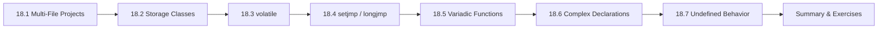

# Chapter 18: Advanced C

> **Previous:** [The C Standard Library](./17-standard-library.md)

## Learning Objectives

- Write variadic functions using `stdarg.h`
- Handle signals with `signal.h`
- Understand and use `errno` for error handling
- Use variable-length arrays (VLAs) in C99
- Understand complex number arithmetic in C99
- Understand the `restrict` qualifier and its purpose
- Write inline functions
- Use POSIX system calls basics


### Chapter at a Glance

| Topic | Key Insight | Practical Takeaway |
|-------|-------------|-------------------|
| Multi-File Projects | Split code into `.h` (interface) and `.c` (implementation) | Use header guards and include only what each file needs |
| volatile Keyword | Tells the compiler a variable may change unexpectedly | Essential for hardware registers, signal handlers, and multi-threading |
| setjmp/longjmp | Non-local goto for error recovery | More portable than inline assembly for deep unwinding |
| Variadic Functions | Functions with variable argument lists (like printf) | Use `<stdarg.h>` macros: `va_list`, `va_start`, `va_arg`, `va_end` |
| Complex Declarations | Reading C declarations right-left (spiral rule) | Start at the identifier, spiral outward, reading in precedence order |
| Undefined Behavior | The C standard leaves many constructs undefined | UB can produce any result — including appearing to work correctly |





## 18.1 Variadic Functions

A variadic function accepts a variable number of arguments. The most familiar example is `printf`. The machinery is defined in `<stdarg.h>`.

```c
#include <stdio.h>
#include <stdarg.h>

double average(int count, ...)
{
    va_list args;
    double sum = 0.0;

    va_start(args, count);   /* initialize — count is the last named parameter */

    for (int i = 0; i < count; i++) {
        sum += va_arg(args, double);   /* retrieve next double */
    }

    va_end(args);            /* cleanup */

    return sum / count;
}

int main(void)
{
    printf("Average of 4 doubles: %.2f\n", average(4, 1.5, 2.0, 3.5, 4.0));
    printf("Average of 2 doubles: %.2f\n", average(2, 10.0, 20.0));
    printf("Average of 0 doubles: %.2f\n", average(0));

    return 0;
}
```

**Output:**
```
Average of 4 doubles: 2.75
Average of 2 doubles: 15.00
Average of 0 doubles: -nan(ind)
```

### Building a Custom `printf`

```c
#include <stdio.h>
#include <stdarg.h>

void my_printf(const char *format, ...)
{
    va_list args;
    va_start(args, format);

    for (const char *p = format; *p != '\0'; p++) {
        if (*p == '%') {
            p++;
            switch (*p) {
                case 'd': {
                    int val = va_arg(args, int);
                    printf("%d", val);
                    break;
                }
                case 'f': {
                    double val = va_arg(args, double);
                    printf("%f", val);
                    break;
                }
                case 's': {
                    char *val = va_arg(args, char*);
                    printf("%s", val);
                    break;
                }
                case 'c': {
                    int val = va_arg(args, int);  /* char promoted to int */
                    putchar(val);
                    break;
                }
                case '%': {
                    putchar('%');
                    break;
                }
                default:
                    putchar('%');
                    putchar(*p);
            }
        } else {
            putchar(*p);
        }
    }

    va_end(args);
}

int main(void)
{
    my_printf("Hello %s, you scored %d/%d (%.1f%%)\n",
              "Alice", 85, 100, 85.0);
    return 0;
}
```

**Output:**
```
Hello Alice, you scored 85/100 (85.0%)
```

### Rules for Variadic Functions

1. There must be at least one named parameter before `...`.
2. The named parameter is used by `va_start` to locate the stack position.
3. The compiler does **no type checking** on variadic arguments.
4. Default argument promotions apply: `float` → `double`, `char`/`short` → `int`.
5. Always pair `va_start` with `va_end`.
6. Consider using a sentinel value or count parameter — the function has no other way to know how many arguments were passed.

> **One-Sentence Takeaway:** Variadic functions use stdarg.h and require at least one fixed parameter before ...

> **Pro Tip:** There is no way for the variadic function to know how many arguments were passed — you must communicate the count via a format string or a count parameter.
## 18.2 Signal Handling

Signals are asynchronous notifications delivered to a process. The standard library provides a minimal subset defined in `<signal.h>`.

```c
#include <stdio.h>
#include <signal.h>
#include <stdlib.h>
#include <unistd.h>   /* for sleep() */

void interrupt_handler(int sig)
{
    printf("\nCaught signal %d (SIGINT). Cleaning up...\n", sig);
    /* do minimal cleanup — many library functions are unsafe here */
    printf("Exiting gracefully.\n");
    exit(0);
}

int main(void)
{
    /* Register handler for Ctrl+C */
    signal(SIGINT, interrupt_handler);

    printf("Press Ctrl+C to trigger SIGINT...\n");

    int count = 0;
    while (1) {
        printf("Working... (%d)\n", ++count);
        sleep(1);
    }

    return 0;
}
```

### Standard Signals

| Signal | Default Action | Meaning |
|--------|---------------|---------|
| `SIGABRT` | Terminate + core | Abort signal from `abort()` |
| `SIGFPE` | Terminate + core | Floating-point exception |
| `SIGILL` | Terminate + core | Illegal instruction |
| `SIGINT` | Terminate | Interactive attention (Ctrl+C) |
| `SIGSEGV` | Terminate + core | Invalid memory reference (segfault) |
| `SIGTERM` | Terminate | Termination request |
| `SIGUSR1` | Terminate | User-defined signal 1 |
| `SIGUSR2` | Terminate | User-defined signal 2 |

```c
#include <stdio.h>
#include <signal.h>

int main(void)
{
    /* Ignore SIGINT */
    signal(SIGINT, SIG_IGN);

    printf("SIGINT is now ignored. Try Ctrl+C.\n");
    for (int i = 5; i > 0; i--) {
        printf("%d...\n", i);
        sleep(1);
    }

    /* Restore default handling */
    signal(SIGINT, SIG_DFL);
    printf("Default SIGINT handling restored.\n");
    sleep(3);

    return 0;
}
```

### Caveats

- Only async-signal-safe functions should be called from signal handlers — roughly: `write`, `_Exit`, `signal`, and a few others. `printf`, `malloc`, `free`, and most library functions are **not** safe.
- Set a volatile flag in the handler and check it in the main loop instead.
- Behavior is undefined if a signal handler calls a non-async-signal-safe function.

```c
#include <stdio.h>
#include <signal.h>
#include <stdlib.h>

volatile sig_atomic_t interrupted = 0;

void handler(int sig)
{
    interrupted = 1;   /* safe — sig_atomic_t is lock-free */
}

int main(void)
{
    signal(SIGINT, handler);

    printf("Running. Press Ctrl+C to stop.\n");
    while (!interrupted) {
        /* main work loop */
    }

    printf("\nStopped by signal. Performing cleanup...\n");
    return 0;
}
```

> **One-Sentence Takeaway:** Signals are software interrupts that can be caught handled or ignored

## 18.3 Error Handling with `errno`

The global variable `errno` (declared in `<errno.h>`) is set by many library functions to indicate what went wrong.

```c
#include <stdio.h>
#include <math.h>
#include <errno.h>
#include <string.h>   /* for strerror */

int main(void)
{
    errno = 0;                       /* reset first */
    double result = sqrt(-1.0);      /* domain error */

    if (errno == EDOM) {
        printf("Domain error: sqrt of negative number\n");
        printf("  strerror: %s\n", strerror(errno));
    }

    errno = 0;
    result = exp(1000.0);            /* range error */
    if (errno == ERANGE) {
        printf("Range error: exp overflow\n");
        printf("  strerror: %s\n", strerror(errno));
    }

    /* perror — convenience wrapper */
    FILE *f = fopen("nonexistent.txt", "r");
    if (!f) {
        perror("fopen failed");
    }

    return 0;
}
```

**Output:**
```
Domain error: sqrt of negative number
  strerror: Domain error
Range error: exp overflow
  strerror: Numerical result out of range
fopen failed: No such file or directory
```

### Best Practices

- **Always reset** `errno` to 0 before calling a function that might set it.
- Use `strerror(errno)` or `perror()` for human-readable messages.
- Not every function sets `errno` — check the documentation.
- Thread-local `errno` is required by C11 (each thread has its own copy).

> **One-Sentence Takeaway:** errno is set by many library functions on error — always check immediately after the call

## 18.4 Variable-Length Arrays (C99)

VLAs allow arrays whose size is determined at runtime. They exist only in C99 (made optional in C11).

```c
#include <stdio.h>

int main(void)
{
    int n;

    printf("Enter array size: ");
    scanf("%d", &n);

    int arr[n];           /* VLA — size determined at runtime */
    printf("Size of VLA: %zu bytes\n", sizeof(arr));

    for (int i = 0; i < n; i++) {
        arr[i] = i * i;
    }

    for (int i = 0; i < n; i++) {
        printf("arr[%d] = %d\n", i, arr[i]);
    }

    return 0;
}
```

### VLAs in Function Parameters

```c
void matrix_multiply(int rows, int cols, int a[rows][cols],
                     int b[cols], int result[rows])
{
    for (int i = 0; i < rows; i++) {
        result[i] = 0;
        for (int j = 0; j < cols; j++) {
            result[i] += a[i][j] * b[j];
        }
    }
}
```

### Caveats

- VLAs are allocated on the stack — large VLAs can overflow the stack.
- No error is reported if allocation fails (typically a segfault).
- VLAs cannot be declared at file scope or with `static` storage.
- `sizeof` on a VLA is evaluated at runtime, not compile time.
- Visual Studio does **not** support VLAs (use dynamic allocation instead).

> **One-Sentence Takeaway:** VLAs (C99) have automatic storage duration and size determined at runtime

> **Warning:** VLAs are optional in C11. They cannot be used at file scope or with static storage duration. Always check compiler support for VLAs before using them.
## 18.5 Complex Numbers (C99)

C99 introduced native complex number support via `<complex.h>`.

```c
#include <stdio.h>
#include <complex.h>

int main(void)
{
    double complex z1 = 1.0 + 2.0 * I;
    double complex z2 = 3.0 - 1.0 * I;

    double complex sum   = z1 + z2;
    double complex prod  = z1 * z2;
    double complex conj  = conj(z1);
    double mod = cabs(z1);
    double arg = carg(z1);

    printf("z1        = %.2f %+.2fi\n", creal(z1), cimag(z1));
    printf("z2        = %.2f %+.2fi\n", creal(z2), cimag(z2));
    printf("z1 + z2   = %.2f %+.2fi\n", creal(sum), cimag(sum));
    printf("z1 * z2   = %.2f %+.2fi\n", creal(prod), cimag(prod));
    printf("conj(z1)  = %.2f %+.2fi\n", creal(conj), cimag(conj));
    printf("|z1|      = %.2f\n", mod);
    printf("arg(z1)   = %.2f rad\n", arg);

    return 0;
}
```

**Output:**
```
z1        = 1.00 +2.00i
z2        = 3.00 -1.00i
z1 + z2   = 4.00 +1.00i
z1 * z2   = 5.00 +5.00i
conj(z1)  = 1.00 -2.00i
|z1|      = 2.24
arg(z1)   = 1.11 rad
```

**Link with `-lm`.**

## 18.6 The `restrict` Qualifier (C99)

`restrict` is a hint to the compiler that a pointer is the **only** pointer that accesses a particular memory region within its scope. This enables better optimization.

```c
#include <stdio.h>
#include <string.h>

void vector_add(int *restrict c,
                const int *restrict a,
                const int *restrict b, int n)
{
    for (int i = 0; i < n; i++) {
        c[i] = a[i] + b[i];   /* compiler can assume no aliasing */
    }
}

int main(void)
{
    int a[] = {1, 2, 3, 4, 5};
    int b[] = {10, 20, 30, 40, 50};
    int c[5];

    vector_add(c, a, b, 5);

    printf("Result: ");
    for (int i = 0; i < 5; i++) printf("%d ", c[i]);
    printf("\n");

    return 0;
}
```

### Without `restrict`

```c
void vector_add(int *c, int *a, int *b, int n)
{
    for (int i = 0; i < n; i++) {
        c[i] = a[i] + b[i];
    }
}
```

The compiler must assume that `c` could overlap with `a` or `b`, so it must re-read `a[i]` and `b[i]` from memory on each iteration. With `restrict`, the compiler may keep them in registers.

**Violating `restrict` (undefined behavior):**

```c
int arr[] = {1, 2, 3, 4, 5};
vector_add(arr, arr, arr + 2, 3);   /* undefined — c and a overlap */
```


> **One-Sentence Takeaway:** The restrict qualifier promises exclusive pointer access enabling optimization
> **Remember:** The restrict qualifier is a promise of exclusive access not a compiler check.
## 18.7 Inline Functions (C99)

Inline functions tell the compiler to replace a function call with the function body directly, eliminating call overhead.

```c
#include <stdio.h>

/* Function likely to be inlined */
inline int max(int a, int b)
{
    return (a > b) ? a : b;
}

int main(void)
{
    int x = 42, y = 17;
    printf("max(%d, %d) = %d\n", x, y, max(x, y));

    return 0;
}
```

### Inline Rules

- `inline` is a **hint**, not a command — the compiler may ignore it.
- An inline function must be defined in the same translation unit where it's called (typically in a header file).
- The compiler may still emit an external definition for the inline function.
- Use `static inline` to guarantee no external symbol is emitted:

```c
static inline int square(int x) { return x * x; }
```

### When to Inline

- Very small, frequently called functions (getters, comparison helpers).
- Inside performance-critical loops.
- Short functions where call overhead is comparable to the function body.
- Do not inline: large functions, functions called rarely, functions with complex control flow.

> **One-Sentence Takeaway:** Inline functions suggest the compiler replace the call with the function body

## 18.8 POSIX System Calls (Basics)

POSIX (Portable Operating System Interface) extends the C standard library with system-level operations. This is platform-specific but available on all Unix-like systems.

### Open, Read, Write (Low-Level I/O)

```c
#include <stdio.h>
#include <unistd.h>
#include <fcntl.h>
#include <string.h>

int main(void)
{
    int fd = open("example.txt", O_WRONLY | O_CREAT | O_TRUNC, 0644);
    if (fd < 0) {
        perror("open");
        return 1;
    }

    const char *msg = "Hello from POSIX!\n";
    ssize_t bytes_written = write(fd, msg, strlen(msg));
    printf("Wrote %zd bytes\n", bytes_written);

    close(fd);

    /* Read it back */
    fd = open("example.txt", O_RDONLY);
    char buf[128];
    ssize_t bytes_read = read(fd, buf, sizeof(buf) - 1);
    buf[bytes_read] = '\0';
    printf("Read %zd bytes: %s", bytes_read, buf);

    close(fd);
    return 0;
}
```

### File System Operations

```c
#include <stdio.h>
#include <sys/stat.h>
#include <unistd.h>

int main(void)
{
    struct stat st;

    if (stat("example.txt", &st) == 0) {
        printf("File size: %lld bytes\n", (long long)st.st_size);
        printf("Permissions: %o\n", st.st_mode & 0777);
        printf("Last modified: %ld\n", (long)st.st_mtime);
    } else {
        perror("stat");
    }

    return 0;
}
```

### Process Management

```c
#include <stdio.h>
#include <unistd.h>
#include <sys/wait.h>

int main(void)
{
    pid_t pid = fork();

    if (pid == 0) {
        /* Child process */
        printf("Child: PID = %d, Parent PID = %d\n", getpid(), getppid());
        return 42;   /* exit status */
    } else if (pid > 0) {
        /* Parent process */
        printf("Parent: Child PID = %d\n", pid);

        int status;
        wait(&status);   /* wait for child */
        if (WIFEXITED(status)) {
            printf("Child exited with status %d\n", WEXITSTATUS(status));
        }
    } else {
        perror("fork");
        return 1;
    }

    return 0;
}
```

**Output (varies):**
```
Parent: Child PID = 12345
Child: PID = 12345, Parent PID = 12344
Child exited with status 42
```

> **One-Sentence Takeaway:** POSIX system calls provide low-level OS access beyond the C standard library

## Concept Comparison Table

| Feature | Advantage | Risk |
|---------|-----------|------|
| `volatile` | Prevents compiler optimization on expected-changing values | Does not provide atomicity |
| `setjmp/longjmp` | Unwinds multiple stack frames at once | Skips destructors; can leave state inconsistent |
| Variadic args | Flexible function interfaces | No type safety |
| Multi-file | Modularity, separation of concerns | Header dependency management |
| `inline` (C99) | Eliminates function call overhead | Code bloat if overused |

## Quick Reference

| Task | Code |
|------|------|
| Volatile variable | `volatile int *reg = (int*)0x4000;` |
| setjmp/longjmp | `if (setjmp(buf)) { /* error path */ }` / `longjmp(buf, 1);` |
| Variadic function | `void log(const char *fmt, ...) { va_list ap; va_start(ap, fmt); vprintf(fmt, ap); va_end(ap); }` |
| Complex declaration | `int (*(*fp)(int))[5];` — fp is a pointer to a function taking int and returning a pointer to an array of 5 ints |
| Extern variable | `extern int global_count;` in header; `int global_count = 0;` in one .c |

## Cross-Application Matrix

| Domain | Advanced C Feature |
|--------|-------------------|
| Embedded systems | `volatile` for memory-mapped registers |
| Error recovery | `setjmp/longjmp` for deep error unwinding |
| Logging libraries | Variadic functions for flexible log APIs |
| Firmware | `const` + `volatile` for read-only hardware registers |
| Large projects | Multi-file modular design with `static` and `extern` |
| Code obfuscation | Complex declarations (please avoid in production) |

## Chapter Quiz

1. What does the `volatile` keyword guarantee?
   A) Atomic access to the variable
   B) Every read/write goes to memory, not a register copy
   C) Thread safety
   D) The variable is stored in ROM

<details><summary>Answer</summary>**B)** `volatile` forces the compiler to generate a memory access for each read and write, preventing register caching.</details>

2. What must every variadic function have?
   A) A format string argument
   B) At least one fixed (named) parameter before `...`
   C) Exactly 3 arguments
   D) A return type of `int`

<details><summary>Answer</summary>**B)** The C standard requires at least one named parameter before the ellipsis so `va_start` has a reference point.</details>

3. Which of the following is undefined behavior in C?
   A) Unsigned integer overflow
   B) Signed integer overflow
   C) Accessing a valid array element
   D) Calling `free(NULL)`

<details><summary>Answer</summary>**B)** Signed integer overflow is undefined behavior. Unsigned overflow wraps around (well-defined). `free(NULL)` is safe.</details>

## Summary

- Variadic functions use `<stdarg.h>` macros: `va_start`, `va_arg`, `va_end`, `va_copy`. The last named parameter tells `va_start` where to begin.
- Signal handlers are for emergency responses. Use `volatile sig_atomic_t` flags and only async-signal-safe functions inside handlers.
- `errno` indicates error details after a library function fails. Reset it before calling and check it after.
- VLAs (C99) provide runtime-sized stack arrays. Avoid large sizes; they crash without recovery.
- Complex arithmetic in C99 via `<complex.h>` treats complex numbers as a native type.
- `restrict` helps the optimizer by promising no pointer aliasing.
- `inline` functions reduce call overhead for tiny, frequent functions.
- POSIX system calls provide low-level OS access: file I/O, process management, file system queries.

## Exercises

### Review Questions

1. What does `va_start` do? Why does it need the last named parameter?
2. Why should you never call `printf` inside a signal handler?
3. What is the difference between `EDOM` and `ERANGE`?
4. What is a VLA? List two disadvantages.
5. What does the `restrict` qualifier promise to the compiler?
6. What happens if two pointers marked `restrict` actually alias?

### Application Problems

1. Write a variadic function `double sum(int n, ...)` that returns the sum of `n` doubles. Then write a `double sum_product(int n, ...)` that takes pairs of (multiplier, value) and returns the sum of all products. Example: `sum_product(2, 2.0, 3.0, 3.0, 4.0)` should return `2*3 + 3*4 = 18`.

2. Write a program that catches `SIGFPE` (floating-point exception). Intentionally cause a division by zero and handle it gracefully by resetting `errno` and continuing. (Hint: integer division by zero kills the process — use floating-point division.)

3. Implement a safe string concatenation function using `errno`:
   ```c
   int safe_strcat(char *dest, size_t dest_size, const char *src);
   ```
   Returns 0 on success, sets `errno` to `ERANGE` and returns -1 if the result would exceed `dest_size`.

4. Use `fork()` to create a **parallel sum** of an array. Split the array in half, have each child sum its half (using `_exit` to return the partial sum via exit status — limit: 0–255), and the parent adds the two halves.

### Challenge Problem

Implement a minimal **shell** (`mysh`) using POSIX system calls:

- Print a prompt (`mysh> `), read a command line.
- Parse the command and arguments using `strtok`.
- Use `fork()` + `execvp()` to run the command.
- Use `waitpid()` to wait for completion.
- Support built-in commands: `cd`, `pwd`, `exit`.
- Report the exit status of the completed command.
- Handle `SIGINT` (Ctrl+C) in the parent by printing a new prompt (not terminating).

Test it by running commands like `ls -l`, `echo hello world`, `cd /tmp`, and verifying child exit status on failure (e.g., `nonexistent-command`).
