# Chapter 1: Introduction to Cloud Computing

> **Next:** [Chapter 2: Virtualization](./02-virtualization.md)

## Learning Objectives

After completing this chapter, students will be able to:

1. Define cloud computing according to the NIST SP 800-145 standard.
2. Describe the five essential characteristics of cloud computing.
3. Differentiate between Infrastructure as a Service, Platform as a Service, and Software as a Service.
4. Compare and contrast public, private, hybrid, community, and multi-cloud deployment models.
5. Analyze the economic differences between capital expenditure and operational expenditure models.
6. Evaluate the benefits and challenges of adopting cloud computing.
7. Identify the major cloud service providers and their market positioning.
8. Apply the 6 Rs framework to cloud migration planning.
9. Assess vendor lock-in risks and mitigation strategies.

## Chapter at a Glance

| Topic | Key Insight | Practical Takeaway |
|-------|-------------|--------------------|
| NIST Definition | 5 essential characteristics define true cloud computing | Distinguishes cloud from traditional hosting |
| IaaS | Virtualized compute, storage, networking | Full control, no hardware management |
| PaaS | Managed platform for application deployment | Focus on code, skip infrastructure |
| SaaS | Fully managed applications | Zero ops, use as-is |
| Deployment Models | Public, Private, Hybrid, Community, Multi-Cloud | Each has different trade-offs |
| Cloud Economics | CAPEX ? OPEX shift | Pay for what you use, no upfront investment |
| 6 Rs Migration | Rehost, Replatform, Refactor, Repurchase, Retire, Retain | Choose strategy by business value |

## Chapter Roadmap


## Theory

### 1.1 Definition of Cloud Computing

<a href="../../assets/images/diagrams/cloud-computing/01-introduction/1-1-definition-of-cloud-computing-handwritten.svg" target="_blank" rel="noopener">
  
</a>
<a href="../../assets/images/diagrams/cloud-computing/01-introduction/1-1-definition-of-cloud-computing-diagram.svg" target="_blank" rel="noopener">
  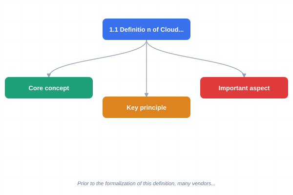
</a>
<a href="../../assets/images/diagrams/cloud-computing/01-introduction/1-1-definition-of-cloud-computing-sticky.svg" target="_blank" rel="noopener">
  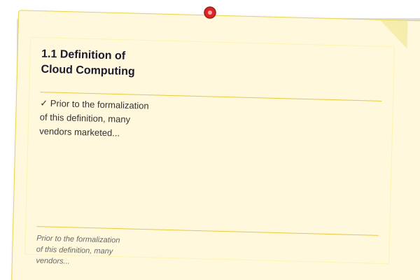
</a>


The National Institute of Standards and Technology (NIST) Special Publication 800-145 defines cloud computing as "a model for enabling ubiquitous, convenient, on-demand network access to a shared pool of configurable computing resources (e.g., networks, servers, storage, applications, and services) that can be rapidly provisioned and released with minimal management effort or service provider interaction." This definition has become the canonical reference point for the industry and academia alike.

The NIST definition is significant because it establishes a clear boundary between true cloud computing and traditional hosted services. Prior to the formalization of this definition, many vendors marketed managed hosting as "cloud" computing. The five essential characteristics, three service models, and four deployment models together form the complete cloud computing framework.

### 1.2 Essential Characteristics

<a href="../../assets/images/diagrams/cloud-computing/01-introduction/1-2-essential-characteristics-handwritten.svg" target="_blank" rel="noopener">
  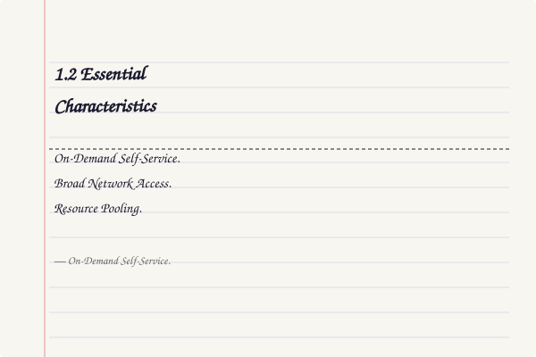
</a>
<a href="../../assets/images/diagrams/cloud-computing/01-introduction/1-2-essential-characteristics-diagram.svg" target="_blank" rel="noopener">
  
</a>
<a href="../../assets/images/diagrams/cloud-computing/01-introduction/1-2-essential-characteristics-sticky.svg" target="_blank" rel="noopener">
  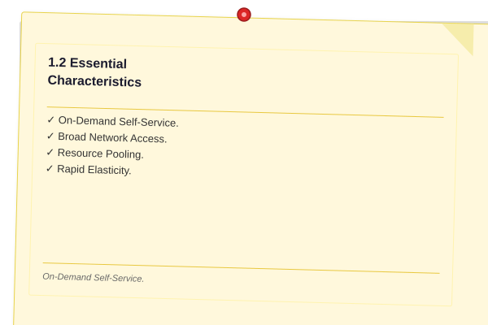
</a>


**On-Demand Self-Service.** A consumer can provision computing capabilities unilaterally without requiring human interaction with the service provider. This is typically accomplished through a web portal, API, or command-line interface. The implication is profound: infrastructure that once required a purchase order, a hardware lead time of weeks, and manual configuration by system administrators can now be created in seconds through an API call.

**Broad Network Access.** Resources are available over the network and accessed through standard mechanisms that promote use by heterogeneous thin or thick client platforms (e.g., mobile phones, tablets, laptops, workstations). This characteristic ensures that cloud resources are not tied to a specific physical location or device. Standard protocols such as HTTPS, SSH, and TLS form the backbone of cloud accessibility.

**Resource Pooling.** The provider's computing resources are pooled to serve multiple consumers using a multi-tenant model, with different physical and virtual resources dynamically assigned and reassigned according to consumer demand. There is a sense of location independence in that the customer generally has no control or knowledge over the exact location of the provided resources but may be able to specify location at a higher level of abstraction (e.g., country, state, or availability zone). Examples of pooled resources include storage, processing power, memory, and network bandwidth.

**Rapid Elasticity.** Capabilities can be elastically provisioned and released, in some cases automatically, to scale rapidly outward and inward commensurate with demand. To the consumer, the capabilities available for provisioning often appear to be unlimited and can be appropriated in any quantity at any time. This is the defining characteristic that separates cloud computing from traditional IT infrastructure. An e-commerce platform handling Black Friday traffic might scale from ten servers to ten thousand servers and back down within hours.

**Measured Service.** Cloud systems automatically control and optimize resource use by leveraging a metering capability at some level of abstraction appropriate to the type of service (e.g., storage, processing, bandwidth, active user accounts). Resource usage can be monitored, controlled, and reported, providing transparency for both the provider and consumer of the utilized service. This pay-per-use billing model is fundamental to cloud economics.

### 1.3 Service Models

<a href="../../assets/images/diagrams/cloud-computing/01-introduction/1-3-service-models-handwritten.svg" target="_blank" rel="noopener">
  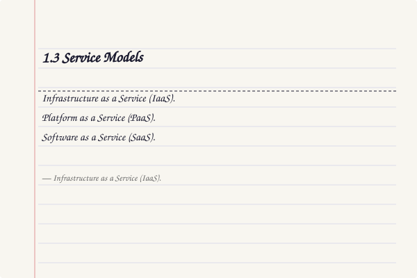
</a>
<a href="../../assets/images/diagrams/cloud-computing/01-introduction/1-3-service-models-diagram.svg" target="_blank" rel="noopener">
  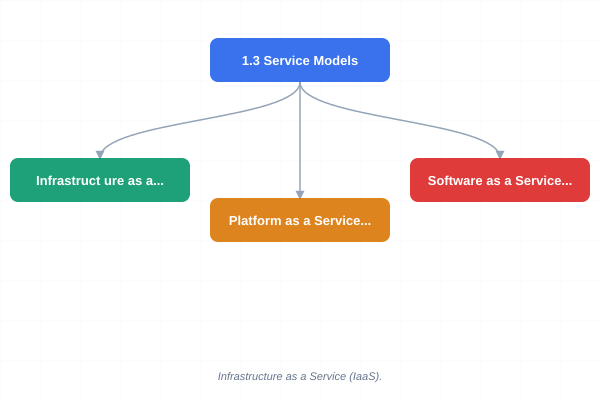
</a>
<a href="../../assets/images/diagrams/cloud-computing/01-introduction/1-3-service-models-sticky.svg" target="_blank" rel="noopener">
  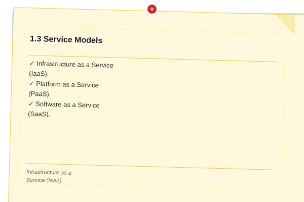
</a>


**Infrastructure as a Service (IaaS).** The provider offers virtualized computing resources over the internet. The consumer can provision processing, storage, networks, and other fundamental computing resources and deploy and run arbitrary software, which can include operating systems and applications. The consumer does not manage or control the underlying cloud infrastructure but has control over operating systems, storage, and deployed applications, and possibly limited control over select networking components (e.g., host firewalls). IaaS is best suited for workloads that require fine-grained control over the infrastructure stack. Examples include AWS EC2, Azure Virtual Machines, and Google Compute Engine.

**Platform as a Service (PaaS).** The consumer deploys applications onto the cloud infrastructure using programming languages, libraries, services, and tools supported by the provider. The consumer does not manage or control the underlying cloud infrastructure including network, servers, operating systems, or storage, but has control over the deployed applications and possibly the configuration settings for the application-hosting environment. PaaS abstracts away infrastructure management entirely, allowing developers to focus exclusively on code. Examples include AWS Elastic Beanstalk, Azure App Service, and Google App Engine.

**Software as a Service (SaaS).** The consumer uses the provider's applications running on a cloud infrastructure. The applications are accessible from various client devices through either a thin client interface, such as a web browser (e.g., web-based email), or a programmatic interface. The consumer does not manage or control the underlying cloud infrastructure including network, servers, operating systems, storage, or even individual application capabilities, with the possible exception of limited user-specific application configuration settings. Examples include Salesforce, Google Workspace, Microsoft 365, and Slack.

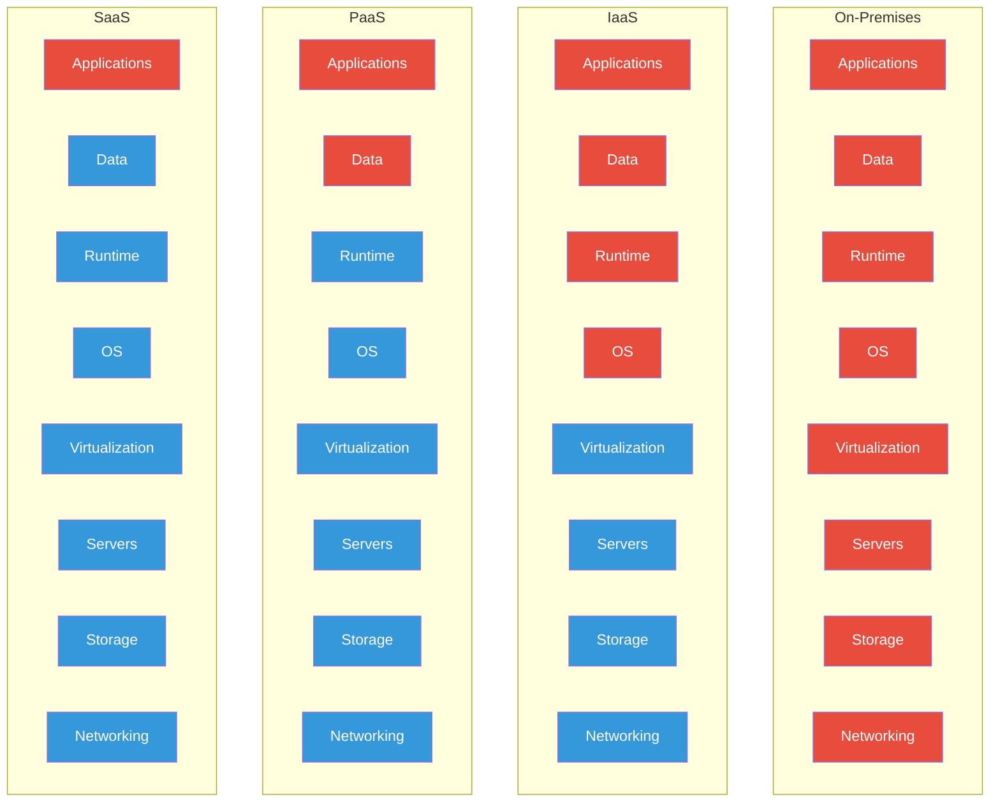

### 1.4 Service Model Comparison

<a href="../../assets/images/diagrams/cloud-computing/01-introduction/1-4-service-model-comparison-handwritten.svg" target="_blank" rel="noopener">
  
</a>
<a href="../../assets/images/diagrams/cloud-computing/01-introduction/1-4-service-model-comparison-diagram.svg" target="_blank" rel="noopener">
  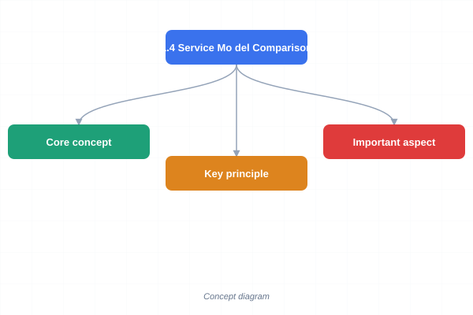
</a>
<a href="../../assets/images/diagrams/cloud-computing/01-introduction/1-4-service-model-comparison-sticky.svg" target="_blank" rel="noopener">
  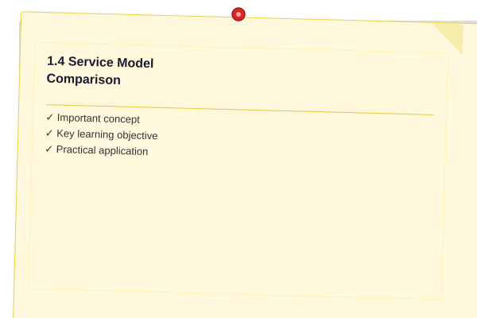
</a>


| Aspect | IaaS | PaaS | SaaS |
|--------|------|------|------|
| What you manage | Apps, data, runtime, OS, middleware | Apps, data | Users, configuration |
| What provider manages | Virtualization, servers, storage, networking | Runtime, OS, virtualization, servers, storage, networking | Everything including apps |
| Technical skill needed | System administration | Development only | No technical skill |
| Customization | Full OS and app control | Platform-constrained | Limited config |
| Scalability | Manual or auto via ASG | Auto-scaling built in | Provider handles |
| Example providers | AWS EC2, Azure VMs, GCE | Elastic Beanstalk, App Service, App Engine | Salesforce, Google Workspace |
| Typical use case | Legacy migration, specialized workloads | Web apps, APIs, microservices | Email, CRM, collaboration |

### 1.5 Deployment Models

<a href="../../assets/images/diagrams/cloud-computing/01-introduction/1-5-deployment-models-handwritten.svg" target="_blank" rel="noopener">
  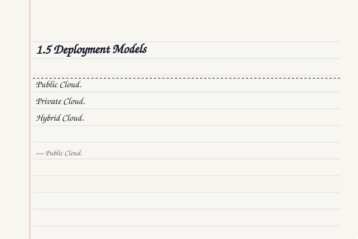
</a>
<a href="../../assets/images/diagrams/cloud-computing/01-introduction/1-5-deployment-models-diagram.svg" target="_blank" rel="noopener">
  
</a>
<a href="../../assets/images/diagrams/cloud-computing/01-introduction/1-5-deployment-models-sticky.svg" target="_blank" rel="noopener">
  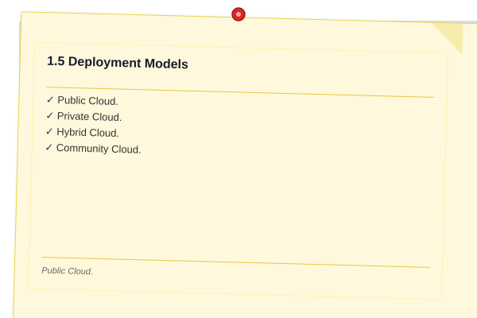
</a>


**Public Cloud.** The cloud infrastructure is provisioned for open use by the general public. It may be owned, managed, and operated by a business, academic, or government organization, or some combination of them. It exists on the premises of the cloud provider. Public cloud offers economies of scale, elastic capacity, and pay-as-you-go pricing. The trade-off is reduced control over physical infrastructure and potential data residency concerns.

**Private Cloud.** The cloud infrastructure is provisioned for exclusive use by a single organization comprising multiple consumers (e.g., business units). It may be owned, managed, and operated by the organization, a third party, or some combination of them, and it may exist on or off premises. Private cloud offers greater control over security, compliance, and customization but requires significant capital investment and operational overhead.

**Hybrid Cloud.** The cloud infrastructure is a composition of two or more distinct cloud infrastructures (private, community, or public) that remain unique entities but are bound together by standardized or proprietary technology that enables data and application portability (e.g., cloud bursting for load balancing between clouds). Hybrid cloud offers the best of both worlds: sensitive workloads remain in private cloud while burst capacity and less sensitive workloads use public cloud. The trade-off is increased architectural complexity.

**Community Cloud.** The cloud infrastructure is provisioned for exclusive use by a specific community of consumers from organizations that have shared concerns (e.g., mission, security requirements, policy, and compliance considerations). It may be owned, managed, and operated by one or more of the organizations in the community, a third party, or some combination of them. Community cloud is common in regulated industries such as healthcare, finance, and government.

**Multi-Cloud.** Multi-cloud refers to the use of two or more public cloud providers simultaneously. This strategy avoids vendor lock-in, provides geographic redundancy, and allows organizations to use the best-of-breed services from each provider. However, multi-cloud introduces significant complexity in networking, security, and operations.

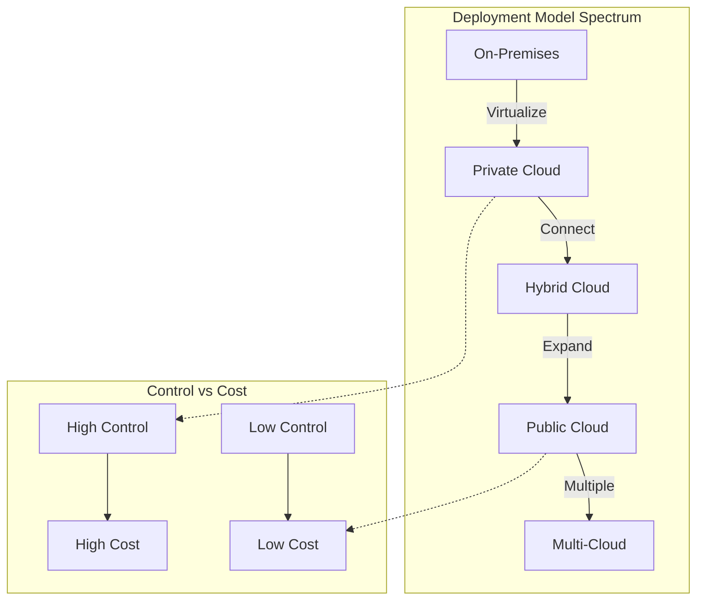

### 1.6 Cloud Economics

<a href="../../assets/images/diagrams/cloud-computing/01-introduction/1-6-cloud-economics-handwritten.svg" target="_blank" rel="noopener">
  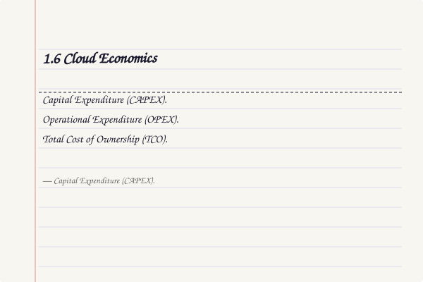
</a>
<a href="../../assets/images/diagrams/cloud-computing/01-introduction/1-6-cloud-economics-diagram.svg" target="_blank" rel="noopener">
  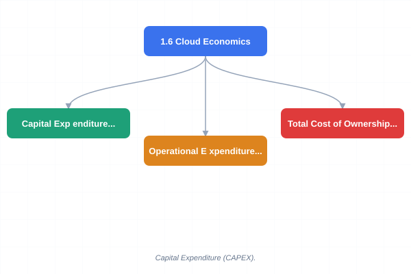
</a>
<a href="../../assets/images/diagrams/cloud-computing/01-introduction/1-6-cloud-economics-sticky.svg" target="_blank" rel="noopener">
  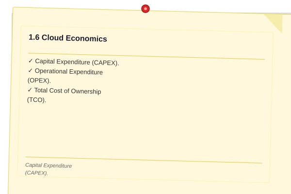
</a>


**Capital Expenditure (CAPEX).** In the traditional on-premises IT model, organizations invest heavily in hardware, software, data center facilities, and staffing before realizing any value. CAPEX is characterized by large upfront costs, depreciation schedules spanning multiple years, and the risk of over-provisioning or under-provisioning. The organization bears the full financial risk of capacity planning errors.

**Operational Expenditure (OPEX).** Cloud computing shifts costs from CAPEX to OPEX, where organizations pay only for the resources they consume. This model provides financial flexibility, eliminates upfront investment, and aligns costs directly with business activity. OPEX also includes the operational costs of managing cloud resources, including data transfer, support plans, and specialized services.

| Cost Category | Traditional (CAPEX) | Cloud (OPEX) |
|---------------|---------------------|---------------|
| Hardware | $50,000?$500,000 upfront | $0 upfront |
| Software licenses | Perpetual licenses, upfront | Subscription, monthly |
| Facilities | Data center construction/lease | Included in provider price |
| Power & cooling | $100?$300/kW/month | Included in provider price |
| Staffing | Full-time ops team | Reduced ops headcount |
| Scaling | Over-provision or under-provision | Elastic, pay-as-you-go |
| Upgrades | Manual, disruptive | Automatic by provider |
| Depreciation | 3-5 year schedules | No depreciation |

**Total Cost of Ownership (TCO).** TCO analysis compares the full cost of on-premises infrastructure (hardware, software, labor, facilities, electricity, cooling, and network) against the equivalent cloud services. Cloud TCO must account for compute costs, storage costs, data transfer costs, and the labor costs of cloud operations. Organizations must also factor in the cost of downtime, disaster recovery, and security compliance. Cloud often proves more cost-effective for variable workloads, while predictable, high-utilization workloads may be cheaper on-premises.

### 1.7 Cloud Adoption Drivers

<a href="../../assets/images/diagrams/cloud-computing/01-introduction/1-7-cloud-adoption-drivers-handwritten.svg" target="_blank" rel="noopener">
  
</a>
<a href="../../assets/images/diagrams/cloud-computing/01-introduction/1-7-cloud-adoption-drivers-diagram.svg" target="_blank" rel="noopener">
  
</a>
<a href="../../assets/images/diagrams/cloud-computing/01-introduction/1-7-cloud-adoption-drivers-sticky.svg" target="_blank" rel="noopener">
  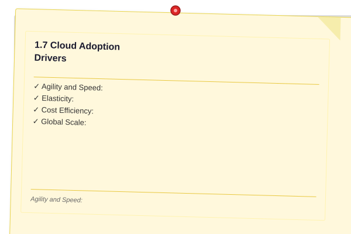
</a>


Organizations adopt cloud computing for several strategic reasons:

- **Agility and Speed:** Provision resources in minutes instead of weeks. Development teams can spin up test environments instantly and experiment without procurement delays.
- **Elasticity:** Match capacity to demand in real time. No more over-provisioning for peak load or under-provisioning and losing revenue.
- **Cost Efficiency:** Convert fixed costs to variable costs. Pay only for what you use, when you use it.
- **Global Scale:** Deploy applications in data centers around the world with a few clicks. Reach users wherever they are with low latency.
- **Innovation Access:** Leverage advanced services (AI/ML, big data, IoT, serverless) that would be prohibitively expensive to build on-premises.
- **Focus on Core Business:** Offload undifferentiated heavy lifting (server maintenance, patching, capacity planning) to the provider.

### 1.8 Common Cloud Myths

<a href="../../assets/images/diagrams/cloud-computing/01-introduction/1-8-common-cloud-myths-handwritten.svg" target="_blank" rel="noopener">
  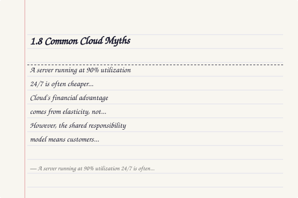
</a>
<a href="../../assets/images/diagrams/cloud-computing/01-introduction/1-8-common-cloud-myths-diagram.svg" target="_blank" rel="noopener">
  
</a>
<a href="../../assets/images/diagrams/cloud-computing/01-introduction/1-8-common-cloud-myths-sticky.svg" target="_blank" rel="noopener">
  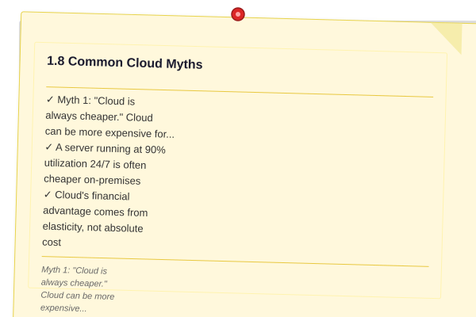
</a>


Myth 1: "Cloud is always cheaper." Cloud can be more expensive for predictable, high-utilization workloads. A server running at 90% utilization 24/7 is often cheaper on-premises. Cloud's financial advantage comes from elasticity, not absolute cost.

Myth 2: "Cloud is less secure." Major cloud providers invest billions in security ? more than most organizations can afford. However, the shared responsibility model means customers must configure their part correctly. Misconfiguration, not the provider, causes most cloud breaches.

Myth 3: "Cloud means losing control." Organizations retain full control over their data, who accesses it, and how it is encrypted. Cloud providers offer extensive governance tools for policy enforcement, auditing, and access control.

Myth 4: "Migration is a one-time project." Cloud adoption is an ongoing journey. Initial lift-and-shift migration is just the first step. Modernization, optimization, and governance are continuous processes.

Myth 5: "All workloads should move to the cloud." Some workloads are better kept on-premises due to latency requirements, regulatory constraints, or economic factors. The right strategy is selective migration, not wholesale movement.

### 1.9 Cloud Migration Strategies (The 6 Rs)

<a href="../../assets/images/diagrams/cloud-computing/01-introduction/1-9-cloud-migration-strategies-the-6-rs-handwritten.svg" target="_blank" rel="noopener">
  
</a>
<a href="../../assets/images/diagrams/cloud-computing/01-introduction/1-9-cloud-migration-strategies-the-6-rs-diagram.svg" target="_blank" rel="noopener">
  
</a>
<a href="../../assets/images/diagrams/cloud-computing/01-introduction/1-9-cloud-migration-strategies-the-6-rs-sticky.svg" target="_blank" rel="noopener">
  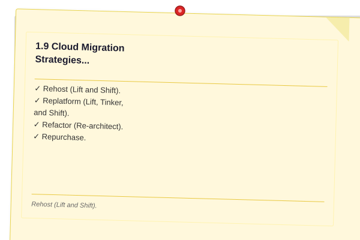
</a>


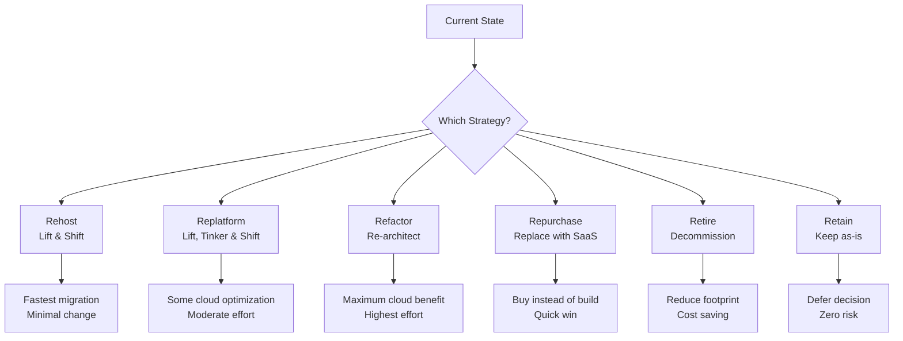

**Rehost (Lift and Shift).** Move applications as-is to the cloud with minimal changes. Fastest migration path. Suitable for legacy applications that are difficult to modify. Often automated with tools like AWS Application Migration Service or Azure Migrate. Provides immediate benefits from data center exit but limited cloud-native advantages.

**Replatform (Lift, Tinker, and Shift).** Make minor cloud-optimizing changes during migration without changing core architecture. Examples: moving from self-managed MySQL to RDS, or from on-premises load balancers to cloud-native ALB. Balances speed with some cloud benefits.

**Refactor (Re-architect).** Rebuild the application using cloud-native patterns (microservices, serverless, containers). Highest effort but maximum benefit: elasticity, reduced costs, improved resilience. Usually reserved for applications where the business value justifies the investment.

**Repurchase.** Replace the application with a SaaS alternative. Eliminates all maintenance burden. Common for CRM (replace with Salesforce), email (replace with Google Workspace), and HR systems.

**Retire.** Decommission applications that are no longer needed. Many organizations find 10-20% of their application portfolio has no business owner or active users.

**Retain.** Keep applications on-premises for now. Valid reasons: regulatory constraints, extreme latency sensitivity, recent major investment in on-premises infrastructure, or pending decommission.

### 1.10 Vendor Lock-in

<a href="../../assets/images/diagrams/cloud-computing/01-introduction/1-10-vendor-lock-in-handwritten.svg" target="_blank" rel="noopener">
  
</a>
<a href="../../assets/images/diagrams/cloud-computing/01-introduction/1-10-vendor-lock-in-diagram.svg" target="_blank" rel="noopener">
  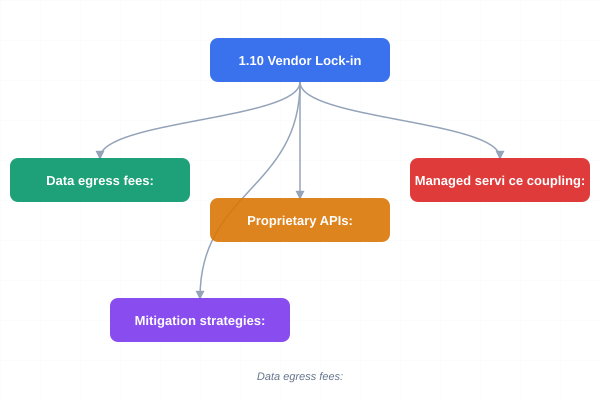
</a>
<a href="../../assets/images/diagrams/cloud-computing/01-introduction/1-10-vendor-lock-in-sticky.svg" target="_blank" rel="noopener">
  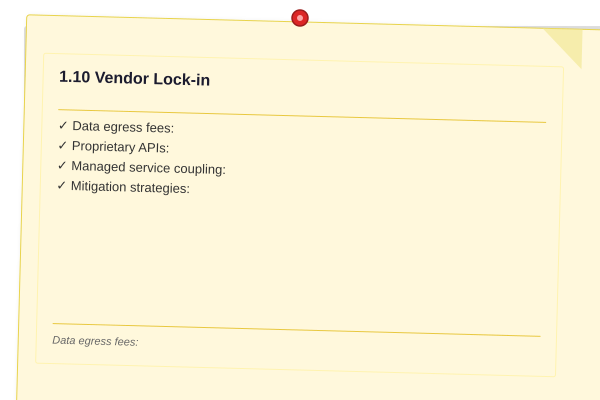
</a>


Vendor lock-in occurs when a customer becomes dependent on a specific provider's proprietary services and faces significant cost or complexity when switching. In cloud computing, lock-in risks include:

- **Data egress fees:** Most providers charge to move data out ($0.05?$0.12/GB). Moving petabytes of data can cost hundreds of thousands of dollars.
- **Proprietary APIs:** Services like DynamoDB, SQS, and Lambda use provider-specific APIs. Code written for one provider requires rework for another.
- **Managed service coupling:** Using managed databases, message queues, or AI services ties the architecture to that provider.

**Mitigation strategies:**
- Use open standards and multi-cloud tools (Terraform, Kubernetes, Docker)
- Design for portability at the application layer
- Maintain data portability (avoid proprietary database features)
- Negotiate data egress discounts for large volumes
- Use cloud-agnostic abstraction layers (Dapr, Knative, CloudEvents)

### 1.11 Benefits and Challenges

<a href="../../assets/images/diagrams/cloud-computing/01-introduction/1-11-benefits-and-challenges-handwritten.svg" target="_blank" rel="noopener">
  
</a>
<a href="../../assets/images/diagrams/cloud-computing/01-introduction/1-11-benefits-and-challenges-diagram.svg" target="_blank" rel="noopener">
  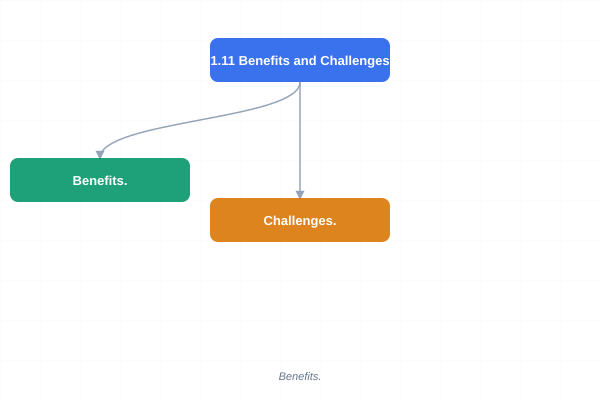
</a>
<a href="../../assets/images/diagrams/cloud-computing/01-introduction/1-11-benefits-and-challenges-sticky.svg" target="_blank" rel="noopener">
  
</a>


**Benefits.** Cloud computing offers agility through rapid provisioning, global reach through geographically distributed data centers, elasticity to match capacity to demand, pay-as-you-go pricing that aligns costs with usage, reduced maintenance burden, improved disaster recovery capabilities, automatic software updates, increased collaboration, and access to advanced technologies such as machine learning, big data analytics, and serverless computing that would be prohibitively expensive to implement on-premises.

**Challenges.** Cloud adoption presents several challenges: security and compliance concerns around data protection and regulatory requirements, vendor lock-in risks associated with proprietary services, cost management complexity due to the granularity of billing, technical expertise requirements for cloud architecture and operations, latency and bandwidth constraints for latency-sensitive applications, data transfer costs for large-scale data movement, and the complexity of integrating cloud services with existing on-premises systems.

### 1.12 Major Cloud Providers

<a href="../../assets/images/diagrams/cloud-computing/01-introduction/1-12-major-cloud-providers-handwritten.svg" target="_blank" rel="noopener">
  
</a>
<a href="../../assets/images/diagrams/cloud-computing/01-introduction/1-12-major-cloud-providers-diagram.svg" target="_blank" rel="noopener">
  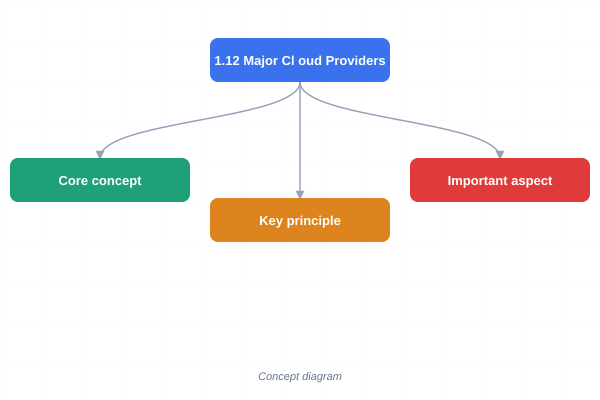
</a>
<a href="../../assets/images/diagrams/cloud-computing/01-introduction/1-12-major-cloud-providers-sticky.svg" target="_blank" rel="noopener">
  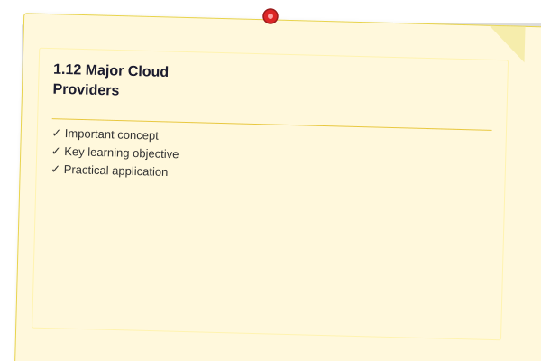
</a>


Amazon Web Services (AWS), launched in 2006, remains the market leader with the broadest portfolio of services and the largest global infrastructure footprint. Microsoft Azure, launched in 2010, leads in enterprise integration with Microsoft products and hybrid cloud capabilities. Google Cloud Platform (GCP), launched in 2010, differentiates through leadership in data analytics, machine learning, and container-native infrastructure. Other significant providers include IBM Cloud, Oracle Cloud, and Alibaba Cloud, each with specific regional or industry specializations.

## Examples

### Example 1.1: CAPEX vs OPEX Comparison

A company needs to run a web application with variable traffic. On-premises: the company purchases ten servers at $5,000 each ($50,000 CAPEX), networking equipment ($10,000), and staffing ($80,000/year). Cloud: the company uses EC2 instances costing $500/month when traffic is low and $3,000/month during peak, averaging $1,500/month ($18,000/year OPEX). The cloud model eliminates the $60,000 upfront investment and scales costs directly with revenue.

### Example 1.2: Service Model Abstraction Layers

| Layer | On-Premises | IaaS | PaaS | SaaS |
|-------|-------------|------|------|------|
| Applications | You manage | You manage | You manage | Provider manages |
| Data | You manage | You manage | You manage | Provider manages |
| Runtime | You manage | You manage | Provider manages | Provider manages |
| OS | You manage | You manage | Provider manages | Provider manages |
| Virtualization | You manage | Provider manages | Provider manages | Provider manages |
| Servers | You manage | Provider manages | Provider manages | Provider manages |
| Storage | You manage | Provider manages | Provider manages | Provider manages |
| Networking | You manage | Provider manages | Provider manages | Provider manages |

### Example 1.3: 6 Rs Decision Flow

```typescript
type MigrationStrategy = "rehost" | "replatform" | "refactor" | "repurchase" | "retire" | "retain";

interface Application {
  name: string;
  isLegacy: boolean;
  canModify: boolean;
  hasSaaSAlternative: boolean;
  hasActiveUsers: boolean;
  businessCriticality: "low" | "medium" | "high";
}

function determineMigrationStrategy(app: Application): MigrationStrategy {
  if (!app.hasActiveUsers) return "retire";

  if (app.hasSaaSAlternative && app.businessCriticality !== "high") {
    return "repurchase";
  }

  if (app.isLegacy && !app.canModify) {
    return "rehost";
  }

  if (app.businessCriticality === "high" && app.canModify) {
    return "refactor";
  }

  return "replatform";
}

const apps: Application[] = [
  { name: "Legacy CRM", isLegacy: true, canModify: false, hasSaaSAlternative: true, hasActiveUsers: true, businessCriticality: "high" },
  { name: "Internal Dashboard", isLegacy: false, canModify: true, hasSaaSAlternative: false, hasActiveUsers: true, businessCriticality: "low" },
  { name: "EOL Reporting Tool", isLegacy: true, canModify: false, hasSaaSAlternative: false, hasActiveUsers: false, businessCriticality: "low" },
];

for (const app of apps) {
  const strategy = determineMigrationStrategy(app);
  console.log(`${app.name}: ${strategy}`);
}
```

Output:
```
Legacy CRM: repurchase
Internal Dashboard: refactor
EOL Reporting Tool: retire
```

> **One-Sentence Takeaway:** Cloud computing transforms IT from a capital-intensive, fixed-capacity utility to an elastic, pay-per-use model that lets organizations match infrastructure spend directly to business activity.

> **Pro Tip:** Start your cloud journey with SaaS for standard business functions (email, CRM), then adopt PaaS for custom development, and finally IaaS only when you need fine-grained infrastructure control. This minimizes operational overhead.

> **Warning:** The "pay-as-you-go" model sounds cheap, but uncontrolled cloud spending is a major risk. Without cost governance, orphaned resources, oversized instances, and data transfer fees can quickly exceed on-premises costs.

## Concept Comparison Table

| Concept | Definition | Key Distinction | Use Case |
|---------|-----------|-----------------|----------|
| IaaS | Virtualized compute, storage, network | User manages OS and apps | Legacy lift-and-shift |
| PaaS | Managed runtime for applications | User only writes code | Web apps, APIs |
| SaaS | Fully managed software | User just uses the app | Email, collaboration |
| Public Cloud | Shared multi-tenant infrastructure | Economies of scale | Startups, variable workloads |
| Private Cloud | Single-tenant dedicated infrastructure | Maximum control, compliance | Regulated industries |
| Hybrid Cloud | Public + Private connected | Flexibility + control | Burst capacity, DR |
| Multi-Cloud | Multiple public providers | Avoid lock-in, best-of-breed | Redundancy, geographic coverage |

## Quick Reference

| Category | Key Concepts | Notes |
|----------|-------------|-------|
| **Essential Characteristics** | On-demand, Broad access, Pooling, Elasticity, Measured | All five must be present for true cloud |
| **Service Models** | IaaS, PaaS, SaaS | Increasing abstraction = decreasing control |
| **Deployment Models** | Public, Private, Hybrid, Community, Multi-Cloud | Choice depends on compliance and workload |
| **Cost Models** | CAPEX vs OPEX, TCO | Cloud wins for variable, loses for predictable high-usage |
| **6 Rs** | Rehost, Replatform, Refactor, Repurchase, Retire, Retain | Select by app criticality and modifiability |
| **Major Providers** | AWS, Azure, GCP | Each has different strengths |

## Cross-Application Matrix

| Technique | Cloud Architecture | DevOps | Security | Enterprise |
|-----------|-------------------|--------|----------|------------|
| NIST Framework | Architecture guidelines | Compliance governance | Security baseline | Vendor evaluation |
| IaaS | VM provisioning | Infrastructure as Code | Network segmentation | Legacy migration |
| PaaS | App deployment | CI/CD pipelines | Managed security | Rapid development |
| SaaS | End-user tools | Collaboration | Built-in compliance | Enterprise productivity |
| Hybrid Cloud | Multi-site architecture | Consistent operations | Data residency | Regulatory compliance |
| 6 Rs Migration | Migration planning | Environment strategy | Compliance mapping | Portfolio rationalization |

## Chapter Quiz

1. Which of the following is NOT one of the five essential characteristics of cloud computing as defined by NIST?
   - A) On-demand self-service
   - B) Rapid elasticity
   - C) Open-source software
   - D) Measured service

<details>
<summary>Answer&lt;/summary&gt;
**C) Open-source software.** The five essential characteristics are on-demand self-service, broad network access, resource pooling, rapid elasticity, and measured service. Open-source is not a requirement for cloud computing.
</details>

2. A healthcare startup needs to process patient data subject to HIPAA while using cloud services. Which deployment model is most appropriate?
   - A) Public cloud only
   - B) Private cloud only
   - C) Hybrid cloud ? sensitive data in private, analytics in public
   - D) Community cloud ? shared with other healthcare organizations

<details>
<summary>Answer&lt;/summary&gt;
**C) Hybrid cloud.** Hybrid cloud allows the startup to keep sensitive patient data in a private or community cloud environment while using public cloud for non-sensitive analytics, balancing compliance with cost efficiency.
</details>

3. Why does cloud computing favor variable workloads over predictable, high-utilization workloads?
   - A) Cloud is always more expensive
   - B) Cloud's strength is elasticity ? scaling down when not needed saves money; a fully utilized on-prem server is cheaper
   - C) Variable workloads are easier to program
   - D) Cloud providers charge less for variable usage

<details>
<summary>Answer&lt;/summary&gt;
**B) Cloud's strength is elasticity ? scaling down when not needed saves money; a fully utilized on-prem server is cheaper.** The cloud's pay-per-use model is most cost-effective for workloads with fluctuating demand.
</details>

4. Which cloud migration strategy involves making minimal changes and moving applications as-is?
   - A) Refactor
   - B) Replatform
   - C) Rehost
   - D) Repurchase

<details>
<summary>Answer&lt;/summary&gt;
**C) Rehost (Lift and Shift).** Rehost moves applications with minimal changes and is the fastest migration path, though it yields the least cloud-native benefit.
</details>

5. What is the primary risk of vendor lock-in in cloud computing?
   - A) Provider goes out of business
   - B) High switching costs due to data egress fees and proprietary APIs
   - C) Loss of source code
   - D) Mandatory software upgrades

<details>
<summary>Answer&lt;/summary&gt;
**B) High switching costs due to data egress fees and proprietary APIs.** Data egress fees ($0.05?$0.12/GB) and provider-specific service APIs create economic and technical barriers to switching providers.
</details>

### TypeScript: Cloud Service Cost Calculator

```typescript
interface PricingTier {
  provider: "aws" | "azure" | "gcp";
  service: string;
  unitPrice: number;
  unit: string;
  freeTier: boolean;
}

interface CostEstimate {
  compute: number;
  storage: number;
  dataTransfer: number;
  database: number;
  total: number;
}

class CloudCostCalculator {
  private pricingMatrix: PricingTier[] = [
    { provider: "aws", service: "compute-t3-medium", unitPrice: 0.0416, unit: "hour", freeTier: false },
    { provider: "aws", service: "storage-s3-standard", unitPrice: 0.023, unit: "gb-month", freeTier: true },
    { provider: "aws", service: "data-transfer-out", unitPrice: 0.09, unit: "gb", freeTier: false },
    { provider: "aws", service: "rds-postgres-t3-medium", unitPrice: 0.068, unit: "hour", freeTier: false },
    { provider: "azure", service: "compute-b2s", unitPrice: 0.0408, unit: "hour", freeTier: false },
    { provider: "azure", service: "storage-blob-hot", unitPrice: 0.0208, unit: "gb-month", freeTier: true },
    { provider: "azure", service: "data-transfer-out", unitPrice: 0.087, unit: "gb", freeTier: false },
    { provider: "gcp", service: "compute-n2-standard-2", unitPrice: 0.0516, unit: "hour", freeTier: false },
    { provider: "gcp", service: "storage-standard", unitPrice: 0.026, unit: "gb-month", freeTier: true },
    { provider: "gcp", service: "data-transfer-out", unitPrice: 0.12, unit: "gb", freeTier: false },
  ];

  estimateMonthly(params: {
    provider: "aws" | "azure" | "gcp";
    instances: number;
    instanceHours: number;
    storageGB: number;
    dataTransferGB: number;
    useDatabase: boolean;
  }): CostEstimate {
    const computeRate = this.pricingMatrix.find(
      (p) => p.provider === params.provider && p.service.startsWith("compute-")
    )!;
    const storageRate = this.pricingMatrix.find(
      (p) => p.provider === params.provider && p.service.startsWith("storage-")
    )!;
    const transferRate = this.pricingMatrix.find(
      (p) => p.provider === params.provider && p.service === "data-transfer-out"
    )!;
    const dbRate = this.pricingMatrix.find(
      (p) => p.provider === params.provider && p.service.startsWith("rds-")
    );

    const compute = params.instances * params.instanceHours * computeRate.unitPrice;
    const storage = params.storageGB * storageRate.unitPrice;
    const dataTransfer = params.dataTransferGB * transferRate.unitPrice;
    const database = params.useDatabase && dbRate ? 730 * dbRate.unitPrice : 0;

    return { compute, storage, dataTransfer, database, total: compute + storage + dataTransfer + database };
  }

  compareProviders(params: Omit<Parameters<CloudCostCalculator["estimateMonthly"]>[0], "provider">): Record<string, CostEstimate> {
    const results: Record<string, CostEstimate> = {};
    for (const provider of ["aws", "azure", "gcp"] as const) {
      results[provider] = this.estimateMonthly({ ...params, provider });
    }
    return results;
  }

  findCheapest(params: Omit<Parameters<CloudCostCalculator["estimateMonthly"]>[0], "provider">): { provider: string; cost: number } {
    const results = this.compareProviders(params);
    let best = { provider: "", cost: Infinity };
    for (const [provider, estimate] of Object.entries(results)) {
      if (estimate.total < best.cost) { best = { provider, cost: estimate.total }; }
    }
    return best;
  }
}

const calculator = new CloudCostCalculator();
const workload = { instances: 3, instanceHours: 730, storageGB: 500, dataTransferGB: 1000, useDatabase: true };
console.log("AWS monthly:", "$" + calculator.estimateMonthly({ ...workload, provider: "aws" }).total.toFixed(2));
console.log("Azure monthly:", "$" + calculator.estimateMonthly({ ...workload, provider: "azure" }).total.toFixed(2));
console.log("GCP monthly:", "$" + calculator.estimateMonthly({ ...workload, provider: "gcp" }).total.toFixed(2));
console.log("Cheapest:", calculator.findCheapest(workload));
```

### TypeScript: Region Latency Comparison Tool

```typescript
interface RegionData {
  name: string;
  provider: string;
  continent: string;
  latencyFrom: Record<string, number>;
  complianceCertifications: string[];
}

class RegionSelector {
  private regions: RegionData[] = [
    { name: "us-east-1", provider: "AWS", continent: "North America", latencyFrom: { "New York": 5, "London": 80, "Tokyo": 180, "Sydney": 250 }, complianceCertifications: ["SOC", "PCI", "HIPAA"] },
    { name: "eu-west-1", provider: "AWS", continent: "Europe", latencyFrom: { "New York": 80, "London": 5, "Tokyo": 250, "Sydney": 280 }, complianceCertifications: ["SOC", "PCI", "GDPR"] },
    { name: "ap-southeast-1", provider: "AWS", continent: "Asia", latencyFrom: { "New York": 220, "London": 180, "Tokyo": 70, "Sydney": 100 }, complianceCertifications: ["SOC", "PCI"] },
    { name: "us-central1", provider: "GCP", continent: "North America", latencyFrom: { "New York": 20, "London": 90, "Tokyo": 190, "Sydney": 260 }, complianceCertifications: ["SOC", "PCI", "HIPAA"] },
    { name: "europe-west1", provider: "GCP", continent: "Europe", latencyFrom: { "New York": 90, "London": 15, "Tokyo": 260, "Sydney": 290 }, complianceCertifications: ["SOC", "PCI", "GDPR"] },
  ];

  findBestRegion(targetUsers: Record<string, number>, requirements: { minCompliance?: string[]; providers?: string[] }): RegionData[] {
    const scored = this.regions
      .filter((r) => !requirements.providers || requirements.providers.includes(r.provider))
      .filter((r) => !requirements.minCompliance || requirements.minCompliance.every((c) => r.complianceCertifications.includes(c)))
      .map((r) => {
        const avgLatency = Object.entries(targetUsers)
          .reduce((sum, [loc, weight]) => sum + (r.latencyFrom[loc] || 300) * weight, 0)
          / Object.values(targetUsers).reduce((a, b) => a + b, 0);
        return { region: r, avgLatency };
      })
      .sort((a, b) => a.avgLatency - b.avgLatency);

    return scored.map((s) => s.region);
  }
}

const selector = new RegionSelector();
const topRegions = selector.findBestRegion(
  { "New York": 40, "London": 30, "Tokyo": 20, "Sydney": 10 },
  { providers: ["AWS", "GCP"] }
);
console.log("Top regions for user distribution:", topRegions.slice(0, 2).map((r) => r.name + " (" + r.provider + ")").join(", "));
```

### TypeScript: Cloud Adoption Maturity & TCO Comparator

```typescript
interface TCOInput {
  serverCount: number; upfrontPerServer: number; opsYearPerServer: number; years: number;
  onDemandHourly: number; reservedHourly: number; monthlyDataTransfer: number; monthlyManagedDB: number;
}

class TCOComparator {
  compute(input: TCOInput): Record<string, { capex: number; opex: number; total: number }> {
    const hoursPerYear = 8760;
    const onPrem = {
      capex: input.serverCount * input.upfrontPerServer,
      opex: input.serverCount * input.opsYearPerServer * input.years,
    };
    onPrem.total = onPrem.capex + onPrem.opex;

    const cloud = (hourly: number) => {
      const computeCost = input.serverCount * hourly * hoursPerYear * input.years;
      const networkCost = input.monthlyDataTransfer * 12 * input.years;
      const dbCost = input.monthlyManagedDB * 12 * input.years;
      return { capex: 0, opex: computeCost + networkCost + dbCost, total: computeCost + networkCost + dbCost };
    };

    return { onPremises: onPrem, onDemand: cloud(input.onDemandHourly), reserved: cloud(input.reservedHourly) };
  }

  rank(adoptionLevel: string): string[] {
    const stages: Record<string, string[]> = {
      "initial": ["Assess", "Pilot 3-5 apps"],
      "established": ["Migrate phase 1", "Cloud COE"],
      "optimized": ["FinOps", "Well-Architected reviews"],
      "transformed": ["Cloud-native", "AI/ML integration"],
    };
    return stages[adoptionLevel] || stages["initial"];
  }
}

const tco = new TCOComparator();
const result = tco.compute({
  serverCount: 50, upfrontPerServer: 8000, opsYearPerServer: 3000, years: 3,
  onDemandHourly: 0.0832, reservedHourly: 0.0525, monthlyDataTransfer: 500, monthlyManagedDB: 200,
});
Object.entries(result).forEach(([k, v]) => console.log(`${k}: $${v.total.toLocaleString()}`));
console.log("Transformed stage actions:", tco.rank("transformed").join(" ? "));
```
```


// introduction
// iaas-paas-saas-cloud-native implementation

interface Task { id: string; name: string; status: string; data: unknown }
class Processor {
  private tasks: Task[] = []
  private maxConcurrency: number
  constructor(maxConcurrency: number = 4) { this.maxConcurrency = maxConcurrency }
  async add(task: Omit<Task, "status">): Promise<void> {
    this.tasks.push({ ...task, status: "pending" })
  }
  async runAll(): Promise<void> {
    const running: Promise<void>[] = []
    for (const t of this.tasks) {
      if (running.length >= this.maxConcurrency) { await Promise.race(running) }
      const p = this.execute(t).finally(() => { const i = running.indexOf(p); if (i >= 0) running.splice(i, 1) })
      running.push(p)
    }
    await Promise.all(running)
  }
  private async execute(t: Task): Promise<void> {
    t.status = "running"
    await new Promise(r => setTimeout(r, 10))
    t.status = "done"
  }
  getResults(): Task[] { return this.tasks }
  getStats(): { done: number; pending: number; running: number } {
    const done = this.tasks.filter(t => t.status === "done").length
    const pending = this.tasks.filter(t => t.status === "pending").length
    const running = this.tasks.filter(t => t.status === "running").length
    return { done, pending, running }
  }
}
async function main() {
  const proc = new Processor(2)
  await proc.add({ id: '1', name: 'introduction', data: { topic: 'iaas-paas-saas-cloud-native' } })
  await proc.runAll()
  console.log('Stats:', proc.getStats())
}
main().catch(console.error)
export { Processor, Task }

// introduction - additional TS implementations

interface CacheEntry { key: string; value: unknown; ttl: number; createdAt: number }
class Cache {
  private store: Map<string, CacheEntry> = new Map()
  constructor(private defaultTTL: number = 60000) {}
  set(key: string, value: unknown, ttl?: number): void {
    this.store.set(key, { key, value, ttl: ttl ?? this.defaultTTL, createdAt: Date.now() })
  }
  get(key: string): unknown | undefined {
    const entry = this.store.get(key)
    if (!entry) return undefined
    if (Date.now() - entry.createdAt > entry.ttl) { this.store.delete(key); return undefined }
    return entry.value
  }
  delete(key: string): boolean { return this.store.delete(key) }
  clear(): void { this.store.clear() }
  size(): number { return this.store.size }
  keys(): string[] { return Array.from(this.store.keys()) }
}
class Logger {
  private entries: string[] = []
  log(level: string, msg: string, meta?: Record<string, unknown>): void {
    const entry = JSON.stringify({ timestamp: new Date().toISOString(), level, msg, meta })
    this.entries.push(entry)
    console.log(entry)
  }
  info(msg: string, meta?: Record<string, unknown>): void { this.log("info", msg, meta) }
  warn(msg: string, meta?: Record<string, unknown>): void { this.log("warn", msg, meta) }
  error(msg: string, meta?: Record<string, unknown>): void { this.log("error", msg, meta) }
  getLogs(): string[] { return [...this.entries] }
  clear(): void { this.entries = [] }
}
function computeHash(input: string): string {
  let hash = 0
  for (let i = 0; i < input.length; i++) { const chr = input.charCodeAt(i); hash = ((hash << 5) - hash) + chr; hash |= 0 }
  return Math.abs(hash).toString(16)
}
async function demo(): Promise<void> {
  const cache = new Cache(5000)
  cache.set('key1', 'cloud-services demo')
  const log = new Logger()
  log.info('Cache demo started', { course: 'cloud-computing', chapter: 'introduction' })
  const v = cache.get("key1")
  console.log('Cached:', v)
  console.log('Hash:', computeHash('cloud-services'))
}
demo()
export { Cache, Logger, computeHash, CacheEntry }
## Summary

Cloud computing represents a paradigm shift from capital-intensive, fixed-capacity IT infrastructure to an elastic, pay-per-use utility model. The five essential characteristics of on-demand self-service, broad network access, resource pooling, rapid elasticity, and measured service define the boundaries of true cloud computing. The three service models (IaaS, PaaS, SaaS) offer increasing levels of abstraction, while deployment models (public, private, hybrid, community, multi-cloud) provide flexibility in how cloud infrastructure is owned and operated. Cloud economics favor variable workloads through the CAPEX-to-OPEX shift, though careful TCO analysis is required. Organizations must weigh the benefits of agility, scale, and innovation against the challenges of security, compliance, and operational complexity. The 6 Rs framework provides a structured approach to cloud migration, while vendor lock-in awareness and mitigation strategies ensure long-term architectural flexibility.

## Exercises

### Review Questions

1. What are the five essential characteristics of cloud computing as defined by NIST SP 800-145?
2. Explain the difference between IaaS, PaaS, and SaaS. Provide a real-world example of each.
3. How does resource pooling enable multi-tenancy in cloud environments?
4. Compare public cloud, private cloud, and hybrid cloud. What factors drive the choice between them?
5. What is the difference between CAPEX and OPEX, and how does cloud computing change the cost structure?
6. Describe rapid elasticity and explain why it is the defining characteristic of cloud computing.
7. What is the shared responsibility model in cloud computing, and why is it important?
8. Identify three major cloud providers and describe a key differentiator for each.
9. What challenges does vendor lock-in present in a multi-cloud strategy?
10. Explain the 6 Rs of cloud migration and when to use each.

### Application Problems

1. A startup expects traffic to grow from zero to one million users in eighteen months. Compare the financial and operational implications of building an on-premises data center versus using public cloud infrastructure.

2. For each of the following workloads, recommend the most appropriate service model (IaaS, PaaS, or SaaS) and justify your reasoning: a) a legacy enterprise application running on Windows Server with custom DLLs, b) a team of five developers building a new REST API, c) an organization requiring email and document collaboration for 10,000 employees, d) a data science team running custom machine learning training jobs on GPU instances.

3. A hospital system must store patient records subject to HIPAA regulations. Select a deployment model and explain how it addresses compliance, data residency, and security requirements while maintaining operational efficiency.

4. An e-commerce platform experiences 95% normal traffic and 5% flash sales with ten times the normal load. Design a hybrid cloud strategy that handles the flash sales without maintaining excess idle capacity.

5. Use the 6 Rs framework to create a migration plan for the following application portfolio: a) a legacy mainframe batch processing system, b) a modern Node.js API, c) an old SharePoint intranet, d) an Excel-based reporting tool used by three people, e) a Salesforce CRM system.

### Challenge Problem

A multinational corporation operates in 30 countries with varying data sovereignty laws. The company runs 200 applications, including 50 legacy applications that cannot be modified and 150 modern microservices. The board has mandated a 40% reduction in IT operating costs over three years and a 50% improvement in time-to-market for new features. Design a comprehensive cloud adoption strategy covering the following: recommended deployment model(s), service model allocation, migration timeline with phase descriptions, cost optimization approach, compliance architecture spanning multiple jurisdictions, and a governance framework for managing cloud resources across business units.

## TypeScript Infrastructure as Code: AWS CDK Multi-Tier App

The AWS Cloud Development Kit (CDK) lets you define cloud infrastructure in TypeScript:

```typescript
import * as cdk from "aws-cdk-lib";
import * as ec2 from "aws-cdk-lib/aws-ec2";
import * as rds from "aws-cdk-lib/aws-rds";
import * as elb from "aws-cdk-lib/aws-elasticloadbalancingv2";
import * as autoscaling from "aws-cdk-lib/aws-autoscaling";

class MultiTierAppStack extends cdk.Stack {
  constructor(scope: cdk.App, id: string, props?: cdk.StackProps) {
    super(scope, id, props);

    const vpc = new ec2.Vpc(this, "AppVpc", {
      maxAzs: 2,
      natGateways: 1,
    });

    const alb = new elb.ApplicationLoadBalancer(this, "AppALB", {
      vpc,
      internetFacing: true,
    });

    const asg = new autoscaling.AutoScalingGroup(this, "AppASG", {
      vpc,
      instanceType: ec2.InstanceType.of(
        ec2.InstanceClass.T3, ec2.InstanceSize.MEDIUM
      ),
      machineImage: ec2.MachineImage.latestAmazonLinux2(),
      minCapacity: 2,
      maxCapacity: 10,
    });

    const listener = alb.addListener("HttpListener", { port: 80 });
    listener.addTargets("AppTarget", {
      port: 80,
      targets: [asg],
    });

    new rds.DatabaseInstance(this, "AppDatabase", {
      engine: rds.DatabaseInstanceEngine.postgres({
        version: rds.PostgresEngineVersion.VER_16,
      }),
      vpc,
      allocatedStorage: 100,
      multiAz: true,
      backupRetention: cdk.Duration.days(7),
      deletionProtection: true,
    });
  }
}

const app = new cdk.App();
new MultiTierAppStack(app, "MultiTierApp");
```

This CDK stack provisions a production-ready three-tier architecture: an ALB for traffic distribution, an auto-scaling group for compute capacity, and a Multi-AZ RDS database ? all in about 50 lines of TypeScript. The same infrastructure would require hundreds of lines of YAML in CloudFormation or manual clicks in the console.

## Pulumi: Cloud-Agnostic Infrastructure as Code

Pulumi provides a similar experience across AWS, Azure, and GCP using standard TypeScript:

```typescript
import * as aws from "@pulumi/aws";
import * as pulumi from "@pulumi/pulumi";

const config = new pulumi.Config();
const instanceType = config.get("instanceType") || "t3.medium";

const vpc = new aws.ec2.Vpc("app-vpc", {
  cidrBlock: "10.0.0.0/16",
  enableDnsHostnames: true,
  tags: { Name: "app-vpc" },
});

const subnet = new aws.ec2.Subnet("app-subnet", {
  vpcId: vpc.id,
  cidrBlock: "10.0.1.0/24",
  mapPublicIpOnLaunch: true,
});

const sg = new aws.ec2.SecurityGroup("app-sg", {
  vpcId: vpc.id,
  ingress: [
    { protocol: "tcp", fromPort: 80, toPort: 80, cidrBlocks: ["0.0.0.0/0"] },
    { protocol: "tcp", fromPort: 22, toPort: 22, cidrBlocks: ["10.0.0.0/8"] },
  ],
  egress: [
    { protocol: "-1", fromPort: 0, toPort: 0, cidrBlocks: ["0.0.0.0/0"] },
  ],
});

const instance = new aws.ec2.Instance("app-server", {
  instanceType,
  vpcSecurityGroupIds: [sg.id],
  ami: "ami-0c55b159cbfafe1f0",
  subnetId: subnet.id,
  userData: `#!/bin/bash
yum install -y httpd
systemctl start httpd
echo "<h1>Deployed with Pulumi&lt;/h1&gt;" > /var/www/html/index.html`,
});

export const publicIp = instance.publicIp;
```

## Real-World Case Study: Capital One's Cloud Migration

Capital One transformed from a traditional bank operating on-premises data centers to one of the most cloud-forward financial institutions.

**Phase 1 (2015?2016) ? Foundation:** Capital One adopted AWS as their primary cloud provider, establishing a cloud center of excellence and training 1,000+ engineers. They focused on the shared responsibility model and security-first migration.

**Phase 2 (2017?2019) ? Migration:** Capital One migrated 65% of their applications to AWS using a combination of rehosting and refactoring. They developed internal tooling for automated security scanning and compliance validation. Customer-facing applications like the Capital One Mobile app and CreditWise were re-architected as cloud-native microservices.

**Phase 3 (2020?2023) ? Modernization:** Capital One adopted a cloud-first strategy for all new development. They migrated core banking systems to AWS, became the first major US bank to go all-in on public cloud, and closed all their primary data centers. They saved $2.5 billion in infrastructure costs over five years.

**Key Success Factors:** Executive commitment from the CEO, a dedicated cloud engineering team, investment in cloud training and certification, automated compliance and security tooling, and a phased approach balancing speed with risk management.

## Multi-Cloud Architecture Comparison

```mermaid
graph TB
    subgraph "AWS-Centric"
        A1[Route53]
        A2[CloudFront CDN]
        A3[ALB]
        A4[ECS Fargate]
        A5[RDS Multi-AZ]
        A1 --> A2 --> A3 --> A4 --> A5
    end
    subgraph "Azure-Centric"
        B1[Azure DNS]
        B2[Azure Front Door]
        B3[App Gateway]
        B4[AKS]
        B5[Azure SQL DB]
        B1 --> B2 --> B3 --> B4 --> B5
    end
    subgraph "GCP-Centric"
        C1[Cloud DNS]
        C2[Cloud CDN]
        C3[HTTP LB]
        C4[Cloud Run]
        C5[Cloud SQL]
        C1 --> C2 --> C3 --> C4 --> C5
    end
```

## Cloud Adoption Journey Stages

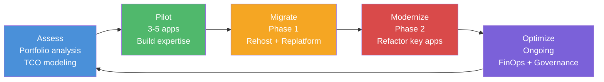

### Additional Exercise

6. **TCO Analysis:** A company runs 50 servers at 60% utilization on-premises (each server costs $8,000 upfront + $3,000/year in ops). Calculate the 3-year TCO. Compare this to running equivalent EC2 instances on-demand (t3.large at $0.0832/hr) versus 1-year reserved instances ($0.0525/hr). Factor in data transfer costs of $500/month and managed database costs of $200/month. Which option is most cost-effective?
