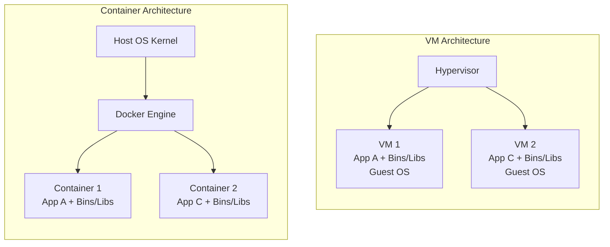
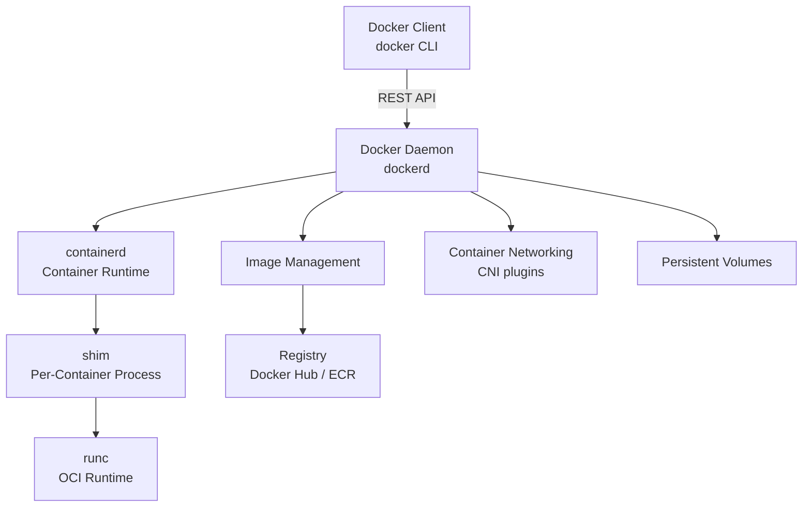

# Chapter 2: Virtualization

> **Previous:** [Chapter 1: Introduction to Cloud Computing](./01-introduction.md) | **Next:** [Chapter 3: Cloud Compute Services](./03-cloud-compute.md)

## Learning Objectives

After completing this chapter, students will be able to:

1. Define virtualization and explain its role as the foundational technology of cloud computing.
2. Differentiate between Type 1 and Type 2 hypervisors with examples.
3. Explain server, storage, and network virtualization techniques.
4. Compare containers and virtual machines across performance, isolation, and density.
5. Analyze performance considerations in virtualized environments.
6. Describe paravirtualization and hardware-assisted virtualization.
7. Understand the Docker architecture including namespaces and cgroups.
8. Compare KVM, Xen, and VMware hypervisor architectures.

## Chapter at a Glance

| Topic | Key Insight | Practical Takeaway |
|-------|-------------|--------------------|
| Hypervisors | Type 1 (bare-metal) vs Type 2 (hosted) | Type 1 dominates cloud data centers |
| Server Virtualization | Partition physical server into multiple VMs | 5-15% ? 60-80%+ utilization |
| Storage Virtualization | Block, file, and object abstraction | Provision storage independently of hardware |
| Network Virtualization | SDN, VLANs, VXLANs, NFV | Multi-tenant isolation over shared fabric |
| Containers vs VMs | OS-level vs hardware-level virtualization | Containers: density; VMs: isolation |
| Paravirtualization | Modified guest OS for near-native performance | Essential before hardware-assisted VT |
| Docker Architecture | Client, daemon, containerd, runc | Layered images enable efficient distribution |

## Chapter Roadmap


## Theory

### 2.1 Introduction to Virtualization


Virtualization is the process of creating a software-based, virtual version of a resource, such as a server, storage device, network, or operating system. It abstracts the physical hardware, allowing multiple virtual resources to share the same physical infrastructure. Virtualization is the enabling technology that makes cloud computing possible, as it allows cloud providers to partition physical resources among multiple tenants efficiently and securely.

The concept of virtualization dates to the 1960s with IBM's CP-40 and CP-67 mainframe systems, which allowed multiple operating systems to run on a single mainframe. The technology remained largely in the mainframe world until the late 1990s when VMware introduced x86 virtualization for commodity hardware. This breakthrough made virtualization accessible to the broader computing industry and laid the groundwork for modern cloud computing.

### 2.2 Hypervisors


A hypervisor, also called a virtual machine monitor (VMM), is the software layer that creates and runs virtual machines by abstracting the physical hardware. It sits between the physical hardware and the virtual machines, managing the allocation of physical resources to each VM and ensuring isolation between VMs.

**Type 1 Hypervisors (Bare-Metal).** Type 1 hypervisors run directly on the physical hardware without an underlying operating system. They have direct access to the hardware resources and provide the best performance, stability, and security. Type 1 hypervisors are the dominant choice for data center and cloud environments.

VMware ESXi is the industry-leading Type 1 hypervisor, powering the majority of on-premises virtualization deployments. It features a small footprint (approximately 150 MB), advanced memory management techniques such as transparent page sharing, and enterprise features like vMotion for live migration and Distributed Resource Scheduler (DRS) for automatic load balancing.

Microsoft Hyper-V is a Type 1 hypervisor built into Windows Server and also available as a standalone product. It uses a microkernel architecture where the hypervisor is minimal, and management functions run in a privileged parent partition. Hyper-V supports nested virtualization, which allows running a hypervisor inside a VM, a feature essential for development and testing.

KVM (Kernel-based Virtual Machine) is a Linux kernel module that turns the Linux kernel into a Type 1 hypervisor. It is the foundation of many cloud platforms, including OpenStack and is widely used by AWS for its EC2 service. KVM leverages existing Linux kernel subsystems for memory management, process scheduling, and device support.

**Type 2 Hypervisors (Hosted).** Type 2 hypervisors run on top of an existing operating system, which manages the physical hardware. They introduce a performance overhead because every hardware access from a VM must pass through the guest OS, hypervisor, and host OS. Type 2 hypervisors are primarily used for desktop virtualization, development, and testing rather than production cloud environments.

Oracle VirtualBox is a popular open-source Type 2 hypervisor supporting Windows, Linux, macOS, and Solaris hosts. It is widely used for local development because of its ease of use, snapshot capability, and support for a broad range of guest operating systems.

VMware Workstation and VMware Fusion are Type 2 hypervisors for Windows/Linux and macOS respectively. They offer advanced features such as Unity mode, which integrates guest applications into the host desktop, and support for complex networking configurations.

### 2.3 Full Virtualization vs Paravirtualization vs Hardware-Assisted

```mermaid
graph TB
    subgraph "Full Virtualization"
        A1[Unmodified Guest OS] --> A2[Binary Translation]
        A2 --> A3[Hypervisor]
        A3 --> A4[Hardware]
    end
    subgraph "Paravirtualization"
        B1[Modified Guest OS] --> B2[Hypercalls]
        B2 --> B3[Hypervisor]
        B3 --> B4[Hardware]
    end
    subgraph "Hardware-Assisted"
        C1[Unmodified Guest OS] --> C2[VT-x / AMD-V]
        C2 --> C3[Hypervisor]
        C3 --> C4[Hardware]
    end
```




**Full Virtualization.** The hypervisor provides complete simulation of the underlying hardware, allowing unmodified guest operating systems to run in isolation. The hypervisor translates privileged instructions from the guest OS to the physical hardware. Early x86 full virtualization required binary translation for certain privileged instructions because the x86 architecture was not originally designed for virtualization.

**Paravirtualization.** The guest OS is modified to replace non-virtualizable instructions with "hypercalls" that communicate directly with the hypervisor. This eliminates the need for binary translation and provides near-native performance. The Xen hypervisor pioneered this approach. Paravirtualization was historically critical because early x86 processors lacked hardware virtualization extensions.

**Hardware-Assisted Virtualization.** Modern processors include extensions (Intel VT-x, AMD-V) that provide a new CPU execution mode specifically for hypervisors. The hypervisor can run guest operating systems in a restricted "guest mode" without binary translation or guest OS modifications. Hardware-assisted virtualization is the standard for all modern production hypervisors.

| Technique | Guest OS | Performance | Complexity | Historical Significance |
|-----------|----------|-------------|------------|------------------------|
| Full Virtualization | Unmodified | Moderate (binary translation overhead) | Low for guest | Enables unmodified OS VMs |
| Paravirtualization | Modified (kernel changes) | Near-native | High (requires OS changes) | Made x86 virtualization practical |
| Hardware-Assisted | Unmodified | Near-native (minimal overhead) | Low | Dominant approach today |

Modern hypervisors use a hybrid approach. For most operations, hardware-assisted virtualization handles the common case efficiently. For certain I/O operations, paravirtualized drivers (such as virtio in KVM, VMware Tools, or Hyper-V Integration Services) provide near-native performance for network and storage access.

### 2.4 KVM vs Xen vs VMware


| Feature | KVM | Xen | VMware ESXi |
|---------|-----|-----|-------------|
| Type | Type 1 (kernel module) | Type 1 | Type 1 |
| Licensing | Open source (GPL) | Open source (GPL) | Proprietary |
| Guest Support | Linux, Windows, BSD | Linux, Windows, BSD | Linux, Windows, BSD |
| Paravirtualization | virtio drivers | PV guests | VMware Tools |
| Live Migration | Yes (with shared storage) | Yes | vMotion |
| Memory Features | KSM, huge pages | Transcendent memory | TPS, ballooning |
| GPU Passthrough | VFIO, SR-IOV | Passthrough | vGPU, GRID |
| Cloud Usage | AWS Nitro, OpenStack | AWS (legacy), Citrix | VMware Cloud on AWS |
| Management | libvirt, oVirt | xapi, XenCenter | vCenter, vSphere |

KVM dominates public cloud because it is open source, integrated into Linux (leverages existing kernel subsystems), and provides excellent performance with virtio drivers. AWS built its Nitro hypervisor on KVM. VMware dominates enterprise on-premises virtualization because of its mature management tooling (vCenter, vSphere) and advanced features (vMotion, DRS, HA).

### 2.5 Server Virtualization


Server virtualization partitions a physical server into multiple virtual servers, each running its own operating system and applications. This consolidation dramatically improves hardware utilization. Typical on-premises servers run at 5-15% CPU utilization; virtualization can increase this to 60-80% or higher while maintaining application performance.

```typescript
interface PhysicalServer {
  cpuCores: number;
  ramGB: number;
  costPerYearUSD: number;
}

interface VirtualMachine {
  cpuCores: number;
  ramGB: number;
  monthlyCostUSD: number;
}

function calculateConsolidation(
  server: PhysicalServer,
  vms: VirtualMachine[]
): { utilizationPct: number; annualSavingsUSD: number } {
  const totalVMCores = vms.reduce((sum, vm) => sum + vm.cpuCores, 0);
  const totalVMRam = vms.reduce((sum, vm) => sum + vm.ramGB, 0);
  const cpuUtilization = (totalVMCores / server.cpuCores) * 100;
  const ramUtilization = (totalVMRam / server.ramGB) * 100;
  const avgUtilization = (cpuUtilization + ramUtilization) / 2;
  
  const totalVMCost = vms.reduce((sum, vm) => sum + vm.monthlyCostUSD, 0) * 12;
  const annualSavingsUSD = totalVMCost - server.costPerYearUSD;
  
  return { utilizationPct: avgUtilization, annualSavingsUSD };
}

const physicalServer: PhysicalServer = { cpuCores: 32, ramGB: 256, costPerYearUSD: 24000 };
const vms: VirtualMachine[] = [
  { cpuCores: 2, ramGB: 8, monthlyCostUSD: 50 },
  { cpuCores: 4, ramGB: 16, monthlyCostUSD: 100 },
  { cpuCores: 2, ramGB: 8, monthlyCostUSD: 50 },
  { cpuCores: 8, ramGB: 32, monthlyCostUSD: 200 },
  { cpuCores: 4, ramGB: 16, monthlyCostUSD: 100 },
];

const result = calculateConsolidation(physicalServer, vms);
console.log(`VM Utilization: ${result.utilizationPct.toFixed(1)}%`);
console.log(`Annual Savings: $${result.annualSavingsUSD.toLocaleString()}`);
```

Output:
```
VM Utilization: 62.5%
Annual Savings: $6,000
```

### 2.6 Storage Virtualization


Storage virtualization abstracts physical storage resources into a unified logical storage pool. This allows storage to be provisioned, managed, and scaled independently from the physical storage hardware.

Block-level virtualization aggregates physical storage devices from storage area networks (SAN) or direct-attached storage (DAS) into logical volumes that can be dynamically allocated to virtual machines. Technologies such as VMware vSAN, Dell EMC PowerFlex, and NetApp ONTAP implement this abstraction.

File-level virtualization presents a unified file system interface across multiple file servers or NAS devices. The distributed file system handles data placement, replication, and migration transparently to users and applications. Examples include NFS, CIFS/SMB, and distributed file systems like Lustre and GlusterFS.

Object storage virtualization abstracts storage at the object level, where data is stored as objects with unique identifiers and metadata, rather than as files in a hierarchy. Object storage is the foundation of cloud storage services such as AWS S3, Azure Blob Storage, and Google Cloud Storage.

### 2.7 Network Virtualization


Network virtualization abstracts physical network hardware (switches, routers, firewalls, load balancers) into software-defined logical networks. This enables the creation of isolated virtual networks on top of shared physical infrastructure.

Software-defined networking (SDN) decouples the network control plane from the data forwarding plane. The control plane, which makes routing decisions, runs as software, while the data plane continues to forward packets in hardware. SDN enables centralized network management, automated provisioning, and dynamic policy enforcement.

Virtual LANs (VLANs) segment a physical network into multiple logical broadcast domains, isolating traffic between different groups of systems. VLANs are limited to 4,094 IDs (802.1Q standard) and operate at Layer 2.

Virtual eXtensible LANs (VXLANs) overcome VLAN limitations by using MAC-in-UDP encapsulation, supporting up to 16 million network segments. VXLANs are essential for multi-tenant cloud environments, enabling each tenant to have its own isolated Layer 2 network over a shared Layer 3 infrastructure.

Network functions virtualization (NFV) replaces dedicated network appliances (routers, firewalls, load balancers, WAN optimizers) with software running on commodity hardware. This enables dynamic provisioning, scaling, and placement of network functions. Examples include virtual firewalls (pfSense, VyOS), virtual routers, and virtual load balancers.

### 2.8 Containers vs Virtual Machines


Containers provide operating-system-level virtualization, where multiple isolated user-space instances share the same kernel. Unlike VMs, containers do not include a guest operating system; they package only the application and its dependencies (libraries, binaries, configuration files).



**Comparison Matrix:**

| Aspect | Virtual Machines | Containers |
|--------|-----------------|------------|
| Guest OS | Full OS per VM | Shared host OS kernel |
| Isolation | Hardware-level (separate kernel) | Process-level (shared kernel) |
| Boot time | Minutes (30-120s) | Seconds (<1s) |
| Image size | Gigabytes to tens of GB | Megabytes to hundreds of MB |
| Density | Tens per host | Hundreds per host |
| Resource overhead | Hypervisor + guest OS per VM | Minimal (only process overhead) |
| Security boundary | Stronger (separate kernel, stronger isolation) | Weaker (shared kernel attack surface) |
| Live migration | Supported (vMotion, etc.) | Limited (stateful challenges) |
| Persistence | State persists independently | Ephemeral by design |
| Portability | Hardware-dependent (OVF/OVA) | Fully portable (OCI image spec) |
| Startup overhead | BIOS/bootloader + OS init | Process fork + binary exec |

**When to use VMs:** Workloads requiring full OS isolation, legacy applications tied to specific OS versions, multi-tenant environments with strong security requirements, running multiple operating systems on the same hardware, and development environments needing full OS simulation.

**When to use Containers:** Microservices architectures, stateless applications, CI/CD pipelines, applications requiring rapid scaling and deployment, and environments where density and startup speed are priorities.

### 2.9 Docker Architecture


Docker is the dominant container platform. Its layered architecture separates client operations from container management:



**Docker Daemon (dockerd):** The background service that manages Docker objects (images, containers, networks, volumes). Listens on a Unix socket or REST API.

**containerd:** The industry-standard core container runtime. Manages the complete container lifecycle (image transfer, storage, execution, supervision, networking). Became a CNCF graduate project in 2019.

**runc:** The low-level OCI runtime specification implementation. Creates and runs containers by interacting directly with Linux kernel namespaces and cgroups.

**Docker Image Layers:** Images are built in read-only layers. Each Dockerfile instruction creates a new layer. Layers are cached and shared between images, reducing storage and transfer time.

```dockerfile
FROM node:18-slim       # Layer 1: base image (~120MB)
WORKDIR /app            # Layer 2: metadata (0B - only metadata)
COPY package.json .     # Layer 3: source files (~1KB)
RUN npm install         # Layer 4: dependencies (~30MB)
COPY src/ .             # Layer 5: application code (~50KB)
CMD ["node", "app.js"]  # Layer 6: startup command (0B - metadata)
```

Layers are cached: rebuilding after changing `src/` only rebuilds Layer 5 and later. This makes Docker builds extremely efficient for development iteration.

### 2.10 Namespaces and Control Groups


Linux kernel namespaces provide isolation by giving each container its own view of system resources:

| Namespace | Isolates | Impact |
|-----------|----------|--------|
| PID | Process IDs | Container can only see its own processes |
| Network | Network interfaces, routing | Each container has its own IP and ports |
| Mount | Filesystem mount points | Container filesystem isolated from host |
| UTS | Hostname and domain name | Each container can have its own hostname |
| IPC | Inter-process communication | Prevents cross-container message queue access |
| User | User and group IDs | Root in container ? root on host |

Control groups (cgroups) limit and account for resource usage:

- **cpu:** Limits CPU usage (shares, quotas, periods)
- **memory:** Limits memory usage (hard limit, soft limit, swap)
- **blkio:** Limits block I/O (reads/writes per second)
- **net_prio:** Controls network traffic priority
- **pids:** Limits number of processes a container can create
- **devices:** Controls device access (read/write/mknod permissions)

```typescript
interface CgroupConfig {
  cpuShares: number;
  memoryLimitMB: number;
  blockIOPS: number;
  pidLimit: number;
}

function configureContainerLimits(config: CgroupConfig): void {
  const cpuQuota = Math.round(config.cpuShares * 100000 / 1024);
  console.log(`CPU: ${cpuQuota}us quota per 100ms period`);
  console.log(`Memory: ${config.memoryLimitMB}MB hard limit`);
  console.log(`Block I/O: ${config.blockIOPS} IOPS`);
  console.log(`PIDs: ${config.pidLimit} max processes`);
  
  // Equivalent cgroup commands:
  // echo ${cpuQuota} > /sys/fs/cgroup/cpu/docker/${id}/cpu.cfs_quota_us
  // echo ${config.memoryLimitMB * 1024 * 1024} > /sys/fs/cgroup/memory/docker/${id}/memory.limit_in_bytes
}

configureContainerLimits({
  cpuShares: 512,
  memoryLimitMB: 256,
  blockIOPS: 1000,
  pidLimit: 128,
});
```

Output:
```
CPU: 50000us quota per 100ms period
Memory: 256MB hard limit
Block I/O: 1000 IOPS
PIDs: 128 max processes
```

### 2.11 Virtualization vs Bare Metal


Bare-metal servers provide dedicated physical hardware without a hypervisor layer. They eliminate the virtualization overhead entirely, offering maximum performance for CPU-intensive, I/O-intensive, or latency-sensitive workloads.

**Advantages of bare metal:** No hypervisor overhead, consistent performance (no noisy neighbor), direct access to hardware features (GPU, FPGA, NVMe), and full control over firmware and drivers.

**Advantages of virtualization:** Resource consolidation and utilization, rapid provisioning and elastic scaling, snapshot and cloning capabilities, live migration for maintenance, and hardware independence.

Many cloud providers offer both options. AWS offers bare-metal EC2 instances (i3.metal, m5.metal) for workloads requiring direct hardware access. Azure offers bare-metal instances in certain series. The choice depends on workload requirements, with the majority of cloud workloads benefiting from virtualization's flexibility.

### 2.12 Performance Considerations


**CPU Overhead.** Hypervisors introduce minimal CPU overhead for compute-bound workloads, typically less than 5% with hardware-assisted virtualization. CPU-intensive applications such as scientific computing and video encoding experience negligible degradation.

**Memory Overhead.** Hypervisors consume memory for their own operation and for management data structures. Additionally, each VM requires its own memory allocation with no sharing between VMs by default. Techniques such as memory overcommitment, transparent page sharing (VMware), and kernel same-page merging (KSM in KVM) reduce total memory requirements.

**Storage Overhead.** Storage I/O in virtualized environments introduces overhead from the hypervisor's I/O stack. Paravirtualized drivers, SR-IOV (Single Root I/O Virtualization), and NVMe over Fabrics reduce this overhead. Storage performance also depends on the storage architecture: local SSD, SAN, or distributed storage.

**Network Overhead.** Virtual switching adds latency compared to physical switching. Techniques to reduce network overhead include SR-IOV (direct device assignment to VMs), DPDK (Data Plane Development Kit) for user-space packet processing, and smart NICs that offload networking functions from the hypervisor.

**Noisy Neighbor Problem.** In multi-tenant environments, one VM's intensive resource usage (CPU, memory, I/O) can degrade performance for co-located VMs. Mitigation strategies include resource reservations, limits, and shares; dedicated instances; and placement groups.

## Examples

### Example 2.1: Creating a VM with KVM

```bash
# Install KVM on Ubuntu
sudo apt-get update
sudo apt-get install qemu-kvm libvirt-daemon-system virt-manager

# Create a VM from the command line
virt-install \
  --name ubuntu-vm \
  --ram 2048 \
  --vcpus 2 \
  --disk path=/var/lib/libvirt/images/ubuntu-vm.qcow2,size=20 \
  --os-variant ubuntu22.04 \
  --network network=default \
  --cdrom /path/to/ubuntu.iso \
  --graphics vnc
```

### Example 2.2: Docker Container vs VM Comparison Commands

```bash
# List running containers
docker ps

# List VMs managed by libvirt
virsh list

# Check Docker resource usage
docker stats

# Check VM resource usage via virt-top
virt-top
```

### Example 2.3: Hypervisor Type Identification

```bash
# Linux: Check if running in a VM
systemd-detect-virt

# VMware: Check for VMware tools
vmware-toolbox-cmd stat raw text

# Hyper-V: Check integration services
lsmod | grep hv_
```

### Example 2.4: Docker Namespace Inspection

```typescript
// Simulating namespace isolation in Docker containers
interface NamespaceView {
  pid: number[];
  network: { ip: string; interfaces: number };
  mount: { rootFS: string; mounts: string[] };
  uts: { hostname: string };
}

function inspectContainer(containerId: string): NamespaceView {
  return {
    pid: [1, 2, 3],  // Container only sees its own processes
    network: { ip: "172.17.0.2", interfaces: 1 },  // Isolated network stack
    mount: { rootFS: `/var/lib/docker/${containerId}`, mounts: ["/proc", "/dev"] },
    uts: { hostname: `container-${containerId.slice(0, 8)}` },
  };
}

const container = inspectContainer("a1b2c3d4e5");
console.log("Container Namespace Isolation:", JSON.stringify(container, null, 2));
```

> **One-Sentence Takeaway:** Virtualization is the abstraction layer that makes cloud computing possible ? it decouples software from hardware, enabling resource pooling, live migration, and multi-tenancy that define the cloud.

> **Pro Tip:** For production workloads, always use Type 1 hypervisors (ESXi, Hyper-V, KVM). Type 2 hypervisors like VirtualBox are great for development but introduce unacceptable performance overhead for production.

> **Warning:** The noisy neighbor problem can silently degrade production performance. Always use resource reservations for critical VMs and consider dedicated instances for latency-sensitive workloads.

## Concept Comparison Table

| Concept | Definition | Key Distinction | Use Case |
|---------|-----------|-----------------|----------|
| Type 1 Hypervisor | Runs directly on hardware | Best performance, security | Data centers, cloud |
| Type 2 Hypervisor | Runs on host OS | Easy setup, more overhead | Dev/test, desktop VMs |
| Full Virtualization | Complete hardware simulation | Unmodified guest OS | VMware ESXi, Hyper-V |
| Paravirtualization | Modified guest, hypercalls | Near-native I/O performance | Xen, virtio drivers |
| Hardware-Assisted | CPU extensions (VT-x/AMD-V) | No binary translation needed | All modern hypervisors |
| Container | Shares host kernel | Lightweight, fast start | Microservices |
| Namespace | Kernel isolation mechanism | PID, net, mnt, UTS, IPC, user | Container isolation |
| cgroup | Resource limitation | CPU, memory, I/O control | Container resource limits |

## Quick Reference

| Category | Key Concepts | Notes |
|----------|-------------|-------|
| **Hypervisor Types** | Type 1 (bare-metal), Type 2 (hosted) | Cloud uses Type 1 exclusively |
| **Virt Technologies** | Full, Para, Hardware-assisted | Modern: hardware-assisted + para I/O |
| **Network Virt** | VLAN (4K), VXLAN (16M), SDN | VXLAN enables multi-tenant clouds |
| **Storage Virt** | Block, File, Object | Each abstraction level has different performance |
| **VM vs Container** | VM: GB/minutes, Container: MB/seconds | Choose by isolation needs |
| **Docker** | Daemon ? containerd ? runc | Layered images enable caching |
| **Linux Isolation** | Namespaces (what you see), cgroups (what you get) | Fundamental to container security |

## Cross-Application Matrix

| Technique | Cloud Architecture | DevOps | Security | Enterprise |
|-----------|-------------------|--------|----------|------------|
| Hypervisors | VM provisioning | Dev environments | VM isolation | Server consolidation |
| SDN | Multi-tenant networks | Network-as-Code | Micro-segmentation | Compliance zones |
| Containers | Microservices | CI/CD pipelines | Process isolation | App modernization |
| Paravirtualization | High-performance VMs | Driver optimization | I/O security | Database hosting |
| Storage Virt | Elastic storage | Stateful workloads | Encryption at rest | Data tiering |
| Namespaces | Isolation boundaries | Environment parity | Security hardening | Multi-tenant isolation |

## Chapter Quiz

1. Why does a Type 1 hypervisor outperform a Type 2 hypervisor?
   - A) It uses more CPU cores
   - B) It runs directly on hardware without a host OS layer
   - C) It supports more VMs
   - D) It uses SSDs instead of HDDs

<details>
<summary>Answer&lt;/summary&gt;
**B) It runs directly on hardware without a host OS layer.** Type 1 hypervisors have direct hardware access, eliminating the performance overhead of passing through a host operating system. This is why all major cloud providers use Type 1 hypervisors.
</details>

2. What is the primary advantage of VXLANs over VLANs in cloud environments?
   - A) VXLANs are faster
   - B) VXLANs support millions of segments (vs 4,094 for VLANs) via MAC-in-UDP encapsulation
   - C) VXLANs are free
   - D) VXLANs work at Layer 7

<details>
<summary>Answer&lt;/summary&gt;
**B) VXLANs support millions of segments (vs 4,094 for VLANs) via MAC-in-UDP encapsulation.** The 12-bit VLAN ID limits VLANs to 4,094 networks ? insufficient for large multi-tenant clouds. VXLAN uses a 24-bit segment ID, supporting 16 million isolated networks.
</details>

3. When should containers be chosen over virtual machines?
   - A) For maximum security isolation
   - B) For microservices architectures requiring rapid deployment and high density
   - C) For running multiple different operating systems on the same host
   - D) For legacy application compatibility

<details>
<summary>Answer&lt;/summary&gt;
**B) For microservices architectures requiring rapid deployment and high density.** Containers share the host kernel, making them lighter and faster to start than VMs. They're ideal for stateless, scalable microservices but provide weaker isolation boundaries than VMs.
</details>

4. Which Docker component is responsible for the OCI runtime specification implementation?
   - A) dockerd
   - B) containerd
   - C) runc
   - D) Docker CLI

<details>
<summary>Answer&lt;/summary&gt;
**C) runc.** runc is the low-level OCI runtime that creates and runs containers by interacting directly with Linux kernel namespaces and cgroups.
</details>

5. Which Linux namespace prevents a container from seeing processes outside its own PID space?
   - A) Network namespace
   - B) PID namespace
   - C) Mount namespace
   - D) User namespace

<details>
<summary>Answer&lt;/summary&gt;
**B) PID namespace.** The PID namespace isolates process ID numbers, so a container can only see and interact with its own processes, not processes running on the host or in other containers.
</details>

### TypeScript: Migration Planner

```typescript
interface MigrationPlan {
  source: string;
  target: string;
  strategy: "P2V" | "V2V" | "V2C" | "P2C";
}

class MigrationEstimator {
  estimateDowntime(vms: number, totalDataGb: number, strategy: string): number {
    const rates = { "P2V": 50, "V2V": 200, "V2C": 100, "P2C": 30 };
    const rate = rates[strategy] ?? 50;
    return (vms * 30 + totalDataGb * 60) / rate;
  }

  generateMigrationPlan(
    physical: number, virtual: number, storageGb: number
  ): MigrationPlan[] {
    const plans: MigrationPlan[] = [];
    for (let i = 0; i < physical; i++) plans.push({ source: `p${i}`, target: `vm${i}`, strategy: "P2V" });
    for (let i = 0; i < virtual; i++) plans.push({ source: `vm${i}`, target: `c${i}`, strategy: "V2C" });
    return plans;
  }
}
```

### TypeScript: Hypervisor VM Scheduler Simulator

```typescript
interface VirtualMachine {
  id: string;
  vCPUs: number;
  memoryGB: number;
  diskGB: number;
  hostAffinity: string[];
  state: "running" | "stopped" | "paused";
}

interface PhysicalHost {
  id: string;
  totalVCPUs: number;
  totalMemoryGB: number;
  totalDiskGB: number;
  usedVCPUs: number;
  usedMemoryGB: number;
  usedDiskGB: number;
}

class HypervisorScheduler {
  private hosts: PhysicalHost[] = [];
  private vms: Map<string, VirtualMachine> = new Map();
  private placement: Map<string, string> = new Map();

  addHost(host: Omit<PhysicalHost, "usedVCPUs" | "usedMemoryGB" | "usedDiskGB">): void {
    this.hosts.push({ ...host, usedVCPUs: 0, usedMemoryGB: 0, usedDiskGB: 0 });
  }

  createVM(vm: VirtualMachine): boolean {
    this.vms.set(vm.id, vm);
    return this.scheduleVM(vm.id);
  }

  private scheduleVM(vmId: string): boolean {
    const vm = this.vms.get(vmId)!;
    const candidates = this.hosts
      .filter((h) =>
        h.usedVCPUs + vm.vCPUs <= h.totalVCPUs &&
        h.usedMemoryGB + vm.memoryGB <= h.totalMemoryGB &&
        h.usedDiskGB + vm.diskGB <= h.totalDiskGB
      )
      .sort((a, b) => {
        const aScore = a.usedVCPUs / a.totalVCPUs + a.usedMemoryGB / a.totalMemoryGB;
        const bScore = b.usedVCPUs / b.totalVCPUs + b.usedMemoryGB / b.totalMemoryGB;
        return aScore - bScore;
      });

    if (candidates.length === 0) return false;
    const host = candidates[0];
    host.usedVCPUs += vm.vCPUs;
    host.usedMemoryGB += vm.memoryGB;
    host.usedDiskGB += vm.diskGB;
    this.placement.set(vmId, host.id);
    this.vms.set(vmId, { ...vm, state: "running" });
    return true;
  }

  stopVM(vmId: string): void {
    const vm = this.vms.get(vmId);
    if (!vm || vm.state === "stopped") return;
    const hostId = this.placement.get(vmId);
    if (hostId) {
      const host = this.hosts.find((h) => h.id === hostId)!;
      host.usedVCPUs -= vm.vCPUs;
      host.usedMemoryGB -= vm.memoryGB;
      host.usedDiskGB -= vm.diskGB;
    }
    this.vms.set(vmId, { ...vm, state: "stopped" });
    this.placement.delete(vmId);
  }

  getConsolidationReport(): { hostId: string; vms: string[]; cpuUtil: number; memUtil: number }[] {
    return this.hosts.map((h) => {
      const assignedVMs = [...this.placement.entries()]
        .filter(([, hostId]) => hostId === h.id)
        .map(([vmId]) => vmId);
      return {
        hostId: h.id,
        vms: assignedVMs,
        cpuUtil: Math.round((h.usedVCPUs / h.totalVCPUs) * 100),
        memUtil: Math.round((h.usedMemoryGB / h.totalMemoryGB) * 100),
      };
    });
  }

  getVMCount(): number { return this.vms.size; }
  getRunningVMCount(): number { return [...this.vms.values()].filter((v) => v.state === "running").length; }
  getUtilization(): number {
    const totalCPU = this.hosts.reduce((s, h) => s + h.totalVCPUs, 0);
    const usedCPU = this.hosts.reduce((s, h) => s + h.usedVCPUs, 0);
    return Math.round((usedCPU / totalCPU) * 100);
  }
}

const sched = new HypervisorScheduler();
sched.addHost({ id: "host-1", totalVCPUs: 32, totalMemoryGB: 256, totalDiskGB: 4000 });
sched.addHost({ id: "host-2", totalVCPUs: 32, totalMemoryGB: 256, totalDiskGB: 4000 });

["web-01", "web-02", "db-01", "cache-01", "worker-01", "worker-02"].forEach((id) => {
  sched.createVM({ id, vCPUs: 4, memoryGB: 16, diskGB: 100, hostAffinity: ["host-1", "host-2"], state: "running" });
});

console.log("VM consolidation report:");
console.table(sched.getConsolidationReport());
console.log(`Total VMs: ${sched.getVMCount()}, Running: ${sched.getRunningVMCount()}, Util: ${sched.getUtilization()}%`);
```

### TypeScript: Memory Balloon Manager

```typescript
class MemoryBalloonManager {
  private hostTotalGB: number;
  private vms: Map<string, { hardLimit: number; currentUsage: number; weight: number; balloonInflated: number }> = new Map();

  constructor(hostTotalGB: number) { this.hostTotalGB = hostTotalGB; }

  registerVM(id: string, hardLimitGB: number, weight: number = 1): void {
    this.vms.set(id, { hardLimit: hardLimitGB, currentUsage: hardLimitGB, weight, balloonInflated: 0 });
  }

  getOvercommitRatio(): number {
    const totalHard = [...this.vms.values()].reduce((s, v) => s + v.hardLimit, 0);
    return Math.round((totalHard / this.hostTotalGB) * 100) / 100;
  }

  getUsedMemory(): number {
    return [...this.vms.values()].reduce((s, v) => s + v.currentUsage, 0);
  }

  inflateBalloons(targetReclaimGB: number): Record<string, number> {
    const sorted = [...this.vms.entries()]
      .filter(([, v]) => v.currentUsage > v.hardLimit * 0.3)
      .sort(([, a], [, b]) => a.weight - b.weight);

    let reclaimed = 0;
    const result: Record<string, number> = {};

    for (const [id, vm] of sorted) {
      if (reclaimed >= targetReclaimGB) break;
      const minMemory = vm.hardLimit * 0.3;
      const availableReclaim = vm.currentUsage - minMemory;
      const reclaimNow = Math.min(availableReclaim, targetReclaimGB - reclaimed);
      vm.currentUsage -= reclaimNow;
      vm.balloonInflated += reclaimNow;
      reclaimed += reclaimNow;
      result[id] = reclaimNow;
    }
    return result;
  }

  deflateAll(): void {
    for (const vm of this.vms.values()) {
      vm.currentUsage = vm.hardLimit;
      vm.balloonInflated = 0;
    }
  }

  getPressureReport(): { id: string; usageGB: number; limitGB: number; balloonGB: number; }[] {
    return [...this.vms.entries()].map(([id, v]) => ({
      id,
      usageGB: Math.round(v.currentUsage * 10) / 10,
      limitGB: v.hardLimit,
      balloonGB: Math.round(v.balloonInflated * 10) / 10,
    }));
  }
}

const balloon = new MemoryBalloonManager(256);
balloon.registerVM("web-01", 8, 1);
balloon.registerVM("db-01", 64, 3);
balloon.registerVM("cache-01", 32, 2);
console.log("Overcommit ratio:", balloon.getOvercommitRatio());
console.log("Inflating balloons to reclaim 40GB:", balloon.inflateBalloons(40));
console.log("Memory pressure:", JSON.stringify(balloon.getPressureReport(), null, 2));
```

### TypeScript: Hypervisor Feature Comparator

```typescript
type HypervisorType = "type-1" | "type-2";

interface Hypervisor {
  name: string; type: HypervisorType;
  features: { liveMigration: boolean; memoryOvercommit: boolean; gpuPassthrough: boolean; srIov: boolean; nestedVirt: boolean };
}

class HypervisorComparator {
  private hypervisors: Hypervisor[] = [
    { name: "VMware vSphere", type: "type-1", features: { liveMigration: true, memoryOvercommit: true, gpuPassthrough: true, srIov: true, nestedVirt: true } },
    { name: "KVM", type: "type-1", features: { liveMigration: true, memoryOvercommit: true, gpuPassthrough: true, srIov: true, nestedVirt: true } },
    { name: "Xen", type: "type-1", features: { liveMigration: true, memoryOvercommit: false, gpuPassthrough: true, srIov: true, nestedVirt: false } },
    { name: "Hyper-V", type: "type-1", features: { liveMigration: true, memoryOvercommit: true, gpuPassthrough: true, srIov: true, nestedVirt: true } },
    { name: "VirtualBox", type: "type-2", features: { liveMigration: false, memoryOvercommit: false, gpuPassthrough: false, srIov: false, nestedVirt: true } },
  ];

  filter(required: Partial<Hypervisor["features"]>): Hypervisor[] {
    return this.hypervisors.filter(h =>
      Object.entries(required).every(([k, v]) => !v || h.features[k as keyof typeof h.features] === v)
    );
  }

  recommend(workload: "production" | "desktop" | "dev"): Hypervisor[] {
    if (workload === "production") return this.filter({ liveMigration: true, memoryOvercommit: true });
    if (workload === "desktop") return this.filter({ nestedVirt: true });
    return this.hypervisors;
  }
}

const hc = new HypervisorComparator();
console.log("Production:", hc.recommend("production").map(h => h.name).join(", "));
console.log("GPU passthrough:", hc.filter({ gpuPassthrough: true }).map(h => h.name).join(", "));
```
```


// virtualization
// iaas-paas-saas-cloud-native implementation

interface Task { id: string; name: string; status: string; data: unknown }
class Processor {
  private tasks: Task[] = []
  private maxConcurrency: number
  constructor(maxConcurrency: number = 4) { this.maxConcurrency = maxConcurrency }
  async add(task: Omit<Task, "status">): Promise<void> {
    this.tasks.push({ ...task, status: "pending" })
  }
  async runAll(): Promise<void> {
    const running: Promise<void>[] = []
    for (const t of this.tasks) {
      if (running.length >= this.maxConcurrency) { await Promise.race(running) }
      const p = this.execute(t).finally(() => { const i = running.indexOf(p); if (i >= 0) running.splice(i, 1) })
      running.push(p)
    }
    await Promise.all(running)
  }
  private async execute(t: Task): Promise<void> {
    t.status = "running"
    await new Promise(r => setTimeout(r, 10))
    t.status = "done"
  }
  getResults(): Task[] { return this.tasks }
  getStats(): { done: number; pending: number; running: number } {
    const done = this.tasks.filter(t => t.status === "done").length
    const pending = this.tasks.filter(t => t.status === "pending").length
    const running = this.tasks.filter(t => t.status === "running").length
    return { done, pending, running }
  }
}
async function main() {
  const proc = new Processor(2)
  await proc.add({ id: '1', name: 'virtualization', data: { topic: 'iaas-paas-saas-cloud-native' } })
  await proc.runAll()
  console.log('Stats:', proc.getStats())
}
main().catch(console.error)
export { Processor, Task }

// virtualization - additional TS implementations

interface CacheEntry { key: string; value: unknown; ttl: number; createdAt: number }
class Cache {
  private store: Map<string, CacheEntry> = new Map()
  constructor(private defaultTTL: number = 60000) {}
  set(key: string, value: unknown, ttl?: number): void {
    this.store.set(key, { key, value, ttl: ttl ?? this.defaultTTL, createdAt: Date.now() })
  }
  get(key: string): unknown | undefined {
    const entry = this.store.get(key)
    if (!entry) return undefined
    if (Date.now() - entry.createdAt > entry.ttl) { this.store.delete(key); return undefined }
    return entry.value
  }
  delete(key: string): boolean { return this.store.delete(key) }
  clear(): void { this.store.clear() }
  size(): number { return this.store.size }
  keys(): string[] { return Array.from(this.store.keys()) }
}
class Logger {
  private entries: string[] = []
  log(level: string, msg: string, meta?: Record<string, unknown>): void {
    const entry = JSON.stringify({ timestamp: new Date().toISOString(), level, msg, meta })
    this.entries.push(entry)
    console.log(entry)
  }
  info(msg: string, meta?: Record<string, unknown>): void { this.log("info", msg, meta) }
  warn(msg: string, meta?: Record<string, unknown>): void { this.log("warn", msg, meta) }
  error(msg: string, meta?: Record<string, unknown>): void { this.log("error", msg, meta) }
  getLogs(): string[] { return [...this.entries] }
  clear(): void { this.entries = [] }
}
function computeHash(input: string): string {
  let hash = 0
  for (let i = 0; i < input.length; i++) { const chr = input.charCodeAt(i); hash = ((hash << 5) - hash) + chr; hash |= 0 }
  return Math.abs(hash).toString(16)
}
async function demo(): Promise<void> {
  const cache = new Cache(5000)
  cache.set('key1', 'cloud-services demo')
  const log = new Logger()
  log.info('Cache demo started', { course: 'cloud-computing', chapter: 'virtualization' })
  const v = cache.get("key1")
  console.log('Cached:', v)
  console.log('Hash:', computeHash('cloud-services'))
}
demo()
export { Cache, Logger, computeHash, CacheEntry }
## Summary

- Hypervisors abstract physical hardware into multiple virtual machines with strong isolation.
- Type 1 (bare-metal) hypervisors dominate data centers; Type 2 (hosted) serve development use cases.
- Server virtualization improves hardware utilization from 5-15% to 60-80%.
- Full ? para ? hardware-assisted virtualization reduced overhead over three generations.

Virtualization is the foundational technology of cloud computing. Hypervisors abstract physical hardware into multiple virtual environments, with Type 1 (bare-metal) hypervisors dominating data center deployments and Type 2 (hosted) hypervisors serving development use cases. Server virtualization improves hardware utilization from typical rates of 5-15% to 60-80% or more. The evolution from full virtualization through paravirtualization to hardware-assisted virtualization has progressively reduced virtualization overhead. Storage virtualization provides abstraction at block, file, and object levels. Network virtualization enables multi-tenant isolation through SDN, VLANs, VXLANs, and NFV. Containers offer an alternative to VMs with higher density and faster startup at the cost of weaker isolation, using Linux kernel namespaces for isolation and cgroups for resource limits. Docker's layered architecture (client, daemon, containerd, runc) revolutionized container adoption. Performance considerations include CPU, memory, storage, and network overhead, as well as the noisy neighbor problem.

## Exercises

### Review Questions

1. What is the difference between a Type 1 and Type 2 hypervisor? Provide two examples of each.
2. Explain how hardware-assisted virtualization (Intel VT-x / AMD-V) improved hypervisor performance.
3. What is paravirtualization and why was it historically important for x86 virtualization?
4. Describe three types of storage virtualization and their use cases.
5. How do VLANs and VXLANs differ, and why are VXLANs necessary for cloud computing?
6. Compare containers and virtual machines across five dimensions of your choice.
7. What is the noisy neighbor problem and what techniques can mitigate it?
8. Explain the role of SR-IOV in reducing I/O virtualization overhead.
9. How does memory overcommitment work, and what risks does it introduce?
10. Why did KVM become the dominant hypervisor for cloud providers like AWS and OpenStack?
11. Describe the Docker architecture from client to runc.
12. What is the difference between a Linux namespace and a cgroup?

### Application Problems

1. A financial services firm runs 200 virtual machines on 50 physical servers at 80% utilization. They need to maintain strong isolation between VMs handling different clients. The CIO is considering a move to containers to reduce infrastructure costs. Analyze the trade-offs and make a recommendation.

2. Design a virtualization strategy for a SaaS company that must run both Linux and Windows workloads, support live migration for zero-downtime maintenance, and scale to 500 VMs. Specify hypervisor choice, storage architecture, and network virtualization approach.

3. A university computer science department needs a lab environment where 200 students can run VMs simultaneously for operating systems coursework. The hardware budget is $50,000. Recommend the hypervisor, hardware configuration, and resource allocation strategy.

4. An organization is experiencing variable performance in its database VMs during peak hours. Investigate potential causes related to virtualization overhead and propose specific mitigation techniques.

5. Write a TypeScript function that calculates the optimal VM-to-physical-server ratio given CPU, memory, and I/O constraints.

```typescript
// VM density optimizer
function optimalDensity(hosts: number, vms: number, overhead: number): number {
  const cost = hosts * overhead;
  const revenue = vms * 50; // $/month per VM
  return revenue - cost;
}
// Find best VM count via binary search
function findOptimalVms(hosts: number, overhead: number): number {
  let lo = hosts, hi = hosts * 40;
  while (lo &lt; hi) {
    const mid = Math.floor((lo + hi) / 2);
    if (optimalDensity(hosts, mid, overhead) &lt; optimalDensity(hosts, mid + 1, overhead)) lo = mid + 1;
    else hi = mid;
  }
  return lo;
}
```

### Challenge Problem

A cloud provider is designing its next-generation hypervisor platform. The platform must support one million VMs across 10,000 physical hosts, provide multi-tenant isolation with SLAs guaranteeing less than 5% performance degradation, support live migration for all VM types, and offer both hypervisor-level and container-level virtualization. Design the virtualization architecture addressing the following: hypervisor selection and any modifications needed, memory management strategy for high-density consolidation, storage virtualization approach for performance and resilience, network virtualization for multi-tenant isolation with 100,000+ tenants, resource scheduling algorithm for minimizing noisy neighbor impact, and live migration strategy that works for both VMs and containers.
