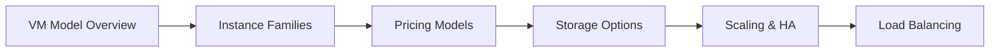

# Chapter 3: Cloud Compute Services

> **Previous:** [Chapter 2: Virtualization](./02-virtualization.md) | **Next:** [Chapter 4: Cloud Storage Services](./04-cloud-storage.md)

## Learning Objectives

After completing this chapter, students will be able to:

1. Compare and contrast compute services across AWS (EC2), Azure (Virtual Machines), and GCP (Compute Engine).
2. Categorize instance families and select the appropriate type for specific workload profiles.
3. Evaluate pricing models including on-demand, spot/preemptible, and commitment-based options.
4. Implement automated scaling using Auto Scaling Groups, Scale Sets, and Managed Instance Groups.
5. Configure persistent block storage and instance-store volumes.
6. Design high-availability architectures using placement groups and availability zones.
7. Deploy and configure multi-layer load balancing solutions.

## Chapter at a Glance

| Topic | Key Insight | Practical Takeaway |
|-------|-------------|--------------------|
| VM Models | EC2, Azure VMs, GCE — same concept, different implementations | Choose provider by integrated services, not VM features |
| Instance Families | General purpose, Compute, Memory, Storage, GPU | Match instance type to workload profile |
| Pricing Models | On-Demand, Spot, Reserved, Dedicated | Mix models to optimize cost: baseline → Reserved, spikes → On-Demand, batch → Spot |
| Scaling | Auto Scaling Groups, Scale Sets, MIGs | Horizontal scaling is the cloud-native approach |
| Storage Types | Ephemeral (instance store) vs Persistent (EBS/PD) | Never store critical data on ephemeral volumes |
| Load Balancing | L4 (network) vs L7 (application) | Use L7 for HTTP apps, L4 for ultra-low latency |

## Chapter Roadmap



## Theory

### 3.1 The Virtual Machine Model in the Cloud

Cloud compute services provide resizable, on-demand virtual machine (VM) instances. These services form the fundamental "Infrastructure as a Service" (IaaS) layer. While the underlying hypervisors vary—AWS uses Nitro (KVM-based), Azure uses Hyper-V, and GCP uses KVM—the abstraction provided to the consumer is a consistent set of virtual CPU (vCPU), memory, storage, and networking resources.

The primary advantage of cloud compute is the shift from physical hardware procurement to software-defined provisioning. This enables "just-in-time" infrastructure where resources are created in seconds and terminated when no longer needed, supporting the cloud's core promise of agility and elasticity.

### 3.2 Provider Service Comparison

| Feature | AWS EC2 | Azure Virtual Machines | GCP Compute Engine |
|---------|---------|-----------------------|--------------------|
| Core Service | Elastic Compute Cloud | Virtual Machines | Compute Engine |
| Image Format | AMI (Amazon Machine Image) | Azure Image / VHD | Compute Engine Image |
| Scaling | Auto Scaling Groups (ASG) | VM Scale Sets (VMSS) | Managed Instance Groups (MIG) |
| Local Storage | Instance Store | Temporary Disk | Local SSD |
| Persistent Block | EBS (Elastic Block Store) | Azure Managed Disks | Persistent Disk (PD) |
| Dedicated Hosts | Dedicated Hosts | Dedicated Hosts | Sole-Tenant Nodes |

### 3.3 Instance Families and Selection

Providers organize instances into families optimized for different workloads. Naming conventions typically include a family identifier, a generation number, and a size (e.g., AWS `m5.large`, Azure `D2s_v5`, GCP `n2-standard-2`).

- **General Purpose:** Balanced resources. Ideal for web servers, development environments, and small databases.
- **Compute Optimized:** High vCPU-to-memory ratio. Used for batch processing, media transcoding, and scientific modeling.
- **Memory Optimized:** High memory-to-vCPU ratio. Designed for in-memory databases (SAP HANA, Redis) and real-time analytics.
- **Storage Optimized:** Focused on high-throughput, low-latency local NVMe storage. Suited for NoSQL databases and data warehousing.
- **Accelerated Computing:** Equipped with GPUs (NVIDIA) or TPUs (GCP) for machine learning, 3D rendering, and financial modeling.


### 3.4 Lifecycle and Pricing Models

Cloud compute economics allow for significant cost optimization through tiered pricing:

- **On-Demand:** Pay-per-second or per-hour with no commitment. Highest cost but maximum flexibility.
- **Spot (AWS/Azure) / Preemptible (GCP):** Access to spare capacity at up to 90% discount. Instances can be reclaimed by the provider with short notice (30s to 2min). Best for fault-tolerant, stateless workloads.
- **Reserved / Committed Use:** Discount for committing to 1- or 3-year usage. AWS uses Reserved Instances and Savings Plans; GCP uses Committed Use Discounts (CUDs); Azure uses Reserved Virtual Machine Instances.
- **Dedicated Hardware:** Physical servers dedicated to a single tenant. Necessary for specific licensing (BYOL) or strict regulatory compliance.

### 3.5 Storage for Compute

VMs typically interact with two types of block storage:

1. **Ephemeral / Instance Store:** Physically attached to the host computer. Offers high IOPS and low latency but data is lost if the instance is stopped or terminated. Used for swap space, caches, and temporary data.
2. **Persistent Block Storage:** Network-attached storage that persists independently of the VM lifecycle. Can be detached from one instance and attached to another.
   - **Performance Tiers:** Standard HDD, Balanced SSD, High-Performance SSD (Provisioned IOPS), and Ultra Disks for sub-millisecond latency.

### 3.6 Scaling and Availability Patterns

**Horizontal Scaling** involves adding more instances to a fleet, while **Vertical Scaling** involves increasing the size of an existing instance.

- **Auto Scaling:** Providers use metrics (CPU utilization, request count) to dynamically adjust the number of instances.
- **Availability Sets / Placement Groups:** Strategies to ensure VMs are placed on different physical racks or power sources to avoid correlated failures.
- **Health Checks:** The scaling service monitors instance health and automatically replaces failed instances.

### 3.7 Load Balancing

Load balancers distribute incoming traffic across a pool of healthy VM instances.

- **Layer 7 (Application):** Inspects HTTP/HTTPS headers, paths, and cookies. Useful for microservices and URL-based routing.
- **Layer 4 (Network):** Routes based on IP and TCP/UDP ports. Offers ultra-high performance and low latency.
- **Global vs. Regional:** Some load balancers (like GCP's Cloud Load Balancing) are global, while others are confined to a specific region.

## Examples

### Example 3.1: Multi-Cloud Instance Deployment (CLI)

**AWS EC2 Launch:**
```bash
aws ec2 run-instances --image-id ami-0123456789 --count 1 --instance-type t3.micro --key-name MyKeyPair
```

**Azure VM Launch:**
```azurecli
az vm create --resource-group MyRG --name MyVM --image Ubuntu2204 --admin-username azureuser --generate-ssh-keys
```

**GCP GCE Launch:**
```bash
gcloud compute instances create my-vm --zone=us-central1-a --machine-type=e2-micro --image-family=debian-11
```

### Example 3.2: Configure Auto-Scaling Policy (AWS)

To maintain average CPU utilization at 50%:
```bash
aws autoscaling put-scaling-policy \
  --auto-scaling-group-name my-asg \
  --policy-name cpu50-target-tracking \
  --policy-type TargetTrackingScaling \
  --target-tracking-configuration "{\"TargetValue\": 50.0, \"PredefinedMetricSpecification\": {\"PredefinedMetricType\": \"ASGAverageCPUUtilization\"}}"
```

> **One-Sentence Takeaway:** Cloud compute is about matching the right instance family, pricing model, and scaling strategy to your workload — the cheapest instance is the one you don't leave running idle.

> **Pro Tip:** For cost optimization, always start with Reserved Instances (or Savings Plans) for baseline capacity and use Spot Instances for fault-tolerant batch workloads. This combination can reduce compute costs by 50-70%.

> **Warning:** Spot/Preemptible instances can be terminated with as little as 30 seconds notice. Never use them for stateful workloads, databases, or any application that cannot handle sudden interruptions.

## Concept Comparison Table

| Concept | Definition | Key Distinction | Use Case |
|---------|-----------|-----------------|----------|
| On-Demand | Pay per hour/second, no commitment | Maximum flexibility, highest cost | Unpredictable workloads |
| Spot/Preemptible | Spare capacity at discount | Up to 90% off, can be terminated | Batch processing, stateless |
| Reserved/CUD | 1-3 year commitment | 40-60% discount | Baseline, predictable capacity |
| Dedicated Host | Physical server for single tenant | Compliance, BYOL licensing | Regulated industries |
| Instance Store | Local physical storage | High IOPS, data lost on stop | Cache, temp data |
| EBS/Persistent Disk | Network-attached block storage | Survives instance terminations | Databases, boot volumes |

## Quick Reference

| Category | Key Concepts | Notes |
|----------|-------------|-------|
| **Instance Families** | General, Compute, Memory, Storage, GPU | Choose by workload profile |
| **Pricing Tiers** | On-Demand, Spot, Reserved, Dedicated | Mix for optimal cost |
| **Scaling** | Horizontal (more instances) vs Vertical (bigger instance) | Horizontal is more resilient |
| **Load Balancer Types** | L4 (TCP/UDP), L7 (HTTP/HTTPS) | L7 supports path-based routing |
| **HA Patterns** | Multi-AZ, Auto Scaling, Health Checks | Design for failure from day one |

## Cross-Application Matrix

| Technique | Cloud Architecture | DevOps | Security | Enterprise |
|-----------|-------------------|--------|----------|------------|
| Auto Scaling | Elastic workload management | Immutable deployments | DDoS absorption | Cost-efficient capacity |
| Spot Instances | Cost optimization | CI/CD worker nodes | Disposable build agents | Batch processing |
| Reserved Instances | Baseline capacity planning | N/A | N/A | Long-term cost mgmt |
| Load Balancing | HA architecture | Blue-green deployment | TLS termination | Global traffic distribution |
| Instance Families | Workload matching | Dev/test environments | Isolated GPU/Compute | Database provisioning |

## Chapter Quiz

1. Which pricing model offers the deepest discount but carries the highest risk of interruption?
   - A) On-Demand
   - B) Reserved Instances
   - C) Spot/Preemptible Instances
   - D) Dedicated Hosts

<details>
<summary>Answer</summary>
**C) Spot/Preemptible Instances.** These use spare cloud capacity at up to 90% discount but can be reclaimed by the provider with minimal notice (30 seconds to 2 minutes). They're ideal for fault-tolerant, stateless workloads.
</details>

2. What is the primary difference between an Application Load Balancer (L7) and a Network Load Balancer (L4)?
   - A) L7 is faster than L4
   - B) L7 inspects HTTP headers for intelligent routing; L4 routes by IP and port only
   - C) L4 is more expensive
   - D) L7 only works with AWS

<details>
<summary>Answer</summary>
**B) L7 inspects HTTP headers for intelligent routing; L4 routes by IP and port only.** L7 load balancers can route based on URL path, host header, cookies, and HTTP methods. L4 load balancers offer lower latency and are protocol-agnostic.
</details>

3. A company runs a critical database 24/7 on a cloud VM. Which storage type should they use?
   - A) Instance Store (ephemeral)
   - B) Persistent Block Storage (EBS/Azure Disk/Persistent Disk)
   - C) Temporary Disk
   - D) RAM disk

<details>
<summary>Answer</summary>
**B) Persistent Block Storage.** Instance store data is lost when the VM stops or terminates. Persistent block storage survives VM lifecycle events and supports snapshots, replication, and independent resizing — essential for databases.
</details>

## Summary

- Cloud compute provides virtualized hardware (IaaS) through VMs.
- Compute resources are organized into families (General Purpose, Compute, Memory, Storage, GPU).
- Pricing models range from expensive but flexible (On-Demand) to cheap but interruptible (Spot).
- Persistent storage (EBS/PD) survives instance termination, while instance store is ephemeral.
- Horizontal scaling via managed groups ensures application availability and cost efficiency.
- Load balancers (L4/L7) act as the entry point, distributing traffic and performing health checks.

## Exercises

### Review Questions

1. Explain the difference between horizontal and vertical scaling.
2. Under what circumstances should a Spot or Preemptible instance be avoided?
3. What is the difference between a Layer 4 and a Layer 7 load balancer?
4. How does persistent block storage differ from local instance storage?
5. Define "Noisy Neighbor" and explain how dedicated hosts mitigate this issue.

### Application Problems

1. A news website expects a massive traffic spike during an election. The current load is 2 VMs. Recommend a scaling policy and load balancer configuration to handle the spike while maintaining 99.9% availability.
2. A developer needs to run a 24-hour batch processing job that is checkpointed (saves state every 10 minutes). Compare the cost of using an On-Demand m5.large instance versus a Spot instance for this task.
3. Design a high-availability architecture for a web application using two Availability Zones. Specify the components required to ensure the app stays online if one AZ fails.

### Challenge Problem

A company is migrating a legacy application that requires a specific hardware ID for licensing and cannot be scaled horizontally. The application is mission-critical and requires 128GB of RAM. Propose a cloud compute architecture that addresses: 1) Hardware-dependent licensing, 2) High availability despite no horizontal scaling, 3) Performance consistency, and 4) Cost-effective disaster recovery in a different region.
