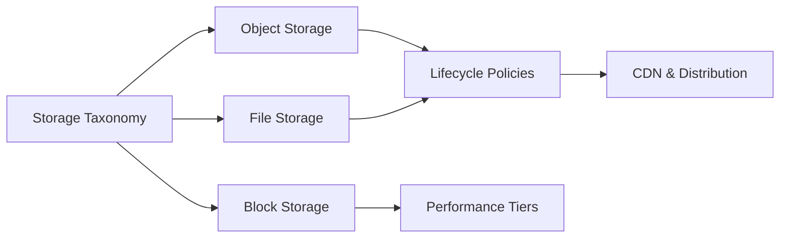

# Chapter 4: Cloud Storage Services

> **Previous:** [Chapter 3: Cloud Compute Services](./03-cloud-compute.md) | **Next:** [Chapter 5: Cloud Database Services](./05-cloud-database.md)

## Learning Objectives

After completing this chapter, students will be able to:

1. Differentiate between object, block, and file storage models and their use cases.
2. Compare object storage offerings (S3, Azure Blob, GCS) including buckets/containers and tiers.
3. Configure persistent block storage for virtual machines across different performance tiers.
4. Implement shared file systems using NFS and SMB protocols in the cloud.
5. Apply lifecycle management policies to automate data tiering and cost optimization.
6. Evaluate data durability and availability through replication strategies.
7. Design content delivery strategies using global CDN services.

## Chapter at a Glance

| Topic | Key Insight | Practical Takeaway |
|-------|-------------|--------------------|
| Object Storage | S3, Blob, GCS — infinite scale via HTTP | Best for static files, backups, data lakes |
| Block Storage | EBS, Disk, PD — raw volumes for VMs | Best for databases, OS boot volumes |
| File Storage | EFS, Azure Files, Filestore — shared NFS/SMB | Best for multi-VM shared access |
| Storage Tiers | Hot, Cool, Archive | Automate tier transitions for cost savings |
| Lifecycle Policies | Auto-move data between tiers | Essential for cost management at scale |
| CDN | Edge caching for global performance | Cuts latency, reduces origin load |

## Chapter Roadmap



## Theory

### 4.1 Taxonomy of Cloud Storage

Cloud providers offer three primary categories of storage, each optimized for different data access patterns and architectural requirements:

1. **Object Storage:** Stores data as discrete objects with metadata and unique identifiers. Highly scalable, accessed via HTTP/REST APIs. Ideal for static media, backups, and data lakes.
2. **Block Storage:** Provides raw storage volumes that can be formatted with a filesystem. Low latency, high throughput, attached to a single VM (mostly). Ideal for databases and OS boot volumes.
3. **File Storage:** Provides managed file shares accessible via standard network protocols (NFS/SMB). Supports concurrent access by multiple VMs. Ideal for home directories and shared application data.


### 4.2 Object Storage: S3, Blob, and GCS

Object storage is the "Swiss Army Knife" of cloud storage, offering virtually infinite scale.

| Feature | AWS S3 | Azure Blob Storage | Google Cloud Storage |
|---------|--------|-------------------|----------------------|
| Container Unit | Bucket | Container | Bucket |
| Identification | Key | Name | Name |
| Namespace | Global (Unique names) | Account Level | Global (Unique names) |
| Standard Tier | S3 Standard | Hot | Standard |
| Infrequent Tier | S3 Standard-IA | Cool | Nearline / Coldline |
| Archive Tier | S3 Glacier | Archive | Archive |

**Durability and Availability:** Providers typically guarantee "11 nines" (99.999999999%) durability by replicating data across multiple physical disks and data centers (Availability Zones).

### 4.3 Block Storage: EBS, Azure Disk, and Persistent Disk

Block storage behaves like a physical hard drive. It is typically confined to a specific Availability Zone because it requires low-latency connection to the host.

- **Standard/Balanced SSD:** General purpose storage for most workloads.
- **Provisioned IOPS:** High-performance volumes where you pay for a specific level of Input/Output Operations Per Second. Necessary for high-load databases.
- **HDD:** Throughput-optimized or cold storage for large, sequential workloads.

### 4.4 File Storage: Managed Network Shares

Managed file services eliminate the overhead of managing file servers.

- **AWS EFS / FSx:** EFS for Linux (NFS), FSx for Windows (SMB) and Lustre (HPC).
- **Azure Files:** Supports both SMB and NFS. Can be integrated with on-premises Active Directory.
- **GCP Filestore:** Fully managed NFS server for Compute Engine and GKE.

### 4.5 Storage Lifecycle and Cost Management

Cost optimization in the cloud involves moving data to cheaper storage as it ages or becomes less frequently accessed.

- **Lifecycle Policies:** Automatically transition data from "Hot" (expensive, fast) to "Archive" (cheap, slow) based on time (e.g., move to archive after 90 days).
- **Intelligent Tiering:** Some services (like S3 Intelligent-Tiering) use machine learning to automatically move data between tiers based on actual access patterns.

### 4.6 Content Delivery Networks (CDN)

CDNs cache content at "Edge Locations" closer to the end-users to reduce latency.

- **AWS CloudFront:** Deeply integrated with S3 and WAF.
- **Azure CDN / Front Door:** Optimized for enterprise content and global application acceleration.
- **GCP Cloud CDN:** Leverages Google's global private network and Anycast IP.

## Examples

### Example 4.1: Object Storage Lifecycle Policy (JSON)

An S3 policy to move objects to Infrequent Access after 30 days and Archive after 90 days:
```json
{
  "Rules": [
    {
      "ID": "MoveToArchive",
      "Status": "Enabled",
      "Transitions": [
        { "Days": 30, "StorageClass": "STANDARD_IA" },
        { "Days": 90, "StorageClass": "GLACIER" }
      ]
    }
  ]
}
```

### Example 4.2: Mounting a Managed File Share (Linux)

Mounting an AWS EFS volume:
```bash
sudo mount -t nfs4 -o nfsvers=4.1,rsize=1048576,wsize=1048576,hard,timeo=600,retrans=2,noresvport fs-01234567.efs.us-east-1.amazonaws.com:/ /mnt/efs
```

> **One-Sentence Takeaway:** The three cloud storage models serve fundamentally different purposes — object for scale and durability, block for performance, and file for shared access — and knowing which to use is the key to cost-effective cloud architecture.

> **Pro Tip:** For cost-optimized object storage, set up lifecycle policies on day one — move objects to infrequent access after 30 days and archive after 90. This can reduce storage costs by 80%+ for data with predictable access decay.

> **Warning:** Object storage does not support file locking or POSIX semantics. If your application needs concurrent writes with locking, use block or file storage. Attempting to use object storage for a database will result in data corruption.

## Concept Comparison Table

| Concept | Definition | Key Distinction | Use Case |
|---------|-----------|-----------------|----------|
| Object Storage | HTTP-accessible key-value for files | Infinite scale, eventual consistency | Backups, media, data lakes |
| Block Storage | Raw volumes formatted with FS | Low latency, single-VM attachment | Databases, boot volumes |
| File Storage | Network file system (NFS/SMB) | Multi-VM shared access | Shared configs, home dirs |
| Hot Tier | Frequent access, highest cost | Low latency retrieval | Active data |
| Cool/IA Tier | Infrequent access, lower cost | 30+ day retrieval | Backups, logs |
| Archive Tier | Rare access, lowest cost | Minutes to hours retrieval | Compliance archives |

## Quick Reference

| Category | Key Concepts | Notes |
|----------|-------------|-------|
| **Object Storage** | S3, Blob, GCS — buckets, keys, tiers | 99.999999999% durability |
| **Block Storage** | EBS, Disk, PD — IOPS tiers | Provisioned IOPS costs extra |
| **File Storage** | EFS (NFS), Azure Files (SMB), FSx | Scales with connected clients |
| **Lifecycle** | Transition, Expiration, Intelligent-Tiering | Automate data tier movement |
| **CDN** | CloudFront, Azure CDN, Cloud CDN | Edge caching reduces origin load |

## Cross-Application Matrix

| Technique | Cloud Architecture | DevOps | Security | Enterprise |
|-----------|-------------------|--------|----------|------------|
| Object Storage | Data lakes, backups | Artifact storage | Encryption at rest | Long-term archives |
| Block Storage | Database persistence | Dev volumes | Encryption, snapshots | Boot volumes |
| File Storage | Shared application data | Config management | Access control lists | Home directories |
| Lifecycle Policies | Cost governance | Log rotation | Compliance data retention | Archive management |
| CDN | Global distribution | Cache invalidation | DDoS protection | Reduced latency |

## Chapter Quiz

1. What durability guarantee do major cloud providers offer for object storage?
   - A) 99.99%
   - B) 99.999999999% (11 nines)
   - C) 99.9999%
   - D) 100%

<details>
<summary>Answer</summary>
**B) 99.999999999% (11 nines).** Object storage achieves this by automatically replicating data across multiple physical devices and availability zones. For 10 million objects, this means statistically one object might be lost every 10 million years.
</details>

2. When should you choose File Storage (EFS/Azure Files/Filestore) over attaching Block Storage to each VM?
   - A) Always — file storage is cheaper
   - B) When multiple VMs need concurrent read/write access to the same data
   - C) File storage is faster than block storage
   - D) When you need a boot volume for VMs

<details>
<summary>Answer</summary>
**B) When multiple VMs need concurrent read/write access to the same data.** Block storage can only be attached to one VM at a time. File storage provides shared access via NFS or SMB, making it ideal for shared configuration, home directories, and clustered applications.
</details>

3. What happens to data stored on an Instance Store volume when the EC2 instance is stopped?
   - A) Data is automatically saved to S3
   - B) Data persists until the instance is terminated
   - C) Data is permanently lost
   - D) Data is migrated to a new host

<details>
<summary>Answer</summary>
**C) Data is permanently lost.** Instance store volumes are physically attached to the host server. When the instance stops, the data on instance store volumes is lost. This is why critical data must always use persistent storage like EBS.
</details>

## Summary

- Cloud storage is categorized into Object, Block, and File models.
- Object storage (S3/Blob/GCS) provides extreme durability and scale via HTTP access.
- Block storage (EBS/Disk/PD) provides high-performance local storage for VMs.
- File storage (EFS/Azure Files/Filestore) enables shared network access.
- Lifecycle policies are essential for cost-optimizing data retention.
- CDNs improve user experience by caching static and dynamic content at the network edge.

## Exercises

### Review Questions

1. Compare Object Storage and Block Storage in terms of access method and scalability.
2. What are "11 nines" of durability, and how do providers achieve this?
3. When should you use a File Storage service instead of attaching multiple Block volumes?
4. Explain the trade-offs of using an Archive storage tier (e.g., retrieval time vs. cost).
5. How does a CDN improve the performance of a global web application?

### Application Problems

1. A hospital needs to store X-ray images. Images are accessed frequently for the first 48 hours, then rarely for the next 5 years, but must be kept for 10 years for legal reasons. Design a storage and lifecycle strategy.
2. A database requires 50,000 IOPS to handle peak transaction volume. Which block storage tier would you select on AWS, and how would you configure it?
3. A team of developers needs to share a set of configuration files across 50 Linux servers. Propose a solution that ensures all servers see the same files in real-time.

### Challenge Problem

You are designing the storage backend for a YouTube-like video platform. Users upload 1000 videos per hour. Videos are transcoded into multiple resolutions. Popular videos are accessed globally, while old videos are rarely watched. Propose a comprehensive storage architecture that handles: 1) Initial upload, 2) Transcoding workspace, 3) Global distribution of popular content, and 4) Cost-effective long-term retention of unpopular content.
