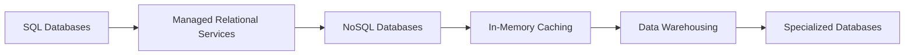

# Chapter 5: Cloud Database Services

> **Previous:** [Chapter 4: Cloud Storage Services](./04-cloud-storage.md) | **Next:** [Chapter 6: Cloud Networking and Delivery](./06-cloud-networking.md)

## Learning Objectives

After completing this chapter, students will be able to:

1. Differentiate between relational (SQL) and non-relational (NoSQL) database services in the cloud.
2. Compare managed relational services across AWS (RDS/Aurora), Azure (SQL Database), and GCP (Cloud SQL/Spanner).
3. Evaluate NoSQL options including Key-Value, Document, and Wide-Column stores.
4. Implement high availability and disaster recovery using Multi-AZ, Read Replicas, and Failover Groups.
5. Configure in-memory caching solutions to optimize application performance.
6. Select appropriate analytical databases (Data Warehouses) for large-scale business intelligence.
7. Design migration strategies for moving on-premises databases to the cloud.

## Chapter at a Glance

| Topic | Key Insight | Practical Takeaway |
|-------|-------------|--------------------|
| Relational (SQL) | ACID-compliant, structured schemas | Best for transactions, complex joins |
| NoSQL (Key-Value/Document) | Horizontal scale, schema flexibility | Best for high-volume, semi-structured data |
| Managed Services | RDS, DynamoDB, Cosmos DB, Cloud SQL | Automated patching, backups, scaling |
| In-Memory Caching | Redis, Memcached | Sub-millisecond reads, reduces DB load |
| Data Warehousing | Redshift, BigQuery, Synapse | Columnar storage for analytics |
| Multi-AZ HA | Synchronous standby in another AZ | Automatic failover with no data loss |

## Chapter Roadmap



## Theory

### 5.1 The Evolution of Managed Databases

Traditional database management required significant effort in hardware provisioning, OS patching, and manual backups. Cloud providers offer **Managed Database Services** (DBaaS) that automate these "undifferentiated heavy lifting" tasks. This allows organizations to focus on schema design and query optimization.

### 5.2 Relational Databases (SQL)

Relational databases provide ACID (Atomicity, Consistency, Isolation, Durability) compliance and are ideal for structured data and complex joins.

| Feature | AWS | Azure | GCP |
|---------|-----|-------|-----|
| Managed SQL | RDS | Azure SQL Database | Cloud SQL |
| Cloud-Native SQL | Aurora | SQL Hyperscale | Cloud Spanner |
| Engines | MySQL, PostgreSQL, SQL Server, Oracle | SQL Server, PostgreSQL, MySQL | MySQL, PostgreSQL, SQL Server |

- **Cloud-Native SQL:** Services like Amazon Aurora and Google Cloud Spanner decouple compute from storage. Spanner is unique for providing horizontal scalability with global strong consistency.
- **High Availability:** Achieved through synchronous replication to a standby instance in a different Availability Zone (Multi-AZ).
- **Read Scalability:** Achieved through asynchronous Read Replicas.


### 5.3 Non-Relational Databases (NoSQL)

NoSQL databases offer horizontal scalability and schema flexibility, ideal for unstructured or semi-structured data.

- **Key-Value / Document Stores:** 
  - **AWS DynamoDB:** Serverless, single-digit millisecond performance at any scale.
  - **Azure Cosmos DB:** Multi-model (Document, Key-Value, Graph, Columnar) with global distribution.
  - **GCP Firestore:** Document database optimized for mobile and web apps.
- **Wide-Column Stores:** 
  - **GCP Bigtable:** Optimized for high-throughput analytical and operational workloads (used for Search and Maps).
  - **AWS Keyspaces:** Managed Cassandra-compatible service.

### 5.4 In-Memory Caching

Caching stores frequently accessed data in RAM to reduce latency and database load.

- **Redis:** Supports complex data structures and persistence. (ElastiCache, Azure Cache for Redis, Memorystore).
- **Memcached:** Simple, multi-threaded key-value cache.

### 5.5 Data Warehousing and Big Data Analytics

Analytical databases use columnar storage to perform fast queries on petabytes of data.

- **AWS Redshift:** Fast, petabyte-scale data warehouse.
- **Azure Synapse Analytics:** Unified analytics service combining data warehousing and Big Data analytics.
- **GCP BigQuery:** Serverless, highly scalable data warehouse with built-in ML and GIS capabilities.

### 5.6 Specialized Databases

- **Graph Databases:** For highly connected data (Neptune, Cosmos DB Graph API).
- **Ledger Databases:** For cryptographically verifiable transaction logs (QLDB).
- **Time-Series Databases:** For IoT and monitoring data (Timestream).

## Examples

### Example 5.1: Database Provisioning Comparison

**AWS RDS (CLI):**
```bash
aws rds create-db-instance --db-instance-identifier my-db --engine postgres --db-instance-class db.t3.micro --allocated-storage 20 --multi-az
```

**GCP Cloud SQL (gcloud):**
```bash
gcloud sql instances create my-instance --database-version=POSTGRES_14 --tier=db-f1-micro --region=us-central1
```

### Example 5.2: DynamoDB Put Item (JSON/CLI)

Adding a user profile to a NoSQL table:
```bash
aws dynamodb put-item \
    --table-name UserProfiles \
    --item '{
        "UserID": {"S": "u123"},
        "Name": {"S": "Jane Doe"},
        "Preferences": {"M": {"Theme": {"S": "Dark"}, "Language": {"S": "EN"}}}
    }'
```

> **One-Sentence Takeaway:** Managed cloud databases eliminate the undifferentiated heavy lifting of database administration — patching, backups, replication — letting teams focus on schema design and query optimization.

> **Pro Tip:** Use Multi-AZ for production databases — it provides automatic synchronous replication to a standby in another AZ. If the primary fails, RDS/Database automatically fails over with zero data loss.

> **Warning:** NoSQL databases (like DynamoDB) do not support SQL JOINs or multi-item ACID transactions by default. If your data model requires complex relationships and transactional consistency, start with a relational database.

## Concept Comparison Table

| Concept | Definition | Key Distinction | Use Case |
|---------|-----------|-----------------|----------|
| RDS / Cloud SQL | Managed relational DB | ACID, standard SQL | OLTP, transactions |
| Aurora | Cloud-native relational | Compute/storage separation, 5x faster | High-performance SQL |
| DynamoDB | Managed NoSQL KV/Document | Serverless, single-digit ms at any scale | High-traffic apps |
| Cosmos DB | Multi-model global DB | Turnkey global distribution | Global apps |
| BigQuery | Serverless data warehouse | Columnar, petabyte-scale | Analytics, BI |
| ElastiCache / Redis | In-memory cache | Sub-millisecond latency | Session store, caching |

## Quick Reference

| Category | Key Concepts | Notes |
|----------|-------------|-------|
| **SQL Services** | RDS, Aurora, Cloud SQL, Azure SQL | ACID, joins, standard SQL |
| **NoSQL Services** | DynamoDB, Cosmos DB, Firestore | Flexible schema, auto-scaling |
| **Data Warehouses** | Redshift, BigQuery, Synapse | Columnar, OLAP, petabyte-scale |
| **Caching** | Redis, Memcached | Always cache DB queries for read-heavy apps |
| **HA Options** | Multi-AZ, Read Replicas, Global Tables | Multi-AZ for writes, replicas for reads |

## Cross-Application Matrix

| Technique | Cloud Architecture | DevOps | Security | Enterprise |
|-----------|-------------------|--------|----------|------------|
| Multi-AZ | HA architecture | Automated failover testing | Data durability | Compliance SLAs |
| Read Replicas | Read scaling | Load testing | Encryption in transit | Reporting offload |
| DynamoDB DAX | In-memory cache layer | Performance testing | Encryption at rest | Sub-ms response |
| BigQuery | Analytics pipeline | Log analytics | Column-level security | Business intelligence |
| Database Migration | Lift-and-shift strategy | Schema conversion tool | Encrypted transfer | Minimized downtime |

## Chapter Quiz

1. What is the primary difference between Amazon RDS Multi-AZ and Read Replicas?
   - A) Multi-AZ is for high availability; Read Replicas are for read scaling
   - B) There is no difference
   - C) Read Replicas are faster
   - D) Multi-AZ is only for MySQL

<details>
<summary>Answer</summary>
**A) Multi-AZ is for high availability; Read Replicas are for read scaling.** Multi-AZ provides synchronous standby for automatic failover (HA). Read Replicas are asynchronous copies that offload read traffic and can be promoted to primary.
</details>

2. When would you choose a NoSQL database over a relational database?
   - A) When you need ACID transactions with complex joins
   - B) When you have high-volume, semi-structured data with flexible schema requirements
   - C) When the data model will never change
   - D) When you need SQL compatibility

<details>
<summary>Answer</summary>
**B) When you have high-volume, semi-structured data with flexible schema requirements.** NoSQL databases excel at horizontal scaling, schema flexibility, and high-throughput operations for data that doesn't require complex relational queries.
</details>

3. How does Amazon Aurora achieve higher performance than standard RDS?
   - A) It uses faster hardware
   - B) It decouples compute from storage, allowing the storage layer to self-heal and replicate
   - C) It has fewer features
   - D) It only runs on dedicated hosts

<details>
<summary>Answer</summary>
**B) It decouples compute from storage, allowing the storage layer to self-heal and replicate.** Aurora's storage subsystem is a distributed, auto-healing volume that replicates data across 3 AZs (6 copies). This architecture delivers 5x the throughput of standard MySQL and 3x of standard PostgreSQL.
</details>

## Summary

- Managed databases (DBaaS) automate patching, backups, and scaling.
- Relational databases (RDS, Azure SQL, Cloud SQL) maintain ACID compliance.
- NoSQL databases (DynamoDB, Cosmos DB) provide horizontal scale and schema flexibility.
- Aurora and Spanner represent the next generation of cloud-native relational engines.
- In-memory caches (Redis) are critical for sub-millisecond response times.
- Data warehouses (BigQuery, Redshift) are optimized for OLAP workloads.

## Exercises

### Review Questions

1. Explain the "Shared Responsibility Model" as it applies to managed databases.
2. What are the primary differences between Amazon RDS and Amazon Aurora?
3. In which scenario would you choose a NoSQL database over a Relational one?
4. What is "Global Strong Consistency" in the context of Google Cloud Spanner?
5. How does a Read Replica differ from a Multi-AZ Standby instance?

### Application Problems

1. A retail company wants to migrate their SQL Server database to the cloud. They require high availability and the ability to scale reads during holiday sales. Propose a solution on Azure.
2. An IoT platform receives 10,000 sensor readings per second. Each reading is a simple JSON blob. Recommend a database service on GCP and justify your choice.
3. A banking application requires a database that can handle millions of transactions per second with strict ACID compliance and zero data loss. Design the architecture on AWS.

### Challenge Problem

You are building a global social media platform. You need to store: 1) User profiles (rarely change, structured), 2) Real-time "Likes" and "Comments" (high volume, low latency), 3) Social graph of "Followers" (highly connected data), and 4) Historical analytics of user trends (petabytes of data). Propose a **polyglot persistence** strategy using specific services from one major cloud provider of your choice.
