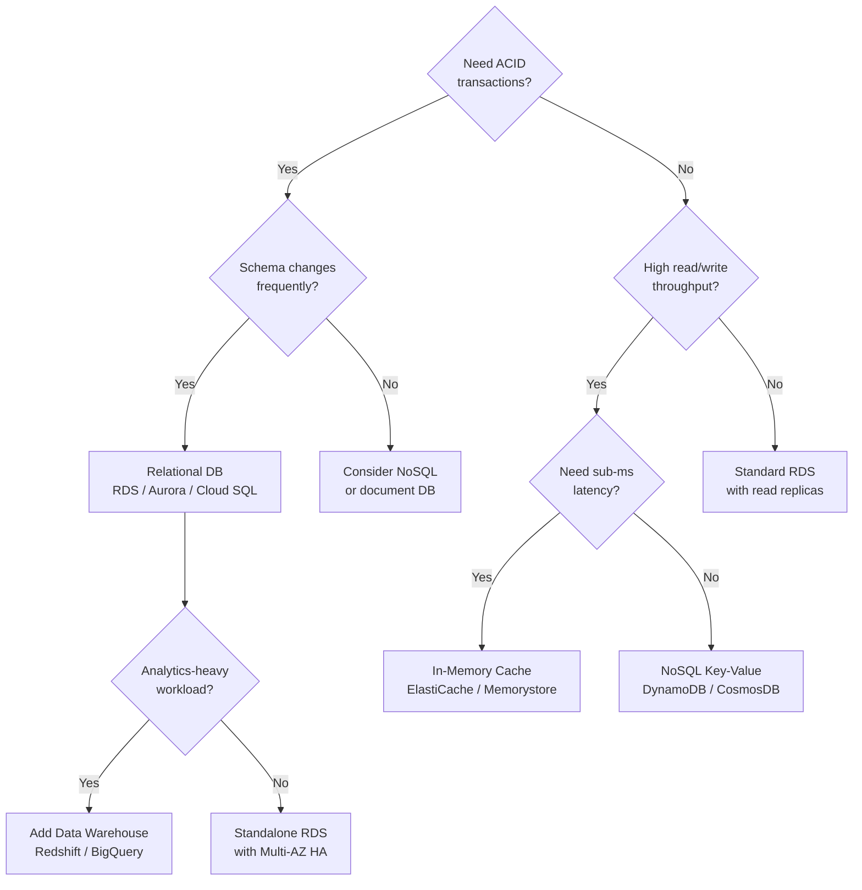

# Chapter 5: Cloud Database Services

> **Previous:** [Chapter 4: Cloud Storage Services](./04-cloud-storage.md) | **Next:** [Chapter 6: Cloud Networking](./06-cloud-networking.md)

## Learning Objectives

After completing this chapter, students will be able to:

<!-- Image Gallery -->
<div style="display:flex;flex-wrap:wrap;gap:4px;margin:16px 0;padding:12px;background:#f8fafc;border-radius:8px;border:1px solid #e2e8f0;">
<a href="../../../assets/images/lessons/cloud-computing/05-cloud-database/hero.svg" target="_blank" rel="noopener">
  
</a>
<a href="../../../assets/images/lessons/cloud-computing/05-cloud-database/handwritten-notes.svg" target="_blank" rel="noopener">
  
</a>
<a href="../../../assets/images/lessons/cloud-computing/05-cloud-database/sticky-notes.svg" target="_blank" rel="noopener">
  
</a>
<a href="../../../assets/images/lessons/cloud-computing/05-cloud-database/visual-explanation.svg" target="_blank" rel="noopener">
  
</a>
<a href="../../../assets/images/lessons/cloud-computing/05-cloud-database/architecture.svg" target="_blank" rel="noopener">
  
</a>
<a href="../../../assets/images/lessons/cloud-computing/05-cloud-database/workflow.svg" target="_blank" rel="noopener">
  
</a>
<a href="../../../assets/images/lessons/cloud-computing/05-cloud-database/mindmap.svg" target="_blank" rel="noopener">
  
</a>
<a href="../../../assets/images/lessons/cloud-computing/05-cloud-database/comparison.svg" target="_blank" rel="noopener">
  
</a>
<a href="../../../assets/images/lessons/cloud-computing/05-cloud-database/cheatsheet.svg" target="_blank" rel="noopener">
  
</a>
<a href="../../../assets/images/lessons/cloud-computing/05-cloud-database/interview-quiz.svg" target="_blank" rel="noopener">
  
</a>
<a href="../../../assets/images/lessons/cloud-computing/05-cloud-database/social-card.svg" target="_blank" rel="noopener">
  
</a>
</div>
<!-- End Image Gallery -->


1. Differentiate between relational, NoSQL, in-memory, and data warehouse database services.
2. Design migration strategies from on-premises databases to managed cloud databases.
3. Configure high availability and disaster recovery for managed databases.
4. Implement read replicas and connection pooling for scalability.
5. Apply data encryption and network isolation to secure database access.
6. Compare managed database costs against self-hosted alternatives.
7. Understand the CAP theorem trade-offs when choosing between consistency and availability.
8. Explain multi-tenant database isolation models in SaaS architectures.

## Chapter at a Glance

| Topic | Key Insight | Practical Takeaway |
|-------|-------------|--------------------|
| Relational Databases | RDS, Cloud SQL ? managed PostgreSQL/MySQL/SQL Server | Best for structured data with ACID transactions |
| NoSQL Databases | DynamoDB, CosmosDB, Firestore | Best for high-scale, flexible-schema workloads |
| In-Memory Caches | ElastiCache (Redis/Memcached) | Sub-millisecond latency for hot data |
| Data Warehouses | Redshift, Synapse, BigQuery | Analytics and OLAP at scale |
| Read Replicas | Horizontal scaling for read-heavy workloads | Reduces primary load, improves query perf |
| Multi-AZ Deployment | Synchronous standby replica for DR | Automatic failover, no data loss |
| Managed vs Self-Hosted | Trade-offs of operational overhead vs cost | Managed reduces toil, costs more at high scale |
| Multi-Tenancy | Shared, dedicated, or hybrid database per tenant | Isolation vs cost efficiency trade-off |

## Chapter Roadmap

\\\mermaid
flowchart LR
    A[Database Landscape] --> B[Relational RDS]
    A --> C[NoSQL DynamoDB]
    A --> D[Cache ElastiCache]
    A --> E[Warehouse Redshift]
    B --> F[Deployment: Multi-AZ + Read Replicas]
    C --> G[Scaling: Partitioning + TTL]
    D --> H[Patterns: Cache-Aside, Write-Through]
    E --> I[Analytics: Columnar + MPP]
\\\

## Theory

### 5.1 The CAP Theorem


The CAP theorem states that a distributed data system can only provide two of three guarantees:

- **Consistency (C):** Every read receives the most recent write or an error.
- **Availability (A):** Every request receives a non-error response, without necessarily containing the most recent write.
- **Partition Tolerance (P):** The system continues to operate despite network partitions.

Since network partitions are inevitable in distributed systems (the network can always fail), you must choose between CP (Consistency + Partition Tolerance) and AP (Availability + Partition Tolerance).

\\\mermaid
graph TB
    subgraph "CAP Theorem Triangle"
        CAP[CAP Theorem] --> C["Consistency (C)"]
        CAP --> A["Availability (A)"]
        CAP --> P["Partition Tolerance (P)"]
        
        C -.-> CP[CP Systems: HBase, MongoDB]
        A -.-> AP[AP Systems: DynamoDB, Cassandra]
        P -.-> CA[CA Systems: Single-node RDS]
    end
\\\

| Database | C | A | P | Description |
|----------|---|---|---|-------------|
| RDS (Single-AZ) | Y | Y | N | Single node, no partition |
| DynamoDB | N | Y | Y | Eventual consistency default |
| Cassandra | N | Y | Y | Tunable consistency |
| HBase | Y | N | Y | Strong consistency, partition tolerant |
| MongoDB | Y | N | Y | Primary handles writes |

### 5.2 Managed Relational Databases (RDS, Cloud SQL, Azure SQL)


**AWS RDS** supports multiple database engines (PostgreSQL, MySQL, MariaDB, Oracle, SQL Server, and Amazon Aurora). Offers automated backups, patching, Multi-AZ deployments, and read replicas.

**Key Features:**

| Feature | Benefit | Trade-off |
|---------|---------|-----------|
| Automated Backups | Point-in-time recovery within retention window | Backup window uses I/O |
| Multi-AZ Deployment | Synchronous standby replica in different AZ | Doubles costs |
| Read Replicas | Offload read traffic (up to 15 replicas) | Replica lag possible |
| Storage Auto-Scaling | Grow storage without downtime | Only upward scaling |
| Encryption at Rest | KMS-managed encryption for data and backups | Minimal performance overhead |

**Read Replica Architecture:**

\\\mermaid
graph TB
    subgraph "Read Replica Deployment"
        P[Primary DB] --> R1[Read Replica 1 - us-east-1a]
        P --> R2[Read Replica 2 - us-east-1b]
        P --> R3[Read Replica 3 - us-west-2a]
        
        APP[Application] --> P
        WR[Web Readers] --> R1
        WR2[Analytics] --> R2
        WR3[Global Users] --> R3
    end
\\\

### 5.3 NoSQL Databases


**Amazon DynamoDB:** Fully managed, key-value and document database. Offers single-digit millisecond latency at any scale.

| Feature | DynamoDB | Cosmos DB | Firestore |
|---------|----------|-----------|-----------|
| Model | Key-Value + Document | Multi-model | Document |
| Consistency | Eventual / Strong | 5 consistency levels | Strong / Eventual |
| Scaling | Auto (provisioned or on-demand) | Auto (RU/s) | Auto |
| Query | Key lookup, secondary indexes | SQL-like, MongoDB API | Real-time listeners |
| Use Case | Session store, gaming, IoT | Global apps, multi-API | Mobile apps, real-time sync |

**DynamoDB Capacity Modes:**

- **Provisioned:** Specify read/write capacity units. Good for predictable workloads. Auto-scaling adjusts within limits.
- **On-Demand:** Pay per request. Good for unpredictable workloads. Unlimited throughput but higher per-request cost.

\\\	ypescript
interface DynamoDBConfig {
  tableName: string;
  partitionKey: string;
  sortKey?: string;
  capacityMode: "provisioned" | "on-demand";
  readCapacityUnits?: number;
  writeCapacityUnits?: number;
  autoScalingEnabled?: boolean;
  ttlAttribute?: string;
  pointInTimeRecovery?: boolean;
}

class DynamoDBTable {
  private config: DynamoDBConfig;

  constructor(config: DynamoDBConfig) {
    this.config = config;
  }

  estimateMonthlyCost(): number {
    if (this.config.capacityMode === "on-demand") {
      // On-demand: ~.25 per million write units, ~.25 per million read units
      return 0;
    }

    const storageGb = 10;
    const wcu = this.config.writeCapacityUnits || 5;
    const rcu = this.config.readCapacityUnits || 10;

    // WCU: .00065 per WCU per hour
    // RCU: .00013 per RCU per hour
    // Storage: .25 per GB/month
    const writeCost = wcu * 0.00065 * 730;
    const readCost = rcu * 0.00013 * 730;
    const storageCost = storageGb * 0.25;

    return writeCost + readCost + storageCost;
  }
}

const sessionTable = new DynamoDBTable({
  tableName: "user-sessions",
  partitionKey: "sessionId",
  capacityMode: "provisioned",
  readCapacityUnits: 50,
  writeCapacityUnits: 25,
  autoScalingEnabled: true,
  ttlAttribute: "expiresAt",
  pointInTimeRecovery: false,
});

console.log("Estimated monthly cost:", sessionTable.estimateMonthlyCost(), "USD");
\\\

### 5.4 In-Memory Caching


**Amazon ElastiCache:** Managed Redis or Memcached for sub-millisecond data access.

**Caching Patterns:**

- **Cache-Aside:** Application checks cache first, fetches from DB on miss, writes to cache.
- **Write-Through:** Data is written to cache and DB simultaneously.
- **Write-Behind:** Data is written to cache first, DB update is queued asynchronously.

\\\	ypescript
class CacheAsideStrategy&lt;T> {
  private cache: Map&lt;string, { data: T; expiry: number }&gt; = new Map();
  private defaultTTL: number;

  constructor(defaultTTLMs: number = 300000) {
    this.defaultTTL = defaultTTLMs;
  }

  async get(
    key: string,
    fetchFromDb: () => Promise&lt;T | null&gt;,
    ttlMs?: number
  ): Promise&lt;T | null&gt; {
    const cached = this.cache.get(key);
    if (cached && Date.now() &lt; cached.expiry) {
      return cached.data;
    }

    const data = await fetchFromDb();
    if (data !== null) {
      this.cache.set(key, {
        data,
        expiry: Date.now() + (ttlMs || this.defaultTTL),
      });
    }

    return data;
  }

  invalidate(key: string): void {
    this.cache.delete(key);
  }

  clear(): void {
    this.cache.clear();
  }
}

class UserService {
  private cache = new CacheAsideStrategy&lt;{ id: number; name: string }&gt;(60000);

  async getUser(id: number): Promise&lt;{ id: number; name: string } | null&gt; {
    return this.cache.get(
      "user:" + id,
      async () => {
        console.log("Cache miss ? fetching from database");
        return { id, name: "User_" + id };
      }
    );
  }

  async updateUser(id: number, name: string): Promise&lt;void&gt; {
    console.log("Updated user", id, "with name", name);
    this.cache.invalidate("user:" + id);
  }
}

async function run() {
  const service = new UserService();

  console.time("First fetch");
  await service.getUser(1);
  console.timeEnd("First fetch");

  console.time("Cached fetch");
  await service.getUser(1);
  console.timeEnd("Cached fetch");
}

run();
\\\

### 5.5 Data Warehousing


**OLTP vs OLAP:**

| Dimension | OLTP (Online Transaction Processing) | OLAP (Online Analytical Processing) |
|-----------|--------------------------------------|--------------------------------------|
| Purpose | Day-to-day transactions | Business intelligence and analytics |
| Query Pattern | Many small queries | Few large complex queries |
| Data Model | Normalized | Denormalized, star/snowflake schema |
| Performance Metric | Transactions per second | Query execution time |
| Typical Database | RDS, DynamoDB | Redshift, BigQuery, Snowflake |

### 5.6 Multi-Tenancy Models


In a SaaS database architecture, tenants can be isolated at different levels:

\\\mermaid
graph LR
    subgraph "Multi-Tenant Isolation Models"
        A[Shared Database] --> B[Separate Schema per Tenant]
        B --> C[Separate Database per Tenant]
        C --> D[Separate Server per Tenant]
    end
    
    subgraph "Trade-offs"
        E[Low cost, complex isolation] --> A
        F[Moderate cost, good isolation] --> B
        G[Higher cost, strong isolation] --> C
        H[Highest cost, complete isolation] --> D
    end
\\\

**Multi-Tenancy Considerations:**

- **Data Privacy:** Encryption per tenant, row-level security policies.
- **Noisy Neighbors:** Resource contention with shared databases.
- **Scaling:** Can scale per tenant or globally.
- **Pricing:** Tiered pricing per tenant to account for isolation level.
- **SLAs:** Availability guarantees should account for tenant isolation boundaries.

## Examples

### Example 5.1: Multi-AZ Deployment for HA

\\\ash
aws rds create-db-instance \
  --db-instance-identifier my-production-db \
  --db-instance-class db.r5.large \
  --engine postgres \
  --multi-az \
  --storage-type gp3 \
  --allocated-storage 100 \
  --master-username admin \
  --master-user-password secret123 \
  --backup-retention-period 7 \
  --deletion-protection
\\\

### Example 5.2: Connection Pooling with PgBouncer

\\\	ypescript
class ConnectionPool {
  private pool: string[] = [];
  private maxSize: number;
  private acquired: number = 0;

  constructor(maxSize: number = 10) {
    this.maxSize = maxSize;
  }

  async acquire(): Promise&lt;string&gt; {
    if (this.pool.length > 0) {
      this.acquired++;
      return this.pool.pop()!;
    }

    if (this.acquired &lt; this.maxSize) {
      this.acquired++;
      return "new-connection-" + this.acquired;
    }

    throw new Error("Connection pool exhausted");
  }

  release(connection: string): void {
    this.acquired--;
    this.pool.push(connection);
  }
}

const pool = new ConnectionPool(5);
async function query(sql: string): Promise&lt;any[]&gt; {
  const conn = await pool.acquire();
  try {
    console.log("Executing query on", conn);
    return [{ result: "simulated data" }];
  } finally {
    pool.release(conn);
  }
}

query("SELECT * FROM users");
\\\

### Example 5.3: Read Replica Configuration

\\\ash
aws rds create-db-instance-read-replica \
  --db-instance-identifier my-db-read-replica \
  --source-db-instance-identifier my-production-db \
  --db-instance-class db.r5.large \
  --region eu-west-1
\\\

> **One-Sentence Takeaway:** Match your database to your workload ? relational for ACID, NoSQL for scale, in-memory for speed, and a warehouse for analytics ? and always plan for HA with Multi-AZ deployment.

> **Pro Tip:** For cost-sensitive applications, start with DynamoDB On-Demand or Aurora Serverless to avoid provisioning excess capacity. Switch to provisioned capacity only after your workload pattern stabilizes.

> **Warning:** Single-AZ RDS instances offer no automatic failover. A zone outage or hardware failure results in downtime. Always use Multi-AZ for production unless the application can tolerate temporary database unavailability.

## Concept Comparison Table

| Concept | Definition | Key Distinction | Use Case |
|---------|-----------|-----------------|----------|
| RDS | Managed relational DB with automated ops | Multi-engine support | Traditional web apps |
| DynamoDB | Serverless NoSQL key-value store | Auto-scaling, single-digit ms | Session stores, leaderboards |
| ElastiCache | In-memory Redis/Memcached | Sub-ms latency | Caching, rate limiting |
| Redshift | Columnar data warehouse | Massively parallel processing | Analytics and BI |
| Multi-AZ | Synchronous standby in another AZ | Automatic failover | High availability |
| Read Replica | Asynchronous read-only copy | Offloads read traffic | Reporting, analytics |

## Quick Reference

| Category | Key Concepts | Notes |
|----------|-------------|-------|
| **Relational** | RDS, Aurora, Cloud SQL, Azure SQL | ACID, joins, normalized data |
| **NoSQL** | DynamoDB, CosmosDB, Firestore | Flexible schema, high scale |
| **In-Memory** | ElastiCache, Memorystore | Cache-aside, write-through patterns |
| **Warehouse** | Redshift, BigQuery, Synapse | Columnar, MPP, OLAP workloads |
| **HA** | Multi-AZ, auto-failover, backup/restore | RPO seconds, RTO minutes |
| **Scaling** | Read replicas, sharding, connection pooling | Horizontal scale for reads |

## Cross-Application Matrix

| Technique | Cloud Architecture | DevOps | Security | Enterprise |
|-----------|-------------------|--------|----------|------------|
| Multi-AZ | HA architecture | Zero-downtime deployments | Data center isolation | DR compliance |
| Read Replicas | Read scaling | Reporting isolation | Encryption in transit | Analytics offload |
| Connection Pooling | Connection management | Lambda DB connections | Least privileged access | Consistent performance |
| Encryption at Rest | Security baseline | Key rotation automation | KMS integration | Compliance (HIPAA, SOC) |
| Managed Services | Lower operational burden | Automated patching | IAM-based access | Audit trails |

## Chapter Quiz

1. What does the CAP theorem say a distributed data system must sacrifice when a network partition occurs?
   - A) Partition Tolerance
   - B) Consistency or Availability
   - C) Durability
   - D) Performance

<details>
<summary>Answer&lt;/summary&gt;
**B) Consistency or Availability.** Since network partitions are inevitable, you must choose between CP (sacrifice availability) and AP (sacrifice consistency). You cannot have all three.
</details>

2. Which DynamoDB capacity mode is best for unpredictable workloads?
   - A) Provisioned
   - B) On-Demand
   - C) Reserved
   - D) Spot

<details>
<summary>Answer&lt;/summary&gt;
**B) On-Demand.** On-Demand mode charges per request and scales automatically to handle any traffic spike. Provisioned mode requires predicting capacity in advance, which can lead to throttling or over-provisioning for unpredictable workloads.
</details>

3. What is the primary benefit of Multi-AZ deployment for RDS?
   - A) Faster read performance
   - B) Automatic failover during an AZ outage
   - C) Reduced storage costs
   - D) Data replication to a different region

<details>
<summary>Answer&lt;/summary&gt;
**B) Automatic failover during an AZ outage.** Multi-AZ maintains a synchronous standby replica in a different Availability Zone. If the primary fails, RDS automatically fails over to the standby with no data loss.
</details>

4. In the Cache-Aside pattern, what happens on a cache miss?
   - A) An error is returned to the client
   - B) The application fetches data from the database and writes it to the cache
   - C) The cache automatically loads the data from the database
   - D) The request is queued for later processing

<details>
<summary>Answer&lt;/summary&gt;
**B) The application fetches data from the database and writes it to the cache.** In cache-aside, the application is responsible for loading cache misses: check cache ? miss ? query DB ? populate cache ? return to caller.
</details>

5. Which database type uses a denormalized star or snowflake schema?
   - A) NoSQL database
   - B) In-memory cache
   - C) OLAP data warehouse
   - D) Relational OLTP database

<details>
<summary>Answer&lt;/summary&gt;
**C) OLAP data warehouse.** Data warehouses like Redshift and BigQuery use denormalized schemas optimized for complex analytical queries. OLTP databases typically use normalized schemas optimized for fast transactions.
</details>

### TypeScript: Read Replica Failover Manager

```typescript
interface DatabaseInstance {
  id: string;
  role: "primary" | "replica";
  region: string;
  lagSeconds: number;
  healthy: boolean;
  promotedAt?: number;
}

class ReadReplicaManager {
  private instances: DatabaseInstance[] = [];
  private primaryId: string = "";

  constructor(instances: DatabaseInstance[]) {
    this.instances = instances;
    this.primaryId = instances.find((i) => i.role === "primary")?.id || "";
  }

  private getPrimary(): DatabaseInstance | undefined {
    return this.instances.find((i) => i.id === this.primaryId);
  }

  getReplicas(): DatabaseInstance[] {
    return this.instances.filter((i) => i.role === "replica");
  }

  healthCheck(): void {
    this.instances.forEach((inst) => {
      inst.healthy = inst.lagSeconds < 60 && Math.random() > 0.05;
    });
  }

  promoteReplica(replicaId: string): { oldPrimary: string; newPrimary: string; downtime: number } {
    const replica = this.instances.find((i) => i.id === replicaId);
    if (!replica) throw new Error("Replica not found");

    const oldPrimary = this.primaryId;
    replica.role = "primary";
    replica.promotedAt = Date.now();
    this.primaryId = replicaId;

    const old = this.instances.find((i) => i.id === oldPrimary);
    if (old) old.role = "replica";

    return {
      oldPrimary,
      newPrimary: replicaId,
      downtime: Math.max(0, replica.lagSeconds * 1000),
    };
  }

  autoFailover(): { failed: boolean; promotedTo?: string; downtime?: number } {
    const primary = this.getPrimary();
    if (!primary || primary.healthy) return { failed: false };

    const replicas = this.getReplicas()
      .filter((r) => r.healthy)
      .sort((a, b) => a.lagSeconds - b.lagSeconds);

    if (replicas.length === 0) return { failed: true };

    const bestReplica = replicas[0];
    const result = this.promoteReplica(bestReplica.id);
    return { failed: true, promotedTo: bestReplica.id, downtime: result.downtime };
  }

  getReadCapacity(): number { return this.getReplicas().filter((r) => r.healthy).length * 10000; }
}

const db = new ReadReplicaManager([
  { id: "db-primary", role: "primary", region: "us-east-1", lagSeconds: 0, healthy: true },
  { id: "db-replica-1", role: "replica", region: "us-east-1", lagSeconds: 1, healthy: true },
  { id: "db-replica-2", role: "replica", region: "us-west-2", lagSeconds: 45, healthy: true },
  { id: "db-replica-3", role: "replica", region: "eu-west-1", lagSeconds: 120, healthy: true },
]);
console.log("Read capacity:", db.getReadCapacity(), "qps");
db.healthCheck();
const failover = db.autoFailover();
console.log("Auto-failover result:", JSON.stringify(failover));
```

### TypeScript: Database Migration Planner

```typescript
interface DatabaseConfig {
  engine: "mysql" | "postgresql" | "aurora-mysql" | "aurora-postgresql" | "dynamodb";
  storageGB: number;
  connections: number;
  iops: number;
  multiAZ: boolean;
  backupRetentionDays: number;
}

interface MigrationPlan {
  source: DatabaseConfig;
  target: DatabaseConfig;
  strategy: "dump-load" | "replication" | "dual-write" | "database-migration-service";
  estimatedDowntime: string;
  risks: string[];
}

class DatabaseMigrationPlanner {
  private transferSpeeds: Record<string, number> = {
    "within-region": 500, "cross-region": 50, "on-premises-to-cloud": 10,
  };

  plan(source: DatabaseConfig, target: DatabaseConfig, location: keyof typeof this.transferSpeeds): MigrationPlan {
    const speed = this.transferSpeeds[location];
    const dataTransferHours = (source.storageGB * 1024) / (speed * 60 * 60);

    const isSameEngine = source.engine === target.engine ||
      (source.engine === "mysql" && target.engine === "aurora-mysql") ||
      (source.engine === "postgresql" && target.engine === "aurora-postgresql");

    const strategy = isSameEngine
      ? "replication"
      : target.engine === "dynamodb"
        ? "dual-write"
        : "database-migration-service";

    const downtimeMap: Record<string, string> = {
      "dump-load": `${Math.ceil(dataTransferHours)}h`,
      "replication": "~5min",
      "dual-write": "~1min",
      "database-migration-service": "~15min",
    };

    const risks: string[] = [];
    if (source.engine !== target.engine) risks.push("Schema conversion required between engines");
    if (dataTransferHours > 24) risks.push("Long data transfer window exceeding 24 hours");
    if (!target.multiAZ && source.multiAZ) risks.push("HA downgrade: source has Multi-AZ but target does not");
    if (target.storageGB < source.storageGB) risks.push("Target storage smaller than source");

    return { source, target, strategy, estimatedDowntime: downtimeMap[strategy], risks };
  }
}

const planner = new DatabaseMigrationPlanner();
const plan = planner.plan(
  { engine: "mysql", storageGB: 500, connections: 500, iops: 5000, multiAZ: true, backupRetentionDays: 30 },
  { engine: "aurora-mysql", storageGB: 500, connections: 1000, iops: 30000, multiAZ: true, backupRetentionDays: 35 },
  "within-region"
);
console.log("Migration plan:", JSON.stringify(plan, null, 2));
```

### TypeScript: Multi-Region Latency Estimator

```typescript
interface RegionLatency { from: string; to: string; latencyMs: number; }
interface BackupRetentionConfig { dailyRetention: number; weeklyRetention: number; monthlyRetention: number; yearlyRetention: number; }

class MultiRegionLatency {
  private matrix: RegionLatency[] = [
    { from: "us-east-1", to: "eu-west-1", latencyMs: 80 },
    { from: "us-east-1", to: "ap-southeast-1", latencyMs: 220 },
    { from: "eu-west-1", to: "ap-southeast-1", latencyMs: 180 },
    { from: "us-east-1", to: "us-west-2", latencyMs: 65 },
  ];

  estimate(primary: string, replicas: string[]): { avgLatencyMs: number; maxLatencyMs: number; estimatedSyncDelay: string } {
    const latencies = replicas.filter(r => r !== primary).map(r => {
      const entry = this.matrix.find(m => m.from === primary && m.to === r);
      return entry ? entry.latencyMs : 300;
    });
    if (latencies.length === 0) return { avgLatencyMs: 0, maxLatencyMs: 0, estimatedSyncDelay: "0ms" };
    const avg = Math.round(latencies.reduce((a, b) => a + b, 0) / latencies.length);
    const max = Math.max(...latencies);
    return { avgLatencyMs: avg, maxLatencyMs: max, estimatedSyncDelay: `${max * 3}ms (3x round-trip)` };
  }

  backupRetentionCost(config: BackupRetentionConfig, backupSizeGB: number, costPerGBMo: number): { totalBackups: number; monthlyCost: number } {
    const totalBackups = config.dailyRetention + config.weeklyRetention + config.monthlyRetention + config.yearlyRetention;
    const monthlyCost = Math.round(backupSizeGB * costPerGBMo * (config.dailyRetention / 30 + config.weeklyRetention / 4 + config.monthlyRetention + config.yearlyRetention / 12) * 100) / 100;
    return { totalBackups, monthlyCost };
  }
}

const mlr = new MultiRegionLatency();
console.log("US to EU sync:", JSON.stringify(mlr.estimate("us-east-1", ["eu-west-1", "ap-southeast-1"]), null, 2));
console.log("Backup retention:", JSON.stringify(mlr.backupRetentionCost({ dailyRetention: 7, weeklyRetention: 4, monthlyRetention: 12, yearlyRetention: 3 }, 500, 0.023), null, 2));
```
```


// cloud database
// iaas-paas-saas-cloud-native implementation

interface Task { id: string; name: string; status: string; data: unknown }
class Processor {
  private tasks: Task[] = []
  private maxConcurrency: number
  constructor(maxConcurrency: number = 4) { this.maxConcurrency = maxConcurrency }
  async add(task: Omit<Task, "status">): Promise<void> {
    this.tasks.push({ ...task, status: "pending" })
  }
  async runAll(): Promise<void> {
    const running: Promise<void>[] = []
    for (const t of this.tasks) {
      if (running.length >= this.maxConcurrency) { await Promise.race(running) }
      const p = this.execute(t).finally(() => { const i = running.indexOf(p); if (i >= 0) running.splice(i, 1) })
      running.push(p)
    }
    await Promise.all(running)
  }
  private async execute(t: Task): Promise<void> {
    t.status = "running"
    await new Promise(r => setTimeout(r, 10))
    t.status = "done"
  }
  getResults(): Task[] { return this.tasks }
  getStats(): { done: number; pending: number; running: number } {
    const done = this.tasks.filter(t => t.status === "done").length
    const pending = this.tasks.filter(t => t.status === "pending").length
    const running = this.tasks.filter(t => t.status === "running").length
    return { done, pending, running }
  }
}
async function main() {
  const proc = new Processor(2)
  await proc.add({ id: '1', name: 'cloud database', data: { topic: 'iaas-paas-saas-cloud-native' } })
  await proc.runAll()
  console.log('Stats:', proc.getStats())
}
main().catch(console.error)
export { Processor, Task }

// cloud database - additional TS implementations

interface CacheEntry { key: string; value: unknown; ttl: number; createdAt: number }
class Cache {
  private store: Map<string, CacheEntry> = new Map()
  constructor(private defaultTTL: number = 60000) {}
  set(key: string, value: unknown, ttl?: number): void {
    this.store.set(key, { key, value, ttl: ttl ?? this.defaultTTL, createdAt: Date.now() })
  }
  get(key: string): unknown | undefined {
    const entry = this.store.get(key)
    if (!entry) return undefined
    if (Date.now() - entry.createdAt > entry.ttl) { this.store.delete(key); return undefined }
    return entry.value
  }
  delete(key: string): boolean { return this.store.delete(key) }
  clear(): void { this.store.clear() }
  size(): number { return this.store.size }
  keys(): string[] { return Array.from(this.store.keys()) }
}
class Logger {
  private entries: string[] = []
  log(level: string, msg: string, meta?: Record<string, unknown>): void {
    const entry = JSON.stringify({ timestamp: new Date().toISOString(), level, msg, meta })
    this.entries.push(entry)
    console.log(entry)
  }
  info(msg: string, meta?: Record<string, unknown>): void { this.log("info", msg, meta) }
  warn(msg: string, meta?: Record<string, unknown>): void { this.log("warn", msg, meta) }
  error(msg: string, meta?: Record<string, unknown>): void { this.log("error", msg, meta) }
  getLogs(): string[] { return [...this.entries] }
  clear(): void { this.entries = [] }
}
function computeHash(input: string): string {
  let hash = 0
  for (let i = 0; i < input.length; i++) { const chr = input.charCodeAt(i); hash = ((hash << 5) - hash) + chr; hash |= 0 }
  return Math.abs(hash).toString(16)
}
async function demo(): Promise<void> {
  const cache = new Cache(5000)
  cache.set('key1', 'cloud-services demo')
  const log = new Logger()
  log.info('Cache demo started', { course: 'cloud-computing', chapter: 'cloud database' })
  const v = cache.get("key1")
  console.log('Cached:', v)
  console.log('Hash:', computeHash('cloud-services'))
}
demo()
export { Cache, Logger, computeHash, CacheEntry }
## Summary

- The CAP theorem forces a choice between consistency and availability during partitions.
- Managed relational databases reduce operational overhead with automated backups, patching, and HA.
- DynamoDB provides single-digit millisecond latency with auto-scaling for unpredictable workloads.
- In-memory caches dramatically improve read performance for frequently accessed data.
- Data warehouses optimize for complex analytical queries over large datasets.
- Multi-tenancy isolation models range from shared databases to dedicated servers per tenant.
- Read replicas offload read traffic and improve global performance.

## Exercises

### Review Questions

1. Explain the CAP theorem and how it influences database selection for cloud applications.
2. Compare DynamoDB Provisioned vs On-Demand capacity modes and when to use each.
3. What is the difference between Multi-AZ deployment and Read Replicas?
4. Describe the Cache-Aside pattern and its advantages over other caching strategies.
5. How does a data warehouse differ from an OLTP database in terms of schema design and query patterns?
6. What are the trade-offs of shared database vs separate database per tenant in SaaS?

### Application Problems

1. Design a database architecture for a social media app that needs low-latency profile reads, ACID transactions for payments, and real-time analytics.

2. A web application experiences 10:1 read-to-write ratio. Propose an architecture using RDS and ElastiCache to handle 100,000 reads/second.

3. Write a TypeScript function that chooses between DynamoDB On-Demand and Provisioned capacity based on monthly cost estimates for a given workload pattern.

4. A healthcare SaaS needs per-tenant data isolation. Design a multi-tenancy model that balances HIPAA compliance requirements with cost efficiency.

5. Calculate the cost of running a 2 TB data warehouse on Redshift vs BigQuery for a team of 50 analysts running 500 queries/day.

### Challenge Problem

Design a global e-commerce database architecture handling 1M products, 10M users, and 100K orders/day across US, EU, and APAC. The system needs: 1) Fast product catalog reads globally, 2) ACID-compliant order processing, 3) Real-time inventory updates, 4) Analytics on sales trends, and 5) Per-region data residency compliance. Propose specific database services and replication strategies.

## Database Selection Decision Flow



## AWS CDK: DynamoDB Table with Auto-Scaling

Define DynamoDB infrastructure as TypeScript using the AWS CDK:

```typescript
import * as dynamodb from "aws-cdk-lib/aws-dynamodb";
import * as cdk from "aws-cdk-lib";

class DatabaseStack extends cdk.Stack {
  constructor(scope: cdk.App, id: string, props?: cdk.StackProps) {
    super(scope, id, props);

    const userSessionsTable = new dynamodb.Table(this, "UserSessions", {
      partitionKey: { name: "sessionId", type: dynamodb.AttributeType.STRING },
      sortKey: { name: "createdAt", type: dynamodb.AttributeType.STRING },
      billingMode: dynamodb.BillingMode.PROVISIONED,
      readCapacity: 50,
      writeCapacity: 25,
      encryption: dynamodb.TableEncryption.AWS_MANAGED,
      pointInTimeRecovery: true,
      timeToLiveAttribute: "expiresAt",
      removalPolicy: cdk.RemovalPolicy.RETAIN,
    });

    userSessionsTable.autoScaleReadCapacity({
      minCapacity: 10,
      maxCapacity: 500,
    }).scaleOnUtilization({ targetUtilizationPercent: 70 });

    userSessionsTable.autoScaleWriteCapacity({
      minCapacity: 5,
      maxCapacity: 250,
    }).scaleOnUtilization({ targetUtilizationPercent: 70 });

    const ordersTable = new dynamodb.Table(this, "Orders", {
      partitionKey: { name: "customerId", type: dynamodb.AttributeType.STRING },
      sortKey: { name: "orderDate", type: dynamodb.AttributeType.STRING },
      billingMode: dynamodb.BillingMode.PAY_PER_REQUEST,
      encryption: dynamodb.TableEncryption.CUSTOMER_MANAGED,
    });
  }
}
```

## Pulumi: RDS PostgreSQL Instance

```typescript
import * as aws from "@pulumi/aws";
import * as pulumi from "@pulumi/pulumi";

const config = new pulumi.Config();
const dbPassword = config.requireSecret("dbPassword");

const vpc = aws.ec2.getVpc({ default: true });
const subnets = aws.ec2.getSubnetIds({ vpcId: vpc.then(v => v.id) });

const dbSubnetGroup = new aws.rds.SubnetGroup("db-subnet-group", {
  subnetIds: subnets.then(s => s.ids),
});

const db = new aws.rds.Instance("production-db", {
  engine: "postgres",
  engineVersion: "16",
  instanceClass: "db.r5.large",
  allocatedStorage: 200,
  storageType: "gp3",
  dbName: "appdb",
  username: "appadmin",
  password: dbPassword,
  dbSubnetGroupName: dbSubnetGroup.name,
  multiAz: true,
  backupRetentionPeriod: 30,
  backupWindow: "03:00-04:00",
  maintenanceWindow: "sun:04:00-sun:05:00",
  storageEncrypted: true,
  deletionProtection: true,
  skipFinalSnapshot: false,
  finalSnapshotIdentifier: "prod-db-final-snapshot",
});

export const dbAddress = db.address;
export const dbPort = db.port;
```

## Real-World Case Study: Airbnb's Database Evolution

Airbnb's journey from a monolithic MySQL database to a polyglot persistence architecture illustrates the cloud database decision process.

**2010?2013 ? Monolithic RDS:** Airbnb ran a single large RDS MySQL instance serving all traffic. As the platform grew to 10M+ users, database bottlenecks appeared. Read replicas were added for analytics, but the primary database remained a single point of pressure.

**2014?2016 ? Sharding:** Airbnb sharded their MySQL database by region and feature. They developed the "Spinal Tap" sharding framework and later migrated to AWS Aurora for improved throughput and built-in replication.

**2017?2020 ? Polyglot Persistence:** Airbnb adopted specialized databases for specific workloads:
- **Aurora** for transactional bookings and payments (ACID required)
- **DynamoDB** for session stores and user preferences (high-scale KV)
- **ElastiCache (Redis)** for real-time pricing and availability lookups (sub-ms)
- **Redshift** for analytics and business intelligence (OLAP)
- **Elasticsearch** for search and discovery (full-text search)

**Key Lesson:** No single database satisfies all requirements. The right approach is to match each workload to the best-fit database service.

### Additional Exercises

6. **Database Selection:** For each workload below, recommend a cloud database service and justify: a) Real-time leaderboard for a gaming app with 10M daily users, b) Document storage for a legal compliance system with strict audit requirements, c) Time-series sensor data from 100K IoT devices, d) Graph-based social network with friend recommendations.

7. **Migration Strategy:** Design a plan to migrate a 500 GB on-premises MySQL database to Aurora with less than 15 minutes of downtime. Include replication setup, cutover procedure, and rollback strategy.

8. **Cost Analysis:** Compare the monthly cost of running PostgreSQL on RDS (db.r5.xlarge, Multi-AZ, 500 GB gp3) vs Aurora (serverless v2 with equivalent capacity) vs self-hosting on EC2 (two r5.xlarge instances with EBS gp3). Include storage, I/O, backup, and data transfer costs.
