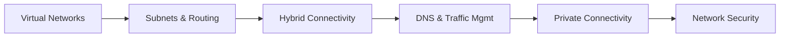

# Chapter 6: Cloud Networking and Delivery

> **Previous:** [Chapter 5: Cloud Database Services](./05-cloud-database.md) | **Next:** [Chapter 7: Cloud Security and Identity](./07-cloud-security.md)

## Learning Objectives

After completing this chapter, students will be able to:

1. Design isolated virtual networks using VPC (AWS/GCP) and VNet (Azure).
2. Configure routing, subnets, and gateways for public and private traffic.
3. Compare hybrid connectivity options including VPN and dedicated circuits (Direct Connect, ExpressRoute, Interconnect).
4. Implement private service connectivity using endpoints and PrivateLink.
5. Utilize global DNS services with advanced routing policies (latency, geolocation, failover).
6. Design global content delivery strategies using CDN and Anycast IP.
7. Apply multi-layered network security using firewalls, ACLs, and DDoS protection.

## Chapter at a Glance

| Topic | Key Insight | Practical Takeaway |
|-------|-------------|--------------------|
| Virtual Networks | VPC/VNet provide isolated network environments | Each VPC is your own private data center in the cloud |
| Subnets & Routing | Public (IGW) vs Private (NAT) subnets | Route tables control all traffic flow |
| Hybrid Connectivity | VPN over internet vs Direct Connect private circuits | Dedicated circuits: consistent performance, higher cost |
| DNS & Traffic Mgmt | Route 53, Cloud DNS — latency/geolocation routing | DNS-level routing enables global load balancing |
| PrivateLink | Access services via private IP | Keeps traffic off the public internet |
| Network Security | SG (stateful), NACL (stateless), WAF, DDoS | Defense in depth — apply all layers |

## Chapter Roadmap



## Theory

### 6.1 Virtual Private Networks

Cloud providers allow users to create isolated virtual networks that function as their own private data centers in the cloud.

- **AWS VPC:** Regional, spans multiple Availability Zones. Uses CIDR blocks for IP addressing.
- **Azure VNet:** Regional, similar to AWS but uses "Address Spaces" and "Subnets".
- **GCP VPC:** Global by default. Subnets are regional, allowing a single VPC to span the entire globe.

### 6.2 Subnets and Routing

Networks are subdivided into **Subnets** for organization and security.
- **Public Subnets:** Have a direct route to an **Internet Gateway (IGW)**.
- **Private Subnets:** No direct internet access. Outbound traffic is usually routed through a **NAT Gateway**.
- **Route Tables:** Contain rules (routes) that determine where network traffic is directed.

### 6.3 Connectivity Patterns

1. **Peering:** Directly connecting two virtual networks using the provider's private backbone. Traffic never touches the public internet.
2. **Hub-and-Spoke:** A central network (hub) connected to multiple spoke networks. Often managed via a **Transit Gateway** (AWS) or **Virtual WAN** (Azure).
3. **Hybrid Connectivity:**
   - **Site-to-Site VPN:** Encrypted tunnel over the public internet (IPsec).
   - **Dedicated Circuits:** Physical, private connection (AWS Direct Connect, Azure ExpressRoute, GCP Cloud Interconnect). Offers consistent performance and higher security.


### 6.4 DNS and Traffic Management

Cloud DNS services translate domain names and route traffic based on intelligent policies.

- **AWS Route 53:** Known for diverse routing policies (Simple, Weighted, Latency, Failover, Geolocation).
- **Azure DNS / Google Cloud DNS:** Reliable, low-latency DNS hosting.
- **Traffic Manager / Global Load Balancer:** Uses DNS or Anycast IP to route users to the nearest healthy application endpoint globally.

### 6.5 Private Connectivity

**PrivateLink (AWS/Azure)** and **Private Service Connect (GCP)** allow instances in a private network to access cloud services (like S3 or SQL) using private IP addresses. This enhances security by ensuring sensitive data never traverses the public internet.

### 6.6 Content Delivery Networks (CDN)

CDNs use a global network of "Edge Locations" to cache content closer to users.
- **Anycast IP:** A networking technique where multiple servers share the same IP address. GCP uses this extensively to route traffic to the nearest Google edge location.
- **Edge Functions:** Running code (Lambda@Edge, Cloudflare Workers) at the edge location to customize requests.

### 6.7 Network Security Layers

1. **Security Groups (Stateful):** Act as firewalls for individual instances/VMs.
2. **Network ACLs (Stateless):** Act as firewalls for entire subnets.
3. **Web Application Firewall (WAF):** Protects against Layer 7 attacks (SQL Injection, XSS).
4. **DDoS Protection:** Standard protection is usually free (AWS Shield Standard); advanced protection provides cost protection and dedicated support.

## Examples

### Example 6.1: Designing a Multi-Tier VPC (AWS)

A common pattern for web applications:
- **Public Subnet:** Contains Load Balancer and NAT Gateway.
- **Private Subnet (App):** Contains Web Servers.
- **Private Subnet (DB):** Contains Database (no internet access).

### Example 6.2: Route 53 Failover Policy (CLI)

Configuring a DNS failover from a primary to a secondary site:
```bash
aws route53 change-resource-record-sets --hosted-zone-id Z123 --change-batch '{
  "Changes": [{
    "Action": "CREATE",
    "ResourceRecordSet": {
      "Name": "app.example.com",
      "Type": "A",
      "SetIdentifier": "Primary",
      "Failover": "PRIMARY",
      "AliasTarget": { "HostedZoneId": "Z...","DNSName": "primary.alb.com", "EvaluateTargetHealth": true }
    }
  }]
}'
```

> **One-Sentence Takeaway:** Cloud networking gives you software-defined control over an entire global infrastructure — virtual networks, routing, firewalls, and connectivity — all managed through APIs instead of physical cables.

> **Pro Tip:** Use AWS Transit Gateway or Azure Virtual WAN for hub-and-spoke architectures with more than 10 VPCs. Direct VPC peering doesn't scale — Transit Gateway handles transitive routing and centralizes inspection.

> **Warning:** Security Groups are stateful (return traffic automatically allowed), but Network ACLs are stateless (you must explicitly allow return traffic). Mixing them up is a common source of "mysterious" connectivity failures.

## Concept Comparison Table

| Concept | Definition | Key Distinction | Use Case |
|---------|-----------|-----------------|----------|
| VPC / VNet | Isolated virtual network | Every resource lives in a VPC | Default for all cloud resources |
| Security Group | Instance-level stateful firewall | Allows by default, deny by rule | Per-instance access control |
| Network ACL | Subnet-level stateless firewall | Deny by default, allow by rule | Subnet-level guard rails |
| IGW | Internet gateway for public subnets | Enables public internet access | Web servers, load balancers |
| NAT Gateway | Outbound-only internet for private subnets | Private instances can update, not receive | Database patching |
| Direct Connect | Dedicated physical circuit to cloud | Consistent latency, higher bandwidth | Hybrid cloud, large data transfer |

## Quick Reference

| Category | Key Concepts | Notes |
|----------|-------------|-------|
| **VPC Features** | Subnets, Route Tables, IGW, NAT, Peering | Region-scoped (AWS/Azure), global (GCP) |
| **Security Layers** | SG (instance), NACL (subnet), WAF (app), DDoS | Defense in depth: use all four |
| **Hybrid Connectivity** | Site-to-Site VPN, Direct Connect/ExpressRoute | VPN = internet, DC = private circuit |
| **DNS Policies** | Simple, Weighted, Latency, Geolocation, Failover | Failover routing enables active-passive DR |
| **Private Access** | VPC Endpoints, PrivateLink, Private Service Connect | Keeps traffic on provider backbone |

## Cross-Application Matrix

| Technique | Cloud Architecture | DevOps | Security | Enterprise |
|-----------|-------------------|--------|----------|------------|
| VPC Design | Network topology | Environment isolation | Network segmentation | Compliance zones |
| Transit Gateway | Hub-and-spoke architecture | Centralized inspection | East-west traffic filter | Multi-account connectivity |
| Direct Connect | Hybrid cloud | Consistent CI/CD performance | Encrypted private circuit | Regulatory compliance |
| Route 53 | Global traffic management | Blue-green DNS switch | DNS-based DDoS mitig. | Multi-region HA |
| WAF | App-layer protection | Bot detection | OWASP protection | PCI compliance |

## Chapter Quiz

1. What is the key difference between a Security Group and a Network ACL?
   - A) Security Groups are stateless; NACLs are stateful
   - B) Security Groups are stateful (return traffic auto-allowed); NACLs are stateless
   - C) There is no difference
   - D) NACLs work at the instance level

<details>
<summary>Answer</summary>
**B) Security Groups are stateful (return traffic auto-allowed); NACLs are stateless.** If you allow inbound HTTPS in a Security Group, the response is automatically allowed. With NACLs, you must explicitly allow both inbound and outbound traffic separately.
</details>

2. When should an organization choose Direct Connect/ExpressRoute over a Site-to-Site VPN?
   - A) For lower cost
   - B) For consistent latency, higher bandwidth, and private connection that doesn't traverse the internet
   - C) When they want encryption
   - D) VPN and Direct Connect are identical

<details>
<summary>Answer</summary>
**B) For consistent latency, higher bandwidth, and private connection that doesn't traverse the internet.** Direct Connect provides a dedicated physical circuit from on-premises to the cloud provider, offering predictable performance and bypassing the public internet entirely.
</details>

3. How does VPC Peering differ from Transit Gateway for connecting multiple VPCs?
   - A) Peering supports transitive routing; Transit Gateway does not
   - B) Peering is point-to-point (no transitive routing); Transit Gateway enables hub-and-spoke with transitive routing
   - C) They are identical
   - D) Transit Gateway is cheaper than peering

<details>
<summary>Answer</summary>
**B) Peering is point-to-point (no transitive routing); Transit Gateway enables hub-and-spoke with transitive routing.** With VPC Peering, you need to create N-1 peering connections. Transit Gateway acts as a central hub, allowing any connected VPC to route to any other.
</details>

## Summary

- Virtual networks (VPC/VNet) provide isolation in the cloud.
- Routing is managed via Route Tables and Gateways (IGW/NAT).
- Hybrid clouds use VPN or dedicated lines (Direct Connect/ExpressRoute) for connectivity.
- PrivateLink ensures services are accessed securely via private IPs.
- CDNs and Anycast networking reduce latency for global users.
- Security is multi-layered, combining instance-level (SG) and subnet-level (NACL) firewalls.

## Exercises

### Review Questions

1. Why are subnets in GCP considered "Regional" while AWS subnets are "Zonal"?
2. Explain the difference between a stateful and a stateless firewall.
3. What is the "Longest Prefix Match" in routing?
4. When should an organization choose ExpressRoute/Direct Connect over a standard VPN?
5. How does a Global Load Balancer differ from a Regional Load Balancer?

### Application Problems

1. A company has two VPCs in the same region. They want them to communicate but only for one specific database port. Propose a solution using Peering and Security Groups.
2. A video streaming startup has customers in Europe and South America. Their origin server is in the US. Design a delivery strategy to minimize buffering for international users.
3. An insurance company requires that all traffic to their S3 buckets stays off the public internet for compliance. Configure the necessary VPC components.

### Challenge Problem

You are the network architect for a global bank. You must connect 500 branch offices (VPN), 3 major data centers (Dedicated Circuits), and 50 Cloud VPCs across 3 providers. Design a **Global Transit Network** that handles: 1) Encryption for all traffic, 2) Centralized firewall inspection for all internet-bound traffic, 3) Automated failover between dedicated lines and VPNs, and 4) Private access to cloud-native services.
