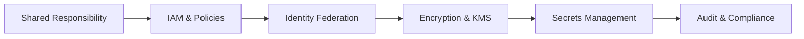

# Chapter 7: Cloud Security and Identity

> **Previous:** [Chapter 6: Cloud Networking and Delivery](./06-cloud-networking.md) | **Next:** [Chapter 8: Serverless Computing](./08-serverless.md)

## Learning Objectives

After completing this chapter, students will be able to:

1. Explain the Shared Responsibility Model and its implications across different service models.
2. Design least-privilege IAM policies using Users, Groups, and Roles.
3. Implement identity federation using modern protocols (SAML, OIDC).
4. Manage cryptographic keys using managed KMS and Hardware Security Modules (HSM).
5. Secure sensitive application data using Secrets Management services.
6. Configure auditing and logging to ensure regulatory compliance and incident response.
7. Apply multi-factor authentication (MFA) and conditional access policies.

## Chapter at a Glance

| Topic | Key Insight | Practical Takeaway |
|-------|-------------|--------------------|
| Shared Responsibility | Provider secures the cloud; customer secures in the cloud | Know your boundary — it shifts between IaaS/PaaS/SaaS |
| IAM | Users, Groups, Roles, Policies | Roles > Users for granting permissions to services |
| Identity Federation | SAML 2.0, OIDC | Use corporate credentials, not cloud provider users |
| KMS & Envelope Encryption | Encrypt data with Data Keys, wrap with Master Key | Enables efficient encryption of large datasets |
| Secrets Management | Store API keys, DB passwords securely | Auto-rotate secrets, never hardcode |
| Audit & Monitoring | CloudTrail, Log Analytics | You can't detect what you don't log |

## Chapter Roadmap



## Theory

### 7.1 The Shared Responsibility Model

A fundamental concept in cloud security is that security is a shared effort between the provider and the customer.

- **Security OF the Cloud (Provider):** Physical security of data centers, hardware, and the virtualization layer.
- **Security IN the Cloud (Customer):** Guest OS patching, firewall configuration, identity management, and data encryption.

The boundary shifts based on the service model (IaaS vs. PaaS vs. SaaS). In SaaS, the provider handles almost everything except data and access control.


### 7.2 Identity and Access Management (IAM)

IAM is the framework of policies and technologies for ensuring that the right users have the appropriate access to technology resources.

- **AWS IAM:** Uses Users, Groups, Roles, and JSON-based Policies.
- **Azure Entra ID (formerly Azure AD):** A comprehensive identity service that manages users and provides "Tenant" level security.
- **GCP IAM:** Uses "Service Accounts" extensively for machine-to-machine communication.

**Key Principle: Least Privilege.** Granting only the minimum permissions necessary to perform a task.

### 7.3 Identity Federation and SSO

Organizations prefer to use a single identity for multiple systems.
- **Federation:** Linking a user's identity across multiple security domains (e.g., using corporate credentials to log into AWS).
- **Protocols:** **SAML 2.0** (XML-based, common for Enterprise SSO) and **OIDC** (JSON/OAuth2-based, common for modern web/mobile apps).
- **Services:** AWS IAM Identity Center, Azure Entra ID, Google Cloud Identity.

### 7.4 Data Encryption and Key Management

Encryption protects data at rest (on disk) and in transit (over the network).

- **KMS (Key Management Service):** A managed service that allows you to create and control the keys used to encrypt your data.
- **Envelope Encryption:** Encrypting data with a *Data Key*, then encrypting that Data Key with a *Master Key*. This improves performance for large datasets.
- **HSM (Hardware Security Module):** Physical devices that provide extra protection for cryptographic keys.

### 7.5 Secrets Management

Hardcoding database passwords or API keys in source code is a major security risk.
- **Secret Managers:** Services (AWS Secrets Manager, Azure Key Vault, GCP Secret Manager) that store secrets securely and allow for **Automatic Rotation** of credentials.

### 7.6 Infrastructure and Network Security

- **WAF (Web Application Firewall):** Filters malicious HTTP traffic (SQLi, XSS).
- **DDoS Protection:** Protects against Distributed Denial of Service attacks.
- **Security Posture Management:** Services like **AWS Security Hub** or **Azure Defender** that provide a unified view of security alerts.

## Examples

### Example 7.1: Least Privilege IAM Policy (AWS JSON)

A policy that allows reading from only one specific S3 bucket:
```json
{
  "Version": "2012-10-17",
  "Statement": [
    {
      "Effect": "Allow",
      "Action": "s3:ListBucket",
      "Resource": "arn:aws:s3:::my-secure-app-data"
    },
    {
      "Effect": "Allow",
      "Action": "s3:GetObject",
      "Resource": "arn:aws:s3:::my-secure-app-data/*"
    }
  ]
}
```

### Example 7.2: Retrieving a Secret via CLI (GCP)

```bash
gcloud secrets versions access latest --secret="database-password"
```

> **One-Sentence Takeaway:** In the cloud, security is a shared responsibility — no matter how secure the provider's infrastructure is, a misconfigured S3 bucket or leaked IAM key can expose everything.

> **Pro Tip:** Always use IAM Roles instead of Access Keys for EC2 instances and Lambda functions. Roles auto-rotate credentials and eliminate the risk of hardcoded keys in code or configuration files.

> **Warning:** The principle of least privilege is easy to state and hard to enforce. Start with a deny-by-default policy and grant permissions incrementally. Use AWS Access Analyzer or GCP Policy Analyzer to identify overly permissive policies.

## Concept Comparison Table

| Concept | Definition | Key Distinction | Use Case |
|---------|-----------|-----------------|----------|
| IAM User | Individual person with long-term credentials | Has username + password or access keys | Human administrators |
| IAM Role | Identity with temporary credentials | No permanent keys, assumed by services | EC2 instances, Lambda functions |
| IAM Policy | JSON document defining permissions | Attached to users, groups, or roles | Access control rules |
| SAML 2.0 | XML-based identity federation | Enterprise SSO, attribute-based | Corporate identity integration |
| OIDC | JSON/OAuth2-based federation | Modern, web/mobile friendly | Social login, app auth |
| KMS | Managed key creation and rotation | Hardware-backed, audited | Encryption key lifecycle |

## Quick Reference

| Category | Key Concepts | Notes |
|----------|-------------|-------|
| **IAM Entities** | Users, Groups, Roles, Policies | Roles for machines, Users for people |
| **Encryption** | At rest (KMS), In transit (TLS), Envelope | Encrypt everything — it's cheap and easy |
| **Federation** | SAML (enterprise), OIDC (modern) | One identity to rule all clouds |
| **Secrets** | AWS Secrets Manager, Azure Key Vault, GCP Secret Manager | Auto-rotation, audit access |
| **Audit** | CloudTrail, Azure Monitor, Cloud Audit Logs | Enable in all regions from day one |

## Cross-Application Matrix

| Technique | Cloud Architecture | DevOps | Security | Enterprise |
|-----------|-------------------|--------|----------|------------|
| IAM Roles | Instance identity | CI/CD pipeline permissions | Access governance | Least privilege |
| KMS Encryption | Data protection | Encrypted CI/CD artifacts | Compliance mandates | Data residency |
| Secrets Manager | Secure configuration | Automated rotation | Credential hygiene | No hardcoded secrets |
| CloudTrail/Logs | Audit trail | Deployment verification | SIEM integration | Compliance reporting |
| WAF | App-layer security | Rate limiting | OWASP protection | PCI DSS |

## Chapter Quiz

1. Why should an EC2 instance use an IAM Role instead of hardcoded Access Keys?
   - A) Roles are faster
   - B) Roles provide temporary, automatically rotated credentials — no hardcoded secrets
   - C) Roles are cheaper
   - D) Access Keys don't work on EC2

<details>
<summary>Answer</summary>
**B) Roles provide temporary, automatically rotated credentials — no hardcoded secrets.** IAM Roles use the EC2 instance metadata service to deliver temporary credentials that rotate automatically. This eliminates the risk of accidentally committing API keys to source code.
</details>

2. What does the Shared Responsibility Model mean for a customer using SaaS?
   - A) The customer is responsible for everything
   - B) The provider handles almost everything except data classification, access management, and user permissions
   - C) The customer must patch the underlying OS
   - D) Security is entirely the provider's problem

<details>
<summary>Answer</summary>
**B) The provider handles almost everything except data classification, access management, and user permissions.** As the service model moves from IaaS → PaaS → SaaS, the provider takes increasing responsibility. In SaaS, the customer secures their data and who has access to it.
</details>

3. How does envelope encryption improve performance over directly encrypting large datasets?
   - A) It uses weaker encryption that's faster
   - B) It encrypts the data once with a Data Key (fast, symmetric), then wraps only the Data Key with a Master Key
   - C) It doesn't encrypt all the data
   - D) It caches encryption results

<details>
<summary>Answer</summary>
**B) It encrypts the data once with a Data Key (fast, symmetric), then wraps only the Data Key with a Master Key.** Symmetric encryption of large data is fast. The Master Key (often stored in KMS) only encrypts the small Data Key, reducing KMS API calls and cost while maintaining strong security.
</details>

## Summary

- Security in the cloud is a **Shared Responsibility**.
- **IAM** is the primary gatekeeper for cloud resources.
- **Least Privilege** is the most important security best practice.
- **Federation** allow users to use one set of credentials for multiple clouds.
- **KMS** and **Envelope Encryption** provide scalable data protection.
- **Secret Managers** eliminate the need for hardcoded credentials and support automated rotation.
- Auditing (CloudTrail/Log Analytics) is mandatory for compliance and forensics.

## Exercises

### Review Questions

1. Identify three things the cloud provider is responsible for in an IaaS model.
2. What is the difference between an IAM User and an IAM Role?
3. Explain the concept of "Envelope Encryption."
4. Why is SAML 2.0 preferred over managing individual users in the cloud console?
5. How does a Secret Manager improve security compared to environment variables?

### Application Problems

1. A developer needs to grant an EC2 instance access to an S3 bucket. Should they use Access Keys or an IAM Role? Justify your choice.
2. A company requires that all database passwords be changed every 30 days. How would you implement this automatically using cloud-native services?
3. Design a security architecture for a public-facing website that protects against common OWASP Top 10 threats and massive bot attacks.

### Challenge Problem

You are the CISO of a startup that uses all three major cloud providers (Multi-Cloud). Your team is struggling with different IAM models and fragmented logging. Propose a **Centralized Security Governance** strategy that includes: 1) A single source of truth for identities, 2) A unified logging architecture for compliance auditing, and 3) A method to enforce "No Public Buckets" across all three clouds automatically.
