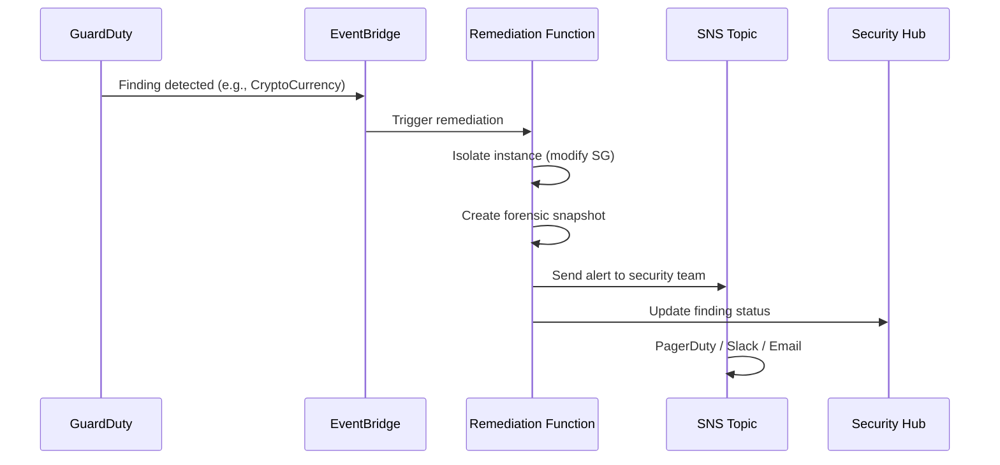

# Chapter 7: Cloud Security

> **Previous:** [Chapter 6: Cloud Networking](./06-cloud-networking.md) | **Next:** [Chapter 8: Serverless Computing](./08-serverless.md)

## Learning Objectives

After completing this chapter, students will be able to:

1. Apply the shared responsibility model to determine security boundaries.
2. Configure IAM users, groups, roles, and policies for least-privilege access.
3. Implement encryption at rest and in transit using KMS and TLS.
4. Design network security controls including WAF, Shield, and GuardDuty.
5. Manage secrets securely using dedicated secret management services.
6. Implement compliance frameworks aligned with SOC 2, PCI DSS, and HIPAA.
7. Deploy identity federation using IAM Identity Center and SAML.
8. Monitor security events using CloudTrail, Config, and Security Hub.

## Chapter at a Glance

| Topic | Key Insight | Practical Takeaway |
|-------|-------------|--------------------|
| Shared Responsibility | AWS secures the cloud, you secure what is in it | Never assume default security |
| IAM | Identity-based access control | Least privilege, roles over users |
| Encryption | KMS for keys, TLS for transit | Encrypt everything by default |
| Network Security | WAF, Shield, NACLs, Security Groups | Defense in depth at every layer |
| Secrets Management | Secrets Manager vs Parameter Store | Centralize, rotate, audit all secrets |
| Compliance | SOC 2, PCI DSS, HIPAA on cloud | Use compliance programs to validate controls |
| Monitoring | CloudTrail, Config, GuardDuty | Detect anomalies before they become breaches |
| Incident Response | Automated remediation playbooks | Prepare runbooks ahead of incidents |

## Chapter Roadmap

\\\mermaid
flowchart LR
    A[Cloud Security Foundations] --> B[Shared Responsibility Model]
    A --> C[Identity and Access Management]
    A --> D[Data Protection]
    A --> E[Network Security]
    A --> F[Monitoring and Detection]
    B --> G[Customer vs Provider Controls]
    C --> H[Policies, Roles, Federation]
    D --> I[Encryption: KMS, TLS, Secrets]
    E --> J[WAF, Shield, Security Groups]
    F --> K[CloudTrail, GuardDuty, Security Hub]
\\\

## Theory

### 7.1 Shared Responsibility Model

Security in the cloud is a partnership:

| Layer | AWS Responsible | Customer Responsible |
|-------|----------------|---------------------|
| Physical Security | Data centers, access controls, surveillance | Nothing |
| Hardware | Servers, storage, networking | Nothing |
| Hypervisor | Virtualization layer | Nothing |
| OS and Application | Nothing | Patching, configuration, firewalls |
| Network | Foundation, DDoS protection | Security Groups, NACLs |
| Identity | IAM service availability | User management, permissions, MFA |
| Data | Nothing | Encryption, access control, backups |

\\\mermaid
graph TB
    subgraph "Customer Responsibility (Security IN the Cloud)"
        C1[Customer Data]
        C2[Platform & Applications]
        C3[Identity & Access Management]
        C4[OS, Network, Firewall Config]
        C5[Client-Side Encryption]
    end
    
    subgraph "AWS Responsibility (Security OF the Cloud)"
        A1[Physical Security]
        A2[Hardware & Network Infrastructure]
        A3[Hypervisor Isolation]
        A4[Compliance Certifications]
        A5[Global Infrastructure]
    end
    
    subgraph "Shared"
        S1[Network Protection - DDoS]
        S2[Availability Zones]
    end
\\\

### 7.2 Identity and Access Management (IAM)

**Core IAM Concepts:**

- **User:** A permanent identity tied to a person or service account.
- **Group:** A collection of users. Assign policies to groups, not individuals.
- **Role:** A temporary identity that can be assumed by users, services, or federated identities.
- **Policy:** A JSON document defining permissions (Allow/Deny).
- **Resource-Based Policy:** Attached to a resource (e.g., S3 bucket policy).

**IAM Policy Structure:**

\\\json
{
  "Version": "2012-10-17",
  "Statement": [
    {
      "Effect": "Allow",
      "Action": ["s3:GetObject", "s3:ListBucket"],
      "Resource": [
        "arn:aws:s3:::company-data",
        "arn:aws:s3:::company-data/*"
      ],
      "Condition": {
        "IpAddress": {
          "aws:SourceIp": "10.0.0.0/8"
        }
      }
    }
  ]
}
\\\

**IAM Best Practices:**

- Grant least privilege — start with minimum permissions, add as needed.
- Use IAM roles instead of long-term access keys for applications.
- Enable MFA for all human users.
- Use conditions (SourceIp, MFA, time) to restrict access.
- Use permission boundaries to delegate administration safely.
- Apply service control policies (SCPs) for guard rails across accounts.

\\\	ypescript
interface IAMPolicy {
  version: "2012-10-17";
  statement: IAMStatement[];
}

interface IAMStatement {
  effect: "Allow" | "Deny";
  action: string[];
  resource: string[];
  condition?: Record<string, Record<string, string>>;
}

class IAMPolicyBuilder {
  private statements: IAMStatement[] = [];

  allowRead(bucket: string, ipRange?: string): this {
    const stmt: IAMStatement = {
      effect: "Allow",
      action: ["s3:GetObject", "s3:ListBucket"],
      resource: [
        "arn:aws:s3:::" + bucket,
        "arn:aws:s3:::" + bucket + "/*",
      ],
    };
    if (ipRange) {
      stmt.condition = {
        IpAddress: { "aws:SourceIp": ipRange },
      };
    }
    this.statements.push(stmt);
    return this;
  }

  allowWrite(bucket: string): this {
    this.statements.push({
      effect: "Allow",
      action: ["s3:PutObject"],
      resource: ["arn:aws:s3:::" + bucket + "/*"],
    });
    return this;
  }

  denyDelete(bucket: string): this {
    this.statements.push({
      effect: "Deny",
      action: ["s3:DeleteObject"],
      resource: ["arn:aws:s3:::" + bucket + "/*"],
    });
    return this;
  }

  build(): IAMPolicy {
    return { version: "2012-10-17", statement: this.statements };
  }
}

const policy = new IAMPolicyBuilder()
  .allowRead("company-data", "10.0.0.0/8")
  .allowWrite("company-data")
  .denyDelete("company-data")
  .build();

console.log(JSON.stringify(policy, null, 2));
\\\

### 7.3 Data Encryption

**Encryption at Rest:**

| Service | Default Encryption | Custom Key | Notes |
|---------|-------------------|------------|-------|
| S3 | SSE-S3 (AES-256) | SSE-KMS or SSE-C | Bucket-level or object-level |
| EBS | Enabled by default | KMS | Per-volume or snapshot |
| RDS | Enabled for new instances | KMS | Can encrypt existing DBs via snapshot |
| DynamoDB | Server-side encryption | KMS | Transparent, no application changes |

**Encryption in Transit:**

- **TLS 1.2/1.3:** Default for all AWS API endpoints.
- **ALB Listener:** Terminates TLS, re-encrypts to targets.
- **VPC Peering:** Traffic stays within AWS backbone (no internet).

\\\mermaid
sequenceDiagram
    participant Client as Client
    participant ALB as ALB (TLS Terminator)
    participant App as App Server
    participant DB as RDS (KMS Encrypted)

    Client->>ALB: HTTPS (TLS 1.3)
    ALB->>ALB: Decrypt TLS, attach X-Forwarded-For
    ALB->>App: HTTP (internal VPC)
    App->>App: Read/Write data
    App->>DB: TLS-encrypted connection
    DB->>DB: KMS decrypts for operations
\\\

**Key Management Service (KMS):**

- Create, rotate, and manage encryption keys.
- Integrates with 50+ AWS services.
- Supports automatic yearly key rotation.
- Envelope encryption: KMS key encrypts data keys, data keys encrypt your data.

### 7.4 Network Security Services

**AWS WAF (Web Application Firewall):**

- Protects against SQL injection, XSS, and OWASP Top 10 attacks.
- Rate-based rules for DDoS mitigation.
- IP reputation lists from AWS and third parties.
- Integrates with ALB, CloudFront, API Gateway.

**AWS Shield:**

- **Shield Standard:** Free, protects against common DDoS attacks (SYN floods, UDP reflection).
- **Shield Advanced:** Paid, includes DDoS cost protection, dedicated DDoS response team, advanced real-time metrics.

\\\mermaid
graph TB
    subgraph "Defense in Depth"
        INTERNET[Internet Traffic]
        WAF[AWS WAF - L7 Filtering]
        Shield[AWS Shield - DDoS Protection]
        NACL[Network ACL - Subnet Level]
        SG[Security Group - Instance Level]
        APP[Application]
        
        INTERNET --> WAF
        WAF --> Shield
        Shield --> NACL
        NACL --> SG
        SG --> APP
    end
\\\

**AWS GuardDuty:**

- Intelligent threat detection using ML and integrated threat intelligence.
- Analyzes CloudTrail, VPC Flow Logs, and DNS logs.
- Detects: compromised credentials, crypto-mining, port scanning, data exfiltration.
- Can trigger automated remediation via EventBridge and Lambda.

### 7.5 Secrets Management

**AWS Secrets Manager vs Systems Manager Parameter Store:**

| Feature | Secrets Manager | Parameter Store (Standard) |
|---------|----------------|---------------------------|
| Max Secret Size | 64 KB | 8 KB (4 KB for advanced) |
| Auto-Rotation | Yes (RDS, Redshift, DocumentDB) | No |
| Cross-Account Access | Resource-based policies | Parameter policies |
| Price | .40/secret/month + rotation | Free standard, .05/advanced |
| Use Case | Database passwords, API keys | Config values, AMI IDs |

\\\	ypescript
interface DatabaseCredentials {
  username: string;
  password: string;
  host: string;
  port: number;
  database: string;
}

class SecretsManagerClient {
  private secrets: Map<string, string> = new Map();

  async getSecret(secretId: string): Promise<string | null> {
    return this.secrets.get(secretId) || null;
  }

  async rotateSecret(secretId: string): Promise<void> {
    const current = this.secrets.get(secretId);
    if (current) {
      const parsed = JSON.parse(current) as DatabaseCredentials;
      parsed.password = this.generatePassword(32);
      this.secrets.set(secretId, JSON.stringify(parsed));
      console.log("Secret rotated:", secretId);
    }
  }

  async getDatabaseCredentials(secretId: string): Promise<DatabaseCredentials | null> {
    const secret = await this.getSecret(secretId);
    return secret ? (JSON.parse(secret) as DatabaseCredentials) : null;
  }

  private generatePassword(length: number): string {
    const chars = "abcdefghijklmnopqrstuvwxyzABCDEFGHIJKLMNOPQRSTUVWXYZ0123456789!@#\$%^&*";
    let password = "";
    for (let i = 0; i < length; i++) {
      password += chars.charAt(Math.floor(Math.random() * chars.length));
    }
    return password;
  }
}

async function connectToDatabase(): Promise<void> {
  const secretsManager = new SecretsManagerClient();

  await secretsManager.getDatabaseCredentials("prod/db/credentials");
  console.log("Connected to database with rotated credentials");
}
\\\

### 7.6 Compliance Frameworks

| Framework | Scope | Key Requirements | AWS Support |
|-----------|-------|------------------|-------------|
| SOC 2 | Service organization controls | Security, availability, processing integrity | SOC 2 reports for 140+ services |
| PCI DSS | Credit card data handling | Encrypt card data, restrict access, audit logs | PCI-compliant services list |
| HIPAA | Protected health information (PHI) | BAA required, encrypted storage, access controls | BAA with AWS, HIPAA-eligible services |
| FedRAMP | US government data | Third-party assessment, continuous monitoring | FedRAMP authorized at multiple levels |
| ISO 27001 | Information security management | Risk assessment, controls, improvement cycle | ISO 27001 certified regions |

## Examples

### Example 7.1: IAM Role for EC2 with S3 Access

\\\json
{
  "Effect": "Allow",
  "Action": ["s3:GetObject", "s3:PutObject"],
  "Resource": "arn:aws:s3:::my-app-bucket/*"
}
\\\

### Example 7.2: KMS Encryption Workflow

\\\ash
aws kms create-key --description "App encryption key"
aws kms encrypt --key-id alias/my-key --plaintext fileb://secret.txt
aws kms decrypt --ciphertext-blob fileb://encrypted.txt
\\\

### Example 7.3: GuardDuty Finding Types

\\\	ypescript
interface GuardDutyFinding {
  id: string;
  severity: number;
  type: string;
  resource: { type: string; instanceDetails?: any };
  createdAt: string;
}

function classifyFinding(severity: number): "CRITICAL" | "HIGH" | "MEDIUM" | "LOW" {
  if (severity >= 8) return "CRITICAL";
  if (severity >= 5) return "HIGH";
  if (severity >= 2) return "MEDIUM";
  return "LOW";
}

const findings: GuardDutyFinding[] = [
  { id: "f1", severity: 8, type: "CryptoCurrency:EC2/BitcoinTool.B", resource: { type: "EC2" }, createdAt: "2025-01-15" },
  { id: "f2", severity: 4, type: "Recon:EC2/PortProbeUnprotected", resource: { type: "EC2" }, createdAt: "2025-01-15" },
];

for (const finding of findings) {
  console.log(finding.id, classifyFinding(finding.severity), finding.type);
}
\\\

> **One-Sentence Takeaway:** Security in the cloud follows the shared responsibility model — the provider secures infrastructure, but you must secure your data, identities, and application configuration.

> **Pro Tip:** Use IAM roles instead of access keys for every workload — EC2 instances, Lambda functions, and even CI/CD pipelines can assume roles. Long-term access keys should be rare exceptions.

> **Warning:** An unencrypted S3 bucket with public access enabled is the most common cloud security breach. Enable "Block Public Access" at the account level and never disable it without strong justification.

## Concept Comparison Table

| Concept | Definition | Key Distinction | Use Case |
|---------|-----------|-----------------|----------|
| IAM User | Permanent identity for a person | Long-term credentials | Human administrators |
| IAM Role | Temporary identity assumed by entities | STS tokens, auto-rotation | Applications, cross-account |
| KMS | Managed key creation and rotation | Envelope encryption | Data encryption at rest |
| Secrets Manager | Rotating secrets storage | Auto-rotation support | Database passwords |
| WAF | Web application firewall | L7 filtering, OWASP protection | API and web app protection |
| Shield | DDoS mitigation service | Standard free, Advanced paid | Production workloads |
| GuardDuty | ML-powered threat detection | CloudTrail + DNS + VPC analysis | Continuous monitoring |
| Security Hub | Centralized security findings | Multi-account aggregation | Compliance posture |

## Quick Reference

| Category | Key Concepts | Notes |
|----------|-------------|-------|
| **IAM** | Users, groups, roles, policies | Least privilege, MFA, conditions |
| **Encryption** | KMS, SSE, TLS, envelope encryption | Encrypt at rest and in transit |
| **Network** | WAF, Shield, SG, NACL, VPC endpoints | Defense in depth |
| **Secrets** | Secrets Manager, Parameter Store | Centralize, rotate, audit |
| **Compliance** | SOC 2, PCI DSS, HIPAA, FedRAMP | Know which certs apply |
| **Monitoring** | CloudTrail, Config, GuardDuty | Detect, alert, respond |

## Cross-Application Matrix

| Technique | Cloud Architecture | DevOps | Security | Enterprise |
|-----------|-------------------|--------|----------|------------|
| IAM Roles | Service-to-service auth | CI/CD pipeline permissions | Reduced credential surface | Cross-account access |
| KMS Encryption | Data protection at rest | Encrypted build artifacts | Key rotation policies | Compliance (HIPAA/PCI) |
| WAF | API security | Bot protection | OWASP prevention | DDoS mitigation |
| Secrets Manager | Configuration centralization | Automated rotation | Audit trails | Password policies |
| GuardDuty | Runtime monitoring | Anomaly detection | Threat intelligence | SIEM integration |

## Chapter Quiz

1. What does the shared responsibility model state about security?
   - A) The cloud provider is responsible for all security
   - B) The customer is responsible for all security
   - C) Security is shared: provider secures infrastructure, customer secures data and configurations
   - D) Third-party auditors are responsible

<details>
<summary>Answer</summary>
**C) Security is shared: provider secures infrastructure, customer secures data and configurations.** AWS is responsible for the security of the cloud (physical, hardware, hypervisor); customers are responsible for security in the cloud (data, IAM, OS, network config).
</details>

2. Which IAM entity is best for granting an EC2 instance access to S3?
   - A) IAM User with access keys
   - B) IAM Role attached to the EC2 instance profile
   - C) S3 bucket policy
   - D) Security Group rule

<details>
<summary>Answer</summary>
**B) IAM Role attached to the EC2 instance profile.** Roles provide temporary credentials that auto-rotate. Access keys would be long-term credentials embedded in the instance, which is a security risk.
</details>

3. What is the primary purpose of AWS KMS?
   - A) Monitoring API calls
   - B) Creating and managing encryption keys
   - C) Blocking web application attacks
   - D) Detecting compromised credentials

<details>
<summary>Answer</summary>
**B) Creating and managing encryption keys.** KMS (Key Management Service) creates, rotates, and manages encryption keys for use with 50+ AWS services. It uses envelope encryption where KMS keys encrypt data keys that encrypt your data.
</details>

4. Which AWS service provides ML-powered threat detection across CloudTrail, VPC Flow Logs, and DNS logs?
   - A) WAF
   - B) Shield
   - C) GuardDuty
   - D) Inspector

<details>
<summary>Answer</summary>
**C) GuardDuty.** GuardDuty uses machine learning and integrated threat intelligence to analyze CloudTrail events, VPC Flow Logs, and DNS logs for suspicious activity like compromised credentials, crypto-mining, and port scanning.
</details>

5. Why should you never use long-term IAM access keys for applications running on EC2?
   - A) They cost more than IAM roles
   - B) Access keys are long-lived credentials that can be stolen and used indefinitely
   - C) IAM roles have higher performance
   - D) Access keys can only be used by human users

<details>
<summary>Answer</summary>
**B) Access keys are long-lived credentials that can be stolen and used indefinitely.** IAM roles provide temporary security credentials that auto-rotate. If an EC2 instance with an access key is compromised, the attacker can use it until it is manually revoked.
</details>

### TypeScript: IAM Policy Analyzer

```typescript
interface IAMStatement {
  effect: "Allow" | "Deny";
  actions: string[];
  resources: string[];
  conditions?: Record<string, Record<string, string>>;
}

interface IAMPolicy {
  name: string;
  statements: IAMStatement[];
}

class IAMPolicyAnalyzer {
  private highRiskActions = [
    "iam:*", "iam:Create*", "iam:Delete*", "iam:PutRolePolicy",
    "s3:PutBucketPolicy", "s3:PutBucketAcl", "s3:*",
    "organizations:*", "lambda:Create*", "lambda:UpdateFunctionCode",
  ];

  analyze(policy: IAMPolicy): { findings: { severity: string; message: string; action: string }[]; score: number } {
    const findings: { severity: string; message: string; action: string }[] = [];

    for (const stmt of policy.statements) {
      if (stmt.effect !== "Allow") continue;

      for (const action of stmt.actions) {
        if (action === "*" || action.startsWith("*")) {
          findings.push({ severity: "CRITICAL", message: "Wildcard action grants full access", action });
        }

        const isHighRisk = this.highRiskActions.some((hr) => {
          if (hr.endsWith("*")) return action.startsWith(hr.replace("*", ""));
          return action === hr;
        });

        if (isHighRisk) {
          const resourceRisk = stmt.resources.includes("*") || stmt.resources.includes("arn:aws:*");
          findings.push({
            severity: resourceRisk ? "CRITICAL" : "HIGH",
            message: `High-risk action ${action} on ${resourceRisk ? "all resources" : "specific resources"}`,
            action,
          });
        }
      }

      if (stmt.resources.includes("*") && !stmt.conditions) {
        findings.push({
          severity: "MEDIUM", message: "Wide resource access without condition constraints",
          action: stmt.resources[0],
        });
      }
    }

    const score = Math.max(0, 100 - findings.reduce((penalty, f) => {
      return penalty + (f.severity === "CRITICAL" ? 25 : f.severity === "HIGH" ? 15 : 5);
    }, 0));

    return { findings, score };
  }

  remediate(policy: IAMPolicy): IAMPolicy {
    return {
      name: policy.name + "-hardened",
      statements: policy.statements.map((stmt) => ({
        ...stmt,
        actions: stmt.actions.filter((a) => !this.highRiskActions.includes(a)).slice(0, 50),
        resources: stmt.resources.map((r) => r === "*" ? "arn:aws:s3:::my-bucket/*" : r),
      })),
    };
  }
}

const analyzer = new IAMPolicyAnalyzer();
const policy: IAMPolicy = {
  name: "dev-access",
  statements: [
    { effect: "Allow", actions: ["s3:*", "ec2:Describe*"], resources: ["*"] },
    { effect: "Allow", actions: ["iam:CreateUser"], resources: ["arn:aws:iam::*:user/*"], conditions: { "StringEquals": { "aws:PrincipalTag/role": "admin" } } },
  ],
};
const result = analyzer.analyze(policy);
console.log("Security score:", result.score, "/ 100");
result.findings.forEach((f) => console.log(`[${f.severity}] ${f.message}`));
```

### TypeScript: WAF Rule Engine

```typescript
interface WAFRule {
  name: string;
  priority: number;
  action: "allow" | "block" | "count";
  matchType: "ip-set" | "sql-injection" | "xss" | "rate-limit" | "header-match";
  pattern?: RegExp;
  threshold?: number;
  windowSeconds?: number;
}

interface Request {
  sourceIP: string;
  path: string;
  headers: Record<string, string>;
  body: string;
  method: string;
}

class WAFEngine {
  private rules: WAFRule[] = [];
  private requestCounts: Map<string, { count: number; windowStart: number }> = new Map();

  addRule(rule: WAFRule): void { this.rules.push(rule); }

  private isSqlInjection(body: string): boolean {
    return /(\bSELECT\b.*\bFROM\b|\bUNION\b.*\bSELECT\b|\bDROP\b.*\bTABLE\b|--|;--|' OR '1'='1)/i.test(body);
  }

  private isXSS(body: string): boolean {
    return /<script[\s>]|javascript:|onerror\s*=|onload\s*=|alert\(|eval\(/i.test(body);
  }

  private isRateLimited(ip: string, threshold: number, windowSec: number): boolean {
    const now = Date.now();
    const entry = this.requestCounts.get(ip) || { count: 0, windowStart: now };
    if (now - entry.windowStart > windowSec * 1000) { entry.count = 0; entry.windowStart = now; }
    entry.count++;
    this.requestCounts.set(ip, entry);
    return entry.count > threshold;
  }

  evaluate(req: Request): { action: "allow" | "block" | "count"; matchedRule?: string; reasons: string[] } {
    const sortedRules = [...this.rules].sort((a, b) => a.priority - b.priority);
    const reasons: string[] = [];

    for (const rule of sortedRules) {
      switch (rule.matchType) {
        case "sql-injection":
          if (this.isSqlInjection(req.body) || this.isSqlInjection(req.path)) {
            reasons.push(`SQL injection pattern detected (rule: ${rule.name})`);
            return { action: rule.action, matchedRule: rule.name, reasons };
          }
          break;
        case "xss":
          if (this.isXSS(req.body) || this.isXSS(req.path)) {
            reasons.push(`XSS pattern detected (rule: ${rule.name})`);
            return { action: rule.action, matchedRule: rule.name, reasons };
          }
          break;
        case "rate-limit":
          if (rule.threshold && rule.windowSeconds && this.isRateLimited(req.sourceIP, rule.threshold, rule.windowSeconds)) {
            reasons.push(`Rate limit exceeded: ${rule.threshold} req/${rule.windowSeconds}s (rule: ${rule.name})`);
            return { action: rule.action, matchedRule: rule.name, reasons };
          }
          break;
      }
    }
    return { action: "allow", reasons };
  }
}

const waf = new WAFEngine();
waf.addRule({ name: "block-sqli", priority: 1, action: "block", matchType: "sql-injection" });
waf.addRule({ name: "block-xss", priority: 2, action: "block", matchType: "xss" });
waf.addRule({ name: "rate-limit-100", priority: 3, action: "block", matchType: "rate-limit", threshold: 100, windowSeconds: 60 });

const requests: Request[] = [
  { sourceIP: "10.0.1.1", path: "/login", headers: {}, body: "username=admin&password=1234", method: "POST" },
  { sourceIP: "10.0.1.2", path: "/search", headers: {}, body: "q=' OR '1'='1", method: "POST" },
  { sourceIP: "10.0.1.3", path: "/comment", headers: {}, body: "<script>alert('xss')</script>", method: "POST" },
];
requests.forEach((r) => {
  const result = waf.evaluate(r);
  console.log(`${r.method} ${r.path} from ${r.sourceIP}: ${result.action}${result.matchedRule ? " (" + result.matchedRule + ")" : ""}`);
});
```

### TypeScript: IAM Policy Diff Checker & Encryption Validator

```typescript
interface PolicyStatement { effect: string; actions: string[]; resources: string[]; }
interface Policy { name: string; statements: PolicyStatement[]; }

class PolicyDiffChecker {
  diff(desired: Policy, actual: Policy): { missing: PolicyStatement[]; excessive: PolicyStatement[] } {
    const missing: PolicyStatement[] = [];
    const excessive: PolicyStatement[] = [];
    for (const ds of desired.statements) {
      const match = actual.statements.find(as =>
        as.effect === ds.effect && as.actions.every(a => ds.actions.includes(a))
      );
      if (!match) missing.push(ds);
    }
    for (const as of actual.statements) {
      const match = desired.statements.find(ds =>
        ds.effect === as.effect && as.actions.every(a => ds.actions.includes(a))
      );
      if (!match) excessive.push(as);
    }
    return { missing, excessive };
  }
}

class EncryptionValidator {
  check(config: { s3Encryption: boolean; s3TLS: boolean; ebsEncryption: boolean; rdsEncryption: boolean; kmsEnabled: boolean; tlsVersion: string }): { pass: boolean; failures: string[] } {
    const failures: string[] = [];
    if (!config.s3Encryption) failures.push("S3 default encryption disabled");
    if (!config.s3TLS) failures.push("S3 HTTPS-only not enforced");
    if (!config.ebsEncryption) failures.push("EBS encryption not enabled");
    if (!config.rdsEncryption) failures.push("RDS encryption at rest disabled");
    if (!config.kmsEnabled) failures.push("KMS customer-managed keys not configured");
    if (config.tlsVersion < "1.2") failures.push(`TLS ${config.tlsVersion} too old, minimum 1.2 required`);
    return { pass: failures.length === 0, failures };
  }
}

const pdc = new PolicyDiffChecker();
const diff = pdc.diff(
  { name: "desired", statements: [{ effect: "Allow", actions: ["s3:GetObject"], resources: ["arn:aws:s3:::bucket/*"] }] },
  { name: "actual", statements: [{ effect: "Allow", actions: ["s3:*", "iam:*"], resources: ["*"] }] }
);
console.log("Policy issues:", diff.excessive.length > 0 ? `${diff.excessive.length} excessive permissions found` : "OK");

const ev = new EncryptionValidator();
const check = ev.check({ s3Encryption: true, s3TLS: true, ebsEncryption: false, rdsEncryption: true, kmsEnabled: true, tlsVersion: "1.0" });
console.log("Encryption check:", check.pass ? "PASS" : `FAIL: ${check.failures.join("; ")}`);
```
```

## Summary

- The shared responsibility model defines clear boundaries for provider and customer security obligations.
- IAM roles with temporary credentials are preferred over long-term access keys.
- Encryption at rest (KMS) and in transit (TLS) protects data throughout its lifecycle.
- Defense in depth combines WAF, Shield, Security Groups, and NACLs for network security.
- Secrets Manager centralizes and auto-rotates sensitive credentials.
- GuardDuty provides ML-based threat detection across multiple log sources.
- Compliance frameworks (SOC 2, PCI DSS, HIPAA) are supported through AWS compliance programs.

## Exercises

### Review Questions

1. Explain the shared responsibility model with specific examples of customer vs provider responsibilities.
2. What are the differences between IAM Users, Groups, Roles, and Policies?
3. Describe envelope encryption and how KMS uses it for scalable encryption.
4. How do WAF, Shield, Security Groups, and NACLs work together for defense in depth?
5. Compare Secrets Manager vs Parameter Store for storing application secrets.
6. What types of threats does GuardDuty detect?

### Application Problems

1. Design an IAM architecture for a three-tier application with separate web, app, and database tiers. Each tier should only have the permissions it needs.

2. Write a TypeScript function that evaluates the security posture of an S3 bucket policy and reports any public access risks.

3. A healthcare application needs to comply with HIPAA on AWS. List all the AWS services and configurations required for HIPAA compliance.

4. Design an encryption strategy for a data lake containing sensitive financial records, including key management, key rotation, and access control.

5. Implement an incident response automation that triggers when GuardDuty detects a crypto-mining finding on an EC2 instance.

### Challenge Problem

Design a comprehensive security architecture for a multi-account AWS organization serving 100,000 users. Requirements: 1) Centralized logging and monitoring across all accounts, 2) Automated incident response for common threats, 3) Encryption of all data at rest and in transit, 4) Network isolation between environments, 5) Compliance with SOC 2 Type II, 6) Secrets management with rotation for all databases, 7) IAM federation with corporate SSO, and 8) Automated security scanning in CI/CD pipelines. Propose specific services, configurations, and an architecture diagram.

## AWS CDK: IAM Roles and Policies

Define IAM infrastructure as TypeScript with the AWS CDK:

```typescript
import * as iam from "aws-cdk-lib/aws-iam";
import * as cdk from "aws-cdk-lib";

class SecurityStack extends cdk.Stack {
  constructor(scope: cdk.App, id: string, props?: cdk.StackProps) {
    super(scope, id, props);

    const webAppRole = new iam.Role(this, "WebAppRole", {
      assumedBy: new iam.ServicePrincipal("ec2.amazonaws.com"),
      description: "Role for web application EC2 instances",
      managedPolicies: [
        iam.ManagedPolicy.fromAwsManagedPolicyName("AmazonSSMManagedInstanceCore"),
      ],
    });

    webAppRole.addToPolicy(new iam.PolicyStatement({
      effect: iam.Effect.ALLOW,
      actions: ["s3:GetObject", "s3:ListBucket"],
      resources: ["arn:aws:s3:::app-assets", "arn:aws:s3:::app-assets/*"],
      conditions: { StringEquals: { "aws:ResourceAccount": [this.account] } },
    }));

    webAppRole.addToPolicy(new iam.PolicyStatement({
      effect: iam.Effect.DENY,
      actions: ["s3:DeleteBucket", "rds:DeleteDBInstance"],
      resources: ["*"],
    }));

    const readonlyRole = new iam.Role(this, "ReadOnlyRole", {
      assumedBy: new iam.AccountPrincipal(this.account),
      managedPolicies: [
        iam.ManagedPolicy.fromAwsManagedPolicyName("ReadOnlyAccess"),
      ],
    });

    new iam.CfnInstanceProfile(this, "WebAppInstanceProfile", {
      roles: [webAppRole.roleName],
    });
  }
}
```

## Pulumi: KMS Key and Encryption Setup

```typescript
import * as aws from "@pulumi/aws";

const appKey = new aws.kms.Key("app-encryption-key", {
  description: "Application encryption key with automatic rotation",
  deletionWindowInDays: 30,
  enableKeyRotation: true,
  policy: {
    Version: "2012-10-17",
    Statement: [
      {
        Effect: "Allow",
        Principal: { AWS: "*" },
        Action: "kms:*",
        Resource: "*",
        Condition: {
          StringEquals: {
            "kms:CallerAccount": aws.config.require("accountId"),
          },
        },
      },
    ],
  },
});

const s3Bucket = new aws.s3.Bucket("encrypted-assets", {
  bucket: "encrypted-app-assets-prod",
  serverSideEncryptionConfiguration: {
    rule: {
      applyServerSideEncryptionByDefault: {
        kmsMasterKeyId: appKey.arn,
        sseAlgorithm: "aws:kms",
      },
      bucketKeyEnabled: true,
    },
  },
});

const logBucket = new aws.s3.Bucket("access-logs", {
  bucket: "app-access-logs-prod",
  acl: "log-delivery-write",
  forceDestroy: false,
});
```

## Automated Incident Response Flow



## Real-World Case Study: Capital One Data Breach (2019)

The 2019 Capital One breach illustrates what happens when cloud security fundamentals are missed.

**Incident:** A former AWS employee exploited a misconfigured web application firewall (WAF) to access Capital One's S3 data. The attacker used a Server-Side Request Forgery (SSRF) attack against a vulnerable EC2 instance to reach the AWS metadata service, assumed an IAM role with excessive permissions, and exfiltrated 140,000 SSNs and 80,000 bank account numbers.

**Root Causes:**
- **WAF Misconfiguration:** The WAF did not block SSRF-style attacks against the metadata service
- **Overly Permissive IAM Role:** The EC2 role had S3 read access to all buckets, not just the required subset
- **Missing Network Controls:** No VPC endpoint or IMDSv2 enforcement on the vulnerable instance
- **No Data Perimeter:** Lack of S3 bucket policies restricting access to trusted identities

**Remediations Applied:**
- IMDSv2 enforced on all EC2 instances
- S3 bucket policies with aws:SourceIp and aws:PrincipalOrgID conditions
- WAF rules updated to block metadata service endpoints
- IAM permission boundaries implemented across all roles
- VPC endpoints for S3 with bucket policy restrictions

**Key Lesson:** Cloud security failures are almost never about the provider's infrastructure security — they are about misconfiguration of customer-controlled services. Following the principle of least privilege and implementing defense in depth at every layer would have prevented this breach.

### Additional Exercises

6. **IAM Audit:** Write a TypeScript function that reads a set of IAM policies and identifies any that violate least privilege by granting wildcard actions ("*") on sensitive services (IAM, S3, KMS).

7. **Encryption Strategy:** Design an encryption strategy for a multi-region application that needs customer-managed keys in each region, automatic key rotation, and the ability to revoke access to specific regions in case of a compliance incident.

8. **Incident Response Playbook:** Create a step-by-step incident response playbook for a detected S3 bucket with public read access that contains customer PII. Include containment, investigation, remediation, and post-mortem phases with specific actions and responsible teams.
