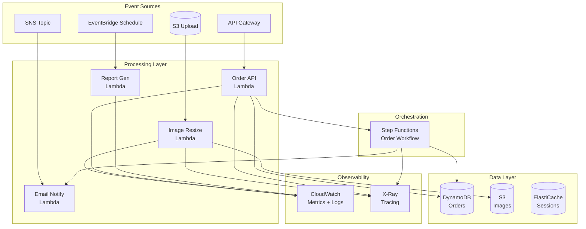

# Chapter 8: Serverless Computing

> **Previous:** [Chapter 7: Cloud Security](./07-cloud-security.md) | **Next:** [Chapter 9: Containerization](./09-containerization.md)

## Learning Objectives

After completing this chapter, students will be able to:

<!-- Image Gallery -->
<section class="lesson-visuals" aria-label="Visual learning resources">
  <header><span>VISUAL LEARNING</span><h2>See it. Review it. Remember it.</h2></header>
  <a class="lesson-visual-card" href="../../../assets/images/lessons/cloud-computing/08-serverless/.png" target="_blank" rel="noopener">
    
    <span><strong>Handwritten notes</strong>Condensed notes for deliberate review.</span>
  </a>
  <a class="lesson-visual-card" href="../../../assets/images/lessons/cloud-computing/08-serverless/.png" target="_blank" rel="noopener">
    
    <span><strong>Sticky-note revision</strong>Fast recall prompts for revision.</span>
  </a>
  <a class="lesson-visual-card" href="../../../assets/images/lessons/cloud-computing/08-serverless/.png" target="_blank" rel="noopener">
    
    <span><strong>Visual concept guide</strong>A connected explanation of the key ideas.</span>
  </a>
</section>
<!-- End Image Gallery -->


1. Define serverless computing and contrast it with traditional server-based architectures.
2. Design event-driven architectures using functions, queues, and event buses.
3. Implement AWS Lambda functions with various triggers and configurations.
4. Configure event sources and destinations for asynchronous processing.
5. Optimize serverless performance through cold start mitigation strategies.
6. Apply serverless security best practices including least-privilege IAM.
7. Manage costs through provisioned concurrency and reserved concurrency settings.
8. Architect application state management without dedicated servers.

## Chapter at a Glance

| Topic | Key Insight | Practical Takeaway |
|-------|-------------|--------------------|
| Lambda Basics | Functions as a service | Write code, set triggers, no servers |
| Triggers | S3, SQS, API Gateway, SNS, EventBridge | Event sources invoke functions |
| Cold Starts | Init delay on first invocation | Mitigate with Provisioned Concurrency |
| Concurrency | Reserved vs Provisioned | Rate limiting and performance tuning |
| Event-Driven | SQS queues, SNS topics, EventBridge | Decoupled, asynchronous architecture |
| State Management | DynamoDB, ElastiCache for external state | Functions are stateless by design |
| Security | IAM roles, VPC access, env vars | Least privilege for function execution |
| Cost Model | Pay per invocation and duration | Idle costs 0, high scale benefits FaaS |

## Chapter Roadmap

\\\mermaid
flowchart LR
    A[Serverless Foundations] --> B[Lambda Functions]
    A --> C[Event Sources]
    A --> D[State + Storage]
    B --> E[Config: Memory, Timeout, Layers]
    C --> F[S3, SQS, API GW, EventBridge, SNS]
    D --> G[DynamoDB, S3, ElastiCache]
    A --> H[Cost Optimization]
    H --> I[Provisioned Concurrency, Reserved Capacity]
\\\

## Theory

### 8.1 What is Serverless Computing?


Serverless computing does not mean "no servers." It means the cloud provider manages all server infrastructure, and you only provide code.

**Key Characteristics:**

- **No Server Management:** You never provision, patch, or monitor servers.
- **Automatic Scaling:** Functions scale from zero to thousands of concurrent executions instantly.
- **Pay-per-Use:** You pay only for compute time consumed (per millisecond).
- **Event-Driven:** Functions are triggered by events, not continuous requests.

**Service Comparison:**

| Service | Serverless? | Notes |
|---------|-------------|-------|
| AWS Lambda | True serverless | FaaS, 15 min max execution |
| AWS Fargate | Serverless containers | No EC2 management |
| AWS S3 | True serverless | Object storage |
| RDS Proxy | Serverless component | Connection pooling for Lambda |
| EC2 | Not serverless | Provisioned instances |
| EKS | Not serverless | Managed Kubernetes |

\\\mermaid
graph TB
    subgraph "Traditional Architecture"
        T1[Provision EC2]
        T2[Install Runtime]
        T3[Deploy Code]
        T4[Configure Auto-Scaling]
        T5[Patch OS]
        T6[Monitor CPU/Memory]
    end
    
    subgraph "Serverless Architecture"
        S1[Write Function Code]
        S2[Upload to Lambda]
        S3[Configure Trigger]
        S4[Done]
    end
\\\

### 8.2 AWS Lambda Deep Dive


**Configuration Parameters:**

| Parameter | Range | Effect |
|-----------|-------|--------|
| Memory | 128 MB - 10,240 MB | CPU scales proportionally |
| Timeout | 1 second - 15 minutes | Max execution time per invocation |
| Ephemeral Storage | 512 MB - 10,240 MB | /tmp directory space |
| Concurrency | 0 - Account limit | Max concurrent executions |
| Reserved Concurrency | Guaranteed capacity for function | Ensures critical functions have capacity |
| Provisioned Concurrency | Pre-warmed execution environments | Eliminates cold starts |

**Lambda Execution Environment Lifecycle:**

\\\mermaid
sequenceDiagram
    participant AWS as AWS Lambda Service
    participant ENV as Execution Environment
    participant Code as Function Handler
    
    AWS->>ENV: 1. INIT (Create new environment)
    ENV->>ENV: 2. Download code + layers
    ENV->>ENV: 3. Init runtime + extensions
    ENV->>ENV: 4. Init function handler (outside handler)
    Note over ENV: Cold start phase (varies 100ms - 1s+)
    
    AWS->>ENV: 5. INVOKE (event)
    ENV->>Code: handler(event, context)
    Code-->>ENV: Return response
    ENV-->>AWS: Response
    
    Note over ENV,Code: Environment stays warm ~5-15 minutes
    
    AWS->>ENV: 6. INVOKE (another event)
    ENV->>Code: handler(event, context) -- warm start
    Code-->>ENV: Return response
    Note over ENV: No init phase (<10ms added latency)
    
    AWS->>ENV: 7. FREEZE / DESTROY after idle
\\\

### 8.3 Event Sources and Triggers


**Synchronous Invocation:** Caller waits for function response.

| Trigger | Use Case | Response |
|---------|----------|----------|
| API Gateway | HTTP API endpoints | HTTP response |
| ALB | HTTP traffic to Lambda | HTTP response |
| Cognito | Authentication events | Auth result |
| Lex / Alexa | Chatbots, voice | Dialog response |

**Asynchronous Invocation:** Event is queued; function processes when ready. Automatic retries (2 attempts) and DLQ support.

| Trigger | Use Case | Notes |
|---------|----------|-------|
| S3 | Object created/deleted | Event notification |
| SNS | Pub/sub messages | Fan-out to multiple subscribers |
| EventBridge | Scheduled events, service events | Cron, cross-account events |
| SES | Email events | Incoming/outgoing email |
| CloudFormation | Stack events | Custom resources |

**Stream-Based Invocation:** Poll-based, processes records from streams in batches.

| Trigger | Use Case | Notes |
|---------|----------|-------|
| DynamoDB Streams | Table changes | Ordered processing per shard |
| Kinesis | High-throughput data streams | Ordered, replayable |
| SQS | Queue-based decoupling | Standard or FIFO queues |

### 8.4 Serverless Application Model (SAM)


AWS SAM extends CloudFormation for serverless resources. It abstracts Lambda, API Gateway, and DynamoDB into simplified YAML syntax.

\\\yaml
AWSTemplateFormatVersion: '2010-09-09'
Transform: AWS::Serverless-2016-10-31

Globals:
  Function:
    Timeout: 10
    MemorySize: 256
    Runtime: nodejs20.x

Resources:
  ProcessImageFunction:
    Type: AWS::Serverless::Function
    Properties:
      CodeUri: src/
      Handler: index.handler
      Policies: S3CrudPolicy
      Events:
        ImageUploaded:
          Type: S3
          Properties:
            Bucket: !Ref ImageBucket
            Events: s3:ObjectCreated:*
\\\

### 8.5 State Management in Serverless


Functions are stateless. State must be stored externally:

\\\mermaid
graph TB
    subgraph "Serverless State Patterns"
        F[Lambda Function]
        F --> D1[DynamoDB - Session State]
        F --> D2[S3 - File State]
        F --> D3[ElastiCache - Cache State]
        F --> D4[Step Functions - Workflow State]
        F --> D5[Parameter Store - Config State]
    end
\\\

**Patterns:**

| Pattern | Service | Example |
|---------|---------|---------|
| Session State | DynamoDB with TTL | User sessions expire automatically |
| File State | S3 | Processed file results |
| Cache State | ElastiCache (Redis) | Hot data, rate limiting |
| Workflow State | Step Functions | Multi-step orchestration |
| Configuration | Parameter Store / AppConfig | Feature flags, config values |

### 8.6 Cold Start Optimization


Cold starts occur when Lambda creates a new execution environment. Strategies to mitigate:

| Strategy | Impact | Trade-off |
|----------|--------|-----------|
| Provisioned Concurrency | Eliminates cold starts | Cost per provisioned instance |
| Increase Memory | Faster init (CPU scales with memory) | Higher cost per invocation |
| AWS Graviton2 | 20-30% faster cold starts | ARM-only libraries required |
| Minimize Dependencies | Smaller deployment package | Less functionality |
| SnapStart (Java) | 90%+ cold start reduction | Lambda snapshots prior to init |
| Warmers (scheduled pings) | Keeps N environments warm | Unreliable, anti-pattern |

\\\	ypescript
interface LambdaConfig {
  functionName: string;
  memorySize: number;
  timeoutSeconds: number;
  provisionedConcurrency?: number;
  reservedConcurrency?: number;
  ephemeralStorageMB: number;
  runtime: string;
}

class LambdaFunction {
  private config: LambdaConfig;
  private invocations: number = 0;

  constructor(config: LambdaConfig) {
    this.config = config;
  }

  invoke(payload: Record&lt;string, any&gt;): string {
    this.invocations++;
    const startTime = Date.now();
    const isCold = this.invocations === 1;
    const duration = isCold ? this.coldStartLatencyMs() : Math.random() * 50 + 20;

    console.log(
      this.config.functionName +
      " invoked: cold=" + isCold +
      " duration=" + duration.toFixed(0) + "ms"
    );

    return "Processed: " + JSON.stringify(payload);
  }

  private coldStartLatencyMs(): number {
    const baseLatency = this.config.memorySize &lt; 512 ? 800 : 400;
    return baseLatency + Math.random() * 400;
  }

  estimateMonthlyCost(invocationsPerMonth: number): number {
    const avgDuration = 200; // ms
    const gbSeconds = (invocationsPerMonth * (avgDuration / 1000) * (this.config.memorySize / 1024));
    const provisionedCost = (this.config.provisionedConcurrency || 0) *
      this.config.memorySize / 1024 * 730 * 0.0000041667;

    return gbSeconds * 0.0000166667 + provisionedCost;
  }
}

const thumbnailFunction = new LambdaFunction({
  functionName: "generate-thumbnail",
  memorySize: 1024,
  timeoutSeconds: 30,
  provisionedConcurrency: 5,
  runtime: "nodejs20.x",
  ephemeralStorageMB: 1024,
});

console.log("Monthly cost estimate:", thumbnailFunction.estimateMonthlyCost(1000000).toFixed(2), "USD");
\\\

### 8.7 Serverless Security


**Secure Lambda Practices:**

- **IAM Roles:** Lambda execution role with least privilege. Never embed credentials.
- **Environment Variables:** Use KMS encryption for sensitive environment variables.
- **VPC Access:** Functions in VPC use Elastic Network Interfaces (ENIs). Consider VPC endpoints instead.
- **Function URLs:** Public HTTP endpoints created directly on Lambda. Authentication via IAM or resource policy.
- **Code Signing:** Sign and verify function code to ensure only trusted code runs.
- **Lambda@Edge:** For functions at CloudFront edge locations ? stricter execution limits.

\\\	ypescript
interface LambdaSecurityConfig {
  encryptionEnabled: boolean;
  vpcAccess: boolean;
  reservedConcurrency: number;
  allowedTriggers: string[];
  codeSigningEnabled: boolean;
}

function createSecureLambdaConfig(
  functionName: string,
  environment: "dev" | "staging" | "prod"
): LambdaSecurityConfig {
  const base: LambdaSecurityConfig = {
    encryptionEnabled: true,
    vpcAccess: environment === "prod",
    reservedConcurrency: environment === "prod" ? 100 : 10,
    allowedTriggers: [],
    codeSigningEnabled: environment !== "dev",
  };

  return base;
}

const prodConfig = createSecureLambdaConfig("payment-processor", "prod");
console.log("Security config:", JSON.stringify(prodConfig, null, 2));
\\\

## Examples

### Example 8.1: Image Processing Lambda with S3 Trigger

\\\	ypescript
interface S3Event {
  Records: {
    s3: {
      bucket: { name: string };
      object: { key: string; size: number };
    };
  }[];
}

interface S3EventContext {
  functionName: string;
  invokedFunctionArn: string;
  awsRequestId: string;
  getRemainingTimeInMillis: () => number;
}

async function handler(event: S3Event, context: S3EventContext): Promise&lt;{ statusCode: number; body: string }&gt; {
  for (const record of event.Records) {
    const bucket = record.s3.bucket.name;
    const key = record.s3.object.key;
    const size = record.s3.object.size;

    console.log("Processing", key, "from", bucket, "size:", size, "bytes");

    if (!key.match(/\.(jpg|png|gif|webp)$/i)) {
      console.log("Skipping non-image:", key);
      continue;
    }

    console.log("Generating thumbnail for", key);
  }

  return {
    statusCode: 200,
    body: JSON.stringify({ processed: event.Records.length }),
  };
}
\\\

### Example 8.2: API Gateway Lambda for CRUD

\\\	ypescript
interface APIGatewayEvent {
  httpMethod: string;
  path: string;
  pathParameters: Record&lt;string, string&gt; | null;
  queryStringParameters: Record&lt;string, string&gt; | null;
  body: string | null;
}

async function apiHandler(event: APIGatewayEvent): Promise&lt;{ statusCode: number; headers: Record<string, string&gt;; body: string }> {
  const headers = { "Content-Type": "application/json", "Access-Control-Allow-Origin": "*" };

  try {
    switch (event.httpMethod) {
      case "GET":
        return { statusCode: 200, headers, body: JSON.stringify({ items: [] }) };
      case "POST":
        return { statusCode: 201, headers, body: JSON.stringify({ created: true }) };
      case "PUT":
        return { statusCode: 200, headers, body: JSON.stringify({ updated: true }) };
      case "DELETE":
        return { statusCode: 204, headers, body: "" };
      default:
        return { statusCode: 405, headers, body: JSON.stringify({ error: "Method not allowed" }) };
    }
  } catch (error) {
    return { statusCode: 500, headers, body: JSON.stringify({ error: "Internal server error" }) };
  }
}
\\\

> **One-Sentence Takeaway:** Serverless lets you focus entirely on business logic while the cloud provider handles scaling, availability, and infrastructure ? but requires rethinking state management and cold starts.

> **Pro Tip:** Use Reserved Concurrency to protect critical functions from being throttled by other functions in the same account. A rogue function with a bug can consume all account concurrency otherwise.

> **Warning:** Lambda cold starts for VPC-connected functions can exceed 10 seconds because Lambda must create an ENI in your VPC. Avoid VPC for Lambda unless you absolutely need RDS or ElastiCache access.

## Concept Comparison Table

| Concept | Definition | Key Distinction | Use Case |
|---------|-----------|-----------------|----------|
| Lambda | FaaS: run code without servers | 15 min max execution | Event-driven processing |
| API Gateway | HTTP API frontend for Lambda | REST/gRPC/WebSocket APIs | Serverless APIs |
| SQS | Managed message queue | Decouple senders/consumers | Async task queuing |
| SNS | Pub/sub notification service | Fan-out to multiple subscribers | Broadcast events |
| Step Functions | Workflow orchestration | Visual state machines | Multi-step processes |
| EventBridge | Event bus for AWS and custom events | Schema registry, filtering | Event-driven architecture |
| DynamoDB Streams | Change data capture for DynamoDB | Ordered per shard | Real-time replication |
| Provisioned Concurrency | Pre-warmed Lambda | Eliminates cold starts | Latency-sensitive apps |

## Quick Reference

| Category | Key Concepts | Notes |
|----------|-------------|-------|
| **Lambda** | Memory, timeout, concurrency | 15 min max, 10 GB max memory |
| **Triggers** | S3, SQS, SNS, API GW, EventBridge, Kinesis | Sync vs async invocation |
| **State** | DynamoDB, S3, ElastiCache, Step Functions | Functions are stateless |
| **Cold Starts** | Init latency, Provisioned Concurrency | Mitigate for prod workloads |
| **Security** | IAM roles, VPC, env var encryption | Least privilege execution |
| **Cost** | Pay per GB-second | Idle cost = 0 |

## Cross-Application Matrix

| Technique | Cloud Architecture | DevOps | Security | Enterprise |
|-----------|-------------------|--------|----------|------------|
| Event-Driven | Decoupled microservices | CI/CD notifications | Event-based detection | Audit event pipelines |
| Lambda + API GW | Serverless APIs | Deploy via SAM | IAM auth, WAF integration | API rate limiting |
| SQS + Lambda | Async processing | Task offloading | DLQ monitoring | Reliable messaging |
| Step Functions | Workflow orchestration | Release pipelines | Approval workflows | Compliance workflows |
| Provisioned Concurrency | Performance guarantees | Canary deployments | Consistent latency | SLA compliance |

## Chapter Quiz

1. What is the maximum execution timeout for AWS Lambda?
   - A) 5 minutes
   - B) 15 minutes
   - C) 30 minutes
   - D) 1 hour

<details>
<summary>Answer&lt;/summary&gt;
**B) 15 minutes.** AWS Lambda has a maximum execution timeout of 15 minutes (900 seconds). For longer-running tasks, use Step Functions or Fargate.
</details>

2. What causes a "cold start" in Lambda?
   - A) The function runtime is too new
   - B) A new execution environment must be created and initialized
   - C) The function uses too much memory
   - D) The event payload is too large

<details>
<summary>Answer&lt;/summary&gt;
**B) A new execution environment must be created and initialized.** Cold starts happen when Lambda creates a new environment (downloads code, initializes runtime, runs static init code). Subsequent invocations reuse warm environments.
</details>

3. Which service is best for orchestrating a multi-step serverless workflow?
   - A) SQS
   - B) SNS
   - C) Step Functions
   - D) EventBridge

<details>
<summary>Answer&lt;/summary&gt;
**C) Step Functions.** Step Functions provides visual state machines for coordinating multi-step workflows with retries, error handling, and parallel execution. SQS/SNS are messaging services; EventBridge is an event bus.
</details>

4. How should Lambda functions store session state?
   - A) In the global scope of the function handler
   - B) In the /tmp directory
   - C) In DynamoDB or ElastiCache
   - D) In CloudWatch Logs

<details>
<summary>Answer&lt;/summary&gt;
**C) In DynamoDB or ElastiCache.** Functions are stateless. /tmp and global scope are not durable across invocations. For persistent state, use external services like DynamoDB or ElastiCache.
</details>

5. What is the purpose of Reserved Concurrency for a Lambda function?
   - A) To speed up cold starts
   - B) To guarantee the function always has capacity, preventing throttling by other functions
   - C) To reduce costs
   - D) To increase the function timeout

<details>
<summary>Answer&lt;/summary&gt;
**B) To guarantee the function always has capacity, preventing throttling by other functions.** Reserved Concurrency allocates a specific portion of account concurrency to a function, protecting it from being throttled when other functions consume all available concurrency.
</details>

### TypeScript: Step Functions State Machine DSL

```typescript
type StateType = "task" | "choice" | "parallel" | "wait" | "succeed" | "fail" | "map";

interface StateDefinition {
  type: StateType;
  resource?: string;
  next?: string;
  end?: boolean;
  branches?: StateMachineDefinition[];
  choices?: { variable: string; comparison: string; value: any; next: string }[];
  seconds?: number;
  iterator?: StateMachineDefinition;
  maxConcurrency?: number;
  catch?: { errorEquals: string[]; next: string }[];
  retry?: { errors: string[]; maxAttempts: number; intervalSeconds: number }[];
}

interface StateMachineDefinition {
  comment?: string;
  startAt: string;
  states: Record<string, StateDefinition>;
}

class StepFunctionsBuilder {
  private definition: StateMachineDefinition;

  constructor(name: string) {
    this.definition = { startAt: name, states: {} };
  }

  addTask(name: string, config: { resource: string; next?: string; end?: boolean; retry?: { errors: string[]; maxAttempts: number; intervalSeconds: number }[] }): this {
    const state: StateDefinition = { type: "task", resource: config.resource };
    if (config.next) state.next = config.next;
    if (config.end) state.end = config.end;
    if (config.retry) state.retry = config.retry;
    this.definition.states[name] = state;
    return this;
  }

  addChoice(name: string, config: { choices: { variable: string; comparison: string; value: any; next: string }[]; default: string }): this {
    this.definition.states[name] = { type: "choice", choices: config.choices, next: config.default };
    return this;
  }

  addWait(name: string, seconds: number, next: string): this {
    this.definition.states[name] = { type: "wait", seconds, next };
    return this;
  }

  addParallel(name: string, branches: StateMachineDefinition[], next: string): this {
    this.definition.states[name] = { type: "parallel", branches, next };
    return this;
  }

  addMap(name: string, config: { iterator: StateMachineDefinition; maxConcurrency: number; next?: string; end?: boolean }): this {
    const state: StateDefinition = { type: "map", iterator: config.iterator, maxConcurrency: config.maxConcurrency };
    if (config.next) state.next = config.next;
    if (config.end) state.end = config.end;
    this.definition.states[name] = state;
    return this;
  }

  addSucceed(name: string): this {
    this.definition.states[name] = { type: "succeed" };
    return this;
  }

  addFail(name: string): this {
    this.definition.states[name] = { type: "fail" };
    return this;
  }

  build(): StateMachineDefinition { return this.definition; }

  simulate(input: any): { state: string; output: any }[] {
    const execution: { state: string; output: any }[] = [];
    let current = this.definition.startAt;
    let data = input;

    while (current) {
      const state = this.definition.states[current];
      execution.push({ state: current, output: data });

      if (state.type === "succeed" || state.end) break;
      if (state.type === "fail") { execution.push({ state: current, output: { error: "Execution failed" } }); break; }

      if (state.type === "task") {
        data = { ...data, result: `processed by ${state.resource}` };
        current = state.next || "";
      } else if (state.type === "wait") {
        current = state.next || "";
      } else if (state.type === "choice") {
        const match = state.choices?.find((c) => {
          const value = data[c.variable.replace("$.", "")];
          return c.comparison === "StringEquals" ? value === c.value : value > c.value;
        });
        current = match?.next || "";
      } else {
        current = state.next || "";
      }
    }
    return execution;
  }
}

const workflow = new StepFunctionsBuilder("ProcessOrder")
  .addTask("ValidateOrder", { resource: "arn:aws:lambda:validate-order", next: "CheckInventory" })
  .addTask("CheckInventory", { resource: "arn:aws:lambda:check-inventory", next: "ProcessPayment" })
  .addChoice("ProcessPayment", {
    choices: [{ variable: "$.amount", comparison: "NumericGreaterThan", value: 10000, next: "ManualApproval" }],
    default: "ChargeCard",
  })
  .addTask("ManualApproval", { resource: "arn:aws:lambda:send-approval-email", next: "WaitForApproval" })
  .addWait("WaitForApproval", 86400, "ChargeCard")
  .addTask("ChargeCard", { resource: "arn:aws:lambda:charge-card", next: "FulfillOrder" })
  .addTask("FulfillOrder", { resource: "arn:aws:lambda:fulfill-order", end: true })
  .build();

const trace = workflow.simulate({ orderId: "ORD-123", amount: 500 });
console.log("Execution trace:", trace.map((s) => s.state).join(" -> "));
```

### TypeScript: Lambda Cost Calculator

```typescript
interface LambdaCostParams {
  invocationsPerMonth: number;
  memoryMB: number;
  avgDurationMs: number;
  provisionedConcurrency: number;
  provisionedHours: number;
}

class LambdaCostCalculator {
  private readonly FREE_TIER_INVOCATIONS = 1_000_000;
  private readonly FREE_TIER_COMPUTE_SECONDS = 400_000;
  private readonly PRICE_PER_GB_SECOND = 0.0000166667;
  private readonly PRICE_PER_INVOCATION = 0.0000002;
  private readonly PROVISIONED_PRICE_PER_GB_SECOND = 0.0000138889;

  calculate(params: LambdaCostParams): {
    computeCost: number;
    invocationCost: number;
    provConcurrencyCost: number;
    total: number;
    avgCostPerInvocation: number;
  } {
    const computeSeconds = params.invocationsPerMonth * (params.avgDurationMs / 1000);
    const computeGBSeconds = computeSeconds * (params.memoryMB / 1024);
    const billableCompute = Math.max(0, computeGBSeconds - this.FREE_TIER_COMPUTE_SECONDS);
    const computeCost = billableCompute * this.PRICE_PER_GB_SECOND;

    const billableInvocations = Math.max(0, params.invocationsPerMonth - this.FREE_TIER_INVOCATIONS);
    const invocationCost = billableInvocations * this.PRICE_PER_INVOCATION;

    const provCompute = params.provisionedConcurrency * (params.memoryMB / 1024) * params.provisionedHours * 3600;
    const provConcurrencyCost = provCompute * this.PROVISIONED_PRICE_PER_GB_SECOND;

    const total = computeCost + invocationCost + provConcurrencyCost;

    return {
      computeCost: Math.round(computeCost * 100) / 100,
      invocationCost: Math.round(invocationCost * 100) / 100,
      provConcurrencyCost: Math.round(provConcurrencyCost * 100) / 100,
      total: Math.round(total * 100) / 100,
      avgCostPerInvocation: Math.round((total / params.invocationsPerMonth) * 10000) / 10000,
    };
  }

  compareConfigs(configs: LambdaCostParams[]): LambdaCostParams & LambdaCostReturn[] {
    return configs.map((c) => ({ ...c, ...this.calculate(c) }));
  }
}

type LambdaCostReturn = ReturnType<LambdaCostCalculator["calculate"]>;
const calc = new LambdaCostCalculator();
const result = calc.calculate({ invocationsPerMonth: 10_000_000, memoryMB: 512, avgDurationMs: 2000, provisionedConcurrency: 50, provisionedHours: 730 });
console.log("Lambda monthly cost:", JSON.stringify(result, null, 2));
```

### TypeScript: Function Memory Optimizer & Cold Start Mitigator

```typescript
interface LambdaProfile { memoryMB: number; avgDurationMs: number; initDurationMs: number; invocationsPerMonth: number; provisionedConcurrency: number; }

class MemoryOptimizer {
  private readonly costPerGBSecond = 0.0000166667;

  optimize(profile: LambdaProfile): { recommendedMemoryMB: number; monthlyCostSavings: number; coldStartProbability: string } {
    const baseCost = profile.invocationsPerMonth * (profile.avgDurationMs / 1000) * (profile.memoryMB / 1024) * this.costPerGBSecond;
    const provCost = profile.provisionedConcurrency * profile.memoryMB / 1024 * this.costPerGBSecond * 730 * 3600;

    const trials = [128, 256, 512, 1024, 2048, 4096, 10240].map(mem => {
      const scaleFactor = mem / profile.memoryMB;
      const estimatedDuration = Math.max(100, Math.round(profile.avgDurationMs / Math.min(scaleFactor, 3)));
      const computeCost = profile.invocationsPerMonth * (estimatedDuration / 1000) * (mem / 1024) * this.costPerGBSecond;
      const provC = profile.provisionedConcurrency * mem / 1024 * this.costPerGBSecond * 730 * 3600;
      return { memoryMB: mem, totalCost: computeCost + provC, estimatedDuration };
    });

    const best = trials.reduce((a, b) => a.totalCost < b.totalCost ? a : b);
    const savings = Math.round((baseCost + provCost - best.totalCost) * 100) / 100;
    const coldProb = best.memoryMB >= 1024 ? "Low (>1GB reduces init time)" : "Medium (<1GB may increase cold starts)";
    return { recommendedMemoryMB: best.memoryMB, monthlyCostSavings: Math.max(0, savings), coldStartProbability: coldProb };
  }
}

const mo = new MemoryOptimizer();
const opt = mo.optimize({ memoryMB: 256, avgDurationMs: 2000, initDurationMs: 500, invocationsPerMonth: 10_000_000, provisionedConcurrency: 20 });
console.log("Memory optimization:", JSON.stringify(opt, null, 2));
```
```


// serverless
// iaas-paas-saas-cloud-native implementation

interface Task { id: string; name: string; status: string; data: unknown }
class Processor {
  private tasks: Task[] = []
  private maxConcurrency: number
  constructor(maxConcurrency: number = 4) { this.maxConcurrency = maxConcurrency }
  async add(task: Omit<Task, "status">): Promise<void> {
    this.tasks.push({ ...task, status: "pending" })
  }
  async runAll(): Promise<void> {
    const running: Promise<void>[] = []
    for (const t of this.tasks) {
      if (running.length >= this.maxConcurrency) { await Promise.race(running) }
      const p = this.execute(t).finally(() => { const i = running.indexOf(p); if (i >= 0) running.splice(i, 1) })
      running.push(p)
    }
    await Promise.all(running)
  }
  private async execute(t: Task): Promise<void> {
    t.status = "running"
    await new Promise(r => setTimeout(r, 10))
    t.status = "done"
  }
  getResults(): Task[] { return this.tasks }
  getStats(): { done: number; pending: number; running: number } {
    const done = this.tasks.filter(t => t.status === "done").length
    const pending = this.tasks.filter(t => t.status === "pending").length
    const running = this.tasks.filter(t => t.status === "running").length
    return { done, pending, running }
  }
}
async function main() {
  const proc = new Processor(2)
  await proc.add({ id: '1', name: 'serverless', data: { topic: 'iaas-paas-saas-cloud-native' } })
  await proc.runAll()
  console.log('Stats:', proc.getStats())
}
main().catch(console.error)
export { Processor, Task }

// serverless - additional TS implementations

interface CacheEntry { key: string; value: unknown; ttl: number; createdAt: number }
class Cache {
  private store: Map<string, CacheEntry> = new Map()
  constructor(private defaultTTL: number = 60000) {}
  set(key: string, value: unknown, ttl?: number): void {
    this.store.set(key, { key, value, ttl: ttl ?? this.defaultTTL, createdAt: Date.now() })
  }
  get(key: string): unknown | undefined {
    const entry = this.store.get(key)
    if (!entry) return undefined
    if (Date.now() - entry.createdAt > entry.ttl) { this.store.delete(key); return undefined }
    return entry.value
  }
  delete(key: string): boolean { return this.store.delete(key) }
  clear(): void { this.store.clear() }
  size(): number { return this.store.size }
  keys(): string[] { return Array.from(this.store.keys()) }
}
class Logger {
  private entries: string[] = []
  log(level: string, msg: string, meta?: Record<string, unknown>): void {
    const entry = JSON.stringify({ timestamp: new Date().toISOString(), level, msg, meta })
    this.entries.push(entry)
    console.log(entry)
  }
  info(msg: string, meta?: Record<string, unknown>): void { this.log("info", msg, meta) }
  warn(msg: string, meta?: Record<string, unknown>): void { this.log("warn", msg, meta) }
  error(msg: string, meta?: Record<string, unknown>): void { this.log("error", msg, meta) }
  getLogs(): string[] { return [...this.entries] }
  clear(): void { this.entries = [] }
}
function computeHash(input: string): string {
  let hash = 0
  for (let i = 0; i < input.length; i++) { const chr = input.charCodeAt(i); hash = ((hash << 5) - hash) + chr; hash |= 0 }
  return Math.abs(hash).toString(16)
}
async function demo(): Promise<void> {
  const cache = new Cache(5000)
  cache.set('key1', 'cloud-services demo')
  const log = new Logger()
  log.info('Cache demo started', { course: 'cloud-computing', chapter: 'serverless' })
  const v = cache.get("key1")
  console.log('Cached:', v)
  console.log('Hash:', computeHash('cloud-services'))
}
demo()
export { Cache, Logger, computeHash, CacheEntry }
## Summary

- Serverless computing provides automatic scaling and pay-per-use pricing with no server management.
- Lambda supports synchronous, asynchronous, and stream-based invocation patterns.
- Cold starts are an inherent characteristic but can be mitigated with Provisioned Concurrency.
- Serverless applications are event-driven, decoupling producers and consumers.
- Functions are stateless ? state must be stored in external services.
- IAM roles with least privilege are essential for security.
- Step Functions orchestrates multi-step workflows across Lambda and other services.
- Cost management involves balancing Provisioned Concurrency against per-invocation GB-second pricing.

## Exercises

### Review Questions

1. What differentiates serverless from traditional server-based architecture?
2. Describe the three Lambda invocation models and give an example of each.
3. What causes cold starts and what strategies can mitigate them?
4. How do you manage state in a serverless application?
5. Compare synchronous and asynchronous Lambda invocation with examples.
6. What is the role of Step Functions in serverless architecture?

### Application Problems

1. Design a serverless image processing pipeline that resizes images uploaded to S3, generates thumbnails, and stores metadata in DynamoDB.

2. Write a TypeScript Lambda handler for an API Gateway endpoint that creates and retrieves user profiles from DynamoDB.

3. A backend process takes 8 minutes to generate a report. Can this run on Lambda? If not, propose an alternative.

4. Design a serverless system that processes 100,000 orders/day with the following steps: validate, charge payment, update inventory, send confirmation email.

5. Calculate the monthly cost of a Lambda function with 512 MB memory, 200ms average duration, 5M invocations/month, and 10 Provisioned Concurrency.

### Challenge Problem

Design a fully serverless e-commerce backend with the following requirements: 1) Product catalog with search, 2) Shopping cart persisted across sessions, 3) Order processing with inventory deduction, 4) Payment processing with retry logic, 5) Order confirmation email, 6) Admin dashboard for analytics, 7) Image processing for product photos, 8) Scheduled daily sales report generation, 9) API rate limiting per user, 10) 99.95% availability SLA. Propose specific services, Lambda functions, triggers, and an architecture diagram.

## AWS CDK: Lambda Function with API Gateway and DynamoDB

Define serverless infrastructure as TypeScript using the AWS CDK:

```typescript
import * as lambda from "aws-cdk-lib/aws-lambda";
import * as apigateway from "aws-cdk-lib/aws-apigateway";
import * as dynamodb from "aws-cdk-lib/aws-dynamodb";
import * as cdk from "aws-cdk-lib";
import { NodejsFunction } from "aws-cdk-lib/aws-lambda-nodejs";

class ServerlessStack extends cdk.Stack {
  constructor(scope: cdk.App, id: string, props?: cdk.StackProps) {
    super(scope, id, props);

    const ordersTable = new dynamodb.Table(this, "OrdersTable", {
      partitionKey: { name: "orderId", type: dynamodb.AttributeType.STRING },
      billingMode: dynamodb.BillingMode.PAY_PER_REQUEST,
      encryption: dynamodb.TableEncryption.AWS_MANAGED,
      pointInTimeRecovery: true,
    });

    const createOrderFn = new NodejsFunction(this, "CreateOrderHandler", {
      runtime: lambda.Runtime.NODEJS_20_X,
      entry: "src/create-order.ts",
      handler: "handler",
      memorySize: 256,
      timeout: cdk.Duration.seconds(10),
      reservedConcurrentExecutions: 50,
      environment: {
        ORDERS_TABLE: ordersTable.tableName,
      },
    });

    ordersTable.grantWriteData(createOrderFn);

    const api = new apigateway.RestApi(this, "OrdersApi", {
      restApiName: "Orders Service",
      deployOptions: {
        stageName: "prod",
        dataTraceEnabled: false,
        loggingLevel: apigateway.MethodLoggingLevel.ERROR,
        throttlingRateLimit: 1000,
        throttlingBurstLimit: 500,
      },
    });

    const ordersResource = api.root.addResource("orders");
    ordersResource.addMethod("POST", new apigateway.LambdaIntegration(createOrderFn));
  }
}
```

## Pulumi: Lambda with SQS Integration

```typescript
import * as aws from "@pulumi/aws";
import * as pulumi from "@pulumi/pulumi";

const dlq = new aws.sqs.Queue("order-dlq", {
  messageRetentionSeconds: 1209600,
});

const queue = new aws.sqs.Queue("order-processing-queue", {
  visibilityTimeoutSeconds: 60,
  receiveWaitTimeSeconds: 20,
  redrivePolicy: pulumi.jsonStringify({
    deadLetterTargetArn: dlq.arn,
    maxReceiveCount: 3,
  }),
});

const role = new aws.iam.Role("lambda-execution-role", {
  assumeRolePolicy: pulumi.jsonStringify({
    Version: "2012-10-17",
    Statement: [{
      Effect: "Allow",
      Principal: { Service: "lambda.amazonaws.com" },
      Action: "sts:AssumeRole",
    }],
  }),
});

new aws.iam.RolePolicyAttachment("lambda-basic-execution", {
  role: role.name,
  policyArn: aws.iam.ManagedPolicies.AWSLambdaBasicExecutionRole,
});

const processOrderFn = new aws.lambda.Function("process-order", {
  runtime: "nodejs20.x",
  handler: "index.handler",
  role: role.arn,
  code: new pulumi.asset.AssetArchive({
    "index.mjs": new pulumi.asset.StringAsset(`
export const handler = async (event) => {
  for (const record of event.Records) {
    const order = JSON.parse(record.body);
    console.log("Processing order:", order.id);
  }
  return { statusCode: 200 };
};`),
  }),
  memorySize: 256,
  timeout: 30,
  environment: { variables: { QUEUE_URL: queue.id } },
});

new aws.lambda.EventSourceMapping("sqs-trigger", {
  eventSourceArn: queue.arn,
  functionName: processOrderFn.arn,
  batchSize: 10,
});
```

## Event-Driven Serverless Architecture



## Real-World Case Study: Nordstrom's Serverless Transformation

Nordstrom migrated their e-commerce notification platform to a fully serverless architecture, reducing operational overhead by 40%.

**Before:** A monolith application on EC2 running 24/7 sent 100M+ notifications per month (email, SMS, push). It required constant patching, capacity planning, and had frequent outages during peak shopping events.

**After (Serverless Architecture):**
- **Lambda** functions for each notification channel (email, SMS, push)
- **SQS** for queuing and decoupling notification generation from delivery
- **SNS** for fan-out to multiple channels
- **DynamoDB** for storing notification templates and delivery status
- **Step Functions** for orchestrating multi-step notification workflows (e.g., order confirmation ? shipping update ? delivery)
- **EventBridge** for scheduling recurring notifications

**Results:**
- 40% reduction in operational costs
- Zero infrastructure management
- Automatic scaling during Black Friday (from 1K to 100K notifications/min)
- 99.99% delivery uptime
- Developers ship new notification types in days instead of weeks

**Key Lesson:** Serverless is ideal for spiky, event-driven workloads like e-commerce notifications where traditional provisioned infrastructure would be wasteful and complex to operate at scale.

### Additional Exercises

6. **Step Functions Workflow:** Design a Step Functions state machine for a serverless document approval workflow: user uploads document ? Lambda extracts text ? SNS notifies approvers ? wait for approval (callback pattern) ? if approved, store in S3 and notify user; if rejected, notify with reason.

7. **Cost Optimization:** A Lambda function runs 10M times/month with 512 MB memory, 2s average duration, and 50 Provisioned Concurrency. Calculate the monthly cost. Then suggest three cost optimization strategies and estimate savings for each.

8. **Hybrid Architecture:** Design a hybrid architecture where a Lambda function processes API requests but needs to query an on-premises database behind a VPN. Include VPC configuration, security group rules, NAT gateway, and the Lambda VPC networking setup. Discuss the performance implications of this approach.
