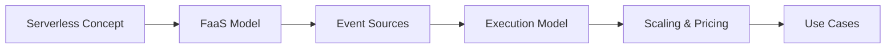

# Chapter 08: Serverless Computing

> **Previous:** [Chapter 7: Cloud Security and Identity](./07-cloud-security.md) | **Next:** [Chapter 9: Containerization and Orchestration](./09-containerization.md)

## Learning Objectives

- Define Serverless Computing and Function-as-a-Service (FaaS).
- Explain the event-driven execution model of serverless functions.
- Compare serverless architectures with traditional server-based models.
- Design an event-driven workflow using managed cloud services.
- Analyze the cost implications and scaling characteristics of serverless workloads.

## Chapter at a Glance

| Topic | Key Insight | Practical Takeaway |
|-------|-------------|--------------------|
| Serverless Definition | No server management — provider handles infrastructure | Focus on code, not servers |
| FaaS | Functions triggered by events | Pay per execution + duration |
| Event-Driven | S3 uploads, DB changes, HTTP requests trigger functions | Decoupled, scalable architecture |
| Cold Starts | First invocation after idle has latency overhead | Mitigate with provisioned concurrency |
| Micro-billing | Charged per millisecond of execution | Cost-effective for variable, bursty workloads |

## Chapter Roadmap



---

## Theory

### What is Serverless Computing?
Serverless computing is a cloud execution model where the cloud provider dynamically manages the allocation and provisioning of servers. A serverless application runs in stateless compute containers that are event-triggered, ephemeral, and fully managed by the provider. The term "serverless" does not mean servers are not involved; rather, it means that the developers do not need to manage, patch, or scale the underlying infrastructure.

### Function-as-a-Service (FaaS)
FaaS is the core component of serverless computing. It allows developers to deploy individual pieces of logic (functions) that respond to events. Key characteristics of FaaS include:
- **Statelessness:** Functions do not persist state between executions. Any required state must be stored in external databases or object storage.
- **Ephemeral nature:** The execution environment exists only for the duration of the function call.
- **Auto-scaling:** The provider automatically scales the number of function instances based on the incoming request volume.
- **Micro-billing:** Users are charged based on the number of executions and the duration of execution (usually in milliseconds), rather than for idle server time.


### Event-Driven Architectures
Serverless functions are typically part of an event-driven architecture. An event is a change in state or an update that happens in the cloud environment. Common event sources include:
- **Object Storage:** A new file is uploaded to an S3 bucket or Blob storage.
- **Database Streams:** A record is inserted or updated in a NoSQL database like DynamoDB.
- **HTTP Requests:** An API Gateway receives a REST or GraphQL request.
- **Message Queues:** A new message arrives in an SQS or Pub/Sub queue.
- **Scheduled Events:** A cron-like trigger executes a function at specific intervals.

---

## Examples

### Example 1: Image Thumbnail Generator (AWS Lambda)
This example demonstrates a common serverless pattern: processing a file upload using an event trigger.

**Workflow:**
1. A user uploads an image to an S3 bucket named `original-images`.
2. S3 triggers an AWS Lambda function.
3. The Lambda function retrieves the image, resizes it using a library like `Pillow`, and saves the thumbnail to a bucket named `resized-images`.

**Code Snippet (Python):**
```python
import boto3
import os
import sys
import uuid
from PIL import Image
import PIL.Image

s3_client = boto3.client('s3')

def resize_image(image_path, resized_path):
    with PIL.Image.open(image_path) as image:
        image.thumbnail((128, 128))
        image.save(resized_path)

def handler(event, context):
    for record in event['Records']:
        bucket = record['s3']['bucket']['name']
        key = record['s3']['object']['key']
        download_path = '/tmp/{}{}'.format(uuid.uuid4(), key)
        upload_path = '/tmp/resized-{}'.format(key)
        
        s3_client.download_file(bucket, key, download_path)
        resize_image(download_path, upload_path)
        s3_client.upload_file(upload_path, '{}-resized'.format(bucket), key)
```

**Expected Output:**
A new object appears in the `-resized` bucket shortly after an upload to the source bucket.

> **One-Sentence Takeaway:** Serverless computing eliminates infrastructure management entirely — you provide code, the provider handles scaling, and you pay only for the milliseconds your code actually runs.

> **Pro Tip:** Cold starts are the #1 performance concern in serverless. For latency-sensitive functions, use provisioned concurrency (AWS) or keep functions warm with scheduled pings. For most workloads, cold starts are negligible (<100ms for Node.js/Python).

> **Warning:** Serverless functions have execution time limits (15 min for AWS Lambda, 5 min for Google Cloud Functions). If your workload takes hours, it's not a good fit — use batch processing services (AWS Batch, Google Batch, Azure Batch) instead.

### Example 2: Serverless Web API (Azure Functions)
This example shows how to create a simple HTTP-triggered function that interacts with a database.

**Workflow:**
1. A client sends a POST request with JSON data to the function URL.
2. The Azure Function processes the data and saves it to Cosmos DB.
3. The function returns a success message to the client.

**Code Snippet (JavaScript):**
```javascript
module.exports = async function (context, req) {
    context.log('JavaScript HTTP trigger function processed a request.');

    const name = (req.query.name || (req.body && req.body.name));
    const responseMessage = name
        ? "Hello, " + name + ". This HTTP triggered function executed successfully."
        : "This HTTP triggered function executed successfully. Pass a name in the query string or in the request body for a personalized response.";

    if (name) {
        context.bindings.outputDocument = JSON.stringify({
            id: new Date().toISOString(),
            name: name
        });
    }

    context.res = {
        body: responseMessage
    };
}
```

---

## Concept Comparison Table

| Concept | Definition | Key Distinction | Use Case |
|---------|-----------|-----------------|----------|
| Serverless (FaaS) | Event-triggered functions | No server management, micro-billing | Data processing, APIs |
| Containers | OS-level virtualization | Always running, custom runtime | Microservices |
| VMs | Hardware-level virtualization | Full OS control | Legacy apps, databases |
| BaaS | Backend-as-a-Service (Auth, DB, Storage) | Managed backend components | Mobile apps, rapid prototyping |
| Cold Start | Delay when invoking idle function | Latency penalty for infrequent functions | Mitigate with warm-up strategies |

## Quick Reference

| Category | Key Concepts | Notes |
|----------|-------------|-------|
| **FaaS Providers** | AWS Lambda, Azure Functions, GCP Cloud Functions | All support Node, Python, Java, Go |
| **Event Sources** | S3, DynamoDB, SQS, API Gateway, Pub/Sub, timer | Most cloud services can trigger functions |
| **Limits** | 15 min max (Lambda), 512MB–10GB memory | Not suitable for long-running jobs |
| **Pricing** | Per million requests + per GB-second | 1M requests/month are often free |
| **Cold Start** | ~100ms–1s depending on runtime | Java/C# have longest cold starts |

## Cross-Application Matrix

| Technique | Cloud Architecture | DevOps | Security | Enterprise |
|-----------|-------------------|--------|----------|------------|
| Event-Driven | Decoupled architecture | CI/CD triggers | Event audit trail | Async processing |
| FaaS | Backend APIs | Build automation | Least privilege roles | Data transformation |
| Step Functions | Orchestration | Pipeline management | Error handling | Business workflows |
| API Gateway | Serverless REST APIs | Canary deployments | WAF integration | Public APIs |
| EventBridge/CloudEvents | Event bus | Event-driven CI/CD | Event filtering | Cross-account events |

## Chapter Quiz

1. What is the primary billing unit for serverless FaaS platforms?
   - A) Per GB of storage
   - B) Per million requests + per GB-second of execution time
   - C) Per month subscription
   - D) Per reserved instance

<details>
<summary>Answer</summary>
**B) Per million requests + per GB-second of execution time.** Serverless billing combines the number of invocations (requests) with the duration of execution weighted by allocated memory. If a function uses 512MB and runs for 200ms, it costs 0.1 GB-seconds.
</details>

2. What causes a "cold start" in serverless functions?
   - A) The data center temperature is low
   - B) A function hasn't been invoked recently, so the provider needs to spin up a new execution environment
   - C) The function code has an error
   - D) The API key expired

<details>
<summary>Answer</summary>
**B) A function hasn't been invoked recently, so the provider needs to spin up a new execution environment.** After a period of inactivity, the cloud provider reclaims the function's execution environment. The next invocation must initialize the runtime, load code, and execute the handler — this startup delay is the cold start.
</details>

3. Which workload is NOT well-suited for serverless functions?
   - A) Image thumbnail generation triggered by file uploads
   - B) A 45-minute batch machine learning training job
   - C) A simple REST API endpoint
   - D) Processing messages from a queue

<details>
<summary>Answer</summary>
**B) A 45-minute batch machine learning training job.** Serverless functions have maximum execution time limits (15 minutes for AWS Lambda). ML training that takes 45 minutes requires a service designed for long-running compute, not FaaS.
</details>

## Summary

- Serverless computing abstracts infrastructure management, allowing developers to focus solely on code.
- Function-as-a-Service (FaaS) enables the execution of logic in response to discrete events.
- Serverless functions are stateless and ephemeral, requiring external services for persistence.
- Scaling is handled automatically by the cloud provider, providing high availability by default.
- Costs are calculated based on actual usage (executions and duration) rather than reserved capacity.
- Common use cases include data processing, web backends, scheduled tasks, and real-time streaming.

---

## Exercises

### Review Questions
1. What is the difference between "Cold Start" and "Warm Start" in the context of serverless functions?
2. Why is statelessness a fundamental requirement for serverless functions?
3. How does the billing model of AWS Lambda differ from that of an EC2 instance?
4. List three cloud services that can act as event sources for a serverless function.
5. What are the typical timeout limits for serverless functions, and why do they exist?

### Application Problems
1. Design a serverless workflow for a newsletter subscription service where a user submits an email via a web form, the email is validated, and then stored in a database.
2. A company wants to move its legacy nightly batch processing job (which takes 2 hours) to a serverless platform. Identify potential challenges and propose a solution.
3. Calculate the estimated monthly cost for a Lambda function that executes 5 million times per month, with an average duration of 200ms and 512MB of allocated memory.

### Challenge Problem
Design a multi-region serverless architecture that provides automatic failover for a REST API. Specify the components used for traffic routing, compute, and data synchronization across regions.