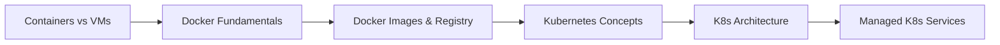

# Chapter 09: Containerization and Orchestration

> **Previous:** [Chapter 8: Serverless Computing](./08-serverless.md) | **Next:** [Chapter 10: Cloud Architecture and Management](./10-architecture.md)

## Learning Objectives

- Explain the difference between virtualization and containerization.
- Describe the architecture and components of Docker.
- Define the role of Kubernetes in container orchestration.
- Identify the key components of a Kubernetes cluster (Nodes, Pods, Services, Deployments).
- Compare managed Kubernetes services (EKS, AKS, GKE) and their benefits.

## Chapter at a Glance

| Topic | Key Insight | Practical Takeaway |
|-------|-------------|--------------------|
| Containers vs VMs | OS-level vs hardware-level virtualization | Containers: lighter, denser, faster start |
| Docker Platform | Engine, Images, Containers, Registry | "Build once, run anywhere" |
| Dockerfile | Layered image definition | Each instruction creates a cached layer |
| Kubernetes | Container orchestration at scale | Self-healing, scaling, rolling updates |
| K8s Objects | Pods, Deployments, Services, Namespaces | Declarative YAML defines desired state |
| Managed K8s | EKS, AKS, GKE | Managed control plane, reduced ops burden |

## Chapter Roadmap



---

## Theory

### Containers vs. Virtual Machines
While Virtual Machines (VMs) virtualize the underlying hardware, containers virtualize the operating system.
- **Virtual Machines:** Include a full guest OS, a hypervisor, and virtualized hardware. They are hardware-independent but have higher overhead and slower boot times.
- **Containers:** Share the host OS kernel and isolate the application processes. They are lightweight, start in seconds, and ensure "it works on my machine" consistency across environments.

### Docker Fundamentals
Docker is the most popular platform for building, shipping, and running containers. Its architecture consists of:
- **Docker Engine:** The runtime that executes containers.
- **Dockerfile:** A text document containing all the commands a user could call on the command line to assemble an image.
- **Image:** A read-only template used to create containers. Images are built in layers.
- **Container:** A runnable instance of an image.
- **Registry:** A storage and distribution system for Docker images (e.g., Docker Hub, Amazon ECR).


### Container Orchestration with Kubernetes
As the number of containers grows, managing them manually becomes impossible. Kubernetes (K8s) is an open-source system for automating deployment, scaling, and management of containerized applications.

**Key Kubernetes Objects:**
- **Pod:** The smallest deployable unit in Kubernetes, representing a single instance of a running process.
- **Node:** A worker machine (VM or physical) in Kubernetes.
- **Deployment:** Manages a set of identical Pods, handling updates and scaling.
- **Service:** An abstract way to expose an application running on a set of Pods as a network service.
- **Namespace:** Provides a mechanism for isolating groups of resources within a single cluster.

---

## Examples

### Example 1: Creating a Dockerized Web Application
This example shows how to package a simple Python Flask application into a Docker image.

**Dockerfile:**
```dockerfile
# Use an official Python runtime as a parent image
FROM python:3.9-slim

# Set the working directory in the container
WORKDIR /app

# Copy the current directory contents into the container at /app
COPY . /app

# Install any needed packages specified in requirements.txt
RUN pip install --no-cache-dir -r requirements.txt

# Make port 80 available to the world outside this container
EXPOSE 80

# Define environment variable
ENV NAME World

# Run app.py when the container launches
CMD ["python", "app.py"]
```

**Commands to Build and Run:**
```bash
docker build -t flask-app .
docker run -p 4000:80 flask-app
```

**Expected Output:**
Navigating to `http://localhost:4000` in a browser displays the application's response.

> **One-Sentence Takeaway:** Containers package application code with its dependencies into a portable, immutable unit, while Kubernetes orchestrates those containers at scale — together they form the backbone of modern cloud-native applications.

> **Pro Tip:** Always use multi-stage Docker builds to minimize image size. A production image should contain only the compiled binary and runtime dependencies — not build tools, package managers, or source code. This also reduces the attack surface.

> **Warning:** Never store sensitive data (API keys, database passwords) in Docker images. They persist in image layers and can be extracted even from older layers. Use Kubernetes Secrets or cloud secret managers and inject them at runtime.

### Example 2: Deploying to Kubernetes
This example demonstrates a basic Kubernetes Deployment and Service manifest.

**deployment.yaml:**
```yaml
apiVersion: apps/v1
kind: Deployment
metadata:
  name: nginx-deployment
spec:
  replicas: 3
  selector:
    matchLabels:
      app: nginx
  template:
    metadata:
      labels:
        app: nginx
    spec:
      containers:
      - name: nginx
        image: nginx:1.14.2
        ports:
        - containerPort: 80
---
apiVersion: v1
kind: Service
metadata:
  name: nginx-service
spec:
  selector:
    app: nginx
  ports:
    - protocol: TCP
      port: 80
      targetPort: 80
  type: LoadBalancer
```

**Command:**
```bash
kubectl apply -f deployment.yaml
```

**Expected Result:**
Kubernetes creates 3 Nginx pods and a LoadBalancer to distribute traffic among them.

---

## Concept Comparison Table

| Concept | Definition | Key Distinction | Use Case |
|---------|-----------|-----------------|----------|
| Docker Image | Read-only template with app + dependencies | Created from Dockerfile, stored in registry | Build artifact |
| Docker Container | Runnable instance of an image | Ephemeral, stateless by default | Dev, test, prod deployment |
| Kubernetes Pod | Smallest deployable unit in K8s | One or more containers sharing network/storage | Application instance |
| Kubernetes Deployment | Manages desired state of Pods | Handles rolling updates, rollbacks, scaling | Stateless services |
| Kubernetes Service | Stable network endpoint for Pods | Load-balanced access to dynamic Pod set | Internal/external access |
| Namespace | Isolated virtual cluster within K8s | Enables multi-tenancy and environment separation | Dev/staging/prod isolation |

## Quick Reference

| Category | Key Concepts | Notes |
|----------|-------------|-------|
| **Docker Commands** | build, run, push, pull, exec, logs | docker build -t name . && docker run name |
| **K8s Objects** | Pod, Deployment, Service, Ingress, ConfigMap, Secret | All defined in YAML |
| **Service Types** | ClusterIP (internal), NodePort (node-level), LoadBalancer (cloud) | LoadBalancer integrates with cloud LB |
| **Managed K8s** | EKS (AWS), AKS (Azure), GKE (GCP) | GKE has autopilot mode (fully managed) |
| **Key Patterns** | Sidecar, Ambassador, Init containers | Sidecar is most common (logging, proxy) |

## Cross-Application Matrix

| Technique | Cloud Architecture | DevOps | Security | Enterprise |
|-----------|-------------------|--------|----------|------------|
| Docker | App packaging | Reproducible builds | Image scanning | Environment consistency |
| Kubernetes | Container orchestration | GitOps (ArgoCD) | Pod security policies | Multi-tenant clusters |
| Sidecar Pattern | Service mesh (Istio) | Logging agents | Security proxies | Observability |
| Helm Charts | Package management | Standardized deployments | Policy enforcement | Enterprise app delivery |
| Managed K8s | Infrastructure abstraction | Reduced ops overhead | Managed security controls | Compliance-ready clusters |

## Chapter Quiz

1. What is the primary advantage of containers over virtual machines in terms of resource utilization?
   - A) Containers use less disk space
   - B) Containers share the host OS kernel, eliminating the need for a full guest OS per instance
   - C) Containers are encrypted by default
   - D) Containers don't need memory

<details>
<summary>Answer</summary>
**B) Containers share the host OS kernel, eliminating the need for a full guest OS per instance.** Each VM includes a full guest OS (GBs), while containers share the host kernel and only package the application and its dependencies (MBs). This enables higher density and faster startup.
</details>

2. In Kubernetes, what is the role of a Deployment?
   - A) To expose Pods as a network service
   - B) To manage the desired state of a set of identical Pods, including rolling updates and scaling
   - C) To store configuration data
   - D) To authenticate users

<details>
<summary>Answer</summary>
**B) To manage the desired state of a set of identical Pods, including rolling updates and scaling.** Deployments ensure the specified number of Pods are running, handle rolling updates without downtime, and automatically replace failed Pods.
</details>

3. What happens when a Kubernetes Service of type LoadBalancer is created on EKS?
   - A) Nothing — it only works on GKE
   - B) Kubernetes creates a cloud load balancer (e.g., AWS ALB/NLB) and maps it to the Service's Pods
   - C) It creates a DNS entry
   - D) It requires manual configuration

<details>
<summary>Answer</summary>
**B) Kubernetes creates a cloud load balancer (e.g., AWS ALB/NLB) and maps it to the Service's Pods.** The cloud controller manager on EKS automatically provisions an AWS load balancer when a Service of type LoadBalancer is created, connecting external traffic to the internal Pod network.
</details>

## Summary

- Containers provide a lightweight, consistent environment for applications by sharing the host OS kernel.
- Docker simplifies the creation and distribution of container images.
- Kubernetes is the industry-standard orchestrator for managing large-scale container deployments.
- The control plane manages the cluster, while worker nodes execute the workloads.
- Declarative configuration (YAML) allows for version-controlled and reproducible infrastructure.
- Managed services like EKS, AKS, and GKE reduce the operational burden of managing the Kubernetes control plane.

---

## Exercises

### Review Questions
1. Why are containers considered more "efficient" than virtual machines in terms of resource utilization?
2. Explain the concept of "layers" in a Docker image.
3. What is the role of the `kube-scheduler` in a Kubernetes cluster?
4. Differentiate between a `ClusterIP`, `NodePort`, and `LoadBalancer` service type in Kubernetes.
5. What happens when a Pod in a Deployment fails?

### Application Problems
1. Write a `Dockerfile` for a Node.js application that uses `npm install` and starts the app with `node index.js`.
2. Create a Kubernetes YAML manifest that deploys 5 replicas of a Redis container and exposes it internally within the cluster.
3. A development team reports that an application works in their local Docker environment but fails when deployed to EKS. List three potential configuration differences to investigate.

### Challenge Problem
Design a CI/CD pipeline that automatically builds a Docker image from a GitHub repository, pushes it to a private registry (like Amazon ECR), and updates a Kubernetes Deployment in a production cluster. Specify the tools and steps involved.