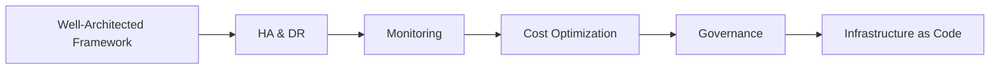

# Chapter 10: Cloud Architecture and Management

> **Previous:** [Chapter 9: Containerization and Orchestration](./09-containerization.md) | **Next:** [Chapter 1: Introduction to Cloud Computing](./01-introduction.md)

## Learning Objectives

- Apply the principles of the Well-Architected Framework.
- Design for high availability and disaster recovery in the cloud.
- Implement comprehensive monitoring and logging strategies.
- Execute cost optimization techniques to manage cloud spend.
- Understand the role of Governance and Compliance in cloud environments.

## Chapter at a Glance

| Topic | Key Insight | Practical Takeaway |
|-------|-------------|--------------------|
| Well-Architected Framework | 6 pillars: Operational Excellence, Security, Reliability, Performance, Cost, Sustainability | A structured approach to evaluating and improving architecture |
| High Availability | Redundancy across AZs with load balancing | Design for failure — everything fails eventually |
| Disaster Recovery | Backup/Restore → Pilot Light → Warm Standby → Active-Active | Choose DR strategy by RTO/RPO requirements |
| Monitoring & Observability | Metrics + Logs + Traces + Alarms | You can't improve what you don't measure |
| Cost Optimization | Rightsizing, Spot/Reserved, lifecycle policies | Continuous process, not a one-time exercise |
| Governance | IaC, tagging, policies, compliance controls | Automate governance — manual enforcement doesn't scale |

## Chapter Roadmap



---

## Theory

### The Well-Architected Framework
All major cloud providers (AWS, Azure, GCP) provide a "Well-Architected Framework" to help cloud architects build secure, high-performing, resilient, and efficient infrastructure. The framework is typically organized into six pillars:
1. **Operational Excellence:** Running and monitoring systems to deliver business value.
2. **Security:** Protecting information, systems, and assets.
3. **Reliability:** Ensuring a workload performs its intended function correctly and consistently.
4. **Performance Efficiency:** Using IT and computing resources efficiently.
5. **Cost Optimization:** Avoiding unnecessary costs.
6. **Sustainability:** Minimizing the environmental impact of running cloud workloads.


### High Availability and Disaster Recovery (DR)
- **High Availability (HA):** Designing systems to be operational for a long period (e.g., "four nines" or 99.99%). This is achieved through redundancy across Availability Zones (AZs) and load balancing.
- **Disaster Recovery (DR):** Planning for the recovery of applications and data in the event of a catastrophic failure (e.g., region-wide outage). DR strategies include:
    - **Backup and Restore:** Low cost, high recovery time (RTO/RPO).
    - **Pilot Light:** Core data is kept in sync; other resources are scaled up during a disaster.
    - **Warm Standby:** A scaled-down version of a fully functional environment is always running.
    - **Multi-site (Active-Active):** Full traffic is distributed across two or more regions.

### Monitoring and Observability
Monitoring involves collecting, analyzing, and using data to track the health of applications.
- **Metrics:** Numerical data measured over time (e.g., CPU utilization, latency).
- **Logs:** Records of events that happened in a system (e.g., application errors, access logs).
- **Traces:** Tracks the path of a request through various microservices.
- **Dashboards:** Visual representations of metrics for real-time monitoring.
- **Alarms:** Automated notifications triggered when a metric crosses a defined threshold.

---

## Examples

### Example 1: Implementing an Auto-Scaling Group with a Load Balancer
This example demonstrates a reliable and highly available architecture on AWS.

**Architecture:**
- An Application Load Balancer (ALB) distributed across two Availability Zones.
- An Auto Scaling Group (ASG) that maintains a minimum of 2 instances and scales up based on CPU usage.

**AWS CLI Commands:**
```bash
# Create a launch template
aws ec2 create-launch-template --launch-template-name my-web-template --launch-template-data '{"ImageId":"ami-0c55b159cbfafe1f0","InstanceType":"t2.micro"}'

# Create an Auto Scaling Group
aws autoscaling create-auto-scaling-group --auto-scaling-group-name my-asg --launch-template LaunchTemplateName=my-web-template --min-size 2 --max-size 5 --vpc-zone-identifier "subnet-12345,subnet-67890"

# Add a target tracking scaling policy
aws autoscaling put-scaling-policy --auto-scaling-group-name my-asg --policy-name cpu-target-tracking --policy-type TargetTrackingScaling --target-tracking-configuration '{"TargetValue": 70.0, "PredefinedMetricSpecification": {"PredefinedMetricType": "ASGAverageCPUUtilization"}}'
```

> **One-Sentence Takeaway:** The Well-Architected Framework is the blueprint for building cloud systems that are secure, reliable, performant, cost-efficient, and sustainable — every architecture decision should be traceable to at least one pillar.

> **Pro Tip:** For cost optimization, start by identifying and removing unused resources — orphaned EBS volumes, idle load balancers, unassociated IP addresses. These often account for 20-30% of cloud waste without providing any value.

> **Warning:** Recovery Time Objective (RTO) and Recovery Point Objective (RPO) are not just technical specs — they have direct business impact. An RTO of 4 hours for a customer-facing app means accepting up to 4 hours of revenue loss. Ensure stakeholders sign off on DR targets.

### Example 2: Cost Optimization with Spot Instances and Reserved Instances
This example shows how to reduce costs by selecting the right pricing model.

**Strategy:**
1. Use **Reserved Instances** or **Savings Plans** for the "baseline" load (web servers running 24/7).
2. Use **Spot Instances** for stateless, fault-tolerant batch processing jobs.
3. Use **On-Demand Instances** only for unpredictable, temporary spikes.

**Result:**
A potential cost reduction of up to 60-70% compared to using only On-Demand instances.

---

## Concept Comparison Table

| Concept | Definition | Key Distinction | Use Case |
|---------|-----------|-----------------|----------|
| Operational Excellence | Run and monitor systems to deliver business value | Process and people focused | Incident response, deployments |
| Security | Protect data, systems, and assets | Identity, encryption, compliance | Least privilege, encryption |
| Reliability | Recover from failures and meet demand | HA, DR, auto-scaling | Multi-AZ, replicated databases |
| Performance Efficiency | Use resources efficiently | Right-sizing, serverless, caching | Autoscaling, CDN |
| Cost Optimization | Avoid unnecessary costs | Spot instances, lifecycle policies | Reserved instances, right-sizing |
| Sustainability | Minimize environmental impact | Efficient hardware, region selection | Energy-efficient instance types |

## Quick Reference

| Category | Key Concepts | Notes |
|----------|-------------|-------|
| **WAF Pillars** | OpEx, Security, Reliability, Performance, Cost, Sustainability | Evaluate architecture against all six |
| **DR Strategies** | Backup/Restore, Pilot Light, Warm Standby, Active-Active | Higher availability = higher cost |
| **Cost Levers** | Rightsizing, Reserved/Spot, Storage tiers, Delete orphans | 30% savings typical in first optimization pass |
| **Monitoring** | Metrics, Logs, Traces, Dashboards, Alarms | The observability triad: metrics + logs + traces |
| **IaC Tools** | Terraform, CloudFormation, Bicep, Pulumi | Declarative, version-controlled infrastructure |

## Cross-Application Matrix

| Technique | Cloud Architecture | DevOps | Security | Enterprise |
|-----------|-------------------|--------|----------|------------|
| WAF Evaluation | Architecture review | Delivery pipeline | Security posture | Compliance audit |
| Auto Scaling | Elastic capacity | CI/CD worker pools | DDoS resilience | Cost-efficient scaling |
| Cost Optimization | Budget planning | Resource tagging | Cost anomaly detection | FinOps governance |
| IaC (Terraform) | Declarative infra | GitOps deployment | Policy as Code | Multi-cloud standard |
| Observability | System health | Deployment verification | Security monitoring | SLA reporting |

## Chapter Quiz

1. Which Well-Architected Framework pillar is best addressed by using Multi-AZ database deployments?
   - A) Cost Optimization
   - B) Security
   - C) Reliability
   - D) Performance Efficiency

<details>
<summary>Answer</summary>
**C) Reliability.** Multi-AZ deployments automatically fail over to a standby in another Availability Zone, ensuring the workload continues to function correctly during infrastructure failures. This directly addresses the Reliability pillar's goal of recovering from infrastructure disruptions.
</details>

2. A company has an RTO of 1 hour and an RPO of 15 minutes for its critical database. Which DR strategy is most appropriate?
   - A) Backup and Restore (RTO: hours, RPO: 24h)
   - B) Pilot Light (RTO: minutes, RPO: minutes)
   - C) Warm Standby (RTO: minutes, RPO: seconds)
   - D) Active-Active (RTO: zero, RPO: zero)

<details>
<summary>Answer</summary>
**C) Warm Standby.** With RTO of 1 hour and RPO of 15 minutes, Warm Standby provides a scaled-down but fully functional environment that can be activated quickly. Pilot Light might not meet the 1-hour RTO, while Active-Active is over-engineered and expensive for these requirements.
</details>

3. What is the most impactful first step in cloud cost optimization?
   - A) Buying Reserved Instances for everything
   - B) Identifying and removing unused resources (orphaned volumes, idle instances, unassociated IPs)
   - C) Migrating to serverless
   - D) Negotiating with the cloud provider

<details>
<summary>Answer</summary>
**B) Identifying and removing unused resources (orphaned volumes, idle instances, unassociated IPs).** The cheapest resource is the one you're not paying for at all. Most organizations find 20-30% waste from unattached resources, idle instances, and over-provisioned services before any pricing model optimization.
</details>

## Summary

- The Well-Architected Framework provides a structured approach to evaluating and improving cloud architectures.
- Resiliency is built through redundancy, decoupling, and automated recovery.
- High Availability focuses on localized failures, while Disaster Recovery plans for regional outages.
- Monitoring and logging are essential for maintaining operational excellence and troubleshooting issues.
- Cloud cost management requires continuous optimization through rightsizing, choosing appropriate pricing models, and deleting unused resources.
- Governance ensures that cloud usage aligns with organizational policies and regulatory requirements.

---

## Exercises

### Review Questions
1. Name the six pillars of the AWS Well-Architected Framework.
2. What is the difference between RTO (Recovery Time Objective) and RPO (Recovery Point Objective)?
3. Why is "decoupling" a key principle in cloud architecture?
4. How do Spot Instances differ from On-Demand instances in terms of pricing and availability?
5. What is "Infrastructure as Code" (IaC), and how does it support Operational Excellence?

### Application Problems
1. Design a highly available architecture for a three-tier web application (Web, App, DB) across two regions. Specify the services used for load balancing and data replication.
2. A company has a $10,000 monthly AWS bill. 40% of the cost is for unutilized EBS volumes and idle EC2 instances. Propose a plan to reduce the bill.
3. Set up a CloudWatch alarm that sends an SNS notification when a Lambda function's error rate exceeds 5% over a 5-minute period.

### Challenge Problem
Design a "Pilot Light" disaster recovery strategy for a mission-critical SQL database and a containerized frontend. Explain the state of each resource during normal operation and the steps required to transition to the DR region during an outage.