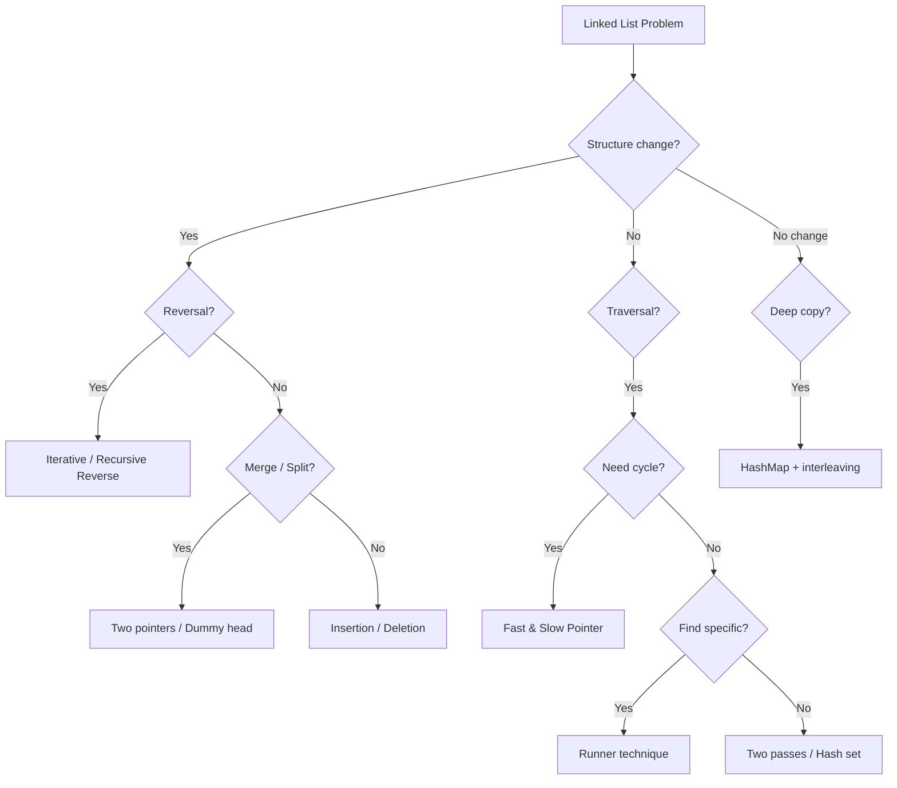
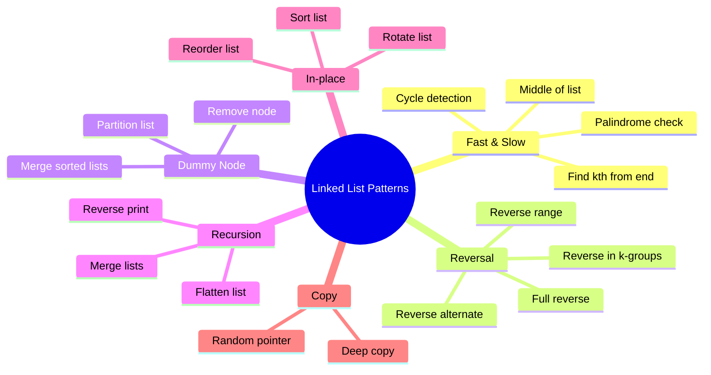

# Chapter 03: Linked Lists

> Linked lists test your understanding of pointer manipulation, memory management, and recursive thinking. They are deceptively simple but require careful handling of edge cases.

## Learning Objectives

- Master pointer manipulation: traversal, insertion, deletion, reversal
- Understand the fast & slow pointer technique for cycle detection and middle element
- Implement recursive and iterative solutions for common linked list operations
- Handle edge cases: empty list, single node, circular lists
- Apply dummy node technique to simplify edge case handling

## Problem Classification Flow



## Linked List Algorithm Patterns



## Complexity Decision Tree

```mermaid
flowchart LR
    A[Problem] --> B{Requires random access?}
    B -->|Yes| C[Use array instead]
    B -->|No| D{Need to modify?}
    D -->|Yes| E[O(n) time O(1) space]
    D -->|No| F[O(n) time O(n) space for copy]
    E --> G{Single pointer sufficient?}
    G -->|Yes| H[Iterative traversal]
    G -->|No| I[Fast & Slow / Dummy node]
```

---

## Easy Problems (7)

---

### Problem 1: Reverse Linked List
🏷️ **Companies:** [Amazon] [Google] [Meta] [Microsoft] [Apple]
📊 **Difficulty:** Easy
📂 **Topics:** [Linked List, Recursion]

**Problem:** Given the head of a singly linked list, reverse the list and return the new head.

**Example 1:**
```
Input: head = [1, 2, 3, 4, 5]
Output: [5, 4, 3, 2, 1]
```

**Constraints:**
- 0 ≤ nodes ≤ 5000
- -5000 ≤ Node.val ≤ 5000

**Solution Approach:**
- **Iterative:** Use three pointers (prev, curr, next). Time O(n), Space O(1).
- **Recursive:** Reverse rest, then fix head. Time O(n), Space O(n) call stack.

```typescript
class ListNode {
  val: number;
  next: ListNode | null;
  constructor(val?: number, next?: ListNode | null) {
    this.val = val ?? 0;
    this.next = next ?? null;
  }
}

function reverseList(head: ListNode | null): ListNode | null {
  let prev: ListNode | null = null;
  let curr = head;

  while (curr) {
    const next = curr.next;
    curr.next = prev;
    prev = curr;
    curr = next;
  }

  return prev;
}
```

**Test Cases:**
```typescript
function arrayToList(arr: number[]): ListNode | null {
  if (!arr.length) return null;
  const head = new ListNode(arr[0]);
  let curr = head;
  for (let i = 1; i < arr.length; i++) {
    curr.next = new ListNode(arr[i]);
    curr = curr.next;
  }
  return head;
}

function listToArray(head: ListNode | null): number[] {
  const result: number[] = [];
  while (head) {
    result.push(head.val);
    head = head.next;
  }
  return result;
}

console.log(listToArray(reverseList(arrayToList([1, 2, 3, 4, 5]))));
// [5, 4, 3, 2, 1]
console.log(listToArray(reverseList(arrayToList([1, 2]))));
// [2, 1]
console.log(listToArray(reverseList(null)));
// []
```

**Time Complexity:** O(n)
**Space Complexity:** O(1) iterative | O(n) recursive

---

### Problem 2: Merge Two Sorted Lists
🏷️ **Companies:** [Amazon] [Google] [Meta] [Microsoft] [Apple]
📊 **Difficulty:** Easy
📂 **Topics:** [Linked List, Recursion]

**Problem:** Merge two sorted linked lists into one sorted list.

**Example 1:**
```
Input: list1 = [1, 2, 4], list2 = [1, 3, 4]
Output: [1, 1, 2, 3, 4, 4]
```

**Constraints:**
- 0 ≤ nodes ≤ 50
- -100 ≤ Node.val ≤ 100

**Solution Approach:**
- **Iterative:** Use dummy head, compare and attach smaller node.
- **Recursive:** Return the smaller head and recurse on next.

```typescript
function mergeTwoLists(list1: ListNode | null, list2: ListNode | null): ListNode | null {
  const dummy = new ListNode(0);
  let curr = dummy;

  while (list1 && list2) {
    if (list1.val <= list2.val) {
      curr.next = list1;
      list1 = list1.next;
    } else {
      curr.next = list2;
      list2 = list2.next;
    }
    curr = curr.next;
  }

  curr.next = list1 || list2;
  return dummy.next;
}
```

**Test Cases:**
```typescript
console.log(listToArray(mergeTwoLists(
  arrayToList([1, 2, 4]),
  arrayToList([1, 3, 4])
))); // [1, 1, 2, 3, 4, 4]

console.log(listToArray(mergeTwoLists(null, arrayToList([0]))));
// [0]
```

**Time Complexity:** O(n + m)
**Space Complexity:** O(1)

---

### Problem 3: Linked List Cycle
🏷️ **Companies:** [Amazon] [Google] [Meta] [Microsoft]
📊 **Difficulty:** Easy
📂 **Topics:** [Linked List, Two Pointers]

**Problem:** Given head of a linked list, determine if there is a cycle.

**Example 1:**
```
Input: head = [3, 2, 0, -4], pos = 1 (cycle at index 1)
Output: true
```

**Constraints:**
- 0 ≤ nodes ≤ 10⁴
- -10⁵ ≤ Node.val ≤ 10⁵

**Solution Approach:**
- **Hash Set:** Track visited nodes. Time O(n), Space O(n).
- **Optimal (Floyd's):** Slow + fast pointer. If they meet, there's a cycle. Time O(n), Space O(1).

```typescript
function hasCycle(head: ListNode | null): boolean {
  let slow = head;
  let fast = head;

  while (fast && fast.next) {
    slow = slow!.next;
    fast = fast.next.next;
    if (slow === fast) return true;
  }

  return false;
}
```

**Test Cases:**
```typescript
const node1 = new ListNode(3);
const node2 = new ListNode(2);
const node3 = new ListNode(0);
const node4 = new ListNode(-4);
node1.next = node2;
node2.next = node3;
node3.next = node4;
node4.next = node2; // cycle
console.log(hasCycle(node1)); // true

const list = arrayToList([1, 2]);
console.log(hasCycle(list)); // false
```

**Time Complexity:** O(n)
**Space Complexity:** O(1)

---

### Problem 4: Remove Duplicates from Sorted List
🏷️ **Companies:** [Amazon] [Google] [Microsoft]
📊 **Difficulty:** Easy
📂 **Topics:** [Linked List]

**Problem:** Given a sorted linked list, delete all duplicates such that each element appears only once.

**Example 1:**
```
Input: head = [1, 1, 2]
Output: [1, 2]
```

**Constraints:**
- 0 ≤ nodes ≤ 300

```typescript
function deleteDuplicates(head: ListNode | null): ListNode | null {
  let curr = head;

  while (curr && curr.next) {
    if (curr.val === curr.next.val) {
      curr.next = curr.next.next;
    } else {
      curr = curr.next;
    }
  }

  return head;
}
```

**Test Cases:**
```typescript
console.log(listToArray(deleteDuplicates(arrayToList([1, 1, 2]))));
// [1, 2]
console.log(listToArray(deleteDuplicates(arrayToList([1, 1, 2, 3, 3]))));
// [1, 2, 3]
```

**Time Complexity:** O(n)
**Space Complexity:** O(1)

---

### Problem 5: Middle of the Linked List
🏷️ **Companies:** [Amazon] [Google] [Microsoft]
📊 **Difficulty:** Easy
📂 **Topics:** [Linked List, Two Pointers]

**Problem:** Return the middle node of the linked list. If there are two middle nodes, return the second middle.

**Example 1:**
```
Input: head = [1, 2, 3, 4, 5]
Output: 3
```

**Constraints:**
- 1 ≤ nodes ≤ 100

```typescript
function middleNode(head: ListNode | null): ListNode | null {
  let slow = head;
  let fast = head;

  while (fast && fast.next) {
    slow = slow!.next;
    fast = fast.next.next;
  }

  return slow;
}
```

**Test Cases:**
```typescript
console.log(middleNode(arrayToList([1, 2, 3, 4, 5]))?.val); // 3
console.log(middleNode(arrayToList([1, 2, 3, 4, 5, 6]))?.val); // 4
```

**Time Complexity:** O(n)
**Space Complexity:** O(1)

---

### Problem 6: Remove Linked List Elements
🏷️ **Companies:** [Amazon] [Google] [Microsoft]
📊 **Difficulty:** Easy
📂 **Topics:** [Linked List]

**Problem:** Remove all nodes with a given value.

**Example 1:**
```
Input: head = [1, 2, 6, 3, 4, 5, 6], val = 6
Output: [1, 2, 3, 4, 5]
```

```typescript
function removeElements(head: ListNode | null, val: number): ListNode | null {
  const dummy = new ListNode(0, head);
  let curr = dummy;

  while (curr.next) {
    if (curr.next.val === val) {
      curr.next = curr.next.next;
    } else {
      curr = curr.next;
    }
  }

  return dummy.next;
}
```

**Test Cases:**
```typescript
console.log(listToArray(removeElements(arrayToList([1, 2, 6, 3, 4, 5, 6]), 6)));
// [1, 2, 3, 4, 5]
console.log(listToArray(removeElements(arrayToList([]), 1)));
// []
```

**Time Complexity:** O(n)
**Space Complexity:** O(1)

---

### Problem 7: Palindrome Linked List
🏷️ **Companies:** [Amazon] [Google] [Meta] [Microsoft]
📊 **Difficulty:** Easy
📂 **Topics:** [Linked List, Two Pointers, Stack]

**Problem:** Given the head of a linked list, determine if it's a palindrome.

**Example 1:**
```
Input: head = [1, 2, 2, 1]
Output: true
```

**Constraints:**
- 1 ≤ nodes ≤ 10⁵

**Solution Approach:**
- Find mid, reverse second half, compare both halves.

```typescript
function isPalindrome(head: ListNode | null): boolean {
  const findMid = (h: ListNode | null): ListNode | null => {
    let slow = h;
    let fast = h;
    while (fast && fast.next) {
      slow = slow!.next;
      fast = fast.next.next;
    }
    return slow;
  };

  const reverse = (h: ListNode | null): ListNode | null => {
    let prev = null;
    let curr = h;
    while (curr) {
      const next = curr.next;
      curr.next = prev;
      prev = curr;
      curr = next;
    }
    return prev;
  };

  const mid = findMid(head);
  let secondHalf = reverse(mid);
  let firstHalf = head;

  while (secondHalf) {
    if (firstHalf!.val !== secondHalf.val) return false;
    firstHalf = firstHalf!.next;
    secondHalf = secondHalf.next;
  }

  return true;
}
```

**Test Cases:**
```typescript
console.log(isPalindrome(arrayToList([1, 2, 2, 1]))); // true
console.log(isPalindrome(arrayToList([1, 2]))); // false
console.log(isPalindrome(arrayToList([1]))); // true
```

**Time Complexity:** O(n)
**Space Complexity:** O(1)

---

## Medium Problems (10)

---

### Problem 8: Add Two Numbers
🏷️ **Companies:** [Amazon] [Google] [Meta] [Microsoft] [Apple]
📊 **Difficulty:** Medium
📂 **Topics:** [Linked List, Math]

**Problem:** Given two non-empty linked lists representing two non-negative integers (digits stored in reverse order), add them and return the sum as a linked list.

**Example 1:**
```
Input: l1 = [2, 4, 3] (342), l2 = [5, 6, 4] (465)
Output: [7, 0, 8] (807)
```

**Constraints:**
- 1 ≤ nodes ≤ 100

```typescript
function addTwoNumbers(l1: ListNode | null, l2: ListNode | null): ListNode | null {
  const dummy = new ListNode(0);
  let curr = dummy;
  let carry = 0;

  while (l1 || l2 || carry) {
    const sum = (l1?.val ?? 0) + (l2?.val ?? 0) + carry;
    carry = Math.floor(sum / 10);
    curr.next = new ListNode(sum % 10);
    curr = curr.next;
    if (l1) l1 = l1.next;
    if (l2) l2 = l2.next;
  }

  return dummy.next;
}
```

**Test Cases:**
```typescript
console.log(listToArray(addTwoNumbers(
  arrayToList([2, 4, 3]),
  arrayToList([5, 6, 4])
))); // [7, 0, 8]

console.log(listToArray(addTwoNumbers(
  arrayToList([0]),
  arrayToList([0])
))); // [0]
```

**Time Complexity:** O(max(n, m))
**Space Complexity:** O(max(n, m))

---

### Problem 9: Remove Nth Node From End of List
🏷️ **Companies:** [Amazon] [Google] [Meta] [Microsoft]
📊 **Difficulty:** Medium
📂 **Topics:** [Linked List, Two Pointers]

**Problem:** Remove the nth node from the end of the list.

**Example 1:**
```
Input: head = [1, 2, 3, 4, 5], n = 2
Output: [1, 2, 3, 5]
```

**Constraints:**
- 1 ≤ nodes ≤ 30
- 1 ≤ n ≤ nodes

**Solution Approach:**
- **Two passes:** Find length, then remove len-n.
- **Optimal (One pass):** Use dummy node + two pointers with gap n.

```typescript
function removeNthFromEnd(head: ListNode | null, n: number): ListNode | null {
  const dummy = new ListNode(0, head);
  let slow = dummy;
  let fast = dummy;

  for (let i = 0; i <= n; i++) {
    fast = fast.next!;
  }

  while (fast) {
    slow = slow.next!;
    fast = fast.next;
  }

  slow.next = slow.next!.next;
  return dummy.next;
}
```

**Test Cases:**
```typescript
console.log(listToArray(removeNthFromEnd(arrayToList([1, 2, 3, 4, 5]), 2)));
// [1, 2, 3, 5]
console.log(listToArray(removeNthFromEnd(arrayToList([1]), 1)));
// []
```

**Time Complexity:** O(n)
**Space Complexity:** O(1)

---

### Problem 10: Swap Nodes in Pairs
🏷️ **Companies:** [Amazon] [Google] [Meta]
📊 **Difficulty:** Medium
📂 **Topics:** [Linked List, Recursion]

**Problem:** Swap every two adjacent nodes in a linked list.

**Example 1:**
```
Input: head = [1, 2, 3, 4]
Output: [2, 1, 4, 3]
```

**Constraints:**
- 0 ≤ nodes ≤ 100

```typescript
function swapPairs(head: ListNode | null): ListNode | null {
  const dummy = new ListNode(0, head);
  let prev = dummy;

  while (prev.next && prev.next.next) {
    const first = prev.next;
    const second = prev.next.next;

    first.next = second.next;
    second.next = first;
    prev.next = second;

    prev = first;
  }

  return dummy.next;
}
```

**Test Cases:**
```typescript
console.log(listToArray(swapPairs(arrayToList([1, 2, 3, 4]))));
// [2, 1, 4, 3]
console.log(listToArray(swapPairs(arrayToList([1, 2, 3]))));
// [2, 1, 3]
```

**Time Complexity:** O(n)
**Space Complexity:** O(1)

---

### Problem 11: Odd Even Linked List
🏷️ **Companies:** [Amazon] [Google] [Microsoft]
📊 **Difficulty:** Medium
📂 **Topics:** [Linked List]

**Problem:** Group all odd-indexed nodes together followed by even-indexed nodes.

**Example 1:**
```
Input: head = [1, 2, 3, 4, 5]
Output: [1, 3, 5, 2, 4]
```

**Constraints:**
- 0 ≤ nodes ≤ 10⁴

```typescript
function oddEvenList(head: ListNode | null): ListNode | null {
  if (!head) return null;

  let odd = head;
  let even = head.next;
  const evenHead = even;

  while (even && even.next) {
    odd.next = even.next;
    odd = odd.next;
    even.next = odd.next;
    even = even.next;
  }

  odd.next = evenHead;
  return head;
}
```

**Test Cases:**
```typescript
console.log(listToArray(oddEvenList(arrayToList([1, 2, 3, 4, 5]))));
// [1, 3, 5, 2, 4]
console.log(listToArray(oddEvenList(arrayToList([1]))));
// [1]
```

**Time Complexity:** O(n)
**Space Complexity:** O(1)

---

### Problem 12: Intersection of Two Linked Lists
🏷️ **Companies:** [Amazon] [Google] [Meta] [Microsoft]
📊 **Difficulty:** Medium
📂 **Topics:** [Linked List, Two Pointers]

**Problem:** Find the node at which the intersection of two singly linked lists begins.

**Example 1:**
```
Input: intersectVal = 8, listA = [4, 1, 8, 4, 5], listB = [5, 6, 1, 8, 4, 5]
Output: Intersected at '8'
```

**Constraints:**
- 1 ≤ nodes ≤ 3 × 10⁴

**Solution Approach:**
- **Hash Set:** Store visited nodes. Time O(n+m), Space O(n).
- **Optimal (Two Pointers):** Align lengths or use a/b traversal switch. Time O(n+m), Space O(1).

```typescript
function getIntersectionNode(headA: ListNode | null, headB: ListNode | null): ListNode | null {
  let a = headA;
  let b = headB;

  while (a !== b) {
    a = a ? a.next : headB;
    b = b ? b.next : headA;
  }

  return a;
}
```

**Test Cases:**
```typescript
// Create intersecting lists
const common = new ListNode(8, new ListNode(4, new ListNode(5)));
const headA = new ListNode(4, new ListNode(1, common));
const headB = new ListNode(5, new ListNode(6, new ListNode(1, common)));
console.log(getIntersectionNode(headA, headB)?.val); // 8
```

**Time Complexity:** O(n + m)
**Space Complexity:** O(1)

---

### Problem 13: Rotate List
🏷️ **Companies:** [Amazon] [Google] [Microsoft]
📊 **Difficulty:** Medium
📂 **Topics:** [Linked List, Two Pointers]

**Problem:** Rotate the linked list to the right by k places.

**Example 1:**
```
Input: head = [1, 2, 3, 4, 5], k = 2
Output: [4, 5, 1, 2, 3]
```

**Constraints:**
- 0 ≤ nodes ≤ 500

```typescript
function rotateRight(head: ListNode | null, k: number): ListNode | null {
  if (!head || !head.next || k === 0) return head;

  let len = 1;
  let tail = head;
  while (tail.next) {
    tail = tail.next;
    len++;
  }

  k = k % len;
  if (k === 0) return head;

  tail.next = head; // make circular

  let newTail = head;
  for (let i = 0; i < len - k - 1; i++) {
    newTail = newTail.next!;
  }

  const newHead = newTail.next;
  newTail.next = null;

  return newHead;
}
```

**Test Cases:**
```typescript
console.log(listToArray(rotateRight(arrayToList([1, 2, 3, 4, 5]), 2)));
// [4, 5, 1, 2, 3]
console.log(listToArray(rotateRight(arrayToList([1, 2]), 1)));
// [2, 1]
```

**Time Complexity:** O(n)
**Space Complexity:** O(1)

---

### Problem 14: Reorder List
🏷️ **Companies:** [Amazon] [Google] [Meta] [Microsoft]
📊 **Difficulty:** Medium
📂 **Topics:** [Linked List, Two Pointers]

**Problem:** Given L0 → L1 → … → Ln-1 → Ln, reorder to L0 → Ln → L1 → Ln-1 → L2 → Ln-2 → …

**Example 1:**
```
Input: head = [1, 2, 3, 4]
Output: [1, 4, 2, 3]
```

```typescript
function reorderList(head: ListNode | null): void {
  if (!head) return;

  let slow = head;
  let fast = head;
  while (fast && fast.next) {
    slow = slow.next!;
    fast = fast.next.next;
  }

  let prev: ListNode | null = null;
  let curr: ListNode | null = slow;
  while (curr) {
    const next = curr.next;
    curr.next = prev;
    prev = curr;
    curr = next;
  }

  let first: ListNode | null = head;
  let second: ListNode | null = prev;

  while (second?.next) {
    const temp1 = first!.next;
    const temp2 = second.next;
    first!.next = second;
    second.next = temp1;
    first = temp1;
    second = temp2;
  }
}
```

**Test Cases:**
```typescript
const list = arrayToList([1, 2, 3, 4]);
reorderList(list);
console.log(listToArray(list)); // [1, 4, 2, 3]
```

**Time Complexity:** O(n)
**Space Complexity:** O(1)

---

### Problem 15: Sort List
🏷️ **Companies:** [Amazon] [Google] [Meta] [Microsoft]
📊 **Difficulty:** Medium
📂 **Topics:** [Linked List, Sorting, Merge Sort]

**Problem:** Sort a linked list in O(n log n) time and O(1) space.

**Example 1:**
```
Input: head = [4, 2, 1, 3]
Output: [1, 2, 3, 4]
```

**Constraints:**
- 0 ≤ nodes ≤ 5 × 10⁴

```typescript
function sortList(head: ListNode | null): ListNode | null {
  if (!head || !head.next) return head;

  let slow = head;
  let fast = head.next;
  while (fast && fast.next) {
    slow = slow.next!;
    fast = fast.next.next;
  }

  const mid = slow.next;
  slow.next = null;

  const left = sortList(head);
  const right = sortList(mid);

  return mergeTwoLists(left, right);
}
```

**Test Cases:**
```typescript
console.log(listToArray(sortList(arrayToList([4, 2, 1, 3]))));
// [1, 2, 3, 4]
console.log(listToArray(sortList(arrayToList([-1, 5, 3, 4, 0]))));
// [-1, 0, 3, 4, 5]
```

**Time Complexity:** O(n log n)
**Space Complexity:** O(log n) (recursion stack)

---

### Problem 16: Remove Duplicates from Sorted List II
🏷️ **Companies:** [Amazon] [Google] [Microsoft]
📊 **Difficulty:** Medium
📂 **Topics:** [Linked List]

**Problem:** Remove all nodes that have duplicate numbers, leaving only distinct numbers.

**Example 1:**
```
Input: head = [1, 2, 3, 3, 4, 4, 5]
Output: [1, 2, 5]
```

```typescript
function deleteDuplicates2(head: ListNode | null): ListNode | null {
  const dummy = new ListNode(0, head);
  let prev = dummy;
  let curr = head;

  while (curr) {
    while (curr.next && curr.val === curr.next.val) {
      curr = curr.next;
    }
    if (prev.next === curr) {
      prev = prev.next;
    } else {
      prev.next = curr.next;
    }
    curr = curr.next;
  }

  return dummy.next;
}
```

**Test Cases:**
```typescript
console.log(listToArray(deleteDuplicates2(arrayToList([1, 2, 3, 3, 4, 4, 5]))));
// [1, 2, 5]
console.log(listToArray(deleteDuplicates2(arrayToList([1, 1, 1, 2, 3]))));
// [2, 3]
```

**Time Complexity:** O(n)
**Space Complexity:** O(1)

---

### Problem 17: Reverse Linked List II
🏷️ **Companies:** [Amazon] [Google] [Meta]
📊 **Difficulty:** Medium
📂 **Topics:** [Linked List]

**Problem:** Reverse a linked list from position left to right. 1-indexed.

**Example 1:**
```
Input: head = [1, 2, 3, 4, 5], left = 2, right = 4
Output: [1, 4, 3, 2, 5]
```

```typescript
function reverseBetween(head: ListNode | null, left: number, right: number): ListNode | null {
  const dummy = new ListNode(0, head);
  let prev = dummy;

  for (let i = 0; i < left - 1; i++) {
    prev = prev.next!;
  }

  let curr = prev.next;
  for (let i = 0; i < right - left; i++) {
    const next = curr!.next;
    curr!.next = next!.next;
    next!.next = prev.next;
    prev.next = next;
  }

  return dummy.next;
}
```

**Test Cases:**
```typescript
console.log(listToArray(reverseBetween(arrayToList([1, 2, 3, 4, 5]), 2, 4)));
// [1, 4, 3, 2, 5]
```

**Time Complexity:** O(n)
**Space Complexity:** O(1)

---

## Hard Problems (3)

---

### Problem 18: Merge K Sorted Lists
🏷️ **Companies:** [Amazon] [Google] [Meta] [Microsoft] [Apple]
📊 **Difficulty:** Hard
📂 **Topics:** [Linked List, Divide and Conquer, Heap]

**Problem:** Merge k sorted linked lists into one sorted list.

**Example 1:**
```
Input: lists = [[1, 4, 5], [1, 3, 4], [2, 6]]
Output: [1, 1, 2, 3, 4, 4, 5, 6]
```

**Constraints:**
- k == lists.length
- 0 ≤ k ≤ 10⁴
- 0 ≤ nodes per list ≤ 500

**Solution Approach:**
- **Divide & Conquer:** Merge pairs recursively. Time O(n log k), Space O(log k).
- **Min Heap:** Priority queue of heads. Time O(n log k), Space O(k).

```typescript
function mergeKLists(lists: Array<ListNode | null>): ListNode | null {
  if (!lists.length) return null;

  const merge = (l: number, r: number): ListNode | null => {
    if (l === r) return lists[l];
    if (l > r) return null;
    const mid = Math.floor((l + r) / 2);
    return mergeTwoLists(merge(l, mid), merge(mid + 1, r));
  };

  return merge(0, lists.length - 1);
}
```

**Test Cases:**
```typescript
const lists = [
  arrayToList([1, 4, 5]),
  arrayToList([1, 3, 4]),
  arrayToList([2, 6])
];
console.log(listToArray(mergeKLists(lists)));
// [1, 1, 2, 3, 4, 4, 5, 6]
```

**Time Complexity:** O(n log k)
**Space Complexity:** O(log k)

---

### Problem 19: Copy List with Random Pointer
🏷️ **Companies:** [Amazon] [Google] [Meta] [Microsoft]
📊 **Difficulty:** Hard
📂 **Topics:** [Linked List, Hash Table]

**Problem:** A linked list has an additional random pointer that could point to any node or null. Create a deep copy.

**Example 1:**
```
Input: head = [[7,null],[13,0],[11,4],[10,2],[1,0]]
Output: [[7,null],[13,0],[11,4],[10,2],[1,0]]
```

**Solution Approach:**
- **Interleaving:** Create clones next to originals, set random pointers, separate.

```typescript
class RandomNode {
  val: number;
  next: RandomNode | null;
  random: RandomNode | null;
  constructor(val?: number, next?: RandomNode | null, random?: RandomNode | null) {
    this.val = val ?? 0;
    this.next = next ?? null;
    this.random = random ?? null;
  }
}

function copyRandomList(head: RandomNode | null): RandomNode | null {
  if (!head) return null;

  let curr: RandomNode | null = head;
  while (curr) {
    const clone = new RandomNode(curr.val, curr.next, null);
    curr.next = clone;
    curr = clone.next;
  }

  curr = head;
  while (curr) {
    if (curr.random) {
      curr.next!.random = curr.random.next;
    }
    curr = curr.next!.next;
  }

  const dummy = new RandomNode(0);
  let cloneCurr: RandomNode | null = dummy;
  curr = head;

  while (curr) {
    cloneCurr.next = curr.next;
    cloneCurr = cloneCurr.next!;
    curr.next = curr.next!.next;
    curr = curr.next;
  }

  return dummy.next;
}
```

**Test Cases:**
```typescript
// [Implementation test with random pointers]
const n1 = new RandomNode(7);
const n2 = new RandomNode(13);
const n3 = new RandomNode(11);
const n4 = new RandomNode(10);
const n5 = new RandomNode(1);
n1.next = n2; n2.next = n3; n3.next = n4; n4.next = n5;
n2.random = n1; n3.random = n5; n4.random = n3; n5.random = n1;

const copied = copyRandomList(n1);
console.log(copied?.val); // 7
console.log(copied?.next?.random?.val); // 7
```

**Time Complexity:** O(n)
**Space Complexity:** O(1) (excluding output)

---

### Problem 20: Reverse Nodes in k-Group
🏷️ **Companies:** [Amazon] [Google] [Meta] [Microsoft]
📊 **Difficulty:** Hard
📂 **Topics:** [Linked List, Recursion]

**Problem:** Reverse nodes in groups of k. If remaining nodes < k, keep original order.

**Example 1:**
```
Input: head = [1, 2, 3, 4, 5], k = 2
Output: [2, 1, 4, 3, 5]
```

**Constraints:**
- 1 ≤ k ≤ nodes ≤ 5000

```typescript
function reverseKGroup(head: ListNode | null, k: number): ListNode | null {
  let count = 0;
  let curr = head;

  while (curr && count < k) {
    curr = curr.next;
    count++;
  }

  if (count < k) return head;

  let prev: ListNode | null = null;
  let currGroup: ListNode | null = head;
  for (let i = 0; i < k; i++) {
    const next = currGroup!.next;
    currGroup!.next = prev;
    prev = currGroup;
    currGroup = next;
  }

  head!.next = reverseKGroup(currGroup, k);
  return prev;
}
```

**Test Cases:**
```typescript
console.log(listToArray(reverseKGroup(arrayToList([1, 2, 3, 4, 5]), 2)));
// [2, 1, 4, 3, 5]
console.log(listToArray(reverseKGroup(arrayToList([1, 2, 3, 4, 5]), 3)));
// [3, 2, 1, 4, 5]
```

**Time Complexity:** O(n)
**Space Complexity:** O(n/k) ≈ O(n) recursion stack in worst case

---

## Summary Table

| # | Problem | Difficulty | Companies | Time | Space |
|---|---------|-----------|-----------|------|-------|
| 1 | Reverse Linked List | Easy | Amazon, Google, Meta, Microsoft | O(n) | O(1) |
| 2 | Merge Two Sorted Lists | Easy | Amazon, Google, Meta, Microsoft | O(n+m) | O(1) |
| 3 | Linked List Cycle | Easy | Amazon, Google, Meta, Microsoft | O(n) | O(1) |
| 4 | Remove Duplicates from Sorted List | Easy | Amazon, Google, Microsoft | O(n) | O(1) |
| 5 | Middle of Linked List | Easy | Amazon, Google, Microsoft | O(n) | O(1) |
| 6 | Remove Linked List Elements | Easy | Amazon, Google, Microsoft | O(n) | O(1) |
| 7 | Palindrome Linked List | Easy | Amazon, Google, Meta, Microsoft | O(n) | O(1) |
| 8 | Add Two Numbers | Medium | Amazon, Google, Meta, Microsoft | O(max(n,m)) | O(max(n,m)) |
| 9 | Remove Nth Node From End | Medium | Amazon, Google, Meta, Microsoft | O(n) | O(1) |
| 10 | Swap Nodes in Pairs | Medium | Amazon, Google, Meta | O(n) | O(1) |
| 11 | Odd Even Linked List | Medium | Amazon, Google, Microsoft | O(n) | O(1) |
| 12 | Intersection of Two Linked Lists | Medium | Amazon, Google, Meta, Microsoft | O(n+m) | O(1) |
| 13 | Rotate List | Medium | Amazon, Google, Microsoft | O(n) | O(1) |
| 14 | Reorder List | Medium | Amazon, Google, Meta, Microsoft | O(n) | O(1) |
| 15 | Sort List | Medium | Amazon, Google, Meta, Microsoft | O(n log n) | O(log n) |
| 16 | Remove Duplicates from Sorted List II | Medium | Amazon, Google, Microsoft | O(n) | O(1) |
| 17 | Reverse Linked List II | Medium | Amazon, Google, Meta | O(n) | O(1) |
| 18 | Merge K Sorted Lists | Hard | Amazon, Google, Meta, Microsoft | O(n log k) | O(log k) |
| 19 | Copy List with Random Pointer | Hard | Amazon, Google, Meta, Microsoft | O(n) | O(1) |
| 20 | Reverse Nodes in k-Group | Hard | Amazon, Google, Meta, Microsoft | O(n) | O(n/k) |
