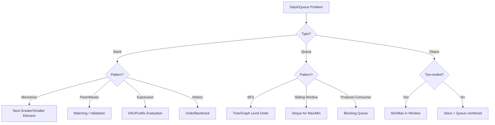
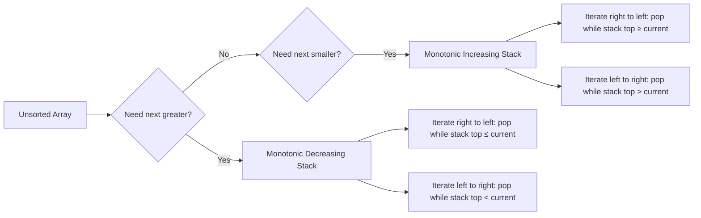

# Chapter 04: Stacks & Queues

> Stacks and queues are fundamental linear data structures that enforce specific ordering rules — LIFO for stacks and FIFO for queues. They power everything from expression evaluation to breadth-first search.

## Learning Objectives

- Understand LIFO (Stack) and FIFO (Queue) principles and their applications
- Master monotonic stack technique for next greater/smaller element problems
- Implement stack-based algorithms for expression parsing and evaluation
- Use queues and deques for sliding window problems
- Handle browser history, undo/redo, and BFS traversal patterns

## Problem Classification Flow



## Monotonic Stack Pattern



## Complexity Patterns

```xychart-beta
    title "Stack/Queue Operation Costs"
    x-axis ["Push", "Pop", "Peek", "Get Min", "Enqueue", "Dequeue"]
    y-axis "Time (lower is better)" 0 --> 10
    bar [2, 2, 2, 8, 2, 2]
```

---

## Easy Problems (7)

---

### Problem 1: Valid Parentheses

<a href="../../../assets/images/diagrams/coding-problems/04-stacks-queues/problem-1-valid-parentheses-handwritten.svg" target="_blank" rel="noopener">
  
</a>
<a href="../../../assets/images/diagrams/coding-problems/04-stacks-queues/problem-1-valid-parentheses-diagram.svg" target="_blank" rel="noopener">
  
</a>
<a href="../../../assets/images/diagrams/coding-problems/04-stacks-queues/problem-1-valid-parentheses-sticky.svg" target="_blank" rel="noopener">
  
</a>

🏷️ **Companies:** [Amazon] [Google] [Meta] [Microsoft] [Apple]
📊 **Difficulty:** Easy
📂 **Topics:** [Stack, String]

**Problem:** Given a string containing '(', ')', '{', '}', '[' and ']', determine if the input string is valid.

**Example 1:**
```
Input: s = "()[]{}"
Output: true
```

**Constraints:**
- 1 ≤ s.length ≤ 10⁴

```typescript
function isValid(s: string): boolean {
  const stack: string[] = [];
  const pairs: Record<string, string> = {
    ')': '(', '}': '{', ']': '['
  };

  for (const ch of s) {
    if (ch === '(' || ch === '{' || ch === '[') {
      stack.push(ch);
    } else {
      if (stack.pop() !== pairs[ch]) return false;
    }
  }

  return stack.length === 0;
}
```

**Test Cases:**
```typescript
console.log(isValid("()")); // true
console.log(isValid("()[]{}")); // true
console.log(isValid("(]")); // false
console.log(isValid("([)]")); // false
console.log(isValid("{[]}")); // true
```

**Time Complexity:** O(n)
**Space Complexity:** O(n)

---

### Problem 2: Min Stack

<a href="../../../assets/images/diagrams/coding-problems/04-stacks-queues/problem-2-min-stack-handwritten.svg" target="_blank" rel="noopener">
  
</a>
<a href="../../../assets/images/diagrams/coding-problems/04-stacks-queues/problem-2-min-stack-diagram.svg" target="_blank" rel="noopener">
  
</a>
<a href="../../../assets/images/diagrams/coding-problems/04-stacks-queues/problem-2-min-stack-sticky.svg" target="_blank" rel="noopener">
  
</a>

🏷️ **Companies:** [Amazon] [Google] [Meta] [Microsoft] [Apple]
📊 **Difficulty:** Easy
📂 **Topics:** [Stack, Design]

**Problem:** Design a stack that supports push, pop, top, and retrieving the minimum element in O(1) time.

**Example 1:**
```
Input: ["MinStack","push","push","push","getMin","pop","top","getMin"]
       [[],[-2],[0],[-3],[],[],[],[]]
Output: [null,null,null,null,-3,null,0,-2]
```

**Solution Approach:**
- Keep a second stack that tracks the minimum at each level.

```typescript
class MinStack {
  private stack: number[];
  private minStack: number[];

  constructor() {
    this.stack = [];
    this.minStack = [];
  }

  push(val: number): void {
    this.stack.push(val);
    if (this.minStack.length === 0 || val <= this.minStack[this.minStack.length - 1]) {
      this.minStack.push(val);
    }
  }

  pop(): void {
    const val = this.stack.pop();
    if (val === this.minStack[this.minStack.length - 1]) {
      this.minStack.pop();
    }
  }

  top(): number {
    return this.stack[this.stack.length - 1];
  }

  getMin(): number {
    return this.minStack[this.minStack.length - 1];
  }
}
```

**Test Cases:**
```typescript
const minStack = new MinStack();
minStack.push(-2);
minStack.push(0);
minStack.push(-3);
console.log(minStack.getMin()); // -3
minStack.pop();
console.log(minStack.top()); // 0
console.log(minStack.getMin()); // -2
```

**Time Complexity:** O(1) for all operations
**Space Complexity:** O(n)

---

### Problem 3: Implement Queue using Stacks

<a href="../../../assets/images/diagrams/coding-problems/04-stacks-queues/problem-3-implement-queue-using-stacks-handwritten.svg" target="_blank" rel="noopener">
  
</a>
<a href="../../../assets/images/diagrams/coding-problems/04-stacks-queues/problem-3-implement-queue-using-stacks-diagram.svg" target="_blank" rel="noopener">
  
</a>
<a href="../../../assets/images/diagrams/coding-problems/04-stacks-queues/problem-3-implement-queue-using-stacks-sticky.svg" target="_blank" rel="noopener">
  
</a>

🏷️ **Companies:** [Amazon] [Google] [Microsoft] [Meta]
📊 **Difficulty:** Easy
📂 **Topics:** [Stack, Queue, Design]

**Problem:** Implement a FIFO queue using two stacks.

**Example 1:**
```
Input: ["MyQueue","push","push","peek","pop","empty"]
       [[],[1],[2],[],[],[]]
Output: [null,null,null,1,1,false]
```

```typescript
class MyQueue {
  private input: number[];
  private output: number[];

  constructor() {
    this.input = [];
    this.output = [];
  }

  push(x: number): void {
    this.input.push(x);
  }

  pop(): number {
    this.peek();
    return this.output.pop()!;
  }

  peek(): number {
    if (this.output.length === 0) {
      while (this.input.length > 0) {
        this.output.push(this.input.pop()!);
      }
    }
    return this.output[this.output.length - 1];
  }

  empty(): boolean {
    return this.input.length === 0 && this.output.length === 0;
  }
}
```

**Test Cases:**
```typescript
const q = new MyQueue();
q.push(1);
q.push(2);
console.log(q.peek()); // 1
console.log(q.pop()); // 1
console.log(q.empty()); // false
```

**Time Complexity:** O(1) amortized for pop/peek
**Space Complexity:** O(n)

---

### Problem 4: Baseball Game

<a href="../../../assets/images/diagrams/coding-problems/04-stacks-queues/problem-4-baseball-game-handwritten.svg" target="_blank" rel="noopener">
  
</a>
<a href="../../../assets/images/diagrams/coding-problems/04-stacks-queues/problem-4-baseball-game-diagram.svg" target="_blank" rel="noopener">
  
</a>
<a href="../../../assets/images/diagrams/coding-problems/04-stacks-queues/problem-4-baseball-game-sticky.svg" target="_blank" rel="noopener">
  
</a>

🏷️ **Companies:** [Amazon] [Google]
📊 **Difficulty:** Easy
📂 **Topics:** [Stack, Array]

**Problem:** You are keeping score. Operations: integer (record), '+' (sum of last two), 'D' (double last), 'C' (remove last). Return sum of all scores.

**Example 1:**
```
Input: ops = ["5", "2", "C", "D", "+"]
Output: 30
Explanation: 5 → 5,2 → 5, → 5,10 → 5,10,15 = 30
```

```typescript
function calPoints(ops: string[]): number {
  const stack: number[] = [];

  for (const op of ops) {
    switch (op) {
      case '+':
        stack.push(stack[stack.length - 1] + stack[stack.length - 2]);
        break;
      case 'D':
        stack.push(stack[stack.length - 1] * 2);
        break;
      case 'C':
        stack.pop();
        break;
      default:
        stack.push(parseInt(op));
    }
  }

  return stack.reduce((sum, val) => sum + val, 0);
}
```

**Test Cases:**
```typescript
console.log(calPoints(["5", "2", "C", "D", "+"])); // 30
console.log(calPoints(["5", "-2", "4", "C", "D", "9", "+", "+"])); // 27
```

**Time Complexity:** O(n)
**Space Complexity:** O(n)

---

### Problem 5: Backspace String Compare

<a href="../../../assets/images/diagrams/coding-problems/04-stacks-queues/problem-5-backspace-string-compare-handwritten.svg" target="_blank" rel="noopener">
  
</a>
<a href="../../../assets/images/diagrams/coding-problems/04-stacks-queues/problem-5-backspace-string-compare-diagram.svg" target="_blank" rel="noopener">
  
</a>
<a href="../../../assets/images/diagrams/coding-problems/04-stacks-queues/problem-5-backspace-string-compare-sticky.svg" target="_blank" rel="noopener">
  
</a>

🏷️ **Companies:** [Amazon] [Google] [Microsoft]
📊 **Difficulty:** Easy
📂 **Topics:** [Stack, Two Pointers]

**Problem:** Given two strings where '#' represents backspace, return true if they're equal when typed into an empty text editor.

**Example 1:**
```
Input: s = "ab#c", t = "ad#c"
Output: true
Explanation: Both become "ac".
```

**Solution Approach:**
- **Stack:** Process each string with a stack, popping on '#'. Time O(n), Space O(n).
- **Optimal (Two Pointers):** Process from right to left, skip characters after '#'.

```typescript
function backspaceCompare(s: string, t: string): boolean {
  const build = (str: string): string => {
    const stack: string[] = [];
    for (const ch of str) {
      if (ch === '#') {
        stack.pop();
      } else {
        stack.push(ch);
      }
    }
    return stack.join('');
  };

  return build(s) === build(t);
}
```

**Test Cases:**
```typescript
console.log(backspaceCompare("ab#c", "ad#c")); // true
console.log(backspaceCompare("ab##", "c#d#")); // true
console.log(backspaceCompare("a#c", "b")); // false
```

**Time Complexity:** O(n + m)
**Space Complexity:** O(n + m)

---

### Problem 6: Remove All Adjacent Duplicates In String

<a href="../../../assets/images/diagrams/coding-problems/04-stacks-queues/problem-6-remove-all-adjacent-duplicates-in-string-handwritten.svg" target="_blank" rel="noopener">
  
</a>
<a href="../../../assets/images/diagrams/coding-problems/04-stacks-queues/problem-6-remove-all-adjacent-duplicates-in-string-diagram.svg" target="_blank" rel="noopener">
  
</a>
<a href="../../../assets/images/diagrams/coding-problems/04-stacks-queues/problem-6-remove-all-adjacent-duplicates-in-string-sticky.svg" target="_blank" rel="noopener">
  
</a>

🏷️ **Companies:** [Amazon] [Google]
📊 **Difficulty:** Easy
📂 **Topics:** [Stack, String]

**Problem:** Repeatedly remove adjacent duplicate characters until no more duplicates exist.

**Example 1:**
```
Input: s = "abbaca"
Output: "ca"
Explanation: "abbaca" → "aaca" → "ca"
```

```typescript
function removeDuplicates(s: string): string {
  const stack: string[] = [];

  for (const ch of s) {
    if (stack.length > 0 && stack[stack.length - 1] === ch) {
      stack.pop();
    } else {
      stack.push(ch);
    }
  }

  return stack.join('');
}
```

**Test Cases:**
```typescript
console.log(removeDuplicates("abbaca")); // "ca"
console.log(removeDuplicates("azxxzy")); // "ay"
console.log(removeDuplicates("a")); // "a"
```

**Time Complexity:** O(n)
**Space Complexity:** O(n)

---

### Problem 7: Next Greater Element I

<a href="../../../assets/images/diagrams/coding-problems/04-stacks-queues/problem-7-next-greater-element-i-handwritten.svg" target="_blank" rel="noopener">
  
</a>
<a href="../../../assets/images/diagrams/coding-problems/04-stacks-queues/problem-7-next-greater-element-i-diagram.svg" target="_blank" rel="noopener">
  
</a>
<a href="../../../assets/images/diagrams/coding-problems/04-stacks-queues/problem-7-next-greater-element-i-sticky.svg" target="_blank" rel="noopener">
  
</a>

🏷️ **Companies:** [Amazon] [Google] [Meta]
📊 **Difficulty:** Easy
📂 **Topics:** [Stack, Hash Table]

**Problem:** Find the next greater element for each element in nums1 from nums2.

**Example 1:**
```
Input: nums1 = [4, 1, 2], nums2 = [1, 3, 4, 2]
Output: [-1, 3, -1]
```

**Solution Approach:**
- Monotonic stack + hash map. Process nums2 left to right, maintain decreasing stack.

```typescript
function nextGreaterElement(nums1: number[], nums2: number[]): number[] {
  const map = new Map<number, number>();
  const stack: number[] = [];

  for (const num of nums2) {
    while (stack.length > 0 && stack[stack.length - 1] < num) {
      map.set(stack.pop()!, num);
    }
    stack.push(num);
  }

  return nums1.map(n => map.get(n) ?? -1);
}
```

**Test Cases:**
```typescript
console.log(nextGreaterElement([4, 1, 2], [1, 3, 4, 2])); // [-1, 3, -1]
console.log(nextGreaterElement([2, 4], [1, 2, 3, 4])); // [3, -1]
```

**Time Complexity:** O(n + m)
**Space Complexity:** O(m)

---

## Medium Problems (10)

---

### Problem 8: Next Greater Element II

<a href="../../../assets/images/diagrams/coding-problems/04-stacks-queues/problem-8-next-greater-element-ii-handwritten.svg" target="_blank" rel="noopener">
  
</a>
<a href="../../../assets/images/diagrams/coding-problems/04-stacks-queues/problem-8-next-greater-element-ii-diagram.svg" target="_blank" rel="noopener">
  
</a>
<a href="../../../assets/images/diagrams/coding-problems/04-stacks-queues/problem-8-next-greater-element-ii-sticky.svg" target="_blank" rel="noopener">
  
</a>

🏷️ **Companies:** [Amazon] [Google] [Meta]
📊 **Difficulty:** Medium
📂 **Topics:** [Stack, Array]

**Problem:** Given a circular array, find the next greater element for each element.

**Example 1:**
```
Input: nums = [1, 2, 1]
Output: [2, -1, 2]
```

**Solution Approach:**
- Iterate twice (2n) with modulo index. Monotonic stack.

```typescript
function nextGreaterElements(nums: number[]): number[] {
  const n = nums.length;
  const result = new Array(n).fill(-1);
  const stack: number[] = [];

  for (let i = 0; i < 2 * n; i++) {
    const idx = i % n;
    while (stack.length > 0 && nums[stack[stack.length - 1]] < nums[idx]) {
      result[stack.pop()!] = nums[idx];
    }
    if (i < n) stack.push(idx);
  }

  return result;
}
```

**Test Cases:**
```typescript
console.log(nextGreaterElements([1, 2, 1])); // [2, -1, 2]
console.log(nextGreaterElements([1, 2, 3, 4, 3])); // [2, 3, 4, -1, 4]
```

**Time Complexity:** O(n)
**Space Complexity:** O(n)

---

### Problem 9: Daily Temperatures

<a href="../../../assets/images/diagrams/coding-problems/04-stacks-queues/problem-9-daily-temperatures-handwritten.svg" target="_blank" rel="noopener">
  
</a>
<a href="../../../assets/images/diagrams/coding-problems/04-stacks-queues/problem-9-daily-temperatures-diagram.svg" target="_blank" rel="noopener">
  
</a>
<a href="../../../assets/images/diagrams/coding-problems/04-stacks-queues/problem-9-daily-temperatures-sticky.svg" target="_blank" rel="noopener">
  
</a>

🏷️ **Companies:** [Amazon] [Google] [Meta] [Microsoft]
📊 **Difficulty:** Medium
📂 **Topics:** [Stack, Array, Monotonic Stack]

**Problem:** Given an array of temperatures, return an array such that answer[i] is the number of days until a warmer temperature.

**Example 1:**
```
Input: temperatures = [73, 74, 75, 71, 69, 72, 76, 73]
Output: [1, 1, 4, 2, 1, 1, 0, 0]
```

**Solution Approach:**
- Monotonic decreasing stack storing indices.

```typescript
function dailyTemperatures(temperatures: number[]): number[] {
  const n = temperatures.length;
  const result = new Array(n).fill(0);
  const stack: number[] = [];

  for (let i = 0; i < n; i++) {
    while (stack.length > 0 && temperatures[stack[stack.length - 1]] < temperatures[i]) {
      const idx = stack.pop()!;
      result[idx] = i - idx;
    }
    stack.push(i);
  }

  return result;
}
```

**Test Cases:**
```typescript
console.log(dailyTemperatures([73, 74, 75, 71, 69, 72, 76, 73]));
// [1, 1, 4, 2, 1, 1, 0, 0]
console.log(dailyTemperatures([30, 40, 50, 60])); // [1, 1, 1, 0]
```

**Time Complexity:** O(n)
**Space Complexity:** O(n)

---

### Problem 10: Evaluate Reverse Polish Notation

<a href="../../../assets/images/diagrams/coding-problems/04-stacks-queues/problem-10-evaluate-reverse-polish-notation-handwritten.svg" target="_blank" rel="noopener">
  
</a>
<a href="../../../assets/images/diagrams/coding-problems/04-stacks-queues/problem-10-evaluate-reverse-polish-notation-diagram.svg" target="_blank" rel="noopener">
  
</a>
<a href="../../../assets/images/diagrams/coding-problems/04-stacks-queues/problem-10-evaluate-reverse-polish-notation-sticky.svg" target="_blank" rel="noopener">
  
</a>

🏷️ **Companies:** [Amazon] [Google] [Meta] [Microsoft]
📊 **Difficulty:** Medium
📂 **Topics:** [Stack, Math]

**Problem:** Evaluate the value of an arithmetic expression in Reverse Polish Notation.

**Example 1:**
```
Input: tokens = ["2", "1", "+", "3", "*"]
Output: 9
Explanation: (2 + 1) * 3 = 9
```

**Constraints:**
- 1 ≤ tokens.length ≤ 10⁴

```typescript
function evalRPN(tokens: string[]): number {
  const stack: number[] = [];

  for (const token of tokens) {
    if (token === '+' || token === '-' || token === '*' || token === '/') {
      const b = stack.pop()!;
      const a = stack.pop()!;
      switch (token) {
        case '+': stack.push(a + b); break;
        case '-': stack.push(a - b); break;
        case '*': stack.push(a * b); break;
        case '/': stack.push(Math.trunc(a / b)); break;
      }
    } else {
      stack.push(parseInt(token));
    }
  }

  return stack[0];
}
```

**Test Cases:**
```typescript
console.log(evalRPN(["2", "1", "+", "3", "*"])); // 9
console.log(evalRPN(["4", "13", "5", "/", "+"])); // 6
console.log(evalRPN(["10", "6", "9", "3", "+", "-11", "*", "/", "*", "17", "+", "5", "+"]));
// 22
```

**Time Complexity:** O(n)
**Space Complexity:** O(n)

---

### Problem 11: Decode String

<a href="../../../assets/images/diagrams/coding-problems/04-stacks-queues/problem-11-decode-string-handwritten.svg" target="_blank" rel="noopener">
  
</a>
<a href="../../../assets/images/diagrams/coding-problems/04-stacks-queues/problem-11-decode-string-diagram.svg" target="_blank" rel="noopener">
  
</a>
<a href="../../../assets/images/diagrams/coding-problems/04-stacks-queues/problem-11-decode-string-sticky.svg" target="_blank" rel="noopener">
  
</a>

🏷️ **Companies:** [Amazon] [Google] [Meta] [Microsoft]
📊 **Difficulty:** Medium
📂 **Topics:** [Stack, String, Recursion]

**Problem:** Decode a string encoded as k[encoded_string]. E.g., "3[a]2[bc]" → "aaabcbc".

**Example 1:**
```
Input: s = "3[a]2[bc]"
Output: "aaabcbc"
```

**Constraints:**
- 1 ≤ s.length ≤ 30

```typescript
function decodeString(s: string): string {
  const countStack: number[] = [];
  const strStack: string[] = [];
  let currStr = '';
  let currNum = 0;

  for (const ch of s) {
    if (ch >= '0' && ch <= '9') {
      currNum = currNum * 10 + parseInt(ch);
    } else if (ch === '[') {
      countStack.push(currNum);
      strStack.push(currStr);
      currNum = 0;
      currStr = '';
    } else if (ch === ']') {
      const repeat = countStack.pop()!;
      currStr = strStack.pop()! + currStr.repeat(repeat);
    } else {
      currStr += ch;
    }
  }

  return currStr;
}
```

**Test Cases:**
```typescript
console.log(decodeString("3[a]2[bc]")); // "aaabcbc"
console.log(decodeString("3[a2[c]]")); // "accaccacc"
console.log(decodeString("2[abc]3[cd]ef")); // "abcabccdcdcdef"
```

**Time Complexity:** O(n)
**Space Complexity:** O(n)

---

### Problem 12: Asteroid Collision

<a href="../../../assets/images/diagrams/coding-problems/04-stacks-queues/problem-12-asteroid-collision-handwritten.svg" target="_blank" rel="noopener">
  
</a>
<a href="../../../assets/images/diagrams/coding-problems/04-stacks-queues/problem-12-asteroid-collision-diagram.svg" target="_blank" rel="noopener">
  
</a>
<a href="../../../assets/images/diagrams/coding-problems/04-stacks-queues/problem-12-asteroid-collision-sticky.svg" target="_blank" rel="noopener">
  
</a>

🏷️ **Companies:** [Amazon] [Google] [Meta]
📊 **Difficulty:** Medium
📂 **Topics:** [Stack, Array]

**Problem:** We are given an array asteroids of integers representing asteroids in a row. The absolute value represents its size, and the sign represents its direction (positive = right, negative = left). Find out the state of the asteroids after all collisions.

**Example 1:**
```
Input: asteroids = [5, 10, -5]
Output: [5, 10]
```

**Constraints:**
- 2 ≤ asteroids.length ≤ 10⁴

```typescript
function asteroidCollision(asteroids: number[]): number[] {
  const stack: number[] = [];

  for (const ast of asteroids) {
    let alive = true;
    while (alive && ast < 0 && stack.length > 0 && stack[stack.length - 1] > 0) {
      const top = stack[stack.length - 1];
      if (top < -ast) {
        stack.pop();
      } else if (top === -ast) {
        stack.pop();
        alive = false;
      } else {
        alive = false;
      }
    }
    if (alive) stack.push(ast);
  }

  return stack;
}
```

**Test Cases:**
```typescript
console.log(asteroidCollision([5, 10, -5])); // [5, 10]
console.log(asteroidCollision([8, -8])); // []
console.log(asteroidCollision([10, 2, -5])); // [10]
```

**Time Complexity:** O(n)
**Space Complexity:** O(n)

---

### Problem 13: Online Stock Span

<a href="../../../assets/images/diagrams/coding-problems/04-stacks-queues/problem-13-online-stock-span-handwritten.svg" target="_blank" rel="noopener">
  
</a>
<a href="../../../assets/images/diagrams/coding-problems/04-stacks-queues/problem-13-online-stock-span-diagram.svg" target="_blank" rel="noopener">
  
</a>
<a href="../../../assets/images/diagrams/coding-problems/04-stacks-queues/problem-13-online-stock-span-sticky.svg" target="_blank" rel="noopener">
  
</a>

🏷️ **Companies:** [Amazon] [Google]
📊 **Difficulty:** Medium
📂 **Topics:** [Stack, Monotonic Stack, Design]

**Problem:** Design a class that returns the number of consecutive days (including today) the stock price has been less than or equal to today's price.

**Example 1:**
```
Input: ["StockSpanner","next","next","next","next","next"]
       [[],[100],[80],[60],[70],[60],[75],[85]]
Output: [null,1,1,1,2,1,4,6]
```

```typescript
class StockSpanner {
  private stack: [number, number][]; // [price, span]

  constructor() {
    this.stack = [];
  }

  next(price: number): number {
    let span = 1;
    while (this.stack.length > 0 && this.stack[this.stack.length - 1][0] <= price) {
      span += this.stack.pop()![1];
    }
    this.stack.push([price, span]);
    return span;
  }
}
```

**Test Cases:**
```typescript
const spanner = new StockSpanner();
console.log(spanner.next(100)); // 1
console.log(spanner.next(80)); // 1
console.log(spanner.next(60)); // 1
console.log(spanner.next(70)); // 2
console.log(spanner.next(60)); // 1
console.log(spanner.next(75)); // 4
console.log(spanner.next(85)); // 6
```

**Time Complexity:** O(1) amortized
**Space Complexity:** O(n)

---

### Problem 14: Remove K Digits

<a href="../../../assets/images/diagrams/coding-problems/04-stacks-queues/problem-14-remove-k-digits-handwritten.svg" target="_blank" rel="noopener">
  
</a>
<a href="../../../assets/images/diagrams/coding-problems/04-stacks-queues/problem-14-remove-k-digits-diagram.svg" target="_blank" rel="noopener">
  
</a>
<a href="../../../assets/images/diagrams/coding-problems/04-stacks-queues/problem-14-remove-k-digits-sticky.svg" target="_blank" rel="noopener">
  
</a>

🏷️ **Companies:** [Amazon] [Google] [Meta] [Microsoft]
📊 **Difficulty:** Medium
📂 **Topics:** [Stack, Greedy]

**Problem:** Given a string num representing a non-negative integer, and an integer k, return the smallest possible integer after removing k digits.

**Example 1:**
```
Input: num = "1432219", k = 3
Output: "1219"
```

**Constraints:**
- 1 ≤ num.length ≤ 10⁵
- 0 ≤ k ≤ num.length

**Solution Approach:**
- Use a stack as a monotonic increasing sequence. Remove when top > current digit.

```typescript
function removeKdigits(num: string, k: number): string {
  const stack: string[] = [];

  for (const digit of num) {
    while (k > 0 && stack.length > 0 && stack[stack.length - 1] > digit) {
      stack.pop();
      k--;
    }
    stack.push(digit);
  }

  while (k > 0) {
    stack.pop();
    k--;
  }

  const result = stack.join('').replace(/^0+/, '');
  return result || '0';
}
```

**Test Cases:**
```typescript
console.log(removeKdigits("1432219", 3)); // "1219"
console.log(removeKdigits("10200", 1)); // "200"
console.log(removeKdigits("10", 2)); // "0"
```

**Time Complexity:** O(n)
**Space Complexity:** O(n)

---

### Problem 15: Simplify Path

<a href="../../../assets/images/diagrams/coding-problems/04-stacks-queues/problem-15-simplify-path-handwritten.svg" target="_blank" rel="noopener">
  
</a>
<a href="../../../assets/images/diagrams/coding-problems/04-stacks-queues/problem-15-simplify-path-diagram.svg" target="_blank" rel="noopener">
  
</a>
<a href="../../../assets/images/diagrams/coding-problems/04-stacks-queues/problem-15-simplify-path-sticky.svg" target="_blank" rel="noopener">
  
</a>

🏷️ **Companies:** [Amazon] [Google] [Meta]
📊 **Difficulty:** Medium
📂 **Topics:** [Stack, String]

**Problem:** Given an absolute path for a Unix-style file system, simplify it.

**Example 1:**
```
Input: path = "/home//foo/"
Output: "/home/foo"
```

**Constraints:**
- 1 ≤ path.length ≤ 3000

```typescript
function simplifyPath(path: string): string {
  const stack: string[] = [];
  const parts = path.split('/');

  for (const part of parts) {
    if (part === '..') {
      stack.pop();
    } else if (part && part !== '.') {
      stack.push(part);
    }
  }

  return '/' + stack.join('/');
}
```

**Test Cases:**
```typescript
console.log(simplifyPath("/home//foo/")); // "/home/foo"
console.log(simplifyPath("/a/./b/../../c/")); // "/c"
console.log(simplifyPath("/../")); // "/"
```

**Time Complexity:** O(n)
**Space Complexity:** O(n)

---

### Problem 16: Validate Stack Sequences

<a href="../../../assets/images/diagrams/coding-problems/04-stacks-queues/problem-16-validate-stack-sequences-handwritten.svg" target="_blank" rel="noopener">
  
</a>
<a href="../../../assets/images/diagrams/coding-problems/04-stacks-queues/problem-16-validate-stack-sequences-diagram.svg" target="_blank" rel="noopener">
  
</a>
<a href="../../../assets/images/diagrams/coding-problems/04-stacks-queues/problem-16-validate-stack-sequences-sticky.svg" target="_blank" rel="noopener">
  
</a>

🏷️ **Companies:** [Amazon] [Google] [Meta]
📊 **Difficulty:** Medium
📂 **Topics:** [Stack, Simulation]

**Problem:** Given pushed and popped sequences, return true if they represent valid push/pop operations on an initially empty stack.

**Example 1:**
```
Input: pushed = [1, 2, 3, 4, 5], popped = [4, 5, 3, 2, 1]
Output: true
```

```typescript
function validateStackSequences(pushed: number[], popped: number[]): boolean {
  const stack: number[] = [];
  let i = 0;

  for (const val of pushed) {
    stack.push(val);
    while (stack.length > 0 && stack[stack.length - 1] === popped[i]) {
      stack.pop();
      i++;
    }
  }

  return i === popped.length;
}
```

**Test Cases:**
```typescript
console.log(validateStackSequences([1, 2, 3, 4, 5], [4, 5, 3, 2, 1])); // true
console.log(validateStackSequences([1, 2, 3, 4, 5], [4, 3, 5, 1, 2])); // false
```

**Time Complexity:** O(n)
**Space Complexity:** O(n)

---

### Problem 17: Flatten Nested List Iterator

<a href="../../../assets/images/diagrams/coding-problems/04-stacks-queues/problem-17-flatten-nested-list-iterator-handwritten.svg" target="_blank" rel="noopener">
  
</a>
<a href="../../../assets/images/diagrams/coding-problems/04-stacks-queues/problem-17-flatten-nested-list-iterator-diagram.svg" target="_blank" rel="noopener">
  
</a>
<a href="../../../assets/images/diagrams/coding-problems/04-stacks-queues/problem-17-flatten-nested-list-iterator-sticky.svg" target="_blank" rel="noopener">
  
</a>

🏷️ **Companies:** [Amazon] [Google] [Meta]
📊 **Difficulty:** Medium
📂 **Topics:** [Stack, Design, Recursion]

**Problem:** Design an iterator that flattens a nested list of integers.

**Example 1:**
```
Input: nestedList = [[1, 1], 2, [1, 1]]
Output: [1, 1, 2, 1, 1]
```

```typescript
class NestedIterator {
  private stack: { list: number[]; index: number }[];

  constructor(nestedList: number[][]) {
    this.stack = [{ list: nestedList.flat(), index: 0 }];
  }

  hasNext(): boolean {
    return this.stack.length > 0 && this.stack[0].index < this.stack[0].list.length;
  }

  next(): number {
    const current = this.stack[this.stack.length - 1];
    return current.list[current.index++];
  }
}
```

**Time Complexity:** O(n) for construction, O(1) per operation
**Space Complexity:** O(n)

---

## Hard Problems (3)

---

### Problem 18: Largest Rectangle in Histogram

<a href="../../../assets/images/diagrams/coding-problems/04-stacks-queues/problem-18-largest-rectangle-in-histogram-handwritten.svg" target="_blank" rel="noopener">
  
</a>
<a href="../../../assets/images/diagrams/coding-problems/04-stacks-queues/problem-18-largest-rectangle-in-histogram-diagram.svg" target="_blank" rel="noopener">
  
</a>
<a href="../../../assets/images/diagrams/coding-problems/04-stacks-queues/problem-18-largest-rectangle-in-histogram-sticky.svg" target="_blank" rel="noopener">
  
</a>

🏷️ **Companies:** [Amazon] [Google] [Meta] [Microsoft] [Apple]
📊 **Difficulty:** Hard
📂 **Topics:** [Stack, Array, Monotonic Stack]

**Problem:** Given an array of heights representing a histogram, find the largest rectangle area.

**Example 1:**
```
Input: heights = [2, 1, 5, 6, 2, 3]
Output: 10
```

**Constraints:**
- 1 ≤ heights.length ≤ 10⁵
- 0 ≤ heights[i] ≤ 10⁴

**Solution Approach:**
- Monotonic increasing stack. For each bar, compute area using it as the shortest bar.

```typescript
function largestRectangleArea(heights: number[]): number {
  const stack: number[] = [];
  let maxArea = 0;
  heights.push(0); // sentinel

  for (let i = 0; i < heights.length; i++) {
    while (stack.length > 0 && heights[stack[stack.length - 1]] > heights[i]) {
      const h = heights[stack.pop()!];
      const w = stack.length === 0 ? i : i - stack[stack.length - 1] - 1;
      maxArea = Math.max(maxArea, h * w);
    }
    stack.push(i);
  }

  return maxArea;
}
```

**Test Cases:**
```typescript
console.log(largestRectangleArea([2, 1, 5, 6, 2, 3])); // 10
console.log(largestRectangleArea([2, 4])); // 4
console.log(largestRectangleArea([1])); // 1
```

**Time Complexity:** O(n)
**Space Complexity:** O(n)

---

### Problem 19: Sliding Window Maximum

<a href="../../../assets/images/diagrams/coding-problems/04-stacks-queues/problem-19-sliding-window-maximum-handwritten.svg" target="_blank" rel="noopener">
  
</a>
<a href="../../../assets/images/diagrams/coding-problems/04-stacks-queues/problem-19-sliding-window-maximum-diagram.svg" target="_blank" rel="noopener">
  
</a>
<a href="../../../assets/images/diagrams/coding-problems/04-stacks-queues/problem-19-sliding-window-maximum-sticky.svg" target="_blank" rel="noopener">
  
</a>

🏷️ **Companies:** [Amazon] [Google] [Meta] [Microsoft] [Apple]
📊 **Difficulty:** Hard
📂 **Topics:** [Queue, Deque, Sliding Window]

**Problem:** You are given an array of integers nums, and a sliding window of size k moving from left to right. Return the max in each window.

**Example 1:**
```
Input: nums = [1, 3, -1, -3, 5, 3, 6, 7], k = 3
Output: [3, 3, 5, 5, 6, 7]
```

**Constraints:**
- 1 ≤ nums.length ≤ 10⁵
- 1 ≤ k ≤ nums.length

**Solution Approach:**
- Use a deque storing indices. Maintain decreasing order. Remove out-of-window indices.

```typescript
function maxSlidingWindow(nums: number[], k: number): number[] {
  const result: number[] = [];
  const deque: number[] = []; // store indices, decreasing values

  for (let i = 0; i < nums.length; i++) {
    while (deque.length > 0 && deque[0] <= i - k) {
      deque.shift();
    }

    while (deque.length > 0 && nums[deque[deque.length - 1]] < nums[i]) {
      deque.pop();
    }

    deque.push(i);

    if (i >= k - 1) {
      result.push(nums[deque[0]]);
    }
  }

  return result;
}
```

**Test Cases:**
```typescript
console.log(maxSlidingWindow([1, 3, -1, -3, 5, 3, 6, 7], 3));
// [3, 3, 5, 5, 6, 7]
console.log(maxSlidingWindow([1], 1)); // [1]
console.log(maxSlidingWindow([1, -1], 1)); // [1, -1]
```

**Time Complexity:** O(n)
**Space Complexity:** O(k)

---

### Problem 20: Trapping Rain Water II

<a href="../../../assets/images/diagrams/coding-problems/04-stacks-queues/problem-20-trapping-rain-water-ii-handwritten.svg" target="_blank" rel="noopener">
  
</a>
<a href="../../../assets/images/diagrams/coding-problems/04-stacks-queues/problem-20-trapping-rain-water-ii-diagram.svg" target="_blank" rel="noopener">
  
</a>
<a href="../../../assets/images/diagrams/coding-problems/04-stacks-queues/problem-20-trapping-rain-water-ii-sticky.svg" target="_blank" rel="noopener">
  
</a>

🏷️ **Companies:** [Amazon] [Google] [Meta]
📊 **Difficulty:** Hard
📂 **Topics:** [Heap, BFS, Matrix]

**Problem:** Given an m x n matrix of heights, compute how much water it can trap after raining. Water flows to any of the four adjacent cells with lower height.

**Example 1:**
```
Input: heightMap = [[1,4,3,1,3,2],[3,2,1,3,2,4],[2,3,3,2,3,1]]
Output: 4
```

**Constraints:**
- 1 ≤ m, n ≤ 200

**Solution Approach:**
- Min-heap of boundary cells. Pop smallest, check neighbors, track water.

```typescript
function trapRainWater(heightMap: number[][]): number {
  const m = heightMap.length;
  const n = heightMap[0].length;
  if (m < 3 || n < 3) return 0;

  const visited = Array.from({ length: m }, () => new Array(n).fill(false));
  const heap: [number, number, number][] = []; // [height, row, col]

  for (let i = 0; i < m; i++) {
    for (let j = 0; j < n; j++) {
      if (i === 0 || i === m - 1 || j === 0 || j === n - 1) {
        heap.push([heightMap[i][j], i, j]);
        visited[i][j] = true;
      }
    }
  }

  heap.sort((a, b) => a[0] - b[0]);

  const dirs = [[0, 1], [0, -1], [1, 0], [-1, 0]];
  let water = 0;
  let maxBoundary = 0;

  while (heap.length > 0) {
    const [h, r, c] = heap.shift()!;
    maxBoundary = Math.max(maxBoundary, h);

    for (const [dr, dc] of dirs) {
      const nr = r + dr;
      const nc = c + dc;
      if (nr >= 0 && nr < m && nc >= 0 && nc < n && !visited[nr][nc]) {
        visited[nr][nc] = true;
        if (heightMap[nr][nc] < maxBoundary) {
          water += maxBoundary - heightMap[nr][nc];
        }
        heap.push([heightMap[nr][nc], nr, nc]);
      }
    }

    heap.sort((a, b) => a[0] - b[0]);
  }

  return water;
}
```

**Time Complexity:** O(m * n * log(m + n))
**Space Complexity:** O(m * n)

---

## Summary Table

| # | Problem | Difficulty | Companies | Time | Space |
|---|---------|-----------|-----------|------|-------|
| 1 | Valid Parentheses | Easy | Amazon, Google, Meta, Microsoft | O(n) | O(n) |
| 2 | Min Stack | Easy | Amazon, Google, Meta, Microsoft | O(1) | O(n) |
| 3 | Implement Queue using Stacks | Easy | Amazon, Google, Microsoft, Meta | O(1) amortized | O(n) |
| 4 | Baseball Game | Easy | Amazon, Google | O(n) | O(n) |
| 5 | Backspace String Compare | Easy | Amazon, Google, Microsoft | O(n+m) | O(n+m) |
| 6 | Remove Adjacent Duplicates | Easy | Amazon, Google | O(n) | O(n) |
| 7 | Next Greater Element I | Easy | Amazon, Google, Meta | O(n+m) | O(m) |
| 8 | Next Greater Element II | Medium | Amazon, Google, Meta | O(n) | O(n) |
| 9 | Daily Temperatures | Medium | Amazon, Google, Meta, Microsoft | O(n) | O(n) |
| 10 | Evaluate RPN | Medium | Amazon, Google, Meta, Microsoft | O(n) | O(n) |
| 11 | Decode String | Medium | Amazon, Google, Meta, Microsoft | O(n) | O(n) |
| 12 | Asteroid Collision | Medium | Amazon, Google, Meta | O(n) | O(n) |
| 13 | Online Stock Span | Medium | Amazon, Google | O(1) amortized | O(n) |
| 14 | Remove K Digits | Medium | Amazon, Google, Meta, Microsoft | O(n) | O(n) |
| 15 | Simplify Path | Medium | Amazon, Google, Meta | O(n) | O(n) |
| 16 | Validate Stack Sequences | Medium | Amazon, Google, Meta | O(n) | O(n) |
| 17 | Flatten Nested List Iterator | Medium | Amazon, Google, Meta | O(1) | O(n) |
| 18 | Largest Rectangle in Histogram | Hard | Amazon, Google, Meta, Microsoft | O(n) | O(n) |
| 19 | Sliding Window Maximum | Hard | Amazon, Google, Meta, Microsoft | O(n) | O(k) |
| 20 | Trapping Rain Water II | Hard | Amazon, Google, Meta | O(mn log(m+n)) | O(mn) |
