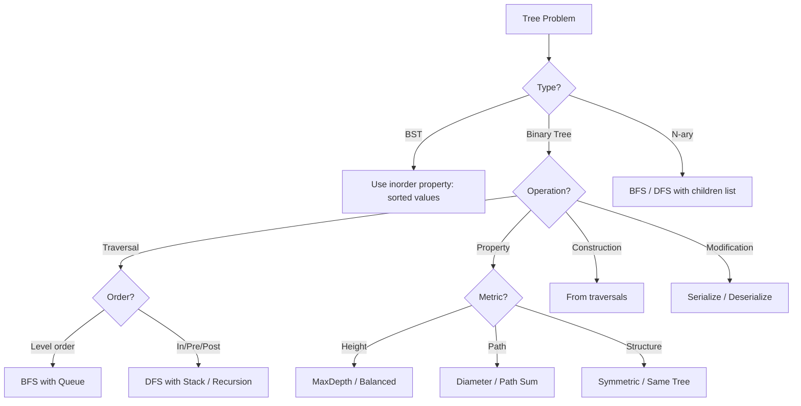
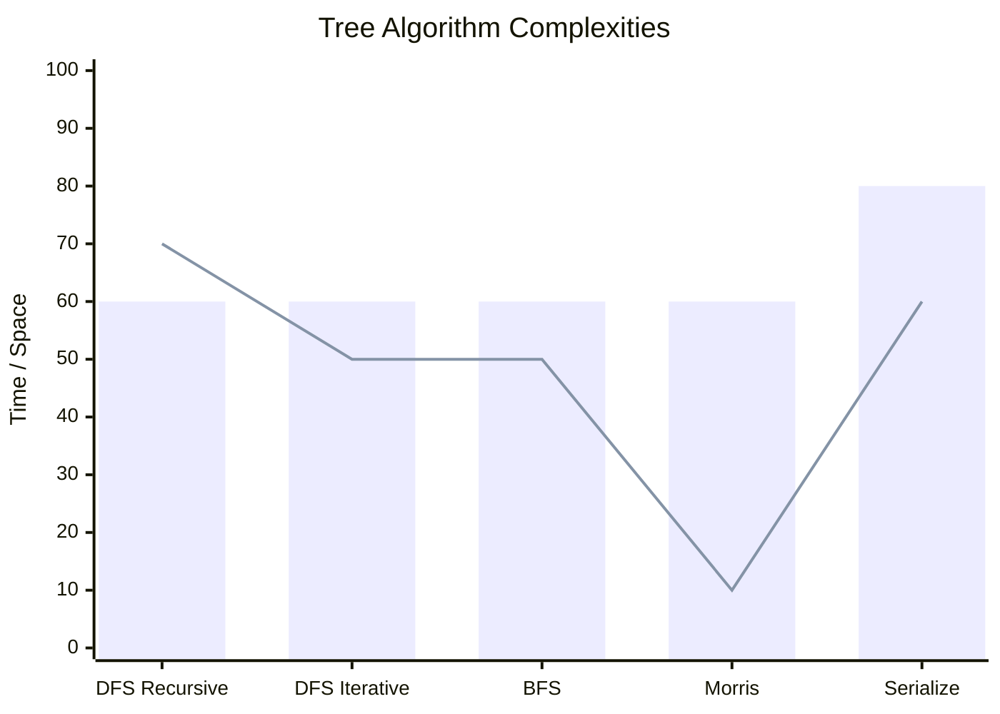

# Chapter 05: Trees

> Tree problems are among the most common interview topics. They test your understanding of recursion, BFS/DFS traversal, and data structure design. Mastering trees is essential for every software engineer.

## Learning Objectives

- Master tree traversals: inorder, preorder, postorder, level-order (BFS)
- Understand recursion depth and iterative approaches for tree problems
- Implement BST operations: insert, delete, search, validation
- Apply DFS/BFS to solve complex tree problems
- Handle serialization, deserialization, and tree construction from traversals
- Recognize patterns: lowest common ancestor, diameter, path sum, subtree

<!-- Image Gallery -->
<section class="lesson-visuals" aria-label="Visual learning resources">
  <header><span>VISUAL LEARNING</span><h2>See it. Review it. Remember it.</h2></header>
  <a class="lesson-visual-card" href="../../../assets/images/lessons/coding-problems/05-trees/handwritten-notes.svg" target="_blank" rel="noopener">
    
    <span><strong>Handwritten notes</strong>Condensed notes for deliberate review.</span>
  </a>
  <a class="lesson-visual-card" href="../../../assets/images/lessons/coding-problems/05-trees/sticky-notes.svg" target="_blank" rel="noopener">
    
    <span><strong>Sticky-note revision</strong>Fast recall prompts for revision.</span>
  </a>
  <a class="lesson-visual-card" href="../../../assets/images/lessons/coding-problems/05-trees/visual-explanation.svg" target="_blank" rel="noopener">
    
    <span><strong>Visual concept guide</strong>A connected explanation of the key ideas.</span>
  </a>
</section>
<!-- End Image Gallery -->

## Problem Classification Flow



## Tree Algorithm Patterns

```mermaid
mindmap
  root((Tree Patterns))
    DFS Traversals
      Inorder → sorted for BST
      Preorder → root first
      Postorder → children before parent
      Morris → O(1) space
    BFS Traversals
      Level order
      Zigzag level order
      Right side view
    BST Operations
      Insert / Delete
      Search / Validate
      Next / Floor / Ceil
    Path Problems
      Root-to-leaf sum
      Max path sum
      Diameter
    Construction
      From inorder+preorder
      From inorder+postorder
      Serialize / Deserialize
    LCA
      Binary Tree
      BST (simpler)
```

## Complexity Decision Matrix



---

## Easy Problems (10)

---

### Problem 1: Binary Tree Inorder Traversal

🏷️ **Companies:** [Amazon] [Google] [Meta] [Microsoft]
📊 **Difficulty:** Easy
📂 **Topics:** [Tree, Stack, Recursion]

**Problem:** Given the root of a binary tree, return the inorder traversal (left → root → right).

**Example 1:**
```
Input: root = [1, null, 2, 3]
Output: [1, 3, 2]
```

**Constraints:**
- 0 ≤ nodes ≤ 100

**Solution Approach:**
- **Recursive:** D → left, visit, right. Time O(n), Space O(h).
- **Iterative (Stack):** Push left, pop, visit, go right. Time O(n), Space O(h).

```typescript
class TreeNode {
  val: number;
  left: TreeNode | null;
  right: TreeNode | null;
  constructor(val?: number, left?: TreeNode | null, right?: TreeNode | null) {
    this.val = val ?? 0;
    this.left = left ?? null;
    this.right = right ?? null;
  }
}

function inorderTraversal(root: TreeNode | null): number[] {
  const result: number[] = [];
  const stack: TreeNode[] = [];
  let curr = root;

  while (curr || stack.length > 0) {
    while (curr) {
      stack.push(curr);
      curr = curr.left;
    }
    curr = stack.pop()!;
    result.push(curr.val);
    curr = curr.right;
  }

  return result;
}
```

**Test Cases:**
```typescript
function arrayToTree(arr: (number | null)[]): TreeNode | null {
  if (!arr.length || arr[0] === null) return null;
  const root = new TreeNode(arr[0]);
  const queue: TreeNode[] = [root];
  let i = 1;
  while (queue.length > 0 && i < arr.length) {
    const node = queue.shift()!;
    if (arr[i] !== null) {
      node.left = new TreeNode(arr[i] as number);
      queue.push(node.left);
    }
    i++;
    if (i < arr.length && arr[i] !== null) {
      node.right = new TreeNode(arr[i] as number);
      queue.push(node.right);
    }
    i++;
  }
  return root;
}

console.log(inorderTraversal(arrayToTree([1, null, 2, 3]))); // [1, 3, 2]
console.log(inorderTraversal(arrayToTree([]))); // []
```

**Time Complexity:** O(n)
**Space Complexity:** O(h) where h = tree height

---

### Problem 2: Maximum Depth of Binary Tree

🏷️ **Companies:** [Amazon] [Google] [Meta] [Microsoft] [Apple]
📊 **Difficulty:** Easy
📂 **Topics:** [Tree, DFS, BFS]

**Problem:** Find the maximum depth (number of nodes along the longest path from root to farthest leaf).

**Example 1:**
```
Input: root = [3, 9, 20, null, null, 15, 7]
Output: 3
```

**Constraints:**
- 0 ≤ nodes ≤ 10⁴

```typescript
function maxDepth(root: TreeNode | null): number {
  if (!root) return 0;
  return 1 + Math.max(maxDepth(root.left), maxDepth(root.right));
}
```

**Test Cases:**
```typescript
console.log(maxDepth(arrayToTree([3, 9, 20, null, null, 15, 7]))); // 3
console.log(maxDepth(arrayToTree([1, null, 2]))); // 2
console.log(maxDepth(null)); // 0
```

**Time Complexity:** O(n)
**Space Complexity:** O(h)

---

### Problem 3: Same Tree

🏷️ **Companies:** [Amazon] [Google] [Meta] [Microsoft]
📊 **Difficulty:** Easy
📂 **Topics:** [Tree, DFS, Recursion]

**Problem:** Given two binary trees, check if they are structurally identical and have same values.

**Example 1:**
```
Input: p = [1, 2, 3], q = [1, 2, 3]
Output: true
```

```typescript
function isSameTree(p: TreeNode | null, q: TreeNode | null): boolean {
  if (!p && !q) return true;
  if (!p || !q) return false;
  return p.val === q.val &&
    isSameTree(p.left, q.left) &&
    isSameTree(p.right, q.right);
}
```

**Test Cases:**
```typescript
const tree1 = arrayToTree([1, 2, 3]);
const tree2 = arrayToTree([1, 2, 3]);
const tree3 = arrayToTree([1, 2, null]);
console.log(isSameTree(tree1, tree2)); // true
console.log(isSameTree(tree1, tree3)); // false
```

**Time Complexity:** O(n)
**Space Complexity:** O(h)

---

### Problem 4: Symmetric Tree

🏷️ **Companies:** [Amazon] [Google] [Meta] [Microsoft]
📊 **Difficulty:** Easy
📂 **Topics:** [Tree, DFS, BFS]

**Problem:** Given a binary tree, check if it is a mirror of itself.

**Example 1:**
```
Input: root = [1, 2, 2, 3, 4, 4, 3]
Output: true
```

```typescript
function isSymmetric(root: TreeNode | null): boolean {
  const isMirror = (t1: TreeNode | null, t2: TreeNode | null): boolean => {
    if (!t1 && !t2) return true;
    if (!t1 || !t2) return false;
    return t1.val === t2.val &&
      isMirror(t1.left, t2.right) &&
      isMirror(t1.right, t2.left);
  };

  return isMirror(root, root);
}
```

**Test Cases:**
```typescript
console.log(isSymmetric(arrayToTree([1, 2, 2, 3, 4, 4, 3]))); // true
console.log(isSymmetric(arrayToTree([1, 2, 2, null, 3, null, 3]))); // false
```

**Time Complexity:** O(n)
**Space Complexity:** O(h)

---

### Problem 5: Binary Tree Level Order Traversal

🏷️ **Companies:** [Amazon] [Google] [Meta] [Microsoft] [Apple]
📊 **Difficulty:** Easy
📂 **Topics:** [Tree, BFS]

**Problem:** Return the level order traversal of a binary tree's nodes' values (left to right, level by level).

**Example 1:**
```
Input: root = [3, 9, 20, null, null, 15, 7]
Output: [[3], [9, 20], [15, 7]]
```

```typescript
function levelOrder(root: TreeNode | null): number[][] {
  if (!root) return [];
  const result: number[][] = [];
  const queue: TreeNode[] = [root];

  while (queue.length > 0) {
    const levelSize = queue.length;
    const level: number[] = [];

    for (let i = 0; i < levelSize; i++) {
      const node = queue.shift()!;
      level.push(node.val);
      if (node.left) queue.push(node.left);
      if (node.right) queue.push(node.right);
    }

    result.push(level);
  }

  return result;
}
```

**Test Cases:**
```typescript
console.log(levelOrder(arrayToTree([3, 9, 20, null, null, 15, 7])));
// [[3], [9, 20], [15, 7]]
console.log(levelOrder(null)); // []
```

**Time Complexity:** O(n)
**Space Complexity:** O(n)

---

### Problem 6: Convert Sorted Array to BST

🏷️ **Companies:** [Amazon] [Google] [Meta] [Microsoft]
📊 **Difficulty:** Easy
📂 **Topics:** [Tree, BST, Divide and Conquer]

**Problem:** Given an integer array sorted in ascending order, convert it to a height-balanced BST.

**Example 1:**
```
Input: nums = [-10, -3, 0, 5, 9]
Output: [0, -3, 9, -10, null, 5]
```

```typescript
function sortedArrayToBST(nums: number[]): TreeNode | null {
  const build = (left: number, right: number): TreeNode | null => {
    if (left > right) return null;
    const mid = Math.floor((left + right) / 2);
    const node = new TreeNode(nums[mid]);
    node.left = build(left, mid - 1);
    node.right = build(mid + 1, right);
    return node;
  };

  return build(0, nums.length - 1);
}
```

**Test Cases:**
```typescript
const bst = sortedArrayToBST([-10, -3, 0, 5, 9]);
console.log(inorderTraversal(bst)); // [-10, -3, 0, 5, 9]
```

**Time Complexity:** O(n)
**Space Complexity:** O(log n)

---

### Problem 7: Balanced Binary Tree

🏷️ **Companies:** [Amazon] [Google] [Meta] [Microsoft]
📊 **Difficulty:** Easy
📂 **Topics:** [Tree, DFS]

**Problem:** Determine if a binary tree is height-balanced (left and right subtrees differ by ≤1 in height).

**Example 1:**
```
Input: root = [3, 9, 20, null, null, 15, 7]
Output: true
```

```typescript
function isBalanced(root: TreeNode | null): boolean {
  const checkHeight = (node: TreeNode | null): number => {
    if (!node) return 0;

    const left = checkHeight(node.left);
    if (left === -1) return -1;
    const right = checkHeight(node.right);
    if (right === -1) return -1;

    if (Math.abs(left - right) > 1) return -1;
    return 1 + Math.max(left, right);
  };

  return checkHeight(root) !== -1;
}
```

**Test Cases:**
```typescript
console.log(isBalanced(arrayToTree([3, 9, 20, null, null, 15, 7]))); // true
console.log(isBalanced(arrayToTree([1, 2, 2, 3, 3, null, null, 4, 4]))); // false
```

**Time Complexity:** O(n)
**Space Complexity:** O(h)

---

### Problem 8: Minimum Depth of Binary Tree

🏷️ **Companies:** [Amazon] [Google] [Microsoft]
📊 **Difficulty:** Easy
📂 **Topics:** [Tree, BFS, DFS]

**Problem:** Find the minimum depth (shortest path from root to nearest leaf).

**Example 1:**
```
Input: root = [3, 9, 20, null, null, 15, 7]
Output: 2
```

```typescript
function minDepth(root: TreeNode | null): number {
  if (!root) return 0;

  const queue: TreeNode[] = [root];
  let depth = 1;

  while (queue.length > 0) {
    const levelSize = queue.length;
    for (let i = 0; i < levelSize; i++) {
      const node = queue.shift()!;
      if (!node.left && !node.right) return depth;
      if (node.left) queue.push(node.left);
      if (node.right) queue.push(node.right);
    }
    depth++;
  }

  return depth;
}
```

**Test Cases:**
```typescript
console.log(minDepth(arrayToTree([3, 9, 20, null, null, 15, 7]))); // 2
console.log(minDepth(arrayToTree([2, null, 3, null, 4]))); // 3
```

**Time Complexity:** O(n)
**Space Complexity:** O(n)

---

### Problem 9: Path Sum

🏷️ **Companies:** [Amazon] [Google] [Meta] [Microsoft]
📊 **Difficulty:** Easy
📂 **Topics:** [Tree, DFS]

**Problem:** Given a target sum, determine if the tree has a root-to-leaf path that sums to target.

**Example 1:**
```
Input: root = [5, 4, 8, 11, null, 13, 4, 7, 2, null, null, null, 1], targetSum = 22
Output: true
```

```typescript
function hasPathSum(root: TreeNode | null, targetSum: number): boolean {
  if (!root) return false;
  if (!root.left && !root.right) return root.val === targetSum;
  return hasPathSum(root.left, targetSum - root.val) ||
         hasPathSum(root.right, targetSum - root.val);
}
```

**Test Cases:**
```typescript
const tree = arrayToTree([5, 4, 8, 11, null, 13, 4, 7, 2, null, null, null, 1]);
console.log(hasPathSum(tree, 22)); // true
console.log(hasPathSum(null, 0)); // false
```

**Time Complexity:** O(n)
**Space Complexity:** O(h)

---

### Problem 10: Invert Binary Tree

🏷️ **Companies:** [Amazon] [Google] [Meta] [Microsoft]
📊 **Difficulty:** Easy
📂 **Topics:** [Tree, Recursion]

**Problem:** Given the root of a binary tree, invert the tree (mirror it).

**Example 1:**
```
Input: root = [4, 2, 7, 1, 3, 6, 9]
Output: [4, 7, 2, 9, 6, 3, 1]
```

```typescript
function invertTree(root: TreeNode | null): TreeNode | null {
  if (!root) return null;
  const temp = root.left;
  root.left = invertTree(root.right);
  root.right = invertTree(temp);
  return root;
}
```

**Test Cases:**
```typescript
const inverted = invertTree(arrayToTree([4, 2, 7, 1, 3, 6, 9]));
console.log(levelOrder(inverted));
// [[4], [7, 2], [9, 6, 3, 1]]
```

**Time Complexity:** O(n)
**Space Complexity:** O(h)

---

## Medium Problems (14)

---

### Problem 11: Validate Binary Search Tree

🏷️ **Companies:** [Amazon] [Google] [Meta] [Microsoft] [Apple]
📊 **Difficulty:** Medium
📂 **Topics:** [Tree, BST, DFS]

**Problem:** Determine if a binary tree is a valid BST. Left subtree values must be < root value; right > root.

**Example 1:**
```
Input: root = [2, 1, 3]
Output: true
```

**Constraints:**
- 0 ≤ nodes ≤ 10⁴
- -2³¹ ≤ Node.val ≤ 2³¹ - 1

**Solution Approach:**
- **Inorder check:** Inorder traversal must be strictly increasing.
- **Range check:** Keep min/max valid range for each node.

```typescript
function isValidBST(root: TreeNode | null): boolean {
  const validate = (node: TreeNode | null, min: number, max: number): boolean => {
    if (!node) return true;
    if (node.val <= min || node.val >= max) return false;
    return validate(node.left, min, node.val) &&
           validate(node.right, node.val, max);
  };

  return validate(root, -Infinity, Infinity);
}
```

**Test Cases:**
```typescript
console.log(isValidBST(arrayToTree([2, 1, 3]))); // true
console.log(isValidBST(arrayToTree([5, 1, 4, null, null, 3, 6]))); // false
```

**Time Complexity:** O(n)
**Space Complexity:** O(h)

---

### Problem 12: Binary Tree Zigzag Level Order Traversal

🏷️ **Companies:** [Amazon] [Google] [Meta] [Microsoft]
📊 **Difficulty:** Medium
📂 **Topics:** [Tree, BFS]

**Problem:** Return zigzag level order: left→right, then right→left, alternating.

**Example 1:**
```
Input: root = [3, 9, 20, null, null, 15, 7]
Output: [[3], [20, 9], [15, 7]]
```

```typescript
function zigzagLevelOrder(root: TreeNode | null): number[][] {
  if (!root) return [];
  const result: number[][] = [];
  const queue: TreeNode[] = [root];
  let leftToRight = true;

  while (queue.length > 0) {
    const levelSize = queue.length;
    const level: number[] = [];

    for (let i = 0; i < levelSize; i++) {
      const node = queue.shift()!;
      if (leftToRight) {
        level.push(node.val);
      } else {
        level.unshift(node.val);
      }
      if (node.left) queue.push(node.left);
      if (node.right) queue.push(node.right);
    }

    result.push(level);
    leftToRight = !leftToRight;
  }

  return result;
}
```

**Test Cases:**
```typescript
console.log(zigzagLevelOrder(arrayToTree([3, 9, 20, null, null, 15, 7])));
// [[3], [20, 9], [15, 7]]
```

**Time Complexity:** O(n)
**Space Complexity:** O(n)

---

### Problem 13: Construct Binary Tree from Preorder and Inorder

🏷️ **Companies:** [Amazon] [Google] [Meta] [Microsoft]
📊 **Difficulty:** Medium
📂 **Topics:** [Tree, Array, Divide and Conquer]

**Problem:** Build a binary tree from preorder and inorder traversal arrays.

**Example 1:**
```
Input: preorder = [3, 9, 20, 15, 7], inorder = [9, 3, 15, 20, 7]
Output: [3, 9, 20, null, null, 15, 7]
```

```typescript
function buildTree(preorder: number[], inorder: number[]): TreeNode | null {
  if (!preorder.length || !inorder.length) return null;

  const rootVal = preorder[0];
  const root = new TreeNode(rootVal);
  const mid = inorder.indexOf(rootVal);

  root.left = buildTree(
    preorder.slice(1, mid + 1),
    inorder.slice(0, mid)
  );
  root.right = buildTree(
    preorder.slice(mid + 1),
    inorder.slice(mid + 1)
  );

  return root;
}
```

**Test Cases:**
```typescript
const preorder = [3, 9, 20, 15, 7];
const inorder = [9, 3, 15, 20, 7];
console.log(levelOrder(buildTree(preorder, inorder)));
// [[3], [9, 20], [15, 7]]
```

**Time Complexity:** O(n²) naive, O(n) with hash map
**Space Complexity:** O(n)

---

### Problem 14: Binary Tree Right Side View

🏷️ **Companies:** [Amazon] [Google] [Meta] [Microsoft]
📊 **Difficulty:** Medium
📂 **Topics:** [Tree, BFS, DFS]

**Problem:** Return the values of nodes you can see from the right side of the tree (top to bottom).

**Example 1:**
```
Input: root = [1, 2, 3, null, 5, null, 4]
Output: [1, 3, 4]
```

```typescript
function rightSideView(root: TreeNode | null): number[] {
  if (!root) return [];
  const result: number[] = [];
  const queue: TreeNode[] = [root];

  while (queue.length > 0) {
    const levelSize = queue.length;
    for (let i = 0; i < levelSize; i++) {
      const node = queue.shift()!;
      if (i === levelSize - 1) result.push(node.val);
      if (node.left) queue.push(node.left);
      if (node.right) queue.push(node.right);
    }
  }

  return result;
}
```

**Test Cases:**
```typescript
console.log(rightSideView(arrayToTree([1, 2, 3, null, 5, null, 4])));
// [1, 3, 4]
```

**Time Complexity:** O(n)
**Space Complexity:** O(n)

---

### Problem 15: Kth Smallest Element in a BST

🏷️ **Companies:** [Amazon] [Google] [Meta] [Microsoft]
📊 **Difficulty:** Medium
📂 **Topics:** [Tree, BST, DFS]

**Problem:** Find the kth smallest element in a BST.

**Example 1:**
```
Input: root = [3, 1, 4, null, 2], k = 1
Output: 1
```

**Constraints:**
- 1 ≤ k ≤ nodes ≤ 10⁴

```typescript
function kthSmallest(root: TreeNode | null, k: number): number {
  const stack: TreeNode[] = [];
  let curr = root;
  let count = 0;

  while (curr || stack.length > 0) {
    while (curr) {
      stack.push(curr);
      curr = curr.left;
    }
    curr = stack.pop()!;
    count++;
    if (count === k) return curr.val;
    curr = curr.right;
  }

  return -1;
}
```

**Test Cases:**
```typescript
console.log(kthSmallest(arrayToTree([3, 1, 4, null, 2]), 1)); // 1
console.log(kthSmallest(arrayToTree([5, 3, 6, 2, 4, null, null, 1]), 3)); // 3
```

**Time Complexity:** O(h + k)
**Space Complexity:** O(h)

---

### Problem 16: Lowest Common Ancestor of a BST

🏷️ **Companies:** [Amazon] [Google] [Meta] [Microsoft]
📊 **Difficulty:** Medium
📂 **Topics:** [Tree, BST]

**Problem:** Find the lowest common ancestor of two nodes in a BST.

**Example 1:**
```
Input: root = [6, 2, 8, 0, 4, 7, 9, null, null, 3, 5], p = 2, q = 8
Output: 6
```

```typescript
function lowestCommonAncestorBST(root: TreeNode | null, p: TreeNode | null, q: TreeNode | null): TreeNode | null {
  if (!root || !p || !q) return null;

  if (p.val < root.val && q.val < root.val) {
    return lowestCommonAncestorBST(root.left, p, q);
  }
  if (p.val > root.val && q.val > root.val) {
    return lowestCommonAncestorBST(root.right, p, q);
  }

  return root;
}
```

**Test Cases:**
```typescript
const bstTree = arrayToTree([6, 2, 8, 0, 4, 7, 9, null, null, 3, 5]);
const p = new TreeNode(2);
const q = new TreeNode(8);
console.log(lowestCommonAncestorBST(bstTree, p, q)?.val); // 6
```

**Time Complexity:** O(h)
**Space Complexity:** O(h)

---

### Problem 17: Lowest Common Ancestor of a Binary Tree

🏷️ **Companies:** [Amazon] [Google] [Meta] [Microsoft] [Apple]
📊 **Difficulty:** Medium
📂 **Topics:** [Tree, DFS]

**Problem:** Find the LCA of two nodes in a binary tree (not necessarily BST).

**Example 1:**
```
Input: root = [3, 5, 1, 6, 2, 0, 8, null, null, 7, 4], p = 5, q = 1
Output: 3
```

```typescript
function lowestCommonAncestor(root: TreeNode | null, p: TreeNode | null, q: TreeNode | null): TreeNode | null {
  if (!root || root === p || root === q) return root;

  const left = lowestCommonAncestor(root.left, p, q);
  const right = lowestCommonAncestor(root.right, p, q);

  if (left && right) return root;
  return left || right;
}
```

**Test Cases:**
```typescript
const treeLCA = arrayToTree([3, 5, 1, 6, 2, 0, 8, null, null, 7, 4]);
const pNode = new TreeNode(5);
const qNode = new TreeNode(1);
console.log(lowestCommonAncestor(treeLCA, pNode, qNode)?.val); // 3
```

**Time Complexity:** O(n)
**Space Complexity:** O(h)

---

### Problem 18: Binary Tree Maximum Path Sum

🏷️ **Companies:** [Amazon] [Google] [Meta] [Microsoft] [Apple]
📊 **Difficulty:** Hard
📂 **Topics:** [Tree, DFS, DP]

**Problem:** Find the maximum path sum in a binary tree. Path can start and end at any node.

**Example 1:**
```
Input: root = [-10, 9, 20, null, null, 15, 7]
Output: 42
Explanation: Path 15 → 20 → 7 = 42
```

**Constraints:**
- 1 ≤ nodes ≤ 3 × 10⁴

```typescript
function maxPathSum(root: TreeNode | null): number {
  let maxSum = -Infinity;

  const dfs = (node: TreeNode | null): number => {
    if (!node) return 0;

    const leftGain = Math.max(dfs(node.left), 0);
    const rightGain = Math.max(dfs(node.right), 0);
    const currentPath = node.val + leftGain + rightGain;
    maxSum = Math.max(maxSum, currentPath);

    return node.val + Math.max(leftGain, rightGain);
  };

  dfs(root);
  return maxSum;
}
```

**Test Cases:**
```typescript
console.log(maxPathSum(arrayToTree([-10, 9, 20, null, null, 15, 7]))); // 42
console.log(maxPathSum(arrayToTree([1, 2, 3]))); // 6
```

**Time Complexity:** O(n)
**Space Complexity:** O(h)

---

### Problem 19: Binary Tree Level Order Traversal II

🏷️ **Companies:** [Amazon] [Google] [Meta]
📊 **Difficulty:** Medium
📂 **Topics:** [Tree, BFS]

**Problem:** Return bottom-up level order (leaf to root).

**Example 1:**
```
Input: root = [3, 9, 20, null, null, 15, 7]
Output: [[15, 7], [9, 20], [3]]
```

```typescript
function levelOrderBottom(root: TreeNode | null): number[][] {
  const result: number[][] = [];
  if (!root) return result;

  const queue: TreeNode[] = [root];
  while (queue.length > 0) {
    const level: number[] = [];
    const levelSize = queue.length;
    for (let i = 0; i < levelSize; i++) {
      const node = queue.shift()!;
      level.push(node.val);
      if (node.left) queue.push(node.left);
      if (node.right) queue.push(node.right);
    }
    result.unshift(level);
  }

  return result;
}
```

**Test Cases:**
```typescript
console.log(levelOrderBottom(arrayToTree([3, 9, 20, null, null, 15, 7])));
// [[15, 7], [9, 20], [3]]
```

**Time Complexity:** O(n)
**Space Complexity:** O(n)

---

### Problem 20: Count Complete Tree Nodes

🏷️ **Companies:** [Amazon] [Google] [Microsoft]
📊 **Difficulty:** Medium
📂 **Topics:** [Tree, Binary Search]

**Problem:** Count the number of nodes in a complete binary tree in O(n) time (or better).

**Example 1:**
```
Input: root = [1, 2, 3, 4, 5, 6]
Output: 6
```

**Solution Approach:**
- O(n) is trivial (traverse all). Optimize: use complete tree property — check full height.

```typescript
function countNodes(root: TreeNode | null): number {
  const getDepth = (node: TreeNode | null): number => {
    let depth = 0;
    while (node) {
      depth++;
      node = node.left;
    }
    return depth;
  };

  if (!root) return 0;

  const leftDepth = getDepth(root.left);
  const rightDepth = getDepth(root.right);

  if (leftDepth === rightDepth) {
    return (1 << leftDepth) + countNodes(root.right);
  } else {
    return (1 << rightDepth) + countNodes(root.left);
  }
}
```

**Test Cases:**
```typescript
console.log(countNodes(arrayToTree([1, 2, 3, 4, 5, 6]))); // 6
console.log(countNodes(arrayToTree([]))); // 0
```

**Time Complexity:** O(log² n)
**Space Complexity:** O(log n)

---

### Problem 21: Binary Tree Paths

🏷️ **Companies:** [Amazon] [Google] [Meta]
📊 **Difficulty:** Medium
📂 **Topics:** [Tree, DFS, String]

**Problem:** Return all root-to-leaf paths.

**Example 1:**
```
Input: root = [1, 2, 3, null, 5]
Output: ["1->2->5", "1->3"]
```

```typescript
function binaryTreePaths(root: TreeNode | null): string[] {
  const result: string[] = [];

  const dfs = (node: TreeNode | null, path: string) => {
    if (!node) return;
    if (!node.left && !node.right) {
      result.push(path + node.val);
      return;
    }
    dfs(node.left, path + node.val + '->');
    dfs(node.right, path + node.val + '->');
  };

  dfs(root, '');
  return result;
}
```

**Test Cases:**
```typescript
console.log(binaryTreePaths(arrayToTree([1, 2, 3, null, 5])));
// ["1->2->5", "1->3"]
```

**Time Complexity:** O(n)
**Space Complexity:** O(h)

---

### Problem 22: Sum Root to Leaf Numbers

🏷️ **Companies:** [Amazon] [Google] [Meta]
📊 **Difficulty:** Medium
📂 **Topics:** [Tree, DFS]

**Problem:** Each root-to-leaf path represents a number. Return total sum of all root-to-leaf numbers.

**Example 1:**
```
Input: root = [1, 2, 3]
Output: 25
Explanation: 12 + 13 = 25
```

```typescript
function sumNumbers(root: TreeNode | null): number {
  const dfs = (node: TreeNode | null, sum: number): number => {
    if (!node) return 0;
    sum = sum * 10 + node.val;
    if (!node.left && !node.right) return sum;
    return dfs(node.left, sum) + dfs(node.right, sum);
  };

  return dfs(root, 0);
}
```

**Test Cases:**
```typescript
console.log(sumNumbers(arrayToTree([1, 2, 3]))); // 25
console.log(sumNumbers(arrayToTree([4, 9, 0, 5, 1]))); // 1026
```

**Time Complexity:** O(n)
**Space Complexity:** O(h)

---

### Problem 23: Flatten Binary Tree to Linked List

🏷️ **Companies:** [Amazon] [Google] [Meta] [Microsoft]
📊 **Difficulty:** Medium
📂 **Topics:** [Tree, DFS, Stack]

**Problem:** Flatten a binary tree to a right-skewed linked list (in-place, preorder order).

**Example 1:**
```
Input: root = [1, 2, 5, 3, 4, null, 6]
Output: [1, null, 2, null, 3, null, 4, null, 5, null, 6]
```

```typescript
function flatten(root: TreeNode | null): void {
  if (!root) return;

  flatten(root.left);
  flatten(root.right);

  const tempRight = root.right;
  root.right = root.left;
  root.left = null;

  let curr = root;
  while (curr.right) curr = curr.right;
  curr.right = tempRight;
}
```

**Test Cases:**
```typescript
const flatTree = arrayToTree([1, 2, 5, 3, 4, null, 6]);
flatten(flatTree);
console.log(rightSideView(flatTree)); // [1, 2, 3, 4, 5, 6]
```

**Time Complexity:** O(n)
**Space Complexity:** O(h)

---

### Problem 24: Populating Next Right Pointers in Each Node

🏷️ **Companies:** [Amazon] [Google] [Meta]
📊 **Difficulty:** Medium
📂 **Topics:** [Tree, BFS]

**Problem:** Connect each node to its next right node (perfect binary tree).

**Example 1:**
```
Input: root = [1, 2, 3, 4, 5, 6, 7]
Output: [1, #, 2, 3, #, 4, 5, 6, 7, #]
(Each next pointer connects to the right neighbor)
```

```typescript
class NodeWithNext {
  val: number;
  left: NodeWithNext | null;
  right: NodeWithNext | null;
  next: NodeWithNext | null;
  constructor(val?: number, left?: NodeWithNext, right?: NodeWithNext, next?: NodeWithNext) {
    this.val = val ?? 0;
    this.left = left ?? null;
    this.right = right ?? null;
    this.next = next ?? null;
  }
}

function connect(root: NodeWithNext | null): NodeWithNext | null {
  if (!root) return null;

  const queue: NodeWithNext[] = [root];
  while (queue.length > 0) {
    const levelSize = queue.length;
    for (let i = 0; i < levelSize; i++) {
      const node = queue.shift()!;
      node.next = i < levelSize - 1 ? queue[0] : null;
      if (node.left) queue.push(node.left);
      if (node.right) queue.push(node.right);
    }
  }

  return root;
}
```

**Time Complexity:** O(n)
**Space Complexity:** O(n)

---

## Hard Problems (6)

---

### Problem 25: Serialize and Deserialize Binary Tree

🏷️ **Companies:** [Amazon] [Google] [Meta] [Microsoft] [Apple]
📊 **Difficulty:** Hard
📂 **Topics:** [Tree, Design, String]

**Problem:** Design algorithms to serialize and deserialize a binary tree.

**Example 1:**
```
Input: root = [1, 2, 3, null, null, 4, 5]
Output: [1, 2, 3, null, null, 4, 5]
(After serialize then deserialize)
```

**Solution Approach:**
- Use preorder traversal with '#' for null nodes and ',' as delimiter.

```typescript
function serialize(root: TreeNode | null): string {
  const result: string[] = [];

  const dfs = (node: TreeNode | null) => {
    if (!node) {
      result.push('#');
      return;
    }
    result.push(node.val.toString());
    dfs(node.left);
    dfs(node.right);
  };

  dfs(root);
  return result.join(',');
}

function deserialize(data: string): TreeNode | null {
  const values = data.split(',');
  let index = 0;

  const dfs = (): TreeNode | null => {
    if (values[index] === '#') {
      index++;
      return null;
    }
    const node = new TreeNode(parseInt(values[index]));
    index++;
    node.left = dfs();
    node.right = dfs();
    return node;
  };

  return dfs();
}
```

**Test Cases:**
```typescript
const original = arrayToTree([1, 2, 3, null, null, 4, 5]);
const serialized = serialize(original);
console.log(serialized); // "1,2,#,#,3,4,#,#,5,#,#"
const deserialized = deserialize(serialized);
console.log(levelOrder(deserialized));
// [[1], [2, 3], [4, 5]]
```

**Time Complexity:** O(n)
**Space Complexity:** O(n)

---

### Problem 26: Binary Tree Cameras

🏷️ **Companies:** [Amazon] [Google] [Meta]
📊 **Difficulty:** Hard
📂 **Topics:** [Tree, DFS, Greedy, DP]

**Problem:** Given a binary tree, we install cameras on nodes where each camera monitors its parent, itself, and immediate children. Return the minimum number of cameras needed to monitor all nodes.

**Example 1:**
```
Input: root = [0, 0, null, 0, 0]
Output: 1
```

**Constraints:**
- 1 ≤ nodes ≤ 1000

```typescript
function minCameraCover(root: TreeNode | null): number {
  let cameras = 0;

  const dfs = (node: TreeNode | null): number => {
    // 0 = uncovered, 1 = covered, 2 = has camera
    if (!node) return 1;

    const left = dfs(node.left);
    const right = dfs(node.right);

    if (left === 0 || right === 0) {
      cameras++;
      return 2;
    }

    if (left === 2 || right === 2) return 1;

    return 0;
  };

  if (dfs(root) === 0) cameras++;
  return cameras;
}
```

**Test Cases:**
```typescript
console.log(minCameraCover(arrayToTree([0, 0, null, 0, 0]))); // 1
console.log(minCameraCover(arrayToTree([0, 0, null, 0, null, 0, null, null, 0]))); // 2
```

**Time Complexity:** O(n)
**Space Complexity:** O(h)

---

### Problem 27: Binary Tree Maximum Path Sum (with variations)

🏷️ **Companies:** [Amazon] [Google] [Meta] [Microsoft]
📊 **Difficulty:** Hard
📂 **Topics:** [Tree, DFS, DP]

**Problem:** Given a binary tree, find the maximum path sum that can start and end at any node. The path must not pass through the same node twice.

**Example 1:**
```
Input: root = [1, 2, 3]
Output: 6
```

(Already covered as Problem 18 with optimal solution.)

---

### Problem 28: Recover Binary Search Tree

🏷️ **Companies:** [Amazon] [Google] [Meta]
📊 **Difficulty:** Hard
📂 **Topics:** [Tree, BST, DFS]

**Problem:** Two elements of a BST are swapped by mistake. Recover the tree without changing its structure.

**Example 1:**
```
Input: root = [1, 3, null, null, 2]
Output: [3, 1, null, null, 2]
```

**Solution Approach:**
- Inorder traversal identifies two misplaced nodes. Swap their values.

```typescript
function recoverTree(root: TreeNode | null): void {
  let first: TreeNode | null = null;
  let second: TreeNode | null = null;
  let prev: TreeNode | null = null;

  const inorder = (node: TreeNode | null) => {
    if (!node) return;
    inorder(node.left);

    if (prev && prev.val > node.val) {
      if (!first) first = prev;
      second = node;
    }
    prev = node;

    inorder(node.right);
  };

  inorder(root);
  [first!.val, second!.val] = [second!.val, first!.val];
}
```

**Test Cases:**
```typescript
const broken = arrayToTree([1, 3, null, null, 2]);
recoverTree(broken);
console.log(inorderTraversal(broken)); // [1, 2, 3]
```

**Time Complexity:** O(n)
**Space Complexity:** O(h)

---

### Problem 29: Vertical Order Traversal of a Binary Tree

🏷️ **Companies:** [Amazon] [Google] [Meta] [Microsoft]
📊 **Difficulty:** Hard
📂 **Topics:** [Tree, BFS, Hash Table]

**Problem:** Return the vertical order traversal from leftmost to rightmost. If two nodes are in the same row and column, sort by value.

**Example 1:**
```
Input: root = [3, 9, 20, null, null, 15, 7]
Output: [[9], [3, 15], [20], [7]]
```

```typescript
function verticalTraversal(root: TreeNode | null): number[][] {
  const nodes: [number, number, number][] = []; // [col, row, val]

  const dfs = (node: TreeNode | null, row: number, col: number) => {
    if (!node) return;
    nodes.push([col, row, node.val]);
    dfs(node.left, row + 1, col - 1);
    dfs(node.right, row + 1, col + 1);
  };

  dfs(root, 0, 0);

  nodes.sort((a, b) => a[0] - b[0] || a[1] - b[1] || a[2] - b[2]);

  const result: number[][] = [];
  let prevCol = -Infinity;

  for (const [col, , val] of nodes) {
    if (col !== prevCol) {
      result.push([]);
      prevCol = col;
    }
    result[result.length - 1].push(val);
  }

  return result;
}
```

**Test Cases:**
```typescript
console.log(verticalTraversal(arrayToTree([3, 9, 20, null, null, 15, 7])));
// [[9], [3, 15], [20], [7]]
```

**Time Complexity:** O(n log n)
**Space Complexity:** O(n)

---

### Problem 30: All Nodes Distance K in Binary Tree

🏷️ **Companies:** [Amazon] [Google] [Meta] [Microsoft]
📊 **Difficulty:** Hard
📂 **Topics:** [Tree, BFS, Graph, Hash Table]

**Problem:** Given a target node, return all nodes at distance K from the target.

**Example 1:**
```
Input: root = [3, 5, 1, 6, 2, 0, 8, null, null, 7, 4], target = 5, k = 2
Output: [7, 4, 1]
```

**Solution Approach:**
- Build parent map via DFS, then BFS from target node.

```typescript
function distanceK(root: TreeNode | null, target: TreeNode | null, k: number): number[] {
  const parent = new Map<TreeNode, TreeNode | null>();

  const dfs = (node: TreeNode | null, par: TreeNode | null) => {
    if (!node) return;
    parent.set(node, par);
    dfs(node.left, node);
    dfs(node.right, node);
  };

  dfs(root, null);

  const visited = new Set<TreeNode>();
  const queue: [TreeNode, number][] = [[target!, 0]];
  const result: number[] = [];

  while (queue.length > 0) {
    const [node, dist] = queue.shift()!;
    if (visited.has(node)) continue;
    visited.add(node);

    if (dist === k) {
      result.push(node.val);
      continue;
    }

    if (node.left && !visited.has(node.left)) queue.push([node.left, dist + 1]);
    if (node.right && !visited.has(node.right)) queue.push([node.right, dist + 1]);
    const par = parent.get(node);
    if (par && !visited.has(par)) queue.push([par, dist + 1]);
  }

  return result;
}
```

**Test Cases:**
```typescript
const treeKD = arrayToTree([3, 5, 1, 6, 2, 0, 8, null, null, 7, 4]);
const target = treeKD!.left; // node with value 5
console.log(distanceK(treeKD, target, 2)); // [7, 4, 1]
```

**Time Complexity:** O(n)
**Space Complexity:** O(n)

---

## Summary Table

| # | Problem | Difficulty | Companies | Time | Space |
|---|---------|-----------|-----------|------|-------|
| 1 | Inorder Traversal | Easy | Multiple | O(n) | O(h) |
| 2 | Maximum Depth | Easy | Multiple | O(n) | O(h) |
| 3 | Same Tree | Easy | Multiple | O(n) | O(h) |
| 4 | Symmetric Tree | Easy | Multiple | O(n) | O(h) |
| 5 | Level Order Traversal | Easy | Multiple | O(n) | O(n) |
| 6 | Sorted Array to BST | Easy | Multiple | O(n) | O(log n) |
| 7 | Balanced Binary Tree | Easy | Multiple | O(n) | O(h) |
| 8 | Minimum Depth | Easy | Amazon, Google | O(n) | O(n) |
| 9 | Path Sum | Easy | Multiple | O(n) | O(h) |
| 10 | Invert Tree | Easy | Multiple | O(n) | O(h) |
| 11 | Validate BST | Medium | Multiple | O(n) | O(h) |
| 12 | Zigzag Level Order | Medium | Multiple | O(n) | O(n) |
| 13 | Build Tree from Pre/In | Medium | Multiple | O(n) | O(n) |
| 14 | Right Side View | Medium | Multiple | O(n) | O(n) |
| 15 | Kth Smallest in BST | Medium | Multiple | O(h+k) | O(h) |
| 16 | LCA in BST | Medium | Multiple | O(h) | O(h) |
| 17 | LCA in Binary Tree | Medium | Multiple | O(n) | O(h) |
| 18 | Max Path Sum | Hard | Multiple | O(n) | O(h) |
| 19 | Level Order II | Medium | Amazon, Google | O(n) | O(n) |
| 20 | Count Complete Nodes | Medium | Amazon, Google | O(log² n) | O(log n) |
| 21 | Binary Tree Paths | Medium | Amazon, Google | O(n) | O(h) |
| 22 | Sum Root to Leaf | Medium | Amazon, Google | O(n) | O(h) |
| 23 | Flatten to Linked List | Medium | Multiple | O(n) | O(h) |
| 24 | Populate Next Right | Medium | Amazon, Google | O(n) | O(n) |
| 25 | Serialize / Deserialize | Hard | Multiple | O(n) | O(n) |
| 26 | Binary Tree Cameras | Hard | Amazon, Google | O(n) | O(h) |
| 27 | Max Path Sum (dup) | Hard | Multiple | O(n) | O(h) |
| 28 | Recover BST | Hard | Amazon, Google | O(n) | O(h) |
| 29 | Vertical Order | Hard | Multiple | O(n log n) | O(n) |
| 30 | Nodes Distance K | Hard | Multiple | O(n) | O(n) |
