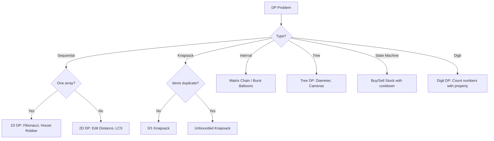
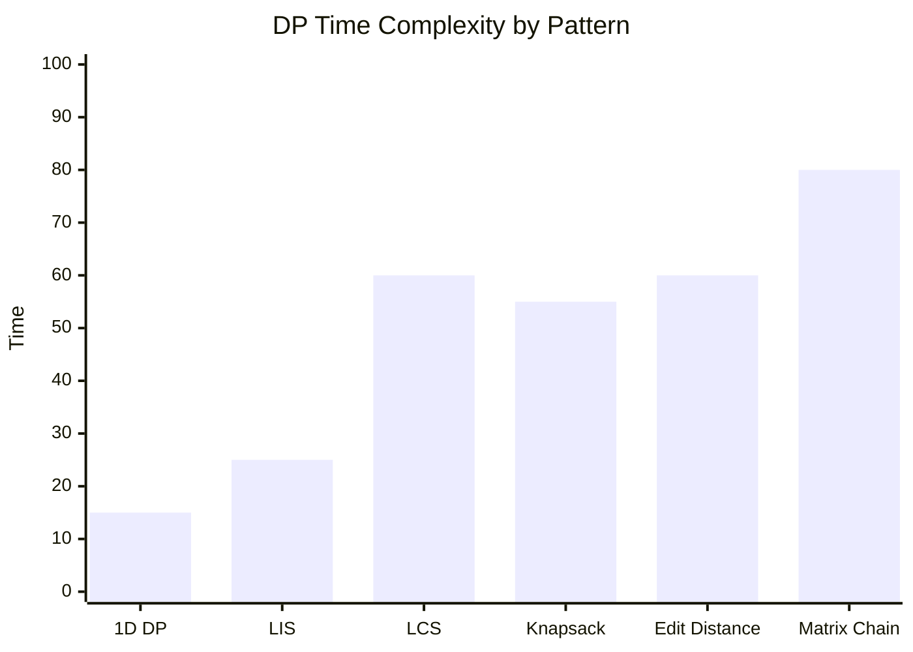

# Chapter 07: Dynamic Programming

> Dynamic Programming is the most important algorithmic technique for coding interviews. It involves breaking problems into overlapping subproblems, solving each once, and storing results. Master DP and you master interviews.

## Learning Objectives

- Recognize optimal substructure and overlapping subproblems
- Master the art of defining states and recurrence relations
- Implement both top-down (memoization) and bottom-up (tabulation) approaches
- Apply space optimization techniques to reduce memory complexity
- Identify DP patterns: 0/1 Knapsack, LCS, LIS, matrix chain, state machine
## Problem Classification Flow



## DP Patterns Classification

```mermaid
mindmap
  root((DP Patterns))
    1D DP
      Fibonacci
      Climbing Stairs
      House Robber
      Decode Ways
    2D Grid
      Unique Paths
      Min Path Sum
      Dungeon Game
    Subsequence
      LIS → O(n log n) possible
      LCS → 2D DP
      Edit Distance → 2D DP
    Knapsack
      0/1 Knapsack
      Partition Equal Subset Sum
      Coin Change (unbounded)
    String DP
      Palindromic Substrings
      Distinct Subsequences
      Regular Expression
    Interval DP
      Matrix Chain
      Burst Balloons
      Palindrome Partitioning
    State Machine
      Stock Trading
      House Robber II/III
```

## Complexity Heat Map



---

## Easy Problems (10)

---

### Problem 1: Climbing Stairs

🏷️ **Companies:** [Amazon] [Google] [Meta] [Microsoft] [Apple]
📊 **Difficulty:** Easy
📂 **Topics:** [DP, Math, Memoization]

🧩 **Pattern:** Fibonacci-style, Memoization (Top-Down)
✅ **Best Option:** Tabulation — O(n) time, O(1) space
❌ **Not Optimal:** Recursion without memoization — O(2^n), TLE at n ≥ 30
🔗 **LeetCode:** [Climbing Stairs](https://leetcode.com/problems/climbing-stairs/)
🔗 **Related:** [Fibonacci Number](07-dynamic-programming.md#problem-4-fibonacci-number) · [Min Cost Climbing Stairs](07-dynamic-programming.md#problem-5-min-cost-climbing-stairs)

**Problem:** You are climbing a staircase with n steps. Each time you can climb 1 or 2 steps. In how many distinct ways can you climb to the top?

**Example 1:**
```
Input: n = 2
Output: 2
Explanation: 1+1, 2
```

**Constraints:**
- 1 ≤ n ≤ 45

**Solution Approach:**
- **Recursion:** fib(n) = fib(n-1) + fib(n-2) — but exponential.
- **DP:** Bottom-up with O(n) time, O(1) space.

```typescript
function climbStairs(n: number): number {
  if (n <= 2) return n;

  let prev2 = 1;
  let prev1 = 2;

  for (let i = 3; i <= n; i++) {
    const curr = prev1 + prev2;
    prev2 = prev1;
    prev1 = curr;
  }

  return prev1;
}
```

**Test Cases:**
```typescript
console.log(climbStairs(2)); // 2
console.log(climbStairs(3)); // 3
console.log(climbStairs(5)); // 8
```

**Time Complexity:** O(n)
**Space Complexity:** O(1)

---

### Problem 2: House Robber

🏷️ **Companies:** [Amazon] [Google] [Meta] [Microsoft] [Apple]
📊 **Difficulty:** Easy
📂 **Topics:** [DP, Array]

🧩 **Pattern:** 1D DP, Fibonacci-style
✅ **Best Option:** Tabulation — O(n) time, O(1) space
❌ **Not Optimal:** Greedy (rob every other house) — fails; skipping a house for a bigger neighbor needs DP
🔗 **LeetCode:** [House Robber](https://leetcode.com/problems/house-robber/)
🔗 **Related:** [House Robber II](07-dynamic-programming.md#problem-25-house-robber-ii) · [Maximum Alternating Subsequence Sum](07-dynamic-programming.md#problem-23-maximum-alternating-subsequence-sum) · [Maximum Product Subarray](01-arrays.md#problem-20-maximum-product-subarray)

**Problem:** Given an array of money in houses, rob the maximum amount without robbing adjacent houses.

**Example 1:**
```
Input: nums = [1, 2, 3, 1]
Output: 4
Explanation: Rob house 1 (1) + house 3 (3) = 4
```

**Constraints:**
- 1 ≤ nums.length ≤ 100

```typescript
function rob(nums: number[]): number {
  if (nums.length === 1) return nums[0];

  let prev2 = nums[0];
  let prev1 = Math.max(nums[0], nums[1]);

  for (let i = 2; i < nums.length; i++) {
    const curr = Math.max(prev1, prev2 + nums[i]);
    prev2 = prev1;
    prev1 = curr;
  }

  return prev1;
}
```

**Test Cases:**
```typescript
console.log(rob([1, 2, 3, 1])); // 4
console.log(rob([2, 7, 9, 3, 1])); // 12
console.log(rob([5])); // 5
```

**Time Complexity:** O(n)
**Space Complexity:** O(1)

---

### Problem 3: Maximum Subarray (Kadane's Algorithm)

🏷️ **Companies:** [Amazon] [Google] [Meta] [Microsoft] [LinkedIn]
📊 **Difficulty:** Easy
📂 **Topics:** [DP, Array, Divide and Conquer]

🧩 **Pattern:** 1D DP (Kadane's), Greedy-as-alternative
✅ **Best Option:** Tabulation (Kadane's) — O(n) time, O(1) space
❌ **Not Optimal:** Divide and Conquer — O(n log n), correct but slower than Kadane
🔗 **LeetCode:** [Maximum Subarray](https://leetcode.com/problems/maximum-subarray/)
🔗 **Related:** [Maximum Subarray (Kadane's Algorithm)](01-arrays.md#problem-3-maximum-subarray-kadanes-algorithm) · [Maximum Product Subarray](01-arrays.md#problem-20-maximum-product-subarray)

**Problem:** Find the contiguous subarray with the largest sum.

**Example 1:**
```
Input: nums = [-2, 1, -3, 4, -1, 2, 1, -5, 4]
Output: 6
```

**Solution Approach:**
- Kadane's: dp[i] = max(nums[i], dp[i-1] + nums[i])

```typescript
function maxSubArray(nums: number[]): number {
  let current = nums[0];
  let maxVal = nums[0];

  for (let i = 1; i < nums.length; i++) {
    current = Math.max(nums[i], current + nums[i]);
    maxVal = Math.max(maxVal, current);
  }

  return maxVal;
}
```

**Test Cases:**
```typescript
console.log(maxSubArray([-2, 1, -3, 4, -1, 2, 1, -5, 4])); // 6
console.log(maxSubArray([1])); // 1
console.log(maxSubArray([-1])); // -1
```

**Time Complexity:** O(n)
**Space Complexity:** O(1)

---

### Problem 4: Fibonacci Number

🏷️ **Companies:** [Amazon] [Google] [Microsoft]
📊 **Difficulty:** Easy
📂 **Topics:** [DP, Math, Recursion]

🧩 **Pattern:** Fibonacci-style, Memoization (Top-Down)
✅ **Best Option:** Tabulation — O(n) time, O(1) space
❌ **Not Optimal:** Recursion without memoization — O(2^n), recomputes overlapping subproblems
🔗 **LeetCode:** [Fibonacci Number](https://leetcode.com/problems/fibonacci-number/)
🔗 **Related:** [Climbing Stairs](07-dynamic-programming.md#problem-1-climbing-stairs) · [Tribonacci Number](07-dynamic-programming.md#problem-8-tribonacci-number)

**Problem:** Return the nth Fibonacci number.

**Example 1:**
```
Input: n = 4
Output: 3 (0, 1, 1, 2, 3)
```

```typescript
function fib(n: number): number {
  if (n <= 1) return n;

  let prev2 = 0;
  let prev1 = 1;

  for (let i = 2; i <= n; i++) {
    const curr = prev1 + prev2;
    prev2 = prev1;
    prev1 = curr;
  }

  return prev1;
}
```

**Test Cases:**
```typescript
console.log(fib(2)); // 1
console.log(fib(4)); // 3
console.log(fib(10)); // 55
```

**Time Complexity:** O(n)
**Space Complexity:** O(1)

---

### Problem 5: Min Cost Climbing Stairs

🏷️ **Companies:** [Amazon] [Google] [Microsoft]
📊 **Difficulty:** Easy
📂 **Topics:** [DP, Array]

🧩 **Pattern:** Fibonacci-style, 1D DP
✅ **Best Option:** Tabulation — O(n) time, O(1) space
❌ **Not Optimal:** Greedy (always take the cheaper immediate step) — fails; local choices ignore future costs
🔗 **LeetCode:** [Min Cost Climbing Stairs](https://leetcode.com/problems/min-cost-climbing-stairs/)
🔗 **Related:** [Climbing Stairs](07-dynamic-programming.md#problem-1-climbing-stairs) · [Decode Ways](07-dynamic-programming.md#problem-18-decode-ways)

**Problem:** Given an array where cost[i] is the cost of stepping on stair i, find the minimum cost to reach the top. You can start from step 0 or 1, and climb 1 or 2 steps.

**Example 1:**
```
Input: cost = [10, 15, 20]
Output: 15
Explanation: Start at 1, pay 15, climb 2 to top.
```

```typescript
function minCostClimbingStairs(cost: number[]): number {
  let prev2 = cost[0];
  let prev1 = cost[1];

  for (let i = 2; i < cost.length; i++) {
    const curr = cost[i] + Math.min(prev1, prev2);
    prev2 = prev1;
    prev1 = curr;
  }

  return Math.min(prev1, prev2);
}
```

**Test Cases:**
```typescript
console.log(minCostClimbingStairs([10, 15, 20])); // 15
console.log(minCostClimbingStairs([1, 100, 1, 1, 1, 100, 1, 1, 100, 1])); // 6
```

**Time Complexity:** O(n)
**Space Complexity:** O(1)

---

### Problem 6: Pascal's Triangle

🏷️ **Companies:** [Amazon] [Google] [Meta]
📊 **Difficulty:** Easy
📂 **Topics:** [DP, Array]

🧩 **Pattern:** Tabulation (Bottom-Up), Grid DP
✅ **Best Option:** Tabulation — O(n²) time, O(n²) space
❌ **Not Optimal:** Combinatorics per cell (nCr) — O(n²) factorial computations with overflow risk
🔗 **LeetCode:** [Pascal's Triangle](https://leetcode.com/problems/pascals-triangle/)
🔗 **Related:** [Unique Paths](07-dynamic-programming.md#problem-14-unique-paths) · [Product of Array Except Self](01-arrays.md#problem-12-product-of-array-except-self)

**Problem:** Generate the first numRows of Pascal's triangle.

**Example 1:**
```
Input: numRows = 5
Output: [[1],[1,1],[1,2,1],[1,3,3,1],[1,4,6,4,1]]
```

```typescript
function generate(numRows: number): number[][] {
  const result: number[][] = [];

  for (let i = 0; i < numRows; i++) {
    const row: number[] = new Array(i + 1).fill(1);
    for (let j = 1; j < i; j++) {
      row[j] = result[i - 1][j - 1] + result[i - 1][j];
    }
    result.push(row);
  }

  return result;
}
```

**Test Cases:**
```typescript
console.log(generate(5));
// [[1],[1,1],[1,2,1],[1,3,3,1],[1,4,6,4,1]]
```

**Time Complexity:** O(n²)
**Space Complexity:** O(n²)

---

### Problem 7: Divisor Game

🏷️ **Companies:** [Amazon] [Google]
📊 **Difficulty:** Easy
📂 **Topics:** [DP, Math]

🧩 **Pattern:** Math Insight, Fibonacci-style (game DP)
✅ **Best Option:** Math shortcut (even n always wins) — O(1) time, O(1) space
❌ **Not Optimal:** Full game DP — O(n²) time, O(n) space; overkill when the parity insight exists
🔗 **LeetCode:** [Divisor Game](https://leetcode.com/problems/divisor-game/)
🔗 **Related:** [Fibonacci Number](07-dynamic-programming.md#problem-4-fibonacci-number) · [Missing Number](01-arrays.md#problem-6-missing-number)

**Problem:** Alice and Bob take turns. On each turn, choose x where 0 < x < n and n % x == 0, replace n with n - x. If a player cannot move, they lose. Alice starts. Return true if she wins with optimal play.

**Example 1:**
```
Input: n = 2
Output: true
```

**Solution Approach:**
- Mathematical insight: even numbers always win (dp[n] = !dp[n-1] or just n % 2 === 0).
- Or DP: dp[i] = any j where i % j == 0 and !dp[i - j].

```typescript
function divisorGame(n: number): boolean {
  return n % 2 === 0;
}
```

**Test Cases:**
```typescript
console.log(divisorGame(2)); // true
console.log(divisorGame(3)); // false
```

**Time Complexity:** O(1)
**Space Complexity:** O(1)

---

### Problem 8: Tribonacci Number

🏷️ **Companies:** [Amazon] [Google]
📊 **Difficulty:** Easy
📂 **Topics:** [DP, Math]

🧩 **Pattern:** Fibonacci-style
✅ **Best Option:** Tabulation — O(n) time, O(1) space
❌ **Not Optimal:** Recursion without memoization — O(3^n), TLE at n ≥ 30
🔗 **LeetCode:** [N-th Tribonacci Number](https://leetcode.com/problems/n-th-tribonacci-number/)
🔗 **Related:** [Fibonacci Number](07-dynamic-programming.md#problem-4-fibonacci-number) · [Climbing Stairs](07-dynamic-programming.md#problem-1-climbing-stairs)

**Problem:** T₀ = 0, T₁ = 1, T₂ = 1, Tₙ = Tₙ₋₁ + Tₙ₋₂ + Tₙ₋₃. Return Tₙ.

**Example 1:**
```
Input: n = 4
Output: 4
Explanation: 0,1,1,2,4
```

```typescript
function tribonacci(n: number): number {
  if (n === 0) return 0;
  if (n <= 2) return 1;

  let t0 = 0, t1 = 1, t2 = 1;
  for (let i = 3; i <= n; i++) {
    const curr = t0 + t1 + t2;
    t0 = t1;
    t1 = t2;
    t2 = curr;
  }
  return t2;
}
```

**Test Cases:**
```typescript
console.log(tribonacci(4)); // 4
console.log(tribonacci(25)); // 1389537
```

**Time Complexity:** O(n)
**Space Complexity:** O(1)

---

### Problem 9: Maximum Product of Three Numbers

🏷️ **Companies:** [Amazon] [Google]
📊 **Difficulty:** Easy
📂 **Topics:** [Array, Math]

🧩 **Pattern:** Sorting, Greedy-as-alternative
✅ **Best Option:** Sort and check two candidates — O(n log n) time, O(1) space
❌ **Not Optimal:** Brute-force triple loop — O(n³), TLE at n ≥ 1000
🔗 **LeetCode:** [Maximum Product of Three Numbers](https://leetcode.com/problems/maximum-product-of-three-numbers/)
🔗 **Related:** [Maximum Product Subarray](01-arrays.md#problem-20-maximum-product-subarray) · [Maximum Subarray (Kadane's Algorithm)](07-dynamic-programming.md#problem-3-maximum-subarray-kadanes-algorithm)

**Problem:** Find the maximum product of any three numbers from the array.

**Example 1:**
```
Input: nums = [1, 2, 3]
Output: 6
```

**Solution Approach:**
- Sort or track 3 max and 2 min (for negative * negative).

```typescript
function maximumProduct(nums: number[]): number {
  nums.sort((a, b) => a - b);
  const n = nums.length;
  return Math.max(
    nums[n - 1] * nums[n - 2] * nums[n - 3],
    nums[0] * nums[1] * nums[n - 1]
  );
}
```

**Test Cases:**
```typescript
console.log(maximumProduct([1, 2, 3])); // 6
console.log(maximumProduct([-100, -98, 1, 2, 3, 4])); // 39200
```

**Time Complexity:** O(n log n)
**Space Complexity:** O(1)

---

### Problem 10: Counting Bits

🏷️ **Companies:** [Amazon] [Google] [Meta]
📊 **Difficulty:** Easy
📂 **Topics:** [DP, Bit Manipulation]

🧩 **Pattern:** Tabulation (Bottom-Up), Bit Manipulation
✅ **Best Option:** DP recurrence ans[i] = ans[i >> 1] + (i & 1) — O(n) time, O(n) space
❌ **Not Optimal:** Popcount per number — O(n log n), recomputes bits from scratch
🔗 **LeetCode:** [Counting Bits](https://leetcode.com/problems/counting-bits/)
🔗 **Related:** [Fibonacci Number](07-dynamic-programming.md#problem-4-fibonacci-number) · [Single Number](01-arrays.md#problem-8-single-number)

**Problem:** Given n, return an array of length n+1 where ans[i] is the number of 1 bits in binary representation of i.

**Example 1:**
```
Input: n = 2
Output: [0, 1, 1]
```

**Solution Approach:**
- DP: ans[i] = ans[i >> 1] + (i & 1). Or ans[i] = ans[i & (i-1)] + 1.

```typescript
function countBits(n: number): number[] {
  const ans = new Array(n + 1).fill(0);

  for (let i = 1; i <= n; i++) {
    ans[i] = ans[i >> 1] + (i & 1);
  }

  return ans;
}
```

**Test Cases:**
```typescript
console.log(countBits(2)); // [0, 1, 1]
console.log(countBits(5)); // [0, 1, 1, 2, 1, 2]
```

**Time Complexity:** O(n)
**Space Complexity:** O(n)

---

## Medium Problems (18)

---

### Problem 11: Coin Change

🏷️ **Companies:** [Amazon] [Google] [Meta] [Microsoft] [Apple]
📊 **Difficulty:** Medium
📂 **Topics:** [DP, BFS, Array]

🧩 **Pattern:** Unbounded Knapsack, Tabulation (Bottom-Up)
✅ **Best Option:** Tabulation — O(n × amount) time, O(amount) space
❌ **Not Optimal:** Greedy (largest coin first) — fails: coins [1, 3, 4], amount 6 → 3 coins (4+1+1) vs optimal 2 (3+3)
🔗 **LeetCode:** [Coin Change](https://leetcode.com/problems/coin-change/)
🔗 **Related:** [Coin Change II](07-dynamic-programming.md#problem-24-coin-change-ii) · [0/1 Knapsack](07-dynamic-programming.md#problem-29-01-knapsack)

**Problem:** Given coins of different denominations and a total amount, return the fewest coins needed to make that amount. Return -1 if impossible.

**Example 1:**
```
Input: coins = [1, 2, 5], amount = 11
Output: 3 (5 + 5 + 1)
```

**Constraints:**
- 1 ≤ coins.length ≤ 12
- 0 ≤ amount ≤ 10⁴

```typescript
function coinChange(coins: number[], amount: number): number {
  const dp = new Array(amount + 1).fill(Infinity);
  dp[0] = 0;

  for (let i = 1; i <= amount; i++) {
    for (const coin of coins) {
      if (coin <= i) {
        dp[i] = Math.min(dp[i], 1 + dp[i - coin]);
      }
    }
  }

  return dp[amount] === Infinity ? -1 : dp[amount];
}
```

**Test Cases:**
```typescript
console.log(coinChange([1, 2, 5], 11)); // 3
console.log(coinChange([2], 3)); // -1
console.log(coinChange([1], 0)); // 0
```

**Time Complexity:** O(n × amount)
**Space Complexity:** O(amount)

---

### Problem 12: Longest Increasing Subsequence

🏷️ **Companies:** [Amazon] [Google] [Meta] [Microsoft] [Apple]
📊 **Difficulty:** Medium
📂 **Topics:** [DP, Binary Search]

🧩 **Pattern:** LIS, Tabulation (Bottom-Up), Binary Search
✅ **Best Option:** Patience sorting (tails + binary search) — O(n log n) time, O(n) space
❌ **Not Optimal:** O(n²) tabulation — correct but TLE at n ≥ 10⁵
🔗 **LeetCode:** [Longest Increasing Subsequence](https://leetcode.com/problems/longest-increasing-subsequence/)
🔗 **Related:** [Longest Common Subsequence](07-dynamic-programming.md#problem-13-longest-common-subsequence) · [Count of Smaller Numbers After Self](01-arrays.md#problem-30-count-of-smaller-numbers-after-self)

**Problem:** Find the length of the longest strictly increasing subsequence.

**Example 1:**
```
Input: nums = [10, 9, 2, 5, 3, 7, 101, 18]
Output: 4 ([2, 3, 7, 101])
```

**Constraints:**
- 1 ≤ nums.length ≤ 2500

**Solution Approach:**
- **DP:** dp[i] = 1 + max(dp[j]) for j < i and nums[j] < nums[i]. O(n²).
- **Optimal (Patience Sorting):** Maintain tails array, binary search. O(n log n).

```typescript
function lengthOfLIS(nums: number[]): number {
  const tails: number[] = [];

  for (const num of nums) {
    let left = 0;
    let right = tails.length;

    while (left < right) {
      const mid = Math.floor((left + right) / 2);
      if (tails[mid] < num) {
        left = mid + 1;
      } else {
        right = mid;
      }
    }

    if (left === tails.length) {
      tails.push(num);
    } else {
      tails[left] = num;
    }
  }

  return tails.length;
}
```

**Test Cases:**
```typescript
console.log(lengthOfLIS([10, 9, 2, 5, 3, 7, 101, 18])); // 4
console.log(lengthOfLIS([0, 1, 0, 3, 2, 3])); // 4
console.log(lengthOfLIS([7, 7, 7, 7])); // 1
```

**Time Complexity:** O(n log n)
**Space Complexity:** O(n)

---

### Problem 13: Longest Common Subsequence

🏷️ **Companies:** [Amazon] [Google] [Meta] [Microsoft]
📊 **Difficulty:** Medium
📂 **Topics:** [DP, String]

🧩 **Pattern:** LCS / String DP, Tabulation (Bottom-Up)
✅ **Best Option:** 2D Tabulation — O(m × n) time, O(min(m, n)) space (rolling rows)
❌ **Not Optimal:** Recursion without memoization — O(2^(m+n)), TLE
🔗 **LeetCode:** [Longest Common Subsequence](https://leetcode.com/problems/longest-common-subsequence/)
🔗 **Related:** [Edit Distance](07-dynamic-programming.md#problem-30-edit-distance-dp) · [Longest Palindromic Substring](07-dynamic-programming.md#problem-26-longest-palindromic-substring-dp) · [Edit Distance](02-strings.md#problem-22-edit-distance)

**Problem:** Given two strings, find the length of their longest common subsequence.

**Example 1:**
```
Input: text1 = "abcde", text2 = "ace"
Output: 3 ("ace")
```

**Constraints:**
- 1 ≤ text1.length, text2.length ≤ 1000

```typescript
function longestCommonSubsequence(text1: string, text2: string): number {
  const m = text1.length;
  const n = text2.length;
  const dp: number[][] = Array.from({ length: m + 1 }, () => new Array(n + 1).fill(0));

  for (let i = 1; i <= m; i++) {
    for (let j = 1; j <= n; j++) {
      if (text1[i - 1] === text2[j - 1]) {
        dp[i][j] = dp[i - 1][j - 1] + 1;
      } else {
        dp[i][j] = Math.max(dp[i - 1][j], dp[i][j - 1]);
      }
    }
  }

  return dp[m][n];
}
```

**Test Cases:**
```typescript
console.log(longestCommonSubsequence("abcde", "ace")); // 3
console.log(longestCommonSubsequence("abc", "abc")); // 3
console.log(longestCommonSubsequence("abc", "def")); // 0
```

**Time Complexity:** O(m × n)
**Space Complexity:** O(m × n)

---

### Problem 14: Unique Paths

🏷️ **Companies:** [Amazon] [Google] [Meta] [Microsoft]
📊 **Difficulty:** Medium
📂 **Topics:** [DP, Math, Combinatorics]

🧩 **Pattern:** Grid DP, Tabulation (Bottom-Up)
✅ **Best Option:** 1D rolling Tabulation — O(m × n) time, O(n) space
❌ **Not Optimal:** Recursive DFS — O(2^(m+n)), TLE at m, n ≥ 30
🔗 **LeetCode:** [Unique Paths](https://leetcode.com/problems/unique-paths/)
🔗 **Related:** [Unique Paths II](07-dynamic-programming.md#problem-15-unique-paths-ii) · [Minimum Path Sum](07-dynamic-programming.md#problem-21-minimum-path-sum) · [Shortest Path in Binary Matrix](06-graphs.md#problem-19-shortest-path-in-binary-matrix)

**Problem:** A robot is at top-left of an m×n grid. It can only move down or right. How many unique paths to bottom-right?

**Example 1:**
```
Input: m = 3, n = 7
Output: 28
```

**Constraints:**
- 1 ≤ m, n ≤ 100

**Solution Approach:**
- **DP:** dp[i][j] = dp[i-1][j] + dp[i][j-1].
- **Math:** C(m+n-2, m-1).

```typescript
function uniquePaths(m: number, n: number): number {
  const dp: number[] = new Array(n).fill(1);

  for (let i = 1; i < m; i++) {
    for (let j = 1; j < n; j++) {
      dp[j] += dp[j - 1];
    }
  }

  return dp[n - 1];
}
```

**Test Cases:**
```typescript
console.log(uniquePaths(3, 7)); // 28
console.log(uniquePaths(3, 2)); // 3
```

**Time Complexity:** O(m × n)
**Space Complexity:** O(n)

---

### Problem 15: Unique Paths II

🏷️ **Companies:** [Amazon] [Google] [Meta]
📊 **Difficulty:** Medium
📂 **Topics:** [DP, Matrix]

🧩 **Pattern:** Grid DP, Tabulation (Bottom-Up)
✅ **Best Option:** 1D rolling Tabulation — O(m × n) time, O(n) space
❌ **Not Optimal:** Recursive DFS without memoization — O(2^(m+n)), TLE with obstacles
🔗 **LeetCode:** [Unique Paths II](https://leetcode.com/problems/unique-paths-ii/)
🔗 **Related:** [Unique Paths](07-dynamic-programming.md#problem-14-unique-paths) · [Minimum Path Sum](07-dynamic-programming.md#problem-21-minimum-path-sum)

**Problem:** Same as Unique Paths but with obstacles (1 = obstacle).

**Example 1:**
```
Input: obstacleGrid = [[0,0,0],[0,1,0],[0,0,0]]
Output: 2
```

```typescript
function uniquePathsWithObstacles(obstacleGrid: number[][]): number {
  const m = obstacleGrid.length;
  const n = obstacleGrid[0].length;
  const dp = new Array(n).fill(0);
  dp[0] = 1 - obstacleGrid[0][0];

  for (let i = 0; i < m; i++) {
    for (let j = 0; j < n; j++) {
      if (obstacleGrid[i][j] === 1) {
        dp[j] = 0;
      } else if (j > 0) {
        dp[j] += dp[j - 1];
      }
    }
  }

  return dp[n - 1];
}
```

**Test Cases:**
```typescript
console.log(uniquePathsWithObstacles([[0,0,0],[0,1,0],[0,0,0]])); // 2
console.log(uniquePathsWithObstacles([[0,1],[0,0]])); // 1
```

**Time Complexity:** O(m × n)
**Space Complexity:** O(n)

---

### Problem 16: Jump Game

🏷️ **Companies:** [Amazon] [Google] [Meta] [Microsoft]
📊 **Difficulty:** Medium
📂 **Topics:** [DP, Greedy, Array]

🧩 **Pattern:** Greedy-as-alternative, Tabulation (Bottom-Up)
✅ **Best Option:** Greedy (max reach) — O(n) time, O(1) space
❌ **Not Optimal:** 1D DP — O(n²) time, O(n) space; correct but slower than greedy
🔗 **LeetCode:** [Jump Game](https://leetcode.com/problems/jump-game/)
🔗 **Related:** [Jump Game (Greedy)](08-greedy.md#problem-16-jump-game-greedy) · [Jump Game II](01-arrays.md#problem-24-jump-game-ii)

**Problem:** Given an array where nums[i] is max jump length, determine if you can reach the last index.

**Example 1:**
```
Input: nums = [2, 3, 1, 1, 4]
Output: true
```

**Solution Approach:**
- **DP:** dp[i] = true if any dp[j] where j + nums[j] >= i.
- **Greedy:** Track max reachable index.

```typescript
function canJump(nums: number[]): boolean {
  let maxReach = 0;

  for (let i = 0; i < nums.length; i++) {
    if (i > maxReach) return false;
    maxReach = Math.max(maxReach, i + nums[i]);
    if (maxReach >= nums.length - 1) return true;
  }

  return true;
}
```

**Test Cases:**
```typescript
console.log(canJump([2, 3, 1, 1, 4])); // true
console.log(canJump([3, 2, 1, 0, 4])); // false
```

**Time Complexity:** O(n)
**Space Complexity:** O(1)

---

### Problem 17: Word Break

🏷️ **Companies:** [Amazon] [Google] [Meta] [Microsoft] [Apple]
📊 **Difficulty:** Medium
📂 **Topics:** [DP, Trie, String]

🧩 **Pattern:** String DP, Tabulation (Bottom-Up), Memoization (Top-Down)
✅ **Best Option:** Tabulation — O(n² × m) time, O(n) space
❌ **Not Optimal:** Backtracking without memoization — O(2^n) segmentations, TLE at n = 300
🔗 **LeetCode:** [Word Break](https://leetcode.com/problems/word-break/)
🔗 **Related:** [Decode Ways](07-dynamic-programming.md#problem-18-decode-ways) · [Palindrome Partitioning](09-backtracking.md#problem-11-palindrome-partitioning)

**Problem:** Given a string s and a dictionary of words, return true if s can be segmented into dictionary words.

**Example 1:**
```
Input: s = "leetcode", wordDict = ["leet", "code"]
Output: true
```

**Constraints:**
- 1 ≤ s.length ≤ 300

```typescript
function wordBreak(s: string, wordDict: string[]): boolean {
  const wordSet = new Set(wordDict);
  const dp = new Array(s.length + 1).fill(false);
  dp[0] = true;

  for (let i = 1; i <= s.length; i++) {
    for (let j = 0; j < i; j++) {
      if (dp[j] && wordSet.has(s.substring(j, i))) {
        dp[i] = true;
        break;
      }
    }
  }

  return dp[s.length];
}
```

**Test Cases:**
```typescript
console.log(wordBreak("leetcode", ["leet", "code"])); // true
console.log(wordBreak("applepenapple", ["apple", "pen"])); // true
console.log(wordBreak("catsandog", ["cats","dog","sand","and","cat"])); // false
```

**Time Complexity:** O(n² × m) where m = max word length
**Space Complexity:** O(n)

---

### Problem 18: Decode Ways

🏷️ **Companies:** [Amazon] [Google] [Meta] [Microsoft]
📊 **Difficulty:** Medium
📂 **Topics:** [DP, String]

🧩 **Pattern:** String DP, Fibonacci-style
✅ **Best Option:** Tabulation — O(n) time, O(1) space
❌ **Not Optimal:** Recursion without memoization — O(2^n), TLE
🔗 **LeetCode:** [Decode Ways](https://leetcode.com/problems/decode-ways/)
🔗 **Related:** [Climbing Stairs](07-dynamic-programming.md#problem-1-climbing-stairs) · [Word Break](07-dynamic-programming.md#problem-17-word-break)

**Problem:** A message containing A-Z can be encoded to numbers ('A' → 1 ... 'Z' → 26). Count the number of ways to decode a digit string.

**Example 1:**
```
Input: s = "226"
Output: 3 (BZ, VF, BBF)
```

**Constraints:**
- 1 ≤ s.length ≤ 100

```typescript
function numDecodings(s: string): number {
  if (!s || s[0] === '0') return 0;

  const n = s.length;
  const dp = new Array(n + 1).fill(0);
  dp[0] = 1;
  dp[1] = 1;

  for (let i = 2; i <= n; i++) {
    const oneDigit = parseInt(s.substring(i - 1, i));
    const twoDigits = parseInt(s.substring(i - 2, i));

    if (oneDigit >= 1) dp[i] += dp[i - 1];
    if (twoDigits >= 10 && twoDigits <= 26) dp[i] += dp[i - 2];
  }

  return dp[n];
}
```

**Test Cases:**
```typescript
console.log(numDecodings("12")); // 2
console.log(numDecodings("226")); // 3
console.log(numDecodings("06")); // 0
```

**Time Complexity:** O(n)
**Space Complexity:** O(n)

---

### Problem 19: Target Sum

🏷️ **Companies:** [Amazon] [Google] [Meta]
📊 **Difficulty:** Medium
📂 **Topics:** [DP, DFS, Memoization]

🧩 **Pattern:** Knapsack (0/1), Memoization (Top-Down)
✅ **Best Option:** 0/1 Knapsack Tabulation (subset-sum transform) — O(n × sum) time, O(sum) space
❌ **Not Optimal:** DFS without memoization — O(2^n), TLE at n ≥ 20
🔗 **LeetCode:** [Target Sum](https://leetcode.com/problems/target-sum/)
🔗 **Related:** [Partition Equal Subset Sum](07-dynamic-programming.md#problem-20-partition-equal-subset-sum) · [0/1 Knapsack](07-dynamic-programming.md#problem-29-01-knapsack)

**Problem:** Given an array of integers and a target, assign + or - signs to each element to reach the target sum. Count number of such assignments.

**Example 1:**
```
Input: nums = [1, 1, 1, 1, 1], target = 3
Output: 5
```

**Solution Approach:**
- Convert to subset sum: sum(P) - sum(N) = target → sum(P) = (target + totalSum) / 2.

```typescript
function findTargetSumWays(nums: number[], target: number): number {
  const totalSum = nums.reduce((s, n) => s + n, 0);

  if (Math.abs(target) > totalSum || (totalSum + target) % 2 !== 0) return 0;

  const sum = (totalSum + target) / 2;
  const dp = new Array(sum + 1).fill(0);
  dp[0] = 1;

  for (const num of nums) {
    for (let s = sum; s >= num; s--) {
      dp[s] += dp[s - num];
    }
  }

  return dp[sum];
}
```

**Test Cases:**
```typescript
console.log(findTargetSumWays([1, 1, 1, 1, 1], 3)); // 5
console.log(findTargetSumWays([1], 1)); // 1
```

**Time Complexity:** O(n × sum)
**Space Complexity:** O(sum)

---

### Problem 20: Partition Equal Subset Sum

🏷️ **Companies:** [Amazon] [Google] [Meta] [Microsoft]
📊 **Difficulty:** Medium
📂 **Topics:** [DP, Array]

🧩 **Pattern:** Knapsack (0/1), Tabulation (Bottom-Up)
✅ **Best Option:** 0/1 Knapsack Tabulation — O(n × target) time, O(target) space
❌ **Not Optimal:** Greedy (sort and assign largest first) — fails: [1, 5, 11, 5] needs subset choice, not greedy pairing
🔗 **LeetCode:** [Partition Equal Subset Sum](https://leetcode.com/problems/partition-equal-subset-sum/)
🔗 **Related:** [Target Sum](07-dynamic-programming.md#problem-19-target-sum) · [0/1 Knapsack](07-dynamic-programming.md#problem-29-01-knapsack)

**Problem:** Given an array, return true if it can be partitioned into two subsets with equal sum.

**Example 1:**
```
Input: nums = [1, 5, 11, 5]
Output: true ([1, 5, 5] and [11])
```

**Constraints:**
- 1 ≤ nums.length ≤ 200

```typescript
function canPartition(nums: number[]): boolean {
  const total = nums.reduce((s, n) => s + n, 0);
  if (total % 2 !== 0) return false;

  const target = total / 2;
  const dp = new Array(target + 1).fill(false);
  dp[0] = true;

  for (const num of nums) {
    for (let s = target; s >= num; s--) {
      if (dp[s - num]) dp[s] = true;
    }
  }

  return dp[target];
}
```

**Test Cases:**
```typescript
console.log(canPartition([1, 5, 11, 5])); // true
console.log(canPartition([1, 2, 3, 5])); // false
```

**Time Complexity:** O(n × target)
**Space Complexity:** O(target)

---

### Problem 21: Minimum Path Sum

🏷️ **Companies:** [Amazon] [Google] [Meta] [Microsoft]
📊 **Difficulty:** Medium
📂 **Topics:** [DP, Grid]

🧩 **Pattern:** Grid DP, Tabulation (Bottom-Up)
✅ **Best Option:** 1D rolling Tabulation — O(m × n) time, O(n) space
❌ **Not Optimal:** Recursive DFS — O(2^(m+n)) paths, TLE
🔗 **LeetCode:** [Minimum Path Sum](https://leetcode.com/problems/minimum-path-sum/)
🔗 **Related:** [Unique Paths](07-dynamic-programming.md#problem-14-unique-paths) · [Unique Paths II](07-dynamic-programming.md#problem-15-unique-paths-ii)

**Problem:** Find the minimum path sum from top-left to bottom-right, moving only down or right.

**Example 1:**
```
Input: grid = [[1,3,1],[1,5,1],[4,2,1]]
Output: 7 (1→3→1→1→1)
```

```typescript
function minPathSum(grid: number[][]): number {
  const m = grid.length;
  const n = grid[0].length;
  const dp = [...grid[0]];

  for (let j = 1; j < n; j++) dp[j] += dp[j - 1];

  for (let i = 1; i < m; i++) {
    dp[0] += grid[i][0];
    for (let j = 1; j < n; j++) {
      dp[j] = grid[i][j] + Math.min(dp[j], dp[j - 1]);
    }
  }

  return dp[n - 1];
}
```

**Test Cases:**
```typescript
console.log(minPathSum([[1,3,1],[1,5,1],[4,2,1]])); // 7
console.log(minPathSum([[1,2,3],[4,5,6]])); // 12
```

**Time Complexity:** O(m × n)
**Space Complexity:** O(n)

---

### Problem 22: Maximum Length of Repeated Subarray

🏷️ **Companies:** [Amazon] [Google] [Microsoft]
📊 **Difficulty:** Medium
📂 **Topics:** [DP, Array, Binary Search]

🧩 **Pattern:** LCS / String DP (longest common substring), Tabulation (Bottom-Up)
✅ **Best Option:** 2D Tabulation — O(m × n) time, O(min(m, n)) space (rolling rows)
❌ **Not Optimal:** Brute force all start pairs — O(m × n × min(m, n)), TLE
🔗 **LeetCode:** [Maximum Length of Repeated Subarray](https://leetcode.com/problems/maximum-length-of-repeated-subarray/)
🔗 **Related:** [Longest Common Subsequence](07-dynamic-programming.md#problem-13-longest-common-subsequence) · [Edit Distance](02-strings.md#problem-22-edit-distance)

**Problem:** Find the maximum length of a subarray that appears in both arrays.

**Example 1:**
```
Input: nums1 = [1, 2, 3, 2, 1], nums2 = [3, 2, 1, 4, 7]
Output: 3 ([3, 2, 1])
```

```typescript
function findLength(nums1: number[], nums2: number[]): number {
  const m = nums1.length;
  const n = nums2.length;
  const dp: number[][] = Array.from({ length: m + 1 }, () => new Array(n + 1).fill(0));
  let maxLen = 0;

  for (let i = 1; i <= m; i++) {
    for (let j = 1; j <= n; j++) {
      if (nums1[i - 1] === nums2[j - 1]) {
        dp[i][j] = dp[i - 1][j - 1] + 1;
        maxLen = Math.max(maxLen, dp[i][j]);
      }
    }
  }

  return maxLen;
}
```

**Test Cases:**
```typescript
console.log(findLength([1, 2, 3, 2, 1], [3, 2, 1, 4, 7])); // 3
```

**Time Complexity:** O(m × n)
**Space Complexity:** O(m × n)

---

### Problem 23: Maximum Alternating Subsequence Sum

🏷️ **Companies:** [Amazon] [Google] [Meta]
📊 **Difficulty:** Medium
📂 **Topics:** [DP, Array]

🧩 **Pattern:** State Machine, 1D DP
✅ **Best Option:** State-machine Tabulation (even/odd) — O(n) time, O(1) space
❌ **Not Optimal:** O(n²) subsequence DP — correct but slow; state machine collapses it to O(n)
🔗 **LeetCode:** [Maximum Alternating Subsequence Sum](https://leetcode.com/problems/maximum-alternating-subsequence-sum/)
🔗 **Related:** [Best Time to Buy and Sell Stock with Cooldown](07-dynamic-programming.md#problem-28-best-time-to-buy-and-sell-stock-with-cooldown) · [Best Time to Buy and Sell Stock II](08-greedy.md#problem-3-best-time-to-buy-and-sell-stock-ii)

**Problem:** Find the maximum sum of an alternating subsequence (a[index] - a[index+1] + a[index+2] - ...).

**Example 1:**
```
Input: nums = [4, 2, 5, 3]
Output: 7 (4 - 2 + 5 = 7)
```

```typescript
function maxAlternatingSum(nums: number[]): number {
  let even = nums[0];
  let odd = 0;

  for (let i = 1; i < nums.length; i++) {
    even = Math.max(even, odd + nums[i]);
    odd = Math.max(odd, even - nums[i]);
  }

  return even;
}
```

**Test Cases:**
```typescript
console.log(maxAlternatingSum([4, 2, 5, 3])); // 7
console.log(maxAlternatingSum([5, 6, 7, 8])); // 8
```

**Time Complexity:** O(n)
**Space Complexity:** O(1)

---

### Problem 24: Coin Change II

🏷️ **Companies:** [Amazon] [Google] [Meta] [Microsoft]
📊 **Difficulty:** Medium
📂 **Topics:** [DP, Array]

🧩 **Pattern:** Unbounded Knapsack, Tabulation (Bottom-Up)
✅ **Best Option:** Unbounded Knapsack Tabulation (coin-outer loop) — O(n × amount) time, O(amount) space
❌ **Not Optimal:** Coin Change I loop order (amount-outer) — counts permutations instead of combinations
🔗 **LeetCode:** [Coin Change II](https://leetcode.com/problems/coin-change-ii/)
🔗 **Related:** [Coin Change](07-dynamic-programming.md#problem-11-coin-change) · [0/1 Knapsack](07-dynamic-programming.md#problem-29-01-knapsack)

**Problem:** Count the number of combinations that make up a given amount.

**Example 1:**
```
Input: amount = 5, coins = [1, 2, 5]
Output: 4 (5, 2+2+1, 2+1+1+1, 1+1+1+1+1)
```

```typescript
function change(amount: number, coins: number[]): number {
  const dp = new Array(amount + 1).fill(0);
  dp[0] = 1;

  for (const coin of coins) {
    for (let i = coin; i <= amount; i++) {
      dp[i] += dp[i - coin];
    }
  }

  return dp[amount];
}
```

**Test Cases:**
```typescript
console.log(change(5, [1, 2, 5])); // 4
console.log(change(3, [2])); // 0
```

**Time Complexity:** O(n × amount)
**Space Complexity:** O(amount)

---

### Problem 25: House Robber II

🏷️ **Companies:** [Amazon] [Google] [Meta] [Microsoft]
📊 **Difficulty:** Medium
📂 **Topics:** [DP, Array]

🧩 **Pattern:** 1D DP, State Machine (circular), Fibonacci-style
✅ **Best Option:** Tabulation on two ranges — O(n) time, O(1) space
❌ **Not Optimal:** Greedy — fails; circular adjacency breaks local choices, needs DP on both slices
🔗 **LeetCode:** [House Robber II](https://leetcode.com/problems/house-robber-ii/)
🔗 **Related:** [House Robber](07-dynamic-programming.md#problem-2-house-robber) · [Maximum Alternating Subsequence Sum](07-dynamic-programming.md#problem-23-maximum-alternating-subsequence-sum) · [Maximum Product Subarray](01-arrays.md#problem-20-maximum-product-subarray)

**Problem:** Houses are arranged in a circle. You cannot rob adjacent houses.

**Example 1:**
```
Input: nums = [2, 3, 2]
Output: 3
Explanation: Rob house 1 (3) only.
```

```typescript
function robII(nums: number[]): number {
  if (nums.length === 1) return nums[0];

  const robRange = (start: number, end: number): number => {
    let prev2 = 0, prev1 = 0;
    for (let i = start; i <= end; i++) {
      const curr = Math.max(prev1, prev2 + nums[i]);
      prev2 = prev1;
      prev1 = curr;
    }
    return prev1;
  };

  return Math.max(robRange(0, nums.length - 2), robRange(1, nums.length - 1));
}
```

**Test Cases:**
```typescript
console.log(robII([2, 3, 2])); // 3
console.log(robII([1, 2, 3, 1])); // 4
```

**Time Complexity:** O(n)
**Space Complexity:** O(1)

---

### Problem 26: Longest Palindromic Substring (DP)

🏷️ **Companies:** [Amazon] [Google] [Meta] [Microsoft]
📊 **Difficulty:** Medium
📂 **Topics:** [DP, String, Two Pointers]

🧩 **Pattern:** String DP, Matrix DP (interval), Two Pointers
✅ **Best Option:** Tabulation (interval) — O(n²) time, O(n²) space
❌ **Not Optimal:** Brute force all substrings + palindrome check — O(n³), TLE at n ≥ 5000
🔗 **LeetCode:** [Longest Palindromic Substring](https://leetcode.com/problems/longest-palindromic-substring/)
🔗 **Related:** [Longest Palindromic Substring](02-strings.md#problem-10-longest-palindromic-substring) · [Palindromic Substrings](02-strings.md#problem-15-palindromic-substrings)

**Problem:** Find the longest palindromic substring.

**Example 1:**
```
Input: s = "babad"
Output: "bab" or "aba"
```

**Solution Approach (DP):**
- dp[i][j] = true if s[i..j] is palindrome. dp[i][j] = s[i]==s[j] && (j-i<3 || dp[i+1][j-1]).

```typescript
function longestPalindrome(s: string): string {
  const n = s.length;
  const dp: boolean[][] = Array.from({ length: n }, () => new Array(n).fill(false));
  let start = 0;
  let maxLen = 1;

  for (let i = 0; i < n; i++) dp[i][i] = true;

  for (let len = 2; len <= n; len++) {
    for (let i = 0; i <= n - len; i++) {
      const j = i + len - 1;
      if (s[i] === s[j] && (len <= 2 || dp[i + 1][j - 1])) {
        dp[i][j] = true;
        if (len > maxLen) {
          maxLen = len;
          start = i;
        }
      }
    }
  }

  return s.substring(start, start + maxLen);
}
```

**Test Cases:**
```typescript
console.log(longestPalindrome("babad")); // "bab" or "aba"
console.log(longestPalindrome("cbbd")); // "bb"
```

**Time Complexity:** O(n²)
**Space Complexity:** O(n²)

---

### Problem 27: Longest Increasing Path in a Matrix (DP)

🏷️ **Companies:** [Amazon] [Google] [Meta] [Microsoft]
📊 **Difficulty:** Hard
📂 **Topics:** [DP, DFS, Memoization, Graph]

🧩 **Pattern:** Matrix DP, Memoization (Top-Down), DFS
✅ **Best Option:** DFS + Memoization — O(m × n) time, O(m × n) space
❌ **Not Optimal:** Plain DFS without memoization — O(4^(m×n)) worst case, TLE
🔗 **LeetCode:** [Longest Increasing Path in a Matrix](https://leetcode.com/problems/longest-increasing-path-in-a-matrix/)
🔗 **Related:** [Longest Increasing Path in a Matrix](06-graphs.md#problem-24-longest-increasing-path-in-a-matrix) · [Longest Increasing Subsequence](07-dynamic-programming.md#problem-12-longest-increasing-subsequence)

**Problem:** Find the length of the longest increasing path in a matrix.

(Located in Graphs chapter, Problem 24. DP solution uses memoization.)

---

### Problem 28: Best Time to Buy and Sell Stock with Cooldown

🏷️ **Companies:** [Amazon] [Google] [Meta] [Microsoft]
📊 **Difficulty:** Medium
📂 **Topics:** [DP, State Machine, Array]

🧩 **Pattern:** State Machine, 1D DP
✅ **Best Option:** State-machine Tabulation (sold/held/cooled) — O(n) time, O(1) space
❌ **Not Optimal:** Greedy (sell on every rise) — violates the cooldown constraint, needs state tracking
🔗 **LeetCode:** [Best Time to Buy and Sell Stock with Cooldown](https://leetcode.com/problems/best-time-to-buy-and-sell-stock-with-cooldown/)
🔗 **Related:** [Best Time to Buy and Sell Stock IV](07-dynamic-programming.md#problem-34-best-time-to-buy-and-sell-stock-iv) · [Best Time to Buy and Sell Stock](01-arrays.md#problem-2-best-time-to-buy-and-sell-stock) · [Best Time to Buy and Sell Stock II](08-greedy.md#problem-3-best-time-to-buy-and-sell-stock-ii)

**Problem:** You can complete unlimited transactions, but after selling you must wait one day before buying again.

**Example 1:**
```
Input: prices = [1, 2, 3, 0, 2]
Output: 3 (buy@1, sell@2, cool, buy@0, sell@2)
```

```typescript
function maxProfitCooldown(prices: number[]): number {
  let sold = 0, held = -Infinity, cooled = 0;

  for (const price of prices) {
    const prevSold = sold;
    sold = held + price;
    held = Math.max(held, cooled - price);
    cooled = Math.max(cooled, prevSold);
  }

  return Math.max(sold, cooled);
}
```

**Test Cases:**
```typescript
console.log(maxProfitCooldown([1, 2, 3, 0, 2])); // 3
console.log(maxProfitCooldown([1])); // 0
```

**Time Complexity:** O(n)
**Space Complexity:** O(1)

---

### Problem 29: 0/1 Knapsack

🏷️ **Companies:** [Amazon] [Google] [Meta] [Microsoft]
📊 **Difficulty:** Medium
📂 **Topics:** [DP, Array]

🧩 **Pattern:** Knapsack (0/1), Tabulation (Bottom-Up)
✅ **Best Option:** 0/1 Knapsack Tabulation (reverse loop) — O(n × capacity) time, O(capacity) space
❌ **Not Optimal:** Greedy by value/weight ratio — fails; items can't be split, ratio ranking misses optimal combos
🔗 **LeetCode:** No direct LC equivalent — see Related links
🔗 **Related:** [Partition Equal Subset Sum](07-dynamic-programming.md#problem-20-partition-equal-subset-sum) · [Target Sum](07-dynamic-programming.md#problem-19-target-sum)

**Problem:** Given weights and values of n items, and a knapsack capacity, find the maximum value you can fit.

**Example 1:**
```
Input: weights = [1, 3, 4, 5], values = [1, 4, 5, 7], capacity = 7
Output: 9 (items with weights 1+5=6, values 1+7=8? Actually optimal: 3+4=7, values 4+5=9)
```

```typescript
function knapsack(weights: number[], values: number[], capacity: number): number {
  const n = weights.length;
  const dp = new Array(capacity + 1).fill(0);

  for (let i = 0; i < n; i++) {
    for (let w = capacity; w >= weights[i]; w--) {
      dp[w] = Math.max(dp[w], dp[w - weights[i]] + values[i]);
    }
  }

  return dp[capacity];
}
```

**Test Cases:**
```typescript
console.log(knapsack([1, 3, 4, 5], [1, 4, 5, 7], 7)); // 9
console.log(knapsack([2, 3, 5, 7], [1, 4, 5, 7], 10)); // 12
```

**Time Complexity:** O(n × capacity)
**Space Complexity:** O(capacity)

---

### Problem 30: Edit Distance (DP)

🏷️ **Companies:** [Amazon] [Google] [Microsoft] [Meta]
📊 **Difficulty:** Medium
📂 **Topics:** [DP, String]

🧩 **Pattern:** String DP, LCS-family, Tabulation (Bottom-Up)
✅ **Best Option:** 2D Tabulation — O(m × n) time, O(min(m, n)) space (rolling rows)
❌ **Not Optimal:** Recursion without memoization — O(3^(m+n)), TLE
🔗 **LeetCode:** [Edit Distance](https://leetcode.com/problems/edit-distance/)
🔗 **Related:** [Edit Distance](02-strings.md#problem-22-edit-distance) · [Longest Common Subsequence](07-dynamic-programming.md#problem-13-longest-common-subsequence)

**Problem:** Given two strings, find the minimum number of operations (insert, delete, replace) to convert one to the other.

(Also listed in Strings chapter, Problem 22.)

---

## Hard Problems (7)

---

### Problem 31: Burst Balloons

🏷️ **Companies:** [Amazon] [Google] [Meta] [Microsoft]
📊 **Difficulty:** Hard
📂 **Topics:** [DP, Divide and Conquer]

🧩 **Pattern:** Partition DP, Interval DP, Tabulation (Bottom-Up)
✅ **Best Option:** Interval DP on the last balloon burst — O(n³) time, O(n²) space
❌ **Not Optimal:** Greedy (burst smallest balloon first) — fails; burst order interacts, needs interval DP
🔗 **LeetCode:** [Burst Balloons](https://leetcode.com/problems/burst-balloons/)
🔗 **Related:** [Longest Palindromic Substring](07-dynamic-programming.md#problem-26-longest-palindromic-substring-dp) · [Palindrome Partitioning](09-backtracking.md#problem-11-palindrome-partitioning)

**Problem:** Given n balloons (each with a coin value), bursting balloon i earns nums[i-1] * nums[i] * nums[i+1]. Find the maximum coins you can collect.

**Example 1:**
```
Input: nums = [3, 1, 5, 8]
Output: 167
Explanation: nums = [3,1,5,8] → [3,5,8] → [3,8] → [8] → []. Coins: 3*1*5 + 3*5*8 + 3*8*1 + 1*8*1 = 167
```

**Constraints:**
- 1 ≤ n ≤ 300

```typescript
function maxCoins(nums: number[]): number {
  const n = nums.length;
  const arr = [1, ...nums, 1];
  const dp: number[][] = Array.from({ length: n + 2 }, () => new Array(n + 2).fill(0));

  for (let len = 1; len <= n; len++) {
    for (let left = 1; left <= n - len + 1; left++) {
      const right = left + len - 1;
      for (let last = left; last <= right; last++) {
        const coins = arr[left - 1] * arr[last] * arr[right + 1];
        dp[left][right] = Math.max(
          dp[left][right],
          coins + dp[left][last - 1] + dp[last + 1][right]
        );
      }
    }
  }

  return dp[1][n];
}
```

**Test Cases:**
```typescript
console.log(maxCoins([3, 1, 5, 8])); // 167
console.log(maxCoins([1, 5])); // 10
```

**Time Complexity:** O(n³)
**Space Complexity:** O(n²)

---

### Problem 32: Regular Expression Matching

🏷️ **Companies:** [Amazon] [Google] [Meta] [Microsoft]
📊 **Difficulty:** Hard
📂 **Topics:** [DP, String, Backtracking]

🧩 **Pattern:** String DP, Tabulation (Bottom-Up), Memoization (Top-Down)
✅ **Best Option:** 2D Tabulation — O(m × n) time, O(m × n) space
❌ **Not Optimal:** Backtracking without memoization — O(2^(m+n)); 'x*' branches explode on repeated patterns
🔗 **LeetCode:** [Regular Expression Matching](https://leetcode.com/problems/regular-expression-matching/)
🔗 **Related:** [Regular Expression Matching](02-strings.md#problem-21-regular-expression-matching) · [Distinct Subsequences](07-dynamic-programming.md#problem-33-distinct-subsequences)

**Problem:** Implement regex matching with '.' and '*'.

(Detailed solution in Strings chapter, Problem 21.)

---

### Problem 33: Distinct Subsequences

🏷️ **Companies:** [Amazon] [Google] [Meta]
📊 **Difficulty:** Hard
📂 **Topics:** [DP, String]

🧩 **Pattern:** String DP, LCS-family, Tabulation (Bottom-Up)
✅ **Best Option:** 2D Tabulation — O(m × n) time, O(n) space (rolling rows)
❌ **Not Optimal:** Enumerate all subsequences — O(2^m), TLE at m ≥ 20
🔗 **LeetCode:** [Distinct Subsequences](https://leetcode.com/problems/distinct-subsequences/)
🔗 **Related:** [Longest Common Subsequence](07-dynamic-programming.md#problem-13-longest-common-subsequence) · [Distinct Subsequences](02-strings.md#problem-23-distinct-subsequences) · [Edit Distance](07-dynamic-programming.md#problem-30-edit-distance-dp)

**Problem:** Count the number of distinct subsequences of s that equal t.

(Detailed solution in Strings chapter, Problem 23.)

---

### Problem 34: Best Time to Buy and Sell Stock IV

🏷️ **Companies:** [Amazon] [Google] [Meta]
📊 **Difficulty:** Hard
📂 **Topics:** [DP, Array, State Machine]

🧩 **Pattern:** State Machine, Tabulation (Bottom-Up)
✅ **Best Option:** 2D Tabulation (k × n) — O(k × n) time, O(k × n) space; greedy fallback when k ≥ n/2
❌ **Not Optimal:** Backtracking over buy/sell states without memoization — O(2^n) paths, TLE at n ≥ 30
🔗 **LeetCode:** [Best Time to Buy and Sell Stock IV](https://leetcode.com/problems/best-time-to-buy-and-sell-stock-iv/)
🔗 **Related:** [Best Time to Buy and Sell Stock with Cooldown](07-dynamic-programming.md#problem-28-best-time-to-buy-and-sell-stock-with-cooldown) · [Best Time to Buy and Sell Stock](01-arrays.md#problem-2-best-time-to-buy-and-sell-stock) · [Best Time to Buy and Sell Stock II](08-greedy.md#problem-3-best-time-to-buy-and-sell-stock-ii)

**Problem:** You can complete at most k transactions. Find maximum profit.

**Example 1:**
```
Input: k = 2, prices = [3, 2, 6, 5, 0, 3]
Output: 7 (buy@2, sell@6, buy@0, sell@3)
```

```typescript
function maxProfitIV(k: number, prices: number[]): number {
  const n = prices.length;
  if (k >= n / 2) {
    let profit = 0;
    for (let i = 1; i < n; i++) {
      if (prices[i] > prices[i - 1]) profit += prices[i] - prices[i - 1];
    }
    return profit;
  }

  const dp: number[][] = Array.from({ length: k + 1 }, () => new Array(n).fill(0));

  for (let t = 1; t <= k; t++) {
    let maxDiff = -prices[0];
    for (let d = 1; d < n; d++) {
      dp[t][d] = Math.max(dp[t][d - 1], prices[d] + maxDiff);
      maxDiff = Math.max(maxDiff, dp[t - 1][d] - prices[d]);
    }
  }

  return dp[k][n - 1];
}
```

**Test Cases:**
```typescript
console.log(maxProfitIV(2, [3, 2, 6, 5, 0, 3])); // 7
console.log(maxProfitIV(2, [2, 4, 1])); // 2
```

**Time Complexity:** O(k × n)
**Space Complexity:** O(k × n)

---

### Problem 35: Frog Jump

🏷️ **Companies:** [Amazon] [Google] [Meta]
📊 **Difficulty:** Hard
📂 **Topics:** [DP, Hash Table]

🧩 **Pattern:** Memoization (Top-Down), Hash Map DP
✅ **Best Option:** DFS + memo (stone → reachable jump sizes) — O(n²) time, O(n²) space
❌ **Not Optimal:** Greedy (always jump the max) — fails; must explore k-1, k, k+1 from every stone
🔗 **LeetCode:** [Frog Jump](https://leetcode.com/problems/frog-jump/)
🔗 **Related:** [Jump Game II](01-arrays.md#problem-24-jump-game-ii) · [Climbing Stairs](07-dynamic-programming.md#problem-1-climbing-stairs)

**Problem:** A frog starts at stone 0 and can jump k units. After jumping k units, it can jump k-1, k, or k+1 units. Determine if it can reach the last stone.

**Example 1:**
```
Input: stones = [0, 1, 3, 5, 6, 8, 12, 17]
Output: true
```

```typescript
function canCross(stones: number[]): boolean {
  const map = new Map<number, Set<number>>();
  for (const stone of stones) map.set(stone, new Set());
  map.get(0)!.add(0);

  for (const stone of stones) {
    for (const jump of map.get(stone)!) {
      for (const nextJump of [jump - 1, jump, jump + 1]) {
        if (nextJump > 0 && map.has(stone + nextJump)) {
          map.get(stone + nextJump)!.add(nextJump);
        }
      }
    }
  }

  return map.get(stones[stones.length - 1])!.size > 0;
}
```

**Test Cases:**
```typescript
console.log(canCross([0, 1, 3, 5, 6, 8, 12, 17])); // true
console.log(canCross([0, 1, 2, 3, 4, 8, 9, 11])); // false
```

**Time Complexity:** O(n²)
**Space Complexity:** O(n²)

---

## Summary Table

| # | Problem | Difficulty | Companies | Time | Space |
|---|---------|-----------|-----------|------|-------|
| 1 | Climbing Stairs | Easy | Multiple | O(n) | O(1) |
| 2 | House Robber | Easy | Multiple | O(n) | O(1) |
| 3 | Maximum Subarray | Easy | Multiple | O(n) | O(1) |
| 4 | Fibonacci Number | Easy | Amazon, Google | O(n) | O(1) |
| 5 | Min Cost Climbing Stairs | Easy | Amazon, Google | O(n) | O(1) |
| 6 | Pascal's Triangle | Easy | Amazon, Google, Meta | O(n²) | O(n²) |
| 7 | Divisor Game | Easy | Amazon, Google | O(1) | O(1) |
| 8 | Tribonacci | Easy | Amazon, Google | O(n) | O(1) |
| 9 | Max Product of Three | Easy | Amazon, Google | O(n log n) | O(1) |
| 10 | Counting Bits | Easy | Amazon, Google, Meta | O(n) | O(n) |
| 11 | Coin Change | Medium | Multiple | O(n×amt) | O(amt) |
| 12 | Longest Increasing Subseq | Medium | Multiple | O(n log n) | O(n) |
| 13 | Longest Common Subseq | Medium | Multiple | O(m×n) | O(m×n) |
| 14 | Unique Paths | Medium | Multiple | O(m×n) | O(n) |
| 15 | Unique Paths II | Medium | Amazon, Google | O(m×n) | O(n) |
| 16 | Jump Game | Medium | Multiple | O(n) | O(1) |
| 17 | Word Break | Medium | Multiple | O(n²×m) | O(n) |
| 18 | Decode Ways | Medium | Multiple | O(n) | O(n) |
| 19 | Target Sum | Medium | Amazon, Google | O(n×sum) | O(sum) |
| 20 | Partition Equal Subset | Medium | Multiple | O(n×target) | O(target) |
| 21 | Minimum Path Sum | Medium | Multiple | O(m×n) | O(n) |
| 22 | Max Length Repeated Subarray | Medium | Amazon, Google | O(m×n) | O(m×n) |
| 23 | Max Alternating Sum | Medium | Amazon, Google | O(n) | O(1) |
| 24 | Coin Change II | Medium | Multiple | O(n×amt) | O(amt) |
| 25 | House Robber II | Medium | Multiple | O(n) | O(1) |
| 26 | Longest Palindromic Substr (DP) | Medium | Multiple | O(n²) | O(n²) |
| 27 | Longest Increasing Path Matrix | Hard | Multiple | O(mn) | O(mn) |
| 28 | Stock with Cooldown | Medium | Multiple | O(n) | O(1) |
| 29 | 0/1 Knapsack | Medium | Multiple | O(n×cap) | O(cap) |
| 30 | Edit Distance | Medium | Multiple | O(m×n) | O(m×n) |
| 31 | Burst Balloons | Hard | Multiple | O(n³) | O(n²) |
| 32 | Regex Matching | Hard | Multiple | O(m×n) | O(m×n) |
| 33 | Distinct Subsequences | Hard | Amazon, Google | O(m×n) | O(m×n) |
| 34 | Best Time to Buy/Sell IV | Hard | Amazon, Google | O(k×n) | O(k×n) |
| 35 | Frog Jump | Hard | Amazon, Google | O(n²) | O(n²) |
