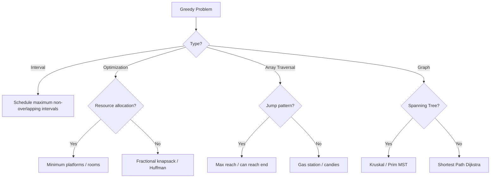
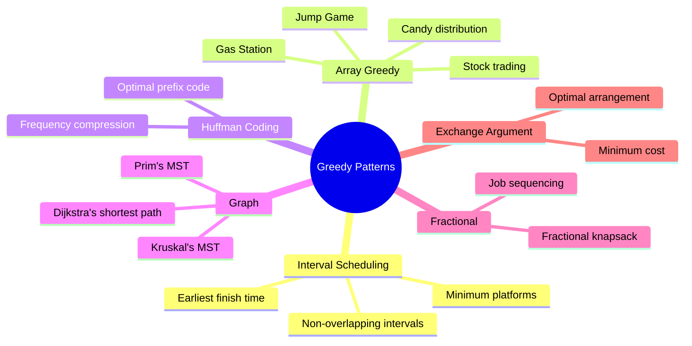

# Chapter 08: Greedy Algorithms

> Greedy algorithms make locally optimal choices at each step, hoping to reach a globally optimal solution. Not all problems can be solved greedily, but when they can, greedy solutions are often the most efficient.

## Learning Objectives

- Understand the greedy choice property and optimal substructure
- Recognize problems where greedy algorithms yield optimal solutions
- Implement common greedy patterns: interval scheduling, Huffman coding, activity selection
- Differentiate between greedy and DP: when to use each
- Apply exchange argument to prove correctness

<!-- Image Gallery -->
<section class="lesson-visuals" aria-label="Visual learning resources">
  <header><span>VISUAL LEARNING</span><h2>See it. Review it. Remember it.</h2></header>
  <a class="lesson-visual-card" href="../../../assets/images/lessons/coding-problems/08-greedy/.png" target="_blank" rel="noopener">
    
    <span><strong>Handwritten notes</strong>Condensed notes for deliberate review.</span>
  </a>
  <a class="lesson-visual-card" href="../../../assets/images/lessons/coding-problems/08-greedy/.png" target="_blank" rel="noopener">
    
    <span><strong>Sticky-note revision</strong>Fast recall prompts for revision.</span>
  </a>
  <a class="lesson-visual-card" href="../../../assets/images/lessons/coding-problems/08-greedy/.png" target="_blank" rel="noopener">
    
    <span><strong>Visual concept guide</strong>A connected explanation of the key ideas.</span>
  </a>
</section>
<!-- End Image Gallery -->

## Problem Classification Flow



## Greedy Algorithm Patterns



## Complexity Decision Tree

```mermaid
flowchart LR
    A[Problem] --> B{Optimal substructure?}
    B -->|No| C[Try DP / Backtracking]
    B -->|Yes| D{Greedy choice?}
    D -->|Proven| E[Greedy algorithm]
    D -->|Unknown| F[Try both: greedy vs DP]
    E --> G[O(n log n) for sorting + O(n)]
```

---

## Easy Problems (5)

---

### Problem 1: Assign Cookies

🏷️ **Companies:** [Amazon] [Google]
📊 **Difficulty:** Easy
📂 **Topics:** [Greedy, Array, Sorting]

**Problem:** Given children's greed factors and cookie sizes, maximize the number of content children (a child is content if cookie size ≥ greed factor). Each child gets at most one cookie.

**Example 1:**
```
Input: g = [1, 2, 3], s = [1, 1]
Output: 1
```

**Constraints:**
- 1 ≤ g.length, s.length ≤ 3 × 10⁴

```typescript
function findContentChildren(g: number[], s: number[]): number {
  g.sort((a, b) => a - b);
  s.sort((a, b) => a - b);

  let i = 0;
  for (let j = 0; i < g.length && j < s.length; j++) {
    if (s[j] >= g[i]) i++;
  }

  return i;
}
```

**Test Cases:**
```typescript
console.log(findContentChildren([1, 2, 3], [1, 1])); // 1
console.log(findContentChildren([1, 2], [1, 2, 3])); // 2
```

**Time Complexity:** O(n log n + m log m)
**Space Complexity:** O(1)

---

### Problem 2: Lemonade Change

🏷️ **Companies:** [Amazon] [Google]
📊 **Difficulty:** Easy
📂 **Topics:** [Greedy, Array]

**Problem:** Each customer pays with $5, $10, or $20 for a $5 lemonade. Determine if you can provide correct change.

**Example 1:**
```
Input: bills = [5, 5, 5, 10, 20]
Output: true
```

```typescript
function lemonadeChange(bills: number[]): boolean {
  let five = 0;
  let ten = 0;

  for (const bill of bills) {
    if (bill === 5) {
      five++;
    } else if (bill === 10) {
      if (five === 0) return false;
      five--;
      ten++;
    } else {
      if (ten > 0 && five > 0) {
        ten--;
        five--;
      } else if (five >= 3) {
        five -= 3;
      } else {
        return false;
      }
    }
  }

  return true;
}
```

**Test Cases:**
```typescript
console.log(lemonadeChange([5, 5, 5, 10, 20])); // true
console.log(lemonadeChange([5, 5, 10, 10, 20])); // false
```

**Time Complexity:** O(n)
**Space Complexity:** O(1)

---

### Problem 3: Best Time to Buy and Sell Stock II

🏷️ **Companies:** [Amazon] [Google] [Meta] [Microsoft]
📊 **Difficulty:** Easy
📂 **Topics:** [Greedy, Array]

**Problem:** You can complete as many transactions as you like (buy one and sell one share on different days). Maximize profit.

**Example 1:**
```
Input: prices = [7, 1, 5, 3, 6, 4]
Output: 7
Explanation: Buy@1 sell@5 (+4), buy@3 sell@6 (+3) = 7
```

```typescript
function maxProfitII(prices: number[]): number {
  let profit = 0;

  for (let i = 1; i < prices.length; i++) {
    if (prices[i] > prices[i - 1]) {
      profit += prices[i] - prices[i - 1];
    }
  }

  return profit;
}
```

**Test Cases:**
```typescript
console.log(maxProfitII([7, 1, 5, 3, 6, 4])); // 7
console.log(maxProfitII([1, 2, 3, 4, 5])); // 4
console.log(maxProfitII([7, 6, 4, 3, 1])); // 0
```

**Time Complexity:** O(n)
**Space Complexity:** O(1)

---

### Problem 4: Minimum Number of Arrows to Burst Balloons

🏷️ **Companies:** [Amazon] [Google] [Meta]
📊 **Difficulty:** Easy
📂 **Topics:** [Greedy, Array, Sorting]

**Problem:** Given balloons as intervals [x_start, x_end], shoot arrows vertically. Find minimum arrows needed to burst all balloons.

**Example 1:**
```
Input: points = [[10,16],[2,8],[1,6],[7,12]]
Output: 2
```

```typescript
function findMinArrowShots(points: number[][]): number {
  if (!points.length) return 0;

  points.sort((a, b) => a[1] - b[1]);
  let arrows = 1;
  let end = points[0][1];

  for (let i = 1; i < points.length; i++) {
    if (points[i][0] > end) {
      arrows++;
      end = points[i][1];
    }
  }

  return arrows;
}
```

**Test Cases:**
```typescript
console.log(findMinArrowShots([[10,16],[2,8],[1,6],[7,12]])); // 2
console.log(findMinArrowShots([[1,2],[3,4],[5,6],[7,8]])); // 4
```

**Time Complexity:** O(n log n)
**Space Complexity:** O(1)

---

### Problem 5: Maximum Units on a Truck

🏷️ **Companies:** [Amazon] [Google]
📊 **Difficulty:** Easy
📂 **Topics:** [Greedy, Array, Sorting]

**Problem:** Given box types with [numberOfBoxes, unitsPerBox] and a truck size, maximize total units loaded.

**Example 1:**
```
Input: boxTypes = [[1,3],[2,2],[3,1]], truckSize = 4
Output: 8 (1×3 + 2×2 + 1×1 = 8)
```

```typescript
function maximumUnits(boxTypes: number[][], truckSize: number): number {
  boxTypes.sort((a, b) => b[1] - a[1]);
  let totalUnits = 0;

  for (const [boxes, units] of boxTypes) {
    const take = Math.min(boxes, truckSize);
    totalUnits += take * units;
    truckSize -= take;
    if (truckSize === 0) break;
  }

  return totalUnits;
}
```

**Test Cases:**
```typescript
console.log(maximumUnits([[1,3],[2,2],[3,1]], 4)); // 8
console.log(maximumUnits([[5,10],[2,5],[4,7],[3,9]], 10)); // 91
```

**Time Complexity:** O(n log n)
**Space Complexity:** O(1)

---

## Medium Problems (8)

---

### Problem 6: Activity Selection (Non-overlapping Intervals)

🏷️ **Companies:** [Amazon] [Google] [Meta] [Microsoft]
📊 **Difficulty:** Medium
📂 **Topics:** [Greedy, Interval, Sorting]

**Problem:** Given intervals [start, end], find the maximum number of non-overlapping intervals you can select (or the minimum number to remove to make them non-overlapping).

**Example 1:**
```
Input: intervals = [[1,2],[2,3],[3,4],[1,3]]
Output: 1 (remove just [1,3] to make non-overlapping)
```

```typescript
function eraseOverlapIntervals(intervals: number[][]): number {
  if (!intervals.length) return 0;

  intervals.sort((a, b) => a[1] - b[1]);
  let count = 0;
  let end = intervals[0][1];

  for (let i = 1; i < intervals.length; i++) {
    if (intervals[i][0] < end) {
      count++;
    } else {
      end = intervals[i][1];
    }
  }

  return count;
}
```

**Test Cases:**
```typescript
console.log(eraseOverlapIntervals([[1,2],[2,3],[3,4],[1,3]])); // 1
console.log(eraseOverlapIntervals([[1,2],[1,2],[1,2]])); // 2
```

**Time Complexity:** O(n log n)
**Space Complexity:** O(1)

---

### Problem 7: Minimum Number of Platforms

🏷️ **Companies:** [Amazon] [Google] [Microsoft]
📊 **Difficulty:** Medium
📂 **Topics:** [Greedy, Interval, Sorting]

**Problem:** Given arrival and departure times of trains, find the minimum number of platforms needed.

**Example 1:**
```
Input: arr = [900, 940, 950, 1100, 1500, 1800], dep = [910, 1200, 1120, 1130, 1900, 2000]
Output: 3
```

```typescript
function findPlatform(arr: number[], dep: number[]): number {
  arr.sort((a, b) => a - b);
  dep.sort((a, b) => a - b);

  let platforms = 0;
  let maxPlatforms = 0;
  let i = 0, j = 0;

  while (i < arr.length && j < dep.length) {
    if (arr[i] <= dep[j]) {
      platforms++;
      i++;
    } else {
      platforms--;
      j++;
    }
    maxPlatforms = Math.max(maxPlatforms, platforms);
  }

  return maxPlatforms;
}
```

**Test Cases:**
```typescript
console.log(findPlatform(
  [900, 940, 950, 1100, 1500, 1800],
  [910, 1200, 1120, 1130, 1900, 2000]
)); // 3
console.log(findPlatform([900, 1000], [910, 1010])); // 1
```

**Time Complexity:** O(n log n)
**Space Complexity:** O(1)

---

### Problem 8: Jump Game II

🏷️ **Companies:** [Amazon] [Google] [Meta] [Microsoft]
📊 **Difficulty:** Medium
📂 **Topics:** [Greedy, Array]

**Problem:** Given an array where nums[i] is max jump length, return the minimum number of jumps to reach the last index.

**Example 1:**
```
Input: nums = [2, 3, 1, 1, 4]
Output: 2
```

```typescript
function jump(nums: number[]): number {
  let jumps = 0;
  let currentEnd = 0;
  let farthest = 0;

  for (let i = 0; i < nums.length - 1; i++) {
    farthest = Math.max(farthest, i + nums[i]);
    if (i === currentEnd) {
      jumps++;
      currentEnd = farthest;
    }
  }

  return jumps;
}
```

**Test Cases:**
```typescript
console.log(jump([2, 3, 1, 1, 4])); // 2
console.log(jump([2, 0, 0])); // 1? Actually can't reach — but constraints guarantee reachability
console.log(jump([0])); // 0
```

**Time Complexity:** O(n)
**Space Complexity:** O(1)

---

### Problem 9: Gas Station

🏷️ **Companies:** [Amazon] [Google] [Meta] [Microsoft]
📊 **Difficulty:** Medium
📂 **Topics:** [Greedy, Array]

**Problem:** Given gas[i] (gas at station i) and cost[i] (cost to travel from i to i+1), find the starting station to complete a circuit. Return -1 if impossible.

**Example 1:**
```
Input: gas = [1, 2, 3, 4, 5], cost = [3, 4, 5, 1, 2]
Output: 3
```

**Solution Approach:**
- If total gas < total cost, impossible. Otherwise, track deficit; when tank < 0, reset start to next station.

```typescript
function canCompleteCircuit(gas: number[], cost: number[]): number {
  let total = 0;
  let tank = 0;
  let start = 0;

  for (let i = 0; i < gas.length; i++) {
    const diff = gas[i] - cost[i];
    total += diff;
    tank += diff;
    if (tank < 0) {
      start = i + 1;
      tank = 0;
    }
  }

  return total >= 0 ? start : -1;
}
```

**Test Cases:**
```typescript
console.log(canCompleteCircuit([1, 2, 3, 4, 5], [3, 4, 5, 1, 2])); // 3
console.log(canCompleteCircuit([2, 3, 4], [3, 4, 3])); // -1
```

**Time Complexity:** O(n)
**Space Complexity:** O(1)

---

### Problem 10: Candy

🏷️ **Companies:** [Amazon] [Google] [Meta] [Microsoft]
📊 **Difficulty:** Medium
📂 **Topics:** [Greedy, Array]

**Problem:** Each child must have at least one candy. Children with higher ratings get more than their neighbors. Find the minimum total candies.

**Example 1:**
```
Input: ratings = [1, 0, 2]
Output: 5 (2, 1, 2)
```

**Solution Approach:**
- Two-pass greedy: left-to-right, then right-to-left.

```typescript
function candy(ratings: number[]): number {
  const n = ratings.length;
  const candies = new Array(n).fill(1);

  for (let i = 1; i < n; i++) {
    if (ratings[i] > ratings[i - 1]) {
      candies[i] = candies[i - 1] + 1;
    }
  }

  for (let i = n - 2; i >= 0; i--) {
    if (ratings[i] > ratings[i + 1]) {
      candies[i] = Math.max(candies[i], candies[i + 1] + 1);
    }
  }

  return candies.reduce((sum, c) => sum + c, 0);
}
```

**Test Cases:**
```typescript
console.log(candy([1, 0, 2])); // 5
console.log(candy([1, 2, 2])); // 4
```

**Time Complexity:** O(n)
**Space Complexity:** O(n)

---

### Problem 11: Queue Reconstruction by Height

🏷️ **Companies:** [Amazon] [Google] [Meta]
📊 **Difficulty:** Medium
📂 **Topics:** [Greedy, Array, Sorting]

**Problem:** Given people [height, numInFront] where numInFront is number of people ≥ height in front, reconstruct the queue.

**Example 1:**
```
Input: people = [[7,0],[4,4],[7,1],[5,0],[6,1],[5,2]]
Output: [[5,0],[7,0],[5,2],[6,1],[4,4],[7,1]]
```

```typescript
function reconstructQueue(people: number[][]): number[][] {
  people.sort((a, b) => b[0] - a[0] || a[1] - b[1]);
  const result: number[][] = [];

  for (const person of people) {
    result.splice(person[1], 0, person);
  }

  return result;
}
```

**Test Cases:**
```typescript
console.log(reconstructQueue([[7,0],[4,4],[7,1],[5,0],[6,1],[5,2]]));
// [[5,0],[7,0],[5,2],[6,1],[4,4],[7,1]]
```

**Time Complexity:** O(n²)
**Space Complexity:** O(n)

---

### Problem 12: Task Scheduler

🏷️ **Companies:** [Amazon] [Google] [Meta] [Microsoft]
📊 **Difficulty:** Medium
📂 **Topics:** [Greedy, Array, Heap]

**Problem:** Given tasks and a cooldown n, find the minimum time to complete all tasks (same task must be n apart).

**Example 1:**
```
Input: tasks = ["A","A","A","B","B","B"], n = 2
Output: 8 (A→B→idle→A→B→idle→A→B)
```

**Constraints:**
- 1 ≤ tasks.length ≤ 10⁴

```typescript
function leastInterval(tasks: string[], n: number): number {
  const freq = new Array(26).fill(0);
  for (const task of tasks) {
    freq[task.charCodeAt(0) - 65]++;
  }

  freq.sort((a, b) => b - a);
  const maxFreq = freq[0];
  let idleSlots = (maxFreq - 1) * n;

  for (let i = 1; i < freq.length && freq[i] > 0; i++) {
    idleSlots -= Math.min(freq[i], maxFreq - 1);
  }

  return tasks.length + Math.max(0, idleSlots);
}
```

**Test Cases:**
```typescript
console.log(leastInterval(["A","A","A","B","B","B"], 2)); // 8
console.log(leastInterval(["A","A","A","B","B","B"], 0)); // 6
```

**Time Complexity:** O(n + 26 log 26) = O(n)
**Space Complexity:** O(1)

---

### Problem 13: Partition Labels

🏷️ **Companies:** [Amazon] [Google] [Meta] [Microsoft]
📊 **Difficulty:** Medium
📂 **Topics:** [Greedy, String, Two Pointers]

**Problem:** Partition a string into as many parts as possible so that each character appears in at most one part.

**Example 1:**
```
Input: s = "ababcbacadefegdehijhklij"
Output: [9, 7, 8]
```

```typescript
function partitionLabels(s: string): number[] {
  const last = new Array(26).fill(0);
  for (let i = 0; i < s.length; i++) {
    last[s.charCodeAt(i) - 97] = i;
  }

  const result: number[] = [];
  let start = 0;
  let end = 0;

  for (let i = 0; i < s.length; i++) {
    end = Math.max(end, last[s.charCodeAt(i) - 97]);
    if (i === end) {
      result.push(end - start + 1);
      start = i + 1;
    }
  }

  return result;
}
```

**Test Cases:**
```typescript
console.log(partitionLabels("ababcbacadefegdehijhklij")); // [9, 7, 8]
console.log(partitionLabels("eccbbbbdec")); // [10]
```

**Time Complexity:** O(n)
**Space Complexity:** O(1)

---

## Hard Problems (2)

---

### Problem 14: Maximum Profit in Job Scheduling

🏷️ **Companies:** [Amazon] [Google] [Meta]
📊 **Difficulty:** Hard
📂 **Topics:** [Greedy, DP, Binary Search, Sorting]

**Problem:** Given jobs with startTime, endTime, and profit, find the maximum profit with non-overlapping jobs.

**Example 1:**
```
Input: startTime = [1,2,3,3], endTime = [3,4,5,6], profit = [50,10,40,70]
Output: 120
Explanation: Job 1 (1→3, $50) + Job 3 (3→5, $40) = $90? Actually Job 4 (3→6, $70) + Job 1 = $120
```

```typescript
function jobScheduling(startTime: number[], endTime: number[], profit: number[]): number {
  const n = startTime.length;
  const jobs = startTime.map((s, i) => ({ start: s, end: endTime[i], profit: profit[i] }));
  jobs.sort((a, b) => a.end - b.end);

  const dp = new Array(n).fill(0);
  const ends = jobs.map(j => j.end);
  dp[0] = jobs[0].profit;

  const findLastNonOverlapping = (index: number): number => {
    let left = 0, right = index - 1;
    while (left <= right) {
      const mid = Math.floor((left + right) / 2);
      if (ends[mid] <= jobs[index].start) {
        left = mid + 1;
      } else {
        right = mid - 1;
      }
    }
    return right;
  };

  for (let i = 1; i < n; i++) {
    const include = jobs[i].profit;
    const last = findLastNonOverlapping(i);
    dp[i] = Math.max(dp[i - 1], include + (last >= 0 ? dp[last] : 0));
  }

  return dp[n - 1];
}
```

**Test Cases:**
```typescript
console.log(jobScheduling([1,2,3,3], [3,4,5,6], [50,10,40,70])); // 120
console.log(jobScheduling([1,2,3,4,6], [3,5,10,6,9], [20,20,100,70,60])); // 150
```

**Time Complexity:** O(n log n)
**Space Complexity:** O(n)

---

### Problem 15: Minimum Cost to Hire K Workers

🏷️ **Companies:** [Amazon] [Google] [Meta]
📊 **Difficulty:** Hard
📂 **Topics:** [Greedy, Heap, Sorting]

**Problem:** Hire exactly k workers. Each worker has wage[i] and quality[i]. Pay proportional to quality ratio. Find minimum cost.

**Example 1:**
```
Input: quality = [10,20,5], wage = [70,50,30], k = 2
Output: 105
```

**Solution Approach:**
- Sort by wage/quality ratio. Use max-heap to keep smallest k qualities.

```typescript
function mincostToHireWorkers(quality: number[], wage: number[], k: number): number {
  const n = quality.length;
  const workers = Array.from({ length: n }, (_, i) => ({
    ratio: wage[i] / quality[i],
    quality: quality[i]
  }));

  workers.sort((a, b) => a.ratio - b.ratio);

  let sumQuality = 0;
  let minCost = Infinity;
  const maxHeap: number[] = [];

  const addToHeap = (val: number) => {
    maxHeap.push(val);
    let i = maxHeap.length - 1;
    while (i > 0) {
      const parent = Math.floor((i - 1) / 2);
      if (maxHeap[parent] >= maxHeap[i]) break;
      [maxHeap[parent], maxHeap[i]] = [maxHeap[i], maxHeap[parent]];
      i = parent;
    }
  };

  const popHeap = () => {
    const max = maxHeap[0];
    maxHeap[0] = maxHeap[maxHeap.length - 1];
    maxHeap.pop();
    let i = 0;
    while (true) {
      let largest = i;
      const left = 2 * i + 1;
      const right = 2 * i + 2;
      if (left < maxHeap.length && maxHeap[left] > maxHeap[largest]) largest = left;
      if (right < maxHeap.length && maxHeap[right] > maxHeap[largest]) largest = right;
      if (largest === i) break;
      [maxHeap[i], maxHeap[largest]] = [maxHeap[largest], maxHeap[i]];
      i = largest;
    }
    return max;
  };

  for (const worker of workers) {
    sumQuality += worker.quality;
    addToHeap(worker.quality);

    if (maxHeap.length > k) {
      sumQuality -= popHeap();
    }

    if (maxHeap.length === k) {
      minCost = Math.min(minCost, sumQuality * worker.ratio);
    }
  }

  return minCost;
}
```

**Test Cases:**
```typescript
console.log(mincostToHireWorkers([10,20,5], [70,50,30], 2)); // 105
console.log(mincostToHireWorkers([3,1,10,10,1], [4,8,2,2,7], 3)); // 30.66667
```

**Time Complexity:** O(n log k)
**Space Complexity:** O(k)

---

### Additional Greedy Problems


---

### Problem 16: Jump Game (Greedy)

🏷️ **Companies:** [Amazon] [Google] [Meta] [Microsoft]
📊 **Difficulty:** Medium
📂 **Topics:** [Greedy, Array]

**Problem:** Given an array where nums[i] is max jump length from position i, determine if you can reach the last index.

**Example 1:**
```
Input: nums = [2, 3, 1, 1, 4]
Output: true
```

**Constraints:**
- 1 <= nums.length <= 10^4

**Solution Approach:**
- Track the maximum reachable index. If at any point i > maxReach, return false.

```typescript
function canJump(nums: number[]): boolean {
  let maxReach = 0;
  for (let i = 0; i < nums.length; i++) {
    if (i > maxReach) return false;
    maxReach = Math.max(maxReach, i + nums[i]);
    if (maxReach >= nums.length - 1) return true;
  }
  return true;
}
```

**Test Cases:**
```typescript
console.log(canJump([2, 3, 1, 1, 4])); // true
console.log(canJump([3, 2, 1, 0, 4])); // false
```

**Time Complexity:** O(n)
**Space Complexity:** O(1)

---

### Problem 17: Two City Scheduling

🏷️ **Companies:** [Amazon] [Google]
📊 **Difficulty:** Medium
📂 **Topics:** [Greedy, Array, Sorting]

**Problem:** A company wants to fly 2n people to two cities. cost[i][0] is cost to send to city A, cost[i][1] is cost to send to city B. Return minimum cost to send exactly n people to each city.

**Example 1:**
```
Input: costs = [[10,20],[30,200],[400,50],[30,20]]
Output: 110
Explanation: Person 0 to A (10), Person 1 to A (30), Person 2 to B (50), Person 3 to B (20) = 110
```

**Solution Approach:**
- Sort by refund (costA - costB). Send first n to A, rest to B.

```typescript
function twoCitySchedCost(costs: number[][]): number {
  costs.sort((a, b) => (a[0] - a[1]) - (b[0] - b[1]));

  let total = 0;
  const n = costs.length / 2;

  for (let i = 0; i < costs.length; i++) {
    total += i < n ? costs[i][0] : costs[i][1];
  }

  return total;
}
```

**Test Cases:**
```typescript
console.log(twoCitySchedCost([[10,20],[30,200],[400,50],[30,20]])); // 110
console.log(twoCitySchedCost([[259,770],[448,54],[926,667],[184,139],[840,118],[577,469]])); // 1859
```

**Time Complexity:** O(n log n)
**Space Complexity:** O(1)

---

### Problem 18: Split Array into Consecutive Subsequences

🏷️ **Companies:** [Amazon] [Google]
📊 **Difficulty:** Medium
📂 **Topics:** [Greedy, Heap, Hash Table]

**Problem:** Given an array sorted in non-decreasing order, return true if it can be split into one or more subsequences of length >= 3 with consecutive integers.

**Example 1:**
```
Input: nums = [1, 2, 3, 3, 4, 5]
Output: true
Explanation: [1, 2, 3, 4, 5] and [3] -> need length >=3, so: [1,2,3] and [3,4,5]
```

```typescript
function isPossible(nums: number[]): boolean {
  const freq = new Map<number, number>();
  const need = new Map<number, number>();

  for (const num of nums) {
    freq.set(num, (freq.get(num) || 0) + 1);
  }

  for (const num of nums) {
    if (freq.get(num) === 0) continue;

    if ((need.get(num) || 0) > 0) {
      need.set(num, need.get(num)! - 1);
      need.set(num + 1, (need.get(num + 1) || 0) + 1);
    } else if ((freq.get(num + 1) || 0) > 0 && (freq.get(num + 2) || 0) > 0) {
      freq.set(num + 1, freq.get(num + 1)! - 1);
      freq.set(num + 2, freq.get(num + 2)! - 1);
      need.set(num + 3, (need.get(num + 3) || 0) + 1);
    } else {
      return false;
    }

    freq.set(num, freq.get(num)! - 1);
  }

  return true;
}
```

**Test Cases:**
```typescript
console.log(isPossible([1, 2, 3, 3, 4, 5])); // true
console.log(isPossible([1, 2, 3, 4, 4, 5])); // false
```

**Time Complexity:** O(n)
**Space Complexity:** O(n)

---

### Algorithm Comparison: Greedy vs DP


```mermaid
flowchart TD
    A[Optimization Problem] --> B{Subproblems overlap?}
    B -->|Yes| C{Optimal substructure with greedy choice?}
    C -->|Yes| D[Greedy Algorithm - O(n log n)]
    C -->|No| E[Dynamic Programming - O(n^2)]
    
    B -->|No| F[Divide & Conquer or Simple iteration]
    
    D --> G[Examples: Activity Selection, Huffman, Dijkstra]
    E --> H[Examples: Knapsack, LCS, Edit Distance]
```

### Practical Tips for Greedy Interviews


1. **Start with the simplest greedy idea** and test on examples. Many candidates overthink.
2. **Look for sorting opportunities** — most greedy problems require sorting the input first.
3. **Keep track of the invariant** — what property must hold at every step?
4. **Test edge cases**: empty input, single element, all equal values, maximum values.
5. **Explain why greedy works** before coding. Interviewers want to see \x60\x60you understand the greedy choice property.
6. **Be prepared to switch to DP** if the greedy approach fails on a test case.

### Common Greedy Patterns Summary


| Pattern | Strategy | Example Problems |
|---------|----------|-----------------|
| Earliest Finish | Sort by end time, pick non-overlapping | Activity Selection, Interval Scheduling |
| Smallest/Largest First | Sort by size/value, take extremes | Assign Cookies, K Largest Elements |
| Ratio-based | Sort by value/weight ratio | Fractional Knapsack, Job Scheduling |
| Two-pass Greedy | Forward then backward pass | Candy, Trapping Rain Water |
| Cumulative Optimization | Track running max/min | Jump Game, Gas Station |
| Greedy with Heap | Use priority queue for dynamic choices | Task Scheduler, Hire K Workers |

## Summary Table

| # | Problem | Difficulty | Companies | Time | Space |
|---|---------|-----------|-----------|------|-------|
| 1 | Assign Cookies | Easy | Amazon, Google | O(n log n + m log m) | O(1) |
| 2 | Lemonade Change | Easy | Amazon, Google | O(n) | O(1) |
| 3 | Best Time to Buy/Sell II | Easy | Multiple | O(n) | O(1) |
| 4 | Min Arrows to Burst Balloons | Easy | Amazon, Google, Meta | O(n log n) | O(1) |
| 5 | Maximum Units on Truck | Easy | Amazon, Google | O(n log n) | O(1) |
| 6 | Non-overlapping Intervals | Medium | Amazon, Google, Meta | O(n log n) | O(1) |
| 7 | Minimum Platforms | Medium | Amazon, Google, Microsoft | O(n log n) | O(1) |
| 8 | Jump Game II | Medium | Amazon, Google, Meta | O(n) | O(1) |
| 9 | Gas Station | Medium | Amazon, Google, Meta | O(n) | O(1) |
| 10 | Candy | Medium | Amazon, Google, Meta | O(n) | O(n) |
| 11 | Queue Reconstruction | Medium | Amazon, Google, Meta | O(n²) | O(n) |
| 12 | Task Scheduler | Medium | Multiple | O(n) | O(1) |
| 13 | Partition Labels | Medium | Amazon, Google, Meta | O(n) | O(1) |
| 14 | Max Profit Job Scheduling | Hard | Amazon, Google, Meta | O(n log n) | O(n) |
| 15 | Min Cost to Hire K Workers | Hard | Amazon, Google, Meta | O(n log k) | O(k) |

## How Greedy Algorithms Work

Greedy algorithms follow a specific problem-solving approach:

1. **Make a choice** — at each step, pick the option that looks best *right now*
2. **Reduce to subproblem** — after making the choice, solve the remaining problem
3. **Repeat** — continue until the problem is solved

Unlike Dynamic Programming, greedy algorithms do not reconsider past choices. This makes them faster but only applicable to problems with the **greedy choice property** (a global optimum can be reached by making locally optimal choices).

### Proving Greedy Correctness

To prove a greedy algorithm is correct, use the **exchange argument**:

1. Consider an optimal solution that differs from the greedy one
2. Show that you can swap elements from the greedy solution into the optimal one without making it worse
3. Conclude the greedy solution must also be optimal

### When to Use Greedy vs DP

| Problem Characteristic | Greedy | DP |
|---|---|---|
| Locally optimal leads to global | Yes | Not necessarily |
| Overlapping subproblems | Not needed | Essential |
| Time complexity | Usually O(n log n) or O(n) | Often O(n^2) or more |
| Example problems | Activity selection, Huffman | Knapsack, LCS |

### Common Mistakes to Avoid

1. **Assuming greedy works** — Always verify the greedy choice property. Many problems that look greedy actually need DP.
2. **Wrong sorting** — The wrong sort order can break greedy solutions. Sort intervals by end time (not start) for scheduling.
3. **Not considering ties** — When two options are equally good, the greedy choice may matter.
4. **Ignoring edge cases** — Empty input, single element, all equal values.

### Greedy Algorithm Design Template

`
1. Understand the problem and identify if greedy applies
2. Define what "locally optimal" means
3. Sort the input if needed (intervals, ratios, etc.)
4. Initialize result and state variables
5. Iterate through sorted input, making greedy choices
6. Update state and accumulate result
7. Return the final result
`

### Problem-Solving Strategy

When encountering a new problem, ask:

1. Can I sort the input to simplify the problem?
2. Is there a natural ordering (earliest finish, highest ratio)?
3. Does the problem have "matroid" structure?
4. Would making the locally optimal choice now limit future options too much?
5. Can I prove that my greedy choice doesn't block the optimal solution?

These questions help determine if a greedy approach is appropriate or if you need a more comprehensive method like DP or backtracking.

---
