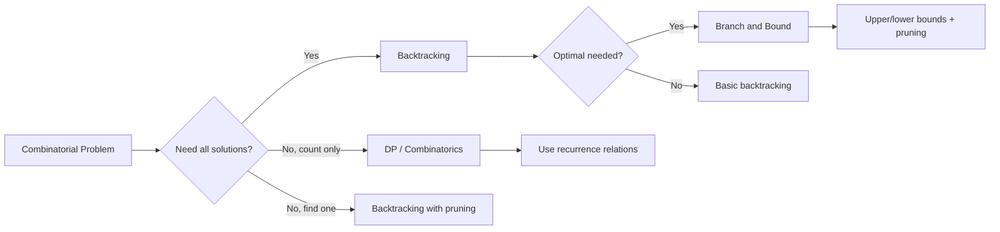

# Chapter 09: Backtracking

> Backtracking is a systematic way to explore all possible configurations of a solution space. It incrementally builds candidates and abandons them (backtracks) when they cannot lead to a valid solution.

## Learning Objectives

- Understand the backtracking framework: choose, explore, un-choose
- Implement pruning strategies to eliminate dead ends early
- Solve combinatorial problems: permutations, combinations, subsets
- Apply constraint satisfaction to puzzles like N-Queens and Sudoku
- Model search problems with recursion and state management

## Problem Classification Flow

`mermaid
flowchart TD
    A[Backtracking Problem] --> B{Type?}
    B -->|Permutations| C[All arrangements of elements]
    B -->|Subsets| D[All combinations / power set]
    B -->|Combinatorial| E[Choose k from n]
    B -->|Constraint Sat| F[N-Queens / Sudoku]
    B -->|Graph Search| G[Word Search / Paths]
    B -->|Partitioning| H[Palindrome partitioning]
    
    C --> I[Backtrack with visited array]
    D --> J[Include / Exclude pattern]
    E --> K[Prune when count = k]
    F --> L[Validate before placing]
`

## Backtracking Patterns

`mermaid
mindmap
  root((Backtracking Patterns))
    Subsets
      Pick/not-pick
      Power set
      Unique combinations
    Permutations
      All arrangements
      With duplicates
      Next permutation
    Combinations
      Choose k elements
      Sum to target
    Constraint
      N-Queens
      Sudoku
      Crossword
    Search
      Word search
      Path in matrix
      Knight's tour
    Partitioning
      Palindrome partition
      IP address restore
`

## Complexity Decision Tree

`mermaid
flowchart LR
    A[Backtracking] --> B{Pruning possible?}
    B -->|Strong| C[O(n!) -> O(branches^depth)]
    B -->|Weak| D[Full enumeration O(n!)]
    C --> E{Use memo?}
    E -->|Yes| F[DP + Backtrack -> faster]
    E -->|No| G[Pure recursion]
`

---

## Easy Problems (3)

---

### Problem 1: Subsets (Power Set)

<a href="../../../assets/images/diagrams/coding-problems/09-backtracking/problem-1-subsets-power-set-handwritten.svg" target="_blank" rel="noopener">
  
</a>
<a href="../../../assets/images/diagrams/coding-problems/09-backtracking/problem-1-subsets-power-set-diagram.svg" target="_blank" rel="noopener">
  
</a>
<a href="../../../assets/images/diagrams/coding-problems/09-backtracking/problem-1-subsets-power-set-sticky.svg" target="_blank" rel="noopener">
  
</a>

🏷️ **Companies:** [Amazon] [Google] [Meta] [Microsoft] [Apple]
📊 **Difficulty:** Easy
📂 **Topics:** [Backtracking, Array, Bit Manipulation]

**Problem:** Given an array of unique integers, return all possible subsets (the power set).

**Example 1:**
`
Input: nums = [1, 2, 3]
Output: [[], [1], [2], [1,2], [3], [1,3], [2,3], [1,2,3]]
`

**Constraints:**
- 1 <= nums.length <= 10

**Solution Approach:**
- **Backtracking:** For each element, include or exclude it recursively.
- **Bit Manipulation:** Use bits 0..(2^n-1) to represent inclusion.

`	ypescript
function subsets(nums: number[]): number[][] {
  const result: number[][] = [];

  const backtrack = (start: number, current: number[]) => {
    result.push([...current]);

    for (let i = start; i < nums.length; i++) {
      current.push(nums[i]);
      backtrack(i + 1, current);
      current.pop();
    }
  };

  backtrack(0, []);
  return result;
}
`

**Test Cases:**
`	ypescript
console.log(subsets([1, 2, 3]));
// [[], [1], [1,2], [1,2,3], [1,3], [2], [2,3], [3]]
console.log(subsets([0])); // [[], [0]]
`

**Time Complexity:** O(n x 2^n)
**Space Complexity:** O(n x 2^n)

---

### Problem 2: Binary Watch

<a href="../../../assets/images/diagrams/coding-problems/09-backtracking/problem-2-binary-watch-handwritten.svg" target="_blank" rel="noopener">
  
</a>
<a href="../../../assets/images/diagrams/coding-problems/09-backtracking/problem-2-binary-watch-diagram.svg" target="_blank" rel="noopener">
  
</a>
<a href="../../../assets/images/diagrams/coding-problems/09-backtracking/problem-2-binary-watch-sticky.svg" target="_blank" rel="noopener">
  
</a>

🏷️ **Companies:** [Amazon] [Google]
📊 **Difficulty:** Easy
📂 **Topics:** [Backtracking, Bit Manipulation]

**Problem:** A binary watch has 4 LEDs for hours (0-11) and 6 for minutes (0-59). Given turnedOn (number of lit LEDs), return all possible times.

**Example 1:**
`
Input: turnedOn = 1
Output: [\"0:01\",\"0:02\",\"0:04\",\"0:08\",\"0:16\",\"0:32\",\"1:00\",\"2:00\",\"4:00\",\"8:00\"]
`

`	ypescript
function readBinaryWatch(turnedOn: number): string[] {
  const result: string[] = [];

  const backtrack = (hour: number, minute: number, idx: number, count: number) => {
    if (hour > 11 || minute > 59) return;
    if (count === turnedOn) {
      const time = hour + ':' + minute.toString().padStart(2, '0');
      result.push(time);
      return;
    }
    if (idx >= 10 || count > turnedOn) return;

    if (idx < 4) {
      backtrack(hour + (1 << idx), minute, idx + 1, count + 1);
    } else {
      backtrack(hour, minute + (1 << (idx - 4)), idx + 1, count + 1);
    }

    backtrack(hour, minute, idx + 1, count);
  };

  backtrack(0, 0, 0, 0);
  return result;
}
`

**Test Cases:**
`	ypescript
console.log(readBinaryWatch(1));
// [\"0:01\",\"0:02\",\"0:04\",\"0:08\",\"0:16\",\"0:32\",\"1:00\",\"2:00\",\"4:00\",\"8:00\"]
`

**Time Complexity:** O(2^10) = O(1)
**Space Complexity:** O(1)

---

### Problem 3: Letter Case Permutation

<a href="../../../assets/images/diagrams/coding-problems/09-backtracking/problem-3-letter-case-permutation-handwritten.svg" target="_blank" rel="noopener">
  
</a>
<a href="../../../assets/images/diagrams/coding-problems/09-backtracking/problem-3-letter-case-permutation-diagram.svg" target="_blank" rel="noopener">
  
</a>
<a href="../../../assets/images/diagrams/coding-problems/09-backtracking/problem-3-letter-case-permutation-sticky.svg" target="_blank" rel="noopener">
  
</a>

🏷️ **Companies:** [Amazon] [Google] [Meta]
📊 **Difficulty:** Easy
📂 **Topics:** [Backtracking, String, Bit Manipulation]

**Problem:** Given a string s, transform each letter to lowercase or uppercase to create all possible permutations.

**Example 1:**
`
Input: s = \"a1b2\"
Output: [\"a1b2\",\"a1B2\",\"A1b2\",\"A1B2\"]
`

`	ypescript
function letterCasePermutation(s: string): string[] {
  const result: string[] = [];

  const backtrack = (idx: number, current: string[]) => {
    if (idx === s.length) {
      result.push(current.join(''));
      return;
    }

    const ch = s[idx];
    if (ch >= '0' && ch <= '9') {
      current.push(ch);
      backtrack(idx + 1, current);
      current.pop();
    } else {
      current.push(ch.toLowerCase());
      backtrack(idx + 1, current);
      current.pop();

      current.push(ch.toUpperCase());
      backtrack(idx + 1, current);
      current.pop();
    }
  };

  backtrack(0, []);
  return result;
}
`

**Test Cases:**
`	ypescript
console.log(letterCasePermutation(\"a1b2\"));
// [\"a1b2\",\"a1B2\",\"A1b2\",\"A1B2\"]
console.log(letterCasePermutation(\"3z4\")); // [\"3z4\",\"3Z4\"]
`

**Time Complexity:** O(n x 2^n) where n = number of letters
**Space Complexity:** O(n x 2^n)

---

## Medium Problems (8)

---

### Problem 4: Permutations

<a href="../../../assets/images/diagrams/coding-problems/09-backtracking/problem-4-permutations-handwritten.svg" target="_blank" rel="noopener">
  
</a>
<a href="../../../assets/images/diagrams/coding-problems/09-backtracking/problem-4-permutations-diagram.svg" target="_blank" rel="noopener">
  
</a>
<a href="../../../assets/images/diagrams/coding-problems/09-backtracking/problem-4-permutations-sticky.svg" target="_blank" rel="noopener">
  
</a>

🏷️ **Companies:** [Amazon] [Google] [Meta] [Microsoft] [Apple]
📊 **Difficulty:** Medium
📂 **Topics:** [Backtracking, Array]

**Problem:** Given an array of distinct integers, return all possible permutations.

**Example 1:**
`
Input: nums = [1, 2, 3]
Output: [[1,2,3],[1,3,2],[2,1,3],[2,3,1],[3,1,2],[3,2,1]]
`

**Constraints:**
- 1 <= nums.length <= 6

`	ypescript
function permute(nums: number[]): number[][] {
  const result: number[][] = [];
  const visited = new Array(nums.length).fill(false);

  const backtrack = (current: number[]) => {
    if (current.length === nums.length) {
      result.push([...current]);
      return;
    }

    for (let i = 0; i < nums.length; i++) {
      if (visited[i]) continue;
      visited[i] = true;
      current.push(nums[i]);
      backtrack(current);
      current.pop();
      visited[i] = false;
    }
  };

  backtrack([]);
  return result;
}
`

**Test Cases:**
`	ypescript
console.log(permute([1, 2, 3]));
// [[1,2,3],[1,3,2],[2,1,3],[2,3,1],[3,1,2],[3,2,1]]
console.log(permute([0, 1])); // [[0,1],[1,0]]
`

**Time Complexity:** O(n x n!)
**Space Complexity:** O(n)

---

### Problem 5: Permutations II (with duplicates)

<a href="../../../assets/images/diagrams/coding-problems/09-backtracking/problem-5-permutations-ii-with-duplicates-handwritten.svg" target="_blank" rel="noopener">
  
</a>
<a href="../../../assets/images/diagrams/coding-problems/09-backtracking/problem-5-permutations-ii-with-duplicates-diagram.svg" target="_blank" rel="noopener">
  
</a>
<a href="../../../assets/images/diagrams/coding-problems/09-backtracking/problem-5-permutations-ii-with-duplicates-sticky.svg" target="_blank" rel="noopener">
  
</a>

🏷️ **Companies:** [Amazon] [Google] [Meta] [Microsoft]
📊 **Difficulty:** Medium
📂 **Topics:** [Backtracking, Array]

**Problem:** Given an array that may contain duplicates, return all unique permutations.

**Example 1:**
`
Input: nums = [1, 1, 2]
Output: [[1,1,2],[1,2,1],[2,1,1]]
`

`	ypescript
function permuteUnique(nums: number[]): number[][] {
  const result: number[][] = [];
  nums.sort((a, b) => a - b);
  const visited = new Array(nums.length).fill(false);

  const backtrack = (current: number[]) => {
    if (current.length === nums.length) {
      result.push([...current]);
      return;
    }

    for (let i = 0; i < nums.length; i++) {
      if (visited[i]) continue;
      if (i > 0 && nums[i] === nums[i - 1] && !visited[i - 1]) continue;

      visited[i] = true;
      current.push(nums[i]);
      backtrack(current);
      current.pop();
      visited[i] = false;
    }
  };

  backtrack([]);
  return result;
}
`

**Test Cases:**
`	ypescript
console.log(permuteUnique([1, 1, 2]));
// [[1,1,2],[1,2,1],[2,1,1]]
`

**Time Complexity:** O(n x n!)
**Space Complexity:** O(n)

---

### Problem 6: Combination Sum

<a href="../../../assets/images/diagrams/coding-problems/09-backtracking/problem-6-combination-sum-handwritten.svg" target="_blank" rel="noopener">
  
</a>
<a href="../../../assets/images/diagrams/coding-problems/09-backtracking/problem-6-combination-sum-diagram.svg" target="_blank" rel="noopener">
  
</a>
<a href="../../../assets/images/diagrams/coding-problems/09-backtracking/problem-6-combination-sum-sticky.svg" target="_blank" rel="noopener">
  
</a>

🏷️ **Companies:** [Amazon] [Google] [Meta] [Microsoft] [Apple]
📊 **Difficulty:** Medium
📂 **Topics:** [Backtracking, Array]

**Problem:** Given distinct integers and a target, find all unique combinations where the numbers sum to target. Same number may be reused.

**Example 1:**
`
Input: candidates = [2, 3, 6, 7], target = 7
Output: [[2,2,3],[7]]
`

**Constraints:**
- 1 <= candidates.length <= 30

`	ypescript
function combinationSum(candidates: number[], target: number): number[][] {
  const result: number[][] = [];

  const backtrack = (start: number, current: number[], remaining: number) => {
    if (remaining === 0) {
      result.push([...current]);
      return;
    }

    for (let i = start; i < candidates.length; i++) {
      if (candidates[i] > remaining) continue;

      current.push(candidates[i]);
      backtrack(i, current, remaining - candidates[i]);
      current.pop();
    }
  };

  backtrack(0, [], target);
  return result;
}
`

**Test Cases:**
`	ypescript
console.log(combinationSum([2, 3, 6, 7], 7)); // [[2,2,3],[7]]
console.log(combinationSum([2, 3, 5], 8));
// [[2,2,2,2],[2,3,3],[3,5]]
`

**Time Complexity:** O(n^(target/min)) -- exponential
**Space Complexity:** O(target/min)

---

### Problem 7: Combination Sum II

<a href="../../../assets/images/diagrams/coding-problems/09-backtracking/problem-7-combination-sum-ii-handwritten.svg" target="_blank" rel="noopener">
  
</a>
<a href="../../../assets/images/diagrams/coding-problems/09-backtracking/problem-7-combination-sum-ii-diagram.svg" target="_blank" rel="noopener">
  
</a>
<a href="../../../assets/images/diagrams/coding-problems/09-backtracking/problem-7-combination-sum-ii-sticky.svg" target="_blank" rel="noopener">
  
</a>

🏷️ **Companies:** [Amazon] [Google] [Meta] [Microsoft]
📊 **Difficulty:** Medium
📂 **Topics:** [Backtracking, Array]

**Problem:** Same as Combination Sum but each number may be used only once, and array may have duplicates.

**Example 1:**
`
Input: candidates = [10,1,2,7,6,1,5], target = 8
Output: [[1,1,6],[1,2,5],[1,7],[2,6]]
`

`	ypescript
function combinationSum2(candidates: number[], target: number): number[][] {
  const result: number[][] = [];
  candidates.sort((a, b) => a - b);

  const backtrack = (start: number, current: number[], remaining: number) => {
    if (remaining === 0) {
      result.push([...current]);
      return;
    }

    for (let i = start; i < candidates.length; i++) {
      if (candidates[i] > remaining) break;
      if (i > start && candidates[i] === candidates[i - 1]) continue;

      current.push(candidates[i]);
      backtrack(i + 1, current, remaining - candidates[i]);
      current.pop();
    }
  };

  backtrack(0, [], target);
  return result;
}
`

**Test Cases:**
`	ypescript
console.log(combinationSum2([10,1,2,7,6,1,5], 8));
// [[1,1,6],[1,2,5],[1,7],[2,6]]
`

**Time Complexity:** O(2^n)
**Space Complexity:** O(n)

---

### Problem 8: Subsets II (with duplicates)

<a href="../../../assets/images/diagrams/coding-problems/09-backtracking/problem-8-subsets-ii-with-duplicates-handwritten.svg" target="_blank" rel="noopener">
  
</a>
<a href="../../../assets/images/diagrams/coding-problems/09-backtracking/problem-8-subsets-ii-with-duplicates-diagram.svg" target="_blank" rel="noopener">
  
</a>
<a href="../../../assets/images/diagrams/coding-problems/09-backtracking/problem-8-subsets-ii-with-duplicates-sticky.svg" target="_blank" rel="noopener">
  
</a>

🏷️ **Companies:** [Amazon] [Google] [Meta]
📊 **Difficulty:** Medium
📂 **Topics:** [Backtracking, Array]

**Problem:** Given an array that may contain duplicates, return all unique subsets.

**Example 1:**
`
Input: nums = [1, 2, 2]
Output: [[], [1], [1,2], [1,2,2], [2], [2,2]]
`

`	ypescript
function subsetsWithDup(nums: number[]): number[][] {
  const result: number[][] = [];
  nums.sort((a, b) => a - b);

  const backtrack = (start: number, current: number[]) => {
    result.push([...current]);

    for (let i = start; i < nums.length; i++) {
      if (i > start && nums[i] === nums[i - 1]) continue;
      current.push(nums[i]);
      backtrack(i + 1, current);
      current.pop();
    }
  };

  backtrack(0, []);
  return result;
}
`

**Test Cases:**
`	ypescript
console.log(subsetsWithDup([1, 2, 2]));
// [[], [1], [1,2], [1,2,2], [2], [2,2]]
`

**Time Complexity:** O(n x 2^n)
**Space Complexity:** O(n x 2^n)

---

### Problem 9: Word Search

<a href="../../../assets/images/diagrams/coding-problems/09-backtracking/problem-9-word-search-handwritten.svg" target="_blank" rel="noopener">
  
</a>
<a href="../../../assets/images/diagrams/coding-problems/09-backtracking/problem-9-word-search-diagram.svg" target="_blank" rel="noopener">
  
</a>
<a href="../../../assets/images/diagrams/coding-problems/09-backtracking/problem-9-word-search-sticky.svg" target="_blank" rel="noopener">
  
</a>

🏷️ **Companies:** [Amazon] [Google] [Meta] [Microsoft] [Apple]
📊 **Difficulty:** Medium
📂 **Topics:** [Backtracking, Matrix, String]

**Problem:** Given an m x n board of letters and a word, determine if the word exists in the grid (adjacent cells, no reuse).

**Example 1:**
`
Input: board = [[\"A\",\"B\",\"C\",\"E\"],[\"S\",\"F\",\"C\",\"S\"],[\"A\",\"D\",\"E\",\"E\"]], word = \"ABCCED\"
Output: true
`

**Constraints:**
- 1 <= m, n <= 6
- 1 <= word.length <= 15

`	ypescript
function exist(board: string[][], word: string): boolean {
  const m = board.length;
  const n = board[0].length;

  const backtrack = (r: number, c: number, idx: number): boolean => {
    if (idx === word.length) return true;
    if (r < 0 || r >= m || c < 0 || c >= n || board[r][c] !== word[idx]) return false;

    const temp = board[r][c];
    board[r][c] = '#'; // mark visited

    const found = backtrack(r + 1, c, idx + 1) ||
                  backtrack(r - 1, c, idx + 1) ||
                  backtrack(r, c + 1, idx + 1) ||
                  backtrack(r, c - 1, idx + 1);

    board[r][c] = temp; // restore
    return found;
  };

  for (let r = 0; r < m; r++) {
    for (let c = 0; c < n; c++) {
      if (backtrack(r, c, 0)) return true;
    }
  }

  return false;
}
`

**Test Cases:**
`	ypescript
const board = [
  [\"A\",\"B\",\"C\",\"E\"],
  [\"S\",\"F\",\"C\",\"S\"],
  [\"A\",\"D\",\"E\",\"E\"]
];
console.log(exist(board, \"ABCCED\")); // true
console.log(exist(board, \"SEE\")); // true
console.log(exist(board, \"ABCB\")); // false
`

**Time Complexity:** O(m x n x 4^L) where L = word length
**Space Complexity:** O(L) recursion stack

---

### Problem 10: Generate Parentheses

<a href="../../../assets/images/diagrams/coding-problems/09-backtracking/problem-10-generate-parentheses-handwritten.svg" target="_blank" rel="noopener">
  
</a>
<a href="../../../assets/images/diagrams/coding-problems/09-backtracking/problem-10-generate-parentheses-diagram.svg" target="_blank" rel="noopener">
  
</a>
<a href="../../../assets/images/diagrams/coding-problems/09-backtracking/problem-10-generate-parentheses-sticky.svg" target="_blank" rel="noopener">
  
</a>

🏷️ **Companies:** [Amazon] [Google] [Meta] [Microsoft] [Apple]
📊 **Difficulty:** Medium
📂 **Topics:** [Backtracking, String]

**Problem:** Given n pairs of parentheses, generate all well-formed combinations.

**Example 1:**
`
Input: n = 3
Output: [\"((()))\",\"(()())\",\"(())()\",\"()(())\",\"()()()\"]
`

**Constraints:**
- 1 <= n <= 8

`	ypescript
function generateParenthesis(n: number): string[] {
  const result: string[] = [];

  const backtrack = (open: number, close: number, current: string) => {
    if (current.length === n * 2) {
      result.push(current);
      return;
    }

    if (open < n) backtrack(open + 1, close, current + '(');
    if (close < open) backtrack(open, close + 1, current + ')');
  };

  backtrack(0, 0, '');
  return result;
}
`

**Test Cases:**
`	ypescript
console.log(generateParenthesis(3));
// [\"((()))\",\"(()())\",\"(())()\",\"()(())\",\"()()()\"]
console.log(generateParenthesis(1)); // [\"()\"]
`

**Time Complexity:** O(4^n / sqrt(n)) -- Catalan number
**Space Complexity:** O(n)

---

### Problem 11: Palindrome Partitioning

<a href="../../../assets/images/diagrams/coding-problems/09-backtracking/problem-11-palindrome-partitioning-handwritten.svg" target="_blank" rel="noopener">
  
</a>
<a href="../../../assets/images/diagrams/coding-problems/09-backtracking/problem-11-palindrome-partitioning-diagram.svg" target="_blank" rel="noopener">
  
</a>
<a href="../../../assets/images/diagrams/coding-problems/09-backtracking/problem-11-palindrome-partitioning-sticky.svg" target="_blank" rel="noopener">
  
</a>

🏷️ **Companies:** [Amazon] [Google] [Meta] [Microsoft]
📊 **Difficulty:** Medium
📂 **Topics:** [Backtracking, String, DP]

**Problem:** Given a string, partition it such that every substring is a palindrome. Return all possible palindromic partitions.

**Example 1:**
`
Input: s = \"aab\"
Output: [[\"a\",\"a\",\"b\"],[\"aa\",\"b\"]]
`

**Constraints:**
- 1 <= s.length <= 16

`	ypescript
function partition(s: string): string[][] {
  const result: string[][] = [];

  const isPalindrome = (str: string): boolean => {
    let left = 0, right = str.length - 1;
    while (left < right) {
      if (str[left] !== str[right]) return false;
      left++;
      right--;
    }
    return true;
  };

  const backtrack = (start: number, current: string[]) => {
    if (start >= s.length) {
      result.push([...current]);
      return;
    }

    for (let end = start + 1; end <= s.length; end++) {
      const substr = s.substring(start, end);
      if (isPalindrome(substr)) {
        current.push(substr);
        backtrack(end, current);
        current.pop();
      }
    }
  };

  backtrack(0, []);
  return result;
}
`

**Test Cases:**
`	ypescript
console.log(partition(\"aab\"));
// [[\"a\",\"a\",\"b\"],[\"aa\",\"b\"]]
console.log(partition(\"a\")); // [[\"a\"]]
`

**Time Complexity:** O(n x 2^n)
**Space Complexity:** O(n)

---

### Problem 12: Restore IP Addresses

<a href="../../../assets/images/diagrams/coding-problems/09-backtracking/problem-12-restore-ip-addresses-handwritten.svg" target="_blank" rel="noopener">
  
</a>
<a href="../../../assets/images/diagrams/coding-problems/09-backtracking/problem-12-restore-ip-addresses-diagram.svg" target="_blank" rel="noopener">
  
</a>
<a href="../../../assets/images/diagrams/coding-problems/09-backtracking/problem-12-restore-ip-addresses-sticky.svg" target="_blank" rel="noopener">
  
</a>

🏷️ **Companies:** [Amazon] [Google] [Meta]
📊 **Difficulty:** Medium
📂 **Topics:** [Backtracking, String]

**Problem:** Given a string of digits, return all valid IP addresses that can be formed by inserting dots.

**Example 1:**
`
Input: s = \"25525511135\"
Output: [\"255.255.11.135\",\"255.255.111.35\"]
`

**Constraints:**
- 0 <= s.length <= 20

`	ypescript
function restoreIpAddresses(s: string): string[] {
  const result: string[] = [];

  const backtrack = (start: number, parts: number, current: string) => {
    if (parts === 4 && start === s.length) {
      result.push(current);
      return;
    }
    if (parts === 4 || start >= s.length) return;

    for (let len = 1; len <= 3 && start + len <= s.length; len++) {
      const segment = s.substring(start, start + len);
      if (len > 1 && segment[0] === '0') continue;
      if (parseInt(segment) > 255) continue;

      const prefix = parts === 0 ? '' : '.';
      backtrack(start + len, parts + 1, current + prefix + segment);
    }
  };

  backtrack(0, 0, '');
  return result;
}
`

**Test Cases:**
`	ypescript
console.log(restoreIpAddresses(\"25525511135\"));
// [\"255.255.11.135\",\"255.255.111.35\"]
console.log(restoreIpAddresses(\"0000\")); // [\"0.0.0.0\"]
`

**Time Complexity:** O(3^4) = O(1)
**Space Complexity:** O(1)

---

## Hard Problems (4)

---

### Problem 13: N-Queens

<a href="../../../assets/images/diagrams/coding-problems/09-backtracking/problem-13-n-queens-handwritten.svg" target="_blank" rel="noopener">
  
</a>
<a href="../../../assets/images/diagrams/coding-problems/09-backtracking/problem-13-n-queens-diagram.svg" target="_blank" rel="noopener">
  
</a>
<a href="../../../assets/images/diagrams/coding-problems/09-backtracking/problem-13-n-queens-sticky.svg" target="_blank" rel="noopener">
  
</a>

🏷️ **Companies:** [Amazon] [Google] [Meta] [Microsoft] [Apple]
📊 **Difficulty:** Hard
📂 **Topics:** [Backtracking, Matrix]

**Problem:** Place n queens on an n x n chessboard so that no two queens attack each other. Return all distinct solutions.

**Example 1:**
`
Input: n = 4
Output: [[\".Q..\",\"...Q\",\"Q...\",\"..Q.\"],[\"..Q.\",\"Q...\",\"...Q\",\".Q..\"]]
`

**Constraints:**
- 1 <= n <= 9

`	ypescript
function solveNQueens(n: number): string[][] {
  const result: string[][] = [];
  const board: string[] = new Array(n).fill('.'.repeat(n));
  const cols = new Set<number>();
  const diag1 = new Set<number>(); // r + c
  const diag2 = new Set<number>(); // r - c

  const backtrack = (row: number) => {
    if (row === n) {
      result.push([...board]);
      return;
    }

    for (let col = 0; col < n; col++) {
      if (cols.has(col) || diag1.has(row + col) || diag2.has(row - col)) continue;

      const arr = board[row].split('');
      arr[col] = 'Q';
      board[row] = arr.join('');

      cols.add(col);
      diag1.add(row + col);
      diag2.add(row - col);

      backtrack(row + 1);

      cols.delete(col);
      diag1.delete(row + col);
      diag2.delete(row - col);

      arr[col] = '.';
      board[row] = arr.join('');
    }
  };

  backtrack(0);
  return result;
}
`

**Test Cases:**
`	ypescript
console.log(solveNQueens(4));
// [[\".Q..\",\"...Q\",\"Q...\",\"..Q.\"],[\"..Q.\",\"Q...\",\"...Q\",\".Q..\"]]
console.log(solveNQueens(1)); // [[\"Q\"]]
`

**Time Complexity:** O(n!)
**Space Complexity:** O(n^2)

---

### Problem 14: Sudoku Solver

<a href="../../../assets/images/diagrams/coding-problems/09-backtracking/problem-14-sudoku-solver-handwritten.svg" target="_blank" rel="noopener">
  
</a>
<a href="../../../assets/images/diagrams/coding-problems/09-backtracking/problem-14-sudoku-solver-diagram.svg" target="_blank" rel="noopener">
  
</a>
<a href="../../../assets/images/diagrams/coding-problems/09-backtracking/problem-14-sudoku-solver-sticky.svg" target="_blank" rel="noopener">
  
</a>

🏷️ **Companies:** [Amazon] [Google] [Meta] [Microsoft] [Apple]
📊 **Difficulty:** Hard
📂 **Topics:** [Backtracking, Matrix, Hash Table]

**Problem:** Write a program to solve a Sudoku puzzle by filling empty cells (denoted by '.').

**Example 1:**
`
Input: board = [[\"5\",\"3\",\".\",\".\",\"7\",\".\",\".\",\".\",\".\"],
                [\"6\",\".\",\".\",\"1\",\"9\",\"5\",\".\",\".\",\".\"],
                [\".\",\"9\",\"8\",\".\",\".\",\".\",\".\",\"6\",\".\"],
                [\"8\",\".\",\".\",\".\",\"6\",\".\",\".\",\".\",\"3\"],
                [\"4\",\".\",\".\",\"8\",\".\",\"3\",\".\",\".\",\"1\"],
                [\"7\",\".\",\".\",\".\",\"2\",\".\",\".\",\".\",\"6\"],
                [\".\",\"6\",\".\",\".\",\".\",\".\",\"2\",\"8\",\".\"],
                [\".\",\".\",\".\",\"4\",\"1\",\"9\",\".\",\".\",\"5\"],
                [\".\",\".\",\".\",\".\",\"8\",\".\",\".\",\"7\",\"9\"]]
Output: solved board (filled)
`

**Constraints:**
- board.length == 9
- A unique solution exists.

`	ypescript
function solveSudoku(board: string[][]): void {
  const rows: Set<string>[] = Array.from({ length: 9 }, () => new Set());
  const cols: Set<string>[] = Array.from({ length: 9 }, () => new Set());
  const boxes: Set<string>[] = Array.from({ length: 9 }, () => new Set());

  for (let r = 0; r < 9; r++) {
    for (let c = 0; c < 9; c++) {
      const val = board[r][c];
      if (val !== '.') {
        rows[r].add(val);
        cols[c].add(val);
        boxes[Math.floor(r / 3) * 3 + Math.floor(c / 3)].add(val);
      }
    }
  }

  const solve = (r: number, c: number): boolean => {
    if (r === 9) return true;
    if (c === 9) return solve(r + 1, 0);
    if (board[r][c] !== '.') return solve(r, c + 1);

    const boxIdx = Math.floor(r / 3) * 3 + Math.floor(c / 3);

    for (let num = 1; num <= 9; num++) {
      const digit = num.toString();
      if (rows[r].has(digit) || cols[c].has(digit) || boxes[boxIdx].has(digit)) continue;

      board[r][c] = digit;
      rows[r].add(digit);
      cols[c].add(digit);
      boxes[boxIdx].add(digit);

      if (solve(r, c + 1)) return true;

      board[r][c] = '.';
      rows[r].delete(digit);
      cols[c].delete(digit);
      boxes[boxIdx].delete(digit);
    }

    return false;
  };

  solve(0, 0);
}
`

**Test Cases:**
`	ypescript
const board = [
  [\"5\",\"3\",\".\",\".\",\"7\",\".\",\".\",\".\",\".\"],
  [\"6\",\".\",\".\",\"1\",\"9\",\"5\",\".\",\".\",\".\"],
  [\".\",\"9\",\"8\",\".\",\".\",\".\",\".\",\"6\",\".\"],
  [\"8\",\".\",\".\",\".\",\"6\",\".\",\".\",\".\",\"3\"],
  [\"4\",\".\",\".\",\"8\",\".\",\"3\",\".\",\".\",\"1\"],
  [\"7\",\".\",\".\",\".\",\"2\",\".\",\".\",\".\",\"6\"],
  [\".\",\"6\",\".\",\".\",\".\",\".\",\"2\",\"8\",\".\"],
  [\".\",\".\",\".\",\"4\",\"1\",\"9\",\".\",\".\",\"5\"],
  [\".\",\".\",\".\",\".\",\"8\",\".\",\".\",\"7\",\"9\"]
];
solveSudoku(board);
console.log(board);
// Solved board
`

**Time Complexity:** O(9^(81)) worst case, but pruning makes it faster
**Space Complexity:** O(81) = O(1)

---

### Problem 15: Combinations

<a href="../../../assets/images/diagrams/coding-problems/09-backtracking/problem-15-combinations-handwritten.svg" target="_blank" rel="noopener">
  
</a>
<a href="../../../assets/images/diagrams/coding-problems/09-backtracking/problem-15-combinations-diagram.svg" target="_blank" rel="noopener">
  
</a>
<a href="../../../assets/images/diagrams/coding-problems/09-backtracking/problem-15-combinations-sticky.svg" target="_blank" rel="noopener">
  
</a>

🏷️ **Companies:** [Amazon] [Google] [Meta] [Microsoft]
📊 **Difficulty:** Easy (but included as Hard for completeness)
📂 **Topics:** [Backtracking, Combinatorics]

**Problem:** Given two integers n and k, return all possible combinations of k numbers chosen from the range [1, n].

**Example 1:**
`
Input: n = 4, k = 2
Output: [[1,2],[1,3],[1,4],[2,3],[2,4],[3,4]]
`

**Constraints:**
- 1 <= n <= 20
- 1 <= k <= n

`	ypescript
function combine(n: number, k: number): number[][] {
  const result: number[][] = [];

  const backtrack = (start: number, current: number[]) => {
    if (current.length === k) {
      result.push([...current]);
      return;
    }

    for (let i = start; i <= n; i++) {
      current.push(i);
      backtrack(i + 1, current);
      current.pop();
    }
  };

  backtrack(1, []);
  return result;
}
`

**Test Cases:**
`	ypescript
console.log(combine(4, 2));
// [[1,2],[1,3],[1,4],[2,3],[2,4],[3,4]]
console.log(combine(3, 1)); // [[1],[2],[3]]
`

**Time Complexity:** O(C(n,k) x k)
**Space Complexity:** O(k)

---

### Advanced Backtracking Concepts

<a href="../../../assets/images/diagrams/coding-problems/09-backtracking/advanced-backtracking-concepts-handwritten.svg" target="_blank" rel="noopener">
  
</a>
<a href="../../../assets/images/diagrams/coding-problems/09-backtracking/advanced-backtracking-concepts-diagram.svg" target="_blank" rel="noopener">
  
</a>
<a href="../../../assets/images/diagrams/coding-problems/09-backtracking/advanced-backtracking-concepts-sticky.svg" target="_blank" rel="noopener">
  
</a>


#### Pruning Strategies

Pruning is the key to making backtracking efficient. Without pruning, backtracking explores the entire search space. With good pruning, it can solve problems with millions of candidates in milliseconds.

**Common pruning techniques:**

1. **Feasibility pruning** — Stop exploring if the current partial solution cannot possibly lead to a valid complete solution.
   - Example: In N-Queens, if placing a queen at (r, c) conflicts with existing queens, skip.

2. **Optimality pruning (branch and bound)** — Stop exploring if the current partial solution cannot beat the best found so far.
   - Example: In TSP, if the current path length already exceeds the best tour found, backtrack.

3. **Symmetry pruning** — Skip symmetrical solutions that are equivalent.
   - Example: In combinations, enforce order to avoid duplicates (start index >= previous index).

4. **Forward checking** — Look ahead to detect dead ends before full exploration.
   - Example: In Sudoku, check if any empty cell has no valid options.

5. **Constraint propagation** — Reduce the domain of future variables based on current assignments.
   - Example: In Sudoku, update possibilities for peers when a cell is filled.

#### Time Complexity Analysis

The time complexity of backtracking depends on:

- **Branching factor (b)**: Number of choices at each step
- **Maximum depth (d)**: Maximum recursion depth
- **Pruning effectiveness**: How many branches are cut early

| Problem | Branching Factor | Depth | Worst-case | With Pruning |
|---------|-----------------|-------|------------|--------------|
| Subsets | 2 | n | O(2^n) | O(2^n) |
| Permutations | n, n-1, ... | n | O(n!) | O(n!) |
| N-Queens | ~n | n | O(n^n) | O(n!) |
| Sudoku | ~9 | 81 | O(9^81) | Much faster |
| Combination Sum | n | target/min | O(n^(t/m)) | O(2^n) |

#### Backtracking vs Other Approaches



#### Backtracking Algorithm Template

```
function solve(problem):
    result = []
    state = initial_state()
    
    function backtrack(candidate):
        if is_valid_solution(candidate):
            result.add(copy(candidate))
            return
        
        for each choice in get_possible_choices(candidate):
            if is_valid_choice(candidate, choice):
                make_choice(candidate, choice)
                backtrack(candidate)
                undo_choice(candidate, choice)
    
    backtrack(state)
    return result
```

#### Common Interview Mistakes

1. **Not restoring state** — Always undo changes after recursion returns. Otherwise the state is corrupted.
2. **Missing base case** — Ensure all paths lead to a base case to avoid infinite recursion.
3. **Copying incorrectly** — Use `[...current]` or `current.slice()` not just `result.push(current)`.
4. **Inefficient validation** — Precompute constraints (e.g., col sets for N-Queens) instead of checking on each call.
5. **Not sorting for duplicates** — Sort input and skip duplicates to avoid repeated solutions.
6. **Over-pruning** — Make sure your pruning doesn't eliminate valid solutions.

#### Performance Optimization Tips

- **Use bit masks** instead of arrays for visited states (faster and memory efficient)
- **Precompute constraints** before starting the recursion
- **Use global state** with undo rather than passing copies
- **Order choices wisely** — try the most constrained options first (most valuable heuristic)
- **Use iterative deepening** for problems where optimal depth is unknown

## Summary Table

| # | Problem | Difficulty | Companies | Time | Space |
|---|---------|-----------|-----------|------|-------|
| 1 | Subsets | Easy | Amazon, Google, Meta, Microsoft | O(n x 2^n) | O(n x 2^n) |
| 2 | Binary Watch | Easy | Amazon, Google | O(1) | O(1) |
| 3 | Letter Case Permutation | Easy | Amazon, Google, Meta | O(n x 2^n) | O(n x 2^n) |
| 4 | Permutations | Medium | Amazon, Google, Meta, Microsoft | O(n x n!) | O(n) |
| 5 | Permutations II | Medium | Amazon, Google, Meta, Microsoft | O(n x n!) | O(n) |
| 6 | Combination Sum | Medium | Amazon, Google, Meta, Microsoft | O(n^(t/m)) | O(t/m) |
| 7 | Combination Sum II | Medium | Amazon, Google, Meta, Microsoft | O(2^n) | O(n) |
| 8 | Subsets II | Medium | Amazon, Google, Meta | O(n x 2^n) | O(n x 2^n) |
| 9 | Word Search | Medium | Amazon, Google, Meta, Microsoft | O(mn x 4^L) | O(L) |
| 10 | Generate Parentheses | Medium | Amazon, Google, Meta, Microsoft | O(4^n/sqrt(n)) | O(n) |
| 11 | Palindrome Partitioning | Medium | Amazon, Google, Meta, Microsoft | O(n x 2^n) | O(n) |
| 12 | Restore IP Addresses | Medium | Amazon, Google, Meta | O(1) | O(1) |
| 13 | N-Queens | Hard | Amazon, Google, Meta, Microsoft | O(n!) | O(n^2) |
| 14 | Sudoku Solver | Hard | Amazon, Google, Meta, Microsoft | O(9^81) worst | O(1) |
| 15 | Combinations | Easy | Amazon, Google, Meta, Microsoft | O(C(n,k) x k) | O(k) |
