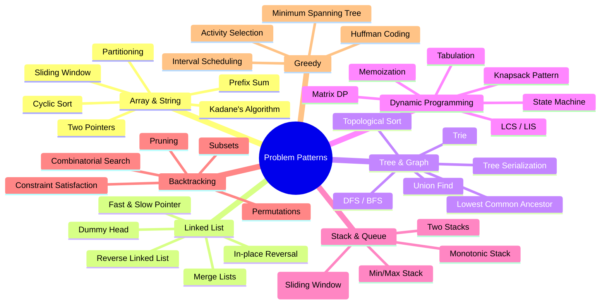
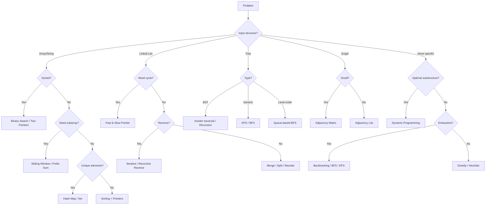

# Coding Problems Bank

> A comprehensive collection of 220 hand-picked coding problems organized by topic, difficulty, and company — designed to prepare you for technical interviews at top tech companies.

## Learning Objectives

By working through this problem bank systematically, you will:

- **Master core data structures**: Arrays, Strings, Linked Lists, Stacks, Queues, Trees, Graphs, and advanced structures
- **Develop algorithmic intuition**: Recognize problem patterns and apply optimal algorithms (DP, Greedy, Backtracking, Divide & Conquer)
- **Achieve interview readiness**: Solve 220 curated problems spanning Easy (65), Medium (108), and Hard (47) difficulty levels
- **Build TypeScript proficiency**: All solutions are implemented in TypeScript with tested, production-quality code
- **Understand trade-offs**: Every problem includes brute force and optimal approaches with complexity analysis
- **Gain company-specific exposure**: Problems tagged with frequent appearance at Amazon, Google, Microsoft, Meta, Apple, Netflix, and more

## How to Use This Problem Bank

### Recommended Workflow

```
┌─────────────────────────────────────────────────────────────────┐
│                   MASTER STUDY WORKFLOW                         │
├─────────────────────────────────────────────────────────────────┤
│                                                                 │
│  1. Pick a Topic → Read Theory → Attempt E→M→H Progression     │
│                                                                 │
│  2. For Each Problem:                                           │
│     ├─ Try for 20-30 min without hints                          │
│     ├─ If stuck: read brute force approach                      │
│     ├─ Try to optimize independently                            │
│     └─ Review optimal solution & implement in TypeScript        │
│                                                                 │
│  3. Track: Problem → Approach → Time → Complexity → Revisit?    │
│                                                                 │
│  4. Spaced Repetition: Revisit 20% of problems weekly           │
│                                                                 │
└─────────────────────────────────────────────────────────────────┘
```

### Problem Distribution

| Topic | Easy | Medium | Hard | Total | Key Companies |
|-------|------|--------|------|-------|---------------|
| 01 Arrays | 10 | 14 | 6 | 30 | Amazon, Google, Meta, Microsoft |
| 02 Strings | 8 | 12 | 5 | 25 | Amazon, Google, Microsoft, Apple |
| 03 Linked Lists | 7 | 10 | 3 | 20 | Amazon, Microsoft, Meta |
| 04 Stacks & Queues | 7 | 10 | 3 | 20 | Google, Amazon, Microsoft |
| 05 Trees | 10 | 14 | 6 | 30 | Amazon, Google, Meta |
| 06 Graphs | 5 | 14 | 6 | 25 | Google, Amazon, Meta |
| 07 Dynamic Programming | 10 | 18 | 7 | 35 | Amazon, Google, Microsoft |
| 08 Greedy | 5 | 8 | 2 | 15 | Amazon, Microsoft, Google |
| 09 Backtracking | 3 | 8 | 4 | 15 | Amazon, Google, Microsoft |
| **Total** | **65** | **108** | **47** | **220** | |

### Difficulty Progression Path

```
Easy (65 problems) ──────► Medium (108 problems) ──────► Hard (47 problems)
   │                              │                              │
   ├─ Build confidence            ├─ Core interview bar          ├─ Stretch goals
   ├─ Learn patterns              ├─ Most common difficulty      ├─ FAANG+ final rounds
   └─ Master syntax              └─ Deepen intuition            └─ System design adjacent
```

## Problem-Solving Patterns



## Algorithm Decision Tree



## Complexity Comparison Framework

```mermaid
quadrantChart
    title Algorithm Efficiency Quadrants
    x-axis Fast Execution --> Slow Execution
    y-axis Low Memory --> High Memory
    quadrant-1 Ideal: O(n) time, O(1) space
    quadrant-2 Time-Efficient: O(n log n) time, O(n) space
    quadrant-3 Balanced: O(n²) time, O(1) space
    quadrant-4 Resource-Heavy: O(n²) time, O(n) space
    Two Pointers: [0.15, 0.15]
    Sliding Window: [0.2, 0.2]
    Hash Map: [0.15, 0.45]
    DP Tabulation: [0.55, 0.6]
    Backtracking: [0.7, 0.4]
    Sorting: [0.35, 0.3]
    DFS/BFS: [0.4, 0.5]
    Brute Force: [0.85, 0.2]
```

## 12-Week Study Plan

### Phase 1: Foundations (Weeks 1-4)
| Week | Focus | Problems | Target |
|------|-------|----------|--------|
| 1 | Arrays & Hashing | 01-arrays (E: 1-10) | 10 Easy |
| 2 | Strings | 02-strings (E: 1-8) | 8 Easy |
| 3 | Linked Lists + Stacks/Queues | 03-linked-lists (E: 1-7), 04-stacks-queues (E: 1-7) | 14 Easy |
| 4 | Trees (Basic) | 05-trees (E: 1-10) | 10 Easy |

### Phase 2: Core Algorithms (Weeks 5-8)
| Week | Focus | Problems | Target |
|------|-------|----------|--------|
| 5 | Arrays & Strings (Medium) | 01-arrays (M: 1-7), 02-strings (M: 1-6) | 13 Medium |
| 6 | Linked Lists + Stacks (Medium) | 03-linked-lists (M: 1-5), 04-stacks-queues (M: 1-5) | 10 Medium |
| 7 | Trees + Graphs (Medium) | 05-trees (M: 1-7), 06-graphs (M: 1-5) | 12 Medium |
| 8 | Dynamic Programming (Intro) | 07-dp (E: 1-5, M: 1-4) | 9 problems |

### Phase 3: Advanced (Weeks 9-12)
| Week | Focus | Problems | Target |
|------|-------|----------|--------|
| 9 | DP + Greedy | 07-dp (M: 5-12), 08-greedy (all) | 20 problems |
| 10 | Backtracking + Hard Arrays | 09-backtracking (all), 01-arrays (H: 1-6) | 21 problems |
| 11 | Hard Trees, Graphs, Strings | 05-trees (H: 1-6), 06-graphs (H: 1-6), 02-strings (H: 1-5) | 17 problems |
| 12 | Mixed Review + Mock Interviews | Revisit flagged problems + random selection | ~15 problems |

### Weekly Schedule Template
```
Monday:   3 new problems (attempt 20-30 min each)
Tuesday:  Review + 2 new problems
Wednesday: 3 new problems
Thursday: Review + 2 new problems
Friday:   3 new problems + week review
Saturday: Spaced repetition (previous weeks)
Sunday:   Rest / Light review of patterns
```

## Tips for Interview Preparation

### Before the Interview

1. **Master the fundamentals first**: Don't jump to hard problems before you can solve Easy ones in under 15 minutes with optimal solutions.

2. **Focus on patterns, not memorization**: Understanding that "Longest Substring Without Repeating Characters" and "Minimum Window Substring" both use sliding window is more valuable than memorizing any single solution.

3. **Practice on paper or a whiteboard**: Real interviews don't have an IDE with autocomplete. Practice writing code by hand or in a plain text editor.

4. **Verbalize your thinking**: As you solve problems, practice speaking your thought process aloud. Explain trade-offs, mention edge cases, and discuss complexity.

5. **Use the STAR approach for each problem**:
   - **S**ituation: Restate the problem in your own words
   - **T**ask: Clarify inputs, outputs, and constraints
   - **A**pproach: Discuss brute force → identify bottlenecks → optimize
   - **R**esult: Implement, test with examples, analyze complexity

### During the Interview

1. **Clarify before coding**: Ask about input size, edge cases, negative numbers, empty inputs, duplicate values.

2. **Start with brute force**: It shows you can solve problems, then optimize. Never jump straight to the optimal solution without acknowledging the naive approach.

3. **Write clean code**:
   - Use meaningful variable names (not `i`, `j`, `k` for everything)
   - Break down complex logic into helper functions
   - Handle edge cases at the start
   - Add comments for non-obvious logic

4. **Test your solution**: Walk through your code with the example input. Check edge cases (empty, single element, duplicates).

5. **Analyze complexity**: Always state time and space complexity. Be prepared to discuss trade-offs.

### Common Mistakes to Avoid

| Mistake | Why It Hurts | Better Approach |
|---------|-------------|-----------------|
| Jumping to code | No understanding of problem | Clarify first, then solve |
| Silently solving | Interviewer can't help | Talk through your thinking |
| Ignoring constraints | Wrong algorithm choice | Ask about input size limits |
| Messy code | Hard to debug | Write clean, modular code |
| No testing | Hidden bugs | Walk through example cases |
| Giving up too fast | Missed opportunity | Try brute force, then optimize |
| Not discussing trade-offs | Seems inexperienced | Compare time vs. space |

### Company-Specific Preparation

| Company | Focus Areas | Typical Difficulty | Preparation Strategy |
|---------|------------|-------------------|---------------------|
| **Amazon** | Arrays, Strings, Trees, OOD | Medium-Hard | 2-3 coding rounds + LP questions |
| **Google** | Graphs, DP, Math | Medium-Hard (Harder avg) | 4-5 rounds, focus on optimization |
| **Meta** | Arrays, Strings, DP | Medium | 2 coding + 1 system design |
| **Microsoft** | Trees, Linked Lists, Strings | Easy-Medium | 3-4 rounds, focus on fundamentals |
| **Apple** | Arrays, Strings, embedded topics | Medium | 4-5 rounds, domain-specific |
| **Netflix** | System design + algorithms | Hard | Focus on scale and distributed systems |

### Resources to Complement This Bank

- **NeetCode 150**: Pattern-based problem set for concept reinforcement
- **LeetCode Discuss**: Company-specific interview experiences
- **Cracking the Coding Interview**: System design and behavioral prep
- **Grokking the Coding Interview**: Pattern recognition for common problem types
- **Pramp / interviewing.io**: Mock interviews with peers and professionals

## Problem Solving Framework: UMPIRE

```
U - Understand: Restate problem, ask clarifying questions, identify constraints
M - Match: Map problem to known patterns (sliding window, DP, BFS, etc.)
P - Plan: Outline approach, pseudocode, consider edge cases
I - Implement: Write clean TypeScript code with helper functions
R - Review: Walk through examples, check for bugs, analyze complexity
E - Evaluate: Discuss trade-offs, alternative approaches, potential improvements
```

## Tracking Your Progress

Use this template to track each problem:

```
| # | Problem | Difficulty | Approach | Time | Space | Date | Revisit? |
|---|---------|-----------|----------|------|-------|------|----------|
| 1 | Two Sum | Easy | Hash Map | O(n) | O(n) | 2026-07-07 | No |
```

### Progress Milestones

| Milestone | Problems Solved | Status |
|-----------|----------------|--------|
| Beginner | 30+ | Start here |
| Intermediate | 80+ | Ready for most company screens |
| Advanced | 150+ | Competitive for FAANG+ |
| Expert | 200+ | Ready for senior-level interviews |

## Contribution Guide

This problem bank is maintained as part of the AI Engineering Journey curriculum. To contribute:

1. Fork the repository
2. Add your problem following the established format
3. Include TypeScript solution with test cases
4. Submit a PR with the problem tagged appropriately

### Problem Format Checklist

- [ ] Title, difficulty, company tags
- [ ] Clear problem description with examples
- [ ] Constraints section
- [ ] Brute force approach explanation
- [ ] Optimal approach explanation
- [ ] TypeScript solution code (tested)
- [ ] Test cases with expected outputs
- [ ] Time and space complexity analysis

---

> **Remember**: Consistency beats intensity. Solving 2-3 problems daily for 3 months will prepare you far better than cramming 50 problems in a weekend. Use this bank as your daily workout — each problem builds muscle memory for pattern recognition.

---

## Index of Chapters

| # | Chapter | Problems | Range |
|---|---------|----------|-------|
| 01 | [Arrays](01-arrays.md) | 30 | E10 · M14 · H6 |
| 02 | [Strings](02-strings.md) | 25 | E8 · M12 · H5 |
| 03 | [Linked Lists](03-linked-lists.md) | 20 | E7 · M10 · H3 |
| 04 | [Stacks & Queues](04-stacks-queues.md) | 20 | E7 · M10 · H3 |
| 05 | [Trees](05-trees.md) | 30 | E10 · M14 · H6 |
| 06 | [Graphs](06-graphs.md) | 25 | E5 · M14 · H6 |
| 07 | [Dynamic Programming](07-dynamic-programming.md) | 35 | E10 · M18 · H7 |
| 08 | [Greedy](08-greedy.md) | 15 | E5 · M8 · H2 |
| 09 | [Backtracking](09-backtracking.md) | 15 | E3 · M8 · H4 |
| | **Total** | **220** | **E65 · M108 · H47** |

## Detailed Problem-Solving Guide for Each Topic

### Arrays & Hashing
- **Core techniques**: Two pointers, sliding window, prefix sum, hash map
- **Key insight**: When you need O(1) lookup, use a hash map. When you need sorted order, consider sorting first.
- **Typical pitfalls**: Off-by-one errors, integer overflow, negative numbers in prefix sums
- **Start with**: Two Sum → Three Sum → Container With Most Water

### Strings
- **Core techniques**: Sliding window, character frequency arrays, two pointers
- **Key insight**: For palindrome problems, expand from center. For substring problems, use sliding window.
- **Typical pitfalls**: Unicode characters, empty strings, case sensitivity
- **Start with**: Valid Palindrome → Longest Substring Without Repeating Characters → Group Anagrams

### Linked Lists
- **Core techniques**: Fast & slow pointer, dummy node, recursion reversal
- **Key insight**: Draw the pointers! Visualizing pointer movement prevents bugs.
- **Typical pitfalls**: Null pointer exceptions, not handling single-element lists, circular references
- **Start with**: Reverse Linked List → Merge Two Sorted Lists → Linked List Cycle

### Stacks & Queues
- **Core techniques**: Monotonic stack, two-stack queue, deque for sliding window
- **Key insight**: Stack = LIFO for matching/nesting problems. Queue = FIFO for level-order.
- **Typical pitfalls**: Empty stack pops, confusing monotonic increasing vs decreasing
- **Start with**: Valid Parentheses → Min Stack → Daily Temperatures

### Trees
- **Core techniques**: Recursive DFS, iterative stack, BFS queue, Morris traversal
- **Key insight**: Inorder of BST gives sorted order. Level order uses BFS.
- **Typical pitfalls**: Null children, deep recursion causing stack overflow
- **Start with**: Max Depth → Validate BST → Level Order Traversal

### Graphs
- **Core techniques**: BFS for shortest path, DFS for connectivity, topological sort for dependencies
- **Key insight**: BFS finds shortest path in unweighted graphs. Adjacency list is most common representation.
- **Typical pitfalls**: Infinite loops from missing visited set, disconnected components
- **Start with**: Number of Islands → Clone Graph → Course Schedule

### Dynamic Programming
- **Core techniques**: Memoization (top-down), tabulation (bottom-up), state machine
- **Key insight**: Find the recurrence relation first. dp[i] = something with dp[i-1] or dp[i-2].
- **Typical pitfalls**: Wrong base cases, off-by-one in DP array indexing, missing memoization
- **Start with**: Climbing Stairs → House Robber → Coin Change

### Greedy
- **Core techniques**: Sorting + selection, two-pass optimization, interval scheduling
- **Key insight**: Not all problems can be solved greedily. Always verify the greedy choice property.
- **Typical pitfalls**: Assuming greedy works when DP is needed, wrong sort order
- **Start with**: Assign Cookies → Jump Game → Non-overlapping Intervals

### Backtracking
- **Core techniques**: Choose-explore-unchoose, pruning, constraint satisfaction
- **Key insight**: The branch and bound approach can dramatically reduce search space.
- **Typical pitfalls**: Forgetting to restore state, not pruning dead branches
- **Start with**: Subsets → Permutations → Generate Parentheses

## Interview Preparation Timeline

### 3 Months Before Interview
- Month 1: Arrays, Strings, Linked Lists (Easy + Medium)
- Month 2: Trees, Graphs, Hash Tables (Medium)
- Month 3: DP, Greedy, Backtracking + Mixed Review

### 1 Month Before Interview
- Week 1: Company-tagged problems (filter by target company)
- Week 2: Mock interviews (2-3 per week)
- Week 3: Hard problems + System design prep
- Week 4: Final review of weak areas

### 1 Week Before Interview
- Review your notes on patterns and approaches
- Practice 1-2 problems per day to stay sharp
- Get plenty of rest — avoid cramming

## Mock Interview Protocol

### 45-Minute Session Structure
```
Minutes 0-5:  Problem understanding and clarification
Minutes 5-10: Approach discussion (brute force, then optimize)
Minutes 10-30: Implementation in clean code
Minutes 30-35: Testing with examples and edge cases
Minutes 35-40: Complexity analysis
Minutes 40-45: Follow-up questions and discussion
```

### Self-Assessment Rubric

| Criteria | Poor | Fair | Good | Excellent |
|----------|------|------|------|-----------|
| Problem understanding | Needs hints | Basic understanding | Clear restatement | Identifies edge cases |
| Solution approach | No approach | Brute force only | Optimal with guidance | Optimal independently |
| Code quality | Buggy | Works for examples | Clean + handles edge cases | Production-quality |
| Complexity analysis | Cannot explain | Approximate | Precise | Trade-off discussion |
| Communication | Silent | Minimal | Verbalizes thinking | Interactive discussion |

## Daily Practice Schedule

### 2-Hour Session Breakdown

| Time | Activity | Purpose |
|------|----------|---------|
| 0:00 - 0:10 | Warm-up (1 Easy problem) | Get into coding mode |
| 0:10 - 0:40 | New Medium problem (attempt) | Practice problem-solving |
| 0:40 - 0:50 | Review solution | Learn optimal approaches |
| 0:50 - 1:10 | Implement optimal solution | Code quality practice |
| 1:10 - 1:30 | Revise 2 previously solved problems | Spaced repetition |
| 1:30 - 1:45 | Study one topic theory | Deepen understanding |
| 1:45 - 2:00 | Review mistakes log | Track progress |

### 1-Hour Quick Session (Busy Days)

| Time | Activity |
|------|----------|
| 0:00 - 0:10 | Quick warm-up (Easy problem) |
| 0:10 - 0:35 | Attempt one Medium/Hard problem |
| 0:35 - 0:50 | Analyze optimal solution |
| 0:50 - 1:00 | Review one past mistake |

## Recommended Resources by Topic

| Topic | Video Resource | Book Chapter | Practice |
|-------|---------------|--------------|----------|
| Arrays | NeetCode Array Playlist | CTCI Chapter 1 | This bank (30 problems) |
| Strings | Back to Back SWE | CTCI Chapter 1 | This bank (25 problems) |
| Linked Lists | CS Dojo Linked Lists | CTCI Chapter 2 | This bank (20 problems) |
| Stacks/Queues | HackerRank Stacks | CTCI Chapter 3 | This bank (20 problems) |
| Trees | AlgoExpert BST | CTCI Chapter 4 | This bank (30 problems) |
| Graphs | MIT 6.006 Graph Algorithms | CTCI Chapter 4 | This bank (25 problems) |
| DP | Tushar Roy DP Playlist | CTCI Chapter 8 | This bank (35 problems) |
| Greedy | Algorithms Live! | CLRS Chapter 16 | This bank (18 problems) |
| Backtracking | Back to Back SWE | CLRS Chapter 5 | This bank (15 problems) |

## Problem Solving Templates

### Two Pointers Template
```typescript
function twoPointerTemplate(arr: number[]): returnType {
  let left = 0;
  let right = arr.length - 1;

  while (left < right) {
    // Process arr[left] and arr[right]
    if (condition) {
      left++; // or right--
    } else {
      right--; // or left++
    }
  }

  return result;
}
```

### Sliding Window Template
```typescript
function slidingWindowTemplate(s: string): number {
  const map = new Map(); // or array for chars
  let left = 0;
  let result = 0;

  for (let right = 0; right < s.length; right++) {
    // Add s[right] to window
    while (window is invalid) {
      // Remove s[left] from window
      left++;
    }
    // Update result with valid window
    result = Math.max(result, right - left + 1);
  }

  return result;
}
```

### DFS/BFS Template
```typescript
function dfsTemplate(root: TreeNode | null): void {
  if (!root) return;
  // Process root
  dfsTemplate(root.left);
  dfsTemplate(root.right);
}

function bfsTemplate(root: TreeNode | null): void {
  const queue = root ? [root] : [];
  while (queue.length > 0) {
    const node = queue.shift()!;
    // Process node
    if (node.left) queue.push(node.left);
    if (node.right) queue.push(node.right);
  }
}
```

---

*Happy coding! 🚀*
