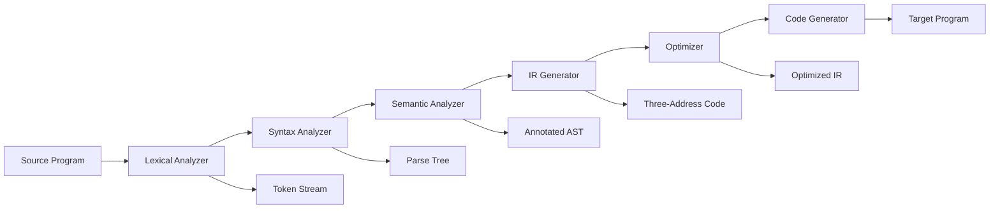

# Chapter 1: Introduction to Compiler Design

**← Prerequisite:** None | **Next:** [Chapter 2: Lexical Analysis](02-lexical.md)

## Learning Objectives

After completing this chapter, students will be able to: describe the analysis-synthesis model of compilation; enumerate and explain the principal phases of a compiler; distinguish between compilers and interpreters; identify appropriate compiler construction tools for each phase; and recognize the role of formal language theory in compilation.

### Chapter at a Glance

| Section | Description |
|---------|-------------|
| The Analysis-Synthesis Model | Front end/back end division and the N-plus-M architecture |
| Phases of Compilation | Lexical analysis through code generation |
| Symbol Table Management | Hash-table-based storage of identifier information |
| Interpreters versus Compilers | Execution-time vs compile-time translation trade-offs |
| Compiler Construction Tools | Lex, Yacc, and automatic code-generator generators |
| The Role of Formal Language Theory | Chomsky hierarchy and language classification in compilation |
| The Evolution of Compiler Architecture | From monoliths through IR to LLVM's three-phase design |

### Chapter Roadmap



## Theory


### The Analysis-Synthesis Model

A compiler is a program that reads a program written in a source language and translates it into an equivalent program in a target language. This translation process is conventionally partitioned into two broad components: the analysis phase (front end) and the synthesis phase (back end). Analysis decomposes the source program into a structured intermediate representation, exposing its grammatical structure and semantic content. Synthesis constructs the desired target program from this intermediate representation, typically performing resource-conscious transformations such as register allocation and instruction selection.

The rationale for this division is modularity. The front end depends only on the source language and is largely independent of the target architecture. The back end depends on the target architecture and is largely independent of the source language. A compiler writer may combine N front ends with M back ends to support N source languages on M target machines, incurring N plus M development efforts rather than N times M. This architecture is prominently realized in the GNU Compiler Collection (GCC) and the LLVM Compiler Infrastructure, where language-specific front ends (C, C++, Fortran, Rust, Swift) share common back ends (x86, ARM, RISC-V, WebAssembly).

> **One-Sentence Takeaway:** The N-plus-M model is the central architectural insight in compiler design — it reduces the implementation problem from N×M to N+M.

> **Pro Tip:** When designing a new language, always plan for an intermediate representation. A well-designed IR lets you target multiple architectures with minimal additional effort.

### Phases of Compilation

A compiler operates as a pipeline of phases, each transforming one representation of the program into another. The following enumeration proceeds from earliest to latest.

**Lexical analysis** (scanning) reads the stream of characters comprising the source program and groups them into meaningful sequences called lexemes, to which it assigns tokens. A token is a pair comprising a token name and an optional attribute value. Lexical analysis discards whitespace and comments and produces a token stream that serves as input to the syntax analyzer. The scanner is typically implemented as a deterministic finite automaton driven by a transition table, often generated automatically by tools such as Lex or Flex.

**Syntax analysis** (parsing) imposes a hierarchical grammatical structure on the token stream. Using a context-free grammar that defines the syntax of the source language, the parser constructs a parse tree or its equivalent. This phase detects and reports syntax errors and produces a tree representation that makes explicit the nesting and precedence relationships among language constructs. Parsing may be done top-down (recursive descent, LL) or bottom-up (LR, LALR).

**Semantic analysis** augments the parse tree with type information and other context-sensitive attributes. The semantic analyzer performs type checking, enforces scope rules, and in many compilers annotates the tree with type expressions and symbol table references. An important subtask is name resolution, which associates each occurrence of an identifier with its declaration. Semantic analysis detects errors such as type mismatches, undeclared variables, and incorrect argument counts.

**Intermediate code generation** translates the annotated parse tree into a machine-independent intermediate representation. Three-address code, in which each instruction contains at most one operator on the right-hand side, is a common choice. This representation facilitates subsequent optimization and retargeting because it exposes the operations and data dependencies of the source program without committing to a specific instruction set.

**Code optimization** improves the intermediate representation so that the eventual target code runs faster, occupies less memory, or consumes less energy. Optimizations may be machine-independent, such as constant folding and dead code elimination, or machine-dependent, such as instruction scheduling. Optimization may be applied at multiple levels: local (within a basic block), global (across basic blocks within a function), or interprocedural (across function boundaries).

**Code generation** maps the optimized intermediate representation into the target machine's instruction set. This phase selects machine instructions for each IR operation, allocates registers for variables and temporaries, and resolves addressing modes. The generated code must correctly implement the semantics of the source program while making efficient use of the target machine's resources.

> **One-Sentence Takeaway:** Each compiler phase transforms one representation into another, and the clean separation of these phases is what makes compiler construction tractable.

### Symbol Table Management

The symbol table is a data structure maintained throughout compilation that stores information about identifiers appearing in the source program. Each entry typically contains the identifier's name, type, scope level, memory location (relative or absolute), and possibly other attributes. Symbol tables are commonly implemented as hash tables, binary search trees, or linked lists organized by scope. The scope management strategy must handle nested scopes correctly, ensuring that references resolve to the most recent declaration.

> **One-Sentence Takeaway:** The symbol table is the shared memory of all compiler phases — every phase both reads and writes identifier information through it.

> **Warning:** Scope mismanagement is one of the most common sources of compiler bugs. Always test deeply nested scopes with shadowed identifiers.

### Interpreters versus Compilers

An interpreter performs the operations specified by the source program directly, without first producing a target-language translation. Pure interpretation reanalyzes each statement on every encounter and consequently exhibits slower execution than compiled code. However, interpreters provide a more interactive development environment and are easier to implement for languages with dynamic features such as eval, dynamic typing, and runtime code modification.

Some language processors blend the two approaches. A **just-in-time (JIT) compiler** translates intermediate code into native machine code at runtime, caching the compiled code for repeated execution. Modern virtual machine implementations for Java and .NET employ JIT compilation, combining portability with performance that approaches that of traditional ahead-of-time compilation. JIT systems may also employ adaptive optimization, where frequently executed methods are compiled at higher optimization levels.

> **One-Sentence Takeaway:** Compilers trade off startup time for steady-state performance; interpreters do the opposite — JIT compilation attempts to get the best of both.

> **Remember:** Interpreters shine for dynamic languages and rapid prototyping; compilers are essential for production systems where runtime performance matters.

### Compiler Construction Tools

A variety of specialized tools automate the construction of compiler components. **Lexical-analyzer generators** such as Lex and Flex accept regular-expression specifications and produce deterministic finite automata as scanning routines. **Parser generators** such as Yacc and Bison accept context-free grammar specifications and produce LALR(1) parsing tables. **Syntax-directed translation engines** integrate semantic actions with grammar productions, automating the construction of attributed parse trees.

**Automatic code-generator generators** accept a description of the target machine's instruction set and produce instruction-selection routines based on tree-pattern matching. **Data-flow analysis frameworks** provide iterative solvers for reaching-definitions, live-variable, and available-expressions problems. Modern compilers such as GCC and LLVM incorporate many of these tools within a single, integrated infrastructure, providing reusable intermediate representations and analysis passes across multiple language front ends and target back ends.

### The Role of Formal Language Theory

Formal language theory provides the mathematical foundation for compilation. Regular languages (recognized by finite automata) describe the lexical structure of programming languages. Context-free languages (recognized by pushdown automata) describe their syntactic structure. Context-sensitive attributes, such as the requirement that identifiers be declared before use, are addressed by semantic analysis. The Chomsky hierarchy situates these language classes within a broader theory of computation, establishing the limits of what each compiler phase can and cannot express.

### The Evolution of Compiler Architecture

Early compilers in the 1950s and 1960s were monolithic programs that translated directly from source to machine code without an explicit intermediate representation. The introduction of intermediate languages, attributed grammars, and formal parsing algorithms in the 1970s led to the modern modular structure. Today, compilers like LLVM employ a three-phase architecture: a language-specific front end produces LLVM IR, a shared optimizer performs passes on the IR, and a target-specific back end generates machine code. This design enables a single optimizer and back end to serve many languages, dramatically reducing implementation effort.

## Examples

### Example 1.1: Compilation Pipeline for an Assignment

Consider the source statement `position = initial + rate * 60`. The lexical analyzer produces the token sequence `id = id + id * number`. The parser builds a parse tree reflecting that multiplication has higher precedence than addition. The semantic analyzer determines that the identifiers refer to real-number variables and that the multiplication involves an implicit type conversion of the integer literal. Intermediate code generation emits three-address instructions:

```
t1 = int_to_real(60)
t2 = rate * t1
t3 = initial + t2
position = t3
```

The optimizer may fold the constant conversion or, if the values are known at compile time, perform arithmetic evaluation. The code generator maps these instructions into target assembly language.

### Example 1.2: N-plus-M Model

A compiler organization has three front ends (C, C++, Ada) and two back ends (x86-64, ARM64). Under the N-plus-M architecture, the implementation cost is 3 plus 2 equals 5 components plus shared IR infrastructure, as opposed to 3 times 2 equals 6 full compilers. Each additional front end or back end adds only one component rather than a full cross-product.

### Concept Comparison

| Concept | Description | Key Insight |
|---------|-------------|-------------|
| Front End (Analysis) | Source-language-dependent phases | Independent of target architecture |
| Back End (Synthesis) | Target-machine-dependent phases | Independent of source language |
| Compiler | Static translation to target code | Higher performance, longer build cycle |
| Interpreter | Direct execution without translation | Faster development, slower execution |
| JIT Compiler | Runtime dynamic translation | Hybrid approach combining portability and speed |

### Quick Reference

| Phase | Input | Output | Key Data Structure |
|-------|-------|--------|-------------------|
| Lexical Analysis | Character stream | Token stream | Deterministic finite automaton |
| Syntax Analysis | Token stream | Parse tree | Context-free grammar |
| Semantic Analysis | Parse tree | Annotated AST | Symbol table |
| IC Generation | Annotated AST | Three-address code | Quadruples / triples |
| Optimization | TAC / IR | Optimized IR | Flow graph |
| Code Generation | Optimized IR | Target machine code | Register allocation |

### Cross-Application Matrix

| Domain | Application | Relevance |
|--------|-------------|-----------|
| Language Design | Implementing new DSLs | Every language needs a compiler or interpreter |
| Systems Programming | GCC, LLVM, Rustc | Production compilers implement all phases |
| Web Development | TypeScript → JavaScript transpilation | Compilation concepts apply to transpilers |
| Tooling | Linters, formatters, static analyzers | Lexing and parsing form the foundation |

## Summary

Compilers translate source programs into target programs through a sequence of phases organized into front end (analysis) and back end (synthesis). Lexical analysis, syntax analysis, semantic analysis, intermediate code generation, optimization, and code generation each transform one representation into another. Interpreters offer flexibility at the cost of execution speed. Specialized tools automate the construction of scanners, parsers, and other compiler components. The modern three-phase architecture with a shared IR enables efficient retargeting across source languages and target machines.

## Exercises

### Review Questions

1. List the principal phases of a compiler and describe the output of each phase.
2. What is the motivation for separating a compiler into front end and back end?
3. Compare and contrast compilers and interpreters. Under what circumstances is each approach preferable?
4. Name three compiler construction tools and state which phase each tool supports.
5. What role do regular and context-free languages play in compiler design?

### Application Problems

1. Consider the source statement `total = (price + tax) * quantity`. Trace the output that each compiler phase would produce. Assume standard operator precedence and floating-point arithmetic.
2. A compiler has three front ends (C, C++, Java) and two back ends (x86-64, ARM64). How many compiler implementations are required under the N-plus-M model? Explain your reasoning.
3. Identify which of the following tasks are performed by the front end and which by the back end: type checking, register allocation, lexical analysis, peephole optimization, intermediate code generation, instruction selection, symbol table management.
4. For a dynamically typed language like Python, what are the implications of pursuing ahead-of-time compilation versus interpretation? Discuss the trade-offs in terms of development speed, execution performance, and language feature support.

### Challenge Problem

1. Design a minimal two-phase compiler for arithmetic expressions composed of integers, addition, and multiplication. The front end should convert the expression into postfix notation. The back end should evaluate the postfix expression using a stack machine. Implement both phases in your language of choice and demonstrate correct translation and evaluation. Extend your implementation to support subtraction and division, handling the error condition of division by zero with a meaningful error message.

### Chapter Quiz

1. Which of the following best describes the relationship between the front end and back end of a compiler?
   - A) The front end generates target code; the back end analyzes source code
   - B) The front end analyzes source code; the back end synthesizes target code
   - C) Both front end and back end perform optimization equally
   - D) The front end is machine-dependent; the back end is language-dependent

2. In the N-plus-M model, how many components are needed for 3 front ends and 4 back ends?
   - A) 7
   - B) 12
   - C) 5
   - D) 9

3. Which of the following is NOT a phase of compilation?
   - A) Lexical analysis
   - B) Syntax analysis
   - C) Memory management
   - D) Code generation

<details>
<summary>Answers</summary>
1. B, 2. A, 3. C
</details>
