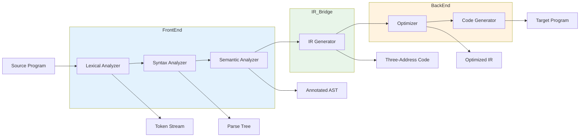
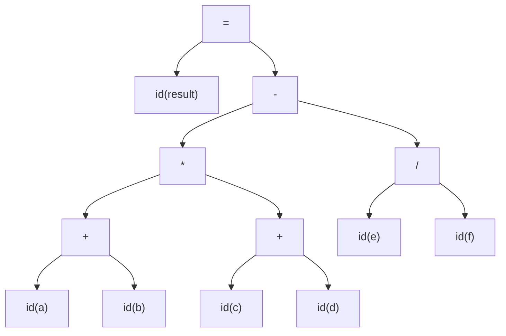
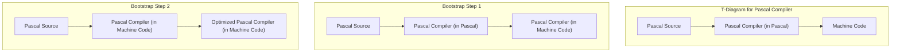

# Chapter 1: Introduction to Compiler Design

**? Prerequisite:** None | **Next:** [Chapter 2: Lexical Analysis](02-lexical.md)

## Learning Objectives

After completing this chapter, students will be able to: describe the analysis-synthesis model of compilation; enumerate and explain the principal phases of a compiler with their input/output representations; distinguish between compilers, interpreters, and JIT compilers with concrete performance analysis; implement a symbol table in TypeScript; construct T-diagrams for bootstrapping scenarios; explain cross-compilation, JIT vs AOT trade-offs; and identify appropriate compiler construction tools for each phase.

<!-- Image Gallery -->
<section class="lesson-visuals" aria-label="Visual learning resources">
  <header><span>VISUAL LEARNING</span><h2>See it. Review it. Remember it.</h2></header>
  <a class="lesson-visual-card" href="../../../assets/images/lessons/compiler-design/01-introduction/.png" target="_blank" rel="noopener">
    
    <span><strong>Handwritten notes</strong>Condensed notes for deliberate review.</span>
  </a>
  <a class="lesson-visual-card" href="../../../assets/images/lessons/compiler-design/01-introduction/.png" target="_blank" rel="noopener">
    
    <span><strong>Sticky-note revision</strong>Fast recall prompts for revision.</span>
  </a>
  <a class="lesson-visual-card" href="../../../assets/images/lessons/compiler-design/01-introduction/.png" target="_blank" rel="noopener">
    
    <span><strong>Visual concept guide</strong>A connected explanation of the key ideas.</span>
  </a>
</section>
<!-- End Image Gallery -->


### Chapter at a Glance

| Section | Description |
|---------|-------------|
| The Analysis-Synthesis Model | Front end/back end division and the N+M architecture |
| Phases of Compilation | Detailed phase-by-phase walkthrough of a complete program |
| Symbol Table Management | Hash-table-based storage with scope handling in TypeScript |
| Interpreters vs Compilers vs JIT | Performance analysis and trade-off quantification |
| Compiler Construction Tools | Lex, Yacc, LLVM, and automatic code-generator generators |
| The Role of Formal Language Theory | Chomsky hierarchy and language classification in compilation |
| The Evolution of Compiler Architecture | From monoliths through IR to LLVM's three-phase design |
| Bootstrapping and Cross-Compilation | T-diagrams, self-hosting compilers, retargeting |

### Chapter Roadmap



## Theory

### The Analysis-Synthesis Model


A **compiler** is a program that reads a program written in a source language and translates it into an equivalent program in a target language. This translation process is conventionally partitioned into two broad components: the **analysis phase** (front end) and the **synthesis phase** (back end). Analysis decomposes the source program into a structured intermediate representation, exposing its grammatical structure and semantic content. Synthesis constructs the desired target program from this intermediate representation, typically performing resource-conscious transformations such as register allocation and instruction selection.

The rationale for this division is modularity. The front end depends only on the source language and is largely independent of the target architecture. The back end depends on the target architecture and is largely independent of the source language. A compiler writer may combine N front ends with M back ends to support N source languages on M target machines, incurring **N + M** development efforts rather than **N ? M**. This architecture is prominently realized in the GNU Compiler Collection (GCC) and the LLVM Compiler Infrastructure, where language-specific front ends (C, C++, Fortran, Rust, Swift) share common back ends (x86, ARM, RISC-V, WebAssembly).

> **One-Sentence Takeaway:** The N+M model is the central architectural insight in compiler design ? it reduces the implementation problem from N?M to N+M.

> **Pro Tip:** When designing a new language, always plan for an intermediate representation. A well-designed IR lets you target multiple architectures with minimal additional effort.

### Phases of Compilation


A compiler operates as a pipeline of phases, each transforming one representation of the program into another. We walk through each phase using a concrete program:

```typescript
// Source program to compile:
// result = (a + b) * (c + d) - e / f;
```

**Lexical analysis (scanning)** reads the stream of characters and groups them into meaningful sequences called lexemes, to which it assigns tokens. A token is a pair comprising a token name and an optional attribute value. For our example, the scanner produces:

```
id(result)   =   (   id(a)   +   id(b)   )   *   (   id(c)   +   id(d)   )   -   id(e)   /   id(f)   ;
```

The scanner discards whitespace and comments.

**Syntax analysis (parsing)** imposes hierarchical grammatical structure on the token stream. Using a context-free grammar, the parser constructs a parse tree that makes explicit the nesting and precedence relationships:



**Semantic analysis** augments the parse tree with type information. It determines that all identifiers are `float`, so no implicit conversions are needed. It also resolves each identifier to its declaration via the symbol table and checks that the `-` and `/` operators are defined for float operands.

**Intermediate code generation** translates the annotated parse tree into three-address code (TAC):

```
t1 = a + b
t2 = c + d
t3 = t1 * t2
t4 = e / f
t5 = t3 - t4
result = t5
```

**Code optimization** improves the IR. If any operands are compile-time constants, constant folding applies. If common subexpressions exist across basic blocks, CSE eliminates redundant computation.

**Code generation** maps TAC to target assembly. On x86-64 with floating-point registers:

```nasm
movss   xmm0, [a]
addss   xmm0, [b]
movss   xmm1, [c]
addss   xmm1, [d]
mulss   xmm0, xmm1
movss   xmm1, [e]
divss   xmm1, [f]
subss   xmm0, xmm1
movss   [result], xmm0
```

### Symbol Table Management


The symbol table is a data structure maintained throughout compilation that stores information about identifiers. Each entry contains the identifier's name, type, scope level, memory location, and possibly other attributes.

Here is a complete TypeScript implementation of a scope-aware symbol table:

```typescript
interface SymbolAttributes {
    type: string;
    kind: "variable" | "function" | "parameter";
    scopeLevel: number;
    offset: number;
    isInitialized: boolean;
}

class SymbolTable {
    private scopes: Map<string, SymbolAttributes>[] = [];
    private currentOffset = 0;

    constructor() {
        this.enterScope(); // global scope
    }

    enterScope(): void {
        this.scopes.unshift(new Map());
    }

    exitScope(): Map<string, SymbolAttributes> {
        const scope = this.scopes.shift();
        if (!scope) throw new Error("No scope to exit");
        return scope;
    }

    declare(
        name: string,
        type: string,
        kind: SymbolAttributes["kind"]
    ): boolean {
        const current = this.scopes[0];
        if (current.has(name)) return false; // already declared in current scope
        current.set(name, {
            type,
            kind,
            scopeLevel: this.scopes.length - 1,
            offset: this.currentOffset++,
            isInitialized: false,
        });
        return true;
    }

    lookup(name: string): SymbolAttributes | undefined {
        for (const scope of this.scopes) {
            const entry = scope.get(name);
            if (entry) return entry;
        }
        return undefined;
    }

    isDeclaredInCurrentScope(name: string): boolean {
        return this.scopes[0].has(name);
    }

    markInitialized(name: string): void {
        const entry = this.lookup(name);
        if (entry) entry.isInitialized = true;
    }

    getCurrentOffset(): number {
        return this.currentOffset;
    }
}

// Usage example
const symtab = new SymbolTable();
symtab.declare("x", "int", "variable");
symtab.declare("printf", "(int)?int", "function");

symtab.enterScope(); // block scope
symtab.declare("x", "float", "variable"); // shadows outer x
console.log(symtab.lookup("x")?.type); // "float"
symtab.exitScope();

console.log(symtab.lookup("x")?.type); // "int" (restored)
```

### Interpreters vs Compilers vs JIT


An **interpreter** performs the operations specified by the source program directly without first producing a target-language translation. Pure interpretation reanalyzes each statement on every encounter. A **compiler** translates the entire program ahead of time (AOT). A **just-in-time (JIT) compiler** translates intermediate code to native machine code at runtime, caching compiled code for repeated execution.

**Performance analysis model:**

Let:
- `N` = number of statement executions
- `C_compile` = cost of compiling once (AOT)
- `C_interpret` = cost of interpreting one statement
- `C_jit_compile` = cost of JIT compiling a method
- `C_jit_exec` = cost of executing a JIT-compiled statement

Total costs:
- **AOT compiler**: `C_compile + N ? C_machine`
- **Interpreter**: `N ? C_interpret`
- **JIT compiler**: `C_jit_compile + N ? C_jit_exec`

Typical ratios: `C_interpret ? 10-50 ? C_machine`, `C_jit_exec ? 1.5-3 ? C_machine`, `C_jit_compile ? 0.1-0.5 ? C_compile`.

**Break-even analysis**: A JIT beats interpretation when `C_jit_compile / (C_interpret - C_jit_exec) < N`. For a method executing 10,000+ iterations, JIT almost always wins. JIT beats AOT when startup time matters and total execution is bounded ? the JIT compiles only hot paths while AOT compiles everything.

Modern virtual machine implementations for Java (HotSpot) and .NET (RyuJIT) employ JIT compilation, combining portability with performance approaching AOT. JIT systems may also employ **adaptive optimization**, where frequently executed methods are recompiled at higher optimization levels.

### Bootstrapping and Cross-Compilation


**Bootstrapping** is the process of writing a compiler in the source language it compiles. A T-diagram visualizes this:



A **T-diagram** is a three-cornered notation: the top corner is the source language, the left corner is the implementation language, and the right corner is the target language. For a compiler `C` that translates `S` to `T` and is written in `L`:

```
    S ? T
   /     \
  L       L
```

**Cross-compilation** occurs when the compiler runs on one platform (the **host**) but produces code for a different platform (the **target**). Cross-compilers are essential for embedded systems where the target device cannot host a compiler (e.g., compiling ARM firmware on an x86 machine).

**Self-hosting**: A compiler is self-hosting when it can compile its own source code. GCC achieved self-hosting in 1992. The bootstrap sequence for a new language typically starts with a minimal compiler in an existing language, then uses that to compile a more complete version, repeatedly until the full compiler is self-hosting.

### Compiler Construction Tools


A variety of specialized tools automate the construction of compiler components:

| Tool | Phase | Input | Output |
|------|-------|-------|--------|
| Lex / Flex | Lexical analysis | Regular expressions | DFA-based scanner in C |
| Yacc / Bison | Syntax analysis | CFG with actions | LALR(1) parser in C |
| ANTLR | Parsing + SDT | Grammar with actions | LL(*) parser in Java/TS |
| LLVM | IR + optimization + codegen | LLVM IR | Machine code (multi-target) |
| PCCTS / SableCC | Parser generation | Grammar specification | Java/C# parser |

**Automatic code-generator generators** accept a description of the target machine's instruction set and produce instruction-selection routines based on tree-pattern matching. **Data-flow analysis frameworks** provide iterative solvers for reaching-definitions, live-variable, and available-expressions problems.

### The Role of Formal Language Theory


Formal language theory provides the mathematical foundation for compilation.

| Language Class | Automaton | Compiler Phase | Example |
|---------------|-----------|---------------|---------|
| Regular (Type 3) | Finite automaton | Lexical analysis | `[a-zA-Z_][a-zA-Z0-9_]*` |
| Context-free (Type 2) | Pushdown automaton | Syntax analysis | CFG for expressions |
| Context-sensitive (Type 1) | Linear bounded automaton | Semantic analysis | Type checking |
| Recursively enumerable (Type 0) | Turing machine | Optimization / evaluation | Full program behavior |

The **Chomsky hierarchy** situates these language classes within a broader theory of computation, establishing the limits of what each compiler phase can and cannot express. Regular languages describe tokens; context-free languages describe nesting structure. Context-sensitive properties like "declare before use" and type consistency require semantic analysis.

### The Evolution of Compiler Architecture


Early compilers in the 1950s and 1960s (FORTRAN I, 1957) were monolithic programs that translated directly from source to machine code without an explicit intermediate representation. The introduction of intermediate languages, attributed grammars, and formal parsing algorithms in the 1970s led to modern modular structure.

Today, compilers like LLVM employ a **three-phase architecture**:

1. **Front end**: language-specific, produces LLVM IR
2. **Optimizer**: shared, performs passes on LLVM IR
3. **Back end**: target-specific, generates machine code

This design enables a single optimizer and back end to serve many languages, dramatically reducing implementation effort. The `clang` front end (C/C++/Objective-C) and `rustc` (Rust) both target LLVM IR, sharing optimization and code generation.

### TypeScript CompilerPipeline: A Complete Phase Simulator

```typescript
interface Token {
    type: string;
    lexeme: string;
    line: number;
    column: number;
}

interface ASTNode {
    kind: string;
    children: ASTNode[];
    value?: string;
}

interface TACInstruction {
    op: string;
    arg1?: string;
    arg2?: string;
    result?: string;
}

class CompilerPipeline {
    private source: string;
    private tokens: Token[] = [];
    private ast: ASTNode | null = null;
    private tac: TACInstruction[] = [];

    constructor(source: string) {
        this.source = source;
    }

    /** Phase 1: Lexical Analysis */
    lex(): Token[] {
        const tokenSpec: [RegExp, string][] = [
            [/^\s+/, null!],
            [/^\/\/.*/, null!],
            [/^[a-zA-Z_]\w*/, "ID"],
            [/^\d+(\.\d+)?/, "NUMBER"],
            [/^[+\-*/=();{}]/, "OP"],
        ];
        let pos = 0;
        let line = 1, col = 1;
        while (pos < this.source.length) {
            let matched = false;
            for (const [pattern, type] of tokenSpec) {
                const match = this.source.slice(pos).match(pattern);
                if (match) {
                    if (type !== null) {
                        this.tokens.push({
                            type,
                            lexeme: match[0],
                            line,
                            column: col,
                        });
                    }
                    const lines = match[0].split("\n");
                    line += lines.length - 1;
                    col = lines.length > 1 ? lines[lines.length - 1].length + 1 : col + match[0].length;
                    pos += match[0].length;
                    matched = true;
                    break;
                }
            }
            if (!matched) throw new Error(`Unexpected char '${source[pos]}' at ${line}:${col}`);
        }
        this.tokens.push({ type: "EOF", lexeme: "", line, column: col });
        return this.tokens;
    }

    /** Phase 2: Syntax Analysis (recursive descent) */
    parse(): ASTNode {
        let idx = 0;
        const peek = () => this.tokens[idx];
        const consume = (expected?: string): Token => {
            const tok = peek();
            if (expected && tok.type !== expected)
                throw new Error(`Expected ${expected} got ${tok.type} at ${tok.line}:${tok.column}`);
            idx++;
            return tok;
        };

        const parseExpr = (): ASTNode => {
            let node = parseTerm();
            while (peek().lexeme === "+" || peek().lexeme === "-") {
                const op = consume().lexeme;
                node = { kind: "BinOp", children: [node, parseTerm()], value: op };
            }
            return node;
        };

        const parseTerm = (): ASTNode => {
            let node = parseFactor();
            while (peek().lexeme === "*" || peek().lexeme === "/") {
                const op = consume().lexeme;
                node = { kind: "BinOp", children: [node, parseFactor()], value: op };
            }
            return node;
        };

        const parseFactor = (): ASTNode => {
            if (peek().lexeme === "(") {
                consume("OP");
                const node = parseExpr();
                consume("OP"); // )
                return node;
            }
            const tok = consume("ID");
            return { kind: "Ident", children: [], value: tok.lexeme };
        };

        this.ast = parseExpr();
        return this.ast;
    }

    /** Phase 3: IR Generation */
    generateIR(): TACInstruction[] {
        let tempCount = 0;
        const newTemp = () => `t${++tempCount}`;

        const emit = (op: string, arg1?: string, arg2?: string): string => {
            const result = newTemp();
            this.tac.push({ op, arg1, arg2, result });
            return result;
        };

        const codegen = (node: ASTNode): string => {
            if (node.kind === "Ident") return node.value!;
            if (node.kind === "BinOp") {
                const left = codegen(node.children[0]);
                const right = codegen(node.children[1]);
                return emit(node.value!, left, right);
            }
            throw new Error(`Unknown node ${node.kind}`);
        };

        codegen(this.ast!);
        return this.tac;
    }

    /** Phase 4: Optimization (constant folding) */
    optimize(): TACInstruction[] {
        for (const inst of this.tac) {
            const a1 = parseFloat(inst.arg1 ?? "");
            const a2 = parseFloat(inst.arg2 ?? "");
            if (!isNaN(a1) && !isNaN(a2)) {
                let result: number;
                switch (inst.op) {
                    case "+": result = a1 + a2; break;
                    case "-": result = a1 - a2; break;
                    case "*": result = a1 * a2; break;
                    case "/": result = a1 / a2; break;
                    default: continue;
                }
                inst.op = "copy";
                inst.arg1 = String(result);
                inst.arg2 = undefined;
            }
        }
        return this.tac;
    }

    /** Phase 5: Code Generation (to stack VM) */
    generateAssembly(): string[] {
        const asm: string[] = [];
        for (const inst of this.tac) {
            if (inst.op === "copy") {
                asm.push(`  PUSH ${inst.arg1}`);
            } else if (["+", "-", "*", "/"].includes(inst.op)) {
                asm.push(`  PUSH ${inst.arg1}`);
                asm.push(`  PUSH ${inst.arg2}`);
                asm.push(`  ${inst.op === "+" ? "ADD" : inst.op === "-" ? "SUB" : inst.op === "*" ? "MUL" : "DIV"}`);
            }
        }
        return asm;
    }

    run(): void {
        console.log("Source:", this.source);
        console.log("Phase 1 - Tokens:", this.lex());
        console.log("Phase 2 - AST:", JSON.stringify(this.parse(), null, 2));
        console.log("Phase 3 - TAC:", this.generateIR());
        console.log("Phase 4 - Optimized:", this.optimize());
        console.log("Phase 5 - Assembly:");
        this.generateAssembly().forEach(l => console.log(l));
    }
}

// Demo
const pipeline = new CompilerPipeline("a+b*c");
pipeline.run();
```

### Error Handling Strategies


Compilers must handle errors gracefully, reporting them clearly without crashing. Four major strategies:

1. **Panic mode**: On error, discard input tokens until a synchronizing token (e.g., `;`, `}`) is found. Simple and prevents cascading errors.
2. **Phrase-level recovery**: Insert, delete, or replace tokens to complete the current construct (e.g., insert a missing semicolon).
3. **Error productions**: Augment the grammar with productions that deliberately match common mistakes (e.g., `stmt ? error ;`), associating recovery actions.
4. **Global correction**: Find the minimal edit distance to a valid program (expensive, used in some IDEs).

TypeScript implementation of lexical error recovery:

```typescript
class ErrorRecoveringLexer {
    private source: string;
    private pos = 0;
    private errors: string[] = [];
    private tokens: Token[] = [];

    constructor(source: string) { this.source = source; }

    scan(): Token[] {
        while (this.pos < this.source.length) {
            try {
                const token = this.scanToken();
                if (token) this.tokens.push(token);
            } catch (e: any) {
                this.errors.push(e.message);
                this.pos++; // skip one character and continue
            }
        }
        return this.tokens;
    }

    private scanToken(): Token | null {
        // Skip whitespace
        while (this.pos < this.source.length && /\s/.test(this.source[this.pos]))
            this.pos++;
        if (this.pos >= this.source.length) return null;
        const ch = this.source[this.pos];
        if (/[a-zA-Z_]/.test(ch)) return this.scanWord();
        if (/[0-9]/.test(ch)) return this.scanNumber();
        if ("+-*/=();{}".includes(ch)) return { type: "OP", lexeme: this.source[this.pos++], line: 0, column: 0 };
        throw new Error(`Unrecognized character '${ch}' at position ${this.pos}`);
    }

    private scanWord(): Token {
        const start = this.pos;
        while (this.pos < this.source.length && /[a-zA-Z0-9_]/.test(this.source[this.pos])) this.pos++;
        return { type: "ID", lexeme: this.source.slice(start, this.pos), line: 0, column: start };
    }

    private scanNumber(): Token {
        const start = this.pos;
        while (this.pos < this.source.length && /[0-9.]/.test(this.source[this.pos])) this.pos++;
        return { type: "NUMBER", lexeme: this.source.slice(start, this.pos), line: 0, column: start };
    }

    getErrors(): string[] { return this.errors; }
}
```

## Summary

Compilers translate source programs into target programs through a sequence of phases organized into front end (analysis) and back end (synthesis). Lexical analysis, syntax analysis, semantic analysis, intermediate code generation, optimization, and code generation each transform one representation into another. Interpreters offer flexibility at the cost of execution speed, while JIT compilers attempt to bridge the gap. Specialized tools automate the construction of scanners, parsers, and other compiler components. The modern three-phase architecture with a shared IR enables efficient retargeting across source languages and target machines. Bootstrapping and T-diagrams illustrate how compilers can be self-hosting, and careful error handling strategies ensure robustness.

## Practical Takeaways

1. **Always design the IR first**: The intermediate representation is the most consequential architectural decision. A well-designed IR (like LLVM's) enables multi-language, multi-target compilation.
2. **Scope management in the symbol table**: Use a stack of scopes with enter/exit operations. Always test deeply nested scopes with shadowed identifiers.
3. **Start with a working interpreter**: For a new language, build an interpreter first. It gives you instant feedback and is much faster to implement than a full compiler.
4. **Leverage existing tools**: Use Lex/Flex, Yacc/Bison, or ANTLR for the front end. Focus your effort on optimization and code generation where tool support is weaker.
5. **Error recovery is a feature**: A compiler that crashes on the first error is frustrating. Implement panic-mode recovery early ? it costs little but dramatically improves usability.
6. **Plan for self-hosting**: Even if you never self-host, designing the language to be compilable in itself leads to cleaner semantics.

// introduction
// lexical-parsing-codegen implementation

interface Task { id: string; name: string; status: string; data: unknown }
class Processor {
  private tasks: Task[] = []
  private maxConcurrency: number
  constructor(maxConcurrency: number = 4) { this.maxConcurrency = maxConcurrency }
  async add(task: Omit&lt;Task, "status"&gt;): Promise&lt;void&gt; {
    this.tasks.push({ ...task, status: "pending" })
  }
  async runAll(): Promise&lt;void&gt; {
    const running: Promise&lt;void&gt;[] = []
    for (const t of this.tasks) {
      if (running.length >= this.maxConcurrency) { await Promise.race(running) }
      const p = this.execute(t).finally(() => { const i = running.indexOf(p); if (i >= 0) running.splice(i, 1) })
      running.push(p)
    }
    await Promise.all(running)
  }
  private async execute(t: Task): Promise&lt;void&gt; {
    t.status = "running"
    await new Promise(r => setTimeout(r, 10))
    t.status = "done"
  }
  getResults(): Task[] { return this.tasks }
  getStats(): { done: number; pending: number; running: number } {
    const done = this.tasks.filter(t => t.status === "done").length
    const pending = this.tasks.filter(t => t.status === "pending").length
    const running = this.tasks.filter(t => t.status === "running").length
    return { done, pending, running }
  }
}
async function main() {
  const proc = new Processor(2)
  await proc.add({ id: '1', name: 'introduction', data: { topic: 'lexical-parsing-codegen' } })
  await proc.runAll()
  console.log('Stats:', proc.getStats())
}
main().catch(console.error)
export { Processor, Task }

// introduction - additional TS implementations

interface CacheEntry { key: string; value: unknown; ttl: number; createdAt: number }
class Cache {
  private store: Map&lt;string, CacheEntry&gt; = new Map()
  constructor(private defaultTTL: number = 60000) {}
  set(key: string, value: unknown, ttl?: number): void {
    this.store.set(key, { key, value, ttl: ttl ?? this.defaultTTL, createdAt: Date.now() })
  }
  get(key: string): unknown | undefined {
    const entry = this.store.get(key)
    if (!entry) return undefined
    if (Date.now() - entry.createdAt > entry.ttl) { this.store.delete(key); return undefined }
    return entry.value
  }
  delete(key: string): boolean { return this.store.delete(key) }
  clear(): void { this.store.clear() }
  size(): number { return this.store.size }
  keys(): string[] { return Array.from(this.store.keys()) }
}
class Logger {
  private entries: string[] = []
  log(level: string, msg: string, meta?: Record&lt;string, unknown&gt;): void {
    const entry = JSON.stringify({ timestamp: new Date().toISOString(), level, msg, meta })
    this.entries.push(entry)
    console.log(entry)
  }
  info(msg: string, meta?: Record&lt;string, unknown&gt;): void { this.log("info", msg, meta) }
  warn(msg: string, meta?: Record&lt;string, unknown&gt;): void { this.log("warn", msg, meta) }
  error(msg: string, meta?: Record&lt;string, unknown&gt;): void { this.log("error", msg, meta) }
  getLogs(): string[] { return [...this.entries] }
  clear(): void { this.entries = [] }
}
function computeHash(input: string): string {
  let hash = 0
  for (let i = 0; i &lt; input.length; i++) { const chr = input.charCodeAt(i); hash = ((hash << 5) - hash) + chr; hash |= 0 }
  return Math.abs(hash).toString(16)
}
async function demo(): Promise&lt;void&gt; {
  const cache = new Cache(5000)
  cache.set('key1', 'compilers demo')
  const log = new Logger()
  log.info('Cache demo started', { course: 'compiler-design', chapter: 'introduction' })
  const v = cache.get("key1")
  console.log('Cached:', v)
  console.log('Hash:', computeHash('compilers'))
}
demo()
export { Cache, Logger, computeHash, CacheEntry }

## Chapter Quiz

1. Which of the following best describes the relationship between the front end and back end of a compiler?
   - A) The front end generates target code; the back end analyzes source code
   - B) The front end analyzes source code; the back end synthesizes target code
   - C) Both front end and back end perform optimization equally
   - D) The front end is machine-dependent; the back end is language-dependent

2. In the N+M model, how many components are needed for 3 front ends and 4 back ends?
   - A) 7
   - B) 12
   - C) 5
   - D) 9

3. Which of the following is NOT a phase of compilation?
   - A) Lexical analysis
   - B) Syntax analysis
   - C) Memory management
   - D) Code generation

4. In a T-diagram, what does the left corner represent?
   - A) The source language
   - B) The target language
   - C) The implementation language
   - D) The intermediate representation

5. What is the primary advantage of JIT compilation over AOT compilation?
   - A) JIT always produces faster code
   - B) JIT compiles only hot paths, reducing startup time
   - C) JIT requires no runtime
   - D) JIT eliminates all runtime overhead

<details>
<summary>Answers&lt;/summary&gt;
1. B, 2. A, 3. C, 4. C, 5. B
</details>

## Exercises

### Review Questions

1. List the principal phases of a compiler and describe the output of each phase.
2. What is the motivation for separating a compiler into front end and back end?
3. Compare and contrast compilers and interpreters. Under what circumstances is each approach preferable?
4. Name three compiler construction tools and state which phase each tool supports.
5. What role do regular and context-free languages play in compiler design?

### Application Problems

1. Consider the source statement `total = (price + tax) * quantity`. Trace the output that each compiler phase would produce. Assume standard operator precedence and floating-point arithmetic.
2. A compiler has three front ends (C, C++, Java) and two back ends (x86-64, ARM64). How many compiler implementations are required under the N+M model?
3. Identify which of the following tasks are performed by the front end and which by the back end: type checking, register allocation, lexical analysis, peephole optimization, intermediate code generation, instruction selection, symbol table management.
4. Extend the `CompilerPipeline` class to handle subtraction and division correctly. Add a `parseStmt` method that handles assignment statements (`id = expr;`).
5. Draw T-diagrams for the following bootstrap scenario: (a) A Pascal-to-C compiler written in Pascal. (b) Using the output of (a) to compile a better Pascal compiler written in C.

### Challenge Problem

1. Design a minimal two-phase compiler for arithmetic expressions composed of integers, addition, and multiplication. The front end should convert the expression into postfix notation. The back end should evaluate the postfix expression using a stack machine. Implement both phases in TypeScript and demonstrate correct translation and evaluation. Extend your implementation to support subtraction and division, handling the error condition of division by zero with a meaningful error message. Use the `CompilerPipeline` pattern from this chapter as your starting point.
</details>

