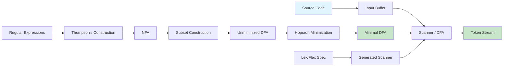
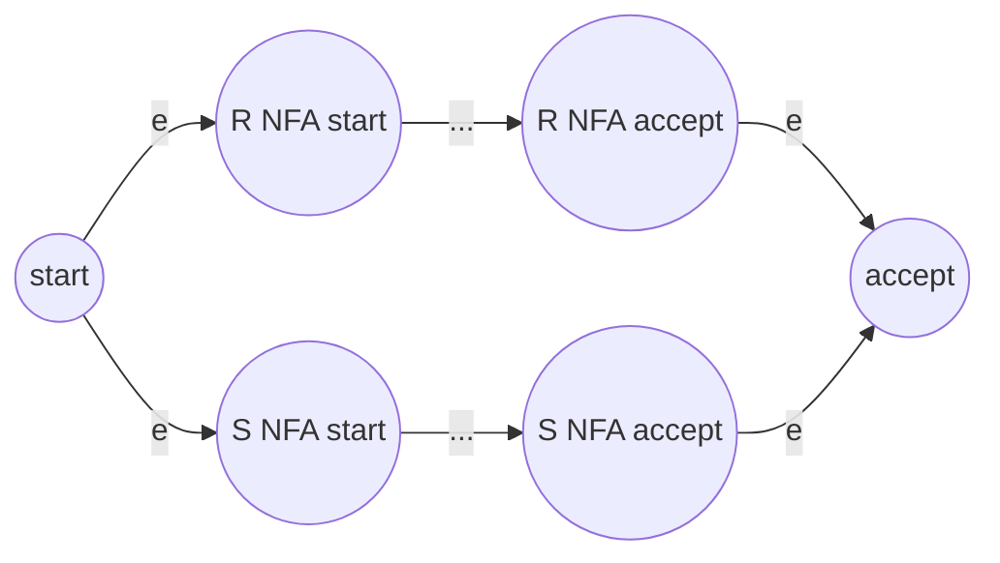
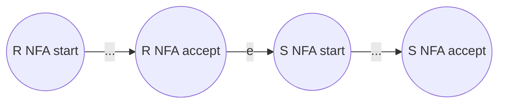
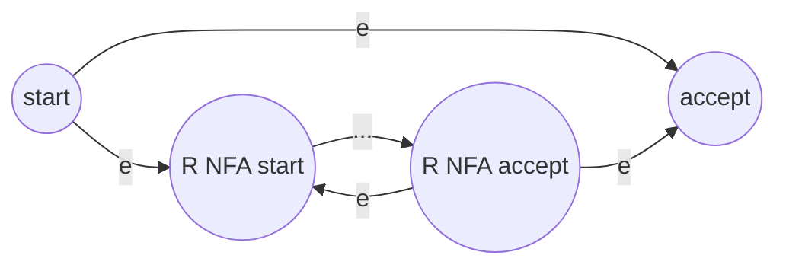

# Chapter 2: Lexical Analysis

**? Previous:** [Chapter 1: Introduction](01-introduction.md) | **Next:** [Chapter 3: Top-Down Parsing](03-parsing-topdown.md)

## Learning Objectives

After completing this chapter, students will be able to: define tokens, lexemes, and patterns; design input buffering schemes; specify tokens using regular expressions; construct NFAs from regular expressions using Thompson's construction; convert NFAs to DFAs using subset construction; minimize DFAs using Hopcroft's algorithm; implement a complete table-driven lexical analyzer in TypeScript; and use Lex or Flex to generate scanners automatically.

### Chapter at a Glance

| Section | Description |
|---------|-------------|
| Tokens, Lexemes, and Patterns | Fundamental concepts of lexical categories |
| Input Buffering | Two-buffer and one-buffer schemes for efficient scanning |
| Specification of Tokens Using Regular Expressions | Formal notation for describing token patterns |
| Regex to NFA: Thompson's Construction | Inductive NFA construction from regex |
| NFA to DFA: Subset Construction | Converting NFA sets into DFA states |
| DFA Minimization: Hopcroft's Algorithm | Partition-refinement for minimal DFA |
| Recognition of Tokens | DFA simulation and transition table scanning |
| Error Recovery in Lexers | Handling unrecognized input gracefully |
| Lex and Flex | Automatic scanner generation tools |

### Chapter Roadmap



## Theory

### Tokens, Lexemes, and Patterns

Lexical analysis is the first phase of compilation. The **lexical analyzer**, or scanner, reads the source program's character stream and groups characters into **lexemes** ? sequences of characters that form a logical unit. For each lexeme, the scanner produces a **token**, a pair consisting of a token name and an optional attribute value.

A **token name** is a symbolic category such as `ID` (identifier), `NUMBER` (numeric literal), `IF` (the keyword `if`), `PLUS` (the plus operator), or `LPAREN` (left parenthesis). The attribute value carries the specific lexeme or other information associated with the token. For example, the token for the lexeme `count` might be `ID` with attribute `pointer to symbol-table entry for "count"`. For a numeric literal, the attribute might be the integer or floating-point value.

A **pattern** is a rule that describes the set of lexemes belonging to a given token. Patterns are typically described using regular expressions. A lexeme is a particular instance of a pattern: the string `42` is a lexeme of the token `NUMBER` whose pattern could be `[0-9]+`. The scanner must recognize multiple token types simultaneously, distinguishing, for example, between the keyword `if` and an identifier `ifx`.

> **One-Sentence Takeaway:** Tokens are the vocabulary of the compiler ? all subsequent phases work with this token stream, never with raw characters.

### Input Buffering

The scanner examines characters one at a time and must often look ahead one or more characters to determine the token boundary. Efficient input handling is essential because lexical analysis is I/O-bound.

In the **two-buffer scheme**, the source file is read into two alternating buffers, typically of size 4096 or 8192 characters. A pointer `lexemeBegin` marks the start of the current lexeme. A second pointer `forward` scans ahead. When `forward` reaches the end of a buffer, the next block of input is loaded into the other buffer. A sentinel character (frequently EOF) placed at the end of each buffer simplifies the end-of-buffer check, eliminating a conditional branch in the innermost scanning loop.

The **one-buffer scheme** uses a single buffer that is refilled when necessary. While simpler, it requires more careful management of the lexeme-start pointer because buffer contents may be overwritten. Most production scanners use the two-buffer approach for efficiency.

### Specification of Tokens Using Regular Expressions

Regular expressions provide a formal notation for specifying token patterns. The basic operations are:

- **Concatenation**: `RS` matches R followed by S
- **Alternation**: `R | S` matches R or S
- **Kleene closure**: `R*` matches zero or more occurrences of R
- **Positive closure**: `R+` matches one or more occurrences of R
- **Optional**: `R?` matches zero or one occurrences of R
- **Character classes**: `[a-z]` is shorthand for `a|b|c|...|z`

Important regular definitions for a typical programming language:

```
digit       ? [0-9]
letter      ? [a-zA-Z_]
identifier  ? letter (letter | digit)*
integer     ? digit+
real        ? digit+ (\. digit+)? (E [+-]? digit+)?
whitespace  ? [ \t\n]+
comment     ? "/*" (any)* "*/"
stringlit   ? "\"" (any - "\"")* "\""
```

A lexical-analyzer generator converts these regular definitions into a deterministic finite automaton (DFA). The conversion proceeds through three steps: constructing NFAs via Thompson's construction, converting to a DFA via subset construction, and minimizing the DFA.

### Regex to NFA: Thompson's Construction

Thompson's construction maps each regular expression to an NFA inductively, following the structure of the regex:

**Base cases:**

```
e:      start --e--? accept
a:      start --a--? accept
```

**Inductive cases:**

For alternation `R | S`:



For concatenation `R S`:



For Kleene closure `R*`:



Formal algorithm for Thompson's construction:

```
function Thompson(regex):
    if regex = e:
        return NFA with start ? e ? accept
    if regex = a (a single symbol):
        return NFA with start ? a ? accept
    if regex = R | S:
        build NFA_R = Thompson(R)
        build NFA_S = Thompson(S)
        create new start state s0 with e transitions to NFA_R.start and NFA_S.start
        create new accept state with e transitions from NFA_R.accept and NFA_S.accept
        return combined NFA
    if regex = R S:
        build NFA_R = Thompson(R)
        build NFA_S = Thompson(S)
        add e transition from NFA_R.accept to NFA_S.start
        return combined NFA (start = NFA_R.start, accept = NFA_S.accept)
    if regex = R*:
        build NFA_R = Thompson(R)
        create new start state s0 with e ? NFA_R.start and e ? new accept
        add e from NFA_R.accept ? NFA_R.start and NFA_R.accept ? new accept
        return combined NFA
```

### NFA to DFA: Subset Construction

The subset construction converts an NFA into an equivalent DFA. Each DFA state corresponds to a set of NFA states reachable on the same input.

**Algorithm:**

```
function SubsetConstruction(NFA):
    DFA.start = e-closure({NFA.start})
    DFA.states = {DFA.start}
    unmarked = {DFA.start}
    DFA.transitions = {}

    while unmarked is not empty:
        remove T from unmarked
        for each input symbol a:
            U = e-closure(move(T, a))
            if U is not empty and U not in DFA.states:
                add U to DFA.states
                add U to unmarked
            DFA.transitions[T, a] = U

    DFA.accept = {S in DFA.states | S contains any NFA accept state}
    return DFA

function e-closure(states):
    result = states
    stack = states
    while stack is not empty:
        pop s from stack
        for each state t reachable from s via e:
            if t not in result:
                add t to result
                push t onto stack
    return result

function move(states, a):
    result = {}
    for each state s in states:
        for each state t reachable from s via a:
            add t to result
    return result
```

### DFA Minimization: Hopcroft's Algorithm

Hopcroft's algorithm produces the minimal DFA by partitioning states into equivalence classes. Two states are equivalent if, for every input string, they either both reach an accepting state or both reach a non-accepting state.

**Algorithm:**

```
function HopcroftMinimize(DFA):
    // Partition states into accepting and non-accepting
    P = {F, Q \ F}  // F = accept states, Q = all states

    // Refine partitions
    while P changes:
        for each group G in P:
            for each input symbol a:
                split G into states whose transitions on a go to the same group in P
                if split found, replace G with the split groups

    // Build minimal DFA from partitions
    for each group G in P:
        create a new state representing G
        if G contains start, this is the new start
        if G contains any accept, this is a new accept
        for transition from any state s in G on a to state t in group H:
            add transition from group G to group H on a

    return minimal DFA
```

**Example**: Minimize a DFA for `(a|b)*abb`. Start with partition `P = { {0,1,2}, {3} }` (assuming state 3 is the sole accepting state). Refine by checking transitions: if states in a group go to different groups on the same input, split. After refinement, each group contains states indistinguishable by any input string.

The minimized DFA has the fewest possible states while recognizing the same language. For a DFA with N states and an alphabet of size S, Hopcroft's algorithm runs in `O(N S log N)` time.

### TypeScript Lexer Engine

Here is a complete TypeScript implementation of a regex-to-DFA pipeline:

```typescript
// === Automaton Types ===
interface NFAState {
    id: number;
    transitions: Map<string, NFAState[]>;
    epsilon: NFAState[];
    isAccept: boolean;
}

interface DFAState {
    id: number;
    nfaStates: Set<number>;
    transitions: Map<string, DFAState>;
    isAccept: boolean;
}

// === Thompson's Construction ===
class NFA {
    start: NFAState;
    accept: NFAState;
    private nextId = 0;

    constructor(start?: NFAState, accept?: NFAState) {
        this.start = start ?? this.newState();
        this.accept = accept ?? this.newState();
    }

    private newState(): NFAState {
        return { id: this.nextId++, transitions: new Map(), epsilon: [], isAccept: false };
    }

    // e NFA
    static epsilon(): NFA {
        const nfa = new NFA();
        nfa.start.epsilon.push(nfa.accept);
        return nfa;
    }

    // Symbol NFA
    static symbol(c: string): NFA {
        const nfa = new NFA();
        nfa.start.transitions.set(c, [nfa.accept]);
        return nfa;
    }

    // Union: R | S
    static union(r: NFA, s: NFA): NFA {
        const nfa = new NFA();
        nfa.start.epsilon.push(r.start, s.start);
        r.accept.epsilon.push(nfa.accept);
        r.accept.isAccept = false;
        s.accept.epsilon.push(nfa.accept);
        s.accept.isAccept = false;
        return nfa;
    }

    // Concatenation: R S
    static concat(r: NFA, s: NFA): NFA {
        r.accept.epsilon.push(s.start);
        r.accept.isAccept = false;
        return new NFA(r.start, s.accept);
    }

    // Kleene star: R*
    static star(r: NFA): NFA {
        const nfa = new NFA();
        nfa.start.epsilon.push(r.start, nfa.accept);
        r.accept.epsilon.push(r.start, nfa.accept);
        r.accept.isAccept = false;
        return nfa;
    }

    // Parse a simple regex into an NFA (supports |, *, concatenation, parens, chars)
    static fromRegex(regex: string): NFA {
        let idx = 0;

        const parseUnion = (): NFA => {
            let left = parseConcat();
            while (idx < regex.length && regex[idx] === "|") {
                idx++;
                const right = parseConcat();
                left = NFA.union(left, right);
            }
            return left;
        };

        const parseConcat = (): NFA => {
            let left = parseStar();
            while (idx < regex.length && regex[idx] !== ")" && regex[idx] !== "|" && regex[idx] !== "*") {
                const right = parseStar();
                left = NFA.concat(left, right);
            }
            return left;
        };

        const parseStar = (): NFA => {
            let base = parsePrimary();
            while (idx < regex.length && regex[idx] === "*") {
                idx++;
                base = NFA.star(base);
            }
            return base;
        };

        const parsePrimary = (): NFA => {
            if (idx < regex.length && regex[idx] === "(") {
                idx++; // skip '('
                const inner = parseUnion();
                if (idx < regex.length && regex[idx] === ")") idx++; // skip ')'
                return inner;
            }
            if (idx < regex.length) {
                const c = regex[idx++];
                return NFA.symbol(c);
            }
            return NFA.epsilon();
        };

        const nfa = parseUnion();
        nfa.accept.isAccept = true;
        return nfa;
    }
}

// === Subset Construction (NFA ? DFA) ===
class DFA {
    states: DFAState[] = [];
    start: DFAState;

    constructor(nfa: NFA) {
        const allNfaStates = this.collectNfaStates(nfa);

        const epsilonClosure = (states: Set<number>): Set<number> => {
            const result = new Set(states);
            const stack = [...states];
            while (stack.length > 0) {
                const s = stack.pop()!;
                for (const eps of allNfaStates.get(s)?.epsilon ?? []) {
                    if (!result.has(eps.id)) {
                        result.add(eps.id);
                        stack.push(eps.id);
                    }
                }
            }
            return result;
        };

        const move = (states: Set<number>, symbol: string): Set<number> => {
            const result = new Set<number>();
            for (const s of states) {
                const next = allNfaStates.get(s)?.transitions.get(symbol) ?? [];
                for (const ns of next) result.add(ns.id);
            }
            return result;
        };

        const alphabet = new Set<string>();
        for (const [_, ns] of allNfaStates) {
            for (const sym of ns.transitions.keys()) alphabet.add(sym);
        }

        // Build DFA state map: Set<number> ? DFAState
        const dfaMap = new Map<string, DFAState>();
        const startClosure = epsilonClosure(new Set([nfa.start.id]));
        this.start = this.getOrCreateDFAState(startClosure, dfaMap, nfa);
        const queue: DFAState[] = [this.start];

        while (queue.length > 0) {
            const dfaState = queue.shift()!;
            for (const sym of alphabet) {
                const next = epsilonClosure(move(dfaState.nfaStates, sym));
                if (next.size === 0) continue;
                const nextState = this.getOrCreateDFAState(next, dfaMap, nfa);
                dfaState.transitions.set(sym, nextState);
                if (!this.states.includes(nextState)) {
                    this.states.push(nextState);
                    queue.push(nextState);
                }
            }
        }
    }

    private collectNfaStates(nfa: NFA): Map<number, NFAState> {
        const map = new Map<number, NFAState>();
        const visit = (s: NFAState) => {
            if (map.has(s.id)) return;
            map.set(s.id, s);
            for (const eps of s.epsilon) visit(eps);
            for (const [_, arr] of s.transitions) for (const t of arr) visit(t);
        };
        visit(nfa.start);
        return map;
    }

    private getOrCreateDFAState(
        closure: Set<number>,
        map: Map<string, DFAState>,
        nfa: NFA
    ): DFAState {
        const key = [...closure].sort().join(",");
        if (map.has(key)) return map.get(key)!;
        const isAccept = [...closure].some(id => {
            // find the NFA state with this id
            const allStates = this.collectNfaStates(nfa);
            return allStates.get(id)?.isAccept ?? false;
        });
        const state: DFAState = {
            id: map.size,
            nfaStates: closure,
            transitions: new Map(),
            isAccept,
        };
        map.set(key, state);
        this.states.push(state);
        return state;
    }

    // Hopcroft's DFA minimization
    minimize(): DFA {
        // Partition into accepting and non-accepting
        let partitions: Set<number>[] = [
            new Set(this.states.filter(s => s.isAccept).map(s => s.id)),
            new Set(this.states.filter(s => !s.isAccept).map(s => s.id)),
        ].filter(s => s.size > 0);

        const alphabet = new Set<string>();
        for (const s of this.states) for (const sym of s.transitions.keys()) alphabet.add(sym);

        let changed = true;
        while (changed) {
            changed = false;
            const newPartitions: Set<number>[] = [];
            for (const group of partitions) {
                const splits = new Map<string, Set<number>>();
                for (const sid of group) {
                    // Build signature: for each symbol, which partition does transition go to?
                    const state = this.states[sid];
                    const sigParts: string[] = [];
                    for (const sym of alphabet) {
                        const next = state.transitions.get(sym);
                        let partIdx = -1;
                        if (next) {
                            partIdx = partitions.findIndex(p => p.has(next.id));
                        }
                        sigParts.push(`${sym}:${partIdx}`);
                    }
                    const sig = sigParts.join(",");
                    if (!splits.has(sig)) splits.set(sig, new Set());
                    splits.get(sig)!.add(sid);
                }
                if (splits.size > 1) changed = true;
                for (const [, splitGroup] of splits) {
                    newPartitions.push(splitGroup);
                }
            }
            partitions = newPartitions;
        }

        // Build minimal DFA from partitions
        const partIdMap = new Map<number, number>();
        partitions.forEach((group, i) => {
            for (const sid of group) partIdMap.set(sid, i);
        });

        const startPart = partIdMap.get(this.start.id)!;
        // Create minimal DFA states
        const minStates: Map<number, DFAState> = new Map();
        for (const [_, partIdx] of partIdMap) {
            if (!minStates.has(partIdx)) {
                const rep = [...partitions[partIdx]][0]; // representative
                minStates.set(partIdx, {
                    id: partIdx,
                    nfaStates: new Set(),
                    transitions: new Map(),
                    isAccept: this.states[rep].isAccept,
                });
            }
        }

        // Add transitions
        for (const [sid, partIdx] of partIdMap) {
            const orig = this.states[sid];
            const minState = minStates.get(partIdx)!;
            for (const [sym, next] of orig.transitions) {
                const nextPart = partIdMap.get(next.id)!;
                minState.transitions.set(sym, minStates.get(nextPart)!);
            }
        }

        const result = new DFA(new NFA()); // dummy construction
        result.states = [...minStates.values()];
        result.start = minStates.get(startPart)!;
        return result;
    }

    simulate(input: string): boolean {
        let state = this.start;
        for (const c of input) {
            const next = state.transitions.get(c);
            if (!next) return false;
            state = next;
        }
        return state.isAccept;
    }
}

// === TokenStream Output ===
interface Token {
    type: string;
    lexeme: string;
    line: number;
    column: number;
}

class TokenStream {
    private tokens: Token[] = [];
    private pos = 0;

    add(type: string, lexeme: string, line: number, column: number): void {
        this.tokens.push({ type, lexeme, line, column });
    }

    next(): Token | null {
        return this.pos < this.tokens.length ? this.tokens[this.pos++] : null;
    }

    peek(): Token | null {
        return this.pos < this.tokens.length ? this.tokens[this.pos] : null;
    }

    getAll(): Token[] {
        return this.tokens;
    }
}

// === Demo ===
const nfa = NFA.fromRegex("(a|b)*abb");
console.log("NFA constructed from (a|b)*abb");

const dfa = new DFA(nfa);
console.log(`DFA has ${dfa.states.length} states`);

const minDfa = dfa.minimize();
console.log(`Minimized DFA has ${minDfa.states.length} states`);

// Test
const tests = ["abb", "aabb", "babb", "ababb", "ab", "bbba"];
for (const t of tests) {
    console.log(`  "${t}" ? ${minDfa.simulate(t) ? "ACCEPT" : "REJECT"}`);
}
```

### Lookahead and Maximal Munch

The scanner must decide where one token ends and the next begins. The **maximal munch** rule states: the scanner reads the longest possible string of input characters that matches any token pattern. This ensures that `ifx` is never mistakenly tokenized as the keyword `if` followed by `x`.

However, maximal munch occasionally interacts poorly with lookahead. Consider the `>>` token in C++: without context, `a>b>c` could be parsed as `a > b > c` or `a >> c` (if `>>` is a token). C++11 resolves this lexically: `>>` in template contexts is treated as two `>` tokens. The scanner may need to consult parser state to make correct decisions ? this is known as **context-sensitive lexing**.

**Lookahead** is handled by reading one character beyond the lexeme boundary without consuming it. In a two-buffer scheme, `forward` advances past the lexeme, then retracts to the boundary after the token is identified. Some tokens require indefinite lookahead; for example, C++ raw string literals `R"delimiter(content)delimiter"` require scanning until a matching delimiter is found.

### Error Recovery in Lexers

When the scanner encounters a character that does not match any token pattern, the recovery strategy is critical. Common strategies:

1. **Panic mode**: Skip characters until a recognizable token begins. Report the error, include the offending characters in the error message, and continue scanning.
2. **Delete character**: Remove the unexpected character and rescan. Simple but can cause cascading errors.
3. **Insert character**: Insert a guessed token (e.g., a semicolon) to allow parsing to continue.
4. **Error token**: Emit a special `ERROR` token with the offending lexeme and let the parser handle recovery.

The TypeScript `ErrorRecoveringLexer` from Chapter 1 demonstrates panic mode.

### Lex and Flex

Lex and its GNU implementation Flex are lexical-analyzer generators that accept a specification file containing regular-expression patterns and associated semantic actions. The generated C function `yylex()` reads input characters and returns token codes.

A Flex specification has three sections:

```
%{
/* C declarations - included verbatim in the generated scanner */
#include "tokens.h"
int line = 1;
%}

%%
/* Translation rules: patterns and actions */
[ \t\n]       { /* skip whitespace */ }
[a-zA-Z_][a-zA-Z0-9_]* { return ID; }
[0-9]+        { return INTEGER; }
"+"           { return PLUS; }
"-"           { return MINUS; }
"*"           { return TIMES; }
"/"           { return DIVIDE; }
"("           { return LPAREN; }
")"           { return RPAREN; }
.             { printf("Error at line %d\n", line); }

%%
/* Auxiliary routines */
int main() { yylex(); return 0; }
```

Flex generates a precomputed DFA transition table for maximum speed. The variable `yytext` contains the matched lexeme when the action executes.

## Summary

Lexical analysis groups source characters into tokens based on patterns described by regular expressions. The conversion pipeline ? regex ? NFA (Thompson's construction) ? DFA (subset construction) ? minimal DFA (Hopcroft's algorithm) ? produces an efficient recognizer. The scanner is implemented as a table-driven DFA simulation, optionally generated by tools such as Lex and Flex. Input buffering minimizes I/O overhead, while the maximal-munch rule and keyword-resolution logic ensure correct tokenization.

## Practical Takeaways

1. **Build the NFA ? DFA ? minimize pipeline once**: These algorithms are reusable across any language's scanner. Store them in a library.
2. **Lex/Flex for production, hand-written for education**: For serious compilers, use a generator. For learning, hand-write a scanner to understand DFA internals.
3. **Maximal munch is nearly always right**: Exceptions exist (C++ templates) but are rare. Start with maximal munch and add context-sensitive rules only when needed.
4. **Keywords are not a separate DFA**: Build a single DFA for all tokens, then check the symbol table after acceptance. If the lexeme matches a keyword, change the token type.
5. **Error recovery is critical for usability**: A scanner that crashes on the first unexpected character is unusable. Always implement at least panic-mode recovery.

// lexical
// lexical-parsing-codegen implementation

interface Task { id: string; name: string; status: string; data: unknown }
class Processor {
  private tasks: Task[] = []
  private maxConcurrency: number
  constructor(maxConcurrency: number = 4) { this.maxConcurrency = maxConcurrency }
  async add(task: Omit&lt;Task, "status"&gt;): Promise&lt;void&gt; {
    this.tasks.push({ ...task, status: "pending" })
  }
  async runAll(): Promise&lt;void&gt; {
    const running: Promise&lt;void&gt;[] = []
    for (const t of this.tasks) {
      if (running.length >= this.maxConcurrency) { await Promise.race(running) }
      const p = this.execute(t).finally(() => { const i = running.indexOf(p); if (i >= 0) running.splice(i, 1) })
      running.push(p)
    }
    await Promise.all(running)
  }
  private async execute(t: Task): Promise&lt;void&gt; {
    t.status = "running"
    await new Promise(r => setTimeout(r, 10))
    t.status = "done"
  }
  getResults(): Task[] { return this.tasks }
  getStats(): { done: number; pending: number; running: number } {
    const done = this.tasks.filter(t => t.status === "done").length
    const pending = this.tasks.filter(t => t.status === "pending").length
    const running = this.tasks.filter(t => t.status === "running").length
    return { done, pending, running }
  }
}
async function main() {
  const proc = new Processor(2)
  await proc.add({ id: '1', name: 'lexical', data: { topic: 'lexical-parsing-codegen' } })
  await proc.runAll()
  console.log('Stats:', proc.getStats())
}
main().catch(console.error)
export { Processor, Task }

// lexical - additional TS implementations

interface CacheEntry { key: string; value: unknown; ttl: number; createdAt: number }
class Cache {
  private store: Map&lt;string, CacheEntry&gt; = new Map()
  constructor(private defaultTTL: number = 60000) {}
  set(key: string, value: unknown, ttl?: number): void {
    this.store.set(key, { key, value, ttl: ttl ?? this.defaultTTL, createdAt: Date.now() })
  }
  get(key: string): unknown | undefined {
    const entry = this.store.get(key)
    if (!entry) return undefined
    if (Date.now() - entry.createdAt > entry.ttl) { this.store.delete(key); return undefined }
    return entry.value
  }
  delete(key: string): boolean { return this.store.delete(key) }
  clear(): void { this.store.clear() }
  size(): number { return this.store.size }
  keys(): string[] { return Array.from(this.store.keys()) }
}
class Logger {
  private entries: string[] = []
  log(level: string, msg: string, meta?: Record&lt;string, unknown&gt;): void {
    const entry = JSON.stringify({ timestamp: new Date().toISOString(), level, msg, meta })
    this.entries.push(entry)
    console.log(entry)
  }
  info(msg: string, meta?: Record&lt;string, unknown&gt;): void { this.log("info", msg, meta) }
  warn(msg: string, meta?: Record&lt;string, unknown&gt;): void { this.log("warn", msg, meta) }
  error(msg: string, meta?: Record&lt;string, unknown&gt;): void { this.log("error", msg, meta) }
  getLogs(): string[] { return [...this.entries] }
  clear(): void { this.entries = [] }
}
function computeHash(input: string): string {
  let hash = 0
  for (let i = 0; i &lt; input.length; i++) { const chr = input.charCodeAt(i); hash = ((hash << 5) - hash) + chr; hash |= 0 }
  return Math.abs(hash).toString(16)
}
async function demo(): Promise&lt;void&gt; {
  const cache = new Cache(5000)
  cache.set('key1', 'compilers demo')
  const log = new Logger()
  log.info('Cache demo started', { course: 'compiler-design', chapter: 'lexical' })
  const v = cache.get("key1")
  console.log('Cached:', v)
  console.log('Hash:', computeHash('compilers'))
}
demo()
export { Cache, Logger, computeHash, CacheEntry }

## Chapter Quiz

1. What does the maximal-munch rule specify?
   - A) The scanner should match the shortest possible string
   - B) The scanner should match the longest possible string that forms a token
   - C) The scanner should always prefer keywords over identifiers
   - D) The scanner should minimize memory usage

2. Thompson's construction produces what from a regular expression?
   - A) A DFA directly
   - B) A nondeterministic finite automaton
   - C) A parse tree
   - D) A symbol table

3. In Hopcroft's DFA minimization, the initial partition separates:
   - A) Start and non-start states
   - B) Accepting and non-accepting states
   - C) States with self-loops and those without
   - D) Reachable and unreachable states

4. What is the time complexity of Hopcroft's algorithm?
   - A) O(N)
   - B) O(N log N)
   - C) O(N S log N)
   - D) O(N?)

5. The e-closure of a set of NFA states S is:
   - A) All states reachable from S on any single symbol
   - B) All states reachable from S via any number of e-transitions
   - C) The intersection of all states in S
   - D) The union of all accepting states

<details>
<summary>Answers&lt;/summary&gt;
1. B, 2. B, 3. B, 4. C, 5. B
</details>

## Exercises

### Review Questions

1. Define the terms token, lexeme, and pattern. Provide an example of each.
2. Describe the two-buffer input-scanning scheme. How does a sentinel character simplify buffer management?
3. Write a regular expression that matches floating-point constants in scientific notation.
4. Explain the difference between a DFA and an NFA. Why is a DFA preferred for the scanner implementation?
5. Trace the execution of Thompson's construction for the regex `(a|b)*`.

### Application Problems

1. Construct an NFA for the regular expression `(a|b)*abb` using Thompson's construction. Then apply the subset construction to obtain the equivalent DFA. Minimize the resulting DFA using Hopcroft's algorithm.
2. Write a Flex specification for a scanner that recognizes the tokens of a minimal C-like language: identifiers, integer constants, string literals, keywords (if, else, while, return), operators (+, -, *, /, =, ==, !=, &lt;, >), and punctuation (;, ,, (, ), {, }).
3. Given the DFA for integer literals `digit+`, draw the transition diagram and write the transition table. Indicate the start state and accepting states.
4. Using the TypeScript DFA class, simulate the regex `[a-z][a-z0-9]*` on inputs `"foo"`, `"42"`, `"a1b2"`, and `""`. Show the sequence of states.

### Challenge Problem

1. Implement a table-driven lexical analyzer in TypeScript that recognizes identifiers, integer literals, real literals, and the operators +, -, *, /. The scanner must use the two-buffer input scheme and report error tokens for unrecognized characters. Construct the DFA transition table manually for this set of tokens using the `NFA.fromRegex`, `DFA` construction, and `DFA.minimize` pipeline from the chapter. Demonstrate that your scanner correctly tokenizes a sample source program containing all token categories. Measure the scanner's throughput in characters per second.
</details>

