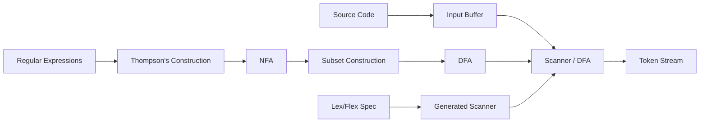

# Chapter 2: Lexical Analysis

**← Previous:** [Chapter 1: Introduction](01-introduction.md) | **Next:** [Chapter 3: Top-Down Parsing](03-parsing-topdown.md)

## Learning Objectives

After completing this chapter, students will be able to: define tokens, lexemes, and patterns; design input buffering schemes; specify tokens using regular expressions; construct deterministic finite automata from regular expressions; implement a lexical analyzer using a transition table; and use Lex or Flex to generate scanners automatically.

### Chapter at a Glance

| Section | Description |
|---------|-------------|
| Tokens, Lexemes, and Patterns | Fundamental concepts of lexical categories |
| Input Buffering | Two-buffer and one-buffer schemes for efficient scanning |
| Specification of Tokens Using Regular Expressions | Formal notation for describing token patterns |
| Regular Expressions to NFA: Thompson's Construction | Inductive NFA construction from regex |
| NFA to DFA: Subset Construction | Converting NFA sets into DFA states |
| Recognition of Tokens | DFA simulation and transition table scanning |
| Lex and Flex | Automatic scanner generation tools |

### Chapter Roadmap



## Theory


### Tokens, Lexemes, and Patterns

Lexical analysis is the first phase of compilation. The lexical analyzer, or scanner, reads the source program's character stream and groups characters into lexemes — sequences of characters that form a logical unit. For each lexeme, the scanner produces a token, a pair consisting of a token name and an optional attribute value.

A **token name** is a symbolic category such as `ID` (identifier), `NUMBER` (numeric literal), `IF` (the keyword if), `PLUS` (the plus operator), or `LPAREN` (left parenthesis). The attribute value, stored in a data structure sometimes called a symbol table entry, carries the specific lexeme or other information associated with the token. For example, the token for the lexeme `count` might be `ID` with attribute `pointer to symbol-table entry for "count"`. For a numeric literal, the attribute might be the integer or floating-point value.

A **pattern** is a rule that describes the set of lexemes belonging to a given token. Patterns are typically described using regular expressions. A lexeme is a particular instance of a pattern: the string `42` is a lexeme of the token `NUMBER` whose pattern could be `[0-9]+`. The scanner must recognize multiple token types simultaneously, distinguishing, for example, between the keyword `if` and an identifier `ifx`.

> **One-Sentence Takeaway:** Tokens are the vocabulary of the compiler — all subsequent phases work with this token stream, never with raw characters.

### Input Buffering

The scanner examines characters one at a time and must often look ahead one or more characters to determine the token boundary. Efficient input handling is essential because lexical analysis is I/O-bound. Two common buffering techniques are the one-buffer and two-buffer schemes.

In the **two-buffer** scheme, the source file is read into two alternating buffers, typically of size 4096 or 8192 characters. A pointer `lexemeBegin` marks the start of the current lexeme. A second pointer `forward` scans ahead. When `forward` reaches the end of a buffer, the next block of input is loaded into the other buffer. A sentinel character (frequently the end-of-file marker or a special character such as EOF) placed at the end of each buffer simplifies the end-of-buffer check, eliminating a conditional branch in the innermost scanning loop.

The **one-buffer** scheme uses a single buffer that is refilled when necessary. While simpler, it requires more careful management of the lexeme-start pointer because buffer contents may be overwritten. Most production scanners use the two-buffer approach for efficiency.

### Specification of Tokens Using Regular Expressions

Regular expressions provide a formal notation for specifying token patterns. The basic operations are concatenation (RS), alternation (R | S), and Kleene closure (R*). Additional notational conveniences include: R+ for one or more occurrences of R; R? for zero or one occurrences; and character classes such as `[a-z]` for the union of characters from a to z.

Important regular definitions for a typical programming language include:

```
digit       → [0-9]
letter      → [a-zA-Z_]
identifier  → letter (letter | digit)*
integer     → digit+
real        → digit+ (\. digit+)? (E [+-]? digit+)?
whitespace  → [ \t\n]+
comment     → "/*" (any)* "*/"
stringlit   → "\"" (any - "\"")* "\""
```

A lexical-analyzer generator converts these regular definitions into a deterministic finite automaton (DFA). The conversion proceeds by: constructing a nondeterministic finite automaton (NFA) from each regular expression using Thompson's construction; combining the NFAs into a single NFA with an ε start; converting the combined NFA to a DFA using the subset construction; and minimizing the DFA.

> **Pro Tip:** Most scanner bugs come from incorrect handling of lookahead. Always test with inputs that require the scanner to read one character beyond the lexeme boundary.

### Regular Expressions to NFA: Thompson's Construction

Thompson's construction maps each regular expression to an NFA inductively:

- For ε, construct an NFA with a single edge labeled ε from start to accepting state.
- For a symbol a, construct an NFA with an edge labeled a from start to accepting state.
- For alternation R | S, construct a new start state with ε edges to the starts of the NFAs for R and S, and ε edges from their accepting states to a new accepting state.
- For concatenation RS, connect the accepting state of R's NFA to the start state of S's NFA with an ε edge.
- For Kleene closure R*, construct a new start state connected by ε to R's start and to a new accepting state, and add an ε edge from R's accepting state back to R's start.

### NFA to DFA: Subset Construction

The subset construction converts an NFA into an equivalent DFA. Each DFA state corresponds to a set of NFA states reachable on the same input. The algorithm begins with the ε-closure of the NFA's start state. For each DFA state and each input symbol, it computes the ε-closure of the set of NFA states reachable from any state in the current set via that symbol. The process continues until no new DFA states are generated.

### Recognition of Tokens: DFA and Transition Tables

A deterministic finite automaton (DFA) is a five-tuple (S, Σ, δ, s₀, F), where S is a finite set of states, Σ is an input alphabet, δ: S × Σ → S is a transition function, s₀ ∈ S is the start state, and F ⊆ S is the set of accepting states.

The DFA is typically encoded as a **transition table**, a two-dimensional array T where T[state][input] gives the next state. The scanner performs a table-driven simulation:

```
state = startState;
while (true) {
    c = nextChar();
    state = T[state][c];
    if (state == error) { reportError(); break; }
    if (isAccepting(state)) { outputToken(state); break; }
}
```

In practice, the scanner must handle situations where multiple tokens match different prefixes of the input. The standard approach is **maximal munch**: the scanner reads the longest possible string of input characters that matches any token pattern. The scanner must also distinguish keywords from identifiers; this is typically done by placing keywords in the symbol table initially and checking identifier tokens against the keyword table.

> **One-Sentence Takeaway:** The maximal-munch rule ensures that `ifx` is never mistakenly tokenized as the keyword `if` followed by an identifier `x`.

> **Warning:** Keywords and identifiers share the same pattern structure — always check a reserved-word table after the DFA accepts a lexeme.

### Lex and Flex

Lex (and its GNU implementation Flex) is a lexical-analyzer generator that accepts a specification file containing regular-expression patterns and associated semantic actions. The generated C function `yylex()` reads input characters and returns token codes. Flex produces highly optimized scanners that can process tens of thousands of characters per second.

A Flex specification has three sections: declarations (including C code in %{...%}), translation rules (patterns paired with actions), and auxiliary procedures. The user defines token patterns using Flex's extended regular-expression syntax and writes C code to process each token. The generated scanner uses a precomputed DFA transition table for maximum speed.

## Examples

### Example 2.1: Flex Specification for a Simple Arithmetic Scanner

The following Flex specification recognizes identifiers, integer literals, and arithmetic operators:

```
%{
#include <stdio.h>
%}

%%
[ \t\n]       { /* skip whitespace */ }
[a-zA-Z_][a-zA-Z0-9_]* { printf("ID: %s\n", yytext); }
[0-9]+        { printf("NUM: %s\n", yytext); }
"+"           { printf("PLUS\n"); }
"-"           { printf("MINUS\n"); }
"*"           { printf("TIMES\n"); }
"/"           { printf("DIVIDE\n"); }
"("           { printf("LPAREN\n"); }
")"           { printf("RPAREN\n"); }
.             { printf("ERROR: unknown token\n"); }
%%

int main() { yylex(); return 0; }
```

Flex generates from this specification a C function `yylex()` that embodies the DFA-driven scanner. The variable `yytext` contains the matched lexeme when the action executes.

### Example 2.2: Manually Constructed DFA for Identifiers

Construct a DFA for the pattern `letter (letter | digit)*`. The DFA has two states. State 0 is the start state and is accepting only if we are at EOF. From state 0, input letter transitions to state 1; any other character leads to an error state. State 1 is accepting. From state 1, a letter or digit loops back to state 1; any other character signals the end of the lexeme. The transition table is sparse: most characters lead to error from state 0, and to a token-terminal action from state 1.

### Example 2.3: Resolving Keyword-Identifier Ambiguity

Consider the keyword `if` and identifiers that might begin with `if`. The scanner's maximal-munch rule ensures that `ifx` is recognized as an identifier (five characters) rather than a keyword `if` followed by `x`. After the DFA accepts the lexeme, the scanner checks the symbol table: if the lexeme matches a keyword entry, the token is changed to the keyword type; otherwise, it remains an identifier.

### Concept Comparison

| Concept | Definition | Example |
|---------|-----------|---------|
| Lexeme | Sequence of characters forming a logical unit | `count`, `42`, `+` |
| Token | Category name + optional attribute | `ID(name="count")` |
| Pattern | Rule describing valid lexemes for a token | `[a-zA-Z_][a-zA-Z0-9_]*` |
| DFA | Deterministic automaton for token recognition | Transition table driven scanner |

### Quick Reference

| Step | Technique | Input → Output |
|------|-----------|----------------|
| Token Specification | Regular expressions | Character patterns → token definitions |
| NFA Construction | Thompson's construction | Regex → ε-NFA |
| NFA → DFA | Subset construction | ε-NFA → DFA |
| DFA Minimization | State partitioning | Large DFA → minimal DFA |
| Scanner Generation | Lex/Flex | Spec → C scanner |

### Cross-Application Matrix

| Domain | Application | Relevance |
|--------|-------------|-----------|
| Language Design | Defining token sets for new languages | Every token must have an unambiguous pattern |
| Systems Programming | Building parsers for config files | Lexing is the first step in any format parser |
| Web Development | Tokenizing CSS selectors, HTML | Browser engines lexical-analyze everything |
| Tooling | Syntax highlighting, linters | Highlighters are essentially token visualizers |

## Summary

Lexical analysis groups source characters into tokens based on patterns described by regular expressions. The scanner is implemented as a DFA-driven simulation using a transition table. Tools such as Lex and Flex generate efficient scanners automatically from regular-expression specifications. Input buffering minimizes the overhead of character-by-character source reading. The scanner's maximal-munch rule and keyword-resolution logic ensure correct tokenization of all source constructs.

## Exercises

### Review Questions

1. Define the terms token, lexeme, and pattern. Provide an example of each.
2. Describe the two-buffer input-scanning scheme. How does a sentinel character simplify buffer management?
3. Write a regular expression that matches floating-point constants in scientific notation.
4. Explain the difference between a DFA and an NFA. Why is a DFA preferred for the scanner implementation?
5. What is the maximal-munch rule, and why is it important in lexical analysis?

### Application Problems

1. Construct an NFA for the regular expression `(a|b)*abb` using Thompson's construction. Then apply the subset construction to obtain the equivalent DFA. Minimize the resulting DFA.
2. Write a Flex specification for a scanner that recognizes the tokens of a minimal C-like language: identifiers, integer constants, string literals, keywords (if, else, while, return), operators (+, -, *, /, =, ==, !=, <, >), and punctuation (;, ,, (, ), {, }). Demonstrate it with a short input program.
3. Given the DFA for integer literals `digit+`, draw the transition diagram and write the transition table. Indicate the start state and accepting states.
4. Explain why keywords cannot be specified as regular expressions alone and must be handled by an auxiliary mechanism such as a reserved-word table.

### Challenge Problem

1. Implement a table-driven lexical analyzer in your chosen programming language that recognizes identifiers, integer literals, real literals, and the operators +, -, *, /. The scanner must use the two-buffer input scheme and report error tokens for unrecognized characters. Construct the DFA transition table manually for this set of tokens. Demonstrate that your scanner correctly tokenizes a sample source program containing all token categories. Measure the scanner's throughput in characters per second.

### Chapter Quiz

1. What does the maximal-munch rule specify?
   - A) The scanner should match the shortest possible string
   - B) The scanner should match the longest possible string that forms a token
   - C) The scanner should always prefer keywords over identifiers
   - D) The scanner should minimize memory usage

2. Which data structure best describes the core of a table-driven scanner?
   - A) Binary search tree
   - B) Deterministic finite automaton
   - C) Stack
   - D) Linked list

3. In Thompson's construction, what is the initial step for the regular expression `ab`?
   - A) Create a single NFA with alternating paths
   - B) Build separate NFAs for `a` and `b`, then concatenate with ε
   - C) Construct a DFA directly
   - D) Apply Kleene closure first

<details>
<summary>Answers</summary>
1. B, 2. B, 3. B
</details>
