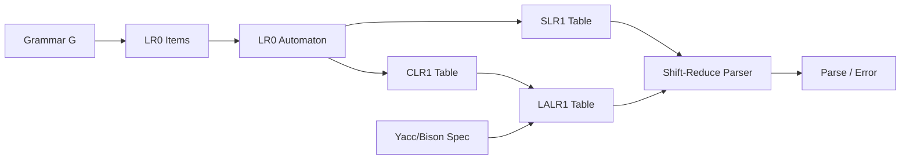

# Chapter 4: Bottom-Up Parsing

**← Previous:** [Chapter 3: Top-Down Parsing](03-parsing-topdown.md) | **Next:** [Chapter 5: Syntax-Directed Translation](05-sdt.md)

## Learning Objectives

After completing this chapter, students will be able to: explain the shift-reduce parsing paradigm and the concept of a handle; construct LR(0) items and the LR(0) automaton; build SLR(1), CLR(1), and LALR(1) parsing tables; handle ambiguous grammars in LR parsing; implement error recovery strategies; and use Yacc or Bison to generate bottom-up parsers for practical grammars.

### Chapter at a Glance

| Section | Description |
|---------|-------------|
| Bottom-Up Parsing and the Handle | Shift-reduce paradigm and rightmost derivation reversal |
| Shift-Reduce Parsing | Stack-based parsing with four operations |
| LR Parsing Framework | ACTION and GOTO table structure |
| LR(0) Items and Automaton | Building states from dotted items |
| SLR(1) Parsing | FOLLOW-set-based lookahead for conflict resolution |
| CLR(1) LR(1) Parsing | Per-item lookahead for maximum precision |
| LALR(1) Parsing | Merged CLR(1) states for practical tables |
| Error Handling in LR Parsing | Panic-mode and phrase-level recovery |
| Ambiguity in LR Parsing | Precedence and associativity declarations |
| Yacc and Bison | Automatic LALR(1) parser generation |

### Chapter Roadmap



## Theory


### Bottom-Up Parsing and the Handle

Bottom-up parsing constructs a parse tree starting from the leaves (the input terminals) and working upward toward the start symbol. The process corresponds to the reverse of a rightmost derivation: a rightmost derivation is reduced step by step to the start symbol. At each step, the parser identifies a substring of the current sentential form that can be reduced to a nonterminal.

The central concept in bottom-up parsing is the **handle**. A handle of a right-sentential form γ is a production A → β and a position in γ where β occurs such that replacing β with A yields the previous right-sentential form in the rightmost derivation. In a shift-reduce parser, the handle always appears at the top of the stack. The parser shifts tokens onto the stack until the handle appears at the top, then reduces it. Formally, for a rightmost derivation S ⇒*rm αAw ⇒rm αβw, the handle is A → β at the position following α, where α is the processed part on the stack and w is the remaining input.

> **One-Sentence Takeaway:** Bottom-up parsing is the reverse of a rightmost derivation — you reduce handles instead of expanding nonterminals.

### Shift-Reduce Parsing

A shift-reduce parser uses a stack for grammar symbols and an input buffer. Four operations are possible: **Shift** pushes the current input token onto the stack. **Reduce** pops the symbols of a handle from the stack and pushes the corresponding nonterminal. **Accept** announces successful completion. **Error** signals a syntax error if neither shift nor reduce is possible.

Conflicts arise when both shift and reduce are possible on the same input (shift-reduce conflict) or when two different reductions are possible (reduce-reduce conflict). LR parsers resolve these conflicts by consulting a parsing table.

### LR Parsing: General Framework

LR(k) parsers scan input Left-to-right and produce a Rightmost derivation in reverse with k tokens of lookahead. The most common variants are LR(0), SLR(1), CLR(1), and LALR(1). All share the same algorithm but differ in table construction. An LR parser consists of a stack of states, a parsing table with ACTION and GOTO functions, and the input buffer. The ACTION table maps (state, terminal) pairs to shift, reduce, accept, or error. The GOTO table maps (state, nonterminal) pairs to next states.

### LR(0) Items and the LR(0) Automaton

An **LR(0) item** is a production with a dot marker. For A → XY, the items are A → ·XY (nothing seen), A → X·Y (X seen), and A → XY· (complete). Closure adds items A → ·γ for every production of a nonterminal following the dot. Goto moves the dot past the next symbol. Repeated closure and goto build the LR(0) automaton.

The LR(0) automaton states are sets of LR(0) items. A state containing an item A → α· indicates a possible reduction. A state containing an item A → α·aβ indicates a possible shift on terminal a. When both coexist for the same terminal, an LR(0) conflict exists.

### SLR(1) Parsing

SLR(1) uses the LR(0) automaton but restricts reductions using FOLLOW sets. For state i with item A → α·, a reduction is placed only for terminals a ∈ FOLLOW(A). This eliminates many LR(0) conflicts because reductions are restricted to a subset of terminals. However, SLR(1) still leaves some conflicts unresolved because FOLLOW sets are computed from the grammar as a whole, not from the specific context of each state.

### CLR(1) LR(1) Parsing

CLR(1) uses LR(1) items with lookahead: [A → α·β, a]. Closure propagates lookaheads: for [A → α·Bβ, a], add [B → ·γ, b] for each b ∈ FIRST(βa). Goto preserves the lookahead. CLR(1) tables are large (often thousands of states) but eliminate virtually all conflicts resolvable by additional lookahead.

### LALR(1) Parsing

LALR(1) merges CLR(1) states with the same core (LR(0) portion) but different lookaheads. The lookahead sets are unioned. The resulting table matches SLR(1) in size but approaches CLR(1) in conflict-resolving power. LALR(1) is the algorithm used by Yacc and Bison. Merging can introduce reduce-reduce conflicts not present in CLR(1), but such conflicts are rare in practice.

> **One-Sentence Takeaway:** LALR(1) is the sweet spot — SLR(1)-sized tables with CLR(1)-near resolving power — which is why Yacc and Bison use it.

> **Pro Tip:** When debugging parser conflicts, use Bison's `-v` flag to generate the `.output` file. It shows every state and conflict, making the root cause visible.

### Error Handling in LR Parsing

When the ACTION table entry is error, the parser invokes error recovery. **Panic-mode recovery** discards input symbols until a synchronizing token such as a semicolon or end-keyword is found, then pops the stack to a state with a non-error GOTO. **Phrase-level recovery** uses error productions in the grammar. **Error correction** attempts to insert, delete, or replace tokens to enable continued parsing. Most production compilers use panic-mode recovery for its simplicity, even though it may suppress legitimate errors.

### Ambiguity in LR Parsing

An ambiguous grammar always produces LR conflicts. Rather than rewriting the grammar, the compiler writer typically resolves ambiguities by declaring precedence and associativity. The **dangling-else** ambiguity is resolved by preferring shift over reduce on the else token. Operator precedence is declared as a sequence of associativity and precedence levels, and the parser generator adjusts the ACTION table to resolve shift-reduce conflicts accordingly.

### Yacc and Bison

Yacc and Bison generate LALR(1) parsers from grammar specifications with embedded semantic actions. A Bison specification has three sections: declarations (token types, precedence), grammar rules with actions, and auxiliary C code. Bison generates a C function yyparse() that calls yylex() for tokens. Bison also supports GLR parsing for ambiguous grammars, verbose conflict reports via the -v flag, and push-parsing interfaces for incremental parsing.

## Examples

### Example 4.1: SLR(1) Parse of id + id * id

Using the grammar E → E + T | T, T → T * F | F, F → (E) | id. The SLR(1) table has no conflicts. The parse: shift id, reduce to F, reduce to T, reduce to E, shift +, shift id, reduce to F, reduce to T, shift *, shift id, reduce to F, reduce to T, reduce to E, accept. Each step is uniquely determined by the ACTION table.

### Example 4.2: Dangling-Else Conflict

Grammar: S → if E then S | if E then S else S | other. In the state containing S → if E then S· and S → if E then S· else S, a shift-reduce conflict arises on else. Preferring shift associates else with the nearest if.

### Example 4.3: LR(0) Automaton Construction

For grammar S → CC, C → cC | d: the LR(0) automaton has states I0, I1, I2, etc. I0 = closure({S' → ·S}) = {S' → ·S, S → ·CC, C → ·cC, C → ·d}. goto(I0, S) = I1 = {S' → S·}. goto(I0, C) = I2 = {S → C·C, C → ·cC, C → ·d}. This continues to build all six states covering the complete grammar.

### Concept Comparison

| Parser | Table Size | Lookahead | Conflicts Resolved |
|--------|-----------|-----------|-------------------|
| LR(0) | Small | None | Few |
| SLR(1) | Small | FOLLOW sets | Moderate |
| CLR(1) | Large | Per-item lookahead | Nearly all |
| LALR(1) | Small | Merged per-item lookahead | Most |

### Quick Reference

| Concept | Description | Formula / Rule |
|---------|-------------|---------------|
| Handle | Reducible substring at stack top | A → β where β is on stack |
| LR(0) Item | Production with a dot marker | A → α·β |
| Closure | Add items for nonterminal after dot | closure(I) |
| Goto | Move dot past symbol X | goto(I, X) |
| Shift | Push input token onto stack | ACTION[s, a] = shift |
| Reduce | Pop handle, push nonterminal | ACTION[s, a] = reduce A → β |

### Cross-Application Matrix

| Domain | Application | Relevance |
|--------|-------------|-----------|
| Language Design | Grammar debugging for complex syntax | LR conflicts reveal ambiguity |
| Systems Programming | Building production parsers | Yacc/Bison are industry standard |
| Web Development | Expression parsers in transpilers | Bottom-up parsing is efficient for expressions |
| Tooling | IDE syntax error recovery | Panic-mode recovery is widely used |

## Summary

Bottom-up parsing reverses a rightmost derivation by repeatedly reducing handles. LR parsers generalize shift-reduce parsing using state-based tables. LR(0) provides the basic automaton; SLR(1) adds FOLLOW-based lookahead; CLR(1) tracks per-item lookahead; and LALR(1) compresses CLR(1) states for practical table sizes. Parser generators automate LALR(1) construction. Ambiguous grammars are handled via precedence and associativity annotations.

## Exercises

### Review Questions

1. Define the concept of a handle in bottom-up parsing. Explain its role in shift-reduce parsing.
2. What distinguishes SLR(1) from CLR(1) parsing? Under what conditions does CLR(1) succeed where SLR(1) fails?
3. Explain how LALR(1) achieves table sizes comparable to SLR(1) while retaining most of CLR(1)'s conflict-resolving power.
4. Describe the four actions available to a shift-reduce parser and when each is invoked.
5. What is the dangling-else ambiguity and how is it resolved in an LR parser?

### Application Problems

1. Build the LR(0) automaton for the grammar S → CC, C → cC | d. Construct the SLR(1) table. Is this grammar SLR(1)? Justify.
2. Construct the LR(1) items and the CLR(1) table for the grammar in Problem 1. Compare the state count with the LR(0) automaton.
3. Using the expression grammar from Example 4.1, trace the shift-reduce parse for (id + id) * id. Show stack and input at each step.
4. Identify the shift-reduce conflict in the dangling-else grammar. Show the state and items involved. Explain the resolution.
5. For grammar A → A a | a, explain why this grammar cannot be parsed by any LR parser. Show the LR(0) automaton and identify the conflict.

### Challenge Problem

1. Implement a shift-reduce parser with a hand-built SLR(1) table for the grammar:
   ```
   S → AA
   A → aA | b
   ```
    Your implementation must include LR(0) automaton construction, FOLLOW computation, table construction, and the shift-reduce driver. Demonstrate on inputs ab, aab, aaab. Extend to produce a parse tree and print it in parenthesized format. Also implement panic-mode error recovery: on encountering an error, discard input tokens until end-of-input, reporting the error position.

### Chapter Quiz

1. What is the key difference between SLR(1) and CLR(1) parsing?
   - A) SLR(1) uses LR(0) items; CLR(1) uses LR(1) items with per-item lookahead
   - B) SLR(1) can parse ambiguous grammars; CLR(1) cannot
   - C) CLR(1) tables are always smaller than SLR(1)
   - D) There is no difference; they are the same algorithm

2. In a shift-reduce parser, what is a handle?
   - A) The current input token
   - B) A reducible substring at the top of the stack
   - C) The parser state number
   - D) A lookahead symbol

3. Which LR variant is used by Yacc and Bison?
   - A) LR(0)
   - B) SLR(1)
   - C) LALR(1)
   - D) CLR(1)

<details>
<summary>Answers</summary>
1. A, 2. B, 3. C
</details>
