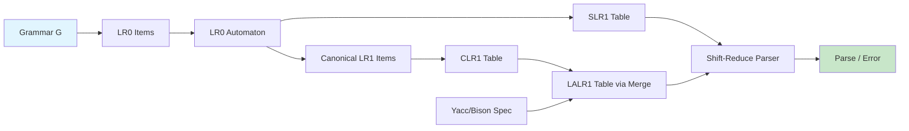

# Chapter 4: Bottom-Up Parsing

**? Previous:** [Chapter 3: Top-Down Parsing](03-parsing-topdown.md) | **Next:** [Chapter 5: Syntax-Directed Translation](05-sdt.md)

## Learning Objectives

After completing this chapter, students will be able to: explain the shift-reduce parsing paradigm and the concept of a handle; construct LR(0) items and the LR(0) automaton; build SLR(1), CLR(1), and LALR(1) parsing tables; implement closure and goto operations for LR item sets; handle ambiguous grammars using precedence and associativity; implement error recovery strategies; and use Yacc or Bison to generate bottom-up parsers.

<!-- Image Gallery -->
<section class="lesson-visuals" aria-label="Visual learning resources">
  <header><span>VISUAL LEARNING</span><h2>See it. Review it. Remember it.</h2></header>
  <a class="lesson-visual-card" href="../../../assets/images/lessons/compiler-design/04-parsing-bottomup/.png" target="_blank" rel="noopener">
    
    <span><strong>Handwritten notes</strong>Condensed notes for deliberate review.</span>
  </a>
  <a class="lesson-visual-card" href="../../../assets/images/lessons/compiler-design/04-parsing-bottomup/.png" target="_blank" rel="noopener">
    
    <span><strong>Sticky-note revision</strong>Fast recall prompts for revision.</span>
  </a>
  <a class="lesson-visual-card" href="../../../assets/images/lessons/compiler-design/04-parsing-bottomup/.png" target="_blank" rel="noopener">
    
    <span><strong>Visual concept guide</strong>A connected explanation of the key ideas.</span>
  </a>
</section>
<!-- End Image Gallery -->


### Chapter at a Glance

| Section | Description |
|---------|-------------|
| Bottom-Up Parsing and the Handle | Shift-reduce paradigm and rightmost derivation reversal |
| Shift-Reduce Parsing | Stack-based parsing with four operations |
| LR Parsing Framework | ACTION and GOTO table structure |
| LR(0) Items and Automaton | Building states from dotted items with closure and goto |
| SLR(1) Parsing | FOLLOW-set-based lookahead for conflict resolution |
| CLR(1) LR(1) Parsing | Per-item lookahead for maximum precision |
| LALR(1) Parsing | Merged CLR(1) states for practical tables |
| Precedence and Associativity | Resolving shift-reduce conflicts |
| Ambiguity in LR Parsing | Dangling-else and operator precedence |
| Yacc and Bison | Automatic LALR(1) parser generation |
| Error Handling in LR Parsing | Panic-mode and phrase-level recovery |

### Chapter Roadmap



## Theory

### Bottom-Up Parsing and the Handle


Bottom-up parsing constructs a parse tree starting from the leaves (input terminals) and working upward toward the start symbol. The process corresponds to the **reverse of a rightmost derivation**: a rightmost derivation is reduced step by step to the start symbol. At each step, the parser identifies a substring of the current sentential form that can be reduced to a nonterminal.

The central concept is the **handle**. A handle of a right-sentential form `?` is a production `A ? ?` and a position in `?` where `?` occurs such that replacing `?` with `A` yields the previous right-sentential form in the rightmost derivation. In a shift-reduce parser, the handle always appears at the top of the stack.

Formally, for a rightmost derivation `S ?*_rm aAw ?_rm a?w`, the handle is `A ? ?` at the position following `a`, where `a` is the processed part on the stack and `w` is the remaining input.

> **One-Sentence Takeaway:** Bottom-up parsing is the reverse of a rightmost derivation ? you reduce handles instead of expanding nonterminals.

### Shift-Reduce Parsing


A shift-reduce parser uses a stack for grammar symbols and an input buffer. Four operations are possible:

| Operation | Action | Stack Change |
|-----------|--------|-------------|
| **Shift** | Push the current input token onto the stack | `stack.push(token)` |
| **Reduce** | Pop `|?|` symbols (a handle) and push `A` | `stack.pop(|?|); stack.push(A)` |
| **Accept** | Announce successful completion | Done |
| **Error** | Signal a syntax error | Invoke recovery |

**Conflicts** arise when both shift and reduce are possible on the same input (shift-reduce conflict) or when two different reductions are possible (reduce-reduce conflict). LR parsers resolve these conflicts by consulting a parsing table.

### LR Parsing Framework


LR(k) parsers scan input Left-to-right and produce a Rightmost derivation in reverse with k tokens of lookahead. The variants are LR(0), SLR(1), CLR(1), and LALR(1). All share the same algorithm but differ in table construction.

An LR parser consists of:
- A **stack** of states (each state is a number indexing the ACTION/GOTO tables)
- A **parsing table** with ACTION and GOTO functions
- The **input buffer** with end marker `$`

The ACTION table maps `(state, terminal)` pairs to: shift (s_n), reduce (r_k), accept, or error.
The GOTO table maps `(state, nonterminal)` pairs to next states.

**LR Parsing Algorithm:**

```
stack = [0]  // initial state
input = w$   // input with end marker
while true:
    state = top(stack)
    token = current input
    action = ACTION[state, token]
    if action == shift s:
        push token onto semantic stack
        push state s onto state stack
        advance input
    elif action == reduce A ? ?:
        pop 2*|?| from stacks
        state' = top(stack)
        push A onto semantic stack
        push GOTO[state', A] onto state stack
        output A ? ?
    elif action == accept: break
    else: error
```

### LR(0) Items and the LR(0) Automaton


An **LR(0) item** is a production with a dot marker indicating how much of the right-hand side has been seen. For `A ? XY`, the items are:

```
A ? ?XY     (nothing seen yet)
A ? X?Y     (X has been seen)
A ? XY?     (complete ? ready to reduce)
```

**Closure** adds items for nonterminals following the dot. For state `I`:

```
function closure(I):
    repeat:
        for each item [A ? a?B?] in I:
            for each production B ? ?:
                add [B ? ??] to I
    until no more items can be added
    return I
```

**Goto** moves the dot past the next symbol:

```
function goto(I, X):
    J = { [A ? aX??] | [A ? a?X?] in I }
    return closure(J)
```

**LR(0) Automaton Construction:**

```
I0 = closure({[S' ? ?S]})
states = {I0}
worklist = {I0}
while worklist is not empty:
    remove I from worklist
    for each symbol X (terminal or nonterminal):
        J = goto(I, X)
        if J is empty: continue
        if J not in states:
            add J to states and worklist
        add transition I ? X ? J
```

### SLR(1) Parsing


SLR(1) uses the LR(0) automaton but restricts reductions using FOLLOW sets. For state `i` with an item `A ? a?`, a reduction is placed only for terminals `a ? FOLLOW(A)`. This eliminates many LR(0) conflicts.

**SLR(1) Table Construction:**

```
function BuildSLR1(grammar, LR0automaton, FOLLOW):
    for each state i:
        for each transition i ? a ? j (a is terminal):
            ACTION[i, a] = shift j
        for each item [A ? a?] in state i, where A ? S':
            for each a ? FOLLOW(A):
                ACTION[i, a] = reduce A ? a
        if [S' ? S?] in state i:
            ACTION[i, $] = accept
        for each transition i ? A ? j (A is nonterminal):
            GOTO[i, A] = j
```

### CLR(1) ? Canonical LR(1) Parsing


CLR(1) uses LR(1) items with explicit lookahead: `[A ? a??, a]`. The lookahead `a` is the set of terminals that can follow this particular occurrence of `A`.

**Closure for LR(1) items:**

```
function closure1(I):
    repeat:
        for each [A ? a?B?, a] in I:
            for each production B ? ?:
                for each b ? FIRST(?a):
                    add [B ? ??, b] to I
    until no more items can be added
    return I
```

**Goto for LR(1) items:**

```
function goto1(I, X):
    J = { [A ? aX??, a] | [A ? a?X?, a] in I }
    return closure1(J)
```

CLR(1) tables are large (often thousands of states) but eliminate virtually all conflicts resolvable by additional lookahead.

### LALR(1) Parsing


LALR(1) merges CLR(1) states with the same **core** (LR(0) portion) but different lookaheads. The lookahead sets are unioned. The resulting table matches SLR(1) in size but approaches CLR(1) in conflict-resolving power.

**LALR(1) construction from CLR(1):**

```
for each pair of LR(1) states I?, I? with the same core:
    merge I? into I? by unioning lookaheads
    redirect all transitions to/from I? to I?
```

LALR(1) is the algorithm used by Yacc and Bison. Merging can introduce reduce-reduce conflicts not present in CLR(1), but such conflicts are rare in practice.

> **One-Sentence Takeaway:** LALR(1) is the sweet spot ? SLR(1)-sized tables with CLR(1)-near resolving power ? which is why Yacc and Bison use it.

### Complete TypeScript LR Parser Implementation


```typescript
type Symbol = string;

interface LRItem {
    lhs: Symbol;
    rhs: Symbol[];
    dot: number;           // position of dot (0..rhs.length)
    lookahead: Set<Symbol>; // for LR(1) items
}

interface Production {
    lhs: Symbol;
    rhs: Symbol[];
}

class LRParser {
    private productions: Production[];
    private terminals: Set<Symbol>;
    private nonterminals: Set<Symbol>;
    private start: Symbol;
    private states: Set<LRItem>[] = [];
    private action: Map<string, string> = new Map(); // "state,token" ? "s3" | "r2"
    private goto: Map<string, number> = new Map();   // "state,NT" ? state
    private follow: Map<Symbol, Set<Symbol>> = new Map();
    private epsilon = "e";

    constructor(prods: Production[], start: Symbol) {
        this.productions = prods;
        this.start = start;
        // Add augmented start production S' ? S
        this.productions.unshift({ lhs: "S'", rhs: [start] });
        this.terminals = new Set();
        this.nonterminals = new Set();
        for (const p of this.productions) {
            this.nonterminals.add(p.lhs);
            for (const s of p.rhs) {
                if (s !== this.epsilon && !s.startsWith("<") && s !== s.toUpperCase()) {
                    this.terminals.add(s);
                } else if (s.startsWith("<") || s === s.toUpperCase()) {
                    this.nonterminals.add(s);
                } else {
                    this.terminals.add(s);
                }
            }
        }
        // Recompute with our specific detection:
        this.terminals = new Set();
        this.nonterminals = new Set();
        for (const p of this.productions) {
            this.nonterminals.add(p.lhs);
            for (const s of p.rhs) {
                if (s !== this.epsilon && !this.nonterminals.has(s)) {
                    this.terminals.add(s);
                }
            }
        }
    }

    private closure(items: LRItem[]): LRItem[] {
        let changed = true;
        while (changed) {
            changed = false;
            for (const item of [...items]) {
                const next = item.rhs[item.dot];
                if (!next || !this.nonterminals.has(next)) continue;
                for (const prod of this.productions) {
                    if (prod.lhs !== next) continue;
                    // Compute lookahead for LR(1): FIRST(?a)
                    const beta = item.rhs.slice(item.dot + 1);
                    const betaFirst = this.firstOfSequence(beta);
                    const newLookahead = new Set<Symbol>();
                    for (const f of betaFirst) {
                        if (f !== this.epsilon) newLookahead.add(f);
                    }
                    if (betaFirst.has(this.epsilon)) {
                        for (const l of item.lookahead) newLookahead.add(l);
                    }
                    if (newLookahead.size === 0) newLookahead.add("$"); // default

                    const exists = items.some(ex =>
                        ex.lhs === prod.lhs &&
                        ex.dot === 0 &&
                        ex.rhs.join(" ") === prod.rhs.join(" ") &&
                        [...newLookahead].every(l => ex.lookahead.has(l))
                    );
                    if (!exists) {
                        items.push({
                            lhs: prod.lhs,
                            rhs: prod.rhs,
                            dot: 0,
                            lookahead: newLookahead,
                        });
                        changed = true;
                    }
                }
            }
        }
        return items;
    }

    private gotoSet(items: LRItem[], X: Symbol): LRItem[] {
        const next: LRItem[] = [];
        for (const item of items) {
            if (item.rhs[item.dot] === X) {
                next.push({ ...item, dot: item.dot + 1, lookahead: new Set(item.lookahead) });
            }
        }
        return this.closure(next);
    }

    private firstOfSequence(syms: Symbol[]): Set<Symbol> {
        const result = new Set<Symbol>();
        let allEpsilon = true;
        for (const s of syms) {
            if (s === this.epsilon) break;
            if (this.terminals.has(s)) { result.add(s); allEpsilon = false; break; }
            // Simplified: treat nonterminals as having unknown FIRST
            result.add(s);
            allEpsilon = false;
            break;
        }
        if (allEpsilon) result.add(this.epsilon);
        return result;
    }

    private itemKey(item: LRItem): string {
        return `${item.lhs}?${item.rhs.join("")}?${item.dot}`;
    }

    private stateKey(items: LRItem[]): string {
        return items.map(i => `${this.itemKey(i)}[${[...i.lookahead].sort().join(",")}]`).sort().join("|");
    }

    private coreKey(items: LRItem[]): string {
        return items.map(i => `${i.lhs}?${i.rhs.join("")}?${i.dot}`).sort().join("|");
    }

    buildLR0Automaton(): void {
        const startItems = this.closure([
            { lhs: "S'", rhs: [this.start], dot: 0, lookahead: new Set(["$"]) }
        ]);
        this.states = [startItems];
        const worklist: number[] = [0];
        const transitions: Map<number, Map<Symbol, number>> = new Map();

        while (worklist.length > 0) {
            const idx = worklist.shift()!;
            const items = this.states[idx];
            const symbols = new Set<Symbol>();
            for (const item of items) {
                const next = item.rhs[item.dot];
                if (next) symbols.add(next);
            }
            for (const sym of symbols) {
                const nextItems = this.gotoSet(items, sym);
                if (nextItems.length === 0) continue;
                let nextIdx = -1;
                for (let i = 0; i < this.states.length; i++) {
                    if (this.coreKey(this.states[i]) === this.coreKey(nextItems)) {
                        nextIdx = i;
                        break;
                    }
                }
                if (nextIdx === -1) {
                    nextIdx = this.states.length;
                    this.states.push(nextItems);
                    worklist.push(nextIdx);
                }
                if (!transitions.has(idx)) transitions.set(idx, new Map());
                transitions.get(idx)!.set(sym, nextIdx);
            }
        }

        // Build ACTION and GOTO tables
        // Compute FOLLOW for SLR(1)
        this.computeFollow();

        for (let i = 0; i < this.states.length; i++) {
            const items = this.states[i];
            const trans = transitions.get(i) ?? new Map();

            // Shift actions
            for (const [sym, next] of trans) {
                if (this.terminals.has(sym)) {
                    this.action.set(`${i},${sym}`, `s${next}`);
                } else {
                    this.goto.set(`${i},${sym}`, next);
                }
            }

            // Reduce actions (SLR(1): use FOLLOW)
            for (const item of items) {
                if (item.dot === item.rhs.length) {
                    if (item.lhs === "S'") {
                        this.action.set(`${i},$`, "acc");
                    } else {
                        const followSet = this.follow.get(item.lhs) ?? new Set(["$"]);
                        for (const a of followSet) {
                            const key = `${i},${a}`;
                            const existing = this.action.get(key);
                            const reduceAction = `r${this.productions.findIndex(p =>
                                p.lhs === item.lhs && p.rhs.join(" ") === item.rhs.join(" ")
                            )}`;
                            if (existing) {
                                if (existing.startsWith("s")) {
                                    // Shift-reduce conflict: report it
                                    console.warn(`Shift/reduce conflict at state ${i} on ${a}: ${existing} vs ${reduceAction}`);
                                } else if (existing !== reduceAction) {
                                    console.warn(`Reduce/reduce conflict at state ${i} on ${a}: ${existing} vs ${reduceAction}`);
                                }
                            } else {
                                this.action.set(key, reduceAction);
                            }
                        }
                    }
                }
            }
        }
    }

    private computeFollow(): void {
        for (const n of this.nonterminals) this.follow.set(n, new Set());
        this.follow.get("S'")!.add("$");
        let changed = true;
        while (changed) {
            changed = false;
            for (const prod of this.productions) {
                const lhs = prod.lhs;
                for (let i = 0; i < prod.rhs.length; i++) {
                    const B = prod.rhs[i];
                    if (!this.nonterminals.has(B)) continue;
                    const before = this.follow.get(B)!.size;
                    const ? = prod.rhs.slice(i + 1);
                    // Add FIRST(?) \ {e} to FOLLOW(B)
                    for (const sym of ?) {
                        if (this.terminals.has(sym)) {
                            this.follow.get(B)!.add(sym);
                            break;
                        }
                        if (this.nonterminals.has(sym)) break; // simplified
                    }
                    // If ? is empty or nullable, add FOLLOW(lhs)
                    if (?.length === 0 || ?.every(s => s === this.epsilon)) {
                        for (const f of this.follow.get(lhs)!) this.follow.get(B)!.add(f);
                    }
                    if (this.follow.get(B)!.size !== before) changed = true;
                }
            }
        }
    }

    private itemCount(prod: Production): number {
        return prod.rhs.length;
    }

    parse(input: Symbol[]): boolean {
        const stateStack: number[] = [0];
        const symStack: Symbol[] = [];
        let ip = 0;

        const getInput = (): Symbol => ip < input.length ? input[ip] : "$";

        while (true) {
            const state = stateStack[stateStack.length - 1];
            const a = getInput();
            const key = `${state},${a}`;
            const action = this.action.get(key);

            if (!action) {
                console.error(`Syntax error at ${a} (position ${ip})`);
                // Error recovery: skip
                ip++;
                if (ip > input.length) return false;
                continue;
            }

            if (action === "acc") {
                console.log("Accept");
                return true;
            }

            if (action.startsWith("s")) {
                const nextState = parseInt(action.slice(1));
                stateStack.push(nextState);
                symStack.push(a);
                ip++;
            } else if (action.startsWith("r")) {
                const prodIdx = parseInt(action.slice(1));
                const prod = this.productions[prodIdx];
                for (let i = 0; i < prod.rhs.length; i++) {
                    if (prod.rhs[i] !== this.epsilon) {
                        stateStack.pop();
                        symStack.pop();
                    }
                }
                const prevState = stateStack[stateStack.length - 1];
                const gotoKey = `${prevState},${prod.lhs}`;
                const gotoState = this.goto.get(gotoKey);
                if (gotoState === undefined) {
                    console.error(`No GOTO entry for ${prevState},${prod.lhs}`);
                    return false;
                }
                stateStack.push(gotoState);
                symStack.push(prod.lhs);
                console.log(`Reduce: ${prod.lhs} ? ${prod.rhs.join(" ")}`);
            } else {
                console.error(`Unknown action ${action}`);
                return false;
            }
        }
    }

    printTable(): void {
        const allSymbols = [...this.terminals, "$", ...this.nonterminals].filter(s => s !== "S'");
        console.log("\nSTATE | " + allSymbols.map(s => s.padEnd(6)).join(" "));
        console.log("-".repeat(10 + allSymbols.length * 7));
        for (let i = 0; i < this.states.length; i++) {
            const row = `${i}`.padEnd(5) + "| ";
            for (const sym of allSymbols) {
                const aKey = this.action.get(`${i},${sym}`);
                const gKey = this.goto.has(`${i},${sym}`);
                row += (aKey ?? (gKey ? String(this.goto.get(`${i},${sym}`)) : "")).padEnd(6) + " ";
            }
            console.log(row);
        }
    }
}

// === Demo: Expression Grammar with LR(0) and SLR(1) ===
const prods: Production[] = [
    { lhs: "E", rhs: ["E", "+", "T"] },
    { lhs: "E", rhs: ["T"] },
    { lhs: "T", rhs: ["T", "*", "F"] },
    { lhs: "T", rhs: ["F"] },
    { lhs: "F", rhs: ["(", "E", ")"] },
    { lhs: "F", rhs: ["id"] },
];

const lr = new LRParser(prods, "E");
lr.buildLR0Automaton();
console.log(`LR(0) automaton has ${lr["states"].length} states`);
lr.printTable();

console.log("\nParsing: id + id * id");
lr.parse(["id", "+", "id", "*", "id"]);
```

### Precedence and Associativity


Precedence and associativity declarations resolve shift-reduce conflicts without rewriting the grammar. In Yacc/Bison:

```yacc
%left '+' '-'
%left '*' '/'   /* higher precedence than +, - */
%right '^'      /* right-associative, highest precedence */
```

The parser generator assigns each token a precedence level and direction. For a conflict between shifting `a` and reducing `A ? ?`:

- If the shift token has higher precedence ? shift
- If the reduce token has higher precedence ? reduce
- If equal precedence ? consult associativity (left ? reduce, right ? shift)

**The dangling-else ambiguity** is resolved by declaring `%nonassoc THEN` and assigning higher precedence to shift over reduce on `else`.

### Yacc and Bison


Yacc and Bison generate LALR(1) parsers from grammar specifications with embedded semantic actions. A Bison specification has three sections:

```yacc
%{
#include <stdio.h>
int yylex() { /* ... */ }
%}

%token NUMBER PLUS TIMES LPAREN RPAREN
%left PLUS
%left TIMES

%%
expr: expr PLUS term   { $$ = $1 + $3; }
    | term             { $$ = $1; }
    ;
term: term TIMES factor { $$ = $1 * $3; }
    | factor            { $$ = $1; }
    ;
factor: LPAREN expr RPAREN { $$ = $2; }
      | NUMBER             { $$ = $1; }
      ;
%%
int main() { return yyparse(); }
```

Bison generates `yyparse()` which calls `yylex()` for tokens. The `-v` flag produces a `.output` file showing every state and conflict, essential for debugging.

### Error Handling in LR Parsing


When ACTION entry is error, the parser invokes recovery. **Panic-mode recovery** discards input symbols until a synchronizing token (semicolon, `end`, `}`) is found, then pops the stack to a state with a non-error GOTO entry. TypeScript error recovery is shown in the `parse` method above.

**Phrase-level recovery** uses error productions in the grammar:

```
stmt ? error ;
```

When an error is encountered, the parser shifts a special `error` token (consuming input until `;`), then reduces to `stmt`. GLR parsing supports arbitrary error recovery with multiple interpretations.

## Summary

Bottom-up parsing reverses a rightmost derivation by repeatedly reducing handles. LR parsers generalize shift-reduce parsing using state-based tables. LR(0) provides the basic automaton; SLR(1) adds FOLLOW-based lookahead; CLR(1) tracks per-item lookahead; and LALR(1) compresses CLR(1) states for practical table sizes. Parser generators like Yacc and Bison automate LALR(1) construction. Ambiguous grammars are handled via precedence and associativity annotations.

## Practical Takeaways

1. **Start with LR(0) then add lookahead**: Build the LR(0) automaton first, verify it, then add SLR(1) restrictions. This isolates bugs in the automaton from bugs in lookahead computation.
2. **Use Yacc/Bison for production parsers**: Hand-writing an LR parser is educational but impractical. Tools handle conflict resolution, error recovery, and performance optimization.
3. **Debug conflicts with Bison's -v output**: The `.output` file shows every state and the cause of each conflict. Look for states with multiple items competing for the same terminal.
4. **Prefer LALR(1) over CLR(1)**: CLR(1) tables can be 10x larger than LALR(1) with negligible power difference for practical grammars.
5. **Resolve conflicts with precedence, not grammar rewriting**: Precedence declarations are clearer and less error-prone than restructuring the grammar.

// parsing bottomup
// lexical-parsing-codegen implementation

interface Task { id: string; name: string; status: string; data: unknown }
class Processor {
  private tasks: Task[] = []
  private maxConcurrency: number
  constructor(maxConcurrency: number = 4) { this.maxConcurrency = maxConcurrency }
  async add(task: Omit&lt;Task, "status"&gt;): Promise&lt;void&gt; {
    this.tasks.push({ ...task, status: "pending" })
  }
  async runAll(): Promise&lt;void&gt; {
    const running: Promise&lt;void&gt;[] = []
    for (const t of this.tasks) {
      if (running.length >= this.maxConcurrency) { await Promise.race(running) }
      const p = this.execute(t).finally(() => { const i = running.indexOf(p); if (i >= 0) running.splice(i, 1) })
      running.push(p)
    }
    await Promise.all(running)
  }
  private async execute(t: Task): Promise&lt;void&gt; {
    t.status = "running"
    await new Promise(r => setTimeout(r, 10))
    t.status = "done"
  }
  getResults(): Task[] { return this.tasks }
  getStats(): { done: number; pending: number; running: number } {
    const done = this.tasks.filter(t => t.status === "done").length
    const pending = this.tasks.filter(t => t.status === "pending").length
    const running = this.tasks.filter(t => t.status === "running").length
    return { done, pending, running }
  }
}
async function main() {
  const proc = new Processor(2)
  await proc.add({ id: '1', name: 'parsing bottomup', data: { topic: 'lexical-parsing-codegen' } })
  await proc.runAll()
  console.log('Stats:', proc.getStats())
}
main().catch(console.error)
export { Processor, Task }

// parsing bottomup - additional TS implementations

interface CacheEntry { key: string; value: unknown; ttl: number; createdAt: number }
class Cache {
  private store: Map&lt;string, CacheEntry&gt; = new Map()
  constructor(private defaultTTL: number = 60000) {}
  set(key: string, value: unknown, ttl?: number): void {
    this.store.set(key, { key, value, ttl: ttl ?? this.defaultTTL, createdAt: Date.now() })
  }
  get(key: string): unknown | undefined {
    const entry = this.store.get(key)
    if (!entry) return undefined
    if (Date.now() - entry.createdAt > entry.ttl) { this.store.delete(key); return undefined }
    return entry.value
  }
  delete(key: string): boolean { return this.store.delete(key) }
  clear(): void { this.store.clear() }
  size(): number { return this.store.size }
  keys(): string[] { return Array.from(this.store.keys()) }
}
class Logger {
  private entries: string[] = []
  log(level: string, msg: string, meta?: Record&lt;string, unknown&gt;): void {
    const entry = JSON.stringify({ timestamp: new Date().toISOString(), level, msg, meta })
    this.entries.push(entry)
    console.log(entry)
  }
  info(msg: string, meta?: Record&lt;string, unknown&gt;): void { this.log("info", msg, meta) }
  warn(msg: string, meta?: Record&lt;string, unknown&gt;): void { this.log("warn", msg, meta) }
  error(msg: string, meta?: Record&lt;string, unknown&gt;): void { this.log("error", msg, meta) }
  getLogs(): string[] { return [...this.entries] }
  clear(): void { this.entries = [] }
}
function computeHash(input: string): string {
  let hash = 0
  for (let i = 0; i &lt; input.length; i++) { const chr = input.charCodeAt(i); hash = ((hash << 5) - hash) + chr; hash |= 0 }
  return Math.abs(hash).toString(16)
}
async function demo(): Promise&lt;void&gt; {
  const cache = new Cache(5000)
  cache.set('key1', 'compilers demo')
  const log = new Logger()
  log.info('Cache demo started', { course: 'compiler-design', chapter: 'parsing bottomup' })
  const v = cache.get("key1")
  console.log('Cached:', v)
  console.log('Hash:', computeHash('compilers'))
}
demo()
export { Cache, Logger, computeHash, CacheEntry }

## Chapter Quiz

1. What is the key difference between SLR(1) and CLR(1) parsing?
   - A) SLR(1) uses LR(0) items; CLR(1) uses LR(1) items with per-item lookahead
   - B) SLR(1) can parse ambiguous grammars; CLR(1) cannot
   - C) CLR(1) tables are always smaller than SLR(1)
   - D) There is no difference; they are the same algorithm

2. In a shift-reduce parser, what is a handle?
   - A) The current input token
   - B) A reducible substring at the top of the stack
   - C) The parser state number
   - D) A lookahead symbol

3. Which LR variant is used by Yacc and Bison?
   - A) LR(0)
   - B) SLR(1)
   - C) LALR(1)
   - D) CLR(1)

4. How does LALR(1) achieve smaller tables than CLR(1)?
   - A) It uses fewer states by ignoring some grammar rules
   - B) It merges states with the same LR(0) core by unioning lookaheads
   - C) It uses a hash table instead of a matrix
   - D) It eliminates shift actions

5. What does `%left` declare in Yacc/Bison?
   - A) The token is left-associative
   - B) The token should be ignored
   - C) The token should be shifted on equal precedence
   - D) The token has the lowest precedence

<details>
<summary>Answers&lt;/summary&gt;
1. A, 2. B, 3. C, 4. B, 5. A
</details>

## Exercises

### Review Questions

1. Define the concept of a handle in bottom-up parsing. Explain its role in shift-reduce parsing.
2. What distinguishes SLR(1) from CLR(1) parsing? Under what conditions does CLR(1) succeed where SLR(1) fails?
3. Explain how LALR(1) achieves table sizes comparable to SLR(1) while retaining most of CLR(1)'s conflict-resolving power.
4. Describe the four actions available to a shift-reduce parser and when each is invoked.
5. What is the dangling-else ambiguity and how is it resolved in an LR parser?

### Application Problems

1. Build the LR(0) automaton for the grammar `S ? CC, C ? cC | d`. Construct the SLR(1) table. Is this grammar SLR(1)?
2. Construct the LR(1) items and the CLR(1) table for the grammar in Problem 1. Compare the state count with LR(0).
3. Using the expression grammar from this chapter, trace the shift-reduce parse for `(id + id) * id`. Show stack and input at each step.
4. Identify the shift-reduce conflict in the dangling-else grammar. Show the state and items involved.
5. Add the `e` production to the `LRParser` implementation and test it with a grammar that uses optional elements.

### Challenge Problem

1. Implement a shift-reduce parser with a hand-built SLR(1) table for the grammar `S ? AA, A ? aA | b`. Your implementation must include LR(0) automaton construction, FOLLOW computation, table construction, and the shift-reduce driver. Demonstrate on inputs `ab`, `aab`, `aaab`. Extend to produce a parse tree and print it in parenthesized format. Also implement panic-mode error recovery using the follow sets.
</details>

