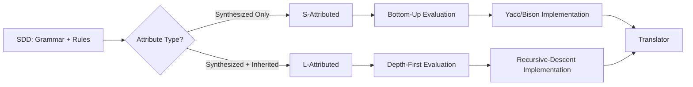

# Chapter 5: Syntax-Directed Translation

**← Previous:** [Chapter 4: Bottom-Up Parsing](04-parsing-bottomup.md) | **Next:** [Chapter 6: Intermediate Code Generation](06-intermediate-code.md)

## Learning Objectives

After completing this chapter, students will be able to: define syntax-directed definitions (SDDs) for S-attributed and L-attributed grammars; construct syntax-directed translation schemes (SDTs); determine evaluation order from dependency graphs; implement S-attributed definitions using a bottom-up parser; implement L-attributed definitions using a top-down parser; and apply SDDs to practical translation tasks such as type checking and code generation.

### Chapter at a Glance

| Section | Description |
|---------|-------------|
| Syntax-Directed Definitions | CFG augmented with semantic rules |
| Attribute Classification | Synthesized vs inherited attributes |
| S-Attributed Definitions | Bottom-up evaluation with only synthesized attributes |
| L-Attributed Definitions | Left-to-right evaluation with inherited attributes |
| Syntax-Directed Translation Schemes | Embedding actions in productions |
| Evaluation Order and Dependency Graphs | Topological sorting of attribute dependencies |
| Implementing S-Attributed Definitions | Yacc/Bison `$$` and `$i` mechanism |
| Implementing L-Attributed Definitions | Parameter passing in recursive-descent parsers |
| Applications of SDDs | Type checking, code generation, translation |

### Chapter Roadmap



## Theory


### Syntax-Directed Definitions

A syntax-directed definition (SDD) is a context-free grammar augmented with semantic rules associated with each production. For a production A → X₁X₂...Xₙ, each symbol on the right-hand side and the left-hand side nonterminal may have an associated set of attributes. A semantic rule computes the value of an attribute in terms of other attributes in the same production. Attributes capture the meaning of the program fragment represented by the grammar symbol.

Attributes are classified as **synthesized** or **inherited**. A synthesized attribute for a nonterminal is computed from the attributes of its children in the parse tree. Synthesized attributes pass information upward, from leaves toward the root. An inherited attribute is computed from the attributes of the parent, siblings, and the nonterminal itself. Inherited attributes pass information sideways or downward through the parse tree.

An **S-attributed definition** uses only synthesized attributes. Semantic rules compute a left-hand-side attribute from right-hand-side attributes only. S-attributed definitions are evaluated naturally during a bottom-up parse when a reduction occurs, because the child attributes are available on the parser stack. S-attributed grammars correspond to the class of context-free grammars that can be evaluated in a single bottom-up pass.

An **L-attributed definition** permits both synthesized and inherited attributes, subject to the restriction that each inherited attribute of Xⱼ (the j-th symbol on the right-hand side) depends only on: inherited attributes of A and attributes of X₁ through Xⱼ₋₁. This left-to-right restriction ensures evaluation can proceed during a depth-first, left-to-right traversal of the parse tree, which matches the traversal performed by top-down (predictive) parsers. L-attributed definitions strictly generalize S-attributed definitions because synthesized attributes are a special case.

> **One-Sentence Takeaway:** S-attributed = bottom-up (Yacc), L-attributed = top-down (recursive descent). Every S-attributed grammar is also L-attributed, but not vice versa.

### Syntax-Directed Translation Schemes

A syntax-directed translation scheme (SDT) embeds semantic actions at arbitrary positions within the right-hand side of a production. Actions are delimited by curly braces. For example:

```
E → E₁ + T   { E.val = E₁.val + T.val }
```

For LR parsing, actions must appear at the right end (postfix SDT) because reductions occur only after the full right-hand side has been parsed. For LL parsing, actions may appear between grammar symbols; the action executes when the parser has recognized all symbols to its left. The grammar with embedded actions must remain LL(1); if an action breaks the LL(1) condition, a marker nonterminal can be introduced.

An SDT can always be derived from an SDD by placing each semantic rule at the position where its evaluation becomes possible. Conversely, an SDD can be implemented by an SDT that evaluates attributes at appropriate points during the parse.

### Evaluation Order and Dependency Graphs

A dependency graph represents attribute dependencies as a directed graph where nodes are attribute instances and edges indicate that the target attribute depends on the source attribute. For a well-formed SDD, the dependency graph for every possible parse tree must be acyclic. A correct evaluation order is any topological sort of the dependency graph.

For S-attributed definitions, the evaluation order is uniquely determined: children are evaluated before parents, corresponding to a postorder traversal. For L-attributed definitions, a depth-first, left-to-right traversal combined with the left-to-right restriction ensures a topological order. Attributes can be evaluated on-the-fly during parsing: synthesized attributes are computed at reduction time, inherited attributes are computed at the point where the associated grammar symbol is entered.

### Implementing S-Attributed Definitions

In Yacc or Bison, the synthesized attribute of a left-hand side nonterminal is denoted `$$`, while right-hand side attributes are `$1`, `$2`, etc. When the parser reduces, it pops the right-hand side attributes, computes the action, and pushes the result. For the desk-calculator grammar, the action for `E : E '+' T { $$ = $1 + $3; }` reads the values of E and T (which have been computed by prior reductions), adds them, and assigns the result to the E being built.

### Implementing L-Attributed Definitions

In a recursive-descent parser, L-attributed definitions are implemented by passing inherited attributes as function parameters and returning synthesized attributes. For each nonterminal A, the parsing function receives A's inherited attributes as arguments and returns a data structure containing A's synthesized attributes. For example, a parser for type declarations might pass a symbol table as an inherited parameter and return the computed type.

The implementation must ensure that inherited attributes are computed before the corresponding nonterminal's parse function is called. This requires that the semantic rule for the inherited attribute appear in the SDT before the nonterminal symbol.

### Applications of SDDs

SDDs are used throughout compilation. The type checker uses inherited attributes to propagate the current environment and synthesized attributes to compute expression types. The intermediate code generator uses synthesized attributes to build AST nodes and inherited attributes to manage label numbers and temporary variable names. The translation of control constructs (if, while) typically uses both attribute classes: the condition requires a label for branching, which is an inherited attribute from the context, while the generated code is a synthesized attribute.

## Examples

### Example 5.1: S-Attributed SDD for a Desk Calculator

```
Production           Semantic Rule
L → E n             L.val = E.val
E → E₁ + T          E.val = E₁.val + T.val
E → T               E.val = T.val
T → T₁ * F          T.val = T₁.val * F.val
T → F               T.val = F.val
F → ( E )           F.val = E.val
F → digit           F.val = digit.lexval
```

Every attribute is synthesized. In Yacc, the action `E : E '+' T { $$ = $1 + $3; }` implements the addition rule. The parse of 3 + 5 * 4 computes F.val = 3, then T.val = 3, then E.val = 3, then F.val = 5, T.val = 5, F.val = 4, T.val = 20 (from 5 * 4), then E.val = 23.

### Example 5.2: L-Attributed Definition for Type Checking

```
D → T id            { addType(id.entry, T.type) }
T → int             { T.type = integer }
T → float           { T.type = float }
T → T₁ [ num ]      { T.type = array(num.val, T₁.type) }
```

T.type is synthesized. In the production T → T₁ [ num ], the element type T₁.type flows upward to construct the full array type. This is L-attributed because T₁ appears to the left of any action referring to it.

### Concept Comparison

| Attribute Class | Direction | Evaluation | Parser Type |
|----------------|-----------|------------|-------------|
| Synthesized | Child → Parent | Postorder traversal | Bottom-up (LR) |
| Inherited | Parent/Sibling → Child | Preorder/inorder traversal | Top-down (LL) |

### Quick Reference

| Notation | Meaning | Example |
|----------|---------|---------|
| `$$` | Synthesized attribute of LHS nonterminal | `{ $$ = $1 + $3; }` |
| `$i` | Attribute of i-th RHS symbol | `{ $$ = $1 + $3; }` |
| `A.inh = f(...)` | Inherited attribute definition | Passed as function parameter |
| `A.syn = g(...)` | Synthesized attribute definition | Returned from parse function |

### Cross-Application Matrix

| Domain | Application | Relevance |
|--------|-------------|-----------|
| Language Design | Embedding actions in DSL grammars | SDDs define language semantics |
| Systems Programming | Language toolchains | Every parser needs semantic actions |
| Web Development | Template language compilation | Attributes propagate context and state |
| Tooling | Code analysis and transformation | SDDs drive AST-to-AST transforms |

## Summary

Syntax-directed definitions decorate context-free grammars with semantic rules. S-attributed definitions use only synthesized attributes and are evaluated during bottom-up parsing. L-attributed definitions add inherited attributes subject to left-to-right restrictions and are evaluated during top-down parsing. Dependency graphs determine evaluation order. SDDs and SDTs enable the compiler to perform type checking, code generation, and other semantic processing in a single pass integrated with parsing.

## Exercises

### Review Questions

1. Distinguish between synthesized and inherited attributes. Provide a concrete example of each.
2. What constraints define an L-attributed grammar? Why is the left-to-right restriction important?
3. How does an S-attributed SDD integrate with a bottom-up parser stack?
4. What is a dependency graph, and how is it used to determine attribute evaluation order?
5. Describe the difference between an SDD and an SDT. How are they related?

### Application Problems

1. Extend the desk-calculator SDD to include subtraction and unary minus. Show the new productions and semantic rules.
2. Construct the dependency graph for 3 * 5 + 4 using the desk-calculator SDD. List a topological sort.
3. Design an SDD that translates infix expressions to postfix notation. The rule for E → E₁ + T should emit the + operator after both operands. Identify which attributes are synthesized.
4. For S → while (C) S₁, write the SDT to generate three-address code for the loop. Show the code for a specific condition and body. Identify inherited and synthesized attributes.
5. Determine whether the following SDD is L-attributed: A → B C with rule B.inh = f(A.inh, C.syn). Justify your answer.

### Challenge Problem

1. Implement a syntax-directed translator in your chosen language that reads infix arithmetic expressions and produces three-address code. Use a recursive-descent parser and an L-attributed SDD. Each identifier should be assigned a temporary. Support addition, subtraction, multiplication, division, and parentheses. Extend to boolean expressions with relational operators (==, <, >) and short-circuit evaluation. Demonstrate on five distinct expressions, showing the generated three-address code.     Include expressions that test operator precedence and nested parentheses.

### Chapter Quiz

1. What distinguishes a synthesized attribute from an inherited attribute?
   - A) Synthesized attributes are computed from children; inherited from parent/siblings
   - B) Synthesized attributes are always integers; inherited are always strings
   - C) Synthesized attributes are computed at runtime; inherited at compile time
   - D) There is no difference

2. Which type of attribute definition can be evaluated during a bottom-up parse?
   - A) Inherited only
   - B) S-attributed (synthesized only)
   - C) L-attributed only
   - D) Neither

3. In a Yacc/Bison semantic action, what does `$2` represent?
   - A) The synthesized attribute of the LHS nonterminal
   - B) The attribute value of the second symbol on the RHS
   - C) The second rule in the grammar
   - D) The second token of lookahead

<details>
<summary>Answers</summary>
1. A, 2. B, 3. B
</details>
