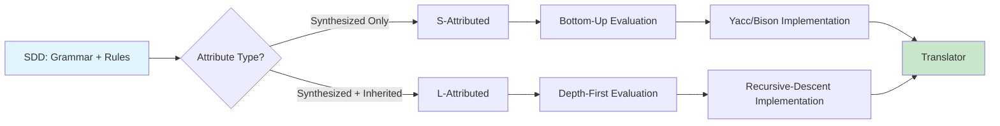
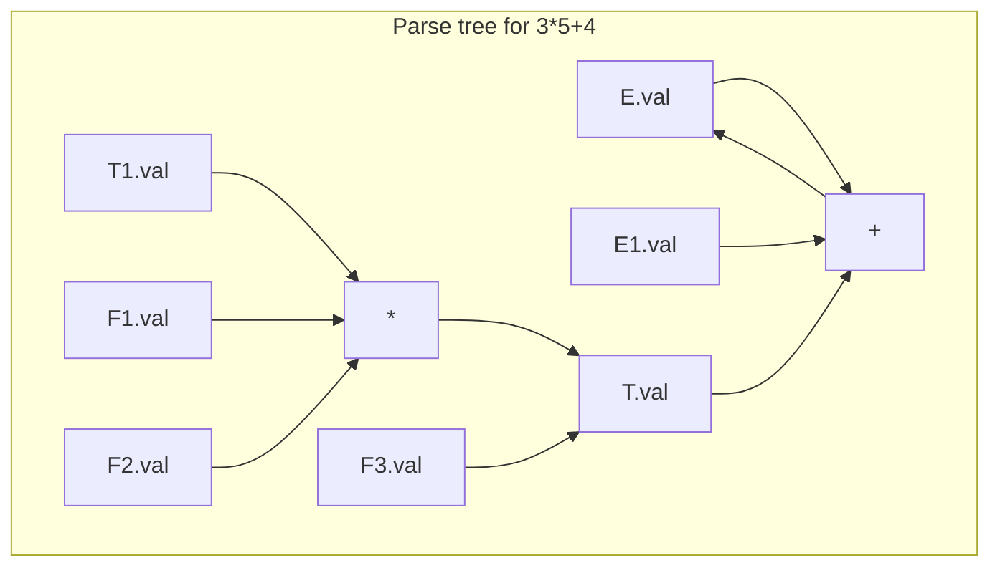

# Chapter 5: Syntax-Directed Translation

**? Previous:** [Chapter 4: Bottom-Up Parsing](04-parsing-bottomup.md) | **Next:** [Chapter 6: Intermediate Code Generation](06-intermediate-code.md)

## Learning Objectives

After completing this chapter, students will be able to: define syntax-directed definitions (SDDs) for S-attributed and L-attributed grammars; construct syntax-directed translation schemes (SDTs); determine evaluation order from dependency graphs; implement S-attributed definitions using a bottom-up parser; implement L-attributed definitions using a top-down parser; compute attribute values with synthesized and inherited attributes; and apply SDDs to practical translation tasks such as type checking and code generation.

<!-- Image Gallery -->
<section class="lesson-visuals" aria-label="Visual learning resources">
  <header><span>VISUAL LEARNING</span><h2>See it. Review it. Remember it.</h2></header>
  <a class="lesson-visual-card" href="../../../assets/images/lessons/compiler-design/05-sdt/.png" target="_blank" rel="noopener">
    
    <span><strong>Handwritten notes</strong>Condensed notes for deliberate review.</span>
  </a>
  <a class="lesson-visual-card" href="../../../assets/images/lessons/compiler-design/05-sdt/.png" target="_blank" rel="noopener">
    
    <span><strong>Sticky-note revision</strong>Fast recall prompts for revision.</span>
  </a>
  <a class="lesson-visual-card" href="../../../assets/images/lessons/compiler-design/05-sdt/.png" target="_blank" rel="noopener">
    
    <span><strong>Visual concept guide</strong>A connected explanation of the key ideas.</span>
  </a>
</section>
<!-- End Image Gallery -->


### Chapter at a Glance

| Section | Description |
|---------|-------------|
| Syntax-Directed Definitions | CFG augmented with semantic rules |
| Attribute Classification | Synthesized vs inherited attributes |
| Dependency Graphs | Visualizing attribute flow through parse trees |
| S-Attributed Definitions | Bottom-up evaluation with only synthesized attributes |
| L-Attributed Definitions | Left-to-right evaluation with inherited attributes |
| Syntax-Directed Translation Schemes | Embedding actions in productions |
| Evaluation Order | Topological sorting of attribute dependencies |
| Implementing S-Attributed Definitions | Yacc/Bison `$$` and `$i` mechanism |
| Implementing L-Attributed Definitions | Parameter passing in recursive-descent parsers |

### Chapter Roadmap



## Theory

### Syntax-Directed Definitions


A **syntax-directed definition** (SDD) is a context-free grammar augmented with semantic rules associated with each production. For a production `A ? X1X2...X?`, each grammar symbol may have an associated set of **attributes**. A semantic rule computes the value of an attribute in terms of other attributes in the same production. Attributes capture the meaning of the program fragment represented by the grammar symbol.

**Example**: An SDD for a desk calculator:

| Production | Semantic Rule |
|------------|---------------|
| `L ? E n` | `L.val = E.val` |
| `E ? E1 + T` | `E.val = E1.val + T.val` |
| `E ? T` | `E.val = T.val` |
| `T ? T1 * F` | `T.val = T1.val * F.val` |
| `T ? F` | `T.val = F.val` |
| `F ? ( E )` | `F.val = E.val` |
| `F ? digit` | `F.val = digit.lexval` |

### Attribute Classification


Attributes are classified as **synthesized** or **inherited**:

| Attribute Type | Definition | Direction | Evaluation |
|---------------|-----------|-----------|------------|
| **Synthesized** | Computed from children's attributes | Child ? Parent | Postorder traversal |
| **Inherited** | Computed from parent, siblings, or self | Parent/Sibling ? Child | Preorder/inorder traversal |

A synthesized attribute for a nonterminal `A` is computed from attributes of its children in the parse tree. Synthesized attributes pass information upward, from leaves toward the root.

An inherited attribute is computed from the attributes of the parent, siblings, and the nonterminal itself. Inherited attributes pass information sideways or downward through the parse tree, enabling context-dependent computations.

### Dependency Graphs


A **dependency graph** represents attribute dependencies as a directed graph where nodes are attribute instances and edges indicate that the target attribute depends on the source attribute. For a well-formed SDD, the dependency graph for every possible parse tree must be acyclic.



For S-attributed definitions, the dependency graph edges always go from children to parent. For L-attributed definitions, edges may go left-to-right or parent-to-child, but never right-to-left across a production.

A correct evaluation order is any topological sort of the dependency graph. For S-attributed definitions, this corresponds to a postorder traversal. For L-attributed definitions, a depth-first left-to-right traversal works.

### S-Attributed Definitions


An **S-attributed definition** uses only synthesized attributes. Semantic rules compute a left-hand-side attribute from right-hand-side attributes only. S-attributed definitions are evaluated naturally during a bottom-up parse when a reduction occurs, because the child attributes are available on the parser stack.

S-attributed grammars correspond to the class of context-free grammars that can be evaluated in a single bottom-up pass. Every S-attributed definition is trivially L-attributed.

### L-Attributed Definitions


An **L-attributed definition** permits both synthesized and inherited attributes, subject to the restriction that each inherited attribute of `X?` (the j-th symbol on the right-hand side) depends only on:

1. Inherited attributes of `A` (the left-hand side)
2. Attributes of `X1` through `X??1` (symbols to the left of `X?`)
3. Attributes of `X?` itself (synthesized or inherited ? but inherited must follow rule 1)

This **left-to-right restriction** ensures evaluation can proceed during a depth-first, left-to-right traversal of the parse tree, which matches the traversal performed by top-down (predictive) parsers.

> **One-Sentence Takeaway:** S-attributed = bottom-up (Yacc), L-attributed = top-down (recursive descent). Every S-attributed grammar is also L-attributed, but not vice versa.

### Syntax-Directed Translation Schemes


A **syntax-directed translation scheme** (SDT) embeds semantic actions at arbitrary positions within the right-hand side of a production. Actions are delimited by curly braces:

```
E ? E1 + T   { E.val = E1.val + T.val }
```

For LR parsing, actions must appear at the right end (**postfix SDT**) because reductions occur only after the full right-hand side has been parsed. For LL parsing, actions may appear between grammar symbols; the action executes when the parser has recognized all symbols to its left.

An SDT can always be derived from an SDD by placing each semantic rule at the position where its evaluation becomes possible. The translation from SDD to SDT may require restructuring for practical parsing.

### Evaluation Order


For a well-formed SDD, the dependency graph for every possible parse tree is acyclic. A correct evaluation order is any topological sort. For S-attributed definitions:

```
Evaluate attributes in postorder:
    for each node in parse tree (post-order):
        compute synthesized attributes of node
```

For L-attributed definitions:

```
Evaluate attributes in depth-first left-to-right:
    function visit(node):
        compute inherited attributes for children
        for each child in left-to-right order:
            visit(child)
        compute synthesized attributes of node
```

### Complete TypeScript SDT Evaluator


```typescript
// Abstract Syntax Tree node types
interface ASTNode {
    kind: string;
    value?: number;
    children: ASTNode[];
    attrs: {
        synthesized?: Record<string, any>;
        inherited?: Record<string, any>;
    };
}

class SDTEvaluator {
    // S-attributed evaluation (bottom-up, postorder)
    static evaluateSynthesized(node: ASTNode): number {
        switch (node.kind) {
            case "digit":
                return node.value!;
            case "add": {
                const left = this.evaluateSynthesized(node.children[0]);
                const right = this.evaluateSynthesized(node.children[1]);
                const result = left + right;
                node.attrs.synthesized = { val: result };
                return result;
            }
            case "sub": {
                const left = this.evaluateSynthesized(node.children[0]);
                const right = this.evaluateSynthesized(node.children[1]);
                const result = left - right;
                node.attrs.synthesized = { val: result };
                return result;
            }
            case "mul": {
                const left = this.evaluateSynthesized(node.children[0]);
                const right = this.evaluateSynthesized(node.children[1]);
                const result = left * right;
                node.attrs.synthesized = { val: result };
                return result;
            }
            case "div": {
                const left = this.evaluateSynthesized(node.children[0]);
                const right = this.evaluateSynthesized(node.children[1]);
                if (right === 0) throw new Error("Division by zero");
                const result = left / right;
                node.attrs.synthesized = { val: result };
                return result;
            }
            default:
                throw new Error(`Unknown node kind: ${node.kind}`);
        }
    }

    // L-attributed evaluation: type checking with symbol table
    static typeCheck(
        node: ASTNode,
        env: Map<string, string>,
        inherited?: { expectedType?: string }
    ): string {
        node.attrs.inherited = { ...inherited };

        switch (node.kind) {
            case "id": {
                const name = node.value?.toString() ?? "";
                const actualType = env.get(name) ?? "unknown";
                const expected = inherited?.expectedType;
                if (expected && actualType !== expected) {
                    throw new Error(
                        `Type error: ${name} has type ${actualType}, expected ${expected}`
                    );
                }
                node.attrs.synthesized = { type: actualType };
                return actualType;
            }

            case "int":
                node.attrs.synthesized = { type: "int" };
                return "int";

            case "float":
                node.attrs.synthesized = { type: "float" };
                return "float";

            case "add":
            case "sub":
            case "mul":
            case "div": {
                const leftType = this.typeCheck(node.children[0], env);
                const rightType = this.typeCheck(node.children[1], env);

                let resultType: string;
                if (leftType === "float" || rightType === "float") {
                    resultType = "float";
                } else if (leftType === "int" && rightType === "int") {
                    resultType = "int";
                } else {
                    throw new Error(
                        `Type error in ${node.kind}: incompatible types ${leftType} and ${rightType}`
                    );
                }

                node.attrs.synthesized = { type: resultType };
                return resultType;
            }

            case "assign": {
                // Inherited: expectedType flows from declaration to expression
                const idNode = node.children[0];
                const exprNode = node.children[1];
                const idName = idNode.value?.toString() ?? "";
                const declaredType = env.get(idName);

                if (!declaredType) {
                    throw new Error(`Undeclared variable: ${idName}`);
                }

                // Inherited attribute: pass expected type to expression
                const exprType = this.typeCheck(exprNode, env, {
                    expectedType: declaredType,
                });

                if (exprType !== declaredType) {
                    throw new Error(
                        `Type error: cannot assign ${exprType} to ${idName} (${declaredType})`
                    );
                }

                node.attrs.synthesized = { type: declaredType };
                return declaredType;
            }

            case "decl": {
                const typeNode = node.children[0];
                const idNode = node.children[1];
                const type = typeNode.value?.toString() ?? "int";
                const name = idNode.value?.toString() ?? "";

                // Add to symbol table (side effect on env)
                env.set(name, type);
                node.attrs.synthesized = { type };
                return type;
            }

            default:
                throw new Error(`Unknown node kind: ${node.kind}`);
        }
    }

    // Translation: infix expression to postfix notation (synthesized)
    static toPostfix(node: ASTNode): string {
        switch (node.kind) {
            case "digit":
                return String(node.value);
            case "id":
                return node.value?.toString() ?? "";
            case "add":
                return `${this.toPostfix(node.children[0])} ${this.toPostfix(node.children[1])} +`;
            case "sub":
                return `${this.toPostfix(node.children[0])} ${this.toPostfix(node.children[1])} -`;
            case "mul":
                return `${this.toPostfix(node.children[0])} ${this.toPostfix(node.children[1])} *`;
            case "div":
                return `${this.toPostfix(node.children[0])} ${this.toPostfix(node.children[1])} /`;
            default:
                throw new Error(`Unknown node kind: ${node.kind}`);
        }
    }

    // Translation: AST to three-address code (L-attributed)
    static toTAC(
        node: ASTNode,
        tempCounter: { count: number },
        labelCounter: { count: number }
    ): string[] {
        const newTemp = (): string => `t${++tempCounter.count}`;
        const newLabel = (): string => `L${++labelCounter.count}`;

        // Synthesized: result variable name
        // Inherited: label for jumps (via parameter)

        const emit = (s: string) => code.push(s);
        const code: string[] = [];

        switch (node.kind) {
            case "int":
            case "float": {
                const t = newTemp();
                emit(`${t} = ${node.value}`);
                node.attrs.synthesized = { var: t };
                return code;
            }
            case "id": {
                const t = newTemp();
                emit(`${t} = ${node.value}`);
                node.attrs.synthesized = { var: t };
                return code;
            }
            case "add": case "sub": case "mul": case "div": {
                const leftCode = this.toTAC(node.children[0], tempCounter, labelCounter);
                const rightCode = this.toTAC(node.children[1], tempCounter, labelCounter);
                const leftVar = node.children[0].attrs.synthesized?.var;
                const rightVar = node.children[1].attrs.synthesized?.var;
                const result = newTemp();
                const op = node.kind === "add" ? "+" : node.kind === "sub" ? "-" : node.kind === "mul" ? "*" : "/";
                code.push(...leftCode, ...rightCode, `${result} = ${leftVar} ${op} ${rightVar}`);
                node.attrs.synthesized = { var: result };
                return code;
            }
            case "assign": {
                const exprCode = this.toTAC(node.children[1], tempCounter, labelCounter);
                const exprVar = node.children[1].attrs.synthesized?.var;
                const target = node.children[0].value;
                code.push(...exprCode, `${target} = ${exprVar}`);
                return code;
            }
            case "if": {
                const condCode = this.toTAC(node.children[0], tempCounter, labelCounter);
                const condVar = node.children[0].attrs.synthesized?.var;
                const elseLabel = newLabel();
                const endLabel = newLabel();

                // Inherited label information flows to condition
                code.push(...condCode);
                code.push(`ifFalse ${condVar} goto ${elseLabel}`);
                const thenCode = this.toTAC(node.children[1], tempCounter, labelCounter);
                code.push(...thenCode);
                code.push(`goto ${endLabel}`);
                code.push(`${elseLabel}:`);
                if (node.children.length > 2) {
                    const elseCode = this.toTAC(node.children[2], tempCounter, labelCounter);
                    code.push(...elseCode);
                }
                code.push(`${endLabel}:`);
                return code;
            }
            case "while": {
                const startLabel = newLabel();
                const exitLabel = newLabel();
                code.push(`${startLabel}:`);
                const condCode = this.toTAC(node.children[0], tempCounter, labelCounter);
                const condVar = node.children[0].attrs.synthesized?.var;
                code.push(...condCode);
                code.push(`ifFalse ${condVar} goto ${exitLabel}`);
                const bodyCode = this.toTAC(node.children[1], tempCounter, labelCounter);
                code.push(...bodyCode);
                code.push(`goto ${startLabel}`);
                code.push(`${exitLabel}:`);
                return code;
            }
            default:
                throw new Error(`Unknown node kind: ${node.kind}`);
        }
    }
}

// === Demo: S-Attributed Evaluation ===
// Build AST for (3 + 5) * 2
const ast: ASTNode = {
    kind: "mul",
    children: [
        {
            kind: "add",
            children: [
                { kind: "digit", value: 3, children: [], attrs: {} },
                { kind: "digit", value: 5, children: [], attrs: {} },
            ],
            attrs: {},
        },
        { kind: "digit", value: 2, children: [], attrs: {} },
    ],
    attrs: {},
};

const result = SDTEvaluator.evaluateSynthesized(ast);
console.log(`(3 + 5) * 2 = ${result}`);

// === Demo: Type Checking (L-Attributed) ===
const env = new Map<string, string>();
env.set("x", "int");
env.set("y", "float");

const assignAST: ASTNode = {
    kind: "assign",
    children: [
        { kind: "id", value: "y", children: [], attrs: {} },
        { kind: "int", value: 42, children: [], attrs: {} },
    ],
    attrs: {},
};

try {
    const type = SDTEvaluator.typeCheck(assignAST, env);
    console.log(`Assignment type: ${type}`);
} catch (e: any) {
    console.log(`Type error: ${e.message}`);
}

// === Demo: Postfix Translation ===
const exprAST: ASTNode = {
    kind: "add",
    children: [
        { kind: "id", value: "a", children: [], attrs: {} },
        {
            kind: "mul",
            children: [
                { kind: "id", value: "b", children: [], attrs: {} },
                { kind: "id", value: "c", children: [], attrs: {} },
            ],
            attrs: {},
        },
    ],
    attrs: {},
};

const postfix = SDTEvaluator.toPostfix(exprAST);
console.log(`a + b * c ? postfix: ${postfix}`);

// === Demo: Three-Address Code ===
const tacCode = SDTEvaluator.toTAC(exprAST, { count: 0 }, { count: 0 });
console.log("\nThree-address code for a + b * c:");
tacCode.forEach(line => console.log(`  ${line}`));

// While loop TAC
const whileAST: ASTNode = {
    kind: "while",
    children: [
        { kind: "id", value: "i", children: [], attrs: {} },  // condition: i (nonzero = true)
        {
            kind: "assign",
            children: [
                { kind: "id", value: "sum", children: [], attrs: {} },
                {
                    kind: "add",
                    children: [
                        { kind: "id", value: "sum", children: [], attrs: {} },
                        { kind: "id", value: "i", children: [], attrs: {} },
                    ],
                    attrs: {},
                },
            ],
            attrs: {},
        },
    ],
    attrs: {},
};

const whileCode = SDTEvaluator.toTAC(whileAST, { count: 0 }, { count: 10 });
console.log("\nThree-address code for while loop:");
whileCode.forEach(line => console.log(`  ${line}`));
```

### Implementing S-Attributed Definitions in Yacc/Bison


In Yacc or Bison, the synthesized attribute of a left-hand side nonterminal is denoted `$$`, while right-hand side attributes are `$1`, `$2`, etc. When the parser reduces, it pops the right-hand side attributes, computes the action, and pushes the result:

```yacc
expr: expr '+' term   { $$ = $1 + $3; }
    | term            { $$ = $1; }
    ;
```

The parser's value stack manages these attributes. During reduction of `expr ? expr + term`, `$1` is the value of the first `expr` (previously computed and pushed), `$3` is the value of `term`, and `$$` becomes the new `expr`'s value.

### Implementing L-Attributed Definitions


In a recursive-descent parser, L-attributed definitions are implemented by passing inherited attributes as function parameters and returning synthesized attributes. For each nonterminal `A`, the parsing function receives inherited attributes and returns synthesized attributes:

```typescript
// L-attributed recursive descent with type propagation
class TypeCheckingParser {
    private input: string[];
    private pos = 0;
    private env = new Map<string, string>();

    parse(input: string[]): void {
        this.input = input;
        this.pos = 0;
        this.program();
    }

    private peek(): string { return this.pos < this.input.length ? this.input[this.pos] : "$"; }
    private consume(expected?: string): boolean {
        if (expected && this.peek() !== expected) return false;
        this.pos++;
        return true;
    }

    // program ? decl* expr
    private program(): void {
        while (this.peek() === "int" || this.peek() === "float") {
            this.declaration();
        }
        const type = this.expression();
        console.log(`Expression type: ${type}`);
    }

    // declaration ? type ID ;
    private declaration(): string {
        const type = this.type();        // synthesized: type name
        const name = this.peek();
        this.consume("id");              // consume identifier
        this.env.set(name, type);
        this.consume(";");
        return type;
    }

    // type ? int | float
    private type(): string {
        if (this.peek() === "int") { this.consume(); return "int"; }
        if (this.peek() === "float") { this.consume(); return "float"; }
        throw new Error("Expected type");
    }

    // expression ? term { (+|-) term }
    private expression(inherited?: string): string {
        let leftType = this.term();
        while (this.peek() === "+" || this.peek() === "-") {
            this.consume();
            const rightType = this.term();
            // Type checking rule: if either is float, result is float
            leftType = leftType === "float" || rightType === "float" ? "float" : "int";
        }
        return leftType;  // synthesized type
    }

    // term ? factor { (*|/) factor }
    private term(): string {
        let leftType = this.factor();
        while (this.peek() === "*" || this.peek() === "/") {
            this.consume();
            const rightType = this.factor();
            leftType = leftType === "float" || rightType === "float" ? "float" : "int";
        }
        return leftType;
    }

    // factor ? ID | NUMBER | ( expression )
    private factor(): string {
        if (this.peek() === "(") {
            this.consume();
            const type = this.expression();
            this.consume(")");
            return type;
        }
        if (this.peek() === "id") {
            const name = this.input[this.pos];
            this.consume();
            return this.env.get(name) ?? "unknown";
        }
        if (this.peek() === "number") {
            this.consume();
            return "int";
        }
        throw new Error(`Unexpected token: ${this.peek()}`);
    }
}
```

### Applications of SDDs


SDDs are used throughout compilation:

- **Type checker**: Inherited attributes propagate the current environment; synthesized attributes compute expression types.
- **Code generator**: Inherited attributes manage label numbers and temporary variable names; synthesized attributes build code fragments.
- **Desk calculator**: Synthesized-only SDD evaluating arithmetic at parse time.
- **Language translators**: SDTs mapping one language to another (e.g., infix to postfix, Java to JVM bytecode).
- **Static analysis**: Liveness analysis, reaching definitions, available expressions (Chapter 12).

The **desk calculator** is the canonical S-attributed example; the **type checker** is the canonical L-attributed example with context propagation.

## Summary

Syntax-directed definitions decorate context-free grammars with semantic rules. S-attributed definitions use only synthesized attributes and are evaluated during bottom-up parsing. L-attributed definitions add inherited attributes subject to left-to-right restrictions and are evaluated during top-down parsing. Dependency graphs determine evaluation order ? any topological sort is valid. SDDs and SDTs enable the compiler to perform type checking, code generation, and other semantic processing in a single pass integrated with parsing. The TypeScript `SDTEvaluator` demonstrates both evaluation strategies with working code.

## Practical Takeaways

1. **Start with synthesized attributes**: S-attributed definitions are simpler, expressive enough for many tasks, and map directly to bottom-up parsers.
2. **Use inherited attributes for context**: Type environments, label names, and variable scopes naturally flow downward as inherited attributes.
3. **Dependency graphs expose ordering issues**: Before implementing, draw the dependency graph. A cycle means your SDD is not well-formed.
4. **SDTs for LL parsing embed actions inline**: Place actions where the needed information is available. Use marker nonterminals if an action must execute before a particular symbol.
5. **Yacc/Bison's `$$`/$i is S-attributed by nature**: For inherited attributes in bottom-up parsers, use embedded actions with intermediate markers or pass values through the parser stack.

// sdt
// lexical-parsing-codegen implementation

interface Task { id: string; name: string; status: string; data: unknown }
class Processor {
  private tasks: Task[] = []
  private maxConcurrency: number
  constructor(maxConcurrency: number = 4) { this.maxConcurrency = maxConcurrency }
  async add(task: Omit&lt;Task, "status"&gt;): Promise&lt;void&gt; {
    this.tasks.push({ ...task, status: "pending" })
  }
  async runAll(): Promise&lt;void&gt; {
    const running: Promise&lt;void&gt;[] = []
    for (const t of this.tasks) {
      if (running.length >= this.maxConcurrency) { await Promise.race(running) }
      const p = this.execute(t).finally(() => { const i = running.indexOf(p); if (i >= 0) running.splice(i, 1) })
      running.push(p)
    }
    await Promise.all(running)
  }
  private async execute(t: Task): Promise&lt;void&gt; {
    t.status = "running"
    await new Promise(r => setTimeout(r, 10))
    t.status = "done"
  }
  getResults(): Task[] { return this.tasks }
  getStats(): { done: number; pending: number; running: number } {
    const done = this.tasks.filter(t => t.status === "done").length
    const pending = this.tasks.filter(t => t.status === "pending").length
    const running = this.tasks.filter(t => t.status === "running").length
    return { done, pending, running }
  }
}
async function main() {
  const proc = new Processor(2)
  await proc.add({ id: '1', name: 'sdt', data: { topic: 'lexical-parsing-codegen' } })
  await proc.runAll()
  console.log('Stats:', proc.getStats())
}
main().catch(console.error)
export { Processor, Task }

// sdt - additional TS implementations

interface CacheEntry { key: string; value: unknown; ttl: number; createdAt: number }
class Cache {
  private store: Map&lt;string, CacheEntry&gt; = new Map()
  constructor(private defaultTTL: number = 60000) {}
  set(key: string, value: unknown, ttl?: number): void {
    this.store.set(key, { key, value, ttl: ttl ?? this.defaultTTL, createdAt: Date.now() })
  }
  get(key: string): unknown | undefined {
    const entry = this.store.get(key)
    if (!entry) return undefined
    if (Date.now() - entry.createdAt > entry.ttl) { this.store.delete(key); return undefined }
    return entry.value
  }
  delete(key: string): boolean { return this.store.delete(key) }
  clear(): void { this.store.clear() }
  size(): number { return this.store.size }
  keys(): string[] { return Array.from(this.store.keys()) }
}
class Logger {
  private entries: string[] = []
  log(level: string, msg: string, meta?: Record&lt;string, unknown&gt;): void {
    const entry = JSON.stringify({ timestamp: new Date().toISOString(), level, msg, meta })
    this.entries.push(entry)
    console.log(entry)
  }
  info(msg: string, meta?: Record&lt;string, unknown&gt;): void { this.log("info", msg, meta) }
  warn(msg: string, meta?: Record&lt;string, unknown&gt;): void { this.log("warn", msg, meta) }
  error(msg: string, meta?: Record&lt;string, unknown&gt;): void { this.log("error", msg, meta) }
  getLogs(): string[] { return [...this.entries] }
  clear(): void { this.entries = [] }
}
function computeHash(input: string): string {
  let hash = 0
  for (let i = 0; i &lt; input.length; i++) { const chr = input.charCodeAt(i); hash = ((hash << 5) - hash) + chr; hash |= 0 }
  return Math.abs(hash).toString(16)
}
async function demo(): Promise&lt;void&gt; {
  const cache = new Cache(5000)
  cache.set('key1', 'compilers demo')
  const log = new Logger()
  log.info('Cache demo started', { course: 'compiler-design', chapter: 'sdt' })
  const v = cache.get("key1")
  console.log('Cached:', v)
  console.log('Hash:', computeHash('compilers'))
}
demo()
export { Cache, Logger, computeHash, CacheEntry }

## Chapter Quiz

1. What distinguishes a synthesized attribute from an inherited attribute?
   - A) Synthesized attributes are computed from children; inherited from parent/siblings
   - B) Synthesized attributes are always integers; inherited are always strings
   - C) Synthesized attributes are computed at runtime; inherited at compile time
   - D) There is no difference

2. Which type of attribute definition can be evaluated during a bottom-up parse?
   - A) Inherited only
   - B) S-attributed (synthesized only)
   - C) L-attributed only
   - D) Neither

3. In a Yacc/Bison semantic action, what does `$2` represent?
   - A) The synthesized attribute of the LHS nonterminal
   - B) The attribute value of the second symbol on the RHS
   - C) The second rule in the grammar
   - D) The second token of lookahead

4. An L-attributed definition restricts inherited attributes of X? to depend on:
   - A) Only attributes of X??1 and beyond
   - B) Inherited attributes of A and attributes of X1...X??1
   - C) Any attribute anywhere in the grammar
   - D) Only attributes of A

5. A dependency graph for a well-formed SDD must be:
   - A) Acyclic
   - B) A tree
   - C) Complete (every node connected to every other)
   - D) Cyclic

<details>
<summary>Answers&lt;/summary&gt;
1. A, 2. B, 3. B, 4. B, 5. A
</details>

## Exercises

### Review Questions

1. Distinguish between synthesized and inherited attributes. Provide a concrete example of each.
2. What constraints define an L-attributed grammar? Why is the left-to-right restriction important?
3. How does an S-attributed SDD integrate with a bottom-up parser stack?
4. What is a dependency graph, and how is it used to determine attribute evaluation order?
5. Describe the difference between an SDD and an SDT. How are they related?

### Application Problems

1. Extend the desk-calculator SDD to include subtraction and unary minus. Show the new productions and semantic rules.
2. Construct the dependency graph for `3 * 5 + 4` using the desk-calculator SDD. List a topological sort.
3. Design an SDD that translates infix expressions to postfix notation. The rule for `E ? E1 + T` should emit the `+` operator after both operands.
4. For `S ? while (C) S1`, write the SDT to generate three-address code for the loop. Show the code for a specific condition and body. Identify inherited and synthesized attributes.
5. Determine whether the following SDD is L-attributed: `A ? B C` with rule `B.inh = f(A.inh, C.syn)`. Justify your answer.
6. Using the TypeScript `SDTEvaluator`, implement a new node kind `"mod"` for modulus and add its evaluation, type checking, postfix, and TAC methods.

### Challenge Problem

1. Implement a syntax-directed translator in TypeScript that reads infix arithmetic expressions and produces three-address code. Use a recursive-descent parser and an L-attributed SDD. Each identifier should be assigned a temporary. Support addition, subtraction, multiplication, division, and parentheses. Extend to boolean expressions with relational operators (==, &lt;, >) and short-circuit evaluation. Demonstrate on five distinct expressions, showing the generated three-address code. Include expressions that test operator precedence and nested parentheses. Use the `SDTEvaluator.toTAC` method as the core of your code generator.
</details>

