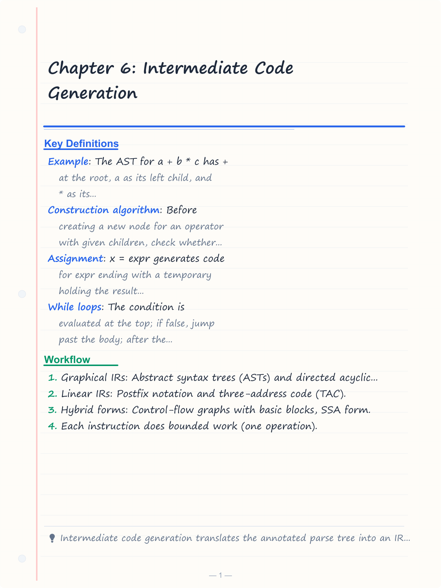
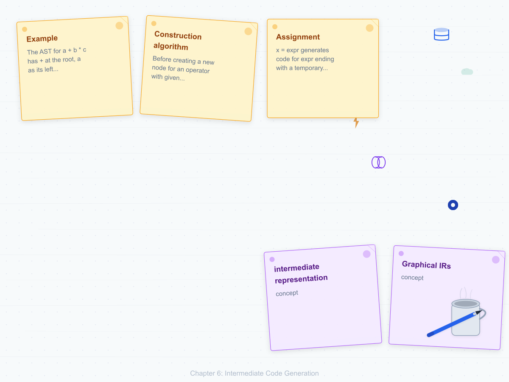
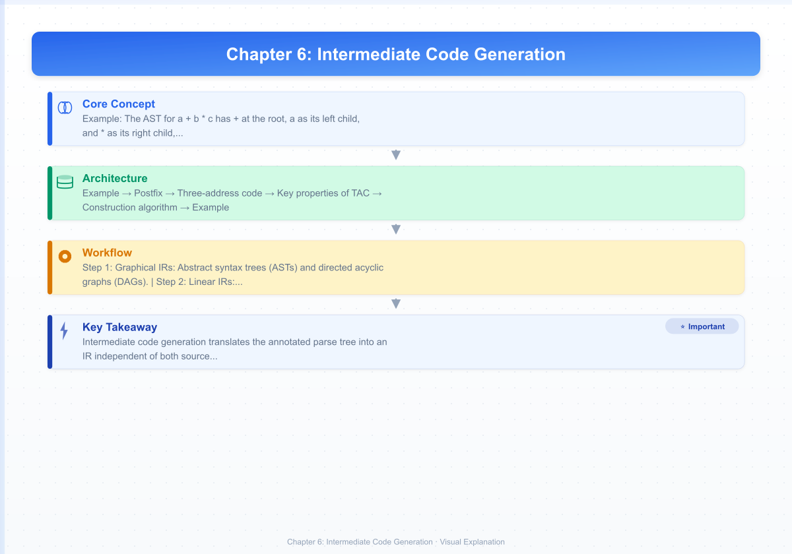
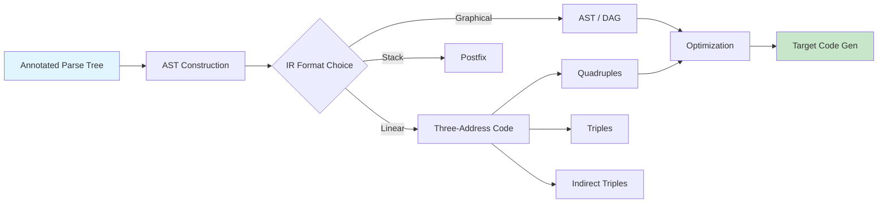
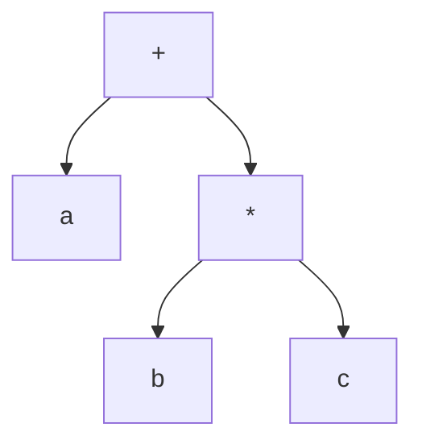
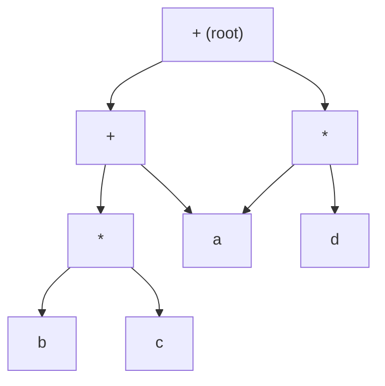

# Chapter 6: Intermediate Code Generation

? Previous: [Chapter 5: Syntax-Directed Translation](05-sdt.md) | **Next:** [Chapter 7: Type Checking](07-type-checking.md)

## Learning Objectives

After completing this chapter, students will be able to: distinguish among abstract syntax trees, postfix notation, and three-address code as intermediate representations; construct quadruples, triples, and indirect triples; build directed acyclic graphs for common-subexpression sharing; generate three-address code for common programming-language constructs including assignment, conditional statements, loops, array access, and procedure calls; compare IRs on suitability, storage cost, and optimization potential; and implement a complete TAC generator in TypeScript.

<!-- Image Gallery -->
<section class="lesson-visuals" aria-label="Visual learning resources">
  <header><span>VISUAL LEARNING</span><h2>See it. Review it. Remember it.</h2></header>
  <a class="lesson-visual-card" href="../../assets/images/lessons/compiler-design/06-intermediate-code/handwritten-notes.png" target="_blank" rel="noopener">
    
    <span><strong>Handwritten notes</strong>Condensed notes for deliberate review.</span>
  </a>
  <a class="lesson-visual-card" href="../../assets/images/lessons/compiler-design/06-intermediate-code/sticky-notes.png" target="_blank" rel="noopener">
    
    <span><strong>Sticky-note revision</strong>Fast recall prompts for revision.</span>
  </a>
  <a class="lesson-visual-card" href="../../assets/images/lessons/compiler-design/06-intermediate-code/visual-explanation.png" target="_blank" rel="noopener">
    
    <span><strong>Visual concept guide</strong>A connected explanation of the key ideas.</span>
  </a>
</section>
<!-- End Image Gallery -->


### Chapter at a Glance

| Section | Description |
|---------|-------------|
| Intermediate Representations | Overview of graphical and linear IRs |
| Abstract Syntax Trees | Compressed parse trees for semantic analysis and code gen |
| Postfix Notation | Stack-oriented operator-last linear representation |
| Three-Address Code | Linear IR with one operator per instruction |
| Quadruples, Triples, Indirect Triples | Storage formats for TAC |
| Directed Acyclic Graphs | Common-subexpression merging in expression trees |
| Generating TAC for Statements | Assignment, while, if-then-else, break, calls |
| TAC Generation from AST | Algorithm and implementation |

### Chapter Roadmap



## Theory

### Intermediate Representations


An **intermediate representation** (IR) sits between the source-language parse tree and the target-machine code. A good IR is independent of both the source language and the target machine, facilitates optimization, and supports retargeting. Three principal forms are in wide use:

- **Graphical IRs**: Abstract syntax trees (ASTs) and directed acyclic graphs (DAGs).
- **Linear IRs**: Postfix notation and three-address code (TAC).
- **Hybrid forms**: Control-flow graphs with basic blocks, SSA form.

The choice of IR significantly influences the compiler's optimization capability, the complexity of analysis passes, and the ease of adding new language features.

### Abstract Syntax Trees


An **abstract syntax tree** (AST) is a compressed representation of the parse tree in which operators appear as interior nodes and operands as children. Syntactic markers such as parentheses, semicolons, commas, and grouping nonterminals are omitted.

**Example**: The AST for `a + b * c` has `+` at the root, `a` as its left child, and `*` as its right child, with `b` and `c` as children of `*`.



ASTs are the primary IR in many compilers because they closely reflect the source program's structure while eliminating syntactic noise. Attributes can be attached to AST nodes for semantic analysis.

An AST node stores its operator (or token kind) and pointers to its children. The tree is traversed recursively for type checking and code generation. The AST is typically constructed during or immediately after parsing.

### Postfix Notation


**Postfix** (Reverse Polish) notation represents expressions with the operator following its operands. `ab c * +` corresponds to `a + b * c`. Postfix requires no parentheses and no precedence rules because operator placement alone fixes evaluation order.

| Infix | Postfix |
|-------|---------|
| `a + b` | `a b +` |
| `a * b + c` | `a b * c +` |
| `a + b * c` | `a b c * +` |
| `(a + b) * c` | `a b + c *` |
| `a / b - c * d` | `a b / c d * -` |

Postfix is evaluated by a stack machine: operands push onto the stack, operators pop their arguments and push the result. While simple to generate and evaluate, postfix is not well suited to optimization because the stack-oriented representation obscures data dependencies and variable lifetimes.

### Three-Address Code


**Three-address code** (TAC) is a linear IR where each instruction has the form `x = y op z`, performing one operation with at most one operator on the right-hand side. The name derives from each instruction referencing at most three addresses: two for operands and one for the result. Addresses may be names (identifiers), constants, or compiler-generated temporaries.

**Key properties of TAC**:
- Each instruction does bounded work (one operation).
- Temporaries have explicit names, making dataflow analysis straightforward.
- Instructions can be freely reordered, inserted, and removed during optimization.
- It is close enough to machine code to generate efficiently.

> **One-Sentence Takeaway:** TAC is the universal IR ? simple enough to optimize, expressive enough for all language constructs, and close enough to machine code to generate efficiently.

### Types of Three-Address Code Instructions


| Instruction Type | Format | Example |
|-----------------|--------|---------|
| Assignment (binary) | `x = y op z` | `t1 = a + b` |
| Assignment (unary) | `x = op y` | `t1 = -t2` |
| Copy | `x = y` | `t1 = t2` |
| Unconditional jump | `goto L` | `goto L1` |
| Conditional jump | `if x relop y goto L` | `if a < b goto L2` |
| Conditional false | `ifFalse x goto L` | `ifFalse x goto L3` |
| Procedure call | `call p, n` | `call sort, 1` |
| Procedure param | `param x` | `param a` |
| Return | `return y` | `return t1` |
| Array load | `x = y[i]` | `t1 = a[i]` |
| Array store | `x[i] = y` | `a[i] = t1` |
| Address-of | `x = &y` | `t1 = &buffer` |
| Load through pointer | `x = *y` | `t1 = *ptr` |
| Store through pointer | `*x = y` | `*ptr = t1` |

### Quadruples, Triples, and Indirect Triples


A **quadruple** is a four-field record `(op, arg1, arg2, result)`. For unary operators, `arg2` is omitted. The instruction `x = y + z` becomes `(+, y, z, x)`. Quadruples are the most common TAC representation because temporaries are named explicitly, simplifying code transformation. Optimization passes can freely move, modify, and insert quadruples without concern for positional references.

| # | op | arg1 | arg2 | result |
|---|----|------|------|--------|
| 1 | * | a | b | t1 |
| 2 | + | t1 | c | t2 |
| 3 | = | t2 | | x |

A **triple** uses three fields `(op, arg1, arg2)` and refers to the result of an operation by its position in the sequence. For example, `(*, a, b)` at position 1 means that subsequent instructions may refer to `(1)` as an operand:

| # | op | arg1 | arg2 |
|---|----|------|------|
| 1 | * | a | b |
| 2 | + | (1) | c |
| 3 | = | x | (2) |

Triples save space by omitting the result field, but they complicate code movement because reordering changes positional references. An **indirect triple** lists pointers to triples in execution order. The triple list stores actual instructions while a separate execution list determines evaluation order. Code motion is achieved by rearranging the execution list without renumbering triples.

### Directed Acyclic Graphs


A **DAG** for an expression merges common subexpressions into a single node. If the same subexpression appears multiple times, the DAG shares one node.

**Construction algorithm**: Before creating a new node for an operator with given children, check whether such a node already exists. If so, reuse it.

**Example**: DAG for `a + b * c + a * d`

The DAG shares node `a` (appears in two places). The multiplication `b * c` and `a + d` are distinct unless values coincide.



DAGs enable:
- **Common-subexpression elimination**: Identical subexpressions produce one evaluation.
- **Reduced register pressure**: Fewer distinct values to hold in registers.
- **Simplified code generation**: The DAG is traversed once per unique value.

### Generating TAC for Statements


**Assignment**: `x = expr` generates code for `expr` ending with a temporary holding the result value, then `x = temp`:

```
t1 = expr_result
x = t1
```

**While loops**: The condition is evaluated at the top; if false, jump past the body; after the body, jump back:

```
L1: ifFalse cond goto L2
    body
    goto L1
L2: ...
```

**If-then-else**: Condition branches to the else part; the then clause falls through and jumps past else:

```
    ifFalse cond goto L1
    then_body
    goto L2
L1: else_body
L2: ...
```

**For loops**: Desugared into initialization, while-loop condition check, loop body, and increment:

```
i = 0
L1: if i >= 10 goto L2
    sum = sum + a[i]
    i = i + 1
    goto L1
L2: ...
```

**Procedure calls**: Arguments evaluated left to right with `param` instructions, then `call p, n`:

```
param expr1
param expr2
call f, 2
t1 = return_value    ; if function returns a value
```

**Break / Continue**: `break` jumps to the exit label of the innermost enclosing loop; `continue` jumps to the loop's reentry label.

**Switch**: Typically compiled to a jump table or chained if-then-else:

```
    if x == case1 goto L1
    if x == case2 goto L2
    ...
    goto default
L1: ... body1 ... goto exit
L2: ... body2 ... goto exit
    ...
exit:
```

### TAC Generation from AST


The standard algorithm processes the AST recursively:

```
function genTAC(node, nextLabel):
    if node is IntLiteral:
        t = newTemp()
        emit(t "=" node.value)
        return t
    if node is Identifier:
        t = newTemp()
        emit(t "=" node.name)
        return t
    if node is BinaryOp:
        left = genTAC(node.left)
        right = genTAC(node.right)
        t = newTemp()
        emit(t "=" left node.op right)
        return t
    if node is Assignment:
        val = genTAC(node.expr)
        emit(node.target "=" val)
    if node is If:
        cond = genTAC(node.condition)
        elseLabel = newLabel()
        exitLabel = newLabel()
        emit("ifFalse" cond "goto" elseLabel)
        genTAC(node.thenBody)
        emit("goto" exitLabel)
        emit(elseLabel ":")
        genTAC(node.elseBody)    // if present
        emit(exitLabel ":")
    if node is While:
        reentryLabel = newLabel()
        exitLabel = newLabel()
        emit(reentryLabel ":")
        cond = genTAC(node.condition)
        emit("ifFalse" cond "goto" exitLabel)
        genTAC(node.body)
        emit("goto" reentryLabel)
        emit(exitLabel ":")
```

Labels are generated sequentially (L1, L2, L3, ...). Temporaries are generated sequentially (t1, t2, t3, ...). The algorithm maintains counters for both and passes them through recursive calls.

### Complete TypeScript TAC Generator


```typescript
// AST node types for intermediate code generation
type ASTNodeType =
    | "int" | "float" | "id"
    | "add" | "sub" | "mul" | "div" | "mod" | "neg"
    | "eq" | "ne" | "lt" | "le" | "gt" | "ge"
    | "and" | "or" | "not"
    | "assign"
    | "if" | "while" | "for"
    | "break" | "continue"
    | "seq"           // sequence of statements
    | "call" | "param"
    | "array_load" | "array_store"
    ;

interface ASTNode {
    kind: ASTNodeType;
    value?: string | number;
    children: ASTNode[];
}

// Factory functions for AST nodes
const Int = (val: number): ASTNode => ({ kind: "int", value: val, children: [] });
const Id = (name: string): ASTNode => ({ kind: "id", value: name, children: [] });
const BinOp = (kind: ASTNodeType, left: ASTNode, right: ASTNode): ASTNode =>
    ({ kind, children: [left, right] });
const Assign = (target: ASTNode, expr: ASTNode): ASTNode =>
    ({ kind: "assign", children: [target, expr] });
const If = (cond: ASTNode, then: ASTNode, else_?: ASTNode): ASTNode =>
    ({ kind: "if", children: [cond, then, ...(else_ ? [else_] : [])] });
const While = (cond: ASTNode, body: ASTNode): ASTNode =>
    ({ kind: "while", children: [cond, body] });
const Seq = (...stmts: ASTNode[]): ASTNode =>
    ({ kind: "seq", children: stmts });
const Call = (name: string, ...args: ASTNode[]): ASTNode =>
    ({ kind: "call", value: name, children: args });

// TAC instruction types
type TACOp = "=" | "+" | "-" | "*" | "/" | "%" | "-u" | "==" | "!=" | "<" | "<=" | ">" | ">="
    | "goto" | "if" | "ifFalse" | "call" | "param" | "return"
    | "[]=" | "=[]" | "&" | "*=" | "=*";

interface TACInstr {
    op: TACOp;
    arg1?: string;
    arg2?: string;
    result?: string;
}

class TACGenerator {
    private temps = 0;
    private labels = 0;
    private code: TACInstr[] = [];

    private newTemp(): string {
        return `t${++this.temps}`;
    }

    private newLabel(): string {
        return `L${++this.labels}`;
    }

    emit(op: TACOp, result?: string, arg1?: string, arg2?: string): void {
        this.code.push({ op, result, arg1, arg2 });
    }

    // Generate TAC for a single AST node
    generate(node: ASTNode): string {
        switch (node.kind) {
            case "int":
            case "float": {
                const t = this.newTemp();
                this.emit("=", t, String(node.value));
                return t;
            }

            case "id": {
                const t = this.newTemp();
                this.emit("=", t, String(node.value));
                return t;
            }

            case "neg": {
                const v = this.generate(node.children[0]);
                const t = this.newTemp();
                this.emit("-u", t, v);
                return t;
            }

            case "add": case "sub": case "mul": case "div": case "mod": {
                const left = this.generate(node.children[0]);
                const right = this.generate(node.children[1]);
                const t = this.newTemp();
                const opMap: Record<string, TACOp> = {
                    add: "+", sub: "-", mul: "*", div: "/", mod: "%"
                };
                this.emit(opMap[node.kind], t, left, right);
                return t;
            }

            case "eq": case "ne": case "lt": case "le": case "gt": case "ge": {
                const left = this.generate(node.children[0]);
                const right = this.generate(node.children[1]);
                const t = this.newTemp();
                const opMap: Record<string, TACOp> = {
                    eq: "==", ne: "!=", lt: "<", le: "<=", gt: ">", ge: ">="
                };
                this.emit(opMap[node.kind], t, left, right);
                return t;
            }

            case "and": {
                // Short-circuit: if left is false, skip right
                const left = this.generate(node.children[0]);
                const t = this.newTemp();
                const skipLabel = this.newLabel();
                const assignLabel = this.newLabel();
                this.emit("=", t, "0");                         // t = false
                this.emit("ifFalse", undefined, left, skipLabel); // if !left goto skip
                const right = this.generate(node.children[1]);
                this.emit("=", t, right);                        // t = right
                this.emit("goto", undefined, assignLabel);        // goto end
                this.emit(skipLabel + ":" as any, undefined, undefined, undefined); // label
                return t;
            }

            case "or": {
                // Short-circuit: if left is true, skip right
                const left = this.generate(node.children[0]);
                const t = this.newTemp();
                const assignLabel = this.newLabel();
                const skipLabel = this.newLabel();
                this.emit("=", t, "1");                          // t = true
                this.emit("if", undefined, left, assignLabel);    // if left goto assign
                const right = this.generate(node.children[1]);
                this.emit("=", t, right);                         // t = right
                this.emit("goto", undefined, skipLabel);           // goto end
                this.emit(assignLabel + ":" as any);               // label
                return t;
            }

            case "not": {
                const v = this.generate(node.children[0]);
                const t = this.newTemp();
                const opMap: Record<string, TACOp> = { not: "==" };
                this.emit(opMap[node.kind], t, v, "0");
                return t;
            }

            case "assign": {
                const val = this.generate(node.children[1]);
                const target = node.children[0].value as string;
                this.emit("=", target, val);
                return target;
            }

            case "seq": {
                let lastResult = "";
                for (const child of node.children) {
                    lastResult = this.generate(child);
                }
                return lastResult;
            }

            case "if": {
                const cond = this.generate(node.children[0]);
                const elseLabel = this.newLabel();
                const exitLabel = this.newLabel();
                this.emit("ifFalse", undefined, cond, elseLabel);
                this.generate(node.children[1]);                 // then body
                this.emit("goto", undefined, exitLabel);
                this.emit(elseLabel + ":" as any);
                if (node.children.length > 2) {
                    this.generate(node.children[2]);            // else body
                }
                this.emit(exitLabel + ":" as any);
                return "";
            }

            case "while": {
                const reentryLabel = this.newLabel();
                const exitLabel = this.newLabel();
                this.emit(reentryLabel + ":" as any);
                const cond = this.generate(node.children[0]);
                this.emit("ifFalse", undefined, cond, exitLabel);
                this.generate(node.children[1]);                // body
                this.emit("goto", undefined, reentryLabel);
                this.emit(exitLabel + ":" as any);
                return "";
            }

            case "for": {
                // for (init; cond; incr) body
                const init = node.children[0];
                const cond = node.children[1];
                const incr = node.children[2];
                const body = node.children[3];
                const reentryLabel = this.newLabel();
                const exitLabel = this.newLabel();
                this.generate(init);
                this.emit(reentryLabel + ":" as any);
                const condVal = this.generate(cond);
                this.emit("ifFalse", undefined, condVal, exitLabel);
                this.generate(body);
                this.generate(incr);
                this.emit("goto", undefined, reentryLabel);
                this.emit(exitLabel + ":" as any);
                return "";
            }

            case "array_load": {
                const arr = this.generate(node.children[0]);
                const idx = this.generate(node.children[1]);
                const t = this.newTemp();
                this.emit("=[]", t, arr, idx);
                return t;
            }

            case "array_store": {
                const arr = this.generate(node.children[0]);
                const idx = this.generate(node.children[1]);
                const val = this.generate(node.children[2]);
                this.emit("[]=", undefined, arr, idx);
                return val;
            }

            case "call": {
                const funcName = node.value as string;
                for (const arg of node.children) {
                    const argVal = this.generate(arg);
                    this.emit("param", undefined, argVal);
                }
                const t = this.newTemp();
                this.emit("call", t, funcName, String(node.children.length));
                return t;
            }

            default:
                throw new Error(`Unknown node kind: ${node.kind}`);
        }
    }

    getCode(): TACInstr[] {
        return this.code;
    }

    printCode(): void {
        this.code.forEach((instr, i) => {
            const line = this.formatInstr(instr);
            console.log(`${i + 1}: ${line}`);
        });
    }

    private formatInstr(instr: TACInstr): string {
        if (instr.op.endsWith(":")) {
            return instr.op; // label
        }
        const parts: string[] = [];
        if (instr.result) parts.push(instr.result, "=");
        parts.push(instr.op);
        if (instr.arg1) parts.push(instr.arg1);
        if (instr.arg2) parts.push(instr.arg2);
        return parts.join(" ");
    }

    reset(): void {
        this.temps = 0;
        this.labels = 0;
        this.code = [];
    }
}

// === DAG Construction ===
interface DAGNode {
    id: number;
    op: string;
    left?: DAGNode;
    right?: DAGNode;
    value?: string | number;
    labels: Set<string>; // names of variables holding this value
}

class ExpressionDAG {
    private nodes: DAGNode[] = [];
    private nextId = 0;

    private makeNode(
        op: string,
        left?: DAGNode,
        right?: DAGNode,
        value?: string | number
    ): DAGNode {
        const node: DAGNode = {
            id: this.nextId++,
            op,
            left,
            right,
            value,
            labels: new Set(),
        };
        this.nodes.push(node);
        return node;
    }

    private findNode(
        op: string,
        left?: DAGNode,
        right?: DAGNode,
        value?: string | number
    ): DAGNode | undefined {
        return this.nodes.find(n =>
            n.op === op &&
            n.left === left &&
            n.right === right &&
            n.value === value
        );
    }

    // Create or find a leaf (identifier or constant)
    leaf(value: string | number): DAGNode {
        const existing = this.findNode("leaf", undefined, undefined, value);
        if (existing) return existing;
        return this.makeNode("leaf", undefined, undefined, value);
    }

    // Create or find an interior node (operator with children)
    interior(op: string, left: DAGNode, right?: DAGNode): DAGNode {
        // Check for constant folding
        if (left.op === "leaf" && right && right.op === "leaf") {
            const lv = Number(left.value);
            const rv = Number(right.value);
            if (!isNaN(lv) && !isNaN(rv)) {
                let folded: number;
                switch (op) {
                    case "+": folded = lv + rv; break;
                    case "-": folded = lv - rv; break;
                    case "*": folded = lv * rv; break;
                    case "/": folded = lv / rv; break;
                    default: folded = NaN;
                }
                if (!isNaN(folded)) {
                    return this.leaf(folded);
                }
            }
        }

        const existing = this.findNode(op, left, right);
        if (existing) return existing;
        return this.makeNode(op, left, right);
    }

    // Add a label (variable assignment) to a node
    addLabel(node: DAGNode, label: string): void {
        node.labels.add(label);
    }

    // Generate TAC from DAG (postorder)
    toTAC(): TACInstr[] {
        const tac: TACInstr[] = [];
        const visited = new Set<number>();
        const nodeToTemp = new Map<number, string>();
        let tempCount = 0;

        const visit = (node: DAGNode): string | undefined => {
            if (visited.has(node.id) && nodeToTemp.has(node.id)) {
                return nodeToTemp.get(node.id);
            }
            if (node.labels.size > 0 && nodeToTemp.has(node.id)) {
                return nodeToTemp.get(node.id);
            }

            if (node.op === "leaf") {
                // Store constant or identifier reference
                const t = `t${++tempCount}`;
                nodeToTemp.set(node.id, t);
                visited.add(node.id);
                const val = typeof node.value === "string"
                    ? node.value
                    : String(node.value);
                tac.push({ op: "=", result: t, arg1: val });
                return t;
            }

            const leftTemp = node.left ? visit(node.left) : undefined;
            const rightTemp = node.right ? visit(node.right) : undefined;
            const t = `t${++tempCount}`;

            const opMap: Record<string, TACOp> = {
                "+": "+", "-": "-", "*": "*", "/": "/"
            };

            tac.push({
                op: opMap[node.op] || (node.op as TACOp),
                result: t,
                arg1: leftTemp,
                arg2: rightTemp,
            });

            nodeToTemp.set(node.id, t);
            visited.add(node.id);

            // If variable assigned to this node, emit copy
            for (const label of node.labels) {
                tac.push({ op: "=", result: label, arg1: t });
            }

            return t;
        };

        // Visit roots (nodes without parents)
        const parents = new Set<DAGNode>();
        for (const n of this.nodes) {
            if (n.left) parents.add(n.left);
            if (n.right) parents.add(n.right);
        }
        const roots = this.nodes.filter(n => !parents.has(n));
        for (const root of roots) {
            visit(root);
        }

        return tac;
    }

    printDAG(): void {
        console.log("DAG nodes:");
        for (const n of this.nodes) {
            const children = [n.left?.id, n.right?.id]
                .filter(id => id !== undefined)
                .join(", ");
            const labels = [...n.labels].join(", ");
            console.log(
                `  n${n.id}: ${n.op}${n.value !== undefined ? `(${n.value})` : ""}` +
                ` children=[${children}] labels=[${labels}]`
            );
        }
    }
}

// === Demos ===

// Demo 1: Expression TAC
console.log("=== Demo 1: Arithmetic Expression ===");
const gen1 = new TACGenerator();
const expr1 = BinOp("add",
    BinOp("mul", Int(3), Int(5)),
    Int(2)
);
gen1.generate(expr1);
gen1.printCode();

// Demo 2: Assignment with control flow
console.log("\n=== Demo 2: If-Then-Else ===");
const gen2 = new TACGenerator();
gen2.generate(
    If(
        BinOp("gt", Id("x"), Id("y")),
        Assign(Id("z"), BinOp("add", Id("x"), Id("y"))),
        Assign(Id("z"), BinOp("sub", Id("x"), Id("y")))
    )
);
gen2.printCode();

// Demo 3: While loop with array access
console.log("\n=== Demo 3: While Loop Sum ===");
const gen3 = new TACGenerator();
gen3.generate(
    Seq(
        Assign(Id("i"), Int(0)),
        Assign(Id("sum"), Int(0)),
        While(
            BinOp("lt", Id("i"), Int(10)),
            Seq(
                Assign(Id("sum"),
                    BinOp("add", Id("sum"),
                        { kind: "array_load", children: [Id("a"), Id("i")] } as ASTNode
                    )
                ),
                Assign(Id("i"), BinOp("add", Id("i"), Int(1)))
            )
        )
    )
);
gen3.printCode();

// Demo 4: Function call
console.log("\n=== Demo 4: Procedure Call ===");
const gen4 = new TACGenerator();
gen4.generate(Call("sort", Id("arr"), Int(0), Int(99)));
gen4.printCode();

// Demo 5: Boolean short-circuit
console.log("\n=== Demo 5: Boolean AND (short-circuit) ===");
const gen5 = new TACGenerator();
gen5.generate(
    Assign(Id("safe"),
        BinOp("and",
            BinOp("gt", Id("ptr"), Int(0)),
            BinOp("lt", { kind: "array_load", children: [Id("ptr"), Int(0)] } as ASTNode, Int(100))
        )
    )
);
gen5.printCode();

// Demo 6: For loop desugared
console.log("\n=== Demo 6: For Loop ===");
const gen6 = new TACGenerator();
gen6.generate({
    kind: "for",
    children: [
        Assign(Id("i"), Int(0)),
        BinOp("lt", Id("i"), Int(10)),
        Assign(Id("i"), BinOp("add", Id("i"), Int(1))),
        Assign(Id("sum"), BinOp("add", Id("sum"), { kind: "array_load", children: [Id("a"), Id("i")] } as ASTNode)),
    ]
} as ASTNode);
gen6.printCode();

// Demo 7: DAG construction with CSE
console.log("\n=== Demo 7: DAG with Common-Subexpression Elimination ===");
const dag = new ExpressionDAG();
// Expression: a + b * c + a * d
// a appears twice; share the leaf node
const da = dag.leaf("a");
const db = dag.leaf("b");
const dc = dag.leaf("c");
const dd = dag.leaf("d");

const bc = dag.interior("*", db, dc);
const ad = dag.interior("*", da, dd);
const abc = dag.interior("+", da, bc);
const root = dag.interior("+", abc, ad);

dag.addLabel(root, "result");
dag.printDAG();

console.log("\nOptimized TAC from DAG:");
const dagTac = dag.toTAC();
dagTac.forEach((instr, i) => {
    const parts: string[] = [];
    if (instr.result) parts.push(instr.result, "=");
    parts.push(instr.op);
    if (instr.arg1) parts.push(instr.arg1);
    if (instr.arg2) parts.push(instr.arg2);
    console.log(`  ${i + 1}: ${parts.join(" ")}`);
});

// Demo 8: Constant folding in DAG
console.log("\n=== Demo 8: Constant Folding ===");
const dag2 = new ExpressionDAG();
const c2 = dag2.leaf(2);
const c3 = dag2.leaf(3);
const c5 = dag2.leaf(5);
// 2 + 3 = 5, then 5 * 5 = 25 (constant folded)
const sum = dag2.interior("+", c2, c3);
const prod = dag2.interior("*", sum, c5);
dag2.addLabel(prod, "x");
dag2.printDAG();

console.log("\nConstant-folded TAC:");
dag2.toTAC().forEach((instr, i) => {
    const parts: string[] = [];
    if (instr.result) parts.push(instr.result, "=");
    parts.push(instr.op);
    if (instr.arg1) parts.push(instr.arg1);
    if (instr.arg2) parts.push(instr.arg2);
    console.log(`  ${i + 1}: ${parts.join(" ")}`);
});
```

### Concept Comparison


| IR Format | Structure | Optimization Suitability | Storage Cost | Retargetability |
|-----------|-----------|------------------------|--------------|-----------------|
| AST | Tree | Moderate | Large | High |
| DAG | Graph with node sharing | High (CSE) | Moderate | High |
| Postfix | Linear stack code | Low | Small | Low |
| TAC (Quadruple) | Linear with named temps | High | Moderate | High |
| TAC (Triple) | Linear with positional refs | Low | Moderate | Moderate |
| TAC (Indirect Triple) | Execution list + triple pool | High (movable) | Moderate | High |
| SSA | CFG with f-nodes | Very high | Moderate | High |

### Cross-Application Matrix

| Domain | Application | Relevance |
|--------|-------------|-----------|
| Language Design | Defining IR for new compilers | IR choice shapes optimization capability |
| Systems Programming | LLVM IR, GCC GIMPLE | Production compilers use multi-level IRs (HIR, MIR, LIR) |
| Web Development | WebAssembly as compile target | Wasm is a typed low-level IR for the web |
| Tooling | Static analysis frameworks | IR enables cross-language analysis |
| Debugging | Source maps and IR breakpoints | IR-level debugging improves developer experience |
| Optimization | Auto-vectorization, inlining | SSA-based IR enables aggressive optimization |

## Summary

Intermediate code generation translates the annotated parse tree into an IR independent of both source language and target machine. ASTs and DAGs provide graphical representations for analysis, while three-address code in quadruple, triple, or indirect-triple form provides a linear representation straightforward to translate into assembly. The choice of IR significantly influences the compiler's optimization capability and retargetability. TAC is the dominant IR in modern production compilers because of its simplicity, expressiveness, and optimization suitability. The TypeScript `TACGenerator` and `ExpressionDAG` classes demonstrate both linear and graphical IR construction with working demos covering expressions, control flow, loops, procedure calls, DAG-based CSE, and constant folding.

## Practical Takeaways

1. **Quadruples are the practical default**: Explicit result fields make code transformations easy. Use quadruples unless space constraints are extreme.
2. **DAGs are free CSE**: Building a DAG during construction automatically eliminates common subexpressions without a separate optimization pass.
3. **TAC is machine-independent**: Generate TAC without knowing the target architecture. Retargeting only requires translating TAC to the target assembly.
4. **Label and temp naming conventions matter**: Use `L1, L2, ...` for labels and `t1, t2, ...` for temporaries ? they keep the generated code readable and debuggable.
5. **Short-circuit evaluation matches source semantics**: Boolean `&&` and `||` must generate conditional jumps, not simple arithmetic, to preserve the evaluation semantics required by most languages.

// intermediate code
// lexical-parsing-codegen implementation

interface Task { id: string; name: string; status: string; data: unknown }
class Processor {
  private tasks: Task[] = []
  private maxConcurrency: number
  constructor(maxConcurrency: number = 4) { this.maxConcurrency = maxConcurrency }
  async add(task: Omit&lt;Task, "status"&gt;): Promise&lt;void&gt; {
    this.tasks.push({ ...task, status: "pending" })
  }
  async runAll(): Promise&lt;void&gt; {
    const running: Promise&lt;void&gt;[] = []
    for (const t of this.tasks) {
      if (running.length >= this.maxConcurrency) { await Promise.race(running) }
      const p = this.execute(t).finally(() => { const i = running.indexOf(p); if (i >= 0) running.splice(i, 1) })
      running.push(p)
    }
    await Promise.all(running)
  }
  private async execute(t: Task): Promise&lt;void&gt; {
    t.status = "running"
    await new Promise(r => setTimeout(r, 10))
    t.status = "done"
  }
  getResults(): Task[] { return this.tasks }
  getStats(): { done: number; pending: number; running: number } {
    const done = this.tasks.filter(t => t.status === "done").length
    const pending = this.tasks.filter(t => t.status === "pending").length
    const running = this.tasks.filter(t => t.status === "running").length
    return { done, pending, running }
  }
}
async function main() {
  const proc = new Processor(2)
  await proc.add({ id: '1', name: 'intermediate code', data: { topic: 'lexical-parsing-codegen' } })
  await proc.runAll()
  console.log('Stats:', proc.getStats())
}
main().catch(console.error)
export { Processor, Task }

// intermediate code - additional TS implementations

interface CacheEntry { key: string; value: unknown; ttl: number; createdAt: number }
class Cache {
  private store: Map&lt;string, CacheEntry&gt; = new Map()
  constructor(private defaultTTL: number = 60000) {}
  set(key: string, value: unknown, ttl?: number): void {
    this.store.set(key, { key, value, ttl: ttl ?? this.defaultTTL, createdAt: Date.now() })
  }
  get(key: string): unknown | undefined {
    const entry = this.store.get(key)
    if (!entry) return undefined
    if (Date.now() - entry.createdAt > entry.ttl) { this.store.delete(key); return undefined }
    return entry.value
  }
  delete(key: string): boolean { return this.store.delete(key) }
  clear(): void { this.store.clear() }
  size(): number { return this.store.size }
  keys(): string[] { return Array.from(this.store.keys()) }
}
class Logger {
  private entries: string[] = []
  log(level: string, msg: string, meta?: Record&lt;string, unknown&gt;): void {
    const entry = JSON.stringify({ timestamp: new Date().toISOString(), level, msg, meta })
    this.entries.push(entry)
    console.log(entry)
  }
  info(msg: string, meta?: Record&lt;string, unknown&gt;): void { this.log("info", msg, meta) }
  warn(msg: string, meta?: Record&lt;string, unknown&gt;): void { this.log("warn", msg, meta) }
  error(msg: string, meta?: Record&lt;string, unknown&gt;): void { this.log("error", msg, meta) }
  getLogs(): string[] { return [...this.entries] }
  clear(): void { this.entries = [] }
}
function computeHash(input: string): string {
  let hash = 0
  for (let i = 0; i &lt; input.length; i++) { const chr = input.charCodeAt(i); hash = ((hash << 5) - hash) + chr; hash |= 0 }
  return Math.abs(hash).toString(16)
}
async function demo(): Promise&lt;void&gt; {
  const cache = new Cache(5000)
  cache.set('key1', 'compilers demo')
  const log = new Logger()
  log.info('Cache demo started', { course: 'compiler-design', chapter: 'intermediate code' })
  const v = cache.get("key1")
  console.log('Cached:', v)
  console.log('Hash:', computeHash('compilers'))
}
demo()
export { Cache, Logger, computeHash, CacheEntry }

## Chapter Quiz

1. What is the key advantage of three-address code over ASTs for optimization?
   - A) It is easier for humans to read
   - B) Each instruction does bounded work, making reordering and analysis straightforward
   - C) It requires less memory than any other representation
   - D) It can only represent arithmetic expressions

2. How does a DAG differ from an AST?
   - A) DAGs use more memory than ASTs
   - B) DAGs share common subexpressions as a single node across the tree
   - C) DAGs cannot represent control flow
   - D) ASTs cannot represent arithmetic

3. What is the primary difference between a quadruple and a triple?
   - A) Quadruples have 4 operands; triples have 3
   - B) Quadruples name the result explicitly; triples refer to results by position
   - C) Quadruples are used only for optimization
   - D) There is no difference

4. In three-address code, how is boolean `&&` with short-circuit evaluation implemented?
   - A) As a single multiplication instruction
   - B) Using conditional jumps that skip the right operand if the left is false
   - C) Through a function call to `and`
   - D) By converting both operands to integers

5. What does constant folding in a DAG accomplish?
   - A) Removes unused variables
   - B) Evaluates constant subexpressions at compile time, replacing them with their result
   - C) Reorders operations for better cache behavior
   - D) Replaces variables with their declared types

<details>
<summary>Answers&lt;/summary&gt;
1. B, 2. B, 3. B, 4. B, 5. B
</details>

## Exercises

### Review Questions

1. Compare the advantages and disadvantages of ASTs and three-address code as intermediate representations.
2. Convert the expression `(a + b) * (c + d) - e` into postfix notation and three-address code.
3. What is the principal difference between a quadruple and a triple? When would a compiler writer choose triples over quadruples?
4. Explain how a DAG differs from an AST and how DAG construction detects common subexpressions.
5. List five distinct types of three-address code instructions and provide an example of each.
6. Why is postfix notation ill-suited for optimization? What property of TAC makes it well-suited?

### Application Problems

1. Generate three-address code for the following program fragment using if-then-else and while-loop patterns:
   ```
   if (x > y)
       z = x + y;
   else
       z = x - y;
   ```
2. Construct the quadruple, triple, and indirect-triple forms for the array assignment `a[i] = b[j] + c[k]`. Show the individual components of each form clearly.
3. Draw the DAG for the expression `a * b + a * b + c`. Show how the DAG reveals a common subexpression and explain what optimization this enables.
4. Translate the following for loop into three-address code:
   ```
   for (i = 0; i < 10; i = i + 1)
       sum = sum + a[i];
   ```
5. A snippet contains the three-address code:
   ```
   t1 = x + y
   t2 = t1 + z
   t3 = x + y
   t4 = t3 * w
   ```
   How would a DAG-based representation expose the redundancy? Write the optimized TAC.

### Challenge Problem

1. Implement a function in TypeScript that takes an AST for arithmetic expressions and produces TAC quadruples. Support addition, subtraction, multiplication, division, and parentheses. Use a DAG during translation to avoid recomputing identical subexpressions. Test on `(x + y) * (x + y) - (x + y) / z` and verify the generated TAC avoids redundant computation. Extend your translator to handle boolean expressions with short-circuit evaluation and if-then-else control flow.
2. Write a TypeScript class `QuadrupleToAssembly` that translates quadruple TAC to a simplified x86-64 assembly dialect. For each TAC instruction, generate the corresponding assembly sequence using `mov`, `add`, `sub`, `imul`, `cmp`, `jmp`, `jle`, etc. Assume all temporaries are stored in a stack frame. Demonstrate on the TAC output from Demo 2 and Demo 3 above.

</details>

