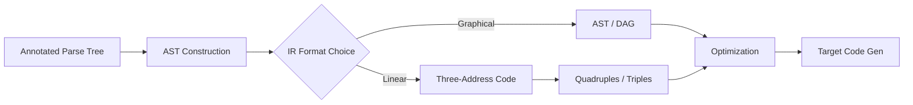

# Chapter 6: Intermediate Code Generation

**← Previous:** [Chapter 5: Syntax-Directed Translation](05-sdt.md) | **Next:** [Chapter 7: Type Checking](07-type-checking.md)

## Learning Objectives


After completing this chapter, students will be able to: distinguish among abstract syntax trees, postfix notation, and three-address code as intermediate representations; construct quadruples, triples, and indirect triples; build directed acyclic graphs for expression sharing; and generate three-address code for common programming-language constructs including conditional statements, loops, and procedure calls.

### Chapter at a Glance

| Section | Description |
|---------|-------------|
| Intermediate Representations | ASTs, postfix, TAC, and hybrid forms |
| Abstract Syntax Trees | Compressed parse trees for analysis |
| Postfix Notation | Stack-oriented operator-last representation |
| Three-Address Code | Linear IR with one operator per instruction |
| Types of TAC Instructions | Assignment, jumps, procedure calls, array ops |
| Quadruples, Triples, Indirect Triples | Storage formats for TAC |
| Directed Acyclic Graphs | Common-subexpression sharing in trees |
| Generating TAC for Statements | Assignment, while, if-then-else, calls |

### Chapter Roadmap



## Theory

### Intermediate Representations

Intermediate representations (IRs) sit between the source-language parse tree and the target-machine code. A good IR is independent of both the source language and the target machine, facilitates optimization, and supports retargeting. Three principal forms are in wide use: graphical IRs (abstract syntax trees and DAGs), linear IRs (postfix notation and three-address code), and hybrid forms that combine aspects of both. The choice of IR significantly influences the compiler's optimization capability and the ease of adding new analyses.

### Abstract Syntax Trees

An abstract syntax tree (AST) is a compressed representation of the parse tree in which operators appear as interior nodes and operands as children. Syntactic markers such as parentheses, semicolons, and grouping nonterminals are omitted. The AST for `a + b * c` has + at the root, a as its left child, and * as its right child, with b and c as the children of *. ASTs are the primary IR in many compilers because they closely reflect the source program's structure while eliminating syntactic noise. ASTs are also convenient for semantic analysis because attributes can be attached to AST nodes.

ASTs are typically constructed during or immediately after parsing. Each node stores its operator or token and pointers to its children. The tree is traversed recursively for subsequent phases such as type checking and code generation.

### Postfix Notation

Postfix (Reverse Polish) notation represents expressions with the operator following its operands: `a b c * +` corresponds to `a + b * c`. Postfix requires no parentheses and no precedence rules because the operator placement alone fixes evaluation order. It is evaluated by a stack machine: operands push onto the stack, operators pop their arguments and push the result. While simple to generate and evaluate, postfix is not well suited to optimization because the stack-oriented representation obscures data dependencies and variable lifetimes.

### Three-Address Code

Three-address code (TAC) is a linear IR where each instruction has the general form `x = y op z`, performing one operation with at most one operator on the right-hand side. The name derives from the fact that each instruction typically references at most three addresses: two for operands and one for the result. Addresses may be names (identifiers), constants, or compiler-generated temporaries.

TAC is the most popular IR for optimization because it closely resembles machine code while remaining machine-independent. Each instruction does bounded work, making it straightforward to reorder, remove, and insert instructions during optimization.

> **One-Sentence Takeaway:** TAC is the universal IR — simple enough to optimize, expressive enough to represent all language constructs, and close enough to machine code to generate efficiently.

### Types of Three-Address Code Instructions

**Assignment**: x = y op z, x = op y (unary operations such as unary minus or logical negation), x = y (copy assignment).

**Unconditional jump**: goto L.

**Conditional jump**: if x relop y goto L, ifFalse x goto L (jump if x is false).

**Procedure calls**: param x (push argument), call p, n (call procedure p with n arguments), return y (return value y).

**Indexed assignments**: x = y[i] (load from array), x[i] = y (store to array).

**Address and pointer operations**: x = &y (address of), x = *y (load through pointer), *x = y (store through pointer).

### Quadruples, Triples, and Indirect Triples

A **quadruple** is a four-field record: (op, arg1, arg2, result). For unary operators, arg2 is omitted. The instruction `x = y + z` becomes (+, y, z, x). Quadruples are the most common TAC representation because temporaries are named explicitly, simplifying code transformation. Optimization passes can freely move, modify, and insert quadruples without concern for positional references.

A **triple** uses three fields (op, arg1, arg2) and refers to the result of an operation by its position in the sequence. For example, (+, y, z) at position 1 means that subsequent instructions may refer to "(1)" as an operand. Triples save space by omitting the result field, but they complicate code movement because reordering instructions changes the positional references.

An **indirect triple** lists pointers to triples in execution order. The triple list stores the actual instructions, while a separate execution list of pointers determines the order of evaluation. Code motion is achieved by rearranging the execution list without renumbering triples. This combines the space efficiency of triples with the flexibility of quadruples.

### Directed Acyclic Graphs (DAGs)

A DAG for an expression is like an AST but with common subexpressions merged. If the same subexpression appears multiple times, the DAG shares a single node. DAG construction proceeds bottom-up: before creating a new node for an operator (say + with left child a and right child b), the compiler checks whether a node labeled + with children a and b already exists. If so, the existing node is reused. DAGs enable common-subexpression elimination and reduce register pressure.

### Generating Three-Address Code for Statements

**Assignment**: `x = expr` generates code for expr, ending with a temporary holding the expression value, followed by `x = temp`.

**While loops**: the generated code places the condition evaluation and branch at the top of the loop body:

```
L1: condition code
    if false cond goto L2
    body code
    goto L1
L2: ...
```

**If-then-else**: the condition is evaluated and a conditional jump transfers control to the else branch or the then branch:

```
    evaluate cond
    if false cond goto L1
    then code
    goto L2
L1: else code
L2: ...
```

**Procedure calls**: arguments are evaluated left to right and pushed via param instructions, followed by a call instruction. The return value is captured in a predefined temporary.

## Examples

### Example 6.1: Three-Address Code for an Expression

Source expression: `a * b + c * d`

Three-address code:
```
t1 = a * b
t2 = c * d
t3 = t1 + t2
```

### Example 6.2: Code for a While Loop

C code:
```
while (a < b) {
    c = c + 1;
}
```

Three-address code:
```
L1: if a < b goto L2
    goto L3
L2: c = c + 1
    goto L1
L3: ...
```

### Example 6.3: DAG Construction

Expression: `a + b * c + a * d`

The DAG shares the node for a, which appears twice. The multiplication `b * c` and `a * d` are distinct unless the values of a and d coincide with b and c.

### Concept Comparison

| IR Format | Structure | Optimization Suitability | Storage Cost |
|-----------|-----------|------------------------|--------------|
| AST | Tree | Moderate | Large |
| DAG | Graph with sharing | High (CSE) | Moderate |
| Postfix | Linear stack code | Low | Small |
| TAC (Quadruples) | Linear with named temps | High | Moderate |
| TAC (Triples) | Linear with positional refs | Low | Small |

### Quick Reference

| Instruction Type | Format | Example |
|-----------------|--------|---------|
| Assignment | x = y op z | t1 = a + b |
| Unary | x = op y | t1 = - t2 |
| Copy | x = y | t1 = t2 |
| Unconditional Jump | goto L | goto L1 |
| Conditional Jump | if x relop y goto L | if a < b goto L2 |
| Procedure Call | call p, n | call sort, 1 |
| Array Access | x = y[i] | t1 = a[i] |
| Address | x = &y | t1 = &buffer |

### Cross-Application Matrix

| Domain | Application | Relevance |
|--------|-------------|-----------|
| Language Design | Defining IR for new compilers | IR choice shapes optimization capability |
| Systems Programming | LLVM IR, GCC GIMPLE | Production compilers use multi-level IRs |
| Web Development | WebAssembly as compile target | Wasm is a low-level IR for the web |
| Tooling | Static analysis frameworks | IR enables cross-language analysis |

## Summary

Intermediate code generation translates the annotated parse tree into an IR that is independent of the source language and target machine. ASTs and DAGs provide graphical representations suitable for analysis, while three-address code in quadruple, triple, or indirect-triple form provides a linear representation straightforward to translate into assembly. The choice of IR significantly influences the compiler's optimization capability and retargetability. TAC is the dominant IR in modern production compilers because of its simplicity, expressiveness, and suitability for optimization.

## Exercises

### Review Questions

1. Compare the advantages and disadvantages of ASTs and three-address code as intermediate representations.
2. Convert the expression `(a + b) * (c + d) - e` into postfix notation and three-address code.
3. What is the principal difference between a quadruple and a triple? When would a compiler writer choose triples over quadruples?
4. Explain how a DAG differs from an AST and how DAG construction detects common subexpressions.
5. List five distinct types of three-address code instructions and provide an example of each.

### Application Problems

1. Generate three-address code for the following program fragment using if-then-else and while-loop patterns:
   ```
   if (x > y)
       z = x + y;
   else
       z = x - y;
   ```
2. Construct the quadruple, triple, and indirect-triple forms for the array assignment `a[i] = b[j] + c[k]`. Show the individual components of each form clearly.
3. Draw the DAG for the expression `a * b + a * b + c`. Show how the DAG reveals a common subexpression and explain what optimization this enables.
4. Translate the following for loop into three-address code using quadruples:
   ```
   for (i = 0; i < 10; i = i + 1)
       sum = sum + a[i];
   ```
5. A snippet contains the three-address code:
   ```
   t1 = x + y
   t2 = t1 + z
   t3 = x + y
   t4 = t3 * w
   ```
   How would a DAG-based representation expose the redundancy? Write the optimized TAC.

### Challenge Problem

1. Implement a function in your chosen language that takes an abstract syntax tree for arithmetic expressions (represented as a recursive data structure) and produces a sequence of three-address code quadruples. Support addition, subtraction, multiplication, division, and parentheses. Your translator should generate temporaries as needed and avoid recomputing identical subexpressions by using a DAG during translation. Test on the expression `(x + y) * (x + y) - (x + y) / z` and verify the generated TAC.     Extend your translator to handle boolean expressions and if-then-else control flow.

### Chapter Quiz

1. What is the key advantage of three-address code over ASTs for optimization?
   - A) It is easier for humans to read
   - B) Each instruction does bounded work, making reordering and analysis straightforward
   - C) It requires less memory than any other representation
   - D) It can only represent arithmetic expressions

2. How does a DAG differ from an AST?
   - A) DAGs use more memory than ASTs
   - B) DAGs share common subexpressions as a single node
   - C) DAGs cannot represent control flow
   - D) ASTs cannot represent arithmetic

3. What is the primary difference between a quadruple and a triple?
   - A) Quadruples have 4 operands; triples have 3
   - B) Quadruples name the result explicitly; triples refer to results by position
   - C) Quadruples are used only for optimization
   - D) There is no difference

<details>
<summary>Answers</summary>
1. B, 2. B, 3. B
</details>
