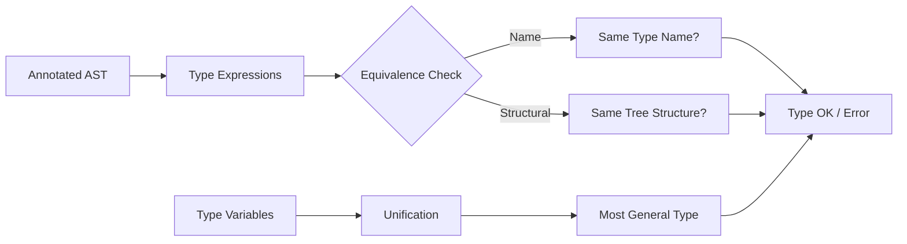

# Chapter 7: Type Checking

**← Previous:** [Chapter 6: Intermediate Code Generation](06-intermediate-code.md) | **Next:** [Chapter 8: Runtime Environment](08-runtime-env.md)

## Learning Objectives

After completing this chapter, students will be able to: define type systems and type expressions; distinguish structural from name type equivalence; implement synthesized and inferred type checking; resolve overloaded operators and functions; handle polymorphic functions with parametric and subtype polymorphism; and apply unification to type inference in the Hindley-Milner style.

### Chapter at a Glance

| Section | Description |
|---------|-------------|
| Type Systems | Formal classification of program phrases |
| Type Expressions | Constructing types from basic types and constructors |
| Type Equivalence | Name vs structural equivalence |
| Synthesized Type Checking | Bottom-up attribute-based type computation |
| Type Inference | Equation generation and unification |
| Overloading | Multiple meanings for the same operator |
| Polymorphic Functions | Parametric and subtype polymorphism |
| Unification | Solving type equations via substitution |
| Subtyping and Variance | Covariance and contravariance |

### Chapter Roadmap

## Theory

### Type Systems

A type system is a tractable syntactic method for proving the absence of certain program behaviors by classifying program phrases according to the kinds of values they compute. A type system consists of a set of types, rules for assigning types to program phrases, and a proof system ensuring consistency. The classification is tractable in the sense that type checking is decidable for most practical languages.

The primary purpose of a type system is to detect type errors: operations applied to arguments of inappropriate types. A type checker is **sound** if it accepts only programs that will not encounter type errors at runtime. It is **complete** if it accepts all such programs. For most realistic languages, soundness is achievable but completeness is not, due to the undecidability of halting-equivalent program properties. For example, the type checker conservatively assumes that any variable read is uninitialized, even though a particular execution path might always assign a value before the read.

> **One-Sentence Takeaway:** Type systems are always a trade-off between soundness (catching all real errors) and completeness (not rejecting valid programs) — and completeness is provably impossible for Turing-complete languages.

### Type Expressions

Types are represented as **type expressions**, constructed from basic types and type constructors. Basic types include `integer`, `float`, `char`, `boolean`, and `void`. Important type constructors include:

- **Arrays**: `array(I, T)` is an array of elements of type T indexed by type I.
- **Functions**: `(S₁ × ... × Sₙ) → T` represents a function from argument types Sᵢ to return type T.
- **Records**: `(name₁ : T₁, ...)` with named fields and their types.
- **Pointers**: `pointer(T)` for a pointer to an object of type T.
- **Type variables**: α, β, γ used as placeholders in polymorphism.
- **Type constructors for abstract data types**: classes, interfaces, generics.

### Type Equivalence

Two type expressions may be considered equivalent in one of two ways. **Name equivalence** holds if the two types are defined using the same type name. Under name equivalence, `type meters = int` and `type yards = int` are distinct types even though both expand to `int`. **Structural equivalence** holds if the two expressions expand to the same tree structure. Under structural equivalence, `meters` and `yards` would be identical. Most languages use a hybrid: name equivalence for user-defined types and structural equivalence for built-in structural types.

### Synthesized Type Checking

Synthesized type checking computes the type of a construct from the types of its subconstructs in a bottom-up fashion, matching the evaluation of synthesized attributes in an S-attributed definition. For the expression `E1 + E2`, the type checker determines the types of E1 and E2, looks up the operator + in the symbol table, and computes the result type, checking that the operands are type-compatible.

### Type Inference

Type inference determines types without explicit source annotations. The Hindley-Milner inference system, used in ML and Haskell, generates type equations from the program text and solves them via unification. For `fun x => x`, a fresh type variable α is assigned to x, the body returns α, yielding the type α → α. Since α is unconstrained, this is the most general type, enabling parametric polymorphism.

The inference algorithm proceeds in two passes. Pass one assigns fresh type variables to every subexpression and generates equality constraints based on how expressions are used. Pass two solves the constraints using unification, producing a substitution that maps type variables to concrete or partially-concrete types.

### Overloading

An operator or function is **overloaded** if it has multiple meanings depending on argument types. The + operator in most languages is overloaded for integer and floating-point addition. Overloading resolution selects the appropriate meaning based on context. In Ada, the resolution considers all visible declarations; if exactly one candidate is consistent, it is selected; otherwise, an ambiguity error results. In Java, the compiler uses a three-phase process: phase one attempts to find a matching method without boxing or variable-arity; phase two adds boxing; phase three adds variable-arity.

### Polymorphic Functions

**Parametric polymorphism** allows a function to operate uniformly on values of any type, with type variables standing for actual types. The ML function `fun length x = ...` has type α list → int. Parametric polymorphism is the basis of generics in Java, C#, and C++ templates. **Subtype polymorphism** allows a function expecting type T to accept any subtype of T, as in object-oriented inheritance where a method expecting Shape accepts a Circle. The **Liskov substitution principle** governs subtype relationships: if S is a subtype of T, objects of type T may be replaced by objects of type S without altering program correctness.

### Unification

Unification finds a substitution that makes two type expressions equal. The algorithm recursively matches the structures: if one expression is a type variable, it binds the variable to the other expression, performing an **occurs check** to prevent infinite recursion. If both have the same constructor (both →, both array, etc.), their subexpressions are unified pairwise. If a conflict arises (e.g., a function type unifying with an array type), a type error is reported.

### Subtyping and Variance

In languages with subtyping, the **variance** of a type constructor determines how subtyping propagates. A constructor C is **covariant** if C(S) ≤ C(T) whenever S ≤ T. It is **contravariant** if C(T) ≤ C(S) whenever S ≤ T. Function types are contravariant in arguments and covariant in results: if S ≤ T, then (T → U) ≤ (S → U) for arguments, and (U → S) ≤ (U → T) for results.

## Examples

### Example 7.1: Type Inference for a Function

`fun f(x) = x + 1`. Assign α to x. The + operator has type β × β → β. Constrain α = β and int = β. Solve β = int, α = int. Result: f : int → int.

### Example 7.2: Polymorphic Type via Unification

`fun map(f, []) = [] | map(f, h::t) = f(h) :: map(f, t)`. Inference yields map : (α → β) × α list → β list.

### Concept Comparison

| Type Feature | Mechanism | Language Example |
|-------------|-----------|-----------------|
| Name Equivalence | Types equal only if same name | Java class types |
| Structural Equivalence | Types equal if same structure | C typedef (expanded) |
| Parametric Polymorphism | Type variables abstract over types | Java generics, C++ templates |
| Subtype Polymorphism | Inheritance hierarchy | Java interface dispatch |
| Hindley-Milner | Constraint generation + unification | ML, Haskell |

### Quick Reference

| Algorithm | Input | Output | Complexity |
|-----------|-------|--------|------------|
| Synthesized Type Check | Typed AST | Type annotations | O(n) |
| Constraint Generation | Untyped AST | Equality constraints | O(n) |
| Unification | Constraints | Substitution | O(n·α(n)) |
| Overload Resolution | Expression + context | Single meaning | NP-hard (in general) |

### Cross-Application Matrix

| Domain | Application | Relevance |
|--------|-------------|-----------|
| Language Design | Type system design for new languages | Soundness vs expressiveness trade-off |
| Systems Programming | Rust borrow checker, C++ templates | Advanced type systems prevent memory bugs |
| Web Development | TypeScript type inference | Hindley-Milner concepts apply |
| Tooling | IDE intellisense, type-aware refactoring | Type information powers smart tooling |

## Summary

Type checking verifies that operations receive expected operand types. Type expressions describe the complete type of a language construct. Name and structural equivalence provide alternative equality criteria. Type inference automates type discovery through equation generation and unification. Overloading and polymorphism increase expressive power while requiring more sophisticated checking. Unification is the computational engine underlying Hindley-Milner inference.

## Exercises

### Review Questions

1. Distinguish name from structural equivalence. Provide an example producing different results.
2. What is the difference between synthesized type checking and type inference?
3. Explain the role of type variables in parametric polymorphism.
4. Describe the unification algorithm and the purpose of the occurs check.
5. Define the Liskov substitution principle and its relationship to subtypes.

### Application Problems

1. Determine structural equivalence: array(integer, integer) vs array(integer, integer); (int × int) → int vs (int × int) → int; array(integer, pointer(int)) vs array(integer, pointer(float)).
2. Perform inference on `fun g(x, y) = if x > 0 then y else 0`. Show constraint generation and unification.
3. Write the type expression for a C function taking a pointer to a function (int → char) and returning a pointer to float.
4. Resolve overloading in `"Count: " + 42` in Java. Which + applies and what is the result type?
5. Given type hierarchy Float ≤ Number ≤ Object, Integer ≤ Number, determine validity of: Number n = new Integer(5); Integer i = new Float(3.14); Object o = new Number(10).

### Challenge Problem

1. Implement a type checker for a small expression language with integers, booleans, operators (+, -, *, <, =), if-then-else, and let-bindings. Use an L-attributed SDD with a symbol table. Report meaningful errors for type mismatches. Extend with Hindley-Milner inference: use type variables, generate constraints during a first pass, and solve via unification.     Demonstrate correct typing of a polymorphic identity function and correct rejection of adding boolean to integer.

### Chapter Quiz

1. Name equivalence means two types are equal if and only if:
   - A) Their structures are identical
   - B) They have the same name or are defined in the same type declaration
   - C) They occupy the same memory size
   - D) They have the same alignment requirements

2. What is the occurs check used for in unification?
   - A) To verify all variables are initialized
   - B) To prevent infinite recursion by checking a variable does not appear in the expression being assigned to it
   - C) To ensure function arguments are evaluated
   - D) To resolve overloaded functions

3. Function types are contravariant in their argument types. Which statement is correct?
   - A) If S ≤ T, then (S → U) ≤ (T → U)
   - B) If S ≤ T, then (T → U) ≤ (S → U)
   - C) Variance does not apply to function types
   - D) Function arguments are covariant

Answers

1. B, 2. B, 3. B

