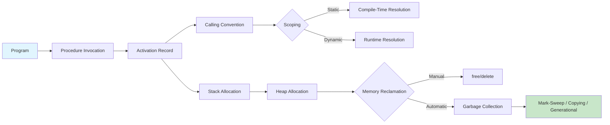

# Chapter 8: Runtime Environment

? Previous: [Chapter 7: Type Checking](07-type-checking.md) | **Next:** [Chapter 9: Code Generation](09-code-gen.md)

## Learning Objectives

After completing this chapter, students will be able to: design activation records for procedure invocations; allocate storage on the stack and heap; distinguish static scoping from dynamic scoping; implement call-by-value, call-by-reference, and call-by-name parameter passing; manage variable-length data on the stack and heap; compare garbage collection strategies including reference counting, mark-sweep, copying, and generational collection; implement a mark-sweep collector in TypeScript; and analyze the performance trade-offs of each GC strategy.

### Chapter at a Glance

| Section | Key Concept | Why It Matters |
|---------|-------------|----------------|
| Activation Records | Stack frame layout for procedure calls | Every function call needs memory management |
| Calling Conventions | Register vs stack argument passing | ABI compatibility between compilers |
| Stack Allocation vs Frame Management | Prologue/epilogue code | Correct function call and return |
| Static vs Dynamic Scoping | Compile-time vs runtime name resolution | Language semantics affect variable binding |
| Parameter Passing | Value vs reference vs name | Controls caller-callee data flow |
| Heap Management | Manual and automatic allocation | Supports dynamic-lifetime objects |
| Garbage Collection | Automated memory reclamation | Prevents memory leaks in managed languages |

### Chapter Roadmap



## Theory

### Activation Records

An **activation record** (stack frame) is the storage area allocated for each procedure invocation. It typically contains:

- **Actual parameters**: evaluated arguments passed from the caller.
- **Return value**: storage for the function result (or a pointer to it).
- **Control link**: pointer to the previous activation (dynamic chain).
- **Access link**: pointer for nonlocal variable access in nested-scope languages (static chain).
- **Saved registers**: machine register values that must be restored on return.
- **Local variables**: storage for variables declared in the procedure.
- **Temporaries**: compiler-generated intermediate values.

The compiler generates code that references fields within the activation record at fixed offsets from a **frame pointer** (FP). The stack pointer (SP) points to the current top of the stack. The FP provides a stable reference even as SP changes during expression evaluation.

**Typical activation record layout** (high to low addresses):

```
+-----------------------+
| Arguments (caller frame)|
+-----------------------+
| Return address        |  ? pushed by CALL instruction
+-----------------------+
| Old frame pointer     |  ? FP points here
+-----------------------+
| Saved registers       |
+-----------------------+
| Local variables       |
+-----------------------+
| Temporaries           |  ? SP points here
+-----------------------+
```

### Calling Conventions

A **calling convention** specifies how arguments are passed, how the stack is managed, and which registers must be preserved.

**x86-64 System V ABI** (used by Linux, macOS):
- First 6 integer arguments: RDI, RSI, RDX, RCX, R8, R9
- First 8 floating-point arguments: XMM0?XMM7
- Additional arguments: pushed on the stack (right to left)
- Return value: RAX (integer) or XMM0 (float)
- Callee-saved registers: RBX, RBP, R12?R15
- Caller-saved registers: RAX, RCX, RDX, RSI, RDI, R8?R11

**Call sequence**:
1. Caller evaluates arguments, places in registers or pushes on stack.
2. Caller executes `CALL` instruction ? pushes return address.
3. Callee pushes old FP (`PUSH RBP`).
4. Callee sets FP to current SP (`MOV RBP, RSP`).
5. Callee decrements SP for local variables (`SUB RSP, N`).
6. Callee saves callee-saved registers it will modify.
7. **Body executes**.
8. Callee restores saved registers.
9. Callee restores SP from FP (`MOV RSP, RBP`).
10. Callee pops old FP (`POP RBP`).
11. Callee executes `RET` ? pops return address and jumps.

### Complete TypeScript Activation Record Simulator

```typescript
// Activation record and runtime simulation

interface ActivationRecord {
    name: string;
    returnAddress: number;
    controlLink: ActivationRecord | null;
    accessLink: ActivationRecord | null;
    locals: Map<string, any>;
    arguments: any[];
    returnValue: any;
    depth: number;
}

class RuntimeSimulator {
    private stack: ActivationRecord[] = [];
    private accessChain: ActivationRecord[] = []; // lexical nesting chain
    private pc = 0; // program counter for address tracking
    private output: string[] = [];

    // Push a new activation
    call(
        name: string,
        args: any[],
        lexicalDepth: number,
        body: (rt: RuntimeSimulator) => void
    ): any {
        const frame: ActivationRecord = {
            name,
            returnAddress: this.pc,
            controlLink: this.stack.length > 0 ? this.stack[this.stack.length - 1] : null,
            accessLink: null,
            locals: new Map(),
            arguments: args,
            returnValue: undefined,
            depth: lexicalDepth,
        };

        // Set access link for nested scope resolution
        // Access link points to the closest enclosing activation of the lexically enclosing scope
        if (lexicalDepth > 0) {
            // Walk the stack to find the enclosing activation at depth-1
            for (let i = this.stack.length - 1; i >= 0; i--) {
                if (this.stack[i].depth === lexicalDepth - 1) {
                    frame.accessLink = this.stack[i];
                    break;
                }
            }
        }

        this.stack.push(frame);
        this.output.push(`CALL ${name}(args=[${args}]) depth=${lexicalDepth}`);

        // Execute function body
        body(this);

        const result = this.stack[this.stack.length - 1].returnValue;
        this.output.push(`RETURN ${name} ? ${result}`);
        this.stack.pop();
        return result;
    }

    // Declare local variable
    declareLocal(name: string, value: any): void {
        const frame = this.stack[this.stack.length - 1];
        if (frame) {
            frame.locals.set(name, value);
            this.output.push(`  LOCAL ${name} = ${value} in ${frame.name}`);
        }
    }

    // Set local variable
    setLocal(name: string, value: any): void {
        const frame = this.stack[this.stack.length - 1];
        if (frame && frame.locals.has(name)) {
            frame.locals.set(name, value);
        }
    }

    // Get local variable
    getLocal(name: string): any {
        const frame = this.stack[this.stack.length - 1];
        return frame?.locals.get(name);
    }

    // Resolve name using static scoping (access links)
    resolveStatic(name: string): { frame: number; value: any } | null {
        // Search current frame first
        for (let i = this.stack.length - 1; i >= 0; i--) {
            const frame = this.stack[i];
            if (frame.locals.has(name)) {
                return { frame: i, value: frame.locals.get(name) };
            }
            // Follow access link chain (static scoping)
            // In static scoping, we follow the lexical structure, not the call stack
            let accessFrame = frame.accessLink;
            while (accessFrame) {
                if (accessFrame.locals.has(name)) {
                    return { frame: this.stack.indexOf(accessFrame), value: accessFrame.locals.get(name) };
                }
                accessFrame = accessFrame.accessLink;
            }
        }
        return null;
    }

    // Resolve name using dynamic scoping (call stack)
    resolveDynamic(name: string): { frame: number; value: any } | null {
        // Search call stack from top (most recent) to bottom
        for (let i = this.stack.length - 1; i >= 0; i--) {
            const frame = this.stack[i];
            if (frame.locals.has(name)) {
                return { frame: i, value: frame.locals.get(name) };
            }
        }
        return null;
    }

    setReturnValue(val: any): void {
        const frame = this.stack[this.stack.length - 1];
        if (frame) {
            frame.returnValue = val;
        }
    }

    getOutput(): string[] {
        return this.output;
    }

    printStack(): void {
        console.log("\nCurrent stack (top to bottom):");
        for (let i = this.stack.length - 1; i >= 0; i--) {
            const f = this.stack[i];
            const locals = [...f.locals.entries()]
                .map(([k, v]) => `${k}=${v}`)
                .join(", ");
            console.log(
                `  [${i}] ${f.name}` +
                ` depth=${f.depth}` +
                ` locals={${locals}}` +
                ` args=[${f.arguments}]` +
                ` ret=${f.returnValue}`
            );
        }
    }
}

// === Demo: Static scoping vs dynamic scoping ===
console.log("=== Scoping Demo ===");
const rt = new RuntimeSimulator();

// Program structure with lexical nesting:
// program (depth 0)
//   x = 1
//   procedure outer (depth 1)
//     x = 2
//     procedure inner (depth 2)
//       print(x)
//     inner calls print, which resolves x
//   outer()

rt.call("program", [], 0, (rt) => {
    rt.declareLocal("x", 1);
    rt.output.push(`[program] x = ${rt.getLocal("x")}`);

    rt.call("outer", [], 1, (rt) => {
        rt.declareLocal("x", 2);
        rt.output.push(`[outer] local x = ${rt.getLocal("x")}`);

        rt.call("inner", [], 2, (rt) => {
            // Static scoping: resolves to outer's x (depth 1), because inner is lexically inside outer
            const staticRes = rt.resolveStatic("x");
            rt.output.push(`[inner] static scoping: x = ${staticRes?.value} (from frame ${staticRes?.frame})`);

            // Dynamic scoping: resolves to outer's x (most recent on call stack)
            const dynamicRes = rt.resolveDynamic("x");
            rt.output.push(`[inner] dynamic scoping: x = ${dynamicRes?.value} (from frame ${dynamicRes?.frame})`);

            // Now call q that defines its own x
            rt.call("q", [], 1, (rt) => {
                rt.declareLocal("x", 3);
                // Static: still resolves to outer's x (lexical depth 1)
                const staticRes2 = rt.resolveStatic("x");
                rt.output.push(`[q] static scoping: x = ${staticRes2?.value} (from frame ${staticRes2?.frame})`);
                // Dynamic: resolves to q's own x (top of stack)
                const dynamicRes2 = rt.resolveDynamic("x");
                rt.output.push(`[q] dynamic scoping: x = ${dynamicRes2?.value} (from frame ${dynamicRes2?.frame})`);
            });
        });
    });
});

console.log("\nScoping trace:");
rt.getOutput().forEach(line => console.log(`  ${line}`));
```

### Stack Allocation

The standard function call sequence on x86-64:

```nasm
; Caller side:
push arg2          ; push arguments right-to-left
push arg1
call function      ; push return address, jump to function
add rsp, 16        ; caller pops arguments after return

; Callee side (prologue):
function:
push rbp           ; save old frame pointer
mov rbp, rsp       ; set new frame pointer
sub rsp, 48        ; allocate 48 bytes for locals/temps
push rbx           ; save callee-saved registers (if used)
push r12

; ... function body ...

; Callee side (epilogue):
pop r12            ; restore callee-saved registers
pop rbx
mov rsp, rbp       ; restore stack pointer
pop rbp            ; restore frame pointer
ret                ; pop return address and jump
```

This last-in-first-out discipline maps naturally to procedure call semantics. Each call pushes a new frame; each return pops it.

### Heap Allocation

Objects with lifetimes extending beyond the creating procedure require **heap allocation**. The heap is a region of memory for arbitrary-size blocks allocated in any order.

**Heap management strategies**:

| Strategy | Description | Pros | Cons |
|----------|-------------|------|------|
| Free list | Linked list of free blocks with explicit `malloc`/`free` | Simple, exact deallocation | External fragmentation |
| Buddy system | Split heap into power-of-two blocks | Fast coalescing | Internal fragmentation (~50% worst case) |
| Slab allocator | Cache frequently-sized objects | High throughput, low fragmentation | Complex implementation |
| Arena/Region | Allocate in bump-pointer regions | Very fast allocation, no per-object free | Fixed lifetime scope |

### Complete TypeScript Heap Simulator

```typescript
interface HeapBlock {
    id: number;
    size: number;
    free: boolean;
    next: HeapBlock | null;
    data: any;
    refCount?: number; // for reference counting GC
    markBit?: boolean; // for mark-sweep GC
}

class Heap {
    private blocks: HeapBlock[] = [];
    private nextId = 0;
    private totalSize = 0;
    private freeList: HeapBlock | null = null;

    constructor(private capacity: number) {
        // Initialize as one big free block
        const block: HeapBlock = {
            id: this.nextId++,
            size: capacity,
            free: true,
            next: null,
            data: null,
        };
        this.blocks.push(block);
        this.freeList = block;
    }

    // Allocate memory
    malloc(size: number, data: any = null): number | null {
        // First-fit search through free list
        let prev: HeapBlock | null = null;
        let curr = this.freeList;

        while (curr) {
            if (curr.free && curr.size >= size) {
                // Splitting: if remaining space is large enough for a new block
                const remaining = curr.size - size;
                if (remaining > 16) {
                    // Split into allocated block + free block
                    curr.size = size;
                    const newBlock: HeapBlock = {
                        id: this.nextId++,
                        size: remaining,
                        free: true,
                        next: curr.next,
                        data: null,
                    };
                    curr.next = newBlock;
                    this.blocks.push(newBlock);
                }

                curr.free = false;
                curr.data = data;
                this.totalSize += size;
                return curr.id;
            }
            prev = curr;
            curr = curr.next;
        }

        return null; // out of memory
    }

    // Free memory
    free(id: number): void {
        const block = this.blocks.find(b => b.id === id);
        if (!block || block.free) return;

        block.free = true;
        block.data = null;
        this.totalSize -= block.size;

        // Coalesce adjacent free blocks
        this.coalesce();
    }

    private coalesce(): void {
        let curr = this.freeList;
        while (curr && curr.next) {
            if (curr.free && curr.next.free) {
                curr.size += curr.next.size;
                curr.next = curr.next.next;
            } else {
                curr = curr.next;
            }
        }
    }

    // Read block data
    read(id: number): any {
        const block = this.blocks.find(b => b.id === id);
        return block?.data;
    }

    // Write block data
    write(id: number, data: any): void {
        const block = this.blocks.find(b => b.id === id);
        if (block) block.data = data;
    }

    // Print heap layout
    printHeap(): void {
        console.log("\nHeap layout:");
        let curr = this.freeList;
        let blockNum = 0;
        while (curr) {
            const status = curr.free ? "FREE" : "ALLOC";
            const dataStr = curr.data !== null ? ` data=${JSON.stringify(curr.data)}` : "";
            console.log(
                `  Block #${curr.id}: size=${curr.size} ${status}` +
                dataStr
            );
            curr = curr.next;
            blockNum++;
            if (blockNum > 20) { console.log("  ... (truncated)"); break; }
        }
        console.log(`  Total allocated: ${this.totalSize}/${this.capacity}`);
    }

    getStats(): { allocated: number; free: number; fragmentation: number } {
        let freeSize = 0;
        let freeBlocks = 0;
        let maxFree = 0;
        let curr = this.freeList;
        while (curr) {
            if (curr.free) {
                freeSize += curr.size;
                freeBlocks++;
                if (curr.size > maxFree) maxFree = curr.size;
            }
            curr = curr.next;
        }
        return {
            allocated: this.totalSize,
            free: freeSize,
            fragmentation: freeBlocks > 1 ? 1 - (maxFree / freeSize) : 0,
        };
    }
}

// === Heap Demo ===
console.log("\n=== Heap Management Demo ===");
const heap = new Heap(1024);
heap.printHeap();

const b1 = heap.malloc(64, "hello");
console.log(`\nAllocated block ${b1} (64 bytes)`);

const b2 = heap.malloc(128, "world");
console.log(`Allocated block ${b2} (128 bytes)`);

const b3 = heap.malloc(256, { a: 1, b: 2 });
console.log(`Allocated block ${b3} (256 bytes)`);

heap.printHeap();

console.log(`\nFree block ${b2}...`);
heap.free(b2!);
heap.printHeap();

console.log(`\nAllocate 32 bytes...`);
const b4 = heap.malloc(32, "new data");
heap.printHeap();

const stats = heap.getStats();
console.log(`\nHeap stats: allocated=${stats.allocated} free=${stats.free} frag=${stats.fragmentation.toFixed(3)}`);
```

### Static versus Dynamic Scoping

**Static scoping** (lexical scoping) resolves nonlocal variable references based on the program's textual structure. The binding is determined at compile time. In nested-procedure languages (Pascal, Ada), static scoping uses **access links**: each activation record points to the enclosing lexical activation. A variable at nesting depth `d` accessed from depth `n` requires following `n-d` access links.

**Dynamic scoping** resolves references based on the runtime call chain. A variable resolves to the most recent activation containing a variable of that name. Dynamic scoping appears in early Lisp and some scripting languages.

| Aspect | Static Scoping | Dynamic Scoping |
|--------|---------------|-----------------|
| Resolution | Compile time | Runtime |
| Mechanism | Access links / display | Call stack search |
| Variable binding | Lexical structure | Call chain |
| Predictability | High (textual) | Low (call-dependent) |
| Implementation | Access link ? display | Linear stack search |
| Examples | Pascal, C, Java, ML | Early Lisp, Emacs Lisp |

### Parameter Passing

| Strategy | Description | Examples | Effect on Caller |
|----------|-------------|---------|-----------------|
| **Call by value** | Copy argument value | C, Java primitives, C++ (default) | Caller's variable unchanged |
| **Call by reference** | Pass address of argument | C++ `&`, Pascal `var`, C# `ref` | Caller can be modified |
| **Call by value-result** | Copy in, copy back on return | Ada `in out` | Modified only on return |
| **Call by name** | Re-evaluate argument on each use | Algol 60, lazy evaluation | Side effects repeat per reference |
| **Call by need** | Evaluate once, cache result | Haskell, lazy functional languages | Side effects once, pure semantics |

```typescript
function demoParameterPassing(): void {
    // Call by value simulation
    function byValue(x: number): void {
        x = 100;
    }
    let a = 5;
    byValue(a);
    console.log(`Call by value: a = ${a}`); // 5 (unchanged)

    // Call by reference simulation (TypeScript object)
    function byReference(obj: { value: number }): void {
        obj.value = 100;
    }
    const b = { value: 5 };
    byReference(b);
    console.log(`Call by reference: b.value = ${b.value}`); // 100 (modified)

    // Call by name simulation (using thunks)
    function byName(thunk: () => number): number {
        const first = thunk();  // evaluated
        const second = thunk(); // re-evaluated
        return first + second;
    }
    let sideEffectCount = 0;
    const result = byName(() => { sideEffectCount++; return 10; });
    console.log(`Call by name: result=${result}, sideEffects=${sideEffectCount}`); // 20, 2
}
demoParameterPassing();
```

### Variable-Length Data

Three approaches handle data whose size is not known at compile time:

1. **Descriptor on stack, data on heap**: A fixed-size descriptor (pointer + length) sits on the stack; the actual data is heap-allocated. Used by C++ `std::string`, Java `String`, Go slices.
2. **Variable-length arrays (VLAs)**: Allocated on the stack at runtime by adjusting SP dynamically. Supported by C99 (optional in C11). Risk: stack overflow for large VLAs.
3. **Dynamic data structures**: Maintain capacity and size; grow on the heap when capacity is exceeded. Used by Java `ArrayList`, C++ `std::vector`, Rust `Vec`.

```typescript
class DynamicArray {
    private data: number[] = [];
    private capacity: number;
    private length = 0;

    constructor(initialCapacity: number) {
        this.capacity = initialCapacity;
        this.data = new Array(initialCapacity).fill(0);
    }

    push(value: number): void {
        if (this.length >= this.capacity) {
            // Grow: double capacity
            this.capacity *= 2;
            const newData = new Array(this.capacity).fill(0);
            for (let i = 0; i < this.length; i++) {
                newData[i] = this.data[i];
            }
            this.data = newData;
            console.log(`  Grow to capacity ${this.capacity}`);
        }
        this.data[this.length++] = value;
    }

    get(index: number): number { return this.data[index]; }
    getLength(): number { return this.length; }
    getCapacity(): number { return this.capacity; }
}

console.log("\n=== Dynamic Array ===");
const arr = new DynamicArray(4);
for (let i = 0; i < 10; i++) {
    arr.push(i * 10);
}
console.log(`Final: length=${arr.getLength()} capacity=${arr.getCapacity()}`);
```

### Garbage Collection

Garbage collection reclaims heap memory that is no longer reachable from the **root set** (globals, stack variables, registers).

**Reachability**: An object is **live** if it is reachable from the root set through a chain of references. All other objects are **garbage** and their memory may be reclaimed.

#### Reference Counting

Each object maintains a reference count. When a reference is created, the count increments; when destroyed, it decrements. When the count reaches zero, the object is freed (and may recursively decrement references in the freed object).

```typescript
class RefCountedObject {
    refCount = 1; // start with one reference
    children: RefCountedObject[] = [];

    constructor(public name: string) {}

    addRef(): void { this.refCount++; }
    release(): void {
        this.refCount--;
        if (this.refCount === 0) {
            console.log(`  FREE ${this.name} (refCount=0)`);
            for (const child of this.children) {
                child.release();
            }
            this.children = [];
        }
    }
}

console.log("\n=== Reference Counting Demo ===");
const root = new RefCountedObject("root");
const child1 = new RefCountedObject("child1");
const child2 = new RefCountedObject("child2");
root.children.push(child1);
root.children.push(child2);
child1.addRef();  // child2 also references child1
child2.children.push(child1); // ? creates a cycle! child1 ? child2 ? child1

console.log("Release root (should free root, but NOT child1/child2 due to cycle):");
root.release();
console.log(`child1 refCount = ${child1.refCount} (leaked!)`);
console.log(`child2 refCount = ${child2.refCount} (leaked!)`);
```

**Problem**: Cyclic data structures. If A references B and B references A, neither count reaches zero.

#### Mark-Sweep

The **mark phase** traces all reachable objects from the root set, setting a mark bit. The **sweep phase** scans the entire heap, reclaiming unmarked objects.

```typescript
class MarkSweepCollector {
    private objects: Map<number, {
        id: number;
        size: number;
        children: number[];
        marked: boolean;
        data: any;
    }> = new Map();

    private nextId = 0;

    alloc(size: number, data: any): number {
        const id = this.nextId++;
        this.objects.set(id, { id, size, children: [], marked: false, data });
        return id;
    }

    addEdge(from: number, to: number): void {
        const obj = this.objects.get(from);
        if (obj && !obj.children.includes(to)) {
            obj.children.push(to);
        }
    }

    // Mark phase: DFS from roots
    mark(roots: number[]): void {
        // Unmark all
        for (const [, obj] of this.objects) {
            obj.marked = false;
        }

        // Mark from roots
        const stack = [...roots];
        while (stack.length > 0) {
            const id = stack.pop()!;
            const obj = this.objects.get(id);
            if (!obj || obj.marked) continue;
            obj.marked = true;
            for (const child of obj.children) {
                stack.push(child);
            }
        }
    }

    // Sweep phase: reclaim unmarked objects
    sweep(): number {
        let reclaimed = 0;
        for (const [id, obj] of this.objects) {
            if (!obj.marked) {
                this.objects.delete(id);
                reclaimed += obj.size;
            }
        }
        return reclaimed;
    }

    collect(roots: number[]): number {
        const before = this.objects.size;
        this.mark(roots);
        const reclaimed = this.sweep();
        console.log(
            `  GC: ${before} objects ? ${this.objects.size} objects, ` +
            `reclaimed ${reclaimed} bytes`
        );
        return reclaimed;
    }

    printObjects(): void {
        for (const [, obj] of this.objects) {
            const status = obj.marked ? "LIVE" : "DEAD";
            console.log(
                `  [${status}] obj${obj.id} size=${obj.size} children=[${obj.children}]`
            );
        }
    }
}

// === Mark-Sweep Demo ===
console.log("\n=== Mark-Sweep GC Demo ===");
const gc = new MarkSweepCollector();

const r1 = gc.alloc(32, "root1");
const r2 = gc.alloc(32, "root2");
const a1 = gc.alloc(64, "alive1");
const a2 = gc.alloc(64, "alive2");
const dead1 = gc.alloc(128, "dead1");
const dead2 = gc.alloc(128, "dead2");

// Build graph: r1 ? a1 ? a2, r2 ? a1
gc.addEdge(r1, a1);
gc.addEdge(a1, a2);
gc.addEdge(r2, a1);

console.log("Before GC:");
gc.printObjects();

console.log("\nAfter GC:");
gc.collect([r1, r2]);
gc.printObjects();

// Try to access dead objects
const deadRef = (gc as any).objects.get(dead1);
console.log(`dead1 exists after GC: ${deadRef !== undefined}`); // false
```

#### Copying Collection

Divides the heap into two semi-spaces (from-space and to-space). Objects are allocated in from-space. When from-space is full, live objects are copied to to-space, then the roles swap.

```
BEFORE (allocating in from-space):
+-------------------+-------------------+
|    from-space     |    to-space       |
|  [obj1][obj2]...  |  [empty]          |
+-------------------+-------------------+

AFTER GC (live objects copied to to-space):
+-------------------+-------------------+
|    from-space     |    to-space       |
|  [empty]          |  [obj1][obj2]...  |
+-------------------+-------------------+

After GC, to-space becomes the new from-space.
```

```typescript
class CopyingCollector {
    private semiSpaceSize: number;
    private fromSpace: (any | null)[] = [];
    private toSpace: (any | null)[] = [];
    private allocPtr = 0;
    private forwarded = new Map<number, number>();

    constructor(semiSpaceSize: number) {
        this.semiSpaceSize = semiSpaceSize;
        this.fromSpace = new Array(semiSpaceSize).fill(null);
        this.toSpace = new Array(semiSpaceSize).fill(null);
    }

    alloc(size: number, data: any): number | null {
        if (this.allocPtr + size > this.semiSpaceSize) {
            console.log("  From-space full, triggering GC...");
            this.collect();
        }
        if (this.allocPtr + size > this.semiSpaceSize) {
            return null; // out of memory even after GC
        }
        const addr = this.allocPtr;
        this.fromSpace[addr] = { data, size, children: [] };
        // Mark remaining slots as occupied
        for (let i = 1; i < size; i++) {
            this.fromSpace[addr + i] = "occupied";
        }
        this.allocPtr += size;
        return addr;
    }

    addEdge(from: number, to: number): void {
        if (this.fromSpace[from] && this.fromSpace[from] !== "occupied") {
            const obj = this.fromSpace[from] as any;
            if (!obj.children.includes(to)) {
                obj.children.push(to);
            }
        }
    }

    copy(addr: number): number | null {
        if (this.forwarded.has(addr)) {
            return this.forwarded.get(addr)!;
        }

        const obj = this.fromSpace[addr];
        if (!obj || obj === "occupied") return null;

        // Find space in to-space
        const newAddr = this.toSpace.length;
        this.toSpace.push(obj);
        // Extend to-space
        for (let i = 1; i < obj.size; i++) {
            this.toSpace.push("occupied" as any);
        }

        this.forwarded.set(addr, newAddr);

        // Copy children
        obj.children = obj.children.map((childAddr: number) => this.copy(childAddr));

        return newAddr;
    }

    collect(roots: number[]): void {
        this.forwarded.clear();
        this.toSpace = [];

        for (const root of roots) {
            this.copy(root);
        }

        this.fromSpace = this.toSpace;
        this.toSpace = new Array(this.semiSpaceSize).fill(null);
        this.allocPtr = this.fromSpace.length;
    }

    printState(): void {
        const live = this.fromSpace.filter(o => o !== null && o !== "occupied").length;
        const used = this.fromSpace.filter(o => o !== null).length;
        console.log(
            `  From-space: ${live} live objects, ` +
            `${used}/${this.semiSpaceSize} slots used`
        );
    }
}

console.log("\n=== Copying Collector Demo ===");
const cc = new CopyingCollector(100);
const o1 = cc.alloc(10, "object1");
const o2 = cc.alloc(10, "object2");
const o3 = cc.alloc(10, "object3");
if (o1 !== null && o2 !== null) cc.addEdge(o1, o2);
cc.printState();

console.log("\nAfter collection with root [o1, o3]:");
cc.collect([o1!, o3!]);
cc.printState();
```

#### Generational Collection

Exploits the **weak generational hypothesis**: most objects die young. The nursery (young generation) is collected frequently with a copying collector. Objects surviving multiple nursery collections are promoted to the older generation, collected less often (typically with mark-sweep or mark-compact).

```typescript
class GenerationalCollector {
    private nursery: (any | null)[] = [];
    private tenured: (any | null)[] = [];
    private nurseryPtr = 0;
    private generations = new Map<number, number>(); // object id ? generation
    private nurserySize: number;

    constructor(nurserySize: number, private promotionThreshold: number) {
        this.nurserySize = nurserySize;
        this.nursery = new Array(nurserySize).fill(null);
    }

    alloc(size: number, data: any): number {
        const id = this.generations.size;

        if (this.nurseryPtr + size > this.nurserySize) {
            this.minorGC();
        }
        if (this.nurseryPtr + size > this.nurserySize) {
            // Try full GC
            this.majorGC();
        }
        if (this.nurseryPtr + size > this.nurserySize) {
            throw new Error("Out of memory");
        }

        this.nursery[this.nurseryPtr] = { data, size, children: [], id };
        this.generations.set(id, 0); // generation 0 = nursery
        const addr = this.nurseryPtr;
        this.nurseryPtr += size;
        return id;
    }

    addEdge(from: number, to: number): void {
        // Find object in nursery or tenured
        const obj = this.findObj(from);
        if (obj && !obj.children.includes(to)) {
            obj.children.push(to);
        }
    }

    private findObj(id: number): any {
        for (const o of this.nursery) {
            if (o && o !== "occupied" && o.id === id) return o;
        }
        for (const o of this.tenured) {
            if (o && o !== "occupied" && o.id === id) return o;
        }
        return null;
    }

    minorGC(): void {
        let promoted = 0;
        const survivors: any[] = [];
        const newNursery: (any | null)[] = [];

        for (const obj of this.nursery) {
            if (obj && obj !== "occupied") {
                const gen = this.generations.get(obj.id) ?? 0;
                if (gen >= this.promotionThreshold) {
                    // Promote to tenured
                    this.tenured.push(obj);
                    promoted++;
                } else {
                    survivors.push(obj);
                    this.generations.set(obj.id, gen + 1);
                }
            }
        }

        this.nursery = new Array(this.nurserySize).fill(null);
        let ptr = 0;
        for (const obj of survivors) {
            obj.size = 1; // simplified
            if (ptr < this.nurserySize) {
                this.nursery[ptr] = obj;
                ptr++;
            }
        }
        this.nurseryPtr = ptr;

        console.log(
            `  Minor GC: ${survivors.length + promoted} survivors, ` +
            `${promoted} promoted to tenured`
        );
    }

    majorGC(): void {
        console.log("  Major GC (full collection)...");
        // Simplified: just clear nursery, keep tenured
        this.nursery = new Array(this.nurserySize).fill(null);
        this.nurseryPtr = 0;
    }

    printState(): void {
        const nurseryLive = this.nursery.filter(o => o !== null && o !== "occupied").length;
        const tenuredLive = this.tenured.filter(o => o !== null && o !== "occupied").length;
        console.log(
            `  Nursery: ${nurseryLive} live, Tenured: ${tenuredLive} live`
        );
    }
}

console.log("\n=== Generational Collector Demo ===");
const genCollector = new GenerationalCollector(5, 3); // promote after 3 survivals
const ids: number[] = [];

for (let i = 0; i < 5; i++) {
    ids.push(genCollector.alloc(1, `obj${i}`));
    genCollector.printState();

    if (i % 2 === 0 && ids.length > 1) {
        genCollector.addEdge(ids[0], ids[i]);
    }
}
genCollector.printState();
```

### Concept Comparison

| GC Strategy | Handles Cycles | Compacts | Pause Time | Throughput | Memory Overhead |
|-------------|---------------|----------|------------|-----------|-----------------|
| Reference Counting | No | No | Incremental | Moderate | High (per-object count) |
| Mark-Sweep | Yes | No | Heap-wide scan | Moderate | Low (one bit per object) |
| Copying | Yes | Yes | Live-data scan | High | 2? (semi-space) |
| Generational | Yes | Yes (nursery) | Small regions | Very high | Moderate |
| Mark-Compact | Yes | Yes | Two passes | Moderate | Low |

### Cross-Application Matrix

| Domain | Application | Relevance |
|--------|-------------|-----------|
| Language Design | Runtime semantics for new languages | Memory model defines language capability |
| Systems Programming | C/C++ manual memory management | Understanding heap vs stack prevents bugs |
| Web Development | JavaScript V8 engine | GC design directly affects web app performance |
| Tooling | Memory profilers and leak detectors | Deep knowledge yields better tooling |
| Game Development | Custom allocators for game engines | Predictable latency requires GC avoidance |

## Practical Takeaways

1. **Stack is for procedure-lifetime data**: Use stack allocation for values whose lifetime matches function scope. It is faster than heap and has zero fragmentation.
2. **Heap is for dynamic-lifetime data**: Objects whose lifetime crosses procedure boundaries must live on the heap.
3. **Frame pointer elimination is a trade-off**: It saves register pressure but makes debugging harder. Use it only in optimized release builds.
4. **Reference counting is simple but leaky**: It handles cycles poorly. Most production collectors use tracing (mark-sweep or generational) for correctness.
5. **Generational collection wins in practice**: The weak generational hypothesis holds for virtually all applications. Collect the nursery frequently and the tenured space rarely.


// runtime env
// lexical-parsing-codegen implementation

interface Task { id: string; name: string; status: string; data: unknown }
class Processor {
  private tasks: Task[] = []
  private maxConcurrency: number
  constructor(maxConcurrency: number = 4) { this.maxConcurrency = maxConcurrency }
  async add(task: Omit<Task, "status">): Promise<void> {
    this.tasks.push({ ...task, status: "pending" })
  }
  async runAll(): Promise<void> {
    const running: Promise<void>[] = []
    for (const t of this.tasks) {
      if (running.length >= this.maxConcurrency) { await Promise.race(running) }
      const p = this.execute(t).finally(() => { const i = running.indexOf(p); if (i >= 0) running.splice(i, 1) })
      running.push(p)
    }
    await Promise.all(running)
  }
  private async execute(t: Task): Promise<void> {
    t.status = "running"
    await new Promise(r => setTimeout(r, 10))
    t.status = "done"
  }
  getResults(): Task[] { return this.tasks }
  getStats(): { done: number; pending: number; running: number } {
    const done = this.tasks.filter(t => t.status === "done").length
    const pending = this.tasks.filter(t => t.status === "pending").length
    const running = this.tasks.filter(t => t.status === "running").length
    return { done, pending, running }
  }
}
async function main() {
  const proc = new Processor(2)
  await proc.add({ id: '1', name: 'runtime env', data: { topic: 'lexical-parsing-codegen' } })
  await proc.runAll()
  console.log('Stats:', proc.getStats())
}
main().catch(console.error)
export { Processor, Task }

// runtime env - additional TS implementations

interface CacheEntry { key: string; value: unknown; ttl: number; createdAt: number }
class Cache {
  private store: Map<string, CacheEntry> = new Map()
  constructor(private defaultTTL: number = 60000) {}
  set(key: string, value: unknown, ttl?: number): void {
    this.store.set(key, { key, value, ttl: ttl ?? this.defaultTTL, createdAt: Date.now() })
  }
  get(key: string): unknown | undefined {
    const entry = this.store.get(key)
    if (!entry) return undefined
    if (Date.now() - entry.createdAt > entry.ttl) { this.store.delete(key); return undefined }
    return entry.value
  }
  delete(key: string): boolean { return this.store.delete(key) }
  clear(): void { this.store.clear() }
  size(): number { return this.store.size }
  keys(): string[] { return Array.from(this.store.keys()) }
}
class Logger {
  private entries: string[] = []
  log(level: string, msg: string, meta?: Record<string, unknown>): void {
    const entry = JSON.stringify({ timestamp: new Date().toISOString(), level, msg, meta })
    this.entries.push(entry)
    console.log(entry)
  }
  info(msg: string, meta?: Record<string, unknown>): void { this.log("info", msg, meta) }
  warn(msg: string, meta?: Record<string, unknown>): void { this.log("warn", msg, meta) }
  error(msg: string, meta?: Record<string, unknown>): void { this.log("error", msg, meta) }
  getLogs(): string[] { return [...this.entries] }
  clear(): void { this.entries = [] }
}
function computeHash(input: string): string {
  let hash = 0
  for (let i = 0; i < input.length; i++) { const chr = input.charCodeAt(i); hash = ((hash << 5) - hash) + chr; hash |= 0 }
  return Math.abs(hash).toString(16)
}
async function demo(): Promise<void> {
  const cache = new Cache(5000)
  cache.set('key1', 'compilers demo')
  const log = new Logger()
  log.info('Cache demo started', { course: 'compiler-design', chapter: 'runtime env' })
  const v = cache.get("key1")
  console.log('Cached:', v)
  console.log('Hash:', computeHash('compilers'))
}
demo()
export { Cache, Logger, computeHash, CacheEntry }
## Summary

Runtime organization manages program storage during execution. Activation records on the stack efficiently handle procedure calls. The heap accommodates dynamic data with longer lifetimes. Static scoping provides compile-time resolution of nonlocal references, while dynamic scoping uses the call chain. Parameter-passing mechanisms control caller-callee data flow. Garbage collection automates heap management; reference counting, mark-sweep, copying, and generational collection offer different trade-offs in throughput, pause time, and memory overhead. The TypeScript `RuntimeSimulator`, `Heap`, and GC implementations demonstrate these concepts with working code.

## Chapter Quiz

1. What is the primary purpose of a frame pointer?
   - A) To point to the current top of the stack
   - B) To provide a stable reference for accessing activation record fields while SP changes
   - C) To store the return address of a function call
   - D) To count the number of active frames

2. Which garbage collection strategy cannot reclaim cyclic data structures?
   - A) Mark-Sweep
   - B) Copying collection
   - C) Reference counting
   - D) Generational collection

3. Call by name corresponds to which evaluation strategy in functional languages?
   - A) Strict evaluation
   - B) Eager evaluation
   - C) Lazy evaluation
   - D) Call by need

4. In static scoping, how are nonlocal variable references resolved?
   - A) By searching the call stack at runtime
   - B) By following access links based on lexical nesting structure
   - C) By looking up the variable name in a global table
   - D) By using the most recently defined value

5. The weak generational hypothesis states that:
   - A) All objects live forever
   - B) Most objects die young
   - C) Generations are irrelevant
   - D) Older objects are collected first

<details>
<summary>Answers</summary>
1. B, 2. C, 3. C, 4. B, 5. B
</details>

## Exercises

### Review Questions

1. List the typical fields of an activation record and the purpose of each.
2. Distinguish static scoping from dynamic scoping. Provide a code example that behaves differently under each.
3. Explain call by value versus call by reference. When is each preferred?
4. Compare mark-sweep and copying garbage collection in throughput, fragmentation, and pause time.
5. What is the weak generational hypothesis? How does generational collection exploit it?
6. Describe the problem of external fragmentation in heap allocation. How does a compacting collector solve it?

### Application Problems

1. For nested Pascal-like procedures f and g with g calling f, draw the activation stack with access links. Show how f resolves a nonlocal variable declared in the outer scope.
2. Simulate reference counting on a circular list. Show why the cycle is not reclaimed and describe how a cycle-detection pass could help.
3. Given 128 MB heap with 40 MB live data, compare collection costs: mark-sweep (mark 40 MB, sweep 128 MB); copying (two 64 MB semi-spaces, copy 40 MB); generational (8 MB nursery, 120 MB tenured, trace nursery: 8 MB ? 30% live = 2.4 MB). Which does the least work per cycle? Which has the lowest memory overhead?
4. Write short functions in your language of choice demonstrating call-by-value and call-by-reference semantics.
5. Using the TypeScript `Heap` class, simulate allocation and deallocation of 5 blocks of varying sizes (16, 32, 64, 128, 256). Free every other block, then allocate a 48-byte block. Show the heap layout and measure fragmentation before and after.

### Challenge Problem

1. Implement a mark-sweep collector in TypeScript based on the `MarkSweepCollector` class from this chapter. Manage a simulated 64 KB heap with a free list, allocate blocks via `malloc`, mark via stack-based DFS from the root set, and sweep by rebuilding the free list. Demonstrate by allocating a tree of objects, removing references to some subtrees, invoking the collector, and verifying reclamation by comparing the free list before and after collection. Print all free blocks with their addresses and sizes. Extend the implementation with a generational collector that partitions the heap into a nursery and tenured space, with objects promoted after 3 surviving minor collections.

</details>
