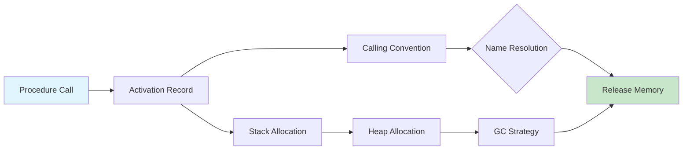

# Chapter 8: Runtime Environment

> **Prereq:** Chapter 7 (Type Checking) — types determine how values are stored and passed.
> **Next:** Chapter 9 (Code Generation) — the runtime environment guides where code places data.

## Learning Objectives

After completing this chapter, students will be able to: design activation records for procedure invocations; allocate storage on the stack and heap; distinguish static scoping from dynamic scoping; implement call-by-value, call-by-reference, and call-by-name parameter passing; manage variable-length data on the stack and heap; and compare garbage collection strategies including reference counting, mark-sweep, copying, and generational collection.

### Chapter at a Glance

| Section | Key Concept | Why It Matters |
|---------|-------------|----------------|
| Activation Records | Stack frame layout for calls | Every function call needs memory management |
| Calling Conventions | Register vs stack argument passing | ABI compatibility between compilers |
| Static vs Dynamic Scoping | Compile-time vs runtime name resolution | Language semantics affect variable binding |
| Parameter Passing | Value vs reference vs name | Controls caller-callee data flow |
| Garbage Collection | Automated memory reclamation | Prevents memory leaks in managed languages |

## Theory

### Activation Records

An **activation record** (stack frame) is the storage area allocated for each procedure invocation. It typically contains: actual parameters (evaluated arguments), the return value (or a pointer to its storage), a control link (pointer to the previous activation for stack unwinding), an access link (for nonlocal variable access in nested-scope languages), saved machine registers, local variables, and temporaries. The layout is determined at compile time, though variable-length data may require runtime size computation.

The compiler generates code that references fields within the activation record at fixed offsets from a **frame pointer** (FP). The stack pointer (SP) points to the current top of the stack. The FP provides a stable reference even as SP changes during expression evaluation. Arguments are typically at the highest addresses, followed by the control link, saved registers, local variables, and temporaries.

> **Warning:** Frame-pointer elimination (omitting the frame pointer) saves a register and reduces prologue/epilogue code, but makes stack trace generation and debugging harder — production vs debug builds choose differently.

### Calling Conventions

A calling convention specifies how arguments are passed, how the stack is managed, and which registers must be preserved. In the x86-64 System V ABI, the first six integer arguments are passed in registers (RDI, RSI, RDX, RCX, R8, R9), additional arguments are passed on the stack. The return value is placed in RAX. Registers RBX, RBP, R12-R15 are callee-saved; others are caller-saved. The callee must preserve the callee-saved registers or save and restore them.

### Stack Allocation

The standard call sequence: (1) caller evaluates arguments and places them in registers or pushes them; (2) caller executes call, which pushes the return address; (3) callee pushes the old FP and sets FP to SP; (4) callee decrements SP for locals; (5) callee saves callee-saved registers. Return reverses the sequence. This last-in-first-out discipline maps naturally to procedure call semantics.

### Heap Allocation

Objects with lifetimes extending beyond the creating procedure require **heap allocation**. The heap is a region of memory for arbitrary-size blocks allocated in any order. Allocation via `new` or `malloc` obtains heap memory; deallocation via `delete` or `free`, or automatic garbage collection, releases it. Heap management strategies include free lists (linked lists of available blocks), buddy systems (splitting into powers of two), and slab allocators (caching frequently-sized objects).

**Fragmentation** is a chronic heap problem. External fragmentation occurs when free space is divided into small blocks between allocated objects. Internal fragmentation occurs when allocated blocks are larger than requested. Compacting collectors (discussed below) address external fragmentation.

> **One-Sentence Takeaway:** The runtime environment divides memory into stack (procedure-call-driven LIFO allocation) and heap (arbitrary-lifetime allocation) — the stack is managed by conventions, the heap by allocation and reclamation strategies.

### Static versus Dynamic Scoping

**Static scoping** (lexical scoping) resolves nonlocal variable references based on the program's textual structure. The binding is determined at compile time. In nested-procedure languages (Pascal, Ada), static scoping uses **access links**: each activation record points to the enclosing activation. A variable at nesting depth d accessed from depth n requires following n-d access links. An alternative is a **display** (an array of frame pointers, one per nesting depth).

**Dynamic scoping** resolves references based on the runtime call chain. A variable resolves to the most recent activation containing a variable of that name. Dynamic scoping is simpler to implement (linear search of the stack) but makes programs harder to reason about. It appears in early Lisp and some scripting languages.

### Parameter Passing

**Call by value**: the argument is evaluated and its value is copied to the callee. Modifications do not affect the caller. This is the default in C, Java (primitives), and C++ (unless a reference type is used).

**Call by reference**: the caller passes the address of the argument. The callee can modify the caller's variable. C++ references, Pascal var parameters, and C# ref parameters use this strategy. It is efficient for large objects and enables output parameters.

**Call by name**: the argument is not evaluated until used, and is re-evaluated on each occurrence. Used in Algol 60, this corresponds to lazy evaluation in functional languages. It can produce surprising behavior: for an argument expression with side effects, each reference in the callee triggers the side effect again.

### Variable-Length Data

Three approaches handle data whose size is not known at compile time. (1) A fixed-size descriptor on the stack points to heap-allocated storage (as in C++ std::string). (2) Variable-length arrays (C99 VLAs) are allocated on the stack at runtime by adjusting SP dynamically. (3) Dynamic data structures (Java ArrayList) maintain a capacity and size, growing on the heap when capacity is exceeded.

### Garbage Collection

Garbage collection reclaims heap memory that is no longer reachable from the root set (globals, stack variables, registers).

**Reference counting**: each object maintains a reference count. When a reference is created, the count increments; when destroyed, it decrements. When the count reaches zero, the object is freed. It is simple and provides predictable deallocation but cannot reclaim cyclic data structures.

**Mark-sweep**: the mark phase traces all reachable objects from the root set, setting a mark bit. The sweep phase scans the entire heap, reclaiming unmarked objects. Mark-sweep handles cycles but causes fragmentation and pauses proportional to heap size.

**Copying collection**: divides the heap into two semi-spaces. Objects are allocated in from-space. When full, live objects are copied (traced and relocated) to to-space, then the roles swap. Copying collects only live objects, compacts memory, and handles cycles. The cost is that only half the heap is usable at once.

> **Pro Tip:** Modern runtimes (Java HotSpot, .NET CLR, V8) use generational collection precisely because empirical data across languages confirms the weak generational hypothesis — optimizing for short-lived objects yields the best throughput per pause.

**Generational collection**: exploits the weak generational hypothesis that most objects die young. The nursery (young generation) is collected frequently with a copying collector. Objects surviving multiple nursery collections are promoted to the older generation, collected less often (typically with mark-sweep or mark-compact). Generational collection reduces pause times by focusing on high-yield, small regions.

## Example

### Example 8.1: Activation Record for a C Function

Function `int f(int x, int y) { int z[100]; return x + y + z[0]; }`. The activation record on x86-64 contains: return address (8 bytes), saved RBP (8 bytes), local array z (400 bytes). Parameters x and y arrive in RDI and RSI. The frame pointer RBP is set to the saved RBP location, and SP is decremented by approximately 416 bytes.

### Concept Comparison

| GC Strategy | Handles Cycles | Compacts | Pause Time | Memory Overhead |
|-------------|---------------|----------|------------|-----------------|
| Reference Counting | No | No | Incremental | High (per-object count) |
| Mark-Sweep | Yes | No | Heap-wide | Low |
| Copying | Yes | Yes | Live-data | 2× heap (semi-space) |
| Generational | Yes | Yes (nursery) | Small regions | Moderate |

### Quick Reference

| Memory Region | Allocation | Lifetime | Deallocation |
|---------------|-----------|----------|--------------|
| Stack | SP decrement | Procedure scope | SP restore |
| Heap | malloc/new | Arbitrary | free/GC |
| Static data | Linker | Program lifetime | Program exit |
| Code segment | Loader | Program lifetime | Program exit |

### Cross-Application Matrix

| Domain | Application | Relevance |
|--------|-------------|-----------|
| Language Design | Runtime semantics for new languages | Memory model defines language capability |
| Systems Programming | C/C++ manual memory management | Understanding heap vs stack prevents bugs |
| Web Development | JavaScript V8 engine | GC design directly affects web app performance |
| Tooling | Memory profilers and leak detectors | Deep knowledge of runtime yields better tooling |

## Summary

Runtime organization manages program storage during execution. Activation records on the stack efficiently handle procedure calls. The heap accommodates dynamic data with longer lifetimes. Static scoping provides compile-time resolution of nonlocal references, while dynamic scoping uses the call chain. Parameter-passing mechanisms control caller-callee data flow. Garbage collection automates heap management; reference counting, mark-sweep, copying, and generational collection offer different trade-offs.

## Exercises

### Review Questions

1. List the typical fields of an activation record and the purpose of each.
2. Distinguish static scoping from dynamic scoping. Provide a code example that behaves differently under each.
3. Explain call by value versus call by reference. When is each preferred?
4. Compare mark-sweep and copying garbage collection in throughput, fragmentation, and pause time.
5. What is the weak generational hypothesis? How does generational collection exploit it?

### Application Problems

1. For nested Pascal-like procedures f and g with g calling f, draw the activation stack with access links. Show how f resolves a nonlocal variable declared in the outer scope.
2. Simulate reference counting on a circular list. Show why the cycle is not reclaimed and describe how a cycle-detection pass could help.
3. Given 128 MB heap with 40 MB live data, compare collection costs: mark-sweep (mark 40 MB, sweep 128 MB). Copying (two 64 MB semi-spaces, copy 40 MB). Generational (8 MB nursery, 120 MB tenured, trace nursery: 8 MB × 30% live = 2.4 MB). Which does the least work? Which has the lowest memory overhead?
4. Write short C functions demonstrating call-by-value semantics and call-by-reference semantics via pointers.

### Challenge Problem

1. Implement a mark-sweep collector in C. Manage a 64 KB heap with a free list, allocate via a custom malloc, mark via stack-based DFS from the root set, and sweep by rebuilding the free list. Demonstrate by allocating a tree of objects, removing references to some subtrees, invoking the collector, and verifying reclamation by comparing the free list before and after collection. Print all free blocks with their addresses and sizes.

### Chapter Quiz

1. What is the primary purpose of a frame pointer?
   - A) To point to the current top of the stack
   - B) To provide a stable reference for accessing activation record fields while SP changes
   - C) To store the return address of a function call
   - D) To count the number of active frames

2. Which garbage collection strategy cannot reclaim cyclic data structures?
   - A) Mark-Sweep
   - B) Copying collection
   - C) Reference counting
   - D) Generational collection

3. Call by name corresponds to which evaluation strategy in functional languages?
   - A) Strict evaluation
   - B) Eager evaluation
   - C) Lazy evaluation
   - D) Call by need

Answers

1. B, 2. C, 3. C

