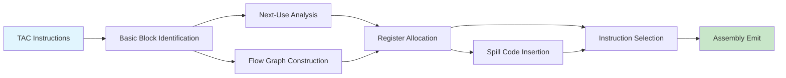

# Chapter 9: Code Generation

? Previous: [Chapter 8: Runtime Environment](08-runtime-env.md) | **Next:** [Chapter 10: Code Optimization](10-optimization.md)

## Learning Objectives

After completing this chapter, students will be able to: model the target machine for code generation; compute basic blocks and construct flow graphs; determine next-use information via backward scanning; allocate registers within basic blocks using farthest-next-use heuristics; implement graph-coloring register allocation; select instructions via tree-pattern matching with dynamic programming; generate code for procedures with calling conventions; and implement a complete code generator in TypeScript that translates TAC to a simplified assembly.

### Chapter at a Glance

| Section | Key Concept | Why It Matters |
|---------|-------------|----------------|
| Target Machine Model | Registers, memory, instruction set | Defines what code can be emitted |
| Addressing Modes | How operands are specified | Critical for instruction density and speed |
| Basic Blocks and Flow Graphs | Maximal single-entry sequences | Enables local optimization and analysis |
| Next-Use Information | Backward scan for variable usage | Drives optimal register allocation |
| Register Allocation (Basic Block) | Farthest-next-use heuristic | Minimizes spills in straight-line code |
| Register Allocation (Procedure) | Chaitin graph coloring | Global allocation with K registers |
| Instruction Selection | Tree-rewriting with dynamic programming | Automates optimal code emission |

### Chapter Roadmap



## Theory

### Target Machine Model

Code generation translates the intermediate representation into instructions for a specific target machine. A typical RISC model includes:

- **Registers**: A set of general-purpose registers (e.g., 32 on MIPS, 16 on ARM, 16 on x86-64 general-purpose). Registers are the fastest storage tier and are central to performance.
- **Memory**: A byte-addressable memory accessed via load/store instructions.
- **Instruction set**: Arithmetic (`add`, `sub`, `mul`), load/store (`ld`, `st`), branch (`beq`, `bne`, `j`), and procedure call (`jal`) instructions.

Key properties include **register count**, **addressing modes**, **instruction costs**, and the **calling convention**.

Our simplified target machine for this chapter:

```
Registers: R0, R1, R2, ..., R15 (16 registers)
R0 always holds 0 (hardwired zero)
R15 is the stack pointer (SP)

Instructions:
  add Rd, Rs, Rt   # Rd = Rs + Rt
  sub Rd, Rs, Rt   # Rd = Rs - Rt
  mul Rd, Rs, Rt   # Rd = Rs * Rt
  div Rd, Rs, Rt   # Rd = Rs / Rt
  li  Rd, imm      # Rd = immediate
  ld  Rd, addr     # Rd = memory[addr]
  st  Rs, addr     # memory[addr] = Rs
  beq Rs, Rt, L    # if Rs == Rt goto L
  bne Rs, Rt, L    # if Rs != Rt goto L
  blt Rs, Rt, L    # if Rs < Rt goto L
  j L              # goto L
  jal L            # call procedure L
  jr Rs            # return (jump to address in Rs)
  mov Rd, Rs       # Rd = Rs
  nop              # no operation
```

### Addressing Modes

Addressing modes specify how to compute the effective address of an operand:

| Mode | Example | Effective Address | Usage |
|------|---------|------------------|-------|
| Absolute | `ld R1, 0x1000` | 0x1000 | Global variables |
| Register direct | `add R1, R2, R3` | ? | Fastest operand access |
| Register indirect | `ld R1, (R2)` | `R2` | Pointer dereference |
| Indexed | `ld R1, 4(R2)` | `R2 + 4` | Stack locals, struct fields |
| Immediate | `li R1, 42` | ? | Constants |
| PC-relative | `beq R1, R2, L` | `PC + offset` | Branch targets |

### Basic Blocks and Flow Graphs

A **basic block** is a maximal sequence of consecutive three-address instructions with a single entry and a single exit. No jumps enter the block except to its first instruction; no jumps leave except from its last instruction.

**Leader identification**: Leaders (block entry points) are:
1. The first instruction of the program.
2. Any instruction that is a jump target (label target).
3. Any instruction following a jump or conditional jump.

**Partition algorithm**:

```
- Mark leaders:
  - instruction 1 is a leader
  - for each jump target L, instruction L is a leader
  - for each jump i, instruction i+1 is a leader
- For each leader, its basic block extends to (but not including) the next leader
```

A **flow graph** has basic blocks as nodes and edges representing control flow. An edge `B1 ? B2` exists if control can pass from `B1`'s last instruction to `B2`'s first instruction (fall-through or jump target).

### Next-Use Information

For register allocation within a basic block, the compiler must know whether each variable's value will be used again. The **next-use** computation scans the block backward.

**Algorithm**: For each instruction `x = y op z` (scanning backward):
- Attach next-use and liveness info from the current state.
- Set `x` to "not live" and "no next use" (it is being defined).
- Set `y` and `z` to "live" and "next use = this instruction".

As the scan moves backward, next-use information for variables that are not redefined in the current instruction propagates unchanged.

```typescript
interface NextUseInfo {
    live: boolean;
    nextUse: number | null; // instruction index
}

function computeNextUse(instructions: TACInstr[]): NextUseInfo[][] {
    const n = instructions.length;
    const info: NextUseInfo[][] = [];

    // Initialize symbol table for tracking
    const symInfo = new Map<string, NextUseInfo>();

    // Scan backward
    for (let i = n - 1; i >= 0; i--) {
        const instr = instructions[i];
        const instrInfo: NextUseInfo[] = [];

        // Collect all operands
        const operands: string[] = [];
        const result = instr.result;
        if (result && !result.endsWith(":")) operands.push(result);
        if (instr.arg1) operands.push(instr.arg1);
        if (instr.arg2) operands.push(instr.arg2);

        // Record current state for each operand
        for (const op of operands) {
            // Skip labels and immediates
            if (op.startsWith("L") || !isNaN(Number(op))) continue;
            const current = symInfo.get(op);
            instrInfo.push({
                live: current?.live ?? false,
                nextUse: current?.nextUse ?? null,
            });
        }

        // Update: result is defined (killed)
        if (result && !result.startsWith("L") && isNaN(Number(result))) {
            symInfo.set(result, { live: false, nextUse: null });
        }

        // Update: operands are used
        if (instr.arg1 && !instr.arg1.startsWith("L") && isNaN(Number(instr.arg1))) {
            const prev = symInfo.get(instr.arg1);
            symInfo.set(instr.arg1, { live: true, nextUse: i });
        }
        if (instr.arg2 && !instr.arg2.startsWith("L") && isNaN(Number(instr.arg2))) {
            const prev = symInfo.get(instr.arg2);
            symInfo.set(instr.arg2, { live: true, nextUse: i });
        }

        info.unshift(instrInfo);
    }

    return info;
}
```

### Complete TypeScript Code Generator

```typescript
// Target machine model
const REGISTERS = ["R0", "R1", "R2", "R3", "R4", "R5", "R6", "R7", "R8", "R9", "R10", "R11", "R12", "R13", "R14", "R15"];
const K = 6; // number of allocatable registers (excluding R0, SP)
const SP = "R15";
const ZERO = "R0";

interface TACInstr {
    op: string;
    result?: string;
    arg1?: string;
    arg2?: string;
}

interface AsmInstr {
    op: string;
    operands: string[];
    comment?: string;
}

class BasicBlock {
    instructions: TACInstr[] = [];
    id: number;

    constructor(id: number) {
        this.id = id;
    }

    add(instr: TACInstr): void {
        this.instructions.push(instr);
    }

    toString(): string {
        return `BB${this.id}:\n` +
            this.instructions.map((instr, i) =>
                `  ${i}: ${instr.op}${instr.result ? " " + instr.result : ""}${instr.arg1 ? ", " + instr.arg1 : ""}${instr.arg2 ? ", " + instr.arg2 : ""}`
            ).join("\n");
    }
}

class FlowGraph {
    blocks: BasicBlock[] = [];
    edges: [number, number][] = [];

    constructor(tac: TACInstr[]) {
        this.buildBlocks(tac);
    }

    private buildBlocks(tac: TACInstr[]): void {
        // Mark leaders
        const leaders = new Set<number>();
        leaders.add(0); // first instruction

        for (let i = 0; i < tac.length; i++) {
            const instr = tac[i];
            if (instr.op === "goto" || instr.op === "if" || instr.op === "ifFalse") {
                // Instruction after jump is a leader
                if (i + 1 < tac.length) leaders.add(i + 1);
                // Jump target is a leader (label in result field)
                if (instr.arg2) {
                    // Find the target instruction
                    const targetLabel = instr.arg2 + ":";
                    for (let j = 0; j < tac.length; j++) {
                        if (tac[j].op === targetLabel) {
                            leaders.add(j);
                            break;
                        }
                    }
                }
            }
            if (instr.op.endsWith(":")) {
                // Labels are potential jump targets
                // The label itself might already be a leader
                if (leaders.has(i)) {
                    // Already a leader (jump target)
                } else {
                    leaders.add(i); // fall through target
                }
            }
        }

        // Partition into blocks
        const sortedLeaders = [...leaders].sort((a, b) => a - b);
        for (let li = 0; li < sortedLeaders.length; li++) {
            const block = new BasicBlock(li);
            const start = sortedLeaders[li];
            const end = li + 1 < sortedLeaders.length ? sortedLeaders[li + 1] : tac.length;

            for (let i = start; i < end; i++) {
                block.add(tac[i]);
            }
            this.blocks.push(block);
        }
    }

    // Simple register allocator for a basic block
    allocateRegisters(blockIdx: number): Map<string, string> {
        const block = this.blocks[blockIdx];
        if (!block) return new Map();

        const regMap = new Map<string, string>();  // variable ? register
        const varMap = new Map<string, string>();  // register ? variable
        const memMap = new Map<string, string>();  // variable ? memory location
        const nextUse = new Map<string, number>(); // variable ? next use index

        const freeRegs = REGISTERS.filter(r => r !== ZERO && r !== SP);

        // Compute next-use via backward scan (simplified)
        for (let i = block.instructions.length - 1; i >= 0; i--) {
            const instr = block.instructions[i];
            const ops = [instr.result, instr.arg1, instr.arg2].filter(
                (x): x is string => x !== undefined && !x.startsWith("L") && isNaN(Number(x))
            );
            for (const op of ops) {
                if (!nextUse.has(op)) {
                    nextUse.set(op, i);
                }
            }
            if (instr.result && !instr.result.startsWith("L")) {
                // result is being defined, subsequent uses are later
                nextUse.set(instr.result, -1);
            }
        }

        // Allocate registers (first-fit with farthest-next-use spill)
        const getReg = (varName: string, currentInstr: number): string => {
            // If already in a register, return it
            if (regMap.has(varName)) {
                return regMap.get(varName)!;
            }

            // If free register exists, allocate
            for (const reg of freeRegs) {
                if (!varMap.has(reg) || varMap.get(reg) === undefined) {
                    regMap.set(varName, reg);
                    varMap.set(reg, varName);
                    return reg;
                }
            }

            // All registers in use ? spill farthest next use
            let spillReg = freeRegs[0];
            let farthestUse = -1;

            for (const reg of freeRegs) {
                const occupant = varMap.get(reg);
                if (occupant) {
                    const nu = nextUse.get(occupant) ?? -1;
                    if (nu > farthestUse) {
                        farthestUse = nu;
                        spillReg = reg;
                    }
                }
            }

            const spilledVar = varMap.get(spillReg);
            if (spilledVar) {
                // Emit store to memory
                memMap.set(spilledVar, `mem_${spilledVar}`);
                regMap.delete(spilledVar);
            }

            regMap.set(varName, spillReg);
            varMap.set(spillReg, varName);
            return spillReg;
        };

        return regMap;
    }

    // Generate assembly for a block
    generateAssembly(blockIdx: number): AsmInstr[] {
        const block = this.blocks[blockIdx];
        if (!block) return [];

        const asm: AsmInstr[] = [];
        const regMap = new Map<string, string>();
        const memMap = new Map<string, string>();
        let memCounter = 0;

        const allocateReg = (varName: string, currentInstr: number): string => {
            if (regMap.has(varName)) return regMap.get(varName)!;

            // Check if variable is an integer constant
            if (!isNaN(Number(varName))) {
                const reg = this.findFreeReg([...regMap.entries()].map(([k, v]) => v));
                asm.push({ op: "li", operands: [reg, varName] });
                regMap.set(varName, reg);
                return reg;
            }

            // Check if variable is a label
            if (varName.endsWith(":") || varName.startsWith("L")) {
                // Don't allocate registers for labels
                return varName;
            }

            for (const reg of REGISTERS) {
                if (reg === ZERO || reg === SP) continue;
                let inUse = false;
                for (const [, r] of regMap) {
                    if (r === reg) { inUse = true; break; }
                }
                if (!inUse) {
                    regMap.set(varName, reg);
                    return reg;
                }
            }

            // Spill
            let spillVar = "";
            let spillReg = "";
            for (const [v, r] of regMap) {
                spillVar = v;
                spillReg = r;
                break;
            }
            if (spillVar) {
                const memLoc = `mem_${++memCounter}`;
                asm.push({ op: "st", operands: [spillReg, memLoc], comment: `spill ${spillVar}` });
                regMap.delete(spillVar);
                memMap.set(spillVar, memLoc);
            }

            regMap.set(varName, spillReg);
            return spillReg;
        };

        this.findFreeReg = (usedRegs: string[]): string => {
            for (const reg of REGISTERS) {
                if (reg === ZERO || reg === SP) continue;
                if (!usedRegs.includes(reg)) return reg;
            }
            return REGISTERS[1];
        };

        for (let i = 0; i < block.instructions.length; i++) {
            const instr = block.instructions[i];

            // Handle labels
            if (instr.op.endsWith(":")) {
                asm.push({ op: instr.op, operands: [] });
                continue;
            }

            // Handle jumps
            if (instr.op === "goto") {
                asm.push({ op: "j", operands: [instr.arg1 || ""] });
                continue;
            }

            if (instr.op === "ifFalse") {
                const cond = instr.arg1 || "";
                const target = instr.arg2 || "";
                const reg = allocateReg(cond, i);
                asm.push({ op: "beq", operands: [reg, ZERO, target], comment: `ifFalse ${cond}` });
                continue;
            }

            if (instr.op === "if") {
                const cond = instr.arg1 || "";
                const target = instr.arg2 || "";
                const reg = allocateReg(cond, i);
                asm.push({ op: "bne", operands: [reg, ZERO, target], comment: `if ${cond}` });
                continue;
            }

            // Handle "call" pseudo-op
            if (instr.op === "call") {
                const funcName = instr.arg1 || "";
                const nArgs = instr.arg2 || "0";
                asm.push({ op: "jal", operands: [funcName], comment: `call with ${nArgs} args` });
                if (instr.result) {
                    const reg = allocateReg(instr.result, i);
                    asm.push({ op: "mov", operands: [reg, "R0"], comment: `return value ? ${instr.result}` });
                }
                continue;
            }

            // Handle "param"
            if (instr.op === "param") {
                const val = instr.arg1 || "0";
                const reg = allocateReg(val, i);
                asm.push({ op: "st", operands: [reg, "(SP)"], comment: `param ${val}` });
                asm.push({ op: "sub", operands: [SP, SP, "4"] });
                continue;
            }

            // Handle "return"
            if (instr.op === "return") {
                if (instr.arg1) {
                    const reg = allocateReg(instr.arg1, i);
                    asm.push({ op: "mov", operands: ["R0", reg], comment: "return value" });
                }
                asm.push({ op: "jr", operands: ["RA"], comment: "return" });
                continue;
            }

            // Handle array load "=[]"
            if (instr.op === "=[]") {
                const result = instr.result || "";
                const arr = instr.arg1 || "";
                const idx = instr.arg2 || "";
                const arrReg = allocateReg(arr, i);
                const idxReg = allocateReg(idx, i);
                const resReg = allocateReg(result, i);
                // Simplified: load from base + offset
                asm.push({
                    op: "ld",
                    operands: [resReg, `${arrReg}(${idxReg})`],
                    comment: `${result} = ${arr}[${idx}]`,
                });
                continue;
            }

            // Handle array store "[]="
            if (instr.op === "[]=") {
                const arr = instr.arg1 || "";
                const idx = instr.arg2 || "";
                const val = instr.result || "";
                const arrReg = allocateReg(arr, i);
                const idxReg = allocateReg(idx, i);
                const valReg = allocateReg(val, i);
                asm.push({
                    op: "st",
                    operands: [valReg, `${arrReg}(${idxReg})`],
                    comment: `${arr}[${idx}] = ${val}`,
                });
                continue;
            }

            // Handle copy: x = y
            if (instr.op === "=") {
                const result = instr.result || "";
                const arg1 = instr.arg1 || "";
                const reg = allocateReg(arg1, i);
                regMap.set(result, reg);
                continue;
            }

            // Handle binary ops
            const arithOps: Record<string, string> = {
                "+": "add", "-": "sub", "*": "mul", "/": "div",
            };

            if (arithOps[instr.op]) {
                const result = instr.result || "";
                const arg1 = instr.arg1 || "";
                const arg2 = instr.arg2 || "";
                const reg1 = allocateReg(arg1, i);
                const reg2 = allocateReg(arg2, i);
                const regR = this.findFreeReg([...regMap.values()]);
                asm.push({
                    op: arithOps[instr.op],
                    operands: [regR, reg1, reg2],
                    comment: `${result} = ${arg1} ${instr.op} ${arg2}`,
                });
                regMap.set(result, regR);
                continue;
            }

            // Handle comparison ops (==, !=, <, <=, >, >=)
            const compOps: Record<string, string> = {
                "==": "beq", "!=": "bne", "<": "blt",
            };
            if (compOps[instr.op]) {
                // Comparison: set temporary to 0 or 1
                const result = instr.result || "";
                const arg1 = instr.arg1 || "";
                const arg2 = instr.arg2 || "";
                const reg1 = allocateReg(arg1, i);
                const reg2 = allocateReg(arg2, i);
                const regR = this.findFreeReg([...regMap.values()]);
                const trueLabel = `__cmp_true_${i}`;
                const endLabel = `__cmp_end_${i}`;
                asm.push({ op: "li", operands: [regR, "1"] });
                asm.push({
                    op: compOps[instr.op],
                    operands: [reg1, reg2, trueLabel],
                    comment: `${result} = ${arg1} ${instr.op} ${arg2}`,
                });
                asm.push({ op: "li", operands: [regR, "0"] });
                asm.push({ op: trueLabel + ":", operands: [] });
                regMap.set(result, regR);
                continue;
            }
        }

        return asm;
    }

    private findFreeReg: ((used: string[]) => string) | null = null;

    printFlowGraph(): void {
        console.log("Flow Graph:");
        for (const block of this.blocks) {
            console.log(block.toString());
        }
    }

    printAssembly(): void {
        for (let bi = 0; bi < this.blocks.length; bi++) {
            const asm = this.generateAssembly(bi);
            console.log(`\nBB${bi}:`);
            for (const instr of asm) {
                const comment = instr.comment ? `  // ${instr.comment}` : "";
                console.log(`  ${instr.op} ${instr.operands.join(", ")}${comment}`);
            }
        }
    }
}

// === Demos ===

// Demo 1: Basic block identification and flow graph
console.log("=== Demo 1: Flow Graph Construction ===");

const tac1: TACInstr[] = [
    { op: "=", result: "t1", arg1: "x" },
    { op: "+", result: "t2", arg1: "t1", arg2: "y" },
    { op: "ifFalse", arg1: "t2", arg2: "L1" },
    { op: "=", result: "t3", arg1: "x" },
    { op: "-", result: "t4", arg1: "t3", arg2: "y" },
    { op: "goto", arg1: "L2" },
    { op: "L1:" },
    { op: "*", result: "t5", arg1: "x", arg2: "y" },
    { op: "=", result: "t4", arg1: "t5" },
    { op: "L2:" },
    { op: "+", result: "z", arg1: "t4", arg2: "1" },
];

const fg = new FlowGraph(tac1);
fg.printFlowGraph();

// Demo 2: Register allocation with farthest-next-use
console.log("\n=== Demo 2: Register Allocation ===");

const fg2 = new FlowGraph([
    { op: "=", result: "t1", arg1: "a" },
    { op: "=", result: "t2", arg1: "b" },
    { op: "+", result: "t3", arg1: "t1", arg2: "t2" },
    { op: "=", result: "t4", arg1: "c" },
    { op: "=", result: "t5", arg1: "d" },
    { op: "+", result: "t6", arg1: "t4", arg2: "t5" },
    { op: "+", result: "res", arg1: "t3", arg2: "t6" },
]);
fg2.printAssembly();

// Demo 3: Nested arithmetic
console.log("\n=== Demo 3: Complex Expression ===");
const fg3 = new FlowGraph([
    { op: "=", result: "t1", arg1: "a" },
    { op: "=", result: "t2", arg1: "b" },
    { op: "*", result: "t3", arg1: "t1", arg2: "t2" },
    { op: "=", result: "t4", arg1: "c" },
    { op: "=", result: "t5", arg1: "d" },
    { op: "+", result: "t6", arg1: "t4", arg2: "t5" },
    { op: "=", result: "t7", arg1: "e" },
    { op: "-", result: "t8", arg1: "t3", arg2: "t6" },
    { op: "+", result: "result", arg1: "t8", arg2: "t7" },
]);
fg3.printAssembly();
```

### Register Allocation by Graph Coloring

For whole procedures, graph coloring dominates. An **interference graph** has nodes representing live ranges and edges connecting overlapping live ranges. The graph is colored with K colors (registers) using Chaitin's algorithm (see Chapter 14 for full implementation).

**Chaitin's algorithm**:
1. Build the interference graph from live-range data.
2. Simplify: repeatedly remove nodes with degree &lt; K, pushing them on a stack.
3. If all remaining nodes have degree = K, select a node to spill (remove and push on stack).
4. Pop nodes from the stack: assign a color not used by any neighbor. If no color available, mark for spill and insert spill code.
5. If spills occurred, rebuild and repeat.

### Instruction Selection by Tree Rewriting

Tree-rewriting instruction selection maps expression trees to machine instructions via pattern matching.

**Rule format**: `pattern ? instruction {cost}`

Example rules for a load-store architecture:

```
(1) Ri = MEM(const)       ? li  Ri, const       {cost=2}
(2) Ri = MEM(addr)        ? ld  Ri, addr        {cost=2}
(3) Rk = Ri + Rj          ? add Rk, Ri, Rj      {cost=1}
(4) Rk = Ri + MEM(addr)   ? add Rk, Ri, addr    {cost=2}
(5) MEM(result) = Ri      ? st  Ri, result      {cost=2}
```

**Bottom-up DP algorithm (Burke-McKeeman)**:
1. For each node in the expression tree (postorder), compute the minimum cost to cover the subtree rooted at that node using any applicable rule.
2. After computing costs for all nodes, traverse top-down and emit instructions for the minimal-cost rule at each node.

```typescript
interface IRNode {
    op: string;
    children: IRNode[];
    value?: any;
}

interface TreeRule {
    pattern: string;        // e.g., "+(Ri, Rj)"
    cost: number;
    emit: (operands: string[]) => AsmInstr;
}

class InstructionSelector {
    rules: TreeRule[] = [];

    addRule(pattern: string, cost: number, emit: (ops: string[]) => AsmInstr): void {
        this.rules.push({ pattern, cost, emit });
    }

    // Select instructions for an IR tree using bottom-up DP
    select(node: IRNode): { cost: number; code: AsmInstr[]; reg: string } {
        const memo = new Map<IRNode, { cost: number; code: AsmInstr[]; reg: string }>();

        const visit = (n: IRNode): { cost: number; code: AsmInstr[]; reg: string } => {
            if (memo.has(n)) return memo.get(n)!;

            let best = { cost: Infinity, code: [] as AsmInstr[], reg: "" };

            for (const rule of this.rules) {
                if (this.matchesPattern(n, rule.pattern)) {
                    const childResults = n.children.map(child => visit(child));
                    const totalCost = rule.cost + childResults.reduce((s, r) => s + r.cost, 0);

                    if (totalCost < best.cost) {
                        const code: AsmInstr[] = [];
                        for (const cr of childResults) {
                            code.push(...cr.code);
                        }
                        const reg = `R${Math.floor(Math.random() * 100)}`;
                        const operands = childResults.map(cr => cr.reg);
                        code.push(rule.emit(operands));
                        best = { cost: totalCost, code, reg };
                    }
                }
            }

            memo.set(n, best);
            return best;
        };

        return visit(node);
    }

    private matchesPattern(node: IRNode, pattern: string): boolean {
        // Simplified pattern matching
        // Pattern format: "op(childPatterns...)"
        const match = pattern.match(/^(\w+)\((.+)\)$/);
        if (!match) return node.op === pattern;

        const op = match[1];
        if (node.op !== op) return false;

        const childPatterns = this.splitArgs(match[2]);
        if (childPatterns.length !== node.children.length) return false;

        return childPatterns.every((cp, i) =>
            cp === "Ri" || this.matchesPattern(node.children[i], cp)
        );
    }

    private splitArgs(s: string): string[] {
        const args: string[] = [];
        let depth = 0;
        let current = "";
        for (const ch of s) {
            if (ch === '(') { depth++; current += ch; }
            else if (ch === ')') { depth--; current += ch; }
            else if (ch === ',' && depth === 0) {
                args.push(current.trim());
                current = "";
            } else {
                current += ch;
            }
        }
        if (current.trim()) args.push(current.trim());
        return args;
    }
}
```

### Generating Code for Procedure Calls

The procedure call sequence integrates the calling convention with the register allocator:

1. **Caller**: Save caller-saved registers containing live values. Evaluate arguments and pass them in registers or on the stack. Emit `CALL`.
2. **Callee prologue**: Allocate activation record. Save callee-saved registers.
3. **Callee epilogue**: Restore callee-saved registers. Restore frame pointer. Return.
4. **Caller after call**: Move return value. Restore caller-saved registers.

```typescript
// Procedure call code generation
function genCall(funcName: string, args: string[], returnReg: string): AsmInstr[] {
    const asm: AsmInstr[] = [];
    const argRegs = ["R1", "R2", "R3", "R4", "R5", "R6"];

    // Move arguments to registers
    for (let i = 0; i < args.length && i < argRegs.length; i++) {
        asm.push({ op: "mov", operands: [argRegs[i], args[i]], comment: `arg ${i}: ${args[i]}` });
    }

    // Push excess arguments
    for (let i = argRegs.length; i < args.length; i++) {
        asm.push({ op: "st", operands: [args[i], "(SP)"] });
        asm.push({ op: "sub", operands: [SP, SP, "4"] });
    }

    // Call
    asm.push({ op: "jal", operands: [funcName] });

    // Pop excess arguments (caller cleans up)
    if (args.length > argRegs.length) {
        const excess = (args.length - argRegs.length) * 4;
        asm.push({ op: "add", operands: [SP, SP, String(excess)] });
    }

    // Capture return value
    asm.push({ op: "mov", operands: [returnReg, "R0"], comment: `return value in R0` });

    return asm;
}
```

### Concept Comparison

| Allocation Strategy | Scope | Optimality | Spill Handling | Complexity |
|-------------------|-------|------------|---------------|------------|
| Farthest-Next-Use | Basic block | Optimal (single block) | Immediate spill | O(n) |
| Graph Coloring | Whole procedure | Good (NP-hard approximation) | Heuristic spill | O(K ? n?) |
| Linear Scan | Whole procedure | Weaker but faster | Simple interval | O(n log n) |

### Quick Reference

| Phase | Input | Output | Algorithm |
|-------|-------|--------|-----------|
| Basic Block Identification | TAC sequence | Partitioned blocks | Leader marking |
| Next-Use Analysis | Block instructions | Per-instruction liveness info | Backward scan |
| Register Allocation (local) | Live ranges within block | Register mapping | Farthest-next-use |
| Register Allocation (global) | Whole-procedure live ranges | Register mapping | Graph coloring |
| Instruction Selection | IR tree | Assembly sequence | Bottom-up DP |

### Cross-Application Matrix

| Domain | Application | Relevance |
|--------|-------------|-----------|
| Language Design | Evaluating compiler targets | Code gen knowledge enables realistic design |
| Systems Programming | OS development, embedded firmware | Direct assembly and register awareness |
| Web Development | WebAssembly code generation | Wasm enables near-native performance |
| Tooling | JIT compilers in VMs | Modern JITs use tree-rewriting and coloring |

## Summary

Code generation maps IR to target machine instructions. Basic blocks partition code for analysis and optimization. Register allocation via the farthest-next-use heuristic handles single blocks optimally; graph coloring handles whole procedures. Instruction selection via tree-rewriting with dynamic programming automates pattern matching against the target instruction set. Effective code generation balances instruction cost, register pressure, and compile time. The TypeScript `FlowGraph` and `InstructionSelector` classes demonstrate block identification, register allocation, and instruction selection with working demos.

## Practical Takeaways

1. **Basic blocks are the fundamental unit**: All local optimization and code generation operates on basic blocks. Keep them maximal but correct.
2. **Farthest-next-use is locally optimal**: For single basic blocks, this heuristic minimizes spills. Use it for block-local code generation.
3. **Graph coloring with K = number of allocatable registers**: Build an interference graph, simplify with stack, assign colors. Spill when chromatic number exceeds K.
4. **Tree-rewriting with DP automates instruction selection**: Express the target instruction set as tree patterns with costs. The DP pass selects the cheapest covering.
5. **Procedure calls are the hardest part**: Saving and restoring caller-saved registers, passing arguments, and aligning the stack require careful coordination.

// code gen
// lexical-parsing-codegen implementation

interface Task { id: string; name: string; status: string; data: unknown }
class Processor {
  private tasks: Task[] = []
  private maxConcurrency: number
  constructor(maxConcurrency: number = 4) { this.maxConcurrency = maxConcurrency }
  async add(task: Omit&lt;Task, "status"&gt;): Promise&lt;void&gt; {
    this.tasks.push({ ...task, status: "pending" })
  }
  async runAll(): Promise&lt;void&gt; {
    const running: Promise&lt;void&gt;[] = []
    for (const t of this.tasks) {
      if (running.length >= this.maxConcurrency) { await Promise.race(running) }
      const p = this.execute(t).finally(() => { const i = running.indexOf(p); if (i >= 0) running.splice(i, 1) })
      running.push(p)
    }
    await Promise.all(running)
  }
  private async execute(t: Task): Promise&lt;void&gt; {
    t.status = "running"
    await new Promise(r => setTimeout(r, 10))
    t.status = "done"
  }
  getResults(): Task[] { return this.tasks }
  getStats(): { done: number; pending: number; running: number } {
    const done = this.tasks.filter(t => t.status === "done").length
    const pending = this.tasks.filter(t => t.status === "pending").length
    const running = this.tasks.filter(t => t.status === "running").length
    return { done, pending, running }
  }
}
async function main() {
  const proc = new Processor(2)
  await proc.add({ id: '1', name: 'code gen', data: { topic: 'lexical-parsing-codegen' } })
  await proc.runAll()
  console.log('Stats:', proc.getStats())
}
main().catch(console.error)
export { Processor, Task }

// code gen - additional TS implementations

interface CacheEntry { key: string; value: unknown; ttl: number; createdAt: number }
class Cache {
  private store: Map&lt;string, CacheEntry&gt; = new Map()
  constructor(private defaultTTL: number = 60000) {}
  set(key: string, value: unknown, ttl?: number): void {
    this.store.set(key, { key, value, ttl: ttl ?? this.defaultTTL, createdAt: Date.now() })
  }
  get(key: string): unknown | undefined {
    const entry = this.store.get(key)
    if (!entry) return undefined
    if (Date.now() - entry.createdAt > entry.ttl) { this.store.delete(key); return undefined }
    return entry.value
  }
  delete(key: string): boolean { return this.store.delete(key) }
  clear(): void { this.store.clear() }
  size(): number { return this.store.size }
  keys(): string[] { return Array.from(this.store.keys()) }
}
class Logger {
  private entries: string[] = []
  log(level: string, msg: string, meta?: Record&lt;string, unknown&gt;): void {
    const entry = JSON.stringify({ timestamp: new Date().toISOString(), level, msg, meta })
    this.entries.push(entry)
    console.log(entry)
  }
  info(msg: string, meta?: Record&lt;string, unknown&gt;): void { this.log("info", msg, meta) }
  warn(msg: string, meta?: Record&lt;string, unknown&gt;): void { this.log("warn", msg, meta) }
  error(msg: string, meta?: Record&lt;string, unknown&gt;): void { this.log("error", msg, meta) }
  getLogs(): string[] { return [...this.entries] }
  clear(): void { this.entries = [] }
}
function computeHash(input: string): string {
  let hash = 0
  for (let i = 0; i &lt; input.length; i++) { const chr = input.charCodeAt(i); hash = ((hash << 5) - hash) + chr; hash |= 0 }
  return Math.abs(hash).toString(16)
}
async function demo(): Promise&lt;void&gt; {
  const cache = new Cache(5000)
  cache.set('key1', 'compilers demo')
  const log = new Logger()
  log.info('Cache demo started', { course: 'compiler-design', chapter: 'code gen' })
  const v = cache.get("key1")
  console.log('Cached:', v)
  console.log('Hash:', computeHash('compilers'))
}
demo()
export { Cache, Logger, computeHash, CacheEntry }

## Chapter Quiz

1. What identifies a leader (basic block entry point)?
   - A) Any instruction after a jump
   - B) The first instruction, any jump target, and any instruction after a jump
   - C) Every labeled instruction
   - D) Instructions with no predecessors

2. The farthest-next-use heuristic for register allocation is:
   - A) Optimal for whole procedures
   - B) Optimal for a single basic block
   - C) A graph coloring algorithm
   - D) Used only for instruction selection

3. What algorithm drives tree-rewriting instruction selection?
   - A) Greedy matching
   - B) Top-down recursive descent
   - C) Bottom-up dynamic programming
   - D) Linear scan

4. What does next-use computation require a backward scan?
   - A) Forward scans cannot compute liveness
   - B) Uses are before definitions when scanning backward, enabling accurate liveness propagation
   - C) Backward scans are faster
   - D) The IR is generated in reverse order

5. In Chaitin's graph-coloring register allocator, a node with degree &lt; K is:
   - A) Always spilled
   - B) Removed from the graph and pushed on a stack
   - C) Assigned the highest-numbered register
   - D) Merged with its neighbors

<details>
<summary>Answers&lt;/summary&gt;
1. B, 2. B, 3. C, 4. B, 5. B
</details>

## Exercises

### Review Questions

1. What is a basic block and how are leaders identified?
2. Describe the next-use computation and explain why it scans backwards.
3. Explain register spilling and the farthest-next-use heuristic.
4. How does graph coloring allocate registers across a procedure?
5. Describe the role of dynamic programming in tree-rewriting instruction selection.
6. How does the procedure call sequence differ between caller-saved and callee-saved registers?

### Application Problems

1. Partition this code into basic blocks and draw the flow graph:
   ```
   t1 = x + y
   if t1 < z goto L1
   t2 = x - y
   goto L2
   L1: t2 = x * y
   L2: t3 = t2 + z
   ```
2. Allocate 2 registers for this block using farthest-next-use:
   ```
   t1 = a + b
   t2 = c + d
   a = t1 + t2
   t3 = e + f
   b = t3 + a
   ```
3. Build the interference graph for live ranges: a {1-5}, b {2-8}, c {3-6}, d {4-7}, e {5-9}. Can 3 colors suffice?
4. Write tree-rewriting rules for load-immediate and for addition with both register operands. Show the cost.
5. Generate assembly for the following TAC sequence using the FlowGraph class:
   ```
   t1 = x + y
   t2 = t1 * z
   if t2 < 0 goto L1
   res = t2
   goto L2
   L1: res = 0
   L2:
   ```

### Challenge Problem

1. Implement a code generator in TypeScript for a basic block that translates TAC to simplified RISC assembly. Use farthest-next-use for register allocation with spilling. Support at least `add`, `sub`, `mul`, `load-immediate`, and `load/store`. Demonstrate on a block with 8 variables and 4 registers, showing spills. Emit the complete assembly sequence. Use the FlowGraph class from this chapter as your starting point.

</details>

