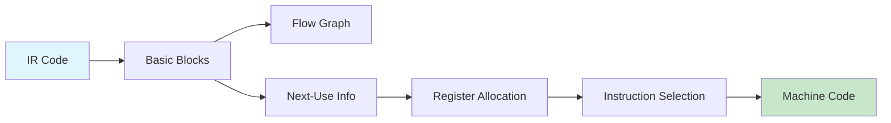

# Chapter 9: Code Generation

> **Prereq:** Chapter 8 (Runtime Environment) — the runtime model determines calling conventions and register usage.
> **Next:** Chapter 10 (Code Optimization) — generated code is refined by optimization passes.

## Learning Objectives

After completing this chapter, students will be able to: model the target machine for code generation; compute basic blocks and construct flow graphs; determine next-use information; allocate registers within basic blocks using simple algorithms and graph coloring; select instructions via tree-pattern matching with dynamic programming; and generate efficient code for common programming constructs.

### Chapter at a Glance

| Section | Key Concept | Why It Matters |
|---------|-------------|----------------|
| Target Machine Model | Registers, memory, instruction set | Defines what code can be emitted |
| Basic Blocks & Flow Graphs | Maximal single-entry sequences | Enables local optimization |
| Register Allocation | Mapping variables to limited registers | Critical for performance |
| Instruction Selection | Tree-pattern matching with DP | Automates code emission |



## Theory


### Target Machine Model

Code generation translates the intermediate representation into instructions for a specific target machine. A typical RISC model includes: a set of general-purpose registers (often 32 on MIPS, 16 on ARM), a byte-addressable memory, and an instruction set with arithmetic (add, sub, mul), load/store (ld, st), branch (beq, bne, j), and procedure call (jal) instructions. Key properties include register count, addressing modes, instruction costs, and the calling convention.

A **register** is the fastest storage tier. Registers are limited, making their allocation the most critical task. The register set is divided into caller-saved (scratch) and callee-saved (preserved) registers, as defined by the calling convention.

> **Pro Tip:** The farthest-next-use heuristic is optimal for a single basic block, but whole-procedure allocation via graph coloring is more powerful — modern compilers use coloring for procedures and heuristic allocation only as a fallback.

### Addressing Modes

Addressing modes specify how to compute the effective address of an operand. Common modes: **absolute** (a fixed address), **register direct** (the operand is in a register), **register indirect** (the register holds the address), **indexed** (base register plus constant offset), and **immediate** (a constant embedded in the instruction). Exploiting the target machine's addressing modes can significantly improve code quality.

### Basic Blocks and Flow Graphs

A **basic block** is a maximal sequence of consecutive three-address instructions with a single entry and a single exit. Leaders (block entry points) are: the first instruction of the program, any instruction that is a jump target, and any instruction following a jump or conditional jump. A **flow graph** has basic blocks as nodes and edges representing control flow. An edge B → C exists if control can pass from B's last instruction to C's first instruction.

### Next-Use Information

For register allocation within a basic block, the compiler must know whether each variable's value will be used again. The **next-use** computation scans the block backward. For instruction `x = y op z`, x has no next use (it is being defined); y and z have next use at this instruction. As the scan moves backward, next-use information for unredefined variables propagates unchanged.

### Register Allocation for Basic Blocks

A simple allocator maintains register descriptors (mapping registers to variables) and variable descriptors (mapping variables to registers or memory). When a register is needed and none are free, the **farthest-next-use heuristic** selects the value whose next use is farthest in the future. This heuristic is optimal for a single block — it minimizes the number of spills.

### Register Allocation by Graph Coloring

For whole procedures, graph coloring dominates. An **interference graph** has nodes representing live ranges and edges connecting overlapping live ranges. The graph is colored with K colors (registers) using Chaitin's algorithm (Chapter 14). Nodes that cannot be colored are spilled to memory.

### Instruction Selection by Tree Rewriting

Tree-rewriting instruction selection maps expression trees to machine instructions via pattern matching. Each tree-rewriting rule has the form `pattern → instruction {cost}`. A bottom-up dynamic programming algorithm finds the minimal-cost cover of the IR tree: for each node, it computes the minimum cost to cover that node's subtree, considering all applicable rules. After the DP pass, the instruction sequence is recovered by traversing top-down and emitting instructions.

> **One-Sentence Takeaway:** Code generation converts the IR into target instructions by partitioning into basic blocks, allocating registers (the critical bottleneck), and selecting instruction patterns via cost-guided dynamic programming.

### Generating Code for Procedure Calls

The compiler must evaluate arguments according to the calling convention, save caller-saved registers, emit the call instruction, and then move the return value. The callee prologue allocates its activation record and saves callee-saved registers. The epilogue restores registers, reclaims the frame, and returns.

## Examples

### Example 9.1: Basic Block Construction

Code without jumps:
```
(1) t1 = a + b
(2) t2 = c + d
(3) t3 = t1 + t2
(4) x = t3
```
One basic block, single-node flow graph.

### Example 9.2: Graph Coloring with K = 3

Nodes {a, b, c, d}, edges (a,b), (a,c), (b,c), (b,d). K = 3 coloring: a→R1, b→R2, c→R3, d→R2. No spill needed; the interference graph has chromatic number 3.

### Example 9.3: Instruction Selection

Expression tree for `x = a + b`. Rules: (1) `Ri = MEM(a)` → ld Ri, a (cost 2). (2) `Rk = Ri + Rj` → add Rk, Ri, Rj (cost 1). (3) `Rk = Ri + MEM(a)` → add Rk, Ri, a (cost 2). The DP algorithm selects the cheapest combination for the entire tree, favoring rule (2) if both operands are in registers.

### Concept Comparison

| Allocation Strategy | Scope | Optimality | Spill Handling | Complexity |
|-------------------|-------|------------|---------------|------------|
| Farthest-Next-Use | Basic block | Optimal (single block) | Immediate | O(n) |
| Graph Coloring | Whole procedure | Good (NP-hard approximation) | Heuristic spill | O(K×n²) |
| Linear Scan | Whole procedure | Weaker but faster | Simple interval | O(n log n) |

### Quick Reference

| Phase | Input | Output | Algorithm |
|-------|-------|--------|-----------|
| Basic Block Identification | TAC sequence | Partitioned blocks | Leader marking |
| Next-Use Analysis | Block instructions | Per-instruction usage | Backward scan |
| Register Allocation | Live ranges | Register mapping | Coloring / heuristic |
| Instruction Selection | IR tree | Assembly sequence | Bottom-up DP |

### Cross-Application Matrix

| Domain | Application | Relevance |
|--------|-------------|-----------|
| Language Design | Evaluating compiler targets | Code gen knowledge enables realistic design |
| Systems Programming | OS development, embedded firmware | Direct assembly and register awareness |
| Web Development | WebAssembly code generation | Wasm enables near-native performance |
| Tooling | JIT compilers in VMs | Modern JITs use tree-rewriting and coloring |

## Summary

Code generation maps IR to target machine instructions. Basic blocks partition code for analysis. Register allocation via graph coloring manages the most critical resource. Instruction selection via tree rewriting with DP automates pattern matching. Effective code generation balances instruction cost, register pressure, and compile time.

## Exercises

### Review Questions

1. What is a basic block and how are leaders identified?
2. Describe the next-use computation and explain why it scans backwards.
3. Explain register spilling and the farthest-next-use heuristic.
4. How does graph coloring allocate registers across a procedure?
5. Describe the role of dynamic programming in tree-rewriting instruction selection.

### Application Problems

1. Partition this code into basic blocks and draw the flow graph:
   ```
   t1 = x + y
   if t1 < z goto L1
   t2 = x - y
   goto L2
   L1: t2 = x * y
   L2: t3 = t2 + z
   ```
2. Allocate 2 registers for this block using farthest-next-use:
   ```
   t1 = a + b
   t2 = c + d
   a = t1 + t2
   t3 = e + f
   b = t3 + a
   ```
3. Build the interference graph for live ranges: a {1-5}, b {2-8}, c {3-6}, d {4-7}, e {5-9}. Can 3 colors suffice?
4. Write tree-rewriting rules for load-immediate and for addition with both register operands.

### Challenge Problem

1. Implement a code generator for a basic block that translates TAC to MIPS/RISC-V assembly. Use farthest-next-use for register allocation with spilling. Support at least add, sub, mul, load-immediate, and load/store. Demonstrate on a block with 8 variables, 4 registers, showing spills. Emit the complete assembly sequence.

### Chapter Quiz

1. What identifies a leader (basic block entry point)?
   - A) Any instruction after a jump
   - B) The first instruction, any jump target, and any instruction after a jump
   - C) Every labeled instruction
   - D) Instructions with no predecessors

2. The farthest-next-use heuristic for register allocation is:
   - A) Optimal for whole procedures
   - B) Optimal for a single basic block
   - C) A graph coloring algorithm
   - D) Used only for instruction selection

3. What algorithm drives tree-rewriting instruction selection?
   - A) Greedy matching
   - B) Top-down recursive descent
   - C) Bottom-up dynamic programming
   - D) Linear scan

<details>
<summary>Answers</summary>
1. B, 2. B, 3. C
</details>
